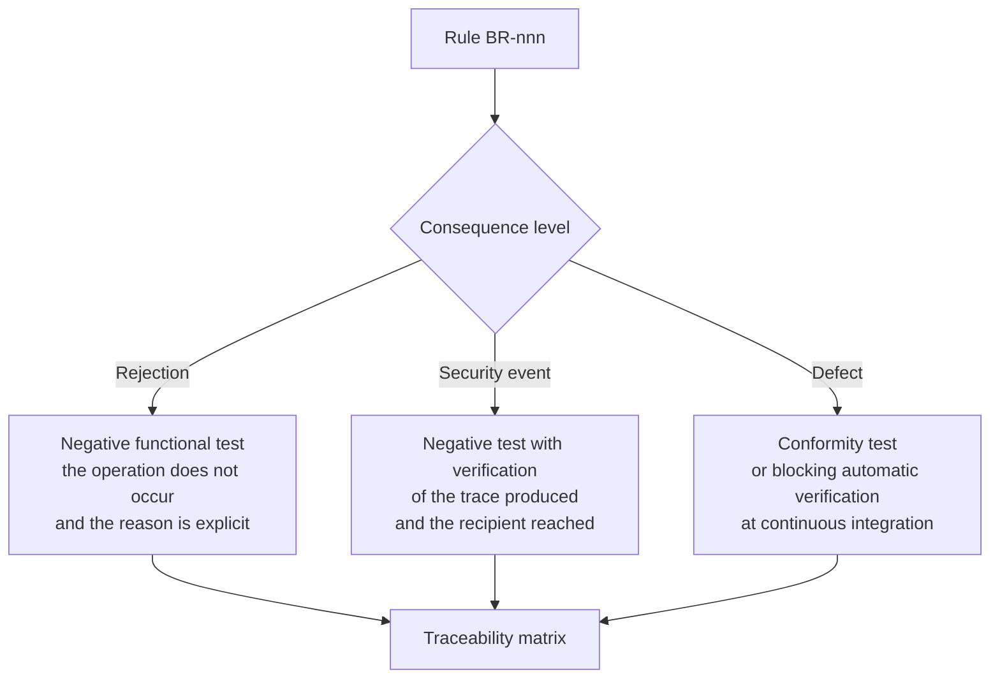

# Business rules

## 1. What a rule is, here

A requirement describes **a capability that the system must have**. A rule describes **a condition that must always hold**, regardless of the capability that puts it to the test. The difference is operational: a requirement is verified with a positive test case; a rule is verified with a **negative** test case - a test that, by violating the rule, must fail. If no such test exists, the statement is not a rule: it is an intention.

Every rule carries four elements.

**Statement.** Formulated so that the violation is observable. Formulations with "should," "as far as possible," "normally" are excluded: either the condition always holds, and then it is a rule, or it admits exceptions, and then the exceptions must be enumerated within the statement.

**Source.** Three registers, kept distinct because they have different force:

- `NORM` - derives from a regulation, a general administrative act or an agreement with binding effect. The citation is precise. Where verification on the primary source was not possible, the rule carries `[NV]` with an indication of the area from which confirmation should be sought.
- `CTX` - derives from an approved decision of the project or from an architectural constraint. It is binding internally, not normatively.
- `PROG` - is a proposal for the project's modelling: adoptable or rejectable, but not imposed by any external source. Declaring it is what distinguishes a product choice from an obligation.

**Rationale.** Why the rule exists. Without a rationale a rule is circumvented at the first deadline.

**Consequence of violation.** It is the element that this catalogue treats as mandatory and that is almost always missing. It distinguishes three levels: **rejection** (the operation does not occur); **security event** (the operation occurs but produces a trace that someone must examine); **defect** (violation is possible only through implementation error, and the negative test intercepts it).

## 2. Rules already in force

Rules `BR-001` … `BR-096` were assigned in the research phase, cover channel admissibility, authorisation, scheduling, session, reporting, communications, consent, recording, retention and multi-tenancy, and **remain in force in their entirety**. They are not rewritten here and are not renumberable. This area opens the interval `BR-100` … `BR-185`.

Two pre-existing rules must however be recalled because they are the hinges of everything that follows:

- **`BR-010`** - access to clinical data is permitted if and only if, conjointly, atomic permission, active enabling relationship, absence of holder's denials and tenant coincidence all occur. The default is to deny.
- **`BR-096`** - a tenant's configuration cannot alter the domain constraints that are codified: the configurable set is a **proper subset** of the policy space. It is the rule that prevents configurability from becoming a workaround, and is invoked by almost every rule in this document.

## 3. Care pathways and individual plans (`BR-100` … `BR-109`)

| ID | Statement | Rationale | Source | Consequence of violation |
|---|---|---|---|---|
| **BR-100** | No care pathway is represented in application code: it is data that is loaded, validated, versioned and published. No classes, constants or branches exist that name a clinical condition or a pathway phase. | Pathways vary by region and by organisation for constitutional reasons, and each variant is legitimate. Hard-coding one renders the product unusable outside the context for which it was written. | `PROG` + `CTX` | defect: automatic conformity verification fails |
| **BR-101** | Model and instance are distinct entities; the instance carries the reference to the **version** of the model, not the model itself. | Without the version reference it is impossible to reconstruct what was intended at the time of a clinical decision. | `PROG` | rejection of instance creation |
| **BR-102** | Every modification of an individual plan produces a new version with author, motivation and effective instant. No value in the plan is modifiable in place. | Without the previous versions one cannot reconstruct why an alarm did not trigger on a given date. | `PROG` + `CTX` (V-04) | rejection of modification |
| **BR-103** | Deviation of the plan from the pathway is allowed, requires motivation and is registered; it is not a validation error. | A system that prevents deviation is worked around, and with it the motivation is lost, which is the most valuable clinical information. | `PROG` | defect: validation that blocks deviation is a functional defect |
| **BR-104** | Every pathway belongs to a tenant and to an organisational domain; no pathway is global by construction. | Isolation constraint (V4), and organisational reality: no single national pathway exists. | `CTX` (V4) | rejection of publication outside scope |
| **BR-105** | An incoherent pathway is rejected at publication with a message intelligible to the author; it does not fail when a patient transits it. | The author is not a technical figure: the error must be returned to someone who can correct it when they can correct it. | `PROG` | rejection of publication |
| **BR-106** | Enrolment in a remote monitoring (telemonitoraggio) service is a documented professional act. No self-activation by the patient in any interface or through any application interface. | A service activated without a responsible professional produces data without a recipient, that is, apparent surveillance. | `NORM` `[NV]` on the precise act - to be confirmed with the compliance area - + `PROG` | rejection of the operation and security event |
| **BR-107** | Plan activation is an act with a registered instant; expectation windows start from that instant and not before. | A created but not activated plan does not generate absences; an activated plan without delivered devices generates a wave of false alarms on the first day. | `PROG` | defect: generation of absence events on inactive plans |
| **BR-108** | Conclusion of a pathway is an act with typified motivation. **No pathway extinguishes through inactivity or passage of time.** | A pathway that dies because nothing arrives is not concluded: it is abandoned, and no one knows that no one is attending to it. | `PROG` | defect: any automatic transition to conclusive state |
| **BR-109** | Conclusion always produces the final report, communication to the patient and referring clinician, and activity of retrieving assigned devices. | Administrative closure without informative return leaves the clinician without the full picture and leaves devices in circulation. | `NORM` (documentary content: DM 19 November 2025, Annex 1, § 2.27) | security event: pending documentation flagged to the service |

## 4. Measurements, time series and provenance (`BR-110` … `BR-119`)

| ID | Statement | Rationale | Source | Consequence of violation |
|---|---|---|---|---|
| **BR-110** | A measurement is never overwritten or deleted. Correction produces a new version with the previous state marked as superseded. | The clinical value lies in the trend: a system that conserves only the latest value has destroyed information while retaining the datum. And it must be known what the system evaluated when it evaluated it. | `PROG` + `CTX` (V-04) | rejection of destructive write operation |
| **BR-111** | Instant of measurement and instant of receipt are distinct mandatory fields; rules operate on the instant of measurement. | Confusing them produces wrong series and alarms generated on the wrong day. | `PROG` | rejection of acquisition |
| **BR-112** | Provenance, sensing device or subject, unit of measurement and conditions of measurement expected by the plan are **part of the measurement**, not optional metadata nor text notes. | A value without its conditions is not comparable with itself over time; a column of values without source is a structural defect. | `PROG` | rejection of acquisition |
| **BR-113** | Every measurement carries a reliability indicator, and whoever performed it must be able to declare it invalid; the declaration excludes the measurement from evaluation without removing it from history. | The causes of measurement error at home are numerous and not deducible from the value. | `PROG` | defect: absence of the declaration action |
| **BR-114** | Ingestion is idempotent on a declared identity criterion: source, subject, parameter, instant of measurement, value. A duplicate generates neither a second data point nor a second alarm. | A duplicate that generates a second identical alarm reduces confidence in the entire system. | `PROG` | defect |
| **BR-115** | Receipt of data earlier than the last evaluated triggers re-evaluation of the affected window; any alarm derived is marked as late with the age of the datum. | Order of arrival is not chronological order, and an alarm on a fact from three days ago has limited clinical value: it must be signalled as such, not hidden. | `PROG` | defect |
| **BR-116** | The technically impossible value for the instrument generates a technical alarm and does not enter the clinical series; the clinically extreme but possible value enters the series and is evaluated. | Silently filtering an anomalous value is precisely the way to lose the event that the service exists to intercept. | `PROG` | defect: any silent filtering |
| **BR-117** | No measurement is acquired without explicit unit; conversion occurs at the boundary, is declared and registered; no default unit exists. | A parameter expressed in an unexpected unit produces a wrong result without any visible error. | `PROG` | rejection of acquisition |
| **BR-118** | When a user can enter measurements for multiple subjects, the current subject is permanently visible and changing it requires explicit confirmation that names it. | Attribution to the wrong subject is a documented hazardous use scenario. | `PROG` (risk control measure) | defect |
| **BR-119** | Device technical data - battery, connectivity, self-diagnostics, calibration - have their own purpose and retention, distinct from clinical data, and do not appear in clinical views. | They are technical data: mixing them with clinical data improperly extends the protection regime and confuses their reading. | `CTX` + `NORM` (differentiated retention regimes) | defect |

## 5. Scores and scales (`BR-120` … `BR-127`)

| ID | Statement | Rationale | Source | Consequence of violation |
|---|---|---|---|---|
| **BR-120** | No score is persisted without complete calculation traceability: scale and version, value and provenance of each item, missing items and their treatment, calculation rule and version, instant, agent, interpretation rule. | It is not telemetry: it is documentation of an act, and the calculation is precisely the element that qualifies the software. | `CTX` (D26) + `PROG` | rejection of persistence |
| **BR-121** | No missing item enters the calculation as a normalcy value. If the scale does not allow imputation, the score is not calculable; if it does, the result is marked as partial and is never presented as a full score. | A missing item treated as zero produces a score that offers false reassurance built on ignorance. | `PROG` | rejection of calculation or mandatory marking |
| **BR-122** | Integer scores are calculated with integer arithmetic; units are explicit and verified at every boundary; no rounding is applied with different rules at different points. | Two different values for the same patient on the same screen destroys confidence and can change a decision. | `PROG` | defect |
| **BR-123** | The recorded score is never retrospectively recalculated. A new rule version applies to subsequent calculations. | The score is what the clinician saw when they decided; recalculating rewrites history and makes any reconstruction indefensible. | `PROG` | rejection of recalculation operation |
| **BR-124** | The interpretive bands of the score are configuration of the pathway or plan, never application constants. | They vary by local protocol with the same frequency as pathways. | `PROG` | defect: automatic verification detects constants |
| **BR-125** | The score is attributed to the person who validated it, never to the system that calculated it; until validated it is presented as a proposal and is not reportable in a signed document. | The system proposes; clinical responsibility remains with a person, and attribution must be visible. | `CTX` (V2) + `PROG` | rejection of insertion into document |
| **BR-126** | Introduction or modification of a score requires an impact assessment on classification, intended purpose and risk management, registered before acceptance of the modification. | Adding the calculation of a scale is not adding a function: it is modifying the device. | `CTX` (D26, D46) | rejection at continuous integration |
| **BR-127** | Boundary functions - alert on threshold, playback with image enhancement, assisted reporting - are not modifiable without registered regulatory impact assessment. | They are a single change away from class elevation. | `CTX` (D26) | rejection at continuous integration |

## 6. Thresholds, alarms and escalation (`BR-130` … `BR-145`)

| ID | Statement | Rationale | Source | Consequence of violation |
|---|---|---|---|---|
| **BR-130** | No clinical threshold is hard-coded in any form: constant, application configuration, schema migration, column default value, suggested value in a module. | Normality is individual; the threshold is the content of an individual signed health document written by a professional. A threshold in the code is part of a health document written by a developer. | `CTX` (V-02, D21) + `NORM` (plan content: DM 19 November 2025, Annex 1, § 2.24) | defect: blocking automatic verification at continuous integration |
| **BR-131** | No clinical threshold field is precompiled. Values suggested by the pathway are shown alongside, read-only, attributed with source and version, with an explicit copy action. | A system-proposed value is confirmed by most users, especially under time pressure: proposing a threshold is equivalent to setting it, with the added problem that responsibility appears to lie with whoever confirmed it. | `PROG` (risk control measure) | defect: automatic verification on interface and contract |
| **BR-132** | Every parameter has codified admissibility limits that do not set the threshold but prevent material error; the attempt outside limits is rejected with the range indication and is registered. | The limit does not decide the threshold; it prevents typographical error. It is not in contradiction with `BR-130`. | `PROG` | rejection of save, registration as near miss |
| **BR-133** | No alarm exists without an identifiable recipient at that moment, response deadline and escalation. An alarm lacking any of the three is not an alarm. | An alarm without escalation is a register with a sound. | `PROG` | rejection of rule configuration |
| **BR-134** | The escalation chain is finite and terminates in a **declared failure**. No automatic closure on deadline, no indefinite forwarding. | A system that closes unacknowledged alarms "on deadline" erases the only trace that no one responded. | `PROG` | defect: any transition to closed not attributed to a person |
| **BR-135** | Every delivery attempt registers channel, recipient, instant and confirmed outcome; absence of confirmation within the expected time is itself an event that triggers the next step. | Without confirmation per channel the system believes it has notified when it has not. | `PROG` | defect |
| **BR-136** | Acknowledgement and resolution are distinct transitions, both attributed to an identified person; viewing is not acknowledgement. | Viewing is a technical fact; acknowledgement is an assumption of responsibility. An acknowledged alarm never resolved is an abnormal condition that, if it coincided with closure, would be invisible. | `PROG` | defect |
| **BR-137** | Technical or clinical nature, severity and recipient are determined at alarm generation and persisted; they are not deduced at the moment of notification. | Deducing them downstream means that two different components can deduce them differently. | `NORM` (separation of service centre / delivery centre, DM 21 September 2022, Annex A) + `PROG` | defect |
| **BR-138** | An unresolved technical alarm converts to a clinical alarm of absence of surveillance after the time defined in the plan, with clinical recipient. | A device faulty for a day is a technical incident; for two weeks it is a patient not monitored whom the service believes monitored. | `PROG` | defect |
| **BR-139** | Every noise reduction technique - hysteresis, persistence, grouping, duplicate suppression, suspension, silence window - is configured by a professional, declared with the delay it introduces, traced and evaluated in the risk file. None is an application constant decided by whoever writes the code. | Every technique reduces noise by introducing a delay or a loss: it is a modification of the device's safety behaviour. | `PROG` (risk control measure) | rejection of configuration lacking delay declaration |
| **BR-140** | An alarm group inherits the **maximum severity** of the components and the deadline of the most severe alarm. Never the average, never that of the first. | A grave alarm can hide inside a group of trivial alarms. | `PROG` | defect |
| **BR-141** | Every configured escalation chain is testable offline without generating a real clinical alarm, and is tested within the stated periodicity; test events are marked and do not enter clinical statistics. | A chain never tested is, statistically, a broken chain. | `PROG` | security event: untested chain flagged to the service |
| **BR-142** | The rate of non-acknowledgement and the proportion of alarms that produce an action are **security indicators** exposed to the service leadership, not technical metrics. | The quality of an alarm engine is not measured in alarms generated but in alarms that changed an action. | `PROG` | defect: absence of exposure |
| **BR-143** | An alarm is a sequence of immutable events; the current state is a projection and not a column updated in place. | If state is updated in place, the sequence is lost and with it the only proof of what happened. | `CTX` (V-04, D42) + `PROG` | defect |
| **BR-144** | Temporary suspension of an alarm category has codified maximum duration, is attributed, motivated, reactivates automatically, and on reactivation re-presents the possibly persistent condition. | If the interface offers a way to stop the signal without assuming the alarm, that way will be used. | `PROG` | rejection of suspension lacking duration or attribution |
| **BR-145** | Introduction of a new alarm category requires demonstration that a consequent action exists, that the recipient is identified and that the overall load per recipient remains within the declared limit. | Adding an alarm is never cost-free: every new alarm subtracts attention from all the others. | `PROG` (risk control measure) | rejection at modification review phase |

## 7. Silence, adherence and volume surveillance (`BR-150` … `BR-158`)

| ID | Statement | Rationale | Source | Consequence of violation |
|---|---|---|---|---|
| **BR-150** | Every parameter in the plan has an expectation window derived from the plan; its passage without measurement generates an event that enters the alarm chain. **Silence is never treated as normality.** | Among the causes of absence is, with non-negligible probability, precisely that which the service exists to intercept. | `CTX` (V-09) + `PROG` | defect: absence of event generation |
| **BR-151** | The system distinguishes *measurement not expected* from *measurement not received*; the window derives from the coded frequency and the time band of the plan, never from a constant. | A patient whose plan provides two measurements a week is not silent on Tuesday. | `PROG` | defect: false absence events |
| **BR-152** | Noise reduction on silence acts on severity and routing, **never on the generation of the absence event**. | Suppressing the event destroys information; qualifying it conserves it. | `CTX` (V-09) | defect |
| **BR-153** | There must exist a brief action by which the patient or carer declares a scheduled unavailability; the declaration qualifies the absences of the period without suppressing them, and severity returns to normal at deadline without any action. | Every declared cause makes the residual silence more informative and reduces idle contacts. | `PROG` | defect |
| **BR-154** | Unexplained silence produces a **human contact** with recorded outcome, not a further automatic attempt; conclusion of a pathway for abandonment always requires a professional act. | The last category of causes - the person who can no longer perform the measurement - is not distinguishable by technical means. | `PROG` | defect: any automatic closure of absence alarm |
| **BR-155** | Collective silence is a platform failure until proven otherwise: surveillance of expected volume, maximum severity technical alarm, qualification of individual alarms as not evaluable, immediate communication to the clinical service. | It is the worst case: it affects everyone together, is invisible by construction and saturates the service precisely when data are missing. | `PROG` | defect: absence of aggregate surveillance |
| **BR-156** | Every measurement event, alarm event, escalation and configuration carries the tenant identifier; a write without tenant is an error, not a tolerated null value. | Extension to telemonitoring of `BR-091`. | `CTX` (V4) | rejection of write |
| **BR-157** | Clinical views prominently expose the **age of the latest datum** for each monitored parameter and the plan's scope; no view presents a picture of stability on non-recent data. | It is the mitigation of the most probable hazardous use scenario: the professional who, under time pressure, reads a picture as stable while the system knows nothing for days. | `PROG` (risk control measure) | defect |
| **BR-158** | Views of adherence directed at the patient do not use evaluative language nor punitive elements; absence is represented as a fact with the action to recover or declare. | An interface that treats the non-adherent patient as irresponsible achieves less adherence, not more. Non-adherence is the rule, not the exception. | `PROG` | defect: review of message catalogue |

## 8. Service coverage, routing and role separation (`BR-160` … `BR-168`)

| ID | Statement | Rationale | Source | Consequence of violation |
|---|---|---|---|---|
| **BR-160** | Service coverage is configured and versioned data - time bands, days, holidays, response times for severity, active recipients per band - and a plan is not activatable without declared and current coverage. | A service that promises surveillance without declaring when it exercises it is more dangerous than the absence of service, because it produces false reassurance and delays access to the correct channel. | `NORM` (service levels for regional infrastructures: DM 21 September 2022, Annex A) + `PROG` (qualification as safety requirement) | rejection of plan activation |
| **BR-161** | Current coverage state and the alternative channel are visibly persistent to patient and carer at all times, not only at enrolment, and are not concealable by personalisation configuration. | The control measure is informative and belongs to the weakest level of the hierarchy: precisely for this reason it must be made impossible not to see. | `PROG` (risk control measure) | defect: automatic verification of presence and accessibility |
| **BR-162** | The system does not formulate diagnoses, does not estimate clinical probabilities, does not autonomously assign priority codes and does not decide not to alarm based on other data. | Qualification boundary, and clinical reasoning reserved. "The saturation is normal, so the reported symptom does not count" is clinical reasoning, and moreover wrong. | `CTX` (V2, D26) + `NORM` (exclusion of triage from perimeter: Agreement State-Regions 17 December 2020, no. 215/CSR) | defect: blocking conformity verification |
| **BR-163** | Routing - answering "is this channel adequate?" - is a service property and is allowed. Evaluation - "what does this person have?" - is a reserved act and is never performed by the system. | It is the operational formulation of the qualification boundary: routing produces no new clinical information, evaluation does. | `CTX` (V2) + `NORM` | defect |
| **BR-164** | Routing texts, channels and contact details are configuration per territory and per time band; the correct channel is not always emergency. | Hard-coding a contact means routing wrongly in half the territory and half the hours. | `PROG` | rejection of plan activation if text is not configured |
| **BR-165** | Items that trigger exit from the channel are authored and marked by a clinician in the plan; the system recognises them by comparison on the marker and does not infer them from free text nor from undeclared combinations. | Recognition is comparison on a structured item; inference would be interpretation. | `CTX` (V2) + `PROG` | defect: conformity verification |
| **BR-166** | Whoever manages technical alarms does not access clinical content; whoever manages clinical alarms does not depend on the technical shift to be reached. The composition of a role that violates separation is rejected with validation error. | The separation between service centre and delivery centre is imposed and not organisational at discretion, and is reflected in the authorisation model. | `NORM` (DM 21 September 2022, Annex A) | rejection of role composition and security event |
| **BR-167** | The silence window applies exclusively to low severities, never to high ones, and is declared to the patient. | A serious condition not signalled to respect sleep is harm produced by a choice of convenience. | `PROG` | rejection of configuration |
| **BR-168** | The asynchronous messaging channel with the patient declares persistently and without closing the expected response times and that **it is not an emergency channel**; the same applies to the in-person fallback and to manual measurement entry. | Risk from wrong expectation: it is the same dynamic as poorly declared coverage. | `PROG` + `CTX` (D46, intended purpose) | defect: automatic verification of declaration presence |

## 9. Documents, payer role, integrability and process (`BR-170` … `BR-179`)

| ID | Statement | Rationale | Source | Consequence of violation |
|---|---|---|---|---|
| **BR-170** | No system functionality can mediate access by an insurance company to the electronic health record, either directly or through a professional. | The exclusion is **always** operative and also applies to experts and employers. | `NORM` (art. 15, para 4, DM 7 September 2023) | rejection of operation and security event of critical severity |
| **BR-171** | The entity financing or reimbursing the service acquires by that fact no title of access to clinical content. Title of payment and title of access are distinct objects with distinct legal bases. **The payer is not a consulting party.** | The use case at the expense of funds, mutuals and policies remains valid for **delivery**, not for consultation. Public communication must be formulated accordingly. | `NORM` + `CTX` (D48, constraint V-08) | rejection of role composition and operation |
| **BR-172** | The informative content of documents destined for the electronic record is modelled as **canonical dataset**; serialisations are interchangeable and must not be hard-coded. The documentary typologies of telemedicine are their own typologies, not reuse of pre-existing ones. | Templates and indexing metadata are not yet publicly available: hard-coding one today means re-issuing it tomorrow. | `CTX` (V-07, D30) + `NORM` (art. 7, DM 19 November 2025) `[NV]` on templates - open question to compliance area | defect: hard-coding of a template |
| **BR-173** | Access in consultation to produced documents follows the visibility matrix by professional profile; in particular the specialist report for the television consultation is not accessible in consultation to nursing and midwifery personnel nor to administrative personnel. | It is a fine authorisation rule, not deducible from general profiles, and must be implemented and tested as such. | `NORM` (DM 19 November 2025, Annex 3, § 5.2) | rejection of access and security event |
| **BR-174** | The system must be able to operate in **no-retention** mode, in which it acts as a document producer and not as archive, with conferment at the charge of the healthcare structure. | The implicit assumption that the platform is also archive does not hold in all exercise contexts. | `NORM` (arts. 4, para 4, and 12, DM 19 November 2025) | defect: functional dependence on local retention |
| **BR-175** | No system capability is reachable from the user interface alone: every capability has a documented and versioned application interface. | Integrability constraint: an integrator must be able to do everything the interface does. | `CTX` (V3) | defect: conformity test comparing interface and specification |
| **BR-176** | There exists in the product a reporting channel for events and near misses, distinct from the technical support channel, with a response time to the reporter declared and measured. | A channel from which nothing ever comes back stops being used within a few weeks; a channel confused with technical support does not receive safety reports. | `PROG` + `CTX` (surveillance process) | defect |
| **BR-177** | Near misses - blocked attempts, validation rejections, successful escalations, interrupted subject changes - are retained and analysable in aggregate form; they are not discarded because "nothing happened." | It is the only source of safety information at zero cost that the system possesses. | `PROG` | defect: absence of recording by stated category |
| **BR-178** | Requirement, rule and actor identifiers are never renumbered nor reused; substantial modification of a requirement produces a new identifier with explicit retirement of the previous one. | Traceability required by software lifecycle cannot be reconstructed afterwards. | `CTX` (D45) + `NORM` (IEC 62304 §5.1.1) | rejection at modification review |
| **BR-179** | Risk control measures follow the mandated hierarchy - inherent safety by design, protective measures, information for safety - and each is verified for **effectiveness** and examined for **new risks it introduces**. | One cannot skip to the informative level because it is the most economical; and every mitigation worsens something. | `NORM` (ISO 14971:2019) `[NV]` on precise clause reference - to be confirmed with compliance area | rejection at risk file review |

## 10. Admissibility of remote service and setting (`BR-180` … `BR-185`)

| ID | Statement | Rationale | Source | Consequence of violation |
|---|---|---|---|---|
| **BR-180** | Television consultation is deliverable for services that do not require the completeness of physical examination and in the presence of at least one of the conditions of deliverability provided; registration of the declaration precedes the act. | It is a domain precondition, not a descriptive field. | `NORM` (Agreement 215/CSR 2020; DM 30 September 2022, Annex B) | rejection of act initiation |
| **BR-181** | The outcome of executability verification is recorded on three distinct dimensions: clinical utility, clinical safety, capacity for digital interaction of the patient. | The third dimension is the one that decides whether the channel is realizable for that person, and is distinct from enrolment and consent. | `NORM` `[RECOMMENDED]` (AGENAS, Oriented model for the delivery of Television consultation, v. 1.0.25 of 16 April 2026) | security event: contact flagged as not verified |
| **BR-182** | The declaration of deliverability is attributed to the physician and is immutable; any correction is a new declaration that does not erase the previous one. | It is the act on which the appropriateness of the channel is founded, and must remain opposable. | `PROG` + `NORM` | rejection of modification |
| **BR-183** | When the remote instrument does not allow the substantial content of the service to be maintained unaltered, the service is completed or rescheduled in person **at no additional cost** to either the healthcare service or the patient, and the rescheduling event is generated and linked to the appointment. | Technical failure is not error handling: it is a functional requirement with a result obligation. | `NORM` (Agreement 215/CSR 2020; AGENAS, Oriented model v. 1.0.25) | rejection of contact closure without rescheduling event |
| **BR-184** | In specialist-to-specialist consultation (teleconsulto) the consultant's report and the referrer's document remain distinct, with distinct authors; the system does not automatically merge the two contents, and the collaborative report is conferred as an attachment to the main document with correlation to the request. | Separate professional responsibilities and expressed documentary rule. | `NORM` (DM 19 November 2025, Annex 1, § 2.21) | rejection of merged document generation |
| **BR-185** | The system does not offer television consultation pathways in contexts qualified as urgency or emergency, in no interface and through no application interface; teleconsultation and teleconsulting remain permitted but **never as surrogate of rescue activities**. | Remote service must not be a reason to delay in-person interventions. | `NORM` (DM 30 September 2022, Annex B; Agreement 215/CSR 2020) | rejection of operation and security event |

## 11. What a tenant cannot configure

The configurable set is a proper subset of the policy space (`BR-096`). The rules that follow **are not waivable by configuration from any role, including the system administrator**, and the attempt to compose a configuration that violates them is rejected with validation error:

| Scope | Non-waivable rules |
|---|---|
| Professional × service combinations prohibited by professional rules | `BR-011` |
| Access to clinical content by administrative or technical roles | `BR-012`, `BR-166`, `BR-171` |
| Session recording for services marked non-recordable | `BR-075` |
| Hard-coded or precompiled thresholds | `BR-130`, `BR-131` |
| Alarms without recipient, deadline or escalation | `BR-133` |
| Automatic closure of an unacknowledged alarm | `BR-134` |
| Suppression of absence event generation | `BR-150`, `BR-152` |
| Extinction of a pathway through inactivity | `BR-108` |
| Night silence on high severities | `BR-167` |
| Access by an insurer to the electronic record | `BR-170` |
| Television consultation pathways in urgency | `BR-185` |
| Concealment of coverage declaration and use limits | `BR-161`, `BR-168` |

## 12. How a rule is verified

For each rule there exists at least one **negative test**: a scenario that attempts the violation and must fail. The negative test is the link between the rule and the traceability matrix, and is what makes the rule demonstrable to an external evaluator.

Three practical cautions, drawn from what usually goes wrong.

**A rule verified only from the interface is not verified.** Every negative test is also executed on the application interface: most real violations come from direct calls, not from screens.

**A rule with consequence "security event" must be tested to the recipient.** Verifying that the trace exists is not enough: it must be verified that it reaches someone within the expected time and that someone can take it in hand.

**A rule that has never failed in any test is suspect.** If no scenario succeeds in violating it, verify that the test is actually exercising the path and not a dead branch: it is the most common way a high test coverage hides protection of nothing.
