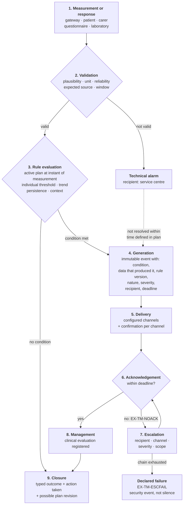
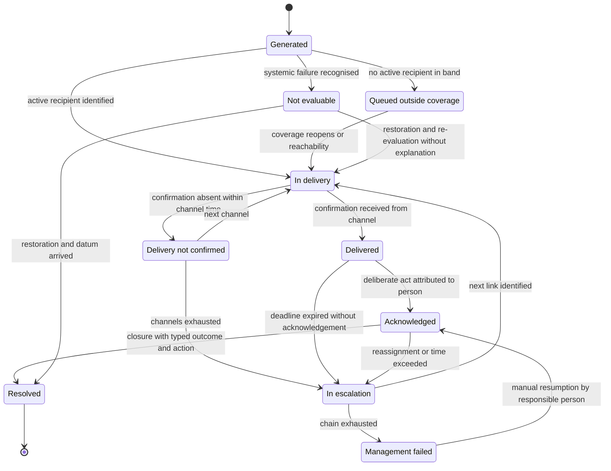

# Alarm management

## 1. The four mandatory components

A clinical alarm is a signal that communicates to a professional that a patient's condition requires attention **within a defined time**. It has four components, and the absence of any one renders it ineffective:

1. **a condition** that generates it, verifiable and reconstructible afterwards;
2. **a recipient**, identifiable *at that moment* and not in the abstract;
3. **an expected response time**, within which someone must take it in hand;
4. **a consequence in case of non-response**.

The fourth is practically absent from first implementations, and it is what distinguishes an alarm from a notification. **An alarm without escalation is not an alarm: it is a register with a sound** (`BR-133`).

The theory that justifies these choices - sensitivity and specificity, positive predictive value and dependence on prevalence, alarm fatigue as a documented mechanism of harm production - is in module
[10, § 7](../10_fondamenti/10-percorsi-di-cura-e-sicurezza.md). It is not repeated here: it is applied.

One consequence must however be recalled, because it guides every decision in this document. An alarm with high sensitivity and specificity, applied to a rare event, nevertheless has low positive predictive value: the professional who "ignores alarms" is not violating a protocol; they are responding rationally to a tool that is right only a few times in a hundred. **The responsibility for the behaviour lies with the system that generates the alarm, not with whoever receives it.** Hence the obligation to measure alarm outcomes (`RF-290`) and the configurable ceiling per recipient (`RNF-094`).

## 2. Thresholds are clinical configuration per patient

This point admits no gradations and is the operational formulation of constraint **[V-02](../11_registri/01-vincoli-in-vigore.md#v-02)**: the threshold and alert are configured by the professional, never deduced by the system.

**Four cumulative reasons.** *Clinical*: normality is individual, and the clinically useful value in chronicity is often the deviation from that person's usual value, not a population interval. *Organisational*: the threshold determines the workload of the service, and is not configurable in the abstract but only in relation to declared response capacity. *Regulatory*: the threshold is the content of the telemonitoring plan, which is an individual signed health document with informative content defined by DM 19 November 2025, Annex 1, § 2.24 - a threshold in source code is a part of a health document written by a developer. *Responsibility*: if the threshold belongs to the system, the system has decided.

**What follows, in verifiable form.**

| Requirement | Content | Verification |
|---|---|---|
| `BR-130`, `RNF-103` | no threshold value in constants, application configuration, migrations, column defaults | blocking automatic verification with versioned rules and motivated allowlist |
| `RF-240`, `RNF-104` | no threshold field precompiled in any interface | automatic test on interface and on published contract |
| `RF-241`, `BR-132` | admissibility limits coded against material error, rejection traced | negative test with out-of-limit value |
| `RF-244` | modification of a threshold produces a new plan version | interrogation of plan at an earlier date |
| `RF-243` | a plan without configured thresholds is not activatable | negative activation test |

**Why a "reasonable" default value is not a workaround.** A system-proposed value is confirmed by most users, especially under time pressure: proposing a threshold is equivalent to setting it, with the added problem that responsibility formally appears to lie with whoever confirmed it. Moreover, identifiable subpopulations exist for whom the "normal" value is clinically wrong, and one widely distributed tool explicitly anticipates an alternative scoring scale to recognise it. Finally, a default value is an unsigned clinical declaration: where does it come from, in which version, for which population? Or from nowhere.

> **The correct form.** The field starts **empty and mandatory**. The system may show alongside, read-only and clearly attributed, the values suggested by the pathway adopted by the organisation, with source and version, and offer an explicit copy action. What the system does not do is **precompile**. The difference between "showing an attributed reference" and "precompiling a field" is invisible to whoever writes the code and decisive for whoever answers for it.

## 3. Anatomy of an alarm



The dotted arrow is `RF-288`: an unresolved technical alarm converts to a clinical alarm of absence of surveillance, because the relevant fact is no longer the failure but the lack of surveillance.

**The points where real implementations break**, in order of observed frequency, and the requirement that governs each:

| # | Breakage point | What happens | Safeguard |
|---|---|---|---|
| 1 | between generation and delivery | delivery fails silently: contact no longer valid, device off, external service unavailable. System believes it has notified | `RF-276`, `RF-277` |
| 2 | between delivery and response | no deadline defined, so no way to know response has not arrived | `RF-274` |
| 3 | in acknowledgement | acknowledgement coincides with screen opening: an alarm "seen" is not an alarm assumed | `RF-278` |
| 4 | in escalation | chain points to a role not covered that hour, or back to the same recipient who has not responded | `RF-281` |
| 5 | in closure | outcome is not registered, so nothing can be measured and configuration cannot improve | `RF-289` |
| 6 | anywhere | alarm state is a column updated in place and the event sequence is lost | `RF-271`, `BR-143` |

## 4. State lifecycle

State is a **projection** of immutable events, not an attribute that is updated.



Three transitions merit attention because they are where real systems go wrong.

**`Failed` is not a terminal state.** The exhausted chain produces a declared failure, but the alarm remains open and can be resumed: closing it automatically would erase the only trace that no one responded (`RF-282`, `BR-134`).

**`NotEvaluable` is not a suppression.** During a recognised systemic failure individual absence alarms are qualified, not cancelled, and on restoration are re-evaluated (`RF-302`).

**`Acknowledged` does not lead to `Resolved` by passage of time.** An alarm acknowledged and never resolved is an abnormal condition to be detected, and if acknowledgement coincided with closure it would be invisible (`RF-279`, `RF-280`).

## 5. Technical alarm and clinical alarm

They are two distinct objects, with distinct recipients, times and consequences. The separation is not an organisational convention: it derives from the separation between service centre and delivery centre imposed for regional infrastructures, and is reflected in the authorisation model (`BR-166`, `RNF-110`).

| | **Technical alarm** | **Clinical alarm** |
|---|---|---|
| What it signals | the measurement or transmission system does not function | the patient's condition requires attention |
| Examples | device not associated, battery exhausted, connectivity absent, calibration expired, value outside technically possible range, invalid format, ingestion chain failure | value outside individual threshold, trend worsening, questionnaire response indicating deterioration, expected measurement not received |
| Recipient | service centre (`ATT-22`), technical role | delivery centre (`ATT-23`), case manager (`ATT-21`), responsible professional (`ATT-20`) |
| Access to clinical content | **none** | necessary |
| Response time | according to technical service levels | according to plan's clinical timing |
| Typical consequence | technical intervention, replacement, patient support | clinical evaluation, contact, plan modification, escalation |

**Classification is an attribute of the alarm, not a downstream inference** (`RF-272`). It is determined at generation together with severity and recipient and persisted: deducing it at notification time means two different components may deduce it differently.

**A prolonged technical alarm is a clinical problem.** The time after which conversion occurs is plan configuration, not system configuration: it depends on the monitored condition and the service's response capacity.

## 6. Delivery, confirmation and acknowledgement

**Delivery.** Every attempt registers channel, recipient, instant and outcome confirmed by the channel (`RF-276`). Absence of confirmation within the expected time **is itself an event** and triggers the next channel or escalation (`RF-277`). Without confirmation per channel the system believes it has notified when it has not: it is breakage point number one.

**Acknowledgement.** It is the act by which an identified person declares they will handle it, and has four mandatory properties:

- **it is deliberate**, distinct from viewing: viewing is a technical fact; acknowledgement is an assumption of responsibility;
- **it is attributed to a person**, not to a role, a shift or a workstation;
- **it is dated with precision**, because the elapsed time is the primary safety indicator;
- **it does not close the alarm**: acknowledgement and resolution are distinct transitions.

**Silencing is not acknowledging.** If the interface offers a way to stop the signal without assuming the alarm, that way will be used: temporary suspension has a codified maximum duration, is attributed, motivated, reactivates automatically and on reactivation **re-presents the possibly persistent condition** instead of treating it as known (`RF-287`, `BR-144`).

**Non-response.** It is not an edge case: it is one of the most frequent operating conditions and must be designed as such. The deadline is an attribute of the alarm derived from severity and plan, not a global timeout; its exceeding is itself a persisted and observable event, not a code branch.

## 7. Escalation

Escalation can move along four **orthogonal** dimensions: recipient, channel, severity, scope. Configuration is per tenant, pathway and severity, and **knows the time bands**: a recipient outside coverage is not a valid recipient.

```mermaid
sequenceDiagram
    autonumber
    participant S as System
    participant C1 as Link 1 (case manager)
    participant C2 as Link 2 (responsible professional)
    participant C3 as Link 3 (on-call service)
    participant RS as Service responsible

    S->>S: generates alarm with severity, recipient and deadline
    S->>S: verifies coverage of current time band
    S->>C1: delivery on planned channel
    C1-->>S: no delivery confirmation within channel time
    S->>C1: delivery on alternative channel
    Note over S,C1: every attempt is persisted with outcome
    C1-->>S: response deadline expired (EX-TM-NOACK)
    S->>S: identifies link 2 and verifies its coverage
    S->>C2: delivery with increased severity
    C2-->>S: deadline expired
    S->>S: link 3 not covered this time band: skipped with reason recorded
    alt Next link exists and is covered
        S->>C3: delivery to configured on-call
        C3->>S: acknowledgement attributed
    else Chain exhausted
        S->>S: generates EX-TM-ESCFAIL, declared failure of management
        S->>RS: notifies with its own severity; alarm remains open
        S->>S: the fact enters service safety indicators
    end
```

**Requirements that make escalation real and not decorative.**

1. The chain is finite and terminates in a declared way. The last link is not "retry": it is the declaration that the service failed to manage the alarm, which is valuable information (`RF-282`).
2. Every step is persisted with instant, recipient, channel, outcome and delivery outcome (`RF-283`).
3. The chain is **testable offline**: there is a way to test it without generating a real clinical alarm, the test is periodic and test events are marked and outside clinical statistics (`RF-284`, `RNF-097`). A chain never tested is, statistically, a broken chain.
4. Escalation does not depend on a single component: if the channel is unavailable, the absence of delivery is detected and handled. An escalation that breaks silently when an external service falls reproduces exactly the problem it was supposed to solve.
5. A chain pointing to a recipient who has already not responded, or to a role structurally not covered, is rejected **at definition**, not tolerated at runtime.

## 8. Noise reduction: useful and dangerous tools

Techniques that reduce noise are necessary - without them alarm fatigue is guaranteed - but each introduces a risk that must be declared and evaluated. All are configured by a professional in the plan, never application constants (`RF-285`, `BR-139`).

| Technique | What it does | Risk introduced | Requirement |
|---|---|---|---|
| **Hysteresis** - different thresholds to activate and to reset | avoids oscillation around the limit | delays reset; with poorly set thresholds delays reactivation | both thresholds configured and visible to clinician |
| **Persistence** - the condition must last N measurements or N intervals | filters spurious values | delays generation by a window duration | the introduced delay is declared, is a rule attribute and is reported alongside alarms derived from it |
| **Grouping** | reduces load on recipient | a serious alarm can hide in a group of trivial ones | the group inherits the **maximum severity** of components and the deadline of the most severe alarm (`RF-286`) |
| **Duplicate suppression** | avoids repetition of the same condition | a persisting condition stops being signalled and seems resolved | persistence remains represented in state and condition is re-presented on recipient or shift change |
| **Temporary suspension** | allows handling a known condition | the alarm does not return | codified maximum duration, attribution, motivation, automatic reactivation (`RF-287`) |
| **Silence window** | respects sleep | a serious condition is not signalled | applicable **only** to low severities, never to high, and declared to patient (`BR-167`) |

**General rule.** Every noise reduction technique is a modification of the system's safety behaviour: it must be configured by a clinician, declared, traced and evaluated in the risk file **with the delay it introduces**. And introduction of a new alarm category requires demonstration that a consequent action exists, that the recipient is identified and that overall load remains within the declared limit (`BR-145`): adding an alarm is never cost-free, because it degrades all the others.

## 9. Patient silence

**The absence of data is itself data** (constraint [V-09](../11_registri/01-vincoli-in-vigore.md#v-09)). In a telemonitoring service the failure to transmit an expected measurement is a clinical event with the same informative dignity as a measurement outside threshold: it is not a gap in the series, not a data quality problem, not a case to ignore. Among its causes there is, with non-negligible probability, **precisely that which the service exists to intercept**.

An infrastructure monitoring system, faced with an interrupted series, concludes there are no anomalies: no measurement, no exceedance, no alarm. In a clinical service this behaviour is a safety defect.

### 9.1 The taxonomy of silence, and who it routes to

| Category | Code | Who acts | Distinguishable? |
|---|---|---|---|
| Device failure or depletion | `EX-TM-DEVICE` | service centre | yes, if source reports state |
| Loss of home connectivity | `EX-TM-LINK` | service centre | yes, with periodic presence signal |
| Ingestion chain failure | `EX-TM-INGEST` | platform operator | yes, and it is mandatory: affects everyone together |
| Use error | `EX-TM-USEERR` | service centre and clinical team | in part, if failed attempts are recorded |
| Scheduled or obligatory absence | `EX-TM-DECLARED` | clinical team | only if declared: requires one-touch action |
| Absence explained by administrative event | `EX-TM-ADMIN` | clinical team | yes, by integration |
| Abandonment | `EX-TM-DROPOUT` | clinical team | by exclusion |
| Clinical deterioration | `EX-TM-UNEXPLAINED` | clinical team, **with urgency** | **no**: it is the residual category |

The last row is the point. **The residual category is not distinguishable by technical means**, so the correct strategy is **to eliminate all the others**: the more the system recognises technical and declared causes, the more the residual silence is informative. Every cause the system fails to recognise dilutes the clinical signal and produces idle contacts, which in turn generate fatigue.

### 9.2 Techniques, in order of effectiveness

1. **Periodic presence signal** independent of measurement (`RF-296`): distinguishes the technical category from all others in one stroke.
2. **Device state telemetry** (`RF-265`): battery, connectivity, self-diagnostics, calibration, acquired as technical data with their own purpose and retention.
3. **Recording of failed attempts** (`RF-266`): distinguishes use error from person's absence, and is valuable information that is almost always thrown away.
4. **One-touch unavailability declaration** (`RF-297`): moves the case from the residual category to a declared one. Must be designed as a first-class function in the patient interface, not as a hidden module.
5. **Correlation with known administrative events** (`RF-298`): a patient in hospital does not transmit because they are inpatient. It is the best example of why interoperability reduces clinical noise.
6. **Human contact** (`RF-299`): when every technical distinction is exhausted and silence remains unexplained, the only answer is to call the person. It is why a telemonitoring service requires people not just software, and must be stated clearly to whoever buys it.

**Transversal rule.** The system distinguishes *measurement not received* from *measurement not expected*: the window derives from the plan, with its coded frequency and its time band (`RF-295`).

## 10. Systemic failure

There exists a silence category whose severity exceeds all others: the **simultaneous silence of many patients** caused by a platform or ingestion chain failure. It is the worst case for three reasons: it affects everyone together, so the potential harm is multiplied; it is invisible by construction unless the system actively seeks it, because "nothing arrives" is indistinguishable from normality in a poorly designed system; and it generates, if undetected, a wave of individual alarms that saturates the service and destroys its response capacity precisely when data are missing.

The three requirements that follow are not negotiable:

1. **Surveillance of expected volume** (`RF-300`). The system knows how many measurements it expects in a window, per tenant and per source, and detects aggregate deviation. It is a platform alarm with technical recipient and maximum severity, and must trigger **before** the deadline of the first individual window of the narrowest plan in operation (`RNF-092`).
2. **Qualification, not suppression** (`RF-302`). Alarms generated in the period are not deleted: they are marked as not evaluable due to source unavailability, and are re-evaluated on restoration.
3. **Communication to the clinical service while it happens** (`RF-303`). Not just the technical team: it is the clinical service that must decide whether to activate an alternative channel for the most unstable patients, and can do so only if it knows.

## 11. Service coverage is a safety requirement

A telemonitoring service declares coverage: the time bands and days when someone exists to look at data and respond to alarms, and the times within which they respond. For someone coming from commercial software the temptation is to read it as a pricing parameter: more coverage, more cost, more value. **In a clinical service it is not, and the reason is structural.**

The moment a person is enrolled, they are told - explicitly or implicitly - that someone will watch their data. From that moment they **modify their behaviour**: they attribute to the service a surveillance function and, to a degree, stop being the sole observer of themselves. If coverage is correctly declared, they know they must turn elsewhere at night and they do so: the service has reduced risk. If it is ambiguous - or not declared at all, which is the same thing - they await a response that will not come and delay access to the correct channel: **the service has increased risk compared to a situation where it did not exist**.

It is a hazard introduced by the system, and the control measure is not technological: it is informative, belongs to the weakest level of the control hierarchy, and precisely for this reason must be written, verified with real users and made impossible not to see.

**Five design consequences, all translated into requirements.**

1. **Coverage is data**, per tenant and per pathway, with time bands, days, holidays, expected response times and active recipients per band; versioned, because it determines whether a past non-response was expected or anomalous (`RF-309`, `RNF-109`).
2. **It is visible to patient and carer at every moment**, with the **current state** not just theoretical hours, and with the alternative channel (`RF-310`, `RF-311`).
3. **The system knows its own hours and behaves accordingly.** An alarm generated outside coverage cannot be considered managed: it is queued with declared policy, marked `EX-TM-OUTOFHOURS`, and the person receives immediate instruction anyway (`RF-312`, `RF-313`).
4. **Modification of coverage is a traced act** with declared effect on the enrolled: reducing it without informing them is a security event (`RF-314`).
5. **Outside coverage does not mean the system does nothing.** It means it does not promise professional evaluation: it continues to collect, record, inform on the correct channel and make the picture available on reopening.

> **Formula to use, and not to water down.** "The service does not replace the emergency system. Outside the stated hours data are not evaluated by a professional. In case of distress contact [configured channel]." The channel is configuration per territory and per hour, and is not always emergency: there is also a channel for non-urgent care, and routing to one or the other is a service choice, not a product constant (`RF-311`, `BR-164`).

## 12. Exit from channel: route without evaluating

The system must be able to say "this is not the right channel," and must be able to say so without diagnosing.

**What it does.** It presents configured items authored by a clinician; it recognises that the response corresponds to an item **marked** as channel exit - a comparison on a structured item, not an inference; it interrupts the flow and displays a configured routing instruction with channel, contact details and urgency; it records what was shown, when, to whom and what the user did afterwards; it notifies the team according to the plan.

**What it does not do, and must not be able to do.** It does not formulate diagnostic hypotheses nor display them to the patient. It does not estimate clinical probabilities nor grade urgency with its own algorithm. It does not decide not to alarm based on other data. **It does not substitute instruction with the promise of a callback**: saying "an operator will call you back" instead of "call number X" introduces a dependency which, outside coverage or under load, translates to delay (`RF-319`).

The difference, in one line: **routing answers "is this channel adequate?", evaluation answers "what does this person have?"**. The first is a service property, and the service can know it. The second is a reserved clinical act (`BR-163`).

## 13. What is retained, and how

| Object | Persistence requirement |
|---|---|
| Threshold | versioned and immutable; every version with author, motivation, temporal effectiveness |
| Evaluation rule | versioned; the alarm registers the version that produced it |
| Alarm | sequence of immutable events; state is a projection, never a column updated |
| Data that produced the alarm | precisely referenced, not reconstructed afterwards by interval interrogation |
| Delivery | per channel, with outcome and instant of confirmation |
| Acknowledgement | identified person, instant, distinct from resolution |
| Escalation | every step with reason and outcome |
| Closure | typed outcome, action taken, possible connection to plan revision |
| Coverage configuration | versioned, because it determines whether non-response was expected |
| Cold tests of the chain | marked, with outcome per link and per channel, outside clinical statistics |

All this falls under the immutable auditability constraint (**[V-04](../11_registri/01-vincoli-in-vigore.md#v-04)**), with the caveat already registered by the project: **versioning of entities is not immutability**. Non-alterability requires a hash chain and retention separate from the system generating events.

## 14. Safety indicators

Three quantities are **safety indicators** and must be exposed to service leadership, not buried in a technical dashboard (`BR-142`):

| Indicator | Definition | Why it is safety |
|---|---|---|
| Non-response rate (`RNF-096`) | alarms not acknowledged within deadline on the total delivered, by severity and recipient | directly measures the distance between what the service promises and what it does |
| Proportion of alarms that produce action (`RNF-095`) | per rule, on typed closure outcomes | is the empirical estimate of predictive value: a rule whose alarms never produce action is consuming attention without returning safety |
| Load per recipient (`RNF-094`) | alarms delivered per recipient and per shift, compared against the configured ceiling | alarm fatigue is not discomfort: it is a mechanism of harm production |

**The product does not set numerical targets on these quantities.** Setting them would push manipulation: the simplest way to lower non-response rate is to lengthen deadlines, and the simplest way to raise the proportion of actionable alarms is to raise thresholds. The product measures, exposes and retains; the decision on how to respond belongs to the service, and review of rules is proposed to the professional responsible for the plan (`RF-290`).

## 15. Recurring errors this design excludes

1. **Treating the alarm as a notification.** A notification informs; an alarm commits someone within a time. The difference is the deadline and escalation.
2. **Deducing alarm nature at notification time.** Two components will deduce differently, and the separation between technical and clinical role will silently break.
3. **Closing unacknowledged alarms on deadline.** It erases the only trace that no one responded, and makes it impossible to measure the only indicator that counts.
4. **Treating viewing as acknowledgement.** It removes from the queue alarms that no one is attending to.
5. **Suppressing individual alarms during a failure.** It preserves the operator's calm and destroys information: qualification does both better.
6. **Configuring global night silence.** It transfers to a choice of convenience a decision that belongs to severity and plan.
7. **Treating silence as absence of anomalies.** It is the most frequent defect of telemonitoring products built by those coming from IT, and is precisely what constraint [V-09](../11_registri/01-vincoli-in-vigore.md#v-09) exists to prevent.
8. **Declaring coverage broader than actually provided.** It produces false reassurance, and false reassurance produces delay.
