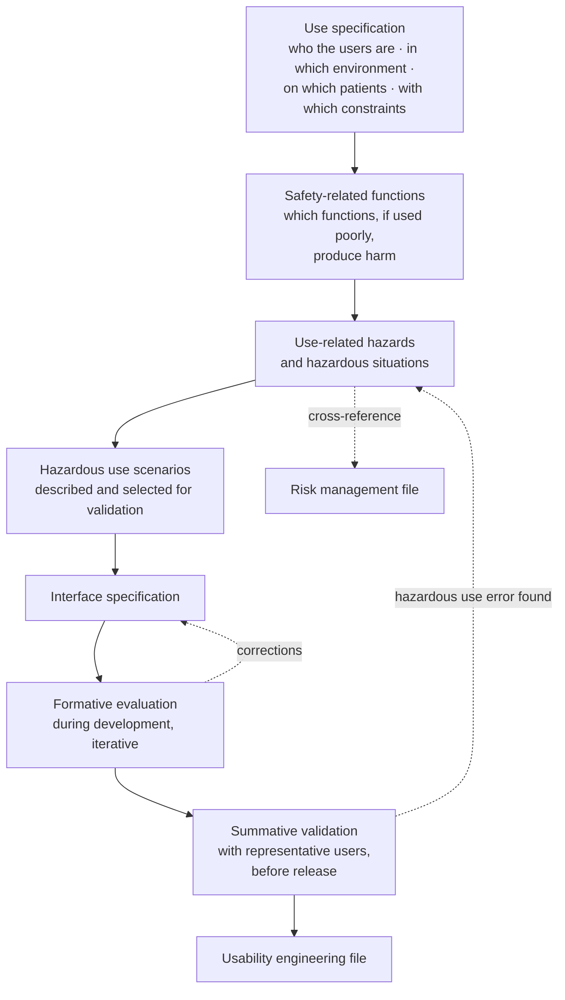

# Accessibility and usability

## 1. Why it is a requirements chapter and not intentions

Accessibility and usability are, in this project, **functional requirements of the entire system**: patient interface, clinical interface, administration panels, embeddable components, documentation, error messages, notifications. They are not a final polish but an acceptance criterion for every single screen (decision D25, constraint V6).

There are three distinct reasons, and it is useful to keep them separate because they produce different obligations.

**The first is conformity.** The level AA of international criteria and the European reference standard are applicable to services directed at citizens; for regional infrastructures the ministerial decree expressly requires the national design guidelines for public administration digital services, accessibility guidelines, national legislation on the matter and multilingual support.

**The second is safety.** In the framework of usability engineering applied to medical devices, an accessibility defect is not an aesthetic defect: it is a **condition that makes a use error possible**, and a use error is by definition a device defect that manifests through human behaviour. Conformity to accessibility criteria is therefore also a risk control measure, and as such must be documented in the usability file with cross-reference to the risk file.

**The third is service effectiveness.** The reference population of telemedicine - elderly people, with multiple chronic conditions, with low digital literacy, often assisted by a carer - **is not an edge case: it is the normal population**. A service that only works for those who already know how to use it is not a service: it is a selection.

## 2. The operational acceptance criterion

It is the criterion that decides whether a functional requirement from the catalogue is satisfied, and admits no discounts:

> **Every functional requirement must be completable by an elderly person on smartphone on mobile network, and by a professional using only keyboard and assistive reading tool. If it is not possible, the requirement is not satisfied.**

From this criterion follow two mandatory tests for every critical path, both with recorded outcome:

| Test | Executed by | On what | Outcome |
|---|---|---|---|
| **Degraded mobile test** | automated verification plus manual test | low-end device, limited mobile network, small screen, thick finger, bright light | completion of path without assistance, within stated number of actions |
| **Keyboard and assistive reading test** | structured manual verification | two assistive reading tools on two operating systems, no pointing device | completion of path, coherent reading order, no focus traps, all states announced |

**Critical paths** on which the two tests are mandatory at every release: login and authentication; technical preventive verification; waiting room and admission; session with its essential controls; collection of expressions of will; consultation and document download; **manual entry of a measurement**; **questionnaire completion**; **reading of routing instruction**; **declaration of unavailability**. The last four are introduced by this area and are the most delicate, because they are paths the patient executes **alone, every day, with no one beside them**.

## 3. Real user profiles

They are not narrative personas: they are sets of observable constraints that translate into requirements.

### 3.1 Elderly person with low digital literacy

**Constraints.** May not distinguish between browser and search engine; may not know what a system permission is; may not have a regularly consulted mailbox; has only one chance to succeed before giving up and calling; may have tremor, reduced vision or hearing not disclosed; uses a device that someone else has configured.

**Requirements that follow.**

1. **One path only, no initial choice.** The link takes you to technical verification, which takes you to the waiting room. No screen choosing between "sign in," "register," "continue as guest" before the person understands where they are.
2. **Technical verification is part of the path, not an option.** Someone who does not know they must verify will never do so.
3. **Contextual and specific instructions** for the detected browser and operating system, with the image of the actual request; never generic text (`RF-055`).
4. **The carer is provided for, not tolerated**: distinct link and written instructions for whoever assists (`RF-028`).
5. **The telephone fallback is declared in advance.** Knowing that, if it does not work, the structure will call back at a given number eliminates anxiety and total failure.
6. **No installation required.** Every installation requested is an abandonment point: the constraint to run in browser only is an accessibility choice before a technical one.
7. **Large text and commands by default.** Information density is a professional requirement, not the patient's.
8. **In measurement entry**: unit always visible, appropriate numeric keyboard, decimal separator conforming to locale, discursive confirmation on implausible values (`RF-252`, `RNF-106`).

### 3.2 Person with disability

| Type | Specific barrier | Design approach |
|---|---|---|
| **Visual** | the entire interface is visual; states - who is speaking, who has entered, connection quality, recording active - are communicated with icons | event announcements via state regions, explicit labels, coherent reading order, no information conveyed by colour alone (`RF-071`, `RNF-044` … `RNF-047`) |
| **Auditory** | the primary channel is audio | text channel always available and not hidden; sign language interpreter as **full participant**; written communication superimposed on image and screen sharing |
| **Motor** | small controls, time-sensitive actions, dragging operations | all functions from keyboard, adequate target sizes, no actions requiring temporal precision, extendable deadlines (`RNF-045`) |
| **Cognitive** | long sequences, technical terminology, decisions under pressure | reduction of steps, one action per screen on critical paths, common language, ability to re-read without losing position, no deadline losing work done (`RNF-050`, `RNF-051`) |
| **Temporary or situational** | bright light, noise, unstable network, one hand occupied | high contrast by default, audio priority, one-handed operation on mobile device |

**The least obvious point.** The session must be usable in **degraded mode as a first-class state**, not as a failure. Someone who chooses to participate without video for bandwidth, privacy or disability must not find themselves in an error path.

### 3.3 Carer assisting multiple people

**Constraints.** Often employed; reachable in narrow time bands; assists more than one person; operates from their own device, not the patient's.

**Requirements.** Subject context permanently visible and unambiguous; explicit confirmation that names the subject on change (`RF-264`); own link and instructions; ability to declare unavailability for the patient within the scope of delegation.

### 3.4 Professional under time pressure

**Constraints.** Twelve services in one morning; ninety seconds between each; shared workstation; sometimes mobile device between clinic rooms.

**Requirements.** Single queue and continuity without intermediate screens between services; clinical information already present at admission; reporting that does not block the flow; minimal mandatory actions and in the right place; quick keyboard commands; **no modal interruption during the act**.

A principle that serves as a rule on mandatory fields: every additional mandatory field must be justified, because in the real domain mandatory fields that are not necessary **are filled with false values**, degrading data quality more than their absence would. Exceptions are fields whose absence is itself a risk: declaration of deliverability, identification, outcome, individual threshold.

### 3.5 Case manager with many patients

**Constraints.** Tens of active plans; alarms arriving continuously; need to distinguish in seconds what requires action from what does not.

**Requirements.** Age of latest datum always visible and graphically highlighted (`BR-157`); immediate distinction between value alarm and absence alarm; acknowledgement as a deliberate action not a side effect of opening; load ceiling per shift with stated behaviour (`RNF-094`).

### 3.6 Front-office operator

Absorbs the failures of all the others and is the best early indicator of problems. Their main tool is a **view of the day's risks**, not a list of appointments: who has not completed technical verification, who has incomplete preliminary activities, who has unverified contacts. With no access to clinical content: they see *what is missing*, not *why the person is in care*.

## 4. Verifiable requirements

`RNF-044` … `RNF-054` remain in force. They are reported here with verification method because it is the element that makes them requirements and not intentions, and are supplemented by the three introduced by this area.

| ID | Requirement | Metric and threshold | Verification method |
|---|---|---|---|
| `RNF-044` | Level AA conformity on critical paths | zero violations of level A and AA | blocking automated verification **plus** manual audit on every critical path |
| `RNF-045` | Complete keyboard navigation | 100% of functions reachable without pointing device, coherent tab order, no focus traps | structured manual test on every critical path |
| `RNF-046` | Compatibility with assistive technologies | critical paths completable with at least two tools on two operating systems | documented manual test at every major release |
| `RNF-047` | Contrast and resizing | ratio ≥ 4.5:1 for normal text, ≥ 3:1 for large text; no loss of function with 200% enlargement | automated verification plus manual test |
| `RNF-048` | Reduction of motion | respect of system preference on 100% of transitions | automatic test with preference set |
| `RNF-049` | Text channel always available | activatable in session even without functioning audio | functional test |
| `RNF-050` | Texts directed at patient | literacy index corresponding to lower secondary education level | automatic measurement on entire interface string catalogue |
| `RNF-051` | Number of steps for entry | ≤ 3 actions from link to waiting room, with already-authorised device | path analysis plus test with users |
| `RNF-052` | First-attempt success | ≥ 90% of representative participants complete entry without assistance | documented usability test |
| `RNF-053` | Hazardous use errors | zero use errors classified as hazardous in summative evaluation; every error found generates a traced mitigation measure | summative evaluation per usability engineering standard |
| `RNF-054` | Error message comprehensibility | every message contains cause, consequence and suggested action; zero messages with technical codes only on patient-facing paths | automated verification of the three elements on message catalogue |
| `RNF-105` | Comprehensibility of routing instruction | presence of channel, contact details and urgency in every channel-exit message; literacy index as `RNF-050`; comprehension verified with users | automated verification of three elements plus user test |
| `RNF-106` | Manual measurement entry | ≥ 90% of representative participants complete on first attempt without assistance, on low-end device and limited network | documented usability test |
| `RNF-107` | Measurement entry resilience | measurement entered without connectivity is not lost; instant of measurement preserved | test with controlled network interruption |

**What "blocking" means.** Automated accessibility verification fails continuous integration. But it must be said without ambiguity: **automation intercepts a minority of accessibility defects**. Manual testing with real assistive technologies is not an optional activity done when time permits: it is the only thing that verifies what matters.

## 5. Mobile first as method, not compatibility

Design starts from the small screen and worst connection, not adapting desktop afterwards. It is not an aesthetic preference: the typical patient using remote service uses a smartphone, often on mobile network, often without assistance, and the ministerial decree explicitly mandates it for regional infrastructures along with responsive interface support.

Verifiable consequences are already in the catalogue and must be read with this chapter: weight of the initial load package for the entry path (`RNF-007`), time to first visible content and interactivity on emulated slow network and low-end device (`RNF-006`), bandwidth consumption in session with reduced-bandwidth mode (`RNF-008`), recovery time after network failure (`RNF-009`).

**Resilience is part of real accessibility**, not optimisation: scarce bandwidth, intermittent network, modest device. Degrading in an understandable way - audio before video, clear warnings, session recovery, measurement retained locally and transmitted on restoration - is what makes the service usable for those with fewest resources, that is, those with the most need.

## 6. Usability engineering

Usability engineering applied to medical devices is mandatory due to the qualification assumed by the project. Its process produces artefacts that must be produced **during** development, not reconstructed at the end.

**Two positions already taken by the project and to be remembered by whoever contributes.**

**Representative users include elderly people and people with disability**: they are not an edge case; they are the reference population. Summative validation conducted on developers and colleagues is not validation, and if validation with representative users has not been done it must **be stated that it has not been done**, not left to imply otherwise.

**Conformity to accessibility criteria is also a use error risk control measure**, not just compliance: as such it must be documented in the usability file with cross-reference to the risk file.

**Safety-related functions** identified in this area, that is, functions whose difficulty of use produces harm not just discomfort:

| Function | Feared use error | Safeguard requirement |
|---|---|---|
| Configuration of individual threshold | confirmation of a proposed value without evaluating it | `RF-240`, `RNF-104` |
| Manual measurement entry | value in unexpected unit or format | `RF-252`, `RF-256`, `RF-259` |
| Change of patient | measurement attributed to the wrong person | `RF-264` |
| Acknowledgement of alarm | alarm "seen" and not assumed | `RF-278` |
| Reading of coverage state | false reassurance | `RF-310`, `RF-320` |
| Routing instruction | instruction not seen or not understood | `RF-316`, `RNF-105` |
| Registration of identification | act omitted because perceived as formality | `RF-077` |
| Activation of session recording | recording state poorly perceived | `RF-141` |

## 7. The hierarchy of controls, applied to interface

Risk control measures have a mandated order: **(a) inherent safety by design; (b) protective measures in product or process; (c) information for safety and possible training**. One does not skip to the third level because it is most economical.

Translated into interface choices:

| Level | What it means here | Example |
|---|---|---|
| **(a) Design** | the error is not possible | the threshold field is not precompiled, so it cannot be confirmed through inertia |
| **(b) Protection** | the error is possible but intercepted | discursive confirmation on implausible value; rejection of value outside admissibility limits |
| **(c) Information** | the error remains possible and is warned | declaration of service limits and coverage |

The third level is the weakest and is used **only for what cannot be eliminated by design**. It is the case of coverage hour declaration, where the risk is by construction informative: precisely for this reason the text must be written, verified with real users and made impossible not to see (`RF-320`, `RNF-105`).

## 8. Error messages

An error message is, in this domain, a safety function. Every message directed at a user contains three elements, automatically verified on the catalogue (`RNF-054`):

1. **cause** - what happened, in common language;
2. **consequence** - what it means for the reader;
3. **action** - what to do now, with a command reachable on the same screen.

**Anti-examples excluded from the catalogue**: "connection error"; "operation not permitted"; "code 4032"; a blank screen without any command; a message that refers to support without stating the contact; a message that promises a callback instead of an operational instruction (`RF-319`).

**Cases where formulation is particularly delicate**, with the rule governing them:

| Situation | Rule |
|---|---|
| Access to waiting room outside window | indicate the correct time, never a generic error (`BR-029`) |
| Technical verification failed | specific instructions for detected browser and OS, plus alternative channel (`RF-055`) |
| Reconnection in progress | status, remaining time and available actions; never a static screen (`RF-075`) |
| Service outside coverage | current status, reopening time, alternative channel (`RF-310`) |
| Exit from channel | channel, contact details, urgency; no diagnostic hypothesis, no promise of callback (`RF-316`) |
| Absence of measurements | non-evaluative language; action to recover or declare (`RF-306`, `BR-158`) |

## 9. Declared non-conformity

The project adopts level AA in full **with a single declared non-conformity**, on the criterion for real-time captions on live audio-video content.

**Why.** A real-time transcription engine is not available in the scope of the first version and is not feasible with a component that respects the data sovereignty constraint without introducing external dependency on session content processing.

**Alternative measure.** The sign language interpreter as full participant, the text channel always available in session (`RF-100`, `RNF-049`) and written communication superimposed on image.

**What is done anyway.** The **data channel for captions is defined and versioned in the protocol from the start**, in the absence of a transcription engine: retrofitting a data channel into an already-released protocol costs much more.

**How it is declared.** The accessibility statement follows the national model and is formulated per the European reference standard, with non-conformity stated expressly and alternative measure described. A declared non-conformity is a defensible position; an undeclared one is not.

## 10. The embeddable component inherits the obligations

An integrator embedding Telemedic **must not be able to degrade its accessibility**. Requirements follow on personalisation:

1. Colour combinations that violate contrast ratios are **rejected at save**, with the minimum required ratio and a correction suggestion (`RF-178`).
2. Respect for system preferences - motion reduction, high contrast, text size - **is not disableable** by personalisation configuration.
3. Mandatory declarations - recording status, coverage status, service use limits - are not concealable or removable by personalisation (`BR-161`, `BR-168`).
4. Embedded critical paths are subject to the same two tests from § 2, with the integrator's theme applied.

## 11. Multilingual

Multilingual support is required by the decree for regional infrastructures and internationalisation architecture is set up from the start. `RNF-055` … `RNF-058` remain in force: complete coverage of interface strings and notification templates, absence of non-externalised strings verified automatically, correct local formats for dates, times, numbers and zones, addition of a language without code changes.

Two notes specific to this area. The **interface strings of the project are architecturally separate from official descriptions of clinical coding systems**, which have their own licensing regimes. And the **decimal separator** is not a formatting detail: in manual entry of a measurement it is a documented cause of use error and must be managed per locale setting with discursive confirmation on implausible values.

## 12. How it is verified: the matrix

| What | Automated | Manual | With users |
|---|---|---|---|
| Violations of level A and AA | ● blocking | ● audit per critical path | - |
| Contrast and enlargement | ● | ● | - |
| Keyboard navigation | ◐ partial | ● mandatory | - |
| Assistive technology compatibility | - | ● two tools, two systems | - |
| Reduction of motion | ● | - | - |
| Text readability | ● index | ● editorial review | ◐ |
| Presence of cause, consequence and action in messages | ● blocking | ● editorial review | - |
| Presence of channel, contact details and urgency in routing | ● blocking | ● | ● comprehension |
| Number of steps on critical paths | ● path analysis | ● | ● |
| First-attempt success | - | - | ● usability test |
| Hazardous use errors | - | ◐ analysis | ● summative validation |
| Absence of threshold precompilation | ● blocking | ● | ● formative |
| Offline entry resilience | ● test with network interrupted | ● | - |

Legend: `●` primary method, `◐` partial contribution, `-` not applicable.

## 13. Recurring errors this design excludes

1. **Treating accessibility as final verification.** What is found at the end costs ten times more, and what is structural never corrects at all.
2. **Considering automated verification sufficient.** It intercepts a minority of real defects and produces false sense of conformity.
3. **Designing for desktop and adapting to mobile.** Produces interfaces that work poorly precisely for the reference population.
4. **Confusing usability and pleasingness.** Usability here is a safety function: its measure is the completion rate without assistance and absence of hazardous use errors, not stated satisfaction.
5. **Applying professional information density criteria to the patient** and vice versa. They are two users with opposite needs, and the only correct answer is to design two distinct interfaces with the same functional core.
6. **Using warning instead of design.** It is the third level of the control hierarchy, the weakest, and is reserved for what cannot be eliminated.
7. **Declaring conformity without declaring non-conformities.** A declared non-conformity is defensible; an undeclared one is a conformity defect and a trust problem.
