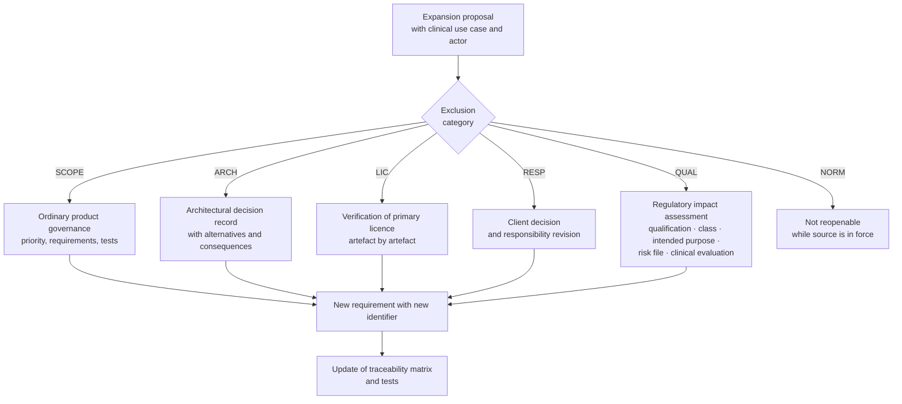
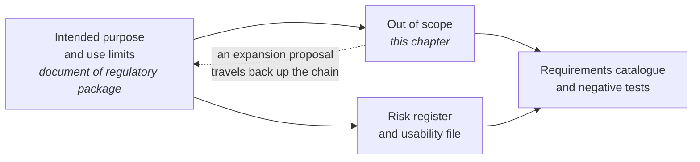

# Out of scope

## 1. Why a chapter of exclusions

In a remote healthcare system, **what the software does not do matters as much as what it does**, and for three distinct reasons.

**Qualification.** A single sentence shifts the risk classification of the product and with it months of pathway and an order of magnitude of cost: the difference between "real-time monitoring of vital parameters" and "deferred collection of parameters for professional periodic review" is not editorial. Intended purpose is the costliest document to get wrong, and this chapter is its functional counterpart: **it lists what the intended purpose excludes**, in verifiable form.

**Safety.** A service that seems to do something it does not do produces inappropriate reliance. It is the same mechanism as poorly declared coverage: harm is not caused by what the system does but by what a person does not do because they trust the system.

**Responsibility.** The repository is open-source code, not a marketed medical device, and declares itself as such. Whoever integrates, distributes or puts into service verifies the code and assumes the resulting obligations. The scope is therefore also the boundary between what the project answers for and what its users answer for.

## 2. How to read this chapter

Every exclusion has a frozen identifier `OUT-nn` and a **category**, which determines its reopenability:

| Category | Meaning | Reopenable? |
|---|---|---|
| `QUAL` | excluded because it would shift the qualification or risk class of the product | only with recorded regulatory impact assessment and formal decision |
| `RESP` | excluded because it would entail assumption of responsibility the project does not assume | only with decision of the client |
| `ARCH` | excluded because incompatible with an active architectural constraint | only with architectural decision record |
| `NORM` | excluded because prohibited or not admitted by a normative source | not reopenable while source is in force |
| `LIC` | excluded for licensing incompatibility of third-party content | reopenable if licensing regime changes |
| `SCOPE` | not in scope of the first version, but there is no prohibition | reopenable with normal product governance |

Every exclusion also reports **how it is verified**: an exclusion that cannot be verified falls back in at the first delivery under pressure.

## 3. Clinical interpretation

This is the most important group. The boundary is between a system that **transports, structures, signs and retains** clinical content authored by a professional, and a system that **generates or interprets** it.

| ID | Exclusion | Cat. | Why | Verification |
|---|---|---|---|---|
| **OUT-01** | The system does not formulate diagnostic hypotheses nor display them to the patient or professional | `QUAL` | it is the reserved clinical act par excellence, and showing it to the patient has moreover significant psychological effects | architectural conformity test that fails if a module introduces interpretive content; review of string catalogue |
| **OUT-02** | The system does not estimate clinical probabilities, does not produce prognosis and does not grade urgency with its own algorithm | `QUAL` | producing new clinical information destined for diagnostic or therapeutic decisions is what qualifies software | as above, plus `RF-083` |
| **OUT-03** | The system does not autonomously assign priority codes nor conduct calculated triage: it records the outcome decided by the professional | `QUAL` + `NORM` | telephone triage is expressly excluded from the scope of telemedicine service typologies, because routing is not delivery; and calculating priority would be interpretation | negative test: no interface and no application interface accepts a priority calculation request |
| **OUT-04** | The system does not suggest dosages, therapies or therapy modifications | `QUAL` | it is the strongest temptation in telemonitoring, and is precisely what shifts the product into a higher class | blocking modification review on every function producing prescriptive output |
| **OUT-05** | The system does not verify drug interactions and does not produce pharmacological safety warnings | `QUAL` | clinical decision support in all respects | absence of the capability in the published specification |
| **OUT-06** | The system does not apply image processing that modifies its informative content for purposes of clinical reading | `QUAL` | it is one of three functionalities that are a single change away from class elevation | verification on media path: no transformation beyond coding, resolution adaptation and stated resizing |
| **OUT-07** | The system does not generate, precompile or suggest interpretive clinical content in the document: precompiles only demographic, administrative and temporal data | `QUAL` | the document is **persistence of content authored by the professional**, not autonomous generation of clinical information | `RF-126`; test verifying which fields are populated on template opening |
| **OUT-08** | The system does not deduce, propose nor calculate individual thresholds from the patient's historical data or from population data | `QUAL` | the threshold is the content of an individual signed health document; deducing it would mean the system has decided | `RNF-103`, `RNF-104`; blocking automatic verification |
| **OUT-09** | The system does not decide not to alarm based on other clinical data | `QUAL` | "this parameter is normal so the reported symptom does not count" is clinical reasoning, and moreover wrong | negative test on rules: no suppression condition can depend on the value of a different parameter from the one evaluated |

**The positive formulation of the boundary**, serving as a design criterion: *routing answers the question "is this channel adequate?", evaluation answers "what does this person have?". The first is a service property, and the service can know it. The second is a reserved act.*

It must be stated clearly that **the exclusion does not concern automatic evaluation of thresholds**: comparison of a measurement with the individual threshold set by a professional and generation of the consequent alert **are in scope**, and it is precisely the element on which the project has assumed its qualification. What is excluded is that the system **establishes** the threshold, **deduces** it, or **interprets** the result of the comparison.

## 4. Technical scope of telemonitoring

| ID | Exclusion | Cat. | Why | Verification |
|---|---|---|---|---|
| **OUT-10** | The system does not communicate directly with home medical devices: it acquires from a third-party gateway, manual entry and questionnaires | `RESP` + `ARCH` | including device communication would extend scope to the hardware measurement chain, with consequences for qualification and verification | absence of protocol adaptors for devices in component inventory; documented ingestion contract |
| **OUT-11** | The project assumes no responsibility for the accuracy of the hardware measurement chain | `RESP` | it is the responsibility of the device manufacturer and of whoever assigns it | declaration in intended purpose and in device assignment document |
| **OUT-12** | The system is not a continuous real-time monitoring service with intervention latency of the order of minutes | `QUAL` | would shift classification and software safety class; and clinically there are conditions with minute-level latency where the adequate channel is the emergency system, not telemonitoring | intended purpose declares it; response times are those of declared coverage, not intervention times |
| **OUT-13** | The system is not an emergency channel, does not call rescue and does not automatically alert them | `QUAL` + `RESP` | it makes available to the professional the logistical information they lack because the patient is not in the same room: it is logistical support, not rescue activation | `RF-082`; persistent declaration in patient interface (`RF-320`) |
| **OUT-14** | The system does not perform automatic biometric recognition nor automatic face detection for identification or to detect third-party presence | `RESP` + `ARCH` | would change the risk profile on data and shift identification from professional decision to algorithm outcome | absence of the capability; identification is registered as an act with the method used (`RF-077`, `RF-080`) |
| **OUT-15** | The system does not implement an identity reconciliation index: it works by reference on identifiers from the source system | `ARCH` | it would become the manager of reference demographic data, in contrast with the integration model | `RF-020`, `RF-023`, `RF-026`; no automatic merging by similarity |
| **OUT-16** | The system does not automatically activate session recording in case of emergency, dispute or suspicion | `NORM` + `RESP` | prevents use of recording as a one-sided defensive tool; activation remains subordinate to consent | `BR-076`; negative test on every emergency path |
| **OUT-17** | The system does not produce data destined for research without an autonomous basis and a dedicated pathway | `SCOPE` | secondary use has its own bases, guarantees and pathways, not obtained by extending an operational export | absence of extraction functions for research purposes in the published specification |

## 5. Normative and responsibility scope

| ID | Exclusion | Cat. | Why | Verification |
|---|---|---|---|---|
| **OUT-18** | No functionality mediates access by an insurance company, a claims adjuster or an employer to the electronic health record, either directly or through a professional | `NORM` | the exclusion is **always** operative. The use case at the expense of funds, mutuals and policies remains valid for **delivery** of the service: the payer is not a consulting party | `BR-170`, `BR-171`; negative test on role composition and document access |
| **OUT-19** | The system does not offer television consultation pathways in contexts qualified as urgency or emergency | `NORM` | remote service must not be reason to delay in-person interventions; and inter-professional teleconsultation cannot surrogate rescue activities | `RF-347`, `BR-185`; negative test on interface and application interfaces |
| **OUT-20** | The project does not apply conformity marking | `RESP` | it produces and publishes the regulatory package for its own manufacturer path; constitution of the manufacturer entity, engagement of notified bodies and clinical evaluation are consequences of decision D63 of 26 August 2026, which makes marking a product requirement | declaration published and verified in every distributed artefact; verification that no marking is declared |
| **OUT-21** | Boundary functionalities - alert on threshold, image processing, assisted reporting - are not modifiable without recorded regulatory impact assessment | `QUAL` | they are a single change away from class elevation | `BR-127`; blocking verification at continuous integration on modification proposal |
| **OUT-22** | The project is not an accredited service provider with the national digital identity federation | `NORM` | the service provider is whoever delivers the service over the network, that is, whoever installs it; the project is **conformant and verifiable**, not accredited | documentary declaration; conformity proofs executed at continuous integration |
| **OUT-23** | The system does not perform records management and is not the primary clinical archive of the structure | `ARCH` + `NORM` | the model provides for an operation mode without retention of clinical content, in which the platform is document producer and conferment is at the charge of the healthcare structure; and records management is a process with its own requirements | `BR-174`; proof of operation in no-retention mode |
| **OUT-24** | The system does not distribute terminological content or assessment tools whose licence is incompatible with the project's licence, nor does it execute locally clinical decision logic imported from external sources | `LIC` + `QUAL` | the container licence does not dispose of third-party rights on the content; and execution of imported clinical logic locally constitutes clinical decision support, with effects on qualification | automated verification on distributed content with versioned allowlist; absence of a clinical logic execution engine for imported logic |

## 6. What is **not** excluded, but is often believed to be

This section exists because a misread scope does as much harm as wrong scope: one ends up not implementing things that are in scope and are necessary.

| Capability | Is it in scope | With which limit |
|---|---|---|
| Automatic threshold evaluation and alert generation | **yes**, and it is the element that founds the assumed qualification | the threshold is set by the professional, never deduced (`OUT-08`) |
| Recognition of an item marked as channel exit and routing instruction | **yes** | it is comparison on a structured item, not an inference; the text is configured, not generated (`RF-315`, `RF-316`) |
| Calculation of a score from a validated scale | **yes**, if the scale is registered with version, rule and licence | complete calculation traceability, attribution to whoever validates, impact assessment before introduction (`RF-323` … `RF-332`) |
| Detection of missing data and conversion of technical to clinical alarm | **yes** | it is detection of a fact, not clinical interpretation; constraint [V-09](../11_registri/01-vincoli-in-vigore.md#v-09) makes it mandatory |
| Presentation to professional of references indicated by the pathway | **yes** | read-only, attributed with source and version, never precompiled (`RF-240`) |
| Registration of the clinical outcome decided by the professional, including priority code | **yes** | the system records, does not calculate (`OUT-03`) |
| Own modules for reporting, scheduling and billing | **yes** | disableable and replaceable by configuration: where a regional or integrator module exists, the system integrates instead of duplicating |
| Telephone fallback | **yes**, and it is mandatory as a typed outcome | it is not the same service: channel change is recorded and reported in the document (`RF-076`, `BR-006`) |
| Asynchronous messaging with the patient | **yes**, if enabled | declares persistently the response times and that it is not an emergency channel (`BR-168`) |
| Session recording | **yes**, as an exception | disabled by default at every level, with specific consent per session, with the consequence declared that in that mode the session is not encrypted to the endpoints |

## 7. The boundary is mobile: how to ask for expansion

A scope that cannot be discussed is circumvented. There is therefore a procedure, and it is deliberately costly in proportion to the category of the exclusion.

**Three rules governing the procedure.**

1. **The proposal starts from a clinical use case with an actor**, not from a technical capability. "It would be useful to calculate a score" is not a proposal; "the case manager, to decide whether to advance a contact, needs X" is.
2. **For `QUAL` category exclusions the impact assessment precedes effort estimation.** Adding calculation of a scale is not adding a function: it is modifying the device, and the correct sequence is assessment, then decision, then planning - never the reverse.
3. **The accepted expansion produces a new identifier**, not silent modification of an existing one, and updates together requirements, rules, tests, intended purpose and risk register.

## 8. Connection to intended purpose

This chapter does not substitute the declaration of intended purpose and use limits: it **reflects it in functional form**. The relationship between the two documents is one of dependence, in a single direction:

**Operational consequences.**

- If intended purpose changes, this chapter must be re-issued, not corrected at a point.
- A functionality present in the product and not covered by intended purpose **is a conformity defect**, not an extra feature.
- An exclusion listed here and not verifiable is an exclusion that does not exist: the verification column is not documentation; it is the safeguard.
- No distributed material may leave to imply capabilities that this chapter excludes. It applies to documentation, to interface, to messages and to public communication.

> **Final notice.** The public repository is **source code**, not a marketed medical device, and is not usable for delivery of healthcare services to real people until whoever distributes it has assumed the resulting obligations. This notice is not a formula: it is the condition on which the entire scope described in this area is defensible.
