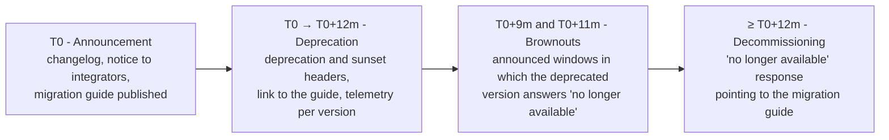

# Interoperability principles

This chapter sets out the rules that hold for every protocol in the area. The other chapters apply
them; none of them may depart from them without saying so.

## 1. The selection criteria

A protocol enters Telemedic's perimeter only if it passes **all** of the following criteria. They
are not ordered by importance: they are conjunctive.

### 1.1 It already exists and is published

You do not invent a protocol where one has been published for the same problem. This rule has a
single exception, and it is declared: the signalling protocol for real time (chapter
[09](./09-tempo-reale.md)), because the exchange of session descriptions is **deliberately left
out** of the WebRTC specifications, which standardise everything except that. Everywhere else, a
project protocol is a defect of analysis.

The corollary is less obvious and it is the one that costs: **if the standard exists but is ugly,
you use the standard**. FHIR search is more complicated than a hand-rolled REST query, the input
and output `Parameters` of FHIR operations are more verbose than a JSON body, the positional format
of HL7 v2 is unreadable. These are ergonomics costs, not correctness costs, and they are paid
because the benefit - a third-party system that already knows how to speak - is of the order of
months of work saved on every integration.

### 1.2 It is compatible with data sovereignty

The project's constraint [V1](../11_registri/03-vincoli-fondanti.md#v1) forbids a **mandatory component of the main path** from depending on a
service that is not substitutable or that is established outside the European Union. Applied to
protocols, it produces three concrete consequences.

First: no protocol on the main path may require a central service operated by a third party. It is
the reason why the media relay is self-hosted and why the WebRTC Identity Provider API - which
would require a third-party identity provider to host the proxy script - is excluded regardless of
its adoption status (chapter [09](./09-tempo-reale.md)).

Second: an external terminology service is admitted only as an **optional** component, with the
system fully functional when it is switched off. This is constraint [V-03](../11_registri/01-vincoli-in-vigore.md#v-03) on the noticeboard, and
chapter [02](./02-fhir.md) describes its exact cost.

Third: **build-time** dependencies on external registries are admitted (the packages of the FHIR
guides are resolved from a registry, not copied into the repository), but they require an internal
mirror or a continuous integration cache for build reproducibility. It is a declared cost, not a
side effect discovered later.

### 1.3 It traverses the users' real networks

A protocol that works in the lab and does not traverse a hospital trust's firewall is not
adoptable. The practical consequence is that protocols over HTTPS on port 443 and over WebSocket
upgraded from HTTPS are preferred; that the media relay also exposes a listener on TCP 443 with
TLS; that the HL7 v2 listener is never exposed on an untrusted network but wrapped in TLS or in a
tunnel.

### 1.4 The party on the other side knows how to speak it

The reference profile of the integrator is a cloud healthcare management system in the SME bracket,
with solid REST skills, partial FHIR skills and no IHE skills. A protocol that requires a project
of the partner rather than an integration must be offered in addition, never as the only road. It
is the reason why a REST application plane and a FHIR clinical plane coexist (chapters
[06](./06-api-di-progetto.md) and [02](./02-fhir.md)), and why the HL7 v2 adapter exists (chapter
[04](./04-hl7-v2.md)) even though the project was born in 2026.

### 1.5 It has defined behaviour when something goes wrong

An adopted protocol must have a published answer to: what happens if the message arrives twice, if
it does not arrive, if it arrives out of order, if the recipient is slow, if the recipient is
unreachable for a day. Where the specification has no answer - as is the case for FHIR R4
`Subscription`, which defines neither retries nor a dead-letter queue - the project answers and
**declares that the answer is its own**.

### 1.6 It is observable and diagnosable

Every exchange must produce a propagable correlation identifier and a log that lets the integrating
party reconstruct what happened without opening a ticket. The `X-Request-Id` and `X-Correlation-Id`
headers provided for by the FHIR specification (§3.1.0.16 of
`https://hl7.org/fhir/R4/http.html`) are adopted on **both** planes, not just on the FHIR one,
precisely so as to have a single correlation chain.

### 1.7 It is a reversible choice

A protocol is adopted behind an adaptation boundary, never in the heart of the domain. The domain
model does not import the types of the FHIR libraries, does not know the segments of HL7 v2, does
not know what a `Bundle` is. It is what makes it possible to add a serialisation or a version
without rewriting the clinical rules, and it is the precondition of constraint [V-07](../11_registri/01-vincoli-in-vigore.md#v-07) (canonical
dataset, substitutable serialisations).

## 2. The versions adopted, and why

The following table is **normative for the project**: it is the version the code declares, that the
documentation cites and that the tests verify. Every row carries the specification's real maturity
status, because that is the information that determines the risk.

| Specification | Pinned version | Real status | Reason for the choice |
|---|---|---|---|
| FHIR core | **4.0.1** (30 October 2019) | Mixed Normative and STU | It is the basis of the Italian telemedicine guides and of the health record. R5 is not an option: no Italian counterparty consumes it |
| HL7 Italia guides *Televisita*, *Teleconsulto*, *Teleassistenza*, *Telemonitoraggio* (remote consultation, specialist-to-specialist consultation, remote assistance, remote monitoring) | **0.2.0** | trial-use, draft | It is the existing national standard for the domain. Adopting it is more defensible than inventing our own profiles |
| HL7 Italia guide *IT-Core* | **0.2.0** | trial use, draft | Italian demographic data. Adopted **as a reference**, with a declared divergence on the URI for the tax code (§4.2) |
| Cross-version extensions R5→R4 | `hl7.fhir.uv.xver-r5.r4` **0.1.0** | STU, *maturity level 0* | The only way to express the details of the virtual service while staying in R4 |
| Subscriptions R5 Backport | **1.1.0** (11 January 2023) | STU | The topic-based model resolves the structural defects of R4 `Subscription` |
| FHIR Bulk Data Access | **3.0.0** (in force from 11 December 2025) | Trial-use | Portability and migration. 2.0.0 is superseded; the continuous build **is not material to implement against** |
| SMART App Launch | **2.2.0** (from 1 March 2023) | STU | Application launch in a clinical context; R4 base |
| SMART Web Messaging | **1.0.0** (6 May 2022) | STU 1 | Life cycle of the component embedded inside a conformant record system |
| HL7 v2 | **2.5.1** for scheduling, **2.5** for the rest | Normative | It is what Italian integration engines speak |
| HL7 v2-to-FHIR | **1.0.0** (generated 7 October 2025) | STU 1, maps **Informative** | Mapping reference. **Cannot be declared as conformance**: the maps are informative |
| IHE ITI Technical Framework | **Revision 20.2** (11 November 2025) | Final Text | Basis for ATNA and CT |
| IHE MHD | **4.2.5-comment** (16 June 2026) | *ballot*, not Final Text | Document publication. The status is declared, not hidden |
| IHE PIXm | **3.1.0** (4 November 2025) | Trial Implementation | Identifier cross-referencing |
| IHE PDQm | **3.2.0** (4 November 2025) | Trial Implementation | Demographic query |
| IHE IUA | **Revision 2.5** (18 June 2026) | Trial Implementation | Authorisation in an IHE context, over OAuth 2.1 |
| IHE BALP | **1.1.4** (31 October 2025) | Trial Implementation | Form of the audit events |
| OpenAPI | **3.1.1** | Stable | Alignment with JSON Schema 2020-12; native `webhooks` field |
| CloudEvents | **1.0** (HTTP binding **1.0.2**) | Stable | Event envelope |
| Problem Details | **RFC 9457** | Standards Track | Errors on the application plane |
| Deprecation | **RFC 9745** (March 2025) | Standards Track | Deprecation announcement. **It is an RFC**: citing it as an Internet-Draft is out of date |
| Sunset | **RFC 8594** | Standards Track | Decommissioning date |
| `Idempotency-Key` | `draft-ietf-httpapi-idempotency-key-header-07` | **expired and archived** | An industry convention. **It is not a standard and the project does not declare it as one** |
| `RateLimit` / `RateLimit-Policy` | `draft-ietf-httpapi-ratelimit-headers-11` (23 May 2026) | **active** Internet-Draft | The current two-field form. The three separate headers of the early versions are **superseded** |
| HTTP Message Signatures | **RFC 9421** (February 2024) | Standards Track | Webhook signing with non-repudiation |
| Digest Fields | **RFC 9530** | Standards Track | `Content-Digest` on the webhooks |

Three rows of this table deserve a clarification, because they are the points where a project's
documentation most often gets it wrong.

**`Idempotency-Key` is not a standard.** The Internet-Draft that defines the name is at revision
`-07` of 15 October 2025 and is shown as **expired and archived** in the IETF registry. The project
adopts the field name because it is what libraries and integrators recognise, and documents it for
what it is: **a project convention inspired by an expired Internet-Draft**. Any claim of conformance
with an IETF standard on this point would be false.

**The rate limiting headers have changed shape.** The current revision of the draft defines **two**
Structured Fields - `RateLimit` and `RateLimit-Policy` - and **replaces** the three headers
`RateLimit-Limit`, `RateLimit-Remaining`, `RateLimit-Reset` of the early versions. Citing the three
headers as «standard» is doubly wrong: they are not a standard and they are not the current form.
The project emits the current form and, for compatibility, the historical one too, declaring the
non-normative status of both (chapter [06](./06-api-di-progetto.md)).

**`Deprecation`, on the other hand, has become an RFC.** It is **RFC 9745**, Standards Track, March
2025, registered as a permanent field in the HTTP field name registry, of structured type *Item*.
The value is a Date as per §3.3.7 of RFC 9651, in the form `Deprecation: @1688169599`. The
relationship with `Sunset` is normative: the `Sunset` timestamp **MUST NOT** be earlier than the
`Deprecation` one.

## 3. The declared perimeter: what Telemedic speaks and what it does not

| Domain | Telemedic implements | Telemedic does not implement | Why |
|---|---|---|---|
| Clinical interoperability | FHIR R4 REST façade | GraphQL over FHIR | No counterparty in the domain asks for it; it would double the authorisation surface |
| Product capabilities | REST API described in OpenAPI 3.1 | Modelling product capabilities as FHIR resources | A video session, a quota or a relay key are not clinical concepts: forcing them into FHIR produces a proprietary format in disguise |
| Documents | Canonical dataset + serialisations | A hard-coded document template | Constraint [V-07](../11_registri/01-vincoli-in-vigore.md#v-07): the national templates for the new telemedicine types are not publicly available (chapter [03](./03-documenti-clinici.md)) |
| Legacy messaging | HL7 v2.5/2.5.1 over protected MLLP, in a separate module | An embedded integration engine | The typical customer already has one; embedding it would widen the regulatory perimeter |
| Document sharing | IHE MHD as a document source | IHE XDS.b as the primary interface | SOAP and ebXML are an entirely different technology stack. Anyone who requires it is reached through a gateway |
| Business-to-business identity | IHE IUA as a documentary profiling over OAuth 2.1 | IHE XUA (SAML over WS-Security) | It is needed only in pre-existing SOAP domains; it would enter the core for a hypothetical requirement |
| Dynamic federation | Nothing in v1.0 | UDAP | It is the trust mechanism of a non-European ecosystem. The client registration model does, however, remain ready for a certificate-based trust anchor |
| Longitudinal record | Nothing | openEHR | Telemedic is not the clinical record: the content flows into the system of origin |
| Imaging | Read-only proxy towards the partner's archive | Image storage | Telemedic is a vehicle, not an archive |

The last column is the part that counts. A list of what you do not do, without the reason, is a
shopping list; with the reason, it is a reusable criterion when the next request comes in.

## 4. The known divergences, declared

A project that adopts draft specifications runs into contradictions between sources. Hiding them
produces integrations that fail in production. Here they are listed; the thematic chapters deal
with them in detail.

### 4.1 The Italian guides are in draft and carry publication defects

The guides of HL7 Italia's telemedicine family are at **0.2.0**, declared *trial-use* and *draft*.
They carry verified defects that must be known before days are lost: a dependency declared with a
**floating version** instead of a number, publication fields left at the generation tool's default
values, a diagnosis code system that **does not declare the edition** represented, a value set
whose name does not match its content, a care encounter profile that **does not fix** the value of
the class while nonetheless making it mandatory, and a declared dependency on a terminology whose
licence is the deployer's responsibility. The complete list, with sources, is in the module
[«FHIR from scratch», §8.4](/10_fondamenti/06-fhir-da-zero.md); the operational consequences are
in chapter [02](./02-fhir.md).

### 4.2 Two guides from the same body use different URIs for the tax code

It is the divergence with the greatest practical impact. Verified against primary sources: the base
guide and the `Televisita` guide use `http://hl7.it/sid/codiceFiscale`; the `IT-Core` 0.2.0 guide
uses `http://hl7.it/fhir/itcore/CodeSystem/cs-codicefiscale`. In FHIR's model the `system` is what
makes an identifier unique: two identifiers with the same value and different `system` values are,
to a machine, two different identifiers. The consequences are searches that do not find,
deduplication that fails, validation that fails, and a consumer reconciling on name and date of
birth, that is to say in the worst possible way.

> **Open question [Q-06](../11_registri/02-questioni-aperte.md#q-06) - not decided in this area.**
> The choice of the URI to write, and the point at which any translation takes place, are data model
> decisions and belong to the architecture area, together with the technical area. This area
> **documents the problem, its size and the recommendation**, and hard-codes no value in its own
> normative examples.
>
> **This area's recommendation**, with its justification: since the project declares conformance
> with the `Televisita` family, the URI consistent with that declaration is
> `http://hl7.it/sid/codiceFiscale`; the projection towards the `IT-Core` URI must be carried out
> **in the adaptation layer, at the boundary with the consumer**, switchable by configuration, never
> as a silent rewrite of the internal model; both identifiers must **never** be written in the same
> resource, because that makes downstream deduplication worse rather than better. The divergence
> should moreover be reported to the body that publishes the guides.

### 4.3 The continuous build of a guide is not the guide

The continuous build of the guide on bulk data access presents a manifest that is **structurally
different** from the published one: it renames one field, adds five and removes one. Implementing
against that page produces a system that interoperates with nobody. The project's rule is:
**implement against the published, pinned version**, and consult the continuous build only to
anticipate future work.

### 4.4 Some mappings exist but are not normative

All the maps of the HL7 v2 to FHIR mapping guide - thirteen at message level and seventy-seven at
segment level - have *Informative* status. They are used as a reference, they are **not declared as
conformance**, and for errors there is no map at all: translating the v2 error segment into the
FHIR operation outcome is the implementation's responsibility, with no normative cover (chapter
[04](./04-hl7-v2.md)).

### 4.5 In FHIR R4 there is no subscription status resource

Verified: in R4 the `SubscriptionStatus` resource **does not exist**; it belongs to R4B and R5. In
the topic-based model backported onto R4 the status travels as a `Parameters` resource conforming
to a dedicated profile, with the parameter names in *kebab-case*. It is also verified that **there
is no** backport extension for the link to the topic: the topic's canonical is written **directly
in the subscription's criteria**. These are two widespread errors in the secondary literature and
must be avoided: chapter [07](./07-eventi-e-webhook.md) sets out the verified form.

### 4.6 Specification numbers not to be assigned by analogy

Three clarifications that this area applies and that contributors must respect, because they are
errors that propagate once made:

- the error format on the application plane is **RFC 9457**, which obsoleted the earlier document:
  citing the superseded number is a version error, not a stylistic one;
- **RFC 9421** defines HTTP message signatures and does **not** define the body digest field, which
  is **RFC 9530**: they are two distinct documents and must be cited distinctly;
- **server-sent events and OpenAPI are not RFCs** and have no IETF number. Attributing one to them
  is an invention. The first is defined in a web platform specification, the second is a
  specification of its foundation, and they are cited by name and version.

For the same reasons, when this area cites transport protocols it does so with the documents in
force - **RFC 9293** for TCP, **RFC 9112** for HTTP/1.1 syntax - and not with the historical
numbers that have been obsoleted. The explanation of what they are is in the module
[«The protocols, one by one»](/10_fondamenti/13-protocolli.md), which this area does not repeat.

## 5. The ten choices awaiting an architectural decision

Module 13 of the guide found that ten choices in this area are today **justified proposals** and
not formal decisions, and opened question [Q-15](../11_registri/02-questioni-aperte.md#q-15) towards this area and towards the architecture area.
This area answers for the part that falls to it: **it formulates the proposal, justifies it and
declares its cost**; the formal decision, with the corresponding architecture decision record, is
for the architecture area.

| # | Choice | This area's proposal | Justification and declared cost | Where it is detailed |
|---|---|---|---|---|
| P-01 | Where the API version lives | **Major version in the path** (`/v1`), plus an optional dated version header for additions | It is visible in the logs, in the caches and in a command-line call; the media-type alternative is formally more correct but badly handled by real proxies and clients. Cost: duplication of the paths at every major version | [06 §7](./06-api-di-progetto.md) |
| P-02 | Status code when the concurrency validator is missing on a clinical resource | **`428 Precondition Required`** on clinical writes, not silent last-writer-wins | An untracked overwrite of a clinical resource is undetectable data loss, incompatible with [V5](../11_registri/03-vincoli-fondanti.md#v5). The FHIR specification permits refusal but does not require it: it is a project choice. Cost: it breaks clients that do not send the validator | [06 §5](./06-api-di-progetto.md) |
| P-03 | Response when the resource exists but the caller is not authorised to see it | **Not found**, not forbidden, on resources referring to a patient | Distinguishing «it does not exist» from «you may not see it» is an enumeration oracle over a patient base. Cost: harder diagnosis for the integrator, mitigated by the error code in the body | [06 §6](./06-api-di-progetto.md) |
| P-04 | Retention of idempotency keys | **Twenty-four hours**, scoped to `(tenant, client, operation, key)` | It covers the longest retry cycle provided for synchronous writes without turning the log into an archive. Cost: a retry after 24 hours creates a duplicate | [06 §4](./06-api-di-progetto.md) |
| P-05 | Dual emission of the rate limiting headers | **No**: only headers in the current form are emitted | The historical form was never standard and is superseded; emitting a never-standardised form would legitimise it. Dual emission for compatibility is not adopted | [ADR-0021 §5](../adr/0021-convenzioni-delle-interfacce-pubbliche.md) |
| P-06 | Notice period for decommissioning a major version | **Twelve months**, with two scheduled brownout windows at nine and eleven months | Twelve months is the typical planning cycle of a healthcare management system; the windows surface the integrations that have not migrated while there is still time. Cost: two major versions to maintain in parallel | [06 §7](./06-api-di-progetto.md) |
| P-07 | Content of the event payload | **References, not clinical content** | Minimisation, harm reduction if a destination is misconfigured, consistency with the id-only level of the FHIR model. Cost: the recipient has to make one more authenticated call | [07 §2](./07-eventi-e-webhook.md) |
| P-08 | Webhook retry policy | **Exponential backoff with mandatory jitter**, twelve attempts over roughly seventy-two hours, then a dead-letter queue | Jitter is not decorative: without it, a recipient coming back up produces a synchronised burst that is an involuntary attack on the partner. Cost: high delivery latency in the worst cases | [07 §5](./07-eventi-e-webhook.md) |
| P-09 | Versioning of the event type | **Major version in the type name**, with a versioned schema referenced in the envelope | A consumer must be able to keep receiving the old shape while migrating. Cost: two shapes of the same event being emitted during the transition | [07 §3](./07-eventi-e-webhook.md) |
| P-10 | Token introspection on high-impact operations | **Yes**, on operations that start a session, publish a document or export in bulk; local validation elsewhere | A locally verified token stays valid until expiry even after revocation: on irreversible operations that window is not acceptable. Cost: one more network call on the hot path of those operations | [08 §6](./08-identita-e-autorizzazione.md) |

None of these proposals is presented in the other chapters as conformance with a standard. Where it
appears, it is marked as a **project choice**.

## 6. Evolution and deprecation policy

### 6.1 Version pinning and scheduled re-checking

Every external specification is **pinned to an exact version** in a single configuration point,
never inferred from a range and never left to a moving reference. The project has verified that at
least one package of the Italian guides declares a dependency with a moving reference: that
reference is replaced with a number and the replacement is documented.

Re-checking is **scheduled, not reactive**: the revisions of the IHE profiles and of the HL7 Italia
guides change more than once a year. The project performs a complete re-check of the specification
inventory before every major release and in any case at least every six months, and records the
outcome. The re-check verifies four things: whether the pinned version is still the published one;
whether the maturity status has changed; whether errata have been published; whether a licensing
dependency has changed.

### 6.2 What is covered by the stability guarantee

These are public contract, and therefore subject to the deprecation policy:

- paths, methods, parameters and schemas documented in the API descriptor for the current major
  version;
- the public event types and the schema of their content;
- the published FHIR profiles and the capability statement;
- the documented authorisation scopes;
- the codes of the error catalogue, on both planes;
- the interfaces of the extension module;
- the message protocol between host document and embedded component, and the documented styling
  properties.

These are **not** public contract, and must be declared as such because otherwise they are assumed
to be: endpoints marked experimental or served under a preview path; undocumented headers; the
order of the elements in unordered lists; the internal format of opaque identifiers, including
pagination cursors and tokens; human-readable text in error bodies; internal and administrative
endpoints.

### 6.3 What is not a breaking change

The following list belongs in the documentation addressed to the integrator with an explicit
instruction, because without it every addition breaks somebody: **your client must ignore unknown
fields and unknown enumeration values**.

These are not breaking changes: adding an optional field to a response; adding an endpoint; adding
a value to an enumeration declared extensible; adding an event type; relaxing a validation
constraint.

### 6.4 The decommissioning process

Additional rules: at least **two major versions active** at the same time; no decommissioning
without having contacted the integrators still active on that version - usage telemetry per version
exists for exactly this purpose; the deprecation of an **authorisation scope** or of an **event
type** follows the same process as the deprecation of a version; a security vulnerability may
shorten the periods, but the emergency path is documented in advance, with a declared minimum
window, not improvised.

The technical form of the headers is in chapter [06 §7](./06-api-di-progetto.md).

## 7. What is guaranteed to integrating parties

This section is the area's contractual summary. The guarantees are verifiable assertions and are
worded so that they can be proved or disproved.

**Guarantees of form.** Every public interface has a machine-readable, downloadable contract: the
API descriptor for the REST plane, the capability statement and the profiles for the FHIR plane,
the event schemas for the notifications. The contracts are generated and verified in the build
chain, not written by hand and left out of step.

**Guarantees of stability.** No breaking change without the process in §6.4. At least two major
versions active. The behaviour in the face of unknown fields and values is documented.

**Guarantees of correlation.** Every request and every delivery carries a propagable identifier, and
the integrator can find out for themselves what was delivered and with what outcome, without
opening a ticket.

**Guarantees of delivery.** Event delivery is **at least once**, with deduplication the recipient's
responsibility on a declared key. It is not exactly once and it will not be.

**Guarantees of clinical correctness.** What the project emits as clinical content is **content
drafted by a professional**, never generated by the system. This is constraint [V2](../11_registri/03-vincoli-fondanti.md#v2), and it is a
statement about the regulatory perimeter before it is one about a protocol.

**Non-guarantees, declared.** Global ordering of events is not guaranteed: only ordering per key,
and only where ordered mode is switched on. Instant revocation of a locally verified token is not
guaranteed: there is a window equal to the token's remaining life, mitigated by short lifetimes and
by introspection on high-impact operations. Terminology validation is not guaranteed for the
bindings that depend on a terminology whose licence the project cannot take on: the exact cost is
declared in chapter [02](./02-fhir.md). Conformance with a guide in draft status is not guaranteed
beyond the pinned version: if the guide changes, the project changes, through the process in §6.4.
