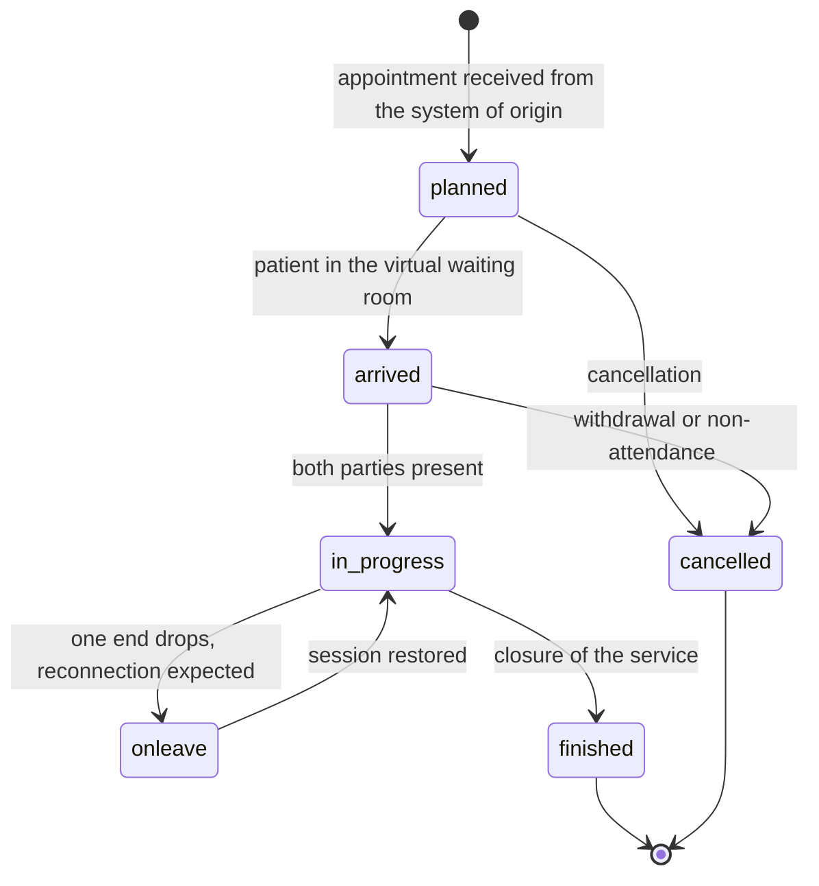

# FHIR

What FHIR is, how a resource is built, what profiling means and how to read a terminology binding
is explained in [«FHIR from scratch»](../10_fondamenti/06-fhir-da-zero.md). This chapter takes
that module as read and describes **how Telemedic exposes FHIR**: which versions, which profiles,
which interactions, with what guarantees and with what declared limits.

## 1. The conformance declaration

Telemedic declares **FHIR 4.0.1**, not «FHIR R4». The distinction is not pedantry: the technical
correction of 30 October 2019 changed invariants and generated conformance resources relative to
4.0.0, and validators behave accordingly. The number appears in three places that must be
consistent with one another and verified in continuous integration: the `fhirVersion` property of
the capability statement, the media type parameter, and the public documentation.

The version is expressed in content negotiation as a media type parameter, per §3.1.0.1.10 of
`https://hl7.org/fhir/R4/http.html`:

```http
GET /fhir/Encounter/enc-0f1a2b HTTP/1.1
Host: telemedic.example
Accept: application/fhir+json; fhirVersion=4.0
Authorization: Bearer <opaque token>
X-Request-Id: 01J9ZC7Y4Q7K9V0R2M4T8N1B3D
```

The permitted values for that parameter are `0.0`, `1.0`, `3.0`, `4.0`. Telemedic accepts only
`4.0` and answers `406 Not Acceptable` to a request that asks for another, instead of silently
serving a version other than the one requested.

The base path is `/fhir`. It is distinct from the path of the project API, which is `/v1` and has
its own grammar, contract and errors: the split between the two planes and the criterion for
deciding where a concept lives are in chapter [06 §1](./06-api-di-progetto.md).

## 2. The guides adopted, with a pinned version

| Guide | Package | Pinned version | Status declared by the guide | Role in Telemedic |
|---|---|---|---|---|
| *Televisita* | HL7 Italia guide | **0.2.0** | trial-use, draft as at 17 September 2025 | Default profile for the service and for the report |
| *Teleconsulto* | HL7 Italia guide | **0.2.0** | trial-use | Consultation between professionals |
| *Teleassistenza* | HL7 Italia guide | **0.2.0** | trial-use | Remote assistance service |
| *Telemonitoraggio* | HL7 Italia guide | **0.2.0** | trial-use | Measurement plans and vital signs |
| *IT-Core* | HL7 Italia guide | **0.2.0** | trial use, draft as at 30 July 2026 | Italian demographic data, **with the divergence in §9.3** |
| *Subscriptions R5 Backport* | `hl7.fhir.uv.subscriptions-backport` | **1.1.0** (11 January 2023) | STU | Topic-based notifications on R4 |
| *Extensions for Using Data Elements from FHIR R5 in FHIR R4* | `hl7.fhir.uv.xver-r5.r4` | **0.1.0** | STU, *maturity level 0* | Virtual service details |
| *FHIR Bulk Data Access (Flat FHIR)* | `hl7.fhir.uv.bulkdata` | **3.0.0** | Trial-use, in force from 11 December 2025 | Portability and tenant exit |
| *HL7 Version 2 to FHIR* | `hl7.fhir.uv.v2mappings` | **1.0.0** | STU 1, maps **Informative** | Mapping reference, not conformance |

**Package resolution rule.** The guide packages are **not copied into the repository**. They are
declared as dependencies in the build configuration and resolved from a registry. The reason is one
of licensing: the licence declaration of the *Televisita* guide sits alongside publication fields
left at the generation tool's default values, and **is therefore not attributable to an identified
party**; moreover the guides include third-party content, and a declaration affixed to the
container does not dispose of others' rights. The cost of this choice is declared: the build
requires network access to a registry, and reproducibility requires an internal mirror or a
continuous integration cache.

**Pinning rule.** Every version is an exact number. The *Televisita* package declares a dependency
on the Italian terminology package with a moving reference instead of a number: the project
replaces it with the version resolved at pinning time and documents the replacement. For a system
under configuration control a moving reference is not an annoyance, it is a defect.

## 3. The profiles adopted and the resources exposed

### 3.1 What Telemedic exposes

| Resource | Declared profile | Interactions | Role |
|---|---|---|---|
| `Encounter` | `EncounterTelevisita` (0.2.0) | read, vread, history, search, create, update | The service as a clinical act |
| `Appointment` | `AppointmentTelevisita` (0.2.0) | read, search, conditional create, update | Appointment, **received** from the system of origin |
| `Patient` | profile of the adopted family | read, search | Minimal projection. Telemedic **is not** the master patient index |
| `Practitioner` | `PractitionerTelevisita` | read, search | Person and qualifications |
| `PractitionerRole` | `PractitionerRoleTelevisita` | read, search | **This** is what is referenced in the services |
| `Organization` | `OrganizationT1`/`T2`/`T3` | read, search | Providing organisation, site, operating unit |
| `RelatedPerson` | base | read, search | Carer, parent, guardian |
| `Composition` | `CompositionRefertoTelevisita` | read, vread, search, create, `$document` | The report (chapter [03](./03-documenti-clinici.md)) |
| `Bundle` | `BundleRefertodiTelevisita` | read, search | The assembled and immutable document |
| `DocumentReference` | base + project constraints | read, search, create | Indexing of the document and of the recording |
| `DiagnosticReport` | base | **read, search only** | Compatibility view, never the primary artefact |
| `Observation` | `ObservationTelevisita`, `ObservationTelevisitaNarrative` | read, search, create | Structured and narrative clinical content |
| `Condition` | base | read, search, create | Diagnoses and problems |
| `Consent` | base | read, search, create, update | Consents with temporal validity |
| `AuditEvent` | IHE BALP 1.1.4 schemas | **read, search only** | Interoperable form of the audit trail |
| `Provenance` | base | read, search | Chain of custody of the clinical content |
| `Subscription` | `backport-subscription` (1.1.0) | read, search, create, update, delete, `$status` | Topic-based notifications (chapter [07](./07-eventi-e-webhook.md)) |
| `Endpoint`, `HealthcareService` | base | read, search | Publication of the service in a directory |
| `Task` | base | read, search, create, update | Asynchronous orchestration towards third-party systems |
| `Communication` | base | read, search, create | Session messages and notifications to the patient |

Three rows of this table are decisions, not descriptions.

**The report is a `Composition`, not a `DiagnosticReport`.** The Italian guide models the
televisita report as `CompositionRefertoTelevisita` inside a document-type `Bundle`, and constraint
V2 requires that what Telemedic persists be content drafted by the professional, not information
generated by the system. `DiagnosticReport` remains exposed **read-only** as a compatibility
projection for integrators who can only consume that, with the narrative part populated from the
text drafted by the doctor and the signed attachment in the dedicated field. It is never the
primary representation and it is not writable.

**The professional is referenced through their role.** In a multi-tenant context it is the
relationship «professional X, at organisation Y, with specialty Z» that is pertinent, not the
person in the abstract. The specification explicitly distinguishes the two concepts:
`Practitioner` carries the person and their qualifications, `PractitionerRole` documents the
locations and service types the professional can provide for an organisation. Referencing
`Practitioner` where the role is needed is the error that makes the resource unattributable to the
tenant.

**The audit trail is exposed read-only.** An `AuditEvent` writable by a client is a forgeable log.
The source of the audit events is internal; the API exposes them for consultation and export,
never for writing. The immutable audit trail in the proper sense — hash chain and separate
retention — is a different thing from the FHIR resource and is not replaced by it: that is
constraint V-04, and it belongs to the security area.

### 3.2 The encounter class

The Italian profile makes the encounter class mandatory, binds it extensibly to the encounter class
value set, and **fixes no value for it**. The fact is verified: cardinality `1..1`, *extensible*
binding, no fixed value and no pattern.

Telemedic populates the class with the virtual mode code from the code system
`http://terminology.hl7.org/CodeSystem/v3-ActCode`, whose definition is *«A patient encounter where
the patient and the practitioner(s) are not in the same physical location»*. It is the only code in
the value set that denotes the non-co-present mode, so the choice is conformant and defensible —
**but it is a project decision, not a prescription of the guide**, and it must be formalised as an
architecture decision record. The question should moreover be put to the body that publishes the
guide.

There is a limit to the definition that must be understood: it is deliberately broad and covers
asynchronous modes too, including the exchange of messages. **The class on its own does not say
«real-time video call».** Further qualification is the job of the extension described in §4.

### 3.3 The participant and the subject

`Encounter.participant.individual` **cannot reference the patient**: the only targets permitted in
R4 are the professional, their role and the related person. The patient is the subject of the
encounter. Modelling them as a participant is a conformance error that validators flag, and it is
the first error made by anyone coming to FHIR from a relational model.

The participation codes used by Telemedic, all verified as present in the expansion of the
reference value set, which contains twelve concepts:

| Code | Verified display | Use in Telemedic |
|---|---|---|
| `PPRF` | `primary performer` | The professional providing the service |
| `SPRF` | `secondary performer` | A second professional present |
| `CON` | `consultant` | The consultant in a teleconsulto |
| `REF` | `referrer` | The referring professional |
| `ATND` | `attender` | The professional responsible for the episode of care |

No extension of the binding is needed: the codes are all in the value set provided for.

### 3.4 The trajectory of the encounter

There are nine encounter statuses and the binding is required. The trajectory of the service is
persisted in `Encounter.statusHistory`, which carries a mandatory status and time period. This is
the **interoperable** representation of the trajectory and sits alongside — without replacing them
— the internal entity versioning and the immutable audit trail, which answer different questions.



The diagram describes the service, **not** the media session. They are distinct aggregates by
constraint V-01: a service may take place without media, with several sessions or with failed
sessions; a media session may exist for a technical test with no service at all. The session's life
cycle is in chapter [09](./09-tempo-reale.md) and lives on the application plane, not on the FHIR
one.

## 4. The virtual service: how you say «this is a televisita» while staying in R4

R4 offers **a single semantic element** for the virtual mode, and it is the encounter class. There
is no element in R4 for the address of the virtual session, no distinction between synchronous and
asynchronous, no code for the channel type. R5 fills the gap by introducing a dedicated element
with a data type of its own, but R5 is not an option for this project.

The solution adopted is the **cross-version extension** published by HL7, which exposes that R5
data type as an extension usable in an R4 context. The canonical verified against the published
definition is:

```
http://hl7.org/fhir/5.0/StructureDefinition/extension-Encounter.virtualService
```

and the equivalent for the appointment is
`http://hl7.org/fhir/5.0/StructureDefinition/extension-Appointment.virtualService`.

> **Warning about the form of the URL.** The guide's page also documents a different form, built on
> the guide's own canonical. The value **actually present in the `url` element of the published
> definition** is the one given above, and it is the one to write in instances. Writing the other
> form produces an extension that no validator resolves.

The sub-extensions defined, verified one by one:

| Sub-extension | Card. | Type | Note |
|---|---|---|---|
| `_datatype` | **1..1** | `string` | Fixed value `VirtualServiceDetail`. **Mandatory marker**: an instance that omits it is not valid |
| `channelType` | 0..1 | `Coding` | Channel type |
| `address` | 0..1 | complex | Complex extension over an extended contact type, with sub-extensions of its own |
| `additionalInfo` | 0..* | `url` | Address of alternative connection details |
| `maxParticipants` | 0..1 | `positiveInt` | Maximum number of participants |
| `sessionKey` | 0..1 | `string` | Session key required by the service |

**The binding of the channel type has *Example* strength, not *required*.** This is a verified fact
and it substantially changes the assessment: there is no obligation whatsoever to conform to the
codes of the reference value set, of which there are **three** and whose identifiers correspond to
the names of third-party commercial videoconferencing platforms. That value set is moreover marked
experimental, immutable and draft, with the explicit warning that it is not ready for production
use, and it contains an established editorial error: the definition of one of the three codes
carries a text about pricing, evidently imported from another code system.

The project rule follows: **Telemedic uses its own code system for the channel type**, with no need
for any terminology harmonisation process, and declares it.

Example instance, with synthetic data:

```json
{
  "resourceType": "Encounter",
  "id": "enc-3c8f1a20",
  "meta": {
    "profile": ["http://hl7.it/fhir/televisita/StructureDefinition/EncounterTelevisita"]
  },
  "extension": [
    {
      "url": "http://hl7.org/fhir/5.0/StructureDefinition/extension-Encounter.virtualService",
      "extension": [
        { "url": "_datatype", "valueString": "VirtualServiceDetail" },
        {
          "url": "channelType",
          "valueCoding": {
            "system": "https://telemedic.example/CodeSystem/virtual-service-channel",
            "code": "webrtc-p2p-sas",
            "display": "Peer-to-peer WebRTC with session verification"
          }
        },
        { "url": "maxParticipants", "valuePositiveInt": 3 }
      ]
    }
  ],
  "status": "planned",
  "class": {
    "system": "http://terminology.hl7.org/CodeSystem/v3-ActCode",
    "code": "VR",
    "display": "virtual"
  },
  "subject": { "reference": "Patient/pat-9d2e" },
  "appointment": [{ "reference": "Appointment/apt-51b7" }]
}
```

> **`[NV]` — exact form of the address sub-extension.** The published definition exposes `address`
> as a **complex extension** over an extended contact type, not as a simple value. The precise form
> of its sub-extensions has not been verified element by element. Before writing an address into
> that sub-extension, the package must be resolved at the pinned version and the instance
> validated. **To be asked of**: whoever implements the FHIR adaptation layer, with verification in
> continuous integration against the pinned package.

**Two security rules on this extension, non-negotiable.** The session key and the room address are
**access credentials to a clinical session**, not metadata. Persisting them in the clear in a
searchable resource, which a client can extract with a search and with the inclusion of linked
resources, is a credential leak. Telemedic **does not populate** either the session key or the
address in the persisted resource: the extension carries the channel type and the maximum number of
participants, which are metadata; the credentials for accessing the room are obtained with an
authenticated call to the application plane, are single-use and have a very short life (chapter
[09](./09-tempo-reale.md)).

## 5. The searches supported

### 5.1 The rule that changes the default behaviour

The specification says that servers **SHOULD** ignore unknown or unsupported search parameters,
unless the client explicitly asks for strict handling. Telemedic **departs from this
recommendation, deliberately and in a declared way**: the default behaviour is **strict handling**,
and an unrecognised parameter produces an error instead of being ignored.

The justification is clinical safety, not purism. A client that sends a wrong filter — for example
a misspelled tenant restriction parameter — would silently receive **more data than expected**. In
a multi-tenant healthcare system this is a disclosure incident, not an annoyance. The cost is that
a client that sends a superfluous parameter receives an error instead of a response: it is an
acceptable cost and must be documented to the integrator.

The deviation is tracked as such. A client that wants the behaviour recommended by the
specification may ask for it explicitly with the lenient handling header, but the request is
recorded in the audit trail.

### 5.2 The parameters exposed

The parameters common to all resources are supported (`_id`, `_lastUpdated`, `_tag`, `_profile`,
`_security`, `_has`), the result parameters (`_sort`, `_count`, `_total`, `_include`,
`_revinclude`, `_summary`, `_elements`) and, for each resource, the specific parameters declared in
the capability statement. Three common parameters are **not** exposed and the reason is declared:
`_text`, `_content` and `_query`, because free-text search over clinical content is an enumeration
and exfiltration surface that no use case of the project requires.

The modifiers supported per parameter type are those of the specification; for token-type
parameters `:not`, `:in`, `:not-in`, `:of-type` and `:text` are active, while `:above` and `:below`
are active **only** on the code systems for which the terminology service is configured and
enabled. With the terminology service switched off, those modifiers respond with an explicit error
instead of silently returning a partial result: an incomplete result presented as complete is worse
than an error.

Realistic search examples, with synthetic data:

```http
# The finished virtual services of a patient over an interval, with the appointment
# and the professional's role included in the response
GET /fhir/Encounter?subject=Patient/pat-9d2e&class=VR&status=finished
    &date=ge2026-09-01&date=le2026-09-30
    &_include=Encounter:appointment&_include=Encounter:participant
    &_sort=-date&_count=25 HTTP/1.1
Accept: application/fhir+json; fhirVersion=4.0
```

```http
# Resolution of a patient by external identifier of the system of origin
GET /fhir/Patient?identifier=https%3A%2F%2Fgestionale.integratore.example%2Fsid%2Fpaziente%7CPZ-4471 HTTP/1.1
Accept: application/fhir+json; fhirVersion=4.0
```

```http
# The report of a service, with the resources that refer to it
GET /fhir/Composition?encounter=Encounter/enc-3c8f1a20&_revinclude=Provenance:target HTTP/1.1
Accept: application/fhir+json; fhirVersion=4.0
```

### 5.3 Pagination

Pagination follows the specification's model: `self`, `first`, `previous`, `next`, `last` link
relations in the result. **The links are opaque**: they are built by the server and the client must
neither interpret nor reconstruct them. A client that hand-builds the address of the next page from
a counter is a client that will break, and its breakage will be silent: it will return incomplete
or duplicate results instead of an error.

The `self` link reports **the parameters actually used** by the server to process the search, as
the specification requires. It is the only way for an integrator to notice that a parameter has
been interpreted differently from how they intended.

The total count is served in `estimate` mode as the default behaviour. The `accurate` mode is
available but rate-limited, because on a patient base of real size an exact count is a full scan
and becomes a service degradation surface.

### 5.4 Search parameters of the project's own

Where a parameter not provided for by the specification is needed, the project publishes a search
parameter definition with its own canonical and declares it in the capability statement. The rule
is that the parameter must have a declared expression over the resource and cannot be a shortcut
for exposing internal state. A parameter that filters on a concept that does not exist in the FHIR
model is the sign that the concept belongs to the application plane.

### 5.5 The tenant filter is not a search parameter

This must be said explicitly because it is the most dangerous architectural error: **the tenant is
not expressed as a search parameter**. The tenant context is resolved by authorisation and applied
at the data access layer, before the search is built. No query exists without a resolved tenant. If
the tenant were a parameter, omitting it would return everything, and omitting it is exactly what a
faulty client does.

## 6. The operations

| Operation | Level | Status in Telemedic | Note |
|---|---|---|---|
| `$validate` | type, instance | Exposed | See §7 for the status code trap |
| `$document` | instance on `Composition` | Exposed | Generates the document from the composition |
| `$status` on `Subscription` | system, instance | Exposed, **mandatory** per the backport guide | Subscription status |
| `$events` on `Subscription` | instance | Exposed | Retrieval of notifications by event number range |
| `$get-ws-binding-token` | system, instance | **Not exposed in v1.0** | The WebSocket channel for notifications is out of scope |
| `$export` | **group only** | Exposed with severe restrictions | See §6.2 |
| `$ihe-pix` on `Patient` | type | **Consumed, not exposed** | Telemedic is a consumer, not a manager of cross-referencing (chapter [05](./05-ihe.md)) |
| `$expand`, `$lookup`, `$validate-code` | — | **Not exposed** | Telemedic is not a terminology service: it forwards them to the configured service |

### 6.1 Validation as an operation

`$validate` always returns an operation outcome with **HTTP status 200, even when the resource is
not valid**. A 4xx or 5xx code means that the validation *process* failed, not that the resource is
invalid. It is the trap every client written for the first time against a FHIR server falls into,
and the project libraries handle it explicitly: whoever consumes the operation must read the
severity of the issues in the outcome, not the status code.

The parameters supported are `resource`, `mode` and `profile`. The server **returns an error** if
it is asked to validate against a profile it cannot resolve, instead of declaring valid a resource
it was unable to check. This is behaviour required by the specification and it is also the only
defensible behaviour.

### 6.2 Bulk export, and why it is disabled at system level

The bulk export operation is the standard route for data portability and for a tenant's exit. It is
also the highest-risk surface of the whole façade: a system-level export exports the entire
database.

Project rules, all binding:

1. Export **at system level is disabled**. It is not configurable: it does not exist.
2. Export **at all-patients level is disabled**.
3. **Only** group-level export is admitted, with the group bound by construction to a single tenant
   and verified at the moment the operation is started.
4. Authorisation requires a dedicated scope that is never granted by default and whose granting is
   an audited administrative act.
5. Every kick-off, every status poll and every file download generates an audit event with the
   declared purpose of use: an export is a **communication of health data**, not a read.

The technical form follows version **3.0.0** of the guide. The kick-off is a request with the
asynchronous preference header; the response is `202 Accepted` with the status polling address in
the content location header; the poll returns `202` while the operation is in progress, with the
optional suggested-delay and progress headers, and `200` with the manifest on completion. The
parameters supported are those of the pinned version, including those introduced in 3.0.0.

> **Declared rule:** the project implements the manifest **in the form published in 3.0.0**. The
> continuous build of the guide presents a structurally different manifest — it renames the errors
> field, adds five and removes one. It is not material to implement against, and implementing
> against it would produce a system that interoperates with nobody.

## 7. The capability statement

The capability statement is the **machine-readable contract** towards any integrator, and it
directly satisfies constraint V3 on total integrability. Project rules:

- it is **generated in the build chain from the code**, never written by hand. A hand-written
  capability statement diverges from real behaviour within a few weeks, and then it is worse than
  not having one;
- it declares `fhirVersion` as 4.0.1 and `kind` as `instance`;
- it lists, for each resource, the supported interactions, the declared profiles, the supported
  profiles, the search parameters exposed with their canonical, the operations, and the versioning,
  conditional read, conditional update and conditional delete policies actually implemented;
- it declares conformance with the subscriptions backport guide via the `instantiates` property,
  with the canonical of the R4 server capability statement published by that guide, and topic
  discovery via the dedicated extension on the resources;
- it is verified in continuous integration against real behaviour: one test for every declared
  interaction, and the failure of a test blocks the build.

**The capability statement is no longer the discovery channel for the authorisation endpoints.**
The application launch specification says so expressly: that mechanism is deprecated, and the
source of truth is the configuration document served at a well-known path. Telemedic publishes
both, with the configuration document as the source of truth and the extension on the capability
statement emitted only for compatibility with dated clients and marked as deprecated (chapter
[08](./08-identita-e-autorizzazione.md)).

## 8. Validation, errors, concurrency

### 8.1 The three levels of validation and their cost

| Level | What it checks | When | Dependencies |
|---|---|---|---|
| Structural | Well-formed JSON, resource schema, cardinality, types | On every write | None |
| Against the profiles | Invariants, slices, fixed values, bindings | On every write to profiled resources | Packages resolved, snapshots populated |
| Terminological | Existence of the codes and membership of the value sets | On every write, **if the service is enabled** | Terminology service |

The third level carries a cost declared by the project's terminology policy. With the international
clinical terminology feature switched off — which is the default and fully supported configuration
under constraint V-03 — **the bindings that depend on that terminology are not validated**. The
size of the effect is known: the binding on the encounter's reasons has *preferred* strength and
expands to around four thousand codes. The project declares this instead of discovering it: an
encounter reason expressed with that terminology is accepted without code checking, and the
validation response carries an informative-severity issue that says so explicitly.

No main path of the system requires that terminology. The codings the project relies on — the
classification of the report's sections, the Italian diagnosis classification and the national
catalogue of services — do not carry that constraint.

In continuous integration, validation is a **gate**: if an example in the repository does not
validate against the profile it declares, the build fails. An example that does not validate is
worse than no example, because it teaches people to get it wrong.

> **`[NV]` — concrete validation tools.** The names, versions and invocation modes of the tools for
> validating and publishing the guides have not been verified against primary sources. They must be
> established and pinned in the build configuration. **To be asked of**: whoever looks after the
> build chain, in liaison with the technical area.

### 8.2 Error handling

On the FHIR plane an error is an **operation outcome**. The specification requires it: 4xx and 5xx
errors on the create, update and patch interactions **must** include one.

```json
{
  "resourceType": "OperationOutcome",
  "issue": [
    {
      "severity": "error",
      "code": "business-rule",
      "details": {
        "coding": [
          {
            "system": "https://telemedic.example/CodeSystem/operation-outcome",
            "code": "encounter-not-startable"
          }
        ],
        "text": "The service cannot move to in-progress: the linked appointment has been cancelled."
      },
      "expression": ["Encounter.appointment"]
    }
  ]
}
```

Three project rules on the form of errors:

1. **The code catalogue is a single one for both planes.** The same error concept carries the same
   code in the FHIR operation outcome and in the API error body. The correspondence is
   **generated**, not written twice: two hand-written catalogues diverge.
2. **The human-readable text never contains clinical content or direct identifiers.** It ends up in
   the caller's logs. It is a requirement, not a recommendation.
3. **An uncatalogued error cannot be emitted.** The check is in the build chain: if the source code
   emits a code that is not in the catalogue, the build fails.

The status codes used and their precise meaning are in the table in chapter
[06 §3](./06-api-di-progetto.md), which holds for both planes.

### 8.3 Optimistic concurrency

The resource's version identifier is exposed as a **weak validator**, in the form `W/"3"`, and the
last-modified date in the corresponding header. A version-aware update is performed by supplying
the validator in the request; in the event of a mismatch the server answers `412 Precondition
Failed`.

**Project rule, a declared deviation from the specification's minimum behaviour:** on all writes to
clinical resources the precondition validator is **mandatory**. A write that does not carry it
receives `428 Precondition Required` and is not applied. The specification allows the server to
refuse but does not require it: it is therefore a project choice, listed as P-02 among those
awaiting a formal architectural decision.

The justification is that an update without a validator is a silent last-writer-wins. On a clinical
resource that means untracked data loss, incompatible with constraint V5. The cost is that it
breaks clients that do not send the validator, and that is exactly what is wanted: that they break
during integration rather than in production.

```http
PUT /fhir/Encounter/enc-3c8f1a20 HTTP/1.1
Content-Type: application/fhir+json; fhirVersion=4.0
If-Match: W/"7"
Prefer: return=representation
```

### 8.4 Idempotent ingestion

The appointment is born in the system of origin and is delivered to Telemedic. The risk is the
duplicate: the partner resends the same appointment after a timeout and Telemedic creates two of
them.

The standard mechanism is **conditional create**: the request carries a header with a search
criterion, the server creates only if the criterion finds nothing and answers `200` with the
existing resource if it does find one. The criterion used is the **external identifier of the
system of origin**, not a match on demographic data.

```http
POST /fhir/Appointment HTTP/1.1
Content-Type: application/fhir+json; fhirVersion=4.0
If-None-Exist: identifier=https://gestionale.integratore.example/sid/appuntamento|APT-77219
```

Conditional update is supported with the specification's semantics: `412` if the criterion selects
more than one resource, because applying an update to several resources on an ambiguous criterion
is silent harm. **Conditional delete is not supported**: the choice is declared, and the reason is
that a criterion-based delete in a multi-tenant healthcare system is an operation whose blast radius
the caller cannot inspect before executing it.

### 8.5 Transactions

Transactions are supported with the specification's processing order: deletes first, then creates,
then updates and patches, then reads, and finally the resolution of conditional references. A
conditional reference that finds no match or finds more than one **makes the whole transaction
fail**, as the specification requires.

Two project constraints are added:

- **A transaction cannot contain resources from different tenants.** The check happens in the
  parser, before authorisation, and not only in access control: a mixed transaction is rejected as
  malformed. The rule holds by construction, not by configuration.
- **The number of entries per transaction is limited** and the limit is declared in the capability
  statement. An unlimited transaction is a service degradation vector.

The operational difference between a transaction and a batch must be understood by integrating
parties: a failed transaction applies nothing and returns a single outcome with a 4xx or 5xx code;
a batch always returns `200` with the individual outcomes in the individual entries. A client that
treats a batch as a transaction silently loses the failed entries.

## 9. The known problems of the Italian guides, declared

This section is not a criticism of the body that publishes the guides: it is operational
information. All the points are verified against primary sources. Whoever implements without
knowing them loses days; whoever integrates without knowing them produces data that will not
reconcile.

### 9.1 The guides are in draft, and the status must be declared to integrating parties

The telemedicine family is at **0.2.0**, declared *trial-use* and *draft*. Declaring conformance
with a standard that is not yet stable is a choice with maintenance consequences: if 0.3.0 changes
a profile, the project changes. The choice remains correct, because the alternative — inventing our
own profiles for a domain that already has a national guide — is worse. But the fact must be
written into the contract towards the integrator, not hidden behind the word «conformant».

### 9.2 Publication fields left at default values

The *Televisita* 0.2.0 guide declares a placeholder value as publisher and an example domain as
contact: they are **the defaults of the publishing tool's template, never replaced**. The
consequence is substantive, not cosmetic: the same guide also declares a licence, and a licence
declaration that sits alongside a non-existent publisher **is not attributable to an identified
party**. This is the reason for the rule in §2 about not copying the packages into the repository.

### 9.3 The divergence in the tax code URI

It is the problem with the greatest practical impact. Verified:

| Guide | Version | URI used for the tax code |
|---|---|---|
| Base guide | 0.1.0 | `http://hl7.it/sid/codiceFiscale` |
| *Televisita* | 0.2.0 | `http://hl7.it/sid/codiceFiscale` |
| *IT-Core* | 0.2.0 | `http://hl7.it/fhir/itcore/CodeSystem/cs-codicefiscale` |

Two guides from the same body use different URIs for the same identifier. In FHIR's model the
system is what makes an identifier unique: **two identifiers with the same value and a different
system are, to a machine, two different identifiers**. The consequences, in order of severity:
token search does not find; idempotent ingestion based on conditional create produces a duplicate
instead of recognising the existing patient; validation fails, because an instance valid for one
guide is not valid for the other; the consumer does not recognise the identifier and ends up
reconciling on name and date of birth, that is to say in the worst possible way.

> **Q-06 — open question towards the architecture area and the technical area. This area does not
> decide and does not hard-code.**
>
> The normative examples in this chapter **do not contain the tax code identifier**, precisely so as
> not to anticipate a decision that is not this area's to take.
>
> **This area's justified recommendation**, to be assessed:
> 1. since the project declares conformance with the *Televisita* family, the URI consistent with
>    that declaration is the one used by that family and by the base guide;
> 2. the projection towards the other guide's URI must be carried out **in the adaptation layer, at
>    the boundary with the consumer**, switchable by per-tenant configuration, and **must not touch
>    the internal model**;
> 3. the translation is a conformance operation documented in an architecture decision record, not a
>    silent rewrite;
> 4. **never** write both identifiers in the same resource in the hope that one of the two works:
>    the result is two identifiers with the same value, and downstream deduplication gets worse
>    instead of better;
> 5. the divergence should be reported to the body that publishes the guides, as a contribution.

### 9.4 The diagnosis code system does not declare the edition

The diagnosis code system defined by the *Televisita* guide enumerates over a thousand concepts
**without declaring which edition of the classification they correspond to** and with no copyright
statement. The absence is **established, not presumed**: the page contains no reference to an
edition year nor to an act of adoption. The code system is therefore not traceable to an edition.

**Project rule: Telemedic does not declare an edition.** Declaring what cannot be verified is worse
than declaring the uncertainty. It should be added that **two competing URIs** exist for the same
classification — that of the international specification and that defined by the Italian guide. The
project declares which one it uses and for what purpose, and never mixes them in the same resource.

### 9.5 A value set whose name does not match its content

In the *Televisita* guide there is a value set whose identifier suggests prescription types, while
the displayed title and the seven entries of its content concern assistance codes for foreign
nationals. Anyone implementing on the strength of the name finds something else entirely. None of
the seven entries has a formal definition: they have only the display string.

### 9.6 The profile does not fix the encounter class

Already dealt with in §3.2. It has to be repeated here because it belongs to the list: the profile
makes the class mandatory and does not fix its value. The choice is the project's and must be
formalised.

### 9.7 Declared dependency on a licensed terminology

The guides declare among their dependencies an international clinical terminology, and one of them
carries a footer notice that implementers must obtain the appropriate licence. The body
acknowledges the problem and transfers it to the implementer. **Telemedic does the same, with the
same clarity**: declaring conformance with a guide that depends on that terminology, in a country
that is not a member of the organisation that governs it, entails a cost for the deployer, and
hiding it would be improper. The project's terminology policy and its four regimes are described in
the module
[«Interoperability standards», §8](../10_fondamenti/05-standard-di-interoperabilita.md).

## 10. Coexistence between versions, and a choice that would be unrecoverable

### 10.1 What is lost by declaring 4.0.1

Four things, all managed: native modelling of the virtual service, compensated by the extension in
§4; the separation between planned period and actual period, compensated by the appointment and by
the encounter's period; the subject's status during the encounter, not used by the project; the
topic-based model as a first-class citizen, compensated by the backport guide.

### 10.2 The coexistence rule

The domain model **knows nothing about FHIR**. It does not import the libraries' types, does not
persist resources as JSON documents, does not check domain invariants over JSON trees. The
adaptation layer builds the resources from the domain and reads them back; the acceptance testing
of every mapping is bidirectional and verified with golden files: you start from a domain entity,
produce the resource, validate it against the profile with the official validator, read it back and
check semantic equality.

A future exposure of a later release would become **one more adapter**, on a parallel base path,
not a rewrite. The choice between a parallel path and content negotiation on the same path is open
and belongs to the architecture area; both are conformant with the specification.

### 10.3 The choice not to make

The video recording **must not be modelled on the resource dedicated to multimedia content** in R4.
That resource is **removed in the following release**, where the references were replaced by the
document reference. Modelling the recording on it would mean choosing today a structure that will
not exist tomorrow, and it would be the only truly unrecoverable R4 debt.

Telemedic models the recording on `DocumentReference`, with the attachment's content type
**negotiated at runtime and never assumed** — that is constraint V-11, and the technical reason
lies in the verified divergence of the container produced by the different runtime environments
(module [«WebRTC from scratch», §12](../10_fondamenti/08-webrtc-da-zero.md)).

## 11. What is not exposed as FHIR, and why

| Concept | Where it lives | Why not in FHIR |
|---|---|---|
| Media session, room, connection state | Application plane | It is a technical artefact. It does not exist in FHIR and must not exist |
| Network quality metrics | Application plane and time series | **They are not clinical observations.** Modelling them as such would put them in the patient's record, which is a data quality problem and potentially a regulatory perimeter problem |
| Relay credentials, session keys | Application plane, single-use, very short life | They are secrets, not metadata |
| Configuration, customisation, quotas | Application plane | Product configuration |
| Webhook deliveries and their outcome | Application plane | It has no clinical equivalent |

The row on metrics deserves emphasis because the temptation is strong and the error is common: a
network jitter value is not a clinical datum, and its presence in a patient's record is not a
detail. If and when it became necessary to expose metrics in FHIR — for example for a service
quality report — the subject would be the device or the location, never the person receiving care.
