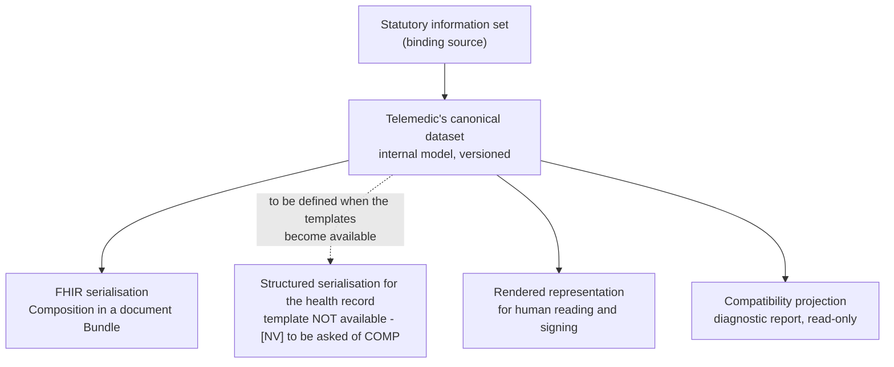
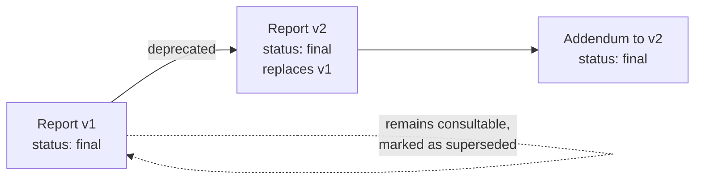

# Clinical documents

What a clinical document is, what the difference is between a document and a message, what the
life cycle of a document towards the health record looks like and who the institutional actors are
is explained in the modules [«The clinical datum»](/10_fondamenti/03-il-dato-clinico.md) and
[«The electronic health record and national infrastructures»](/10_fondamenti/07-fse-e-infrastrutture-nazionali.md).
This chapter describes **how Telemedic produces, signs, versions and delivers** documentary
content.

## 1. The principle that governs the whole chapter

> **Constraint [V-07](../11_registri/01-vincoli-in-vigore.md#v-07).** The information content of documents destined for the electronic health
> record (Fascicolo Sanitario Elettronico) is modelled as a **canonical dataset**. The
> serialisations - structured document for the health record, FHIR representation, rendered
> representation - are **substitutable** and must not be hard-coded.

It is not an architectural preference: it is the mandatory consequence of a verified fact. The
decree that established the telemedicine document types defines **the information set**, published
in the Official Gazette, but **the templates for the structured serialisation, the document type
codes and the indexing metadata for those ten types are not publicly available** at the date of
writing. Hard-coding a template today would mean hard-coding an invented one.

The principle has three operational consequences that recur throughout the chapter:

1. **The internal model follows the statutory information set**, group by group and field by field,
   because that is the binding source.
2. **Every serialisation is an adapter**, with its own bidirectional acceptance testing and its own
   declaration of completeness: which fields of the dataset find a place in that form and which do
   not.
3. **Serialisation losses are documented, never silent.** A field of the dataset that a
   serialisation cannot express is a declared loss, not a forgotten field.

## 2. The telemedicine document types in the health record

**DM 19 novembre 2025, Article 7(1)** (the Ministerial Decree of 19 November 2025) adds ten new
lettered points to Article 3(1) of **DM 7 settembre 2023** (the Ministerial Decree of 7 September
2023), creating **ten health record document types dedicated to telemedicine**. Annex 1 to the
decree supplements the annex to the earlier decree by adding the paragraphs that define each
information set. The declared date for full operation is **30 June 2026** (Article 7(3)).

| Point | Document type | Annex 1 paragraph | Produced by Telemedic |
|---|---|---|---|
| n) | Prescription for televisita, teleassistenza and telemonitoraggio | 2.18 | No - it is upstream, and reuses the existing prescription record layouts |
| o) | Teleconsulto request | 2.19 | Yes, when the teleconsulto originates in the system |
| p) | **Specialist report for televisita** | 2.20 | **Yes - it is the principal document** |
| q) | Collaborative report for teleconsulto or teleconsulenza | 2.21 | Yes |
| r) | Concluding clinical and care report for teleassistenza and teleriabilitazione | 2.22 | Yes |
| s) | Device card for telemonitoraggio | 2.23 | Yes, with the limit in §8.3 |
| t) | Plan for telemonitoraggio, teleriabilitazione and teleassistenza | 2.24 | Yes |
| u) | Telemonitoraggio measurement report | 2.25 | Yes |
| v) | Weekly telemonitoraggio measurement report | 2.26 | Yes |
| w) | Final report for telemonitoraggio and teleriabilitazione | 2.27 | Yes |

**A correction to be adopted.** The assumption that the televisita report should be carried as an
ordinary outpatient specialist report **is wrong** and must not be put forward again: there is a
document type of its own, with an information set of its own that has been published.

## 3. The canonical dataset of the televisita report

The information set of paragraph 2.20 is the source. Here it is set out by group, because that is
how it translates into a data model. The wording follows the source; where the source uses an
Italian technical term, the term is kept.

**Group A - Patient.** Surname; First name; Identifying code, which may be the tax code (codice
fiscale) or one of the codes for subjects without a tax code; Sex; Date of birth; Municipality of
birth; Address, postcode, municipality, province, region and country of residence, with the
description of the municipality; Address, postcode and municipality of domicile; Landline and
mobile telephone number; email address; **certified email address (posta elettronica
certificata)**.

**Group B - Professionals and organisation.** Surname, first name and tax code of the **reporting
doctor**; surname, first name and tax code of the **signing doctor**, whom the source keeps
distinct from the reporting doctor; code and description of the health authority, of the site and
of the operating unit; telephone number of the operating unit, of the booking centre or of the
health authority; surname, first name and tax code of **another technical figure involved in
performing the procedure**; surname, first name and tax code of the **prescribing doctor**.

That the reporting doctor and the signing doctor are distinct fields is not a detail: it is the
distinction between whoever drafted the content and whoever validated it, taking legal
responsibility for it, and it feeds directly into the signature model in §6.

**Group C - Administrative references.** Prescription number; **date of signature of the report**;
booking code; **identification codes of related objects**, which the source illustrates with the
identifiers of image archives and radiology studies; nosological code; provenance; **type of
access**, scheduled or direct; outpatient specialist discipline; branch.

**Group D - Clinical content.** Code and description of the diagnostic question, coded with the
Italian classification of diseases; clinical history; allergies with the sources declared; previous
examinations performed, with code, description, method and date; medicinal product code and
description of the drug therapy in progress; physical examination; code and description of the
service performed; **date and time the provision started**; **date and time the provision ended**;
code and description of the **operating procedure**; quantity; **manner of performing the operating
procedure**, which the source defines as «the practical articulation of how the procedure is
performed»; **instrumentation used**; **descriptive parameters of the procedure**; notes;
comparison with previous examinations; **the report text**, which the source qualifies as «the
principal object of the report»; code and description of the diagnosis; conclusions; suggestions
for the prescribing doctor; code and description of the recommended investigation; code and
description of the recommended drug therapy.

### 3.1 The field that is missing, and where the project puts it

The record layout **contains no explicit field for the attestation of connection quality and of the
confirmation of suitability**, which the State-Regions Agreement on telemedicine requires of the
professional. It is a real gap in the layout, not an omission of this survey.

The natural candidates to carry it, within the existing layout, are three: **manner of performing
the operating procedure**, **instrumentation used**, **descriptive parameters of the procedure**.
Likewise, the presence of a carer or of a second professional finds a place in the field dedicated
to the other technical figure involved and in the notes.

> **Open mapping decision.** Where the legally mandatory evidence of connection quality is written,
> inside a ministerial layout that reserves no field for it, is a choice that binds the data model
> and the reporting workflow. This area **proposes** the descriptive parameters of the procedure
> field as the primary location, with the manner of performance qualifying the synchronous nature
> and the patient's presence, and with the instrumentation used carrying the platform and its
> version. The formal decision is for the domain area in liaison with the compliance area, and must
> be recorded as an architecture decision record.
>
> **A constraint this area sets in any case**: whichever field is chosen, the content is **measured
> by the system and presented to the professional, who confirms it**. It is not generated
> autonomously and inserted into the report without an act of the professional: that would be
> system-produced information inside a clinical document, in direct tension with constraint [V2](../11_registri/03-vincoli-fondanti.md#v2).

### 3.2 The dataset is versioned

The canonical dataset carries a version number of its own, independent of the software version and
of the version of the serialisations. It serves to answer a question that is always asked in a
dispute: **with what information structure was the document the patient received on that date
produced?** An unversioned dataset makes that impossible to answer.

## 4. The serialisations

### 4.1 The FHIR serialisation

It is the serialisation that is **complete and tested today**. The report is a `Composition`
conforming to the Italian guide's profile, inside a document-type `Bundle`.

Verified constraints of the profile:

- the composition's type is **fixed** to code `75496-0` of the system `http://loinc.org`, whose
  name is *Telehealth Note*;
- the title is fixed to a pattern;
- the attester is `1..*` with a mandatory slice in **legal** mode;
- the author is `1..*` and points to the professional's role or to the providing organisation;
- the sections are `2..*`, with the report section **mandatory** at cardinality `1..1`.

| Section | Card. | Code | Content |
|---|---|---|---|
| Diagnostic question | 0..1 | `29299-5` | Profiled observation |
| Initial clinical assessment | 0..1 | `11329-0` | Container |
| ↳ Clinical history | 0..1 | `11329-0` | Narrative observation |
| ↳ Allergies | 0..* | `48765-2` | Profiled intolerance |
| ↳ Drug therapy in progress | 0..* | `10160-0` | Medication statement |
| ↳ Physical examination | 0..1 | `29545-1` | Narrative observation |
| Previous examinations performed | 0..1 | `30954-2` | Profiled observation |
| Comparison with previous examinations | 0..1 | `93126-1` | Narrative observation |
| **Report** | **1..1** | **`47045-0`** | Profiled observation |

The classification of the sections is the only terminology the project can rely on with no
licensing risk: it is available free of charge for commercial and non-commercial use, with an
attribution obligation and a prohibition on deriving another vocabulary from it. The
**translations** of that classification are, however, derivatives assigned to its owner: the
project's interface strings are **architecturally separate** from the official display strings, and
one is never used in place of the other.

The document paradigm imposes three properties that the project applies to the letter: the
document's identifier is globally unique and **never reused**; once assembled, the document **is
immutable**, and its content can no longer change; signatures apply to the assembled document.

> **To be put in hand:** the **field-by-field** coverage check between the information set of
> paragraph 2.20 and the Italian guide's profile has not been carried out. The information set is
> the binding source; the profile is a representation. Where the profile has no place for a field
> of the set, either a declared extension or a justified placement is needed.
> **To be asked of**: the domain area for the semantics, the compliance area for what is mandatory.

### 4.2 The structured serialisation for the health record

> **`[NV]` - not publicly available.** The template for the structured serialisation, the document
> type codes and the indexing metadata for the ten telemedicine types **have not been located in
> any public source**. A new version of the technical interoperability specifications between the
> regional health record systems is declared to have been published, but **it has not been
> established** that that version already contains the telemedicine templates.
>
> **To be asked of**: the compliance area, which owns question **[Q-07](../11_registri/02-questioni-aperte.md#q-07)** on the noticeboard. The
> channel indicated is the technical area of the health record portal and, failing that, a formal
> request to the body that operates the national interoperability infrastructure.
>
> **Until then the project hard-codes no template.** The adapter exists as an extension point with
> a declared contract - it receives the canonical dataset and produces a signable artefact - and its
> concrete implementation is deferred. This is not a gap: it is the literal application of
> constraint [V-07](../11_registri/01-vincoli-in-vigore.md#v-07).

### 4.3 The rendered representation

There is a third serialisation, and it is not optional: the representation intended for human
reading. It is what the patient receives, it is what is signed in a way that is verifiable by eye,
and it is what counts in a dispute when the structured representation and the rendered one diverge.

Project rules:

- the rendered representation is **generated from the canonical dataset**, never drafted separately;
- it reproduces the dataset's clinical content **in full**: a rendered representation that omits a
  field present in the structured form is a divergence between what the patient reads and what the
  system communicates;
- its cryptographic digest is computed and kept together with the document, so that the identity
  between what was signed and what is produced is demonstrable;
- the preservation format is suitable for long-term preservation. **`[NV]`** - the exact profile of
  the format and the requirements of the preservation system are matters for the compliance area,
  not for this one.

### 4.4 The compatibility projection

Many receiving systems can consume the report only in the form of a diagnostic report. The project
offers it as a **read-only projection**, never as the primary artefact: the narrative part carries
the text drafted by the doctor, the attachment carries the signed document. **No field of that
projection is ever populated with system-generated text**: this is the boundary of constraint [V2](../11_registri/03-vincoli-fondanti.md#v2),
and it must be verified with a dedicated test, not with a convention.

## 5. The indexing metadata

A document published to a document sharing infrastructure carries two distinct sets of information:
**the content** and **the metadata that make it findable**. Confusing them is a modelling error
with practical effects, because the metadata are visible to whoever is searching before they have
obtained access to the content: **an over-talkative metadatum is a disclosure**.

The metadata that the document sharing model provides for, verified against the technical
framework source, include the patient's identifier, the start and end instants of the service, the
instant the document was created, the code and description of the document class, the code and
description of the healthcare setting, the code and description of the facility type, the
availability status and the document's unique identifier.

Project rules on metadata:

1. **The confidentiality level is a metadatum, and it is not a default value.** It derives from the
   nature of the content and from the patient's choices, not from a configuration constant.
2. **No metadatum carries clinical content in the clear.** The free-text description of a document
   does not contain the diagnosis.
3. **The document's unique identifier is that of the canonical dataset**, not one generated by the
   serialisation. It is what makes it possible to correlate the same version of the document across
   different serialisations.
4. **The availability status follows the document's life cycle**, including deprecation as a result
   of a replacement (§7).

> **`[NV]` - document type codes and metadata value sets for the ten telemedicine types.** Not
> located in any public source, as already declared in §4.2. Without them the project **cannot**
> publish to a national document sharing infrastructure, because it would produce unrecognised
> metadata. Publication towards the integrator's system of origin, which uses its own codes, is not
> blocked. **To be asked of**: the compliance area ([Q-07](../11_registri/02-questioni-aperte.md#q-07)).

## 6. The signature

### 6.1 Who signs what

The distinction between the reporting doctor and the signing doctor, present in the information
set, translates into two distinct roles in the document's model:

| Role | In the dataset | In the FHIR serialisation | Meaning |
|---|---|---|---|
| Who drafts | Reporting doctor | Author of the composition | Produced the clinical content |
| Who validates | Signing doctor | Attester in **legal** mode | Takes legal responsibility for the document |
| Who holds | Providing organisation | Custodian | Keeps the document and answers for it |

The attestation in legal mode is the **mandatory** slice of the Italian profile, and it is the
signal that the document is final. A document without it is not a report: it is a draft.

### 6.2 The relationship between application signature and qualified signature

They are two different things and must be kept separate in the vocabulary too, because confusing
them is the most frequent defect in implementations.

**The application signature** is the attestation inside the document's structure: it says who
validated, when, in what role. It is machine-readable, it is part of the content, and it is what a
receiving system checks to decide whether the document is final.

**The qualified signature** is the cryptographic application to the artefact, with a qualified
certificate issued to a natural person, and it produces a signed artefact in an envelope format. It
is what makes the document legally enforceable.

Project rules:

- **the document is signed after being assembled and made immutable**, never before. Signing
  content that can still be modified produces a signature over nothing;
- **the object of the signature is the complete artefact**, not an extract of it;
- the signature is **verified on receipt** by the consuming party, and the verification includes the
  validity of the certificate **at the instant of application**, not at the instant of verification;
- the outcome of the verification is recorded: a document whose signature does not verify is neither
  silently accepted nor silently discarded.

> **`[NV]` - signature envelope formats, certificate requirements and time stamp requirements.** The
> formats permitted for signing a document destined for the health record, and the rules on the
> submission signature applied by the infrastructure, are a matter of precise legislation that this
> area does **not** reconstruct from memory. **To be asked of**: the compliance area and the security
> area. The module
> [«The electronic health record and national infrastructures», §4](/10_fondamenti/07-fse-e-infrastrutture-nazionali.md)
> describes the life cycle and the points at which the signatures come in.

### 6.3 The signed document is immutable

It is a project invariant, not a recommendation: **a signed clinical document is not modified**.
There is no path, in any interface, that permits the content of a signed document to be altered.
What does exist is the issuing of a **later version** that replaces or rectifies the previous one,
keeping the chain.

This invariant is verified with an explicit test, not entrusted to discipline: an update request on
a document in final status receives an error with a catalogue code pointing to the rectification
procedure.

## 7. Versioning and rectification

### 7.1 The three possible operations on an issued document

| Operation | When | Effect on the previous document | Declared relationship |
|---|---|---|---|
| **Addendum** | Content is added without contradicting the previous document | It stays valid and available | The new document is an appendix to the previous one |
| **Replacement** | The previous content is superseded as a whole | It moves to deprecated status, and remains consultable | The new document replaces the previous one |
| **Annulment** | The document should not have existed: wrong recipient, service not provided | It moves to no-longer-valid status | The document is declared erroneous |

Three clarifications that avoid errors:

**Annulment is not deletion.** The document remains, with a status that declares its invalidity.
Deleting it would destroy the traceability of a fact that occurred: that that document was issued
and that somebody may have read it.

**Replacement does not rewrite history.** Whoever read the previous version read it, and the access
log proves it. The previous version remains consultable under its own identifier, marked as
superseded.

**The chain is never broken.** Every version declares its relationship with the one that precedes
it. A document that replaces a document that in turn replaced another keeps the complete chain, and
the chain is reconstructible backwards in a single query.

### 7.2 The signal of rectification towards the outside

A rectification must be **notified**, not merely recorded. A system of origin that has already taken
the previous version into its own record must know that it has been superseded, otherwise it goes
on showing a superseded document to a professional who takes decisions. It is one of the cases in
which the notification channel is a clinical safety requirement and not an integration convenience:
the event catalogue in chapter [07 §3](./07-eventi-e-webhook.md) provides for one event type
dedicated to replacement and one to annulment, and both are classified as events whose failed
delivery requires escalation, not simple filing in the dead-letter queue.

In the legacy channel the same semantics exist and are native: the pair made up of the document's
unique identifier and the parent document identifier is the replacement mechanism, and the
corresponding notification events are distinct (chapter [04 §4](./04-hl7-v2.md)).

## 8. The other document types

### 8.1 The teleconsulto does not produce a standalone report, but it does produce a document

It is a structural rule that must be understood because it is counter-intuitive. The source is
explicit: the collaborative report **is deposited into the health record as an attachment to the
report document** relating to the principal service or event, drafted by the professional who
requested the consultation.

Two modelling consequences follow:

1. the collaborative report is a **document type in its own right** - it is not true that «the
   teleconsulto produces nothing» - but it **is not self-supporting**: it exists in relation to a
   principal document that is not produced by Telemedic when the requester is external;
2. the correlation with the teleconsulto request is carried by a dedicated identifier, and the
   project treats it as a first-class external identifier, not as an annotation.

The information set of the collaborative report includes, besides the demographic and organisational
data, the identifier of the request, the details of the consulted doctor, of the signing doctor and
of the requesting doctor, the type of requesting facility and of providing facility, the date the
request was received, the date and time the case was taken on, the date and time the consultation
was scheduled in the synchronous case, and the discipline and branch of the consultant doctor. And,
a decisive field, the **manner of performing the operating procedure**, which for the teleconsulto
must indicate whether it was ad hoc or scheduled, synchronous or asynchronous, with or without the
patient present.

That last field is the confirmation that the statutory layout **does provide for qualifying the
mode**: it is an argument in favour of the placement proposed in §3.1 for the attestation of
connection quality.

### 8.2 The teleconsulto request

The source establishes that the request **is generated inside the regional infrastructures**, and
that interoperability between different regions is guaranteed by the national infrastructure. It
follows that, in an installation operating inside a regional infrastructure, Telemedic **is not**
the generator of the request but the system that receives and processes it. In an installation at a
private entity the request originates in the system, and the project models it according to the same
information set anyway, because that is what makes the document depositable if and when the context
requires it.

Notable fields of the information set: identifier of the request; tax code of the responsible doctor
and of the substitute doctor; region, health authority and facility codes; specialisation code;
exemption codes; code and description of the diagnosis; priority class; **proposed time slot** for
taking the case on; **request for immediate availability**, which the source declares compatible
only with high urgency; the details of the consultant doctor where a specific specialist is
requested; the **scope of provision**, which the source articulates as health authority level,
regional or national. The services section carries the national catalogue code and the single
regional catalogue code.

The scope of provision field is the one that binds the architecture: it implies a search for
available professionals over a variable perimeter, and therefore a queryable service directory, not
a local list.

### 8.3 The device card, and why it touches the regulatory perimeter

The source declares that it is a document **generated by the regional infrastructures, produced and
digitally signed by the healthcare professional who assigns the device to the patient**. The
information set includes the device's name, model and type; **the unique device identification**,
with the clarification that it uses an automatic identification and data capture format and a
human-readable identifier; serial or lot number; the manufacturer's name, address and website; the
patient's condition; date of implantation; the institution that made the assignment; connection
type; power supply type; **outcome of the technical functional check**; technical parameters of the
device, including connectivity, configuration and calibration.

This document is the point at which Telemedic's perimeter touches that of third-party medical
devices. **The project records and carries these data; it does not produce them, does not verify
them and takes no responsibility for the hardware measurement chain.** The outcome of the technical
check is a datum **entered by the professional**, not a judgement of the system. It is the direct
application of the declared perimeter for telemonitoraggio and it is not negotiable.

### 8.4 The telemonitoraggio plan

The information set includes the type of plan; code, description and type of the activities;
**number of cycles, cycle duration, number of activities per cycle**; **frequency**, which the
source illustrates with daily and weekly periodicities and with the possibility of declaring
non-continuous monitoring; **time band**; **expected duration of the plan, up to a maximum of one
year**; indication of first scheduling or rescheduling; unique device identifier; parameters;
**type of measurement**, distinguished into mediated and closed-loop; **alarm threshold**;
**rules**, defined as descriptive text of the behaviour in the event of thresholds being breached.

Two project constraints follow directly from this layout.

**The thresholds are data of the plan, not constants of the software.** Constraint [V-02](../11_registri/01-vincoli-in-vigore.md#v-02) requires it
and the layout confirms it: threshold and rules are fields of the document, filled in by the
professional. No clinical threshold is hard-coded, and no threshold is inferred by the system.

**The plan is versioned and the version is enforceable.** The distinction between first scheduling
and rescheduling is in the layout: it means that the plan document has a history, and that in a
dispute one must be able to say which version of the plan was in force at a given moment. A plan
modified in place, with no version, makes that impossible.

## 9. Preservation and responsibility

A verified fact that changes the retention model: **the regional telemedicine infrastructures do
not preserve the clinical content**. It follows that, in an installation operating inside that
context, statutory preservation is not Telemedic's job and the project's retention configuration
must be able to reflect that.

Project rules:

- the retention period is **per-tenant configuration**, never a constant;
- there is a fully supported configuration in which Telemedic **does not keep** the document beyond
  the window needed for delivery and delivery verification;
- the immutable audit trail record of the fact that the document was produced, signed and delivered
  **survives in any case** the deletion of the content: they are two different things, and the
  second cannot depend on the first;
- the audiovisual recording of the session, where one exists, has **its own retention, distinct**
  from that of the report, because it has a distinct legal basis - an explicit and withdrawable
  consent - and must be deleted on withdrawal even when the report remains.

## 10. What the project does not do

| Does not do | Why | Who does |
|---|---|---|
| It does not apply the submission signature to the national infrastructure | It is an act of the infrastructure, not of the producing system | The interoperability infrastructure |
| It does not decide the document types or their information sets | They are established by decree | The ministry |
| It does not generate clinical content | Constraint [V2](../11_registri/03-vincoli-fondanti.md#v2). The document is the persistence of what the professional drafted | The professional |
| It does not judge the suitability of the connection | It measures and presents; the confirmation is an act of the professional | The professional |
| It does not carry out statutory preservation on the controller's behalf, unless configured to do so | Preservation is a service with requirements of its own | The controller's preservation system |
| It does not mediate a payer's access to the health record | It is **always** excluded by law. The payer is not a permitted consulting party | Nobody: it is forbidden |

The last row is constraint [V-08](../11_registri/01-vincoli-in-vigore.md#v-08) and it holds across every interface of the project, not only this
one: no feature of the system may mediate an insurance company's access to the health record,
neither directly nor through a professional.
