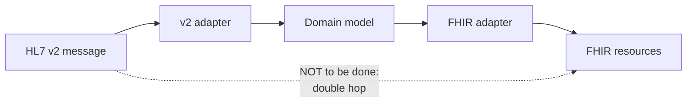

# HL7 v2

The anatomy of a message, the delimiters, the logic of the segments and the reason why a standard
from the 1980s still carries hospital traffic are explained in the module
[«Interoperability standards», §4](/10_fondamenti/05-standard-di-interoperabilita.md).
This chapter describes **what Telemedic accepts, what it emits, over what transport, with what
acknowledgements and how it translates**.

## 1. The perimeter: a separate module, not a core function

Telemedic **does not embed an integration engine**. The HL7 v2 capability is distributed as a
**separate module**, with a distribution image and a life cycle of its own, which exposes a
protected listener and translates to and from the internal interface.

Three reasons, all binding:

1. The typical customer who speaks v2 **already has** an integration engine in operation and under
   governance. Asking them to install a second one is asking them to duplicate a function.
2. Embedding an integration engine in the product **would widen the regulatory perimeter**: it
   would become software to be qualified, verified and maintained in the technical file.
3. The attack surface of a listener on a persistent socket is of a different nature from that of an
   HTTP interface, and must be isolated at process and network level too.

For those who already have an integration engine, the project supplies **documented channel
templates** instead of the adapter: the preferable route is for the customer to use what they have.

## 2. The declared versions

| Domain | Version | Reason |
|---|---|---|
| Scheduling | **2.5.1** | It is the version in which the scheduling structure includes the structured timing segment, absent in versions earlier than 2.5 |
| Demographics and encounters | **2.5** | The common base of Italian integration engines |
| Document notification | **2.5** | In 2.5 the document segment has the completion and availability fields that are needed |
| Error segment | **2.5** | It differs **radically** from 2.3, where a single field covered everything |

A message received with a declared version other than those supported is **rejected with an explicit
negative acknowledgement**, with the error code that declares the version unsupported. It is not
interpreted «by eye»: a parser written for one version that accepts a different version silently
discards the fields it does not know, and in a clinical flow a silently discarded field is a safety
defect.

## 3. The messages supported

| Message | Direction | Use | Priority |
|---|---|---|---|
| `SIU^S12` | inbound | New appointment notification | High |
| `SIU^S13` | inbound | Appointment rescheduling | High |
| `SIU^S14` | inbound | Appointment modification | High |
| `SIU^S15` | inbound | Appointment cancellation | High |
| `SIU^S17` | inbound | Deletion of an erroneous appointment | Medium |
| `SIU^S26` | inbound | Patient non-attendance | High |
| `ADT^A04` | inbound | Outpatient registration of the patient | High |
| `ADT^A08` | inbound | Update of the patient's data | High |
| `ADT^A28` | inbound | Addition of a person or a patient | Medium |
| `ADT^A31` | inbound | Update of a person's data | Medium |
| `MDM^T02` | outbound | Document notification **with content**: the report | High |
| `MDM^T10` | outbound | Document replacement notification with content | High |
| `MDM^T11` | outbound | Document annulment notification | High |
| `ORU^R01` | outbound | Result in the form of observations, an alternative to the document | Medium |
| `ACK` | bidirectional | Acknowledgement | - |

**The admission message is not supported inbound, and that is deliberate.** The admission message
signals the start of a patient's inpatient stay in a facility, with the assignment of a bed. A
remote outpatient service **is not an admission**: the correct trigger is outpatient registration,
whose definition is «the patient has arrived or checked in as a one-time or recurring outpatient,
and is not assigned to a bed». It is the most recurrent error in healthcare integrations and it
must be refused at the door, not tolerated.

## 4. Scheduling, which is the message that counts

### 4.1 The structure, verified

The structure's header is `SIU^S12-S24, S26^SIU_S12`: **the same structure holds for triggers S12
to S24 and for S26**. Segments and order:

```
MSH          Message header
SCH          Scheduling activity information
[ { TQ1 } ]  Timing and quantity
[ { NTE } ]  Notes relating to the SCH
[{
  PID        Patient identification
  [ PD1 ]    Additional demographics
  [ PV1 ]    Encounter
  [ PV2 ]    Additional encounter information
  [ { OBX } ] Observations
  [ { DG1 } ] Diagnoses
}]
{
  RGS        Resource group
  [{ AIS [ { NTE } ] }]   Service
  [{ AIG [ { NTE } ] }]   Generic resource
  [{ AIL [ { NTE } ] }]   Location resource
  [{ AIP [ { NTE } ] }]   Personnel resource
}
```

Five points bind the implementation and are all verified:

1. **The header and the scheduling activity segment are the only ones with cardinality `1..1`**
   outside the groups.
2. **The patient group is optional and repeatable.** A valid message may **not contain** the
   identification segment. A consumer that assumes its presence is non-conformant. Telemedic treats
   this as a normal case and answers with a justified application rejection when the appointment
   cannot be linked to a known patient - not with a parsing error.
3. **The resource group is mandatory and repeatable** and must begin with the group segment.
4. **The timing segment is present from 2.5.1**: a parser written against an earlier version would
   discard it along with the information it carries.
5. **The note segment appears in five distinct positions with different semantics** - notes on the
   scheduling activity and notes on each resource. Parsing must be positional: an indiscriminate
   collection of all the note segments merges information that does not have the same meaning.

### 4.2 An inbound message, with synthetic data

```
MSH|^~\&|GESTIONALE|ORG-A|TELEMEDIC|TENANT-A|20260914073000||SIU^S12^SIU_S12|MSG00001|P|2.5.1|||AL|NE|ITA|UNICODE UTF-8
SCH|PLC-88213|FLR-99001||||TV^Televisita di controllo^L|Controllo programmato|TELEVISITA|30|min|^^^20260914100000^20260914103000
TQ1|1||||||20260914100000|20260914103000
PID|1||PZ-4471^^^GESTIONALE^MR||VERDI^GIULIA||19750312|F|||VIA ESEMPIO 10^^ROMA^RM^00100^ITA^H||^PRN^PH^^^06^5550000
PV1|1|O|||||||||||||||||VIS-2026-0000123
RGS|1|A|GRP-1
AIS|1|A|89.7^Visita di controllo^CATALOGO|20260914100000|||30|min
AIP|1|A|MED-0007^BIANCHI^ANNA|D^Medico||20260914100000|||30|min
AIL|1|A|VROOM-8f3a^^^TELEMEDIC^^^^^Stanza virtuale||||20260914100000|||30|min
```

Notes on the example, all pertinent to the implementation:

- the patient class field in the encounter segment is `O`, that is, outpatient. It is the value
  **verified** against the corresponding table, whose system identifier is
  `http://terminology.hl7.org/CodeSystem/v2-0004`;
- fields 15 and 16 of the header govern the acknowledgement mode and are commented on in §6;
- the location resource identifier carries the virtual room. **It does not carry credentials**:
  access to the session is obtained with an authenticated call, never from a field of a message that
  transits an integration engine and ends up in its logs.

### 4.3 The patient identifier, and a convention that does not exist

The identifier type table **does not contain** a code for the Italian tax code (codice fiscale).
The concept that is actually present has the literal code `NNxxx`, with the definition «national
person identifier, where `xxx` is the three-letter country code from ISO 3166». Applying the
formation rule, the value for Italy is **`NNITA`**, which **is not enumerated** as a concept: it is
generated by the rule.

This must be stated precisely because it is a point on which the secondary literature is
systematically wrong: **the code `NN` on its own is not a code from that table**. Other entries
abstractly available, verified as existing, are those for the tax fiscal number, for the social
security number, for the unique national person identifier, as well as the internal patient, medical
record and passport identifiers.

**No published Italian profile fixes the value.** The identifier type value set of the reference
guide includes the whole code system, with one hundred and forty-seven concepts, and selects none of
them as «codice fiscale». The choice therefore remains **contractual with the integrator** and must
be written into the agreed interface profile.

> **This area's recommendation**, with its justification: `NNITA`, because it conforms to the
> table's formation rule. The tax number code is the second most widespread choice but semantically
> weaker. Whatever value is agreed, **the interface profile declares it explicitly for each
> integrator**, and the adapter reads it from configuration: it is not hard-coded.
>
> This point is connected to question **[Q-06](../11_registri/02-questioni-aperte.md#q-06)** but **does not coincide with it**: here the matter is
> the type code inside a v2 segment, there it is the system URI in a FHIR resource. The decision on
> [Q-06](../11_registri/02-questioni-aperte.md#q-06) does not automatically resolve this one, and vice versa.

## 5. The transport

### 5.1 The delimiters of the wrapping protocol

```
<SB> = 0x0B  (vertical tab)
<EB> = 0x1C  (file separator)
<CR> = 0x0D  (carriage return)

<SB> ...HL7 v2 message... <EB><CR>
```

The segments inside the message are separated by `0x0D`, **not** by a line feed character. It is
the most common parsing error and it is the first thing the module's tests verify, with a case that
deliberately injects the wrong separator.

> **`[NV]` - direct reading of the wrapping protocol specification.** The hexadecimal values given
> above are corroborated by sources that cite the specification, but **direct reading of the
> normative document was not achieved** during research. Before the implementation is considered
> final, the original document must be read, in particular for the rules on the protocol's two
> releases: the second extends the first with transport-level accept acknowledgements. **To be
> asked of**: whoever implements the module, with acquisition of the normative document.
>
> The port conventionally used **is not a registered port** with the assignment authority: in
> practice an agreed port is used. The project hard-codes none and reads it from configuration.

### 5.2 The transport is protected, always

**The bare wrapping protocol is plain text over a persistent connection, with no authentication.**
Anyone who can reach the port can inject clinical messages. There is no supported configuration in
which the listener accepts unprotected connections from an untrusted network.

Module rules, all binding:

- wrapping in **TLS with mutual certificate authentication**, which is exactly what the node
  authentication profile described in chapter [05](./05-ihe.md) requires: it is not an extra
  requirement, it is the same requirement seen from the healthcare integration side;
- minimum TLS version and cipher suites are **security configuration**, defined by the security area
  and not by this one;
- the sender's node identity is **verified** and tied to the tenant: a message arriving from a
  certificate not associated with any tenant is rejected before parsing;
- every accepted connection and every received message generate an audit event;
- as an alternative to direct TLS, wrapping in a tunnel is admitted, provided the node identity
  remains verifiable and traced. «It is a private network, that is enough» is not admitted.

## 6. The acknowledgements

### 6.1 The two modes

**Original mode.** The receiver validates that the message type is acceptable, that the version is
compatible and that the processing ID is appropriate; failure of this validation produces a
rejection. If the validation passes, the application processes the message and produces
**acceptance**, **application error** or **application rejection**.

**Enhanced mode.** It separates the *accept* acknowledgement from the *application* one. In the
accept phase, governed by field 15 of the header, the receiver puts the message into safe storage
and returns accept, reject or accept-error. In the application phase, governed by field 16, a
separate message carries the outcome of processing.

The values of the two fields are «always», «never» and «only on error». The specification observes
that the original mode is equivalent to the enhanced one with field 15 at «never» and field 16 at
«always».

**Telemedic's choice: enhanced mode, with accept acknowledgement always and application
acknowledgement only on error**, as the default configuration. The justification is operational: the
sender needs to know at once that the message has been put in a safe place - that is what allows it
not to retry - while the application outcome on a stream of appointments is only relevant when
something goes wrong. The configuration is per integrator, because some integration engines require
the application acknowledgement always.

### 6.2 An accept acknowledgement

```
MSH|^~\&|TELEMEDIC|TENANT-A|GESTIONALE|ORG-A|20260914073001||ACK^S12^ACK|ACK00001|P|2.5.1
MSA|CA|MSG00001
```

### 6.3 An application error

```
MSH|^~\&|TELEMEDIC|TENANT-A|GESTIONALE|ORG-A|20260914073001||ACK^S12^ACK|ACK00002|P|2.5.1
MSA|AE|MSG00001
ERR||PID^1^3|204^Unknown key identifier^HL70357|E|||L'identificativo dell'assistito non e' risolvibile nel tenant indicato
```

> **`AE` is an application error, not a rejection.** The distinction matters because it drives
> the receiver's behaviour: `AE` says the message was accepted and processed and that processing
> failed - an identical retry will fail the same way, and what is needed is to correct the
> content. `AR` says the message was not processed at all, typically because of a condition at
> the receiver, and there a retry does make sense. Swapping the two codes produces systems that
> retry forever a message that can never succeed, or that discard a message which would have
> gone through on the next attempt.

## 7. The error segment, and what can be said about it

The structure of the error segment in 2.5 is verified as to sequence, element name, data type and
item number:

| SEQ | Type | Item | Element | Table |
|---|---|---|---|---|
| ERR-1 | `ELD` | 00024 | Error code and location | - (**retained for backward compatibility**) |
| ERR-2 | `ERL` | 01812 | Error location | - |
| ERR-3 | `CWE` | 01813 | HL7 error code | **0357** |
| ERR-4 | `ID` | 01814 | Severity | **0516** |
| ERR-5 | `CWE` | 01815 | Application error code | user-defined table |
| ERR-6 | `ST` | 01816 | Application error parameter | - |
| ERR-7 | `TX` | 01817 | Diagnostic information | - |
| ERR-8 | `TX` | 01818 | User message | - |
| ERR-9 | `IS` | 01819 | Inform person indicator | **0517** |
| ERR-10 | `CWE` | 01820 | Override type | **0518** |
| ERR-11 | `CWE` | 01821 | Override reason | 0519 |
| ERR-12 | `XTN` | 01822 | Help desk contact point | - |

**The fact that matters for implementation**: in 2.5 the first field is marked as retained for
backward compatibility, and the useful fields are the second - structured error location - and the
third, coded against the error condition code table. An adapter written against 2.3, where the
first field was the only one that existed, produces segments that a modern receiver misinterprets.

> **`[NV]` - lengths, optionality and repeatability of the error segment's fields.** Three
> independent extractions from the same source produced mutually incompatible values for the length
> and optionality columns. **They are not publishable** and do not appear in this table. They must
> be read in the version's normative document, chapter 2, segment attribute table, or in the
> official table database. **To be asked of**: whoever implements the module, with acquisition of
> the normative document. The number of the table associated with the eleventh field is inferred by
> elimination and **not verified**.

### 7.1 The error codes used

From the error condition code table, whose system identifier is
`http://terminology.hl7.org/CodeSystem/v2-0357`, the module uses:

| Code | Name | When Telemedic emits it |
|---|---|---|
| `100` | Segment sequence error | Segments out of order or a mandatory segment absent |
| `101` | Required field missing | Mandatory field not populated |
| `102` | Data type error | Field with data of the wrong type |
| `103` | Table value not found | Value not present in the corresponding table |
| `104` | Value too long | Value beyond the permitted length |
| `198` | Non-Conformant Cardinality | Non-conformant cardinality |
| `199` | Other HL7 Error | Other syntax error |
| `200` | Unsupported message type | Message type not supported |
| `201` | Unsupported event code | Event not supported |
| `203` | Unsupported version id | **Version not supported** - see §2 |
| `204` | Unknown key identifier | Patient, appointment or document not resolvable |
| `205` | Duplicate key identifier | Identifier already exists |
| `206` | Application record locked | Operation not performable because of contention |
| `207` | Application error | Internal error, residual category |

The severity, inform-person and override-type tables are verified: severity admits warning,
information, error and fatal error; the inform person indicator admits inform the patient, do not
inform, inform the user, inform the help desk; the override type admits extension override, interval
override and equivalence override.

**Project rule on the textual content of the error fields**: the user message and the diagnostic
information **never contain clinical content or direct identifiers**. They end up in the logs of the
partner's integration engine, which is a system whose protection Telemedic does not control.

## 8. Translation onto the canonical model

### 8.1 The mapping reference, and its status

There is an official mapping guide from HL7 v2 to FHIR, at version **1.0.0**, generated on 7
October 2025, covering **thirteen message-level maps** and **seventy-seven segment-level maps**,
organised across four levels: message, segment, data type, vocabulary.

**All the maps have *Informative* status.** They are not normative and **cannot be declared as
conformance**. The project uses them as a reference and documents every deviation.

The maps pertinent to Telemedic's domain and verified as existing: the scheduling activity segment
to Appointment, Provenance and ServiceRequest; the service segment to Appointment and
ServiceRequest; the resource segments to Appointment; the note segment to Appointment; the
identification segment to Patient, Account and Appointment; the encounter segment to Encounter,
Coverage and Patient; the document segment to DocumentReference and Provenance; the observation
segment to Observation and DocumentReference; the header to Bundle, MessageHeader and Encounter.

**There is no map for the error segment.** Translating v2 errors into the FHIR operation outcome is
therefore **entirely the implementation's responsibility, with no normative cover**. The project
does it through its own single error code catalogue, which is the only way to keep consistency
across the three planes.

### 8.2 The single-hop rule

**The adapter translates from v2 directly onto the domain model**, not onto FHIR resources that are
then translated again. A double hop multiplies information losses, because each step has its own
fields with no destination, and it makes it impossible to attribute a loss to the point where it
happened.



### 8.3 The original message is kept

**The message received is kept in full**, associated with the audit trail, for a configurable
period. In the event of a clinical dispute what counts is **what was received**, not its
interpretation. A system that keeps only the result of the translation cannot demonstrate that it
received what it claims to have received.

The stored message is protected as clinical content, because it is: it contains identifying data
and, in result messages, health content.

### 8.4 Mapping losses are declared

For each supported message the module publishes a **coverage table**: which fields have a
destination in the domain model, which are kept as raw data associated with the original message,
which are **deliberately discarded** and with what justification.

**A silent mapping that discards data is a clinical safety defect.** The coverage table is generated
from the same definition that drives the adapter, so that it cannot diverge from real behaviour, and
it is part of the contract towards the integrator.

When a field that is mandatory for the domain model is missing from the message, the module **does
not invent a default value**: it answers with an application rejection indicating the structured
location of the missing field. It is constraint [V-09](../11_registri/01-vincoli-in-vigore.md#v-09) applied to this channel: the absence of a datum
is information, and silence is not normality.

## 9. When not to use this channel

| Situation | Why not | What to use |
|---|---|---|
| The integrator is web-native and has no integration engine | It would ask them to build competence from scratch in a fragile positional format | REST application plane or FHIR façade |
| Synchronous operations with a rich structured response are needed | The format is notification-oriented; queries are cumbersome | FHIR search or the API |
| Binary content of significant size needs to be carried | Observation segments with encapsulated data are impracticable for large content | DocumentReference with binary content, or document publication (chapter [05](./05-ihe.md)) |
| The integration crosses the public network | The protocol has no native authentication or encryption, and the configuration for grafting them on is fragile | FHIR façade over HTTPS with authorisation |
| Documented delivery and replay guarantees are needed | The acknowledgement covers the individual message; there is no standard model for a dead-letter queue and replay | Webhooks with a dead-letter queue and replay (chapter [07](./07-eventi-e-webhook.md)) |
