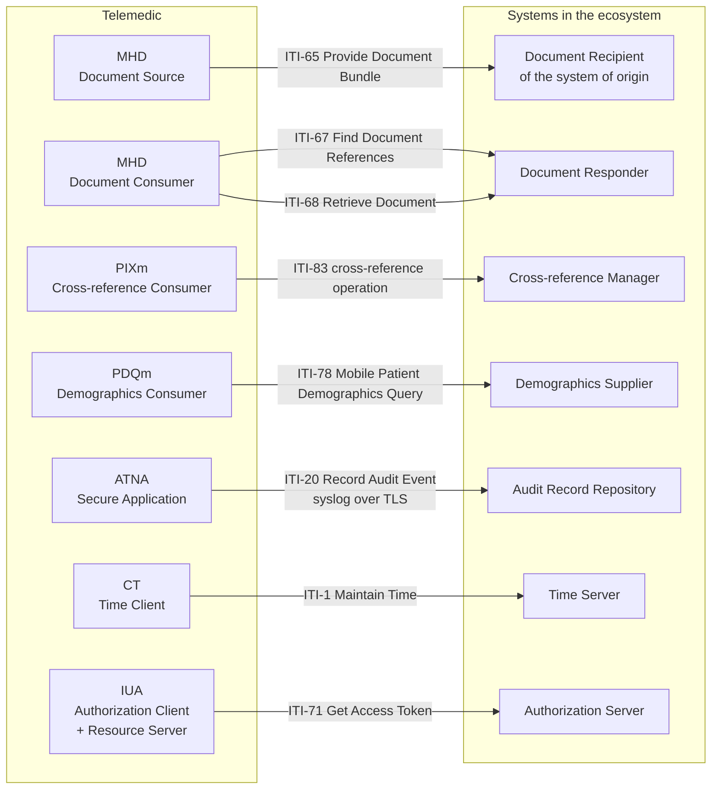

# IHE

What actors, transactions and integration profiles are, how to read a transaction's identifier and
why IHE is not «another standard» is explained in the module
[«Interoperability standards», §6](../10_fondamenti/05-standard-di-interoperabilita.md).
This chapter declares **which actors Telemedic implements, with which transactions, in which
revision, and under what conditions they are active**.

## 1. The principle: profiles do not add APIs, they constrain them

Profiles do not introduce a new interface alongside those of the preceding chapters: **they
establish which transactions, with which actors and with which security constraints** an already
existing capability must respect when the counterparty requires it. Publishing a document is the
same operation, whether it is called «publishing the report» or referred to by the transaction
number: what changes is the contract that governs it.

An activation rule follows: **profiles are switchable per tenant, not mandatory**. An exporter of
audit events towards a repository that does not exist is an exporter into the void; a document
publication actor with no downstream sharing infrastructure produces metadata for a registry that
is not there. What is **always active** is the internal model that makes them switchable: a single
audit model serialisable in two forms, a single document model serialisable in several forms.

## 2. The overall picture

Every arrow is a transaction, every box is an actor. Telemedic implements the left-hand column. An
integrator wishing to connect must implement at least the corresponding actors in the right-hand
column for the functions they are interested in.

## 3. The normative table of actors

| Profile | Pinned revision | Status | Actor implemented | Transactions | Activation |
|---|---|---|---|---|---|
| **ATNA** | ITI TF rev. **20.2** (11 November 2025) | Final Text | Secure Application | **ITI-19**, **ITI-20** | Recommended always; mandatory in a public-sector context |
| **CT** | ITI TF rev. **20.2** | Final Text | Time Client | **ITI-1** | **Always**: it is a prerequisite of ATNA |
| **MHD** | **4.2.5-comment** (16 June 2026) | *ballot*, **not Final Text** | Document Source | **ITI-65** | Per tenant, if a recipient exists |
| **MHD** | **4.2.5-comment** | *ballot* | Document Consumer | **ITI-67**, **ITI-68** | Per tenant, if pre-existing documents need to be read |
| **PIXm** | **3.1.0** (4 November 2025) | Trial Implementation | Patient Identifier Cross-reference Consumer | **ITI-83** | Per tenant, if more than one identification domain exists |
| **PDQm** | **3.2.0** (4 November 2025) | Trial Implementation | Patient Demographics Consumer | **ITI-78** | Per tenant, with the limits in §7 |
| **IUA** | rev. **2.5** (18 June 2026) | Trial Implementation | Authorization Client, Resource Server | **ITI-71**, **ITI-72**, **ITI-102**, **ITI-103** | A documentary profiling of what is already implemented |
| **BALP** | **1.1.4** (31 October 2025) | Trial Implementation | *content profile* | — | Form of the events produced by ATNA |
| **XUA** | — | — | **None** | — | Out of scope, see §9 |
| **XDS.b** | — | — | **None** | — | Out of scope, see §9 |

Two rows carry an explicit warning that must be repeated to integrating parties.

**The revision of the document profile is in public comment, not final text.** The project declares
this instead of implying a stability that does not exist. It follows that the version is pinned,
that re-checking is scheduled and that a change to the profile at final publication is an expected
event, not an incident.

**Three profiles out of eight are in *Trial Implementation*.** Pinning the revision is not an
optimisation: it is the condition for two installations of the same software to behave in the same
way.

## 4. Audit trail and node authentication

It is the profile with the highest relevance, because it is the one that gives standard form to
constraint V5.

### 4.1 The actors and Telemedic's choice

The profile defines four actors: a secure node, which guarantees security across the whole stack
«from the hardware up to the user interface and external communication»; a secure application,
which guarantees security at application level with control only over the grouped actors and not
over the underlying environment; an audit record repository; a forwarder that filters and routes
selectively.

**Telemedic implements the secure application, not the secure node.** The reason is an honest one:
the project distributes software, it does not control the operating system, the network
configuration and the physical access of the installation at the customer's site. Declaring itself
a secure node would mean declaring guarantees about an environment it does not govern. The
distinction must be written into the integration statement, because it is exactly what a tender
specification checks.

### 4.2 The format and the transport

The message format is the one defined by annex A.5 of part 15 of the imaging standard: an
extensible XML schema, with backward compatibility towards the earlier provisional format. The
mandatory elements are the event identification, the active participant, the participating object
and the audit source; the mandatory fields include the event identifier, the action code, the
instant, the outcome indicator, the object identifier and the user identification. **For disclosure
events the purpose of use becomes mandatory**: it is the legal basis of the communication, and
without it the record does not document what it must document.

The transport is syslog, in two variants:

| Variant | Document | Telemedic's choice |
|---|---|---|
| Syslog over TLS | **RFC 5425** | **The only variant supported** |
| Syslog over UDP | **RFC 5426** | **Excluded** |

Excluding the unreliable variant is justified and is not a preference: the specification itself
warns that the transport **may truncate messages beyond 1024 bytes** and that the repository must
accept the fragments, keeping them as far as possible. For a healthcare system an audit log that is
truncated or has undetectable holes **is not a log**: it is a source of false confidence. At least
one of the two variants must be supported for conformance; the project supports one, and declares
which and why.

The underlying protocol is defined by **RFC 5424**, with the corresponding priority and with the
message identifier fixed by the profile.

### 4.3 Node authentication

Machine-to-machine authentication uses X.509 certificates and mutual authentication. The profile
defines an option that constrains it to **TLS 1.2 or above** with selected cipher suites, and a
server name validation option that applies **RFC 6125** when the client authenticates the server,
requiring a subject alternative name entry of type DNS. In healthcare contexts, direct certificate
comparison or bespoke trust chain models are permitted, instead of the certification authorities
preinstalled in browsers.

This requirement **coincides** with the one set by chapter [04](./04-hl7-v2.md) for the legacy
channel and with the mutual authentication option of the application channel: it is the same
requirement seen from three sides, and it must be implemented once only.

### 4.4 The form of the events

The schemas to be used are those of the dedicated content profile, at version **1.1.4**, on an R4
base. It defines ten schemas for the REST operations — create, read, update, delete and search,
each in **two variants**, with and without an identified patient — plus two schemas for the
**communication of data to third parties**, one on the side of the party communicating and one on
the side of the party receiving, and six schemas for authorisation, covering the opaque token, the
authorisation profile token, the token in assertion form in the full and minimal variants, and the
authorisation decision.

**The two third-party communication schemas are exactly the ones needed when the report is returned
to the system of origin.** Returning a report is a communication of health data to another
controller, and it must be audited as such, with the purpose declared. It is not a read, and
recording it as a read would be a false description of what happened.

### 4.5 A single internal model, two serialisations

The FHIR audit resource is the information model derived from the same annex of the imaging
standard, jointly maintained by the three bodies. The project choice follows: **a single internal
audit model**, serialisable both as a FHIR resource, for the read-only exposure on the façade, and
in the XML format provided for by the transaction, for sending to the customer's repository.

It must be said that **neither serialisation is the immutable audit trail**. The immutable audit
trail required by constraint V-04 is append-only with a hash chain and retention separate from the
system that generates the events. These are export forms. Confusing them is the error that
constraint V-04 exists to prevent.

## 5. Consistent time

Actors: time server and time client. Transaction: **ITI-1**. The profile requires the use of the
time synchronisation protocol defined by **RFC 1305** — the specification cites that document —
with the simplified variant permitted for certain clients not grouped with a server. The accuracy
required is a **median error of less than one second**, which the profile qualifies as sufficient
for most purposes.

**Why it is a prerequisite and not a nicety.** Without time synchronisation between the nodes, the
audit logs of different systems are not correlatable and are not enforceable. The time interval of
a service recorded by a node with a drifting clock cannot be used in a dispute. And the time
interval of a service is a datum in the report's information set, with the date and time the
provision started and ended among the mandatory fields: it is not technical metadata, it is
document content.

**A deployment consequence, to be documented as an installation requirement**: in a container-based
installation, time synchronisation is the host's responsibility. The project checks it at start-up
and **refuses to start**, or starts in a declared degraded state, if the measured skew exceeds the
threshold. It does not take it for granted.

## 6. Identifier cross-referencing

Telemedic is a **consumer**, never a cross-reference manager. It is the operational translation of
the principle that the project does not become the master patient index.

The operation is invoked on the endpoint `[base]/Patient/$ihe-pix`, with the verified parameters:

| Direction | Parameter | Card. | Type | Content |
|---|---|---|---|---|
| in | `sourceIdentifier` | 1..1 | token | The identifier the manager will use to find the matches, in the form of domain and value separated by a vertical bar |
| in | `targetSystem` | 0..* | uri | The domains the returned identifiers must come from |
| in | `_format` | 0..1 | token | Format requested for the response |
| out | `targetIdentifier` | 0..* | Identifier | The identifier found, including the authority that assigns it |
| out | `targetId` | 0..* | Reference | The address of the patient's resource |

The profile also defines an identifier feed transaction, which Telemedic **does not implement**:
feeding a cross-reference manager would mean becoming an authoritative source of identity, which is
precisely what the project has decided not to be.

**When not to use it.** With a single identification domain there is nothing to cross-reference.
When the integrator already passes both identifiers in the call, the query is a pointless round
trip: the project avoids it and uses what it has received.

## 7. Demographic query

The search parameters admitted on the patient resource are **fourteen**, verified: `_id`, `active`,
`family`, `given`, `identifier`, `telecom`, `birthdate`, `address`, `address-city`,
`address-country`, `address-postalcode`, `address-state`, `gender`, `mothersMaidenName`.

> **A typographical note to copy exactly**: `mothersMaidenName` is the only parameter in the list
> written in *camelCase*. Writing it with hyphens produces an unknown parameter, which under the
> strict handling of chapter [02 §5.1](./02-fhir.md) is an error.

The conformance rule: the consumer **MAY** supply the parameters, the supplier **SHALL** be able to
process them all, and must support at least the combinations of family name with gender and of date
of birth with family name.

**Telemedic is a consumer, not a supplier.** It does not expose a demographic query to the outside,
and that is a declared security decision: **an open demographic query over a patient base is an
enumeration surface**. If the project were one day to expose that role, the conditions would be
three and non-negotiable: tenant restriction applied before the search is built, a maximum result
threshold with an explicit refusal beyond the threshold, and an audit event for every query with
the purpose declared.

**When not to use it as a consumer.** When the appointment already arrives with the patient's
identifier. The profile serves to *find* a person whose identifier is unknown; to retrieve their
data when the identifier is known, a read or a search by identifier is enough.

## 8. Publishing and retrieving documents

The profile provides «a single standardised interface to health document sharing» for
resource-constrained environments, simplifying the protocols of the previous generation. The FHIR
resources involved are DocumentReference, List, Binary and Bundle.

| Transaction | Name | Telemedic's role |
|---|---|---|
| **ITI-65** | Provide Document Bundle | **Source.** Publishes the report to the recipient of the system of origin |
| ITI-66 | Find Document Lists | Not implemented |
| **ITI-67** | Find Document References | **Consumer**, when pre-existing documents need to be read |
| **ITI-68** | Retrieve Document | **Consumer** |
| ITI-105 | Simplified Publish | Not implemented in v1.0 |
| ITI-106 | Generate Metadata | Not implemented in v1.0 |

The publication transaction is **the answer to the requirement that clinical content flow into the
record of the calling system** instead of remaining confined in Telemedic. The report, serialised
as a document and indexed by its own DocumentReference, is published to the integrator's recipient.

Two conditions currently block publication to a **national** sharing infrastructure, and they are
declared in chapter [03 §5](./03-documenti-clinici.md): the document type codes and the metadata
value sets for the telemedicine types are not publicly available. Publication to the integrator's
system of origin, which uses its own agreed codes, is not blocked.

**When not to use it.** When the exchange is point-to-point with a single integrator: a simple FHIR
DocumentReference is enough, and the profile adds metadata constraints inherited from the previous
generation that nobody will consume. When there is no downstream sharing infrastructure: metadata
would be produced for a registry that is not there.

## 9. The two excluded profiles, and why

### 9.1 Previous-generation document sharing

There is an older profile for document sharing, based on an entirely different technology stack:
XML envelopes over a web services protocol, a metadata registry with its own data model and its own
query language, a binary optimisation mechanism and an addressing extension for asynchronous
operations.

**It is not the correct choice as the primary interface of a new project in 2026.** It introduces a
technology stack alien to the rest of the system, with its own implementation, acceptance testing,
third-party component qualification and maintenance costs. The mobile profile exposes the same
semantics over FHIR REST, and systems that speak only the older protocol are reached through a
conversion gateway. If an integrator requires it, **the gateway is assessed, not a
re-implementation**.

### 9.2 Business-to-business identity assertion in XML envelope form

The profile that conveys claims about an authenticated principal across enterprise boundaries uses
a web services security header with an assertion token. It has three relevant options — subject role,
consent reference, purpose of use — and requires grouping with the audit profile.

**It is out of scope.** It is needed in the world of web services based on XML envelopes, and
introducing that stack into the core of the product for a hypothetical requirement would be an
error. If a customer imposes it, it is built as a **separate adapter**, on the same criterion as
the module for the legacy channel.

## 10. Authorisation in an IHE context

The authorisation profile defines three actors — authorisation client, authorisation server,
resource server — and four transactions: obtaining the token, incorporating the token into a
transaction, token introspection, obtaining the authorisation server's metadata. The reference
framework is **OAuth 2.1**, with two profiled grant types: authorisation code and client
credentials. The required claims are `iss`, `sub`, `client_id`, `aud`, `exp`, `scope`, `jti`;
optional extensions gather organisation, roles and purpose of use into a dedicated object.

The relationship with the application launch profile is stated by the specification explicitly:

> *«IUA is not based on SMART-on-FHIR, but does strive to not conflict with that standard.»*

**The two profiles are not equivalent alternatives**, but since both profile the same authorisation
protocol, **the underlying implementation is the same**: what changes is the conformance
documentation. The project's choice is therefore economical and defensible: implement the
application launch profile, which is the one private integrators know, and **document the
correspondence** with the IHE authorisation profile, so as to be able to answer a public tender
without rewriting anything. The correspondence table is in chapter
[08 §7](./08-identita-e-autorizzazione.md).

## 11. The integration statement

For each actor implemented, the project publishes an **integration statement**, in the form
provided for by the dedicated appendix of the framework's general introduction, which sets out: the
profile, the revision, the actor, the options supported, those not supported and the deviations.

The statement is **generated from the configuration** and verified in continuous integration, not
written by hand. It is the only way for it to stay true after the third release, and it is the
document a public tender asks for first.

Three assertions that the statement contains and that must be read without softening: Telemedic
implements the **secure application**, not the secure node; it supports the reliable audit
transport and **not** the unreliable one; it adopts profiles in **non-final** revision for three
entries out of eight, and pins them.
