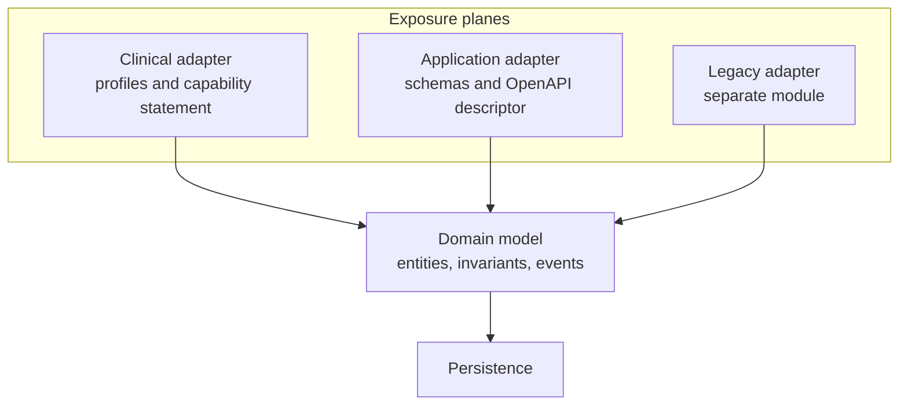

# Project APIs

The real constraints of REST, the semantics of the status codes, how cache validators work and the
correct form of the rate limiting and deprecation headers are explained in the module
[«The protocols, one by one», §3](/10_fondamenti/13-protocolli.md). This chapter describes
**Telemedic's API**: what it exposes, with what contract, with what guarantees.

## 1. Why there are two planes, and how it is decided where a concept lives

FHIR is excellent for clinical interoperability and unsuitable as an API. The reasons are
structural: it models **persistent clinical states**, not **actions**; its resources are wide, with
dozens of elements an application developer will never fill in; the grammar of the operations is
verbose; the semantics of search are a constant source of misunderstanding. Conversely, an
ergonomic API is not interoperable: no third-party healthcare system knows it.

Telemedic therefore exposes **two planes over a single domain model**.

| | Clinical plane | Application plane |
|---|---|---|
| Base path | `/fhir` | `/v1` |
| Media type | `application/fhir+json` | `application/json` |
| Contract | Profiles and capability statement | **OpenAPI 3.1.1** |
| Errors | Operation outcome | `application/problem+json` (RFC 9457) |
| Audience | Clinical record systems, integration engines, health authorities | The integrator's developers, client libraries |

**The partition rule**, applied without exceptions:

> If the concept has a recognised clinical equivalent and must be consumable by a third-party
> healthcare system that knows nothing about Telemedic → **clinical plane**.
> If the concept is a product capability → **application plane**.

| Concept | Plane | Justification |
|---|---|---|
| The service as a clinical act | Clinical | It is the clinical concept and it feeds the record of the system of origin |
| The media session: room, connection state, credentials | **Application** | A technical artefact. It does not exist in FHIR and must not exist |
| The report | Clinical | Clinical content drafted by the professional |
| Consent | Clinical for the state, **application for the collection flow** | The state is clinical and legal; the collection procedure is interface |
| Session quality metrics | **Application** | They are not clinical observations |
| Tenant customisation, quotas, keys, webhook destinations | **Application** | Product configuration |
| Event deliveries and their outcome | **Application** | No clinical equivalent |



The two planes **do not have two persistence models**. FHIR resources are not persistence entities:
they are projections built by an adapter. The domain model knows neither FHIR nor the API's format.

## 2. The API resources

| Resource | Path | Operations | What it is |
|---|---|---|---|
| Sessions | `/v1/sessions` | create, read, list, terminate | The media session, distinct from the service by constraint V-01 |
| Session grants | `/v1/sessions/{id}/grants` | create | Single-use entry credential, very short life |
| Session metrics | `/v1/sessions/{id}/metrics` | read, list | Quality time series |
| Readiness check | `/v1/readiness-checks` | create, read | Preventive test of the device and the network |
| Invitations | `/v1/invitations` | create, read, revoke | Invitation to the patient, with delivery details |
| Event destinations | `/v1/webhook-endpoints` | CRUD, test, secret rotation | Chapter [07](./07-eventi-e-webhook.md) |
| Event deliveries | `/v1/webhook-deliveries` | list, read, replay | Self-service diagnostics for the integrator |
| Events in pull mode | `/v1/events` | list | Alternative to push for those who do not expose an endpoint |
| Recordings | `/v1/recordings` | read, list, delete | Metadata; the content is indexed on the clinical plane |
| Recording consents | `/v1/recording-consents` | create, read, revoke | The flow; the state lives on the clinical plane |
| Monitoring plans | `/v1/monitoring-plans` | CRUD, version | Telemonitoraggio |
| Measurements | `/v1/measurements` | create, list | Acquisition from third-party gateways or manual entry |
| Alerts | `/v1/alerts` | list, read, take on | Under the rules of constraint V-02 |
| Tenant configuration | `/v1/tenants/{id}/settings` | read, update | Including visual customisation |
| Quotas and usage | `/v1/tenants/{id}/usage` | read | Transparency about the limits |
| Error catalogue | `/v1/problems/{code}` | read | Every problem type is a resolvable address |

Three clarifications.

**Sessions are not services.** Creating a session does not create a service, and terminating a
session does not conclude a service. They are distinct aggregates by constraint V-01, and the
interface reflects this: the session carries a reference to the service, the service may have zero,
one or many sessions.

**Entry credentials are a resource, not a field.** They are created with an authenticated call, they
are **single-use**, they have a very short life and **never transit in a URL**. Modelling them as a
readable field of the session would make them re-readable and replayable.

**The error catalogue is served.** The problem type that appears in an error response is an address
that resolves and that leads to the explanation and the resolution procedure. It is what turns an
error into an instruction and cuts the support load.

## 3. The semantics of the status codes

The table holds for **both** planes. A code used with a different meaning on one plane than on the
other is a defect.

| Code | When Telemedic returns it | Notes |
|---|---|---|
| `200 OK` | Read, list, update with representation, completed operation | Also for validation with a negative outcome on the clinical plane |
| `201 Created` | Successful creation | **Always** with the location header and with the version validator |
| `202 Accepted` | Start of an asynchronous operation | With the status polling address |
| `204 No Content` | Delete or update without representation | Only if the caller asked for the minimal response |
| `206 Partial Content` | **Never** | Pagination does not use byte ranges |
| `303 See Other` | Asynchronous operation completed, result elsewhere | Used by the export flow |
| `304 Not Modified` | Conditional read with a validator still valid | Reduces traffic on frequently consulted resources |
| `400 Bad Request` | Syntactically malformed request | **Not** for business rule errors |
| `401 Unauthorized` | Credential absent, expired, unverifiable | With an indication of the expected scheme |
| `403 Forbidden` | Valid credential, insufficient authorisation **on a resource not referring to a patient** | See §6.3 for the rule on clinical resources |
| `404 Not Found` | Resource non-existent **or** not visible to the caller when it refers to a patient | Project choice, §6.3 |
| `405 Method Not Allowed` | Method not permitted on the path | With the allowed-methods header |
| `406 Not Acceptable` | Media type or version requested not served | Including the version parameter of the clinical façade |
| `409 Conflict` | State conflict, or request with an idempotency key already being processed | In the second case with the suggested delay indicated |
| `410 Gone` | Version decommissioned, destination decommissioned, resource permanently deleted | Pointing to the migration guide |
| `412 Precondition Failed` | Version validator supplied but mismatched | Optimistic concurrency |
| `415 Unsupported Media Type` | Content type sent not supported | - |
| `422 Unprocessable Content` | Well-formed request that violates a business rule or a profile | **This is where** domain errors live |
| `428 Precondition Required` | Write to a clinical resource **without** a version validator | Project choice, §5 |
| `429 Too Many Requests` | Quota exceeded | **Always** with the suggested delay, defined by RFC 6585 |
| `500 Internal Server Error` | Unhandled defect | With a correlation identifier, **never** with internal details |
| `503 Service Unavailable` | Temporary unavailability, external dependency down | With the suggested delay where it can be estimated |

**The distinction between `400` and `422` is deliberate and holds as a rule.** The first is for what
the parser rejects; the second for what the domain rejects. A client that treats them the same
cannot distinguish «I built the request wrongly» from «the request is correct but the state of the
system does not admit it», and those two conditions call for opposite actions: in the first case fix
the code, in the second retry or inform the user.

## 4. Idempotency

### 4.1 The mechanism

The field name is `Idempotency-Key`. **It is not a standard**: the Internet-Draft that defines it is
at revision `-07` of 15 October 2025 and is shown as **expired and archived**. The project adopts
the name because it is what integrators and libraries recognise, and documents it as a **project
convention inspired by an expired Internet-Draft**. No claim of conformance with an IETF standard is
permitted on this point.

Semantics adopted:

- **mandatory** on all creations that have observable side effects: starting a session, issuing an
  entry credential, sending an invitation, creating a destination for events, replaying a delivery;
- key scope: the four-tuple **tenant, client, operation, key**. Two tenants using the same string do
  not collide;
- **twenty-four-hour retention** (proposal P-04 of chapter [01 §5](./01-principi-di-interoperabilita.md));
- **the digest of the request body** is stored together with the response produced;
- same key and **same body**, request already completed → the stored response is replayed, **byte
  for byte**, with a project header that declares the replay;
- same key and **different body** → `422` with the problem type dedicated to improper reuse of the
  key;
- same key and same body, **first request still being processed** → `409` with the suggested delay.

```http
POST /v1/sessions HTTP/1.1
Host: telemedic.example
Content-Type: application/json
Authorization: Bearer <opaque token>
Idempotency-Key: 01J9ZC7Y4Q7K9V0R2M4T8N1B3D
X-Request-Id: 7f2b1c8e-4a55-4d0b-9a3f-11c2d3e4f5a6

{
  "appointmentRef": "Appointment/apt-51b7",
  "mode": "no-recording",
  "expectedParticipants": 2,
  "locale": "it-IT"
}
```

```http
HTTP/1.1 201 Created
Location: /v1/sessions/ses_01J9ZC5P
ETag: W/"1"
Content-Type: application/json
RateLimit: "sessions"; r=48; t=57
RateLimit-Policy: "sessions"; q=60; w=60; qu="requests"
X-Request-Id: 7f2b1c8e-4a55-4d0b-9a3f-11c2d3e4f5a6

{
  "id": "ses_01J9ZC5P",
  "status": "created",
  "encounterRef": "Encounter/enc-3c8f1a20",
  "mode": "no-recording",
  "createdAt": "2026-09-14T07:31:02.418Z"
}
```

### 4.2 When it is not needed

On reads, on full replacements and on deletes it is not needed: they are already idempotent by the
definition of the method, and adding the key is noise. On operations that are **intrinsically
repeatable at the caller's will** - «resend the invitation» - the key is not used: a distinct
endpoint with explicit semantics is exposed, because that is a request for an additional effect, not
a retry.

## 5. Optimistic concurrency

The mechanism is the one based on validators: the server emits a version validator on mutable
resources, the client returns it in the modification request, the server compares.

- The validator is emitted in **weak form**, because it represents the semantic equivalence of the
  resource and not the byte-for-byte identity of its representation, which varies with content
  negotiation.
- Mismatch → `412 Precondition Failed`, with the problem type indicating the expected version and
  the current one.
- **Absence of the validator on a clinical write → `428 Precondition Required`.**

The last point is a **project choice**, listed as P-02 among those awaiting a formal architectural
decision. The justification: a write without a validator is a silent last-writer-wins, which on a
clinical resource is untracked data loss, incompatible with constraint V5. The declared cost: it
breaks clients that do not send the validator. That is the intended effect - that they break in
integration, not in production.

On **non-clinical** resources of the application plane - configuration, customisation, event
destinations - the validator is recommended but not mandatory: the loss of a configuration update is
recoverable and visible, the loss of a clinical datum is not.

```http
PATCH /v1/webhook-endpoints/whe_2b8f HTTP/1.1
Content-Type: application/merge-patch+json
If-Match: W/"4"

{ "active": false }
```

**Conditional read is supported** on frequently consulted resources: a client that re-reads the
state of a session with the validator obtained earlier receives `304` with no body. It reduces
traffic and does not consume write quota.

## 6. Errors

### 6.1 The form

The format is that of **RFC 9457**, media type `application/problem+json`. The members defined by
the specification are five:

| Member | Section | Meaning |
|---|---|---|
| `type` | §3.1.1 | URI identifying the **type** of problem; default value `about:blank` |
| `status` | §3.1.2 | The HTTP code, repeated for the consumer's convenience |
| `title` | §3.1.3 | Short human-readable summary, **stable across occurrences** |
| `detail` | §3.1.4 | Explanation specific to **this** occurrence |
| `instance` | §3.1.5 | URI identifying this specific occurrence |

Extension members are permitted by §3.2, and consumers must ignore those they do not recognise.

```json
{
  "type": "https://telemedic.example/problems/session-not-startable",
  "title": "The session cannot be started",
  "status": 422,
  "detail": "The linked appointment is not in a state that admits starting.",
  "instance": "/v1/sessions/ses_01J9ZC5P",
  "code": "session-not-startable",
  "traceId": "00-4bf92f3577b34da6a3ce929d0e0e4736-00f067aa0ba902b7-01",
  "tenantId": "tenant-a",
  "errors": [
    {
      "pointer": "#/appointmentRef",
      "code": "invalid-state",
      "message": "state not permitted"
    }
  ],
  "documentation": "https://telemedic.example/v1/problems/session-not-startable"
}
```

### 6.2 The five rules

1. **The type is a resolvable address** that leads to the error's page, with the explanation and the
   resolution procedure.
2. **The trace identifier is in the standard trace context format**, so that support can find the
   request again without asking the integrator to repeat it.
3. **The detail text never contains clinical content or direct identifiers.** It ends up in the
   caller's logs, which is a system whose protection is not under our control. It is a requirement
   verified by a test, not a recommendation.
4. **The detail text is not parsable.** It is declared outside the stability contract: anyone who
   writes code that interprets it will break, and the breakage is their responsibility. The stable
   field is the code.
5. **An uncatalogued error cannot be emitted.** The build chain verifies that every code emitted by
   the source exists in the catalogue, and the catalogue generates the documentation, the resolvable
   pages and the client library constants together.

The catalogue is **a single one for both planes**: the same concept carries the same code in the
operation outcome of the clinical plane and in the problem body of the application plane. The
correspondence is generated, not written twice.

### 6.3 Not found instead of forbidden, on resources referring to a patient

**A project choice**, listed as P-03. On a resource referring to a patient, a caller who is
authorised but has no right to see **that** resource receives `404`, not `403`.

The justification is that distinguishing «it does not exist» from «it exists but you may not see it»
is an **enumeration oracle** over a patient base: it allows the existence of a person at a
healthcare organisation to be verified without holding any right of access, which is in itself a
disclosure.

The cost is that diagnosis becomes harder for the integrator acting in good faith. The mitigation:
the problem body carries in any case a code that distinguishes absence from lack of authorisation
**when the caller belongs to the same tenant as the resource** - because in that case the oracle
adds no information - and the attempt generates an audit event in any case.

On resources **not referring to a patient** - an event destination, a configuration - the
distinction between `403` and `404` remains the ordinary one.

## 7. Versioning and deprecation, in the forms that are correct today

### 7.1 Where the version lives

Three possible strategies and their assessment:

| Strategy | Pros | Cons |
|---|---|---|
| Major version in the path | Visible in logs and caches, trivial to route and to test by hand | Duplicates the paths |
| Proprietary header | Stable paths | Invisible, gets lost in logs and caches |
| Media type parameter | Formally the most correct | Hostile to developers, badly handled by many proxies |

**Project choice** (P-01): **major version in the path** for breaking changes, plus an optional
**version date** header for dated additions. If the header is absent, the version **pinned to the
client at its first call** applies, not the latest: this way a client never suffers a change it did
not ask for.

On the clinical plane **the interface is not versioned**: the version of the specification is
declared, in the capability statement and in the media type parameter. Any support for a later
release would use distinct base paths.

### 7.2 The deprecation headers

**`Deprecation` is RFC 9745**, Standards Track, March 2025, registered as a permanent field in the
HTTP field name registry, of structured type *Item*. The value **MUST** be a Date as per §3.3.7 of
RFC 9651. The form is seconds with the sign prefix:

```http
HTTP/1.1 200 OK
Deprecation: @1798761600
Sunset: Wed, 30 Jun 2027 23:59:59 GMT
Link: <https://telemedic.example/docs/it/migrazione/v1-v2>; rel="deprecation"; type="text/html"
Content-Type: application/json
```

Verified and applied rules:

- **`Sunset` is RFC 8594** and its instant **MUST NOT** be earlier than that of `Deprecation`. The
  check is in the build chain: a configuration that violated the relationship makes the build fail;
- the `deprecation` link relation points to documentation **intended for human readers**, with the
  type declared;
- the three headers are emitted **on every response** of the deprecated version, not only on the
  first: a client that has cached a response would never see them.

### 7.3 The process

The complete process, with the four phases and the two scheduled brownout windows, is in chapter
[01 §6.4](./01-principi-di-interoperabilita.md) and holds for both planes. Only the technical part
of the windows is added here: during a scheduled brownout the deprecated version answers `410 Gone`
with the problem type pointing to the migration guide and with the duration of the window
indicated. The windows are **announced in advance** and are not a fault: they are a way of surfacing
the integrations that have not migrated while there is still time to migrate them.

## 8. Rate limiting

### 8.1 The correct form today

The code `429 Too Many Requests` and the suggested-delay header are defined by **RFC 6585**. The
quota headers **are not a standard**: they are defined by
`draft-ietf-httpapi-ratelimit-headers`, an **active** Internet-Draft at revision `-11` of 23 May
2026, with intended status Standards Track.

Two facts to be taken on board, both verified:

1. the current revision defines **two** structured fields - `RateLimit` and `RateLimit-Policy` - and
   **replaces** the three separate fields of the early versions;
2. the three separate fields **were never a standard**.

`RateLimit-Policy` carries the quota, window, quota unit and partition key parameters; `RateLimit`
carries the remaining quota, the effective window and the partition key. The draft moreover
registers three problem types - quota exceeded, capacity temporarily reduced, abnormal usage
detected - and a registry of quota units including requests, content bytes and concurrent requests.

### 8.2 The project's choice

**Dual emission for a declared period** (P-05): the current form and, in addition, the historical
form marked as deprecated in the documentation. The justification is that the current form is not
yet an RFC and that widely used libraries still read the historical one. The cost is declared:
redundant headers and **an end date to be kept to**, which is fixed and published.

```http
HTTP/1.1 429 Too Many Requests
Content-Type: application/problem+json
Retry-After: 23
RateLimit: "sessions"; r=0; t=23
RateLimit-Policy: "sessions"; q=60; w=60; qu="requests"; pk=:dGVuYW50LWE=:
RateLimit-Limit: 60
RateLimit-Remaining: 0
RateLimit-Reset: 23

{
  "type": "https://telemedic.example/problems/quota-exceeded",
  "title": "Quota exceeded",
  "status": 429,
  "detail": "The session start quota for this client is exhausted in the current window.",
  "code": "quota-exceeded",
  "policy": "sessions",
  "retryAfterSeconds": 23,
  "traceId": "00-4bf92f3577b34da6a3ce929d0e0e4736-3c1a9d0e1f2a3b4c-01"
}
```

### 8.3 The quota policy

Quotas are **per tenant and per client**, with distinct endpoint classes: clinical write, read,
session start, administration. The algorithm is a token bucket with burst allowance, because an
integrator synchronising a diary naturally produces peaks followed by inactivity, and a rigid quota
would throttle them for no reason.

**No endpoint is exempt**, but three categories have high or dedicated thresholds and the reason is
declared: the health check endpoints, because throttling them blinds the monitoring; replay traffic
from the dead-letter queue, because it would be throttled exactly when recovery is needed; the
operations identified by an authorisation scope dedicated to clinically urgent situations, which
have reinforced auditing and after-the-fact review.

Exceeding the quota **is not a client error**: it is a condition of the system. The problem type says
so and indicates which policy was exceeded, so that the integrator can correct their strategy
instead of retrying at random.

## 9. Pagination

| Model | Use | Justification |
|---|---|---|
| **Cursor-based** | Default on the application plane | Stable in the presence of concurrent writes |
| Offset and limit | **Discouraged and not exposed** | Degrades at high values and produces inconsistent results under writes |
| Bundle links | Mandatory on the clinical plane | It is the specification's model |

```http
GET /v1/sessions?tenantId=tenant-a&status=completed&limit=50
    &cursor=eyJ0IjoiMjAyNi0wOS0xNFQwOTo0MVoiLCJpZCI6InNlc18wMUo5WkM1UCJ9 HTTP/1.1
```

```json
{
  "data": [ ],
  "meta": {
    "limit": 50,
    "hasMore": true,
    "nextCursor": "eyJ0IjoiMjAyNi0wOS0xNFQwOTozMFoiLCJpZCI6InNlc18wMUo5WkI3UiJ9"
  }
}
```

Three rules:

1. **The cursor is opaque and signed.** It is neither interpretable nor manipulable by the client. A
   manipulable cursor is a vector for bypassing the tenant filter, and it is how pagination becomes
   an isolation flaw.
2. **The cursor is not public contract.** Its internal format may change without notice, and it is
   declared outside the stability guarantee.
3. **The `{data, meta}` envelope applies only on the application plane.** On the clinical plane the
   format is the specification's Bundle: mixing the two envelopes produces responses that no FHIR
   library can consume.

## 10. Cross-origin resource sharing

The application plane and the clinical façade are also called from a browser: from the integrator's
front end and from the embedded component. Rules:

- the permitted origin is on an **explicit per-tenant list**, never the wildcard on authenticated
  endpoints. By specification the wildcard is incompatible with sending credentials;
- browser credentials are permitted **only** if cookies are used. If authentication is by token in
  the authorisation header, they are not needed and must not be enabled: it reduces the request
  forgery surface;
- the permitted headers are listed explicitly: authorisation, content type, idempotency key,
  version, precondition validator, preference;
- the **exposed** headers are listed explicitly. Without this configuration the browser code **does
  not see** the version validator, the location, the quota headers, the suggested delay and the
  content location. It is a frequent configuration error and it produces client libraries that
  «lose» headers with no explanation;
- **the permitted origins are the same registry** used for the ancestors permitted to embed and for
  the permitted webhook destinations. Three separate registries always diverge: this is question
  **Q-161** opened by the integration area, and this area supports it.

## 11. The interface descriptor

### 11.1 The version and its useful novelties

The descriptor is in **OpenAPI 3.1.1**. It is not an RFC and has no IETF number: it is a
specification of its own foundation, and it is cited by name and version. The relevant novelties
compared with the earlier series:

| Novelty | Practical effect |
|---|---|
| Full alignment with JSON Schema 2020-12 | The same schemas serve runtime validation, type generation and documentation: **a single artefact** |
| Dialect declarable at the root | Declares the default value for the schema reference |
| Webhooks field at the root | Describes inbound notifications in the same document as the synchronous interface |
| Reusable path items | Reduces duplication |
| Removal of nullability as a keyword of its own | The native type is used, with the union of the type and null |
| Licence identifier from the standard list | Mutually exclusive with the URL. For Telemedic it is the identifier of the licence adopted by the project |

### 11.2 Design before code, not the other way round

**Binding project rule:** the descriptor is **written by hand and is the source of truth**; the
server's types are generated from it or verified against it in the build chain.

The reverse approach - annotations in the code, descriptor generated - produces a contract that
changes with every internal restructuring. It is incompatible with an interface stability policy and
with the requirement-to-test traceability required by the medical software life cycle rules.

```yaml
openapi: 3.1.1
jsonSchemaDialect: https://json-schema.org/draft/2020-12/schema
info:
  title: Telemedic Application API
  version: "1.0.0"
  license:
    name: Apache-2.0
    identifier: Apache-2.0
servers:
  - url: https://telemedic.example/v1
paths:
  /sessions:
    post:
      operationId: createSession
      summary: Create a media session from an existing appointment
      parameters:
        - name: Idempotency-Key
          in: header
          required: true
          schema: { type: string, minLength: 16, maxLength: 128 }
          description: >
            Idempotency key supplied by the caller. Two requests with the same key
            and the same body produce the same response. A project convention
            inspired by an expired IETF Internet-Draft: it is not a standard.
      requestBody:
        required: true
        content:
          application/json:
            schema: { $ref: '#/components/schemas/CreateSessionRequest' }
      responses:
        "201":
          description: Session created
          headers:
            Location: { schema: { type: string, format: uri-reference } }
            ETag: { schema: { type: string } }
            RateLimit: { schema: { type: string } }
            RateLimit-Policy: { schema: { type: string } }
          content:
            application/json:
              schema: { $ref: '#/components/schemas/Session' }
        "409":
          $ref: '#/components/responses/IdempotencyInFlight'
        "422":
          $ref: '#/components/responses/Problem'
        "429":
          $ref: '#/components/responses/QuotaExceeded'
webhooks:
  sessionCompleted:
    post:
      operationId: onSessionCompleted
      summary: Notification that a session has completed
      requestBody:
        content:
          application/json:
            schema: { $ref: '#/components/schemas/CloudEventSessionCompleted' }
      responses:
        "2XX": { description: Notification accepted by the recipient }
components:
  responses:
    Problem:
      description: Application error
      content:
        application/problem+json:
          schema: { $ref: '#/components/schemas/Problem' }
  securitySchemes:
    oauth2:
      type: oauth2
      flows:
        clientCredentials:
          tokenUrl: https://telemedic.example/oauth2/token
          scopes:
            "https://telemedic.example/scopes/session.start": Start a session
```

### 11.3 The four gates of the build chain

1. **Static analysis of the descriptor**, with style rules and security rules: no endpoint without a
   declared security scheme, no error response without the problem media type, no schema without a
   description.
2. **Compatibility comparison** with the published version: a breaking change that has not been
   announced **makes the build fail**. It is the barrier that turns the policy in §7 into a rule and
   not an intention.
3. **Contract verification** of the integration tests against the descriptor: a real response that
   does not validate against the declared schema is a failure.
4. **Generation of the client libraries** and publication **only on a release tag**, never from the
   development branch.

The descriptor's webhooks field is used as the **primary descriptor for the notifications**, because
it sits in the same document as the synchronous interface and feeds the same portal and the same
generators. A description for event-driven interfaces is generated **as a derived artefact** from
the same schemas, for integrators who consume from a broker rather than over HTTP. Maintaining two
hand-written specifications is a guarantee of divergence: **one of the two must be generated**.

## 12. Authentication, in brief

The authentication schemes, the authorisation scopes, delegation between organisations and the
propagation of the level of assurance are in chapter
[08](./08-identita-e-autorizzazione.md). Three statements about the form of the interface are enough
here:

- **no endpoint is anonymous**, except the configuration discovery document, the clinical plane's
  capability statement, the interface descriptor and the health check endpoint, which exposes no
  system information;
- the scopes representing **product capabilities** are expressed as URIs, never disguised as scopes
  over clinical resources. Forcing the start of a session inside a write scope on the encounter
  would be a semantic abuse and would make it impossible to revoke one without the other;
- **the token never carries clinical content or direct identifiers**: whoever intercepts it reads it.

## 13. What this interface does not cover

| Does not cover | Where it lives |
|---|---|
| Interoperable clinical content | Clinical plane, chapter [02](./02-fhir.md) |
| The document and its signature | Chapter [03](./03-documenti-clinici.md) |
| Real-time media session signalling | Chapter [09](./09-tempo-reale.md): it is a WebSocket channel, not a request-and-response interface |
| Outbound notifications | Chapter [07](./07-eventi-e-webhook.md) |
| Administration of the installation | Internal interface, not public and not covered by the stability guarantee |
