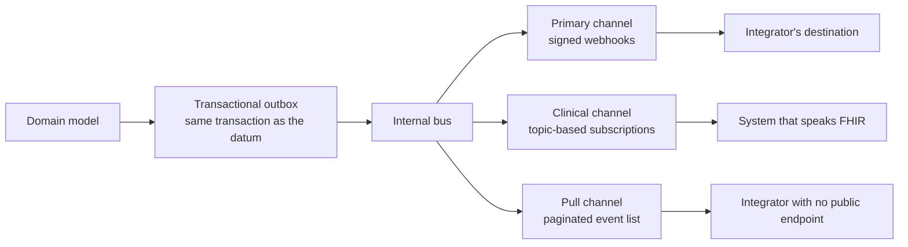

# Events and webhooks

What an event envelope is, how HTTP message signing works and what the possible delivery semantics
are is explained in the module
[«The protocols, one by one», §6](/10_fondamenti/13-protocolli.md). This chapter describes
**which events Telemedic publishes, in what form, with what guarantees and under what contract**.

## 1. Two channels, a single source



**The transactional outbox is the single source.** The event is written in the same transaction as
the domain datum and published by a forwarding component. There are no lost events - because the
write is atomic with the datum - nor phantom events - because no event is produced by a second
application write that might not correspond to a fact that actually occurred.

The three channels are fed from the same bus. The correspondence between the primary channel's
catalogue and the clinical channel's topics is **published as a table**, not left to be inferred.

### 1.1 Why the primary channel is not the clinical one

The subscription model of the clinical specification in its original form has structural defects
that prevent its use as the sole channel, and it is the reason why the standards body itself
superseded it:

1. **The criterion is applied to the new value of the resource.** A deletion, or an update that
   makes the resource *leave* the criterion, **generates no notification**. An integrator expecting
   to learn when a service is cancelled would be left deaf.
2. **Computational cost.** Every write must be compared against every active subscription.
3. **No control over the content**: either the complete resource or nothing.
4. **No heartbeat, no handshake, no destination verification.** «No events» cannot be distinguished
   from «broken channel».
5. **No numbering of the notifications**: there is no way to notice a gap.
6. **Weak authentication**: a static token in a header is the only mechanism provided for. No
   signature.
7. **No retries and no dead-letter queue** defined by the specification.

There is a further limit that no evolution can remove: **events that are not state changes of a
clinical resource cannot be expressed**. Network quality falling below a threshold during a session,
consent to recording withdrawn mid-flight, a session that failed because the relay was unreachable,
delivery of a document refused by the recipient: these are facts the integrator must know about and
that are not the writing of a resource.

## 2. The envelope

### 2.1 Structured mode

The body is an event in the **CloudEvents 1.0** envelope format, in *structured* mode: the whole
event in the JSON body. The mandatory context attributes are four - id, source, spec version, type -
with the constraint that the producer **MUST** guarantee the uniqueness of the source-and-id pair
for every distinct event. The optional attributes used are the data content type, the data schema,
the subject and the time.

| Attribute | Value in Telemedic |
|---|---|
| `specversion` | `1.0` |
| `id` | Sortable event identifier, unique within the source |
| `source` | `https://telemedic.example/tenants/{tenantId}` |
| `type` | `telemedic.<domain>.<fact>.v<N>` - reverse namespace with explicit version |
| `subject` | Reference to the aggregate, e.g. `Encounter/enc-3c8f1a20` |
| `time` | Instant in RFC 3339 format, with milliseconds and zero offset |
| `datacontenttype` | `application/json` |
| `dataschema` | Address of the content's schema, **versioned** |

The referenced schema makes the content **self-describing and validatable**, and it links directly
to type generation in the client libraries.

### 2.2 Binary mode, and the prohibition to respect

*Binary* mode - attributes in the headers, application data in the body - is offered as a per-destination
option. The formation rule is verbatim:

> *«all CloudEvents context attributes, including extensions, MUST be mapped to HTTP headers with
> the same name as the attribute name but prefixed with `ce-`.»*

| Attribute | Header |
|---|---|
| `id` | `ce-id` |
| `source` | `ce-source` |
| `specversion` | `ce-specversion` |
| `type` | `ce-type` |
| `subject` | `ce-subject` |
| `time` | `ce-time` |
| `dataschema` | `ce-dataschema` |
| `datacontenttype` | **no prefixed header** |

The special treatment of the last attribute is normative:

> *«the HTTP `Content-Type` header value corresponds to (MUST be populated from or written to)
> the CloudEvents `datacontenttype` attribute. Note that a `ce-datacontenttype` HTTP header MUST
> NOT also be present in the message.»*

**Emitting the prefixed header for the content type is a violation of a negative obligation of the
specification.** The content type goes **only** in the ordinary header. The project encodes this
prohibition in a dedicated test, which fails if the forbidden header appears in a delivery.

### 2.3 What the data contains

**Project choice** (P-07): **references, not clinical content**. The data content carries
identifiers and references; the recipient retrieves the content with an authenticated call.

Three converging justifications: data minimisation; harm reduction if a destination is
misconfigured or compromised; consistency with the id-only level provided for by the clinical
channel.

```http
POST /webhooks/telemedic HTTP/1.1
Host: gestionale.integratore.example
Content-Type: application/cloudevents+json; charset=utf-8
User-Agent: Telemedic-Webhooks/1
Telemedic-Event-Id: 01J9ZC7Y4Q7K9V0R2M4T8N1B3D
Telemedic-Event-Type: telemedic.session.completed.v1
Telemedic-Tenant: t0001
Telemedic-Delivery-Id: 01J9ZC80B2W5F6H7J8K9L0M1N2
Telemedic-Delivery-Attempt: 1
Telemedic-Timestamp: 1789234882
Telemedic-Signature: v1=6a5f0c8d1e2b3a4c5d6e7f8091a2b3c4d5e6f708192a3b4c5d6e7f8091a2b3c4
Content-Digest: sha-256=:X48E9qOokqqrvdts8nOJRJN3OWDUoyWxBf7kbu9DBPE=:

{
  "specversion": "1.0",
  "id": "01J9ZC7Y4Q7K9V0R2M4T8N1B3D",
  "source": "https://telemedic.example/tenants/t0001",
  "type": "telemedic.session.completed.v1",
  "subject": "Encounter/enc-3c8f1a20",
  "time": "2026-09-14T10:41:22.481Z",
  "datacontenttype": "application/json",
  "dataschema": "https://telemedic.example/schemas/session-completed/1.2.0.json",
  "data": {
    "sessionId": "ses_01J9ZC5P",
    "tenantId": "t0001",
    "sequence": 412,
    "encounter": { "reference": "Encounter/enc-3c8f1a20" },
    "appointment": { "reference": "Appointment/apt-51b7" },
    "startedAt": "2026-09-14T10:12:04Z",
    "endedAt": "2026-09-14T10:41:19Z",
    "outcome": "completed",
    "sessionVerified": true,
    "recordingPresent": false,
    "links": {
      "self": "https://telemedic.example/v1/sessions/ses_01J9ZC5P",
      "fhirEncounter": "https://telemedic.example/fhir/Encounter/enc-3c8f1a20"
    }
  }
}
```

The headers with the project's own prefix **are not standard** and are documented as project
choices. They repeat in the headers information present in the body so as to allow deduplication and
routing **without parsing the body**, which is what a recipient must be able to do before verifying
the signature. The body digest header, on the other hand, is standard, defined by **RFC 9530**:
using it instead of a proprietary header allows existing libraries to be reused.

## 3. The catalogue of public events

The event type carries the **major version in the name** (P-09). A breaking change produces a new
type, not a silent mutation of the old one; during the transition both forms are emitted to the
recipients that have subscribed to them.

| Type | When | Content | Criticality |
|---|---|---|---|
| `telemedic.session.created.v1` | Media session created | Identifiers, mode, reference to the service | Ordinary |
| `telemedic.session.started.v1` | First connection established | Instant, outcome of the session verification | Ordinary |
| `telemedic.session.degraded.v1` | Quality below the threshold declared for the tenant | Measured quantities, threshold applied, automatic action taken | Ordinary |
| `telemedic.session.failed.v1` | Session not established or interrupted without recovery | Classified cause, attempts | **High** |
| `telemedic.session.completed.v1` | Session concluded | Instants, outcome, presence of a recording | **High** |
| `telemedic.encounter.status-changed.v1` | State transition of the service | Previous and new state, instant | Ordinary |
| `telemedic.document.issued.v1` | Clinical document signed and issued | Reference to the document, type, digest | **High** |
| `telemedic.document.superseded.v1` | Document replaced by a later version | Reference to the new one and to the previous one | **Critical** |
| `telemedic.document.voided.v1` | Document annulled | Reference, classified reason | **Critical** |
| `telemedic.document.delivery-failed.v1` | Delivery of the document to the recipient definitively failed | Recipient, cause, last attempt | **Critical** |
| `telemedic.recording.consent-granted.v1` | Consent to recording given | Reference to the consent, validity | **High** |
| `telemedic.recording.consent-revoked.v1` | Consent withdrawn | Reference, instant, effect on retention | **Critical** |
| `telemedic.recording.available.v1` | Recording available | DocumentReference, **actual** container | Ordinary |
| `telemedic.measurement.received.v1` | Measurement acquired | Reference, origin, instant of measurement and of receipt | Ordinary |
| `telemedic.alert.raised.v1` | Threshold configured by the professional exceeded | Reference to the plan, parameter, threshold applied | **Critical** |
| `telemedic.alert.acknowledged.v1` | Alert taken on | Who, when | **High** |
| `telemedic.alert.escalated.v1` | Alert not taken on within the window | Escalation level reached | **Critical** |
| `telemedic.measurement.silence-detected.v1` | Absence of expected measurements beyond the window | Plan, parameter, last datum received | **Critical** |
| `telemedic.webhook.endpoint-verification.v1` | Verification of ownership of the destination | Challenge to be signed | Ordinary |

Three observations on the catalogue.

**A missing measurement is an event.** Constraint [V-09](../11_registri/01-vincoli-in-vigore.md#v-09) requires the absence of a datum to be clinical
information and silence not to be treated as normality. A measurement plan that provides for two
readings a day and receives none for three days **produces an event**: not staying silent is the
function.

**The recording's container is in the event's content, not assumed.** This is constraint [V-11](../11_registri/01-vincoli-in-vigore.md#v-11): the
container is negotiated at runtime and the actual value travels in the notification, because the
recipient must not have to infer it.

**Critical events have distinct treatment.** Failure to deliver a critical event does not end up
silently in the dead-letter queue: it triggers an escalation to the tenant's administrator, because
a system of origin that does not know that a report has been annulled goes on displaying it to a
professional who takes decisions.

**Events do not carry disclosure capability to those who have no right to it.** In particular the
variant of a completion event intended for financial settlement carries only the service identifier,
the administrative outcome and the amount, **never references to clinical documents**: it is the
corollary of constraint [V-08](../11_registri/01-vincoli-in-vigore.md#v-08), raised as question **[Q-163](../11_registri/02-questioni-aperte.md#q-163)** by the integration area and adopted by
this area as a catalogue constraint.

## 4. The signature

### 4.1 The symmetric scheme, a declared option

The signing base is constructed explicitly and does not depend on how the recipient normalises the
headers:

```
signing_base = timestamp || "." || event_id || "." || raw_body
signature    = hex( HMAC-SHA256( secret, signing_base ) )
```

The header value is a list of version-and-signature pairs, to allow **secret rotation**: during the
rotation window two signatures are emitted, with the old and the new secret, and the recipient
accepts if **at least one** verifies.

**The four verification rules on the recipient's side**, to be documented explicitly because they
are the main source of integration errors:

1. **Verify on the raw bytes of the body, before any deserialisation.** If the recipient's
   application framework re-serialises the JSON, the signature will never match, and diagnosing this
   problem costs days.
2. **Compare in constant time.** A naive comparison leaks information about the secret.
3. **Reject if the difference between the current instant and the declared one exceeds the window.**
   The timestamp is **inside** the signing base: without that, an attacker could modify it to extend
   the replay window.
4. **Deduplicate on the event identifier**, with a window at least equal to the replay one.

### 4.2 The asymmetric scheme, the default

**RFC 9421**, «HTTP Message Signatures», February 2024, standardises exactly this problem. It
defines two fields: one for the metadata - which components of the message are covered and with
which parameters - and one for the signature value. The derived components that can be used include
the method, the target URI, the authority, the path and the query string, as well as ordinary fields
such as the content digest. The signature parameters are creation, expiry, key identifier,
algorithm, nonce and tag.

**RFC 9421 does not define the body digest field**: that is **RFC 9530**. They are two distinct
documents and must be cited distinctly.

| Criterion | Symmetric scheme | RFC 9421 asymmetric |
|---|---|---|
| Standard | No, a project convention | Yes |
| Non-repudiation | **No**: the secret is shared, the recipient could forge | **Yes** |
| Coverage of method and destination | To be added by hand | Native |
| Signature expiry | To be added by hand | Native |
| Mature libraries in 2026 | Ubiquitous | Growing, not ubiquitous |
| Cost for the SME-bracket integrator | Low | Medium to high |

**Project choice: both configurable per destination, with the asymmetric scheme as the default**
([`V-162`](../11_registri/01-vincoli-in-vigore.md#v-162)). The reason is that when the notification carries the outcome of a healthcare act and
feeds an audit trail, the difference between «I can verify» and «I can demonstrate to a third
party» is substantive: with a shared secret the recipient cannot prove to anyone that the message
came from Telemedic, because they could have forged it themselves.

The symmetric scheme remains available as a **declared option per destination**, and the reason it
has not been removed is that the typical SME integrator can consume HMAC and cannot always consume
RFC 9421. **The cost of that choice is not concealed**: enabling the symmetric scheme towards a
destination means giving up non-repudiation for that destination, and the waiver is to be recorded
together with the configuration, not left implicit. Within the perimeter of `RU-1` the shared
secret is **not offered as the default mode** ([`V-162`](../11_registri/01-vincoli-in-vigore.md#v-162),
[`09_roadmap/03 §3.7`](/09_roadmap/03-primo-rilascio-utilizzabile.md)), and the order in which
scope is sacrificed states that, should the asymmetric signature fall, **the shared secret is not
its permitted substitute**: either the asymmetric signature, or the event does not go out to third
parties.

### 4.3 Secret rotation

1. The integrator or a scheduled task requests rotation.
2. Telemedic generates the new secret, returns it **once only** and marks it pending.
3. For a configurable window **both** secrets are active and every delivery carries two signatures.
4. On expiry the previous secret is deactivated.
5. The secret is stored encrypted at rest and **is never re-readable in the clear** from the
   interface.

There is a **forced immediate rotation** with no window, for cases of suspected compromise, and it
is audited.

## 5. Delivery: retries, isolation, dead-letter queue

### 5.1 The retry policy

**Project choice** (P-08): exponential backoff with **mandatory jitter**, twelve attempts, coverage
of roughly seventy-two hours.

Jitter is not decorative. Without it, a five-minute outage at the integrator produces, on recovery, a
synchronised burst of all the accumulated events: **an involuntary denial-of-service attack against
the partner**.

| Delivery outcome | Retry |
|---|---|
| `2xx` | No: delivered |
| `410 Gone` | No: destination decommissioned → automatic deactivation and notification to the tenant's administrator |
| Other `4xx` | No: permanent error of the recipient → dead-letter queue |
| `408`, `429`, `5xx` | Yes |
| Network error, timeout | Yes |

On `429` and `503` the suggested delay is respected if present and greater than the computed backoff.

### 5.2 Isolating noise between tenants

After a configured number of consecutive failures the destination moves to a degraded state:
delivery frequency is reduced and the tenant's administrator is notified. After a configured
duration of total failure the destination moves to a deactivated state and the events go to the
dead-letter queue.

It is not a courtesy towards the broken partner: it is the protection of the **other** tenants.
Without it, a tenant with an unreachable destination consumes everybody's delivery capacity. It is
the operational corollary of the tenant-awareness constraint.

### 5.3 Dead-letter queue and replay

Events not delivered after the attempts are exhausted end up in a **per-tenant** dead-letter queue,
with:

- configurable retention;
- an inspection interface, which exposes the request and the observed outcome;
- a replay interface;
- **replay reuses the same event identifier**, so that deduplication on the recipient's side keeps
  working and the replay does not produce duplicates.

The last point is the difference between a useful replay and a replay that doubles the data in the
partner's record.

### 5.4 Verification of ownership of the destination

Before activating a destination, Telemedic sends a verification event with a challenge; the
destination must respond by signing the challenge. It prevents a destination being pointed at a
system that is not under the requester's control, which would be a reflected amplification vector.

There are moreover two self-service diagnostic interfaces for the integrator: a test that sends a
signed synthetic event and returns the observed outcome, and the delivery history filterable by
outcome. They cut the support load drastically.

## 6. Ordering and deduplication

They must be stated in the contract, because they are the two things integrators assume by mistake.

- **Delivery is at least once, not exactly once.** The recipient **must** be idempotent. The declared
  deduplication key is the event identifier.
- **There is no guarantee of global ordering.** With retries and concurrent delivery, a completion
  event may arrive before a start event.
- **There is an optional per-key ordered mode.** Events with the same partition key - typically the
  session or service identifier - are delivered in sequence, blocking that key's queue in the event
  of a failure. **The cost is declared: a blocked event blocks the key.** It is offered as an
  option, never as the default behaviour.
- **Reconstructing the order on the recipient's side is the recommended mechanism.** Every event
  carries the instant and a **monotonically increasing sequence number per aggregate**. The
  recipient discards events with a sequence lower than the one already applied for the same
  aggregate. It is the model that makes arrival order irrelevant without forcing ordered queues.

## 7. The outbound request to a user-supplied address

A webhook is **a request that Telemedic makes to an address chosen by the integrator**. It is the
most underestimated risk in this chapter: an address pointing to an internal service or to an
infrastructure metadata endpoint would turn the system into an authenticated proxy into its own
network.

The full set of rules belongs to the security area. This area records three statements that concern
it directly:

1. **The principal defence is at network level**, not in the application: the component that delivers
   the events runs in a segment with egress rules that forbid access to the internal segments. The
   application-level validations are defence in depth.
2. **The body of the recipient's response is never returned to the integrator through the
   interface**, other than as a status code and possibly the first sanitised bytes. Without this rule
   a request directed at internal resources would become a request with exfiltration.
3. **The control must be implemented once only**, in a component shared by all the egress points -
   event delivery, resolution of public key sets, document retrieval, calls towards the system of
   origin - and not repeated for each of them. This is question **[Q-16](../11_registri/02-questioni-aperte.md#q-16)** opened towards the security
   area and the technical area, and this area supports it: four implementations of the same
   protection produce four different behaviours, and the weakest one is the one that counts.

## 8. The clinical channel: topic-based subscriptions

### 8.1 The verified form

The topic-based model is brought onto R4 by the backport guide, version **1.1.0**. The paradigm
changes: no longer an arbitrary search criterion, but a **topic defined and published by the
server**, to which the client subscribes, filtering on parameters that the topic declares
filterable.

Two verified clarifications, both frequently got wrong in the secondary literature:

- **there is no backport extension for the link to the topic.** The topic's canonical is written
  **directly in the subscription's criteria**. Fine-grained filtering goes in the extension dedicated
  to the filter criterion;
- **in R4 there is no subscription status resource.** That resource belongs to the later releases. In
  R4 the status travels as a parameters resource conforming to the dedicated profile, and **the
  parameter names are in *kebab-case***, not camelCase. The correct name of the element that numbers
  the event is the hyphenated one, nested inside the notification element.

The extensions actually defined by the guide are seven: additional channel types, filter criterion,
heartbeat period, maximum count, payload content information, expiry, and the topic's canonical on
the capability statement.

The permitted values for the payload content are three: empty, id-only, full resource.

> **Project rule:** **id-only** as the default behaviour, **full resource disabled** on channels
> directed at the public network. The full resource is permitted only towards destinations on
> dedicated networks, and enabling it is an audited administrative act.

### 8.2 The operations

| Operation | Mandatory per the guide | Status in Telemedic |
|---|---|---|
| Subscription status | **Mandatory** | Exposed |
| Retrieval of notifications by range | Optional | Exposed |
| Binding token for the WebSocket channel | Optional | **Not exposed in v1.0** |

The numbering of the notifications and the count since the start of the subscription solve the
**gap detection** problem: the recipient knows whether it has missed a notification and retrieves it
with the dedicated operation. This, together with the status and the heartbeat, is what makes the
topic-based model genuinely operable and the original model not.

### 8.3 The subscription's life cycle is tied to the client's identity

The specification warns that subscriptions **stay active even after the expiry of the token of the
client** that created them, inheriting its access restrictions. In a multi-tenant context this is a
substantive risk: a subscription created by an integrator would keep delivering data after their
credentials had been revoked.

**Project rule:** every subscription is tied to the identity of the client that created it and to the
tenant. Revocation of the client's credentials, suspension of the tenant and expiry of the
engagement automatically deactivate the linked subscriptions, with notification to the administrator.
The permitted destinations are on an **explicit list**, shared with the list of webhook destinations
(question **[Q-161](../11_registri/02-questioni-aperte.md#q-161)**).

## 9. The pull channel

For the integrator that cannot expose a public endpoint - an installation behind network address
translation, a security policy that does not allow inbound connections - there is a paginated event
list on the application plane, queryable by instant and by cursor. It is the same event stream, read
instead of delivered.

It has a declared limit: **the latency is that of the client's polling frequency**, and critical
events thereby lose their property of being critical. For that case the project still recommends a
destination, even if only towards a minimal component in the partner's network that forwards to the
internal system.

## 10. The contract towards the integrator

**What is guaranteed.** At-least-once delivery with documented retries and an inspectable
dead-letter queue; authenticity and integrity verifiable with a documented scheme; freshness, with a
declared window; deduplication possible on a declared key; observability, with the delivery history
queryable; stability of the catalogue under the deprecation policy; **no clinical content in the
payload**.

**What is not guaranteed, and must be written down.** Exactly once: never. Global ordering: never.
Per-key ordering: only with ordered mode active, and with the blocking cost declared. Delivery
within a maximum time: the retry coverage is declared, but a recipient unreachable for seventy-two
hours receives from the dead-letter queue, not from the stream. Non-repudiation: **only** with the
asymmetric scheme; with the default symmetric scheme the recipient can verify but not demonstrate to
a third party.

**What is required of the recipient, and without which the integration does not work.** Idempotency
on the declared key. Signature verification on the raw bytes. A fast response: the recipient accepts
and enqueues, it does not process inline - a slow recipient reduces its own delivery capacity, not
Telemedic's. Tolerance of unknown fields and unknown event types: **a new type is not a breaking
change**, and a recipient that errors on a type it does not know will break the first time the
catalogue is enriched.
