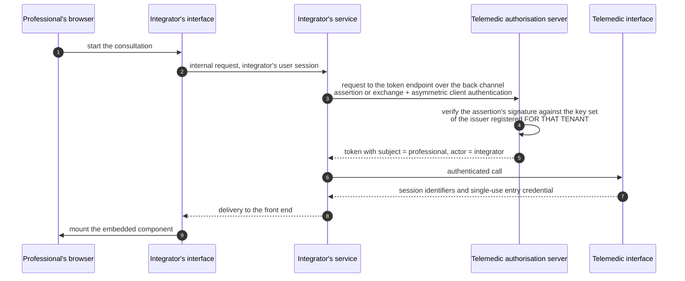

# Identity and authorisation

How OAuth works, the mechanics of code exchange with a verifier, the structure of a signed token,
the validation pitfalls and the meaning of the levels of assurance are explained in the module
[«The protocols, one by one», §4](../10_fondamenti/13-protocolli.md), and the three Italian
identity channels in the module
[«Identity and demographic registries»](../10_fondamenti/04-identita-e-anagrafiche.md). This chapter
describes **which profiles Telemedic implements, how it propagates the identity of a user
authenticated elsewhere and what it guarantees to integrating parties**.

## 1. The starting constraint

The integrator already has their own authentication. Telemedic must accept federated identities
**without forcing users into a second login**, and without becoming the identity register. Three
statements follow that govern the whole chapter:

1. **The identity assertion never transits through the browser.** A statement that «this is
   professional X» that arrives through the user agent is manipulable. Propagation happens **service
   to service**, over the back channel.
2. **Delegation is used, never impersonation.** The audit trail must be able to answer the question
   «which system acted on behalf of which person». With impersonation that question has no answer.
3. **The project is compliant and verifiable, not accredited.** On the national identity channels the
   service provider is **the deployer**, never the project. This is constraint V-05, and it changes
   what the documentation may assert.

## 2. The baseline posture

The security reference is **RFC 9700**, current best practice for OAuth 2.0 security. The
prescriptions that bind the project:

| Prescription | Section | Text |
|---|---|---|
| Exact matching of redirect URIs | §2.1, §4.1.3 | Servers «MUST utilize exact string matching»; the only exception is the local port for native applications |
| Code exchange verifier | §2.1.1 | Public clients «MUST use PKCE»; servers «MUST support PKCE» |
| Implicit grant | §2.1.2 | Clients «SHOULD NOT use the implicit grant» |
| Resource owner password credentials | §2.4 | «MUST NOT be used» |
| Refresh tokens of public clients | §2.2.2 | «MUST be sender-constrained or use refresh token rotation» |
| Defence against server mix-up | §2.1, §4.4.2 | Clients that talk to more than one server «SHOULD» use the issuer identification parameter of **RFC 9207** |
| Privilege restriction | §2.3 | Access tokens «SHOULD be audience-restricted to a specific resource server» |
| Request forgery | §2.1, §4.7.1 | Clients «MUST» defend themselves with state, the verifier or a nonce |

**Telemedic's default posture**, which goes beyond the minimum on three points:

1. the implicit grant and the resource owner password credentials are **disabled in the federation
   product's configuration**, not merely discouraged;
2. the verifier with the hashed method is mandatory **on all clients, including confidential ones**,
   and the plain method is refused;
3. every token carries an explicit audience, and a resource server that does not recognise itself in
   the audience **refuses**, instead of accepting any token issued by its own issuer.

## 3. The profiles supported

| Profile | Version | When it is used | Telemedic's role |
|---|---|---|---|
| **SMART App Launch** | 2.2.0 (from 1 March 2023) | Telemedic launched inside a clinical record system; or Telemedic launching a clinical application | Server **and** client |
| **SMART Backend Services** | 2.2.0 | The integrator's service calls Telemedic with no user | Server **and** client |
| **Token exchange** | RFC 8693 | Propagation of the identity of a user authenticated by the integrator | Server |
| **Assertion grant** | RFC 7523 §2.1 | Alternative to the previous one, with an assertion signed by the integrator's issuer | Server |
| **Asymmetric client authentication** | RFC 7523 §2.2 | Client authentication with no shared secret | Server |
| **Authorisation in an IHE context** | rev. 2.5 | A tender specification that requires conformance with that profile | Documentary correspondence, §7 |
| **Dynamic registration** | RFC 7591 / 7592 | Automated onboarding, **authenticated only** | Server, with restrictions |
| **Introspection and revocation** | RFC 7662 / RFC 7009 | Token verification and revocation | Server |
| Certificate-based dynamic federation | — | **Out of scope for v1.0**, §8 | — |

## 4. The authorisation scopes

### 4.1 The clinical syntax

The general form is the context prefix, the resource type and the permissions, with an optional
refinement on search parameters. There are three prefixes: access restricted to the patient in
context, access equal to what the user would have anyway, system access with no user.

The letters in the current version are create, read, update, delete and search, and they **must
appear in the order of the string that enumerates them**: two reordered combinations are not valid.

**Project choice:** the current syntax as the native form, **acceptance of the previous syntax on
input** with the conversion defined by the specification itself — read to read and search, write to
create, update and delete, wildcard to all. The justification is friction: the typical integrator
quite probably has dated libraries, and refusing them would produce friction with no security gain,
given that the conversion is normatively defined.

Refinement with search parameters is supported and is the feature that makes least privilege
possible without inventing bespoke scopes:

```
patient/Observation.rs?category=http://terminology.hl7.org/CodeSystem/observation-category|vital-signs
```

### 4.2 The product scopes

Capabilities that do **not** correspond to clinical resources must not be disguised as clinical
scopes. The specification provides for two legitimate forms of non-standard scope: a full URI, or a
conventional prefix. **Telemedic uses the URI form**, which is self-documenting and does not
collide.

```
https://telemedic.example/scopes/session.start
https://telemedic.example/scopes/session.join
https://telemedic.example/scopes/recording.consent.manage
https://telemedic.example/scopes/webhook.manage
https://telemedic.example/scopes/monitoring.plan.manage
https://telemedic.example/scopes/bulk.export
```

Forcing the start of a session inside a write scope on the encounter would be a semantic abuse and
would make it **impossible to revoke one without the other**.

**Rule on the bulk export scope:** it is never granted by default, its granting is an audited
administrative act, and its presence in a token triggers the mandatory introspection of §6.

### 4.3 The scope returned may be narrower than the one requested

It is a recurrent integration error and must be written into the public documentation: **the client
must read the scope returned in the token response and not assume it coincides with the one
requested**. Telemedic narrows the scope to the effective grant of the client, of the tenant and —
in the case of delegation — of the subject's permissions.

## 5. Delegation between organisations

### 5.1 The problem, in a diagram



The crucial point is that **the user's token never reaches Telemedic's browser and never appears in
a URL**.

### 5.2 Delegation, not impersonation

The distinction is normative, defined in **RFC 8693 §1.1**, and it has direct consequences for the
immutable audit trail.

**Impersonation**: only the subject's token is presented. The resulting token makes the integrator
indistinguishable from the user. The audit trail would record only «professional X did Y», losing
the information «through system Z».

**Delegation**: the resulting token contains **both** identities, with the actor expressed in the
dedicated claim of **RFC 8693 §4.1**. The nested chain is preserved: if the integrator was in turn
acting on behalf of a third party, the chain records it.

> **Binding project rule: delegation is always used, never impersonation.** No supported
> configuration issues a token without the actor claim when the identity comes from an external
> issuer.

```json
{
  "iss": "https://telemedic.example/oauth2",
  "aud": "telemedic-api",
  "sub": "https://idp.integratore.example#prof-0071",
  "act": {
    "sub": "b1f2c3d4-client-integratore",
    "iss": "https://telemedic.example/oauth2"
  },
  "exp": 1789235182,
  "iat": 1789234882,
  "jti": "0f5b1c2d-9a8e-4b7f-a1c2-3d4e5f6a7b8c",
  "scope": "https://telemedic.example/scopes/session.start system/Encounter.cu",
  "acr": "https://www.spid.gov.it/SpidL2",
  "tm_acr_origin": "asserted-by-client",
  "tenant": "tenant-a",
  "fhirUser": "https://telemedic.example/fhir/PractitionerRole/prole-4d1c"
}
```

Notes on the claims, distinguishing what is normatively defined from what belongs to the project:

- the **subject** is not an identifier invented by Telemedic: it is derived deterministically from
  the issuer and the subject of the original token. That way two professionals with the same name
  from two different integrators do not collide, and the project does not become the identity
  register;
- the **actor** is the claim normatively defined by RFC 8693 §4.1;
- the **authentication context** is normatively defined, but its qualification belongs to the
  project: §6.3;
- **tenant** and **clinical user** are project claims; the second reuses the claim name from the
  application launch profile for consistency;
- **no claim carries clinical content or direct patient identifiers.** Whoever intercepts the token
  reads it.

### 5.3 Who validates the assertion, and how trust arises

The model is **per tenant** and admits no shortcuts:

1. At activation time, for each tenant a **trust anchor** is registered: the integrator's issuer, the
   address of its public key set, the permitted algorithms, the expected audience.
2. The client presenting the request is tied to the tenant. The link client → tenant → trust anchor
   is the only route: **an assertion whose issuer is not the trust anchor of the calling client's
   tenant is not accepted**. Without this check, integrator A could present an assertion from
   integrator B's issuer.
3. Validation: signature, issuer, expiry, not-before, audience, and **algorithm from an explicit
   list**. Never the null algorithm, never a symmetric algorithm over a public key.
4. Mapping of the claims onto the internal identity through a translator **configurable per tenant**:
   which claim carries the role, which the organisation, which the professional identifier.
   Configurable, not hard-coded: no logic tied to a single integrator.

The key set address is on an **explicit per-tenant list**. An arbitrary address in a token's header
is a surface for requests towards internal resources and a key confusion vector: the value in the
header **must never be followed blindly**, it must be compared with the one registered for that
client, and if it does not match the request is refused. The key set cache has a lifetime, forced
retrieval happens only on an unknown key identifier, and it is rate-limited so that a random
identifier does not become a traffic amplifier towards third parties. It is the same single registry
of question **Q-161**.

### 5.4 Two mechanisms, and a release gate

Two mechanisms achieve the same thing and must be kept distinct because they have different grant
types. **RFC 7523 defines two uses of the signed token that are easily confused**: as an
authorisation grant (§2.1, assertion parameter, dedicated grant type) and as client authentication
(§2.2, client assertion parameters, with any grant type). The backend services profile uses the
**second**; identity chaining uses **both, in different steps**.

**Primary documented mode:** assertion grant. The integrator presents at Telemedic's token endpoint
an assertion signed by its own issuer.

**Alternative mode:** pure token exchange, with the caveat that the availability of exchange from an
external to an internal issuer **depends on the version of the federation product adopted**.

> **Release gate, non-negotiable.** At the time of the research, the federation product adopted
> offered conformant token exchange with an initial scope of **internal-to-internal**, and the
> assertion grant in **preview** status. **A capability resting on a preview feature is not declared
> generally available.** It is a software life cycle quality requirement, not a stylistic
> precaution. The verification must be carried out against the exact version adopted **before** it
> is written into the public documentation.
>
> **To be asked of**: the architecture area and the technical area, with empirical verification
> against the version actually adopted. It is connected to question **Q-160** on the noticeboard,
> which concerns another unverified behaviour of the same federation product.

### 5.5 When delegation is not used

| Situation | Why | Alternative |
|---|---|---|
| The integrator has no issuer with publishable keys | There is nothing to validate | Classic federation with a login, possibly silent |
| A system identity is needed, not a user identity | A fictitious subject would be added | Client credentials with asymmetric authentication |
| The flow starts from the browser and the integrator has no service | The assertion would transit the browser: manipulable and loggable | Code exchange with a verifier, and federation |
| The integrator's token is opaque and there is no introspection | No way to validate it | Ask for a signed identity token |
| The integrator wants «a token that lasts all day» | It defeats revocation | Repeat the exchange on every operation: it costs a call, not a session |

## 6. The level of assurance, and how it propagates

### 6.1 The values

The values of the three national identity levels are verified and **identical** in the two technical
profiles in which they can appear — the assertion in the XML envelope profile and the parameter in
the identity connection profile:

| Level | Exact value | Correspondence per the international standard on levels of assurance |
|---|---|---|
| Level 1 | `https://www.spid.gov.it/SpidL1` | Level 2 |
| Level 2 | `https://www.spid.gov.it/SpidL2` | Level 3 |
| Level 3 | `https://www.spid.gov.it/SpidL3` | Level 4 |

In the XML envelope profile the values sit in the authentication context element inside the context
request; in the identity connection profile they sit in the context values parameter, **space-separated
and in decreasing order of preference**. The syntax is cited verbatim from the source: *«A
space-separated string specifying the "acr" values requested of the authorisation server for
processing the authentication request, with the values displayed in order of preference.»*

> **`[NV]` — values accepted by the provider of the document-based electronic identity.** The
> technical rules describe the context values parameter but **refer to the provider's metadata** for
> the actual list. The values must therefore be **read from the metadata at runtime**, not
> hard-coded. If a static list is needed, it must be requested from the identity operator and cited
> with the contractual document, not with a public technical source.
> **To be asked of**: the integration area, which owns the federation.

### 6.2 Where the level travels

**Not in the actor claim.** RFC 8693 §4.1 expresses delegation, not the level of assurance: putting
it there would be an abuse of the claim. The level travels in the **authentication context**, which
is the claim provided for that purpose.

### 6.3 The qualification, which is the part that counts

A level of assurance in a token can mean two radically different things:

- **the authentication was performed by Telemedic**, which saw the identity provider's assertion and
  verified its signature;
- **the level is reported by the integrator**, which states that it authenticated the user at that
  level within its own domain.

They are two facts with different evidential weight, and confusing them means giving a third party's
statement the weight of a verification of one's own. The project distinguishes them with a
**proprietary marker, alongside the normative claim**, that declares the origin of the level:
performed by the system, or asserted by the client. The marker is a project claim, declared as such,
and it is **recorded in the audit trail together with the operation**: the immutable audit trail
must be able to say with what level of assurance, and on what basis, an operation was performed.

### 6.4 The constraint that arises from the federation configuration

An established fact that binds the architecture: the connector towards the national identity channel
configures the requested authentication context **statically on the individual provider instance**.
A level that varies by operation therefore requires **one instance for each provider-and-level
pair**. The scoping decision taken by the integration area reduces the factor to two — a base level
and a higher one for administrative operations — rather than to the cardinality of the levels.

Towards the integrator **there is no interface impact**: what changes is that the level propagated
is the one **requested**, not the one asserted in return. This distinction has a verified reason: on
the document-based electronic identity channel the technical rules declare that the context returned
is **always the highest level**, so **the effective level cannot be inferred from the assertion**.
Whoever reads the level from the response reads a constant value.

> **`[NV]` — forwarding of the requested level through the intermediating realm.** It is not
> verified whether the federation product, acting as a client towards an external provider, forwards
> the requested level parameter through the realm that acts as intermediary. If it does not forward
> it, per-operation level step-up is not obtainable by configuration alone. This is question
> **Q-160** on the noticeboard, and the empirical verification must be put on the critical path
> **before** declaring in public documentation how the level propagates.
> **To be asked of**: the architecture area and the technical area.

## 7. Application launch in a clinical context

### 7.1 The two modes

**Launch from the clinical record system.** The record system opens the launch URL with two
parameters: the issuer, which identifies the record system's clinical entry point, and an opaque
launch identifier with the associated context. **The application must not interpret** the opaque
identifier: it sends it back to the authorisation server together with the dedicated scope.

**Standalone launch.** The application is the starting point; the context is requested with the
dedicated scopes and the server presents a picker.

The parameters of the authorisation request, with their optionality:

| Parameter | Optionality | Value |
|---|---|---|
| Response type | Required | Fixed value for the code flow |
| Client identifier | Required | — |
| Redirect URI | Required | **Exact** match with a pre-registered one |
| Launch identifier | Conditional | Only for launch from the record system |
| Scopes | Required | Resources, identity, context |
| State | Required | Opaque value, **at least 122 bits of entropy** per the specification |
| Audience | Required | Address of the clinical resource server |
| Code challenge | Required | Version derived with a hash function |
| Challenge method | Required | The hashed method; the plain one is **forbidden** |

The audience parameter **is not cosmetic**: the specification justifies it because it «prevents a
genuine token from leaking to a counterfeit resource server». An authorisation server that does not
validate it lets a hostile server have valid tokens issued to itself.

On the verifier the specification is categorical: all applications **SHALL** support it, and servers
**SHALL** support the hashed method and **SHALL NOT** support the plain one. It is stricter than the
specification that defines the verifier, which also permits the plain method. In the federation
product's configuration the method is **forced**, and clients that do not present the challenge are
refused, not degraded.

### 7.2 The context that arrives with the token

The token issuance response extends the ordinary response with the context parameters: the patient's
identifier, the encounter's identifier, a list of references to further context resources, a hint
about the patient banner, an indication of the reason for the launch, an address to a style document
published by the record system, and an organisation identifier.

Four of these resolve project requirements that would otherwise call for proprietary extensions, and
they must be used **before** inventing any:

- the **patient banner hint** answers the question «does the host already show who the patient
  is?». If so, the embedded component **must not duplicate** the banner;
- the **style document address** is the **standard** mechanism for visual customisation of a clinical
  application, and it must be documented as the *first* theming mechanism when Telemedic is launched
  in this mode. It must however be treated as **untrusted input**: it is an address controlled by a
  third party, and its security rules belong to the security area;
- the **organisation identifier** maps directly onto the tenant context;
- the **list of context references** is the natural home for the reference to the appointment that
  originated the consultation, and it satisfies the requirement that the project be invocable with
  an already existing appointment.

### 7.3 The life cycle of the embedded component

The embedded application must be able to ask the host to do something — close the activity, open
another screen — without going through the clinical interface. There is a dedicated profile, at
version **1.0.0 of 6 May 2022**, on an R4 base.

The request envelope has four mandatory fields: a channel reference obtained during launch, a
message identifier generated by the application, the message type and the payload. The response has
the message identifier, the reference to the message it answers, an optional indicator of further
responses expected — **plural**, and the detail matters — and the payload.

The message types actually defined are **eight**, organised into four families:

| Type | Request payload | Response payload |
|---|---|---|
| Status handshake | empty | empty, with any error expressed as a coding |
| Activity done | empty | status, optional detail |
| Launch an activity | activity type and parameters | status, optional detail |
| Create in the scratchpad | resource | status, location, optional outcome |
| **Read the scratchpad** | location, **optional** | resource or list, optional outcome |
| Update in the scratchpad | resource with type and identifier | status, optional outcome |
| Delete in the scratchpad | location | status, optional outcome |
| Clinical call | Bundle | Bundle or outcome |

The scratchpad read type **exists and is valid**: it allows a single resource to be selected by
giving its location, or the entire content by omitting the location. The resources returned
**SHALL** include both the type and the identifier.

Not to be confused with the message types: the activity catalogue defines **three** launchable
activities — appointment booking, order review, problem review — each with a mandatory parameter of
its own. They are not message types and must not be mixed with them.

Channel security rules: the application **validates the origin** of every message received and the
host validates the target origin of every message sent; the target origin is the one communicated
during launch, **never the wildcard**. The channel reference is a bearer of authorisation inside the
channel: **it must never be logged nor put in a URL**.

**Use in Telemedic**, with a declared limit: the profile is the **standard** way to signal to the
host that the consultation has ended, and it is the one to use when the host implements it. Since the
reference integrator's profile almost certainly does **not** implement it, the project offers **both**
roads: the standard profile towards conformant hosts and a proprietary message protocol, documented
and versioned, for everyone else.

## 8. Tokens: format, lifetime, revocation

### 8.1 Format

| Aspect | Self-contained token | Opaque token with introspection |
|---|---|---|
| Validation latency | None | One network call, mitigable with a cache |
| Revocation | Delayed until expiry | Immediate |
| Exposure | The claims are readable by whoever holds the token | None |
| Size | Grows with the claims | Constant |

**Project choice: opaque tokens towards the outside, translated into self-contained tokens by the
gateway.** Advantages: effective revocation, no claims exposed, contained header size. Cost: the
gateway becomes a critical component and must be made redundant. The decision has an impact on
latency and topology and it is question **Q-135** opened towards the architecture area, which this
area does not decide.

### 8.2 Lifetime

| Token type | Lifetime | Reason |
|---|---|---|
| User token in a clinical context | 5–10 minutes | It carries claims about a clinical context: minimal replay window |
| System token | 300 seconds | The backend services specification explicitly indicates this value as recommended |
| Refresh token tied to the session | Tied to the single sign-on session | — |
| Refresh token that outlives logout | **Only for asymmetric confidential clients, with rotation** | On a public client, in healthcare, it is a custody risk hard to justify in a risk analysis |

### 8.3 The revocation window, honestly declared

A locally verified token **stays valid until expiry even after revocation**. It is the reason why
clinical tokens last minutes and not hours, and it must be documented instead of letting people
believe that revocation is instantaneous.

For revocations that must be immediate — professional disabled, tenant suspended — there is an
additional mechanism: a **distributed deny-list** on token identifier and subject, with a lifetime
equal to a token's maximum life, consulted by the gateway.

**Introspection on high-impact operations** (P-10): the resource servers **do not** use introspection
on the ordinary hot path, where they validate locally against the key set. They use it on
**irreversible or high-impact** operations: starting a session, publishing or annulling a document,
bulk export, modifying a measurement plan. The cost is a network call on those operations; the
benefit is that the revocation window does not apply precisely where it would be unacceptable.

Both endpoints — introspection and revocation — are published and declared in the discovery
document. Revocation answers with a positive outcome even if the token was already invalid, so as
not to provide an oracle.

### 8.4 Sender-constrained tokens

| Criterion | Application-level proof of possession | Mutual transport authentication |
|---|---|---|
| Browser client | Practicable, with a non-exportable key | Impracticable |
| Service to service | Practicable | **Preferable**: more mature, handled by the reverse proxy |
| Compatibility with transport termination | Indifferent | Requires propagating the certificate to the application |
| Rotation | Immediate | Tied to the certificate's life cycle |
| Maturity in the healthcare ecosystem | Low | **High**: connections between healthcare systems are often already mutual |

**Project choice:** mutual transport authentication as the **recommended** option for service-to-service
integration, consistent with the node authentication requirement of chapter
[05](./05-ihe.md); application-level proof of possession as the option for browser clients; the plain
bearer token as the documented default, with the explicit caveat that it is acceptable **only** over
protected transport and with short-lived tokens.

Two caveats: a proof-of-possession key stored in an extractable way **adds no security** compared
with a plain bearer, it adds complexity and a false sense of protection; and neither mechanism
replaces audience restriction — a sender-constrained token with too broad an audience remains
over-privileged.

## 9. Discovery

Telemedic publishes **two** discovery documents, with distinct purposes, and both are necessary:

| Document | Path | Describes |
|---|---|---|
| Clinical application launch configuration | well-known path under the clinical base | The capabilities of the clinical profile |
| Identity provider configuration | standard well-known path | The identity connection provider |

The **mandatory** fields of the first, verified: the grant types supported; the token endpoint; the
list of capabilities; the code challenge methods supported, which **must include** the hashed method
and **must not include** the plain one. Conditional are the issuer, if single sign-on with the
identity connection is supported; the key set address; the authorisation endpoint, if either launch
mode is supported. Recommended are the client authentication methods, the scopes supported, the
response types, the management endpoint, and the introspection and revocation ones.

**The clinical capability statement is no longer the discovery channel for the authorisation
endpoints.** The specification says so expressly: that mechanism is deprecated. Telemedic emits the
corresponding extension on the capability statement anyway for compatibility with dated clients, and
marks it as deprecated in the documentation.

## 10. Correspondence with the IHE authorisation profile

Since both profiles profile the same underlying protocol, **the implementation is the same**: what
changes is the conformance documentation. The table is what makes it possible to answer a tender
specification requiring that profile without rewriting anything.

| IHE profile transaction | Correspondence in Telemedic |
|---|---|
| Get Access Token (ITI-71) | Request to the token endpoint |
| Incorporate Access Token (ITI-72) | Authorisation header with a bearer token |
| Introspect Token (ITI-102) | Introspection endpoint, RFC 7662 |
| Authorization Server Metadata (ITI-103) | Identity provider discovery document |

The claims required by the profile — issuer, subject, client identifier, audience, expiry, scopes,
token identifier — are all present. The optional extensions that gather organisation, roles and
purpose of use into a dedicated object are emitted **at the tenant's request**, not always, so as
not to inflate tokens where they are not needed.

## 11. Client registration

**The registration endpoint is not open.** Two modes are supported:

1. **Assisted activation**, the default: a tenant administrator creates the client from the console,
   registering the key set address, the redirect URIs, the maximum scopes, the quotas and the event
   destinations.
2. **Authenticated dynamic registration**: the endpoint is protected by an initial access token
   issued per tenant, with maximum scopes limited by the tenant's policy.

An anonymous registration endpoint on a multi-tenant healthcare platform is a vector for abuse —
mass creation of clients, enumeration, requests towards internal resources through the key set
address — with nothing in return. And an endpoint that automates registration is taking decisions
that are contractual, not technical: which tenant, which scopes, which data processing agreement.

**Certificate-based dynamic federation** is documented as a pattern and **not implemented in v1.0**:
it is the trust mechanism of a non-European ecosystem, whereas in the target market trust is built
with other instruments. The client registration model does, however, remain **ready** for a trust
anchor based on a certificate chain, because the underlying mechanism — a signed assertion validated
against a chain — is identical to what a national federation would require.
