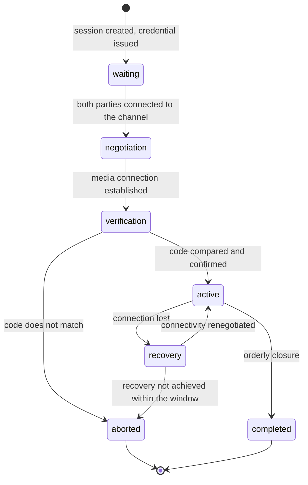

# Real time

> **Reading prerequisite.** The foundations of real-time media - why a video call is a hard problem,
> what network address translation is and what its types are, how candidate gathering and path
> selection work, what encryption does and does not guarantee, why the certificate fingerprint alone
> is not enough, how quality is measured - are in the module
> [«WebRTC from scratch»](/10_fondamenti/08-webrtc-da-zero.md). This chapter **does not repeat
> them** and describes only the project protocol.

## 1. Why there is a project protocol here

It is the only exception to the rule in chapter [01 §1.1](./01-principi-di-interoperabilita.md), and
the reason lies in the specification itself: **the exchange of session descriptions is deliberately
left out** of the normative corpus of real-time media, which standardises negotiation, transport,
security and congestion control, but not the channel over which the two parties exchange the
descriptions.

This is not a gap: it is a choice, because that channel depends on the application model. It follows
that every system defines one, and that the documentation's job is to **declare it in full**:
transport, envelopes, message catalogue, state machine, versioning.

## 2. The signalling transport

The transport is a **WebSocket channel** over a protected connection, with a JSON application
protocol that is **versioned and schema-validated**. The alternatives - an overlaying messaging
layer, a fallback to repeated HTTP requests, the adoption of a telephony protocol - add complexity
or session affinity constraints with no benefit in a two-participant session.

### 2.1 The normative requirement that binds the architecture

**RFC 8838 §9** establishes that the protocol carrying the candidates must deliver them
*«exactly once and in the same order it was conveyed»*.

Translated into a requirement: **the candidate queue for each session must be ordered and
reliable**. A «publish and forget» broadcast mechanism between several nodes of the signalling
service **does not guarantee this**, and the resulting defect is intermittent, load-dependent and
extremely hard to diagnose: the session establishes nine times out of ten and the tenth time it does
not, with no visible error.

The choice of how to distribute session state across several nodes is therefore **constrained by
this line**. The compatible options are connection affinity to the node that owns the session, or an
ordered queue per session key. The choice belongs to the architecture area; this area sets the
constraint and declares its source.

### 2.2 The envelope

```json
{
  "v": 1,
  "t": "candidate",
  "sid": "ses_01J9ZC5P",
  "seq": 7,
  "ts": "2026-09-14T10:12:07.114Z",
  "d": { }
}
```

| Field | Meaning |
|---|---|
| `v` | Major version of the protocol. A breaking change increments this number |
| `t` | Message type, from the catalogue in §3 |
| `sid` | Session identifier |
| `seq` | Monotonic sequence number **per direction and per session**: it is what makes the requirement in §2.1 verifiable |
| `ts` | Instant of emission |
| `d` | Content, with a schema that depends on the type |

**The message is schema-validated on arrival**, before any processing. A message that does not
validate is refused with a typed error, not partially interpreted. The protocol version is
negotiated when the channel is opened: a client declaring an unsupported version receives an
explicit refusal, not a channel that half works.

## 3. The message catalogue

| Type | Direction | Content | Notes |
|---|---|---|---|
| `hello` | client → service | Protocol version, declared client capabilities | First message |
| `welcome` | service → client | Agreed version, session parameters, configuration of the traversal servers | Response to `hello` |
| `offer` | client → service → counterparty | Session description of the offerer | Forwarded, not interpreted |
| `answer` | client → service → counterparty | Session description of the answerer | Forwarded, not interpreted |
| `candidate` | bidirectional | Connectivity candidate | Order and uniqueness guaranteed, §2.1 |
| `candidate-end` | bidirectional | End of gathering | - |
| `restart` | bidirectional | Request to renegotiate connectivity | After a drop |
| `verification-code` | service → both | Short session verification code | §5 |
| `verification-result` | client → service | Outcome of the comparison as declared by the user | Audited |
| `mode-changed` | service → both | Switch between the modes with and without recording | §6 |
| `quality` | client → service | Metrics sample | Aggregated, not per packet |
| `degrade` | service → client | Degradation instruction | §8 |
| `peer-state` | service → client | Presence and state of the counterparty | Distinguishes «absent» from «in difficulty» |
| `bye` | bidirectional | Orderly closure | With a classified reason |
| `error` | service → client | Typed error | With a code from the single catalogue |

**The signalling service does not interpret the session descriptions.** It forwards them and logs
them as opaque. Interpreting them would mean taking on the responsibility of modifying them, which
is exactly the point at which an intermediary becomes a man in the middle: the problem is described
in the foundations module and it is not solved by reading the content, it is solved with the
verification in §5.

**The service does, however, know the state**, because it must: who is connected, in which session,
with what identity, in which mode. It is what makes it possible to distinguish «the other party has
not arrived yet» from «the other party has arrived and the connection is not establishing», which
are two situations requiring opposite actions from the user.

## 4. The session state machine



Two clarifications that follow from project constraints.

**This is not the state machine of the service.** The service has its own life cycle on the clinical
plane, and the two are correlated but distinct: that is constraint V-01. A service may span several
sessions; a session may exist for a technical test with no service at all.

**Verification is a state, not a step.** The session **does not enter the active state** until
verification is confirmed. Treating verification as an ignorable notice would make it useless.

## 5. Session verification

### 5.1 Why it is mandatory, and why there is no alternative

Media encryption protects the channel between the two ends, but **it does not say who the end is**.
The association between the key and the counterparty passes through the signalling, and whoever
controls the signalling can substitute it. The countermeasure the specification provided for - an
interface allowing an identity provider to attest the keys - has been verified as **not usable**:

- the document that defines it has been stalled at Candidate Recommendation stage **since 27
  September 2018**, and the move to the next stage, expected by the end of that year, never
  happened. Since 2021 the specification's repository has not recorded a single substantive commit;
- **it is functionally single-browser**: only one engine implements it, since 2015; two have never
  implemented it; the third had it and lost it when it changed engine in 2020;
- even granting universal support, it would require a **third-party identity provider** to host the
  attestation script, which would create a runtime dependency on a third party - in direct tension
  with the sovereignty constraint - and would move the trust anchor from the signalling service to
  the provider, without eliminating it.

> **Conclusion, without softening: the short verification string is not one of two roads. It is the
> only one.** The recommendation must be promoted to a **requirement**, and the corresponding risk
> must be classified as having no standard alternative mitigation.

### 5.2 How it works in the protocol

The code is **derived from the two parties' certificate fingerprints**, not generated by the
service: if the service generated it, a compromised service would generate two identical codes for
two different sessions and the verification would prove nothing. The service merely triggers the
message; the computation happens at the two ends.

The two parties **compare the code out loud**, over the channel they have just established. If it
matches, the association between key and counterparty is attested by a channel the attacker on the
signalling does not control.

The outcome declared by the user is **audited**: the immutable audit trail records whether the
verification was confirmed, not confirmed or skipped, and the report carries evidence of it
according to the mapping in chapter [03 §3.1](./03-documenti-clinici.md).

### 5.3 The requirements that make it a useful function rather than an obstacle

They are as binding as the mechanism, because a verification the user cannot perform is a
verification that does not happen:

1. the code is **readable by a screen reader**;
2. it is **never conveyed by colour alone**;
3. it is understandable by an elderly or digitally unskilled person: the form and the length are
   chosen on that criterion, not on that of maximum entropy;
4. there is a **defined and visible procedure in the event of a mismatch**, and it is not «try
   again»: the session is broken off and the event is audited;
5. the function is **on by default** and switching it off, where a tenant configuration permits it,
   is an audited administrative act with a justification.

## 6. The two modes, and their signal

The project has **two session modes**, and the difference is declared rather than hidden:

| Mode | Media path | End-to-end encryption | When |
|---|---|---|---|
| **Without recording** - the default | Direct when the network allows it, otherwise routed by a relay that does not decrypt | **Yes** | Always, unless explicit consent |
| **With recording** | Terminated on a service component | **No** | Only with the patient's explicit consent |

**The consequence is inescapable and must be written everywhere: when recording is active,
encryption is terminated on the service and the session is not end-to-end encrypted.** Obligations
that belong to the protocol follow:

- the mode-change message is **mandatory and cannot be suppressed**: both parties receive it, and
  the switch is audited;
- the interface signals the recording state **persistently and unhideably** for the whole duration.
  The protocol guarantees that the signal arrives; the interface guarantees that it is visible;
- the consent notice **explicitly states** that the session is no longer end-to-end encrypted. It is
  not a footnote: it is the fact that changes the nature of the guarantee;
- the **actual container** of the recording is negotiated at runtime, never assumed, and travels in
  the availability event of chapter [07 §3](./07-eventi-e-webhook.md). This is constraint V-11, and
  it arises from a verified divergence between the containers produced by the different runtime
  environments.

## 7. The relay's temporary credentials

### 7.1 Why static credentials are unacceptable

A relay server is, by definition, **an authenticated proxy that forwards arbitrary bytes to an
address chosen by the client**. Whoever obtains a credential for it can push traffic through it,
with the bandwidth cost falling on whoever operates it and with responsibility for the traffic
relayed.

The credentials **must be delivered to the browser**, hence to the client, hence to the user. A
static credential is, by construction, **public**: anybody who opens the developer tools reads it.

### 7.2 The mechanism

- username: **expiry instant, colon, identifier**
- password: **base 64 encoding of the message authentication code computed over the username with
  the shared secret**

The service issues the credential, the relay server verifies it by recomputing the code with the
same secret. **No user database, no shared state**: any node can validate any credential.

### 7.3 The four rules

1. **The endpoint that issues the credential is authenticated, authorised and rate-limited**, and it
   verifies that the requester is actually a party to that session. Otherwise it is a vending machine
   for relay access.
2. **The lifetime is short**: the correct order of magnitude is between five minutes and an hour, and
   it is configuration, not a constant.
3. **The identifier inside the credential is opaque.** It ends up in the clear in the relay server's
   logs: **it must never be a patient or professional identifier**, but a session identifier that
   cannot be correlated without access to the project's database. It is minimisation, not preference.
4. **The shared secret comes from a secrets manager**, never from the source and never from the
   repository.

### 7.4 Two declarations of regulatory honesty

**This mechanism is not a standard.** It derives from an **expired** individual Internet-Draft. The
real standard for third-party authorisation by token is **RFC 7635**. The mechanism described here
is, however, the only one with universal support in browsers and relay servers: it is adopted, and
**documented for what it is - a de facto convention**.

> **`[NV]` - underlying hash algorithm.** The relay server's documentation refers generically to the
> message authentication function without declaring the hash algorithm. **The right way to resolve
> the doubt is not a documentary citation but an integration test**: issue a credential with the
> project's implementation, attempt a real allocation against the version of the server actually
> distributed, and fail the build if authentication does not succeed. It verifies the behaviour of
> the version in production, which is what counts.
> **To be asked of**: whoever implements the service, with the test described.

### 7.5 Rotation without interruption

A verified capability: the relay server accepts **several shared secrets at the same time**. It is
the mechanism that allows the secret to be rotated with no service interruption: the new one is
added, the service is made to issue with the new one, the old one is removed after the maximum
lifetime has elapsed.

Two operational constraints that this area records because they come from the foundations module and
concern the protocol: the **minimum version of the relay server** is the one declared by constraint
V-10 and is not negotiable; **outbound network isolation is the primary defence**, and lists of
forbidden addresses are defence in depth, not the other way round.

## 8. Degradation

**Audio comes before video, always.** When the path's capacity is insufficient, the video degrades
and the audio stays: a clinical conversation without a picture is a conversation; one with a picture
and no audio is not.

The protocol expresses this with a degradation instruction message, with declared levels and a
classified reason. Three rules:

1. **Degradation is communicated, not silently endured.** The user sees what has changed and why. A
   video that freezes with no explanation is indistinguishable from a fault.
2. **Degradation is reversible** and the recovery is communicated in the same way.
3. **The thresholds are a product specification, not compliance.** No technical threshold is imposed
   by Italian legislation: that is constraint V-12, and the project's values are declared as its
   own, never presented as legal requirements.

Resilience is here an **accessibility requirement**, not an optimisation: scarce bandwidth, an
intermittent network and a modest device are the normal condition of the typical patient, and
degrading in an understandable way is part of the function.

## 9. The data channel

The protocol defines and **versions** an application data channel, with two envisaged uses:

- **session text messaging**, which is the fallback when the audio is not enough and the channel for
  exchanging short pieces of information during the consultation;
- **real-time captions**, for which the project today declares an **explicit non-conformity** with
  the relevant accessibility criterion, with a human interpreter as the alternative measure.

The channel is defined and versioned **today**, even though there is no transcription engine today:
it is what makes it possible to graft one on in future without redesigning the protocol. Defining a
channel and not using it costs little; adding it later, once the protocol is published, costs a
major version.

## 10. What this protocol does not do

| Does not do | Why | Where it lives |
|---|---|---|
| It does not carry the media | The media is peer-to-peer, or goes through the relay | - |
| It does not interpret the session descriptions | Interpreting them would mean being able to modify them | - |
| It does not carry clinical content | It is not a clinical channel | Clinical plane, chapter [02](./02-fhir.md) |
| It does not carry diagnostic images | Video compression is not controlled: what the remote professional would see is not the diagnostic datum | Retrieval from the partner's archive, to the viewer |
| It is not a public interface versioned like the others | It is a session protocol between the project's client and its own service | Its stability is declared separately |
| It does not handle identity | Identity arrives beforehand, with the entry credential | Chapter [08](./08-identita-e-autorizzazione.md) |

The fourth entry deserves an explicit rule, because the temptation is practical and
the error is clinical: **diagnostic images do not travel over the media channel**. Screen sharing an
image introduces uncontrolled lossy compression, and what the remote professional sees **is not**
the diagnostic datum. If the consultation requires the diagnostic reading of an image, the image
must be served to the remote party's viewer through its own protocol, with the access audited.

<!--TRAD-VERIFICATA: 7750d38c1f12c0ccd23abb40c7b95a3cae5bd7c2-->
