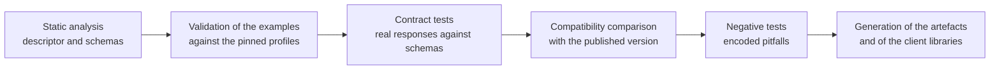

# Conformance and testing

A documentation area about protocols that does not say **how what it asserts is verified** is a list
of intentions. This chapter closes the area by setting out what the project publishes as evidence,
what it verifies automatically, with what acceptance criteria, and - with equal precision - **what it
cannot declare**.

## 1. Three meanings of «conformant», not to be confused

| Level | What it asserts | How it is demonstrated |
|---|---|---|
| **Conformance with the specification** | The implementation respects the obligations of a normative document | A test suite covering the obligations, with obligation → test traceability |
| **Conformance with a profile** | The implementation realises an actor with its transactions and options | Integration statement + transaction tests |
| **Conformance with the project contract** | The implementation respects what this area promises to integrating parties | Contract tests against the published artefacts |

They are distinct levels and must be asserted distinctly. A system may be conformant with the
protocol specification and violate the project contract, or vice versa.

## 2. What the project cannot declare

This section exists because incorrect conformance claims are the most expensive documentation
defect: they propagate into sales material, into tender specifications and into bid responses, and
correcting them afterwards is harder than not making them.

| Claim | Why it is not permitted |
|---|---|
| «Conformant with the message-to-resource mapping guide» | **All** the maps in that guide have *Informative* status. They are not normative |
| «Conformant with the standard idempotency header» | It is not a standard: the Internet-Draft is **expired and archived** |
| «Conformant with the standard rate limiting headers» | They are not a standard, and the three-field form is not even the current form of the draft |
| «Conformant with the Italian guide» without stating the version | The guide is at 0.2.0, in *trial-use, draft* status. Without a version the claim is empty |
| «Certified» on a revision in public comment | The adopted revision of the document profile is in *ballot*, not final text |
| «CE-marked product» | The project neither affixes the marking nor signs declarations of conformity: constraint V-06. Not the project today; the manufacturing entity to be established |
| «Accredited» on the national identity channels | The service provider is **the deployer**: constraint V-05. The project is compliant and verifiable |
| «End-to-end encrypted» with no qualification | True only in the default mode. With recording active it **is not** |
| «Guaranteed latency» | It is a **metric that is measured, recorded and reported**, with thresholds declared as a product specification |

The permitted formulations, by contrast, are those that declare the fact and its limit together:
«implements the *document source* actor of the profile, pinned revision, in public comment status»;
«exposes the event types of the published catalogue, with at-least-once delivery and no guarantee of
global ordering»; «adopts the current form of the draft on the quota headers, which is not yet an
RFC».

## 3. The published artefacts

These are the documents an integrator, a reviewer or a commissioning party downloads to check for
themselves. All of them are **generated by the build chain** and verified against real behaviour:
none is written by hand and maintained by discipline.

| Artefact | Content | Covers |
|---|---|---|
| Clinical capability statement | Specification version, resources, interactions, profiles, search parameters, operations, policies | Chapter [02](./02-fhir.md) |
| API descriptor | Paths, schemas, responses, security schemes, webhooks | Chapter [06](./06-api-di-progetto.md) |
| Event schemas, versioned | Content of each event type | Chapter [07](./07-eventi-e-webhook.md) |
| Error catalogue, served and resolvable | Code, title, explanation, resolution procedure, correspondence between the two planes | Chapters [02](./02-fhir.md) and [06](./06-api-di-progetto.md) |
| Integration statement | Profile, revision, actor, options supported and not supported, deviations | Chapter [05](./05-ihe.md) |
| Coverage table for the legacy messages | Field by field: destination, raw retention, justified discard | Chapter [04](./04-hl7-v2.md) |
| Correspondence table between events and clinical topics | Which event type corresponds to which topic | Chapter [07](./07-eventi-e-webhook.md) |
| Correspondence table with the IHE authorisation profile | Transaction by transaction | Chapter [08](./08-identita-e-autorizzazione.md) |
| Inventory of the pinned specifications | Specification, version, status, date, date of last re-check | Chapter [01](./01-principi-di-interoperabilita.md) |
| Register of declared deviations | Deviation, source deviated from, justification, cost | All |

The last artefact deserves a note: **the declared deviations are a public artefact**. The project
deliberately deviates from the specification's recommendation in at least three places - strict
handling of search parameters, the mandatory precondition validator on clinical writes, the
non-existent-resource response instead of the access-denied one - and each deviation is recorded
with its own justification and its own cost. An undeclared deviation is a defect; a declared and
justified deviation is a decision.

## 4. The test suites

| Suite | What it verifies | Acceptance criterion |
|---|---|---|
| **Structure and profiles** | Every example in the repository validates against the profile it declares | **Zero** issues of error severity. Informative issues are permitted and catalogued |
| **Declared interactions** | Every interaction declared in the capability statement exists and responds | **100%** coverage of the declared interactions |
| **Model round trip** | Domain → resource → validation → domain, with a semantic comparison | Semantic equality on all the reference cases |
| **API contract** | Every real response validates against the descriptor's schema | Zero non-conformant responses |
| **Contract compatibility** | Comparison with the published version | No unannounced breaking change |
| **Error catalogue** | Every code emitted by the source exists in the catalogue; every code in the catalogue is reachable from at least one test | One-to-one coverage |
| **Idempotency** | Same key and same body → identical response; different body → error; in flight → conflict | All three cases verified for every operation that requires the key |
| **Concurrency** | Validator absent, mismatched, correct | The three expected outcomes on every clinical resource |
| **Event delivery** | Signature, retries, dead-letter queue, replay with the same identifier, deduplication | No duplicates after a replay; no unsigned delivery |
| **Legacy messages** | Parsing, acknowledgement, error, declared coverage | One case for each supported message, plus the negative cases in §5 |
| **Authorisation** | Scopes, delegation, audience, revocation, introspection on high-impact operations | No access granted beyond the scope; actor claim always present on an external identity |
| **Tenant isolation** | Every query, every cursor, every transaction, every delivery | **Zero** cases in which one tenant sees another's data. It is an absolutely blocking criterion |
| **Real-time session** | Order and uniqueness of the candidates, session verification, mode change, degradation | The ordered and unique delivery requirement verified under load and with multiple nodes |
| **Accessibility of the protocol functions** | Session verification and the recording indicator with real assistive technologies | Manual verification, not only automated |

Two criteria are **blocking in an absolute sense**, that is, they admit no release waiver: tenant
isolation and the presence of the actor claim when the identity comes from an external issuer. The
first is the isolation of health data; the second is the difference between an audit trail that says
who acted and one that does not.

## 5. The negative tests, that is, the pitfalls encoded

A suite that verifies only the correct cases proves nothing about the pitfalls. These are encoded as
tests that **must fail** if the wrong behaviour appears.

| Pitfall | Test that catches it |
|---|---|
| Prefixed header for the content type in the event envelope in binary mode | The delivery is inspected: the presence of that header makes the test fail. It is a **violation of a negative obligation** of the specification |
| Plain challenge method accepted by the authorisation server | A request with the plain method must be refused |
| Wrong line separator between the segments of legacy messages | A message with the wrong separator must be refused, not interpreted |
| Patient modelled as a participant in the encounter | An instance built that way must fail validation |
| Coding with no code system | Validation failure |
| Recording modelled on the resource removed in the following release | An architecture test verifies that that resource does not appear in the code |
| Network metric modelled as an observation with the patient as subject | Architecture test on the subject of the observations produced |
| Unknown search parameter silently ignored | It must produce an error, unless lenient handling is explicitly requested |
| Clinical write with no precondition validator | It must produce the precondition-required code |
| Pagination cursor manipulated to bypass the tenant filter | It must be refused as an invalid signature |
| Transaction with resources from different tenants | It must be refused as malformed, **in the parser** |
| System-level bulk export | The endpoint must not exist |
| Relay credential with an identifier correlatable to a person | Test on the format of the identifier issued |
| Session key or room address persisted in a searchable resource | Test on the instance produced |
| Replay from the dead-letter queue with a new event identifier | It must reuse the same one, otherwise it produces duplicates downstream |
| Sunset date earlier than the deprecation date | The configuration must make the build fail |
| Detail text of an error containing a direct identifier | Analysis of the error bodies produced by the tests |

Every row of this table corresponds to an error that **actually happened** in healthcare projects, or
to an explicit negative obligation of a specification. None is hypothetical.

## 6. The tools

> **`[NV]` - concrete tools.** The names, versions and invocation modes of the tools for clinical
> validation, guide publication, static analysis of the interface descriptor, compatibility
> comparison and legacy message parsing **have not been verified against primary sources** and are
> not invented here.
> **To be asked of**: the technical area, which owns the build chain. The choice must then be pinned
> to an exact version and inventoried among the third-party components, because a tool that
> validates regulatory artefacts is itself a component to be qualified.

What this area can declare without depending on the tool are the **requirements** the tool must
satisfy:

1. it must be able to resolve the guide packages **at the pinned version**, from a registry or from
   an internal mirror;
2. it must be able to operate **without a network** once the cache is populated, otherwise the build
   is not reproducible;
3. it must distinguish severities and return an outcome interpretable by a script, not only text for
   a human;
4. it must be invocable with the terminology service **switched off**, because that is the project's
   default configuration, and it must declare which checks it skipped instead of keeping quiet about
   them;
5. its version must be recorded together with the outcome: a validated artefact says nothing unless
   you know what it was validated with.

## 7. The gates of the build chain

Rules of the gates:

- **no gate is advisory.** A gate that warns and lets things through is ignored within three weeks;
- **the compatibility comparison compares with the published version**, not with the previous commit:
  that is what catches a breaking change introduced a piece at a time;
- **the client libraries are generated and published only on a release tag**, never from the
  development branch, because a published library is a contract;
- **traceability is part of the chain's output**: every specification obligation covered is linked to
  the test that covers it, and the association is an artefact, not a convention. It is the
  traceability requirement that makes the material usable in our conformity assessment path, under constraint
  V-06.

## 8. The test environment and the data

**All the data used in the tests, in the examples and in the demonstration environments are
synthetic.** It is not a recommendation: it is a cross-cutting project constraint, and it holds for
the code, for the tests, for the logs, for the documentation and for the demonstration environments.

Operational rules:

- the data generators produce **syntactically valid** values - a well-formed tax code that belongs to
  nobody - because tests on malformed data do not exercise the real path;
- the domains used in the examples are placeholders reserved for documentation purposes;
- the demonstration environment **does not accept** the entry of real data: it is a control, not a
  warning;
- every artefact distributed before the marking states explicitly that it is not usable for the
  provision of healthcare services to real people.

The project also makes available a **simulation environment for the integrator**, with: a service
exposing the capability statement and the declared interactions; a test destination for events that
verifies the signature and returns diagnostics; a listener for the legacy channel that answers with
acknowledgements; and a collection of ready-to-run example requests. It is the investment with the
highest return on support cost.

## 9. Acceptance criteria for integrating parties

An integrator can check their own implementation for themselves with this list. It is not a
formality: each entry corresponds to a failure observed in real integrations.

**On the clinical plane.** Read the specification version from the capability statement instead of
assuming it. Send the precondition validator on every clinical write. Use conditional create with
the external identifier for idempotent ingestion. Do not hand-build the address of the next page.
Treat a validation outcome with a success code as a possible set of errors. Distinguish transaction
from batch. Do not assume the presence of optional elements.

**On the application plane.** Send the idempotency key where required and do not reuse it with
different bodies. Read the scope returned and do not assume it coincides with the one requested.
Ignore unknown fields and unknown enumeration values. Do not interpret the detail text of errors, but
the code. Respect the suggested delay. Expose the necessary headers in the cross-origin sharing
configuration, otherwise your own browser code will not see them.

**On events.** Be idempotent on the declared key. Verify the signature **on the raw bytes**, before
deserialisation. Reject events outside the freshness window. Accept and enqueue, without processing
inline. **Tolerate unknown event types** without erroring. Do not assume arrival order, and use the
per-aggregate sequence number.

**On the legacy channel.** Declare a supported version. Use the outpatient registration trigger, not
the admission one. Do not assume the presence of the patient group. Parse the note segments
positionally. Read the error segment in the form of the declared version, not in the earlier one.

**On identity.** Do not carry identity assertions through the browser. Register the address of your
own key set and keep it reachable. Rotate keys with a new identifier instead of replacing the
material under the same one. Do not ask for long-lived tokens.

## 10. The scheduled re-check

The inventory of pinned specifications is **re-checked before every major release and in any case at
least every six months**. The re-check verifies four things and records the outcome with the date:

1. the pinned version is still the published one;
2. whether the maturity status has changed - a guide that has gone from draft to stable, or a draft
   that has become an RFC, change what may be declared;
3. whether errata or technical corrections have been published;
4. whether a licensing dependency has changed.

The re-check is not optional, because the composition of the inventory makes it necessary: **more
than a third of the specifications adopted are in a non-final state**, and some change more than once
a year.

## 11. What remains open

### 11.1 The unverified points of this area

| Point | Chapter | Who should be asked |
|---|---|---|
| Exact form of the address sub-extension in the virtual service | [02 §4](./02-fhir.md) | Whoever implements the clinical adaptation layer, with validation against the pinned package |
| Concrete validation and publication tools | [02 §8.1](./02-fhir.md), §6 of this chapter | Technical area |
| Templates, document codes and metadata for the telemedicine types | [03 §4.2](./03-documenti-clinici.md), [03 §5](./03-documenti-clinici.md) | Compliance area - question **Q-07** |
| Signature envelope formats, certificate and time stamp requirements | [03 §6.2](./03-documenti-clinici.md) | Compliance area and security area |
| Format profile for long-term preservation | [03 §4.3](./03-documenti-clinici.md) | Compliance area |
| Field-by-field coverage between the statutory information set and the clinical profile | [03 §4.1](./03-documenti-clinici.md) | Domain area and compliance area |
| Direct reading of the legacy wrapping protocol specification | [04 §5.1](./04-hl7-v2.md) | Whoever implements the module |
| Lengths, optionality and repeatability of the legacy error segment fields | [04 §7](./04-hl7-v2.md) | Whoever implements the module |
| Authentication context values accepted by the document-based identity provider | [08 §6.1](./08-identita-e-autorizzazione.md) | Integration area |
| Forwarding of the requested level through the intermediating realm | [08 §6.4](./08-identita-e-autorizzazione.md) | Architecture area and technical area - question **Q-160** |
| Hash algorithm of the relay's temporary credentials | [09 §7.4](./09-tempo-reale.md) | Whoever implements the service, with an integration test |

### 11.2 The decisions this area does not take

**Q-06 - divergence in the tax code URI.** This area documents the problem, measures its consequences
and formulates a justified recommendation in [02 §9.3](./02-fhir.md), **without hard-coding any value
in its own normative examples**. The decision belongs to the architecture area together with the
technical one.

**Q-15 - the ten choices stated as proposals.** This area formulates them, justifies them and
declares their cost in [01 §5](./01-principi-di-interoperabilita.md). The formal decision, with the
corresponding architecture decision record, belongs to the architecture area.

**Q-08 - the two session modes.** This area describes the protocol that governs them in
[09 §6](./09-tempo-reale.md) and declares their inescapable consequence. The effects on the data
model belong to the architecture area.

**Q-16, Q-161 - the single registry of destinations and trusted origins, and the single control
point for outbound requests.** This area **supports** both questions and declares the justification in
[07 §7](./07-eventi-e-webhook.md) and [06 §10](./06-api-di-progetto.md): separate registries diverge,
and four implementations of the same protection produce four different behaviours, of which the
weakest is the one that counts. The decisions belong to the security area and to the architecture
area.

**Q-163 - no disclosure capability towards a payer.** This area adopts it as a catalogue constraint in
[07 §3](./07-eventi-e-webhook.md): the variant of the completion event intended for settlement carries
only the service identifier, the administrative outcome and the amount. Functional confirmation
belongs to the functional area.
