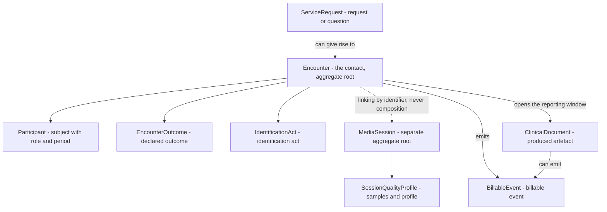
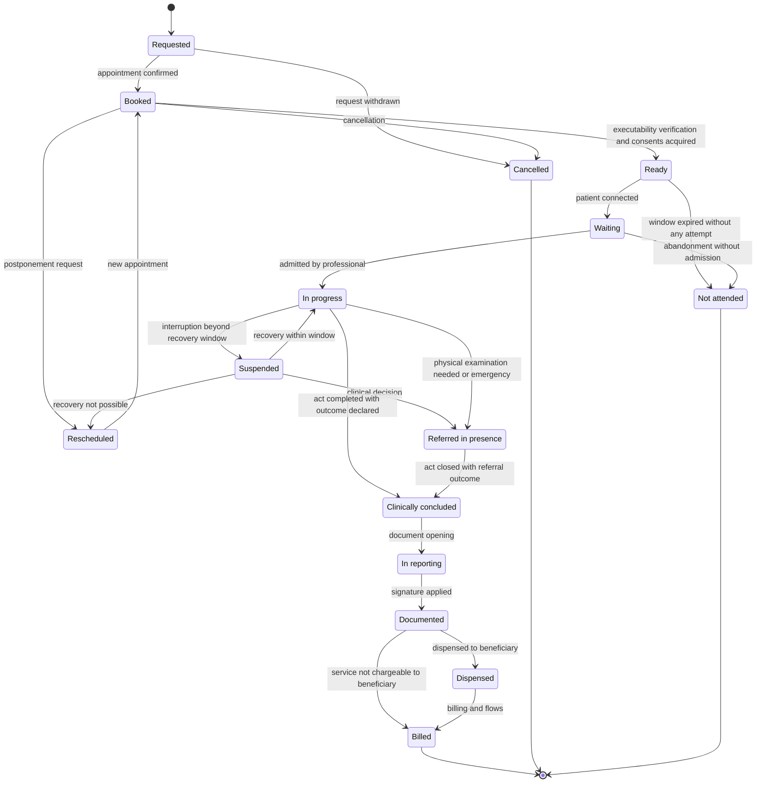
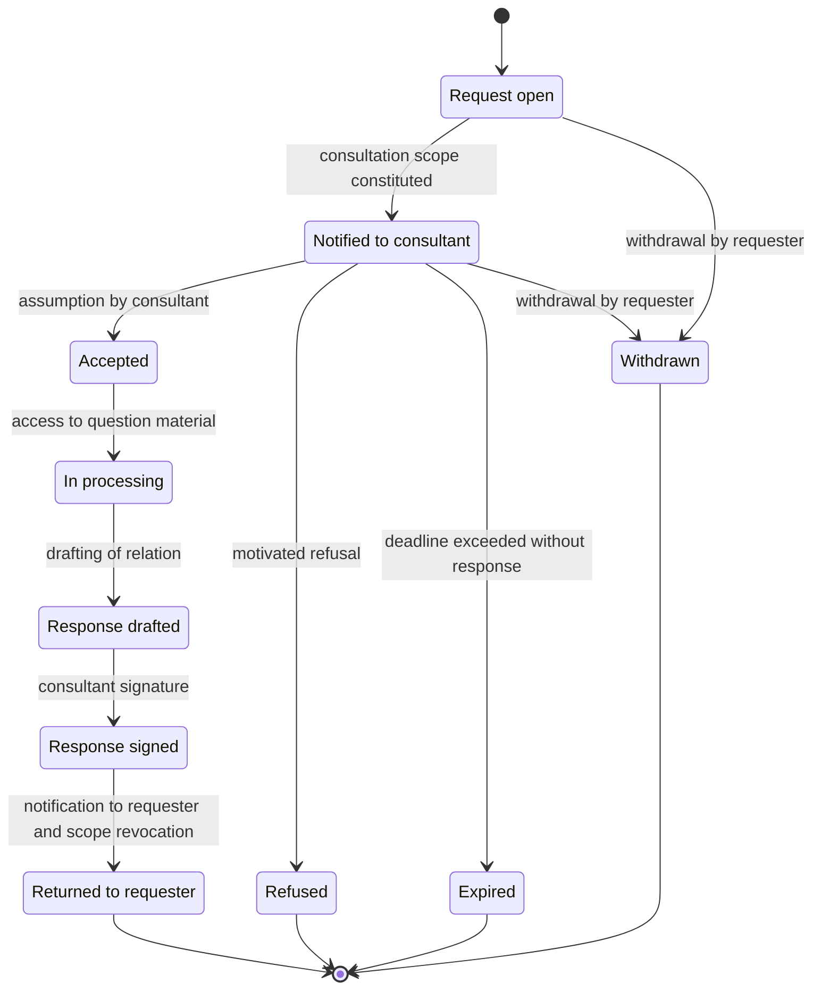
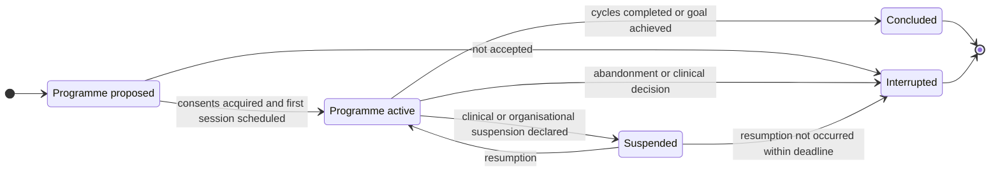
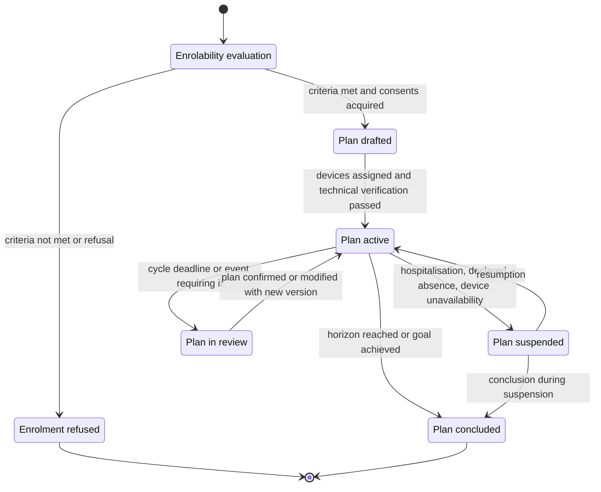
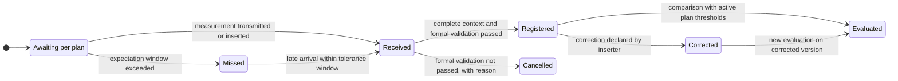
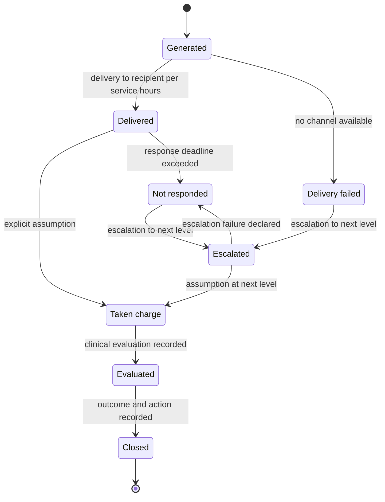
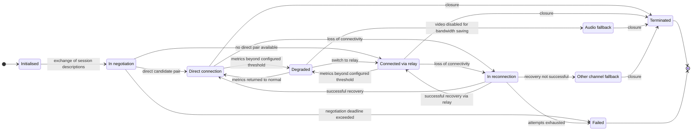

# Services modelled

Telemedicine services are not variants of the same thing. They have different actors, produce
different artefacts, are concluded for different reasons and are cancelled for different
reasons. A model that represents them with a single type and a discriminating field works as
long as it does not have to answer the first serious question: *who can deliver it*, *what
document does it produce*, *who answers for it*, *is it tariffed*.

This chapter transforms the normative definitions of module
[02 of the foundations](../10_fondamenti/02-prestazioni-di-telemedicina.md) into **state machines
with permitted transitions**. It does not repeat them: it presupposes they have been read.

## 1. The modelling criterion

Three decisions govern the entire chapter and must be stated before the diagrams.

> **`DM-10` [MOD] - The service is a family of state machines, not a type with an `enum`.** Each
> service shares the same aggregate structure - a contact, participants, an outcome, produced
> artefacts - but has **its own set of permitted states, its own condition of conclusion and
> its own condition of cancellation**. The service type selects the state machine; it does not
> add a field.

> **`DM-11` [MOD] - What varies by service is declared, not coded.** Permitted actors, mandatory
> artefacts, obligation of patient presence, recordability, permitted outcomes and time windows
> are **attributes of the service type in the catalogue**, not `if` conditions scattered in the
> code. Adding a service must be a catalogue row plus a state machine, not a diffuse modification.

> **[BASE] `V-01` - `Encounter` and `MediaSession` are distinct aggregates.** A service can occur
> without media (asynchronous teleconsulto), with multiple sessions (dropped and reconnected),
> or with failed sessions; a media session can exist without service (technical test). Uniting
> them is the costliest modelling error in this domain.

### 1.1 The common structure

The dashed line between `Encounter` and `MediaSession` is the most important part of the diagram:
**linking by identifier, never composition**. The media session is not a child of the contact;
it is an aggregate that the contact commands and observes the outcome of.

### 1.2 The six questions every service must answer

| Question | Why it is modelling and not descriptive |
|---|---|
| **Who are the permitted actors?** | Determines profession × service constraints, which are not tenant-configurable (`BR-011`) |
| **Must the patient be present?** | Determines if an identification act exists and if the media session is mandatory |
| **Is asynchrony permitted?** | Determines if a waiting-for-response state exists and a deadline |
| **What does it produce?** | Determines which document is mandatory and which record typology |
| **What concludes it?** | Determines the nominal terminal state and who has the power to declare it |
| **What cancels it?** | Determines non-nominal terminal states and their effects |

### 1.3 Synoptic table

| | Remote consultation (televisita) | Specialist-to-specialist consultation (teleconsulto) | Teleconsulenza | Remote assistance (teleassistenza) | Remote monitoring (telemonitoraggio) |
|---|---|---|---|---|---|
| **Reserved to** | doctor | two or more doctors | healthcare professions with different responsibilities | non-medical healthcare profession | measurement; professional evaluation |
| **Patient present** | always | optional | optional | always (or carer) | not applicable |
| **Asynchrony** | no | **yes** | yes (deferred) | no | by construction |
| **Produces** | report (with exceptions, § 2.6) | **no autonomous report**; collaborative relation attached | documentation of the requesting act | conclusive clinical-assistive relation | periodic reports and final relation |
| **Tariffed** | yes, with delivered service code | no | no | per profession regime | not alone |
| **Container** | single contact | single contact or asynchronous exchange | single contact | **multi-session cycle** | **plan with horizon** |
| **Media session** | mandatory | optional | mandatory if sync | mandatory | absent |

Sources of definitions: State-Regions Agreement 17 December 2020, rep. acts no. 215/CSR, Annex A;
DM 21 September 2022, Annex A; DM 19 November 2025, art. 7 and Annex 1. The "Produces" row
incorporates the ten document typologies introduced by DM 19 November 2025 and described in chapter
[04](04-documenti-clinici.md).

## 2. Remote consultation (televisita)

### 2.1 Actors

| Role | Mandatory | Modelling notes |
|---|---|---|
| **Delivering doctor** | yes | Medical act. The profession × service constraint is not tenant-configurable (`BR-011`) |
| **Patient** | yes | Real-time presence; identification is an act of the professional (`BR-031`) |
| **Carer** | no | Participant with its own role; cannot give consent for a capable patient (`BR-062`) |
| **Healthcare operator near the patient** | no | Expressly foreseen by Agreement 215/CSR 2020: "a healthcare operator near the patient can assist the doctor and/or help the patient". It is a participant with healthcare qualification, distinct from carer |
| **Interpreter** | no | Third party accessing healthcare data: consent, confidentiality constraint, hours of entry and exit recorded (`BR-066`) |
| **Trainee or observer** | no | Specific and preventive consent, revocable without consequences (`BR-067`) |

> **`DM-12` [MOD]** - The participant is not a reference to a person: it is an **entity with
> role, declared qualification, instant of entry and instant of exit**. It serves because the
> presence of a third party is a fact with legal consequences, and because the list of those
> present must be visible to all for the entire duration (`BR-038`).

### 2.2 Admissibility: what precedes the initial state

Remote consultation (televisita) has conditions of deliverability established by Agreement 215/CSR 2020: services
that **do not require completeness of physical examination** and presence of **at least one** of
five clinical conditions (PAI/PDTA pathway, follow-up of known condition, therapy check or
adjustment in course, anamnestic evaluation for test prescription, verification of test
results). The full text is in module
[02 of the foundations](../10_fondamenti/02-prestazioni-di-telemedicina.md) § 4.1.

The model **does not decide appropriateness**: it records it (`BR-004`, constraint `V2` of MDR
separation). Concretely:

- the **catalogue** marks the service type as deliverable by remote consultation and, where applicable, as
  "requires diagnosis already formulated" (`RF-030`, `BR-001`);
- the **executability verification act** records the three dimensions envisaged by the AGENAS
  *Orientative Model of televisita delivery* v. 1.0.25 of 16 April 2026 - clinical utility,
  clinical safety, **digital compliance of the beneficiary** - as professional declarations, not
  as calculations **[RECOMMENDED]**;
- the **waiver** to `BR-002` exists as an object: identity of who disposes it, textual
  motivation, high-severity audit event (`BR-003`).

> **[NORM]** DM 30 September 2022, Annex B excludes remote consultation from urgency-emergency contexts:
> "must not be reason to delay in-person interventions" (`REQ-62` of `B1`). The model represents
> it as **service type attribute** - `admittedInEmergency = false` for remote consultation - and not as
> scattered check: specialist-to-specialist consultation, from the same source, is instead executable also in urgency.

### 2.3 The lifecycle of the contact

**The three transitions that do not exist**, and the reason their absence is a decision:

1. **`In progress → Cancelled`** does not exist. An act that has started is not cancelled: it is
   concluded with an outcome that declares its incompleteness. Allowing cancellation of a started
   act means being able to erase the trace of a clinical interaction that occurred.
2. **`In progress → Concluded` automatic** does not exist. Closure with outcome is **always an
   act of the professional** (`BR-032`, constraint `V2`): in its absence, the contact remains
   suspended and is flagged. A system that closes by itself attributes a clinical outcome, and
   attributing clinical outcomes moves it in classification.
3. **`Documented → In reporting`** does not exist. The signed document is immutable (`BR-044`):
   correction is a **new version** that cancels and replaces, not a return to the previous state.
   Chapter [04](04-documenti-clinici.md) models the chain.

### 2.4 Suspension and recovery: the invariant

The most important invariant of the chapter, and the reason for `V-01`:

> **`DM-13` [MOD] - The state of the contact does not depend on the state of the media session.**
> A network failure does not modify contact state. The contact moves from `In progress` to
> `Suspended` **only** if the interruption exceeds the configured recovery window, and is
> **never** closed automatically (`BR-030`, `BR-032`).

The recovery window is a configuration parameter per tenant and service type. `R6` § 3.4
proposes ten minutes as default: it is a **project proposal**, not a normative requirement -
no Italian source establishes technical thresholds (`B1`, additional mandate; constraint `V-12`).

### 2.5 The outcomes

The **state** says where the contact is; the **outcome** says what happened. They are two
distinct attributes, and the second is the one that determines administrative effects.

| Outcome code | Event | Automatically detectable | Effect on act | Administrative effect |
|---|---|---|---|---|
| `EX-COMPLETE` | Act completed | no, it is declared | act executed | billable |
| `EX-NOSHOW` | No attempt to connect within window | **yes**, by absence of attempts | no act | non-attendance (`BR-024`) |
| `EX-TECH-PATIENT` | Patient attempted without passing technical verification | **yes**, by telemetry | no act | **not** non-attendance; rescheduling without charge |
| `EX-TECH-DROP` | Drop with successful recovery | yes | act continued | none; interruption is annotated |
| `EX-TECH-FAIL` | Drop without recovery | yes | incomplete act | configurable tariff rule; rescheduling obligation |
| `EX-QOS` | Quality judged inadequate by professional | partially | act suspended or downgraded | channel fallback or rescheduling |
| `EX-CLIN-STOP` | Interruption for clinical decision | no | act interrupted | partial service, mandatory motivation |
| `EX-ESCALATE` | Need for in-person visit | no | act concluded with referral | service delivered plus new request |
| `EX-EMERGENCY` | Clinical emergency during act | no | emergency procedure activation | own procedure |
| `EX-IDENT-FAIL` | Patient not identifiable | no | **act not executable** | contact cancelled, no charge |
| `EX-CAPACITY` | Minor or incapable subject without valid title | partially | act not executable | contact suspended pending title |
| `EX-THIRD-PARTY` | Unexpected third party present | no | professional evaluation | consent to be acquired in session |

The distinction between `EX-NOSHOW` and `EX-TECH-PATIENT` is the reason the outcome exists as a
concept separate from state. They are the same terminal state - the patient was not visited -
with opposite economic and reputational effects. Charging non-attendance to someone who tried and
failed to connect is a domain defect, not an edge case.

### 2.6 What remote consultation (televisita) produces

> **[NORM]** "Remote consultation delivered in the context of ambulatory specialist activity **must always
> conclude with a report**" (Agreement 215/CSR 2020, Annex A).

The obligation is though **conditional on the setting**, and this is a correction that `B1` has
ascertained:

> **[NORM]** DM 30 September 2022, Annex B: remote consultation scheduled and delivered directly by
> general medicine doctor or paediatrician of free choice **does not require prescription** and
> provides for **digital annotation in place of report** (`REQ-59` of `B1`).

> **`DM-14` [MOD]** - The **delivery setting** is a discriminating domain attribute of rules, not a
> descriptive label. It determines at least: report obligation versus annotation, necessity of
> prescription, record document typology, billing regime. Hardcoding report obligation as
> unconditional is an error that manifests at the first tenant that is a group practice.

The remote consultation report furthermore has **specific mandatory contents**, imposed by Agreement
215/CSR 2020: indication of any collaborating participants (carer, other doctor) and **quality
of connection with confirmation of adequacy for service delivery**. Chapter [04](04-documenti-clinici.md)
addresses the problem - unresolved by the ministerial template - of where this evidence is written.

### 2.7 What cancels remote consultation (televisita)

| Cancellation cause | Who determines it | Resulting state | Constraint |
|---|---|---|---|
| Withdrawal of request | prescriber or beneficiary | `Cancelled` | permitted only before `In progress` state |
| Beneficiary cancellation | beneficiary | `Cancelled` | administrative effects only if configured **and** communicated at booking (`BR-025`) |
| Cancellation by structure | delivering structure | `Cancelled` | **always** generates alternative offer obligation; never charge (`BR-026`) |
| Identification failure | professional | `Cancelled` with outcome `EX-IDENT-FAIL` | no charge; only cancellation occurring with session started |
| Representation title missing or not relevant | system, verified by professional | `Suspended` with outcome `EX-CAPACITY` | not cancellation: it is waiting for title |

The fourth row is the exception to the rule stated in § 2.3: identification failure cancels a
contact whose media session was already started. It is permitted because **the healthcare act has
not started**: you cannot deliver a service to someone you do not know who they are.

### 2.8 The in-presence completion clause

> **[NORM]** "Where the Telemedicine tool does not allow keeping the substantial content of the
> service to be delivered unaltered, companies and private providers are obliged to complete the
> service in traditional mode without further charges to the SSN and/or user" (Agreement 215/CSR
> 2020, Annex A). Where the result is insufficient "for any reason (technical, related to
> conditions found in the patient or other)" "the obligation of rescheduling the service in
> presence" applies.

It is an obligation that falls directly on the model: the outcomes `EX-TECH-FAIL`, `EX-QOS` and
`EX-ESCALATE` **generate a subsequent fact** - a new request with the link to the previous one -
and do not merely close the contact. Rescheduling in presence is part of the state machine, not
error handling (`REQ-61` of `B1`).

## 3. Specialist-to-specialist consultation (teleconsulto)

### 3.1 The two forms

Specialist-to-specialist consultation has two forms with different state machines, and the source distinguishes them
explicitly: "can also be performed asynchronously"; "when the patient is present at the
specialist-to-specialist consultation, then it takes place in real time using operating modes analogous to those of a
remote consultation and configures as a multidisciplinary visit" (Agreement 215/CSR 2020, Annex A).

> **`DM-15` [MOD] - The two forms are **two distinct state machines**, selected on creation of
> the request and not modifiable after acceptance. The combination is explicitly coded because
> the ministerial template requires it: the "Procedure execution mode" field of Annex 1, § 2.21
> of DM 19 November 2025 imposes indicating **spontaneous or scheduled**, **synchronous or
> asynchronous**, **with or without beneficiary presence** (`REQ-48` of `B1`). They are three
> binary axes, not a flat enumerative.

### 3.2 Asynchronous teleconsulto

The significant fact is not the sequence: it is **the consultation scope**. The consultant does
not receive access to the patient's record but **only the material that the requester has
selected**, for the time necessary for the response (`BR-014`).

> **`DM-16` [MOD] - The consultation scope is an aggregate with its own lifecycle.** It is born
> with the request, contains the closed list of document references, has a mandatory expiry and
> **ends in three ways**: response signed, refusal, expiry. Revocation is a registered fact, not
> the absence of renewal.

The constitution of the scope has an important side effect often overlooked: **the list of
documents shown to the consultant is itself information to conserve**. Years later, the question
"what did the consultant express on" has an answer only if the scope was recorded as a set, and
not reconstructed from the access register.

### 3.3 Synchronous specialist-to-specialist consultation with patient present

The three-party scenario introduces four problems that remote consultation does not have.

| Problem | Modelling decision |
|---|---|
| Who is the delivering party? | A single `Encounter` with multiple participants, and a `ServiceRequest` identifying the consultant as executor of the consultation. **Two distinct services on the same contact** |
| Who documents? | Two documents with distinct authors, or a single document co-signed: both forms supported per service configuration (`RF-133`). The system **does not merge** contents (`BR-049`) |
| Who conducts? | Explicit role of **conductor**, with powers of admission and exclusion. Without it, admission of participants is ambiguous |
| Does the patient know who is there? | List of participants with name and qualification visible for entire duration, with no possibility of concealment (`BR-038`) |

The **lateral room** between professionals - confidential discussion that temporarily excludes
the patient - is clinically necessary and ethically delicate. The model represents it as
**declared period of the contact**, with beginning, end and announcement to the patient: no
silent mode exists (`BR-068`).

### 3.4 What specialist-to-specialist consultation produces

Here the source is clear, and contradicts the intuition of those modelling by analogy:

> **[NORM]** "The specialist-to-specialist consultation **contributes to the definition of the report** that is drafted at
> the end of the visit delivered to the patient, **but does not give rise to a report of its
> own**" (Agreement 215/CSR 2020, Annex A).

It does not mean it produces nothing. DM 19 November 2025 creates its own document typology -
"collaborative relation for teleconsulto/teleconsulenza", lett. q) - with an explicit structural
rule:

> **[NORM]** "The collaborative relation **is conferred to the FSE as an attachment of the
> report document** related to the service or main event […] drafted by the doctor requesting
> the consultation" (DM 19 November 2025, Annex 1, § 2.21).

> **`DM-17` [MOD]** - The collaborative relation is modelled as **autonomous document with
> attachment constraint**: it has author, signature and own lifecycle, but its transmission to
> the record is subordinate to the existence of the main document to which it attaches, with
> correlation by request identifier. Treating it as a section of the requester's report cancels
> the author; treating it as independent violates the conferment rule.

### 3.5 What concludes and what cancels specialist-to-specialist consultation

- **Concludes**: signature of the relation by the consultant and its return to the requester. In
  synchronous form, closure of the contact with outcome declared by the conductor.
- **Cancels**: withdrawal by requester before acceptance; motivated refusal by consultant; expiry
  of deadline. In all three cases **the consultation scope is revoked immediately**, not at the
  next execution of a periodic process.

*Specialist-to-specialist consultation (Teleconsulto)* **is not tariffed** and does not provide cost sharing: it does not generate billable
event as autonomous service. It does generate recordable activity for workload purposes, which
is another thing and must be kept separate.

## 4. Teleconsulenza

It differs from specialist-to-specialist consultation on four axes, all with consequences on the model.

| Axis | Teleconsulto | Teleconsulenza |
|---|---|---|
| Actors | two or more **doctors** | healthcare professionals, **not necessarily doctors**, with **different responsibilities** on the case |
| Prominent element | data, report and image sharing | **videocall**, with sharing guaranteed when necessary |
| Scheduling | also spontaneous | **always scheduled** |
| Explicit prohibition | - | **cannot substitute rescue activities** |

DM 21 September 2022 unifies them in a single minimum service (*specialist-to-specialist consultation / teleconsulenza*),
while Agreement 215/CSR 2020 distinguishes them. It is the case in which `DM-04` - represent both
taxonomies - applies concretely: **the same minimum service covers two activities with different
permitted actors**, and the professional constraint applies to the activity, not the service.

> **`DM-18` [MOD] - The **asymmetric** requester/consultant relationship is an attribute of the
> participant, not an inference from entry order. In teleconsulenza there is a requester who has
> responsibility for the case and an interpellated party who provides guidance: responsibility
> does not transfer, and the model must be able to demonstrate this over time.

## 5. *Remote assistance (teleassistenza)*

### 5.1 The cycle, not the contact

*Remote assistance (teleassistenza)* is "predominantly scheduled and repeatable based on specific programmes of
patient accompaniment" (Agreement 215/CSR 2020, Annex A). Modelling it as single contact loses
the unit of meaning: the programme.

> **`DM-19` [MOD] - The container of remote assistance is an **episode with programme**, not a
> contact. Individual meetings are contacts linked to the episode; adherence to the programme is
> a property of the episode, not of individual contacts. Applies identically to telerehabilitation,
> which State-Regions Agreement 18 November 2021, rep. acts no. 231/CSR frames in the **Individual
> Rehabilitation Plan**.

### 5.2 The hybrid functional constraint

> **[NORM]** "It is indeed necessary that the remote assistance service be able to make available
> also all functionalities present for remote consultation and remote monitoring" (DM 21 September 2022,
> Annex A).

On the model level this means remote assistance **reuses aggregates** from the other two services:
its meetings are contacts with media session, and its programme can include measurements. It does
not mean it is a remote consultation: the act is within the remit of non-medical healthcare profession,
does not produce specialist report and has assistive purpose.

### 5.3 What it produces

The record document typology is the "conclusive clinical-assistive relation for
remote assistance/telerehabilitation", lett. r) of art. 3, c. 1 of DM 7 September 2023 as introduced
by DM 19 November 2025, art. 7. **It is conclusive**: issued at programme closure, not at closure
of individual session. Individual sessions produce diary annotations, which are not healthcare
documents destined for the record (chapter [04](04-documenti-clinici.md) § on clinical diary).

## 6. Remote monitoring (telemonitoraggio)

It is structurally the most different service from the others, and the reason is simple: **it has
no contact**. There is no moment when two people meet; there is a plan that lasts, measurements
that arrive, alarms that are generated and reviews that occur.

### 6.1 The perimeter, and why it is written this way

> **[BASE] `D21`** - The project perimeter is: **ingestion of measurements from a third-party
> gateway**, plus **manual insertion by beneficiary or carer**, plus **structured questionnaires**.
> The project **does not dialogue directly with medical devices** and does not assume responsibility
> for the accuracy of the hardware measurement chain.

> **[BASE] `D46`** - The formulation of the intended purpose decides classification. "**Real-time**
> monitoring of vital parameters" leads to Class IIb and software safety class C; "**deferred
> collection** of parameters for periodic professional review" remains in Class IIa and class B.
> The difference is 12–18 months and an order of magnitude in cost.

> **`DM-20` [MOD] - The domain model is written on the second formulation, and declares it.** There
> does not exist, in the model, any concept of "continuous surveillance", "real-time alarm" or
> "active patient monitoring". There exist: a measurement plan, measurements that arrive in
> deferred mode, evaluation against thresholds configured by the professional, and a **queue of
> clinical review**. Any wording suggesting otherwise is a documentary defect with regulatory
> consequences, not a nuance of language.

### 6.2 The three state machines of remote monitoring

*Remote monitoring (telemonitoraggio)* requires three distinct lifecycles, which coexist and must not be merged.

**a) Enrolment and plan**

The plan has operative parameters imposed by the ministerial template (DM 19 November 2025, Annex 1,
§ 2.24): plan typology, **number of cycles**, **cycle duration**, **number of activities per
cycle**, **frequency**, **time band**, **planned duration of plan (maximum one year)**, first
scheduling or rescheduling, device UDI code, parameters, **measurement type** (intermediated or
closed loop), **alarm threshold** and **behaviour rules in case of threshold violation**.

> **`DM-21` [MOD] - The plan is versioned and the version is part of the measurement identity.**
> A measurement acquired under version 2 of the plan is not compared to version 3 thresholds.
> Without versioning, every plan modification retroactively rewrites the meaning of the history.
> It is question `Q-12` on the board, for the part "versioned remote monitoring plan".

> **[BASE] `V-02`** - The threshold is **configuration per beneficiary**, decided by the
> professional, and is never a code constant nor a "reasonable" default value. Module
> [10 of the foundations](../10_fondamenti/10-percorsi-di-cura-e-sicurezza.md) § 7.10 explains
> why a reasonable default can be clinically wrong for the person to whom it applies.

**b) Single measurement**

The state `Missed` is the model translation of constraint `V-09`: **absence of data is
information**. It is not absence of a row; it is **a row that declares the absence**, with the
expected window, the instant in which the expectation expired and the cause when known. Chapter
[05](05-parametri-e-osservazioni.md) gives the structure and taxonomy of causes.

**c) Alarm**

Three properties of this state machine are decisions, not details:

1. **`Delivered` is not `Taken charge`.** Delivery of a notification is not assumption of
   responsibility by a person. Confusing them produces a service believed to be active while
   nobody has read the alarm.
2. **`Not responded` is a state, not an absence.** The failure to respond is a fact to be
   recorded, measured and subjected to review.
3. **Escalation can fail, and failure is declared.** An escalation that exhausts without recipient
   must not terminate in silence: it is question `Q-12`, voce "escalation with declared
   failure".

> **[BASE] `D26`** - Automatic evaluation of thresholds in remote monitoring is the element that
> constitutes *interpretation* and founds the qualification as medical device. The model isolates
> it in an identifiable component, with traceability of the calculation - plan version, rule
> version, input values, outcome - so it is verifiable after the fact (question `Q-12`, voce
> "traceability of calculation").

### 6.3 What remote monitoring produces

Four distinct document typologies among the ten introduced by DM 19 November 2025, art. 7:

| Lett. | Typology | When produced |
|---|---|---|
| s) | device badge for telemonitoraggio | at device assignment, signed by professional who assigns it |
| t) | telemonitoraggio/telerehabilitation plan and teleassistenza | at drafting and each rescheduling |
| u) | telemonitoraggio measurement report | per plan cadence |
| v) | weekly telemonitoraggio measurement report | weekly |
| w) | final relation for telemonitoraggio/telerehabilitation | at conclusion |

The **device badge** deserves attention because it is the only point where the model meets unique
identification of the device: it requires UDI in AIDC format and readable UDI-DI, serial or lot
number, name, address and site of manufacturer, type of connection, type of power supply, outcome
of technical check and technical parameters of connectivity, configuration and calibration (Annex 1,
§ 2.23). It is a document **signed by the professional who assigns the device**: in the model it
is therefore an act, not a demographic record.

### 6.4 The rule of affiliation

> **[NORM]** "Remote monitoring **does not come under ambulatory specialist care, unless
> accompanied by medical telecontrol, a remote consultation or also an in-person visit** in which the
> continuously recorded data are analysed, discussed and communicated to the patient. The results
> of remote monitoring must be indicated in the report of the periodic control visit" (Agreement
> 215/CSR 2020, Annex A).

Direct modelling consequence: **there is a link between the remote monitoring plan and the review
contact**, and the results flow into the document of that contact. The plan alone does not
generate a billable event; the review contact does.

## 7. Boundary concepts

### 7.1 Telerefertazione and telecontrol

**Telerefertazione.** Asynchronous act on an already-acquired examination, which does not generate
contact with the patient and does not require real-time identification (`BR-008`). In DM 21 September
2022 it is not minimum service: it is the transversal micro-service "reporting and digital signature".
The decree is explicit on the fact that for this micro-service "an *ad hoc* module must not be
created" but "integration with the regional module, if already present" must be provided - which,
for `D14`, is exactly the project's posture: own module, **deactivatable and replaceable by
configuration**.

**Telecontrol medico.** Medical service at scheduled contacts, with videocall and sharing of data
collected from the patient. It is at nomenclature and billed in ambulatory specialist flows,
unlike remote monitoring.

> **`DM-22` [MOD]** - Telecontrol is modelled as **remote consultation with mandatory link to a measurement
> plan**: same state machine of the contact, with the precondition that an active plan exists and
> with obligation to report its results in the document. It is not a sixth state machine.

### 7.2 What is not telemedicine

The model must be able to represent also the outside of its perimeter, because the outside exists
and professionals use it.

> **[NORM]** "**Telephone triage**: triage or telephone consultation performed by doctors or
> healthcare operators to patients in order to indicate the most appropriate diagnostic/therapeutic
> pathway and the need to perform the visit quickly in presence or at distance or the possibility
> of postponing it to a later time assigning a new appointment, **does not come under activities
> attributable to telemedicine**" (Agreement 215/CSR 2020, Annex A).

> **`DM-25` [MOD] - The orienting telephone contact is represented as **organisational fact**, not
> as telemedicine service: it does not generate a contact with clinical state machine, does not
> produce healthcare document, does not generate billable event as telemedicine service. It is
> still recorded, because it is an interaction with the beneficiary that produced routing.

From this follows a symmetric constraint on phone triage: **if the system calculated the priority
instead of recording it, it would exit the perimeter**. Evaluation of urgency and channel
appropriateness is an act of the professional; the model records the declared outcome, with the
identity of who decided it and the declared criterion.

### 7.3 The two explicit prohibitions

They are the only two textual exclusions that the source places, and must be represented as
service type attributes, not scattered checks.

| Prohibition | Source | Representation |
|---|---|---|
| Remote consultation **is not suggestible in urgency-emergency**, "in order not to constitute reason for delaying in-person interventions" | DM 30 September 2022, Annex B | attribute `admittedInEmergency = false` on service type |
| Teleconsulenza **cannot be used to substitute for rescue activities** | Agreement 215/CSR 2020, Annex A | dedicated attribute on service type, distinct from the preceding |

The two prohibitions do not coincide and do not overlap: specialist-to-specialist consultation and teleconsulenza are
**executable also in urgency** according to the same source that excludes remote consultation, but
teleconsulenza cannot substitute rescue. A single boolean attribute "use in urgency" cannot
represent both rules.

## 8. The media session

### 8.1 The lifecycle

### 8.2 Synchronisation with the contact

The two state machines observe each other and do not command each other, with three explicit
exceptions.

| Media session event | Effect on contact | Motivation |
|---|---|---|
| `Negotiation → Failed` before admission | none | contact remains waiting; patient retries |
| `Direct/Relay → Reconnection` | none until recovery window exceeded | `DM-13` |
| Reconnection beyond window | `In progress → Suspended` | the only transition the media session causes |
| Persistent `Degraded` | notification to participants, no state change | decision to proceed, downgrade or interrupt is professional's (`BR-034`) |
| Fallback to other channel | contact attribute, not state change | fallback is a fact to record because it can affect the nature of the act (`BR-006`) |
| `Terminated` | none | contact concludes by professional act, not connection closure |

> **[BASE]** Server-side recording mode and encryption to endpoints are incompatible: `D23`
> imposes two distinct modes, declared in consent and persistently signalled. On the domain level
> it follows that **session mode is an attribute of the fact**, not infrastructure configuration:
> the passage between the two modes is traced and has effects on required consent. Question `Q-08`
> on the board remains open toward the `ARCH` area for effects on the data model.

### 8.3 Media session without contact

It exists and is deliberate: **technical test**. A media session can be started to verify device,
permissions and relay reachability without there being a healthcare act. If the model required a
contact for every media session, every technical test would create a phantom contact to filter in
every report - which is exactly the defect `V-01` prevents, observed from the opposite side.

## 9. The virtual waiting room

It is not a technical room. It is **a state of the contact plus a queue**, and modelling it as
dedicated media room multiplies sessions unnecessarily.

Two distinct checks coexist in the waiting room and can fail independently:

- the **technical check**: device, permissions, bandwidth, relay reachability;
- the **administrative check**: documents, mandatory consents, preliminary activities, payment
  if required.

> **`DM-23` [MOD] - The two checks have separate and visibly separate outcomes. A single
> traffic light forces the operator to guess which of the two is missing, and it is the first
> cause of front-office phone calls.

**Admission is always explicit** (`RF-057`): there is no automatic entry into session. It is a
domain decision, not a product option: automatic entry into a room where another act is already
taking place is a confidentiality violation.

## 10. The emergency procedure

It is the highest-risk scenario: a remote professional with a person who might have an acute
event, without possibility of direct intervention.

The model has a single task, and it is **logistic, not clinical**:

> **[BASE] `V2`** - The system **does not evaluate severity and does not suggest clinical
> conduct**. It makes immediately available to the professional the information they lack because
> the patient is not in the same room: **address where the person is at that moment**, contacts,
> declared emergency contact.

From this follows a domain requirement that surprises those who have not thought through the case:
**the address of the session must be asked and confirmed at the beginning of every session**
(`BR-039`), because the demographic address is useless in emergency - the person might not be
at home.

Activation of the emergency procedure has two effects on the contact model: it forces persistence
of the emergency annotation and **prevents contact closure without outcome recording**. It is the
only case in which the system blocks a transition for patient safety reasons.

## 11. What concludes and what cancels: summary table

| Service | Nominal terminal state | Who declares it | Non-nominal terminal states |
|---|---|---|---|
| **Remote consultation** | `Billed`, downstream of `Documented` | doctor declares outcome; document is their act | `Cancelled`, `Not attended` |
| **Asynchronous specialist-to-specialist consultation** | `Returned` | consultant signs; system returns | `Refused`, `Expired`, `Withdrawn` |
| **Synchronous specialist-to-specialist consultation** | as remote consultation, with distinct documents | conductor closes, each signs their own | as remote consultation |
| **Teleconsulenza** | as specialist-to-specialist consultation, per form | requester documents the main act | as specialist-to-specialist consultation |
| **Remote assistance** | `Concluded` of programme | professional, with conclusive relation | `Interrupted` |
| **Remote monitoring** | `Concluded` of plan | professional, with final relation | `Refused` on enrolment; `Interrupted` |

**Cross-cutting rule**: in no service does a nominal terminal state become reachable by deadline
expiry. Time can lead to a **non-**nominal terminal state (`Not attended`, `Expired`); it cannot
conclude a healthcare act. Concluding an act is always a declaration by a qualified person.

## 12. Mapping to the standard and national profiles

> **[BASE]** The canonical model is FHIR R4 (4.0.1) profiled per Italian implementation guides,
> which **prevail** in case of divergence (`04_BASELINE_ARCHITETTURALE.md` § 3).

| Contact domain state | `Encounter.status` | Note |
|---|---|---|
| Requested | *(no `Encounter`)* | only `ServiceRequest` exists |
| Booked | `planned` | `Appointment` exists |
| Ready | `planned` with readiness extension | technical state not representable in generic standard |
| Waiting | `arrived` | |
| In progress | `in-progress` | `period.start` valued |
| Suspended | `onleave` | semantically acceptable reuse, to document in profile |
| Concluded, Documented, Dispensed, Billed | `finished` | difference is in document state and outcome |
| Cancelled, Not attended | `cancelled` | discriminated by outcome and state history |

Three modelling warnings follow from this table:

1. **The standard is poorer than the domain, and that is fine.** Eight domain states collapse on
   `finished`. The projection loses information **outward**; the model conserves it internally.
   The error would be the opposite: impoverishing the internal model to resemble the projection.
2. **`Encounter.status` is not the source of truth.** It is a view. Implementers must never read
   domain state from the resource: the resource is generated from the domain.
3. **The national implementation guide prevails.** HL7 Italia guides profile `EncounterTelemedicina`
   and, for the report, `CompositionRefertoTelevisita` inside a `Bundle`. `DiagnosticReport` remains
   permitted as **read-only projection** for integrators that expect it (`D13`), never as primary
   artefact.

> **[NV]** National implementation guides are in state *draft* 0.2.0. A version pinning policy and
> re-check process are needed (`D13`). Field-by-field coverage between the information set of Annex 1
> to DM 19 November 2025 and FHIR profiles is a *gap analysis* to perform: `B1`, § V4. To coordinate
> with areas `INTEG` and `COMP`.

## 13. The service catalogue: where it lives

The catalogue is what makes `DM-11` operative. It contains, for each service type: code and
description, permitted channels, enabled professions, obligation of beneficiary presence,
permitted asynchrony, mandatory artefacts, recordability, permitted outcomes, time windows,
required technical thresholds, **temporal validity**.

Temporal validity is not a detail: a catalogue without it makes historical billing irrecoverable,
because you can no longer know what rules were in force at the date of delivery.

> **Question `Q-02` on the board** - Is the catalogue reference data included in the product or
> only referred by the tenant? Regional catalogues are twenty-one independent update cycles.
> The question is addressed to the `ARCH` area; this area contributes with a proposal and does
> not close it:
>
> **`DM-24` [MOD] - Three-level proposal.** (a) The **national nomenclature** is reference data
> included, in regime `B` of `B5` - separate directory with own licence, reusable under art. 5
> L. 633/1941 and art. 52 c. 2 CAD. (b) **Regional catalogues** are not included: they are
> **referred by the tenant** and imported per configuration, because twenty-one independent update
> cycles inside the product are permanent maintenance debt (`B5` § 7.4). (c) **Domain attributes**
> - permitted channels, enabled professions, mandatory artefacts - are the project's and apply
> **by overlay** to the catalogue code, whatever its origin. The ministerial template confirms
> coexistence of the two levels: the teleconsulto request carries both the `codProdPrest` of the
> national nomenclature and the `codCatalogoPrescr` of the regional catalogue (DM 19 November 2025,
> Annex 1, § 2.19).

## Remember

1. **Every service is its own state machine.** The type selects it; it does not add a field to a
   single machine.
2. **Contact and media session do not touch**, except one transition: reconnection beyond the
   window suspends contact. Nothing else.
3. **No act concludes by deadline expiry.** Time produces non-nominal terminal states; concluding
   is always a qualified person's declaration.
4. **State and outcome are two things.** `EX-NOSHOW` and `EX-TECH-PATIENT` share state and have
   opposite economic effects.
5. **Specialist-to-specialist consultation does not produce an autonomous report**, but produces its own document typology
   that attaches to the main event report.
6. **Setting discriminates rules**: the remote consultation of the general medicine doctor does not require
   prescription and produces annotation, not report.
7. **Consultation scope is an aggregate**, with mandatory expiry and revocation as a recorded fact.
8. **Remote monitoring has no contact**: it has a versioned plan, deferred measurements, evaluation
   against beneficiary-configured thresholds and a clinical review queue.
9. **The model is written on the "deferred collection" formulation**, not "real-time monitoring".
   It is a choice with declared regulatory consequences.
10. **Absence of measurement is a state**, not a missing row.
11. **The emergency procedure is logistic**: address, contacts, emergency contact. Never severity
    evaluation.
12. **The standard is a projection poorer than the domain.** Eight states collapse on `finished`:
    the internal model does not impoverish to resemble the view.

## Where to continue

- [03 - Beneficiary, professional, organisation](03-assistito-professionista-organizzazione.md):
  who are the actors of these state machines and how they are represented over time.
- [04 - Clinical documents](04-documenti-clinici.md): what the terminal states produce.
- [05 - Parameters and observations](05-parametri-e-osservazioni.md): the measurement of
  remote monitoring and its mandatory context.
- [08 - Care pathways and plans](08-percorsi-e-piani-di-cura.md): the container in which multiple
  services compose a pathway.
