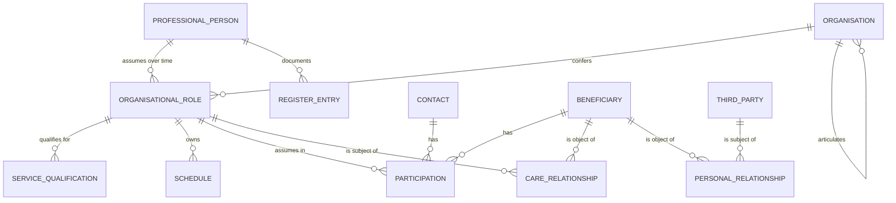
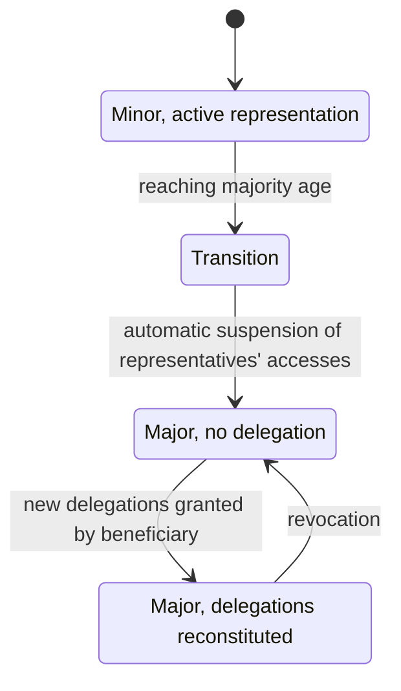

# Beneficiary, professional, organisation

This chapter models the subjects. Not their demographics - those are handled by module
[04 of the foundations](../10_fondamenti/04-identita-e-anagrafiche.md), which explains how a
tax code is composed, what STP and ENI are, why registries diverge and why incorrect merging
is an adverse event. This chapter decides **how subjects become entities and relationships**,
and what form they must have for the model to survive over time.

The statement from which everything else follows is single:

> **Role is not an attribute of the person. It is a relationship between a person and an
> organisation, with temporal validity.**

It seems a normalisation detail. It is not: it is the difference between a system that can
represent Italian healthcare reality and one that cannot.

## 1. Why role is not an attribute

We start from a banal fact of the real world: **the same professional works in multiple places,
in multiple disciplines, in different periods, with different qualifications.** A cardiologist
can be an employee of a hospital company, consultant at an accredited private polyclinic and
holder of private professional activity. In each of the three contexts they deliver different
services, with different schedules, under different responsibilities.

A model that writes `specialita = "cardiologia"` on the person produces four defects, all
observable:

| Defect | How it manifests |
|---|---|
| **Impossibility of multiple context** | The professional sees in a single list patients of different organisations, which are independent data controllers (`V-04`) |
| **Loss of history** | On cessation of the relationship with organisation A the role is deleted or overwritten, and historical contacts lose the context in which they were delivered |
| **Authorisation not representable** | "Can sign reports of this branch **at this structure**" is not expressible with attributes on the person |
| **Ambiguous billing** | The service is attributed to the delivering structure, which is a property of the role, not the person |

> **`DM-30` [MOD] - Three entities, not one.** `Person` (identifying data, immutable or almost),
> `Organisation` (legal subject and its articulations), `OrganisationalRole` (the relationship
> between the two, with period of validity, discipline, deliverable services, qualifications).
> The correspondence with the standard is `Practitioner`, `Organization`, `PractitionerRole`,
> and it is not by chance: the standard made the same choice for the same reason.

Module [04 of the foundations](../10_fondamenti/04-identita-e-anagrafiche.md) § 5.4 treats the
error from a didactic side; here the data structure follows from it.

## 2. The beneficiary

### 2.1 The reference model

> **[BASE]** In the integration model demographics are not the project's: patients, professionals
> and schedules are already managed elsewhere. The system works **by reference** - external
> identifiers with explicit attribution domain - and does not become the *master data*
> (`00_PROJECT_BRIEF.md` § 6.2.3).

Four properties of the model follow from this, all verifiable.

1. **The working identity is the pair `system` + `value`.** An identifier without attribution
   domain is a string, not an identifier. The pair is unique per tenant (`RF-021`) and repeated
   creation with the same values does not generate duplicates.
2. **No external identifier is a primary key** (`04_BASELINE_ARCHITETTURALE.md` § 3). The tax
   code is an identifier with explicit domain, not a key: it changes, is missing, is provisional,
   is affected by homonymy. Module 04 of the foundations, § 2.3 and § 2.9, gives the cases.
3. **The model admits multiple identifiers for the same person**, each with its own domain:
   integrator identifier, tax code, STP or ENI code, regional identifier, registry identifier.
   None is mandatory in absolute terms; at least one is.
4. **No automatic merging** (`RF-026`). Two records with identical name, surname and date of
   birth remain distinct and generate an alert for evaluation. Merging is a human act, traced,
   with conservation of both external identifiers (`RF-025`).

### 2.2 The tax code and its two domains

> **[NV] - Question `Q-06` on the board, addressed to areas `ARCH` and `TECH`.** Italian
> implementation guides use **two different URIs** for the tax code:
> `http://hl7.it/sid/codiceFiscale` in *IT Base* and *Televisita* families,
> `http://hl7.it/fhir/itcore/CodeSystem/cs-codicefiscale` in *IT-Core*. They are two distinct
> attribution domains for any system comparing identifiers.

The contribution of this area to the question is not the choice of URI - which belongs to `ARCH`
- but the constraint that any choice must respect:

> **`DM-31` [MOD] - Normalisation of identifiers occurs at the boundary, never in the domain.**
> The domain model knows one internal canonical identifier and a collection of qualified
> external identifiers. Translation between competing URIs is the responsibility of the adaptation
> layer of the interoperability context, which by construction is the only point of contact with
> the outside. If translation logic enters the domain, every future divergence between guides
> becomes a domain modification.

Module [04 of the foundations](../10_fondamenti/04-identita-e-anagrafiche.md) § 3.2 moreover
proposes **writing both identifiers on output** and accepting both on input. It is compatible
with `DM-31` and this area supports it.

### 2.3 Beneficiary and patient: two qualifications, one subject

Chapter [01](01-linguaggio-ubiquo.md) § 5.1 establishes that "beneficiary" is administrative
qualification and "patient" is clinical qualification. On the model level **they are not two
entities**: they are two **sets of attributes and permissions on the same subject**, with
different access boundaries.

| Set | Content | Who accesses it by virtue of their role |
|---|---|---|
| **Demographic-administrative** | identifying data, contact details, domicile, exemptions, coverages, choice of doctor | front-office, administration |
| **Clinical** | conditions, documents, measurements, notes, outcomes | professionals in care relationship |

With a caveat that makes the separation less neat than it seems, and must be written because it
is counterintuitive:

> **An exemption for condition reveals the condition.** It is not neutral administrative data:
> it is data relating to health under art. 9 GDPR. The same applies to the **fact itself** of
> having an appointment with a medical specialty. Module
> [03 of the foundations](../10_fondamenti/03-il-dato-clinico.md) § 1.2 treats it at length.

A modelling rule follows: **"administrative" attributes are not automatically accessible to
administrative roles**. The exemption carries its own sensitivity label, and the medical
specialty does not appear in notifications on unauthenticated channels (`BR-050`) nor in
calendar export (`RF-051`).

### 2.4 No global patient index

> **[BASE] `V-04`** - Every entity carries the tenant identifier. The same physical person
> present in two tenants is represented by **distinct and non-correlatable entities** with any
> query of the platform (`RF-023`).

It is a choice with a declared cost: the system cannot offer a unified view of the person across
tenants, and cannot reconcile duplications between different data controllers by itself. It is
the correct price to pay, because two tenants are typically **two independent data controllers**,
and a correlation between their data is a communication of healthcare data that no one has
authorised.

The project **does not implement a primary patient index** (`00_PROJECT_BRIEF.md` § 6.2.3):
it consumes the identity of the source system.

## 3. The professional

### 3.1 Person, role, organisation

The entities and their minimum content:

| Entity | Content | Temporal validity |
|---|---|---|
| `ProfessionalPerson` | identifying data, external identifiers | - |
| `RegisterEntry` | order, province, number, registration date, verification date, **who verified** | yes |
| `Organisation` | legal subject, type, identifiers, hierarchical articulation | yes |
| `OrganisationalRole` | person, organisation, discipline, qualification, profession | **yes, mandatory** |
| `ServiceQualification` | role, service type, permitted channels | yes |
| `Participation` | subject, contact, role in contact, entry, exit | yes, by construction |

### 3.2 Verification of professional qualification is a fact, not a boolean

The system must be able to record the details of registration with the professional body
**with the date of verification and the identity of who verified** (`RF-018`), and flag profiles
lacking verification. The reason is that an unverified clinical profile is not a completeness
defect: it is a risk, because the qualification to perform reserved acts depends on registration.

> **`DM-32` [MOD]** - Verification of qualification is an **act with author and date**, not a
> boolean attribute of the profile. A boolean answers the question "is it verified?"; the model
> must be able to answer "who verified it, when, on what basis" - which is the question posed
> when something goes wrong.

### 3.3 Reserved acts are not configurable

> **[NORM]** Combinations of profession × service type forbidden by professional regulation
> **are not tenant-configurable**: they are domain constraints codified (`BR-011`). A structure
> administrator cannot confer on a non-medical profile the capacity to perform medical acts.

Module [01 of the foundations](../10_fondamenti/01-sistema-sanitario-italiano.md) § 5.1 explains
why profession is a domain constraint and not a configuration. On the model level a two-level
structure follows that must be kept rigorously separate:

| Level | Who defines it | Example | Modifiable by tenant |
|---|---|---|---|
| **Domain constraint** | professional regulation, codified in product | remote consultation (televisita) is a medical act | **no** |
| **Organisational qualification** | the tenant, within the constraint | Dr X delivers remote consultation of this discipline at this structure | yes |

> **`DM-33` [MOD]** - The set of permitted configurations is a **proper subset** of the policy
> space (`BR-096`). The attempt to compose a qualification that violates a domain constraint is
> rejected with a validation error, not silently ignored: silent rejection leaves the administrator
> convinced they configured what they wanted.

### 3.4 Service centre and delivering centre

> **[NORM]** "For every regional telemedicine infrastructure there must be provided one or more
> **Service centres**, with purely technical tasks, and one or more **Delivering centre**, with
> purely healthcare tasks" (DM 21 September 2022, Annex A).

The two centres have responsibilities that the model must be able to separate:

| | Service centre | Delivering centre |
|---|---|---|
| Personnel | technical | healthcare |
| Tasks | maintenance, account management, user assistance, monitoring, management of devices at home, training in use | service delivery |
| Alarms managed | **technical** | **healthcare** |

> **`DM-34` [MOD]** - The service centre is an **organisation with technical role**, not an
> application role. The distinction matters because the service centre can be a different legal
> subject from the delivering party, with its own responsibility relationship for data processing,
> and because alarm class determines the recipient. A single alarm queue makes it impossible to
> respect the separation imposed by the decree.

### 3.5 Non-human subjects

Not all actors are persons. The **integrator** is an application principal with its own keys, its
own webhooks, its own limits and its own personalisation configuration (`00_PROJECT_BRIEF.md` §
6.2.6).

> **[BASE]** An integrator's application credentials **do not alone confer access to clinical
> data**: every clinical operation requires a delegating user context verifiable (`BR-017`). The
> delegation is always represented as such, never as impersonification: `D18` imposes the `act`
> claim of RFC 8693 § 4.1.

On the domain level the consequence is clear: **every act has two subjects when performed in
delegation** - who acts and on whose behalf - and the access register records both. A model
that reduces the act to a single subject makes an integrator action indistinguishable from a
user action.

### 3.6 Professional identifiers

The ministerial template for the remote consultation report requires **surname, name and tax code** for
four distinct professional subjects - reporting doctor, signing doctor, other technical figure
involved, prescriber - and structure codes (DM 19 November 2025, Annex 1, § 2.20).

Three model requirements for the professional follow, often discovered late.

1. **The professional's tax identifier is a necessary datum**, not optional, for any profile that
   can appear in a document destined for the record. A clinical profile lacking that datum cannot
   report: it is a condition to verify on qualification, not on signature.
2. **The model must be able to represent a professional who is not a system user.** The
   prescriber, typically, is not: appears in the document as a reference, not as a subject
   accessing. A model in which every professional is an account produces dummy accounts for
   subjects who never used the system.
3. **Professional identifiers follow the same discipline as beneficiary identifiers**: domain
   plus value pair, none as primary key, normalisation at the boundary. The same professional
   can carry the order identifier, the company one and the source system one.

> **`DM-39` [MOD]** - The **reference professional**, who appears in documents without being a
> user, is modelled as `ProfessionalPerson` with no `OrganisationalRole` in the tenant. It is
> coherent with `DM-30`: the person exists independently of roles, and the absence of roles
> means exactly that they cannot operate.

## 4. Organisations

### 4.1 Four concepts that do not coincide

| Concept | What it is | Who defines it |
|---|---|---|
| **Tenant** | Logical isolation boundary of data and configuration | installation manager |
| **Organisation** | Legal subject | the legal order |
| **Delivering structure** | Who answers for service delivery | accreditation or authorisation |
| **Integrator** | Application principal embedding the system | the contract |

A tenant can contain multiple organisations; an organisation can articulate into multiple
delivering structures; an integrator can operate on multiple tenants. In simple cases the four
coincide, and this is precisely why they are confused in modelling phase: **the simple case is
that of the first pilot installation**.

### 4.2 Internal articulation

The ministerial template for the remote consultation report requires three distinct levels: **healthcare
company**, **facility**, **operating unit**, each with code and description (DM 19 November 2025,
Annex 1, § 2.20). They are not labels: they are the articulation that billing and reporting
require.

> **`DM-35` [MOD]** - The organisation is **recursive** with a declared type per level. Three
> separate flat fields - company, facility, operating unit - work until a private tenant appears
> without facilities or a public tenant with one more intermediate level. Recursive hierarchy
> with type allows projecting the three fields required by the template without constraining the
> model to exactly three levels.

### 4.3 The virtual delivery point

In telemedicine the place must still be valued, because billing requires it and the report cites
it (`RF-031`). The virtual delivery point is an entity configured by the tenant, linked to
schedules and cited in the document.

Not to be confused with the **session location**: the first is where the structure delivers, the
second is where the beneficiary is physically during the session, and is data needed in emergency
(`BR-039`, [chapter 02](02-le-prestazioni-modellate.md) § 10). They are two different places
with two different purposes and two different conservation regimes.

## 5. Relationships with temporal validity

### 5.1 The general form

All relationships in this domain - of care, representation, delegation, role - have the same
form. Recognising this avoids modelling them five times in five different ways.

> **`DM-36` [MOD] - Canonical form of the relationship.**
>
> | Component | Mandatory | Content |
> |---|---|---|
> | **Subject** | yes | who holds the position |
> | **Object** | yes | on whom or on what |
> | **Type** | yes | which relationship, from a closed set |
> | **Scope** | depends on type | what the relationship permits; for representation is delimited by the title |
> | **Start validity** | yes | |
> | **End validity** | **yes for voluntary relationships**, optional for status ones | a delegation without expiry is permanent unpoliced access |
> | **Title** | depends on type | provision, act, declaration that founds it |
> | **Evidence** | yes | how it is proved: document, recorded declaration, reference to an act |
> | **Who recorded it** | yes | the recording act has an author |
> | **State** | yes | vigent, ceased, suspended, revoked |

The last row deserves an observation. **Ceased and revoked are not the same state**: cessation is
the natural end of the period, revocation is an act. Treating them as the same value makes it
impossible to answer "did the delegation end or was it withdrawn", which is the question the
beneficiary asks.

### 5.2 The care relationship is the unit of authorisation

The authorisation model proposed in `R6` § 2.2 is by roles for capacities and by attributes for
scope. The decisive attribute is **the existence of an enabling relationship**: a person being a
doctor says nothing about *which* patient they can see.

| Relationship | Existence condition | Effect |
|---|---|---|
| `CARE_APPOINTMENT` | an appointment exists between the role and the beneficiary | access to necessary data for preparation and execution, in a window around the expected time |
| `CARE_ENCOUNTER` | the role delivered a contact | permanent read-only access to **own** acts |
| `CARE_EPISODE` | the role is in the team of an active episode | access to the episode's record |
| `CONSULT_SCOPE` | the role is recipient of a specialist-to-specialist consultation (teleconsulto) request | access **only** to the material attached to the question, at expiry |
| `PRIMARY_CARE` | the role is the beneficiary's choice of doctor | continuous access to documents addressed to them |
| `DELEGATION` | a valid beneficiary delegation exists | derived, limited, time-limited access |
| `LEGAL_REPRESENTATION` | a registered representation title exists | access within the limits of powers |
| `BREAK_GLASS` | explicit invocation with motivation | exceptional access, short duration and non-renewable |

The time windows proposed by `R6` § 2.2 are **project default values**, tenant-configurable,
not normative prescriptions.

> **`DM-37` [MOD] - The care relationship is a first-class entity, not a query.** If the
> existence of the relationship is inferred each time by querying appointments, contacts and
> episodes, three things become impossible: motivating an access decision at a distance of time,
> verifying the decision in an audit, and changing the rules without touching authorisation code.
> The relationship is **materialised** as a fact with beginning, end and source.

A caveat following from the record and that must be adopted: for consultation by a doctor
different from the choice doctor, DM 7 September 2023, art. 15, c. 3 requires the **declaration
that the care process is underway** at the moment of consultation, with assumption of
responsibility under art. 47 of D.P.R. 445/2000. The declaration is therefore itself a fact to
record, with the identity of who makes it: it is not a technical flag.

### 5.3 BiTemporality of relationships

A relationship has **two times**: when it is valid in the world and when the system knew about
it. They almost never coincide.

A fully synthetic example that makes the problem concrete: a decree appointing an administrator
of a support order has effect from 3 March; the document is presented at the office on 21 March
and recorded the same day. Between 3 and 21 March the system permitted a voluntary delegatee
accesses that, in light of the decree, should have been evaluated differently.

> **`DM-38` [MOD] - Relationships that found access to data are **bitemporal**: they carry the
> period of validity in the world and the instant of recording in the system. The access register
> is always evaluated with the state **known at the moment of access**, not the current state:
> judging past accesses with subsequent knowledge produces false positives in every review.

Module [11 of the foundations](../10_fondamenti/11-fondamenti-informatici.md) § 8 treats
biTemporality from a technical side; here the domain consequence matters.

## 6. Delegations and representation

### 6.1 The figures and what distinguishes them

| Figure | What they can do | What they cannot do | Source of power |
|---|---|---|---|
| **Carer** | assist, be present, receive instructions, help with tool use | give consent for a capable beneficiary, **in no configuration** (`BR-062`) | the fact of assistance, plus possible delegation |
| **Voluntary delegatee** | access documents or act for capable beneficiary, **within delegation scope** | exceed scope; act after expiry | beneficiary's act of delegation, revocable |
| **Holder of parental responsibility** | decide for the minor, taking account of their opinion per age and maturity | continue after majority | the law |
| **Guardian** | substitute the will of the represented | exceed the powers of the provision | authority provision |
| **Administrator of support order** | act **within the limits of the appointment decree**, which may or may not include healthcare decisions | act outside granted powers | appointment decree |

The most frequent and costliest error is the last row: **treating the administrator of a support
order as a guardian**. Powers must be registered as **scope** and verified **per act** (`BR-063`,
`RF-117`). An administrator with limited powers to the patrimonial sphere who gives consent to a
healthcare act is invalid consent, and the system that accepted it is complicit.

### 6.2 How to model a delegation without creating a hole

Five mandatory properties, each with a reason.

1. **Explicit and closed scope.** Not "access to data" but an enumerated set of what the
   delegation permits. An open scope is a delegation that grows with product features, without
   the beneficiary knowing.
2. **Mandatory expiry for voluntary delegations** (`RF-028`). At expiry access is denied **without
   need for manual intervention**: expiry is verified at access decision, not by a periodic
   process that might not be executed.
3. **Immediate and effective revocation.** Revocation produces effect on already-open sessions,
   not just new accesses.
4. **Evidence of title.** For voluntary delegations: identity of delegator, channel, instant, text
   presented. For representation: details of the provision, scope of powers, temporal validity.
5. **Verification per act, not at entry.** Scope is verified **with respect to the act being
   performed**, not once at access. It is the difference between "this user is a representative"
   and "this representative can perform this act".

### 6.3 Transition to majority

> **[NORM] [NV]** On reaching majority age representatives' accesses are automatically suspended
> and delegations must be reconstituted by the beneficiary (`RF-118`). The detailed discipline of
> representation and consent for minors and incapable subjects is among the questions that `R6`
> § 11.1 refers to for normative verification (voce Q9). **To be asked of area `COMP`**; the
> model is nonetheless built to represent any answer, because the transition is a demographic
> event that invalidates references and must be managed in any case.

Two details that make the transition harder than it seems and must be decided:

- **Calculation of the date** depends on date of birth, which is a demographic datum by reference
  and can be absent or approximate for some populations (module [04 of the
  foundations](../10_fondamenti/04-identita-e-anagrafiche.md) § 2.3 gives the cases).
- **Suspension is automatic, communication is not.** A parent losing access without explanation
  phones; the model therefore provides for notification to the new holder of the right and an
  explanatory message to the ceased representative, without clinical content.

### 6.4 The third party in session

The third party is not a participant like the others: they access healthcare data without being
part of the care relationship. Three distinct paths, with three distinct treatments (`R6` § 3.3.6):

| Situation | Treatment |
|---|---|
| **Foreseen in booking** | consent gathered beforehand; own access link; appearance in the list of participants |
| **Arose during session** | professional declares them; system asks the beneficiary for **explicit** confirmation, not silence-consent; entry and exit recorded |
| **Present but undeclared** | system **does not execute automatic face detection** (constraint `V2` and confidentiality profile). The burden of asking is the professional's; the system provides the field to record the response |

The third row is a domain decision worth making explicit: **the system deliberately renounces a
technical capability available**. Introducing automatic face recognition would change the risk
profile of the processing and shift the qualification perimeter.

## 7. Application roles and structural exclusions

Roles are **compositions of permissions**, not primitive entities (`R6` § 2.4). A tenant can
define its own, but cannot create new permissions nor exceed domain constraints.

Three exclusions are **structural**, i.e. not obtainable by configuration:

1. **No administrative role can read clinical content** (`BR-012`). Front-office, structure
   administrator and system administrator. The attempt to compose a role including them is
   rejected with a validation error.
2. **No impersonification function** allows an administrative role to operate as a clinical user
   (`RF-015`). It does not exist in any interface nor application interface.
3. **No self-registration with clinical role** (`RF-017`). Every clinical profile is created or
   approved by a tenant administrator, and qualification is a recorded act.

Self-assignment of a clinical role by an administrator generates a critical severity event and
a notification to the data protection officer (`BR-013`): it is the most obvious privilege
escalation and must be made costly, not impossible - making it impossible would produce small
organisations unable to operate.

## 8. Time passing on subjects

Six demographic events invalidate what the model believed true. They must be foreseen, because
they occur with sufficient frequency not to be edge cases.

| Event | What it invalidates | Required behaviour |
|---|---|---|
| Cessation of organisational role | schedules, qualifications, care relationships founded on role | historical contacts remain readable on own acts; future schedules free themselves with cancellation path by structure |
| Change of organisation | operative context | professional operates in sole selected context (`RF-014`); audit records context of every operation |
| Reaching majority age | representation | § 6.3 |
| Transition from paediatrician to primary care physician | `PRIMARY_CARE` relationship | it is a demographic event; no age-based rule must be hardcoded in the code |
| Death | all voluntary relationships; not conservation obligations | documents remain; record index is deleted thirty years after death date (DM 7 September 2023, art. 10) |
| Revocation or expiry of a representation title | derived accesses | verification at decision time, not by periodic process |

## 9. What this area does not decide

Three questions touch subjects but belong to other areas, and must be left there to avoid
contradictory decisions.

- **Federated digital identity** - realm, provider, assurance levels, propagation of
  authentication context - is for areas `SEC` and `INTEG`. This area consumes the assurance
  level as a subject attribute and does not decide its production.
- **Divergence of tax code URIs** is question `Q-06`, addressed to `ARCH` and `TECH`. This area
  contributes with `DM-31` and does not close it.
- **Partition data-controller/data-processor** in service model and at-customer installation is
  for area `COMP` (`R6` § 11.2, voce Q14). This area limits itself to requiring that the model
  **can represent different data controllers on the same installation**, which is a structural
  requirement already satisfied by `V-04`.

## Remember

1. **Role is a relationship with temporal validity**, not an attribute. Person, organisation,
   role: three entities.
2. **The working identity is the domain plus value pair.** No external identifier is a primary
   key; the tax code least of all.
3. **Normalisation of identifiers occurs at the boundary**, never in the domain.
4. **No global patient index**: the same person in two tenants is non-correlatable, and the cost
   of this choice is declared.
5. **Reserved acts are not configurable.** Domain constraint and organisational qualification are
   two levels, and the second cannot violate the first.
6. **Service centre and delivering centre are distinct subjects** with distinct alarm classes.
7. **All relationships have the same canonical form**: subject, object, type, scope, validity,
   title, evidence, recording author, state.
8. **Ceased and revoked are not the same state.**
9. **The care relationship is materialised**, not inferred at every request.
10. **Relationships founding access are bitemporal**: accesses are judged with the knowledge the
    system had then.
11. **Assisting is not representing**, and the administrator of a support order is not a guardian:
    powers are verified per act.
12. **Every voluntary delegation has an expiry**, verified at access decision.

## Where to continue

- [06 - Consent and confidentiality](06-consenso-e-riservatezza.md): what subjects declare and
  how it is proved.
- [04 - Clinical documents](04-documenti-clinici.md): who is author, who is signatory and why
  they are not the same person.
- Module [04 of the foundations](../10_fondamenti/04-identita-e-anagrafiche.md): identifiers,
  registries, digital identity and assurance levels, which this area does not repeat.
