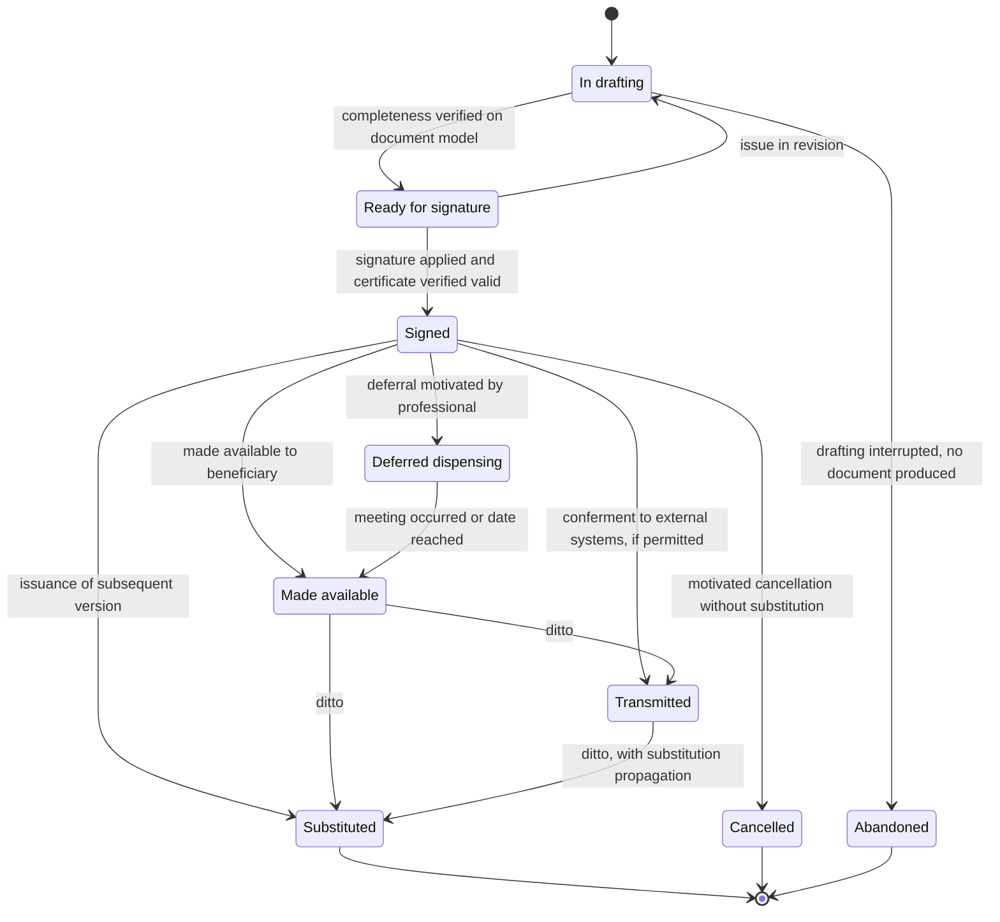
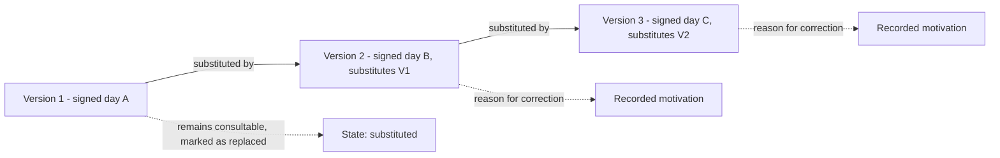
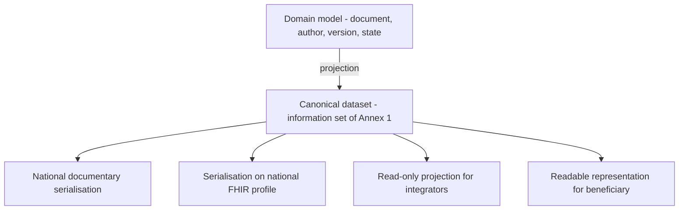

# Clinical documents

A clinical document is what remains when the session is over, the professional has hung up and
nobody remembers anything else. It is the only artefact of the system that will be read ten years
later, maybe in a dispute, by someone who was not there.

A criterion that governs the entire chapter follows:

> **The document model is designed for the moment when someone will ask account of what was
> written, by whom, when, on what basis and who could read it.**

Module [03 of the foundations](../10_fondamenti/03-il-dato-clinico.md) § 6 and § 7 explains
what report, relation, minutes, discharge letter and clinical diary are, and how signature,
validation, timestamp and compliant conservation work. This chapter does not repeat them: it
derives the data structure and lifecycle from them.

## 1. What distinguishes a document from content

The system produces much text: notes, chat messages, form fields, annotations, outcomes. Only
part is a **clinical document**. The difference is not length or format.

| Property | Content | Clinical document |
|---|---|---|
| Has an **author** identified with qualification | sometimes | always |
| Is **attributed to a moment** of the act | sometimes | always |
| Is **validated** by who assumes responsibility for it | no | yes |
| Is **immutable** after validation | no | yes |
| Has a declared **recipient** | no | yes |
| Has its own **conservation regime** | no | yes |
| Can be **suppressed** | no | yes |

> **`DM-40` [MOD]** - The passage from content to document is an **act**, not a save. In the
> model there exists an identifiable moment at which a set of contents becomes a document, with
> an author who assumes responsibility for it. Before that moment the material is not visible to
> the beneficiary, is not transmissible and is not conserved as a healthcare document (`BR-041`).

The case that makes the distinction operative: the **session chat**. At session end its content
is either attached to the contact as a document or deleted, per configuration; it does not remain
in an undefined intermediate state (`BR-056`). Clinical content without documentary placement is
ungovernable: one does not know who can read it, how long it is conserved, if it is transmitted.

## 2. Typologies

### 2.1 The ten national document typologies of telemedicine

> **[NORM]** DM 19 November 2025, art. 7, c. 1 adds ten new letters to art. 3, c. 1 of DM 7
> September 2023, creating ten document typologies of the electronic health record dedicated to
> telemedicine. The information set of each is in Annex 1, §§ 2.18–2.27. Implementation deadline:
> **30 June 2026** (art. 7, c. 3).

| Lett. | Typology | § Annex 1 | Produced by |
|---|---|---|---|
| n) | televisita, teleassistenza and telemonitoraggio prescription | 2.18 | prescriber |
| o) | teleconsulto request | 2.19 | requesting doctor |
| p) | **specialist report for televisita** | 2.20 | delivering doctor |
| q) | **collaborative relation for teleconsulto/teleconsulenza** | 2.21 | consulting doctor |
| r) | conclusive clinical-assistive relation for teleassistenza/telerehabilitation | 2.22 | healthcare professional |
| s) | device badge for telemonitoraggio | 2.23 | professional assigning device |
| t) | telemonitoraggio/telerehabilitation plan and teleassistenza | 2.24 | professional drafting plan |
| u) | telemonitoraggio measurement report | 2.25 | system, under service responsibility |
| v) | weekly telemonitoraggio measurement report | 2.26 | ditto |
| w) | final relation for telemonitoraggio/telerehabilitation | 2.27 | professional |

This table **replaces a widespread and wrong hypothesis**: that the remote consultation report is
conveyed as a specialist ambulatory report. It is not so from DM 19 November 2025, and the
correction has been verified on the Official Journal (`B1`, § V4).

### 2.2 Documents not going to the record

Not everything the system produces is destined for the record, and treating everything the same
way produces two opposite defects: delivering to the beneficiary what is not destined for them,
or not delivering what they are owed.

| Internal typology | Recipient | Goes to record | Constraint |
|---|---|---|---|
| **Clinical diary / progress note** | team professionals | no, except explicit action | not delivered to beneficiary nor transmitted (`RF-136`, `BR-136` of `R6` § 5.I) |
| **Digital annotation** (remote consultation of primary care doctor) | the treating physician and beneficiary | per setting | replaces the report in that setting (`REQ-59` of `B1`) |
| **Session technical report** | professional, service | no | it is technical data, not clinical; feeds evidence on connection quality |
| **Session recording** | per consent and permission | **no** | not a clinical document under the decree: has its own legal basis, retention and access rules |
| **Response to self-completed questionnaire** | professional | no until validated | has no value as history until the professional validates it |

The row on recording is the one that surprises, and must be written without ambiguity because
it has practical consequences: `B1` § V4 and art. 12 of DM 19 November 2025 shift the
conservation centre, and treating recording as a clinical document would make it inherit
conservation and access rules wrong in both directions.

## 3. Author, signatory, executor: three roles, not one

The ministerial template for the remote consultation report distinguishes explicitly, and must be taken
literally (DM 19 November 2025, Annex 1, § 2.20):

- **reporting doctor** - surname, name, tax code;
- **signing doctor** - surname, name, tax code, **distinct from reporter**;
- **other technical figure involved in procedure execution** - surname, name, tax code;
- **prescribing doctor** - "doctor of the role for primary care/PLS or Specialist".

> **`DM-41` [MOD]** - The document bears **four references to distinct subjects**, each with its
> own role, not a single field "doctor". A model identifying author and signatory is correct in
> the ordinary case and **not representable** in the case, foreseen by the template, in which
> they differ. Adding the fourth reference later is data migration on immutable documents: it
> does not happen.

The distinction between reporter and signatory is what makes the model non-trivial. The reporter
is who **drafts and assumes clinical responsibility**; the signatory is who **affixes the digital
signature**. In most cases they coincide. When they do not - and the template foresees it can
happen - the document must state both, because they answer two different questions: who answers
for the content and who guarantees integrity.

In specialist-to-specialist consultation (teleconsulto) the same structure repeats with different subjects: **consulted doctor**,
**signing doctor**, **requesting doctor** (Annex 1, § 2.21).

## 4. The lifecycle

Six observations on the transitions, each a decision.

1. **`In drafting` is not a state of the healthcare document.** It is the state of working
   material. The distinction is not formal: it determines that the material does not appear in
   any list destined for the beneficiary, "even as a document being worked on" (`RF-124`).
2. **`Signed → In drafting` does not exist.** The signed document is immutable (`BR-044`). An
   issue after signature produces a **new version**, not a return to the previous state.
3. **Making available and transmission are independent.** A document can be transmitted to the
   source system without yet being made available to the beneficiary, and vice versa. They are
   two recipients, two consents, two regimes.
4. **Deferred dispensing is a state, not a delay.** There exists clinical casework in which
   automatic delivery is harmful: the professional can defer, recording motivation and expected
   date (`BR-047`, `RF-132`). The beneficiary sees the document exists and will be illustrated,
   without accessing content.
5. **`Abandoned` exists.** An interrupted drafting produces nothing, but the fact that it was
   opened and not completed is information for surveillance of reporting deadlines.
6. **`Cancelled` without substitution is permitted but rare.** It serves for the document issued
   in error on the wrong subject, where no "correct" version exists to issue.

### 4.1 The reporting window

The time between contact conclusion and signature is a measurable fact with organisational
consequences: once the configured window is exceeded, the professional receives a prompt and the
service manager sees the contact in the list of non-performances (`RF-130`).

> **`DM-42` [MOD]** - Exceeding the reporting deadline is a **domain event**
> (`ReportingDeadlineExceeded`), not a periodic report. The difference is that an event is
> traceable, subscriptable and verifiable; a report is a snapshot that no one conserves.

The values proposed by `R6` (`BR-042`: five working days as default, twenty-four hours for
services marked urgent) are **project values tenant-configurable**, not normative prescriptions.

## 5. Immutability, version, correction

### 5.1 The chain

The rules, all verifiable with a test that violates them:

1. **No version is deleted.** All remain consultable; the previous ones are marked as
   substituted (`RF-128`).
2. **Every subsequent version bears the reference to the previous one and the reason for
   correction.** A correction without motivation is a defect, not an interface choice.
3. **The signature covers the document plus attachments together** (`RF-134`): alteration of
   an attachment makes the integrity verification negative.
4. **Substitution propagates.** If the document had already been transmitted to an external
   system, the substitution generates a propagation fact; propagation failure is a visible
   incident with reconciliation queue, not a silent error (`BR-048`).

### 5.2 Why document compensation is not a rollback

A document transmitted to the record is not "cancelled": it is **corrected**, and the correction
is itself a fact that must be transmitted. It is the classic example of compensation: the effect
is not erased, a second one is produced that counters it. Module
[11 of the foundations](../10_fondamenti/11-fondamenti-informatici.md) § 3.5 gives the technical
treatment; here the domain consequence matters: **the model has no retroactive cancellation
operations on content already conferred.**

### 5.3 Entity versioning is not the access register

> **[BASE] `D42`, [`V-04`](../11_registri/01-vincoli-in-vigore.md#v-04)** - Automatic versioning of entities **versions, does not make
> immutable**: whoever has write access to the database can also alter versioning tables. The
> access register is a **hash chain with separate conservation**.

The consequence for this chapter is that **the document version chain and the access register
are two distinct artefacts with two distinct purposes**: the first proves what was written and
in what order, the second proves who read what. Neither substitutes the other, and presenting
the first as "immutable audit" is an unsustainable claim.

## 6. The canonical dataset

### 6.1 The constraint

> **[BASE] [`V-07`](../11_registri/01-vincoli-in-vigore.md#v-07)** - The information content of documents destined for the record is modelled
> as **canonical dataset**; serialisations (CDA2, FHIR, other) are **replaceable** and must not
> be hardcoded.

The reason is not theoretical. It is ascertained:

> **[NV]** At the research date **the CDA2 template, document typology codes and indexing
> metadata** for the ten new typologies were not found. Version 2.6.4 of the national
> interoperability specifications between regional record systems is published, but it was not
> possible to ascertain if it already contains telemedicine templates (`B1`, § V4, "What remains
> open"). **Question [`Q-07`](../11_registri/02-questioni-aperte.md#q-07) on the board, addressed to area `COMP`**: from whom they are requested
> and in what timeframe.

A model that had hardcoded the CDA2 template would be impossible to write today: there is no
template to hardcode. Modelling the information content, instead, can be done today, because
**the information set is published in the Official Journal**.

### 6.2 The three-level structure

| Level | What it is | Who can change it |
|---|---|---|
| **Domain** | The document as an aggregate: author, signatory, version, state, confidentiality, attachments | the project, with an ADR |
| **Canonical dataset** | The information content, field by field, as published in the Official Journal | the regulation |
| **Serialisation** | The format with which the dataset is written for a recipient | the recipient's specification |

> **`DM-43` [MOD]** - The canonical dataset is **generated from the domain**, not the domain.
> It is the point where the internal model meets the normative obligation, and is the only
> artefact that must correspond field by field to the information set. Below it the domain is
> free; above it serialisations are interchangeable.

### 6.3 The information set of the remote consultation report

The mandatory content, by groups, as published (DM 19 November 2025, Annex 1, § 2.20). It must
be known in full because it determines what data the system must **have**, not just what it must
write.

**Beneficiary.** Surname, name, identifying code (tax code, STP, ENI or other), sex, date of
birth, place of birth, residential address with postal code, municipality, province, region and
state, domicile address with postal code and municipality, fixed or mobile phone, email, **certified email**.

**Professionals and structure.** Reporting doctor, signing doctor, other technical figure
involved in execution, prescribing doctor; code and description of healthcare company, facility
and operating unit; phone number of operating unit, booking centre or company.

**Administrative references.** Medical prescription number, report signature date, **booking
code**, codes identifying related objects (image archive identifier, access number, imaging
study), nosological code, provenance, **access typology** (scheduled or direct access), ambulatory
specialist discipline, branch.

**Clinical content.** Code and description of diagnostic question, history taking, allergies and
declared sources, previous tests performed, therapy in progress, **physical examination**, code
and description of performed service, **date and time of start and end of delivery**, code and
description of operative procedure, quantity, **mode of procedure execution**, **instrumentation
used**, **procedure descriptive parameters**, notes, comparison with previous tests,
**reporting**, code and description of diagnosis, conclusions, suggestions for prescribing
doctor, recommended tests, recommended medicinal therapy.

Three modelling observations:

1. **Date and time of start and end of delivery** are in the document. They are not technical
   metadata: they are mandatory content. The model must therefore record actual duration of the
   act with defensible precision, distinct from planned duration (`RF-048`).
2. **The diagnostic question code is coded** in disease classification (Italian version of the
   ninth revision, with clinical modifications), and medicinal therapy uses marketing authorisation
   or anatomical-therapeutic classification. Chapter
   [07](07-terminologie-nel-dominio.md) treats the licensing regime of each and the practical
   consequences.
3. **The beneficiary's certified email is a field of the template.** It is data that systems do not
   ordinarily collect: it must be foreseen in the demographic model, with awareness that it will
   often be absent.

### 6.4 The missing field

> **`DM-44` [MOD] - The most concrete open problem of this chapter.**
>
> Agreement 215/CSR 2020 imposes that in the remote consultation report be registered **the quality of
> the connection and the confirmation of its adequacy for service delivery**, in addition to
> indication of any participating collaborators. **The ministerial template does not provide a
> dedicated field for either** (`B1`, § V4).
>
> The natural candidates for conveying them are the fields **"Mode of procedure execution"**,
> **"Instrumentation used"** and **"Procedure descriptive parameters"** for connection quality,
> and **"other technical figure involved in procedure execution"** plus notes for collaborators.
>
> **The placement adopted by this area**, accepting the proposal formulated by the protocols area
> (question [`Q-161`](../11_registri/02-questioni-aperte.md#q-161) on the board) and as contribution to the ADR required by `REQ-46` of `B1`:
>
> | Mandatory content | Template field | Role |
> |---|---|---|
> | Connection quality measures and adequacy attestation | **Procedure descriptive parameters** | primary seat |
> | Synchrony, beneficiary presence, actually used channel and possible fallback | **Mode of procedure execution** | act qualification |
> | Platform identification and its version | **Instrumentation used** | technical traceability |
> | Presence of carer, other doctor, healthcare operator near beneficiary | **Other technical figure involved in procedure execution**, plus notes | participating collaborators |
>
> This area moreover places two constraints that any formalisation must respect:
>
> 1. The content is produced **in structured and repeatable form**, not as free prose drafted by
>    hand by the professional. It derives from the session quality profile and the medical
>    adequacy attestation act.
> 2. Adequacy attestation remains **a professional act** (constraint [`V2`](../11_registri/03-vincoli-fondanti.md#v2)): the value is
>    **measured by the system and confirmed by the doctor**, never generated autonomously and
>    inserted in the document. A value that the system wrote by itself in a clinical document
>    would be information produced by the system inside a healthcare act.
>
> The **formalisation in ADR and verification of compliance remain with area `COMP`**: this area
> has taken the modelling decision, not the compliance one.

This second condition is the logical chain that makes defensible the entire framework of quality
metrics: the regulation imposes on the doctor to attest connection adequacy → attestation requires
objective evidence → session metrics **are** that evidence → the alarm threshold is a project
choice, configurable, and not a regulatory threshold (`B1`, § "What follows from this", point
2; constraint [`V-12`](../11_registri/01-vincoli-in-vigore.md#v-12) on board).

## 7. The collaborative relation of the specialist-to-specialist consultation

It has a structural rule that no other typology has:

> **[NORM]** "The collaborative relation **is conferred to the FSE as an attachment of the
> report document** related to the service or main event […] drafted by the doctor requesting the
> consultation" (DM 19 November 2025, Annex 1, § 2.21).

| Property | Value |
|---|---|
| Author | the consulted doctor |
| Signatory | possibly distinct |
| Correlation | identifier of the teleconsulto request |
| Conferment | **attached** to the document of the main event of the requester |
| Mandatory temporal content | date of receipt of request, date and time of assumption, date and time of consultation scheduling in the synchronous case |
| Declared mode | spontaneous or scheduled × synchronous or asynchronous × with or without beneficiary presence |

> **`DM-45` [MOD]** - The attachment constraint is modelled as **conferment dependency**, not
> composition: the relation has author, signature and own lifecycle, but its conferment is
> subordinate to the existence of the main document. The case where the main document is never
> issued is foreseen and has a declared outcome - signed relation and not conferrable, flagged to
> the requester - not a silent failure.

## 8. Document confidentiality

### 8.1 The confidentiality level

Every document bears a **confidentiality level** (`BR-065`, `RF-135`). Documents with enhanced
confidentiality are excluded by default from automatic sharing and notifications, and their
transmission requires explicit motivated action.

It is a property of the document, not the patient nor the service: **the same patient can have
documents at different regime**, and the choice is of the professional who drafts.

### 8.2 Data with greater anonymity protection

> **[NORM]** DM 7 September 2023, art. 6 identifies a closed category: HIV seropositivity,
> voluntary interruption of pregnancy, sexual violence and paedophilia, use of narcotic,
> psychotropic and alcohol substances, childbirth in anonymity, family counselling services.
> They are visible to third parties **only with explicit, informed and specific consent given to
> the delivering subject**. In the absence of consent, "the service provider is responsible for
> any failure to suppress". In the case of services in anonymity **feeding the record is not
> admitted**.

Three structural requirements of the document model follow:

1. At the moment of feeding, **it must be indicated if the data fall in the category** or if
   suppression was exercised at the moment of delivery (art. 12, c. 4).
2. A "**not conferrable**" state of the document must exist, distinct from "not yet conferred":
   the service in anonymity produces a document that does not go to the record by construction.
3. Responsibility for failure to suppress is the provider's: the system must **make it difficult
   to get wrong**, not just offer the option. Chapter
   [06](06-consenso-e-riservatezza.md) treats the mechanism.

### 8.3 Suppression

Suppression is treated at length in [chapter 06](06-consenso-e-riservatezza.md). Here the only
effect falling on the document model must be registered, and it is the one that makes
implementation difficult:

> **[NORM]** Suppression occurs "in such a way as to ensure that all subjects authorised to
> access **cannot automatically come to know that the beneficiary has made such a choice**" (DM
> 7 September 2023, art. 9, c. 6).

Lists, counts, sequential numbering and notifications must leave no trace of the suppressed
document to those from whom it is suppressed (`BR-064`). It follows that **the document cannot
have visible sequential numbering** and totals are calculated on the filtered set, not the
complete set.

## 9. The non-conservation constraint

It is the element that most profoundly modifies the intuitive idea of a telemedicine platform,
and must be stated without mitigation:

> **[NORM]** "The IRT do not conserve the data and documents generated under art. 4, section 4"
> (DM 19 November 2025, art. 12). Documents are conferred to the record **by healthcare
> structures**. Authentication and access data are conserved for twelve months; registers for
> twenty-four months (`REQ-52` of `B1`).

> **`DM-46` [MOD]** - The model provides for an **operation mode without conservation** of
> clinical content, in which the platform is **producer and not archive**. It is not a marginal
> configuration variant: it is a mode that the model must make possible without rewriting,
> because it is the regime required when the system operates as a component of a regional
> infrastructure.

The consequences on the model are three, and must be made explicit:

1. **The document has a lifecycle that can terminate with conferment.** After conferment and
   receipt acknowledgement, the content may no longer be present in the system: the identifier,
   minimal metadata and proof of conferment remain.
2. **Reference is not content.** An interface assuming local content availability works in one
   mode and not in the other: reading a document always passes through an abstraction that can
   resolve locally or toward the external repository.
3. **Classification of data by conservation regime is a necessary artefact.** Clinical content,
   session recording, quality telemetry, access register and authentication data have four
   different regimes. `B1` § 5 requires an ADR on data taxonomy and retention per class:
   **open question toward area `ARCH`**.

## 10. Who can see what

> **[NORM]** DM 19 November 2025, Annex 3, § 5.2 contains the matrix "Access in consultation of
> the IRT for the purpose of diagnosis, care, rehabilitation" with six roles. In particular: the
> **specialist report for televisita is not accessible to nurses or midwives nor to administrative
> staff**; administrative staff access only to administrative data; the **teleconsulto request** is
> accessible only to doctors, other healthcare managers and the beneficiary (`REQ-53` of `B1`).

> **`DM-47` [MOD]** - The matrix of document typology × role is **versioned configuration data**,
> not code. It changes with the regulation, and regulation changes. The authorisation model
> consumes it as one of the conjunctive conditions of `BR-010`; does not replace it.

It must be kept distinct from two other rules acting on the same access and that are cumulative:

| Rule | Origin | Effect |
|---|---|---|
| Matrix typology × role | regulation | admits or excludes per subject category |
| Care relationship | authorisation model | admits only who has a vigent enabling relationship |
| Suppression and consent | beneficiary's will | excludes despite the first two |

The three compose with the most restrictive operator: **access is permitted only if all three
permit it**, and the default value is deny.

## 11. Signature and conservation: what the domain must know

Module [03 of the foundations](../10_fondamenti/03-il-dato-clinico.md) § 7 explains the
difference between signature levels, between signature, validation and timestamp, and what
distinguishes conservation from backup. The domain receives four consequences and no more.

1. **The required signature level is an attribute of the document typology**, configured per
   tenant. The system rejects publication of a document signed at a level lower than that
   configured (`BR-043`).
2. **Certificate validity is verified at the moment of signature** and the outcome is recorded:
   an expired or revoked certificate blocks the signature and the document remains in drafting
   (`RF-127`).
3. **System date is not a timestamp.** If the typology requires date opposability, a timestamp
   token is needed, which is an artefact with its own provenance.
4. **Compliant conservation is a process external to the domain.** The domain produces documents
   and records their conferment; does not implement conservation. The distinction matters because
   backup and conservation protect against different risks.

> **[NV]** The required signature level for the healthcare document and the detailed rules for
> conservation of healthcare documentation are among the questions that `R6` § 11.1 refers to for
> normative verification (voci Q4 and Q6). **To be asked of area `COMP`.** The model is built to
> represent any answer because it treats level as configuration, but the value must be ascertained
> before release.

## 12. Attachments, images and content produced in session

During a session contents are produced that are not the document and that the model must place,
because content without documentary placement is ungovernable.

| Content | Nature | Placement |
|---|---|---|
| Document uploaded by beneficiary before or during session | third-party material | attachment to the contact, with provenance declared "reported by beneficiary" |
| Image captured during session | produced content | attachment to the contact; if attached to the document it follows signature, conservation and access (`RF-134`) |
| Graphical annotation on shared content | produced content | follows the content on which it insists; if the content is not conserved, the annotation is not conservable |
| Session chat content | potentially clinical content | attached as document **or** deleted, per configuration: no intermediate state (`BR-056`) |
| Session technical report | technical data | linked to the contact, with own conservation regime |

> **`DM-48` [MOD] - The provenance of the attachment is declared and not deducible from the
> uploader.** A report uploaded by the beneficiary and a report received from a third-party
> system look the same and have different value: the first is reported content, the second is a
> document with a chain of origin. The model distinguishes them with an explicit attribute, so
> the clinician can know before making a decision on it.

Two constraints follow from the decree and must be kept in mind:

- The messaging micro-service must allow communication and file sharing **"without data and
  document persistence"**, with encryption to the endpoints of conversations (DM 19 November 2025,
  Annex 3, § 4.1.1; `REQ-54` of `B1`). It follows that the default configuration of chat is
  **non-conservation**, and attachment to the contact is the declared exception, not the rule.
- Document sharing is a specific micro-service of minimum services: **it is in the expected
  perimeter**, but sharing is not conservation.

## 13. What the system does not write

A chapter on documents must also state what the system does not produce, because it is the part
that determines regulatory qualification.

> **[BASE] [`V2`](../11_registri/03-vincoli-fondanti.md#v2), `BR-040`, `RF-126`** - The system **does not generate, infer or suggest
> interpretive clinical content**. It can provide document templates and structured fields; can
> pre-fill demographic, administrative and temporal data and data previously entered by the
> professional. **No field of clinical evaluation contains generated text.**

The verification is statable as an acceptance criterion: a document template is opened on a just-
concluded contact and which fields are valued is observed. If among them appears a field of
evaluation, diagnosis, conclusion or suggestion, the criterion is not satisfied.

It is worth noting that this boundary is not abstract: `D26` identifies three "user story-sized"
functionalities from reclassification, and **assisted reporting** is one of the three. The
document model is therefore one of three points where the perimeter must be presided with
change control, not good intentions.

## Remember

1. **The passage from content to document is an act**, with an author who assumes responsibility.
   Before that moment no document exists.
2. **Ten national document typologies** are dedicated to telemedicine by DM 19 November 2025.
   The *remote consultation (televisita)* report has its own typology: the hypothesis of specialist ambulatory report
   is wrong.
3. **Four distinct subjects** appear in the report: reporter, signatory, other technical figure,
   prescriber. Reporter and signatory may differ.
4. **The signed document is immutable**: it is substituted with a motivated new version, not
   modified and never retroactively cancelled.
5. **The canonical dataset is generated from the domain** and corresponds field by field to the
   Official Journal information set; serialisations are interchangeable.
6. **The national document template is not available**: modelling the dataset is the only viable
   path today, and also the correct one.
7. **Connection quality has no dedicated field in the template**: placement is a project decision
   to document, and attestation remains a professional act.
8. **The collaborative relation of *specialist-to-specialist consultation (teleconsulto)* is conferred as an attachment** to the document
   of the main event.
9. **Suppression must not be inferrable**: no visible sequential numbering, no totals calculated
   on the complete set.
10. **A non-conservation mode exists** in which the platform is producer and not archive, and the
    model must make it possible without rewriting.
11. **Three visibility rules compose** with the most restrictive operator: regulatory matrix,
    care relationship, beneficiary's will.
12. **No field of clinical evaluation is generated by the system.** It is one of three points
    where the regulatory perimeter is defended.

## Where to continue

- [06 - Consent and confidentiality](06-consenso-e-riservatezza.md): suppression, revocation and
  emergency access.
- [07 - Terminologies in the domain](07-terminologie-nel-dominio.md): how to code diagnostic
  question, diagnosis and therapy without contaminating the licence.
- Module [03 of the foundations](../10_fondamenti/03-il-dato-clinico.md): signature, validation,
  timestamp, conservation, which this area does not repeat.
