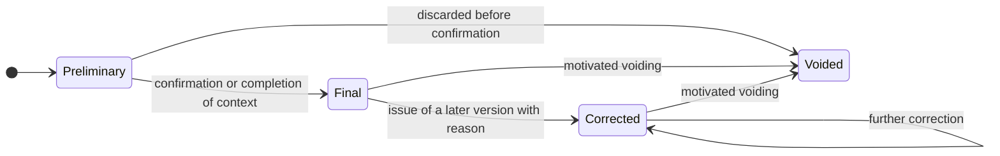

# Parameters and observations

A clinical measurement is not a number. It is a number **plus the way it was obtained**, and
without the second part the first is not interpretable. A blood pressure of 150 on 95 measured at
the left arm with an automatic device after five minutes of rest and the same pair of values
measured immediately after climbing a flight of stairs, by a carer, with a wrist device never
calibrated, are two different pieces of data that the model, if it does not pay attention,
represents identically.

Module [09 of the foundations guide](../10_fondamenti/09-fondamenti-clinici.md) explains why:
incorrectly converted units, arithmetic means applied to series that do not admit them, alarms on
a single isolated value, reference intervals applied to the wrong population, value without
measurement context. This chapter derives the data structure from that, and starts from a
decision:

> **`DM-50` [MOD] - Measurement is immutable and carries its own context with it.** It is not
> updated: it is corrected by issuing a new version that replaces the previous one, keeping both.
> It is the same principle as the signed document, for the same reason: someone has already made a
> decision on the basis of the previous value.

The constraint is already in the architectural baseline (`04_BASELINE_ARCHITETTURALE.md` § 2). Here
its form is derived.

## 1. Mandatory context

None of the attributes listed are recoverable after the fact. This is the reason why they must be
anticipated before the first line of ingestion code is written, not added when the clinician asks
why a value looks strange.

| Attribute | Mandatory | Content | If missing |
|---|---|---|---|
| **Value** | yes | numeric, coded text, ordinal, Boolean, or range | no measurement exists |
| **Quantity coded** | yes | the code of the parameter, not its name | different parameters sharing a unit become indistinguishable |
| **Unit coded** | yes for numeric values | unit code, not free text | the value is not comparable or convertible |
| **Observation timestamp** | yes | with time zone and local reference | the time series is meaningless |
| **Entry timestamp** | yes | when the datum entered the system | delay is not distinguished from anomaly |
| **Reception timestamp** | yes for acquired data | when the system received it | an ingestion chain fault is not diagnosed |
| **Who performed the measurement** | yes | beneficiary, carer, professional, device | reliability and responsibility change |
| **Who entered it** | yes | may differ from who measured | the chain cannot be reconstructed |
| **Method** | when relevant | how the quantity was obtained | values obtained by different methods are not comparable |
| **Site or side** | when relevant | where it was measured | physiological differences between sites become apparent anomalies |
| **Declared device** | when applicable | identification and, if available, unique identifier | a series cannot be recalled in case of device fault |
| **Declared conditions** | when relevant | rest, position, fasting, before or after therapy | the value is interpretable only within its conditions |
| **Quality indicators reported by the device** | when available | error reports, measurement reliability indices | the only automatic signal of unreliable measurement is lost |
| **State** | yes | preliminary, final, corrected, voided | it is not known whether the value is usable |
| **Plan and plan version** | yes for planned measurements | which plan requested it and in which version | evaluation against thresholds cannot be reconstructed |
| **Tenant** | yes | `V-04` | write rejected |

> **`DM-51` [MOD] - Context is not a notes field.** Each attribute in the table is a distinct
> element with its own type. A free-text field «notes on measurement» meets the letter of the
> requirement and permits no queries, no verification, no automatic exclusion of non-comparable
> data.

Module [09 of the foundations guide](../10_fondamenti/09-fondamenti-clinici.md) § 3.9 lists the
same attributes from the clinical side and gives the rationale parameter by parameter; this area
does not repeat it.

## 2. Identity of the measurement

### 2.1 What makes a measurement the same measurement

The problem arises at the first resend: a third-party gateway retransmits a batch of measurements
already sent, because delivery is **at least once** (`04_BASELINE_ARCHITETTURALE.md` § 5). Without
a key, duplicates are recorded; with a wrong key, legitimate measurements are lost.

> **`DM-52` [MOD] - Explicit deduplication key, declared by the producer.** The measurement
> carries an identifier assigned by the source, qualified by the attribution domain of the source
> itself. Deduplication occurs on that pair, **not** on a deduced combination of subject, quantity
> and timestamp: two legitimate measurements of the same quantity at the same timestamp are
> possible - two arms, two devices, a retry after a use error - and heuristic deduplication would
> cancel them.

When the source does not provide an identifier - typically manual entry - the system assigns it
at first contact with the datum and returns it.

### 2.2 Correction

The rules:

1. **No version is ever overwritten.** The earlier version remains, marked as superseded, with a
   reference to the later version and the reason.
2. **Voiding is not deletion.** A voided measurement remains visible as voided: the fact that it
   was entered and subsequently withdrawn is information.
3. **Correction re-evaluates.** If the measurement had been compared against a threshold,
   correction generates a new evaluation; the earlier outcome is not deleted, it is declared
   superseded.
4. **Who corrects is recorded.** Anonymous correction is loss of traceability at the very point
   where traceability is precisely what is needed.

## 3. Units of measurement

### 3.1 Value without unit is rejected

> **`DM-53` [MOD]** - A numeric measurement without a coded unit **does not enter the system.**
> Rejection occurs at the boundary, with an explicit error indicating the unit expected for the
> quantity. There is no default implicit unit, in any case, for any quantity.

It seems rigid and it is not: the default implicit unit is the mechanism by which the most
serious unit conversion errors are produced, because it works for years until a source arrives
that uses the other unit. Module [09 of the foundations guide](../10_fondamenti/09-fondamenti-clinici.md) § 1.2 gives the clinical example.

### 3.2 Conversion

| Rule | Rationale |
|---|---|
| **Conversion occurs at the boundary, not in the domain** | The domain preserves the unit in which the measurement was observed. Conversion on entry loses the original information |
| **Conversion is declared on the measurement, not implicit** | If a value has been converted, the measurement carries the original unit, the original value and the factor used |
| **No conversion between different quantities** | Different quantities that share a unit are not convertible to one another: this is why the quantity code is mandatory |
| **Nonlinear conversions are forbidden in the domain** | If a conversion requires a formula with parameters, it is not a conversion: it is a calculation, and a calculation has regulatory implications |

The last row is more important than it seems. Some conversions between units in clinical use
require a factor that depends on the substance measured. A system that executes them is performing
an interpretive operation, not a normalisation, and the constraint `V2` on separation requires
that the operation be recognisable as such.

### 3.3 Coding of units

The system of coding for units of measurement adopted is treated in
[chapter 07](07-terminologie-nel-dominio.md), which also declares its licensing regime: it is
redistributable verbatim but **forbids derivatives and is revocable** (`B5` § 8.3), which entails
a location in a separate directory with its own licence and, preferably, use as an external
dependency.

## 4. Provenance and reliability

### 4.1 The scope: what the project does not do

> **[BASE] `D21`** - The scope is: **ingestion of measurements from a third-party gateway**,
> **manual entry by the beneficiary or carer**, **structured questionnaires**. The project **does
> not communicate directly with medical devices** and assumes no responsibility for the accuracy of
> the hardware measurement chain.

On the modelling plane this has one precise and sometimes uncomfortable consequence: **the device
is declared, not verified**. The system records what the source claims about the device; it does
not verify it and must not allow the impression that it does.

> **`DM-54` [MOD]** - Every measurement carries a **declared provenance level**, from a closed set,
> which is not a judgement of quality but a description of the chain:
>
> | Level | Meaning |
> |---|---|
> | `acquired-from-gateway` | transmitted by a third-party system that declares device and context |
> | `entered-by-professional` | entered by a healthcare professional |
> | `entered-by-beneficiary` | entered by the data subject |
> | `entered-by-carer` | entered by a caregiver |
> | `derived-from-questionnaire` | structured questionnaire response, not validated |
> | `reported-from-document` | transcribed from an external document, with reference to the document |
>
> The level **does not imply a hierarchy of reliability applied automatically**: a measurement
> entered by the beneficiary with a calibrated device may be more reliable than one acquired from
> a misconfigured gateway. The level is information for the clinician, not a weight that the
> system applies.

The last sentence is a scope choice. Applying reliability weights would be data interpretation,
and would move the system beyond the boundary of `V2`.

### 4.2 The device card

The device assigned to the beneficiary in remote monitoring is not a demographic record: it is the
subject of a **signed document** by the professional who assigns it, with unique identifier,
serial number or lot, manufacturer data, type of connection and power, result of technical check
and technical parameters (DM 19 novembre 2025, All. 1, § 2.23; chapter
[04](04-documenti-clinici.md) § 2.1).

> **`DM-55` [MOD]** - The link between measurement and device passes **through the assignment**,
> not through a direct and permanent reference. The assignment has a period: a device can be
> withdrawn, sanitised and reassigned to another person. A permanent measurement → device
> reference, without the assignment period, produces the attribution of measurements of one
> beneficiary to another at the moment the device changes hands.

## 5. The three timestamps

A measurement has at least three instants, and confusing them is the most frequent error in this
part of the domain.

| Instant | What it says | What it is used for |
|---|---|---|
| **Observation** | when the fact occurred in the person's body | it is the axis of the clinical series; it is the only one the clinician reads |
| **Entry** | when the datum was entered by someone | distinguishes the measurement recorded immediately from one reconstructed from memory |
| **Reception** | when the system received it | diagnoses chain delay; it is the axis of technical observability |

An entirely synthetic example: a measurement observed at 08:00 and received at 14:30 is not a
measurement of 14:30. If the system places it on the reception axis, the clinical series shows a
pattern that never existed. If it places it on the observation axis without recording reception,
nobody notices that the ingestion chain has a six-hour delay.

### 5.1 Time zone and local reference

> **`DM-56` [MOD]** - The observation timestamp is preserved with the **local reference of the
> person**, not only as an absolute instant. A circadian rhythm is read on the beneficiary's
> local time: a measurement «of the morning» remains a morning measurement even if the person has
> travelled, and it is to be represented as such.

It follows that the model preserves the absolute instant **and** the information of time zone
applicable to the location where the measurement occurred. Reducing everything to an absolute
instant is the correct choice for a technical register and is wrong for a clinical series.

### 5.2 Out-of-order data

At-least-once delivery and third-party gateways regularly produce data that arrive out of order.
The model assumes this as normal, not as an anomaly:

1. **The order of arrival is not the clinical order.** No domain logic may depend on the order of
   reception (`04_BASELINE_ARCHITETTURALE.md` § 5).
2. **A late datum may reopen an evaluation.** A measurement that arrives after a window has been
   declared missed **changes** the fact: the state transitions from missed to received, and the
   absence event previously issued must be contradicted explicitly, not forgotten.
3. **There is a tolerance window beyond which the late datum reopens nothing**, and its width is
   configuration. The datum is still recorded: it simply does not re-evaluate a window already
   closed.

## 6. Missing data

This is the point at which this chapter meets the constraint that orchestration has rendered
transversal.

> **[BASE] `V-09`** - The absence of data is clinical information: silence is never treated as
> normality.

### 6.1 Expectation as an entity

> **`DM-57` [MOD] - The expected observation window is an entity, not a calculation.** The plan
> generates, for each period, an **expectation**: quantity, temporal window, tolerance. The
> expectation has a state - pending, satisfied, missed, declared not applicable - and the
> absence of a measurement is the transition to `missed`, that is, **a row that declares the
> absence**, not the absence of a row.

The difference is operational. With the expectation materialised one can:

- query absences as one queries measurements;
- attach a cause to an absence when known;
- distinguish the patient who did not transmit from the patient for whom no observation was
  planned in that period;
- calculate adherence as the ratio of satisfied expectations to generated expectations, which is
  a defined quantity, instead of as a proportion of measurements received to a denominator
  reconstructed after the fact.

Without the materialised expectation, the same questions require reconstructing every time what
the plan foresaw at that moment - that is, they require knowing the version of the plan in force
then, which is precisely what is lost.

### 6.2 Taxonomy of cause

Module [10 of the foundations guide](../10_fondamenti/10-percorsi-di-cura-e-sicurezza.md) § 8.3
gives the complete clinical list. On the modelling plane what matters is the structure:

| Cause category | Who intervenes | Distinguishable by technical means |
|---|---|---|
| Device fault or depletion | service centre | yes, if the device reports its own state |
| Loss of connectivity | service centre | yes, with periodic presence signal |
| Ingestion chain fault | platform administrator | yes, **and it is mandatory**: it affects all beneficiaries together |
| Use error | service centre and clinical team | in part, if failed attempts are recorded |
| Declared absence or impediment | clinical team | only if declared |
| Abandonment | clinical team | by exclusion |
| **Clinical deterioration** | clinical team, with urgency | **no**: it is the residual category |

> **`DM-58` [MOD] - The modelling strategy follows from the last row.** The last category is not
> distinguishable by technical means; therefore the model must make **all the others explicit and
> recordable**, because the more technical and declared causes the system recognises, the more
> the residual silence is informative. Every cause that the system does not recognise dilutes the
> clinical signal.

Four elements of the model follow, which must be anticipated from the start:

1. **Periodic presence signal** independent of measurement, with its own state and its own series.
   Distinguishes in one go the technical category from the others.
2. **Device state telemetry** - power level, connection status, self-diagnostic result, date of
   last calibration - as **technical data with its own purpose and its own retention**, distinct
   from those of clinical data. It is a class of data in itself in the retention taxonomy required
   by chapter [04](04-documenti-clinici.md) § 9.
3. **Recording of failed attempts.** A measurement initiated and not completed is information:
   distinguishes use error from absence of the person. It is almost always discarded.
4. **Declaration of unavailability by the beneficiary**, as a first-class function of the
   interface. It moves the case from the residual category to a declared category.

### 6.3 Monitoring of expected volume

Device ingestion chain fault is the only case in which absence affects **everyone** together, and
for this reason it is the only one the system can and must detect by itself.

> **`DM-59` [MOD]** - There is a surveillance of the **overall expected volume** by source and by
> tenant, distinct from surveillance per beneficiary. An aggregate volume collapse is a technical
> event that precedes by hours or days the appearance of individual absences, and is to be treated
> as a platform incident, not as a sum of clinical cases. It is the entry «monitoring of expected
> volume» of question `Q-12` on the noticeboard.

Aggregate surveillance has no privacy problems - it counts events, it does not read them - but
must be designed so that the count does not become an inference channel: chapter
[06](06-consenso-e-riservatezza.md) treats the minimum cardinality threshold.

## 7. Time series

### 7.1 Where they live

> **[BASE]** Time series of parameters are retained in structures dedicated to time series; **the
> representation conforming to the standard is a projection, not the storage tool**
> (`04_BASELINE_ARCHITETTURALE.md` § 3).

On the modelling plane the consequence is that the «measurement» aggregate is defined by the
domain and projected towards the standard, not defined by the standard. The difference is seen on
three points: deduplication, measurement state and the link with expectation, which in the
external canonical model have no natural representation.

### 7.2 Aggregations are declared, never implicit

Module [09 of the foundations guide](../10_fondamenti/09-fondamenti-clinici.md) § 4.3 explains
why an arithmetic mean on a clinical series may be meaningless. On the modelling plane:

> **`DM-60` [MOD] - An aggregated value is an entity distinct from the measurement, with its own
> provenance.** It carries: the function applied, the window, the number of measurements included,
> the number of unsatisfied expectations in the window, and the exclusion criterion applied. An
> aggregate without the number of absences in the window is misleading, because a mean of two
> measurements instead of fourteen looks the same and has a different meaning.

Complementary rule: **an aggregate is never the datum on which a clinical threshold is
evaluated**, unless the plan expressly provides for it and the rule is declared in the plan.
Default evaluation occurs on the measurement.

### 7.3 Density is not uniform

The series in this domain are irregular by construction: different cadences by parameter,
suspension periods, out-of-order data, corrections. A model that assumes regular sampling
produces interpolations that do not correspond to anything.

> **`DM-61` [MOD]** - No interpolation, no filling of gaps, no «regularisation» of the series
> occurs in the domain. If a graphical representation needs it, the transformation occurs in
> presentation and is declared to the user. A filled gap is invented data, and invented data in a
> clinical series is exactly what the constraint on generation of clinical content excludes.

## 8. Evaluation against thresholds

### 8.1 The constraint

> **[BASE] `V-02`** - No clinical threshold is hard-coded: thresholds are **configuration per
> beneficiary**, decided by the professional.

Module [10 of the foundations guide](../10_fondamenti/10-percorsi-di-cura-e-sicurezza.md) § 7.9
and § 7.10 explains why a default «reasonable» value may be clinically wrong for the person it
applies to. The model derives three elements from this.

### 8.2 Threshold rule as a versioned entity

> **`DM-62` [MOD]** - The threshold rule is an entity with: beneficiary, quantity, condition,
> values, period of validity, **author** (the professional who established it), optional
> motivation, version. It is not a field of the plan nor a column of demographics.

The ministerial layout of the remote monitoring plan confirms the need: it explicitly provides
for the fields **alarm threshold** and **rules** - «descriptive text of the rules of behaviour in
violation of thresholds» (DM 19 novembre 2025, All. 1, § 2.24).

Note that the layout provides the rules in **descriptive text form**. The model therefore
maintains two representations: the **executable** one, structured, on which the system evaluates;
and the **descriptive** one, which is what flows into the document. They must be generated from
the same source, otherwise they diverge, and divergence is the gap between what the plan says and
what the system does.

### 8.3 Traceability of calculation

> **[BASE] `D26`** - Automatic evaluation of thresholds is the element that constitutes
> *interpretation* and founds the qualification as a medical device.

> **`DM-63` [MOD] - Every evaluation produces a traceable fact.** It contains: identifier of the
> measurement evaluated, version of the plan in force, version of the rule applied, input values,
> outcome, instant of evaluation, version of the evaluation component. Without these elements it
> is not possible to answer, months later, the question «why did this alarm trigger» or the
> opposite question, which is the one that really matters: «why did it not trigger».

It is the entry «calculation traceability» of question `Q-12` on the noticeboard.

### 8.4 What the system does not do

Three exclusions that delimit scope, consistent with question `Q-01` on the noticeboard:

1. **It does not infer thresholds** from the population, from the beneficiary's history or from
   other beneficiaries.
2. **It does not formulate judgements** in notices: the notice declares that a value is outside
   the configured threshold, not that the person is deteriorating.
3. **It does not calculate prognosis, risk scores or interactions between therapies.**

## 9. Questionnaires and scores

### 9.1 Response is not clinical observation

A response to a self-completed questionnaire is `QuestionnaireResponse`, not anamnesis: **it has
no clinical value until the professional validates it** (`R6` § 1.2). The model therefore
maintains three distinct objects: the questionnaire (definition), the response (fact), the
possible resulting observation (act of the professional).

### 9.2 Score is calculation, and calculation has consequences

Module [10 of the foundations guide](../10_fondamenti/10-percorsi-di-cura-e-sicurezza.md) § 5.7
states it without qualification: calculating a score is what makes software a medical device. A
scope decision follows that this area makes explicitly:

> **`DM-64` [MOD] - The score calculation engine is an identifiable, disableable and versioned
> component**, not a scattered function. Every calculated score carries: identifier of the scale,
> version of the scale, version of the algorithm, input responses, outcome, and the declaration
> of the source of the scale. Disableability is not a convenience: it is what permits
> distribution of the system in configurations with different regulatory scope.

### 9.3 Scales have their own licences

> **Question `Q-11` on the noticeboard, addressed to areas `COMP` and `ARCH`, with contribution
> from this area.** Validated clinical scales and questionnaires **have their own licences**: the
> terminology policy is to be formally extended to scales and scores **before** writing the first
> calculation engine.

The contribution of this area to the question is a modelling constraint that holds whatever the
answer is:

> **`DM-65` [MOD] - The definition of the scale and the calculation engine are separate, and the
> definition is an artefact with declared licensing regime.** Concretely:
>
> 1. The **engine** is of the project and contains no scale content: it executes definitions.
> 2. The **definition** - text of items, values, scoring rules, interpretation thresholds - is an
>    artefact with its own titleholder and licence, placed according to the regime its licence
>    permits. The four regimes of `B5` § 11.1 apply identically: full coexistence, separate
>    directory with its own licence, acquisition by whoever installs, total exclusion.
> 3. No third-party scale definition is included in the repository until its licensing regime has
>    been ascertained **artefact by artefact**. It is the principle of `D34`: a licence declaration
>    attached to a container does not dispose of the rights of third parties on the content
>    comprised.
> 4. The system is **fully functional without any third-party scales**: questionnaires of the
>    tenant itself, without score or with score defined by the tenant, are a complete pathway.
>
> **[NV]** The licences of individual scales have not been verified in this area. Verification is
> the responsibility of `COMP`. Until then no third-party scale is named in this documentation,
> and no threshold value of any scale appears in any chapter.

### 9.4 Questionnaire as part of the plan

Structured questionnaire is in scope `D21` together with ingestion and manual entry. It follows
that the **expectation** of § 6.1 does not concern only measurements: a questionnaire foreseen by
the plan and not completed is an unsatisfied expectation, with the same structure and the same
taxonomy of causes. Modelling them separately doubles the adherence code.

## 10. The ingestion contract

Scope `D21` places the boundary on a third-party gateway. The boundary needs an explicit
contract, otherwise responsibility for data quality remains undetermined precisely at the point
where it must be clear.

### 10.1 What the domain requires from the source

| Element | Mandatory | If absent |
|---|---|---|
| Measurement identifier assigned by the source | yes | the system assigns one and returns it; deduplication is not guaranteed between resends |
| Attribution domain of the source | yes | the message is rejected: without domain the identifier is a string |
| Reference to beneficiary, by qualified external identifier | yes | rejected |
| Coded quantity | yes | rejected |
| Value and coded unit | yes for numerics | rejected |
| Observation timestamp with local reference | yes | rejected |
| Device declaration | when applicable | accepted, with provenance level declaring it |
| Context and conditions | when relevant | accepted, with context declared incomplete |

> **`DM-66` [MOD] - Rejection is explicit, motivated and recoverable.** A rejected message does
> not disappear: it enters a review queue with the reason for rejection, and is resubmittable
> after correction without duplicating what was already accepted. Silent rejection on a chain of
> clinical measurements is indistinguishable from a fault, and the time that passes between
> rejection and its discovery is time during which the service believes it is monitoring and is
> not.

### 10.2 What the domain does not require

Three things it would be convenient to require and that scope excludes:

1. **Device calibration.** The project does not verify it and does not certify it: it records what
   the source claims, including calibration data when provided in the device card.
2. **Completeness of the batch.** The system does not assume that a transmission contains all
   measurements of a period: absence is detected from expectations, not from comparison of
   batches.
3. **Order.** No logic depends on the order of arrival (§ 5.2).

### 10.3 The fallback when the chain breaks

The breaking of the ingestion chain is the only fault that affects all beneficiaries together
(§ 6.3), and has a declared behaviour that must be modelled before it occurs:

| Phase | Behaviour |
|---|---|
| Detection of volume collapse | technical event to the platform administrator, not to the clinical team |
| During the interruption | expectations continue to be generated and to expire, but the cause is known and is to be attributed |
| On resumption | delayed measurements arrive out of order; expectations already declared missed reopen within the tolerance window |
| After resumption | the service has the list of beneficiaries and affected periods, because the clinician must be able to know on which people monitoring was blind |

The last row is the only one that concerns patient safety, and it is what technical observability
systems do not produce: knowing that the chain was stopped is a technical fact, knowing **on whom**
it was stopped is a clinical fact.

## 11. Privacy of measurements

Two rules that fall on this chapter and that must be stated here because they concern the form
of the datum, not only access.

1. **Quality assurance samples do not contain direct identifiers of the beneficiary** (`RF-165`).
   Session telemetry must be useful without being identifying: it is minimisation applied to
   technical data.
2. **Application logs do not contain clinical content or direct identifiers** (`BR-086`). A
   measurement never appears in a diagnostics log, even for the duration of an investigation of a
   fault.

The second rule has a practical consequence that must be anticipated: **diagnosis of ingestion
problems must be possible without seeing values**. It is achieved by recording the structure and
not the content - how many measurements, of which quantity, with which validation outcome, from
which source - and by providing an authorised and traced pathway for inspection of content when
indispensable.

## What you need to remember

1. **Measurement is immutable and carries its context with it.** Fifteen attributes, none of which
   recoverable after the fact.
2. **Context is not a notes field**: each attribute is an element with its own type.
3. **Deduplication is on a key declared by the source**, never on a deduced combination of
   subject, quantity and timestamp.
4. **Value without coded unit does not enter the system**, and there is no default implicit unit.
5. **The device is declared, not verified**, and its link with the measurement passes through the
   assignment, which has a period.
6. **Three timestamps, not one**: observation, entry, reception. The observation timestamp carries
   the person's local reference.
7. **The expectation is an entity.** Absence of measurement is a row that declares the absence,
   not the absence of a row.
8. **The strategy on silence is to eliminate all recognisable causes**, because the cause that
   matters - clinical deterioration - is not distinguishable by technical means.
9. **There is surveillance of aggregate volume**, distinct from that per beneficiary, because
   ingestion chain fault affects everyone together.
10. **An aggregate is a distinct entity** that carries the number of absences in the window; no
    interpolation occurs in the domain.
11. **Threshold is per beneficiary, versioned, with author.** Every evaluation produces a
    traceable fact with version of plan, rule and component.
12. **The score engine is separate from scale definitions**, and no third-party definition enters
    until its licensing regime is ascertained.

## Where to continue

- [08 - Care pathways and plans](08-percorsi-e-piani-di-cura.md): the plan that generates
  expectations and the adherence that follows from it.
- [07 - Terminologies in the domain](07-terminologie-nel-dominio.md): the coding of quantities
  and units.
- Module [09 of the foundations guide](../10_fondamenti/09-fondamenti-clinici.md): vital
  parameters one by one, time in clinical data, clinical reasoning.
