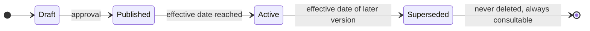
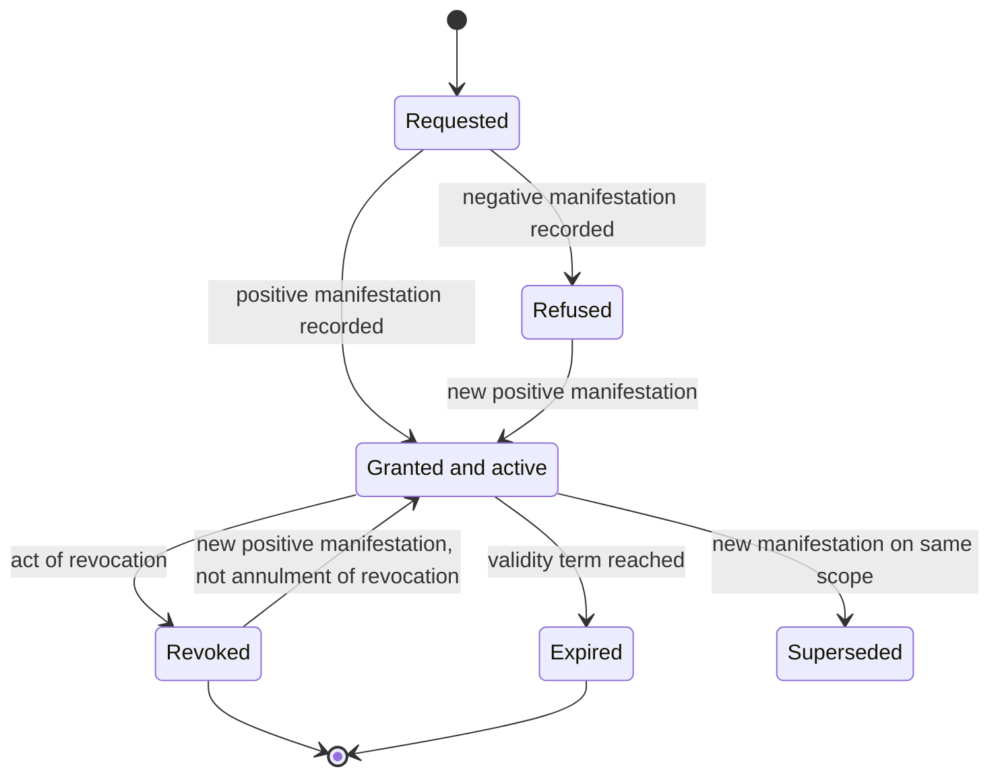
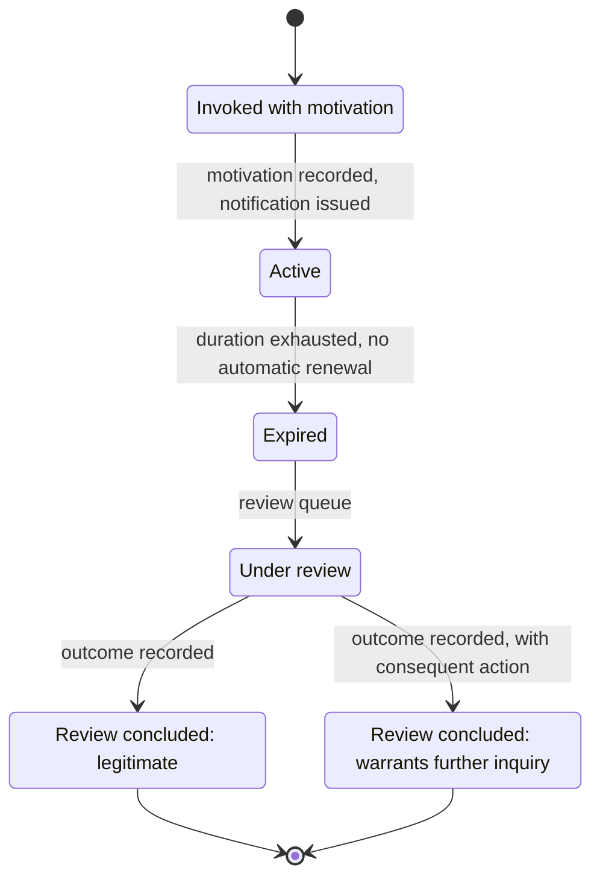
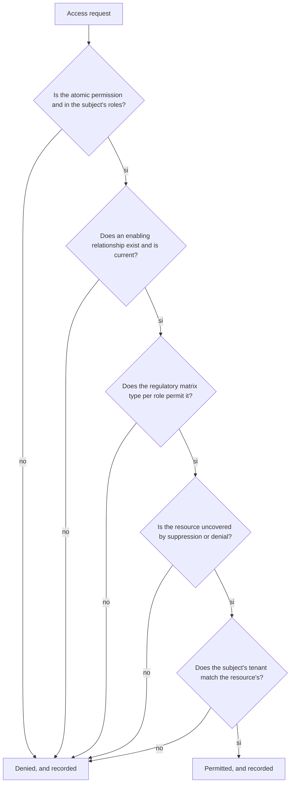

# Consent and privacy

Consent is the point at which the data model meets a question that admits no approximations:
**what did this person declare, on what date, after having read which text, and who can prove
it.**

A Boolean does not answer any of the four parts of the question. It is discovered at the worst
moment, when the question comes from someone who has the authority to pose it.

> **[BASE]** Consent is a **time-bounded fact**, not a Boolean flag
> ([`04_BASELINE_ARCHITETTURALE.md`](https://github.com/fedcal/Telemedic/blob/main/.telemedic/context/04_BASELINE_ARCHITETTURALE.md) § 2).

Module [03 of the foundations guide](../10_fondamenti/03-il-dato-clinico.md) § 2 explains why, for
the purpose of care, consent is not typically the legal basis for processing, and why confusing
consent to the healthcare act with consent to data processing is the most costly confusion in the
domain. This chapter derives the model from that.

## 1. Five objects, not one

> **[NORM]** Consent to the healthcare act, consent to data processing where applicable, consent
> to recording and consent to the presence of third parties are distinct objects, collected
> separately, revocable separately and retained separately (`BR-060`). To these `RF-110` adds
> consent to transmission to external systems.

| Object | What it authorises | Effect of revocation | Nature |
|---|---|---|---|
| **Consent to the healthcare act** | execution of the act | the act is not executed or is interrupted | manifestation of will relating to care |
| **Consent to data processing** (where consent is the legal basis) | a specific processing | that processing ceases for the future | act concerning data protection |
| **Consent to recording** | capture of audio-video of the session | recording stops immediately | session-specific, not inheritable |
| **Consent to presence of third parties** | admission of interpreter, learner, carer | the third party leaves | session-specific or subject-specific |
| **Consent to transmission to external systems** | conferral to external repositories | transmission does not occur | distinct per recipient |

> **`DM-70` [MOD]** - The five objects have the **same structure** and **independent life cycles**.
> Revocation of one does not affect the others: someone who revokes consent to recording does
> not revoke consent to the act, and service delivery is not impeded (`RF-110`). A model that
> represents them as columns of the same row makes it technically difficult what is legally
> obvious.

### 1.1 Consent in the health record is a special case

> **[NORM]** DM 7 settembre 2023, art. 8: **consultation** by third parties is subject to free,
> specific, informed, unambiguous and explicit consent, distinct per purpose of care, prevention
> and international prophylaxis. **Governance** and **research** purposes operate on
> pseudonymised data and do not require that consent. «Data and documents in the FSE **are always
> consultable, besides by the beneficiary, by the subjects who produced them**» (art. 8, c. 7).

It follows a distinction that the model must represent and that is regularly lost: **feeding and
consulting are two different things**. One can feed the record without being able to consult the
prior history. A single consent «to the record» is not representable: it does not exist.

And a rule that must be written because it is counterintuitive: **whoever produced the document
always sees it**, regardless of consent to consultation. Consent governs third-party access, not
that of the author.

### 1.2 Who never accesses

> **[BASE] [`V-08`](../11_registri/01-vincoli-in-vigore.md#v-08), `D48`** - Art. 15, c. 4 of DM 7 settembre 2023 **always** excludes from the
> record: experts, insurance companies, employers, associations and scientific organisations,
> administrative bodies even operating in the healthcare sphere, and medical personnel in the
> exercise of medico-legal activities.

On the modelling plane this entails a structural constraint, not a configuration rule: **there is
no type of subject, no delegation and no consent that can produce the access of an insurer to
documents**, neither directly nor through a professional. The payer is not a consulting party. It
is a case in which the model must make the operation **impossible**, not simply not offered.

## 2. The structure of the fact

> **`DM-71` [MOD] - Canonical form of evidence of consent.**
>
> | Component | Mandatory | Content |
> |---|---|---|
> | **Type** | yes | from a closed set; mandatory types are not removable from tenant models (`RF-121`) |
> | **Data subject** | yes | the person to whom the consent refers |
> | **Declarant** | yes | whoever manifested the will; may differ from the data subject |
> | **Title of representation** | if declarant ≠ subject | type, details of the act, scope of powers, validity |
> | **Version of text presented** | yes | immutable reference to the version of the notice or form |
> | **Instant** | yes | |
> | **Channel** | yes | in session, authenticated area, counter, other |
> | **Outcome** | yes | granted, refused |
> | **Scope** | depends on type | what it refers to: this session, this recipient, this category of documents |
> | **Validity** | yes | start and, where applicable, end |
> | **State** | yes | active, revoked, expired, superseded by new manifestation |
> | **Who recorded** | yes | the act of recording has an author, even when it is the system |
> | **Tenant** | yes | [`V-04`](../11_registri/01-vincoli-in-vigore.md#v-04) |

Two components deserve a note, because they are the ones that are omitted.

**The declarant distinct from the data subject.** It is needed in the case of representation, and
it is needed always: even when they coincide, the model that keeps them separate must not be
modified the day they stop coinciding. Chapter
[03](03-assistito-professionista-organizzazione.md) § 6 treats the figures.

**The version of the text presented.** It is the element without which consent is
indemonstrable: consent not referred to a versioned text proves nothing, because one cannot
establish what the person read (`BR-061`).

## 3. Versioned privacy notice

The rules:

1. **Every informative or consent text is versioned**, with an effective date, and earlier
   versions are retained entirely (`RF-111`).
2. **Consent collected on a version remains associated with that version**, which stays
   consultable. Publication of a later version does not requalify already-collected consents.
3. **A superseded version is never deleted.** It is the only proof of what the person read.
4. **The tenant defines its own consent models** per service type, within the types provided by
   the domain, **without being able to remove mandatory ones** (`RF-121`).

### 3.1 Collection

Three requirements of form that are requirements of model, not of interface:

- **No option is pre-selected** (`RF-113`). The model has no default values for the outcome
  field: absence of manifestation is not consent.
- **The manifestation is explicit and recorded as an act**, not inferred from continued use.
- **Verification of mandatory consents precedes the act** (`RF-114`): absence is signalled to
  the professional before launch, with the possibility of immediate collection.

And an order that has a reason, stated in `R6` § 3.1.3: **technical verification precedes the
privacy notice, which precedes consent**. Asking for consent from someone who then discovers
they cannot participate produces unnecessary data processing.

## 4. Life cycle of consent

A transition that **does not** exist, and the reason for it:

> **`DM-72` [MOD]** - There is no transition «annulment of revocation». Revocation is a
> completed act: one can grant a new consent, but one cannot cancel the earlier one. The
> difference is seen in the chronology - which must show revocation, then new consent - and it is
> not pedantry: the chronology is what the data subject has the right to consult (`RF-116`).

### 4.1 Revocation

> **[NORM]** Revocation is immediately effective on future processing, requires no motivation, and
> its effects on data already collected follow the retention rules and not the operator's
> discretion (`BR-069`).

Three properties to make operative in the model:

| Property | What it means in the model |
|---|---|
| **Immediate** | verification occurs at the decision, not at a periodic process. An ongoing recording is interrupted (`RF-142`) |
| **Without motivation** | the motivation field exists and is optional; the system does not require or condition it |
| **Not retroactive on already-collected data** | the model distinguishes «processing ceases» from «datum is deleted». The second operation has its own rules and is often forbidden |

The fragment already acquired before revocation - typically a piece of recording - follows the
configured rule of deletion or retention, and the event is recorded with the exact instant.

> **[NV]** The admissibility and limits of recording of the session and the treatment of the
> fragment acquired before revocation are among the questions that `R6` § 11.2 leaves for
> verification (entry Q15). **To be asked to the `COMP` area.** The model admits both
> configurations because the answer is not known.

## 5. Consent on behalf of third parties

Chapter [03](03-assistito-professionista-organizzazione.md) § 6 treats the figures and their
powers. Here three rules that fall on the consent model matter.

1. **A carer cannot grant consent in place of a capable beneficiary, in any configuration**
   (`BR-062`). It is not a disableable rule: it is a domain constraint.
2. **Consent granted by a representative records the title, the scope of powers, the details of
   the act and the temporal validity**, and the system verifies the scope against the requested
   act (`BR-063`, `RF-117`). Verification is **per act**, not on entry.
3. **The transition to majority suspends the access of representatives** and requires new
   configuration of delegations (`RF-118`).

The edge case that must be anticipated: **shared custody**. Two manifestations of will may be
needed (`BR-063`). The model therefore admits that **a consent has multiple declarants**, with
the composition rule declared in the consent model - all, any one, a specific one - and not
hard-coded.

> **[NV]** The discipline of legal representation and consent for minors and incapable subjects is
> among the questions left for verification (`R6` § 11.1, entry Q9). To be asked to the `COMP`
> area.

## 6. Data suppression

### 6.1 The rule that makes implementation difficult

> **[NORM]** Data suppression occurs «in such a way as to guarantee that all subjects authorised
> for access **cannot automatically come to know the fact that the beneficiary made this choice**»
> (DM 7 settembre 2023, art. 9, c. 6). Suppression of the prescription determines automatic
> suppression of the delivery documents and related reports (c. 7). It must be «guaranteed that
> suppression is immediate» via functionality available on line.

It is not enough to exclude the document from the list. A **inferrable** suppression is not
suppression, and inference passes through at least six channels that must all be closed.

| Inference channel | How it is closed |
|---|---|
| **Visible sequential numbering** | documents have no exposed sequential numbering |
| **Counts and totals** | totals are calculated on the filtered set, never on the complete set |
| **Pagination** | page size is applied after the filter; a «short» page reveals an exclusion |
| **Notifications** | no notification referring to a suppressed document to the recipient from whom it is suppressed |
| **Differences between successive queries** | aggregate results must not permit deduction by difference |
| **Error messages** | access to a suppressed document produces the same outcome as access to a non-existent document |

> **`DM-73` [MOD] - Data suppression is applied by the authorisation engine, not by consumers.**
> Every query that returns documents passes through a single point that applies the filter and
> calculates totals on the filtered set. If the filter is the responsibility of the query writer,
> sooner or later a query forgets it - and the fault is not visible in testing, because the
> suppressed document does not appear anyway in synthetic test data.

The last sentence is an important operational consequence: **synthetic acceptance test data must
comprise suppressed documents**, otherwise no test exercises the path.

### 6.2 Propagation

Suppression of the prescription determines automatic suppression of related documents. In the
model this means **there is a correlation relationship between documents** that suppression
traverses, and that the traversal is deterministic and verifiable. A relationship deduced at
runtime from similarity criteria would produce incomplete suppressions.

### 6.3 Suppression and deletion

They are not the same thing and do not have the same effect: the suppressed document **remains
visible to whoever produced it** and to the beneficiary. Deletion encounters the limits of the
obligations to retain healthcare documentation (`BR-081`).

> **[NV]** Minimum and maximum retention periods per category of healthcare document and the
> discipline of suppression in its operational aspects are among the questions left for
> verification (`R6` § 11.1, entries Q5 and Q6). To be asked to the `COMP` area.

## 7. Categories with enhanced protection

Chapter [04](04-documenti-clinici.md) § 8.2 gives the regulatory list. On the consent model plane
three consequences follow.

1. **Consent for these categories is given to the providing entity**, not to the platform, and is
   explicit, informed and specific. The model represents it as consent with scope limited to a
   category, not as general consent.
2. **At the time of feeding it must be declared whether the datum falls within it** (art. 12, c.
   4). The declaration is an act of the professional who provides, and responsibility for failure
   to suppress is that of the provider: the model must make it difficult to omit the declaration,
   not merely offer it.
3. **For services provided anonymously feeding is not admitted.** The consequence is the state
   «non-transmissible» of the document, distinct from «not yet transmitted» (chapter
   [04](04-documenti-clinici.md) § 8.2).

> **[NV]** The categories of healthcare data with enhanced protection and their operational
> consequences are among the questions left for verification (`R6` § 11.1, entry Q10).

## 8. Consent to recording

It is the consent with the strictest regime, and the reason is that recording is the most
sensitive datum the system produces.

| Rule | Source |
|---|---|
| Disabled by default at **every** level: installation, tenant, service, session; explicit enablement at each level | `BR-070`, `RF-139` |
| **Session-specific** consent, collected before launch, not inheritable from general platform consent | `BR-071` |
| Revocation that immediately stops ongoing recording | `RF-142` |
| Permanent and non-hideable indicator for all participants, with accessible announcement | `BR-072`, `RF-141` |
| Services marked non-recordable: the function is **absent**, and every application call is rejected | `BR-075`, `RF-146` |
| No automatic recording in case of emergency, dispute or suspicion | `BR-076` |

The last row is a deliberate domain decision: it prevents recording from becoming a unilateral
defensive tool, activated when something goes wrong.

### 8.1 The consequence of `D23` on consent

> **[BASE] `D23`** - Recording occurs on the server side, and an inescapable fact follows:
> **when recording is active encryption is terminated on the server and the session is no longer
> encrypted to the endpoints.**

> **`DM-74` [MOD]** - The privacy notice for consent to recording **must expressly declare**
> this consequence. It is not a technical note: it is an element of the informative content on
> which the person expresses themselves, and therefore it is part of the versioned text to which
> the consent refers. Consent collected on a text that does not declare it is consent on an
> object different from what is being done.

The transition between the two modes is traced, and in the model it is a **fact of the encounter**
with instant and author, not a configuration change.

## 9. Emergency access

### 9.1 It is not an exception: it is a requirement

> **[BASE]** The procedure of emergency access is traced **as a requirement, not as an
> exception** ([`04_BASELINE_ARCHITETTURALE.md`](https://github.com/fedcal/Telemedic/blob/main/.telemedic/context/04_BASELINE_ARCHITETTURALE.md) § 8).

A system that does not provide for it is not more secure: it forces solutions outside the
system, which leave no trace. Security lies in making it **costly and visible**, not in not
having it.

The properties, all with a corresponding requirement:

| Property | Content |
|---|---|
| **Mandatory motivation** | text, with minimum length verified (`BR-015`) |
| **Finite duration and not automatically renewable** | renewal is a new invocation, with new motivation |
| **Notification** | to the data protection officer and - unless otherwise motivated configuration - to the data subject |
| **Punctual recording** | every resource read is recorded individually, not the invocation alone (`RF-019`) |
| **Review queue** | every invocation enters a queue and receives a recorded outcome |
| **Who controls is controlled** | reading of records by the data protection officer is itself recorded (`BR-094`) |

> **`DM-75` [MOD] - Review is part of the life cycle, not a report.** Emergency access that is
> never re-examined is indistinguishable from abusive access. The state `Under review` exists in
> the model because review has an outcome and the outcome has an author.

### 9.2 The relationship with the health record

DM 7 settembre 2023 independently disciplines emergency access (art. 20) and recording of
operations (art. 21), which comprises feeding, suppression, revocation of suppression,
consultation by the producer, the beneficiary or their delegate, another entity, and **emergency
consultation**, with indication - for consultations only - of the purpose.

> **`DM-76` [MOD]** - Emergency access **within** the system and emergency access to the record
> are two distinct facts, with two distinct recordings. Representing them as the same fact
> produces incomplete records on both sides.

## 10. Declared purpose

Every access to clinical datum carries a **declared purpose**, which is an attribute of the
request and not of the subject: care, emergency care, operations, administration, verification,
research. The purpose enters into the authorisation decision and into the access record.

It is not a formality: DM 7 settembre 2023, art. 21 requires that for consultations the purpose
be recorded, and the authorisation model uses it as a subject attribute (`R6` § 2.2). It follows
that **the same user, in the same session, may have different authorisation outcomes depending on
the purpose they declare**, and that the declaration is a traced act.

## 11. Minimisation applied to the model

### 11.1 Notifications

> **[NORM/`R6`]** No notification on an unauthenticated channel can contain clinical datum, name
> of the clinical specialty, name of the specialist professional or title of the document
> (`BR-050`). The permitted content is: reference to the facility, date and time, generic type
> of communication, link to the authenticated area (`BR-051`).

The reason is stated in module [03 of the foundations guide](../10_fondamenti/03-il-dato-clinico.md)
§ 1.2: **the object itself reveals information about health**. A reminder that names the
specialty is communication of healthcare datum to anyone who sees the locked screen.

On the modelling plane it follows that **the minimal content is a structure, not a convention**:
the message destined for an unauthenticated channel is composed of a closed set of fields, and
there is no free-text field that can contain anything else.

### 11.2 The access link is a credential

A link sent to the beneficiary to enter a session is, in effect, a credential: single-use with
respect to session creation, with expiry no longer than the waiting room window and not
guessable (`BR-052`, `RF-052`). In the model it is therefore an object with a life cycle -
issued, used, revoked, expired - and not a string in a message.

### 11.3 Aggregates

> **[`R6`]** Aggregate statistics are not returned if the resulting group has cardinality below
> the configured threshold, neither in direct form nor deducible by difference between successive
> queries (`BR-090`).

The second part is what requires work: preventing deduction by difference means that suppression
cannot be decided query by query independently.

> **`DM-77` [MOD]** - The suppressed value is **declared as suppressed**, not omitted. A missing
> value and a suppressed value are different information, and presenting them the same way makes
> the report ambiguous for whoever reads it and does not reduce inference for whoever seeks it.
> The `SuppressedValueBelowThreshold` event of `R6` § 8.2 exists for this reason.

Note that DM 19 novembre 2025, All. 4 fixes a **minimum cardinality equal to 1** in the
clustering rules for national infrastructure processing (`B1`, § V1.c). It is a value of that
context, not a threshold applicable to tenant reporting: this area does not adopt it as a
default and leaves the threshold to configuration, stating the source to prevent it being cited
as if it were general.

### 11.4 Diagnostics logs

Application logs do not contain clinical content or direct identifiers of the beneficiary:
identification occurs through a pseudonym resolvable only with authorised access to access
records (`BR-086`).

## 12. How access control rules are composed

The conditions are **conjunctive** and the default value is deny (`BR-010`).

Two properties of the diagram are decisions:

1. **Denial too is recorded.** An attempt to access that is denied is security information and is
   to be retained with the same care as successful access.
2. **The order of conditions is not freely optimisable.** The verification of tenant is last in
   the diagram for readability, but in execution it is first: no query occurs without resolved
   tenant ([`04_BASELINE_ARCHITETTURALE.md`](https://github.com/fedcal/Telemedic/blob/main/.telemedic/context/04_BASELINE_ARCHITETTURALE.md) § 4).

## 13. What the access record contains, and what it does not

> **[BASE]** The record does not contain clinical content: it contains who, what, when, on which
> subject, with which outcome and with which level of authentication guarantee
> ([`04_BASELINE_ARCHITETTURALE.md`](https://github.com/fedcal/Telemedic/blob/main/.telemedic/context/04_BASELINE_ARCHITETTURALE.md) § 6).

Additions that follow from Italian regulation and that the model must provide for:

- the **declared purpose** for consultations (DM 7 settembre 2023, art. 21);
- the **document type** and the generator identifier for generation events (DM 19 novembre 2025,
  art. 14);
- the **recording of operations of consultation of the records themselves** (`REQ-39` of `B1`);
- the **functionality for the beneficiary to view their own records** - which is a functional
  requirement, not an internal obligation: the data subject has the right to see who has looked
  at their data.

The last point has a modelling consequence that must be anticipated: the access record **is
destined to be read by the data subject**, and therefore its content must be designed to be
intelligible to a person, not only to be interrogable by an auditor. A record that reports
technical identifiers and operation codes meets the obligation and not the purpose.

## What you need to remember

1. **Five consent objects, not one**, with independent life cycles: revocation of one does not
   affect the others.
2. **Feeding and consulting are two different things.** A single consent «to the record» does
   not exist.
3. **Whoever produced the document always sees it**, regardless of third-party consultation
   consent.
4. **Insurers never access**: it is a structural constraint, not a configuration.
5. **A consent without the version of the text presented is indemonstrable.**
6. **Revocation cannot be annulled**: one grants a new consent, and the chronology shows both
   acts.
7. **Suppression must not be inferrable**, and inference passes through six channels that must
   all be closed. Synthetic acceptance test data must comprise suppressed documents.
8. **Consent to recording is per session**, not inheritable, and its privacy notice declares
   that the session is no longer encrypted to the endpoints.
9. **Emergency access is a requirement**, not an exception: costly, visible, with review that
   has an outcome and an author.
10. **Purpose is declared at every access** and enters into the decision and the record.
11. **The suppressed value is declared suppressed**, not omitted.
12. **The access record is destined to be read by the data subject**: it must be designed to
    be read by a person.

## Where to continue

- [04 - Clinical documents](04-documenti-clinici.md): the sensitivity level of the document and
  categories with enhanced protection.
- [03 - Beneficiary, professional, organisation](03-assistito-professionista-organizzazione.md):
  the figures who may declare on behalf of others.
- Module [03 of the foundations guide](../10_fondamenti/03-il-dato-clinico.md): legal basis,
  pseudonymisation, impact assessment, notification obligations.
