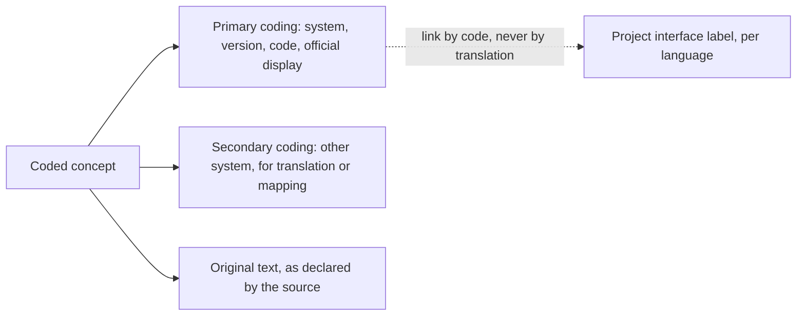

# Terminologies in the domain

A clinical terminology is not a support table. It is **part of the meaning of the datum**: a coded
value without the coding system that qualifies it is not data, it is a string. And, unlike almost
everything else in the model, **terminologies do not belong to the project**: they have
titleholders, licences, costs and redistribution constraints that determine what the code can
contain.

This chapter does two things. It establishes **which coding is used for which domain concept**,
and translates the licensing regime into **consequences for the data model and runtime behaviour**.
The full treatment of licences is in `B5-licenze-terminologie.md` and in decision `D31`; this
area does not repeat it and does not contradict it.

## 1. The starting constraint

> **[BASE] `D1`** - The project's licence is Apache-2.0, which grants downstream the right to
> use, modify and redistribute, even in proprietary products. A terminology whose licence
> forbids redistribution or derivatives **cannot be among the sources**, because the project
> cannot grant downstream rights it does not have.

> **[BASE] `V-03`** - The system is **fully functional without SNOMED CT**. No main pathway can
> require it.

> **[BASE]** Single gateway to terminologies, with disablement per coding system; **no persistent
> disk cache** for systems whose licence does not permit derivatives; every coded concept carries
> the system explicit; project interface strings are architecturally separate from the official
> display (`04_BASELINE_ARCHITETTURALE.md` § 7).

## 2. Which coding for which concept

The table is the map between domain concepts and coding systems, with the licensing regime that
follows. The «regime» column uses the four classes of `D31` and `B5` § 11.1: **A** full
coexistence in sources, **B** separate directory with its own licence, **C** acquisition or
interrogation at runtime by whoever installs, **D** total exclusion with reference by identifier
and code only.

| Domain concept | Coding system | Regime | Modelling note |
|---|---|---|---|
| Type of service delivered | nomenclature and national service catalogue | **B** | official act of the State; reusable under art. 5 L. 633/1941 and art. 52 c. 2 CAD |
| Type of service, regional level | unique regional catalogue | **referred by tenant** | twenty-one independent cycles: not included (chapter [02](02-le-prestazioni-modellate.md) § 13) |
| Diagnostic question and diagnosis | classification of diseases, ninth revision, clinical modifications, Italian version | **B** | it is the system required by the ministerial layout of the telemedicine report |
| Measured quantity (parameter, test) | LOINC | **A** with mandatory attribution | redistribution explicitly permitted, even for commercial purposes |
| Unit of measurement | unified coding of units of measurement | **B**, preferably as external dependency | redistributable verbatim, **forbids derivatives** and is **revocable** |
| Drug, commercial identification | marketing authorisation | **B** | it is the operative Italian coding of the drug |
| Drug, therapeutic classification | anatomical-therapeutic-chemical classification | **D** | terms of the titleholder forbid copying and commercial distribution and any modification: incompatible with `D1` |
| General clinical concepts | SNOMED CT | **C** | never downloaded by the project; § 5 |
| Vocabularies of exchange structure | HL7 terminology and core standard coding systems | **A** | public domain release |
| Roles, encounter types, states | core standard vocabularies | **A** | idem |
| International classifications of diseases, tenth and eleventh revisions | terminology of the international competent organisation | **D** | licence that forbids derivatives; reference by identifier only |
| Validated clinical scales and questionnaires | different titleholders, one per scale | **to be ascertained** | question `Q-11`; chapter [05](05-parametri-e-osservazioni.md) § 9.3 |

> **`DM-80` [MOD] - The «regime» column is an attribute of the coding system in the model, not a
> note of documentation.** The gateway knows, for each system, its own regime, and derives its
> behaviour from it: what can be stored, what can be expanded, what can only be referred to.
> Without this attribute, the policy lives in a document and is violated in the third month.

## 3. The coded concept in the model

### 3.1 Anatomy

| Element | Mandatory | Note |
|---|---|---|
| **System** | **yes, always** | A code without a system is ambiguous by construction |
| **Version of the system** | yes when the source declares it | Systems change; a diagnosis coded in 2026 is to be read with the 2026 version |
| **Code** | yes | |
| **Official display** | optional, and with caution | § 3.2 |
| **Original text** | yes when it exists | What the source actually wrote, independent of coding |
| **Interface label** | not part of the datum | It is of the internationalisation catalogue, linked by code |

### 3.2 Official display is not interface label

> **[BASE] `D34`** - Translations of a terminology are **derivatives** and belong to the
> terminology titleholder. Project internationalisation strings are to be architecturally
> separated from the official display.

> **`DM-81` [MOD] - Three distinct strings for the same concept**, and confusion between them is
> both a functional defect and a licence problem:
>
> 1. **The official display** belongs to the titleholder. It is retained as received, not
>    translated, not modified, and for systems in regime C and D is not retained at all.
> 2. **The original text** is what the professional or source actually wrote. It is clinical data
>    and is always retained.
> 3. **The interface label** is of the project, lives in the internationalisation catalogue, is
>    linked to the code and does not derive from the display.
>
> **Question `Q-03` on the noticeboard**, addressed to the `ARCH` area: how the separation is
> concretely realised. This area contributes `DM-81` - which establishes **what** is to be
> separated and why - and does not decide its technical implementation.

The cost of the discipline is stated in `B5` § 11.3 and must be said without mitigation: **without
official translations, the project must maintain its own labels for codes it exposes to the user.**
It is real work. In return, the repository's licence chain remains coherent, which for a project
whose reason for being is integration into proprietary products is not a compliance cost: it is
the product.

### 3.3 The unresolvable code

A system that depends on code resolution works only when everything is configured. The model
anticipates the contrary as normal.

> **`DM-82` [MOD] - A coded concept is valid even if its system is unresolvable.** The datum is
> retained intact - system, code, original text - and carries a declared **resolution state**:
> resolved, unresolvable because the system is disabled, unresolvable because the service is
> unreachable, not found in the declared system.
>
> The operational consequence: **the system does not reject clinical data because it cannot
> validate its code**, except where validation is required by an explicit obligation in the
> specific pathway. Rejecting it would mean losing clinical data over a configuration problem.

The resolution state is visible to the user, because a missing display due to failed resolution
and a missing display because the source did not provide it are two situations the clinician must
be able to distinguish.

## 4. The terminology gateway

### 4.1 What it does and what it does not do

| Does | Does not |
|---|---|
| Resolves a code into a concept | Contain terminologies: interrogates them or reads them from a local artefact |
| Validates the membership of a code in a value set | Translate displays |
| Expands value sets, **when the licence permits** | Expand value sets of systems that forbid it |
| Declares its own availability per system | Mask unavailability with a positive outcome |

> **[BASE]** **No persistent disk cache** for systems whose licence does not permit derivatives:
> a persistent cache of responses is a subset, that is, a derivative (`D33`).

> **`DM-83` [MOD]** - The temporary storage policy is **per coding system**, not global. A single
> storage level with the same policy for all systems is technically simpler and legally
> unsustainable.

Two constraints from the security area overlay this and **prevail** where they are more stringent
(`V-151` on the noticeboard):

1. **No persistent disk cache**, without distinction per licence. The licence constraint is a
   subset of this: where licence would permit it, the security constraint forbids it anyway.
2. **The gateway does not transmit identifiers of the beneficiary** to the external terminology
   service. On the modelling plane it follows that code resolution is an operation **free of
   context on the subject**: no pathway can require sending, together with the code, the
   reference to the person for whom it is being resolved.

### 4.2 Disablement per system

The gateway is configurable per coding system: each can be enabled or disabled, and the
configuration is **observable from the domain**. It is not an operational detail: it determines
the behaviour of the functional pathway, and therefore must be declared and presented to the
user.

## 5. SNOMED CT

### 5.1 The rule, and the reason

> **[BASE] `D32`** - The licence agreement is perfected **by downloading or accessing** the
> content: if the project never downloads it, it is never bound by it. The clause requiring that
> content be inaccessible except to authorised users is **incompatible with a public repository**,
> and the sub-licence chain is incompatible with Apache-2.0 by construction.

Three operative rules follow, which fall on whoever writes code and not only on whoever writes
documents:

1. **No maintainer downloads the release files** for development purposes. Proofs of terminology
   integration are executed with **test doubles** - fictitious project coding systems - or on an
   instance provided by whoever already holds the licence.
2. **No project value set contains enumerated concepts** of that system. Composition by filter is
   permitted; expansion is not.
3. **A check in continuous integration makes the build fail** if forbidden content reappears
   outside regime B directories, with versioned and annotated allowlist (`D32`, `B5` § 12.3).

### 5.2 Two warnings to document for whoever installs

Must be stated without mitigation, because they concern whoever will use the system, not the
project:

- **The external terminology server does not exempt whoever installs.** Whoever creates or
  analyses records containing those concepts falls within the definition of data processing system
  of the licence contract, with the fees that follow, **per site**, even in non-production
  environments.
- **Whoever distributes the system distributes a product subject to the licence**, even without
  it containing a single concept.

Chapter [08 of the compliance documentation](../08_compliance/00-indice.md) is the place for the operative
procedure for whoever installs; this area merely signals that the model must **make it possible
to operate without that system**, which is the next point.

## 6. Behaviour without terminology server

It is the paragraph that makes `V-03` verifiable instead of merely declarative.

### 6.1 What continues to work

With the gateway configured to operate without the regime C system, the system remains fully
operative relying on LOINC, the Italian disease classification and the national service
catalogue, which have no cost (`D33`).

| Pathway | Works without | Why |
|---|---|---|
| Booking and schedule | yes | uses the service catalogue |
| Encounter, session, outcomes | yes | uses core standard vocabularies, in regime A |
| Consent | yes | consent types are of the domain |
| Clinical document and conferral | yes | question and diagnosis use the Italian classification |
| Remote monitoring measurements | yes | quantities use LOINC, units use unified coding |
| Plan, expectations, adherence, alarms | yes | do not require external terminologies |

### 6.2 What does not work, declared

> **[BASE] `D33`** - The cost is declared: value sets with connection to that system - in
> particular that of the reason for encounter, of several thousands of concepts - **are not
> validated**. In a freshly started installation, validation of those connections fails or is
> disabled. It is the highest cost of the entire policy, and is declared as such.

> **`DM-84` [MOD] - The degradation is declared to the user, not silent.** When a connection is
> not validatable because the system is disabled, the outcome is **«not validated, system
> unavailable»**, distinct both from «valid» and from «invalid». Returning «valid» to avoid
> blocking is the choice that makes the system unreliable without anybody noticing.

### 6.3 Default configuration

The system is installed and started with regime C systems **disabled**, and it works. It is the
only default configuration consistent with `D32`: activating them requires a conscious choice by
whoever installs, who is also the subject who assumes its obligations.

## 7. Special cases

### 7.1 The drug

> **[BASE] `D34`** - The anatomical-therapeutic classification is **excluded**: the titleholder's
> terms forbid copying and commercial distribution and any modification, frontally incompatible
> with Apache-2.0.

Mitigation is at zero cost because in Italy the operative coding of the drug is the marketing
authorisation, which is the code that appears in the ministerial layout of the telemedicine
report alongside the therapeutic classification.

> **`DM-85` [MOD]** - The drug model has **two optional and independent codings**: commercial
> identification and therapeutic classification. The system is fully functional with the first
> alone. The canonical identifier of the second remains permitted as a **reference**, because a
> system identifier is a name, not an address from which to download.

The functional cost is drug search by therapeutic class, not available without additional
configuration by whoever installs. It is a real cost and must be stated.

### 7.2 LOINC

It is the only clinical terminology of significant scope on which the project can rely entirely,
with an obligation: **attribution**, in the repository's recognition file and in the copyright
element of every artefact that enumerates its concepts.

Two precautions, which fall on the model:

- **Translations are derivatives** assigned to the titleholder: `DM-81` applies.
- **Some concepts carry a third-party copyright notice**: verification is part of the review
  checklist for every new value set (`B5` § 12.2).

### 7.3 The Italian disease classification and the nomenclature

Both in regime B: redistributable in a dedicated directory with its own licence and explicit
declaration that the project's licence does not apply to it. They are official acts of the State;
residual risk on the upstream chain of translation is low but not nil and is stated in `B5` § 4.3.

On the modelling plane an observation applies that licences do not resolve and that `B5` § 7.3
calls the modelling constraint: **the nomenclature is versioned in time and variable per regime**.
A table without temporal validity renders historical reporting irreproducible. It is the same
constraint as the service catalogue of chapter [02](02-le-prestazioni-modellate.md) § 13.

### 7.4 Regional catalogues

Twenty-one independent update cycles. Legal risk is very low; maintenance risk is high. The
choice of this area - consistent with `DM-24` - is **to accept them by reference from the
tenant** and not include them.

The ministerial layout confirms that the two levels coexist: the request for specialist-to-specialist consultation (teleconsulto)
carries both the national nomenclature code and that of the unique regional catalogue (DM 19
novembre 2025, All. 1, § 2.19). The model must therefore represent them **both and distinct**,
not choose one.

## 8. The national glossary and repository

> **[NORM]** DM 19 novembre 2025, All. 3, § 3.2 provides that the platform may consume from the
> business glossary of the national infrastructure the terminology resources in standard format -
> coding systems, value sets, concept maps - from the terminology service, and the guidelines,
> pathways and protocols from the library repository in documentary format, **with logic expressed
> in a clinical expression language** (`REQ-57` of `B1`).

The last part is the most delicate of the entire chapter:

> **`DM-86` [MOD] - Consuming terminologies is not executing decision logic, and the distinction
> must be maintained in the model.** Acquisition of coding systems, value sets and concept maps
> is in scope. **Local execution of clinical logic expressed in a language** configures clinical
> decision support and shifts the qualification scope.
>
> The model therefore maintains two distinct and separately disableable capabilities: the
> **terminology gateway**, which resolves and validates; and a possible **logic executor**, which
> in the current scope **does not exist**. The question is directed to the `COMP` area by `B1` §
> 14 and remains open: this area does not close it and designs so that the second capability is
> absent by construction, not disabled by configuration.

Note that the national glossary and the terminology module of the national infrastructure are
components of which the project is a **consumer**, not a provider. The sovereignty constraint and
their classification as third-party components are the subject of question `Q-04` on the
noticeboard, addressed to the `SEC` and `ARCH` areas.

## 9. Clinical scales

Chapter [05](05-parametri-e-osservazioni.md) § 9.3 establishes the modelling constraint: engine
separate from definitions, definition as artefact with declared licensing regime, no third-party
definitions included until the regime is ascertained, system fully functional without any
third-party scales.

Here must be added what concerns the terminology policy:

> **`DM-87` [MOD] - The four regimes apply identically to scales and questionnaires.** They are
> not a separate category: they are third-party content with a titleholder, licence and
> attribution obligations, and are to be placed with the same criterion, verified with the same
> checklist and supervised by the same automatic check.
>
> **Question `Q-11` on the noticeboard**, addressed to `COMP` and `ARCH`: the terminology policy
> is to be formally extended to scales and scores **before** writing the first calculation engine.
> This area contributes with `DM-65` and `DM-87` and does not close it.

## 10. The checklist that enters the process

`B5` § 12.2 proposes a review checklist for every new value set or coding system. This area
receives it as **part of the modelling process**, because a value set is a domain artefact
before it is a file:

- From which systems do the enumerated concepts come? List them all.
- Is each of those systems in regime A or B?
- Where concepts requiring attribution appear: does the copyright element report it?
- Do enumerations or expansions of concepts of systems in regime C or D appear? If so, the
  proposal is to be rejected.
- If the set is composed by filter: is the number of anchoring concepts the minimum necessary?
- Is the version of the reference terminology declared?
- If the artefact comes from a third-party package: has the **titleholder of the content** been
  verified, and not only the licence declared by the container?

The last item is the general principle of `D34`, and holds beyond the case from which it was
born: **a licence declaration appended to a container does not dispose of the rights of third
parties on the content comprised**. Verification is per artefact.

## 11. What remains unverified

| Point | State | To be asked to |
|---|---|---|
| Licensing regime of individual clinical scales and questionnaires | **[NV]** | `COMP` - question `Q-11` |
| Specific content of the national telemedicine glossary and alignment entry by entry | **[NV]** | `COMP` - chapter [01](01-linguaggio-ubiquo.md) § 1.2 |
| Codes of document type and indexing metadata of the ten telemedicine types | **[NV]** | `COMP` - question `Q-07` |
| Compatibility of the external terminology service with the sovereignty constraint | **[NV]** | `SEC`, `ARCH` - question `Q-04` |
| Specific values of value sets dedicated to identifiers of non-enrolled populations | **[NV]** | `ARCH` - noted in module [04 of the foundations guide](../10_fondamenti/04-identita-e-anagrafiche.md) § 3.2 |

## What you need to remember

1. **The coding system is always explicit.** A code without a system is not data.
2. **The licensing regime is an attribute of the system in the model**, not a documentation note:
   the gateway derives its behaviour from it.
3. **Three distinct strings** for the same concept: official display, original text, interface
   label. Confusing them is both a defect and a licence problem.
4. **A coded concept is valid even if the system is not resolvable.** Data is not rejected over a
   configuration problem.
5. **Temporary storage is per system**, not global: some licences do not permit persistent
   copies.
6. **The system is installed and functions with regime C systems disabled.** It is the default
   configuration.
7. **Degradation is declared**: «not validated, system unavailable» is not «valid».
8. **The operative Italian coding of the drug is commercial identification**; therapeutic
   classification is excluded and remains only as reference.
9. **Nomenclature and Italian disease classification are redistributable** in a separate
   directory, and **have temporal validity**.
10. **Regional catalogues are referred to, not included.** But the model represents both levels
    of code, because the ministerial layout requires both.
11. **Consuming terminologies is not executing clinical logic.** The second capability is absent
    by construction, not disabled.
12. **A licence appended to a container does not dispose of the rights of third parties on the
    content**: verification is per artefact.

## Where to continue

- [05 - Parameters and observations](05-parametri-e-osservazioni.md): coded quantities and units.
- [04 - Clinical documents](04-documenti-clinici.md): which codings the ministerial layout
  requires in the report.
- Module [06 of the foundations guide](../10_fondamenti/06-fhir-da-zero.md): how a coded concept
  is structured in the adopted standard.
