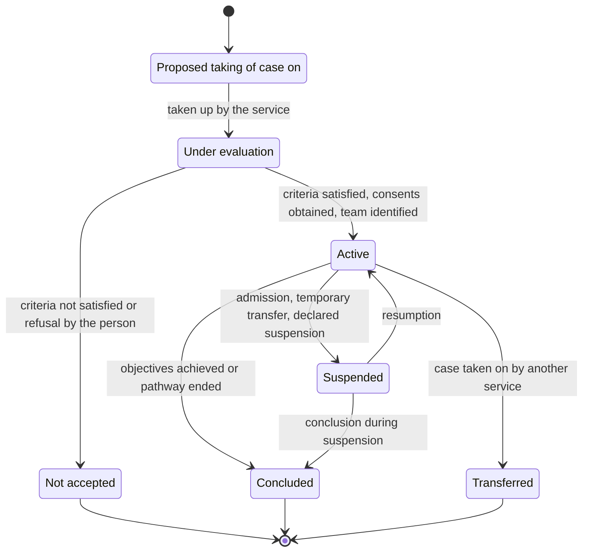
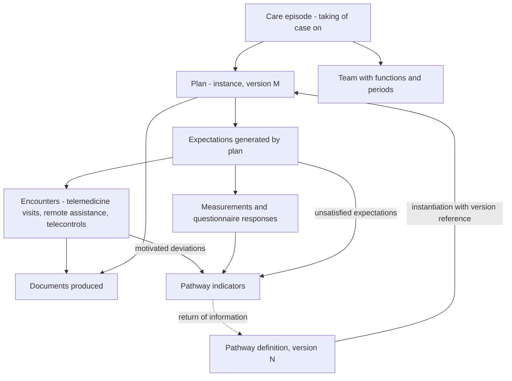

# Care pathways and plans

The requirement that governs this chapter is statable in one line: **support N pathways without
hard-coding any of them**.

It is not an aspiration of flexibility. It is an arithmetic consequence of the context: Italian
healthcare is organised on twenty-one regional systems, each with its own diagnostic-therapeutic
care pathways, adopted by their own acts, updated by their own cycles; and within each Region
organisations further elaborate them. A model that represents one real pathway works with the
first client, requires a new version of the software for the second and becomes unmanageable at
the third.

Module [10 of the foundations guide](../10_fondamenti/10-percorsi-di-cura-e-sicurezza.md) explains
what a pathway, a plan, taking a case on, adherence and alarms are, and why acute and chronic
require two different modes of care. This chapter derives the model from that.

## 1. Model and instance: the separation on which everything depends

> **`DM-90` [MOD] - Definition and instance are two distinct aggregates, and the instance carries
> the reference to the version of the definition, not to the definition.**

| | Pathway definition | Instance on individual |
|---|---|---|
| What it is | the model of what is foreseeable for a condition, in an organisation | what has been decided for this person |
| Scope | population | individual |
| Who drafts it | working group, by formal act | the professional or team who has them in care |
| Life cycle | published, active, superseded; **never modified after publication** | active, suspended, concluded, interrupted |
| Contains individual thresholds | **no** | **yes** |
| Correspondence in standard | `PlanDefinition` | `CarePlan` |

The four rules that follow from the separation, all verifiable:

1. **A published version is not modified**: it is superseded by a later version.
2. **Ongoing instances remain attached to the version with which they were born.** Migration to a
   later version is an **explicit act** by a professional, traced, not automatic propagation.
3. **Deviation is representable and motivable.** The instance may depart from the definition; the
   departure is a recorded fact with its motivation, not a validation error. A model that rejects
   deviations forces clinicians to work outside the system.
4. **The return of information from instance to definition is a function**, not a side effect:
   pathway indicators are calculated on instances, and without that return the definition is not
   evaluable.

## 2. The five containers that are not synonyms

Module [10 of the foundations guide](../10_fondamenti/10-percorsi-di-cura-e-sicurezza.md) § 3.5
distinguishes them. On the modelling plane what matters is that **they have different drafters,
scopes and life cycles and are not interchangeable**.

| Container | Level | In the model |
|---|---|---|
| **Diagnostic-therapeutic care pathway** | population | versioned definition, per tenant and organisational scope |
| **Care plan** | individual | generic instance, with objectives and calendar |
| **Individual care plan** | individual, **multiprofessional**, with social dimension | instance with multiprofessional team and non-healthcare activities |
| **Individual rehabilitation plan** | individual | **mandatory container** for rehabilitation services, including telerehabilitation |
| **Remote monitoring plan** | individual, **operative** | instance with cycles, frequencies, time bands, thresholds and rules; it is **a signed healthcare document** |

The last row is the one that directly touches the code, and must be stated as the foundations
module states it because it is accurate:

> **The remote monitoring plan is the execution configuration of the alarm engine, written by a
> clinician and digitally signed.** Thresholds are not a system configuration file: they are the
> content of an individual healthcare document.

> **`DM-91` [MOD]** - It follows that the remote monitoring plan has **two mandatory projections**:
> an **executable** one, which the engine uses, and a **documentary** one, which goes to the
> record as a dedicated type (letter t, DM 19 novembre 2025, art. 7). Both are generated from the
> same source. If drafted separately they diverge, and divergence between what the plan declares
> and what the system does is a patient safety defect.

## 3. The definition of the pathway as data

### 3.1 Seven mandatory properties

Translation into model requirements of § 3.7 of the foundations module.

| # | Property | What it entails |
|---|---|---|
| 1 | **No pathway in code** | No class per pathology, no branching on condition, no frequency constant. The pathway is data loaded, validated and versioned |
| 2 | **Restricted description language** | Expressive enough for activities, cadences, decision points, responsibilities and criteria; **not** an arbitrary programming language executed in live operation |
| 3 | **Versioning with immutability** | § 1 |
| 4 | **Scope and tenancy** | Every definition belongs to a tenant and to an organisational scope; a «national» pathway is a configuration, not a presupposition |
| 5 | **Validation on loading** | Unreachable node, cadence without unit, threshold without parameter, loop without exit: rejected at publication, with message intelligible to whoever drafted it |
| 6 | **No individual threshold in definition** | The pathway proposes, the individual plan disposes (`V-02`) |
| 7 | **Traceability of the why** | For every activity executed, from which node it derived; for every activity not executed, whether it was foreseen |

### 3.2 The boundary of the engine

The second property deserves elaboration because it is the point where flexibility meets
regulatory scope.

> **`DM-92` [MOD] - The pathway engine plans, it does not decide.** It can generate expected
> activities, calendars, reminders, observation expectations and work queues. **It cannot**
> evaluate clinical conditions, calculate scores, infer priorities or select branches on the basis
> of clinical judgement that has not been recorded by a professional.
>
> The operational difference: a pathway node that says «if the patient is unstable, proceed to
> branch B» requires that «unstable» has been **declared** by someone; it cannot be calculated by
> the engine from measurements.

It is the same boundary as [chapter 07](07-terminologie-nel-dominio.md) § 8 on execution of
clinical logic, seen from another angle. An engine that is too powerful is, together, an attack
surface and an object that nobody can validate for regulatory purposes.

### 3.3 The relationship with the workflow engine of the decree

The **workflow engine** is a specific micro-service provided for all four minimum services (DM 21
settembre 2022, All. A, Table 1; DM 19 novembre 2025, All. 3). It is therefore not an accessory
function: it is part of the scope expected of a regional infrastructure.

> **`DM-93` [MOD]** - The product's workflow engine and the definition of the pathway are two
> different things: the first executes, the second describes. The first is project code,
> versioned with the project; the second is tenant data, versioned with the tenant. Confusing them
> means that updating a pathway requires a software release.

## 4. Taking a case on and enrolment

### 4.1 It is not having an appointment

Taking a case on is **continuous**, **responsible-making** and **formal**: it is not exhausted by
the act, it identifies who answers for continuity, and it begins and ends with a declared act.

> **`DM-94` [MOD] - Taking a case on is an aggregate with its own root - the **care episode** -
> and not an attribute of the beneficiary nor an inference from the existence of encounters. It
> is the unit to which the team, plan, objectives and indicators are attached, and the unit on
> which the `CARE_EPISODE` authorisation relationship is founded (chapter
> [03](03-assistito-professionista-organizzazione.md) § 5.2).

The `Transferred` state exists because taking a case on can change titleholder without
interrupting, and distinguishing transfer from conclusion followed by new taking on is what
permits measuring continuity of care instead of fragmenting it.

### 4.2 Enrolment evaluation

It is an act with declared criteria, not a calculation. The system records the decision and the
criteria that the service applied; it does not apply them in place of the professional.

For telemedicine visit, AGENAS's *Modello orientativo di erogazione* (v. 1.0.25 of 16 April
2026) identifies three dimensions of «executability verification»: clinical utility, clinical
safety, **patient digital readiness** **[RECOMMENDED]**. This area adopts them as the structure of
the evaluation act also for enrolment in pathways, because the three questions are the same.

> **`DM-95` [MOD]** - Executability evaluation is an **entity with three independent outcomes**,
> each with motivation and author. A single overall outcome makes it impossible to know which of
> the three dimensions determined the refusal, and therefore impossible to know whether the
> refusal is surmountable by a technical or educational intervention.

### 4.3 The team and responsibility

Whoever follows and whoever answers may not coincide. The model therefore represents the team as
a set of **organisational roles with declared function in the episode** and validity period, with
at least one role marked as responsible for taking the case on.

| Property | Rationale |
|---|---|
| The team has members with **function** in the episode | «nurse» is not enough: it is necessary to know whether they are the reference for the pathway or an executor |
| Each member has a **period** | shifts change, people move, and the question «who was responsible then» must be answerable |
| There is **always** a responsible person | an episode without a responsible person is a taking on that nobody has assumed |
| Change of responsible person is a **fact** | with instant, author and reason |

### 4.4 Declared service hours

> **Question `Q-14` on the noticeboard**, addressed to areas `PROD` and `FUNZ`: **declared service
> hours is a safety requirement**, not a commercial parameter. A poorly declared service is more
> dangerous than absence of service, because it produces false reassurance.

This area contributes a modelling constraint, and does not close the question because formulation
towards the user and the corresponding functional requirement are not its responsibility:

> **`DM-96` [MOD] - Service hours is an entity of the service, not a text.** It contains: days,
> time bands, type of guaranteed response, expected time to take case on, behaviour outside
> service hours, and indicated alternative channel. It is **linked to the plan** and reported to
> the beneficiary at the moment of enrolment, with the same structure it is configured with.
>
> Two operational consequences:
>
> 1. **The alarm engine knows the service hours.** An alarm generated outside service hours has a
>    declared behaviour - queued, escalated to a different channel, or not generated - and not an
>    implicit behaviour.
> 2. **Modification of service hours is a communicated event.** A reduction of service hours of a
>    service in which people are enrolled is not a configuration change: it is a variation of the
>    service those people have relied on.

## 5. The episode and encounters

Three observations on the diagram.

1. **The encounter does not belong to the episode: it is linked to it.** An encounter can exist
   without an episode - a one-off telemedicine visit - and an episode can contain encounters
   delivered by different organisations. A composition relationship would prevent both cases.
2. **Expectations are the bridge between plan and reality.** They are the entity introduced at
   chapter [05](05-parametri-e-osservazioni.md) § 6.1 and are what permit measuring adherence as
   a defined quantity.
3. **Indicators are calculated on three sources**: encounters, measurements and unsatisfied
   expectations. Omitting the third produces systematically optimistic indicators, because what
   did not happen does not appear.

## 6. Adherence

### 6.1 The operational definition

> **`DM-97` [MOD] - Adherence is the ratio of satisfied expectations to generated expectations,
> in a declared window, with the explicit list of excluded expectations and the reason for
> exclusion.**

The definition has three parts and all three are needed:

- **the denominator is generated by the plan**, not reconstructed after the fact: it is what
  makes the number reproducible over time, even after the plan has changed;
- **the window is declared**, because adherence over one week and that over six months are
  different quantities;
- **exclusions are explicit**: expectations falling in a period of declared suspension or
  declared unavailability of the beneficiary are not failed adherences, and counting them as such
  produces an indicator that describes the organisation instead of the person.

### 6.2 Adherence to plan and treatment adherence

They are not the same thing and the model keeps them distinct:

| | Adherence to observation plan | Treatment adherence |
|---|---|---|
| What it measures | execution of foreseen observations | taking of prescribed therapy |
| Source datum | expectations and measurements | declarations, questionnaires, external delivery data |
| Observable by system | yes, directly | **no**, except by declaration or third-party data |

The second row of the third column is a limitation to be declared. The system does not observe
the taking of therapy: it observes what someone declares. Presenting a percentage of treatment
adherence as a measure would attribute to the datum a nature it does not have.

### 6.3 The silence, again

Adherence calculated without the taxonomy of causes of chapter [05](05-parametri-e-osservazioni.md)
§ 6.2 is a number that confuses six different situations: device fault, lack of connectivity,
interrupted ingestion chain, use error, declared absence, abandonment, clinical deterioration.

> **`DM-98` [MOD] - An adherence indicator is **always** returned together with the breakdown of
> unsatisfied expectations by cause category, including those of unknown cause. An adherence
> indicator without that breakdown is, at best, useless.

## 7. Outcomes

### 7.1 What the model records

Outcomes of a pathway are not a system judgement. They are **recorded facts**, of four types:

| Type | Example from domain | Who declares it |
|---|---|---|
| **Activity outcome** | the encounter took place, with which outcome code | the professional |
| **Outcome declared by beneficiary** | response to outcome questionnaire reported by the person | the beneficiary |
| **Recorded clinical event** | emergency department access, admission, therapy change | whoever records it or the source system |
| **Pathway outcome** | objectives achieved, pathway interrupted, transferred | the responsible professional |

> **`DM-99` [MOD]** - The system **does not calculate clinical outcomes** and does not produce any
> synthetic index of clinical result. It aggregates declared facts and counts recorded events. The
> distinction is the boundary of `V2` applied to outcomes, and must be watched because it is
> where product pressure is strongest.

### 7.2 Pathway indicators

Process indicators - how many received what the pathway foresaw, within what times, with what
deviations - are calculable without leaving the scope, because they count facts and do not
interpret them.

They must however be subject to the cardinality rule of chapter [06](06-consenso-e-riservatezza.md)
§ 11.3: no aggregate below the configured threshold, neither in direct form nor deducible by
difference. In a pathway for an infrequent pathology, a single tenant's cohort may be small, and
the indicator becomes identifying.

## 8. The relationship with territorial organisation

Module [01 of the foundations guide](../10_fondamenti/01-sistema-sanitario-italiano.md) § 8
describes territorial models and new structures. On the modelling plane one thing follows, but it
is important:

> **`DM-100` [MOD]** - The organisational unit to which a taking on is attached is a reference to
> the organisation model of chapter [03](03-assistito-professionista-organizzazione.md) § 4.2 -
> recursive, with declared type - and **not a closed list of structure types**. Types change by
> administrative reorganisation with a frequency that no hard-coded list can sustain.

## 9. How to add a pathway

The final verification of configurability is procedural and must be stated as such, because it is
what distinguishes a genuinely configurable system from one that declares itself to be.

**Adding a pathway must require exclusively:**

1. drafting of the definition in the description language;
2. its validation on loading;
3. publication with version, scope and tenant;
4. possible definition of associated document and consent models;
5. configuration of service hours.

**It must not require:** a code modification, a software release, a data schema migration, or the
intervention of whoever wrote the engine.

> If even one of the five points requires developer intervention, the pathway is hard-coded -
> regardless of how configurable everything around it is.

## 10. What remains unverified

| Point | State | To be asked to |
|---|---|---|
| Requirement identifiers for six areas uncovered on chronicity, alarms and patient safety: versioned plan, expectation window, escalation with declared failure, monitoring of expected volume, declared service hours, calculation traceability | **open** | `FUNZ` - question `Q-12` |
| Formulation towards user of service hours and corresponding requirement | **open** | `PROD`, `FUNZ` - question `Q-14` |
| Licensing regime of scales used in enrolment evaluation and in person-reported outcomes | **[NV]** | `COMP` - question `Q-11` |
| Scope boundaries with respect to intended purpose: no interpretive judgement in notices, no prognosis | **open** | `COMP` - question `Q-01` |

## What you need to remember

1. **Definition and instance are distinct aggregates**, and the instance carries the reference to
   the **version** of the definition.
2. **A published version is not modified**, and ongoing instances do not migrate by themselves.
3. **Five containers are not synonyms**: pathway, care plan, individual care plan, individual
   rehabilitation plan, remote monitoring plan.
4. **The remote monitoring plan is the alarm engine configuration written by a clinician and
   signed**, with two projections generated from the same source.
5. **The pathway is data**: no class per pathology, no frequency constant, no pathway in code.
6. **The engine plans, it does not decide.** A branch that depends on clinical judgement requires
   that the judgement has been declared.
7. **Taking a case on is an aggregate with its own root**, not an inference from the existence of
   encounters.
8. **The team has functions and periods**, and there is always a responsible person.
9. **Service hours is an entity of the service**: the alarm engine knows it, and its modification
   is a communicated event.
10. **Adherence is satisfied expectations on generated expectations**, with declared window and
    explicit exclusions, and is never returned without the breakdown of causes.
11. **The system does not calculate clinical outcomes**: it aggregates declared facts and counts
    recorded events.
12. **Adding a pathway must not require a software release.** If it does, the pathway is
    hard-coded.

## Where to continue

- [05 - Parameters and observations](05-parametri-e-osservazioni.md): expectations, missing data
  and individual thresholds.
- [02 - Services modelled](02-le-prestazioni-modellate.md): the encounters that compose the
  pathway.
- Module [10 of the foundations guide](../10_fondamenti/10-percorsi-di-cura-e-sicurezza.md):
  chronicity, scales, triage, alarms, adherence and patient safety.
