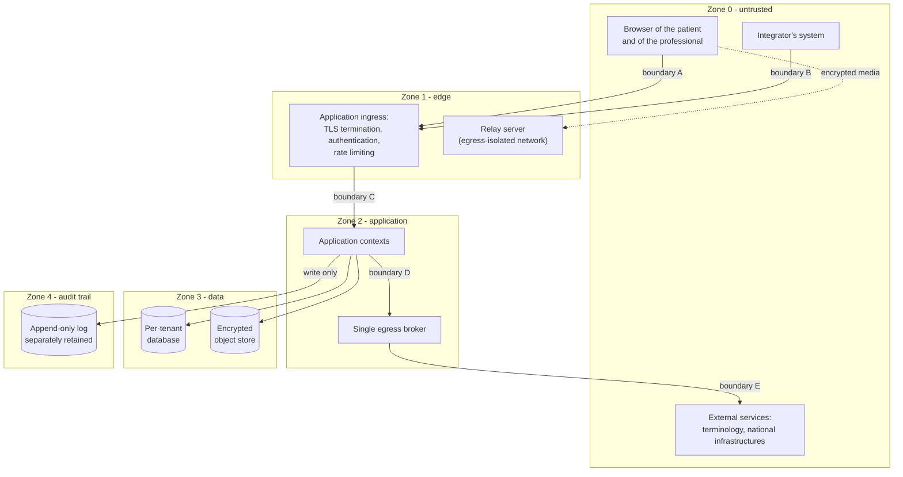

# Threat model

> **Reading prerequisite.** What a threat model is, and what STRIDE, the attack surface and trust
> boundaries are, is explained in
> [10 §12 - Cryptography and security, §2](/10_fondamenti/12-crittografia-e-sicurezza.md).
> Here that method is applied to this system, and not repeated.

## 1. Why this chapter comes before all the others

A threat model is the ordered answer to four questions: **what is protected**, **from whom**,
**what happens if the protection gives way**, **how it is verified that it holds**. Every control
described in the following chapters derives from a line of this chapter. A control that does not
derive from here has no justification and must be removed; an asset listed here that has no
control is an untreated risk, and must be declared as such.

This chapter is also the point of connection with the **risk management file** under the standard
on risk management for medical devices. The two disciplines do not coincide - device risk
management assesses **harm to the patient**, information security assesses the **compromise of
the system's properties** - but in this domain they intersect continuously, and the intersection
is the content of §5. The technical standard on security activities in the life cycle of health
software, which is the reference of choice for demonstrating the state of the art under Annex I
§ 17.2 of Regulation (EU) 2017/745, expressly requires a cybersecurity risk management process
that is distinct from, but connected to, the patient safety one.

## 2. The protected assets

Five assets, ordered not by value but by **how often they are forgotten**.

### 2.1 Clinical content

What the professional writes, what the patient reports, what the signed document contains, what
the measurement of a vital sign records, what the image shows, what the audio-video stream
carries while the session is under way.

It is the obvious asset, and it is the best protected in almost every system, because it is the
one people think of first. Its relevant properties are **confidentiality** (nobody beyond those
entitled), **integrity** (nobody alters it without this being detectable) and **authenticity**
(who produced it is demonstrable). **Availability** matters less than is commonly believed for
content already produced, and matters enormously for content being produced: a report that is
unreachable for an hour is a disruption, a session that drops halfway through a psychiatric
consultation is a clinical event.

### 2.2 Session metadata - the asset that gets forgotten

**The mere fact that a person has had a session with a specialist is data concerning health.**
This is not an expansive reading: Article 4(15) of Regulation (EU) 2016/679 defines data
concerning health as «personal data related to the physical or mental health of a natural person,
**including the provision of health care services**, which reveal information about his or her
health status». The provision of the service is explicitly inside the definition.

It follows that this whole set is health data, and must be protected as such:

| Metadatum | What it reveals |
|---|---|
| Patient identity and professional identity, as a pair | The professional's specialty reveals the area of the health problem |
| Existence, date and time of the session | Reveals the existence of an ongoing care pathway |
| Duration and number of sessions | Reveals perceived complexity or severity |
| Frequency and cadence | Distinguishes an occasional check from a continuing pathway |
| Reason for cancellation or non-attendance | Often reveals more than the session itself |
| Providing organisation or organisational unit | Reveals the specialty |
| Network addresses of both parties | Reveals the location and the context the patient is in during the consultation |
| Traffic volume and pattern | Distinguishes a video session from an audio-only one, and in some cases the type of interaction |

This table is the reason why three apparently disproportionate choices are in fact
proportionate: the prohibition on labelling the relay's infrastructure metrics with the session
identifier ([V-155](./05-sicurezza-del-tempo-reale.md)); the prohibition on carrying direct
patient identifiers in diagnostic logs ([V-150](./04-tracciamento.md)); the prohibition on
letting patient identifiers reach the external terminology service
([V-151](./03-protezione-dei-dati.md)). A system that protects the report and leaves the metadata
in the clear in a third-party observability system has protected the least revealing part of its
own information content.

### 2.3 Key material

The at-rest encryption keys for content and recordings; the private keys with which the project
signs outbound messages and distributed artefacts; the shared secret used to issue the relay's
ephemeral credentials; the token signing keys; the ephemeral cryptographic material of the
individual media session.

The relevant property is **confidentiality**, but the consequence of its failure is not
symmetric. Compromise of an artefact signing key exposes not a single clinical datum and produces
the worst harm on the list, because it allows a malicious artefact to be distributed that every
installation will accept as authentic. Compromise of the ephemeral material of a session exposes
one session. Compromise of a tenant's at-rest encryption key exposes that tenant's archive.
**The hierarchy of harm does not follow the hierarchy of attention**: the archive key is watched
and the signing key is forgotten.

### 2.4 The record of accesses and operations

The audit trail is at once an asset and an instrument for protecting the other assets, and it is
for that reason the target of whoever has already committed the abuse.

The relevant property is **integrity** in the strong sense: not just «nobody modifies it», but
«if anybody modifies it, it is **demonstrable to a third party** that they did». This is the
difference between integrity and non-repudiation, and it is the reason why entity versioning is
not an immutable audit trail ([V-04](./04-tracciamento.md)): whoever has write access to the
database can alter the version tables too, and the alteration leaves no distinguishable trace.

The second relevant property is **availability over the long term**: an audit trail kept for
twenty-four months must be readable twenty-four months from now, with the verification tool of
its era, and this is a requirement of format and preservation, not of storage.

### 2.5 The build chain

The source code, the third-party dependencies, the continuous integration infrastructure, the
secrets that infrastructure holds, the image registry, the update distribution channel.

It is the asset with the **highest multiplication factor**: the compromise of a single point of
the chain propagates to every installation simultaneously, and the installations have no way of
noticing, because what they receive is signed with the right key and comes from the right
channel. It is also the asset over which the project has the most direct control and the least
delegable responsibility: the deployer cannot compensate for a compromised build chain. Chapter
[07](./07-catena-di-fornitura.md) is entirely devoted to this asset.

## 3. The adversaries

An adversary is described by three elements: **who they are**, **what they can do**
(capability), **why they do it** (motivation). An adversary described without capability
produces disproportionate controls; an adversary described without motivation produces controls
that protect what nobody wants.

### 3.1 The insider - primary adversary

**This is the adversary the design starts from, not one among many.**

*Who they are.* A person with valid credentials and with a role that legitimately grants them
access to health data: a healthcare professional, an administrative operator, a tenant system
administrator, a technical support operator.

*What they can do.* Everything their role allows. They need not defeat any control, need not
exploit any vulnerability, and leave no anomalous traces at the perimeter. They consult the
record of a person who is not in their care; they export a wider set of records than necessary;
they repeatedly consult the same subject; they access outside service hours; they use emergency
access with no emergency.

*Why they do it.* Curiosity about a well-known person; financial interest in selling the
information; a personal conflict; a request from a third party. The motivations are banal, and
that is exactly what makes this category frequent.

**Why it is the primary adversary, with the sources.** Two converging elements:

1. In the annexes on baseline significant incidents of Determinazione n. 379907 of 19 December
   2025 (a determination of the Italian national cybersecurity authority), that authority has
   constructed an **autonomous incident type** - the one reserved for essential entities -
   defined as «unauthorised access **or access with abuse of granted privileges**» to digital
   data. Abuse of privileges is defined by the authority as the condition in which the user «has
   the technical authorisation (possession of credentials that are configured to access the data)
   to access certain data but uses that access unlawfully», in breach of policy or for purposes
   extraneous to functional necessity. This is not an inferred category: it is written as a
   mandatory-notification category.
2. It is the recurring category in the **enforcement measures of the data protection authority in
   the healthcare domain**: improper access to clinical documentation by staff of the
   organisation, authorised to access in general but not to that particular datum.

*Design consequence.* Against this adversary perimeter defences are inert. The only effective
defences are four, and they are all product features:

- **authorisation founded on the care relationship**, not on the role alone: being a doctor is no
  entitlement to access an arbitrary patient ([02 §6](./02-identita-e-accessi.md));
- **a non-alterable audit trail** of every access, with who-what-when-on-whom granularity
  ([04](./04-tracciamento.md));
- **detection by thresholds and patterns**: counting accesses per actor and unit of time,
  accesses outside the declared time band, exports above a threshold. The national authority
  indicates precisely these two as examples of a quantitative and a qualitative parameter for
  detecting abuse ([04 §7](./04-tracciamento.md));
- **emergency access as a declared path**, with mandatory free-text justification and after-the-fact
  review: making the exception a traced function instead of leaving it as a silent privilege
  ([02 §10](./02-identita-e-accessi.md), constraint [V-153](../11_registri/01-vincoli-in-vigore.md#v-153)).

### 3.2 The untargeted external attacker

*Who they are.* Automation: mass scanning, exploitation of known vulnerabilities shortly after
their publication, reused credentials, ransomware.

*Capability.* High in breadth, low in depth. It does not know the system; it tries what works
elsewhere.

*Motivation.* Financial and indiscriminate.

*Design consequence.* The controls that stop it are well known and are not negotiable: no default
credentials, no unnecessary service exposed, prompt patching, a second factor on administrative
accounts, rate limiting, backups verified for restore. They are the baseline, and their marginal
cost is low. Chapter [06](./06-sicurezza-applicativa.md) and the secure-by-default configuration
of [07 §8](./07-catena-di-fornitura.md) cover this adversary.

### 3.3 The targeted external attacker

*Who they are.* Someone who has chosen this target: a competitor, an organised criminal group
that has assessed the ransom value of a care provider organisation, someone interested in the
data of a specific person.

*Capability.* They study the system. They read the public documentation - this. They analyse the
code, which is open. They look for the point where the documentation promises more than the code
does. They try the supply chain if the perimeter holds.

*Motivation.* Ransom, targeted exfiltration, reputational damage.

*Design consequence.* Against them, openness of the code is **neutral with respect to security
and positive with respect to verifiability**, on condition that security nowhere depends on the
secrecy of the design. Every time a control in this area would work only because the attacker
does not know something, the control is wrong. The concrete consequence is chapter
[07](./07-catena-di-fornitura.md): when the application perimeter is solid, the cheapest path
becomes the build chain.

### 3.4 The malicious session participant

*Who they are.* One of the two parties to the session, or a third party presenting themselves as
such.

*Capability.* Recording what they see and hear by means external to the system - a camera pointed
at the screen - something **no technical control can prevent** and which must be stated instead
of being implicitly denied by the encryption claim. Or else attempting to join someone else's
session, or to pass themselves off as the other party.

*Design consequence.* Key verification by means of a short authentication string
([05 §3](./05-sicurezza-del-tempo-reale.md)) answers the second capability and not the first.
The documentation intended for the user must say so clearly: end-to-end encryption protects
against the intermediary, not against the counterparty.

### 3.5 The infrastructure as a passive adversary

*Who they are.* The connectivity provider, the infrastructure provider, the observability
service, the external terminology service, the notification provider. None of them has hostile
intent; all of them see something.

*Capability.* They see what the architecture routes through them. The infrastructure provider
sees the volume; the observability service sees what is sent to it; the terminology service sees
the queries.

*Design consequence.* The defence is not contractual but **architectural, by absence of the
datum**: if a patient identifier never reaches the external terminology service, its geographical
location becomes irrelevant for transfer purposes. This is the reasoning with which question [Q-04](../11_registri/02-questioni-aperte.md#q-04)
on the noticeboard was closed, and which chapter [07 §7](./07-catena-di-fornitura.md) sets out in
full.

### 3.6 Error, which is not an adversary but produces the same effects

A wrong configuration, an over-verbose log, a test environment populated with real data, an
attachment sent to the wrong recipient. There is no adversary and there is a breach. The defences
take a different form: protective defaults, configurations that are **rejected** rather than
flagged when they degrade a security property, an absolute prohibition on real data in code,
tests, examples, logs and documentation.

## 4. Trust boundaries

A trust boundary is the point where a datum passes from a domain with certain guarantees into a
domain with different guarantees. **Every boundary requires a validation, and the validation must
be done by the receiving side**, never by the sending side.

| Boundary | What crosses it | What the receiving side checks |
|---|---|---|
| **A** - browser → ingress | Application requests, drafted content, uploaded files | Authentication, level of assurance, authorisation on the specific object, schema and size of the body, real type of the file, per-actor rate limiting |
| **B** - integrator → ingress | Delegated identity token, application calls, references | Issuer admitted for that tenant, signature, admitted algorithm, expected audience, scope, **marking of the level as reported and not performed** |
| **C** - ingress → application | Request context | Tenant resolved: **no query without a tenant**; identity propagated in non-forgeable form |
| **D** - application → broker | Egress request with destination | Scheme, port, size, time, hop count against closed lists; **resolved address checked** |
| **E** - broker → external | Queries, notifications, retrieval of material | No clinical content ([V-161](./06-sicurezza-applicativa.md)); no patient identifier towards terminology ([V-151](./03-protezione-dei-dati.md)); asymmetric signature on egress ([V-162](./06-sicurezza-applicativa.md)) |
| **media** - browser → relay | Encrypted transport packets | Valid ephemeral credential; destination not belonging to the forbidden address ranges; **outbound network isolation as the primary defence** ([05 §4](./05-sicurezza-del-tempo-reale.md)) |

Two observations that the table does not convey on its own.

**The browser is an untrusted zone even when it is the professional's browser.** There is no
difference in trust between the two sides: both run code the user can modify. Every control that
counts is executed server-side; client-side controls are ergonomics.

**The subtlest boundary is B.** The identity that arrives from an integrator is an identity of
which the project knows only the assertion. This is the subject of chapter
[02 §4](./02-identita-e-accessi.md) and the reason for constraint [V-154](../11_registri/01-vincoli-in-vigore.md#v-154).

## 5. From threat to clinical consequence

This is the table that distinguishes the threat model of a healthcare system from that of any
other system. The column that counts is not «technical impact»: it is **what happens to a
person**.

| # | Threat | Asset | Technical consequence | **Clinical consequence** |
|---|---|---|---|---|
| M-01 | Improper access to the documentation by authorised staff | Clinical content, metadata | Loss of confidentiality | Harm to the person through disclosure; loss of trust that leads the patient to **withhold information** at a subsequent consultation, with a direct effect on diagnostic accuracy |
| M-02 | Alteration of the access log | Audit trail | Loss of integrity and non-repudiation | **Impossibility of establishing** whether the improper access took place: the person cannot obtain redress and the organisation cannot discharge its notification duty |
| M-03 | Interception or hijacking of the media session | Clinical content, metadata | Loss of confidentiality | Disclosure of the consultation; in psychiatry or infectious diseases the harm is at its maximum |
| M-04 | Degradation or drop of the session | Availability | Service unavailability | **Consultation not completed.** If there is no declared telephone fallback and the person has no way of rebooking in useful time, this is a missed episode of care on a care pathway |
| M-05 | Recording started without consent, or consent that cannot be withdrawn | Clinical content | Processing without a legal basis | Harm to the person; **chilling effect** on the consultation if the patient suspects being recorded |
| M-06 | Alteration of a signed clinical document | Clinical content | Loss of integrity | **Therapeutic decision on a false datum.** It is the threat with the worst potential outcome in the whole list |
| M-07 | Alteration of a vital sign measurement or of its time-stamp | Clinical content | Loss of integrity | Threshold assessment on a false datum; alert missed or alert unjustified |
| M-08 | Loss of an alarm or of a threshold-breach notification | Availability | Message lost | **Failure to intervene** on a clinical deterioration. Constraint [V-09](../11_registri/01-vincoli-in-vigore.md#v-09) - silence is never normality - is born here |
| M-09 | Service hours declared differently from the actual ones | Integrity of the information | None, on the technical plane | **False reassurance.** A person who believes they are being monitored and is not is in a worse condition than a declared absence of service |
| M-10 | Confusion between patients: a datum attributed to the wrong person | Clinical content | Loss of integrity | Report or measurement in the wrong record: **two people harmed** by a single error |
| M-11 | Data leakage between tenants | Clinical content, metadata | Loss of confidentiality | As M-01, with mass exposure and with no identifiable actor |
| M-12 | Compromise of the build chain | All | Total and simultaneous compromise | Not calculable in advance: it depends on the payload. It is the only threat whose worst outcome includes all the others |
| M-13 | Compromise of the relay used as a foothold towards the organisation's internal network | Customer's network | Lateral movement | The product becomes the **vector** through which the hospital that hosts it is compromised: irreversible reputational damage and contractual liability |
| M-14 | Resource exhaustion induced on the service | Availability | Unavailability | As M-04, across all sessions at once |
| M-15 | Irreversible loss or destruction of at-rest key material | Key material | Loss of availability of the encrypted data | **Loss of health documentation**: an encrypted archive without its key is destroyed |

Rows M-04, M-08 and M-09 are the ones a standard information security threat model does not
produce, because there is no adversary and there is no loss of confidentiality. They are also the
ones that, in a medical device, weigh most in the risk assessment.

## 6. Risks the project declares and does not eliminate

Honesty about what is not protected is part of the threat model, and in a medical device it is an
obligation: what is not mitigated must be declared as residual risk.

1. **The counterparty can record by external means.** No encryption prevents it. It must be
   written in the privacy notice, not left to be inferred.
2. **The security of the user's device is not governable by the project.** A compromised device
   sees everything the user sees. End-to-end encryption ends at the ends, and the ends are the two
   devices.
3. **In the mode with recording the session is not end-to-end encrypted.** This is not a hidden
   residual risk but a declared property of that mode, with the documentary and interface
   consequences described in [05 §5](./05-sicurezza-del-tempo-reale.md).
4. **The inventory of the points in the clear is not empty.** Signalling, relay and the recording
   component each see something. The complete list is in [03 §5](./03-protezione-dei-dati.md),
   and it is published rather than left unsaid.
5. **The project does not control the configuration of the installation.** It can supply a
   secure-by-default configuration, document the deviation and detect it; it cannot stop the
   deployer from turning it off. The allocation is in
   [09](./09-ripartizione-delle-responsabilita.md).
6. **There is no key rotation within the media session.** This is an established fact of the
   protocol, not a choice of the project, and it is dealt with in
   [05 §2](./05-sicurezza-del-tempo-reale.md).

## 7. From the model to verification

A threat with no test that verifies its mitigation is an assertion. The rule of this area is that
**every row of §5 must have at least one requirement and at least one automated test**, and that
the test must be a **negative** test - one that verifies that the forbidden action fails - and
not just a positive one.

| Threat | Form of the test |
|---|---|
| M-01 | Negative authorisation test: a professional with no care relationship is refused on the patient; the event is present in the audit trail |
| M-02 | Induced alteration of a row of the audit trail: the verification tool detects the break in the chain |
| M-03 | Traffic capture on a test session: absence of any stream in the clear; verification of the short authentication string |
| M-04 | Degradation test: packet loss and latency induced; verification that the system degrades **audio before video** and that the event is logged |
| M-05 | Test of absence of recording without consent; test of withdrawal with effective erasure |
| M-06, M-07 | Verification of the version chain and of the signature; test of detection of the alteration |
| M-08 | Escalation test with declared failure: a missing acknowledgement produces an event, not a silence |
| M-09 | Verify that the service coverage hours shown to the patient are **read from runtime data** and not from a constant: alter the configured coverage and check that the interface changes accordingly. Coverage declared by a fixed string is true until someone changes the service, and that is precisely the moment it becomes dangerous |
| M-10 | Identifier reconciliation test with an explicit assigning authority |
| M-11 | **Negative cross-tenant test on every entry point**, without exceptions ([06 §5](./06-sicurezza-applicativa.md)) |
| M-12 | Verification of the artefact's signature and provenance; reproducibility of the build |
| M-13 | Abuse test suite against the broker and against the relay ([05 §4](./05-sicurezza-del-tempo-reale.md), [06 §8](./06-sicurezza-applicativa.md)) |
| M-14 | Over-threshold load test with verification that rate limiting engages |
| M-15 | Restore-from-backup test **including the key material** |

## 8. Maintenance of the model

A threat model is not a project-opening document. It is **dated**, it has an owner, and it must be
reviewed:

- at every new capability that introduces a trust boundary or an egress point;
- at every change of the deployment configuration;
- on the publication of a relevant vulnerability in a third-party component on the main path;
- after every incident, as part of the review described in
  [10 §7](./10-risposta-agli-incidenti.md);
- and in any case at least annually.

The outcome of the review is tracked and linked to the risk management file: the rows of §5 of
this chapter that have a clinical consequence are, by construction, rows of the device's risk
register.
