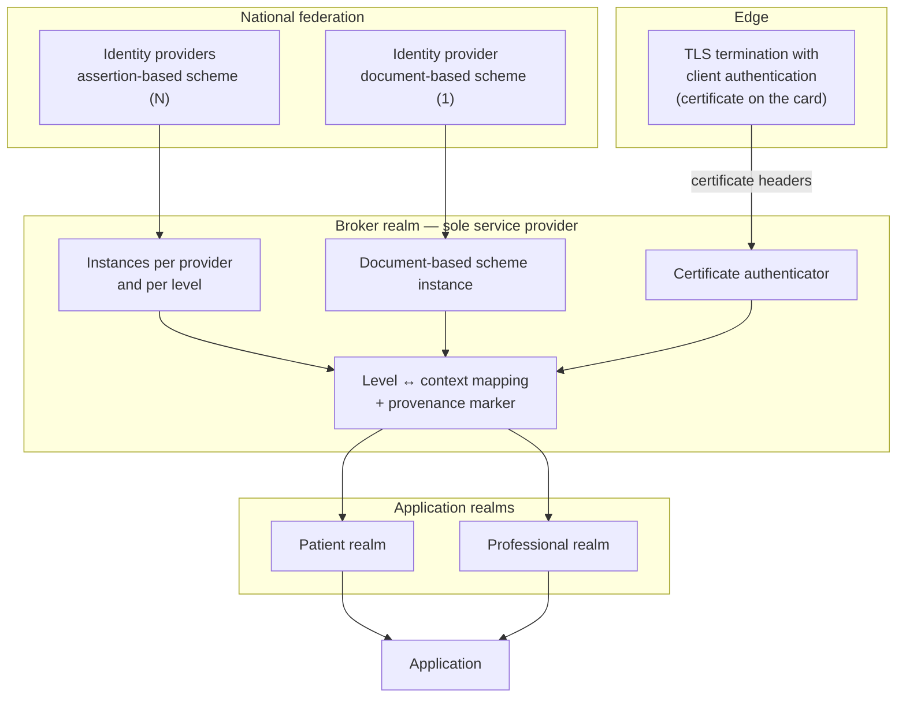

# Identity and access

> **Reading prerequisite.** The difference between authentication, authorisation and identity, the
> authentication factors, the session, role-based and attribute-based authorisation and
> break-glass are covered in
> [10 §12 — Cryptography and security, §8](../10_fondamenti/12-crittografia-e-sicurezza.md).
> Patient and professional identifiers in Italy are in
> [10 §04 — Identity and demographic registries](../10_fondamenti/04-identita-e-anagrafiche.md).
> Here we describe what this system does, and why.

## 1. The question this chapter answers

It is not «how do you log in». It is: **when the audit trail says that patient X was consulted by
professional Y, what exactly was verified, by whom, and with what strength?**

The whole chapter follows from this question, because the answer is not the same in every case.
In some cases the authentication was **performed** by this system against the national identity
federation; in others it was **reported** by a third-party system that declares it has performed
it. The two are not equivalent, and an audit trail that does not distinguish them produces an
assertion that will not stand up in an investigation.

## 2. The project is not accredited, and this changes the perimeter

**Constraint V-05, which governs the whole chapter.** A software project cannot be accredited
with the national digital identity federation. The service provider, under DPCM 24 ottobre 2014
(the Prime Ministerial Decree of 24 October 2014), Article 1(1)(i), is whoever **provides online
services**, and the agreement with the agency commits them to declaring the list of active
services: **it is the deployer, never the project**.

Three operational consequences follow.

1. The goal of the product is to be **compliant and verifiable in continuous integration**, not to
   be an accredited installation. The form of the verification is the execution, in the pipeline,
   of the service provider conformance suite, including the tests for resistance to XML signature
   wrapping attacks, which are the class of attacks that has historically compromised
   implementations of the assertion protocol.
2. No project document may declare or imply accreditation. The correct phrase is «ready for»,
   never «accredited».
3. The procedural obligations — filing of the metadata document, certificate issued by the
   agency's public key infrastructure, agreement, justification of the levels chosen — belong to
   the deployer. The project **documents them as an operating manual** and supplies the technical
   artefacts. See [09](./09-ripartizione-delle-responsabilita.md).

## 3. The levels of assurance and their international correspondence

The three levels of the national federation are defined by the implementing regulation, which
maps them **explicitly** onto the international standard ISO/IEC 29115:

| National level | ISO/IEC 29115 | Factors required |
|---|---|---|
| Level 1 | **LoA2** | Single factor |
| Level 2 | **LoA3** | Two factors, **not** necessarily based on digital certificates |
| Level 3 | **LoA4** | Two factors **based on digital certificates**, with private key custody on a device conforming to Annex II of Regulation (EU) 910/2014 |

The authentication context identifiers are URIs with the `https` scheme and no trailing slash, in
the form `https://www.spid.gov.it/SpidL1|L2|L3`. **The same triple is reused by the identity
scheme based on the electronic identity card (Carta d'Identità Elettronica, CIE)**, which
declares this expressly in order to ease development for those who have already joined the
federation.

The correspondence with the European levels — substantial and high under Article 8(2) of
Regulation (EU) 910/2014 — is the one commonly assumed, **but it is not stated verbatim in the
implementing regulation**: `[NV]`. If a formal declaration is needed, it must be verified against
the notification documentation of the scheme at European level. It must not be asserted here.

### 3.1 Which level for health data: the uncomfortable answer

The methodological appendix to the implementing regulation, read literally, places **sensitive
data** — a category that today corresponds to the special categories of Article 9 of Regulation
(EU) 2016/679 — at **level 3**. In national practice, however, a citizen's access to the
electronic health record (Fascicolo Sanitario Elettronico) takes place at **level 2**.

The contradiction is apparent, and must be explained precisely, because documentation that
simplified it in either direction would be incorrect:

- the appendix is introduced in the text with the phrase «**by way of example**»: it is proposed
  methodology, not prescription;
- the same appendix recognises «the right of the individual public administration to define
  different criteria on the basis of the different modes of service provision and of the data
  made available»;
- the regulation provides that the agency publish the level to be associated with homogeneous
  categories of services. **The document associating a level with the category of health services
  has not been located**: `[NV]`, it must be requested from the agency;
- level 3 requires the patient to have a cryptographic device. Imposing it in order to access a
  remote consultation (televisita) would produce **mass exclusion**, in direct tension with the
  accessibility constraint V6 and with the equity purpose of the service. This is a patient safety
  consideration, not one of convenience: a service that is inaccessible to the population that
  needs it most is not a safer service.

**Position of the project — a proposal, not a rule.** The level is **configurable per tenant and
per operation**, never hard-coded. It is a requirement that follows directly from the fact that
the service provider «chooses» the level (DPCM 24 ottobre 2014, Article 6(4)) and must **justify
the choice** in the agreement. The values proposed as defaults:

| Operation | Minimum level proposed | Justification |
|---|---|---|
| Patient access to their own session | Level 2 | Alignment with health record practice; two factors; no operation with legal effect on third parties |
| Consultation of one's own documents | Level 2 | As above |
| Consent to recording | Level 2 | A withdrawable act, with no legal effect on third parties |
| Professional access to the data of **other** subjects | Level 2 as a minimum, level 3 configurable | Here the methodological appendix really does bite: third parties' data are being accessed |
| Tenant administration: account management, keys, bulk exports | Level 3 recommended | Access to confidential material with effect on the whole installation |

**An economic constraint to declare to the deployer**: requiring even a single attribute beyond
the base demographic set moves the fee per access from €0.4 to €3.5 according to the fee schedule
annexed to the agency's determination. A product requirement that asked for unnecessary
attributes would multiply the deployer's running cost almost ninefold. It is a minimisation
argument that has, for once, an explicit price attached.

### 3.2 The level lives in `acr`, never in the delegation

**This is the most misunderstood rule in the whole chapter, and its violation is silent.**

The `act` claim defined by RFC 8693 §4.1 expresses **delegation**: it identifies *who is acting*
on behalf of the subject. The level of assurance is a property **of the subject's
authentication**, not of the actor acting on their behalf. Putting it inside `act` is a semantic
abuse that produces a token whose meaning depends on a local convention and that no external
consumer interprets correctly.

**The level lives in `acr`**, which is a standard OpenID Connect claim, and **the delegation lives
in `act`**, which is a standard RFC 8693 claim. The two do not mix. This is the position already
taken in the project's decision D38 and adopted here unchanged.

## 4. Authentication performed and authentication reported

The `acr` claim, on its own, does not say **who** performed the verification. In a system that
accepts federated identities from integrators, this is the point where the audit trail becomes
misleading.

| Scenario | Who authenticated the person | What `acr` means in the issued token |
|---|---|---|
| The patient authenticates to Telemedic with the national federation | Telemedic | `acr` is **authoritative**: the system requested and performed the authentication |
| The professional is authenticated by the integrator's identity system and the identity arrives by token exchange | The integrator | `acr` is **reported**: the system relays what the inbound token asserts, not what it verified |

Copying the level of the inbound token into the issued token **without qualifying it** would make
an authentication the project did not perform appear as verified by the project. In a system whose
audit trail must answer the question «who vouched for this person's identity», this is the
difference between a useful audit trail and a deceptive one.

**Proprietary marker — project proposal.** The project introduces a proprietary extension that
accompanies `acr` and declares its provenance. It is not a standard claim and it must be
documented as an extension, not presented as one.

```json
{
  "iss": "https://<installation>/realms/clinic",
  "aud": "telemedic-api",
  "sub": "<opaque subject identifier>",
  "acr": "urn:telemedic:acr:asserted-by-issuer",
  "auth_source": {
    "kind": "federated-partner",
    "iss": "https://<integrator-idp>",
    "acr_asserted": "https://www.spid.gov.it/SpidL2",
    "verified_by_telemedic": false
  },
  "act": {
    "sub": "<integrator client identifier>",
    "iss": "https://<installation>/realms/clinic"
  },
  "tenant": "<tenant identifier>",
  "scope": "<granted scopes>"
}
```

For comparison, the token issued when it is the project that authenticated the person:

```json
{
  "iss": "https://<installation>/realms/patient",
  "aud": "telemedic-api",
  "sub": "<opaque subject identifier>",
  "acr": "https://www.spid.gov.it/SpidL2",
  "auth_source": {
    "kind": "national-federation",
    "channel": "<channel>",
    "idp": "<identity provider alias>",
    "acr_requested": "https://www.spid.gov.it/SpidL2",
    "acr_asserted": "https://www.spid.gov.it/SpidL2",
    "verified_by_telemedic": true
  },
  "tenant": "<tenant identifier>"
}
```

**The four authorisation rules that follow** — a project proposal, published as constraint V-154:

1. An operation that legislation ties to **strong authentication** under Article 64 of the Codice
   dell'Amministrazione Digitale (the Italian Digital Administration Code) — access to the health
   record, access to national infrastructures — **requires authentication performed**. A level
   reported by a third party does not satisfy it, however high the asserted value.
2. An internal clinical operation — starting a specialist-to-specialist consultation
   (teleconsulto), drafting a document — may accept a reported identity, **provided that** the
   tenant's trust registry explicitly allows it and the reported level reaches the configured
   threshold.
3. The configuration of «which external levels are accepted for which operation» is **per tenant**
   and forms part of the integration contract, not of the code.
4. Every row of the audit trail carries `acr`, the provenance and the delegation in full. It is the
   minimum needed to answer the question «which system acted on behalf of which person, with what
   identity assurance».

**The level propagated is the one requested, not the one asserted** (constraint V-25 of the
integration area, which this area adopts). A double-recording obligation follows:
`acr_requested` and `acr_asserted` are **both** retained, always. The reason is in §5.

## 5. The asserted level may be uninformative

The technical rules of the scheme based on the electronic identity card declare that the
authentication context element **in the response is always set to level 3**, «since the CIE
provides the highest level of reliability at European level».

If this wording is the current one — and it must be verified empirically in pre-production before
declaring in public documentation how the project propagates the level: `[NV]`, question Q-153 on
the noticeboard — three consequences follow that are not cosmetic:

1. **The service provider cannot deduce from the response with which factor the person actually
   authenticated.** An access with password alone and an access with card and PIN produce the same
   assertion. The only lever is **the request**.
2. **The claim propagated downstream becomes uninformative if it is derived mechanically from the
   assertion.** The mapping must derive the level **from the one requested** and record **both**.
   It is the only way to respect non-repudiable auditability without stating something false.
3. **Step-up of the level is not verifiable on the service provider's side.** If the service
   requires level 2 and the person authenticates at level 1, the refusal must come from the
   identity provider: the service provider has no way of noticing after the fact.

A further check remains open, of almost zero cost and on the critical path: **it is not verified**
whether the federation product, acting as a client towards an external identity provider, forwards
the requested level parameter through the intermediating realm. If it does not forward it, per-operation
level step-up is not obtainable by configuration alone. This is question Q-18 on the noticeboard,
opened by the integration area, and Q-153 opened by this area.

## 6. The broker realm

**A project proposal already adopted in the architectural baseline.** A dedicated realm is the
**sole service provider towards the national federation**; the application realms — the
professional's and the patient's — federate to it internally.



| Benefit | Why it matters |
|---|---|
| A single entity identifier, a single metadata document, a single administrative procedure | The administrative procedure is the deployer's dominant risk: halving their exposure to it is the choice with the greatest effect |
| A single point of conformance | The verification suite runs against a single realm |
| Separation between federation and authorisation | The application realms keep distinct roles, groups and policies |
| Extensibility | A future channel is added in the broker without touching the application realms |
| Substitutability | A deployer that is an aggregated entity of an aggregator replaces the broker without modifying the application |

Costs to be declared honestly: one extra redirect hop, irrelevant compared with authentication
time and **with no effect whatsoever on the media latency target**, which concerns a different
path; propagation of the level through the intermediation is **not automatic** and must be
implemented and verified (§5); one more realm to administer, update and back up, which is managed
with configuration-as-code and not by hand; logout must be propagated across three levels.

### 6.1 Who enters from where

| Subject | Realm | Channel |
|---|---|---|
| Citizen patient | Patient | National federation, level 2, via the broker |
| Professional of a public tenant | Professional | National federation or **certificate on the national health card (Tessera Sanitaria)**, via the broker |
| Professional of an integrated private tenant | Professional | Integrator's identity, by token exchange: **no second login** |
| Integrator's system | Professional | Client credentials with an assertion signed by a private key |
| Tenant administrator | Professional | Level 3 or certificate on the card, configurable |

The constraint «no imposition of the identity system» and the decision to include the national
federation in v1.0 **are not in contradiction**: they are two paths for two different populations.
The professional who works inside the integrator's management system need not go through the
national federation; the person who accesses their own consultation from a public portal must. A
documentation set that confused them would produce impossible requirements.

### 6.2 The trust registry must be a single one

**A project proposal with a direct security consequence.** The trust model towards the integrator
is **per tenant**: admitted issuers, address of the public key material, admitted algorithms,
expected audience, claim mapping. The **same** set must also feed:

- the origins permitted for embedding the component;
- the origins permitted for cross-origin resource sharing;
- the permitted destinations for outbound messages to the integrator;
- the allow-list of the single egress broker ([06 §8](./06-sicurezza-applicativa.md)).

Three separate registries diverge, always, and **the divergence is systematically in the
attacker's favour**: an origin removed from one list and not from the other remains valid on the
second. The concrete form of the registry — a single table, a single configuration, a single
verification point — is an **architecture decision**, and this area opens it as a question (Q-156)
instead of deciding it.

## 7. The three defects of the federation product, treated as risks

The federation product adopted has three documented defects **that belong not to the national
connectors but to the product itself**, and that in the healthcare domain are not venial. They are
treated as **product risks under the standard on risk management for medical devices**, with
mandatory risk controls and verification of effectiveness, not as configuration notes.

| # | Defect | Why it is serious here |
|---|---|---|
| **R-IAM-01** | **The federated user can modify their own attributes.** After logging in they can reach the account portal and change name, email address, credential. Blocking the portal is not enough: the administrative interfaces remain invocable. The forced-sync mode restores the data at the **next** login, not in the meantime | An identity authenticated by the national federation could present **demographic attributes altered by the user themselves**. In a system that produces clinical documentation and a non-repudiable audit trail, this is unacceptable: it means the identity of the signatory of a document might not be the one that was verified |
| **R-IAM-02** | **Email address changes are not verified.** The user can change it with no mechanism verifying possession. The problem has been reported in the product's issue trackers for years without resolution | The email address is the delivery channel for notifications and, in many configurations, for credential recovery. An unverified change is an account takeover path |
| **R-IAM-03** | **The federated user is also a local user**: they can set themselves a local credential and log in with it while keeping the attributes obtained from the federation | The weakest channel determines the security of the account. A person who logs in today at federation level 2 can log in tomorrow with a password they set themselves, and the audit trail would record a federated identity |

**Mandatory risk controls.** These are requirements, not recommendations, and each has a test that
verifies its effectiveness:

1. **In the broker realm**: account console **disabled**; username modification switched off; user
   profile with the demographic attributes **read-only for the user**, using the per-attribute
   permissions of the profile declaration.
2. **No local credentials in the broker realm**: no direct grant flow, no browser flow with a
   username-and-password form. The only way to authenticate is a federated identity provider or
   the certificate authenticator.
3. **Forced synchronisation** on all identity providers: the demographic attributes are rewritten
   at every login from the authoritative source.
4. **Provenance marker** propagated as a claim, and an **authorisation policy that refuses sessions
   with no federated provider**. This is the control that neutralises R-IAM-03 even if
   configuration 2 is circumvented.
5. **Security tests in continuous integration** verifying: (a) that the user modification
   interfaces respond with a refusal for a federated user; (b) that an attempt at local login
   fails; (c) that client certificate headers injected from outside **are not honoured**.

Points (a) and (c) are the two that, if not tested, stay silently broken. Point (c) in particular:
if the application trusts a header that declares the client's certificate, and that header can be
set by anyone who reaches the application bypassing the termination point, the whole
certificate-based authentication is forgeable with a single request.

## 8. Certificate authentication and fail-closed revocation

The third channel — authentication with the certificate on the national health card — is the only
one contemplated by Article 64 of the Codice dell'Amministrazione Digitale that has **no
dependency on external administrative procedures**: it requires neither an agreement nor
accreditation with a federation, because trust is anchored to the recognised certification
authorities. That is why it is the channel that can be completed 100% in v1.0.

Mechanism: TLS termination at the edge performs mutual authentication, verifies the chain, and
propagates the certificate to the application, which extracts the tax code from it with a
documented expression and maps it onto the identity attribute.

**The convergence of the three channels on the same identity attribute is a deliberate choice**: a
professional who logs in today with the card and tomorrow with the document-based scheme is the
same subject, with the same audit trail. It is what makes multi-channel useful instead of
generating three parallel registries. But it has a security consequence that must be written out
in full: **if three channels converge on the same subject, the weakest channel determines the
security of the subject.** It follows that:

- each channel carries its own level, and authorisation evaluates **the level of the current
  session**, not the highest level the subject has ever reached;
- the subject **must have no local credentials** (§7, control 2);
- every session records **which channel** it was opened with.

### 8.1 Revocation is the weak point, and must be resolved fail-closed

A certificate is valid until it is revoked, and revocation is information that lives **outside**
the certificate. The two roads are the revocation list and the point-in-time status query. Both
introduce a dependency on an external service at login time, and the question that matters is:
**what do you do when that service does not answer?**

**Rule of the project: fail closed.** If the revocation status cannot be determined, access is
**denied**. It is not the most convenient choice and it is the only defensible one in healthcare:
the opposite choice — accepting when the verification service is unavailable — turns an outage of
the revocation service into a window of validity for a revoked certificate, and whoever has an
interest in using a revoked certificate has an interest in causing that outage.

Three operational requirements follow:

1. **The default configuration is fail-closed**, and deviation is possible but **detected and
   recorded**, not silent.
2. **Unavailability of the revocation service is a monitored event**, with an alarm: from the
   user's point of view it is indistinguishable from a system fault, and it must be diagnosed as
   such.
3. **A declared alternative path exists** for the professional who cannot log in: another
   authentication channel, not a waiver of the check. Fail-closed with no alternative is a
   self-inflicted denial of service.

The choice between revocation list and point-in-time status query, with their respective effects on
latency, freshness of the information and availability, is an **architecture decision** and this
area does not take it.

## 9. Authorisation: the role is not enough

The model is **role-based with attribute-based extensions**. The role part answers the question
«what kind of operations may this person perform»; the attribute part answers the question that
really counts against the primary adversary: **«may they perform them on this subject?»**

**Being a doctor is no entitlement to access an arbitrary patient.** Object-level authorisation is
founded on the **care relationship**, which is a fact with temporal validity — not a permanent
attribute of the person — and it is verified at the moment of access, not at the moment the role
is assigned.

The sources of the care relationship, in order of strength:

| Source | Strength | Note |
|---|---|---|
| Active episode of care within the service | Highest | It is the ordinary case |
| Scheduled appointment within a declared window | High | The window is tenant configuration, not a constant in the code |
| Membership of the care team responsible for the subject | High | Requires an explicit care team model with temporal validity |
| Explicit delegation by another professional | Medium | Must be traced as an act, with an expiry |
| Consent or access delegation by the patient | Medium | Falls within the consent context, not the identity one |
| **Emergency access** | Exceptional | §10 |

Three further rules, all with an effect on the authorisation model:

- **The role is a relationship between a person and an organisation with temporal validity**, not
  an attribute of the person: termination of the engagement revokes the authorisation without
  requiring any action on the account.
- **The tenant context is verified at the boundary of every application context.** No query without
  a resolved tenant. It is the premise of the negative cross-tenant test of
  [06 §5](./06-sicurezza-applicativa.md).
- **Complete separation between privileged and unprivileged accounts**: no ordinary operation may
  be performed with an administrative account and vice versa. Administrative accounts are
  **named**, never shared, and the second factor on them is imposed, not offered.

## 10. Emergency access is a requirement, not an exception

**Constraint V-153.** In healthcare there are situations in which access to the datum is necessary
and the care relationship is not yet formalised: a subject in a critical condition, an unrecorded
replacement shift, a fault in the component that manages episodes of care.

A system that does not provide for this path achieves **the opposite of the intended result**:
organisations create shared accounts, exchange credentials, keep oversized roles «just in case».
The consequence is that the insider is no longer distinguishable and the audit trail loses value.
**Emergency access does not weaken the control: it makes it observable.**

Requirements, all mandatory and all verifiable:

1. **Mandatory free-text justification**, typed by the person. Not a drop-down list: a drop-down
   list always produces the same entry and is of no use at review time.
2. **An explicit warning before the act**, stating that the access will be recorded and subjected
   to review. It is the single most effective element in reducing improper use.
3. **A limited time window and a limited perimeter**: the access is valid on that subject, for that
   duration. It expires by itself.
4. **Contemporaneous notification** to the officer designated by the tenant and, where the tenant
   configures it, **to the patient**.
5. **Mandatory review with the outcome recorded.** The review is not optional and its outcome —
   justified, not justified, under investigation — is itself a row of the audit trail. An emergency
   access that is never reviewed is worse than an ordinary access, because it has produced the
   illusion of a control.
6. **Counter and threshold**: the frequency of emergency access per actor and per unit of time is a
   detection indicator ([04 §7](./04-tracciamento.md)). A professional who uses it daily is using
   an exception path as an ordinary path, and this is a role configuration defect before it is an
   abuse.

## 11. Session and credentials

- **The application session is distinct from the federation session**, and its duration is
  configurable per tenant. A long clinical session is a risk, a short session in the middle of a
  consultation is a clinical event: the trade-off is managed with re-authentication **on sensitive
  operations**, not with aggressive session expiry.
- **Logout propagates** from the broker to the application realms over the back channel. Towards
  the national federation, global logout **does not exist**: this must be said to the deployer,
  because it is a question that comes up in every evaluation.
- **No default credentials** in any distributed component, and mandatory change at first login
  wherever an initial credential is unavoidable.
- **Account lockout** after a configurable number of failed attempts, with **every failed attempt
  recorded**. The threshold is tenant configuration: a threshold that is too low on a public
  service is a zero-cost denial of service for the attacker.
- **Service credentials between components** are not long-lived shared secrets: they are assertions
  signed with a private key, with documented rotation. See
  [03 §4](./03-protezione-dei-dati.md).

## 12. What this area leaves open

| Reference | Question | To whom |
|---|---|---|
| Q-153 | Empirical verification that the requested authentication context is forwarded through the broker and translated into the federation protocol. **Blocking before publicly declaring how the level propagates** | Integration, architecture |
| Q-156 | Concrete form of the single per-tenant trust registry (§6.2): a single configuration feeding federation, embedding origins, cross-origin sharing, outbound message destinations and the broker's allow-list | Architecture |
| `[NV]` | Agency document associating the level of assurance with the category of health services (§3.1) | To be requested from the agency |
| `[NV]` | Formal mapping between the national levels and the European levels, which the regulation does not state verbatim (§3) | To be verified against the notification documentation |
| `[NV]` | Confirmation that the level in the response of the document-based scheme really is always the highest (§5) | Empirical verification in pre-production |
| — | Choice between revocation list and point-in-time certificate status query (§8.1) | Architecture |
