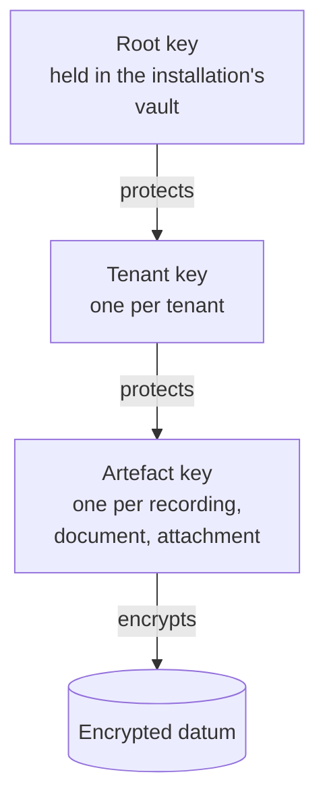

# Data protection

> **Reading prerequisite.** What encryption in transit and encryption at rest actually protect,
> why they are two controls against two different threats, what authenticated encryption means,
> why key management is the real problem and not an operational detail:
> [10 §12 - Cryptography and security, §§3, 4, 7](/10_fondamenti/12-crittografia-e-sicurezza.md).
> Here we describe the choices of this system, their limits, and the points where the datum is in
> the clear anyway.

## 1. Editorial rule: no invented cryptographic parameters

This chapter **does not contain** key lengths, cipher suite names, curves, validity periods or
strength thresholds. Not out of editorial caution: for a substantive reason, which has to be
stated because it is counter-intuitive.

A cryptographic parameter written into an architecture document has three defects. It **ages** -
the same choice that is state of the art today is weak in three years' time, and the document
remains. It **is not verifiable by the reader** - the reader has no way of knowing whether the
number comes from a recommendation or from the habits of whoever wrote it. It **competes with the
source** - if the document says one thing and the recommendation of the competent body says
another, the installation ends up with two obligations.

**Rule of the project.** Cryptographic parameters are **configuration**, not documentation, and
the default configuration aligns with the recommendations in force from the competent bodies: the
publications of the European telecommunications standardisation institute on cryptographic suites
for electronic signatures; the European mutual recognition arrangements on security evaluation;
the guidelines of the national agency for digital Italy and of the national cybersecurity agency.
**The precise reference to the current revision of each recommendation, with the exact citation and
date, has not been verified against a primary source in this draft: `[NV]`.** It must be
established before the compliance matrix is published, and established again every time the matrix
is reissued.

This rule also closes a communication point the project has already corrected: the reference to a
**United States** standard for the validation of cryptographic modules has been removed from the
public material (decision D19). It is not a requirement of the Union, it confers no presumption of
European conformity, and it is in tension with the data sovereignty positioning.

## 2. Encryption in transit

### 2.1 The obligation, which here is explicit

In this domain, the obligation to encrypt is not an inference from Article 32 of Regulation (EU)
2016/679. It is written down: the **Accordo Stato-Regioni del 17 dicembre 2020, rep. atti n.
215/CSR** (the State-Regions Agreement of 17 December 2020, act no. 215/CSR), setting out the
national indications for the provision of telemedicine services, provides that **all transfers of
voice, video, images and files must be encrypted**.

Four words, four categories. It follows that coverage must be **total and not selective**: it is
not enough to encrypt the media and leave in the clear the channel over which attachments are
exchanged, it is not enough to encrypt the session and leave the control channel in the clear.
Every channel that carries one of the four categories falls within the obligation.

Converging on the same point: the control on the protection of data in transit in the baseline
specifications of the national cybersecurity authority (code `PR.DS-02`) and the one on protected
communications reserved for essential entities (`PR.IR-03`) - the **precise content of those
requirements is not quoted here**, for the reason set out in
[08 §2](./08-quadro-normativo-e-misure.md); requirements R13, R24 and R36 of the appendix on
eligible security requirements of the national guidelines on security in ICT procurement, made
mandatory for regional telemedicine infrastructures by DM 21 settembre 2022 (the Ministerial
Decree of 21 September 2022); Annex I, Part I, of Regulation (EU) 2024/2847, which requires the
protection of confidentiality by means of state-of-the-art encryption in transit and at rest.

### 2.2 The channels and what protects them

| Channel | What it carries | Protection |
|---|---|---|
| Application interfaces and user interface | Clinical content, metadata, attachments | Encrypted transport only; **no channel exposed in the clear**, not even for redirection |
| Session signalling | Session descriptors, connectivity candidates, identifiers | Same channel as the application interfaces |
| Peer-to-peer media | Voice, video, session data | End-to-end encryption with material derived from the handshake ([05](./05-sicurezza-del-tempo-reale.md)) |
| Media through the relay | Already-encrypted packets | The relay forwards already-protected packets: **it does not decrypt them** ([05 §4](./05-sicurezza-del-tempo-reale.md)) |
| Outbound messages to the integrator | Identifiers and references, **never clinical content** (V-21) | Encrypted transport, **asymmetric signature** of the message (V-22) |
| Towards national and regional infrastructures | Documents and metadata | According to the infrastructure's profile, through the single egress broker |
| Between internal components | Everything | Encrypted transport inside the perimeter too: the internal network is not a trust boundary |
| Remote administration | Commands and configurations | Exclusively over secure channels, with named accounts and a second factor |

Two cross-cutting rules.

**Downgrade is prevented, not discouraged.** There is no supported configuration that accepts
unencrypted transport for a channel carrying one of the four categories. A configuration that
attempted it is rejected at start-up, not flagged as a warning.

**Verification of transport conformance is automated in continuous integration**, with a declared
threshold and with the release blocked below it. It is the only way an assertion about transport
stays true after the first library update.

### 2.3 The negotiated version is not declared: it is measured

**Constraint V-156.** The project **does not declare** in documentation which protocol version or
which cipher suite is in use on a session. **It measures them per session and records them.**

The reason is that part of the negotiation takes place between two ends the project does not
control - the patient's browser and the professional's - and whose behaviour depends on the
engine, the version, the configuration of the underlying cryptographic library and experimental
settings. The picture established in the project's verification research is that two engines out
of three negotiate by default the most recent version of the datagram transport protocol, while
for the third the state **is not verifiable**: `[NV]`. In these conditions **any static assertion
in documentation would be false for part of the installed base**.

Three requirements follow:

1. For every media session, the **protocol version actually negotiated** and the **cipher suite
   actually in use** are recorded, read from the statistics exposed by the engine, and kept among
   the session metadata.
2. The public material contains no static assertions about the version. It contains the verifiable
   assertion: «the negotiated version is measured and recorded for every session, and can be
   consulted».
3. A version negotiated below the minimum threshold configured by the tenant **produces an event**,
   and the session may be refused according to configuration. It is the only form of control that
   works on a parameter that is negotiated.

The same rule applies, for the same reason, to the transport of the application interfaces: what
was negotiated is measured and recorded, instead of declaring what one hopes for.

## 3. Encryption at rest

### 3.1 What it protects, and from whom

Encryption at rest protects against **theft of the medium** and against **access to the medium by
someone who does not go through the application**: the infrastructure operator, whoever gets hold
of a backup, whoever recovers a decommissioned disk.

**It does not protect against the application insider**, who is the primary adversary of this
system ([01 §3.1](./01-modello-di-minaccia.md)): the insider goes through the application, the
application holds the key, and the datum reaches them in the clear because that is how it must
work. Anyone who presents encryption at rest as the answer to improper access is describing their
own architecture badly. The answer to improper access is in chapter
[02 §9](./02-identita-e-accessi.md) and in chapter [04](./04-tracciamento.md).

### 3.2 The three levels and what each covers

| Level | What it covers | What it does not cover |
|---|---|---|
| **Volume or disk** | Physical theft of the medium, decommissioning without sanitisation | Everything that goes through the mounted operating system: if the machine is on, the datum is readable |
| **Database** | Access to the database files without going through the engine | Whoever has credentials on the engine |
| **Application, per artefact** | Access to the database engine and to the object store by someone who does not hold the application key | Whoever holds the application key |

The project prescribes the **first and the third** as mandatory for clinical data and for
recordings. The second is recommended and is, in many deployments, the deployer's responsibility.

The per-artefact application level is the one that carries the property that matters: **the keys
are per tenant**, and the key is **separable from the datum**. Two consequences follow:

- data leakage between tenants (threat M-11) would require not only an authorisation defect but
  also possession of the other tenant's key;
- **cryptographic erasure** becomes possible: destroying the key of an artefact makes the artefact
  unreadable wherever it is, **including in backups already taken**. It is the mechanism on which
  §7.3 rests.

### 3.3 What is encrypted at rest

Clinical content and documents; session recordings; attachments; the audit trail in its separate
retention; backups, **without exception**; the key material, held in a vault distinct from the
data it protects.

What must **not** be found in an encrypted archive because it must not exist at all: test data
that are real data; clinical content inside the application logs (V-150); clinical content inside
outbound messages (V-21).

## 4. Key management and rotation

The hierarchy has three levels, and is deliberately simple: **a complex hierarchy does not get
maintained**.

| Level | Who holds it | Rotation | Effect of rotation |
|---|---|---|---|
| Root key | The deployer, in their own vault | According to the deployer's policy | Re-encryption of the tenant keys only: negligible cost |
| Tenant key | The installation, per tenant | Scheduled and on event | Re-encryption of the artefact keys only: cost proportional to the number of artefacts, not to their volume |
| Artefact key | Generated when the artefact is created | **Does not rotate**: it is destroyed | Destruction is cryptographic erasure (§7.3) |

**Why this structure and not direct encryption with a tenant key.** Because rotating the tenant
key, in that scheme, would require reading and rewriting every video recording of the tenant: an
operation that, beyond a certain size, is never carried out, and a rotation that is never carried
out is not a rotation. With the three-level hierarchy it is keys that are re-encrypted, not
content.

**Events that require immediate rotation**, besides the scheduled one: suspected compromise;
termination of an engagement that had access to the material; decommissioning of a component that
held the key; a finding from a security assessment.

**Signing keys are a different matter.** The key with which the project signs distributed
artefacts and the key with which the installation signs outbound messages do not rotate by the
same mechanism, because their rotation requires the verifiers to acquire the new public key before
the old one ceases. It follows that the key identifier must be **resolvable from the public
material** (V-22) and that the two keys must be able to coexist during a declared overlap window.
A shared secret is not offered as the default mode: it gives no non-repudiation and its rotation
requires coordination with each integrator, which is to say it does not happen.

**Secrets do not live in the code, nor in the images, nor in the environment variables of a
version-controlled file.** Continuous integration runs secret scanning on every proposed change
and blocks integration on a match. A secret that has appeared in a version-controlled history is
**compromised**, and the procedure is rotation, not removal from the history: removal from the
history does not recover the copies already distributed.

**Losing the key is losing the datum.** Risk M-15 of the threat model - irreversible loss of key
material - is a risk to the **availability of health documentation**, and must be treated with the
same seriousness as compromise. A requirement follows that gets forgotten: the restore-from-backup
procedure must include the **restoration of the key material**, and the periodic restore test must
verify that the restored datum is actually **readable**, not merely present.

## 5. The honest inventory of the points in the clear

This section exists because its opposite - silence - is the most common form of technical
dishonesty in the documentation of communication systems. **A system that declares end-to-end
encryption and does not list the points where something is visible anyway is letting a property it
does not have be inferred.**

| Point | What it sees | What it does not see | Mitigation |
|---|---|---|---|
| **Session signalling** | Who takes part, when, for how long, with which tenant; the session descriptors and the connectivity candidates, **including local network addresses** | The audio-video content | Encrypted transport; **short retention** of the candidates; no candidate in diagnostic logs; declaration in the privacy notice |
| **Relay server** | **The network addresses of both parties**, the volume and pattern of the traffic, the duration of the allocation | The content: it forwards already-encrypted packets | Relay **operated by the deployer, within the Union**; no labelling of the metrics with the session identifier (V-155); short retention of the relay logs |
| **Recording component** (only in the mode with recording) | **Everything**: encryption terminates at the component | - | The mode is **distinct, declared in the consent and persistently indicated**: [05 §5](./05-sicurezza-del-tempo-reale.md) |
| **The two devices** | Everything the user sees and hears | - | Outside the project's control: **declared residual risk** ([01 §6](./01-modello-di-minaccia.md)) |
| **Database engine** | The application content that passes through it | What is encrypted at application level | Per-artefact encryption; separation of accounts; separate audit trail |
| **Single egress broker** | The destinations and the content of outbound requests | - | No clinical content (V-21); no patient identifier towards terminology (V-151); [06 §8](./06-sicurezza-applicativa.md) |
| **Observability and metrics** | What the application decides to send them | What the application does not send | **Prohibition** on clinical content and on direct identifiers in diagnostic logs (V-150) |

Two points deserve to be written out in full, because they are the ones that get softened.

**The relay sees the addresses of both parties.** This is not a vulnerability: it is what a relay
does. But a network address is personal data and, associated with the session, it helps reveal
where a person was while they were in a consultation. It is one of the reasons why the relay is
operated by the deployer and located within the Union: hosting it with a third party subject to a
non-European jurisdiction would be a transfer, as well as a dependency in tension with the
sovereignty constraint.

**End-to-end encryption does not survive an architecture with a concentrator.** In the
peer-to-peer model the property holds. If in the future a component were introduced that
recombines the streams for a multiparty session, the assertion «no intermediate decryption» would
become **false** unless an application-level media encryption independent of the transport were
adopted. It is a point of truthfulness in the public material: one does not write «end-to-end» for
an architecture that might not be so in every configuration.

## 6. Minimisation

Minimisation is not a generic virtue: here it is the **principal** defence towards third parties,
because it works **by absence of the datum** and does not depend on the third party's behaviour.

**The exemplary case: the external terminology service.** It is a third-party component at
runtime, not a build dependency. If it is established outside the Union, it becomes a transfer
**the moment it receives data referable to a patient**. Contractual defence would be fragile and
verifiable only after the fact; the architectural defence is definitive: **the queries never carry
patient identifiers** (constraint V-151). A query that asks «does code X exist in system Y» is not
a transfer of personal data, regardless of where the service answers from. **Sovereignty is
satisfied by absence of the datum, not by location.** A related consequence: **no cache persisted
to disk**, both for the licensing reason and because a persistent cache is an uninventoried
archive.

The other applications of the principle, each with its verification:

| Application | Rule | Verification |
|---|---|---|
| Demographic data | **Not duplicated**: work by reference, using the identifiers of the integrating party's domain | Inspection of the data model: absence of unnecessary demographic attributes |
| Outbound messages | They carry identifiers and references, **never clinical content**; the content is re-read with an authenticated call under the recipient's authorisation (V-21) | Inspection of the schemas of the published events |
| Diagnostic logs | No direct patient identifier, no clinical content (V-150) | Automated analysis of the logs of a test run against a dictionary of patterns |
| Infrastructure metrics | No label with the session identifier (V-155) | Inspection of the exporter's configuration |
| Attributes requested from the federation | Only those that are necessary, for the reason in §3.1 of [02](./02-identita-e-accessi.md) - which also has a price | Comparison between the attributes declared and those actually used |
| Biometric recognition | **Excluded by design.** The video stream contains the face but is not for that reason alone biometric data within the meaning of Article 4(14): the qualification requires specific technical processing aimed at unique identification. Introducing it would open a **second** route into Article 9 with autonomous requirements | The exclusion is documented, not implicit |
| Defaults | Recording **switched off**; minimum retention; opt-in telemetry; logs without clinical content | Test on the initial configuration |

## 7. Retention and erasure

### 7.1 Who decides for how long

**The project does not decide retention: it makes it configurable per tenant and per artefact
type.** The reason is that the periods have different sources and not all of them are general:
health documentation follows its own obligations, which vary by document type and in part by
regional rules; **the precise periods must be confirmed against the legislation applicable to the
individual customer**: `[NV]`.

The two periods the project **does impose** as a default, because they have a determinate source,
are the audit ones, and they are in [04 §5](./04-tracciamento.md): **24 months** for traceability
logs, **12 months** for access and authentication data (constraint V-152).

### 7.2 The session recording is a case of its own

It is not mandatory health documentation: it is **optional processing founded on explicit
consent**. Consequences follow that no other artefact has:

- retention must be **short and justified**. The project proposes a conservative and configurable
  default value; the value is a **product specification, never compliance** (constraint V-12);
- **consent is withdrawable as easily as it was given** (Article 7(3) of Regulation (EU) 2016/679)
  and **separate** from acceptance of the service: the prohibition on bundling in Article 7(4)
  rules out consent to recording being a condition for accessing the consultation;
- withdrawal makes **future** processing unlawful; but, the sole legal basis having fallen away,
  further retention is left without foundation and the right to erasure under Article 17(1)(b)
  arises. **The system therefore implements effective erasure on withdrawal**, not merely a halt;
- a consultation has **two** participants: the professional too is a data subject as regards their
  own image and voice. The consent model is bilateral, or else it rests on a distinct legal basis
  for the professional.

### 7.3 Deferred erasure from backups

This is the point where almost all documentation is vague, and the vagueness is a problem because
the question always comes up.

**Immediate erasure from a backup is not technically possible** without destroying the integrity of
the backup itself: a copy from which an element is selectively removed is no longer a consistent
copy and is no longer usable for restore. The accepted practice, when immediate erasure is
technically impossible, is **deferred erasure with a documented policy**. The project adopts it and
documents it explicitly instead of leaving it implicit:

1. Erasure in the live archive is **immediate and effective**, not logical: the datum is no longer
   readable or recoverable by the application.
2. The **artefact key is destroyed**. This makes the artefact unreadable **in the backups already
   taken too**, because the copy contains the ciphertext and not the key. It is the reason why the
   hierarchy in §4 has a per-artefact level: without it, this step would not be possible.
3. The backups **are not modified**. They leave the cycle on expiry, according to the declared
   retention period.
4. The window between the erasure and the exit from the cycle of the last copy that contained the
   ciphertext is **declared** to the data controller, with its actual value. It is not a detail: it
   is the information the controller must be able to report to the data subject.
5. If a copy is restored during that window, the restore procedure **re-applies the erasures that
   occurred in the meantime**. It is the step that gets forgotten, and without which the whole
   mechanism is theatre.
6. The outcome is **attested**: the erasure produces a row of the audit trail and a consultable
   attestation.

### 7.4 Suspension of erasure

There is a case in which erasure **must not** happen: when the artefact is the subject of a
challenge, an investigation or proceedings. It follows that every artefact has a **life cycle
state** - active, suspended, awaiting erasure, erased - and that the suspended state:

- **prevails** over the expiry of the retention period;
- is **justified and dated**, and its application is itself a row of the audit trail;
- has an **owner** and a periodic review: a suspension with neither expiry nor review is unlimited
  retention in disguise.

### 7.5 The data subject's rights applied to a recording

| Right | Application | Difficulty the project declares |
|---|---|---|
| Access (Art. 15) | A copy of the recording | **It contains a third party's data.** Article 15(4) provides that the right to obtain a copy shall not adversely affect the rights of others. Refusing access without an assessment is not permitted: it must be balanced. **No technical solution for selective redaction of video is trivial**: either it is designed, or the partial refusal is justified. The project declares it as a capability **not present** in v1.0 and provides the audio of the requesting party alone as an interim measure |
| Rectification (Art. 16) | You do not rectify a video | A statement by the data subject is attached to the session |
| Erasure (Art. 17) | On withdrawal of consent | §7.3: it must actually work, backups included |
| Restriction (Art. 18) | Freezing in the event of a challenge | §7.4 |
| Portability (Art. 20) | Applicable: processing founded on consent and automated | Export in a commonly used format, with the session metadata |
| Objection (Art. 21) | Not applicable to processing founded on consent | Relevant only for any processing based on legitimate interest |

**A derived requirement, and not a minor one**: every artefact - session, document, recording, row
of the audit trail - carries a **data subject identifier** and a **life cycle state**, and the
rights are **executable through an application interface**. The total integrability constraint is
therefore not just a product choice: it is the condition for the rights to be exercisable within
useful time.

## 8. What this area leaves open

| Reference | Question | To whom |
|---|---|---|
| `[NV]` | Citation and current revision of the European and national cryptographic recommendations to be cited in the compliance matrix (§1) | Compliance |
| `[NV]` | Applicable retention periods for health documentation, by document type and by regional rules (§7.1) | Domain, compliance |
| `[NV]` | Support status of the most recent version of the datagram transport protocol on the third engine (§2.3) | Empirical verification |
| - | Location of the key vault and its interface: a component of the installation itself or a service of the infrastructure (§4) | Architecture |
| Q-157 | Selective redaction of video for the purposes of the right of access: a capability to be designed or an exclusion to be justified (§7.5) | Functional, compliance |
