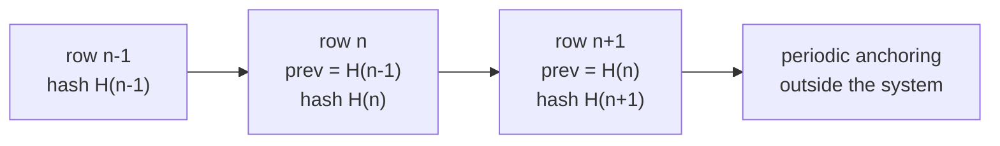

# Audit trail

> **Reading prerequisite.** What a hash chain is, why it binds the integrity of a sequence, what
> non-repudiation is and how it differs from integrity, and why an alterable log proves nothing:
> [10 §12 - Cryptography and security, §§1.5, 5.6, 9](/10_fondamenti/12-crittografia-e-sicurezza.md).
> Here we describe the concrete form of this system's audit trail, its content and its
> obligations.

## 1. What the audit trail must be able to demonstrate

The audit trail exists to answer, **to a third party who does not trust the person producing it**,
five questions:

1. **Who** performed the operation, with what identity and with what identity assurance.
2. **What** they did: which operation, on which object, with what outcome.
3. **When**, in an order that can be reconstructed across different components.
4. **On which subject**, when the operation concerns a person.
5. **That nobody has altered it** after writing, or that, if they have, it is detectable.

Point 5 is what distinguishes an audit trail from a list of events, and point 1 in its complete
form - «with what identity assurance» - is what links this chapter to chapter
[02 §4](./02-identita-e-accessi.md): an audit trail that says «authenticated at level 2» without
saying whether the level was **performed** or **reported** answers question 1 only in appearance.

The sources that require the audit trail converge from different directions and do not add the
same requirement. They must be kept distinct, because no single one of them is enough to justify
the cost:

| Source | What it adds |
|---|---|
| Article 32 of Regulation (EU) 2016/679 | Integrity and confidentiality, and the ability to **verify the effectiveness** of the measures |
| Project constraint [V-05](../11_registri/01-vincoli-in-vigore.md#v-05) | «Every access to health data is traced in a non-repudiable and non-alterable way» |
| Requirement R30 of the appendix on eligible security requirements of the national procurement guidelines | «User accesses must be recorded in a log **that cannot be deleted by a reset**» |
| Requirements R43 and R44 of the same appendix | **Timeline of events** in the event of an incident; **export in an open format by the following day** after the request |
| Measure ABSC 3.5.1 of the national minimum measures for public administrations | Integrity of the records |
| Measures `PR.PS-04` and `DE.CM-01` of the national authority's baseline specifications | Logging and **continuous monitoring with detection parameters** |
| DM 19 novembre 2025, Annex 4 (the Ministerial Decree of 19 November 2025) | The **retention periods**: 24 and 12 months |
| Article 25 of d.lgs. 4 settembre 2024, n. 138 (Legislative Decree no. 138 of 4 September 2024) | The audit trail is a **precondition** of the notification duty: with no timeline there is no notification within 72 hours |

## 2. Entity versioning is not an immutable audit trail

**Constraint [V-04](../11_registri/01-vincoli-in-vigore.md#v-04), and this section exists so that it is not forgotten.**

The versioning tool adopted for the domain model produces history tables alongside the
application tables. It is useful, and it is not what is needed here. Three differences, each
sufficient on its own:

**First.** Whoever has write privileges on the database can alter **the history tables too**, and
the alteration leaves no trace distinguishable from a legitimate write. The audit trail must be
non-alterable **by whoever administers the system that generates it**, otherwise it proves nothing
against the primary adversary of this system.

**Second.** Versioning records **how an entity changes**, not **who looked at it**. A consultation
modifies nothing and therefore produces no history row. But improper access to a clinical record
is, in the great majority of cases, **a read**. Versioning is blind on precisely the event that
counts.

**Third.** Versioning lives **in the same database** as the application data. It shares with it the
life cycle, the backups, the credentials, the fate in the event of compromise. Separate retention
is not a refinement: it is the condition for the compromise of the system not to entail the
compromise of the evidence.

| | Entity versioning | Immutable audit trail |
|---|---|---|
| Records reads | **No** | **Yes** |
| Alterable by the database administrator | **Yes** | No, or detectable |
| Retention | With the datum | **Separate** |
| Verifiable by a third party | No | **Yes** |
| Contains clinical content | Yes, by construction | **No** ([V-150](../11_registri/01-vincoli-in-vigore.md#v-150)) |
| Serves to | Reconstruct the state of an entity over time | **Demonstrate who did what** |

The two tools **coexist** and serve different purposes. Versioning remains, for rectification and
for reconstruction of state. It does not replace the audit trail and does not absorb its cost. And
it is, as the project's research found, **the single largest effort in the whole security
catalogue**: it must be planned as such.

## 3. What is recorded and what is not

### 3.1 The content of the row

The audit trail contains **who, what, when, on which subject, with what outcome, with what
identity assurance**. It does not contain what was read or written.

```json
{
  "id": "<opaque identifier of the row>",
  "seq": 1048576,
  "ts": "<instant in absolute format with declared offset and precision>",
  "tenant": "<tenant identifier>",
  "actor": {
    "sub": "<opaque identifier of the acting subject>",
    "role": "<role exercised at the time of the act>",
    "acr": "<authentication context level>",
    "auth_verified_by_project": true,
    "auth_channel": "<channel>",
    "act": "<identifier of the delegating party, if the act is by delegation>",
    "src": "<network address, according to the retention policy>"
  },
  "action": "<verb of the operation>",
  "object": {
    "type": "<resource type>",
    "ref": "<opaque reference to the resource>",
    "subject": "<opaque identifier of the patient concerned>"
  },
  "outcome": "<outcome>",
  "reason": "<justification, mandatory for emergency access>",
  "prev_hash": "<digest of the previous row>",
  "hash": "<digest of this row>"
}
```

Every row carries the **tenant identifier** (constraint [V4](../11_registri/03-vincoli-fondanti.md#v4) of the architectural baseline) and the
**outcome**: a rejected attempt is a row, not a silence. Rows with a negative outcome are often
more informative than positive ones, because they describe what somebody tried to do.

### 3.2 What is not recorded - constraint V-150

**The immutable audit trail and the application logs contain no clinical content. Diagnostic logs
carry no direct patient identifiers.**

| Forbidden | Why |
|---|---|
| The **content** read or written | The audit trail would become a second copy of the clinical archive, with a wider exposure surface and a retention governed by different rules |
| Request and response bodies in the application logs | The same reason, aggravated by the fact that logs end up in observability systems with weaker access controls |
| Direct patient identifiers in **diagnostic** logs | Diagnostic logs have a wider audience, they leave for support purposes, they end up attached to bug reports. The direct identifier must be replaced with an opaque reference resolvable only inside the perimeter |
| Credentials, tokens, keys, session values | A token in a log is a compromised token |
| The text of the emergency access justification in observability systems | The justification may contain clinical context. It belongs in the audit trail, not in the logs |
| Content of the session descriptors beyond the necessary window | They contain local network addresses ([03 §5](./03-protezione-dei-dati.md)) |

**The distinction between the three categories must be held firm**, because it is the most common
source of confusion:

| Category | Purpose | Retention | Content |
|---|---|---|---|
| **Immutable audit trail** | Demonstrate who did what | 24 months, separate | No clinical content, identifiers present |
| **Security logs** | Detect | According to the deployer's policy, exported to the correlation system | Security events, identifiers present |
| **Diagnostic logs** | Understand a malfunction | Short | **No direct patient identifier**, no content |

## 4. How it is built: hash chain and separate retention

### 4.1 The chain

Every row contains the digest of the previous row. Altering a row breaks the chain from that point
onwards, and the break is **detectable by recomputation**. It does not prevent the alteration: it
makes it **demonstrable**, which is what is needed.



Two limits to be declared, because a chain presented without them promises too much:

**The chain does not protect against wholesale rewriting.** Whoever controls the system can
recompute every digest from a given point onwards and produce a chain that is internally
consistent but different from the original. The defence is the **periodic anchoring** of a
cumulative digest to a point external to the system: a separate archive under different control, a
timestamp applied by a third party, a log under a different administration. After anchoring, the
rewritable interval is at most the one between two anchorings.

**The chain does not protect against omission at the source.** If an operation produces no row, the
chain stays consistent. The defence is not cryptographic: it is that **writing the row is on the
mandatory path of the operation**, not a side effect that can be switched off. An endpoint that can
return data without writing to the audit trail is a design defect, and the test that detects it is
a coverage test, not a cryptographic test.

### 4.2 Separate retention

The audit trail is **append-only** and retained **separately from the system that generates the
events**. Separately means, as a minimum:

- **distinct credentials**: the application accounts have the right to append and have no right to
  modify or delete;
- **distinct administration**: whoever administers the application database does not administer the
  audit trail;
- **distinct life cycle**: its own backups, its own retention, its own restore;
- **the ability to survive the compromise of the application**: if the application is compromised,
  the audit trail up to the moment of the compromise must remain valid.

**The concrete technical form is not decided by this area.** There are at least four options on the
table: an application-level hash chain on a dedicated store; append-only storage enforced by the
medium; write-once object storage with a retention lock; periodic signing with a timestamp. They
have different costs, guarantees and dependencies. This is **question [Q-150](../11_registri/02-questioni-aperte.md#q-150)** on the noticeboard,
addressed to architecture, and it must be closed with an architecture decision record.

## 5. Retention - constraint V-152

| Category | Period | Source |
|---|---|---|
| **Traceability logs** | **24 months** | DM 19 novembre 2025, Annex 4 |
| **Access and authentication data** | **12 months** | DM 19 novembre 2025, Annex 4 |

Three operational clarifications.

**The national authority's baseline specifications do not set a duration.** The Italian
telemedicine regime does. The composition rule follows: **the longest applicable period prevails**,
and for traceability logs the period is 24 months.

**The two periods are not the same period.** The record of accesses to health data is traceability;
the log of authentication events - successful and failed logins, logouts, account lockouts - is
access data. The default configuration keeps them distinct, and the deployer may lengthen them,
never shorten them below the period set by the source.

**Retention has a side that gets forgotten: deletion on expiry must actually happen.** An audit
trail kept beyond the period with no basis is itself processing without foundation. Deletion on
expiry is therefore a scheduled, verified operation and - with a symmetry that deserves attention -
**itself recorded**: the row attesting the deletion of the expired block outlives the block.

## 6. Export, clock and timeline

### 6.1 Export

The requirement has a precise source and a precise wording: the national guidelines on security in
ICT procurement, made mandatory for regional telemedicine infrastructures, provide that, on
request, the supplier deliver the **system logs in an open format by the day following** the
request (R44), and that for each incident it deliver **by the following day** a report describing
the type, the vulnerabilities exploited, the **timeline of events** and the countermeasures (R43).

Verifiable requirements follow, not aspirations:

1. **Export is an application interface function**, not a manual intervention by support. An
   operation that requires a person's intervention does not meet the next-day deadline on a real
   volume.
2. **Open format**: separated values or object notation, with a documented and versioned schema.
3. **Integrity digest of the exported package**, and a **signature**. The export must stand up in
   inspection and judicial proceedings: a file with no digest is a copy, not evidence.
4. **Reconstruction of the chronology** by session, by subject, by actor, by tenant, over an
   arbitrary time interval, with a deterministic order.
5. **Verification of performance on a representative volume**: the deadline is measured, not
   declared. An export test on a representative volume is part of the suite.

### 6.2 The clock

**The timeline of events cannot be reconstructed if the components' clocks diverge.** It is a
requirement that seems trivial and that, unverified, invalidates the entire export: two correlated
events that appear in reverse order make any reconstruction contestable.

Requirements:

- **all components synchronise their clock** with a common source, and the source is declared in
  the reference configuration;
- instants are recorded in **absolute form, with declared offset and precision**, never in local
  time without an offset;
- every row carries a **monotonic sequence number** within its own stream, because two events in
  the same millisecond must still have an order;
- **the maximum skew between components is measured**, with an alarm when the configured threshold
  is exceeded. A clock divergence is a security event, not an operational problem: it is the
  precondition for an undetectable alteration;
- instants the system **did not generate** - that of a measurement taken and reported by an external
  device, for example - are kept **distinct** from those generated by the system, and never
  overwritten with them.

## 7. The audit trail as a detection instrument

An audit trail that is consulted only after the incident has already failed half of its purpose.
The national authority says as much, in substance, when it links the incident type reserved for
essential entities - unauthorised access or access **with abuse of granted privileges** - to the
definition of **qualitative-quantitative parameters** under the continuous monitoring measure, and
offers two examples: a quantitative indicator, «the exceeding of a threshold for queries of a
database by a single user»; a qualitative indicator, «access by a system administrator outside
service hours».

**The audit trail must therefore be queryable by thresholds and by patterns, not merely
consultable.** It is a functional requirement, not an observability feature.

The indicators the project supplies as defaults - thresholds **configurable per tenant**, never
hard-coded:

| Indicator | Type | What it detects |
|---|---|---|
| Number of distinct subjects consulted by an actor per unit of time | Quantitative | Exploratory browsing; export disguised as consultation |
| Number of accesses to the **same** subject by the same actor | Quantitative | Repeated interest in one person: the typical pattern of improper access out of curiosity |
| Accesses **outside the time band** declared for the role | Qualitative | The authority's textual example |
| Accesses to subjects **with no care relationship**, ending with a negative outcome | Qualitative | Repeated attempts: they describe an intention even when they fail |
| Frequency of **emergency access** per actor | Mixed | Use of the exception path as the ordinary path ([02 §10](./02-identita-e-accessi.md)) |
| Bulk exports by actor and by volume | Quantitative | Exfiltration |
| Accesses from administrative accounts to clinical data | Qualitative | The system administrator has no clinical entitlement: any access of theirs to clinical data is by definition an anomaly |
| Changes to the security configuration | Qualitative | Switching off controls, changing thresholds, changing retention |
| Authentication failures above a threshold, by actor and by origin | Quantitative | Attempts with reused credentials |

**Security events are exported to the deployer's correlation system** in a standard format and in
push mode, without the deployer having to access the database. Detection belongs to the customer;
the product must make it possible without forcing them to read the application store.

**A threshold exceeded is not an incident.** It is evidence to be assessed, and its assessment is
part of the process in [10](./10-risposta-agli-incidenti.md). But it is the moment when the
notification period starts to run, because the period runs from the **acquisition of the
evidence**: a product that detects earlier does not shorten the period, it shortens the delay with
which the customer starts counting it.

## 8. Access to the audit trail itself

**Whoever consults the audit trail is performing an access to health data**: the row «patient X was
consulted by professional Y» is data concerning health
([01 §2.2](./01-modello-di-minaccia.md)). Four rules follow that are not formalities:

1. **Consultation of the audit trail is itself recorded**, with its own row: who consulted, which
   interval, with which filter, with which justification where one is required.
2. **Access to the audit trail is a distinct privilege** from system administration and from the
   clinical one. The system administrator has no entitlement to read the log of clinical accesses,
   and the professional has no entitlement to read anyone else's log.
3. **The data subject is entitled to know the accesses to their own data.** It is a product
   capability, exposed through an application interface and available to the deployer so that they
   can offer it to their patients. It is also the transparency measure with the greatest deterrent
   effect on the primary adversary.
4. **Export of the audit trail is a supervised act**: thresholds, justification, notification to the
   designated officer.

The recursion - consulting the audit trail produces a row of the audit trail, whose consultation
produces another row - **terminates** because consultation rows are not the object of ordinary
consultation: they are matter for periodic review, not for routine querying.

## 9. What the audit trail does not do

For symmetry with the honesty required in chapter [03 §5](./03-protezione-dei-dati.md):

- **it does not prevent improper access**: it makes it establishable after the fact and, with the
  detection of §7, it makes it establishable soon;
- **it does not prove intent**: it proves the act. Qualifying the act as improper requires the
  context, and is for the data controller;
- **it does not replace authorisation**: a system that logs everything and authorises badly
  produces excellent evidence of a malfunction;
- **it cannot be used as a backup clinical archive**, because by construction it contains no
  clinical content ([V-150](../11_registri/01-vincoli-in-vigore.md#v-150));
- **it is worth no more than its preservation**: an audit trail kept on a degrading medium or in a
  format that nobody will read twenty-four months from now is an audit trail that does not exist.
  The export format is open and documented for this reason too.

## 10. What this area leaves open

| Reference | Question | To whom |
|---|---|---|
| [Q-150](../11_registri/02-questioni-aperte.md#q-150) | **Architecture decision record on the immutable audit trail**: application-level hash chain, append-only storage, write-once object storage, or periodic signing with a timestamp (§4.2) | Architecture |
| [Q-152](../11_registri/02-questioni-aperte.md#q-152) | Expected service levels for the purposes of continuous monitoring, distinct from those set by the decree on regional infrastructures: the incident type based on service levels depends on values the customer defines, and the product must be able to measure them | Architecture, roadmap |
| [Q-158](../11_registri/02-questioni-aperte.md#q-158) | Point and periodicity of the external anchoring of the cumulative digest (§4.1) | Architecture |
| - | Default thresholds for the indicators of §7: they are a **product specification, never compliance** ([V-12](../11_registri/01-vincoli-in-vigore.md#v-12)), and must be tuned with the deployer | Functional |
