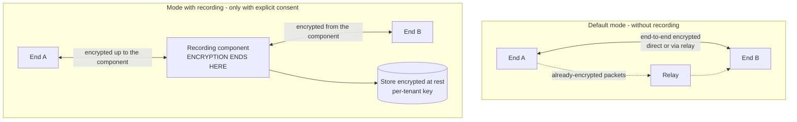

# Real-time security

> **Reading prerequisite.** Why a video call is a hard problem, and what network traversal,
> signalling, connectivity candidates, the relay and adaptive degradation are:
> [10 §08 - WebRTC from scratch](/10_fondamenti/08-webrtc-da-zero.md).
> Here only what concerns security is dealt with, and the rest is not repeated.

## 1. The scope of this chapter

Real-time media is the component in which the gap between what is declared and what happens is
easiest to create and hardest for the reader to verify. Three assertions current in the industry
are, taken literally, false or incomplete: that end-to-end encryption makes the session
inaccessible to anyone; that keys rotate during the session; that a list of forbidden addresses is
enough to stop the relay becoming a foothold towards the internal network. This chapter deals with
them one by one.

The project's public statements have already been reworded accordingly (decision D19):
«end-to-end encrypted, **routed directly when the network allows it**», «**cryptographic material
generated afresh for every session, with no reuse**», and the latency target as a **metric that is
measured, recorded and reported** instead of as a promise. This chapter is the technical
justification for those rewordings.

## 2. Media encryption, and what it does not do

### 2.1 The mechanism, in two lines

The cryptographic material for the media is not exchanged over the signalling channel: it is
**derived from a handshake conducted directly between the two ends**, over the media channel
itself. The signalling channel carries only the **fingerprints** of the ephemeral certificates
with which that handshake is authenticated. The property that matters follows: **the signalling
server does not hold the material with which the media is encrypted**, and cannot decrypt it even
if it wanted to - on condition that the fingerprints are the right ones, which is the subject of
§3.

### 2.2 There is no key rotation within the session

**This is an established fact of the protocol, not a choice of the project, and it has to be
written down because the opposite claim is widespread.**

The media keys are **extracted once only** from the exporter secret of the handshake, with a label
fixed by the standard. The key update mechanism provided by the most recent version of the
transport protocol **does not update that secret**: it updates the record layer keys, not the
exporter secret. The source is the standards body's working document dedicated to exactly this
problem, which in its own motivation states that the exporter secret «is static for the lifetime
of the connection and **is not updated by a standard key update**». That document exists
**precisely because** the problem is known, open and not yet standardised; it is implemented in no
engine.

Consequences to be written out in full:

1. **The term «per-session key rotation» must be removed from the public material.** The correct
   wording is that every session uses material generated afresh, with ephemeral per-connection
   certificates, and that **no reuse occurs between sessions**. That is true and verifiable.
2. **The absence of rotation within the session is not a cryptographic weakness.** The material
   lifetime limits laid down by the secure profile standard are orders of magnitude beyond what is
   reachable in a medical consultation. It is a feature that does not exist, not a feature that is
   missing.
3. **Forward secrecy between sessions remains**, because the material is new for every session.
   Forward secrecy **within** the session does not: whoever obtained the exporter secret could
   recompute all the exported material of that connection. That is the residual risk, and it is
   declared.

### 2.3 The negotiated version is not declared: it is measured

**Constraint V-156**, already stated in [03 §2.3](./03-protezione-dei-dati.md) and here applied to
the media.

The established picture: the cryptographic library of two of the three reference engines adopts as
its default maximum the **most recent version** of the datagram transport protocol; the third
engine enabled that version in an identified release; for the remaining one the state **is not
verifiable** against a primary source: `[NV]`. Fallback to the previous version stays active for
compatibility on all of them.

In these conditions **any static assertion would be false for part of the installed base**. The
project therefore:

- records, for every session, the **negotiated version** and the **secure profile suite actually
  in use**, read from the connection statistics;
- keeps these values among the session metadata, where they can be consulted and exported;
- emits an event when the negotiated value falls below the minimum threshold configured by the
  tenant, and may refuse the session according to configuration.

## 3. Key verification: why the short authentication string is mandatory

### 3.1 The problem it solves

Media encryption authenticates the handshake against the **fingerprints** carried by the
signalling. If someone controls the signalling channel, they can replace the fingerprints with
their own, establish two encrypted sessions - one with each party - and see everything. Each
session is encrypted, the property «nobody can decrypt the traffic» is true for each of the two,
and confidentiality is lost.

**End-to-end encryption, without independent key verification, rests on trust in the signalling
server.** That is not a cryptographic property: it is an organisational property in disguise. The
project's decision D19 adopted this by making the claim conditional on independent verification.

### 3.2 Why there is no standard alternative

The standard provides a dedicated interface for verifying the participants' identity by means of a
third-party identity provider. **It is not usable**, and the verification carried out by the
project established this against primary sources:

| Element established | Outcome |
|---|---|
| State of the specification | Stalled at Candidate Recommendation stage of **27 September 2018**. The move to the next stage, expected «not before 31 December 2018», **never happened** |
| Maintenance activity | **No substantive commit since 2021**: only editorial alignments and tooling updates |
| Implementation in the engines | Implemented **by a single engine**. Never implemented by the two largest. Present in a third engine up to the version based on its own old rendering engine and **removed** in the move to the shared engine |

The interface is therefore **functionally single-browser**. Key verification that relied on it
would work only when **both** participants - professional and patient - use the same engine. In a
service aimed at the public, where the patient uses the browser they have, that amounts to not
working.

There is a second argument, independent of the first and one that would hold even in a
hypothetical scenario of universal support: the interface would require a **third-party identity
provider** to host the mediating script. Introducing it would mean creating a new runtime
dependency on a third party - in direct tension with the sovereignty constraint - and **moving the
point of trust from the signalling server to the identity provider, without eliminating it**. It
is not an evidently superior solution: it is the same trust in a different place.

### 3.3 A requirement, not a recommendation

**The short authentication string is mandatory by default** (decision D22). A short code derived
from the certificate fingerprints, which the two parties compare **out loud** at the start of the
session. If it matches, there is no intermediary: because why would an intermediary produce the
same code with different fingerprints.

It is at once what makes end-to-end encryption **demonstrable** and a **traceable risk control**
under the standard on risk management for medical devices. The corresponding risk must be
classified as having no standard alternative mitigation: there is no other road.

**Accessibility requirements, binding** (decision D22 and cross-cutting constraint V6):

- **readable by a screen reader**: the code has an accessible textual representation, it is not an
  image;
- **never conveyed by colour alone**: the outcome of the verification is not communicated with a
  colour indicator;
- **understandable by an elderly or digitally unskilled person**: the code is short, pronounceable,
  and the instruction is in plain language;
- **a defined procedure in the event of a mismatch**: what to do, whom to alert, how to break off. A
  security control with no failure procedure is a control that, on the first failure, gets ignored;
- the outcome of the verification **cannot be re-themed or hidden** by whoever embeds the component
  (constraint V-23 of the integration area).

The outcome of the verification - performed, not performed, mismatched - is **recorded among the
session metadata**.

## 4. The relay server

### 4.1 The constraint, to the letter

**Constraint V-10: minimum version 4.17.2 and outbound network isolation as the primary defence.**

The minimum version is not a preference. Below it, known vulnerabilities verified against a public
database remain open: a 4.16.0 version remains exposed to defects of relay port pool exhaustion
and of allocation quota bypass; a 4.13.1 to an address comparison defect; a 4.9.0 to a critical
out-of-bounds write defect in the decoding of the authorisation token. The upstream project's
release cadence is itself a datum: **fourteen releases in a little over seven months**, five in the
month in which the verification was carried out. An operational obligation follows that is not
generic but **quantified**: the configuration and the list of vulnerabilities must be re-verified
at every minor version update, and the outcome recorded in the post-market surveillance file.

### 4.2 Why the list of forbidden addresses is not the primary defence

This is the counter-intuitive part, and it is the reason why constraint V-10 is worded the way it
is.

The peer denial directive is the defence everybody configures. **It has been bypassed four times in
eight months**, by canonicalisation and address comparison defects. The complete family of defects
of this type, established against the public vulnerability database and the upstream project's
advisories, counts **six distinct defects in eight years**:

| Mechanism | Fixed in |
|---|---|
| Insecure default configuration: relaying towards the loopback interface allowed by default | 4.5.0.9 |
| Degenerate destination address that bypasses the check | 4.5.2 |
| IPv4-mapped IPv6 address that bypasses **the explicit denial rules** | 4.9.0 |
| IPv4-mapped IPv6 address that bypasses **the default loopback protection**, a defect distinct from the previous one | 4.13.0 |
| Alternative IPv6 forms routable to IPv4 not normalised, on the stream-mode connection path | 4.13.1 |
| IPv6 address comparison component by component instead of numerically: a denial range **not aligned to a prefix** gets bypassed | 4.16.0 |

**Four of the last four are from the last eight months.** The point is not that the upstream
project is negligent - on the contrary, the fix cadence is fast. The point is **structural**: the
defence depends on the correctness of address parsing and normalisation, and that code has an
error surface that has repeatedly proven not to be exhausted.

**The only defence that has held against all six is outbound network isolation**, because it does
not depend on the correctness of the parsing.

### 4.3 The four counter-intuitive corollaries

They must be written out in full because they are exactly the points a reasonable configuration
gets wrong.

**First - the default behaviour is permissive, and there is no global denial switch.** The
upstream-documented rule is that, in the absence of a rule for an address, the address **is
allowed**. Deny-by-default does not exist as an option: it must be **built by enumerating the
ranges**. A forgotten denial directive means relaying allowed, not relaying denied.

**Second - the list of allowed addresses always prevails over the list of forbidden ones, and
therefore must not be used.** The documented rule is that, if an address appears in both, **it is
treated as allowed, regardless**. A single permissive line cancels any denial, however elaborate.
**In the healthcare profile the list of allowed addresses is not used**, and this must be written
into the reference configuration as a prohibition, not as a preference.

**Third - IPv6 ranges must be aligned to a prefix.** This is the mitigation stated in the advisory
for the comparison defect: the advisory recommends verbatim avoiding arbitrary boundaries and
relying on exact addresses or on prefix-aligned ranges, **enforcing the relay's egress
restrictions through external mechanisms**. That last part is the confirmation, from the upstream
source, of constraint V-10.

**Fourth - no co-located service, and the infrastructure metadata service must be unreachable.** No
database, no management agent listening on the loopback interface, no reachable infrastructure
metadata endpoint. It is the completion of the isolation: if there is nothing to reach, the
canonicalisation defect has no target. **The node's own public address** must be denied as well,
because without that line the relay can reach its own node's services via the public address
instead of the loopback interface, bypassing the entire protection logic.

### 4.4 The other controls on the relay

| Control | Reason |
|---|---|
| **Ephemeral credentials** with a short expiry, issued by the application service for the individual session | A long-lived credential on the relay is a free relaying service for anyone who obtains it |
| **Rotation of the shared secret without interruption**, made possible by the support for multiple secrets documented upstream | A secret that does not rotate because rotation requires downtime does not rotate |
| **A nonce signing secret consistent across all nodes** | From version 4.17.0 the nonce is computed with a key **generated per process**: without a shared secret, every request that lands on a different node costs the calling party a re-authentication round trip |
| **Administration interface disabled** | It has a record of stored script injection and of query language injection |
| **No redirection for automatic certificate management** | It has a record of memory disclosure **before authentication**. Certificate management is done outside the relay |
| **No relaying towards stream-mode destinations** | It is not needed for the media, and it is the path on which one of the bypasses occurred |
| **No session mobility feature** | Three defects in two months, including an allocation hijack; no benefit in a two-party session |
| **Rate limiting of unauthenticated responses** | Mitigates reflection and amplification with a spoofed source address |
| **Quotas per credential and per node, bandwidth limits per session** | They contain resource exhaustion. Watch the unit of measurement: the bandwidth directives are expressed in **bytes** per second despite their name, and they apply **per direction** |
| **Metrics endpoint bound to the management interface** | The default value is to listen on any interface: it must be restricted |

### 4.5 The abuse test

**A requirement, not a recommendation.** In continuous integration, with a valid credential, an
attempt is made to create a relaying permission towards: the loopback interface in direct form;
the same in IPv6-mapped form; the address of the infrastructure metadata service; a private network
address; **the node's own public address**; **an address inside an IPv6 range not aligned to a
prefix**. The build fails if any one of these receives a positive response.

The last two cases are the ones a suite written before the verification does not contain, and they
are exactly the two that correspond to the most recent defects. It is a **traceable risk control
measure** under the risk management standard, not just any regression test.

## 5. The mode with recording

### 5.1 The consequence, declared without softening

Recording happens **server-side**, to guarantee its reliability independently of the patient's
device and processing load (decision D23). An inescapable consequence follows:

> **When recording is active, encryption is terminated on the server and the session is NOT
> end-to-end encrypted.**

This is not an implementation detail to be hidden in a footnote: it is a **different property of
the session**, and for that reason the system has **two distinct modes**, not one mode with an
option.

### 5.2 The obligations that follow

All mandatory, all verifiable.

1. **The consent notice explicitly states that the session is no longer end-to-end encrypted.** Not
   «the recording is encrypted at rest» - which is true and is not the same information. The person
   must be able to understand that the property of the session has changed.
2. **Consent is explicit, separate, not pre-ticked, withdrawable as easily as it was given**, and it
   cannot be a condition for accessing the consultation (prohibition on bundling, Article 7(4)). The
   consultation goes ahead regardless: the recording is further processing, not necessary to the
   service.
3. **Consent is bilateral.** The professional too is a data subject as regards their own image and
   voice, and their legal basis may be different but must exist.
4. **The recording-in-progress indicator is persistent and cannot be hidden** for the whole
   duration. It cannot be re-themed or removed by whoever embeds the component (constraint V-23 of
   the integration area). It is readable by a screen reader and is not conveyed by colour alone.
5. **The switch between the two modes is traced in the audit trail**, with the instant, the actor
   and the reference to the consent.
6. **The file is encrypted at rest with a tenant key**, retention is configurable and withdrawal
   produces effective erasure ([03 §7](./03-protezione-dei-dati.md)).
7. **The container is negotiated at runtime, never assumed** (constraint V-11). The established
   picture is that neither of the two widespread containers is universal: the first is supported by
   two engines out of three, the second by the third and - only from a recent version - by one of
   the others too. The actual container is **recorded among the recording's metadata**, as is done
   for the cipher suite. The correct public claim is «recording in a standard container, negotiated
   with the browser and recorded in the metadata, encrypted at rest»: verifiable.
8. **No server-side container re-conversion is performed** as a fallback, because it would
   contradict the logic of the whole chain.

### 5.3 What recording is not

It is not a security control. It is **further processing with a risk of its own**, and the
cost-benefit analysis must be done every time: a retained recording is one more exposure surface,
and it also has a documentable **chilling effect** on the consultation when the patient suspects
it. In the default mode it is **switched off**, and that is the correct choice.

## 6. Degradation

**Audio before video, always.** It is a rule of the architectural baseline and it has a clinical
safety justification before a user experience one: in a consultation, audio carries almost all the
clinically usable information, and a session that degrades by dropping the audio in order to keep
the video is a session that has lost the service while keeping up appearances.

Requirements that follow:

- degradation is **announced** to the user in plain language, not silently endured;
- the event of degradation beyond a threshold is **recorded** among the session metadata, and is
  available for inclusion in the clinical document with the professional's explicit confirmation;
- there is a **declared fallback** - the telephone channel - and the procedure is known to the
  patient before the session, not communicated during the fault;
- interruption of the session is a **recorded outcome**, not an absence of data: constraint V-09
  applies here too.

## 7. Metrics and observability

**Constraint V-155: no infrastructure metric of the relay may be labelled with the session
identifier.**

The reason is in the metadata table of [01 §2.2](./01-modello-di-minaccia.md). The relay's
ephemeral credential contains, by construction, the opaque session identifier. The relay offers an
option to label the traffic metrics with the credential's username. Turning it on would (a) blow
up the cardinality of the series, and (b) **transfer a clinical session identifier into the
infrastructure metrics system**, breaking the separation between the infrastructure plane - which
does not process personal data - and the session statistics plane, which fully does. **Not turning
it on is a minimisation requirement, not a configuration preference.**

Three operational observations that follow from the verification of the metrics actually exposed:

1. **The traffic metrics count only completed sessions.** There is no byte counter for a session in
   progress: a representation of traffic built on them shows step changes when sessions end, not a
   flow. Instantaneous traffic must be derived from the per-packet counters.
2. **The only state metric is the number of current allocations.** It is the one on which the
   saturation alarm is built.
3. **There is no metric for denied permissions.** The attack signal that matters - a spike of
   rejected permission requests, which is a scan of the internal network - **cannot be derived from
   the metrics** and must be extracted from the relay's logs. It is a substantial correction to the
   project's initial assumption, and it determines the form of the alarm rule: it is built on the
   logs, not on the time series.

Client-side session statistics - latency, loss, jitter, bandwidth - belong to the perimeter of
personal data, are associated with the session and hence with the patient, and follow the retention
and access rules of the other session metadata. **They are not mixed with the infrastructure
metrics**: they are two stores with two regimes.

## 8. What this area leaves open

| Reference | Question | To whom |
|---|---|---|
| Q-08 | Confirmation of the two-mode solution and of its effects on the data model | Architecture |
| `[NV]` | Support status of the most recent version of the datagram transport protocol on the engine for which it has not been established (§2.3) | Empirical verification |
| `[NV]` | Digest algorithm underlying the computation of the relay's ephemeral credentials: the upstream documentation writes generically «hmac». It must be **verified empirically** with an integration test against the version actually distributed, which is more solid than any documentary citation | Technical |
| `[NV]` | Support for prefix notation in the denial directives: not verified upstream, so the reference configuration uses exclusively the range form, which is documented (§4.3) | Technical |
| - | Minimum negotiated protocol version threshold below which the session is refused: it is a **product specification, never compliance** (V-12) | Functional |
