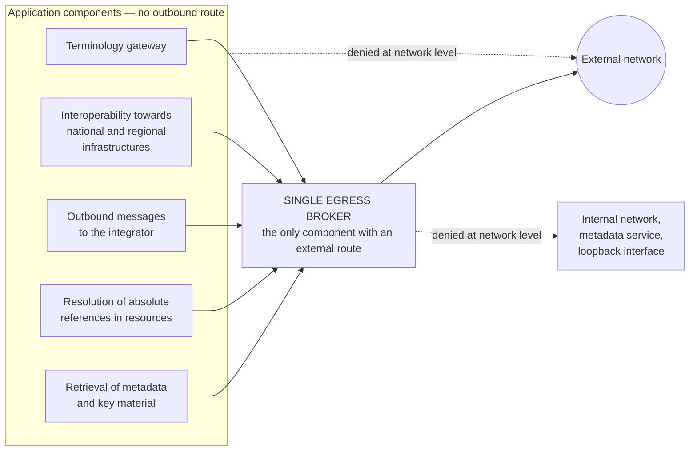

# Application security

> **Reading prerequisite.** The protocols referred to in this chapter — authorisation code grant
> with proof of possession of the verifier, HTTP message signatures, body digest, problem details —
> are described in [10 §13 — The protocols](../10_fondamenti/13-protocolli.md). Here we describe
> what the system does with them, and the rules that hold irrespective of the protocol.

## 1. The principle that governs the chapter

**Every control that counts is executed by the receiving side.** The browser is an untrusted zone,
the professional's too; the integrator's system is an untrusted zone, even when it is a
contractual partner; the internal network is not a trust boundary. Client-side controls are
ergonomics — they spare the user from discovering the error after filling in a form — and have no
security value whatsoever.

The second principle, which underpins §8: **a defence that depends on the correctness of code
repeated in many places fails in the place that was forgotten.** Where possible, the defence must
be moved from a coding rule to an architectural constraint that nobody can forget, because it does
not pass through anyone's diligence.

## 2. Validation at the boundaries

The boundaries are those of [01 §4](./01-modello-di-minaccia.md). At each one, validation is
**declarative and schema-based**, not imperative: the permitted form is declared and whatever does
not match it is refused, instead of searching for what is dangerous.

The difference is substantive and must be written down: a list of what is forbidden is always
incomplete — it is the same structural reason why the relay's list of forbidden addresses was
bypassed four times ([05 §4.2](./05-sicurezza-del-tempo-reale.md)). A list of what is permitted is
complete by construction.

| Aspect | Rule |
|---|---|
| **Shape of the body** | Validation against a published and versioned schema. Unexpected fields: **refused**, not ignored. A silently ignored field is a field somebody will use |
| **Size** | A limit per entry point, applied **before** parsing, not after |
| **Depth and cardinality** | A limit on nesting depth and on the number of elements in collections. It is the defence against resource exhaustion by pathological structure |
| **Types and domains** | Every identifier carries its own **explicit assigning authority**. No external identifier is a primary key |
| **Encoding** | Normalisation of the character encoding **once only, on input**, before any comparison. Double normalisations and late normalisations are the structural cause of the family of bypasses described in §8 |
| **References** | A reference to a resource is **resolved and authorised**, never dereferenced just because the caller supplied it. See §8 for absolute references |
| **Error outcome** | A uniform representation of errors with a stable problem type identifier; **no internal detail** in the message: no stack trace, no query fragment, no file path |

**Rule on error messages that holds throughout the system.** An error addressed to the end user is
comprehensible and not diagnostic; an error addressed to the integrator is diagnostic and not
revealing; the full detail lives in the application log, correlated to the error by an opaque
identifier that the caller receives and can quote to support. It is also a clinical usability
requirement: a professional under time pressure must not have to interpret a code.

## 3. Sessions, tokens and headers

| Element | Rule |
|---|---|
| **Authorisation of the interactive application** | Code flow with proof of possession of the verifier, mandatory; state parameter with adequate entropy; no token in the URL |
| **Session entry token** | **Single-use, very short expiry, issued over a back channel**, never transiting through the URL. It is the independent fallback provided for by decision D18 |
| **Session duration** | Configurable per tenant. The trade-off between a long session and a short one is managed with **re-authentication on sensitive operations**, not with an aggressive expiry which, in the middle of a consultation, is a clinical event |
| **Session cookies**, where used | Marked as not accessible to scripts, transmitted only over an encrypted channel, with a restrictive policy on the originating context |
| **Cross-site request forgery** | Neutralised by the originating-context policy **and** by a second independent mechanism on state-changing operations: two defences, because the first depends on the browser's behaviour |
| **Cross-origin resource sharing** | A **closed** list of origins, per tenant, from the **same trust registry** as [02 §6.2](./02-identita-e-accessi.md). No wildcard, in any supported configuration |
| **Embedding** | Allowed only to the origins on the list. The embeddable component communicates with the host container while **always** verifying the origin of the incoming message: a component that accepts messages from any origin is a component scriptable by any page |
| **Response headers** | Restrictive policy on executable content and **with no inline sources**; prohibition on type sniffing; referrer control; permissions policy for device interfaces limited to what is needed — and in this system the camera and the microphone are needed, and must be granted over the smallest perimeter |
| **Storage in the browser** | No clinical content in the browser's persistent storage. Content lives in the session and does not outlive it |

**On the embeddable component, a note that carries security weight and not just product weight.**
The recording-in-progress indicator, warnings and consent texts, the outcome of key verification,
clinical error messages and the encryption status indicator **cannot be re-themed or hidden**
(constraint V-23 of the integration area). The permitted theming properties are a closed and
versioned set, validated by the receiving side with a contrast check, and a configuration that
degrades accessibility **is rejected on save**, not flagged as a warning. No injection of arbitrary
style sheets from outside: an arbitrary style sheet can hide a mandatory indicator, and hiding the
recording indicator is a breach, not an aesthetic defect.

## 4. Injections

The category is not one: they are different families with different defences, and treating them as
one is how some of them get forgotten.

| Family | Structural defence | What is not a defence |
|---|---|---|
| **Database query language** | Parameterised statements, always. No string concatenation with input data, anywhere, not even in administrative code | Escaping special characters |
| **Executable content in the browser** | **Context-aware** encoding at output, performed by the presentation engine and not by hand; policy on executable content as the second defence | Input sanitisation, which does not know the output context |
| **System commands** | No invocation of a shell with input data. If an external component is unavoidable, invocation with separate arguments and never with a composed command line | Escaping the arguments |
| **File paths** | The name supplied from outside **is never a path**: it is a key towards an identifier generated by the system. The path is not composed from input data | Path normalisation |
| **Structured documents with external entities** | External entity resolution **switched off** in all parsers, with automated verification of the configuration. It is relevant here because the domain uses document serialisations | Checking the content |
| **Deserialisation** | No deserialisation of arbitrary object graphs from an untrusted source. Data formats, not object formats |
| **Templates and expressions** | No evaluation of externally supplied expressions, in any template engine, in any configurable rule. It is the point at which a customisation feature becomes code execution |
| **Logging** | No interpolation of input data into the format of the log message: the datum is an argument, not part of the format |
| **Requests towards internal resources** | **§8**: the defence is not one of encoding, it is architectural |

**Cross-cutting rule.** Each of these defences is verified by a dedicated automated test that
attempts the corresponding attack, and the static analysis, dynamic analysis and dependency
analysis suite runs on every proposed change, blocking when the thresholds are exceeded
([07 §5](./07-catena-di-fornitura.md)).

## 5. Object-level authorisation

### 5.1 The most common defect, and why it is more serious here

The error consists in verifying that the caller may perform a **type** of operation without
verifying that they may perform it on **that specific object**. An authenticated professional, with
the correct role, who substitutes one identifier for another and obtains another person's document.

In a multi-tenant system the error has a second, worse form: the same substitution across the
tenant boundary. The first case exposes one person; the second exposes an archive.

### 5.2 The rules

1. **The tenant context is resolved at the boundary and verified at the boundary of every
   application context.** No query without a resolved tenant: it is not a convention, it is an
   invariant enforced at the persistence layer.
2. **Isolation between tenants is enforced at the persistence layer** — a dedicated schema with
   row-level security as defence in depth — **and not only in the application**. An application
   defect must not be able to cross the boundary.
3. **Object-level authorisation is founded on the care relationship**, not on the role alone
   ([02 §9](./02-identita-e-accessi.md)).
4. **The identifiers exposed are opaque and unguessable**, and this **is not** an authorisation
   control: it is a control that reduces noise. Authorisation must be verified anyway.
5. **The response for an object that exists but is not authorised is indistinguishable from the
   response for a non-existent object** where the distinction would reveal existence. It is a
   choice with a diagnosability cost, declared and consistent across all interfaces.

### 5.3 The negative cross-tenant test on every entry point

**A requirement, without exceptions.** For **every** entry point of **every** interface there is an
automated test that, with a valid identity of tenant A, attempts access to an object of tenant B
and **verifies the refusal**.

Three clarifications that determine whether the requirement is real or decorative:

- **Coverage is verified automatically.** A check in continuous integration compares the list of
  entry points declared in the interface document with the list of those covered by negative tests,
  and fails if the difference is not empty. Without this check, the requirement degrades within a
  few months: new entry points do not get covered.
- **The test is negative, not positive.** Verifying that tenant A can access its own objects proves
  nothing about isolation.
- **The test covers the non-obvious paths too**: filtered searches, exports, references embedded in
  resources, administrative entry points, event subscription channels. The defect hides in the
  paths nobody considers an entry point.

The same test, in analogous form, verifies the absence of **privilege escalation**: that an
identity with an ordinary role cannot perform administrative operations, and that an administrative
identity does not obtain access to clinical content ([04 §7](./04-tracciamento.md)).

## 6. File upload and download

File upload is, in this domain, a clinical function: attachments, images, documents. The rules:

| Rule | Reason |
|---|---|
| **Type determined from the content**, not from the extension nor from the caller's declaration | The declaration is the caller's, and the caller is an untrusted zone |
| **A closed list of permitted types** per context of use | A list of forbidden types is incomplete by construction |
| **Size limit applied while streaming**, before materialisation | A limit applied after writing to disk does not protect against disk exhaustion |
| **The file name is never used as a path**, never returned without normalisation | §4 |
| **Storage outside the served path**, with download mediated by the application | An uploaded file that is directly reachable is a file served without authorisation |
| **Download with a system-declared type and content disposition as an attachment** where the type is not one for safe display | Prevents execution in the context of the application's origin |
| **Anti-malware scanning on the upload path** | It is the deployer's requirement, but the product must **provide the hook point** and behave in a defined way when the scan is unavailable: refusal, not silent acceptance |
| **No file content in the logs** | Constraint V-150 |
| **Structured documents parsed with external entity resolution switched off** | §4 |
| **Compressed archives**: a limit on the expansion ratio and on the number of entries | Defence against pathological expansion |

The uploaded file is **encrypted at rest with an artefact key** and follows the life cycle of the
other artefacts, suspension state included ([03 §7](./03-protezione-dei-dati.md)).

## 7. Rate limiting and resilience

Rate limiting has two purposes that must be kept distinct because they require different
configurations: **protecting availability** and **slowing down abuse**.

| Dimension | Rule |
|---|---|
| **Per actor** | The defence against abuse is by identity, not by address: the insider has a legitimate address |
| **Per tenant** | One tenant must not be able to exhaust the resources of the others. It is the multi-tenant form of the problem |
| **Per entry point** | Costly operations — exports, broad searches, document generation — have their own, much tighter, limits |
| **Per sensitive operation** | Authentication, credential recovery request, emergency access: tight thresholds and **every breach is a security event**, not just a refusal |
| **Communicating the limit** | Rate limit headers in the current form, not in the superseded three-header form (correction C-03) |
| **Controlled degradation** | Under pressure the system degrades in a declared manner and preserves the priority clinical path. A system that collapses uniformly has treated the clinical session in progress as just another request |
| **Idempotency** | State-changing operations are idempotent with an explicit key, so that a caller's retry does not produce duplicates. The idempotency key is not a standard today: it must be documented as a project convention (correction C-02) |

A threshold that is too low on a public service is a zero-cost denial of service for the attacker;
a threshold that is too high does not protect. **The thresholds are tenant configuration, they are
a product specification and never compliance** (constraint V-12), and they are observable: the
deployer must be able to tune them against real data.

## 8. The single egress broker

### 8.1 The principle

**Constraint V-157, and the answer to question Q-16.**

> **No application component opens connections towards destinations derived from an inbound datum.
> Only the broker has a route to the outside; for the others, egress is denied at network level.**

It is an **architectural requirement, not a coding rule**. The difference is the whole point: a
coding rule has to be observed at every egress point, present and future, by every person who
writes code, forever. A network constraint does not depend on anyone's diligence. The reason this
distinction is decisive is documented elsewhere in this area: the relay's list of forbidden
addresses, which is the same defence in the form of a rule, **was bypassed four times in eight
months** by canonicalisation defects ([05 §4.2](./05-sicurezza-del-tempo-reale.md)). A defence that
depends on the correctness of address parsing is not reliable; a defence that denies the route is.

### 8.2 What the broker applies, in order

The order matters: two of the four checks are ineffective if applied in the wrong sequence.

1. **Name resolution once only, and connection to the already-resolved address.** It eliminates
   rebinding between the moment of the check and the moment of use, which is the form of bypass
   that defeats any name-based verification. Verifying the name and then letting the network library
   resolve it again means verifying one thing and using another.
2. **Verification of the resolved address** against: the loopback interface; private address spaces;
   link-local addresses; **the address of the infrastructure metadata service**; **the node's own
   public address**; IPv4-mapped IPv6 addresses; transition prefixes; multicast and broadcast. The
   comparison is on the **normalised** form, and the ranges are **prefix-aligned** — this is the
   mitigation stated in the advisory for the component-by-component comparison defect described in
   [05 §4.3](./05-sicurezza-del-tempo-reale.md).
3. **Prohibition on following redirections that are not re-verified.** A redirection is a new
   destination: either the whole verification is repeated on the destination address, or it is not
   followed. Following a redirection without re-verification cancels the two previous steps in one
   stroke, and it is the most frequent error.
4. **Closed lists** for scheme, port, maximum response size, maximum time, maximum number of hops. A
   closed list of schemes excludes by construction the families of schemes that are not network
   transport and that are the classic vector for this category of attack.

To these is added, for the egress points that provide for it, the **per-tenant allow-list of
destinations**, fed by the **same trust registry** as [02 §6.2](./02-identita-e-accessi.md). It is
the point at which the «one registry only» rule stops being a tidiness preference and becomes a
security control: an origin removed from the federation list and not from the broker's would remain
reachable.

### 8.3 The five egress points that converge on it

| Egress point | What goes out | Specific constraint |
|---|---|---|
| **Terminology gateway** | Queries about codes and code systems | **No patient identifier** (V-151); no cache persisted to disk |
| **Interoperability towards national and regional infrastructures** | Documents and metadata according to the infrastructure's profile | Destinations from a closed list, configured by the deployer |
| **Outbound messages to the integrator** | Identifiers and references | **No clinical content** (V-21); **asymmetric signature** with a resolvable key identifier (V-22); destinations from the tenant's trust registry |
| **Resolution of absolute references in resources** | Requests towards addresses contained in the received datum: a reference, an attachment, the full identifier of a collection entry | **It is the most dangerous point**, because the destination is **literally written by the caller**. It goes through the broker like all the others, and in addition automatic resolution is **switched off by default** |
| **Retrieval of metadata and public key material** | Requests towards the key publication addresses of the admitted issuers | Addresses from the **trust registry**, never from the token being verified: a token that says where to fetch the key to verify it with is a token that validates itself |

**The relay is not among these, and must not be.** The relay forwards transport packets towards a
destination chosen by the client: it makes no application requests, it has no application layer on
which to apply any of these four checks, and its defence is of a different nature — the outbound
network isolation of constraint V-10, dealt with in
[05 §4](./05-sicurezza-del-tempo-reale.md). Confusing them would produce a bad design of both.

### 8.4 A single abuse test suite

Since the point of application is a single one, **the test suite is a single one** and it is run
against the broker. It covers: the loopback interface in all its forms, including the IPv6-mapped
ones; the address of the infrastructure metadata service; private network addresses; the node's
public address; names that resolve to internal addresses; names whose resolution changes between
two consecutive queries; redirection towards an internal address; disallowed schemes; disallowed
ports; a response beyond the maximum size; a response that does not finish within the maximum time;
a chain of redirections beyond the maximum number of hops; an address inside an IPv6 range not
aligned to a prefix.

**This is the entire cost of the defence**: one suite instead of five, and no possibility that a new
egress point skips it, because a new egress point has no route.

### 8.5 Consequences for the deployer

The constraint is architectural, so it has a part the deployer must implement and that the project
cannot implement on their behalf:

- **the network rules that deny egress to the application components** are installation
  configuration. The project documents them in the reference configuration and **checks them at
  start-up** where technically possible, emitting an explicit warning if the component discovers
  that it has a route to the outside;
- **the reachability of the infrastructure metadata service** depends on the platform being
  installed on, and must be denied or made unexploitable;
- **the list of permitted destinations** for national and regional infrastructures is installation
  configuration, because it varies by region and by profile.

All of it converges on the table in [09](./09-ripartizione-delle-responsabilita.md).

## 9. What this area leaves open

| Reference | Question | To whom |
|---|---|---|
| Q-16 | **Closed by this area** with §8: protection against requests directed at internal resources is implemented **once only** in a shared component, as an architectural requirement with route denial at network level, and not repeated at every egress point | — |
| Q-156 | Concrete form of the single trust registry, which also feeds the broker's allow-list (§8.2) | Architecture |
| — | Placement of the broker: a standalone component or a function of an existing edge component. This area fixes its behaviour, not its placement | Architecture |
| — | Default rate limiting thresholds (§7): a product specification, never compliance | Functional |
