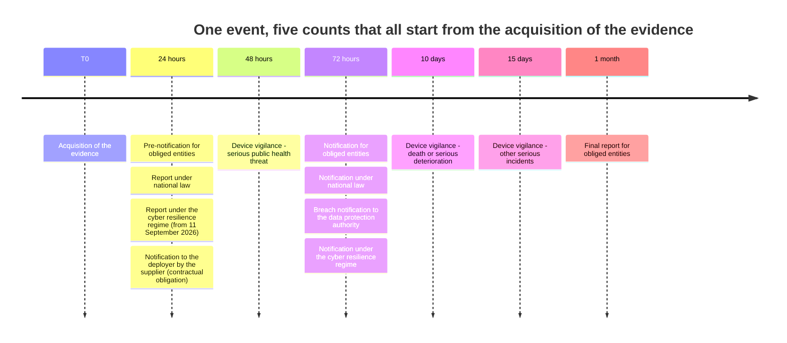
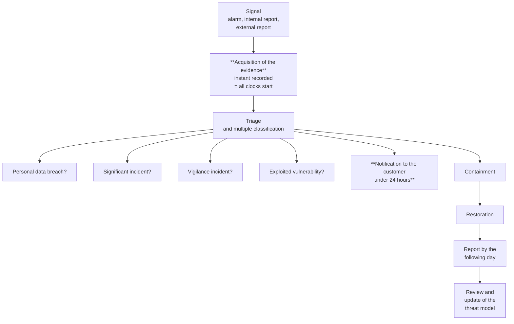

# Incident response

> **Reading prerequisite.** The regulatory framework of each regime is in
> [08](./08-quadro-normativo-e-misure.md); the technical capabilities for logging, exporting and
> detecting on which this chapter relies are in [04](./04-tracciamento.md).
>
> **Warning.** Technical analysis, not legal advice. Qualifying an event as a notifiable incident,
> in each of the regimes described, is for the obliged entity and must be done with the support of
> a qualified professional.

## 1. Why this chapter exists in this form

An incident on a healthcare platform can trigger **simultaneously** notification duties belonging
to different regimes, with different recipients, different deadlines, different content and
different obliged entities. They are separate clocks: **they start at different moments, run at
different speeds and do not stop for one another.**

The error this chapter exists to prevent is not forgetting a notification: it is **confusing two of
them**. Someone who believes that «notify within 72 hours» is a single rule concludes that, having
notified the data protection authority, they have discharged the duty; and they have in fact missed
a 24-hour pre-notification to another recipient, which had already expired.

A single operating manual that orchestrates the clocks is therefore a concrete deliverable, and it
is this chapter.

## 2. The four clocks - and the fifth

### 2.1 Clock 1 - Personal data breach

| | |
|---|---|
| **Recipient** | The supervisory authority for data protection |
| **Obliged entity** | The **data controller**, which is the deployer |
| **Deadline** | «Without undue delay and, where feasible, **not later than 72 hours**» after having become aware of it (Article 33(1) of Regulation (EU) 2016/679) |
| **Exception** | Unless the breach is unlikely to result in a risk to rights and freedoms |
| **Towards the data subject** | Communication when the breach is likely to result in a **high risk** (Article 34). Article 34(3)(a) provides that communication is not required where the controller has implemented measures that render the data **unintelligible to any person who is not authorised**, and it expressly cites encryption |

**The point that concerns the supplier, and it must be written without softening.** Article 33(2)
provides that **the data processor shall notify the controller without undue delay** after becoming
aware of the breach. **There is no 72-hour threshold for the processor**: the 72-hour threshold is
the controller's, towards the authority, and it runs from the moment **the controller** became
aware.

It follows that, if the supplier alerts the customer at the seventieth hour, the customer has no
formal delay - their clock starts at that moment - but has lost any possibility of preparing a
useful notification, and the supplier has in all likelihood breached its own duty to inform
«without undue delay». **The data processing agreement must therefore set a concrete contractual
deadline and a channel**: the project adopts **under 24 hours**, and **immediately** for
high-severity incidents (§4).

### 2.2 Clock 2 - Incidents affecting entities obliged under the network security rules

| | |
|---|---|
| **Recipient** | The national computer security incident response body |
| **Obliged entity** | The essential or important entity, which is the deployer |
| **Deadlines** | **Pre-notification within 24 hours**, **notification within 72 hours**, **final report within one month** (Article 25 of d.lgs. 4 settembre 2024, n. 138) |
| **Start** | From the **acquisition of the evidence** of the significant incident (§3) |
| **Taxonomy** | Three types for important entities, **four** for essential ones |

The four types of baseline significant incident are built on three elements - **condition**,
**compromise**, **object of the compromise** - and are, in summary:

| Type | Compromise | Object | Important | Essential |
|---|---|---|:-:|:-:|
| 1 | Loss of **confidentiality** towards the outside | Digital data | ● | ● |
| 2 | Loss of **integrity** with an impact towards the outside | Digital data | ● | ● |
| 3 | Breach of the **expected service levels** | Services and activities | ● | ● |
| 4 | **Unauthorised access or access with abuse of granted privileges** | Digital data | - | ● |

The fourth is the one that concerns the primary adversary of this system
([01 §3.1](./01-modello-di-minaccia.md)), and it is the reason why the detection described in
[04 §7](./04-tracciamento.md) is not observability but a **functional requirement**.

A clarification from the authority that directly concerns the supplier in managed-service mode: the
object of the compromise may also consist of «digital data over which the entity exercises control,
including partial control», a category that expressly includes data it does not own but for the
processing of which it has a responsibility under contract - that is to say, **exactly the position
of whoever manages a customer's systems**.

### 2.3 Clock 3 - The duty on health authorities under national law

| | |
|---|---|
| **Recipient** | The national cybersecurity authority |
| **Obliged entity** | Central government bodies, regions, metropolitan cities, municipalities above the size threshold or provincial capitals, **local health authorities**, public transport companies |
| **Deadlines** | **Report** «without delay and in any case within a maximum period of twenty-four hours» from becoming aware; **full notification within 72 hours** (Article 1 of legge 28 giugno 2024, n. 90, Law no. 90 of 28 June 2024) |
| **Penalty** | In the event of repetition within five years, an administrative fine **from €25,000 to €125,000** and disciplinary liability |

**Why it is a distinct clock and not a duplicate of the second.** The recipient is different; the
personal scope is different - a local health authority is almost always obliged under both; the
taxonomy is different. A customer that is at once an entity obliged under the network security
rules and a local health authority **counts twice**, and the product must supply them with evidence
usable in both formats.

### 2.4 Clock 4 - Medical device vigilance

| | |
|---|---|
| **Recipient** | The competent authorities of the Member States |
| **Obliged entity** | The **manufacturer** of the device. It is not the project **today** (constraint [V-06](../11_registri/01-vincoli-in-vigore.md#v-06)): it is the **manufacturing entity to be established**, for our distribution, and whoever places each derivation on the market |
| **Deadlines** | **2 days** in the case of a serious public health threat; **10 days** in the case of death or an unanticipated serious deterioration in a person's state of health; **15 days** for other serious incidents (Article 87 of Regulation (EU) 2017/745) |

**Why it appears in a security chapter.** Because a security incident can **also be** a vigilance
incident: if the compromise altered a clinical datum on which a decision was taken, or made
unavailable a monitoring service a person was relying on, the event enters this regime **as well
as** the others. The assessment is for the manufacturer, and the project enables it by supplying
the technical evidence.

**The tightest deadline of the five regimes is here**: two days, and the assessment that triggers
them requires establishing a link between the technical event and the clinical consequence. It is
the point at which the table of clinical consequences in [01 §5](./01-modello-di-minaccia.md) stops
being a modelling exercise and becomes an operational triage instrument.

**Declaration of [`Q-276`](../11_registri/02-questioni-aperte.md#q-276).** The rewrite of the obliged entity row makes the project the holder of two vigilance obligations that require technical capabilities not yet engineered: the **stable taxonomy of counted events** and the **retention of diagnostics to match the vigilance window**. Both obligations count events; they do not activate retroactively; the missing historical series cannot be reconstructed. With the role of manufacturer, the ownership of this gap will be ours, and must be declared explicitly as a relevant risk in the register of missing enabling capabilities.

### 2.5 The fifth - Cyber resilience, from 11 September 2026

| | |
|---|---|
| **Recipient** | The national incident response body and the European cybersecurity agency |
| **Obliged entity** | The **manufacturer** within the meaning of the cyber resilience regulation and, within the limits provided for, the open-source software steward |
| **Object** | **Actively exploited vulnerabilities** and **severe incidents** affecting the security of the product |
| **Deadlines** | Initial report within **24 hours**, notification within **72 hours**, a subsequent final report. **The precise deadline for the final report has not been verified against the text: `[NV]`** |
| **Start of the obligation** | **11 September 2026** (Article 71 of Regulation (EU) 2024/2847) |

**Two facts to be held together.** The first: 11 September 2026 **falls before** the release of
version 1.0. The second: **no obligation arises for the project today**, because the project is not
a product placed on the market in the course of a commercial activity and its owner, being a
natural person, cannot be qualified as a steward
([08 §5](./08-quadro-normativo-e-misure.md)).

But **the obligation does arise for whoever integrates the project into a commercial product**, and
it arises now. An integrator who receives news of an actively exploited vulnerability has 24 hours,
and cannot meet them if the project has no disclosure policy with declared timings and a working
channel ([07 §6](./07-catena-di-fornitura.md)). **The project's reporting capability is therefore a
requirement of the integrator before it is an obligation of its own.**

**The third period, which the project declares here.** For that requirement to be met it is not
enough that the channel exists: a period is needed, and it must be **the project's period towards
its own integrators**, distinct from the two that already existed and that cover something else.
The first is the **acknowledgement of a vulnerability report** - three working days, declared in
[`SECURITY.md`](https://github.com/fedcal/Telemedic/blob/main/SECURITY.md) - and it is a commitment
towards **whoever reports**, that is, on an inbound flow. The second is the **notification of a
detected incident to the customer** - under 24 hours, §4 and measure `RS.CO-02` of
[09 §9](./09-ripartizione-delle-responsabilita.md) - and it is contractual, towards **whoever has
installed**. They are different obligations by subject matter, by direction and by addressee, and
neither of the two covers the outbound notice towards whoever integrates the project into a product
of their own.

> **The project notifies its own integrators within 24 hours of the moment it acquires the
> evidence** that a vulnerability of the project is being actively exploited, and **immediately**
> when the evidence indicates that the exploitation is under way on installations in service. The
> notice is due **irrespective of the availability of a fix**: deferring it until the fix would take
> from the integrator precisely the time their own obligation grants them.

Three clarifications make it a verifiable commitment instead of a formula. **The notice carries the
instant at which the project acquired the evidence**, because the integrator's period runs from
their **own** knowledge and not from ours, and because that instant is itself a compliance artefact
(§3). **The notice carries what is needed to decide, not what is needed to attack**: affected
component and versions, whether the exploitation is confirmed, temporary mitigations available,
status of the fix. And the period is a **project policy commitment, not a legal obligation**: no
reporting obligation arises for the project today, for the reasons just stated, and this period
exists because without it a third party's obligation becomes impossible to meet.

## 3. The period runs from the acquisition of the evidence

**This is the most important operational piece of information in the chapter.**

The national authority is explicit: «the acquisition of the evidence is typically subsequent to the
occurrence of the incident and **defines the moment from which the period runs** for transmitting
the pre-notification and the notification».

Three consequences follow that change the way timings are reasoned about.

**First - a product that detects earlier does not shorten the period: it shortens the delay.** The
period is always 24 hours from the evidence. What the product can do is make the evidence arrive
hours or days earlier, instead of with a third party's report.

**Second - evidence is acquired in three ways**, and only one is automatable: a report from
external actors, typically the national response body; a report from internal actors, typically the
user who calls support; **analysis of the events detected by the monitoring systems**. The third is
the one the product can influence, and it is the economic justification for the indicators in
[04 §7](./04-tracciamento.md).

**Third - the moment of acquisition of the evidence must be recorded**, because it is the moment
from which the obliged entity will have to show it counted. A detection event with no precise
instant makes timeliness impossible to demonstrate, and that is a problem even when the entity was
timely.

A requirement follows that seems formal and is not: **the audit trail row attesting the acquisition
of the evidence - who, when, by which route, on which signal - is itself a compliance artefact**,
and it must be produced automatically when an alarm is raised.

## 4. The supplier's obligations towards the deployer

They are contractual and derive from the requirements of the appendix on eligible security
requirements of the national procurement guidelines, made mandatory for regional telemedicine
infrastructures.

| Obligation | Deadline | Source |
|---|---|---|
| **Immediate notification** to the customer where a **high-severity** incident is detected, indicating the actions to be taken, through agreed channels | Immediate | Requirement R42 |
| **Notification of every security incident detected** | **Under 24 hours** (the project's contractual deadline) | Requirement R42; premise of clock 2 |
| **A report** describing the type of attack suffered, the vulnerabilities exploited, the **timeline of events** and the countermeasures adopted | **By the following day** | Requirement R43 |
| **Delivery of the logs in an open format**, on request | **By the day following** the request | Requirement R44 |
| **Remediation and restoration** of the customer's systems compromised as a consequence of a vulnerability in the products supplied, up to a state free of vulnerabilities | According to the agreed plan | Requirement R14 |
| **Monitoring of the fixes** published for the components used, with an assessment started by the day following the release | Daily | Requirement R45 |

**Why the deadline for notifying the customer is under 24 hours and not «within 24 hours».** Because
the customer has 24 hours **from their own** moment of awareness: if they acquire it at the
supplier's twenty-third hour, they have breached nothing but they materially do not have time to
prepare a sensible pre-notification. The margin is the substance of the obligation, not an extra
courtesy.

**The report by the following day cannot be written by hand.** It requires the timeline of events
over an interval, reconstructed from different components with synchronised clocks, exportable and
with an integrity digest. It is exactly what [04 §6](./04-tracciamento.md) requires, and it is the
reason that section exists.

## 5. The regime that depends on a number the customer chooses

The third type of significant incident - breach of the **expected service levels** - has a property
the others do not have: **the threshold is defined by the customer**, under the continuous
monitoring measure, and the authority distinguishes it sharply from contractual service level
agreements.

The authority's official example is arithmetical: if the expected service level is «available at
least 99% of the time on a daily basis», an unavailability longer than **fourteen minutes and
twenty-four seconds** in one day constitutes a breach, and therefore a notifiable significant
incident. Other examples given: unavailability of a site for more than thirty consecutive minutes;
limited availability of a service for more than five per cent of users.

**Product consequence, and it is not the same thing as session quality metrics.** The metrics
already provided for - latency, packet loss, jitter, bandwidth - are **necessary and not
sufficient**: they measure the quality of the individual session, not the availability of the
service. What is needed is an **availability indicator per tenant and per service**, historised at a
granularity sufficient to recognise the crossing of a threshold of the order of one percentage
point on a daily basis, with configurable thresholds and an alarm when they are crossed.

The expected service levels under the monitoring measure and the contractual agreements provided
for by the decree on regional infrastructures **are not the same thing**, but the customer will
tend to calibrate one against the other. Defining the reference values to propose is question [Q-152](../11_registri/02-questioni-aperte.md#q-152),
addressed to architecture and to the roadmap.

## 6. The process, from signal to closure

**Triage is multiple, not alternative.** All four questions are asked, always, and the answers are
independent: an event can be at once a personal data breach, a significant incident and a vigilance
incident. A checklist that presents them as alternatives produces exactly the error described in §1.

**Containment does not wait for classification.** It runs in parallel: classification serves the
notification duties, containment serves people.

**Evidence collection precedes containment where that is possible without aggravating the harm.** A
containment action that destroys the state of the system makes the reconstruction required by the
72-hour notification impossible. It is a trade-off that must be decided in advance, in the
procedure, not during the event.

## 7. Review, exercise and improvement

- **Every incident produces a review**, with a documented outcome, which updates the threat model
  ([01 §8](./01-modello-di-minaccia.md)), the device's risk register and - where the cause is a
  defect - a requirement and a test that verify its correction.
- **The procedure is exercised at least annually**, with a written record. A procedure that is never
  exercised is not a procedure: it is a document. The exercise also verifies the notification
  channels towards the customer, which is the part that is found to be broken on first real use.
- **The procedure is connected** with the process model of the national guidelines on incident
  management published at the end of 2025. **The guidelines are not yet available in their complete
  form**: a gap `[NV]` that `SEC` must close by obtaining them before the procedure is consolidated.
- **The register of the maintenance, acceptance tests and security checks** carried out on the
  installation is maintained and exportable: it is documentary evidence required both by the
  baseline specifications and by the national telemedicine indications.

## 8. What the product must provide, in a verifiable list

| Capability | Why | Verification |
|---|---|---|
| **Detection** of anomalous accesses and threshold breaches, pushed to the customer's correlation system | The evidence must arrive in hours, not days | Induced breach of each threshold; verification that the alarm is raised |
| **Recording of the instant of acquisition of the evidence** | It is the moment from which all the clocks count (§3) | Presence of the row when the alarm is raised |
| **Reconstruction of the timeline** of the events of a session, a subject, an actor or a tenant, with synchronised clocks | The 72-hour notification and the next-day report require it | Call on a test case: complete and ordered chronology |
| **Export in an open format with an integrity digest** of the package | It must stand up in inspection and judicial proceedings | Run on a representative volume, measurement of the time, verification of the digest |
| **Integrity and non-alterability of the audit trail** | An alterable audit trail proves nothing | Induced alteration: the tool detects the break in the chain |
| **Measurement and historisation of availability** per tenant and per service, with thresholds and an alarm | The third type depends on it (§5) | Simulation of unavailability beyond the threshold |
| **Notification to the customer under 24 hours**, immediate for high severity | The customer has 24 hours from **their own** moment of awareness | Contractual clause present; documented exercise |
| **Report template** with the type, vulnerabilities exploited, timeline and countermeasures | Requirement R43 | Template prepared; exercise |
| **Register of the maintenance and updates** applied to the installation | Required documentary evidence | Queryable by period and by installation |
| **Coordinated disclosure channel** with declared timings | The integrator needs it for their own 24-hour obligation (§2.5) | Test submission on a simulated case, with measurement of the response time |

## 9. What this area leaves open

| Reference | Question | To whom |
|---|---|---|
| [Q-152](../11_registri/02-questioni-aperte.md#q-152) | Reference values for the expected service levels to be proposed, distinct from the contractual agreements provided for by the decree on regional infrastructures (§5) | Architecture, roadmap |
| `[NV]` | Obtaining in full the national guidelines on the incident management process and aligning the procedure (§7) | `SEC`, `COMP` |
| `[NV]` | Precise deadline for the final report in the cyber resilience regime (§2.5) | `COMP` |
| [Q-154](../11_registri/02-questioni-aperte.md#q-154) | If the managed service operator becomes an obliged entity in its own right, **clocks 2 and 3 become its own**, not just the customer's | → Project owner |
| [`Q-159`](../11_registri/02-questioni-aperte.md#q-159) | Allocation of roles between data controller, data processor, manufacturer and obliged entity, which determines who counts which clock | `COMP` |
