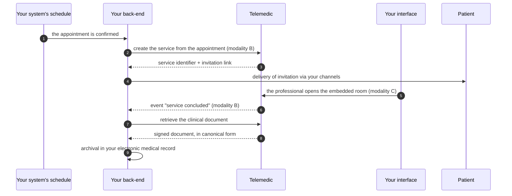
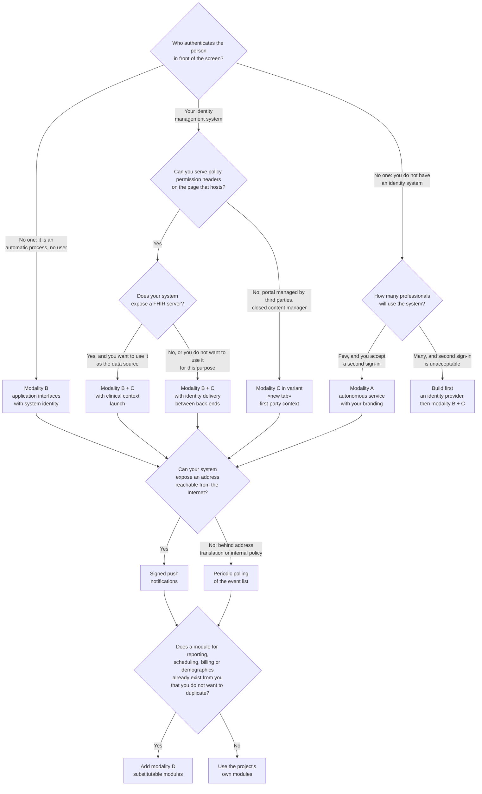

# Integration - index and orientation

> **This is the area in which project adoption is decided.** It is written for whoever has never
> seen Telemedic code and has no intention of seeing it: a developer who needs to make their
> system talk to this one, within a defined timeframe, without surprises downstream.

## 1. What this product does when you integrate it

Telemedic is a component that provides **telemedicine services** - video consultation, remote
consultation, remote assistance, remote monitoring - inside a system that already exists. It is
not a portal to which you send users, not the electronic medical record, not the demographics,
not the schedule.

Three statements follow directly from the integrator profile on which the project is built
(`00_PROJECT_BRIEF.md` §6.2) and must be read before everything else, because they determine the
form of every interface described in this area:

1. **It does not impose its own interface.** Whoever integrates already has their own, and their
   own visual identity. Telemedic embeds in white, inside yours.
2. **It does not impose its own authentication.** Whoever integrates already has an identity
   management system. Telemedic accepts an identity authenticated elsewhere without asking the
   user for a second sign-in.
3. **It does not become the reference data.** Patients, professionals, locations and appointments
   are already managed elsewhere. Telemedic works **by reference**, using the identifiers of
   whoever integrates' domain, and returns to the system of origin what it produces.

If one of these three statements is not true for your case, integration is still possible but you
will choose different modalities. The decision tree in §4 exists for exactly this.

## 2. What this area does not contain

This area **does not repeat the foundations**. Where basic knowledge is needed, it refers you:

| If you are not familiar with… | Read first |
|---|---|
| What distinguishes a video consultation from a remote consultation, and why the distinction changes the data model | [10 §02 - Telemedicine services](../10_fondamenti/02-prestazioni-di-telemedicina.md) |
| Patient identifiers in Italy, domain of attribution, reconciliation, professional identity | [10 §04 - Identity and demographics](../10_fondamenti/04-identita-e-anagrafiche.md) |
| HL7 v2, CDA, IHE, DICOM, clinical terminologies and their licences | [10 §05 - Interoperability standards](../10_fondamenti/05-standard-di-interoperabilita.md) |
| FHIR: resources, profiles, extensions, references, REST interactions, search | [10 §06 - FHIR from zero](../10_fondamenti/06-fhir-da-zero.md) |
| Electronic health record, national and regional infrastructures, who populates and who consults | [10 §07 - EHR and national infrastructures](../10_fondamenti/07-fse-e-infrastrutture-nazionali.md) |
| Why a video call is a hard problem: network traversal, signalling, degradation | [10 §08 - WebRTC from zero](../10_fondamenti/08-webrtc-da-zero.md) |
| The protocols one by one: conditional HTTP, OAuth, PKCE, token exchange, event envelopes, message signing | [10 §13 - Protocols](../10_fondamenti/13-protocolli.md) |

The chapters that follow presuppose those modules and cite them instead of rewriting them.
Where a concept is repeated, it is because its use in integration has a different form from
the general one, and the difference is stated.

## 3. The four modalities, in one page

The project exposes **four** modalities of integration, all four supported. They are not
alternatives: they are layers that a single integrator uses together.

| | Modality | What you integrate | Who writes it, from your side |
|---|---|---|---|
| **A** | **Autonomous service** | Nothing: you install Telemedic and use it with its interface, with your branding and your identities | A system administrator. No development |
| **B** | **Application interfaces** | Your back-end calls Telemedic, and Telemedic notifies your back-end | A back-end developer |
| **C** | **Embeddable component** | The consultation room appears inside your interface, with your theme | A front-end developer, **plus** the back-end for identity delivery |
| **D** | **Substitutable modules** | You switch off a module of Telemedic and put yours in its place: reporting, schedule, billing, identifier resolution, archival destination | A back-end developer, with a maintenance commitment over time |

Chapter [01 - The four modalities](01-modalita-di-integrazione.md) describes them one by one,
with **what they entail, what they require, what you get** and - the part that matters most -
**when each one is the wrong choice**.

### 3.1 How they combine in the most common case

The typical path of a cloud healthcare management system, which is the reference profile of the
project, uses **B + C together**, with **D** only where your own module already exists:

The point to note is step 7: **clinical content does not travel in the notification**. The
notification says something happened and where to find it; the content is re-read with an
authenticated call, under the authorisation of whoever is reading. It is a project rule without
exceptions, and it is motivated in chapter [04 §3](04-integrazione-per-eventi.md).

## 4. Decision tree: which modality is right for you

The questions are in order: you answer the first, follow the branch, move to the next.
The first question is the one that really discriminates, and it is not technical.

### 4.1 The same answers in table form

Those who prefer a table to a diagram find here the same information, with the addition of the
column that matters: **how much it costs**, in terms of skills you need in-house.

| Starting situation | Modality | Skills required from you | Main trap |
|---|---|---|---|
| Cloud management system with own identity system, own interface, own schedule | **B + C**, optionally **D** | Back-end with asymmetric cryptography (assertion signing, private key custody); front-end that knows how to embed securely | Identity delivery between back-ends. It is the 70% of the cost and cannot be avoided by routing through the browser |
| Practice or polyclinic without identity system | **A**, then optionally **B** | None, to start | Second sign-in for users. It is a real cost, must be declared to users instead of hidden |
| Healthcare organisation with integration engine already in production | **B** in hospital messaging variant | Configuration of the existing engine, no new development | Information loss in translation. Must be measured, not assumed |
| Public entity with specifications imposing conformity to interoperability profiles | **B + C** with stated profiles | FHIR back-end, mutual authentication at transport level, export of access traces | Conformity requirements emerge at specification and cost a lot if discovered downstream |
| Application for the citizen, developed by third parties | **B** with full-page application | Well-made public OAuth client | Token custody on a device you do not control |
| Payer: fund, mutual, policy | **B**, **exclusively administrative profile** | Back-end | **The payer is not a consulting party.** See §6 and chapter [09](09-obblighi-di-chi-integra.md) |

## 5. Reading paths

Nobody reads this area in full. Here are the three paths that cover real cases.

### 5.1 "I need to have a first integration running by Friday"

1. [02 - First startup](02-primo-avvio.md) - prerequisites, steps, points where you get stuck.
2. [03 - Integration for application interfaces](03-integrazione-per-api.md) §1–§4 - authentication between systems and first call.
3. [04 - Integration for events](04-integrazione-per-eventi.md) §1–§4 - receive and verify first notification.
4. [10 - FAQs and antipatterns](10-domande-frequenti-e-antipattern.md) - read it **before** opening an issue: it contains the errors we expect.

### 5.2 "I need to decide the integration architecture"

1. [01 - The four modalities](01-modalita-di-integrazione.md), in full, including the sections "when is this the wrong choice".
2. [06 - Identity and delegation](06-identita-e-delega.md), which is the chapter with more irreversible consequences.
3. [07 - Data and synchronisation](07-dati-e-sincronizzazione.md), to understand who owns what.
4. [08 - Substitutable modules](08-moduli-sostituibili.md), to know what you can substitute and with what guarantees.
5. [09 - Integration obligations](09-obblighi-di-chi-integra.md), which is the most important chapter in the area and should be read **before** signing a contract, not after.

### 5.3 "I need to understand what I am taking on, legally and regulatorily"

[09 - Integration obligations](09-obblighi-di-chi-integra.md), standalone, with the responsibility allocation table. Then, if your case requires it, the area `docs/08_compliance/`.

## 6. Three warnings that cannot be deferred

They are not footnotes: they are conditions of legitimacy of use.

### 6.1 This is not a marked medical device

The public repository is **source code**, not a medical device placed on the market, and
declares it (decision D17, D51). **Today the project does not apply CE marking and does not
subscribe to conformity statements** (D28, D49); with decision D63 of 26 August 2026, the
project intends to assume the role of manufacturer and marking is a product requirement.
Whoever integrates, distributes or puts into service the software to provide healthcare
services assumes the obligations that follow, including that of manufacturer where the
prerequisites apply.

The operational consequence for you is precise and non-circumventable: **until a marking exists,
the software is not usable for the provision of healthcare services on real patients**
(D16). Every distributed artefact declares it. Chapter [09](09-obblighi-di-chi-integra.md)
explains what that means for you in concrete terms.

### 6.2 The project is not accredited with the identity federation

The project is **conformant and verifiable** on national digital identity, **not accredited**
(constraint V-05, decision D36). The service provider towards the federation is **whoever
installs**, not the project: the agreement, the list of active services, the security levels
declared and recurring obligations rest on you. Chapter [06 §6](06-identita-e-delega.md) lists
what you need to do and which times are **not** declared by any source.

### 6.3 The payer is not a consulting party

Article 15, paragraph 4, of the Ministerial Decree of 7 September 2023 (DM 7 settembre 2023)
**always** excludes insurance companies from access to the Electronic Health Record, together with
loss adjusters and employers. The use case in which a telemedicine service is **paid for** by a
fund, mutual or policy remains fully valid; **no functionality documented in this area can mediate
access by an insurer to the record, neither directly nor through a professional.**

It is a misunderstanding that a commercial integrator can make in good faith, because the payer
is a legitimate subject of the pathway and needs to know that the service was provided. What the
payer can obtain is **the administrative outcome**, not the clinical content. The full treatment,
with the authorisation profile allowed, is in [09 §5](09-obblighi-di-chi-integra.md).

## 7. Conventions for this area

### 7.1 Names and domains in examples

All examples use **synthetic data** and reserved domains. There is no reference to real systems,
organisations or products, and no secret appears in clear.

| Role | Name in examples |
|---|---|
| Application interface and FHIR façade of the project | `api.telemedic.example` |
| Embeddable component | `embed.telemedic.example` |
| Token issuer and federation | `telemedic.example/realms/<realm>` |
| Documentation, schemas, issue catalogue | `docs.telemedic.example` |
| Integrator's system | `gestionale.integratore.example` |
| Integrator's identity provider | `idp.integratore.example` |
| Tenant identifier | `asl-nord-01`, `poliambulatorio-02` |

Resource identifiers have a speaking prefix (`ses-`, `enc-`, `apt-`, `prc-`, `pz-`) and
are **opaque**: their internal form is not contract and can change
([03 §9](03-integrazione-per-api.md)).

### 7.2 Markings

| Marking | Meaning |
|---|---|
| Citation with RFC number, article number or section of specification | Verified against primary source |
| *project proposal* | Not a standard: it is a Telemedic choice. Names of headers, permission scopes and endpoints marked this way are decisions, not citations |
| **`[NV]`** | Not verified. States what needs to be checked and to whom to ask. **Never invented** |

Binding editorial rule, also valid for you when you write your internal documentation: **no
parameter name, header, scope or endpoint marked *project proposal* goes to users as if it were
standard.** There are at least three cases in which the error is widespread in the sector, and
this area corrects them explicitly: the idempotency key, traffic limiting headers, message
signing ([03 §5](03-integrazione-per-api.md), [03 §7](03-integrazione-per-api.md),
[04 §5](04-integrazione-per-eventi.md)).

### 7.3 What is contract and what is not

This is the distinction on which your maintenance over time depends. In summary:

**It is contract**, and changes only with twelve months' notice: paths, methods, parameters and
schemas of the documented application interface; published FHIR profiles and capability
statement; event types and their data schemas; permission scopes; identifiers of problem types
and outcome codes; interfaces of substitutable modules; messaging protocol of the embeddable
component and closed set of theme properties.

**It is not contract**, and can change without notice: endpoints marked experimental; undocumented
headers; order of elements in unordered lists; internal form of opaque identifiers, cursors and
tokens; text of the detail field of errors, which is readable by a human but is not meant to be
parsed by a program; internal and administrative endpoints.

The full regime, with the modifications considered compatible and the dismissal process, is in
[03 §9](03-integrazione-per-api.md).

## 8. Index of chapters

| # | Chapter | Content |
|---|---|---|
| 01 | [The four integration modalities](01-modalita-di-integrazione.md) | Autonomous service, application interfaces, embeddable component, substitutable modules: what they entail, what they require, what you get, **when each one is the wrong choice** |
| 02 | [First startup](02-primo-avvio.md) | From zero to a first working integration: explicit prerequisites, steps in order, the seven points where you get stuck |
| 03 | [Integration for application interfaces](03-integrazione-per-api.md) | Authentication between systems, contracts, pagination, idempotency, concurrency, traffic limiting, errors, versioning and dismissal |
| 04 | [Integration for events](04-integrazione-per-eventi.md) | Catalogue of public events, subscription, asymmetric signing, retries, ordering, deduplication, proof of delivery |
| 05 | [Embeddable component](05-componente-incorporabile.md) | Embedding, permissions of the hosting context, theme and **invaluable limits to customisation**, lifecycle |
| 06 | [Identity and delegation](06-identita-e-delega.md) | Link your identity, delegation between organisations, propagation of assurance level, **executed** vs **claimed** authentication, clinical context launch |
| 07 | [Data and synchronisation](07-dati-e-sincronizzazione.md) | Demographics, reconciliation, identifiers and domains of attribution, alignment, conflicts and their resolution |
| 08 | [Substitutable modules](08-moduli-sostituibili.md) | Which components are substitutable, with which contracts, and what the project guarantees to those who substitute them |
| 09 | [Integration obligations](09-obblighi-di-chi-integra.md) | **The most important document in the area.** Regulatory, data protection, security, terminologies, with the responsibility allocation table |
| 10 | [FAQs and antipatterns](10-domande-frequenti-e-antipattern.md) | The errors we expect and how to avoid them |

## 9. How to report a problem in this documentation

If a page in this area has made you lose time, it is a problem with the page, not with you. The
three most useful things to report, in order:

1. **The example that does not work.** An example that does not compile or does not run is worse
   than no example. Code examples are verified in continuous integration
   ([03 §10](03-integrazione-per-api.md)): if one fails for you, either the environment diverges
   or the test does not cover that case, and in either case it is useful to know.
2. **The point where you got stuck and for how long.** Chapter
   [02 §6](02-primo-avvio.md) lists the known points; if yours is not in the list, it should be added.
3. **The thing you assumed and that turned out to be false.** It is the most valuable information,
   because it indicates where the documentation says something ambiguous instead of saying
   something wrong - which is harder to find.
