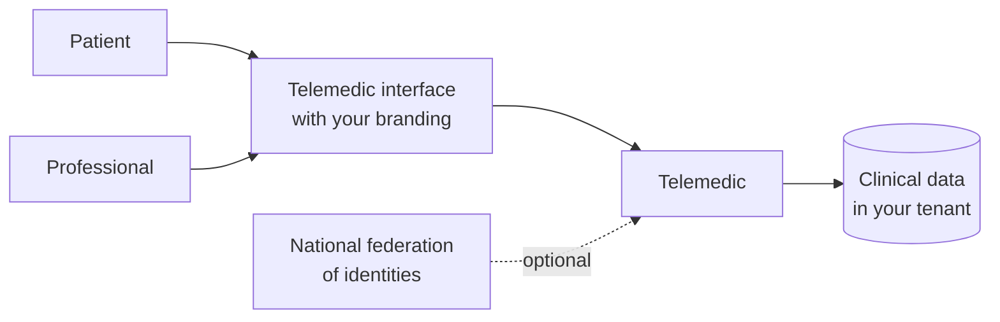
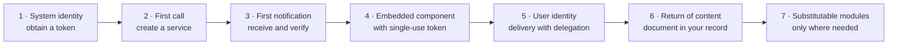

# The four integration modalities

The project exposes **four** modalities (decision D4). This chapter describes them using the same
fixed schema, to make comparison possible:

1. **What it entails** - what changes in your system.
2. **What it requires** - technical prerequisites, skills, artefacts you must produce.
3. **What you get** - the capabilities that become yours.
4. **When it is the wrong choice** - situations in which it should be avoided, with the alternative.

Point 4 is the one for which it is worth reading the chapter. A catalogue of indistinct
recommendations helps nobody to decide.

## 0. The question that really discriminates

Before the four modalities there is a single architectural question, and it is not technical:

> **Who has authenticated the human being in front of the screen?**

Everything else follows from there.

| Who authenticates | Identity schema | Interface schema | Modality |
|---|---|---|---|
| Your identity management system | Identity delivery between back-end, with **explicit delegation** | Embeddable component in white | **B + C** |
| Telemedic, with its own identities or with the national federation | Authorisation code with proof of key possession | Project's own interface, with your branding | **A**, optionally + **B** |
| No one: it is an automatic process | System credentials with signed assertion | No interface | **B** |
| A healthcare records system that knows how to launch clinical applications | Clinical context launch: **Telemedic is the application**, you are the issuer | Application launched by your system | **B + C**, launch variant |

The last row is the least obvious and should be kept separate from the others, because it inverts
the roles: in all other cases Telemedic is the service you turn to; there it is **your** system
that is the authorisation authority, and Telemedic the client requesting permission. The project
supports both directions, but they are two distinct implementations and must be estimated
separately ([06 §7](06-identita-e-delega.md)).

---

## 1. Modality A - autonomous service

### 1.1 What it entails

You install Telemedic and use it as is. Users - professionals and patients -
authenticate on Telemedic. The interface is that of the project, with your branding,
your colours, your domain.

You do not write code. You configure: tenant, branding, roles, invitation delivery channels,
recording retention policy, monitoring thresholds per patient.

### 1.2 What it requires

| Prerequisite | Detail |
|---|---|
| A runtime environment | Container distribution, with relational database, identity federation product, media relay server, object storage for recordings. The installation profile is documented in the technical area |
| A domain and certificate | The component serves pages with permissions on camera and microphone: **requires secure connection**, without exception, even in testing |
| A decision on the location profile | European Union, Italian territory, or qualified cloud. No mandatory dependency prevents the most restrictive profile (decision D24) |
| An administrator | No developer is needed, but someone who can read a configuration and manage certificates and rotations |
| Organisational decisions | Who is the data controller, what are the legal bases, who signs reports, what is the declared service availability. See [09](09-obblighi-di-chi-integra.md) |

### 1.3 What you get

A complete and working telemedicine service **in days, not weeks**: schedule,
invitations, virtual waiting room, preventive technical verification, consultation room with key verification, reporting and signing, recording with consent, remote monitoring with plans and thresholds, access register.

It is also the only modality that can be used to **understand the product before integrating it**: a modality A environment costs little and clarifies in an afternoon questions that otherwise are resolved halfway through an integration.

### 1.4 When it is the wrong choice

| Situation | Why not | Alternative |
|---|---|---|
| Professionals already use another system daily | A second sign-in and a second place to search for information: modality A translates into an abandonment rate that no function recovers. It is the most reliable way to make a telemedicine project fail | **B + C** |
| Patient demographics is already managed elsewhere | Duplicating the demographics means creating a second reference data that will diverge. The divergence between two demographics is not a data defect: it is a clinical risk, because it produces incorrect mergers and splits ([10 §04](../10_fondamenti/04-identita-e-anagrafiche.md)) | **B**, working by reference |
| The report must end up in another system's electronic medical record | In modality A it only gets there if someone copies it by hand, and what gets copied by hand eventually does not get copied | **B**, with events and document retrieval |
| A reporting or signing module already exists that professionals are familiar with | Two reporting tools produce two partial archives | **D** |
| The organisation has a conformity obligation imposing interoperability profiles named in the specifications | Profiles are declared and verified on the interfaces, not on the user interface | **B**, with the required profiles |

### 1.5 The misunderstanding to clarify immediately

Modality A **is not the modality "without integration"**: it is the modality in which integration is
**organisational** rather than technical. The data controller, retention, signing, workflow to the
record, declared service availability remain to be decided. The fact that there is no code to write
does not reduce by a gramme the obligations of chapter [09](09-obblighi-di-chi-integra.md).

---

## 2. Modality B - application interfaces

### 2.1 What it entails

Your back-end talks to Telemedic. In both directions: you call to make things happen, Telemedic
notifies you when they do.

The surface is **dual**, and the separation is not cosmetic:

| | Clinical plane | Application plane |
|---|---|---|
| Base path | `/fhir` | `/v1` |
| Content type | `application/fhir+json` | `application/json` |
| Contract | Published FHIR profiles + capability statement | Interface document in OpenAPI 3.1 |
| Errors | Operation outcome resource | `application/problem+json` (RFC 9457) |
| Contains | Patient, professional, service, appointment, observation, document, consent | Media sessions, invitations, devices, branding, notifications, keys, quotas, metrics |
| Serves | Third-party healthcare systems, authorities, integration engines | Developers integrating the product |

**The partitioning rule**, which the project applies without exception:

> If the concept has a recognised clinical equivalent and must be consumable by a
> healthcare system that does not know Telemedic → **clinical plane**.
> If the concept is a capability of the product → **application plane**.

The most useful practical consequence: **network quality metrics are not clinical observations.** Modelling
latency or packet loss as FHIR observations would make them end up in the patient's medical record.
It is a data quality problem and, from a regulatory perspective, shifts the boundary of what the
system claims about the patient (constraint V2). They stay on the application plane, and are non-negotiable.

### 2.2 What it requires

| Prerequisite | Why |
|---|---|
| A back-end that can hold a private key | Authentication between systems is **asymmetric**: you sign an assertion with your key, the project verifies it against your published public key. No shared secret ever transits ([03 §2](03-integrazione-per-api.md)) |
| A point to publish your public keys | A document served on secure connection, with rotation. It is the mechanism that makes rotation your unilateral operation instead of coordination with us |
| A reachable address for notifications, **or** a polling process | If you cannot expose anything to the Internet, periodic polling on the event list is used. It is not a series B stopgap: it is a documented modality with the same guarantees ([04 §9](04-integrazione-per-eventi.md)) |
| Idempotency on your side | Deliveries are **at least once**. A recipient that does not deduplicate publishes two reports |
| A stable identifier for your patients and professionals, with its **domain of attribution** | An identifier without domain is a string. See [07 §2](07-dati-e-sincronizzazione.md) |

### 2.3 What you get

Everything. It is the corollary of constraint V3: **no capability of the system is reachable only
from the user interface**. If something can be done by clicking, it can be done by calling.

In practice: create a service from an existing appointment, generate and deliver invitations via your
channels, know the status in real time, retrieve the signed clinical document, manage consents and
revocations, configure remote monitoring plans and thresholds, ingest measurements, read alerts, export
the access register, administer tenant, branding, keys and quotas.

### 2.4 When it is the wrong choice

| Situation | Why not | Alternative |
|---|---|---|
| You do not have a back-end, only a single-page application | There is no secure way to hold a private key in a browser. System credentials from a browser cannot be done. Full stop | **A**, or build a minimal back-end that only serves as identity custodian |
| You **only** need to make the consultation room appear | If you do not need to create or receive anything, a whole application integration is disproportionate | Invitation link generated in modality **A** |
| You want to use the clinical plane for capabilities that are not clinical | Forcing a media session, a relay key or a quota inside a clinical resource produces non-interoperable data disguised as standard. If 60% of the content is in proprietary extensions, it is not interoperability | Application plane |
| You want a token that lasts all day "for convenience" | A long-lived token defeats revocation and widens the window in which a leak is exploitable. In a context where the token opens access to health data, it is not an acceptable compromise | Re-obtain the token: it is a call between back-ends, not a user session |
| You want notifications to carry the report | Clinical content toward an address whose security you do not control is a disproportionate risk, and is forbidden by the project rule | Notification with reference, authenticated retrieval |

---

## 3. Modality C - embeddable component

### 3.1 What it entails

The consultation room appears **inside** your interface. The professional does not change
application, does not do a second sign-in, does not copy identifiers.

It is not an informative widget: it is an application that accesses **camera, microphone and
screen sharing**. This radically changes requirements compared to generic embedding, and most
integration failures concentrate here ([05 §2](05-componente-incorporabile.md)).

Three variants, in order of preference:

| Variant | When | Isolation |
|---|---|---|
| **Embedded frame** on separate origin | Default. You control the headers of the hosting page | **Total**: separate execution context, the session token is not in your application's memory |
| **Custom element wrapping the frame** | You want the ergonomics of an HTML tag without managing difficult configuration by hand | Total: isolation stays with the underlying frame |
| **New tab in first-party context** | You cannot serve permission headers: portal managed by third parties, closed content manager | Total, and **no permission delegation problem** |

There is a fourth technical possibility - a component that runs **in the same execution context**
as your application - and the project offers it **only for non-clinical elements**: the launch button,
status indicator, audio and video device test, network quality indicator. The reason is in §3.4.

### 3.2 What it requires

| Prerequisite | Detail |
|---|---|
| Ability to serve permission headers on the hosting page | Without them, the component loads but **the camera does not turn on**. It is the number one problem and has a confusing symptom: audio may work while screen sharing does not, because they are separate permissions |
| A back-end that obtains the entry token | The token that opens the session is **single-use, very short-lived, obtained between back-ends and delivered without passing through the page address**. A token in an address is a leaked token: addresses end up in history, proxy logs, referrer headers to third parties and monitoring tools |
| Registration of hosting origins | The project emits for each session the list of origins authorised to embed, **generated for that tenant**. An unregistered origin does not load |
| An interface that respects customisation limits | Some elements are not themeable or hideable. See §3.4 and [05 §5](05-componente-incorporabile.md) |
| No dependency on third-party cookies | The component architecture **does not use cookies**, by choice. If your integration presupposes them, it needs to be rethought: a relevant share of users operate today with third-party cookies blocked or partitioned |

### 3.3 What you get

Continuity of work. The professional stays in their own tool; the patient receives a
link that goes to a page with your branding; neither of them knows they are using
two systems.

And, in addition, a manageable lifecycle: the component communicates with the hosting page with
a documented and versioned messaging protocol - it is ready, the user has entered,
the service is concluded with this outcome, the user asked to close, this height is needed ([05 §4](05-componente-incorporabile.md)).

### 3.4 When it is the wrong choice

| Situation | Why not | Alternative |
|---|---|---|
| The component must **blend** into the layout: a button, a status label, a table row | A rectangular frame with separate context is disproportionate for a button | **Non-clinical** custom element |
| You cannot serve headers on the hosting page | Media permissions never arrive. It is a technical blocker, not a difficulty | **New tab**, in first-party context |
| The host is a native mobile application | There is no HTML document that can delegate permissions. Delegation happens at operating system level | Full-page view |
| You would serve the component **from your own origin**, with a reverse proxy | It seems to solve cookie problems, and creates worse ones: isolation between your code and the component code **ceases to exist**, and with it the separation between your defects and clinical sessions | Cross-origin frame, cookie-free architecture |
| You want an in-process component that handles the clinical session token | The session token would end up in the same execution context as your application: **a single script injection vulnerability in your system becomes access to clinical sessions**, and the project has no control over the quality of your code. In a risk analysis it is a non-mitigatable risk with proprietary means | Frame, always |
| You want to inject an arbitrary stylesheet | Allowing it would allow hiding consent warnings, altering clinical labels, overlaying elements. In a system whose usability is subject to validation, it is unacceptable | Closed set of theme properties, validated |

---

## 4. Modality D - substitutable modules

### 4.1 What it entails

Some functions of the project are **disableable by configuration and substitutable with yours.**
It is a direct consequence of how the functional scope is thought out (decision D14):
where an integrator or regional module already exists, the system **integrates instead of duplicating**.

Substitutions are not all of the same type, and the difference matters:

| Type | What you substitute | Where your code runs |
|---|---|---|
| **Switch-off** | An entire module (schedule, billing, reporting) is disabled and the flow relies on yours, invoked by interface | From you |
| **Out-of-process extension point** | The project asks you for a decision or transformation by calling your address | From you |
| **In-process extension point** | The project loads your implementation of a declared interface | **Inside the project's process** |

The last row has a severe restriction and must be stated immediately: **in-process extension points
are allowed only in installation dedicated to a single customer.** In a shared installation
across multiple tenants, loading third-party code in the process that serves everyone means that
a defect or memory leak in your code impacts everyone else, and a malicious module reads
everyone's data. It is not a precaution: it is a condition of admissibility.

### 4.2 What it requires

| Prerequisite | Detail |
|---|---|
| A maintenance commitment over time | An extension interface is a contract that lives for years. If you do not know who will maintain it two years from now, do not use it |
| Interface version declaration | Your module declares which version it implements; the system **refuses to start** if it is incompatible, with an explicit message. A silently incompatible module is worse than an absent module |
| Defined behaviour on failure | Every invocation has a timeout, circuit breaker and a declared fallback behaviour. A module in a loop must not bring down the service |
| Acceptance of traceability | Every decision made by your module is logged with the module's identifier and its version. It is a traceability requirement, not a choice |

### 4.3 What you get

Do not duplicate. It is the only benefit, and it is large: a professional who reports in two tools
produces two partial archives; two schedules produce double bookings; two billing systems produce disputes.

The anticipated substitutions and their contracts are in [08](08-moduli-sostituibili.md).

### 4.4 When it is the wrong choice

| Situation | Why not | Alternative |
|---|---|---|
| The extension can be done out-of-process | A notification has natural isolation and does not bind the release cycle of anyone | Events |
| The extension can be done by configuration | Everything obtainable with a configuration must not require code | Configuration per tenant |
| You are **the first** to ask for that extension point | An extension point designed on a single use case almost always has the wrong form. Better two concrete implementations and then the abstraction, than a speculative abstraction to maintain for years | Open an issue, not the interface |
| The extension touches a path whose safe use is subject to validation | Third-party code inside a validated path invalidates the validation. It is not an opinion: it is a consequence of the regime the software is subject to | Configuration, or extension **outside** the clinical path |
| You want an extension point that **modifies clinical data before persistence** | It would make the data's origin irreconstruible and erase the boundary between what the professional wrote and what a programme wrote | Extension point **that can only refuse**, never transform |
| You want your module to write directly to the database | A module that writes to the database is a fork of the project disguised as an extension: domain invariants cease to apply and nobody notices until it is too late | Application interface |

---

## 5. How they combine

The four modalities are **layers**, not alternatives. The table shows the real combinations,
with the priority the project assigns to each.

| Scenario | A | B | C | D | Notes |
|---|:--:|:--:|:--:|:--:|---|
| Cloud management system with own identity system, own interface, own schedule | | ● | ● | ○ | Reference combination. **Priority 1** |
| Practice or polyclinic without identity system | ● | ○ | ○ | | Start from A and add B when needed. **Priority 2** |
| Public entity with specifications | | ● | ● | ○ | Interoperability profiles stated, access trace export, accessibility verified. **Priority 2** |
| Healthcare organisation with integration engine | | ● | | ○ | Messaging variant. No embedded interface: link starts from hospital system. **Priority 3** |
| Citizen application developed by third parties | | ● | ○ | | Full-page view, not frame. **Priority 4** |
| Payer | | ● | | | **Exclusively administrative profile by design.** See [09 §5](09-obblighi-di-chi-integra.md) |

● main modality · ○ additional modality as appropriate

### 5.1 Recommended adoption order

It is not an aesthetic order: each step unlocks the next and each one is verifiable alone.

Step **5** carries the most risk, and the reason is documented: the identity delivery mechanism
depends on capabilities of the identity federation product whose availability must be verified
on the version actually adopted ([06 §3.6](06-identita-e-delega.md)). **It must be prototyped
early even if implemented late**: a discovery at step 5 costs little, a discovery at acceptance testing costs a release.

Step **6** is the one integrators underestimate most. Making the consultation room appear is
noticeable and can be done in an afternoon; making the clinical document return to the right place,
with the right signature, reconciled with the right patient, is the real work.

---

## 6. What it costs to maintain each modality

A modality is not chosen for the cost of adoption but for the cost of **ownership**. This
table is a project estimate, stated as such.

| Modality | Adoption cost | Recurring cost | What compels you to do when the project changes |
|---|---|---|---|
| **A** | Low | Low | Update the installation. Re-read the release notes for behaviour changes |
| **B** | Medium | **Medium** | Follow the dismissals announced twelve months in advance; tolerate the addition of unknown fields and values; renew keys |
| **C** | Medium-high on first attempt, then low | Low | Update the element if you use it; review registered origins when your domains change |
| **D** | High | **High** | Adapt your module to every major version of the interface; re-execute safe use checks if the module touches a validated path |

The two bolded rows are the ones on which it is worth being honest during evaluation:
**B and D bind you to the project's lifecycle**. A and C much less so.

---

## 7. Summary table of wrong choices

The table gathers in one place all the contraindications from the previous sections. If you
recognise your case in a row, the modality in the first column is the one to **not** use.

| Do not use | If… | Use instead |
|---|---|---|
| **A** | A system already exists that professionals use every day; or there is already a demographics; or the report must flow elsewhere | B, C, D |
| **A** | You need conformity to interoperability profiles named in the specifications | B |
| **B** | You do not have a back-end capable of holding a private key | A |
| **B** | You need only the consultation room and nothing else | A, with invitation link |
| **B** (clinical plane) | The concept to model has no clinical equivalent, or is purely technical | Application plane |
| **C** (frame) | You cannot serve headers on the hosting page | New tab |
| **C** (frame) | The host is a native mobile application | Full-page view |
| **C** (in-process) | The component handles session tokens or clinical data | Frame |
| **D** | The extension is achievable with configuration or events | Configuration, events |
| **D** (in-process) | The installation serves multiple tenants | Interfaces and events |
| **D** | The extension point serves only one integrator, and there is no second use case | Open an issue, not an interface |
| **D** | The module should transform clinical data before persistence | Extension point that can only refuse |

## 8. Before moving to the next chapter

If you have chosen the modality, the next step is
[02 - First startup](02-primo-avvio.md), which takes you from zero to a first working integration and
declares in advance the points where you get stuck.

If you **have not** chosen, the question that remains is almost always one of these three, and
each one has a dedicated chapter:

1. "Who owns the demographics, and what happens when the two diverge?"
   [07 - Data and synchronisation](07-dati-e-sincronizzazione.md).
2. "Can our authentication really propagate without a second sign-in?"
   [06 - Identity and delegation](06-identita-e-delega.md).
3. "What are we responsible for and what is the project responsible for?"
   [09 - Integration obligations](09-obblighi-di-chi-integra.md).
