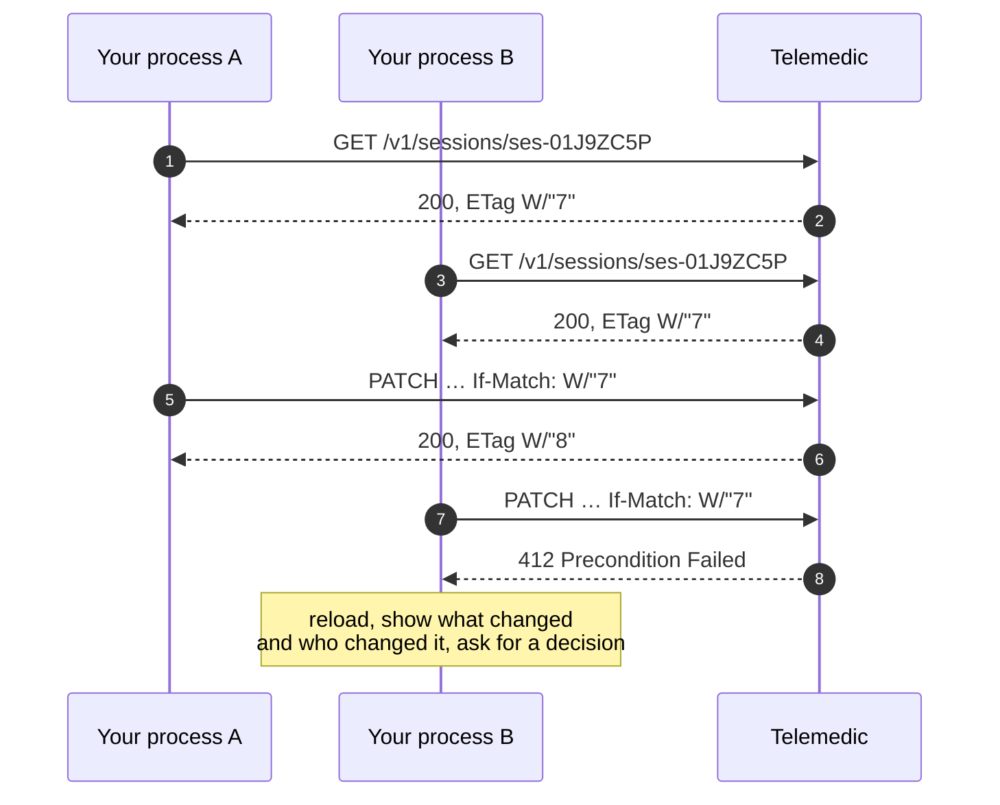

# Integration for application interfaces

This chapter describes modality **B**: your back-end talking to Telemedic. It is the modality on
which all others rest - the embeddable component needs a token obtained here, substitutable modules
need data that passes through here.

## 1. Two planes, one partitioning rule

The surface is dual and the separation is deliberate. The summary is in
[01 §2.1](01-modalita-di-integrazione.md); here concern the operational consequences.

| | Clinical plane `/fhir` | Application plane `/v1` |
|---|---|---|
| Contract | Published profiles + capability statement (`GET /fhir/metadata`) | Interface document in **OpenAPI 3.1** |
| Errors | Operation outcome resource | `application/problem+json` - **RFC 9457** |
| Pagination | Links in the result envelope | Signed opaque cursor |
| Concurrency | Weak validator aligned to resource version | Validator on application resource |
| Versioning | The version **is** that of FHIR, declared in the capability statement and content type | Major version in the path |
| Authorisation | Scopes per resource type | Scopes expressed as URIs |

**They do not mix.** An integrator who tries to obtain a relay server key via a generic FHIR
resource is building a proprietary format disguised as standard; an integrator who models a
report on the application plane is building a clinical archive that no other healthcare system
will be able to read.

## 2. Authentication between systems

### 2.1 Permitted modes, and those not

| Mode | Status | When |
|---|---|---|
| System credentials with **assertion signed by private key** | **Default and recommended** | Every integration between back-ends |
| Mutual authentication at transport level, in addition | Recommended for the public sector and for high-assurance tenants | Where your perimeter allows it and the specifications require it |
| Proof of possession tied to the key, at application level | Option, where the client platform supports it | Client with browser execution wanting to overcome the bearer token |
| Shared secret | **Allowed only temporarily and documented**, with frequent rotation | Integrators unable to manage the lifecycle of a key. It is more honest than a poorly held private key |
| Static token with indefinite lifetime | **Not allowed** | - |
| User credentials exchanged between systems | **Not allowed** | - |
| System credentials **from a browser** | **Not allowed, and it is not a configuration matter** | There is no secure way to hold a private key in a browser |

Why asymmetric is the default mode, in three points that also hold for you:

1. **The secret never transits**, not even once, not even at registration.
2. **The project does not hold your secret material**: only public keys. Compromise of the
   issuer's archive does not allow impersonating you.
3. **Rotation is unilateral**: you publish a new key with a different identifier and sign with
   that. No synchronous coordination, no outage window. For a system serving many integrators,
   each with their own keys, it is determinant.

### 2.2 The public key document, and its handling

The address of your key document is **registered** at onboarding and tied to your client. From
this follow two rules the project applies and you should know, because they explain otherwise
opaque refusals:

- **The address possibly indicated in an assertion header is not followed.** It is compared against
  the one registered for your client: if they do not match, the request is refused. An arbitrary
  address in a signed header would be a surface for forced requests to internal resources and a
  vector for key confusion.
- **Retrieval is cached with a duration**, with forced refresh only on unknown key identifier, and
  with frequency limiting on that refresh. If you publish a new key and sign immediately with it,
  the first attempt may fail and the second succeed: it is expected, not a defect. **Publish first,
  sign after.**

### 2.3 Authorisation scopes

Two families, with different syntaxes, because they answer different questions.

**Scopes on the clinical plane.** Follow the form `{patient|user|system}/{Resource}.{permissions}`, with
permissions expressed by the letters of create, read, update, delete and search,
**in the fixed order `cruds`**: `.rs` and `.cu` are valid, `.sr` is not.

```text
system/Encounter.cu
system/Composition.rs
user/Appointment.cruds
patient/Observation.rs
```

A scope can additionally be **refined with search parameters**, which allows least privilege without
inventing proper names:

```text
patient/Observation.rs?category=http://terminology.hl7.org/CodeSystem/observation-category|vital-signs
```

The project adopts this syntax natively and **also accepts the previous form** (`.read`, `.write`,
`.*`) by converting it: rejecting dated libraries would create friction without security gain, given
the conversion is defined by the specification itself.

**Scopes on the application plane.** Capabilities that do not correspond to a clinical resource
**are not masked as a clinical resource**. They are expressed as URIs (*project proposal*):

```text
https://telemedic.example/scopes/session.start
https://telemedic.example/scopes/session.join
https://telemedic.example/scopes/session.metrics.read
https://telemedic.example/scopes/recording.consent.manage
https://telemedic.example/scopes/webhook.manage
https://telemedic.example/scopes/branding.manage
https://telemedic.example/scopes/tenant.admin
https://telemedic.example/scopes/audit.export
```

Forcing "start a video session" into `patient/Encounter.cu` would be semantic abuse and would
make it impossible to revoke one without the other. The distinction has a concrete effect on your
side: you can grant a nightly synchronisation process the creation of services **without** granting
it the ability to start a consultation.

### 2.4 Recipient, revocation and the window nobody declares

Every token carries an **explicit recipient**, and a service that does not recognise itself in that
recipient refuses it. It is not formalism: without it, a token issued for one service can be
redirected to another.

On revocation there is a point that should be said honestly because the documentation of the sector
almost always dodges it:

> **Revocation is not instantaneous.** A token validated locally against the issuer's public material
> remains valid until its own expiry even after being revoked. It is why clinical tokens last five
> minutes and not a day.

For revocations that **must** be immediate - a professional disabled, a tenant suspended, a key
compromised - there is an additional mechanism: a distributed denial list, with duration equal to
the maximum lifetime of a token, consulted at the boundary. The cost is one more check; the benefit
is that "revoked" means revoked.

Consequence for you: **do not design flows that assume instantaneous revocation** without having
verified that the tenant has that mechanism active.

## 3. The contract

### 3.1 Contract first, then code

The interface document is **written by hand and is the source of truth**; the server structures are
generated or verified against it in continuous integration. The inverse approach - annotations in
code from which the document is generated - produces a contract that changes at every internal
restructuring, which is incompatible with a stability policy and with the traceability required by
the lifecycle regime the software is subject to.

What this means for you: **the document does not change because someone renamed a class.** If it
changes, it is a decision.

### 3.2 The checks the project runs on itself

They are public because they are the reason you can trust the contract:

| # | Check | Effect if it fails |
|---|---|---|
| 1 | Static analysis of the interface document: style and security rules | Build fails |
| 2 | **Compatibility comparison** with the published version | An undeclared breaking change makes the build fail |
| 3 | Verification of integration tests **against** the document | A response that diverges from the schema makes the build fail |
| 4 | **Execution of documentation examples** | An example that does not compile or run makes the build fail |
| 5 | Publication of client tools only on version tag, signed and with bill of materials | No publication |

Check 4 is the one that distinguishes reliable documentation from outdated: an example that
does not work is worse than no example.

### 3.3 Excerpt of the interface document

```yaml
openapi: 3.1.1
jsonSchemaDialect: https://json-schema.org/draft/2020-12/schema
info:
  title: Telemedic - application interface
  version: "1.0.0"
  license:
    name: Apache-2.0
    identifier: Apache-2.0
servers:
  - url: https://api.telemedic.example/v1
paths:
  /sessions:
    post:
      operationId: createSession
      summary: Create a service from an existing appointment
      parameters:
        - name: Idempotency-Key
          in: header
          required: true
          schema: { type: string, minLength: 16, maxLength: 128 }
          description: >
            Key of the logical attempt, chosen by the caller. Two requests with the same
            key and the same body produce the same response.
            Project convention inspired by an expired Internet-Draft: it is not a standard.
      requestBody:
        required: true
        content:
          application/json:
            schema: { $ref: '#/components/schemas/CreateSessionRequest' }
      responses:
        "201":
          description: Service created
          headers:
            Location: { schema: { type: string, format: uri-reference } }
            ETag:     { schema: { type: string } }
          content:
            application/json:
              schema: { $ref: '#/components/schemas/Session' }
        "409":
          description: Identical request still in progress
          content:
            application/problem+json:
              schema: { $ref: '#/components/schemas/Problem' }
        "422":
          description: Idempotency key reused with different body
          content:
            application/problem+json:
              schema: { $ref: '#/components/schemas/Problem' }
        "429":
          description: Quota exceeded
          content:
            application/problem+json:
              schema: { $ref: '#/components/schemas/Problem' }
webhooks:
  sessionCompleted:
    post:
      operationId: onSessionCompleted
      summary: Notification of service concluded
      requestBody:
        content:
          application/json:
            schema: { $ref: '#/components/schemas/SessionCompletedData' }
      responses:
        "2XX": { description: Notification acknowledged }
```

Two notes on the excerpt. The incoming notifications field is part of the interface document:
**a single specification** describes both what you call and what you receive, which prevents
them from diverging. And the description of the idempotency key **declares its own regulatory
status** instead of letting a non-existent conformity be believed - see §5.

## 4. Pagination

| Plane | Mechanism |
|---|---|
| Application | **Cursor**, default. Stable in the presence of concurrent writes |
| Application | Numeric offset: **not offered**. Degrades and produces inconsistent results under write |
| Clinical | Links inside the result envelope, as the standard prescribes |

```http
GET /v1/sessions?tenant=asl-nord-01&status=completed&limit=50 HTTP/1.1
```

```json
{
  "data": [ "…" ],
  "meta": {
    "limit": 50,
    "hasMore": true,
    "nextCursor": "eyJ0IjoiMjAyNi0wOS0wMVQwOTozMFoiLCJpZCI6InNlcy0wMUo5WkI3UiJ9.sig"
  }
}
```

**The cursor is opaque and signed.** Do not interpret it, do not build it, do not modify it: it
is the mechanism that prevents a client from bypassing tenant filters by manipulating position.
An altered cursor is refused. Its internal form **is not contract** and can change.

Three rules for your client:

1. Iterate whilst `hasMore` is true, passing `nextCursor` unmodified.
2. **Do not conserve a cursor between distant executions**: it has a validity. To resume a
   synchronisation, you start from an instant, not a cursor.
3. Do not deduce the total number of elements: it is not provided, because calculating it on a
   database under write costs more than the page itself and the result would be stale at read time.

## 5. Idempotency

### 5.1 The specification status, declared

> **The idempotency key is not a standard.** The reference document is an Internet-Draft of the
> HTTP interfaces working group, revision **-07 of 15 October 2025**, which is **expired and
> archived** and **was never published as an RFC**.

The project maintains the field name anyway, because it is the most widespread convention in the
sector and your libraries recognise it: changing it would produce friction with no gain. But it must
be presented for what it is - **project convention** - in your documentation, contracts and
specifications. Declaring a non-existent conformity is a promise nobody can keep.

### 5.2 Adopted semantics

| Aspect | Rule |
|---|---|
| Where it is mandatory | On every request with creation or external effects: service creation, document sending to the source system, consent recording, document publication, invitation sending |
| Who generates the key | **You, always.** A key generated by the server solves nothing: the problem is that you do not know if the server saw the request |
| Scope of the key | The quartet tenant, client, endpoint, key. The same key on two different endpoints is allowed and does not collide |
| Retention | **24 hours** (*project proposal*). Beyond that, the key expires and a new request is executed as new |
| Same key, same body, previous still in progress | `409` with indication of when to retry |
| Same key, same body, previous completed | The memorised response, **identical**, with the indication that it is a replay |
| Same key, **different body** | `422` with an explicit problem type. Never a silent substitution |

```http
HTTP/1.1 200 OK
Idempotent-Replay: true
ETag: W/"1"
```

### 5.3 Where it is not needed

On read, full replacement and delete: they are already idempotent by protocol definition. Adding
it is noise. And on operations where you **want** multiple effects - "send the invitation again" -
a distinct endpoint with explicit semantics is needed, not the absence of the key.

### 5.4 The clinical plane equivalent

On the clinical plane there is a native and more precise mechanism: **conditional creation**, which
creates only if a search finds nothing. It is the natural tool for repeatable ingestion of
appointments from your system, using your external identifier as criterion.

```http
POST /fhir/Appointment HTTP/1.1
Content-Type: application/fhir+json
If-None-Exist: identifier=https://gestionale.integratore.example/sid/appuntamento|APT-9931
```

## 6. Concurrency

### 6.1 The problem, and why it is more severe in clinical scope

Two professionals open the same document, both modify, both save. Without countermeasures the
second save overwrites the first and nobody notices: it does not produce errors, it produces wrong
data.

The strategy adopted is **optimistic**: no locking, and it fails if you arrive with a stale version.



### 6.2 The project's rules

1. **On every modifiable clinical resource the validator is mandatory.** A modification **without**
   a validator is refused with `428 Precondition Required`, not executed blindly. The motivation
   transcends technique: allowing a blind update on a clinical document is a risk to register in
   risk analysis, not a convenience to grant.
2. **On the clinical plane the validator is weak** and corresponds to the resource version
   (`W/"3"`). It is so by specification: do not treat it as a content digest.
3. **`If-Match: *` is not a shortcut.** It means "provided the resource exists", not "any version":
   using it completely disables the protection.
4. **Conflict is an interface event, not a technical error.** If your system shows the user "error
   412" you are downloading onto them a problem that is yours: preserve what they wrote, show
   what changed, ask for an explicit decision.

### 6.3 What is not concurrency

The idempotency key and the conditional validator solve **different** problems and are confused
continually:

| | Idempotency key | Conditional validator |
|---|---|---|
| Question it answers | "Have I already sent this request?" | "Has the resource changed since I read it?" |
| On which method | Creation and operations with effects | Modification and delete |
| Identifies | The **attempt** | The **outcome** |
| Who generates it | The client | The server |

## 7. Traffic limiting

### 7.1 The specification status, declared again

> The historic triple of headers for limit, residue and reset **was never a standard**, and is today
> also **superseded**. The reference document is an active Internet-Draft, revision **-11 of 23 May
> 2026**, which defines **two only fields**, both structured: one for the policy and one for the
> current status.

```http
HTTP/1.1 200 OK
RateLimit-Policy: "sessions";q=1000;w=3600;qu="requests";pk=:dGVuYW50OmFzbC1ub3JkLTAx:
RateLimit: "sessions";r=417;t=1832
```

| Field | Parameter | Meaning |
|---|---|---|
| Policy | `q` | overall quota |
| | `w` | window width, in seconds |
| | `qu` | quota unit: requests, content bytes, concurrent requests |
| | `pk` | partitioning key: what the quota applies to |
| Status | `r` | residual quota |
| | `t` | seconds to reset |
| | `pk` | partitioning key |

The project emits **both forms** - the current and the historic - during the transition period, and
states that **neither is normative**. When the document becomes an RFC, the historic form will enter
the dismissal process of §9.

### 7.2 Adopted policy

- Quota is **per tenant and per endpoint class**, not per network address: a network address does
  not identify anyone, and in a multi-integrator installation everyone shares it.
- Distinct classes for clinical write, read, session launch, administration and bulk export. A
  thousand light reads and a thousand bulk exports are not the same load, and it is why quota units
  other than requests exist.
- Refusal for quota **always** carries the indication of when to retry, which is the only field of
  this family actually normalised and that generic libraries respect.
- **Declared exemptions**: health check endpoints, traffic to recover from the dead-letter queue (which
  would otherwise be throttled exactly when recovery is needed) and operations marked as clinical
  urgency, which have a dedicated scope and reinforced tracing.

### 7.3 What your client must do

1. **Respect the indication of when to retry.** Retrying immediately worsens the situation for
   everyone, you included.
2. **Slow down before being refused**, by reading the residual quota. It is why the headers exist.
3. **Distribute the load.** If you launch three thousand services every morning at 7:00 sharp, two
   thousand will be refused. A random delay of a few seconds solves the problem with no change to
   your model.

## 8. Errors

### 8.1 Application plane

Unique format: **RFC 9457**, which replaces the previous document. If you find the 2016
specification cited, the reference is superseded.

```http
HTTP/1.1 409 Conflict
Content-Type: application/problem+json
Content-Language: en
```

```json
{
  "type": "https://docs.telemedic.example/problems/session-not-startable",
  "title": "The service cannot be started",
  "status": 409,
  "detail": "The appointment indicated is cancelled. A service can be started only from a booked appointment or with the patient present.",
  "instance": "/v1/sessions/ses-01J9ZC5P",
  "traceId": "0f5b1c2d9a8e4b7f",
  "tenant": "asl-nord-01",
  "violations": [
    { "pointer": "#/appointment/status", "code": "invalid-state" }
  ]
}
```

Five project rules:

1. **The type is a stable and resolvable URI**, which leads to a page with cause, consequences and
   remedy. It is the key on which your code must branch. **Changing it is a breaking change**,
   subject to the process of §9.
2. **The title is constant per type**; the variable part is in the detail. If you branch on the
   title, your code will break at the first translation.
3. **The detail never contains clinical data or direct identifiers.** It ends in your logs: it is a
   requirement, not a recommendation. If you need to know *which* patient, use an internal identifier
   and resolve the correspondence in authorised systems.
4. **The trace identifier is always present.** It is what allows support to find the event without
   asking you to reproduce the problem.
5. **The type catalogue is generated**, not written by hand: an uncatalogued error must not be able
   to be emitted.

### 8.2 Clinical plane

On the clinical plane the error is the outcome resource prescribed by the standard. **It is not an
inconsistency to fix**: they are two interfaces with two contracts, and in each one you use the
formalism that belongs to it.

```json
{
  "resourceType": "OperationOutcome",
  "issue": [
    {
      "severity": "error",
      "code": "business-rule",
      "details": {
        "coding": [
          {
            "system": "https://telemedic.example/CodeSystem/operation-outcome",
            "code": "session-not-startable"
          }
        ],
        "text": "The appointment is cancelled."
      },
      "expression": ["Appointment.status"]
    }
  ]
}
```

**The two catalogues have the same codes.** `session-not-startable` is the same concept on both
planes, and the correspondence is generated, not written twice. Your code can therefore use a
single set of constants.

### 8.3 What the project does not do with errors

- **It never returns a stack trace** in the detail.
- **It does not distinguish "does not exist" from "you are not allowed"** outside the authorisation
  boundary: you get "not found". It is deliberate, because the distinction would be an oracle of
  existence on health subjects. The exception is stated where it is needed for integrator diagnostics.
- **It does not return a success code on partial failure.** An operation that succeeds halfway returns
  an outcome that says which half.

## 9. Versioning and dismissal

### 9.1 Strategy

| Plane | Strategy | Example |
|---|---|---|
| Application | **Major version in the path** for breaking changes | `/v1/sessions`, `/v2/sessions` |
| Application | Optional **dated version** header for additions | `Telemedic-Version: 2026-11-30` |
| Clinical | **The version is that of FHIR**, declared in the capability statement and content type | `application/fhir+json; fhirVersion=4.0` |

The dated version has a property worth knowing: if you do not indicate it, **the version fixed for
your client on first call** is applied, not the latest available. A client never undergoes a change
it has not requested.

On the clinical plane **there is no versioning with its own number**: the version of the supported
standard is declared. Possible support for a later version would use distinct base paths.

### 9.2 What is contract

**Covered by stability guarantee**: documented paths, methods, parameters and schemas for the current
major version; event types and their data schemas; published clinical profiles and capability
statement; documented permission scopes; problem types and outcome codes; interfaces of substitutable
modules; messaging protocol of the embeddable component and closed set of theme properties.

**Not covered**, and it must be said explicitly because otherwise it is assumed to be: endpoints
marked experimental or under a preview path; undocumented headers; order of elements in unordered
lists; internal form of opaque identifiers, cursors and tokens; text of error details; internal
and administration endpoints.

### 9.3 What is not a breaking change

These modifications **happen without notice** and your client must tolerate them:

- addition of an optional field in a response;
- addition of an endpoint;
- addition of a value to an enumeration set **declared extensible**;
- addition of an event type;
- relaxation of a validation constraint.

From which the instruction, worth writing in your code as a comment:

> **Your client must ignore unknown fields and unknown enumerated values.**

Without this rule, every addition breaks someone, and you are that someone.

### 9.4 The dismissal process

| Phase | When | What happens |
|---|---|---|
| 1 · Announcement | T0 | Changelog, communication to registered integrators, notice in documentation, **migration guide published contemporaneously** |
| 2 · Deprecation | T0 → T0+12 months | Deprecation and dismissal headers on every response; link to documentation and successor; measurement of use per version |
| 3 · Scheduled outages | T0+9 and T0+11 months | Windows announced when the deprecated version responds "no longer available", to surface unmigrated integrations **while there is still time** |
| 4 · Dismissal | ≥ T0+12 months | The version definitively responds "no longer available", with a problem linking to the migration guide |

The headers, with the correct status of the specifications:

```http
HTTP/1.1 200 OK
Deprecation: @1788134399
Sunset: Sat, 31 Oct 2027 23:59:59 GMT
Link: <https://docs.telemedic.example/api/v1-deprecation>; rel="deprecation"; type="text/html"
Link: <https://api.telemedic.example/v2/sessions>; rel="successor-version"
```

> **Status verified.** The deprecation header is **RFC 9745**, Standards Track, March 2025,
> inscribed in the registry of HTTP header field names as a permanent field of structured *Item*
> type: the value is a date expressed as an integer preceded by `@`. Whoever still describes it as
> Internet-Draft cites superseded information. The sunset header is **RFC 8594**. The constraint
> between the two is normative: **the dismissal date cannot precede the deprecation date**.

Additional rules:

- **at least two major versions active** concurrently;
- **no dismissal without having contacted** integrators still active on that version: the
  measurement per version serves exactly this;
- dismissal of a **scope** or an **event type** follows the same process;
- a security vulnerability can shorten the timeframes, with a documented emergency path and a
  declared minimum window;
- if you use a deprecated endpoint in a path whose safe use is subject to validation, its dismissal
  is for us a **change subject to change control**, not a product choice.

## 10. Bulk export

For audit, migration and research there is an asynchronous export operation on the clinical plane,
started with a deferred response preference, with polling on a status address and result in
newline-delimited JSON file.

> **Version to cite: 3.0.0**, in trial use since 11 December 2025. Earlier versions are superseded.
> **Caution**: the continuous construction of the specification presents a manifest **structurally
> different** from the published one - it renames the errors field, adds new ones and removes a
> required one. It is not material on which to implement, and it is exactly the kind of divergence
> that produces non-interoperable integrations.

Parameters of the published version: output format, start instant, **end instant**, resource types,
elements, list of patients (send only), associated data, fine filter on types, output organisation
and partial manifests paginated. The last three are novelties of the current version.

**When not to use it**: for small volumes, where paginated search suffices; when low latency is
needed, because it is asynchronous by definition; and when the export concerns particular data
without a documented legal basis - there the constraint is not technical.

## 11. When not to use the application interface

| Situation | Why | Alternative |
|---|---|---|
| You need continuous update inside an interface | Polling an endpoint every second is waste and latency | Real-time channel from the embedded component |
| You need high-frequency network quality metrics | They are not clinical data and do not pass the clinical interface; the volume is not suited to single calls | Aggregation and periodic read on the application plane |
| You want to read data from a tenant that is not yours | No path exists: tenant context is verified at every boundary | - |
| You want an operation the project does not expose | If the capability exists in the user interface, it exists in the application interface too: if you do not find it, it is a documentation or search defect. If it does not exist at all, it is a feature request | Issue |
| Your system speaks only hospital messaging | No web protocol, no application authorisation | Messaging variant, with node mutual authentication |
