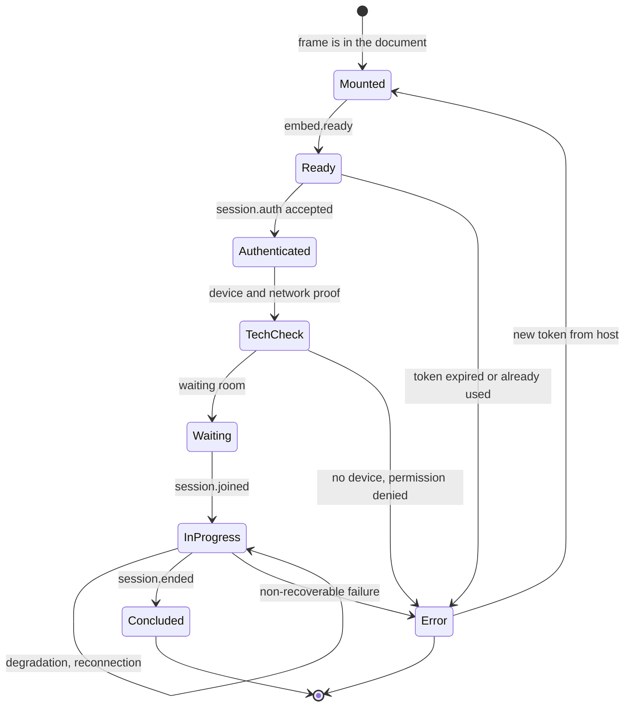

# Embeddable component

Modality **C** makes the consultation room appear inside your interface. The professional does
not change application, does not do a second sign-in, does not copy identifiers.

**It is not an informative widget.** It is an application that accesses **camera, microphone and
screen sharing**, that manages a health act and that must remain accessible to an elderly patient
on mobile network. Every requirement in this chapter stems from one of these three facts.

## 1. The four variants

| Variant | Isolation | When |
|---|---|---|
| **Embedded frame** on separate origin | **Total.** Separate execution context: the session token is not in your application's memory | Default, when you control the hosting page headers |
| **Custom element wrapping the frame** | Total: isolation stays with the underlying frame | You want HTML tag ergonomics without managing difficult configuration by hand |
| **New tab** | Total, and **no permission delegation problem** | You cannot serve headers: portal managed by third parties, closed content manager |
| **Full-page view** in native mobile application | Total | Native host: there is no HTML document that can delegate permissions |

There is a fifth technical possibility - a component that runs **in the same execution context**
as your application - offered **only for non-clinical elements**: launch button, status indicator,
audio and video device test, network quality indicator. The reason is in §10.

## 2. Permissions: the number one cause of failures

### 2.1 The rule of two conditions

For a frame loaded from a different origin to use the camera, **both** conditions must hold:

1. the function must be permitted in the **permission policy of the upper-level document** - that
   is, the header served by **your** page;
2. the function must be permitted in the **frame attribute**.

**The attribute restricts, it does not grant.** It cannot give what the upper level denies. If you
do not serve the header, the behaviour falls back to the browser default, which for camera,
microphone and screen capture is restrictive: a frame on a different origin does not get the
permission and the media access request fails with a permission denied error.

> **The header on your page is necessary, not optional.** There is no Telemedic-side configuration
> that can substitute it: it is a decision that belongs to the hosting document, by construction of
> the browser's security model.

### 2.2 Permitted values in permission lists

| Value | Meaning |
|---|---|
| `*` | Permitted everywhere, regardless of origin. **Do not use** |
| `()` | Disabled everywhere |
| `self` | Only for documents and frames of the **same** origin |
| `src` | **Only in the frame attribute**: permitted if the loaded origin matches the declared one. It is the frame attribute default |
| `"https://origin"` | Specific origins, separated by space |

### 2.3 Correct configuration

On the hosting page:

```http
Permissions-Policy: camera=(self "https://embed.telemedic.example"),
                    microphone=(self "https://embed.telemedic.example"),
                    display-capture=(self "https://embed.telemedic.example"),
                    fullscreen=(self "https://embed.telemedic.example")
```

In the markup:

```html
<iframe
  id="telemedic-frame"
  src="https://embed.telemedic.example/room?s=ses-01J9ZC5P"
  title="Video consultation - consultation room"
  allow="camera 'src'; microphone 'src'; display-capture 'src'; fullscreen 'src'; autoplay 'src'"
  sandbox="allow-scripts allow-same-origin allow-forms allow-popups-to-escape-sandbox allow-storage-access-by-user-activation"
  referrerpolicy="strict-origin-when-cross-origin"></iframe>
```

### 2.4 The five points almost always got wrong

1. **Screen capture is a separate function.** It must be listed separately. If you forget it, audio
   and video work and screen sharing does not: it is the most confusing symptom of the whole family,
   because it looks like a product defect.
2. **The attribute without explicit list equals "only the declared origin".** If the frame
   **navigates to a different origin** after loading - for example towards an authentication screen -
   **the permission is lost**. It is one of the reasons why token delivery happens between back-ends
   (§5) and the frame **never redirects to other origins** after loading.
3. **Autoplay is needed** because the remote video element must start without a user gesture.
4. **No permission beyond these.** If the component asked for geolocation or something else without
   necessity, it would be a negative signal in your security review. It does not.
5. **Detection of this condition is possible.** The permission policy supports configuration of a
   reporting destination: in pre-production, configure it and turns "does not work" into a diagnosis
   in thirty seconds.

## 3. Isolation

### 3.1 Which restrictions actually matter

The restriction attribute applies **all** limitations if empty; each value removes one.
The minimum configuration for a real-time communication application:

| Value | Needed? | Why |
|---|---|---|
| Script execution | **Yes** | Without it, there is no real-time communication |
| Same origin | **Yes** | Without it, the document is treated as opaque origin: no local storage, no storage access, and in many cases no persistent device access |
| Forms | Yes | For internal forms: clinical note, consent |
| Modal dialogues | Only if needed | The component prefers its own windows to browser ones, for accessibility reasons |
| Popups | **No** | To be avoided |
| Escape restriction for opened windows | Yes, if you open external links | Prevents an opened window inheriting the restriction |
| Downloads | Only if you download the document from the frame | Better to download from the host |
| Storage access on user activation | **Yes** | Prerequisite, even if the architecture is cookie-free (§6) |
| Navigation of upper-level document | **No, ever** | Would allow the frame to navigate your page: it is hijacking in reverse |

### 3.2 The caution to know, and its inversion

Web platform documentation strongly advises against combining script execution with same-origin
permission **when the embedded document is same-origin as the embedding page**, because in that
case the embedded document can remove the restriction attribute from its own element, rendering the
restriction ineffective.

In Telemedic's case **the frame is on a different origin**, so the combination is correct.

> **But the caution applies in reverse if you serve the component from your own origin**
> with a reverse proxy - something some integrators will do to work around storage problems. In that
> case restriction becomes illusory, **isolation between your code and the clinical session ceases to
> exist**, and security rests only on content policy and application isolation. It is a configuration
> the project **does not support** and must be declared if adopted.

The attribute that loads a frame in an ephemeral context without storage access **is not usable**: the
session needs its own state. It should be mentioned only to exclude it, because it is a recurring
proposal in security reviews.

## 4. Who can embed

The directive declaring which origins can embed a page is **dynamically generated per session**, not
static: it contains only the origins registered for **that** tenant.

```http
Content-Security-Policy:
  default-src 'self';
  script-src 'self';
  style-src 'self' 'nonce-r4nd0m';
  img-src 'self' data: https://cdn-branding.telemedic.example;
  media-src 'self' blob:;
  connect-src 'self' https://api.telemedic.example wss://signaling.telemedic.example;
  font-src 'self';
  frame-ancestors 'self' https://gestionale.integratore.example;
  base-uri 'none';
  form-action 'self';
  object-src 'none';
  worker-src 'self' blob:;
  report-to csp-endpoint
X-Content-Type-Options: nosniff
Referrer-Policy: strict-origin-when-cross-origin
```

Four facts to know, because they produce poorly diagnosed failures:

1. **The ancestors directive has no fallback to the default directive.** A policy with only default
   directive **does not** prevent embedding.
2. **It cannot be set from a metadata element in the document**: only HTTP header.
3. **In case of nested frames it is verified on each ancestor.** If even one does not match,
   loading is cancelled. **If you embed the component inside another frame, all origins in the chain
   must be registered**, and must be declared at onboarding.
4. **The historic header for controlling embedding is not sufficient**: it admits only two absolute
   values and permits only one origin. A product that must be embeddable by many different integrators
   is not expressible with that. It is emitted at most as a fallback for very old programs, knowing
   it will be restrictive.

**A single registry of origins** feeds the ancestors directive, the permitted origins for
cross-origin sharing and message validation (§5). Three separate configurations diverge always, and
divergence manifests as an intermittent failure.

If the session is not associated with a valid tenant, the directive emitted forbids all embedding.

## 5. Token delivery and messaging protocol

### 5.1 The token never goes through the address

```mermaid
sequenceDiagram
    autonumber
    participant BE as Your back-end
    participant API as Telemedic
    participant UI as Your page
    participant FR as Frame of the component

    BE->>API: request an entry token for this session and this actor
    API-->>BE: single-use token, 45 s, tied to the expected hosting origin
    BE-->>UI: render the page with the frame; token is in memory, not in the address
    UI->>FR: mount the frame (the address contains only a non-sensitive identifier)
    FR-->>UI: embed.ready
    UI->>FR: session.auth with the token
    FR->>API: redeem the token
    API-->>FR: session credentials, held in memory
    FR-->>UI: session.joined
```

**Why not in the address.** Addresses end up in browser history, reverse proxy logs, referrer
headers to third parties, screenshots and error monitoring tools. A token in an address is a leaked
token.

If an integrator cannot execute code in the hosting page - it happens with some content managers - the
only acceptable compromise is a token with validity **no more than thirty seconds**, single-use, tied
to the origin, with tracing of every redemption. It must be explicitly requested and stays documented
as a deviation.

The redeemed credentials stay **in memory**, not in local or session storage: in a third-party context
they are partitioned anyway, and persistence would add surface without benefit.

### 5.2 The six non-negotiable rules of messaging

1. **Never generic destination** in message sending. If the frame navigates or is replaced, the
   message would go to an arbitrary origin.
2. **Always validate the origin in receiving**, with **exact comparison** against a list.
   Never suffix or containment comparison: `https://gestionale.integratore.example.attacker.test`
   passes both.
3. **Validate message structure with a schema**, not with a type check. What arrives on a messaging
   channel is untrusted input in every respect.
4. **Validate the source** against the expected window reference.
5. **No secrets in messages**, except the single-use entry token, and only after the origin has
   been verified.
6. **Explicit namespace of the protocol**, to not collide with other components on the same page.

### 5.3 Format and message types

```ts
interface TelemedicMessage<T = unknown> {
  readonly protocol: 'telemedic.embed.v1';  // namespace discriminant
  readonly id: string;                       // unique message identifier
  readonly replyTo?: string;                 // identifier of the message being replied to
  readonly type: string;
  readonly payload: T;
}
```

| Direction | Type | Meaning |
|---|---|---|
| component → host | `embed.ready` | Loaded, waiting for token |
| host → component | `session.auth` | Delivery of single-use token |
| component → host | `session.joined` | The user entered the room |
| component → host | `session.ended` | Service concluded, with outcome and references |
| component → host | `session.error` | Error, with type aligned to problem catalogue ([03 §8](03-integrazione-per-api.md)) |
| component → host | `ui.resize` | Height requested |
| component → host | `ui.requestClose` | The user asked to close |
| host → component | `ui.theme` | Theme update within the limits of §7 |
| host → component | `session.terminate` | Host closes the session |
| bidirectional | `heartbeat` | Detection of a blocked component |

**The protocol and its types are contract** and follow the twelve-month dismissal process.
The version is in the namespace (`telemedic.embed.v1`): a breaking change produces `v2`, and the
two versions coexist.

### 5.4 After startup, a dedicated channel

After the initial exchange it is possible to move to a **dedicated messaging channel**: the hosting
page transfers a port to the component and subsequent messages travel on that, **not visible** to
other listeners on the page. It is preferable when your page also hosts components from other vendors.

### 5.5 When not to use messaging

- **To transfer clinical data**: use the application interface. Messaging crosses the browser context
  of the user, where extensions and other scripts can observe.
- **To authorise**: a message is not proof of identity. The token delivered on this channel is
  single-use, very short-lived and redeemed between back-ends precisely because the channel is not
  trusted.
- **When the host is a healthcare records system that implements a standard application messaging
  protocol**: there a standardised vocabulary exists and must be preferred. See [06 §7](06-identita-e-delega.md).

## 6. Cookie-free architecture

### 6.1 The decision

**The component does not use cookies.** Session credentials arrive from token redemption and live
in memory; every call carries authorisation in the header; renewal happens with the current token,
not a cookie.

### 6.2 Why

A frame on a different origin is a **third-party context**. Every cookie set inside it is a
third-party cookie. If the browser blocks or partitions them:

- a session based on cookies **does not establish**;
- a redirect towards an identity issuer for a silent sign-on **does not recognise the session**
  and fails, or forces an interactive sign-on that inside a frame is often itself blocked;
- **the behaviour varies per browser, per version and per user configuration**, so the defect is
  intermittent and not reproducible in the lab. It is the worst class of problems to support.

The ecosystem state is in motion and predictions have been proved wrong repeatedly. What stays
true regardless of predictions: a significant share of users operate **today** with third-party
cookies blocked or partitioned, and the share is higher in healthcare for the prevalence of
certain platforms. **Designing assuming that third-party cookies do not work is the only
defensible choice.**

### 6.3 The alternatives, and why they were rejected

| Strategy | Evaluation |
|---|---|
| **No cookies** | **Adopted.** Immune to blocking on all browsers; no dependency on storage access mechanisms. Cost: frame reload loses state and requires a new token - acceptable, because a consultation session has defined duration and the host can re-issue the token |
| **Partitioned cookies** | Allowed **only for non-essential state**: audio and video device preferences, language, with clean degradation if the cookie is missing. Partition by first-party site is, in a multi-tenant product, **functionally correct**: it is exactly the isolation you want |
| **Explicit storage access request** | **Excluded.** Requires a user gesture and, on many browsers, a request window. In a clinical flow where the professional expects the video to start on click, inserting a storage consent request is usability damage and a signal of poor perceived quality. Also rules differ between browsers: it is a permanent support surface |

### 6.4 How to verify

It is an architectural requirement, not an intention: there is a dedicated automated test that runs
the entire consultation path **with all third-party cookies blocked**. If that test passes, the entire
class of problems is closed structurally.

## 7. Theme and invaluable limits to customisation

### 7.1 What you can change

A **closed and versioned** set of properties. Only the documented ones are supported: everything else
is internal and changes without notice. Without this rule, every style restructuring would become a
breaking change for someone.

```css
:root {
  /* colour */
  --tm-color-brand:            #0b5fff;
  --tm-color-brand-contrast:   #ffffff;
  --tm-color-surface:          #ffffff;
  --tm-color-surface-variant:  #f2f4f7;
  --tm-color-on-surface:       #101828;
  --tm-color-danger:           #b42318;
  --tm-color-success:          #027a48;
  /* typography */
  --tm-font-family:            system-ui, -apple-system, "Segoe UI", Roboto, sans-serif;
  --tm-font-size-base:         16px;
  /* form */
  --tm-radius-sm:              4px;
  --tm-radius-md:              8px;
  --tm-spacing-unit:           4px;
  /* branding */
  --tm-logo-url:               url("https://cdn-branding.telemedic.example/t/asl-nord-01/logo.svg");
}
```

Three transport channels, in order of preference: **per-tenant configuration** registered via the
application interface (auditable, validatable, not manipulable from the browser); **style address
published by the host**, when the component is started from a healthcare records system conformant
to standards; **theme message**, for dynamic synchronisation like switching light to dark.

### 7.2 Invaluable limits

This section is non-negotiable and has no exceptions for tenant, contract or specifications.

**Limit 1 - Elements not themeable or hideable.**

| Element | Why |
|---|---|
| Indicator of **recording in progress** | Must be persistent and not hideable for the entire duration. When recording is active, the session **is no longer end-to-end encrypted**: it is information the person has the right to have at every instant |
| **Consent notices and warnings** | The text that has relevance for safe use is not modifiable by the integrator. A reformulated consent is no longer the validated consent |
| Outcome of **key verification** | It is what makes end-to-end encryption demonstrable, and is a traced risk control. It must be read by a screen reader, not conveyed by colour alone, and understandable to an elderly patient |
| **Clinical error messages** | An error that hides its own severity is more dangerous than the error itself |
| **Encryption status indicator** | As above |

**Limit 2 - No injection of arbitrary stylesheets.** Allowing the integrator to inject style is a
vector for interface manipulation: consent warnings can be hidden, clinical labels altered, elements
overlaid, a confirm button moved under a finger about to press another. In a system whose usability is
subject to formal validation, it is unacceptable.

**Limit 3 - Automatic contrast verification, server-side, with refusal.** If you configure a brand
colour that produces insufficient contrast, **the configuration is refused at save**, with an error
showing the ratio obtained and the required one. It is not a warning: it is a refusal. Accessibility
is a functional requirement, and an integrator must not be able to degrade the accessibility of a
system that declares it.

```json
{
  "type": "https://docs.telemedic.example/problems/contrast-ratio-insufficient",
  "title": "Contrast insufficient",
  "status": 422,
  "detail": "The proposed brand colour produces a contrast ratio of 2.7:1 on normal text. The minimum required is 4.5:1.",
  "instance": "/v1/tenants/asl-nord-01/branding",
  "violations": [
    { "pointer": "#/tokens/--tm-color-brand", "measured": "2.7:1", "required": "4.5:1" }
  ]
}
```

**Limit 4 - System preferences are not disableable.** Reduced motion, high contrast, user-set font
size: the component respects them always, and no theme configuration can override them.

**Limit 5 - Grammatical validation of every value.** Colour in a permitted notation, length in a
permitted unit, font name in an allowed list. An unvalidated style value inserted in a style block
is an injection vector. The branding address accepts **only** secure connection to whitelisted hosts:
an arbitrary address would be an outbound request from the patient's browser to a third party, with
provenance leakage and possibility of tracking.

**Limit 6 - If theme is applied inline, a unique value per block**, not a generic inline style
permission in the content policy.

### 7.3 What happens if you try to circumvent them

Nothing dramatic and nothing hidden: the configuration is refused with an explicit problem, and the
refusal is traced. There is no path in which the circumvention "works but is discouraged". It was a
possible choice and was not made, because a recommendation you can ignore in a validated system is
equivalent to not having the requirement.

## 8. Lifecycle

### 8.1 The states



### 8.2 What the host must do in each state

| State | Your task |
|---|---|
| Mounted | Nothing. Do not deliver the token before `embed.ready`: it would be lost |
| Ready | Deliver the token **once** and remove it from memory |
| Error on token | **Request a new token from your back-end.** The token is single-use: a page reload requires another |
| Tech check | Do not hide and do not skip this phase. It is what prevents a device problem from being discovered with the patient already connected |
| In progress | Do not reload the frame, do not change its address, do not move it in the DOM: detach and reattach an element produces destruction and reconstruction |
| Concluded | Close the container, apply the outcome, **do not reuse the same frame** for a new session |

### 8.3 Resizing

The component communicates the height needed. **Limit the value you apply**: an arbitrary height
from embedded content is still external input.

```js
case 'ui.resize':
  if (Number.isFinite(msg.payload?.height)) {
    frame.style.height = Math.min(Math.max(msg.payload.height, 320), 2000) + 'px';
  }
  break;
```

### 8.4 Accessibility across the boundary

The boundary between two documents is a boundary also for focus and tab order. Three rules for your
page:

1. **The frame always has a descriptive title.** It is what a screen reader announces:
   "Video consultation - consultation room", not "iframe".
2. **Do not trap focus outside the frame.** If your modal container has a focus trap, it must include
   the frame.
3. **Do not hide the frame with techniques that make it invisible to the accessibility tree**
   while keeping it active: a consultation that continues in a hidden element is a safe use problem,
   not a UI trick.

### 8.5 Degradation and reconnection

Degradation is managed by the component, not by you: **audio always takes priority over video**.
What concerns you is **not interfering**: do not reload the frame when the network worsens, do not
apply automatic page reload policies, do not suspend the execution context with energy-saving
techniques applied to background tabs.

## 9. The custom element variant

The distributed package exposes a custom element that **wraps the frame**, not an application
running in your context. It is the best solution for most integrators: ergonomics of an HTML tag,
frame isolation.

```html
<script type="module"
        src="https://cdn.telemedic.example/elements/1.0.0/telemedic-room.js"></script>

<telemedic-room
  session-id="ses-01J9ZC5P"
  api-base="https://api.telemedic.example/v1"></telemedic-room>

<script>
  const el = document.querySelector('telemedic-room');
  el.entryToken = singleUseToken;          // property, not attribute
  el.addEventListener('sessionEnded', (e) => onConsultoConcluso(e.detail));
</script>
```

> **The token is passed as property, never as attribute.** An attribute is visible in the document,
> screenshots, document snapshots collected by error monitoring tools and development tools.

The element handles difficult configuration - restrictions, permissions, origin validation, messaging -
which is exactly the point where integrators get it wrong. **The documentation explicitly states that
isolation is guaranteed by the underlying frame**, to not let it be believed to be an in-process
component.

Two cautions: if your content policy does not permit scripts from external origins, loading fails and
you must host the file; and the version must **be pinned**, never float - a component that updates by
itself inside a validated application is a regression risk that cannot be governed.

## 10. When not to use embedding

| Situation | Why not | Alternative |
|---|---|---|
| The component must **blend** into the layout: button, label, table row | A rectangular frame with separate context is disproportionate for a button | **Non-clinical** custom element |
| You cannot serve headers on the hosting page | Media permissions never arrive. It is a blocker, not a difficulty | **New tab**, in first-party context |
| The host is a native mobile application | There is no document that can delegate permissions: delegation happens at operating system level | Full-page view |
| You serve the component from your own origin with a reverse proxy | Isolation ceases to exist and the configuration is not supported | Frame on different origin |
| You want an in-process component that handles the session token | The session token would end up in the same execution context as your application: **a single script injection vulnerability in your system becomes access to clinical sessions**, and the project has no control over your code quality. In risk analysis it is a non-mitigatable risk | Frame |
| You want to hide the recording indicator or reformulate consent text | It is not permitted, and the refusal is traced | - |
| The host is a healthcare records system that knows how to launch clinical applications | There is a standard mechanism that also brings the context - which patient, which encounter - without you passing it by hand | Clinical context launch, [06 §7](06-identita-e-delega.md) |
