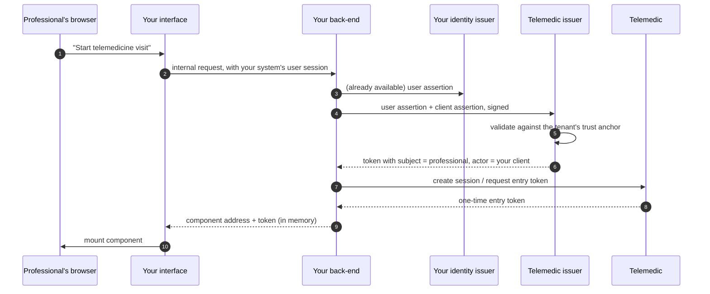

# Identity and delegation

It is the chapter with the most difficult-to-correct consequences. An error in an interface is fixed with a release; an error in the identity model produces an access log that does not answer the questions it must answer, and that log cannot be reconstructed.

## 1. The four questions

Every call that arrives at Telemedic must answer four distinct questions. Confusing them is the origin of most problems in this family.

| # | Question | What answers it |
|---|---|---|
| 1 | **Which system** is calling? | Client authentication: assertion signed with the integrator's private key |
| 2 | **On behalf of which person**? | The subject of the token, derived from the identity that your system has authenticated |
| 3 | **With which assurance level** that person was identified? | The assurance level, and - central point of this chapter - **by whom it was established** |
| 4 | **What is it permitted to do**? | The scopes granted, plus the tenant's domain rules |

Question 3 is the one systems omit. An access log that knows *who* read a piece of data but does not know *who assured that it really was that person* is an incomplete log, and in a context where some operations are bound by law to strong authentication it is also a misleading log.

## 2. The trust model

### 2.1 The trust anchor is per tenant

At onboarding, for **each tenant**, a trust anchor is registered towards your identity issuer:

| Entry | Synthetic example | Why |
|---|---|---|
| Permitted issuer | `https://idp.integratore.example` | It is the only issuer whose assertions the tenant accepts |
| Address of the public key material | `https://idp.integratore.example/.well-known/jwks.json` | Signature verification. In allowlist: an arbitrary address from a header is never followed |
| Permitted algorithms | `ES384`, `RS256` | Never missing algorithm, never symmetric algorithms verified with public key |
| Expected audience | `gestionale` | If the assertion declares an audience, it must be that one |
| Field mapping | which field carries the fiscal code, which the role, which the organisation | **Configurable per tenant, never hardcoded**: no integrator has the same schema |
| External levels accepted, per operation | see §5.4 | Part of the integration contract, not the code |

### 2.2 The rule that prevents the most obvious attack

> **The client that presents a request is bound to the tenant; the tenant is bound to a trust anchor. An assertion whose issuer is not the trust anchor of the calling client's tenant is never accepted.**

Without this control, integrator A could present an assertion issued by integrator B's issuer and obtain a token for an identity that does not belong to them. The rule seems obvious written this way; it is omitted with surprising frequency.

### 2.3 What is validated, always

Signature; issuer; expiry; initial validity; audience, if registered; algorithm in allowlist; unique identifier not already used. And, in addition to what is formally required: **coherence between the client's tenant and the tenant derivable from the mapped fields**.

## 3. Delivering identity without a second login

### 3.1 The problem

A professional is authenticated in your system. They press "start telemedicine visit". The consultation room must appear, inside your interface, **without login screen and without visible redirect**. Telemedic must know who they are, for which tenant, with which permissions, and that the claim "this is Dr X" comes from a trusted issuer and not from the browser.

The last condition **excludes any solution in which the browser carries an identity assertion to Telemedic**: it would be manipulable. Propagation occurs **between back-ends**.

### 3.2 The flow



**The crucial points are steps 4–6.** The user's assertion never reaches Telemedic's browser and never appears in an address.

### 3.3 The two mechanisms

The project documents **two** mechanisms that solve the same problem with different vocabularies. The choice depends on the version of the identity federation product actually installed, and this dependency must be stated instead of being hidden.

| | **Assertion as authorisation grant** | **Token exchange** |
|---|---|---|
| Reference | RFC 7523 §2.1 | RFC 8693 |
| Grant type | `urn:ietf:params:oauth:grant-type:jwt-bearer` | `urn:ietf:params:oauth:grant-type:token-exchange` |
| The external assertion goes in | `assertion` | `subject_token` |
| Documented mode | **Primary** | Alternative |
| Expression of delegation | In the issued token | In the issued token, and optionally with an actor assertion |

Example with token exchange, which is the most explicit form:

```http
POST /realms/clinic/protocol/openid-connect/token HTTP/1.1
Host: telemedic.example
Content-Type: application/x-www-form-urlencoded

grant_type=urn%3Aietf%3Aparams%3Aoauth%3Agrant-type%3Atoken-exchange
&subject_token=eyJhbGciOiJFUzM4NCIsImtpZCI6ImludC0yMDI2LTA4In0…
&subject_token_type=urn%3Aietf%3Aparams%3Aoauth%3Atoken-type%3Aaccess_token
&audience=telemedic-api
&scope=https%3A%2F%2Ftelemedic.example%2Fscopes%2Fsession.start%20system%2FEncounter.cu
&requested_token_type=urn%3Aietf%3Aparams%3Aoauth%3Atoken-type%3Aaccess_token
&client_assertion_type=urn%3Aietf%3Aparams%3Aoauth%3Aclient-assertion-type%3Ajwt-bearer
&client_assertion=eyJhbGciOiJFUzM4NCIsImtpZCI6ImludC0yMDI2LTA4In0…
```

```json
{
  "access_token": "eyJhbGciOiJFUzM4NCIsImtpZCI6InRtLTIwMjYtMDgifQ…",
  "issued_token_type": "urn:ietf:params:oauth:token-type:access_token",
  "token_type": "Bearer",
  "expires_in": 300,
  "scope": "https://telemedic.example/scopes/session.start system/Encounter.cu"
}
```

### 3.4 Delegation, never impersonation

It is the most important distinction of the chapter and is normative, not stylistic.

| | Impersonation | **Delegation** |
|---|---|---|
| What is transmitted | Only the subject's identity | Subject's identity **and** the actor's |
| What the token says | "I am Dr X" | "I am system Y acting on behalf of Dr X" |
| What the access log records | "Dr X did Z" | "Dr X did Z **via system Y**" |
| Permitted by the project | **No** | **Yes, always** |

> **The project uses delegation exclusively.** With impersonation, to the question "which system acted on behalf of which person" the log has no answer. In a context where the audit must stand up to clinical challenge or regulatory review, it is the difference between a useful log and a useless one.

The token issued, with delegation:

```json
{
  "iss": "https://telemedic.example/realms/clinic",
  "aud": "telemedic-api",
  "sub": "https://idp.integratore.example#prof-001",
  "act": {
    "sub": "gestionale-integratore-prod",
    "iss": "https://telemedic.example/realms/clinic"
  },
  "acr": "urn:telemedic:acr:asserted-by-issuer",
  "auth_source": {
    "kind": "federated-partner",
    "iss": "https://idp.integratore.example",
    "acr_asserted": "https://www.spid.gov.it/SpidL2",
    "verified_by_telemedic": false
  },
  "exp": 1787654621,
  "iat": 1787654321,
  "jti": "0f5b1c2d-9a8e-4b7f-a1c2-3d4e5f6a7b8c",
  "scope": "https://telemedic.example/scopes/session.start system/Encounter.cu",
  "tenant": "asl-nord-01",
  "fhirUser": "https://api.telemedic.example/fhir/Practitioner/prc-8812"
}
```

Notes on the fields:

- **`sub` is not an identifier invented by the project**: it is derived deterministically from the issuer and the subject of the original assertion. It respects the rule that Telemedic does not become the reference data, and guarantees that two people with the same name from two different integrators do not collide.
- **`act` is the standard field that expresses delegation** (RFC 8693 §4.1). Its presence is what distinguishes delegation from impersonation.
- **`acr`, `auth_source`, `acr_asserted`, `verified_by_telemedic` and the value `urn:telemedic:acr:asserted-by-issuer`**: the first is standard, the others are **project proposals**, registered as proprietary extensions and documented as such. See §5.

### 3.5 The state of support, declared

> **`[NV]` - Verification on critical path.** The availability of token exchange in the variant *from external issuer to internal issuer*, and the maturity state of the assertion grant, **depend on the version of the identity federation product adopted** and must be verified on the version actually installed before declaring the function as available in production. It is a rule of quality in the software lifecycle: **a functionality that relies on a function in preview is not declared stable.**
>
> Practical consequence for you: ask your representative which mechanism is active on the installation you are integrating with, instead of assuming it. Ask **at the beginning**, not at acceptance test.

## 4. Delegation between organisations

### 4.1 Three relationships that all call themselves "delegation" and are not the same thing

| Relationship | What it is | How it is represented |
|---|---|---|
| **Technical delegation** | A system acts on behalf of a person who has authenticated | The actor field in the token |
| **Organisational delegation** | An organisation operates on behalf of another: a service company managing the infrastructure of a healthcare facility; an aggregator towards the federation | Nested chain of actors, plus a written agreement between the parties |
| **Delegated access of the data subject** | A patient authorises a family member or caregiver to act on their behalf | **Not an identity matter**: it is a consent, with temporal validity, perimeter and revocation. It does not pass through the token |

The first two are authentication mechanisms; the third is a domain matter with its own discipline, and **must not be represented as identity**. A caregiver accessing "as" the patient produces a log in which it is not possible to distinguish who actually acted: it is exactly impersonation, with the same consequences.

### 4.2 Nested chain

If your system acts in turn on behalf of a third party, the chain is preserved:

```json
{
  "sub": "https://idp.integratore.example#prof-001",
  "act": {
    "sub": "gestionale-integratore-prod",
    "act": {
      "sub": "societa-di-servizi-01"
    }
  }
}
```

The access log preserves the chain **in its entirety**. The permitted depth is limited and configured per tenant: an arbitrarily long chain is a signal of a poorly designed trust model, not a feature.

### 4.3 What the project asks of those who delegate

1. **A written agreement** between the parties, which establishes who is responsible for what. See [09](09-obblighi-di-chi-integra.md).
2. **An identity of the intermediate actor**, with its own keys. Reusing the delegator's keys cancels the distinction.
3. **The ability to revoke a single link.** If revoking the intermediary requires revoking the delegator as well, the chain is not governable.

## 5. Propagation of assurance level

### 5.1 The scale and correspondence

The levels of national digital identity correspond to assurance levels regulated internationally:

| National level | International correspondence | Factors |
|---|---|---|
| Level 1 | LoA2 | Single factor |
| Level 2 | LoA3 | Two factors, not necessarily based on certificates |
| Level 3 | LoA4 | Two factors **based on digital certificates**, with private keys on compliant device |

Values are expressed as identifiers (`https://www.spid.gov.it/SpidL1|SpidL2|SpidL3`) and the same values are also used in requests towards the other national channel. The complete treatment is in [10 §04 §7](../10_fondamenti/04-identita-e-anagrafiche.md).

### 5.2 Performed versus asserted: the distinction that governs everything

The level **does not travel in the actor field**, and must not: that field expresses **who acts**, while the level is a property **of the subject's authentication**. Putting it there would be semantic abuse.

The level is in the authentication context field, **and its semantics changes with the direction of the chain**:

| Scenario | Who authenticated the person | What the level in the issued token means |
|---|---|---|
| The patient authenticates **on Telemedic** with national digital identity | Telemedic, via the federation | **Authoritative**: the project performed or requested authentication |
| The professional is authenticated **by your issuer** and the identity arrives by delivery | You | **Asserted**: the project reports what the assertion declares, not what it verified |

> **Copying the level from the external assertion into the issued token without qualifying it would be incorrect**: it would make authentication verified by the project appear, which the project has not performed.

Hence the two-value representation, with an explicit marker:

```json
// authentication PERFORMED by the project
{
  "acr": "https://www.spid.gov.it/SpidL2",
  "auth_source": {
    "kind": "national-federation",
    "channel": "spid",
    "acr_requested": "https://www.spid.gov.it/SpidL2",
    "acr_asserted":  "https://www.spid.gov.it/SpidL2",
    "verified_by_telemedic": true
  }
}
```

```json
// authentication ASSERTED by an integrator
{
  "acr": "urn:telemedic:acr:asserted-by-issuer",
  "auth_source": {
    "kind": "federated-partner",
    "iss": "https://idp.integratore.example",
    "acr_asserted": "https://www.spid.gov.it/SpidL2",
    "verified_by_telemedic": false
  }
}
```

### 5.3 The verified trap: requested versus asserted

There is a technical fact, established on the technical rules of the national channel based on electronic identity documents, that changes the correct way to implement propagation:

> **The return assertion always reports the highest level**, regardless of the factor with which the user actually authenticated. An access with password only and an access with card and PIN produce the same assertion.

Three consequences:

1. **The actual level is not derivable from the assertion.** The only lever is **the request**: the level is imposed in the requested authentication context and reliance is placed on the issuer.
2. **The propagated level is the requested one, not the asserted one**, and **both** are recorded in the access log. It is the only way to respect non-repudiable auditability without stating the false.
3. **Level upgrade is not verifiable by the service provider side.** If the service requires a level and the user accesses with a lower one, the refusal must come from the issuer: the provider has no way to notice afterwards.

> **`[NV]` - Recommended empirical verification by `TECH`.** Point 1 follows from the published technical rules and is verified on source, but has consequences relevant enough to merit **pre-production verification** before publicly declaring how the assurance level propagates. It is a verification at near-zero cost and goes on the critical path.

### 5.4 The authorisation rules that follow from it

1. **An operation that regulations bind to strong authentication requires performed authentication.** An assurance level asserted by third parties **does not satisfy** a regulatory requirement that falls on the project or whoever installs it. This applies in particular to access to the electronic health record and to access to national infrastructures.
2. **An internal clinical operation** - starting a consultation, drafting a document - **may** accept asserted identity, provided the tenant's trust anchor permits it explicitly and the asserted level reaches the configured threshold.
3. **The configuration "which external levels are accepted for which operation" is per tenant** and is part of the integration contract, not the code.
4. **Every line of the access log carries the authentication context, its origin and the entire delegation chain.** It is the minimum to answer the question "which system acted on behalf of which person, with which guarantee of identity".

An example of configuration per tenant, in concise form:

| Operation | Minimum level | Asserted identity accepted? |
|---|---|---|
| The patient enters their own telemedicine visit room | Level 2 | Yes, if the tenant permits it |
| The patient consults their own clinical history | Level 2 | Yes, if the tenant permits it |
| The professional accesses data of **other** subjects | Level 2 minimum, level 3 configurable | Yes |
| Access to a national infrastructure requiring strong authentication | Level 2 | **No: only performed** |
| Tenant administration, key management, massive exports | **Level 3 recommended** | **No: only performed** |

### 5.5 The hidden cost of level upgrade

This paragraph concerns **whoever installs**, not who integrates, but must be known because it conditions what the tenant can offer you.

The connector towards national identity providers configures the requested authentication context **statically per provider instance**. If the level must vary per operation, **two instances per provider are needed** - one per level. The number of providers is read from a national registry and changes over time, so the multiplier acts on a set of variable cardinality.

Operational consequences, verified:

- the service provider metadata document contains **an assertion consumption address for each configured instance**: doubling the instances doubles the document's indices **deposited with the authority**, and every change entails a new deposit. It is procedural cost, not code cost;
- the organisation data in the document come from the **first instance in alphabetical order**: the naming convention of aliases becomes a correctness constraint, and must be verified automatically;
- with a "at least" comparison, a higher-level credential **already satisfies** the lower-level request: the second instance serves only where exact semantics or strictly higher level is needed.

**Perimeter adopted by the project: two levels only** - level 2 as base, level 3 for tenant administration and for configurations that require it. The factor is 2, not *n*.

> **`[NV]`.** It is not verified whether the identity federation product, acting as client towards an external issuer, **forwards the requested level** through the intermediation realm. If it does not, per-operation upgrade is not obtainable by configuration alone and requires an extension. To be verified empirically on the version adopted.

**What changes for you who integrate: nothing, at the interface level.** What changes is that the level you read is the requested one, not the asserted one - and that the tenant might not have configured all the levels you expect.

## 6. What whoever installs must do, towards the national federation

It must be stated here because integrators take the opposite for granted.

> **The project is not accredited and cannot be.** The service provider towards the federation is **whoever operates the service on the network**, i.e. whoever installs. A source code repository has no "active services", has no institutional site on which to publish the list of services and has no stable entity identifier.

The project's objective is a product **compliant and verifiable in continuous integration**, not an accredited installation. What remains for whoever installs:

| Obligation | Notes |
|---|---|
| Stipulate the convention with the authority and communicate the **list of active services** | With the security level expected for each and the activities permitted per level |
| **Justify** the choice of level and the necessity of the requested attributes | Justification is an owed act towards the authority |
| Preserve the logs for the prescribed period and maintain clock synchronisation within the prescribed tolerance | |
| Manage certificate renewal and redeposit of the metadata document | The document must be treated as a versioned release artefact, with automatic comparison against what was deposited |
| Support for first-level users and notification of violations within the prescribed term | |

> **The timescales of the accreditation procedure are not declared in any primary source**, except some deadlines downstream of signature. You cannot plan against a deadline that does not exist. Whoever builds a release plan on an accreditation date is building on their own estimate, and that must be stated as such.

An alternative channel has no such dependency: authentication based on the health card certificate does not require any procedure with third parties and is therefore the only one entirely under the control of whoever installs. It has no declared assurance level in the assertion: the level must be asserted by the service provider based on the fact that authentication is two-factor on digital certificate, and it is an **evaluation**, not a datum.

## 7. Application launch in clinical context

### 7.1 The two roles, not to be confused

There is a standard profile for launching clinical applications from within an electronic health record system. The project supports it **in both directions**, and they are two distinct implementations:

| Role | Who authorises | What Telemedic does |
|---|---|---|
| **Telemedic as launched application** | **Your** system | Reads patient, appointment and professional from your clinical server. It is the natural direction when you have the electronic health record |
| **Telemedic as authority and resource server** | Telemedic | Accepts third-party applications on its clinical interface. It is the direction that enables public entity and citizen application scenarios |

### 7.2 The direction most useful to integrators

If you have a clinical record with a clinical server, application launch saves you work: the context - which patient, which encounter, which appointment - arrives **without you passing it by hand** and without the user selecting it.

```http
GET https://embed.telemedic.example/launch
      ?iss=https%3A%2F%2Fgestionale.integratore.example%2Ffhir
      &launch=xyz123 HTTP/1.1
```

The launch value is **opaque**: it must not be interpreted, it must be sent back in the authorisation request. The project discovers your issuer's addresses from a configuration document published by your clinical server.

From the token response come context parameters, and three of them solve problems that otherwise would require proprietary extensions:

| Parameter | What it solves |
|---|---|
| Need for the header with patient data | Declares whether your system **already shows** who the patient is, so the component does not duplicate the header |
| Style address published by the host | It is the **standard** mechanism of visual personalisation when launch is of this type. Use it before the proprietary channel ([05 §7.1](05-componente-incorporabile.md)) |
| Organisation identifier | Maps directly to the tenant context |
| Additional clinical context | It is the natural place for the reference to the appointment that originated the consultation |

Two security rules to apply in any case:

1. **Proof of possession of the authorisation code is mandatory**, with the only strong method: the weak method must not be supported even for compatibility.
2. **The recipient of the authorisation request is not cosmetic**: it prevents a legitimate token from being delivered to a spoofed resource server. An authority that does not validate it permits a hostile server to have valid tokens issued for itself.

And an operational caveat: **the style address points to a document served by a third party**. Treat it as untrusted input - fetch with timeout, size limit, schema validation, and the same countermeasures against requests to internal resources described in [04 §4.3](04-integrazione-per-eventi.md).

### 7.3 When not to use this profile

| Situation | Why not | Alternative |
|---|---|---|
| You do not have a clinical server and do not intend to have one | The profile presupposes a clinical resource server as recipient: without it, it reduces to an authorisation with unusual names | Identity delivery between back-ends (§3) |
| You only need to propagate identity, without clinical context | The context is the profile's added value: without it, you pay complexity for nothing | Identity delivery between back-ends |
| Communication between systems without clinical semantics, for example administrative synchronisation | The resource-type scopes do not model non-clinical capabilities | System credentials with scopes expressed as URIs |
| Citizen application that must stay authenticated for weeks | Renewal that survives disconnection, on a public client and in healthcare context, is a custody risk difficult to justify in risk analysis | Short session with local re-authentication, or client with its own back-end |

## 8. Identity antipatterns

| # | Antipattern | Why it is serious | What to do |
|---|---|---|---|
| 1 | **Passing the user's assertion to the browser** so it forwards it to Telemedic | It is manipulable and ends up in logs: it is not an identity assertion, it is a browser claim | Delivery between back-ends |
| 2 | **Impersonation** "because it is simpler" | The log loses the information about which system acted. It is irrecoverable afterwards | Delegation, always |
| 3 | **Copying the external level into the issued token without qualifying it** | It states the false: declares verified by the project an authentication by others | Explicit marker and two values |
| 4 | **Representing the caregiver as the patient** | It is impersonation with clinical motivation. Who acted becomes indistinguishable | Access delegation consent, with perimeter and revocation |
| 5 | **A single client for all environments** | An incident in testing becomes an incident in production | One client per environment, distinct keys |
| 6 | **Private key in repository or container image** | It is the most common way a key escapes | Secrets manager, startup fails if missing |
| 7 | **Role as attribute of the person** | Role is a relationship between person and organisation **with temporal validity**. As an attribute, it cannot be revoked for a single organisation nor dated | Relationship with validity |
| 8 | **Identifying the user by email address** | It changes, is reused, and in some federation products is modifiable by the user | Stable identifier from the issuer |
| 9 | **Assuming revocation is instantaneous** | A token validated locally remains valid until expiry | Short tokens, and denial list where immediacy is needed |
| 10 | **Asking for an extra attribute "because it might be useful"** | In national channels, asking for a single attribute beyond basic demographics can multiply cost per access by almost ten. And it is anyway a minimisation principle | Ask the minimum, justify it |

The last row has concrete data worth knowing when you design which attributes to request: in the published tariff table, cost per access moves from a negligible value to an order of magnitude higher when an attribute beyond basic demographics is requested. **Verification of the currency of that table is incumbent on whoever installs**, but the design principle holds anyway: every requested attribute must be justified.

## 9. Decision summary

| Your situation | Mechanism |
|---|---|
| You have an identity issuer with publishable key material | Identity delivery between back-ends, with delegation |
| You have an issuer but its assertions are opaque and there is no inspection | Ask your issuer for a signed identity assertion. Without it, there is nothing to validate |
| You have a clinical record with clinical server | Application launch in clinical context, towards you |
| You do not have an identity issuer | Project's own realm, branded per tenant. Declared cost: users have two credentials |
| No user involved: automated process | System credentials with signed assertion. No subject, no assurance level |
| The flow starts from the browser and you do not have a back-end | Authorisation code with proof of possession, with federation. **Never** identity delivery from the browser |
| Your system speaks only hospital messaging | No user identity on the channel: **node** identity, with mutual authentication. Operations are attributed to the system, not a person, and that must be stated |
