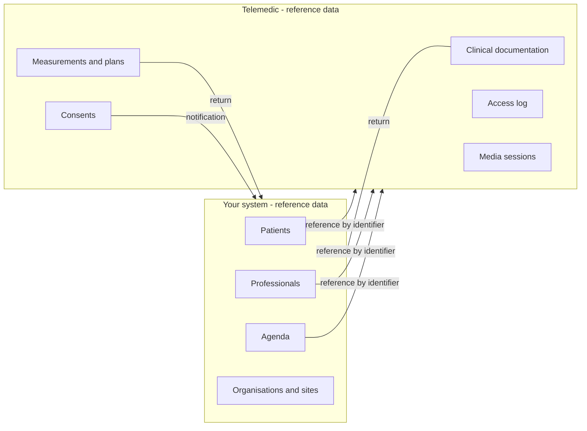
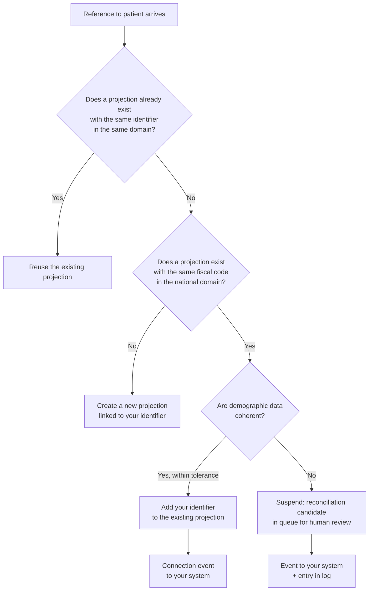

# Data and synchronisation

This chapter answers a question that seems administrative and is not: **who owns which data, and what happens when two systems say different things about the same person?**

The answer has clinical consequences. A divergence between two demographic records does not produce a data defect: it produces a merger or a split of identity, and these are adverse events. The foundations are in [10 §04 - Identity and demographic records](../10_fondamenti/04-identita-e-anagrafiche.md); here we address the boundary between the two systems.

## 1. The principle

> **Telemedic is not the reference data.** Patients, professionals, organisations, sites and appointments are governed by your system. The project conserves a **minimal projection**, linked to your identifiers, sufficient to deliver the service and produce clinical documentation.

From this follow three corollaries that apply without exception:

1. **No external identifier is a primary key.** The fiscal code is not a key: it is an identifier with an explicit attribution domain. The project treats it as such, and asks you to do the same.
2. **The project does not modify your reference data.** It does not rewrite a demographic record, does not correct a birth date, does not merge two patients in your system. It reports and asks.
3. **What the project produces - clinical documentation, measurements, consents, audit trails - is governed by the project**, and is returned to you. The direction of ownership reverses halfway through the flow, and it is the point where misunderstandings concentrate.



## 2. Identifiers and attribution domains

### 2.1 An identifier without a domain is a string

`PZ-889231` identifies no one. `PZ-889231` **in the domain `https://gestionale.integratore.example/sid/assistito`** identifies a person, verifiably and unambiguously.

Every reference you send therefore carries **two** values:

```json
{
  "system": "https://gestionale.integratore.example/sid/assistito",
  "value": "PZ-889231"
}
```

On the clinical plane the form is that prescribed by the standard:

```json
{
  "resourceType": "Patient",
  "identifier": [
    {
      "system": "https://gestionale.integratore.example/sid/assistito",
      "value": "PZ-889231"
    },
    {
      "system": "http://hl7.it/sid/codiceFiscale",
      "value": "RSSMRA80A01H501Z"
    }
  ]
}
```

### 2.2 How to declare your domain

| Rule | Reason |
|---|---|
| A unique, stable and yours identifier | Do not reuse another's, do not use a generic value |
| **One per entity type**: patients, professionals, appointments, organisations | Distinct domains prevent two equal values of different types from colliding |
| **Never changes.** Even for a change in your product's commercial domain | Changing it splits the history in two, and post-hoc reconciliation is manual |
| Need not necessarily resolve to a page | It is an identifier, not an address. That it looks like a web address is convention |
| **Register it at onboarding** | An unregistered domain is rejected: it prevents a typo from creating a second silent namespace |

The last row prevents the most frequent incident in this family: two calls with two slightly different domains - with and without trailing slash, with and without subdomain - create two patients for the same person, and no one notices until the history splits.

### 2.3 The Italian identifiers, and the verified divergence

The complete picture - fiscal code and its construction, omocodia, cases where it is missing or changes, identifiers for unregistered populations, health card, regional identifiers - is in [10 §04 §2](../10_fondamenti/04-identita-e-anagrafiche.md). Here what matters is a verified fact that concerns you directly:

> **There are two different canonical identifiers for the fiscal code in the Italian implementation guides**, both from primary source: the base guides and the one dedicated to telemedicine visits use `http://hl7.it/sid/codiceFiscale`; the national core guide uses a different identifier in its own namespace.

The project declares conformity to the telemedicine family and therefore uses **`http://hl7.it/sid/codiceFiscale`**. The consequence for you is concrete: **a consumer aligned to the other guide will not recognise the identifier**, and translation at the boundary must be planned instead of being discovered.

A second verified point that avoids a widespread error: **the generic identifier type code that many use for the fiscal code does not exist** in the standard table. The concept really present has a formation rule that composes the prefix with the three-letter country code; the result for Italy **is not enumerated**, it is generated by the rule. And **no Italian published profile fixes the value**: the choice remains contractual between you and us, and must be written in the interface profile instead of being assumed.

### 2.4 What the project conserves

A **minimal projection**, not a demographic record:

| Category | What is needed | What is not requested |
|---|---|---|
| Patient | Identifiers with domain, minimal demographic data necessary for identification during the service and for document production, contact details for invitation | Prior clinical history, therapies, allergies, except as object of the service |
| Professional | Identifiers with domain, name, **role at the organisation with its temporal validity**, possibly registration number | Personal data not necessary |
| Organisation and site | Identifiers, name | - |
| Appointment | Identifier with domain, instants, service type, participants | - |

**The minimisation principle is not formal compliance**: every field you do not send is a field that cannot be treated excessively, cannot appear in a log and cannot be subject to a breach.

## 3. Reconciliation

### 3.1 The two symmetric errors, and why they are not equivalent

| Error | What happens | Severity |
|---|---|---|
| **Erroneous merger** - two different people treated as one | The clinical document of one person ends up in another's history | **Maximum.** It is an adverse event, not a data defect |
| **Missed merger** - the same person in two records | History splits; a professional sees half the information | Serious, but **recoverable** |

The asymmetry determines the policy: **in case of doubt do not merge**. A missed merger is corrected; an erroneous merger leaves traces in signed clinical documentation, which is immutable by construction.

### 3.2 The procedure



Three rules:

1. **Automatic merger exists only for exact correspondence on a strong identifier**, with coherent demographic data. Every other case generates a **candidate**, not a merger.
2. **The candidate goes to human review**, and the review is traced with who decided and on what basis. There is no path where a merger happens without someone having decided it.
3. **Splitting is always possible**, and the project conserves what is needed to execute it: a merger that cannot be undone is a merger without responsibility.

### 3.3 The supervening events

They are the events that invalidate what the system believed. They must be managed, not suffered.

| Supervening event | Effect | What the project expects from you |
|---|---|---|
| **The fiscal code changes** (correction, acquisition of citizenship, correction of demographic error) | The national identifier is no longer the one registered | Notify the change with **both** values, old and new. The project preserves the chain, does not overwrite |
| **Omocodia** | Two people are entitled to the same code, and one is assigned a transformed code | Send the code actually assigned. Do not "normalise" the transformed code by returning it to base form |
| **From provisional identifier to fiscal code** | A person previously identified with a code for unregistered populations obtains a fiscal code | Notify the connection. It is the case where a merger is **correct** and must be executed, but remains subject to review |
| **Death** | The operations permitted and the preservation change | Notify. The project does not deduce death from absence of activity |
| **Change of professional organisation** | The role ceases at one and begins at another | Notify the **cessation**, not just the new role. A role that never ceases is an access that never revokes |

The last row produces the most durable security problems: a professional who changes facility and whose previous role no one closes maintains legitimate access from the system's point of view.

## 4. Alignment

### 4.1 Who wins

Precedence is declared **per field**, not per system, and configured per tenant. An example of typical configuration:

| Field | Precedence | Reason |
|---|---|---|
| Identifiers with domain | **The system that assigned them** | No one can rewrite an identifier from another domain |
| Name, surname, birth date | **Your system** | You are the demographic reference data |
| Contact details (phone, email) | **Your system**, with declared exception | If the patient updates a detail during the service, the project reports it; does not impose it |
| Appointment status | **Your system** until start, **the project** during and after | It is the point where ownership passes, and is the primary source of conflict (§5) |
| Clinical documentation produced | **The project** | It is the healthcare act, produced here |
| Consents acquired in the service | **The project** | With their temporal validity |
| Remote monitoring measurements | **The project** | They are immutable and carry their own context |

**Write it down.** An undeclared precedence is decided at runtime by whoever writes last, and it is how data become corrupted without anyone choosing it.

### 4.2 The three alignment modes

| Mode | When | Cost |
|---|---|---|
| **Push on occasion** | You send the reference with each call, with minimal data. The project updates the projection | No extra process. **Recommended mode** |
| **Pull on demand** | The project asks your system when it needs data you have not provided | Requires that you expose a read interface. Useful if your data change often |
| **By event** | You notify the project of relevant demographic changes | Requires an inbound channel. Useful on large volumes |

The three modes **combine**: push for the normal case, event for supervening events, pull for cases where data is missing.

### 4.3 Periodic reconciliation

Regardless of the mode, a periodic comparison is needed. Not because the mechanism is unreliable, but because **absence of divergences must be demonstrated, not assumed**.

The project exposes an extraction of the projections per tenant, with their identifiers and last update instants; you compare it against your reference data. A divergence that appears in this comparison and had not been reported is a defect to investigate, not data to correct silently.

## 5. Conflicts and their resolution

### 5.1 The matrix

| Conflict | Symptom | Resolution | Who decides |
|---|---|---|---|
| **Appointment cancelled by you while session is in progress** | Cancellation arrives at session started | **The session continues.** Cancellation is recorded as late attempt and reported. A healthcare act in progress is not cancelled for an agenda change | The project |
| **Reschedule during session** | New instant while consultation is active | As above: rescheduling applies to a **new** service, not the one in progress | The project |
| **Demographic divergence on non-identifying field** | Surname different between the two systems | Your system prevails; the project records the divergence and reports it | You, with report |
| **Demographic divergence on strong identifier** | Different fiscal code for the same your identifier | **Suspension**: reconciliation candidate, human review. No automatic overwrite | Human review |
| **Two your identifiers on the same fiscal code** | Two mergeable projections | Merger candidate, human review | Human review |
| **Document already archived by you and later replaced** | Later version arrives | **Do not overwrite**: record the replacement maintaining the chain. The signed document is immutable | The project produces, you represent |
| **Consent revoked after you have already acted** | Revocation arrives downstream | The revocation has effect **from when it was expressed**, and does not retroact on acts already done; but may require stopping ongoing treatments. The project notifies; the consequent action is yours | You, on your perimeter |
| **Concurrent modification of the same resource** | Two processes write | Rejection for failed precondition, with reload and explicit decision ([03 §6](03-integrazione-per-api.md)) | Whoever writes second |
| **Role ceased but session scheduled** | Professional is no longer enabled | The service is suspended and reported. **Not executed with a ceased role** | The project |

### 5.2 The principle governing the matrix

> **A healthcare act in progress is not a record.** The rules of data precedence do not apply to a service being performed: they apply before and after. During, the project protects the integrity of the act and records modification attempts as facts, not as updates.

It is the rule that surprises most those coming from management integrations, where whoever writes last wins. Here whoever writes last, if they write during a clinical act, is recorded and rejected.

## 6. Professionals, roles and organisations

The model is **person, role, organisation**, with role as **a relationship with temporal validity**. It is not an academic detail: it is the true access control.

The error that almost everyone makes is to model **speciality as an attribute of the person**. A professional can exercise different specialities at different organisations, and at different times; as an attribute of the person, the information cannot be dated nor selectively revoked.

What the project expects from you:

```json
{
  "practitioner": {
    "system": "https://gestionale.integratore.example/sid/professionista",
    "value": "PR-77"
  },
  "role": {
    "organization": {
      "system": "https://gestionale.integratore.example/sid/organizzazione",
      "value": "ORG-3"
    },
    "code": "cardiologia",
    "period": { "start": "2024-03-01", "end": null }
  }
}
```

And the operational rule: **notify the cessation of the role**, not just the start of a new one. A role opened without an end is permanent access.

## 7. Appointments and agenda

The project **is not an agenda** and does not aspire to become one. The appointment is born in your system; the project receives it by reference.

What is needed, at minimum:

| Field | Mandatory | Notes |
|---|---|---|
| Identifier with domain | Yes | Natural key of idempotence for ingestion |
| Scheduled instants | Yes | With explicit timezone. An instant without timezone is ambiguous twice a year |
| Service type | Yes | Determines the clinical profile applied |
| Participants with their references | Yes | Patient, professional, possible caregiver |
| Status | Yes | The project refuses launch from an incompatible state |

Repeatable ingestion uses clinical care plan creation conditioned on your identifier ([03 §5.4](03-integrazione-per-api.md)). It is the correct way for a night sync that reworks the same appointments without creating duplicates.

**What the project does not do:** it does not decide availability, does not resolve overlaps, does not apply reservability rules. If you need an agenda, the project has one - and it is a **disactivable** module, which shuts off when you have yours ([08](08-moduli-sostituibili.md)).

## 8. Documents

### 8.1 Immutability

> **The signed clinical document is immutable.** It is not modified: a later version is issued that replaces or corrects the previous one, maintaining the chain.

The consequence for your system is clear: **you must be able to represent a replacement**. Overwriting the archived document with the new version destroys the information about what was reported at a given time - which is precisely the information needed in a challenge.

| Event | What to do in your system |
|---|---|
| Document drafted | **Nothing.** It is not a valid document |
| Document signed | Archive, with reference and version |
| Document replaced | Archive the new version, **maintain the previous one** and record its relationship |

### 8.2 The informational content and its form

Content is modelled as **canonical dataset**; serialisations are **replaceable** and must not be hardcoded. On the clinical plane the report of the service is a **composition in an envelope**, not a generic diagnostic report: it is the form prescribed by national guides.

The diagnostic report form is maintained as a **read-only projection** for integrators who expect it - never as primary artefact. If your system consumes it, it works; if you must build from scratch, build on the canonical form.

### 8.3 What the project does not do with documents

- **It does not send them to national infrastructures on your behalf.** It produces the content; submission is a flow with its own obligations, terms and responsibilities, which fall on whoever delivers the service.
- **It does not generate clinical content.** The document is **persistence of content written by the professional**, not autonomous generation of clinical information. It is an architectural boundary, not a product choice.
- **It does not translate clinical codes for you** beyond what the configured terminology service permits. See [09 §6](09-obblighi-di-chi-integra.md).

## 9. Deletion and data subject rights

A data subject's request that arrives to you also touches the project, and vice versa. The framework of responsibilities is in [09 §3](09-obblighi-di-chi-integra.md); here the technical facts.

| Right | What the project can do | Limit |
|---|---|---|
| Access | Export of what concerns the data subject, per tenant | - |
| Correction | On projection data: applies to **your** data and reflects here | **Not on signed clinical documentation**: corrected with a later version, not corrected |
| Deletion | Deletion of projections and data not subject to preservation obligation | **Clinical documentation and access traces have their own preservation obligations** and are not deleted on request |
| Restriction | Suspension of unnecessary processing | - |
| Opposition to specific processing | Revocation of consents, data suppression | Data suppression has its own discipline that does not coincide with deletion |

**The most important practical consequence:** if your deletion process presupposes that everything disappears, it is a process that does not hold up. Must be designed knowing which categories have preservation obligations and for how long.

## 10. Synchronisation antipatterns

| # | Antipattern | Consequence | What to do |
|---|---|---|---|
| 1 | **Send identifiers without domain** | Two namespaces that collide, or two people who become one | Always domain plus value |
| 2 | **Change the domain** after going live | The history splits and reconciliation becomes manual | The domain never changes |
| 3 | **Use fiscal code as primary key** | Not unique (omocodia), not always present, can change | Internal key, identifiers as attributes |
| 4 | **Merge automatically** on approximate match | Erroneous merger: adverse event | Candidate and human review |
| 5 | **Normalise transformed codes for omocodia** | Two different people are brought back to the same code | Send the code actually assigned |
| 6 | **Don't notify role cessation** | Permanent access for who changed facility | Notify the end, not just the start |
| 7 | **Overwrite archived document** with the new version | Loss of information about what was reported and when | Represent the replacement |
| 8 | **Send instants without timezone** | One-hour ambiguity, twice a year, on scheduled services | Always explicit timezone |
| 9 | **Use opaque data field for healthcare data** | Not encrypted field-by-field, appears in notifications and may appear in diagnostics | Only management references |
| 10 | **Sync entire demographic record "for safety"** | Treat data of people who have no service. Excessive processing without benefit | Reference on occasion |
| 11 | **Treat absence of updates as confirmation** | A broken channel is indistinguishable from a period without changes | Periodic reconciliation and monitoring of expected volume |
