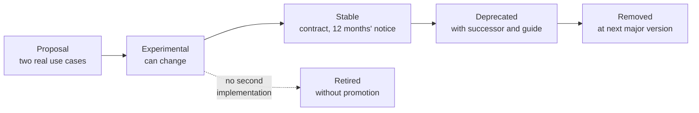

# Replaceable modules

## 1. The principle

The project has its own modules for reporting and signature, agenda, billing, notification delivery, recording archiving. **They are disactivable and replaceable by configuration**: where an integrator or regional infrastructure already has its own module, the system **integrates rather than duplicates**.

It is not a concession: it is a condition of adoption. A professional who reports in two tools produces two partial archives; two agendas produce double bookings; two billing systems produce disputes.

But it is also the mode with the **highest cost of ownership**. This chapter serves to decide when it is worth it.

## 2. The taxonomy, and the rule governing it

| Level | Mechanism | Who uses it | Risk |
|---|---|---|---|
| **Configuration** | Properties per tenant, feature switches | Administrator | Null |
| **Data** | Opaque fields per tenant, extensions on clinical plane | Integrator, per interface | Low |
| **Presentation** | Theme properties, configurable templates | Integrator, per interface | Low, with validation |
| **Events** | Notifications and polling | Integrator, **outside process** | Low |
| **Synchronous behaviour outside process** | The project calls your address and waits for a decision | Integrator, outside process | **Medium** |
| **Behaviour inside the process** | The project loads your implementation | Who installs in dedicated environment | **High** |
| **Code bifurcation** | - | Last resort | **Maximum** |

> **Guiding rule: push extensibility as high as possible in this table.** Every extension obtainable with configuration must not require a module; every extension obtainable with an event must not require code inside the process.

And a restriction that admits no exceptions:

> **Extension points inside the process are allowed only in installations dedicated to a single customer.** In a shared installation among multiple tenants, loading third-party code in the process that serves everyone means one defect or memory leak in your code impacts everyone else, and a malicious module can read all data. It is not a precaution: it is a condition of admissibility.

## 3. Catalogue of disactivable modules

For each: what shuts off, what remains on you, and how integration happens.

### 3.1 Agenda and booking

| | |
|---|---|
| **What shuts off** | Availability, booking, rescheduling, cancellation, reminders |
| **What stays on** | The concept of appointment as **reference**: the project continues to bind the service to an appointment in your domain |
| **What remains on you** | Reservability rules, availability, overlaps, reminders |
| **How it integrates** | Appointment ingestion with conditional creation; cancellation and reschedule notifications on entry; outcome events on exit |
| **What the project continues to guarantee** | That a service cannot be launched from an incompatible appointment state, and that late modification during an act in progress is recorded and rejected ([07 §5](07-dati-e-sincronizzazione.md)) |

**Case where not worth disactivating**: if your agenda does not model remote service - technical pre-check, waiting room, declared wait window before deeming patient absent - disactivating it loses functions you will have to rebuild.

### 3.2 Reporting and signature

| | |
|---|---|
| **What shuts off** | The project's own reporting editor and signature flow |
| **What stays on** | The **document model** and its invariants: immutability, versioning, replacement chain |
| **What remains on you** | Drafting, clinical validation, signature application with your tool, archiving |
| **How it integrates** | The project delivers the clinical context of the service; you return the signed document in canonical form; the project binds it to the service and records the relationship |
| **What the project continues to guarantee** | That the document remains immutable once acquired, that replacement maintains the chain and that the relationship with the service is traced |

**The constraint that does not shut off.** The document is **persistence of content written by the professional**, not autonomous generation of clinical information. A replacement module that generated clinical content would shift the boundary of what the system asserts about the patient, and that is a change of nature, not implementation. The project does not permit it and the verification is documentary, not technical: **it is a responsibility that falls on you** ([09](09-obblighi-di-chi-integra.md)).

### 3.3 Billing

| | |
|---|---|
| **What shuts off** | Tariff, issuance, administrative outcomes |
| **What stays on** | The administrative event that declares the service billable |
| **What remains on you** | The entire billing cycle |
| **How it integrates** | Administrative event on exit, with content **exclusively administrative** as described in [04 §2.5](04-integrazione-per-eventi.md) |

> **Insurmountable limit.** No configuration can enrich the administrative event with clinical content. It is the operative corollary of the fact that **the payer is not a consultant** ([09 §5](09-obblighi-di-chi-integra.md)).

### 3.4 Notification delivery to the patient

| | |
|---|---|
| **What shuts off** | The project's own delivery channels for invitations and reminders |
| **What stays on** | The **generation** of the invitation and its link, with validity and single-use |
| **What remains on you** | Delivery, with your channels and your consents |
| **How it integrates** | Event with the link and recipient in indirect form; delivery confirmation on entry |

**Why almost always worth disactivating**: the consent to communication channels is already managed by you, and duplicating it means the patient receives two messages or none.

### 3.5 Recording archiving

| | |
|---|---|
| **What shuts off** | The default archiving destination |
| **What stays on** | Encryption at rest with keys per tenant, retention policy, tracing of every access |
| **What remains on you** | Availability, integrity and location of the archive |
| **How it integrates** | Dedicated extension point to the archiving destination |

**What does not change by disactivating it**: when recording is active, the session **is no longer encrypted end-to-end**, the notice must declare it and the interface must signal it persistently. No replacement module modifies this.

### 3.6 Service catalogue

| | |
|---|---|
| **What shuts off** | The project's own catalogue |
| **What remains on you** | The catalogue and its maintenance, per tenant |
| **How it integrates** | Reference by code and domain; the project does not interpret the catalogue, it references it |

### 3.7 Terminologies

| | |
|---|---|
| **What is configured** | Which coding systems are enabled, and to which resolution service |
| **What remains on you** | The licences of the coding systems you enable, **always** |
| **How it integrates** | Single access point to terminologies, with disactivation per coding system |

> **The system is fully functional without costly licensed coding systems**, and no main path requires them. The cost of disactivating them is declared and not hidden: some code validations do not execute. **The licence implications are described in [09 §6](09-obblighi-di-chi-integra.md) and are the part of this chapter with the most economic consequences.**

## 4. Catalogue of extension points

They are **few and chosen**, deliberately. Better five well-chosen points than twenty generic ones: every public interface is code you cannot change freely anymore.

| Interface | Purpose | Where it can run |
|---|---|---|
| **Patient identifier resolution** | Resolve an external identifier to another domain: regional registry, identifier cross-reference, your logic | Outside process or inside |
| **Notification content transformation** | Adapt the envelope to the format your receiver already consumes | Outside process |
| **Brand resolution** | Get the visual configuration from your source | Outside process or inside |
| **Consent rules** | Apply jurisdiction- or organisation-specific consent rules | Inside process |
| **Document rendering** | Produce a document rendering in a local format | Inside process |
| **Audit trail destination** | Send access traces to your repository or your event correlation system | Outside process or inside |
| **Recording archiving destination** | Place encrypted files where you want them | Inside process |
| **Preventive decision** | Allow or refuse an operation according to your rule | Outside process or inside |

### 4.1 Form of an interface

Conceptually, every interface declares: if it applies to a tenant, in which order, and what it returns. No internal project type appears in the signatures.

```java
// Module of extension interfaces - artefact published separately,
// minimal and stable surface
public interface PatientIdentityResolver {

    /** Version of the interface implemented. Loading fails if incompatible. */
    SpiVersion spiVersion();

    /** Order of application: lower value wins. */
    default int order() { return 0; }

    /** Does the module apply to this tenant? */
    boolean supports(TenantId tenantId);

    /** Returns a decision, does not modify state. */
    Optional<ResolvedPatient> resolve(ExternalPatientRef ref, ResolutionContext ctx);
}
```

Two properties to note, because they are deliberate:

- **the method returns a value, does not modify state.** A module that writes to the database is a project bifurcation disguised as an extension: domain invariants stop holding and no one notices until too late;
- **no internal types in the signature.** Exposing a persistence entity in an extension interface would freeze the project's data model for years.

## 5. The non-negotiable rules

1. **Minimal surface.** Every interface is a contract to maintain for years.
2. **No internal types in signatures.**
3. **Extensions cannot violate domain invariants.** They receive data and return decisions.
4. **Failure isolation.** Every invocation has timeout, circuit breaker and defined fallback behaviour. A module in a loop must not bring down the service.
5. **Traceability.** Every decision made by an extension is logged with the module's identifier and version.
6. **Declared compatibility.** The module declares the interface version it implements; the system **refuses to start** with an incompatible module, with an explicit message. A silently incompatible module is worse than a missing module.
7. **No extensions on paths whose safe use is subject to validation.** Making them extensible means invalidating the validation.

## 6. What the project guarantees to who substitutes

Every guarantee is formulated to be verifiable: if it is not verifiable, it is not declared.

| # | Guarantee | How it is verified |
|---|---|---|
| G1 | **The interface does not change in incompatible way without twelve months' notice**, with the same phases as the dismissal process of the application interface | Change log, announcement, migration guide published concurrently |
| G2 | **A module with incompatible interface version is not loaded silently**: startup fails with a message naming the module and the expected version | Dedicated automated test: system starts with a deliberately incompatible module and the message is verified |
| G3 | **The failure of a module does not fail the clinical act.** The fallback behaviour is configured per tenant and declared | Fault injection test: module that raises exception, module that loops, module that responds past timeout |
| G4 | **Every decision made by a module appears in the log** with the module's identifier and version | Log inspection after execution with active module |
| G5 | **The module receives only the data it needs** for the requested decision, not the entire context | Inspection of the signature; the surface is declared in the extension module |
| G6 | **With an active module, the default behaviour remains reconstructible**: disable the module and the system returns to its own | Disactivation test |
| G7 | **The project's test suite is executable against a replacement module**, with the subset verifying the interface contract | Contract test module published together with the interface |

Guarantee **G7** is the one worth using first: before writing your module, run the contract tests against an empty implementation and observe what fails. It is the executable specification of the interface.

## 7. What the project does not guarantee

It must be stated with the same precision, because silence would be read as guarantee.

| # | Non-guarantee |
|---|---|
| N1 | **Does not guarantee that a module inside the process is isolated from the memory perspective.** It runs in the same process: a memory leak in your module is a leak in the service. It is the reason for the restriction to dedicated installation |
| N2 | **Does not guarantee performance** with an active module. Added latency is yours and must be measured by you |
| N3 | **Does not guarantee that your module maintains system conformity.** If you replace a component in a path subject to regulatory regime, the conformity evaluation of that path must be redone, and not by us |
| N4 | **Does not guarantee compatibility across major versions of the product.** A major update may require adaptation of your module, announced with the N1 notice |
| N5 | **Does not guarantee assistance on your module.** A defect in your code is yours; the project helps establish which side of the boundary the defect is on, not repair it |
| N6 | **Does not guarantee that a disabled function has no collateral effects on user experience.** Disabling your own agenda also removes the integrated technical pre-check in its flow: it is up to you to rebuild it or accept its absence |

## 8. Synchronous extensions: what they can and cannot do

It is the most dangerous form of extensibility and has strict rules.

| Type | Permitted | Semantics |
|---|---|---|
| **Preventive decision that can refuse** | **Yes** | Returns "allow" or "refuse with reason". **Cannot modify data** |
| **Preventive transformation that modifies data** | **No** | A third party modifying clinical data before persistence makes the source irrecoverable |
| **Notification after consolidation** | **Yes** | It is an event. Cannot fail the operation |

For the preventive decision to your address, the parameters are declared:

| Parameter | Value | Note |
|---|---|---|
| Timeout | **2 seconds** (*project proposal*) | Beyond, the fallback applies |
| Fallback | `allow` or `refuse`, **configurable per tenant** | Default `allow`, to not block clinical acts due to network fault. Who chooses `refuse` must know that a fault in your system **blocks services** |
| Circuit breaker | Yes | After N consecutive failures the fallback is applied without calling |
| Countermeasures against internal resources | The same as webhooks | [04 §4.3](04-integrazione-per-eventi.md) |
| Tracing | Every invocation, every outcome, every fallback application | Requirement, not option |

The fallback choice is the most consequential decision in the paragraph and must be taken knowingly: `allow` means a fault in your system passes operations you wanted to block; `refuse` means a fault in your system prevents healthcare services. **Neither is the right choice in the abstract.**

## 9. Configurable templates

Document, invitation message, waiting page, consent notice: they are configurable, with precise rules.

| Rule | Reason |
|---|---|
| **Engine without logic**: no executable code in the template | A template that executes code is a remote execution vector and a validation problem |
| **Automatic substitution of special characters**, concurrent to the destination format | Injection |
| **Closed catalogue of available variables**, validated at save | A template referencing a non-existent variable is rejected immediately, not at runtime in front of the patient |
| **Preview and versioning**, with tracing of every change | Must be reconstructible **which version a given patient saw on a given date**. It is a legal requirement, not a convenience |
| **Text with relevance to safe use is not modifiable** | Same principle as personalisation limits on the embedded component ([05 §7.2](05-componente-incorporabile.md)) |

## 10. Lifecycle of an extension interface



The dashed branch is deliberate: **an experimental interface that finds no second implementation is retired**, not promoted. An extension point designed on a single use case almost always has the wrong form, and promoting it means committing for years on a form that will prove uncomfortable.

## 11. When not to substitute

| Situation | Why not | Alternative |
|---|---|---|
| The extension is obtainable with configuration | Code is not needed | Configuration per tenant |
| The extension is obtainable with an event | An event has natural isolation and does not bind the release cycle of anyone | Notifications |
| You are the **first** to ask for it | The form will almost certainly be wrong | Open a question: two concrete implementations, then abstract |
| The installation serves multiple tenants and the module would run inside the process | Admissibility condition not satisfied | Interfaces and events |
| The module would touch a path whose safe use is validated | Invalidates the validation | Configuration, or extension outside the clinical path |
| Your module would modify clinical data | Destroys the source | Preventive decision that can only refuse |
| You do not know who will maintain the module in two years | An extension point is a long-term commitment, for both sides | Do not create it |
| The only reason is "we want control" | Control is obtained with dedicated installation and configuration, without taking on the cost of a module | Dedicated installation |

## 12. And if code bifurcation is truly necessary

The project is distributed with a licence that permits it, and asks no permission. But three consequences must be known before, not after:

1. **The bifurcation exits the perimeter of every conformity evaluation** conducted on the project. That material no longer describes your software.
2. **The flow of security updates stops.** You become responsible for receiving corrections, and for determining if they apply to you.
3. **All guarantees from §6 lapse.** They are not guarantees on the code: they are guarantees on the process with which the code changes, and that process is no longer yours.

If a bifurcation appears necessary, almost always it means an extension point is missing. **Ask for it**: it is the best outcome for both sides, and a bifurcation is a failure of extension point design before it is a choice of the integrator.
