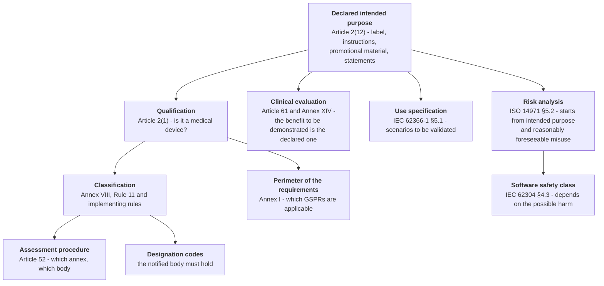

# Qualification and classification

> **Reading premise.** The definition of a medical device, the qualification tree, the text of
> Rule 11 and the reason why for telemedicine software Class I in practice does not exist are
> explained from scratch in
> [10 §15 - The regulatory framework from scratch, §§1–2](/10_fondamenti/15-regolatorio-da-zero.md).
> **Here it is not repeated: it is determined.** This chapter produces the project's position,
> gives its reasons, states its conditions of validity and indicates the facts that would make it
> fall.
>
> **Warning.** Nothing that follows constitutes a formal determination of qualification or of
> classification. A formal determination is a controlled document, referring to an exact revision
> of an intended purpose declaration, signed by a person responsible for regulatory compliance at
> a manufacturer. **The project today has neither the one nor the other** (`D49`, as amended by
> `D58`): it produces the **outline** that **the manufacturer** will complete and sign.
>
> **Who intends to exercise that role has changed; what the role entails has not.** The project
> **intends** to assume the manufacturer role (`D58`), and **the legal entity that would exercise
> it has not yet been constituted**: the formal determination is therefore not an act that can be
> brought forward, because it presupposes that entity, the person responsible for regulatory
> compliance required by Article 15 of Regulation (EU) 2017/745 and a document control in
> operation. Until then this chapter remains an outline - and **the reason why it remains one is no
> longer the same as before**: it is explained in full in § 5.2.

## 1. The chain: what determines what

A recurring error consists in treating qualification, classification, software safety class and the
perimeter of the clinical evaluation as four distinct decisions, taken by different people at
different times. **They are a single decision**, taken once, and the other three follow from it
mechanically.

The diagram has a single root, and it is why `D46` places the intended purpose among the
**retroactively unrecoverable** documents: changing it after engaging a notified body entails
repeating everything downstream of it.

**The cost of an error is asymmetric, and it is useful to know this beforehand.** An intended
purpose that is **too broad** widens everything: more applicable general requirements, more
clinical evidence to produce, more usability scenarios to validate, a higher class. An intended
purpose that is **too narrow** with respect to what the product actually does is **false**, is
detected at the first comparison between the document and the user interface, and produces a major
non-conformity. There is no prudent position: there is an **exact** one.

The operating rule that follows governs the whole project and needs to be stated only once:
**declare exactly what the product does, and design the product so that it does exactly what one
wishes to declare.** Any divergence between the two is a defect, in one direction or the other.

## 2. The project's position, in three lines

| | |
|---|---|
| **Qualification** | The project **declares a medical purpose of its own**. It does not attempt the "mere communication vehicle" route, which the functional scope would not allow it to sustain (`D26`) |
| **Classification** | **Class IIa**, applying Rule 11, paragraphs 1 and 2. With a notified body, a **certified** quality management system, clinical evaluation under Article 61 and Annex XIV, Annex IX procedure (`D12`) |
| **Software safety class** | **B**, with isolated class A items and documented segregation under clause 5.3.5 of IEC 62304. The determination is in chapter [03 §6](./03-sistema-di-gestione-della-qualita.md) |

**And the line that counts more than the three preceding ones:** this position is **conditional**.
It holds as long as the exclusions of § 4.3 hold, and it falls - not "weakens": falls - the moment
even one of them is contradicted by the product or by the material describing it.

## 3. Why the project did not chase Class I

It has to be said, because it is the question every technical reader asks first and because the
answer is counter-intuitive.

The reason is **not** that the product is particularly risky. Risk is not a qualification criterion:
MDCG 2019-11 Rev.1, § 3.1, states it verbatim ("the risk of harm […] is **not a criterion** on
whether the software qualifies as a medical device"). Risk determines the class, not the
qualification.

The reason is **arithmetical**, and it lies in the matrix in Annex III of MDCG 2019-11 Rev.1, which
crosses the significance of the information with the criticality of the clinical situation and
carries the note: "*This table does not take into account MDSW which is Class I*". In the matrix
applied to sub-rule 11a **Class I appears in no cell**. From this follows a chain with no way out:

1. to be in Class I one must first **be a medical device**: classes are an attribute of devices,
   not of categories of software;
2. to be a device a **medical purpose of its own** is needed;
3. if there is a medical purpose of its own, sub-rule 11a "generally applies to all MDSW" and the
   matrix contains no Class I cells: minimum result **IIa, with a notified body**;
4. if there is no medical purpose of its own, the product **is not a device at all**, and there is
   no Class I to self-certify.

**There is no comfortable box in between.** Class I under sub-rule 11c does exist, but it is
populated by software with a medical purpose that is *neither decisional nor monitoring*: the two
examples the guidance offers are an application that calculates fertility status and one that
assists people with communication disorders by converting symbols into spoken language. An
audio-video channel with parameter acquisition does not belong to that family.

**There is then the mirror-image risk, less discussed and equally real.** Affixing a CE marking
under the MDR to a product that, correctly qualified, is not a device is not a harmless excess of
caution: Article 20 prohibits affixing marks liable to mislead as regards the marking, Article 7
prohibits misleading claims, Article 10(6) makes the declaration of conformity conditional on the
demonstration of conformity **of a device**. An integrator could base its own compliance on a
marking that was not due. It is one of the reasons why the project affixes no markings and signs no
declarations.

## 4. Rule 11 applied

### 4.1 The three sub-rules and which one applies

| Sub-rule | Content | Applicable here? |
|---|---|---|
| **11a** | Software intended to provide information used to take decisions for diagnostic or therapeutic purposes | **Yes.** Presenting clinical parameters to the professional with out-of-range values highlighted is information used for clinical decisions |
| **11b** | Software intended to monitor physiological processes | **Yes.** Periodic acquisition of parameters according to a plan is monitoring of a physiological process. The guidance clarifies that the sub-rule applies to the monitoring of *any* physiological process, not of vital parameters alone |
| **11c** | All other uses | No |

Both applicable sub-rules lead to **Class IIa**. Implementing rule 3.5 of Annex VIII, Chapter II -
where several rules or sub-rules apply to the same device, **the strictest rule and sub-rule**
apply - therefore does not produce a different outcome in this case: two IIa remain IIa.

**A methodological note the notified body checks.** The determination cannot stop at Rule 11.
Software is by definition an **active device** (Article 2(4): "Software … is deemed to be an active
device") and therefore falls within the scope of rules 9–13, 15 and 22, all of which must be gone
through with a reasoned outcome for each. Stopping at Rule 11 is the most frequent error and the
body's first finding.

### 4.2 The two levers that hold it at IIa and not IIb

The text of the rule contains two escalation thresholds, one per paragraph.

**First lever - paragraph 1.** Decisions based on the information supplied by the software move to
Class IIb where they may cause "a serious deterioration of a person's state of health or a surgical
intervention", and to Class III where they may cause death or an irreversible deterioration. The
guidance specifies that the assessment is made on the impact of a decision taken **on incorrect
information supplied by the software**. The lever is therefore operated not by describing the
product, but by describing **the population and the context**: clinically stable patients on
planned pathways, with periodic review by the professional, not acute or unstable patients.

**Second lever - paragraph 2.** Monitoring of **vital physiological parameters**, "where the nature
of variations of those parameters is such that it could result in immediate danger to the patient",
moves to Class IIb. The reference vital parameters indicated by the guidance are respiration, heart
rate, cerebral functions, blood gases, blood pressure and body temperature - that is, **exactly the
parameters a cardiological or pulmonological remote monitoring pathway acquires**. The lever is
therefore not operated by excluding those parameters from the scope, which would make the product
useless: it is operated by excluding **the mode** - real time, immediate danger, surveillance - not
the object.

**This is where the formulation of `D46` comes from, and the difference between two sentences is
worth more than any technological choice taken in the project:**

| Formulation | Class | Safety class | Differential cost |
|---|---|---|---|
| "**real-time** monitoring of **vital parameters**" | **IIb** | **C** | 12–18 months and an order of magnitude - **an industry estimate, not a price list** |
| "**deferred** collection of **parameters** for **periodic review** by the professional" | **IIa** | **B** | - |

The second formulation is the one on which the entire domain model is written (constraint [`V-144`](../11_registri/01-vincoli-in-vigore.md#v-144)
of `DOM`), and from which follows the prohibition, for any artefact of the project, on using the
expressions "real-time monitoring", "continuous surveillance" or equivalents.

### 4.3 The four exclusions that hold the position up

These are the conditions on which Class IIa holds. They must be declared in the intended purpose in
an **explicit, verifiable manner consistent with the product** - that is, writing them is not
enough: the product must be built so that they are true.

| # | Exclusion | What would make it false |
|---|---|---|
| **E1** | **Real-time** monitoring of vital parameters of patients in critical or unstable conditions | A function evaluating the measurements upon receipt and producing an immediate effect, instead of at the scheduled review |
| **E2** | The **generation of alarms for emergency or rescue purposes** | A notification channel reaching an emergency service, or an interface presenting the notification as a call for help |
| **E3** | Use as the **sole or primary** means of surveillance of a patient | Commercial material promising the replacement of clinical surveillance; or the absence, in the user documentation, of the instruction to the patient to contact the emergency services irrespective of the data transmitted |
| **E4** | The **autonomous generation of clinical information** not drafted by the professional | A clinical field pre-filled, inferred, completed or suggested by the system; a threshold defined by the system instead of by the professional; a computed score |

**The four exclusions are not equivalent in terms of how they are guarded.** `E1` and `E2` are
architectural: they are guarded by the domain model and by the alert state machine. `E3` is
communicative: it is guarded by the review of public texts (constraint [`V-171`](../11_registri/01-vincoli-in-vigore.md#v-171),
[01 §11](./01-inquadramento-normativo.md)). `E4` is the one that **gets lost in an apparently
innocuous feature request**, and it is the subject of § 6.

## 5. The intended purpose: what the project produces, and what it deliberately does not produce

`D46` assigns to the project the production of the draft intended purpose (`MDR-IU-001`) and of the
qualification and classification determination (`MDR-CLS-001`). They are to be read together with
`D49` **as amended by `D58`**: the project **intends** to assume the manufacturer role, and the
entity that would exercise it **is still to be constituted**; until that entity exists, neither
does the apparatus - person responsible for regulatory compliance, document control, quality
management system in operation - without which an intended purpose declaration is not a
declaration. **The combination of the two decisions produces a tension that must be declared
instead of smoothed over**, because it is real, and `D58` **does not dissolve it: it changes its
nature**, as § 5.2 argues.

**The tension.** Article 2(12) of the MDR derives the intended purpose from the data supplied by
the manufacturer "on the label, in the instructions for use or **in promotional or sales materials
or statements**". A document entitled "intended purpose", published under the project's name, is
**precisely the kind of material from which the intended purpose is derived**. Publishing it
without safeguards means supplying a third party with the very element the project spends the rest
of its documentation denying, namely the existence of an intended purpose declared by whoever
publishes the code.

**`D58` tightens this tension, it does not loosen it, and this must be said without softening.** As
long as the certification path was attributed to an external party, attributing a declared intended
purpose to the project was an incorrect reading, to be rejected by pointing to the party elsewhere.
Since the project has declared that it **intends to assume** the manufacturer role - while not
having constituted the entity that would exercise it - the same reading becomes **plausible**:
whoever publishes and whoever intends to declare coincide in intention, and the only thing that
separates them is that the formal entity does not exist. The distance between the published
material and a declared intended purpose is therefore **shorter than before**, and the safeguards
of the following paragraph are to be applied with more rigour, not less.

**The solution adopted, and its limits.** The project produces and publishes the document with
three qualifications that change its legal nature and that must appear in the document itself, not
in a footnote:

1. **it is a structured outline, not a declaration**: it is drafted so that **the manufacturer**
   may complete it, amend it and sign it - completion, amendment and signature are acts the
   regulation reserves to that role, and they remain reserved **even when the role is ours** - not
   so that it may count as a declaration of whoever publishes it;
2. **the subject of the intended purpose is not the repository**, but the **identified
   distribution** that **the manufacturer entity, to be constituted**, will produce, with a name
   and a version number that **do not exist today**, because the entity that could assign them does
   not yet exist;
3. **the document bears no signature and no approval**: outside the document control of a
   manufacturer's quality management system it is, formally, preparatory material - and **it
   remains so even when that manufacturer is the project**, for as long as that document control is
   not in operation.

**The limit remains, and with `D58` it worsens.** The distinction between an **outline** and a
**declaration** is a distinction that holds if the document is read in full, and does not hold if
it is quoted in extract. A third party extracting a paragraph of the outline and presenting it as
the project's intended purpose commits an impropriety, but the harm is done all the same - and now
the extract is **more defensible from the wrong side**, because the project has declared its
intention to assume the manufacturer role and the reader is not obliged to distinguish between an
intention and a constituted entity. Why the outline remains an outline is set out in § 5.2; what
counts here is the practical consequence, which does not change: **no extract of this outline may
circulate on its own**. **Question [`Q-170`](../11_registri/02-questioni-aperte.md#q-170) takes this point to the orchestration**: the choice
between publishing the outline in full, publishing it only as a structure without the text of the
substantive sections, or supplying it on request to whoever states that they intend to use it, is a
decision for the project owner and not for this area.

### 5.1 What the outline contains

The substantive content is in the project's reference research and is not duplicated here. What
belongs to this chapter is the **minimum structure** that **the manufacturer** must complete,
because it is the checklist against which the notified body verifies completeness:

| § | Section | Note the body checks |
|---|---|---|
| 1 | Name of the device | It must be the **identified distribution**, and it must state that the published source code **is not** the device |
| 2 | Intended purpose | It must list the functions **actually present**, not the desirable ones |
| 3 | Indication for use | The care context: planned pathways, *follow-up*, **clinically stable** patients |
| 4 | Intended users | Broken down by category, with a statement of the clinical competence presupposed in the professional |
| 5 | Patient population | With the explicit exclusion of acute, unstable or critical patients |
| 6 | Environment of use | Home, provider premises, outpatient clinic, with the **minimum connectivity requirements** declared |
| 7 | Principle of operation | Software on general-purpose hardware, no applied parts, no physical, chemical or pharmacological action |
| 8 | **Declared clinical benefit** | **Every word added here is further evidence to be produced in the clinical evaluation.** It is the section where commercial enthusiasm costs the most |
| 9 | Contraindications and **explicit exclusions** | The four exclusions of § 4.3, plus the product ones: no diagnostic interpretation of images, no replacement of the first visit save on a documented decision by the physician, no use in a sterile environment or in the continuity of vital functions |
| 10 | **Use limitations and operating environment requirements** | The thresholds of bandwidth, latency, loss and delay variation below which the system signals degradation and advises against continuing. **They are an integral part of the intended purpose**, not a technical appendix |

**One thing must be said about section 10 that the technical area has already settled and that
becomes regulatory here.** The thresholds are **product specification, never compliance**
(constraint [`V-12`](../11_registri/01-vincoli-in-vigore.md#v-12)): no Italian rule imposes values. But from the moment they are declared in the
intended purpose, they become **declared performance**, and the system must behave as declared.
Declaring a threshold the product does not meet is more serious than declaring none. And the
thresholds have not yet been measured: question [`Q-115`](../11_registri/02-questioni-aperte.md#q-115) of `TECH` is open on precisely this, and
while it is open **section 10 cannot be completed**.

### 5.2 Why it remains an outline, now that the project intends to assume the manufacturer role

> **Before everything else, and in this position because it is the only part that matters to a
> hurried reader.** The product **bears no CE marking**, **is covered by no declaration of
> conformity** and **cannot be used to deliver healthcare services to real patients**. Nothing that
> follows softens this line, and whoever reads "the project intends to certify" and concludes "then
> I may use it" draws a **wrong** conclusion: the intention covers nobody, transfers no obligation
> and does not make an uncertified version usable. The consequences of that conclusion remain with
> whoever draws it.

This paragraph exists because `D58` **changes the reason** why the document is not a declaration,
and the previous reason, if left in writing, would be false. It is not a lexical adjustment: it is
the point on which the whole of § 5 rests.

**The old reason, and why it no longer holds.** As long as the certification path was attributed to
an external party, the outline was not a declaration **for want of a subject**: there was nobody
who could declare, the project did not intend to become that party, and the document was literally
addressed to an unknown recipient. It was a simple argument and, as long as it held, sufficient.
With `D58` it **no longer holds**: the project intends to constitute that entity and to exercise
that role. To go on writing "the subject is missing because it does not concern us" would be to
write something the project owner has just contradicted - without prejudice to the finding, which
holds today and is to be repeated every time, that **the entity is not constituted**.

**The new reason, which is more demanding than the old one.** A document does not become a
declaration because there exists somebody willing to sign it. It becomes a declaration when it is
**produced inside a system that guarantees its identity over time**: clause 4.2.4 of ISO
13485:2016 requires documents to be approved before issue, reviewed and re-approved when amended,
identified in their current revision status, available at points of use in the applicable version
and protected from the unintended use of obsolete versions. Clause 4.2.5 requires the equivalent
for records. Without these five attributes, what one signs is a signature on a text, not a
declaration: **it cannot be demonstrated which revision it refers to**, and an intended purpose
declaration not anchored to an exact revision is precisely the object a notified body cannot
accept, because it cannot verify its correspondence with the technical file and with the clinical
evaluation report.

**In one line: before, the who was missing. Now the how is still missing, and the how is the
expensive part.**

| | Before `D58` | After `D58` |
|---|---|---|
| Why it is not a declaration | The **party** who declares is missing | The **document control system** that makes a declaration what it is, is missing |
| What would make it one | The arrival of a third-party manufacturer | The **manufacturer entity, to be constituted**, **plus** document control in operation, **plus** the person responsible for regulatory compliance |
| Who must produce it | Somebody else | **Us**, once the entity is constituted |
| When it can happen | Outside the project's control | After steps the project must take, each with a time of its own. **No date, no window** ([`V-171`](../11_registri/01-vincoli-in-vigore.md#v-171)) |
| Is the product closer to clinical use? | | **No.** What changes is who intends to walk the road, not the state of the product |

**The corollary not to be lost sight of.** The new condition is **verifiable and ours to bear**,
whereas the old one was a wait. It is a difference that makes the document *more* onerous, not
less: before, the absence of a declaration was an external fact to be recorded; now it is a **gap of
ours** with a known remedy - instituting document control - and an already declared cost of
omission, because a document born outside document control **must be reissued** and not simply
approved afterwards ([03 §4.1](./03-sistema-di-gestione-della-qualita.md), [`V-174`](../11_registri/01-vincoli-in-vigore.md#v-174);
[09 §5](./09-percorso-e-calendario.md), unrecoverable activity no. 3).

**And the opening line, repeated because it is the one that gets lost.** The product **bears no CE
marking** and is covered by no declaration of conformity. Whoever deploys it, integrates it or puts
it into service assumes in full the resulting obligations, **and the fact that the project intends
to certify transfers none of them to them**. No date is stated here, and none can be: [`V-171`](../11_registri/01-vincoli-in-vigore.md#v-171)
prohibits asserting or implying that the product will be marked by a deadline - that is the only
admitted occurrence of that word, inside the statement of the prohibition - and internal planning
does not become a promise merely because it is ours.

## 6. The boundary, with examples taken from this domain

This is the section for which this chapter exists. The dividing line is known and fits in one
sentence: **either the data crosses the system preserving its own informational content, or the
system adds meaning.** In the first case the software is a conduit; in the second it produces new
clinical information, and whoever produces clinical information supplies information for clinical
decisions.

The sentence is clear and on its own is of no use, because nobody ever proposes a feature called
"addition of clinical meaning". Features are proposed as **improvements to the user experience**,
and that is how the boundary gets crossed without anyone noticing. What follows is the same line,
applied to concrete and realistic requests in this domain.

### 6.1 Twelve requests that shift the qualification

Every row is worded as one actually hears it worded: as a reasonable request.

| # | The request, as it is worded | What really changes | Basis | Outcome |
|---|---|---|---|---|
| **1** | "Let's pre-fill the threshold field with the last value used for that pathway; the physician can always change it" | The threshold ceases to be defined by the professional for that patient and becomes **proposed by the system**. A physician confirming a proposed value is not performing the same operation as one who writes it | `E4`; constraints [`V-02`](../11_registri/01-vincoli-in-vigore.md#v-02) and [`V-123`](../11_registri/01-vincoli-in-vigore.md#v-123) | The field stays **empty and mandatory**. References are shown with their attribution, read-only, with an explicit copy action |
| **2** | "Let's colour in red the values outside the laboratory's reference range" | The laboratory's reference range **is not that patient's threshold**. Colouring according to a range the system knows is a qualification of the data performed by the system | Rule 11a; `E4` | Only highlighting against the threshold **configured by the professional for that patient** is admitted, with the attribution visible |
| **3** | "Let's sort the patient list by severity, so the physician sees the most critical ones first" | Sorting **is** a judgement: it establishes a clinical priority between people. It is decision support | Rule 11a, entry C6 of the table in [10 §15 §2.8](/10_fondamenti/15-regolatorio-da-zero.md) | Admitted sorts: chronological, alphabetical, by administrative status, by presence of alerts **not yet taken on** (which is a fact, not a judgement) |
| **4** | "Let's fill the gaps in the series with the last known value, so the chart is readable" | Interpolation **creates data that does not exist**. And it deletes the most important information that series contains: that a measurement is missing | Rule 11a; constraints [`V-09`](../11_registri/01-vincoli-in-vigore.md#v-09) and [`V-148`](../11_registri/01-vincoli-in-vigore.md#v-148) | The gap stays a gap, and it is an entity: an unmet expected measurement is shown as such |
| **5** | "Let's calculate the percentage of adherence to the plan" | It depends. The ratio between expected and received measurements is **arithmetic on facts**. An "adherence score" that is weighted, normalised or categorised into bands is **a summary index**, that is, new clinical information | Rule 11a | The count is admitted with its explicit definition and its denominators visible; the merit band is prohibited |
| **6** | "In recording playback let's add zoom and contrast adjustment" | Image enhancement for clinical reading is **processing for diagnostic purposes**, not playback convenience | MDCG 2019-11 Rev.1 § 3.1; entry C3 | Out of scope. Playback is faithful to the original, and says so |
| **7** | "Let's measure the lesion on the image with an on-screen ruler" | Measurement on an image: quantitative information produced by the system, with a possible **measuring function** within the meaning of Article 52 | Rule 11a and implementing rule 3.7; entry C4 | Out of scope |
| **8** | "Let's suggest the diagnosis code while the physician types" | Automatic semantic coding of the clinical document: the system proposes clinical content | Rule 11a; entry C5 | Out of scope. Free-text search in a code catalogue, returning matches without ordering them by clinical relevance, remains plain search |
| **9** | "Let's produce an automatic summary of the session to attach to the clinical report" | Automatic summarisation: **clinical content generated by the system** inside a clinical document. And, if implemented with generative models, it introduces a **second regulatory regime** on top of the device one | `E4`; Regulation (EU) 2024/1689 | Out of scope. It is one of the three functions "one user story away" of `D26` |
| **10** | "Let's detect faces during the session to establish the presence of third parties" | Biometric processing on a clinical stream, with a regime of its own under the data protection framework and under the artificial intelligence one, and with an error rate that would fall back on a consent | Deliberate renunciation of `DOM`, question [`Q-145`](../11_registri/02-questioni-aperte.md#q-145) | Out of scope. The presence of third parties is **declared**, and the declaration is a separate consent ([`V-146`](../11_registri/01-vincoli-in-vigore.md#v-146)) |
| **11** | "Let's state in the integration documentation that we are compatible with measuring device *X*" | **The accessory trap.** Article 2(2) defines an accessory as an item intended by the manufacturer to be used with one or more **specific** medical devices; implementing rule 3.3 drags software that drives or influences a device **into the same class as the device driven** | Article 2(2); Annex VIII, Chapter II, 3.3 | The integration documentation remains **device-agnostic**. A single sentence can import the class of somebody else's equipment |
| **12** | "Let's add automatic translation of chat messages, it is only a convenience" | A translation error in a clinical channel is an error of clinical content. And the function is, by construction, an artificial intelligence system with obligations of its own | Rule 11a; Regulation (EU) 2024/1689 | Out of scope in version 1.0. Multilingual support belongs to the **interface**, not to the content written by users |

**Row 11 deserves a note that holds for the whole of the project's documentation.** The
confidentiality rule `R0` - never name companies, trade marks, commercial products - and the
accessory trap push **in the same direction**, for completely different reasons. It is a fortunate
convergence worth being aware of: an editorial habit imposed for negotiation reasons produces, as a
side effect, exactly the right regulatory protection.

### 6.2 The frontier point the project has deliberately crossed

One function, in the list of the product's capabilities, **lies beyond the line**, and it is the
reason why this chapter concludes for qualification rather than against:

> **Highlighting the breach of a threshold configured by the professional for the individual
> patient.**

Comparing a number with a range is trivial in computing terms. In regulatory terms it is the moment
when the system stops merely displaying a datum and begins to **qualify** it as within or outside
the norm for that patient. The guidance says so expressly, in Annex I, point d.1): "*Telemedicine
that solely transfers and displays information for monitoring purposes without interpreting data
does not qualify as a medical device. Additional modules such as thresholds alerts may qualify as a
medical device if they are intended for medical purposes.*"

The project chose to **acknowledge this fact rather than work around it**. The opposite choice -
keeping the function and denying its nature - would have produced the worst of positions: a product
that does something and a declaration that denies it, that is, exactly the case prohibited by
Article 7.

## 7. Why the position is factual and not perpetual

A classification determination **is not a property of the product**: it is a conclusion referring to
an exact revision of an intended purpose, valid as long as that revision is in force and the
product corresponds to it. It must therefore be accompanied by two elements that in practice are
both forgotten.

### 7.1 The conditions of validity

| Condition | If it falls |
|---|---|
| The intended purpose is the one of the revision cited | The determination must be redone for the new revision |
| The four exclusions of § 4.3 are true **in the product**, not just in the document | The class rises to IIb and the software safety class to C |
| The public material does not contradict the intended purpose | Major non-conformity with Article 7, irrespective of the code |
| No function on the list in § 6.1 has been introduced | Reclassification, with reassessment by the notified body |
| The patient population remains the declared one | Extension to unstable patients shifts the paragraph 1 assessment |

### 7.2 The facts that compel a review

They must be listed in the determination document, not left to the judgement of whoever reads it.
There are six, and they are worded as observable events:

1. introduction of an **alarm** function or change to the delivery channel of a notification
   towards an emergency service;
2. introduction of a **score, index or classification** computed by the system;
3. definition of a **threshold by the system** rather than by the professional, in any form,
   pre-filling included;
4. **extension of the population** to acute, unstable or critical patients, even only in the
   commercial material;
5. introduction of **image or sound processing** for the purpose of clinical assessment;
6. declaration of **compatibility with a specific medical device**.

**The difference between a project that reclassifies itself and one that discovers it has been
reclassified is exactly this list.** Without it, the reclassification happens anyway: one learns of
it from the notified body at the first comparison between the file and the interface.

## 8. The declared perimeter

**This section answers question [`Q-01`](../11_registri/02-questioni-aperte.md#q-01) on the noticeboard**, opened by the guide area, which asked
for the perimeter boundaries to be aligned with the intended purpose declaration.

**Outcome: the boundaries indicated are confirmed and made binding**, and they belong to the `E4`
block. No artefact of the project may contain:

| Boundary | Binding formulation |
|---|---|
| **No interpretative judgement in notices** | A notice states a **measured fact** with its attribution: "the 08:14 measurement is 152, the threshold set by Dr *X* on *Y* is 140". It does not state an evaluation: "elevated value", "situation requiring attention", "deterioration" |
| **No drug interaction checking** | Out of scope entirely, in every form, passive flagging included |
| **No prognosis** | No projection, declared trend, prediction or estimate of progression. A time series is displayed; it is not extrapolated |
| **No image enhancement** | Neither live nor in playback. The rendering is faithful to the source, and the degradation preference is **chosen by the user**, never driven by clinical content (question [`Q-114`](../11_registri/02-questioni-aperte.md#q-114) of `TECH`) |

**And the six deliberate renunciations** declared by `DOM` with question [`Q-145`](../11_registri/02-questioni-aperte.md#q-145) - automatic face
detection, reliability weights applied automatically, risk scores and prognosis, interpolation of
missing data, computation of clinical outcomes, inference of thresholds - are, from this area's
point of view, **the six functions that would keep the product in Class IIa only by luck**. This
area confirms them as compliance boundaries and not as product choices: revoking them is not a
roadmap decision, it is a reclassification.

### 8.1 Local execution of clinical logic

**This section answers question [`Q-142`](../11_registri/02-questioni-aperte.md#q-142)**, opened by `DOM`.

**Outcome: confirmed. Local execution of clinical logic is out of scope, and the distinction
holds.** Annex 3, § 3.2, of DM 19 novembre 2025 (the Ministerial Decree of 19 November 2025)
provides that the platform consumes from the national glossary both **terminologies** and
**guidelines, pathways and protocols with logic expressed in a clinical expression language**. The
two capabilities are distinct and must be kept distinct:

| Capability | What it does | Outcome |
|---|---|---|
| **Consumption of terminologies** | Resolves, validates and expands codes. It produces no new clinical information: it verifies that a code exists and what it corresponds to | **Inside the scope.** It is the terminology gateway |
| **Execution of clinical logic expressed in an expression language** | Evaluates conditions over a patient's data and produces an outcome - recommendation, notice, suggested action | **Out of scope.** It is clinical decision support: Rule 11a, entry C6 |

`DOM`'s choice - **the logic executor is absent by construction, not disabled by configuration** -
is the correct one on the regulatory plane too, and for a reason that must be stated: a component
that is present and disabled is a component that appears in the software architecture, must be
inventoried, must be assessed in the risk file and must be explained to the notified body, which
will ask how it is guaranteed to stay disabled in every supported configuration. A component that
is absent does not exist. The difference between the two positions, in assessment days, is not
marginal.

**The cost must however be stated without mitigation**, because it exists: a regional
infrastructure verifying the consumption of all the resources provided for in Annex 3 will find **a
capability not implemented**. It is not a regulatory non-compliance in the proper sense - the decree
governs regional infrastructures, not third parties' software components - but it is an empty box
in a tender matrix, and it is to be presented as a **reasoned scope choice with its regulatory
rationale**, not passed over in silence. The rationale is defensible and is to be written exactly
so: *implementing that capability would move the product into clinical decision support, with
consequences for the classification that the project owner has not accepted.*

## 9. The Italian constraint that makes the choice non-optional

There is a fact that makes much of the preceding discussion academic in a significant part of the
reference market, and it must be said first to anyone reading this chapter in order to decide.

**DM 21 settembre 2022** (the Ministerial Decree of 21 September 2022), Annex A, Section 2,
expressly prescribes:

- that "the regional telemedicine infrastructure for the **minimum remote monitoring service** must
  be **certified as a medical device**", with an express reference to the European guidance on the
  qualification and classification of software;
- that for level 2 advanced remote monitoring "a **risk class higher than IIa** could be required";
- that in specialist-to-specialist consultations (teleconsulti) in certain specialties -
  histopathology and radiology are cited - the clinical data viewing micro-service "together with
  the reporting one must be **certified as a medical device**";
- that where medical devices are used in the remote consultation (televisita) service, "the
  software and hardware for delivering the service must be certified as a medical device **with an
  adequate risk class**".

The State-Regions Agreement of 17 December 2020 lays down, among the basic characteristics,
"certification of the hardware and/or software, as a medical device, **appropriate to the type of
service** to be delivered by telemedicine".

**`[NV]`** - the formulations are reported from the project's research on the text published in the
Gazzetta Ufficiale, but **literal verification against the official text must be redone before any
contractual use** by `COMP`, because in this area the exact wording is decisive.

**The operational consequence is clear-cut:** in the Italian public market the requirement of
certification as a medical device **may come from the tender specification**, irrespective of the
outcome of the European qualification analysis and prior to it. A supplier presenting a
determination of non-qualification, however well argued, would find itself outside the admission
requirements. This, and not the Rule 11 analysis, is the **practical** reason why `D26` is not a
reversible choice.

**A symmetrical reading, and it counts as a strategic indication.** Excluding the diagnostic
interpretation of images from the intended purpose (§ 5.1, section 9) is not a gratuitous
commercial renunciation: it is **the choice that keeps the class at IIa**. If one day there is a
wish to enter radiological or histopathological specialist-to-specialist consultation, it will be a
**substantial extension** requiring a fresh assessment by the notified body, not a product update.

## 10. The guard: change control as a compliance measure

Qualification is not defended with a document. It is defended with a **process that prevents a
change proposal from crossing the boundary without anyone noticing**, and this is constraint
[`V-170`](../11_registri/01-vincoli-in-vigore.md#v-170).

| Element of the guard | What it does | Where it lives |
|---|---|---|
| **Closed list of out-of-scope functions** | § 6.1 and § 8 of this chapter, plus the list of nine entries in [10 §15 §2.8](/10_fondamenti/15-regolatorio-da-zero.md) | Documentation, and a mandatory reference in the contribution guide |
| **Scope review on change proposals** | A proposal introducing one of the functions listed **is not rejected on technical merit, but on scope policy**. The reason for the rejection is regulatory and is to be written as such | Contribution guide, mandatory review |
| **Explicit prohibition on artificial intelligence components** | No function declared today is an artificial intelligence system. Introducing one in a change proposal **is a change of regulatory regime**, not a technical choice | Contribution guide and architecture decision record |
| **Review of the determination at every major release** | Verification that the six conditions of § 7.2 have not occurred | Release procedure |
| **Regulatory review of public texts** | The intended purpose is derived from promotional material as well: a text published without review is an uncontrolled change to the intended purpose | Question [`Q-174`](../11_registri/02-questioni-aperte.md#q-174) |

**The last row is the one that surprises those coming from software.** A change to the public page
does not go through code review, does not appear in a release manifest and makes no automated check
fail. **And it is the quickest way, in this domain, to change a product's classification without
touching a line.**

## 11. The software safety class is a consequence, not a parallel decision

It must be said here because it is the point at which the two paths - regulatory and engineering -
touch, and because treating them separately is the error that produces two inconsistent
determinations.

The safety class under clause 4.3 of IEC 62304 depends on the **possible harm after the application
of risk control measures external to the software system**. With remote monitoring in scope, the
worst hazardous situation is no longer the interruption of the consultation: it is the **failure to
present, or the incorrect presentation to the professional of, an out-of-range parameter**, which
delays a therapeutic decision. In a cardiac or diabetic patient the possible harm is **serious**,
and in the absence of external measures the outcome would be **class C**.

The external measures that bring it to **B** are largely **the same intended purpose exclusions**
of this chapter, plus the mandatory organisational presence of the **Centro servizi** (service
centre) and the **Centro erogatore** (delivering centre) imposed by DM 21 settembre 2022 and the
scheduled periodic review provided for by the care plan. From this follows a link that must be made
explicit and that is easy to lose:

> **The intended purpose exclusions are not only what keeps the classification at IIa. They are
> also what keeps the software safety class at B.** They fall together, and when they fall the cost
> compounds: a more onerous conformity assessment **and** detailed design at unit level with
> verification of every unit.

The item-by-item determination, with its rationale and its warning, is in chapter
[03 §6](./03-sistema-di-gestione-della-qualita.md).

## 12. What this chapter leaves open

| Reference | Question | To whom |
|---|---|---|
| [`Q-170`](../11_registri/02-questioni-aperte.md#q-170) | Form of publication of the intended-purpose outline: in full, structure only, or supply on request. **It is a decision about the risk of being cited as the authors of an intended purpose** (§ 5) | → Project owner |
| [`Q-173`](../11_registri/02-questioni-aperte.md#q-173) | Whether the presentation of measured parameters constitutes a **measuring function** within the meaning of the MDR, with the resulting metrological requirements of Annex I. It depends on a fact this area does not know: whether the system converts units, rounds or transforms the values received, or presents them as received | Domain, functional |
| [`Q-144`](../11_registri/02-questioni-aperte.md#q-144) | **CLOSED by `D55`.** The intended purpose of remote monitoring is **frozen** on the formulation "deferred collection of parameters for periodic review by the professional": Class IIa, software safety class B. The real-time formulation is excluded. From this follows a permanent prohibition - no function may be added that moves the system towards clinical real time, and the assessment must be made **before** writing the function | **RESOLVED** |
| [`Q-145`](../11_registri/02-questioni-aperte.md#q-145) | Confirmation of the six deliberate renunciations as product choices subject to change control. **This area confirms them as compliance boundaries** and awaits product confirmation | → Project owner |
| [`Q-115`](../11_registri/02-questioni-aperte.md#q-115) | The operating environment thresholds have not been measured: until they are, section 10 of the intended purpose cannot be completed (§ 5.1) | Technical, product |
| [`V-270`](../11_registri/01-vincoli-in-vigore.md#v-270) | **The project intends to assume the manufacturer role (`D58`); the entity that would exercise it is not constituted.** Until it is, and until document control is in operation, the intended-purpose outline **cannot** be signed or presented as a declaration (§ 5.2) | Compliance, orchestration |
| `[NV]` | Literal verification against the official text in the Gazzetta Ufficiale of the certification prescriptions of DM 21 settembre 2022 (§ 9) | `COMP` |
| `[NV]` | Numbers of the implementing rules of Annex VIII, Chapter II, cited in § 4.1 and § 6.1: they must be re-read against the consolidated text before appearing in a determination document | `COMP` |
