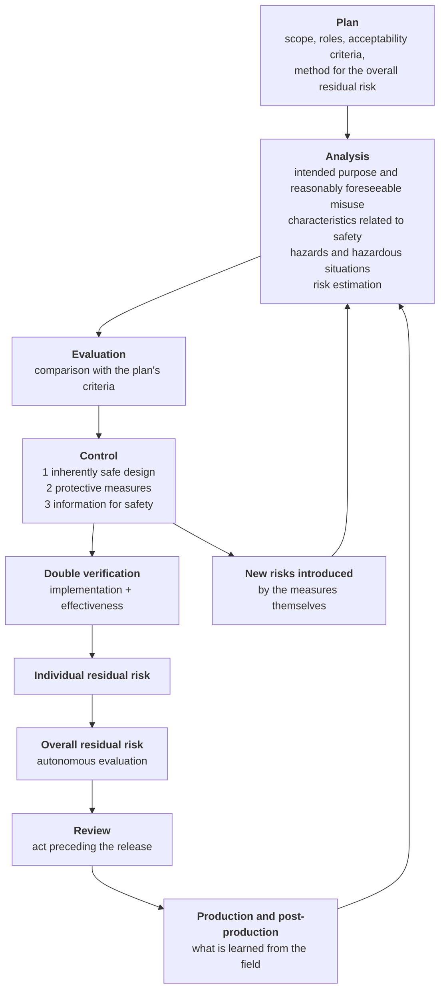
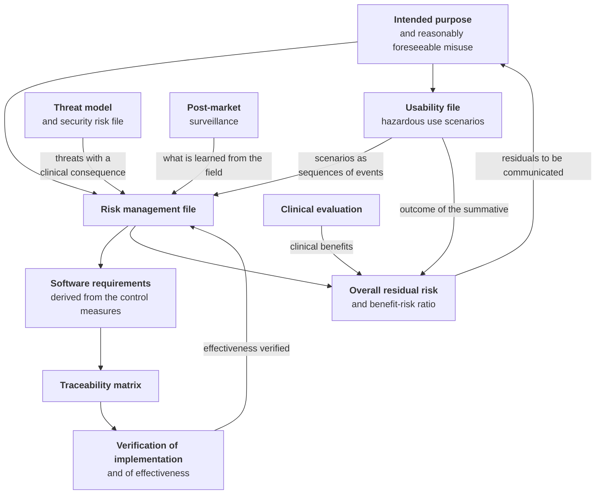

# Risk management

> **What this chapter does not contain.** It does not contain the explanation of what a hazard, a
> hazardous situation or a residual risk is: that is in module
> [10 - Care pathways and patient safety](/10_fondamenti/10-percorsi-di-cura-e-sicurezza.md), § 9.6, and
> in module
> [15 - The regulatory framework from scratch](/10_fondamenti/15-regolatorio-da-zero.md), § 5.5,
> and it is written for someone who has never seen the standard. **Here it is applied.** Anyone who
> has not read those two paragraphs will find this chapter compact to the point of
> unintelligibility, and that is not a defect of this chapter.

## 1. The starting point: what is mandatory and on whom it falls

**Article 10(2) of Regulation (EU) 2017/745** requires the manufacturer to establish, document,
implement and maintain a risk management system; **section 3 of Annex I** describes its content as
an iterative process throughout the device's entire lifecycle. **EN ISO 14971:2019** is the standard
that describes that process and it is harmonised under the regulation.

`[NV]` - **Whether the published reference is `EN ISO 14971:2019` or `EN ISO 14971:2019+A11:2021`
must be verified against the Commission's consolidated list** by `COMP`, and the difference is not
nominalistic: it is amendment A11 that contains the annexes stating the deviations between the
standard and the regulation (§ 3.4).

**The allocation, which holds for the whole chapter.** From `D58` the project intends to
assume the role of manufacturer, and with `D63` that assumption is a **product requirement**; the
legal entity is still to be constituted. Under `D58` the
project does not sign today the risk management report, does not determine today the acceptability
of the overall residual risk and does not assume today responsibility for the benefit/risk ratio.
It does however produce **the material on which those determinations will be made**, and it produces
it now because part of it is retroactively unrecoverable. When the manufacturer entity is
constituted, it will assume all the acts reserved to that role, including the signing of the report
and the determination of acceptability.

| Activity | Project | The manufacturer |
|---|---|---|
| Risk management plan, acceptability criteria | Technical draft and proposed method | **Approves, dates and signs** |
| Identification of hazards and hazardous situations | **In full** | Reviews and supplements |
| Risk estimation and evaluation | Reasoned proposal | **Determines** |
| Design and implementation of the control measures | **In full** | Verifies |
| Verification of implementation and effectiveness | **In full**, with automated tests | Verifies the evidence |
| Individual residual risk | Proposal | **Determines** |
| Overall residual risk and benefit/risk ratio | Technical contribution | **Determines and signs** |
| Review before release | Evidence | **Its own act** |
| Production and post-production activities | Product capabilities | **Its own process** |

The most important row is the penultimate one and it is dealt with in § 8: **the determination of
acceptability cannot be delegated** - not to a supplier, not to a consultant, not to a table.

## 2. The process, and where it plugs into daily work

ISO 14971 describes a process, not a document. Its activities are not carried out in a block at the
end of the project: they plug into precise points of the development cycle, and their absence at
those points cannot be recovered downstream.

**Plugging into the project's development cycle.**

| Moment | Risk management activity |
|---|---|
| Definition of a functional requirement | Identification of the hazardous situations the requirement introduces or mitigates |
| Architectural design review | Verification that level 1 measures were considered **before** level 2 ones |
| Peer review of a change | If the change touches a control measure: update of the file **before** acceptance |
| Test execution | Production of the evidence of implementation and of effectiveness, with a dated outcome |
| Formative usability evaluation | Every use error observed produces a row or the rationale for its absence |
| Summative validation | Mandatory input to the overall residual risk |
| Release | Configuration status record and residual anomalies assessed |
| Operation | Feedback from the surveillance data (chapter [08](./08-sorveglianza-post-commercializzazione.md)) |

**The row on peer review is the one that determines whether the process is alive.** A risk file
updated in a block twice a year is a document; a file updated inside the change requests is a
process. The difference is visible in the repository history and an assessor looks at it.

## 3. The plan: the four decisions to be taken before writing a single row of the register

### 3.1 The scope

The scope of the risk file is the **identified distribution**, not the repository. It is the direct
consequence of the dual model of `D17`: the published source code is not a device and has no risk
file; the distribution has one, with a version, a holder and a lifecycle of its own.

The operational consequence is that **a feature present in the repository but disabled in the
distribution must be analysed all the same**, because it can be activated by configuration and the
configuration is in the hands of the deployer. The criterion adopted is: *everything reachable by a
supported configuration is in scope; anything requiring a change to the code is not, and is treated
as abnormal use*.

### 3.2 The acceptability criteria, and the fact that they are a choice

The standard **supplies no threshold**: the criteria are established by the manufacturer in the
plan. This means they are a reasoned value judgement, not an objective datum, and that the plan must
contain **the rationale for where the thresholds are placed**, not just the thresholds.

The project proposes criteria expressed **by severity class** and not as the product of two numbers,
for the technical reason in § 3.3.

| Severity class | Description in the domain | Proposed criterion |
|---|---|---|
| **G4 - critical** | Death or permanent harm | No residual risk is acceptable without a level 1 or 2 measure with verified effectiveness **and** an explicit statement to the user |
| **G3 - serious** | Hospitalisation, intervention, reversible but significant deterioration, diagnostic delay on a time-dependent condition | A level 1 or 2 measure is mandatory; level 3 is admitted **only in addition** and never on its own |
| **G2 - moderate** | Service missed or postponed, repetition of the act, significant discomfort | Level 2 or 3 measure, with verification of effectiveness |
| **G1 - minor** | Discomfort, need to repeat an action in the interface | Handled within product quality, with a record |

### 3.3 Probability in software: why the two-dimensional grid does not hold

For a mechanical failure, probability can be estimated on a statistical basis. **For a software
defect it cannot**: the defect is either there or not, and if it is there it manifests every time
the activation conditions occur. Attributing an annual frequency to the hypothesis that a comparison
function contains a sign error is a groundless exercise, and produces numbers that **look like
data** and are not.

The method adopted by the project, to be taken up in the plan:

1. **the probability of the software defect is not estimated** and is conservatively assumed to be
   1;
2. **what is estimated instead is the probability of the sequence downstream of the defect**: how
   often the activation condition occurs in operation, with what probability the external measures
   intercept the error, what fraction of cases reaches a clinical decision;
3. **severity governs the evaluation**, because it is the only quantity about which defensible
   information exists;
4. **the matrix, if adopted, is a tool for communication and for ordering priorities**, not a
   decision criterion.

`[NV]` - The approach is consistent with the framework of IEC 62304, which determines the safety
class on the **possible harm** and not on the probability of the defect, and it is indicated as
practicable by the technical report accompanying ISO 14971. **The precise reference to the section
of that report must be verified against the text** by `COMP`, which is behind a paywall and has
not been read: until then the plan's rationale rests on the technical argument, not on a citation.

### 3.4 "As far as possible", not "until the cell turns green"

**Section 2 of Annex I MDR** requires risks to be eliminated or reduced **as far as possible**
through safe design and manufacture, and establishes that a risk is not acceptable merely because it
falls within the criteria the manufacturer has set itself. It is the point on which the
correspondence annexes of amendment A11 to the standard flag a **deviation**: the standard allows
the manufacturer to stop at its own acceptability criteria, the regulation does not.

`[NV]` - **The literal wording and the numbering of the Annex I section must be verified against the
consolidated text** by `COMP`. The substance - reduction "as far as possible" without economic
considerations, and not "to a reasonably practicable level" - is settled and is to be adopted.

Three editorial rules for the register follow, binding on the project:

- **no risk is declared acceptable without it being minuted why it was not further reducible by
  design**, naming the level 1 and 2 options considered and the technical reason for discarding
  them;
- **economic considerations do not enter** the determination of acceptability; they may enter the
  choice between two measures of equivalent effectiveness, and the distinction must be written down;
- **the final determination carries a name and a date.**

## 4. What a row of the register looks like, and why it is not written on hazards

The commonest error in small manufacturers' risk files is building the register on **hazards**
instead of on **hazardous situations**. A row saying "hazard: data loss - severity: high -
probability: low" contains no usable information: it does not say which data, in which circumstance,
who is exposed, which clinical decision depends on it. It allows neither estimation nor design.

**The project's register has one row per hazardous situation**, and the same hazard appears in
several rows with different severities depending on the sequence leading to it. Every row carries
the following fields, and none is optional:

| Field | Content |
|---|---|
| Identifier | Stable and never reassigned, like the requirement identifiers (`D45`) |
| **Hazard** | Potential source of harm |
| **Sequence of events** | The concrete chain, with its links, leading to exposure |
| **Hazardous situation** | The circumstance in which a person is exposed |
| **Harm** | Injury or damage to health, in clinical terms |
| **Severity** | Class `G1`…`G4` of § 3.2 |
| **Probability of the downstream sequence** | Estimated according to § 3.3, with the rationale |
| **Control measures** | Each with its declared **level** (§ 5) and which quantity it acts on |
| **Verification of implementation** | Reference to the test demonstrating that the measure is there |
| **Verification of effectiveness** | Reference to the test demonstrating that it reduces the risk |
| **New risks introduced** | Mandatory; "none" is an admitted answer only if justified |
| **Residual risk** | With the rationale for its acceptability or for its non-further-reducibility |
| **Linked requirements** | `RF-*`, `RNF-*`, `BR-*` implementing the measures |
| **Origin** | Analysis, formative evaluation, summative evaluation, threat model, field |

**A hazard is not "mitigated".** A risk is mitigated, by acting on the probability of the sequence or
on the severity of the harm. That is why the measures column states **which of the two quantities it
acts on**: a measure that affects neither is not a risk control measure, however good the
engineering.

## 5. The hierarchy of control measures

The order is binding and is not a list of equivalent options:

1. **inherently safe design** - eliminate the hazard or make it structurally impossible;
2. **protective measures in the device or in the process** - barriers, checks, confirmations,
   notifications;
3. **information for safety** - warnings, instructions for use, training.

The third level is the cheapest and the weakest, and it is the one resorted to under deadline
pressure. **A warning that solves a problem solvable by design is a non-conformity**, not a
compromise: for every level 3 measure it must be demonstrated that the first two were not
practicable.

**The editorial rule that follows.** Every row states the level of its measures. A file in which
most measures are level 3 says, unintentionally, that the product was not designed for safety but
documented for safety. It is one of the first things an experienced assessor counts, and it is a
metric the project undertakes to publish alongside the register.

## 6. The risk register - real examples from the domain

What follows **is not a didactic example**: these are rows built on the domain model, on the
functional requirements and on the actual architectural constraints of the project, and it is the
form in which the `RM-FILE-001` register is to be compiled. The `RM-*` identifiers used here are
provisional and are to be frozen together with the plan.

### 6.1 `RM-01` - The parameter that does not arrive

| Field | Content |
|---|---|
| **Hazard** | The clinical information presented to the professional is incomplete |
| **Sequence of events** | The measuring device, the third-party gateway or the patient stops transmitting · the system does not represent the absence · the summary view continues to show the last value acquired, which was within range · no event is generated · the scheduled periodic review falls beyond the useful window |
| **Hazardous situation** | The professional assesses as stable a patient about whom the system has had no information for days |
| **Harm** | Failure to catch a deterioration, with a delay in intervention |
| **Severity** | `G3`, `G4` in conditions with rapid decompensation |
| **Probability of the sequence** | High in the absence of measures: failure to transmit is the most frequent event in remote monitoring, not an edge case |

**Control measures.**

| Level | Measure | Acts on |
|---|---|---|
| **1** | **The measurement expectation is an entity**: the absence of a measurement is a row declaring the absence - with the expected window, the expiry instant and the cause where known - not the absence of a row. It is the operational form of the principle that silence is never normality, and it is what makes adherence a defined quantity instead of a count of what arrived | Makes the sequence structurally interruptible |
| **2** | Event generated by the expiry of the window, distinguishing between a **measurement not expected** and a **measurement not received**: they are two different things and collapsing them produces both false alerts and silences | Probability |
| **2** | **Age of the last datum always visible** and graphically highlighted in every view presenting parameters; no summary view may show a value without its age | Probability |
| **2** | **Monitoring of the expected volume**: a failure of the acquisition chain produces a collective silence that resembles normality. Detection must precede the expiry of the first individual window | Probability |
| **2** | Escalation chain with **declared failure**: a lack of response produces an event and the alert stays open, it does not close by lapse of time | Probability |
| **3** | Instructions for use: the device is neither the sole nor the principal means of surveillance; instruction to the patient and to the carer to contact the emergency services when symptoms occur, irrespective of the data transmitted | Severity of the residual harm |

**Verification of implementation.** Test that on expiry of the window an expectation row exists with
a declared status; test that every view presenting a value also presents its age.

**Verification of effectiveness.** Scenario test: simulated suspension of transmission,
verification that the event is generated within the window, that it reaches a **valid** recipient
and that the lack of response itself produces an event. A test stopping at the generation of the
event verifies implementation, not effectiveness.

**New risks introduced.** The absence alert **increases the alert load** and contributes to fatigue
(`RM-11`). The balance must be struck and documented: a `G3` severity risk is reduced by increasing
a `G2`-`G3` severity one with a probability rising over time. It is exactly the kind of
compensation that the **overall** residual risk evaluation must catch.

**Residual risk.** The absence is detected and notified, but the time between the expiry of the
window and the case being taken on remains, and so does the case of the patient who does not
transmit **because** they are unwell. The residual is declared to the user.

### 6.2 `RM-02` - The session that is interrupted

| Field | Content |
|---|---|
| **Hazard** | The remote clinical act is not completed |
| **Sequence of events** | The patient's network degrades · the channel drops · there is no declared fallback and no resumption procedure · the service is recorded as closed without an outcome, or with an outcome indistinguishable from non-attendance · the patient does not rebook |
| **Hazardous situation** | A person on a care pathway loses a scheduled encounter and nobody detects it as such |
| **Harm** | Service missed on a care pathway; on a time-dependent condition, diagnostic or therapeutic delay |
| **Severity** | `G2` in general, `G3` on pathways with narrow clinical windows |

**Control measures.**

| Level | Measure | Acts on |
|---|---|---|
| **1** | **The service and the media session are distinct aggregates**: the dropping of the channel does not close the clinical act, which can continue with a second session. Merging them would turn a technical drop into an irreversible clinical event | Makes the sequence interruptible |
| **1** | **Audio degrades before video, always**: the channel useful for the continuity of the conversation is preserved last | Probability |
| **2** | **Encounter outcome distinct from status**: non-attendance and technical failure share the terminal status and have opposite administrative effects. Collapsing them produces both administrative harm to the patient and the loss of the failure signal | Probability |
| **2** | **Preventive technical check** before the session, with an outcome that conditions executability and is not a mere notice | Probability |
| **2** | Once the channel unsuitability threshold is breached, the system **informs that conditions may not be adequate** for the assessment under way and offers postponement. The thresholds are product specification, **never compliance**: no Italian legal source imposes them | Probability and severity |
| **2** | **Declared fallback** and session resumption procedure, reachable without computing skills | Probability |
| **3** | Operating environment requirements declared in the instructions for use: bandwidth, latency, loss, delay variation | Probability |

**Verification of effectiveness.** Degradation test with induced loss and latency: verification that
the system degrades **audio before video**, that the event is recorded, that the outcome produced is
the correctly typed one and not that of non-attendance.

**New risks introduced.** The channel unsuitability notice, if too sensitive, induces unnecessary
interruptions and habituation to the notice; if too permissive, it does not protect. The calibration
is a trade-off with a clinical consequence and must be minuted, not chosen implicitly in the code.

**Residual risk.** The patient's connectivity cannot be governed by the project. The residual is
declared and the compensating measure is organisational: the existence of an alternative channel at
the provider.

### 6.3 `RM-03` - The wrong identity

| Field | Content |
|---|---|
| **Hazard** | Clinical information associated with the wrong person |
| **Sequence of events** | An external identifier is reused with the same value by two different assigning authorities · tenant membership is not verified at the boundary · the interface shows a single identifying element · the professional has no signal that would arouse suspicion · they draft or sign the clinical content |
| **Hazardous situation** | The professional assesses, during a session, parameters or documents belonging to another patient |
| **Harm** | A clinical decision on data that do not pertain **and** clinical content in the wrong record: **two people harmed by a single error** |
| **Severity** | `G3`, `G4` depending on the decision taken |

**Control measures.**

| Level | Measure | Acts on |
|---|---|---|
| **1** | **No external identifier is a primary key.** External identifiers live in a collection qualified by the **assigning authority**, with temporal validity; the domain knows an internal canonical identifier. The same value in two different authorities is, by construction, two different identifiers | Eliminates the central link of the sequence |
| **1** | **The normalisation of identifiers happens at the boundary, never in the domain.** A single point of translation, configured per tenant | Eliminates divergent translations |
| **1** | **The tenant context is set inside the transaction, before any query**; in its absence the row-level security policies **deny everything**. No data access outside a transaction with a resolved tenant | Eliminates cross-tenant leakage |
| **2** | **Two identifying elements** shown at the opening of the session, with an explicit confirmation by the professional. The check is **enforced by the interface**, not left to habit |Probability |
| **2** | Personal-data attributes **read-only for the federated user** and rewritten at every login from the authoritative source: an identity authenticated by the federation cannot present attributes altered by the user themselves (§ 9) | Probability |
| **3** | Instructions for use: obligation to verify identity at the opening of the session | Probability |

**Verification of effectiveness.** Negative cross-tenant test **on every entry point**, without
exception; reconciliation test with an explicit assigning authority; test that the attribute
modification interfaces respond with a refusal for a federated user. Negative tests - those
verifying that the prohibited action **fails** - are here the only valid form: a positive test on a
correct case demonstrates nothing.

**New risks introduced.** The explicit confirmation at the opening of the session adds a step that,
repeated many times a day, is performed out of inertia. It is a foreseeable use error and must be
dealt with in the usability file (chapter [06](./06-usabilita-e-accessibilita.md)): the confirmation
must require a discriminating action, not an undifferentiated assent.

**Residual risk, declared without softening.** If the association error is made **upstream**, in the
system sending the appointment or the personal data, the project **cannot detect it**: it receives a
formally correct identifier pointing to the wrong person. The measure is then exclusively the two
identifying elements and the human confirmation. It is a `G3`-`G4` severity residual that must be
communicated to the integrator as an **obligation of upstream control**, and the resulting question
of the allocation of responsibility is dealt with in chapter
[09](./09-percorso-e-calendario.md), § 7.

### 6.4 `RM-04` - The missing terminology datum

| Field | Content |
|---|---|
| **Hazard** | Clinical content coded in a way that cannot be resolved at the destination, or a clinical act that cannot be recorded |
| **Sequence of events** | A coding system is disabled by configuration or the external terminology service does not respond · the code is not validated · the system (a) accepts the code, implicitly treating it as valid, or (b) refuses the recording · in case (a) the document is submitted with a code the recipient cannot resolve; in case (b) the professional cannot record the reason for the act and omits it or writes it in free text |
| **Hazardous situation** | A clinical document is available to a second professional in a form that cannot be interpreted in its coded part, or a relevant clinical datum does not enter the documentation |
| **Harm** | Clinical decision on incomplete information; loss of information in continuity of care |
| **Severity** | `G2`, `G3` where the information lost is a contraindication or an allergy |

**Why this row exists and is not an implementation detail.** The project has established that the
system is **fully functional without the fee-bearing clinical coding system**, and has declared the
cost of that: about four thousand codes of the encounter-reason binding do not validate. That
declaration is not merely a licensing choice: it is **the entry of a hazardous situation into the
risk file**, and it is to be treated as such instead of remaining a note in the terminology policy.

**Control measures.**

| Level | Measure | Acts on |
|---|---|---|
| **1** | **No main path requires the fee-bearing coding system.** An unavailable external service cannot block a clinical act | Eliminates branch (b) on the main path |
| **1** | **Every coded concept carries its coding system explicitly** and preserves the textual representation alongside the code: clinical information is never carried by the code alone | Severity |
| **2** | **The validation outcome is a tracked datum with three distinct states** - validated, not validatable, rejected - and "not validatable" **is never treated as validated**. The distinction is propagated to the recipient | Probability |
| **2** | **Single gateway** towards the terminologies, with per-coding-system disabling and declared behaviour in case of unavailability; **no cache persisted to disk** where the licence does not allow derivatives | Probability |
| **2** | Queries to the external terminology service **carry no patient identifiers**: sovereignty is satisfied by the absence of the datum, not by its location | Concerns a distinct risk, of confidentiality |
| **3** | Documentation for the deployer: which coding systems are active under which regime, what content does not validate, and what consequences follow for interoperability | Probability |

**Verification of effectiveness.** Test that with the coding system disabled every main use case
completes; test that a non-validated concept is marked as such on output and not silently accepted;
test that unavailability of the service produces neither a block nor a false validation.

**New risks introduced.** A "code not validated" notice appearing frequently produces habituation
and is ignored, exactly like a non-actionable alert. The protective measure must be designed to be
**rare and informative**, not recurrent.

**Residual risk, declared.** With the coding system not enabled, part of the encounter-reason
binding cannot be validated. The residual is declared, quantified and communicated to the deployer,
who is the party able to remove it by acquiring the licence.

### 6.5 `RM-05` - The clock that is not reliable

| Field | Content |
|---|---|
| **Hazard** | The chronology of clinical events is wrong |
| **Sequence of events** | The clock of the measuring device or of the patient's equipment is out of sync, or declares a wrong time zone, or crosses the daylight saving change · the measurement is acquired with an unreliable instant of measurement · the threshold evaluation and the calculation of the expectation window operate on that instant · the time series is ordered wrongly |
| **Hazardous situation** | The professional observes a trend that never existed, or an expectation window expires before or after the real moment |
| **Harm** | Alert not generated or generated out of time; clinical decision on a non-existent trend; in reconstruction after the fact, impossibility of establishing the real sequence of events |
| **Severity** | `G2`-`G3`; rises to `G3` where the chronology determines the assessment of a trend and not of a single value |

**Why it is a row of its own and not a detail.** Time, in this system, is simultaneously: clinical
data (the trend), a control parameter (the expectation window), an element of non-repudiable
traceability (the access log with its hash chain) and a precondition of the reporting obligations,
which require a temporal sequence across different components to be reconstructed within very short
deadlines. **An unreliable clock simultaneously degrades four distinct properties of the system.**

**Control measures.**

| Level | Measure | Acts on |
|---|---|---|
| **1** | **The instant of measurement and the instant of receipt are two distinct, mandatory fields.** The instant of receipt is applied by the system and **cannot be modified by the source**. The identity of the measurement for idempotency purposes includes the instant of measurement | Makes the discrepancy detectable |
| **1** | Both instants are stored with an **explicit and unambiguous time reference**; no local representation without a zone enters the domain | Eliminates the daylight saving ambiguity |
| **1** | **The measurement is immutable and carries its own context**: instrument, method, instant of measurement, instant of receipt, who entered it. A correction is a new version, not an overwrite | Makes the sequence reconstructible |
| **2** | **The gap between the two instants is measured**; beyond a configured threshold the measurement is marked with **reduced temporal reliability** and is not eligible for automatic evaluation without human confirmation | Probability |
| **2** | **Clock synchronisation of the nodes** as a verified requirement, not as an assumption: it is a precondition of the log's hash chain and of the reconstructibility of an incident |Probability |
| **2** | A **recurrent** anomalous gap from one source is a failure signal of the acquisition chain, not an isolated case: it produces a technical event distinct from the clinical one | Probability |
| **3** | Instructions for use and instructions to the patient on configuring the device's clock | Probability |

**Verification of effectiveness.** Tests with the source clock deliberately shifted forwards and
backwards, across the daylight saving change and with a wrongly declared zone: verification that the
gap is detected, that the reliability marking is applied, that automatic evaluation does not proceed
and that the ordering of the series remains that of the declared instant of measurement.

**New risks introduced.** The reduced reliability marking, if applied with too tight a threshold,
removes valid measurements from automatic evaluation and shifts load onto the operator. The
threshold is configuration, not a code constant.

**Residual risk, declared without softening.** **The project controls neither the clock of the
patient's device nor that of a third-party measuring device**, and the time declared by an external
source is not verifiable in the proper sense: it is comparable with the instant of receipt, which
catches a large offset and not a small one. From this follows a use limitation to be declared: **the
system is not suitable for assessments depending on chronology at fine resolution** without a
reliable time source.

### 6.6 Other rows already identified, in summary form

The complete register is not exhausted by the five extended rows. The following are already
identified, with their origin declared, and are to be developed in the same form.

| # | Hazardous situation | Severity | Highest-level measure available | Origin |
|---|---|---|---|---|
| `RM-06` | The professional confirms a pre-filled threshold without assessing it | `G3` | **1** - the threshold field starts empty and mandatory; no pre-filling, not even with the values of the pathway or of the last plan; references are shown with attribution and read-only | Analysis + foundations |
| `RM-07` | One of the participants believes recording is on when it is not, or vice versa | `G2` clinically, with an autonomous legal consequence | **2** - persistent indicator, neither concealable nor themeable; switching between modes logged | Analysis + security |
| `RM-08` | The clinical document stays in draft and the professional believes it has been transmitted | `G3` | **2** - explicit transmission status and confirmation that the recipient has taken it on; no ambiguous intermediate status | Analysis |
| `RM-09` | The carer enters measurements attributing them to the wrong patient | `G3` | **2** - permanent, unambiguous subject context; explicit confirmation on switching | Foundations |
| `RM-10` | A measurement corrected by the patient leaves the already-assessed wrong value in circulation | `G2`-`G3` | **1** - the measurement is immutable and versioned; **2** - explicit reconciliation of the alerts already generated | Foundations |
| `RM-11` | An alert is not noticed because it is buried under non-actionable alerts | `G3` | **2** - measurement of the predictive value per rule, cap on alerts per operator, periodic review of the thresholds | Foundations + `RM-01` |
| `RM-12` | The patient believes they are under uninterrupted surveillance and delays contacting the emergency services | `G4` | **2** - persistent, non-concealable statement of the current status of the service and of the alternative channel; **3** - instructions | Foundations + functional |
| `RM-13` | An alert is taken on and never resolved, and nobody notices | `G3` | **1** - taking on and resolution are distinct transitions; **2** - monitoring of alerts taken on and not resolved | Foundations |
| `RM-14` | A screen reader user does not locate the consent, recording or end-of-session control | `G2`-`G3` | **1** - components accessible by construction; **2** - manual verification with assistive technologies | Usability and accessibility |
| `RM-15` | The professional amends the plan believing it takes immediate effect, while the patient still sees the previous one | `G3` | **2** - the plan's effectiveness status visible to both, with confirmation of the active version | Foundations |
| `RM-16` | Obscured clinical content is inferred from a side channel (counts, numbering, pagination, notifications, error messages) | `G2` with harm from disclosure | **1** - obscuring is applied by the authorisation engine, not by the consumers, with totals computed on the filtered set | Domain + security |
| `RM-17` | A defect of the federation product allows the user to alter their own personal-data attributes, to change their email address without verification or to give themselves a local credential | `G3`-`G4` by way of `RM-03` | **2** - configuration checks with negative tests in continuous integration | **Threat model** (§ 9) |

## 7. The double verification, and the risks introduced by the measures

### 7.1 Implementation and effectiveness are two different tests

It is the second most frequent finding in small manufacturers' risk files. The standard requires
**both** verifications and they are different things:

- **verification of implementation**: the measure has been implemented as designed. It is
  demonstrated by a test establishing its presence;
- **verification of effectiveness**: the measure **reduces the risk** in the sequence for which it
  was designed. It is demonstrated by a test that reproduces the sequence and establishes that it is
  interrupted.

Example from § 6.1. *Implementation*: an expectation row exists at the expiry of the window.
*Effectiveness*: on suspending transmission, the event is generated, reaches a valid recipient
within the declared coverage, and the lack of response itself produces an event instead of a
silence. The first test passes even if the escalation is broken; the second does not.

**Project rule.** In the register the two columns are distinct and **cannot contain the same
reference**. If they contain the same reference, one of the two verifications has not been done.

### 7.2 The measures introduce risks, and the column is mandatory

Every control measure must be examined for the risks it introduces. It is not a formality: in the
remote monitoring domain it is **the principal mechanism** by which a well-intentioned risk file
makes the product worse.

| Measure | Risk introduced | Handling |
|---|---|---|
| Alert for a missing measurement (`RM-01`) | Increase in alert load → fatigue (`RM-11`) | Measurement of the predictive value per rule; cap per operator |
| Identity confirmation at opening (`RM-03`) | Assent out of inertia after many repetitions | Discriminating action, not undifferentiated assent |
| Unsuitable channel notice (`RM-02`) | Unnecessary interruptions and habituation to the notice | Calibration minuted; the notice does not block, it proposes |
| Temporal reliability marking (`RM-05`) | Valid measurements removed from automatic evaluation | Configurable threshold, not hardcoded |
| "Code not validated" notice (`RM-04`) | Habituation | Low frequency by construction |
| Fail-closed on certificate status checking | Self-inflicted denial of service if the external service is unavailable | Declared alternative authentication path, never a derogation from the check |

**The summary of this table is the central argument of the overall residual risk** (§ 8): in every
case these are transfers of risk, not eliminations, and the sum of the transfers is a property of
the system that no row of the register expresses.

## 8. Individual residual risk, overall residual risk, benefit/risk ratio

### 8.1 Two evaluations, not one

The standard provides for two distinct evaluations and confusing them is almost automatically a
major non-conformity:

- the **individual residual risk**, evaluated for every hazardous situation after the implementation
  of the measures and compared with the plan's criteria;
- the **overall residual risk**, evaluated on the device **as a whole**, with a method stated in the
  plan, **after** all individual risks have come within the criteria.

The second is not the sum of the first and cannot be deduced from it. It answers a question the rows
of the register never ask: **is the device, considered as the single object the user encounters,
acceptable?**

The three situations that bring it out, all present in this system:

1. **accumulation of level 3 measures.** Ten warnings are individually acceptable and collectively
   produce a manual nobody reads;
2. **interaction between control measures.** The table in § 7.2 is exactly this: six transfers of
   risk, whose balance is a property of the system;
3. **risks belonging to no specific situation**: the complexity of the interface as a whole, the
   amount of configuration entrusted to the deployer, the distance between what the product does and
   what the user believes it does.

### 8.2 The proposed method

The project proposes that the evaluation of the overall residual risk be conducted with **three
independent, minuted inputs**, stated in the plan:

| Input | Why |
|---|---|
| Review of the set of warnings and instructions **as a single object**, with a check on readability and non-contradiction | It is the only verification of level 3 accumulation |
| Outcome of the **summative usability validation** | It is the only **experimental** evidence on the device as a single object (chapter [06](./06-usabilita-e-accessibilita.md)) |
| Outcome of the **clinical evaluation** | It supplies the term of comparison for the benefits (chapter [07](./07-valutazione-clinica.md)) |

The minutes conclude with an explicit determination of acceptability, **signed, dated and with the
exact revision of each input**.

### 8.3 The benefit/risk ratio cannot be drafted by the technical team alone

The **benefit/risk ratio** is defined by Article 2 MDR as the analysis of all assessments of benefit
and risk of possible relevance for the use of the device according to the declared intended purpose.
Section 1 of Annex I requires risks to be acceptable **when weighed against the benefits to the
patient**.

`[NV]` - the precise numbering of the point in Article 2 and of the sections of Annex I must be
verified against the consolidated text by `COMP`.

**The point with organisational consequences.** The benefit is a **clinical** fact. The numerator is
not "the system works well": it is "a person obtains a measurable health advantage". It follows
that:

1. the ratio **requires the clinical data** coming from the clinical evaluation and a competent
   clinical judgement. It is the point at which the risk file and the clinical evaluation touch, and
   a risk management report that does not cite the clinical evaluation report - or vice versa - is,
   in both directions, a finding;
2. **the benefit declared in the intended purpose is the ceiling of the numerator**: every word
   added is further clinical evidence to produce, every word removed lowers the numerator, making
   the same risks less acceptable;
3. **the signature is the manufacturer's**, with the participation of the person responsible for
   regulatory compliance. No consultant and no body signs it.

### 8.4 The residual risk the project declares today

What is not mitigated must be declared. List of the residuals the project acknowledges and **does
not eliminate**, indicating the party that could reduce them.

| # | Residual risk | Who can reduce it |
|---|---|---|
| 1 | An association error made **upstream** by the system sending personal data or the appointment cannot be detected by the project (`RM-03`) | **The integrator**, with upstream controls |
| 2 | The patient's connectivity cannot be governed (`RM-02`) | **The provider**, with an alternative channel |
| 3 | The clock of the patient's device and of third-party sources cannot be controlled (`RM-05`) | Nobody fully; mitigable with sources declaring a reliable time reference |
| 4 | With the fee-bearing clinical coding system not enabled, part of the coded content does not validate (`RM-04`) | **The deployer**, by acquiring the licence |
| 5 | The real service hours are an organisational fact of the customer (`RM-12`) | **The provider** |
| 6 | The other party may record the session by external means: no technical measure prevents it | Nobody; it must be declared in the privacy notice |
| 7 | The security of the user's device cannot be governed: a compromised device sees everything the user sees | **The provider**, with device policies |
| 8 | In recording mode the session is **not** end-to-end encrypted: it is a declared property of the mode | The user's choice, with consent |
| 9 | The project does not control the configuration of the deployment: it can supply secure settings, document them and detect deviation, not prevent it | **The deployer** |
| 10 | The accumulation of level 3 measures and the six transfers of risk of § 7.2 are not eliminated but balanced | The manufacturer's overall evaluation |

Rows 1, 2, 5, 7 and 9 have a property in common that must be understood: **they are residuals
reduced by organisational measures of a party other than the project**. Communicating them is not a
defensive formality, it is the condition for that party to be able to act. It is the substantive
content of the accompanying material for the integrator and the deployer.

## 9. The connection with the threat model: it is an input, not a substitute

### 9.1 Two files, two questions, no merging

The security area produces a threat model and a security risk file. **They are not the same file as
this chapter's, and they do not merge.**

|  | **ISO 14971 risk file** | **Security risk file** |
|---|---|---|
| Object | **Harm to the person** | Confidentiality, integrity, availability |
| Origin of the event | Failure, use error, environmental condition, absence of data | **Intentional adversary** |
| Quantity estimated | Probability of the sequence | **Exploitability**: capability, access and motivation required |
| Criterion | Acceptability **weighed against the clinical benefits** | Reduction to manageable levels with documented controls |
| Effect of mitigation | Reduces probability or severity | Increases the cost to the attacker |

A third file, distinct again, is the data protection impact assessment: it concerns the **risks to
the rights and freedoms of data subjects**, not physical harm. **The three must not be merged** - it
is the commonest error in digital healthcare - but they must be **linked**, because some scenarios
legitimately appear in more than one.

### 9.2 What enters, and under what rule

**The rule is mechanical and not discretionary.** The project's threat model associates a **clinical
consequence** with each threat: the rows with a non-empty clinical consequence are exactly the set
that enters the device's risk file, as sequences of events.

The connection is already written in the security area and **is not to be reformulated here**: it is
to be **imported**. Chapter [01 - Threat model](/06_security/01-modello-di-minaccia.md), § 5,
contains the table of fifteen threats with their clinical consequence; chapter
[02 - Identity and access](/06_security/02-identita-e-accessi.md), § 7, already treats **as
product risks within the meaning of the standard on medical device risk management** the three
defects of the federation product, with the mandatory controls and the tests verifying their
effectiveness.

Correspondence between the two sides, for the threats that generate rows:

| Threat (security) | Row of the device risk file |
|---|---|
| Alteration of a signed clinical document | New row: therapeutic decision on false data, `G4` |
| Alteration of a measurement or of its timestamp | Flows into `RM-05` and into a separate row on integrity |
| Loss of an alert or of a threshold-breach notification | Flows into `RM-01` and `RM-13` |
| Confusion between patients | Flows into `RM-03` |
| Cross-tenant data leakage | Flows into `RM-03` for the part about decisions on data that do not pertain; remains autonomous for the harm from disclosure |
| Degradation or dropping of the session | Flows into `RM-02` |
| Service hours declared differently from the actual ones | Flows into `RM-12` |
| The three defects of the federation product | `RM-17`, with the controls and the tests **already defined** by the security area |
| Irreversible loss of key material at rest | New row: loss of health documentation |
| Compromise of the build chain | New row, with the note that the worst outcome includes all the others |

### 9.3 Why the threat model is not enough, and why the risk file does not replace it

**What the threat model does not cover.** It does not cover hazardous situations **without an
adversary**: use error, absence of data, failure, the out-of-sync clock, missing terminology, the
pre-filled threshold. The project's threat model has already been extended beyond current practice -
the rows on the dropping of the session, on the loss of an alert and on wrongly declared coverage do
not belong to a standard threat model, and their presence is to that area's credit - but it remains
a model built on adversaries, and five of the six extended rows of this chapter do not derive from
it.

**What the risk file does not cover.** It does not cover exploitability, the cost of an attack, the
exposed surface, privilege chains. A risk file attempting to estimate the probability that an
adversary performs an action would produce groundless numbers, for the same reason as in § 3.3.

**The operational consequence is a bidirectional maintenance rule**, to be written into the risk
management procedure:

1. **every review of the threat model** - at every new trust boundary, at every relevant
   vulnerability in a component of the main path, after every incident, and in any case at least
   annually - **produces a review of the imported rows** in the device risk file;
2. **every new row of the risk file with an intentional external cause** is proposed to the security
   area for inclusion in the threat model;
3. **a divergence between the two files is a defect**, and it must be detected automatically: the
   set of threats with a clinical consequence and the set of imported rows must coincide, and the
   check can be mechanised.

## 10. Traceability and automation

The risk file is the central node of the regulatory documentation and its links are bidirectional
and automatically verifiable.

**What the build chain can verify without human intervention:**

| Check | Outcome in case of breach |
|---|---|
| Every row of the register has at least one control measure | Build failed |
| Every measure has **two** distinct references: implementation and effectiveness | Build failed |
| Every measure states its own **level** | Build failed |
| Every row has the "new risks introduced" column completed | Build failed |
| Every requirement cited in the register exists in the requirements catalogue | Build failed |
| Every test cited exists and has been run on the declared version | Build failed |
| The set of threats with a clinical consequence coincides with the imported rows | Blocking notification |
| Percentage of level 3 measures out of the total | Published as a metric, not blocking |

**The constraint that makes all this possible is already in force and is retroactively
unrecoverable**: the requirement identifiers are frozen and must never be renumbered. The
traceability matrix is a **generated** artefact, not compiled by hand; a matrix compiled by hand is,
six months later, a false document.

## 11. The ten recurrent findings, as a self-check list

To be used before considering the file closed. `[NV]` - the list derives from industry literature on
recurrent findings, not from an institutional document, and it is ordered by expected frequency, to
be verified by `COMP` against published guidance from notified bodies.

| # | Finding | Where it is dealt with |
|---|---|---|
| 1 | Register built on hazards instead of on hazardous situations | § 4 |
| 2 | Verification of **effectiveness** absent: only that of implementation is there | § 7.1 |
| 3 | Risks introduced by the measures not assessed | § 7.2 |
| 4 | Overall residual risk absent or equal to the sum of the individual ones | § 8.1 |
| 5 | Acceptability criteria not justified or introduced **after** the analysis | § 3.2 |
| 6 | File not updated after the summative validation | § 8.2 |
| 7 | Cybersecurity risks absent from the device file | § 9.2 |
| 8 | Measures predominantly level 3 | § 5 |
| 9 | No evidence of the review preceding the release | § 2 |
| 10 | File not traceable to requirements and tests | § 10 |

## 12. What this chapter leaves open

1. **The `RM-*` identifiers are not frozen.** They are to be assigned and frozen together with the
   approval of the plan, with the same discipline as the requirement identifiers. Until then those
   used here are provisional.
2. **The version of the standard cited in the list of harmonised standards is not verified**
   (§ 1). It is a documentary check at no cost and must be done before compiling the general safety
   and performance requirements matrix.
3. **The precise numbering of the sections of Annex I and of the point in Article 2 on the
   benefit/risk ratio is not verified** (§§ 3.4, 8.3).
4. **The reference to the technical report accompanying the standard, on the treatment of
   probability in software, is not verified** (§ 3.3): the standard is behind a paywall and has not
   been read.
5. **The temporal gap threshold beyond which a measurement is marked with reduced reliability is not
   determined** (§ 6.5). It is a product threshold, not a compliance one, and it must be determined
   experimentally on the sources actually supported.
6. **The quantification of the terminology residual** (§ 8.4, row 4) is known as an order of
   magnitude - about four thousand codes of the encounter-reason binding - and must be verified
   against the version of the implementation guide actually adopted.
7. **The determination of the acceptability of the overall residual risk is not the project's**
   (§ 1). The project supplies the three inputs of § 8.2 and stops there.
