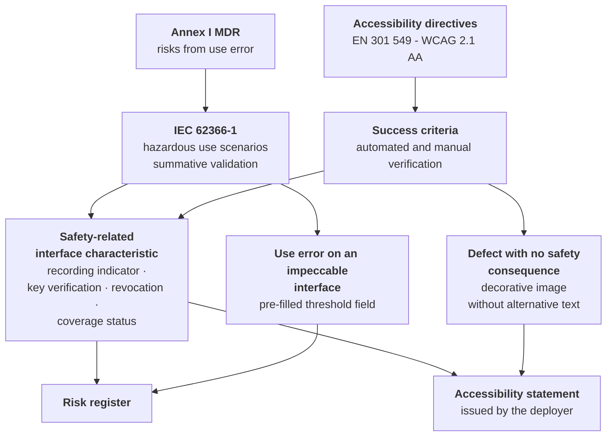

# Usability and accessibility

> **What this chapter does not contain.** It does not contain the product's accessibility and
> usability requirements: those are in
> [03 §06 - Accessibility and usability](/03_functional/06-accessibilita-e-usabilita.md), with the
> two mandatory tests, the ten critical paths, the six real user profiles and the verification
> matrix. **That chapter is not to be rewritten or contradicted: here it is read in a regulatory
> key.** It does not contain the map of the accessibility sources, which is in
> [01 §8](./01-inquadramento-normativo.md). It does not contain the explanation of what a use error
> is for someone who has never encountered it, which is in module
> [15 - The regulatory framework from scratch](/10_fondamenti/15-regolatorio-da-zero.md).

> **Scope warning, before every other line and in this position because it is the only one that
> changes the reader's decisions.** **The product bears no CE marking**, **is covered by no
> declaration of conformity** and **cannot be used to deliver healthcare services to real
> patients**. No usability engineering file is signed, **no formative evaluation has been conducted
> with real users**, **no summative validation exists** and no accessibility statement has been
> issued for a deployment in operation. This is the state of fact from which the chapter starts, and
> no line of what follows softens it.
>
> The project **intends** to assume the manufacturer role (`D58`), and **the legal entity that would
> exercise it is still to be constituted**. From this follows the allocation detailed in § 9: the
> product's accessibility properties and the formative evaluations are ours and can be produced now;
> approving the validation protocol, conducting the summative validation and signing the `UEF-001`
> file are acts **the standard reserves to the manufacturer role**, and they **remain reserved even
> when the role is ours**. The distinction is not a residue to be cleaned up: it is precisely what
> makes it legible **why those acts cannot be brought forward**.
>
> **And the gap this warning could open, closed here.** Whoever reads that the project intends to
> certify - or that the interface is verified against the accessibility criteria - and concludes
> "then I may use it with real patients" draws a **wrong** conclusion, and on two distinct counts.
> **An accessible interface is not a validated interface**: a general safety requirement that has
> not been demonstrated remains undemonstrated, and conformity with the accessibility criteria does
> not demonstrate even part of it (§ 6.2). **And the intention covers nobody**: it transfers no
> obligation and does not make an uncertified version usable. Whoever deploys or puts the software
> into service today assumes in full the resulting obligations - including the service's
> accessibility statement, which falls on them and **will not fall on the project even when the
> manufacturer entity is constituted** (§ 9, `V-273`).
>
> **No date appears in this chapter, and none can appear in it.** § 8 speaks of sequence and of
> conditions of validity, never of when: constraint `V-171` prohibits asserting or implying that the
> product will be marked by a deadline - this is the only admitted occurrence of that word - and
> internal planning does not become a promise merely because it is ours. The project's dates are
> solely in [09](./09-percorso-e-calendario.md), and they are internal planning (`D57`).

## 1. Two obligations, one interface

Two **obligations with different bases, different questions and different consequences of breach**
bear on the same screen. Treating them as one produces a defect in both directions: either an
interface containing dangerous use errors is declared conformant, or an accessibility
non-conformity is opened on a control which is, in reality, a risk control measure and as such
cannot be declared defective.

|  | **IEC 62366-1** | **EN 301 549 / WCAG 2.1 AA** |
|---|---|---|
| **Basis** | Annex I of Regulation (EU) 2017/745: obligation to eliminate or reduce the risks associated with use errors | Directive (EU) 2016/2102 and legge 9 gennaio 2004, n. 4 (Law no. 4 of 9 January 2004); Directive (EU) 2019/882 and d.lgs. 27 maggio 2022, n. 82 (Legislative Decree no. 82 of 27 May 2022) |
| **Question** | Can a reasonable use produce **harm to a person**? | Can a person with a disability **use** the service equivalently? |
| **Object** | The interaction between the device and the intended user | The perceivability, operability, understandability and robustness of the content and the components |
| **Metric** | Selected hazardous use scenarios that do not occur, or that are caught, in the summative validation | Success criteria verified, by automated **and** manual method |
| **Who verifies** | Representative users, with a protocol approved before execution | Automated tools plus verification with real assistive technologies |
| **Consequence of breach** | General safety requirement **not demonstrated**: a gap in the technical file | Accessibility non-conformity, with declaratory and enforcement obligations of its own |
| **Who is obliged** | The **manufacturer** of the marked distribution | The **provider of the online service**, that is, the deployer, for the statement; the project, for the product's properties |

**The last two rows are the ones the project must hold firm, and `D58` does not move them.** Under
`D28` and `D49`, **as amended by `D58`**, the project **intends** to assume the manufacturer role
and **the legal entity that would exercise it has not yet been constituted**: today the project
**does not sign the usability engineering file and does not conduct the summative validation**,
because both acts presuppose that role and **remain reserved even when the role is ours**.

**The row on accessibility must be read with even more care, because the obliged party is not the
same and will not become the same.** The statement obligation falls on **whoever delivers the online
service**, that is, on the deployer; the **technical properties** of the interface - contrast,
reading order, status announcements, keyboard reachability, absence of pre-filling on at-risk fields
- are instead **in the product**, and neither the deployer nor the integrator can add them
downstream. They are two obligations on two parties, and neither transfers to the other. The precise
allocation is in § 9.

## 2. Why usability engineering is an obligation and not good practice

Someone coming from software development reads "usability" as product quality: something that can be
done better or worse without anything formal depending on it. In a medical device it is not so.

- **Annex I, Chapter I**, of Regulation (EU) 2017/745 requires risks associated with **possible use
  errors** to be eliminated or reduced as far as possible, taking account of technical knowledge,
  experience, education, training and, where applicable, the medical and physical conditions of the
  intended users; and requires the risks arising from **ergonomic features** and from the intended
  environment of use to be reduced as far as possible.
  `[NV]` - the precise numbering of the points of the section must be verified against the
  consolidated text before being cited in the file.
- **EN 62366-1:2015** with amendment **A1:2020** is the standard describing the process by which
  that requirement is satisfied. `[NV]` - **the presence and the exact wording of the reference in
  the list of harmonised standards under the regulation are not verified**: not all the process
  standards from the directives era have been republished. The verification is documentary, at no
  cost, and must be done before compiling the general safety and performance requirements matrix.

**The operational consequence is clear-cut and admits of no recovery.** An interface not validated
under a usability engineering process is not an interface that can be improved: it is a general
safety requirement **not demonstrated**. There is no way of curing it with an internal review
downstream, because the summative validation requires four things that are produced only beforehand
- a frozen interface, an approved protocol, representative users recruited, a report - and none of
the four can be manufactured after the fact.

## 3. Use error is a failure mode

The standard defines use error as an **act or omission of the user that results in a different
result from that intended by the manufacturer or expected by the user**. The lexical choice in the
English version - *use error*, not *user error* - is deliberate and shifts the object from the user
to the interaction.

**It is not an ideological position, it is a technical placement.** In the ISO 14971 chain, use
error occupies exactly the place that in a hardware system is occupied by the breakage of a
component: it is **an event in the sequence** leading from the hazard to the hazardous situation. A
risk file treating use error as an unanalysable external cause has a hole in the chain, and the hole
is precisely where the statistically most frequent class of events lies for devices that present
information to a person. The link with the risk register is in chapter
[05 §2](./05-gestione-del-rischio.md), row "formative usability evaluation".

Three operating rules follow from this placement, and they are to be written into the quality
management system procedure, not left to the sensitivity of whoever designs.

1. **"The user got it wrong" is not the conclusion of an analysis: it is its beginning.** The next
   question is mandatory: what, in the interface, made that behaviour reasonable? An analysis
   stopping before that question has produced nothing usable.
2. **Use error and abnormal use must be distinguished, and the distinction must be justified.**
   Abnormal use - an intentional and unjustifiable violation of the intended use - is outside the
   scope of the usability standard but **is not outside risk management**: it is handled with
   organisational, access control and information measures. Classifying as "abnormal use" a
   behaviour that a significant proportion of users spontaneously adopt is a way of making a defect
   disappear, and it is challenged.
3. **The use error log feeds the risk file in real time.** Every formative evaluation detecting an
   unforeseen use error produces **a row in the risk file, or the documented rationale for why it
   does not**. There is no third possibility, and in particular there is no deferral to the end of
   the project.

**An example taken from this domain, and not a didactic one.** The field containing the individual
threshold of a monitoring plan starts empty and mandatory, with no pre-filling, not even with the
values of the pathway or of the last plan (constraint `V-123` of the functional area). The reason is
not preference: a pre-filled field is **impeccably accessible** and systematically produces
confirmation out of inertia of a value nobody has assessed. It is row `RM-06` of the risk register
and it is a **level 1** measure - inherently safe design: the error is not possible because there is
nothing to confirm.

## 4. The eight products of the process, and who produces them

Clause 5 of IEC 62366-1 describes a process generating artefacts in sequence, each one an input to
the next. It is convenient to see them as eight documents, because that is how a notified body asks
for them, and because the boundary between what the project produces today and what remains reserved
to the manufacturer role falls at different points for each of them.

| # | Artefact | Identifier | The project, today | Reserved to the manufacturer role |
|---|---|---|---|---|
| 1 | **Use specification**: indication, population, profile of each user group, environment of use, operating principle | `UE-SPEC-001` | **Full draft**, derivable from the intended purpose and from the functional documentation | Approves and dates |
| 2 | **Safety-related characteristics of the interface** | `UE-SPEC-001` § 2 | **In full**: they are known to the project and to nobody else | Reviews |
| 3 | **Use-related hazards and hazardous situations** | `UE-HAZ-001` | **In full**, with a reference to the risk register | Reviews and supplements |
| 4 | **Hazardous use scenarios**, in narrative form | `UE-HAZ-001` § 3 | **In full** | Reviews |
| 5 | **Selection of the scenarios to be validated**, justified on severity | `UE-PLAN-001` § 2 | Reasoned proposal | **Determines** |
| 6 | **User interface specification**, in verifiable terms | `UE-UIS-001` | **In full** | Verifies |
| 7 | **Validation plan**: protocol, pass criteria, number and profile of participants, environment, tasks | `UE-PLAN-001` | Technical draft | **Approves before execution** |
| 8 | **Formative evaluations** during development and **summative validation** before release | `UE-FORM-001`, `UE-SUM-001` | **Conducts the formative ones** | **Conducts or commissions the summative one and assumes its outcome** |

The set, plus the traceability links to the risk register, constitutes the **usability engineering
file** `UEF-001`. The identifiers belong to the space declared by constraint `V-172` in chapter
[03 §5](./03-sistema-di-gestione-della-qualita.md).

**What the fifth column names, now that that role will be ours.** It does not name a third party: it
names the **formal manufacturer role**, which the project **intends** to assume and whose **legal
entity is still to be constituted**. Approving, dating, reviewing, determining, signing and assuming
the outcome are acts the standard reserves to that role, and **the reservation does not fall away
because the role will be ours**: it falls away when the entity exists **and** document control is in
operation, because without the latter what is signed is a signature on a text and not a declaration
([02 §5.2](./02-qualificazione-e-classificazione.md);
[03 §4.1](./03-sistema-di-gestione-della-qualita.md), `V-174`). Reading that column as "somebody
else's work" was correct before `D58` and is incorrect now: it is **our work, not yet performable**,
which is a more onerous condition and not a less onerous one.

**Where the project is ahead and where it is behind, without softening.** It is ahead on artefacts 2,
3, 4 and 6: the safety-related characteristics are already inventoried as safety-related functions
in [03 §06 §6](/03_functional/06-accessibilita-e-usabilita.md), and the hazardous use scenarios
exist in mature form across the foundations modules and the risk register. It is behind on artefact
8: **no formative evaluation conducted with real users exists**, and the summative one cannot be
planned until the interface stops changing. It is the sequence governing the internal planning of
chapter [09 §3](./09-percorso-e-calendario.md); no date is derived from it here, and the delay on
artefact 8 **is ours**, not that of a party downstream.

## 5. User groups and cohorts: the error that doubles the cost

The validation plan requires **every distinct user group to be covered**. The operational question
is therefore how many groups exist, and the answer does not coincide with the number of user
profiles described by the functional area.

The **six profiles** of [03 §06 §3](/03_functional/06-accessibilita-e-usabilita.md) are sets of
observable constraints that serve for designing. The **user groups** within the meaning of the
standard are classes of people who use the device with different roles, training and
responsibilities, and they serve to establish how many cohorts the validation must recruit. The
correspondence is as follows.

| User group | Functional profiles falling within it | Why it is an autonomous group |
|---|---|---|
| **Physician** | Professional under time pressure | Takes on the clinical act, drafts the clinical document, configures the individual threshold |
| **Non-physician healthcare professional** | Professional under pressure, case manager | Takes on the alerts and works on the plan without drafting the clinical report: different tasks and different professional constraints |
| **Lay user** | Elderly person with low digital literacy, carer | No training, no instruction, no on-site support |
| **Non-clinical operator** | Front-office operator, technical operator of the service centre | The separation between the service centre and the delivering centre is an authorisation constraint (`V-125`): they do not access clinical content and see a different interface |

**Four groups mean four cohorts**, and every cohort has its own recruitment, consents, conduct,
observation and analysis. It is the variable that determines the order of magnitude of the cost of
the summative validation, and it must be fixed **before** asking for a quotation.

**The most expensive error is treating disability as a fifth group.** It is not. Disability and old
age are **characteristics that must be present inside each relevant cohort**, not a separate cohort:
there are visually impaired physicians, nurses with mobility limitations and operators who use
system magnification. A summative validation placing all people with disabilities in a single
"accessibility" cohort produces two simultaneous defects - it does not cover the professional groups
in their real composition and it turns accessibility into a separate obligation, which is exactly
what § 6 prohibits.

**The number of participants.** IEC 62366-1 **prescribes no number**. The figure of fifteen
participants per group, widely used in the industry, comes from the human factors guidance of the
United States regulatory authority and **is not a European Union requirement**: `[NV]`, and it must
under no circumstances be cited as an obligation. What the plan must justify is the **sufficiency
criterion adopted**, typically the saturation of the use errors observed. The expected number is one
of the questions to put to the notified body at the offer stage, together with the preliminary
review (chapter [09 §8.3](./09-percorso-e-calendario.md)). **Putting that question presupposes the
manufacturer role**: it is whoever engages the body who can put it, and the entity that would do so
has not yet been constituted.

## 6. Where the two obligations meet, and where they do not

**The central node is the only point at which the two obligations coincide, and constraint `V-175`
of § 6.3 governs exactly that node.** The two side nodes are the two directions in which they do not
coincide, and they are the reason why neither of the two verifications replaces the other.

### 6.1 They meet on every safety-related control

The examples that follow are taken from this product and each one is **simultaneously** an
accessibility non-conformity and a use error with a consequence for safety or for rights.

| Element | Accessibility defect | Resulting use error | Linked row |
|---|---|---|---|
| Recording-in-progress indicator | Not announced by the assistive reading tool | A participant believes the session is not being recorded, or the opposite; the consent loses its object | `RM-07` |
| Short verification string for the keys | Conveyed by colour alone, in breach of criterion 1.4.1 on the use of colour | The verification of the other party is not carried out: the control measure exists and does not operate | `D22` |
| End-of-session or consent revocation control | Not reachable by keyboard, or outside the reading order | The act of revocation cannot be exercised by whoever has the right to it | `RM-14` |
| Statement of the service coverage status | Insufficient contrast or concealed by a theme customisation | False reassurance: the person believes they are under surveillance and delays contacting the emergency services | `RM-12` |
| Error message on a critical path | Technical code only, without cause, consequence and action | The user abandons the path or performs the wrong action | `RNF-054` |

The row on customisation is what makes constraint `V-163` of the integration area a **regulatory
requirement and not a product choice**: the mandatory statements are neither themeable nor
concealable, and a theme configuration degrading contrast is rejected on saving, not flagged as a
warning.

### 6.2 They do not meet, in two directions

**An interface impeccable on the accessibility criteria may contain the gravest use errors.** The
pre-filled threshold field of § 3 is the demonstration: it meets every criterion and produces
confirmation out of inertia of a clinical value. No accessibility check, automated or manual, would
detect it.

**An accessibility defect may have no safety consequence at all.** A decorative image without
alternative text on an informational page is a real non-conformity, with its own declaratory
obligations, and produces no harm to any person.

It follows that **the two verifications do not substitute for each other, and that the exposed party
is different in the two cases**. Whoever performs **only the accessibility check** declares a
dangerous product conformant: the gap is a general safety requirement not demonstrated, and it is
**the manufacturer** who answers for it. Whoever performs **only the usability check** leaves
uncovered an obligation falling elsewhere: the statement for the online service is the
**deployer's**, the product's accessibility properties are the **project's** (§ 1, last two rows).

**Attributing the second failure to the manufacturer is an error of party**, and it is to be
corrected wherever it appears. The manufacturer answers for the general safety requirement not
demonstrated, not for the accessibility statement: they are two different sources, with two
different obliged parties, and the coincidence of the two roles in the same organisation - possible,
but not necessary - does not merge them.

### 6.3 The bidirectional linking rule - constraint `V-175`

> **`V-175`.** The usability engineering file states, for **every safety-related characteristic of
> the interface**, which accessibility criteria make it perceivable and operable; the accessibility
> conformance report states, for **every criterion verified on those characteristics**, that it is
> also a risk control measure. The link is bidirectional and verifiable. **An accessibility
> criterion covering a safety-related function cannot be the object of a declared non-conformity.**

The second sentence is the operational part. The accessibility statement allows declared
non-conformities, and declaring them is legitimate; but a non-conformity on a criterion that makes a
safety control usable **is not a declarable non-conformity: it is an uncontrolled use risk**, and it
is to be treated as such in the risk register. The constraint serves to prevent an accessibility
obligation from being used to absorb a safety defect.

Consequence for the automated check: the list of safety-related characteristics and the list of
criteria subject to a declared non-conformity must have an **empty intersection**, and the
verification is mechanical once both lists are versioned.

### 6.4 The declared non-conformity, checked against the rule

The project declares **one single non-conformity**, on criterion 1.2.4 concerning real-time captions
for live audio-video content (`D24`), with the interpreter as an alternative measure. Applying
`V-175`:

- the unavailability of real-time captions **does not render inaccessible** any of the
  safety-related characteristics listed in § 6.1, which are all textual or status-based and remain
  perceivable;
- **it does however make difficult** the clinical act itself for a deaf person, and this is a use
  risk, not a non-conformity: the alternative measure - the interpreter as a full participant, plus
  the text channel always available in session - is **precisely the risk control measure** that
  makes the statement sustainable;
- it follows that the interpreter **must be documented in the usability file too**, not only in the
  accessibility statement. If it appeared in only one document, the statement would be indefensible
  in one of the two forums.

**A dependency to be flagged and not discovered.** The declared limit on session participants is
deferred pending measurement (`Q-111`). Should the measurement exclude the third participant, **the
interpreter would no longer be admissible in session** and the alternative measure would fall
together with the declarability of the non-conformity. It is a link between an engineering decision
and an accessibility obligation that is not visible from either side.

## 7. Designing for the mobile device first, when the user is who they are

The design method - small screen and worst connection first, not adapted desktop - is already fixed
by the functional area and is not to be repeated here. What needs to be said is its **regulatory
qualification**, which is different from and more binding than that of a product choice.

**The device and the environment of use are part of the use specification, not performance
parameters.** Clause 5 of IEC 62366-1 requires the use specification to state the **intended
environment of use**. For this product the environment is not an office: it is the home of an
elderly person, on a mid-range device some years old that somebody else configured, on a mobile
network, often in poor lighting, often with nobody alongside. Three consequences follow that are not
optimisations.

1. **The reference device is not the developer's.** Until it is declared, the use specification
   cannot be completed and requirement `RNF-106` - nine participants out of ten complete the entry
   of a measurement at the first attempt, without assistance, on a low-end device and a limited
   network - **cannot be verified**. The choice is a product one (`Q-115`); the regulatory
   consequence belongs to this area and is question `Q-175`.
2. **Resilience is accessibility, not optimisation.** Degrading in a comprehensible way - audio
   before video, a clear notice, session resumption, the measurement kept locally and transmitted on
   restoration - is what makes the service usable by those with fewer resources. The absence of
   comprehensible degradation produces a use error: the person concludes that the service took place
   when it did not, or vice versa.
3. **The number of actions is a safety requirement.** A long entry path is not inconvenient: it is a
   path that part of the population does not complete, and the service not delivered to whoever
   cannot get in is a clinical outcome, not a conversion metric.

**The three populations and what each one imposes.** None of the three is an edge case; together
they are the normal population of the service.

| Who | Dominant constraint | Resulting regulatory requirement |
|---|---|---|
| **Elderly person, alone** | One single chance of succeeding before giving up and telephoning | A single path with no initial choices; the technical check inside the path and not optional; the telephone fallback declared **beforehand**, not after failure |
| **Family carer** | Works from their own device, for more than one person, in narrow time slots | Permanent, unambiguous subject context, with an explicit confirmation that **names** the subject on switching: it is the measure against `RM-09`, a measurement attributed to the wrong person |
| **Operator under pressure** | Ninety seconds between one service and the next, shared workstation | No modal interruption during the act; mandatory actions minimal and in the right place. **Every unnecessary mandatory field gets filled with false values**, and a false datum is worse than a missing one |

The last row is the least intuitive and the most important: in the real domain an excess of mandatory
fields **degrades the quality of the clinical data**. Exception is made for fields whose absence is
itself a risk - the deliverability statement, identification, outcome, individual threshold - and
the list of exceptions must be justified item by item, not lengthened out of caution.

## 8. The summative validation is the schedule constraint

It is the activity that, under deadline pressure, is sacrificed first, and it is not compressible in
any of its components.

| Condition of validity | Practical consequence |
|---|---|
| Interface **frozen** in the configuration that will be released | Every subsequent change requires an impact assessment and, if it touches a safety-related function, a partial repetition |
| **Protocol approved beforehand** | The pass criteria are not chosen after seeing the results. It is an irreversible decision point of the schedule |
| **Representative** participants, not substitutes | Developers, colleagues and acquaintances are not representative users: a summative validation conducted on them **is not a summative validation** |
| **Every group** covered | Four groups, four cohorts (§ 5) |
| Elderly people and people with disabilities **inside the cohorts** | Recruitment is the slowest and most uncertain item in the whole quotation: **six to ten weeks**, and it must be started months in advance |
| Failure is **analysed**, not repaired on the fly | A participant who gets it wrong produces a datum. Adjusting the interface during the session invalidates the session |

**The three failure modes, in order of expected frequency.**

1. **It is run too early**, on an interface that then changes, and must be redone.
2. **It is run on the wrong participants**, because recruitment did not start in time, and the
   report is not defensible.
3. **A serious use error is discovered** requiring a redesign, and the redesign requires a new
   partial summative validation. It is the scenario that adds a quarter to the path.

**The scheduling rule that follows, and it is the only useful conclusion of this paragraph.** The
formative evaluations are not a reduced version of the summative one: they are **the only insurance
against the third scenario**, and they must be conducted on prototypes, even non-functioning ones,
**before** the implementation is complete. Every use error discovered in a formative evaluation
saves a redesign and the partial summative validation that would follow from it.

**And the formative evaluations are the only item in this chapter that waits for nothing.** They are
conducted on prototypes, **before** the manufacturer entity is constituted, without a notified body
and without a frozen interface: none of the conditions blocking the other artefacts touches them.
From `D58` it follows that postponing them is no longer waiting on a party downstream but **a loss
of ours**, and the loss is asymmetric - the use error not discovered in a formative evaluation is
discovered in the summative one, where it costs a redesign and a repetition, or it is not discovered
at all, and then a person encounters it.

## 9. Allocation: what the project produces today, and which acts remain reserved

| Activity | The project, today | To whom the act remains reserved |
|---|---|---|
| Technical accessibility properties of the product | **In full**: they cannot be added downstream | No reservation. **The deployer** verifies on the configuration actually put into operation |
| Blocking automated check in continuous integration | **In full** | - |
| Manual verification with assistive technologies | **In full on the product's critical paths** | **The integrator** repeats it on the customisations it introduces |
| Use specification, safety-related characteristics, hazardous scenarios, interface specification | **Full draft** | **The manufacturer** approves, dates and signs |
| Selection of the scenarios to be validated | Reasoned proposal | **The manufacturer determines** |
| Formative evaluations | **Conducts them and publishes the outcomes**, now, without waiting for the entity to be constituted | **The manufacturer** reviews them when compiling the file |
| Summative validation protocol | Technical draft | **The manufacturer approves it before execution** |
| Conduct of the summative validation | - | **The manufacturer** conducts or commissions it, and **assumes its outcome** |
| Consolidated `UEF-001` file | Identified contributions, with version, date and verifiable hash (`V-179`) | **The manufacturer compiles and signs** |
| **Accessibility statement** for the service | Template and verified technical content | **The deployer issues it**: the obliged party is whoever delivers the online service, and **it is not the manufacturer** |

**How the third column is to be read, and why it no longer names a third party.** Where it says "the
manufacturer" it names the **formal role**: the project **intends** to assume it (`D58`) and **the
legal entity that would exercise it is still to be constituted**, so those rows **are not performable
today** - not because of a scope choice but because the party who could sign is missing and the
document control that makes a signature a declaration is missing
([02 §5.2](./02-qualificazione-e-classificazione.md)). Where it says "the deployer" or "the
integrator" it names instead parties **genuinely distinct from the project**, and their part **does
not move with `D58`**: it stays theirs, today as before, and nothing the project intends to do takes
it away from them.

**The row on the accessibility statement is the one most often got wrong, and `D58` makes it easier
to get wrong.** The statement concerns **an online service delivered by a party**, not a software
package. The project cannot issue it, cannot issue a valid one "on behalf of" the deployer - theme
customisation, the content uploaded by the tenant and the deployment environment change its outcome
- and **will not be able to issue it even once it has constituted the manufacturer entity**: the
manufacturer of a device is not, for that reason alone, the provider of the online service, and the
two roles have different sources, preconditions and addressees.

> **`V-273`.** **The service's accessibility statement is never the project's**, and it does not
> become so by virtue of `D58`. The obliged party is **whoever delivers the online service**, that
> is, whoever deploys and operates it; the project is bound to the **accessibility properties of the
> product**, which are a distinct thing and which no deployer can add downstream. No artefact of the
> project may contain, annex or anticipate an accessibility statement referring to a service, and no
> rewording may imply that assuming the manufacturer role absorbs that obligation.

What the project must supply is **the material that makes the statement completable in an afternoon
instead of in a month**: the list of criteria verified with method and date, the list of
non-conformities with the alternative measure, the list of critical paths covered, the version of
the standard against which the verification was conducted.

`[NV]` - the legally effective version of EN 301 549 is the one cited in the Union's official
publication in support of the applicable source, and it **has not been verified** in this
documentation (see [01 §8](./01-inquadramento-normativo.md)). The statement must indicate the
version against which the verification was actually conducted, not "EN 301 549" in the abstract.

## 10. What this chapter leaves open

| Reference | Question | To whom |
|---|---|---|
| `Q-175` | **The reference device and environment are part of the use specification, not a performance parameter.** Until they are declared, `UE-SPEC-001` cannot be completed and `RNF-106` cannot be verified. It re-raises `Q-115` with the regulatory consequence that question did not record: it is not a measurement delay, it is a gap in the file | Product, technical |
| `[NV]` | Presence and wording of the reference to EN 62366-1:2015+A1:2020 in the list of harmonised standards under the regulation (§ 2) | Compliance |
| `[NV]` | Precise numbering of the points of Annex I on risks from use error and from ergonomic features (§ 2) | Compliance |
| `[NV]` | Legally effective version of EN 301 549, and the consequent wording of the statement (§ 9) | Compliance |
| `Q-111` | If the measurement of the participant limit excluded the third participant, the alternative measure to the declared non-conformity would fall (§ 6.4) | Architecture, technical |
| `Q-273` | **The formative evaluations with real users are now an activity of ours and cannot be deferred (§ 8), but they cannot be produced by one person alone.** Observing a representative user performing a task requires **persons distinct** from whoever designed the interface, exactly as for the internal audit and the release review (`D54`): it is not a matter of hours. It must be established whether the function is acquired externally or whether the absence of formative evaluations is accepted as a declared risk - knowing that it is the risk § 8 identifies as the most expensive | Product, → **ORCH** |
| - | **The number and composition of the summative cohorts** are not fixed and will not be until there is a notified body with which to agree them (§ 5), and engaging one presupposes the **manufacturer entity, to be constituted**. The project states the sufficiency criterion, not the number | **The manufacturer**, once the entity is constituted |
