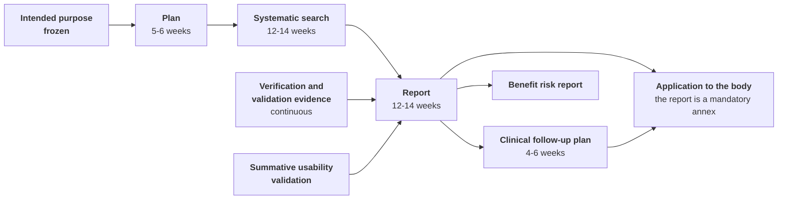

# Clinical evaluation

> **Reading prerequisite.** The qualification and the intended purpose on which this whole
> chapter depends are in chapter
> [02 - Qualification and classification](./02-qualificazione-e-classificazione.md). The risk
> register and the benefit/risk ratio, which are downstream, are in chapter
> [05 - Risk management](./05-gestione-del-rischio.md). The schedule this chapter constrains is
> in chapter [09 - Path and schedule](./09-percorso-e-calendario.md).
>
> **Warning governing the whole chapter, to be read before any line about the evidence.**
> **The product bears no CE marking**, **is covered by no declaration of conformity** and
> **cannot be used to deliver healthcare services to real patients**. **No clinical evaluation
> has been conducted**: there is no approved plan, there is no systematic search under way,
> there is no report, and no clinical benefit is demonstrated as at today. This is the state of
> fact from which the chapter starts, and no line of what follows softens it.
>
> The project **intends** to assume the manufacturer role (`D58`), and **the legal entity that
> would exercise it is still to be constituted**. From this follows an allocation that `D58`
> **does not modify**: drafting the clinical evaluation report, signing it and **determining
> that the evidence is sufficient** are acts the regulation reserves to the manufacturer role
> and which presuppose a qualified assessor with a declaration of absence of conflict of
> interests. They **remain reserved even when the role is ours**, and it is precisely this
> reservation that makes it legible why they cannot be brought forward: the intention is not
> the entity, and a signature affixed outside a document control in operation is not a
> declaration but a signature on a text
> ([02 §5.2](./02-qualificazione-e-classificazione.md)).
>
> **What `D58` really changes here.** It changes the **addressee of the preparatory work**: the
> draft plan, the citable technical validation evidence, the state-of-the-art dossier and the
> instrumentation of the clinical follow-up are no longer a contribution to somebody else's
> path but **the advance instalment of our own**. From this it follows that delay on these
> items is a **delay of ours**, and that the six to nine non-compressible months of § 2 are time
> that starts running when we make it start. Nothing changes, on the other hand, in the
> technical allocation of § 4.
>
> **And the gap this warning could open, closed here.** Whoever reads that the project intends
> to certify - or that a substantial part of the technical evidence is already produced - and
> concludes "then I may use it with real patients" draws a **wrong** conclusion, and this
> chapter is the one where the error costs most. **Technical evidence is not clinical
> evidence**: demonstrating that the software does what it declares it does not demonstrate that
> its use produces the expected effect on patient management (§ 3). And the intention to
> demonstrate it **covers nobody, transfers no obligation and does not make an uncertified
> version usable**: whoever deploys, integrates or puts the software into service today assumes
> in full the resulting obligations.
>
> **No date appears in this chapter.** The durations of the activities are declared because they
> are the substance of the argument - clinical evaluation is not compressed with resources - but
> a duration is not a deadline: constraint [`V-171`](../11_registri/01-vincoli-in-vigore.md#v-171) prohibits asserting or implying that the
> product will be marked by a deadline, and this is the only admitted occurrence of that word.
> The project's dates are solely in [09](./09-percorso-e-calendario.md), and they are internal
> planning (`D57`).

## 1. What it is, in exact terms

**Clinical evaluation** is defined by **Article 2(44)** of Regulation (EU) 2017/745 as the
systematic and planned process intended to **continuously** generate, collect, analyse and
assess the clinical data pertaining to a device, in order to verify its safety and performance,
**including its clinical benefits**, when it is used in accordance with the intended purpose
indicated by the manufacturer. The obligation is in **Article 61**; the procedure is in
**Annex XIV, Part A**.
`[NV]` - the precise numbering of the points of Article 2 must be verified against the
consolidated text before being cited in the file, by `COMP`.

Three connected notions must be kept distinct, because a notified body distinguishes them and
their conflation is a recurrent finding.

| Notion | Definition | What it is in the path |
|---|---|---|
| **Clinical data** | Information concerning safety or performance arising from the use of the device: clinical investigations, studies on equivalent devices, peer-reviewed scientific literature, documented clinical experience | The **raw material** |
| **Clinical evidence** | The clinical data **plus** the results of their assessment, of an amount and quality sufficient to allow a qualified assessment of whether the declared clinical benefit is achieved and of safety | The **product** |
| **Clinical benefit** | The positive impact of the device on a person's health, expressed in **meaningful and measurable clinical outcomes**, including those relating to diagnosis, or the positive impact on **patient management** or on public health | What must be **demonstrated** |

### 1.1 The clinical benefit is the point at which digital healthcare realises it has a problem

"Reduces waiting times", "improves organisational efficiency", "cuts travel costs", "is
appreciated by its users": **none of these is a clinical benefit**. They are commercial
arguments, and presenting them as a clinical benefit produces a non-conformity cycle on the
central point of the report.

The definition has three branches, and for this product **the practicable branch is the
second**: the positive impact on **patient management**. The formulation the project proposes as
a draft - *to enable access to scheduled services for people for whom access in person is
burdensome or not timely, while maintaining the completeness and traceability of the clinical
information* - is built on that branch, and must in any event be submitted for verification to a
qualified clinical writer before being frozen.

**Beware of an asymmetry that escapes notice.** "While maintaining the completeness of the
clinical information" is not a defensive clause: it is **a claim to be demonstrated**, and it
therefore determines part of the inclusion criteria of the literature search and at least one
quantity to be measured in the clinical follow-up (§ 7). Every word of the intended purpose that
asserts something costs work in evidence. Every word that asserts nothing is useless. There are
no neutral words.

## 2. Why it is the real bottleneck

The limiting factor declared by the path as a whole is the availability of the notified body
(`D44`). The **second** is clinical evaluation, and it has a property that makes it worse: **it
is not compressible with resources**. Doubling the people does not halve the time of a systematic
search, because the sequence - protocol, querying, screening by two reviewers, retrieval of the
full texts, critical appraisal, extraction, synthesis - is **intrinsically serial** over a
substantial part of the path.

| Activity | Duration | Why it is not compressed |
|---|---|---|
| Clinical evaluation plan | 5–6 weeks | Depends on the frozen intended purpose |
| Systematic literature search | 12–14 weeks | Double screening, retrieval of the full texts, critical appraisal of each source included |
| Data analysis and drafting of the report | 12–14 weeks | Depends on the search **and** on the verification and validation outcomes |
| Clinical follow-up plan | 4–6 weeks | Depends on the report |

**Six to nine months in sequence**, with one dependency upstream - the intended purpose - and one
downstream - the benefit/risk ratio of chapter
[05 §8](./05-gestione-del-rischio.md), which does not close before it.

**The horizontal chain is serial and does not parallelise; the two lateral inputs are the only
part the project produces today.** The arrow entering from the left is the upstream dependency of
§ 2.2: satisfied as to the freezing, not yet as to the external review that must follow it.

### 2.1 Three reasons why it is systematically underestimated

1. **It looks documentary and is not.** Whoever looks at the list of products in § 4 stops at the
   three that carry an identifier - the plan `CE-PLAN-001`, the report `CE-REP-001` and the
   follow-up plan `PMCF-PLAN-001` - sees three documents and estimates three weeks. The other four
   products in the same table have no identifier and are therefore miscounted, yet they are where
   the work is. The systematic search is a methodological activity with a
   registered protocol, inclusion and exclusion criteria declared **beforehand**, double screening
   and critical appraisal of each source included. A report built on an informal review of the
   literature is rejected, and the rewriting starts again from the protocol.
2. **It does not start unless the intended purpose is frozen** - a condition satisfied today
   (§ 2.2), and one that must be guarded because it is reversible by mistake. The scope of the
   search is determined by the claims to be demonstrated. If the intended purpose changes, the
   search **must be redone, not supplemented**: the inclusion criteria change, therefore the set
   of texts to be retrieved changes, therefore the critical appraisal changes. It is the reason
   why the freezing of the intended purpose is an irreversible decision point of the schedule.
3. **It requires a competence a technical team does not have and does not acquire quickly.** The
   writer must have a **documentable qualification**: the notified body asks for a curriculum
   vitae and a declaration of absence of conflict of interests, and the structure of the
   assessor's qualification is itself an object of verification.

### 2.2 The upstream dependency: frozen, and not thereby satisfied

The formulation of the intended purpose of remote monitoring (telemonitoraggio) **is frozen**
(`D55`, which closes [`Q-144`](../11_registri/02-questioni-aperte.md#q-144)): "**deferred collection of parameters for periodic review by the
professional**". It is the formulation on which the whole domain model is written (constraint
[`V-144`](../11_registri/01-vincoli-in-vigore.md#v-144)) and it maintains Class IIa and software safety class B. The alternative formulation -
"real-time monitoring of vital parameters", which would take it into Class IIb and class C - is
**excluded**.

**For the clinical evaluation the difference was not one of class, it was one of corpus**, and
that is the reason why the freezing unblocks this chapter more than it unblocks the others. The
search strings, the inclusion criteria and the reference state of the art are **literally
different** in the two cases: the literature on continuous surveillance and that on periodic
review are distinct corpora, with different outcomes, populations and study designs. Changing
formulation after the start would not modify a paragraph: **it would wipe out the work**. From
`D55` there follows a permanent prohibition that this chapter has a direct interest in guarding
- **no function may be added if it moves the system towards clinical real time**, and the
assessment must be made **before** writing the function, not after.

**What remains open, and it is not little.** `D46` and `D55` require the frozen intended purpose
to be **submitted to external review before** engaging any notified body. That review **has not
been conducted**. And engaging the body is in turn an act that presupposes the manufacturer role:
the project **intends** to assume it and **the legal entity that would exercise it is still to be
constituted**. The freezing therefore makes the **methodological** part startable - search
protocol, inclusion and exclusion criteria, state-of-the-art dossier - and **does not make
anything that § 4 reserves to the role capable of being brought forward**.

**A clarification this section owes to its own history.** The previous version declared the
intended purpose not frozen and the dependency blocking. It is no longer so, and the two chapters
that take [`Q-144`](../11_registri/02-questioni-aperte.md#q-144) up again - [02 §12](./02-qualificazione-e-classificazione.md) and
[09 §10](./09-percorso-e-calendario.md) - already report it as **closed by `D55`**. What remains to
be done is not a correction of those chapters but the **residual condition** that `09` §10
declares: the external review of the formulation, which is [`Q-275`](../11_registri/02-questioni-aperte.md#q-275) and has not been conducted.

## 3. MDCG 2020-1: the three components of the evidence for software

**MDCG 2020-1** translates the framework of Article 61 into the specific case of software and
establishes that the clinical evidence of medical device software is articulated in **three
distinct components, all of them necessary**.
`[NV]` - the current revision of the document must be verified at the moment of use by `COMP`:
the coordination group's documents are revised.

| Component | Question it answers | How it is demonstrated | The project's position |
|---|---|---|---|
| **Valid clinical association** | Is there a recognised association between the software's output and the clinical condition or physiological state it refers to? | Literature, guidelines, clinical standards, existing data | The component **least** dependent on the product: it is domain, and it can be prepared |
| **Technical validation** | Does the software generate the expected output from the inputs, accurately, reliably and repeatably? | Technical verification and validation | **The project produces it in bulk**: it is its most substantial contribution |
| **Clinical validation** | Does the software's output, used in the intended clinical context, produce the expected effect on patient management or on the outcome? | Clinical data: literature, documented clinical experience, clinical follow-up | **The gap**: it is the component the report must build and the follow-up must fill |

### 3.1 The good news, and the two conditions for it to be such

The second component is the one on which the project has decided to invest disproportionately
compared with the average: high test coverage, integration tests, end-to-end tests, real-time
channel quality tests with simulation of loss and delay variation, load tests, requirements ↔
tests traceability generated and not compiled by hand (`D10`, chapter
[03 §7](./03-sistema-di-gestione-della-qualita.md)).

**None of those tests exists today, and it is right to say so in this very sentence rather than
further down.** The project is in its design phase: not one line of application code exists, and
[`V-182`](../11_registri/01-vincoli-in-vigore.md#v-182) forbids writing any before the build chain
exists. What exists is the **decision** on how those tests will be produced and preserved, taken
before the code rather than after it - which is the real advantage, and it is not the same
advantage as having the tests. A compliance chapter that writes a future capacity in the present
tense produces exactly the misreading this chapter exists to prevent.

**That evidence will be directly reusable as a component of the clinical evidence** - on two
conditions. The first is that it exist at all, and that depends on the build chain and on the
code. The second is a product condition, not a drafting one, and it holds for each outcome
produced.

> **[`V-176`](../11_registri/01-vincoli-in-vigore.md#v-176).** Every test outcome intended to be cited as evidence - clinical or technical - must
> be produced in **citable form** and preserved as an **immutable artefact**: exact version of the
> software, declared environment, date and time, who ran it, outcome, integrity hash. A report
> **regenerable but not preserved** is not evidence: at the moment of citation the environment has
> changed and the result is no longer the same, and an assessor who asks to see the cited outcome
> receives a different outcome. It holds for every area's continuous integration chain, not for
> the compliance documentation alone.

It is a precise technical reason - and one different from that of IEC 62304 - why traceability
must be frozen at once and the tests must be produced by a chain that preserves their outcome.
The IEC 62304 reason is reconstructibility; this one is **citability**, and it is more stringent
because the addressee is external.

### 3.2 The bad news, without softening

The clinical validation of a telemedicine system requires data on the **effect on patient
management**, and the available literature concerns telemedicine as a **mode of delivery**, not
this specific product.

The bridge between the two levels - from "remote consultation (televisita) in a given specialty
is effective" to "this software enables that remote consultation with completeness and
traceability of the clinical information" - is **precisely what the report must build**, and it
is the argument on which the notified body raises its questions. There is no shortcut: there is
an argument, which must be written well, and whose weakness is paid for in non-conformity cycles.

**And here the thing that § 3.1 makes it easy to misunderstand must be said without softening.**
The abundance of the second component **does not compensate for the gap in the third**, and the
three components are "all of them necessary" in exactly this sense: no amount of test coverage,
of end-to-end tests or of channel quality measurements demonstrates that the use of the device
produces the expected effect on patient management. Whoever reads the list of technical evidence
produced and infers from it that the product is clinically validated performs **exactly** the
inference this paragraph excludes: **the declared clinical benefit is not demonstrated as at
today**, and it does not become so because the project **intends** to demonstrate it or because
the manufacturer entity - **still to be constituted** - will one day demonstrate it.

## 4. What is concretely needed, and who can do it

| Product | Content | The project, today | Reserved to the manufacturer role |
|---|---|---|---|
| `CE-PLAN-001` **Clinical evaluation plan** | Intended purpose and claims to be demonstrated, state of the art, clinical parameters and acceptability criteria, evidence strategy for each of the three components, search protocol, follow-up plan | **Technical draft** with the technical validation part already filled in | **The manufacturer approves and assumes it** |
| **State-of-the-art dossier** | What the reference clinical practice is today for the services within the perimeter, with the sources: national instruments and agreements, guidelines of scientific societies, literature | **Fully producible**: it is not specific to a manufacturer, it is specific to the domain | **The manufacturer** adopts it or supplements it |
| **Protocol and results of the systematic search** | Databases queried, strings, dates, inclusion and exclusion criteria, selection diagram, critical appraisal of each source included | Can **prepare the protocol** and the documentary infrastructure | **The manufacturer performs it**, with a qualified writer |
| **Technical validation evidence** | Citable reports, with version, environment, date, who ran it, outcome | **Producible in full, and non-existent today**: not one line of application code exists and [`V-182`](../11_registri/01-vincoli-in-vigore.md#v-182) forbids writing any before the build chain. What exists is the rule of form that will make them citable ([`V-176`](../11_registri/01-vincoli-in-vigore.md#v-176)), decided before the code | **The manufacturer** reviews it and cites it |
| **Evidence from usability engineering** | Report of the summative validation: it is **clinical data** for the purposes of patient management by a user | Conducts the formative ones; contributes to the specification | **The manufacturer conducts or commissions the summative one** ([06 §9](./06-usabilita-e-accessibilita.md)) |
| `CE-REP-001` **Clinical evaluation report** | Synthesis and qualified judgement, with the determination that the evidence is **sufficient** | - | **Only the manufacturer**, signed by a qualified assessor with a declaration of absence of conflict |
| `PMCF-PLAN-001` **Clinical follow-up plan** | What will be collected from the field to fill the evidence gaps, with methods and periodicity | Supplies the **instrumentation** (§ 7) | **Only the manufacturer**: it is a commitment, not an analysis |

**How the fourth column is to be read.** It does not name a third party: it names the **formal
manufacturer role**, which the project **intends** to assume and whose **legal entity is still to be
constituted**. The rows of that column are not performable today - not by a choice of perimeter but
because the entity is missing, and in two cases the person is missing too: the report and the
follow-up plan require a **qualified assessor with a declaration of absence of conflict of
interests**, a figure the project does not have internally and one that `D54` does not allow to be
improvised. The reservation does not fall away because the role will be ours: **it falls away when
the entity exists, the person is appointed and document control is in operation**.

### 4.1 The row that counts: the state-of-the-art dossier

It is the most laborious part of the clinical evaluation that **does not depend on the
manufacturer**. It describes what the reference clinical practice is - what is done today, with what
results, with what recognised limits - for the services within the declared perimeter. It is built
on **public sources**: national instruments on telemedicine, agreements made in the standing
conference, guidelines of scientific societies, peer-reviewed literature.

From this follow two properties that make it the project's only truly strategic contribution to the
clinical evaluation:

1. **it reduces the path time of whoever undertakes it, starting with us**: it contains nothing
   specific to a manufacturer, so it serves **our path first of all** - which with `D58` is the path
   the project answers for - and it remains reusable by anyone else without this taking anything
   away from us;
2. **it lends itself to the open form**, because it is built on public sources and not on
   confidential documentation. It is the only substantial part of the clinical evaluation of which
   this can be said: § 6.1 shows the opposite case.

The cost, however, is real and must be stated: it requires a documentable clinical competence that
the project today **does not have internally**, and producing it is a commitment of resources, not a
by-product of the documentation. It is question [`Q-176`](../11_registri/02-questioni-aperte.md#q-176), addressed to the project owner.

## 5. The Article 61(10) exemption, and why it is not worth invoking

**Article 61(10)** provides that, where the demonstration of conformity with the general safety and
performance requirements on the basis of clinical data **is not deemed appropriate**, an adequate
justification is to be provided founded on the results of the risk management and on the
consideration of the specifics of the interaction between the device and the human body, of the
clinical performance intended and of the manufacturer's claims. The provision does not apply to
implantable devices and to Class III devices.
`[NV]` - the numbering of the paragraph must be verified against the consolidated text by `COMP`.

**It is an apparent way out**, and it must be documented as such instead of being ignored. Three
reasons for not taking it:

1. the justification must be **accepted by the notified body**, and for software that presents
   clinical information to a professional acceptance is improbable: the interaction with the
   clinical decision is precisely what grounds the qualification within the meaning of
   Rule 11;
2. even if accepted, it **does not exempt from post-market clinical follow-up**, which remains due
   save for a separate justification;
3. a justification **rejected at the first round of questions costs more** than a clinical
   evaluation conducted well, because the evaluation then has to be done anyway, starting again from
   scratch, with the file already under assessment and the clock running.

**The project's proposal:** not to invoke Article 61(10), and **to document in the plan that it was
considered and the reasons for discarding it**. It is a question the notified body asks, and it is
better to have the answer already written than to improvise it in the course of the questions.

## 6. Equivalence, and its limits

**Annex XIV, Part A**, allows the clinical evaluation to be founded on the clinical data pertaining
to a device **whose equivalence is demonstrated**, provided the demonstration covers **three groups
of characteristics**.

| Group | What it requires | Applicability to software |
|---|---|---|
| **Technical** | Use under similar conditions, similar specifications and properties, the same operating principles and critical performance requirements | Requires knowing the **architecture and algorithms** of the comparator device |
| **Biological** | The same materials or substances in contact with the same tissues or body fluids | **Not applicable** to software without applied parts: the non-applicability must be **declared with a justification**, not omitted |
| **Clinical** | The same clinical condition, the same severity and stage, the same anatomical site, the same population, the same kind of user, similar clinically relevant performance | Verifiable on public documentation, if the comparator device has a published intended purpose |

### 6.1 The limit that makes equivalence almost unusable for software

Annex XIV requires the manufacturer to have a **sufficient level of access to the data relating to
the device with which it claims equivalence**, so as to be able to justify the claim. For the
technical characteristics of software this means **access to the architecture and the algorithms of
somebody else's product**.

Three practical consequences follow, and none of the three can be got round by drafting.

1. **With a third party's device a contract is needed** giving continuing access to the technical
   documentation. No competing operator has an interest in granting it; the negotiation, where it
   exists, takes months and has an uncertain outcome. The cost cannot be expressed even as an
   order of magnitude - it is among the **non-estimable** items of
   [09 §8.2](./09-percorso-e-calendario.md) - and that is precisely why § 6.2 **does not put it in
   the plan**: an activity whose outcome does not depend on whoever conducts it is not planned, it
   is kept out of `CE-PLAN-001` as a conditional activity.
2. **Equivalence with a device of the same manufacturer** is the practicable road in general, but
   **here it does not exist**: this is the first generation.
3. **An unsupported claim of equivalence is worse than the absence of equivalence**, because it
   produces a non-conformity cycle on a central point of the report, and rewriting without
   equivalence requires the literature search that had not been done - that is, it adds twelve to
   fourteen weeks at the worst possible moment.

**A confidentiality note that holds as a drafting rule, and which `D58` does not touch.** No
document of the project names products, brands, commercial operators or domains (`R0`). An
equivalence analysis **necessarily** names a comparator device: **it is therefore not producible in
this documentation, not even in draft**.

**The limit is one of perimeter, not of attribution, and the distinction counts now more than
before.** Before `D58` the same conclusion was justified by saying that the analysis was "a third
party's document"; that justification fell away together with the third party. The true reason is
another one and it stands on its own: an equivalence analysis belongs to the **technical file**,
which lives under the manufacturer's document control and **not in the public repository**, and it
is by construction incompatible with `R0`. Were it ever to be conducted, it would be **a
manufacturer's document** - an act reserved to a role the project **intends** to assume and whose
**legal entity is still to be constituted** - and it would not appear here even then. § 6.2 explains
why, for this product, the question does not concretely arise.

> **[`V-274`](../11_registri/01-vincoli-in-vigore.md#v-274).** **The Annex XIV equivalence analysis does not enter the project's public
> documentation, in any form and at any stage.** It necessarily names a comparator device and
> violates `R0` by construction; it belongs to the technical file under the manufacturer's document
> control. The constraint **is not softened** by effect of `D58`: assuming the manufacturer role
> moves who drafts that document, **not where the document lives**. Every reference to a possible
> comparator device, even merely by category, must be kept generic and non-identifying.

### 6.2 What is usable instead, and must be used

**Literature does not require equivalence.** A study on the effectiveness of a service delivered
remotely in a specialty is usable as clinical data on the **mode of delivery**, with an explicit
argument on the link between what the study demonstrates and what the device does. It is the normal
road for this kind of product and it is exactly the road that takes the six to nine months of § 2.

**The project's proposal:** to build `CE-PLAN-001` **without equivalence**, and to treat equivalence
as a **conditional** activity - to be assessed only should a candidate emerge with technical
documentation that is genuinely accessible - and not as a planned activity. A plan that plans a
negotiation whose outcome does not depend on whoever conducts it is not a plan.

## 7. Post-market clinical follow-up is a data design requirement

**Annex XIV, Part B**, governs post-market clinical follow-up as a **continuous** process of
updating the clinical evaluation, with a **plan** - methods, procedures, objectives, rationale,
reference to the relevant parts of the report and to the general safety and performance requirements
- and a **schedule**. The outcome is a **report** that feeds both the clinical evaluation and
post-market surveillance
(chapter [08](./08-sorveglianza-post-commercializzazione.md)).

**Why the plan is substantive here and not formal.** The initial clinical evaluation will rest
predominantly on literature relating to the mode of delivery and on technical validation. The
evidence gap is therefore on the third component - the effect on patient management **with this
device** - and it is precisely the gap the follow-up must fill. A plan that **declares the gap** and
defines how to fill it is defensible; a generic plan promising "collection of feedback from users"
is not.

### 7.1 The product consequence, which must be taken now and not later

> **[`V-177`](../11_registri/01-vincoli-in-vigore.md#v-177).** The quantities the clinical follow-up plan commits to collecting must **exist as
> data** - with a stable definition, versioned and comparable across deployments and over time -
> **before** the plan is written. Designing the instrumentation after writing the plan means
> discovering that the datum is not there, and a datum that is not there is not recovered
> retroactively for the period elapsed. The definition of each quantity is versioned: changing it
> without changing its name makes the historical series incomparable and nullifies the follow-up
> without anyone noticing.

The plausible quantities for this product, and what each of them requires of the data model:

| Quantity | What it measures | Requirement on the datum |
|---|---|---|
| Fraction of services **completed** with respect to those started, by typed outcome | Whether the device actually enables delivery | The typed outcomes are domain values and not error codes ([`V-126`](../11_registri/01-vincoli-in-vigore.md#v-126)): the distinction between non-attendance and technical failure must be preserved ([`V-141`](../11_registri/01-vincoli-in-vigore.md#v-141)) |
| Frequency of the **fallbacks to attendance in person** | Whether the remote mode holds up for the declared use case | The executability assessment with three independent outcomes must be recorded, not merely applied |
| **Completeness of the clinical information** transmitted to the system of origin | It is the claim contained in the intended purpose (§ 1.1) | Explicit transmission status with confirmation that the recipient has taken it on: no ambiguous intermediate status (`RM-08`) |
| Frequency of **alarms not responded to** within the declared window | Safety of the remote monitoring pathway | Acknowledgement is a transition recorded within the alarm's sequence of immutable events, not a status column updated in place ([`V-121`](../11_registri/01-vincoli-in-vigore.md#v-121), `BR-136`): without it, the failure to respond is not reconstructible after the fact. The service hours are versioned runtime data ([`V-122`](../11_registri/01-vincoli-in-vigore.md#v-122)) and establish whether a failure to respond was expected or anomalous |
| Frequency of **association errors** reported | Safety of identification | Recording of the act of identification as an event, not as an attribute |

**None of these quantities contains clinical content**, and that is a condition, not a coincidence:
the clinical follow-up must be capable of being fed from deployments at third parties without
identifiable data leaving those deployments. It is the same reason for which constraint [`V-150`](../11_registri/01-vincoli-in-vigore.md#v-150)
excludes clinical content from the audit trails, and it must be preserved even where it would
increase the informative value of the datum.

## 8. Where this chapter joins up with the others

| Towards | Link | Direction |
|---|---|---|
| [02 - Qualification](./02-qualificazione-e-classificazione.md) | The intended purpose determines the claims to be demonstrated, hence the scope of the search | **Input**, frozen by `D55` (§ 2.2) |
| [05 - Risk management](./05-gestione-del-rischio.md) | The benefit/risk ratio needs the term of comparison of the benefits, which comes from here | **Output** towards § 8 of that chapter |
| [06 - Usability](./06-usabilita-e-accessibilita.md) | The report of the summative validation is **clinical data** for the purposes of patient management | **Input** |
| [08 - Surveillance](./08-sorveglianza-post-commercializzazione.md) | The clinical follow-up is part of surveillance and feeds the periodic safety update report | **Bidirectional** |
| [09 - Path](./09-percorso-e-calendario.md) | Six to nine non-compressible months, which place the submission in the project's **internal planning** (`D57`) - durations, not deadlines: no date appears here | **Output** |

**The most dangerous arrow is the first one**, and it is the one that gets forgotten: clinical
evaluation is not an activity downstream of the delivery of the software. If it starts at the moment
the software is ready, the report does not exist for another nine months, and since it is a
**mandatory annex to the application**, the submission slips with it, dragging the whole path by a
full quarter or more.

## 9. What this chapter leaves open

**The order of the table is by priority and status, not by identifier**: first the two open
questions awaiting a decision, then the one closed in the course of the cross-check, then the
`[NV]` verifications with the indication of who must close them according to the three admitted forms in `CONTRIBUTING.md`,
and finally what remains reserved to the manufacturer role.

| Reference | Question | To whom |
|---|---|---|
| [`Q-176`](../11_registri/02-questioni-aperte.md#q-176) | **Whether the project should produce and publish the state-of-the-art dossier** (§ 4.1). With `D58` the question changes in nature: it is no longer "whether to contribute to a third party's package" but **whether to start now an item of our own path** that is long-running, not compressible and upstream of the systematic search. It lends itself to the open form and is reusable by anyone; it requires, however, a documentable clinical competence that the project **does not have internally** and it is therefore a commitment of external resources, not an extension of the documentation | → Project owner |
| [`Q-275`](../11_registri/02-questioni-aperte.md#q-275) | **The external review of the frozen intended purpose has not been conducted** (§ 2.2). `D46` and `D55` require it **before** engaging any notified body; the engagement presupposes the manufacturer entity still to be constituted, but **the review does not** - it is the only one of the two that can be commissioned now, and deferring it exposes to the risk that the freezing holds until the first external confrontation and no further | → Project owner |
| [`Q-274`](../11_registri/02-questioni-aperte.md#q-274) | **CLOSED in the course of the cross-check.** The question asserted that [`Q-144`](../11_registri/02-questioni-aperte.md#q-144) was still listed among the open questions in `02` §12 and in `09` §10. Verification against the two chapters shows that **this is not so**: both report it as «**CLOSED by `D55`**» with the outcome **RESOLVED**, and `09` §10 adds to it the one residual condition of the external review, which is [`Q-275`](../11_registri/02-questioni-aperte.md#q-275) and remains open above. No reader derives a blocking dependency from those chapters: [`Q-274`](../11_registri/02-questioni-aperte.md#q-274) was itself a rewording residue, and it is closed without being passed on to anyone | **CLOSED**, verified against the two chapters |
| `[NV]` | Precise numbering of Article 2, point 44, and of Article 61, paragraph 10 (§§ 1, 5) | `COMP` |
| `[NV]` | Current revision of MDCG 2020-1 (§ 3) | `COMP` |
| - | **The clinical evaluation report is not producible by the project in any form**, not even in draft: it requires a qualified assessor with a declaration of absence of conflict, and the signature is the act itself (§ 4). The act **remains reserved to the manufacturer role even when the role is ours** | **The manufacturer**, with the entity constituted and the assessor appointed |
| - | **The equivalence analysis is not producible in this documentation** because it necessarily names a comparator device (§ 6.1, `R0`, [`V-274`](../11_registri/01-vincoli-in-vigore.md#v-274)). The limit is one of **perimeter of the public documentation** and it does not move with `D58` | **The manufacturer**, in the technical file and never here |
