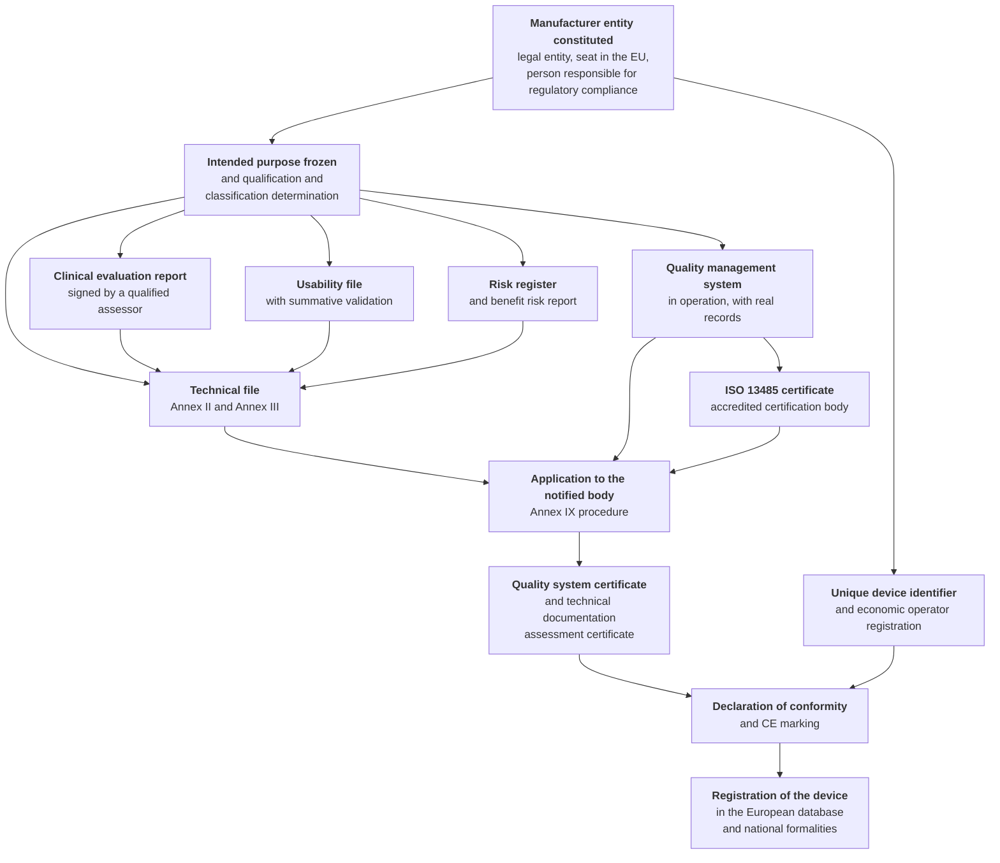
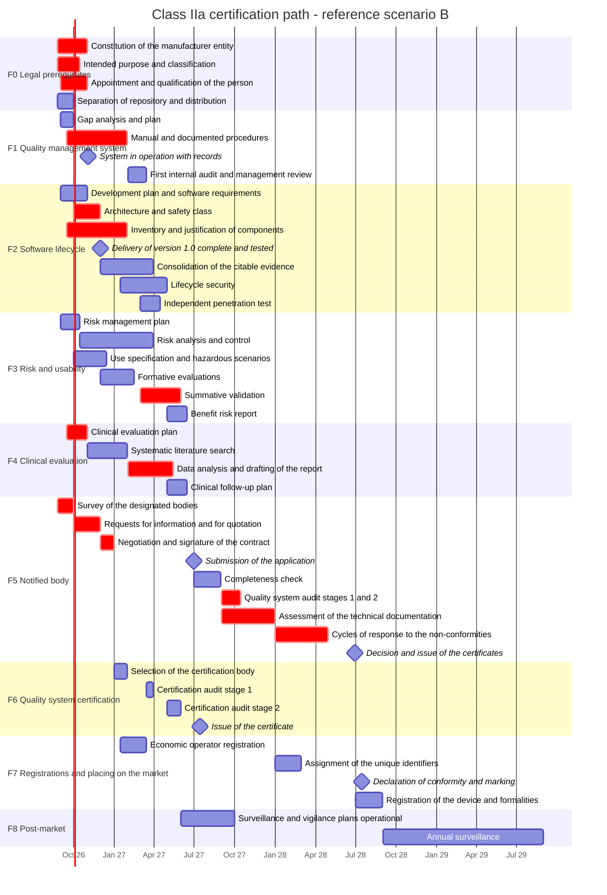
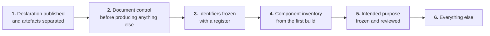

# Path and schedule

> **Warning that governs the whole chapter, and that is to be read before every date.**
> **This is the project's internal schedule** (`D57`). The dates are **our own planning**, not an
> external party's path and not a commitment to anyone.
>
> Internal planning, however, **does not become a promise merely because it is ours**. It remains
> prohibited - by constraint [`V-171`](../11_registri/01-vincoli-in-vigore.md#v-171) and without exception - to write, or to allow it to be
> understood, in any place, documentation, public communication or presentation material, **that
> the product will be marked by a date**. The distinction is not a formal one: a device's intended
> purpose is derived from published material too, so a date presented as a commitment produces a
> regulatory effect that a date presented as planning does not produce.
>
> **State of fact, unchanged and to be declared every time it is needed.** Today the product
> **bears no CE marking** and is covered by no declaration of conformity. Whoever deploys it or
> places it on the market assumes the resulting obligations. `D57` changed **who plans**, not what
> the product is today.
>
> **The manufacturer role is not yet constituted.** Several steps of this schedule formally
> presuppose it - engaging a body, signing a clinical evaluation report, affixing the marking. The
> constitution and formalisation of that role is therefore itself **an internal prerequisite with a
> time of its own**, and it is put on the schedule as such instead of being taken for granted or
> attributed elsewhere.
>
> § 5 keeps a priority that no other section has: the **retroactively unrecoverable** activities,
> which have to be carried out now because their absence would make it impossible to certify later
> - for us as for anyone.

## 1. What exactly has to be achieved

The project's classification determination concludes for **Class IIa** by reference to the declared
intended purpose ([02](./02-qualificazione-e-classificazione.md)). It follows that the attainment
is not one act but a **set of acts**, some of which depend on third parties.

**Two things the diagram makes visible and that a list conceals.**

The first: **the intended purpose is the node on which four parallel branches depend**. Changing it
after the start does not delay one branch: it wipes out all four, because the scope of the clinical
search, the set of hazards, the use specification and the general requirements matrix are all
written on it.

The second: **the ISO 13485 certificate and the notified body's certificates are not the same thing
and do not substitute for one another**. The regulation requires a quality management system
complying with Article 10(9), which the notified body certifies pursuant to Annex IX; ISO 13485
certification is a distinct act, issued by an accredited certification body, which `D12` makes
mandatory for this path. Where the same party can issue both, the **combined audit is the single
most effective optimisation of the entire path** (§ 8.3).

## 2. The backward calculation from the notified body

The limiting factor **is not software development**. It is the availability and the speed of the
notified body, and it is an external datum on which no planning has any bearing.

| Datum | Value |
|---|---|
| Time from the written agreement to the certificate - 51% of bodies | **13–18 months** |
| Same - 31% of bodies | **19–24 months** |
| «Quality system only» assessment | predominantly **6–12 months** |
| «Quality system plus product» assessment, which is the case here | predominantly **13–18 months** |
| Time from first contact to signature of the contract | **under 2 months in 66% of cases** |
| Gap between applications and certificates issued at the end of 2025 | **25,978 applications against 13,953 certificates** |
| Trend in the bodies' staffing 2024 → 2025 | **−8%** internal personnel, **−21%** subcontractors |

`[FONTI SECONDARIE]` - the figures come from industry surveys and from Commission data reported in
the project's research; they have not been read in the original publications and **must not be
cited as official data** in a contractual document.

**An honest reading of these numbers, which is the useful part.** The gap between applications and
certificates does not close before 2028 according to the same industry analysis, and the bodies'
staffing is contracting for the first time in over a decade. In this market **a new manufacturer,
micro-sized, with a software device at its first certification, is not a priority client**. It has
to be factored into the planning and into the negotiation, and it has an immediate practical
consequence: the most dangerous variable of the entire path - the **waiting time before being
accepted** - is measured by no public survey and is therefore not estimable (§ 8.2).

**The arithmetical consequence.** Even signing a contract by December 2026, the certificate does
not arrive before January 2028 on the most favourable hypothesis, and realistically between June
2028 and June 2029. It is the foundation of `D44`, and the reason why delivery of version 1.0 on
30 November 2026 and CE marking are **two independent attainments** that must never be presented
as one.

## 3. The three time scenarios

### 3.1 Scenario A - compressed

| Milestone | Date |
|---|---|
| Contract with the body signed | 30 November 2026 |
| Technical file **complete** and submitted | 28 February 2027 |
| Quality system audit, stages 1 and 2 | May 2027 |
| Closure of the non-conformities | September 2027 |
| Certificates and CE marking | December 2027 |

**Conditions of feasibility, all of them necessary together:** request for information sent to the
bodies by September 2026; file *complete* - not «started» - by February 2027, in direct tension
with the software delivery of November 2026 and with the summative usability validation; quality
system that has already completed a cycle of internal audit and management review by April 2027;
clinical evaluation report closed by February 2027; body in the fastest decile, with no major
non-conformities.

**Low probability.** It is to be treated as a **stretch objective, not as a plan**.

### 3.2 Scenario B - reference plan

It is the scenario adopted by `D44`.

| Milestone | Date |
|---|---|
| Contract with the body signed | **31 December 2026** |
| Technical file complete and submitted | **30 June 2027** |
| ISO 13485 certificate | July 2027 |
| Completeness check passed | 31 August 2027 |
| On-site quality system audit | September - October 2027 |
| Assessment of the technical documentation | September - December 2027 |
| Cycles of response to the non-conformities | January - April 2028 |
| Annex IX certificates | **June 2028** |
| Declaration of conformity, CE marking, European registration | **July - August 2028** |

Duration from signature of the contract to the certificate: **eighteen months**, that is the upper
bound of the majority band and not a pessimistic hypothesis.

### 3.3 Scenario C - conservative

Contract in March 2027 - because the manufacturer entity is not yet constituted in December 2026,
or because the first bodies contacted are not accepting new clients - twenty-two months of
assessment, two cycles of major non-conformities on the clinical evaluation: **certificates in
January 2029, marking in the first quarter of 2029**.

### 3.4 The reference plan in calendar form

### 3.5 The irreversible decision points

These are the dates beyond which a decision not taken **is not recovered by accelerating
afterwards**.

| Date | Decision | If not taken by that date |
|---|---|---|
| **30 September 2026** | Request for information sent to the bodies | Scenario A lapses automatically |
| **31 October 2026** | **Intended purpose frozen** | The clinical evaluation plan and the risk register start again from scratch (§ 1) |
| **31 December 2026** | Contract with the body signed | Scenario B slips to C |
| **31 March 2027** | Summative validation protocol **approved** | The summative one does not close by June 2027 |
| **30 June 2027** | Technical file submitted | Every month of delay is a month on the certificate, **with no recovery** |

**The most insidious row is the fourth**, because it looks administrative. The protocol has to be
approved *before* execution: approving it afterwards, or amending it in the light of the first
results, invalidates the validation ([06 §8](./06-usabilita-e-accessibilita.md)). It is not a
two-week delay: it is a twelve-to-fourteen-week activity to be redone.

## 4. Version 1.0 and the marking are two attainments, not one

It has to be said explicitly because it is the most likely misunderstanding of this chapter.

| | **Version 1.0** | **CE marking** |
|---|---|---|
| Date | **30 November 2026** (`D5`) | Autonomous milestone, scenario B: **July-August 2028** |
| Holder | The project | The manufacturer entity, to be constituted |
| Content | Software complete, tested, documented; technical file **started**; quality system set up | The body's certificates, declaration of conformity, registration |
| What may be said | «Not yet CE marked, **not usable for the delivery of healthcare services to real patients**» | - |

**Until the certificates are issued, no artefact, message, page or presentation may allow it to be
understood that the product is marked or usable on real patients** (`D16`). The intended purpose is
derived from promotional material too: a commercial statement not aligned with the formal
declaration **modifies the intended purpose**, and it is detected at the first comparison between
the file and the public channels. The list of the prohibited formulations and of their admissible
versions is at constraint [`V-171`](../11_registri/01-vincoli-in-vigore.md#v-171).

## 5. The retroactively unrecoverable activities

They are the only block of the chapter that **falls on the project today**, and the reason it falls
on it is not one of diligence: it is that their absence would make it impossible for **anyone** to
certify later. They are the four activities of `D45`.

| # | Activity | Why it is not recovered | Cost of the omission |
|---|---|---|---|
| **1** | **Freezing of the requirement identifiers** `RF-*`, `RNF-*`, `BR-*` with a register | IEC 62304 traceability links requirement, architecture, unit and test. If the identifiers change, the link **is not reconstructed**: it is reconstructed only by hand, from memory, on a project that has meanwhile grown | The traceability matrix has to be recompiled by hand, and a matrix compiled by hand is, six months later, a **false document** |
| **2** | **Inventory of the third-party components and bill of materials generated by the first build chain** | Taking stock of the components after the fact on a mature project means reconstructing which versions were present in which past releases, and that datum **does not exist** if it was not produced at the time | Three to five times the cost, with an incomplete outcome |
| **3** | **Document control before producing further documents** | A document produced outside document control **has to be reissued**: approving it afterwards is not enough, because identifier, revision, approval and change history are missing | Full reissue of everything produced beforehand |
| **4** | **Separation between repository and distribution, with a published declaration** | Every day in which the repository is accessible without the declaration is a day in which public material exists that can be read as placing on the market. **The past cannot be cleaned up** | Risk of an unlawful claim over the whole period elapsed, and documentary evidence in favour of whoever contests it |

**An admission that has to be made instead of being circumvented.** Activity 3 has **already been
breached in fact**: this documentation was produced before any document control existed, and it is
not a controlled document. The consequence is already declared by constraint [`V-174`](../11_registri/01-vincoli-in-vigore.md#v-174)
([03 §4.1](./03-sistema-di-gestione-della-qualita.md)): **no chapter of this documentation is a
quality management system procedure**, and none of them may be presented as such. The chapters are
**inputs**: they contain the analysis from which a procedure is written, not the procedure. The
rule by which those inputs remain usable is at § 7.2.

The other activities of the first thirty days - constituting the manufacturer entity, appointing
the person responsible for regulatory compliance, requests for information to the bodies, launching
the clinical evaluation plan - **are ours** (`D58`), and this makes them **more** urgent than they
were when they were merely being documented.

One of them deserves to be singled out because it is not of the same kind as the others.
**Constituting the manufacturer entity is not a documentation activity: it is a corporate act.** It
is not accelerated by working more, it depends on administrative procedures with times of their
own, and until it is started **every item that presupposes the role stays blocked upstream** - not
slowed, blocked. It is the only activity in this schedule that we cannot carry forward by writing.

## 6. The minimum sequence for prejudicing nothing

The order is not arbitrary: each step is a prerequisite of the next, and inverting two of them
produces work to be redone.

**Why this order and not another.**

1. **The declaration comes first** because it is the only measure whose absence produces harm
   *while* the work is going on, and not at the moment of certification. It is also the only one
   that is accomplished in an afternoon.
2. **Document control precedes the production of documents** for the tautological reason of § 5:
   what is born outside control has to be reissued. Postponing it by a month means reissuing a
   month of work.
3. **The identifiers are frozen before the inventory** because the component inventory links to the
   requirements that each component implements, and linking to identifiers that will change is
   wasted work.
4. **The inventory precedes the intended purpose** only for reasons of throughput: it is generated
   by the first build chain and requires no decisions, so it has no reason to wait.
5. **The intended purpose comes afterwards** because it requires an external review and a decision
   by the project owner, which is the slowest step, and because everything that follows it is
   subordinate to it.

**What this sequence guarantees, and what it does not guarantee.** It guarantees that none of the
four unrecoverable activities remains prejudiced: the manufacturer entity, to be constituted, will
have the path clear to certify. It guarantees no certification date, which depends entirely on § 2
and on parties the project does not control.

## 7. The allocation of responsibilities

### 7.1 What the project carries out today and what presupposes the manufacturer role

| Area | The project, today | Presupposes the manufacturer role (to be constituted) |
|---|---|---|
| Source code, architecture, tests, build chain | **In full** | Verification on its own distribution |
| Software lifecycle documentation | **In full**, as an input | Adopts it under its own document control |
| Risk register | Identification, measures, verification; proposed estimation | **Determines acceptability and signs** |
| Usability file | Full draft, formative evaluations | Approves the protocol, conducts the summative validation, signs |
| Clinical evaluation | Technical draft, state-of-the-art dossier, citable technical evidence | **Drafts, assesses and signs the report** |
| Technical file | Inputs for most of the sections | **Compiles, maintains and answers** |
| Quality management system | Compliant engineering practices, evidence generated | **Institutes, certifies, operates** |
| Notified body | Prepares the required documentation | **Selection, contract and response to the questions** |
| CE marking and declaration of conformity | - | **An act exclusive to the manufacturer**, which can be neither brought forward nor substituted |
| Surveillance and vigilance | Product capability and upstream channel | **Holder of the obligations** ([08 §8](./08-sorveglianza-post-commercializzazione.md)) |
| Liability towards the injured patient | None assumed today; **not excludable by contract** were it ever to arise | The manufacturer's and the economic operator's |

### 7.2 How the artefacts enter the quality management system

> **[`V-179`](../11_registri/01-vincoli-in-vigore.md#v-179).** The artefacts produced by the project enter the quality management system of
> whoever acquires them as **identified inputs**, never as controlled documents: whoever acquires
> them **reissues them under their own document control**, with their own identifier, their own revision
> and their own approval. For the reissue to be possible and traceable, the project guarantees that
> every artefact intended for the regulatory package carries **version, date and a verifiable
> integrity hash**, and that the hash is resolvable from the project's public material. An artefact
> acquired without these three properties is an artefact the manufacturer **cannot justify** at
> audit, because it cannot demonstrate what exactly it acquired and when.

It is the operational complement of [`V-174`](../11_registri/01-vincoli-in-vigore.md#v-174) and the technical reason why the two constraints exist
together: the first says that these chapters **are not** procedures, the second says what is needed
for them to be able to become the input to the manufacturer entity to be constituted's procedure.

### 7.3 The risks that transfer to the integrator, and that have to be formalised

Some rows of the risk register have high severity and **control measures that sit upstream of the
product**: they are not achievable inside Telemedic because they depend on the configuration of the
deployment, on the identity infrastructure or on the organisation of the service. They are risk
transfers, not eliminations, and an unformalised transfer is nobody's risk.

| Category | Example | Form of the formalisation |
|---|---|---|
| **Upstream configuration controls** | The defects of the federation product treated as product risks (`RM-17`) require configuration controls that the deployer applies | Operating environment requirements in the instructions for use, with **negative tests** that the deployer runs |
| **Organisational obligations** | The declared coverage hours are an informative risk control measure, and depend on whoever staffs the service | Contractual clause with a declaration of the coverage actually staffed |
| **Reporting obligations** | The manufacturer must learn of incidents within a period **shorter** than those of Article 87 | Contractual clause with the period and the channel ([08 §8.2](./08-sorveglianza-post-commercializzazione.md)) |
| **Allocation of roles** | Data controller, manufacturer, network service provider and party obliged as to network security may be four distinct parties | Allocation table confirmed in [01 §10](./01-inquadramento-normativo.md), to be assigned **by name** in the contract |

**The rule that holds for all four rows.** A responsibility that is shared and unattended is
nobody's responsibility: it has to be assigned to a party named in the contract, not described on a
page of documentation. The documentation makes the clause writable; it does not replace it.

## 8. Non-compressible times and the structure of the cost

### 8.1 Seven activities that are not reduced by adding resources

It is the list to keep in front of you when assessing a proposal to compress the plan.

| Activity | Minimum time | Why it is not compressed |
|---|---|---|
| Constitution of the manufacturer entity | 3–8 weeks | Internal prerequisite: it depends on external administrative procedures, not on capacity to work |
| Operation of the quality system before the certification audit | **≥ 4 months**, preferably 6 | **Real records** of a complete cycle are needed: they are not produced after the fact |
| Systematic literature search | 12–14 weeks | Serial sequence with double screening |
| Clinical evaluation report | 12–14 weeks | Depends on the search and on the verification evidence |
| Recruitment of the participants in the summative validation | 6–10 weeks | Population difficult to recruit, consents to be collected |
| Assessment of the technical documentation | 12–18 weeks | **Does not depend on the manufacturer** |
| Cycles of response to the non-conformities | 2–4 cycles × 6–10 weeks | Every cycle has a queue at the body |

**Sum of the activities upstream of the submission alone, where the sequence is mandatory: about
ten months.** It is the arithmetical reason why scenario A is a stretch objective - not because the
will is lacking, but because it would require five non-compressible activities to take place
simultaneously without dependencies, and the dependencies exist.

### 8.2 What is estimable and what is not

The project adopts a rule: **what has a primary public source is not estimated**, and what depends
on unknown variables is not estimated.

**Block A - it is read, not estimated.** The notified body's fees are the object of a **publication
obligation** under Annex VII, section 1.2.8, with the list of links maintained by the Commission.
The number of days of the quality system certification audit is calculated with public tables, and
the body is required to make the calculation explicit in its offer. The fees and charges for
constituting the legal entity are public tariffs. `[NV]` - no price list has been read in this
documentation, and **the project does not estimate the fees: it refers to the primary source**.

**Block B - order of magnitude, to be confirmed with a quotation.** These are exclusively
professional services: regulatory consultancy, drafting of the procedures, commissioned internal
audit, conduct of the usability evaluations, clinical writing, independent penetration test. For
each of them the dominant variable **is not the hourly rate but the quantity of work**, which
depends on how much material the project brings already prepared - and it is the economic reason,
as well as the regulatory one, for §§ 5 and 7.

**Block C - not estimable, and it has to be said instead of inventing a number.**

| Item | Why it is not estimable |
|---|---|
| **Cycles of response to the non-conformities** | Two cycles or four are the same planning with costs differing by a factor of two |
| **Rework after the summative validation** | A serious use error may require a redesign and a new partial validation |
| **Access to the documentation for equivalence** | Negotiation with the manufacturer of the comparator device, which has no interest in granting it ([07 §6](./07-valutazione-clinica.md)) |
| **Waiting time before being accepted** by a body | It is measured by no public survey: it is the most dangerous variable of the entire path |
| **Insurance cover** for product liability | Premium determined by the risk profile and by the volume, for a device that as yet has neither |
| **Recurrent substantial changes** | Depends on how many changes will fall into the third regime of [08 §7](./08-sorveglianza-post-commercializzazione.md) |

**The correct way to treat block C is to budget for it as a declared reserve**, not to omit it. A
financial plan without a reserve for the non-conformity cycles is a plan that assumes the best
outcome as the expected outcome.

### 8.3 Five rules for requesting quotations

1. **Ask for the calculation, not the price**: the days envisaged for each activity and the method
   by which they are calculated, with reference to the published fee.
2. **Ask for commitments on the timing of the individual phases** - completeness check, first cycle
   of questions, response time to the replies - and the remedies in case of deviation. An offer
   without commitments on timing is an offer on a single axis.
3. **Ask for a paid preliminary review**, where it is offered: it reduces the non-conformity
   cycles, which are the heaviest non-estimable item.
4. **Ask for the combined audit** of certified quality system and body's assessment, where the same
   party can issue both: it is the single most effective optimisation.
5. **Compare the total, not the rate.** The body that is cheapest per day may be the most expensive
   overall if it generates more cycles or has longer queues. Comparing hourly rates is
   **misleading**, and it has to be said to whoever proposes it.

### 8.4 The costs do not end with the certificate

The most common financial planning error is to treat the marking as a capital expenditure. It opens
instead a **recurring flow** lasting as long as the product does: surveillance audit at least
annually, unannounced audits that cannot be planned but have to be budgeted for, surveillance and
renewal of the quality system certificate, maintenance fee, renewal of the body's certificate on
expiry, the periodic safety update report kept updated at least every two years, updating of the
clinical evaluation and of the follow-up, permanent availability of the person responsible for
regulatory compliance, surveillance of the third-party components, insurance cover.

**The structurally heaviest item is the assessment of changes**, because it is the only one whose
cost **grows with development activity**: the more alive the product is, the more assessments it
generates. It is the economic reason, as well as the regulatory one, for the two-speed model of
[08 §7](./08-sorveglianza-post-commercializzazione.md).

## 9. The profiles, and which of them must be permanently available

The useful question is not how many people are needed, but **which competences must be permanently
available and which are bought in on a project basis**: it is permanent availability that costs.

| Profile | When it is needed | Internal or external |
|---|---|---|
| **Manufacturer** | From day zero | Internal by definition |
| **Person responsible for regulatory compliance** | Before contact with the body | Internal or external, with the constraints of § 9.1 |
| **Regulatory affairs consultant** | Prerequisites and then continuously at variable intensity | External, almost always |
| **Quality manager** | From the outset, continuously | **Permanently available**; the initial drafting can be contracted out |
| **Technical manager** | Continuously | Internal |
| **Human factors specialist** | From October to June, at variable intensity | External, with conduct of the summative validation contracted out |
| **Clinical writer** | From September to June | External, with a **documentable qualification** |
| **Security specialist** | Continuously for surveillance, concentrated for the lifecycle | Mixed; the penetration test **necessarily independent** |

**Two independence warnings with immediate organisational effects.** The **internal audit cannot be
conducted by whoever performed the audited activity**: in a small organisation that means, in
practice, commissioning it externally, and it is not a luxury but a condition for being able to
pass the second stage. The **penetration test must be independent** of whoever wrote the code: not
so much as a formal requirement as for the credibility of the evidence - a report produced
internally is, for an assessor, not a report.

### 9.1 The person responsible for regulatory compliance

**Article 15** requires the manufacturer to have available at least one person with **specialist
expertise** in the field of medical devices, demonstrated in the alternative by: a university
degree in law, medicine, pharmacy, engineering or another relevant scientific discipline **plus at
least one year** of professional experience in regulatory matters or in quality management systems
relating to medical devices; **or four years** of such experience.

**The derogation that makes the path practicable for a small organisation.** **Micro and small
enterprises** are not required to have the person within their own organisation, but must have them
**permanently and continuously at their disposal**. There are two implications: the availability
has to be **contractualised** and verifiable, and the formulation excludes an occasional on-call
arrangement.

`[NV]` - the qualification requirements and the derogation are verified in substance; the
correspondence with the paragraph numbers of Article 15 is to be confirmed against the consolidated
text.

**The responsibilities under the article** - verification of conformity before release, drafting
and updating of the technical documentation and of the declaration of conformity, discharge of the
surveillance and reporting obligations - **make this person the compression point of the entire
process**. The regulation further provides that they must suffer no disadvantage within the
organisation for the proper discharge of their duties: it is a protection of independence, and it
makes sense only if the person has real autonomy with respect to whoever has an interest in
releasing.

**A warning about availability.** People holding the qualification are **a scarce resource**, and
the derogation for small enterprises increases the demand for them because it allows many
organisations to draw on the same external market. It is the reason why identifying the candidate
belongs to the first thirty days and not to the phase of engaging the body.

## 10. What this chapter leaves open

| Reference | Question | To whom |
|---|---|---|
| [`Q-179`](../11_registri/02-questioni-aperte.md#q-179) | **Whether and how to publish this schedule.** The chapter contains certification dates that are the **project's own internal planning** (`D57`), not the path of an external party - and precisely for that reason the risk of misreading is **greater**, not smaller: a date the project plans for itself reads as a commitment of the project far more readily than a date attributed to others. Publishing them without a warning placed **above** and not below is the quickest way of producing exactly the statement prohibited by [`V-171`](../11_registri/01-vincoli-in-vigore.md#v-171), namely that the product will be marked by a date. A decision is needed on the form of publication and on its warning, consistent with [`Q-170`](../11_registri/02-questioni-aperte.md#q-170) and [`Q-174`](../11_registri/02-questioni-aperte.md#q-174) | → Project owner |
| [`Q-144`](../11_registri/02-questioni-aperte.md#q-144) | **CLOSED by `D55`.** The intended purpose **is frozen** on deferred collection. The **second** irreversible decision point of § 3.5 - the freezing of the intended purpose - is therefore passed; the **first**, the request for information to the bodies, is not affected. **A condition of `D46` remains unsatisfied, however**: the external review of the formulation, which is the only prescription of that decision executable **without** the manufacturer entity constituted, and which must therefore be started immediately ([`Q-275`](../11_registri/02-questioni-aperte.md#q-275)) | **RESOLVED, with a residual condition** |
| `[FONTI SECONDARIE]` | All the figures in § 2 come from industry surveys not read in the original publications: they must not be cited as official data | Compliance |
| `[NV]` | Numbering of the paragraphs of Article 15; publication obligation for the fees and link to the list maintained by the Commission (§§ 8.2, 9.1) | Compliance |
| - | **None of the dates in this chapter is a commitment of the project.** The project has a single column in the schedule, and it is § 5 | - |
