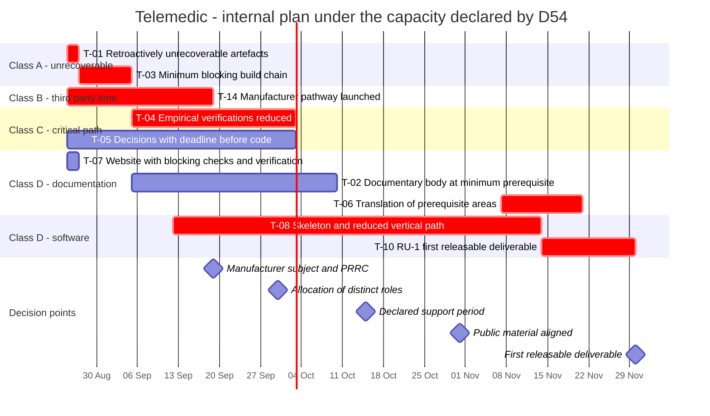

# Milestones

## 0. How to read this chapter

Every milestone has the same form, and the entries are not decorative.

> **`T-nn` - Title** · *class of activity* · *class of statement* · *date*
> **Objective** - what exists at the end that did not exist before.
> **Trigger** - the event on which the milestone begins. Not "when there is time".
> **Owner** - who has the authority to bring it to completion. Where it does not exist, it is written that it does not exist.
> **Completion criteria** - statements **binary**, ascertainable by anyone with the procedure
> described. No percentage, no adverb.
> **Dependencies** - what must be true first.
> **What it does not comprise** - the list is part of the milestone, not an appendix.
> **Risks** - referral to the register of [05](./05-rischi-e-dipendenze.md).

**The classes of activity** (`A` retroactively unrecoverable, `B` with traversal time determined by third parties, `C` on others' critical path, `D` compressible) are defined in
[01 §2](./01-principi-e-metodo.md). **The classes of statement** (`[COMMITMENT]`, `[INTENTION]`,
`[CONDITIONAL]`) are defined in [00 §2](./00-indice.md).

> **Warning on dates, and what they are.** The dates in this chapter **are not estimates**: they are
> **allocations of the remaining calendar** to a constrained sequence, under the capacity
> declared by `D54` - a single contributor working part-time - and quantified by `D62`
> in **ten to twenty hours per week**. The quantification makes the arithmetic verifiable, but does not
> transform the allocations into estimates: still missing the delivery history on which to calibrate and
> a unit that spans heterogeneous work. What protects the date of 30 November 2026 is not
> therefore a forecast of effort: it is **the sacrifice order for scope**,
> declared in advance in [03 §6](./03-primo-rilascio-utilizzabile.md) and executed top-down when
> an allocation proves insufficient ([01 §10](./01-principi-e-metodo.md), constraint [`V-282`](../11_registri/01-vincoli-in-vigore.md#v-282)).

> **Warning on attribution.** This is **internal project planning** (`D57`).
> No milestone is attributed to "third parties" or to "those who certify". Where a step formally
> presupposes the role of manufacturer, the role **must be established and formalised** (`D58`), and
> is itself a milestone with its own time. **No date in this chapter is a promise
> of outcome**: in particular, at no point is it written that the product will be marked by a date
> ([`V-171`](../11_registri/01-vincoli-in-vigore.md#v-171), [`V-280`](../11_registri/01-vincoli-in-vigore.md#v-280)). Today the product **does not bear the CE marking**, is not covered by any
> declaration of conformity, and whoever instals, integrates or places in service assumes the obligations
> that follow.

---

## 1. The starting point, measured

The picture as of 25 August 2026 is in [00 §4](./00-indice.md) and is not repeated. Four lines are needed here,
because they are the ones from which the sequence follows by necessity and not by choice.

1. **The documentary body is almost complete**: the nine areas are written, including overview,
   compliance and roadmap; of the foundations guide two modules out of twenty-one are missing, plus glossary and
   primary sources.
2. **The documentation website is built and published**, in Italian and in English, and automatic
   verification flows exist for terminologies under licence, editorial conformity,
   secret scanning and bill of materials of the website.
3. **The English version of the documents does not exist**: the wrapper of the website is translated, not the
   content. `D50` wants it integral; `D56` establishes that it is produced **area by area, in
   parallel to development**, not before it.
4. **Not a line of application code exists**, nor a build chain for it.

**Ninety-seven days remain** and capacity is that declared by `D54`. §2 explains what
this means, and §4 says at what price the milestone of 30 November stays on its feet.

---

## 2. The client's decision, and what follows from it

### 2.1 The three decisions that determine this chapter

| # | Decision | Effect on this chapter |
|---|---|---|
| **`D53`** | The **30 November 2026 remains the first releasable deliverable**. The decision is taken after the orchestration had exposed the tension and recommended the alternative. Closes [`Q-180`](../11_registri/02-questioni-aperte.md#q-180) | The date is **fixed** and is not negotiated in this document |
| **`D54`** | Declared capacity: **single contributor, working part-time**. Closes [`Q-181`](../11_registri/02-questioni-aperte.md#q-181) | Capacity is **fixed** and is not increased in this document |
| **`D56`** | Translation **assisted, area by area**, with divergence check. **Amends `D52`**: full translation is no longer a prerequisite of every line of code | The sequence "all documentation, then website, then code" **lapses**. Remain non-negotiable prerequisites the public warnings, the foundations guide and the compliance and security areas |

### 2.2 The only free variable is scope

A plan binds three quantities: date, capacity, scope. `D53` fixes the first, `D54` the second.
**The third is determined as a consequence, and there is no third way.**

> A scope not reduced under these two decisions does not produce more work: it produces **a publicly
> missed date**. It is the only outcome worse than reduced scope, because the missed date
> costs the credibility of all subsequent dates, whereas reduced scope costs exactly what was removed -
> and what was removed is written.

It follows the structure of this area after `D53`: chapter
[03](./03-primo-rilascio-utilizzabile.md) contains, in §5, the list of **what was cut
> to respect the date**, with for each entry whether the cut is recoverable and what it means
> for whoever instals; and in §6 **the order in which we would cut again**, if still needed.
> The two sections are the part of this roadmap with most value for whoever must decide whether to adopt the product,
> and are the direct consequence of `D53`.

### 2.3 What `D54` removes that hours do not restore

It must be said here because it determines the form of the milestones that follow, not just their duration.
Some records required by the quality management system **presuppose distinct subjects**: internal audit,
release review, configuration verification performed by someone other than the code author, external independent review of critical security code (`D18`).

**They are not producible internally, and not for lack of hours** ([01 §9-bis](./01-principi-e-metodo.md)).
It follows constraint [`V-281`](../11_registri/01-vincoli-in-vigore.md#v-281): **they do not enter the plan as activities**, because planning
an activity that cannot be produced is the most effective way to make it disappear from view. They enter as
**declared gaps with the date on which they are born**, are listed amongst the irreversible cuts of
[03 §5](./03-primo-rilascio-utilizzabile.md), and their allocation - which subset is accepted as a gap and which is covered
by acquiring the function externally - is a client decision and remains open as [`Q-189`](../11_registri/02-questioni-aperte.md#q-189).

### 2.4 What `D58` adds, and why it goes at the front not at the back

`D58` attributes the role of manufacturer to the project, still to be established, and with it the
activities that `D45` attributed to an external subject: establishment of the subject, appointment of the person
responsible for compliance, requests for information to notified bodies, launch of the clinical evaluation plan.

They are **class `B`**: **few hours and many months**. It is the only block of work that `D54` does not penalise, and it is
the one whose deferral transfers entirely to the end of the chain. It therefore sits in the first part of the calendar,
as milestone `T-14`, and not after the first release.

---

## 3. The milestones until 30 November 2026

### `T-01` - Retroactively unrecoverable artefacts in operation
*Class `A`* · `[COMMITMENT]` · **CLOSED on 27 August 2026**, planned for 12 September
**Trigger.** Immediate: no dependencies, and the cost of omitting it grows every day.
**Owner.** Single contributor, for production. Client for approval of the procedure.

**Objective.** Make effective, not merely declared, the activities that `D45` qualifies as non-recoverable after the fact.
At the end, their absence is no longer a gap that grows every day. **It is the first milestone and does not move**: under
`D54` small capacity does not defer class A activities, it makes them more urgent, because the cost of omitting them is not
paid in delay but in impossibility.

**Completion criteria.**

1. A **document control procedure** exists and is approved, with: list of controlled documents, rule of
   identification and versioning, nominated reviewers by category, form of approval, rule of withdrawal. The procedure is
   versioned in the repository and is itself under control.
2. The procedure declares **how the correspondence between review, reviewer and approval
   constitutes the approval record** in the "documents as code" model, and lists the four tools in view of their
   validation. **Declares moreover, explicitly and not in a note, that under `D54` author and approver coincide**, and
   that this is a **declared gap** not a conformity: it is the first entry of [`Q-189`](../11_registri/02-questioni-aperte.md#q-189).
3. The **register of requirement identifiers** (`RF-*`, `RNF-*`, `BR-*`, `ATT-*`,
   `UC-*`, `OUT-*`, `EX-*`, `DM-*`) exists, in **addition only**, with the state of each identifier
   (in force / retired) and explicit prohibition of reuse of a retired identifier.
4. The register is **machine-readable** and has a declared format, because automatic verification
   of criterion 5 relies on it.
5. The **build check** exists that makes the build fail when a test cites an identifier absent from the register. The check
   is tested with a deliberately erroneous case that must make it fail.
6. The public repository contains, and has contained without interruption, the declaration of non-medical device
   and distribution policy. **Already satisfied** as of 25 August 2026.
7. A **publication check** exists that prevents publication of an artefact lacking the non-marking declaration. Tested with an
   artefact deliberately lacking it, which must not be publishable.
8. **Public warnings are realigned to `D58`**: declare that the role of manufacturer will be assumed by the project and that
   the subject **is still to be established**, **without attenuating any existing warning** - it remains written with the same
   prominence as before that today the product does not bear the CE marking, is not covered by any declaration of conformity
   and that whoever instals or places in service assumes the obligations that follow. The text **contains no
   marking date** ([`V-171`](../11_registri/01-vincoli-in-vigore.md#v-171), [`V-280`](../11_registri/01-vincoli-in-vigore.md#v-280)). Applies to the non-medical device declaration, to the distribution policy and to the
   prominence recall of the repository presentation document, **in both languages**.

**Dependencies.** None internal. Criteria 5 and 7 are pipeline checks and precede the existence of the complete pipeline of
`T-03`: they are the first two checks it will receive.

**What it does not comprise.** Does not comprise formal validation of the tools of the quality management system.
**Does not comprise reissue of documents already produced outside control**: under `D54` it is not executable by 30 November 2026 and is
**declared as a gap** ([01 §8.3](./01-principi-e-metodo.md)), with the note that the volume to be reissued grows every day.

**Risks.** `R-02` (records in distinct roles), `R-04` (questions that converge on the compliance area), `R-17` (decisions not
taken), `R-28` (close date with low declared capacity).

---

### `T-14` - Manufacturer pathway launched
*Class `B`* · `[COMMITMENT]` · **19 September 2026**
**Trigger.** Immediate, on entry into force of `D58`. Every week of delay transfers entirely to the end of the chain.
**Owner.** Client. The single contributor executes the material activities; establishment of the subject and appointment are not theirs.

**Objective.** Launch the four class B activities that `D58` attributes to the project. The milestone is on the **launch**, not
completion, and the distinction is deliberate: the launch depends on us and is dateable; completion depends on administrative proceedings and queues of others
and **is not estimable by the project**.

**Completion criteria.**

1. **The legal form** of the subject that will assume the role of manufacturer is chosen and recorded,
   and the establishment process is launched, with launch date recorded.
2. **The profile** of the person responsible for compliance is defined - qualification and experience requirements,
   full-time availability regime, admissibility of an external figure in the micro and small business regime - and search
   is launched, with the date of the first request recorded.
3. **A request for information** is sent to each notified body designated for the pertinent device category according to the
   list published in the European database, with the date of sending recorded for each and the request text versioned in
   the repository. The request asks for **calculation and not price**, and asks for commitments on the timing of individual phases.
4. The **draft clinical evaluation plan** exists, with declared the need for documented clinical competence that the project
   **does not have internally** and the form by which it intends to acquire it.
5. None of the documents produced by this milestone contains a date by which the product will be marked. **The verification is
   textual and is part of the milestone.**

**Dependencies.** None internal. Criterion 3 can precede criterion 1: a request for information is sent before the subject exists, and
**it should be**,  because the queue is the real constraint. The **contract**, on the other hand, requires the subject to be
established, and it is the reason why criterion 1 is not deferrable.

**What it does not comprise.** Does not comprise the signing of any contract, the submission of any dossier, execution of the clinical
evaluation nor the application of any marking. The dates of those activities are in §5 and are **internal planning, not promises**.

**Risks.** `R-06` (times of notified bodies), `R-22` (rare specialised figures), `R-30` (manufacturer role not yet established).

---

### `T-03` - Minimum blocking build chain, with generated bill of materials
*Class `A`* · `[COMMITMENT]` · **5 September 2026**, brought forward from 26 September on 27 August ([00 §recalibration](./00-indice.md))
**Trigger.** Closure of criteria 3 and 4 of `T-01`, which provide the register on which the first check relies.
**Owner.** Single contributor.

**Objective.** Exist as build chain **before** existing as software. It is the operational translation of constraint
[`V-182`](../11_registri/01-vincoli-in-vigore.md#v-182) and the prescription of `D45` that the bill of materials is generated by the first pipeline.

**The reduction from the previous version of this milestone, declared.** The previous version asked that **all**
mandatory checks block on day one. Under `D54` this milestone reduces to a **declared blocking subset**, and the remaining checks
exist **in report-only mode** with the date on which they become blocking. The criterion for membership in the subset is not convenience:
**every check that presides over an unrecoverable property or a public prohibition blocks from the start**, because the cost
of omitting it is not a delay.

**Completion criteria.**

1. A pipeline exists with the **four tiers** planned - rapid, complete, extended, release -
   and the criterion of placement of each check is declared.
2. **Block from the start**, and each is tested with a deliberately non-conforming case that must make the build fail: the check
   on component licences; the check on terminologies with binding licences, with approved list versioned; the check on
   completeness of the bill of materials; the check on internal links; the check on synthetic identifiers and
   absence of real data; the check on prohibited terms that implements the `R0` rule; and the two checks of `T-01`, on requirement
   identifiers and non-marking declaration. **A check that has not been seen failing is not a check.**
3. The **divergence check between the two languages** exists, and has a **differentiated and declared
   behaviour**, which is the operational translation of `D56`: **blocks** on prerequisite areas -
   public warnings, foundations guide, compliance, security - and **reports** on the rest of the corpus,
   with a report published at every build. The differentiation is versioned in a configuration file, not hardcoded.
4. Checks not comprised in criterion 2 exist **in report-only mode**, each with the
   **declared date** on which it becomes blocking. A check without that date is not permitted: it is the way a
   temporary reduction becomes permanent.
5. The **bill of materials** is generated at every build, for every artefact, not for the main service only.
6. The **third-party component register** is generated from the bill and enriched by a versioned annotations file;
   a component present in the bill and absent from annotations makes the build fail.
7. Artefacts are **signed with material that does not reside in the pipeline**, and carry
   provenance attestation.
8. The **procedure documented for verification by whoever installs** exists, with the commands, and is **executable
   by anyone**. That it be **executed by someone other than the one who wrote it** is not a criterion of this
   milestone, because under `D54` it is not producible: it is a declared gap, listed amongst the irreversible cuts of
   [03 §5](./03-primo-rilascio-utilizzabile.md).

**Dependencies.** `T-01`, criteria 3 and 4. The check on terminologies requires the approved list versioned, which is
produced by the domain and compliance areas.

**What it does not comprise.** Does not comprise application code: **no line of application code
precedes this milestone** ([`V-182`](../11_registri/01-vincoli-in-vigore.md#v-182)), with the sole exception of the throwaway code of the verifications of `T-04`, declared
as such, resident in a separate area and not included in any distributed artefact. **Does not comprise verification of
reproducibility of the build**, which has been moved to `T-10` with reduced and declared scope ([03 §5](./03-primo-rilascio-utilizzabile.md)).

**Risks.** `R-08` (regime of licence of a component), `R-12` (recurring capacity for surveillance),
`R-27` (reproducible build not obtained), `R-28`.

---

### `T-07` - Website with blocking controls and registered verification
*Class `D`* · `[COMMITMENT]` · **CLOSED on 27 August 2026**, brought forward from 26 September on 27 August and closed the same day ([00 §recalibration](./00-indice.md))
**Trigger.** Immediate: the website is already built and published, and what remains is verification.
**Owner.** Single contributor.

**Objective.** The website exists, is published in Italian and English and is reachable. This
milestone does **not** build it: it ascertains that it really works and that the checks that preside over its
properties are blocking.

**Completion criteria.**

1. **Navigation works**: every menu entry leads to an existing page, and the check on internal links is
   **blocking** in pipeline (criterion 2 of `T-03`).
2. **Search works** and returns results in the active language.
3. **Language switching works** from every page and lands on the corresponding page, not
   on the root. Where the English page does not yet exist, it lands on a notice stating that translation is in progress and
   refers to the Italian page - **never on an error and never silently on the root**.
4. The link to the "this repository is not a medical device" declaration is
   **reachable from the website**, with absolute address to the repository. Closes [`Q-26`](../11_registri/02-questioni-aperte.md#q-26).
5. Every published page bears the non-marking warning, **in both languages**, in the text realigned to `D58`
   produced by `T-01` criterion 8.
6. The verification of criteria 1, 2 and 3 is **described as an executable and repeatable procedure**, with
   the outcome of the latest execution recorded and dated. **That it be executed by a person who did not build the website
   is not a criterion**, because under `D54` it is not producible: it is a declared gap.

**Dependencies.** `T-01` criterion 8 for the text of the warning; `T-03` criterion 2 for
the blocking of the link check.

**What it does not comprise.** Does not comprise completeness of the English version, which is `T-06`, nor
publication of release artefacts, which is `T-10`.

**Risks.** `R-16` (divergence between the two languages), `R-19` (public material not aligned).

---

### `T-04` - Empirical verifications on the critical path of reduced scope
*Class `C`* · `[COMMITMENT]` · **3 October 2026**
**Trigger.** Existence of the pipeline of `T-03`, through which the verifications run.
**Owner.** Single contributor.

**Objective.** Remove, with brief throwaway verifications, the uncertainties on which costly decisions or
public statements depend **in the actually released scope**. `D18` places the first in the first week of
development, before every other activity: the roadmap adopts it to the letter, with the sole specification that the verification runs
**through** the pipeline of `T-03`.

**The reduction, declared.** Three of the seven previous verifications concern functions cut from `RU-1` and
**are deferred with them**: the recording container, the single-node configuration of the broker, the forwarding of authentication context
through intermediation. The criterion is stated in [01 §5.3](./01-principi-e-metodo.md): a verification on a cut
function is itself a cut function. **The rule that each presided over stays however in force**, and is repeated next to the deferral,
because the risk is not forgetting the verification: it is forgetting the prohibition with it.

**Completion criteria.** Each verification produces a recorded outcome - success, failure, or success with conditions - and
the consequence on design is written.

1. **Token exchange in the gateway with explicit delegation** (`D18`, [`V-132`](../11_registri/01-vincoli-in-vigore.md#v-132)): it is demonstrated that the gateway
   fully validates the integrator's token and issues an internal token with the actor claim, and that
   **no supported configuration** produces a token lacking that claim.
   Negative test included.
2. **Single-use entry token, very short expiration, issued on back channel** and never transiting the address.
   Demonstrated working. **In the reduced scope it is not a fallback,
   it is the mode of session start by the integrator**, because the embedded component is cut: the verification thus rises in rank from the previous
   version of this milestone.
3. **Known defects of the identity federation product** (`D37`): the three defects - attribute alteration by the federated user,
   email change without verification, setting a local credential - are closed in configuration **and** monitored by a test that fails
   if configuration regresses.
4. **Network isolation in egress of the relay node**: the test that attempts routing to the callback ring,
   to private addresses and to infrastructure metadata services **fails the build if any request succeeds**.
5. For each of the three deferred verifications, the deferral is **recorded with the rule that stays in force**: no public
   documentation describes the forwarding of authentication context through intermediation until outcome is recorded; no material
   declares a unique container format; no functional requirement depends on unverified guarantees of the broker.

**Dependencies.** `T-03`.

**What it does not comprise.** Does not comprise the final realisation of the verified components.
A successful verification authorises design; it is not design. **Does not comprise the external independent review** of critical
security code that `D18` prescribes: not producible under `D54` and is amongst the irreversible cuts of [03 §5](./03-primo-rilascio-utilizzabile.md).

**Risks.** `R-13` (defects of the identity federation product), `R-15` (mechanism documented before being verified), `R-02`.

---

### `T-05` - Decisions with deadline before first code, closed
*Class `C`* · `[INTENTION]` · **3 October 2026**
**Trigger.** Immediate: they are decisions that are posed, not activities that are executed.
**Owner.** Client for the decisions; single contributor for the **posing** of the question
and recording of the outcome. The date is when the project **poses** them, not when they are taken: it is the reason for the class of statement.

**Objective.** No declared deferred decision is taken arbitrarily in a pull request.

**The reduction, declared.** Of the ten items in the previous version, **four have been decided** by the third round
(`D53`, `D54`, `D55`, `D56`) and **three concern functions cut from `RU-1`** and are deferred with them. Remain the items that affect the
actually released scope, plus two new ones that `D58` introduces.

**Completion criteria.** Each item has a recorded outcome - decided, with the corresponding architectural decision record, or
**explicitly confirmed as open with its consequence declared**.

1. `C-4` / [`Q-186`](../11_registri/02-questioni-aperte.md#q-186) - **declared support period**. Without the duration, the dismissal plan is not publishable and the number of major versions
   to maintain is not determinable. **It is a prerequisite of first distribution**, therefore of `T-10`, and is not deferrable beyond.
2. [`Q-110`](../11_registri/02-questioni-aperte.md#q-110) - signal topology on multiple instances. It is a structural decision with effects on distribution and update without interruption.
3. [`Q-111`](../11_registri/02-questioni-aperte.md#q-111) - declared limit of participants in the average session. In the reduced scope the
   limit is **two**, and must be declared as a limit of the release and not as a property of the product.
4. [`Q-145`](../11_registri/02-questioni-aperte.md#q-145) - confirmation of the six deliberate renunciations of available technical capacities. With `D55` freezing intended use,
   confirmation of these renunciations is what makes it defensible: they are the functions that would move the system towards clinical real-time.
5. [`Q-280`](../11_registri/02-questioni-aperte.md#q-280) - **legal form of the manufacturer subject and profile of the person
   responsible for compliance** (`D58`). It is the item in this list with the longest traversal time and lowest cost in hours.
6. [`Q-189`](../11_registri/02-questioni-aperte.md#q-189) - **allocation of records to distinct roles**: which subset is accepted as a declared gap and which is covered by
   acquiring the function externally. Without this decision, `T-10` is published with the declared gap, which is the default outcome and must
   be said in advance.
7. [`Q-185`](../11_registri/02-questioni-aperte.md#q-185) - correction of the public page according to `D19` and `D29`. **Every day of exposure is unrecoverable**, and its consequence
   is not cancelled by deciding after.

**Deferred items with the functions they govern, and the rule that stays in force.** `B-3` (licence regime of scales and questionnaires)
follows the calculation of scores, absent from scope; the cautionary measure stays: **the domain does not represent scores**. `C-1` (autonomous context of
reporting) follows reporting; remains in force the prohibition that the payer's profile is administrative by construction, **as a convention verified by
test and not as a structural boundary**, and the difference is declared. `C-2` (topology beyond two participants) and `C-3` (recording container)
follow the corresponding functions.

**Risks.** `R-17`, `R-18`, `R-30`.

---

### `T-02` - Documentary body at minimum prerequisite
*Class `D`, with an `A` component* · `[COMMITMENT]` · **10 October 2026**
**Trigger.** Closure of `T-01`, which provides the document control under which the remainder is born.
**Owner.** Single contributor.

**Objective.** Close what is **prerequisite** and nothing else. The previous version of this milestone asked for complete closure
of the corpus before every line of code: `D56` amends `D52` and makes that sequence no longer binding, and `D53` makes it no longer executable.

**Completion criteria.**

1. The foundations guide contains the **glossary module**, bilingual, with cross-references.
   It is prerequisite and not a backlog item for a precise reason: it is **the tool that keeps terminology
   locked in translation**, and translating twenty modules without it means producing twenty terminologically independent translations.
2. **Zero broken internal links** in the entire corpus, verified by the blocking check of `T-03` and not by sight.
3. **Zero `[NV]` with no declared recipient.** Occurrences with recipient are permitted and are listed
   in a published report.
4. The **inter-agent noticeboard** contains no open items with no recipient, and every open item addressed to a closed area
   has at least a note declaring why it remains open.
5. The **exact word count** for area and module has been executed and recorded. Closes the `[NV]` on corpus volume
   and determines the plan of `T-06`.
6. The **list of prohibited terms** is defined and versioned, which feeds the check of the `R0` rule, and the check
   runs on the entire corpus without findings.
7. Textual references to the compliance area, written as text when that area did not exist, are
   **transformed into links**.

**What it does not comprise, and this is the reduction.** Does not comprise the **primary sources module**
of the guide, which is an annotated bibliography: **reversible cut**, deferred, with the consequence
declared that until then every regulatory reference is cited in full in the text where it appears. Does not comprise
**reissue under control of documents produced before `T-01`**, which is declared as a gap. Does not comprise the English version, which is `T-06`.

**Risks.** `R-03` (corpus volume), `R-04`, `R-24` (priorities that move), `R-28`.

---

### `T-08` - Executable skeleton and reduced vertical path, tested
*Class `D`* · `[COMMITMENT]` · **14 November 2026**
**Trigger.** Closure of `T-01`, `T-03`, `T-04` and recorded position of the decisions of `T-05`.
**Owner.** Single contributor.

**Objective.** Exist as software: the structure of the modules with dependency rules verified, the
authorisation boundary, the tenant context applied by the engine, the outbox, and
**a single complete clinical pathway from beginning to end**, tested and traced. The pathway is the one of [03 §2](./03-primo-rilascio-utilizzabile.md),
in the reduced form that §4 of that chapter declares.

**Completion criteria.**

1. The structure of the modules exists and the **dependency rules are verified automatically**:
   no context depends on another context; the domain does not depend on the infrastructure.
   Tested with a deliberate violation that must fail the build.
2. The **tenant context is set inside the transaction**, with default denial in its absence,
   and the property is tested by a test that **deliberately exhausts the connection pool**
   and verifies isolation.
3. **Tests of isolation between tenants** exist and actively attempt unauthorised access, for
   every context and every exposed interface.
4. The **immutable register** writes with hash chain and archiving at severed privileges,
   and chain integrity verification is available on request and scheduled. **Coverage is integral**: every access to
   patient data in the pathway is recorded, and on this no reduction is permitted ([01 §7.3](./01-principi-e-metodo.md)).
   The **periodic signed anchoring** is instead outside the scope, with the consequence declared in
   [03 §5](./03-primo-rilascio-utilizzabile.md), where it is marked **irreversible for the period**.
5. The **transactional outbox** is the only source of outgoing events, and a test verifies that
   no envelope contains clinical content.
6. A **complete vertical pathway for remote consultation (televisita) (scheduled video visit) with two participants** exists,
   tested end-to-end, with **generated traceability matrix** that links it to the
   requirements it realises. The domain model contains three services - remote consultation, specialist-to-specialist consultation (teleconsulto), remote monitoring (telemonitoraggio)
   - and the scope of `RU-1` covers sole remote consultation: the vertical pathway
   demonstrates this sole service, and the others remain designed in domain and requirements
   without exercise in code (`S-8`).
7. The vertical pathway satisfies automatically-automatable accessibility criteria and has passed at least one
   **manual verification with real assistive technology**, with recorded outcome. **It is not a formative usability
   evaluation** and must not be presented as such: the formative evaluation is
   amongst the irreversible cuts of [03 §5](./03-primo-rilascio-utilizzabile.md).
8. Media tests run on simulated network with **two profiles** - nominal and worst-case degraded - and assertions
   are on observable facts: cipher suite present and not degenerate, notice issued when and only when threshold is exceeded,
   corresponding row in tracing. The intermediate profiles are a declared reversible cut.

**Dependencies.** `T-01`, `T-03`, `T-04`. None of them is compressible.

**What it does not comprise.** It is not the first releasable deliverable: it has no installation manual,
it has no verified distribution packages, it has no dossier that accompanies the release. The first releasable deliverable is `T-10`.

**Risks.** `R-20` (immutable register, the single most labour-intensive element of the catalogue),
`R-28`, `R-02`.

---

### `T-06` - Translation of prerequisite areas, with divergence check in operation
*Class `D`, volume-dependent* · `[COMMITMENT]` · **21 November 2026**
**Trigger.** Closure of criterion 5 of `T-02`, the exact word count, which is the work multiplier.
**Owner.** Single contributor, with the assisted mode of `D56`.

**Objective.** Satisfy `D50` **in the part that `D56` declares non-deferrable**, and put in operation the mechanism
that prevents the deferred part from degrading in the meantime.

**The reduction, declared.** `D56` amends `D52`: full translation **is no longer a prerequisite
of every line of code** and proceeds in parallel to development. This milestone therefore covers
the sole subset that `D56` qualifies as non-negotiable, because the cost of its omission is unrecoverable.
The rest is **planned, not blocking**, and is `T-09` in §5.

**Completion criteria.**

1. **Public warnings** exist in English, integral and in mirror position: non-medical device, distribution policy,
   prominence recall of the presentation document, page warning; **the foundations guide** in its entirety; **the compliance
   area**; **the security area**.
2. The divergence check **blocks** on those areas and **produces no findings** on them.
3. The check **reports** on the rest of the corpus, and the report of the report is published at
   every build: the untranslated part is **visible and measured**, not implicit.
4. **Italian regulatory references remain cited in original form**, with explanation in English. Translation
   is not a free adaptation, and is verifiable by sample.
5. **The internationalisation strings of the project stay separate** from the official labels
   of coding systems, in both languages.
6. The **alignment procedure** is declared and versioned: what makes a pull request complete,
   what is done when translation lags, and how a prerequisite area is distinguished from a report area.

**Dependencies.** `T-02` criterion 1, for the glossary, and criterion 5, for the count. `T-03`
criterion 3, for the differentiated behaviour of the check.

**Risks.** `R-03`, `R-16` - divergence between the two languages on regulatory content remains the highest-impact
risk of the entire register, and the scope reduction of this milestone **does not attenuate it**: it circumscribes it to the areas
in which the check blocks.

---

### `T-10` - `RU-1`, first releasable deliverable
*Class `D`* · `[COMMITMENT]` · **30 November 2026**
**Trigger.** Closure of `T-08` and `T-06`.
**Owner.** Single contributor for production. **The release review has no internal owner**:
it is the gap of [`Q-189`](../11_registri/02-questioni-aperte.md#q-189), declared and not planned.

**Objective.** The first artefact that a structure can install, configure and use in trial exercise, training and integration - **not on real patients**. The exact scope, what was cut to respect
the date and the blocking criteria are chapter [03](./03-primo-rilascio-utilizzabile.md).

**Completion criteria.** They are the blocking release criteria listed in
[03 §8](./03-primo-rilascio-utilizzabile.md), in block: **none is waivable and none enters
the sacrifice order of scope.** To them are added the three criteria proper to the milestone:

1. The **installation and operation manual** exists, in Italian, with the installation presuppositions at the head;
   **the warnings and limits of use are in both languages**.
2. The **dossier that accompanies the release** exists: release notes with safety-impact modifications at the head,
   signed bill of materials, provenance attestations, traceability report, list of declared limits, **list of declared gaps with
   the date on which each is born**.
3. The dossier declares, in an unyielding way and in both languages, that **no verification
   has been executed by a second subject** - release review, internal audit, independent configuration verification, external review of critical security code - and that this
   is a gap of the release and not a conformity.

**Why it is `[COMMITMENT]` and not `[CONDITIONAL]`.** Because `D53` fixes the date and `D54` fixes capacity,
and scope has been reduced as a consequence: the milestone is therefore a commitment **on the
declared scope**, not on the scope the project would have liked to deliver. Presenting it as a commitment
without chapter [03 §5](./03-primo-rilascio-utilizzabile.md) at the side would be a violation of [`V-184`](../11_registri/01-vincoli-in-vigore.md#v-184).

**Risks.** `R-28` (dominant risk), `R-02`, `R-20`, `R-24`.

---

## 4. 30 November 2026: what is inside, and at what price

### 4.1 The arithmetic, redone on the decision taken

`D53` fixes 30 November 2026 as **first releasable deliverable**. `D54` declares capacity.
`D56` removes from the sequence the constraint that placed full translation before every line of code. Ninety-seven days
remain and a single contributor working part-time.

The calendar that results is that of §3, and has a property that must be declared because it determines how everything else is read: **it has no margin**. Nine milestones occupy the entire remaining period, and none of them has its own time reserve.

> A plan with no margin is not an optimistic plan: it is a plan whose margin sits **elsewhere**.
> Here it sits in **scope**, and is declared in advance - what has already been removed
> ([03 §5](./03-primo-rilascio-utilizzabile.md)) and in what order more is removed
> ([03 §6](./03-primo-rilascio-utilizzabile.md)).

### 4.2 What the decision has cost, one line per family

The complete list, item by item, with the reversibility of each cut and the consequence for whoever instals,
is in [03 §5](./03-primo-rilascio-utilizzabile.md). Here is the summary needed to
read the calendar of §3.

| Family | What has gone | Reversible |
|---|---|---|
| **Scope of functional release** | Clinical documentation and signature, interoperability façade, embedded component, event broker, active terminological gateway, emergency access, orchestrator profile, dashboards, administration interface | **Yes**, all |
| **Depth of verification** | Intermediate network profiles, automatic measurement of latency from objective to screen, scope of reproducibility verification | **Yes** |
| **Documentary body** | Primary sources module, reissue of documents produced outside control | **Yes**, with growing cost for the second |
| **Translation** | Everything that is not prerequisite area | **Yes**, by construction: it is the model of `D56` |
| **Records in distinct roles** | Release review, internal audit, independent configuration verification, external review of critical security code | **No** |
| **Usability engineering** | Formative evaluation with representative users during development | **No** |
| **Immutable register** | Periodic signed anchoring of the chain | **No for the period**, yes for the future |

The last three rows are the part that matters, and chapter
[03 §5](./03-primo-rilascio-utilizzabile.md) treats each one. A reversible cut is a choice of sequence; **an irreversible cut is a property that the release will never have**, and whoever instals must know it before installing, not after.

### 4.3 What does not change, in no circumstance

- **Today the product does not bear the CE marking**, is not covered by any declaration of conformity,
  and **no distributed artefact is usable for the provision of healthcare services to real patients** (`D16`). That the project intends to assume the role of manufacturer (`D58`) **transfers nothing** to whoever instals a non-certified version today, and letting it be understood would be more harmful than silence.
- **Milestones `T-01`, `T-03`, `T-04` and `T-14` are done anyway.** They are the part of the plan that is not negotiated: the first three
  because the cost of omitting them is not a delay, the fourth because its traversal time does not depend on us.
- **The blocking release criteria of [03 §8](./03-primo-rilascio-utilizzabile.md) do not enter
  the sacrifice order**, and with them the list of §7.3 of
  [01](./01-principi-e-metodo.md), where debt is not permitted in any form.
- The scope exclusions of
  [`docs/03_functional/07-fuori-perimetro.md`](../03_functional/07-fuori-perimetro.md) stay in
  force, and the scope reduction does not touch any of them.

---

## 5. Beyond 30 November 2026 - internal planning

The dates of this section are **internal project planning** (`D57`). They are not attributed to third parties and are not promises of outcome. **At no point is it written that the product will be marked by a date** ([`V-171`](../11_registri/01-vincoli-in-vigore.md#v-171), [`V-280`](../11_registri/01-vincoli-in-vigore.md#v-280)).

### `T-09` - Full translation of remaining corpus
*Class `D`* · `[INTENTION]` · **2027, in parallel to development**
**Trigger.** Closure of `T-06`. **Owner.** Single contributor, with the assisted mode of
`D56`.

**Objective.** Extend to the entirety of the corpus what `T-06` did on sole prerequisite areas,
bringing the divergence check from "reports" to "blocks" area by area.

**Completion criterion.** For every area, the transition from report to blocking is
**recorded with the date**, and from that moment is irreversible: an area that diverges again fails the build. The milestone
is closed when no area is more in report-only mode.

### `T-11` - Summative validation of usability
*Class `B`* · `[INTENTION]` · **subsequent to interface freeze**
**Trigger.** Interface freeze. **Owner.** Client for acquisition of external competence; project for protocol.

**Objective.** Usability engineering according to the applicable standard, made mandatory by
`D12` and `D25`: specification of use, hazard-related use scenarios, formative evaluations during development, **summative validation
with representative users**, consolidated dossier.

**The dependency that `D54` makes hard.** The **formative** evaluation is not recoverable: it is executed
during the development it evaluates, and is amongst the irreversible cuts of
[03 §5](./03-primo-rilascio-utilizzabile.md). This milestone therefore covers the summative and
**declares the formative gap**, which is what the dossier will contain.

**Why it stays class `B`.** Because recruitment of representative users - including elderly patients and people with disabilities,
reference population and not edge case - has its own calendar time, with consents to collect and protocol to approve
before execution. It does not depend on project speed.

### `T-12` - Regulatory package deliverable
*Class `D` with `A` components already closed* · `[INTENTION]` · **2027**
**Trigger.** Closure of [`Q-183`](../11_registri/02-questioni-aperte.md#q-183) to the compliance area. **Owner.** Project.

**Objective.** Make available the material that, with `D58`, the project produces **for itself** in
the role of manufacturer still to be established, and that remains anyway useful to whoever integrates: technical dossier,
software lifecycle documentation, risk management, usability engineering dossier, traceability matrix, signed bill of materials, technical
statement of exception on endpoint protection, completed allocation of responsibility.

**What is new from the previous version of this milestone.** The list of **dated gaps**: records not
producible under `D54`, each with the period it refers to and the reason. It is the part that whoever verifies expects
to find, and its absence would be worse than the gap itself ([01 §8.2](./01-principi-e-metodo.md)).

### `T-13` - The certification pathway, as internal planning
*Class `B`* · `[INTENTION]` · **internal planning dates, never promises of outcome**
**Trigger.** Establishment of the manufacturer subject (`T-14` criterion 1, and [`Q-280`](../11_registri/02-questioni-aperte.md#q-280)).
**Owner.** Project, in the role of manufacturer **still to be established**.

With `D57` and `D58` this milestone no longer reports "milestones of third parties": it reports **our
planning**. Attribution changes, not the factual state of the product.

| Step | Internal planning temporal reference | On what it rests |
|---|---|---|
| Establishment of the manufacturer subject and appointment of the person responsible for compliance | **Not estimable by the project**: depends on administrative proceedings and on availability of a figure with documented qualification. `[NV]` | `D58`, [`Q-280`](../11_registri/02-questioni-aperte.md#q-280) |
| Signing of contract with a notified body | December 2026 in the reference scenario | `D44`, scenario B of the research on the certification pathway |
| Certificate of quality management system | July 2027 in the reference scenario | *ibidem* |
| Complete technical dossier and submitted | June 2027 in the reference scenario | *ibidem* |
| Certificates and conclusion of conformity assessment procedure | **June-August 2028** in the reference scenario | `D44`: 51% of bodies take 13–18 months from agreement to certificate, 31% take 19–24 months; the staffing of bodies is in contraction |

**Three warnings that accompany this table and are never separated from it.**

1. **They are planning dates, not outcome dates.** None of them authorises writing, in any material,
   that the product will be marked by a date ([`V-171`](../11_registri/01-vincoli-in-vigore.md#v-171), [`V-280`](../11_registri/01-vincoli-in-vigore.md#v-280)). The difference between the intention to certify and the promise
   of a dated outcome is not formal: the second produces a regulatory effect that the first does not.
2. **The first step does not yet exist.** Until the manufacturer subject is established, the
   subsequent steps have no subject that can take them, and **their date is not calculable**. It is risk `R-30`.
3. **The factual state is unchanged.** Today the product does not bear the CE marking and is not covered by
   any declaration of conformity. Whoever instals, integrates or places in service assumes the obligations that follow.

### The deadline that remains of another subject

A sole family of dates is not of the project, and does not become so with `D57`: **the deadline by which
a user must have adopted national security measures**. It is subject-specific - it runs from the insertion notification
received by the single subject (`D39`) - and the supplier does not know it. The product declares
**the evidence and the date of availability of each**, never the deadline ([`V-186`](../11_registri/01-vincoli-in-vigore.md#v-186)). The same applies to
**accreditation as a service provider** to the national identity federation, which is of whoever instals (`D36`, [`V-05`](../11_registri/01-vincoli-in-vigore.md#v-05), `OUT-22`) and whose times
**are not declared by any primary source**.

---

## 6. The irreversible decision points

An irreversible decision point is a date beyond which **the failure to decide is itself
a decision**, and produces a consequence that is not cancelled by deciding after.

| Date | Decision | Who | If not taken by that date |
|---|---|---|---|
| **19 September 2026** | Legal form of the manufacturer subject and profile of the person responsible for compliance ([`Q-280`](../11_registri/02-questioni-aperte.md#q-280), `D58`) | Client | The initial step of §5 slides, and **entirely** with it everything it rests on. It is class `B`: delay is not recovered by working more |
| **30 September 2026** | Allocation of records to distinct roles ([`Q-189`](../11_registri/02-questioni-aperte.md#q-189)) | Client | `T-10` is published with the **declared gap**, which is the default outcome. Records related to the period of `RU-1` are not producible after |
| **15 October 2026** | Declared support period (`C-4`, [`Q-186`](../11_registri/02-questioni-aperte.md#q-186)) | Client, `COMP` | The dismissal plan is not publishable and the number of major versions to maintain is not determinable. **It is a prerequisite of `T-10`** |
| **31 October 2026** | Correction of the public page according to `D19` and `D29` ([`Q-185`](../11_registri/02-questioni-aperte.md#q-185)) | Client, `PROD` | The risk of unsustainable statement continues and **is not recoverable after**: a period of publication is not cancelled |
| **31 October 2026** | Formulation of the difference between what public material declares and what `RU-1` delivers ([`Q-281`](../11_registri/02-questioni-aperte.md#q-281)) | `PROD`, client | `RU-1` is published while public material declares capacities the release does not have: it is the same aggravating factor of [`Q-185`](../11_registri/02-questioni-aperte.md#q-185), on one more artefact |
| **Before every further reduction** | Execution of the sacrifice order of [03 §6](./03-primo-rilascio-utilizzabile.md) | Single contributor, with recording in review | An unrecorded reduction is an undecided cut, and the choice of what to sacrifice **stops being readable** - which is precisely what `D53` requires to avoid |
| **Before public documentation of the mechanism** | Outcome of the verification on forwarding of level of assurance (`B-8`, [`Q-160`](../11_registri/02-questioni-aperte.md#q-160)) | `INTEG`, `TECH` | Correction of public documentation on a security mechanism |

**Four decision points have lapsed** because the decisions have been taken: declaration of
capacity (`D54`), reformulation of the milestone of 30 November (`D53`), mode of production of the English version (`D56`)
and freezing of intended use of remote monitoring (`D55`). They remain in the historical record and are not reopened.

---

## 7. Overview

**How to read the diagram.** The bars marked as critical are those whose slippage transfers entirely to the end of the chain. **There are nine out of ten**, and it is the graphic representation of the fact declared in §4.1: the plan has no margin, and the margin sits in scope.

**The overlap between `T-01` and `T-03` is deliberate, and must be read correctly.** The `T-03` bar
starts on **27 August** and not on 12 September, because the milestone's declared trigger is the
closure of **criteria 3 and 4** of `T-01`, not of `T-01` as a whole, and those two criteria have
been satisfied since 26 August 2026. The diagram said something different from the milestone text;
between the two the text prevails, because it is the one that states the trigger.

Under `D54` the overlap **does not mean two milestones executed together**: a single contributor
alternates between them. What it produces is the freedom to choose which one to advance when the
other is waiting on an input that does not depend on the project - and it is the only form of
margin this plan can create without touching scope.

**The diagram is recalibrated to 27 August 2026**, together with the table in §7.1 and the milestone
entries, and the three representations must be read as one: they are the same date written three
times, and where they diverge the milestone entry prevails, because it is the only one of the three
that carries its own justification. Consistency between the three is not left to the attention of
whoever edits them:
[`scripts/verifica-coerenza-delle-date.sh`](https://github.com/fedcal/Telemedic/blob/main/scripts/verifica-coerenza-delle-date.sh)
verifies it at every build, and the reason it exists is that on 27 August the recalibration had
touched the milestone entries and **not** these two copies, in either language.

**`T-02` brings forward its start to 5 September and not its end.** Its declared trigger is `T-01`,
closed since 27 August: the bar could no longer start on 26 September without contradicting its own
trigger. The end remains 10 October, for the same reason as `T-08` - bringing the start forward is
margin against risk, not work that gets shorter.

### 7.1 Summary table

| # | Milestone | Class | Statement | Date | Trigger | Owner |
|---|---|---|:-:|:-:|---|---|
| `T-01` | Retroactively unrecoverable artefacts in operation | `A` | `[COMMITMENT]` | **closed on 27 Aug 2026** | Immediate | Single contributor |
| `T-14` | Manufacturer pathway launched | `B` | `[COMMITMENT]` | 19 Sep 2026 | Immediate (`D58`) | Client |
| `T-03` | Minimum blocking build chain | `A` | `[COMMITMENT]` | 5 Sep 2026 | `T-01` criteria 3–4 | Single contributor |
| `T-07` | Website with blocking checks and verification recorded | `D` | `[COMMITMENT]` | **closed on 27 Aug 2026** | Immediate | Single contributor |
| `T-04` | Empirical verifications on critical path reduced | `C` | `[COMMITMENT]` | 3 Oct 2026 | `T-03` | Single contributor |
| `T-05` | Decisions with deadline before first code | `C` | `[INTENTION]` | 3 Oct 2026 | Immediate | Client |
| `T-02` | Documentary body at minimum prerequisite | `D` | `[COMMITMENT]` | 10 Oct 2026 | `T-01` | Single contributor |
| `T-08` | Skeleton and reduced vertical path | `D` | `[COMMITMENT]` | 14 Nov 2026 | `T-01`, `T-03`, `T-04` | Single contributor |
| `T-06` | Translation of prerequisite areas | `D` | `[COMMITMENT]` | 21 Nov 2026 | `T-02` criterion 5 | Single contributor |
| `T-10` | **`RU-1`, first releasable deliverable** | `D` | `[COMMITMENT]` | **30 Nov 2026** | `T-08`, `T-06` | Single contributor; **review with no internal owner** |
| `T-09` | Full translation of remaining corpus | `D` | `[INTENTION]` | 2027 | `T-06` | Single contributor |
| `T-11` | Summative validation of usability | `B` | `[INTENTION]` | After interface freeze | Freeze | Client, for engagement |
| `T-12` | Regulatory package deliverable | `D` | `[INTENTION]` | 2027 | [`Q-183`](../11_registri/02-questioni-aperte.md#q-183) | Project |
| `T-13` | Certification pathway, internal planning | `B` | `[INTENTION]` | See §5 | `T-14` criterion 1 | Project, in role to be established |

---

## 8. What is not dated, and why

The list is the most useful part of the chapter for whoever must trust this roadmap.

| Item | Why it is not dated | On what the date would depend |
|---|---|---|
| **Establishment of the manufacturer subject** (`T-14` criterion 1) | Depends on external administrative proceedings and on availability of a figure with documented qualification. `[NV]` | [`Q-280`](../11_registri/02-questioni-aperte.md#q-280); times are not declared by a source the project can cite |
| **Interoperability in egress towards the dossier** | The documentary models, codes of typology and metadata of indexation of telemedicine typologies **are not publicly available** ([`Q-07`](../11_registri/02-questioni-aperte.md#q-07)) | Availability of material |
| **Profiles of interoperability on documentation and hospital messaging** | Require a counterparty with a testing environment | Availability of an integrator or entity |
| **Conformity verified on national digital identity** | Requires pre-production environments and test credentials not under project control | Access to environments; the batch of multiple instances per identity provider is the systematically underestimated one (`D38`) |
| **Performance thresholds of the interface** | The reference device is not declared ([`Q-115`](../11_registri/02-questioni-aperte.md#q-115), [`Q-175`](../11_registri/02-questioni-aperte.md#q-175)), and without device the corresponding requirement is not verifiable | Product decision |
| **Expected service levels** | The threshold is chosen by the customer; the product provides the measurement | [`Q-152`](../11_registri/02-questioni-aperte.md#q-152), [`Q-184`](../11_registri/02-questioni-aperte.md#q-184) |
| **Deadline for adopting national security measures** | Subject-specific for each user ([`V-186`](../11_registri/01-vincoli-in-vigore.md#v-186)) | The insertion notification received by the individual subject |
| **Accreditation as service provider to the national identity federation** | It is of whoever instals, and times **are not declared by any primary source** | `D36`, [`V-05`](../11_registri/01-vincoli-in-vigore.md#v-05), `OUT-22` |

> **The rule that this list applies.** A date that depends entirely on a third party is not a
> date of the project: it is a hope with a format. With `D57` the roadmap **assumes the
> planning** even where it is executed by a subject still to be established; **does not assume** what the
> regulation places on another subject, and does not invent durations that no source declares.

---

**Continues in**: [03 - First usable release](./03-primo-rilascio-utilizzabile.md), where milestone
`T-10` receives its exact scope, the list of what was cut to respect the date and the order in which we would cut again; and in
[05 - Risks and dependencies](./05-rischi-e-dipendenze.md), where the risks cited in every milestone
are described with probability, impact, leading indicator and owner.
