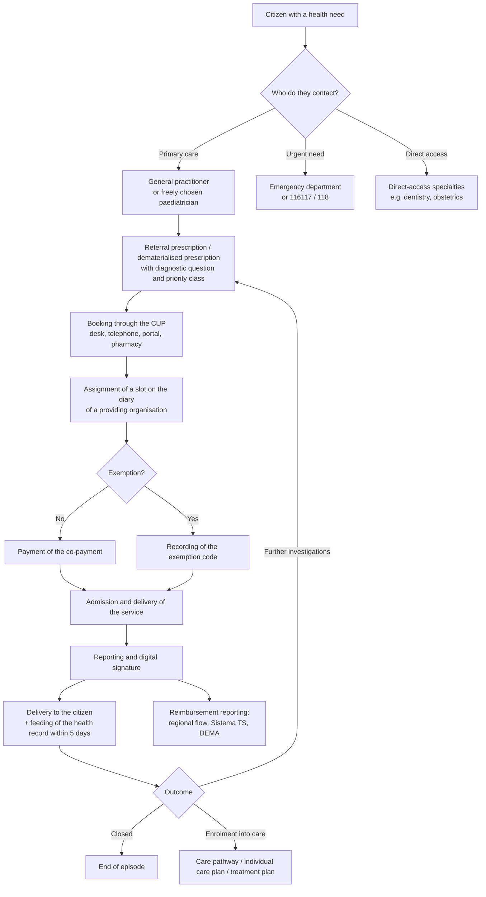

# The Italian healthcare system

This module exists for a precise reason. The Telemedic data model contains entities that,
to an outside eye, look redundant or arbitrary: why a professional is not a user but a
`PractitionerRole`; why the same person is an *assistito* (a person entitled to care) in
one place and a «patient» in another; why the delivery mode of a service is an attribute
with a coding configurable per Region rather than a constant; why there are three distinct
payment paths for one and the same clinical act.

None of these choices arises from architectural preference. They all arise from the concrete
shape of the Italian healthcare system. Anyone who writes code without knowing it produces
abstractions that look elegant and that break on first contact with a real installation.

The module starts from nothing. If you already know what an ASL is you may skip to § 4; if
you do not, skip nothing.

---

## 1. The National Health Service: what it is and where it comes from

### 1.1 The founding statute

The **Servizio sanitario nazionale (SSN, the National Health Service)** was established by
**legge 23 dicembre 1978, n. 833** (Law no. 833 of 23 December 1978). It is not an insurance
scheme, not a body, not an administration: the law defines it as «*the complex of the
functions, structures, services and activities intended for the promotion, maintenance and
recovery of the physical and mental health of the whole population*» (art. 1). It is
therefore a **system**, that is, a set of distinct actors held together by a shared purpose
and by shared funding rules.

Law 833 gives effect to **article 32 of the Constitution**, which qualifies health as a
«*fundamental right of the individual and interest of the community*» and guarantees «*free
care to the destitute*». It is the only right that the Italian Constitution calls
«fundamental» with that explicit adjective.

Before 1978 healthcare assistance in Italy was **mutualistic**: you were covered by virtue
of being enrolled in a mutual fund tied to your occupational category (workers in industry,
in commerce, in agriculture, public employees, and so on). Whoever did not work, or worked
in a sector without a fund, was not covered. The 1978 reform replaces the criterion of
**occupational category** with that of **residence**: you are entitled to care because you
are a person living in Italy, not because you belong to a group.

This historical shift is not erudition. It is the reason why, in the data model, a person's
health coverage is an attribute derived from the population registry and from residence, and
not an individual contract: in FHIR it is a publicly held `Coverage`, not a policy. And it is
the reason why the central entity of Italian public registries is called an **assistito** and
not a «customer».

### 1.2 The three principles and the three reforms

The 1978 design rests on three principles, repeatedly invoked by constitutional case law and
by planning documents:

- **universality** - the body of recipients is the entire resident population, without
  selection;
- **equality** - equal need corresponds to equal access, irrespective of income, social
  condition and place of residence;
- **equity** - the system is funded from general taxation in proportion to ability to pay,
  not to individual risk.

Three reforms have intervened on this design, changing its organisational structure without
touching its principles:

1. **decreto legislativo 30 dicembre 1992, n. 502** (Legislative Decree no. 502 of 30
   December 1992), and the subsequent **D.lgs. 7 dicembre 1993, n. 517**, introduce
   **corporatisation**: the old local health units, which were operating structures of the
   municipalities, become **corporate bodies** endowed with public legal personality and
   entrepreneurial autonomy, with a director general appointed by the Region. The system of
   **payment by service** is also born (tariffs for outpatient services, diagnosis-related
   groups for inpatient stays) in place of open-ended cost reimbursement.
2. **decreto legislativo 19 giugno 1999, n. 229** («reform three» or the «Bindi reform»)
   introduces **institutional accreditation** as a condition for delivering services at the
   SSN's expense, strengthens regional planning and defines the **essential levels of care**
   as an instrument of national guarantee.
3. **legge costituzionale 18 ottobre 2001, n. 3** (Constitutional Law no. 3 of 18 October
   2001) rewrites Title V of the Constitution and moves the «protection of health» among the
   matters of **concurrent legislation**. It is the reform with the deepest consequences for
   anyone who writes software, and we look at it straight away.

---

## 2. Three levels of government, and why twenty-one systems follow

### 2.1 The constitutional division

**Article 117 of the Constitution**, in the text in force after the 2001 reform, distributes
legislative power as follows:

- **subsection 2, letter m)** - it is the **exclusive competence of the State** to
  «*determine the essential levels of the services concerning civil and social rights that
  must be guaranteed across the whole national territory*». From this the **LEA** derive
  (§ 6);
- **subsection 3** - the «*protection of health*» is a matter of **concurrent legislation**:
  the State determines the **fundamental principles**, the Regions hold the legislative power
  over the detail.

The consequence is that the State says *what* must be guaranteed and under what principles,
while each Region decides *how* to organise itself to guarantee it. This is not an
administrative delegation: it is full legislative power within the principles. A Region may
establish types of body that do not exist elsewhere, may merge or split entities, may create
its own service catalogues, may set its own tariffs and co-payments within the national
limits, may adopt different prescribing and booking rules.

### 2.2 Twenty-one, not twenty

There are twenty Italian Regions. There are **twenty-one regional health systems**, because
the Region of **Trentino-Alto Adige/Südtirol** does not run healthcare directly: the powers
are divided between the two **Autonomous Provinces of Trento and Bolzano**, each with its own
healthcare regime. In regulatory language one almost always writes «*Regioni e Province
autonome*» (Regions and Autonomous Provinces), abbreviated to «Regioni e PP.AA.» or to
«RdA/RdE» when the reference is to the Region of entitlement or of delivery (§ 7.6 and module
[07 - The health record and national infrastructures](07-fse-e-infrastrutture-nazionali.md)).

Five Regions have **special statute** status (Sicily, Sardinia, Aosta Valley, Friuli-Venezia
Giulia, Trentino-Alto Adige) and fund healthcare wholly or partly from their own resources
rather than from the allocation of the National Health Fund, which adds a further
differentiation in spending rules.

### 2.3 The consequences for software: not a detail, but the dominant constraint

This is the point the project repeats in every document and that must be internalised once
and for all. Regional fragmentation is not a marginal complication to be handled with a few
`if` statements: **it is the structural characteristic of the market in which the software
operates**, and it shows up along at least these dimensions.

| Dimension | What varies | Effect on the data model |
|---|---|---|
| **Name and form of the bodies** | ASL, AUSL, ASP, ATS+ASST, AST, APSS, ASUR… | The providing organisation cannot have a closed enumerated type |
| **Service catalogue** | Every Region has a **single regional catalogue** that extends and renames the national fee schedule | A double coding is needed: national code + regional `codCatalogoPrescr` (DM 19 novembre 2025, Annex 1, § 2.19) |
| **Tariffs and co-payments** | National maximum tariff, additional regional shares, regional exemptions | Charge calculation is a per-tenant policy, not a global formula |
| **Prescribing rules** | When a referral prescription is required, which services are direct access | The prescription gate is configurable |
| **Reimbursement reporting flows** | Regional outpatient specialist record layouts with different names and fields | Export is a per-Region adapter |
| **Remote delivery mode** | The coding of the value «telemedicine» in the flows is not national and uniform | An attribute with a coding configurable per Region, **never a constant** - see § 7.7 |
| **Interpretation of national rules** | The Regions transpose the State-Regions Agreements with their own acts, which specify them and sometimes extend them | Domain rules have a national level and a regional *override* level |

A concrete example of the sixth row, documented in the project's research: the State-Regions
Agreement of 17 December 2020 states that the remote consultation (televisita) «is to be
understood as limited to follow-up activity for patients whose diagnosis has already been
formulated in the course of an in-person visit», whereas the regional guidance of
Emilia-Romagna (BUR no. 255 of 17 August 2021, Annex 2) expressly admits its use for a first
visit downstream of a specialist-to-specialist consultation (teleconsulto) between a general
practitioner and a specialist. **The two rules coexist and both are valid, each in its own
territory.** A system that codifies «the televisita is not admissible for a first visit» as a
domain invariant is wrong in Emilia-Romagna; a system that always admits it is wrong
elsewhere. The correct formulation is: the national rule as the default, the regional
derogation as tracked configuration.

### 2.4 The State-Regions Conference: where the conflict is settled

Since the competence is concurrent, there is a permanent body of coordination: the
**Conferenza permanente per i rapporti tra lo Stato, le Regioni e le Province autonome di
Trento e di Bolzano** (the Standing Conference for relations between the State, the Regions
and the Autonomous Provinces of Trento and Bolzano), governed by **D.lgs. 28 agosto 1997, n.
281**. It produces two kinds of act that it is indispensable to keep apart:

- **Intesa** - an act by which State and Regions converge on binding content; failure to
  reach it may block the adoption of the State act;
- **Accordo** - an act by which the respective competences are coordinated; **it is not a
  source of law in the proper sense**: it becomes binding at the moment the Regions transpose
  it with their own acts (regional executive resolutions, managerial decrees, circulars).

Every act has a **repertory number** in the form `n/CSR` and a session date. The most
important act for this project is the **Accordo 17 dicembre 2020, rep. atti n. 215/CSR** (the
State-Regions Agreement of 17 December 2020, act no. 215/CSR), «National guidance for the
delivery of telemedicine services», which contains the canonical definitions of all the
services and is the source for module [02](02-prestazioni-di-telemedicina.md).

**Why it matters for the code.** When a project document writes «Agreement 215/CSR 2020
imposes X», it is saying something weaker than «the ministerial decree imposes X»: the
obligation is perfected by regional transposition, and the transposition may add conditions.
In the documentation the distinction must always be maintained.

---

## 3. Who pays: funding in three steps

The flow of money explains almost all the behaviour of the system, and it must be known
because it determines who the project owner for the software is (§ 11).

1. **From the State to the Regions.** The State determines annually the **standard national
   healthcare funding requirement**, financed from general taxation, and allocates it among
   the Regions using criteria based on the population **weighted** by age bands and other
   indicators. The allocation is resolved by CIPESS on a proposal of the Ministry of Health,
   subject to an *Intesa* in the State-Regions Conference. The Regions may top it up with
   their own resources; if they overshoot without cover they enter a **deficit recovery plan**
   (piano di rientro), a regime of spending constraints that includes a freeze on staff
   replacement and the obligation to raise regional tax surcharges. `[NV]` on the up-to-date
   list of Regions under a recovery plan as at today's date.
2. **From the Region to the health authorities.** The Region assigns each health authority a
   budget, partly by **capitation** (a sum per resident person entitled to care, which funds
   the functions of protecting the population) and partly by **payment for services
   delivered** (tariff per outpatient service, tariff per admission according to the
   diagnosis-related group system). Hospital trusts and accredited private organisations are
   funded predominantly through the second mechanism, within annually negotiated **spending
   caps**.
3. **From the citizen.** The citizen contributes through the **co-payment (ticket)** (§ 7.4)
   and, for services outside the essential levels of care or chosen in a private capacity,
   through payment in full.

Two counter-intuitive but decisive facts follow from this:

- **A service delivered to a patient resident in another Region generates a credit between
  Regions**, settled through the so-called **cross-regional mobility** with annual
  compensation. It follows that the **Region of entitlement (RdA)** and the **Region of
  delivery (RdE)** are two distinct attributes of every service, and the distinction is also
  codified in the legislation on the electronic health record (DM 7 settembre 2023, art. 1).
- **A service without a tariff generates no revenue for the organisation that delivers it.**
  This is the case of the specialist-to-specialist consultation (module [02](02-prestazioni-di-telemedicina.md), § 9):
  the activity exists, it is regulated, it is mandatory in certain pathways, and **it is not
  remunerated**. Anyone designing billing functions must know that some services are
  structurally pure cost.

---

## 4. The bodies: who materially delivers the services

### 4.1 Local health authority

The **azienda sanitaria locale (ASL, local health authority)** is the public body that
guarantees the essential levels of care to the population of a defined **territory**. It has
public legal personality, organisational, asset and accounting autonomy, and is headed by a
**director general** appointed by the Region, flanked by a medical director, an
administrative director and - where provided for - a director of health and social care
services.

The ASL has a **dual nature** that is the source of much confusion:

- it is a **commissioner**: it buys services for its own population entitled to care, from
  its own sites and from accredited third parties, and governs their appropriateness;
- it is a **provider**: it directly runs hospital sites, districts, family advice centres,
  prevention departments, addiction services and mental health services.

Within it, the **district** is the territorial subdivision that organises primary care and
basic outpatient specialist care for a catchment population (DM 77/2022 sets the reference
standard at around **100,000 inhabitants** per district, with variations for density and
terrain `[NV]` on the exact value, to be verified against Annex 1 of the decree).

**The acronym is not uniform.** Depending on the Region the same body is called ASL, AUSL
(Azienda unità sanitaria locale), ASP (Azienda sanitaria provinciale), AST (Azienda sanitaria
territoriale), APSS (Azienda provinciale per i servizi sanitari), ASUR (Azienda sanitaria
unica regionale, a model later superseded in some Regions). In Lombardy the model introduced
by Regional Law 23/2015 separates the **ATS** (health protection agencies, with the
commissioning and planning function) from the **ASST** (territorial health and social care
authorities, with the delivery function): it is a structural separation between the two roles
described above, and it produces an organisation that has no equivalent elsewhere.

**Direct consequence for the data model.** The type of the providing organisation cannot be a
closed `enum`. In FHIR it is represented with an `Organization` plus a coded
`Organization.type`, and the code must be resolved against a code system **per Region**, not
against a project constant. Likewise, the hierarchy `authority → site → operating unit` is
explicitly required by the ministerial information set for the remote consultation report (DM 19
novembre 2025, Annex 1, § 2.20), which provides for a code and a description for each of the
three levels: modelling a single level of organisation makes it impossible to produce the
document.

### 4.2 Hospital trust, university hospital trust, teaching hospital

The **azienda ospedaliera (AO, hospital trust)** is a hospital of national importance or of
high specialisation constituted as an autonomous corporate body, therefore **not dependent on
the ASL** but directly on the Region. It is funded predominantly through payment for the
services it delivers.

The **azienda ospedaliero-universitaria (AOU, university hospital trust)** is a hospital
integrated with a faculty of medicine: it delivers care and at the same time carries out
teaching and research, with mixed Region-University governance regulated by **D.lgs. 21
dicembre 1999, n. 517**. The term **policlinico universitario** (teaching hospital) denotes
the same reality in common language; the precise legal form varies (university hospital
trust, authority integrated with the university, teaching hospital under direct university
management).

**Why it matters.** In a university hospital trust, professionals with different employment
statuses coexist in the same physical place (employees of the health service, university
academics with clinical duties, specialty trainees). The **medico specializzando** (specialty
trainee) is a licensed doctor still in training, who performs acts under supervision: in the
authorisation model they are not a full `CLINICIAN`, and the signing of the report follows
countersignature rules. The project documentation deals with this case in the
[role matrix](./16-architettura-del-progetto.md).

### 4.3 IRCCS

The **Istituti di ricovero e cura a carattere scientifico (IRCCS, scientific institutes for
research, hospitalisation and healthcare)** are bodies - public or private - recognised by
the Ministry of Health for clinical excellence and for biomedical and health-organisational
research activity in a specific discipline. They are governed by **D.lgs. 16 ottobre 2003, n.
288**. Recognition is periodic and revocable and is tied to maintaining requirements of
scientific output.

For software an IRCCS is relevant for two reasons: it delivers care like any other provider,
but **it also conducts research on clinical data**, which brings into play legal bases, ethics
committees and pseudonymisation pathways that do not apply to the ordinary care cycle (module
[03 - The clinical datum](03-il-dato-clinico.md), § 3).

### 4.4 Accredited private organisations, authorised ones, and purely private ones

This distinction is the one most misunderstood by those arriving from computing, and it
directly determines **who pays** and **which documentary obligations are triggered**. There
are three regimes, not two.

| Regime | What it means | Who pays for the service | Obligations towards the SSN |
|---|---|---|---|
| **Authorised** | It has obtained healthcare authorisation to operate: it possesses the minimum structural, technological and organisational requirements. It is the precondition for existing lawfully | The citizen, in full | Feeding the health record (DM 7 settembre 2023, art. 12, para. 1); transmission of expenses to the Sistema TS |
| **Accredited** | Besides authorisation, it has obtained institutional accreditation (D.lgs. 502/1992, art. 8-*quater*): it has been recognised as fit to deliver on behalf of the SSN | The SSN, within the contract and the spending caps; the citizen pays only the co-payment | All those of a public organisation, for the accredited activity |
| **Under contract** | It is accredited **and** has concluded the annual contractual agreement with the ASL or the Region, which fixes volumes and caps | As above, but only within the contracted volumes | As above |

The decisive point is that **accreditation and contract do not coincide**: an organisation
may be accredited and have no contract for the current year, or may have exhausted the
contracted volume in September. From that moment the same service, delivered by the same
professional in the same clinic, leaves the public regime and becomes private and fee-paying.
**The regime is not a property of the organisation: it is a property of the act.** In the data
model the delivery regime belongs to the `Encounter`, not to the `Organization`.

A further constraint, specific to telemedicine: the State-Regions Agreement of 18 November
2021, act no. 231/CSR, establishes that organisations intending to deliver telerehabilitation
at the SSN's expense must be **accredited for the same activities in person**. There is no
accreditation «for telemedicine»: telemedicine is a delivery channel for services that are
already accredited.

### 4.5 The purely private sector and supplementary health cover

Outside the public perimeter operates the **purely private sector**: single and group medical
practices, polyclinics, non-accredited nursing homes. Here there is no co-payment, no referral
prescription, no reimbursement reporting flows to the SSN. There are, however, obligations
that remain:

- **transmission of healthcare expenses to the Sistema Tessera Sanitaria** (the national
  health card system) for the purposes of the pre-filled tax return (art. 3, para. 3, D.lgs.
  175/2014 and implementing decrees of the Ministry of Economy);
- **electronic invoicing**, with the special regime that prohibits transmitting to the
  Exchange System invoices containing health data addressed to natural persons `[NV]` on the
  rules in force as at today's date, which are subject to annual extensions;
- **feeding the health record**, which DM 7 settembre 2023, art. 12, para. 1 extends to
  «authorised healthcare organisations» and to «practitioners of the health professions,
  including those under agreement with the SSN, when they operate autonomously».

Alongside this sits **supplementary health cover**: health funds, benefit funds, occupational
mutual societies, insurance policies. They pay for services delivered by private
organisations or under intramoenia arrangements, with logics of **prior authorisation**,
**direct settlement** (the fund pays the organisation) or **reimbursement** (the patient pays
and claims it back). It is a market with its own administrative cycle, and the project's
research points to it explicitly as one of the contexts where **a real tariff for telemedicine
exists**, unlike in the SSN.

### 4.6 Intramoenia

**Libera professione intramuraria** (intramoenia, private practice within the public
facility) is the activity a doctor employed by the SSN carries out on a fee-paying basis,
inside the walls of the public organisation (or in organisations under agreement, in the
«extended» form), with the patient choosing the professional and the timing. The organisation
retains a share, the citizen pays the full tariff. It is governed by D.lgs. 502/1992 and by
Law 120/2007.

For software it is an instructive edge case: **same doctor, same organisation, same clinical
act, completely different administrative regime**. If the delivery regime were modelled as an
attribute of the professional or of the organisation, intramoenia would be unrepresentable.

---

## 5. Who does what: professions and reserved acts

### 5.1 Why the profession is a domain constraint and not a configuration

In almost all management systems permissions are configurable: an administrator can grant
anyone any capability. In healthcare **this is not so**, and this is one of the few rules
that the project codifies as an invariant that cannot be circumvented through configuration.

The reason is that some activities are **acts reserved by law** to a determined profession.
The remote consultation, for example, is defined by Agreement 215/CSR 2020 as «*a medical act*»: a
nurse cannot deliver it, not even if a tenant administrator assigns them the permission. It
is not a question of corporate policy, it is a question of the lawfulness of the act. A
system that allows that configuration produces invalid health documentation.

### 5.2 The catalogue of professionals

**Medico di medicina generale (MMG, general practitioner).** The adult's trusted doctor,
chosen by the patient from a list and changeable. **They are not an employee of the ASL**:
they are a professional in a relationship of **convenzione** (agreement), governed by an
**Accordo collettivo nazionale (ACN, national collective agreement)** and by regional and
local supplementary agreements. They are remunerated predominantly by **capitation** (a sum
per registered person), not per service. They manage primary care, prescribe medicines and
specialist services, issue certificates, and are the director of the patient's pathway.

> **Beware the acronym collision.** In this documentation «ACN» appears with two completely
> different meanings: **Accordo collettivo nazionale** (the contract of agreement-based
> medicine) and **Agenzia per la cybersicurezza nazionale** (the National Cybersecurity
> Agency, module [07](07-fse-e-infrastrutture-nazionali.md), § 8). Context always
> disambiguates, but in code and in constant names the bare acronym must be avoided.

The reform of territorial care introduced the **ruolo unico di assistenza primaria** (the
single primary care role), which unifies the previously distinct figures of the doctor with a
registered list and the doctor on an hourly quota. The formula appears verbatim in the
ministerial information set for the remote consultation report, which provides for the field «doctor of
the single primary care role/PLS or Specialist» as the prescribing doctor (DM 19 novembre
2025, Annex 1, § 2.20). The data model must accept it.

**Pediatra di libera scelta (PLS, freely chosen paediatrician).** The equivalent of the MMG
for the paediatric age band, under the same agreement-based regime. The transfer from the PLS
to the MMG happens at a threshold age defined by the agreements, with the possibility of
derogation. It is an **event in the population registry that invalidates existing references**:
a system that stores the treating doctor as a stable key produces dangling references when the
transition age is reached.

**Outpatient specialist.** Here too there are two figures that common language confuses: the
**specialista ambulatoriale interno** (internal outpatient specialist), a professional under
an hourly agreement who works in the ASL's clinics, and the **medico specialista dipendente**
(employed specialist doctor) of a hospital trust. They deliver the same services with
different employment statuses, hours and signing rules.

**Hospital doctor.** An employee of the authority, assigned to an operating unit (the «ward»)
belonging to a department. They deliver inpatient stays, outpatient services, internal
consultations and on-call duty.

**Nurse.** An autonomous health profession, with its own register and its own professional
profile (D.M. 14 settembre 1994, n. 739) and with the abolition of the schedule of duties
effected by **legge 26 febbraio 1999, n. 42**. They perform professional acts of their own,
not delegated by the doctor. They may deliver **remote assistance (teleassistenza)**, which
Agreement 215/CSR 2020 defines as «*a professional act pertaining to the health profession
concerned*»; **they may not deliver remote consultation**.

An implementation fact that shows how fine the granularity is: the document visibility matrix
of DM 19 novembre 2025 (Annex 3, § 5.2) establishes that the **specialist report for the
remote consultation is not accessible for consultation to nurses and midwives**, whereas the
collaborative report of the specialist-to-specialist consultation and the concluding clinical and care report of the
remote assistance are. This rule is not deducible from the general profiles of access to the
health record: it must be implemented as such.

**Midwife, medical radiology technician, neurophysiopathology technician, dietitian,
physiotherapist, speech and language therapist, orthoptist, therapist in developmental neuro-
and psychomotor rehabilitation, psychiatric rehabilitation technician.** These are the health
professions that DM 19 novembre 2025 groups into three of the six access profiles provided for
the regional telemedicine infrastructures: «technical health professions» and «assistive and
rehabilitation health professions», alongside «nurse/midwife».

**Psychologist and psychotherapist.** A profession in the health area with its own register,
included by DM 19 novembre 2025 in the profile «doctor and other senior health staff» together
with dentist, pharmacist, biologist, chemist and physicist. The psychotherapeutic setting has
strengthened confidentiality requirements which the project translates into an explicit rule:
for service types marked as non-recordable, enabling session recording is refused **even to an
administrator**.

**Administrative staff.** They are not health staff. They manage diaries, admissions,
documents, receipts. The legislation is clear-cut: they access «*limited to administrative
data*» (DM 19 novembre 2025, Annex 3, § 5.2). In the project's authorisation model this is the
actor with the widest structural exclusions: no access to reports, clinical notes, recordings,
clinical chats. They see *that* there is an appointment, not *why*.

### 5.3 The professional is not the user

From this follows the most important modelling choice in this area. A licensed natural person
(`Practitioner`) may have **N professional roles** (`PractitionerRole`), one for each
combination of **organisation × clinical specialty × regime**. The same cardiologist may be an
employee of a hospital trust in the morning, an agreement-based outpatient specialist in an
ASL in the afternoon, and a private practitioner under intramoenia on Thursdays. The three
activities have different diaries, different signing rules, different tariff regimes and
potentially different tenants.

**Modelling the specialty as an attribute of the user is the mistake that breaks
multi-tenancy.** The specialty is an attribute of the service offered (`HealthcareService`) and
of the role (`PractitionerRole.specialty`), never of the identity.

---

## 6. The essential levels of care: what the State guarantees everywhere

### 6.1 Definition

The **livelli essenziali di assistenza (LEA, essential levels of care)** are the set of
services and provisions that the SSN is bound to guarantee to everyone, free of charge or with
cost-sharing, using public resources. They give effect to art. 117, para. 2, letter m) of the
Constitution: the State determines them and the Regions are obliged to deliver them, being
able to add services of their own but **never to subtract any**.

The act in force is **D.P.C.M. 12 gennaio 2017** (the Prime Ministerial Decree of 12 January
2017), «Definition and updating of the essential levels of care», which replaced D.P.C.M. 29
novembre 2001. It articulates the LEA into three macro-levels:

1. **Collective prevention and public health** - epidemiological surveillance, vaccination,
   cancer screening, food safety, occupational health and safety, veterinary public health;
2. **District care** - primary care, pharmaceutical care, outpatient specialist care, home
   care, residential and day-care provision, family advice centres, mental health, addiction
   services, rehabilitation;
3. **Hospital care** - emergency department, ordinary and day admissions, rehabilitation and
   long-stay care, transfusion activity, transplants.

### 6.2 What «being in the LEA» means

Saying that a service «is in the LEA» means three things at once:

- **it is deliverable at public expense**, with only the co-payment possibly due;
- **it is enforceable**: the citizen is entitled to obtain it, and a Region that does not
  guarantee it is in default;
- **it is codified**: it appears in a **fee schedule (nomenclatore)** with a code, a
  description and - for outpatient specialist care and prosthetics - a national maximum
  tariff.

Compliance with the LEA is measured by the **Nuovo sistema di garanzia (NSG, the new
guarantee system)**, a set of indicators with which the Ministry of Health assesses each
Region annually. `[NV]` on the scores and the compliance threshold in force.

### 6.3 The fee schedule and the tariff saga

The **nomenclatore tariffario** (tariff-bearing fee schedule) for outpatient specialist care
is the catalogue of service codes with their maximum tariffs. Its recent history is a case
study in the volatility of the regulatory context and must be known, because a system that
integrates tariff handling will run into it:

- **DM 23 giugno 2023** defines the tariffs for the services introduced with the 2017 LEA,
  updating fee schedules frozen at 1996 and 1999;
- entry into force slips repeatedly; a decree published on **25 November 2024** sets new
  tariffs applicable from **30 December 2024**;
- the **Lazio Regional Administrative Court annuls DM 25 novembre 2024**, but defers the
  effects of the annulment by 365 days to allow the act to be re-adopted. `[NV]` on the
  particulars of the judgment (division, number, date), not ascertained in the project's
  research;
- **D.L. 31 dicembre 2025, n. 200** (the «Milleproroghe» omnibus extension decree), converted
  by **L. 27 febbraio 2026, n. 26**, defers the expiry of the previous tariff regime. `[NV]`
  on the article and the subsection;
- a new tariff decree obtains the **Intesa in the State-Regions Conference on 23 July 2026**,
  with a declared effective date of **21 September 2026**, 448 outpatient specialist services
  and 222 prosthetic care codes. `[NV]` on the particulars of publication in the Gazzetta
  Ufficiale, not ascertained as at the date of writing.

**The fact that matters for this project**: neither the 448 services nor the 222 prosthetic
codes include any telemedicine items. **There is, as of today, no national tariff dedicated to
telemedicine.** The economic consequences are dealt with in module
[02](02-prestazioni-di-telemedicina.md), § 9.

A modelling rule follows from this: the fee schedule is **versioned over time and varies by
regime**. A tariff table without a validity interval makes historical reimbursement reporting
irreproducible, and historical reimbursement reporting is precisely what gets challenged
during an audit.

---

## 7. The real journey of a citizen

This section describes, step by step, what materially happens from the moment a person has a
health problem to the moment the system has closed the books on it. It is the journey the
software has to be able to accompany.

### 7.1 The referral prescription

The **impegnativa** (referral prescription) - colloquially the «red prescription», from the
colour of the SSN's paper prescription pad - is the act by which a doctor authorised to
prescribe for the SSN orders a specialist service or an investigation. It is not only a
clinical prescription: it is **a prescription plus an entitlement of access to the public
regime**. Without a referral prescription the same service can still be obtained, but paying
in full in a private capacity.

It contains at least: the patient's identifier, the requested services with the fee schedule
codes, the **diagnostic question** (mandatory, coded in ICD-9-CM in the ministerial record
layout for the remote consultation report), the **priority class**, any exemption code, and the
prescriber's details.

The **priority class** deserves a clarification, because it is systematically misunderstood:
it does not express the patient's clinical severity, it expresses **the maximum time within
which the service must be delivered**. The national classes are U (urgent, within 72 hours), B
(brief, within 10 days), D (deferrable, within 30 days for visits and 60 for diagnostic
investigations), P (schedulable, within 120 days). `[NV]` on the exact values in force, which
are the subject of the national and regional waiting-list governance plans.

Some services are **direct access**: they do not require a referral prescription. The list
varies by Region. In the ministerial record layout the distinction appears as the field
«Access type» with values «scheduled / direct access».

### 7.2 The dematerialised prescription

Since 2011 prescribing at the SSN's expense has progressively moved from paper to electronic
media. The reference act is **DM 2 novembre 2011** («Dematerialisation of the paper medical
prescription») and its technical annexes, expressly invoked also by the telemedicine
legislation: DM 19 novembre 2025, Annex 1, § 2.18, establishes that prescriptions for
remote consultation, remote assistance/teleriabilitazione and remote monitoring (telemonitoraggio) use the **record layout for
specialist prescriptions under DM 2 novembre 2011**, and that requests for remote monitoring
devices, where necessary, use that of the pharmaceutical prescription. **No new prescribing
record layout was created for telemedicine.**

How it works, simplified but accurate:

1. the doctor drafts the prescription in their own application;
2. the application sends it to the **Sistema Tessera Sanitaria (Sistema TS, the national
   health card system)**, run by the Ministry of Economy and Finance through its own in-house
   IT company;
3. the Sistema TS returns a **Numero di ricetta elettronica (NRE, electronic prescription
   number)**, a nationally unique identifier;
4. the doctor gives the patient a paper or digital **memorandum** carrying the NRE and the tax
   code (codice fiscale);
5. the providing organisation or the pharmacy retrieves the prescription from the Sistema TS
   using the NRE and the tax code, and once delivery has taken place transmits the outcome,
   «closing» the prescription.

The flow is commonly referred to as **DEMA** (dematerialisation). During the 2020 health
emergency the possibility was introduced of communicating the NRE to the patient
electronically without handing over the physical memorandum, a measure later made permanent.

**Two recurring mistakes in the data model.** The first: treating the NRE as the identifier of
the patient or of the internal order. It is the **identifier of the prescription** and must be
stored as an `identifier` with a dedicated `system`. The second: assuming that one
prescription corresponds to one service. A prescription may contain several services,
typically up to a maximum per prescription if they belong to the same specialty `[NV]` on the
limit in force.

### 7.3 Booking and the CUP

The **Centro unico di prenotazione (CUP, single booking centre)** is the service that
centralises bookings for outpatient specialist services across several providing organisations
in a territory. It is reached from a desk, by telephone, through the regional portal, through
a mobile application, or at an authorised pharmacy.

Three clarifications that matter for the model:

- **the CUP is a channel, not a diary.** The same clinic diary may be fed by several channels
  with different visibility rules (quotas reserved to the CUP, quotas reserved to internal
  access, quotas for the safeguarding pathway). Modelling the CUP and the diary as the same
  entity makes this distribution impossible to represent;
- **the diary belongs to the delivering resource, not to the doctor as a person**: the same
  doctor has separate diaries per organisation and per specialty;
- the **CUP code** of the individual booking is a mandatory datum of the remote consultation report in
  the ministerial record layout (DM 19 novembre 2025, Annex 1, § 2.20). The clinical document
  cannot be produced without the reference to the booking that gave rise to it.

On telemedicine, Agreement 215/CSR 2020 is explicit and must be quoted in full because it
contains a product rule:

> «the CUP booking system shall ensure the management of diaries by guaranteeing the
> possibility of booking both services delivered in the traditional mode and those delivered
> remotely, like any other place of delivery. **The decision as to the mode in which it is to
> be delivered rests with the specialist** who has to book the service, and must not be
> devolved to a desk operator.»

Two consequences: the remote mode is modelled as a **place of delivery**, that is, as a
virtual `Location` and not as a separate service type; and the choice of mode is a reserved
clinical act, which the interface must not expose to the front-office operator.

### 7.4 The co-payment and the exemptions

The **ticket** (co-payment) is the share of cost borne by the patient. It is not the price of
the service: it is a fraction, with a ceiling, of a tariff that the system pays in any case.
It is typically made up of a share proportionate to the services prescribed, up to a maximum
per prescription, plus any **additional regional fixed charges**. `[NV]` on the amounts in
force, which vary by Region and by year.

The **exemption** is the right not to pay the co-payment, in whole or in part. The main
categories:

- **by condition** - chronic and disabling diseases identified by the LEA, rare diseases; each
  with an **exemption code** that identifies the condition and the list of exempt services;
- **by income** - combined with age (minors, the over-65s) or with circumstances
  (unemployment, entitlement to a social or minimum pension);
- **by disability**, for physiological pregnancy, for the early diagnosis of specific cancers,
  for the status of victim or of person injured at work.

**The point that must set off an alarm in the designer's mind.** An exemption code by
condition **reveals the condition**. The code `013` is not an administrative flag: it is the
information that that person has diabetes mellitus. It follows that the exemption datum is
**data concerning health within the meaning of art. 9 GDPR** and must be handled with the same
safeguards as a report, not with those of a billing address. Module
[03](03-il-dato-clinico.md) develops the consequence; here it is enough to say that placing
exemptions in the «administrative» schema because «they are needed to calculate the
co-payment» is a design error with legal implications.

### 7.5 Delivery and reporting

The health act is performed. At the end, if it is a specialist service, the doctor draws up a
**referto** (report): a signed health document setting out the outcome and conclusions of the
act, addressed to the patient and to the requesting doctor. The difference between a report, a
clinical letter, a record of proceedings and a discharge letter is dealt with analytically in
module [03](03-il-dato-clinico.md), § 5, and must not be taken for granted: they are documents
with different recipients, formal requirements and access regimes.

Three states that must be kept decoupled in the model, because in reality they regularly come
apart: **delivered**, **reported**, **reported for reimbursement**. A service may be delivered
today, reported in two days' time and reported for reimbursement at the end of the month; and
it may be delivered and never reported (this is an anomaly, but it exists and must be
detected).

### 7.6 Reimbursement reporting

Once the act is concluded, the system must *declare* it. The same service feeds several flows,
for different purposes, with different record layouts:

| Flow | Recipient | Purpose |
|---|---|---|
| **Regional outpatient specialist care flow** (names vary: ASA, SPA, …) | Region | Payment of the provider, appropriateness control, LEA monitoring |
| **Flow under art. 50 of D.L. 269/2003, conv. L. 326/2003** | Sistema TS (Ministry of Economy and Finance) | Control of health expenditure, pre-filled tax return |
| **DEMA flow** | Sistema TS | Closing of the dematerialised prescription |
| **Feeding of the health record** | National infrastructure (§ module [07](07-fse-e-infrastrutture-nazionali.md)) | Continuity of care, citizen access |
| **Cross-regional mobility** | Compensation between Regions | Settlement of credits for patients from other Regions |

**Each of these is an autonomous obligation with an autonomous deadline.** Feeding of the
health record, for example, must take place «*within five days of the delivery of the health
service*» and whoever omits it, delays it or performs it inaccurately **is answerable for it**
(DM 7 settembre 2023, art. 12, para. 3).

### 7.7 The gap that directly concerns this project

Agreement 215/CSR 2020 commits to «*adapting the information flows for the delivery and
reimbursement reporting of outpatient specialist activity in order to keep track of
telemedicine services*» and suggests extending the field «place of delivery» - which
historically has the values `A` = clinic and `D` = home - with a value `T` for telemedicine.

**The project's research was unable to ascertain whether and how this extension has been taken
up in the technical specifications in force for the art. 50 flow and the DEMA flow.** The
check is declared unresolved. `[NV]`

The operational consequence is binding and must be respected by anyone touching the data
model: **the delivery mode must be exposed as a domain attribute with a coding configurable
per Region, never as a project constant.** Hard-coding `"T"` means producing flows that are
rejected in every Region that has adopted a different coding, and there is no way of knowing
today how many those are.

---

## 8. DM 77/2022 and the new territorial models

### 8.1 What it is

**Decree of the Minister of Health of 23 May 2022, no. 77** - «Regulation laying down the
definition of models and standards for the development of territorial care in the National
Health Service», published in the Gazzetta Ufficiale, General Series no. 144 of 22 June 2022 -
is the regulation that redesigns care outside hospital. It is a **regulation**, therefore a
source of law with binding effect, not a guidance document.

It arises from the observation, made evident by the pandemic, that a system skewed towards the
hospital cannot cope with chronic illness: most of the care burden concerns people with one or
more chronic diseases, who need continuity and proximity, not acute episodes.

### 8.2 The new structures

**Casa della comunità (CdC, community health centre).** A physical, recognisable structure
with open access, in which a multi-professional team works in an integrated way: general
practitioners, freely chosen paediatricians, outpatient specialists, nurses, social workers.
It is the single point of access to territorial services. The decree distinguishes **hub** CdC
(with 24-hour medical presence and 12-hour nursing presence, a blood-sampling point, basic
diagnostics, specialist services) and **spoke** CdC, with reduced provision and a functional
link to the hub. Reference standard: **one hub CdC per 40,000-50,000 inhabitants** `[NV]` on
the exact value, to be verified against Annex 1 of the decree.

**Ospedale di comunità (OdC, community hospital).** An inpatient facility **predominantly
nurse-led**, for patients who need health interventions of low clinical intensity that cannot
be managed at home: post-acute care, stabilisation, training of the carer. Reference standard:
**20 beds per 100,000 inhabitants** `[NV]`. It is not a hospital in the proper sense and it is
not a nursing home: it is an intermediate facility with a precise function.

**Centrale operativa territoriale (COT, territorial operations centre).** A service that
coordinates enrolment into care and links the various care settings (home, territorial
facilities, hospital) and the actors involved in the pathway. Standard: **one COT per 100,000
inhabitants** `[NV]`. **It is the node that telemedicine serves most directly**: the COT is
the actor that activates, coordinates and monitors remote pathways.

**116117 operations centre.** The harmonised European number for non-urgent medical care,
which routes to the appropriate service and relieves demand on 118 and on emergency
departments.

**Infermiere di famiglia o di comunità (IFoC, family and community nurse).** The reference
professional for the population of a territorial area, with functions of proactive enrolment
into care, therapeutic education and linkage between home and services. Standard: **one nurse
per 3,000 inhabitants** `[NV]`. It is a central actor in remote monitoring.

**Assistenza domiciliare integrata (ADI, integrated home care).** Delivery of health and
health-and-social care services at the patient's home, articulated into levels of intensity.
The NRRP sets the objective of enrolling into home care **10% of the population aged over
sixty-five**.

**Unità di continuità assistenziale (UCA, continuity of care unit).** A mobile team that
intervenes in situations of particular clinical and care complexity.

### 8.3 Why DM 77 concerns the person writing the code

DM 77/2022 **does not lay down software requirements**. It does, however, determine the
context of adoption, and it does so in a way that has direct effects on the domain.

Telemedicine, in this decree, **is not an alternative channel to the in-person visit**: it is a
**delivery mode integrated into the pathways**. Remote services sit inside a **piano
assistenziale individuale (PAI, individual care plan)** or a **percorso
diagnostico-terapeutico assistenziale (PDTA, care pathway)**, not as isolated acts. DM 21
settembre 2022 - the technically most prescriptive act for telemedicine platforms, dealt with
in module [02](02-prestazioni-di-telemedicina.md) - expressly declares that it was drafted
«*in coherence with what is provided for by ministerial decree no. 77 of 23 May 2022*».

Three modelling consequences follow:

1. **the container of the pathway is a first-class entity.** A system that models only
   isolated sessions cannot represent a telerehabilitation course nor a remote monitoring plan.
   In FHIR one uses `PlanDefinition` (the model of the pathway, versioned) and `CarePlan` (the
   instance for the individual patient); confusing the two makes it impossible to version the
   protocol;
2. **the team is multi-professional**, and remote assistance expressly provides for a
   micro-service for the «management of the multi-professional care group» (DM 19 novembre
   2025, Annex 3, § 4.1). A model with a single professional per encounter is not enough;
3. **belonging to a PAI or a PDTA is one of the conditions that make the remote consultation
   admissible** within the meaning of Agreement 215/CSR 2020. It is therefore a datum the
   system must verify and record before delivery, not descriptive information.

---

## 9. NRRP Mission 6 and what it funds

### 9.1 Structure

The **Piano nazionale di ripresa e resilienza (PNRR, the National Recovery and Resilience
Plan, NRRP)** is the programme through which Italy uses the resources of the European recovery
and resilience facility. **Mission 6 «Health»** is articulated into two components:

- **M6C1 - «Proximity networks, intermediate facilities and telemedicine for territorial
  healthcare»**, which funds the implementation of DM 77/2022:
  - Investment 1.1 - Community health centres;
  - **Investment 1.2 - «Home as the first place of care and telemedicine»**;
  - Investment 1.3 - Community hospitals;
- **M6C2 - «Innovation, research and digitalisation of the national health service»**, which
  contains the investment on the **electronic health record** and, at sub-investment 1.3.2.4,
  the **National platform for the diffusion of telemedicine**.

### 9.2 The telemedicine sub-investment

Investment 1.2 is worth **4,750 million euro** in total, divided into three lines: enrolling
10% of the over-sixty-fives into home care (sub-investment 1.2.1, €2,970m), activation of at
least 480 territorial operations centres (1.2.2, €280m) and **telemedicine for the support of
chronic patients (1.2.3, €1,500m)**. The updated figure for the endowment of 1.2.3 comes from
the Chamber of Deputies briefing paper AS0477 of 6 February 2026: the original allocation of
DM 1° aprile 2022 assigned €1,000m (250 for the platform, 750 for the services), later
increased. `[NV]` on the revision acts that produced the increase.

**Who does what**: the Ministry of Health holds ownership, **AGENAS is the implementing body**
(DM 6 agosto 2021), with the department for digital transformation of the Presidency of the
Council of Ministers as an involved administration.

**How it is procured.** This is the strategically most important point for a software project.
**DM 30 settembre 2022** establishes that the Regions submit operational plans to AGENAS, a
technical commission assesses them within 30 days, and - verbatim - «*in order to obtain NRRP
funding, the regions and autonomous provinces whose plans have been approved may activate the
selected solutions **exclusively through the tenders of the lead regions***». The designated
lead Regions are **Lombardy and Apulia**.

Within the NRRP perimeter, therefore, **there is no room for direct purchases by an individual
ASL**. Anyone who wants to get in must do so as a component of a solution presented by a
successful bidder in the lead-region tenders.

### 9.3 The results and the time window

The European target M6C1-9 («people receiving care with telemedicine tools») was set at at
least 300,000 people by the fourth quarter of 2025, revising upwards the original target of
200,000. According to the ReGiS database of the Ministry of Economy, cited by the parliamentary
briefing paper, the target was already met with **467,479 people receiving care as at September
2025**.

It must, however, be read precisely, as the project's research points out: **the target counts
people enrolled into care, not regional infrastructures that are operational and federated**.
The count includes pre-existing regional solutions, not necessarily connected to the national
infrastructure. As at the date of writing **there is no official, verifiable and up-to-date
figure for the number of regional telemedicine infrastructures actually in service and hooked
up to the national infrastructure**. `[NV]`

### 9.4 The post-NRRP period

NRRP resources are running out. Structural funding passes to the budget law: **legge 30
dicembre 2025, n. 199** («State budget for the financial year 2026»), **article 1, subsections
410-412**, assigns **20 million euro for 2026** to AGENAS, in its capacity as the national
agency for digital health, for strengthening telemedicine services, with particular reference
to the supply of medical devices for patient monitoring. Subsection 411 refers the
identification of the devices and of the professionals concerned to a ministerial decree, to be
adopted within 180 days: as at the date of writing **the decree does not appear to have been
adopted**. `[NV]`

> **Note on citation.** Several secondary sources cite this provision as «art. 85». That is
> wrong: art. 85 is the numbering of the **bill**, which was merged into the omnibus amendment
> and transfused into the single article of the law. The correct citation is **art. 1,
> subsections 410-412, L. 30 dicembre 2025, n. 199**.

There is, moreover, a distinct and potentially relevant funding channel: **DM 7 ottobre 2025**,
implementing art. 9, para. 2, of **D.lgs. 15 marzo 2024, n. 29** (the reform of care for
non-self-sufficient older people), identifies telemedicine services - in particular home
remote monitoring - with priority reference to the over-eighties suffering from at least one
chronic condition, with **150 million euro** assigned. `[NV]` on the full text, not located in
the Gazzetta Ufficiale in the project's research.

**The strategic reading** the project adopts: the window of adoption has shifted from the
construction phase (2022-2025) to that of consolidation, replacement and extension
(2026-2028). Software that reaches maturity in 2026 arrives in the right phase.

---

## 10. Three economies, one single piece of software

The project must work in three distinct economic contexts. They are not variants of the same
case: they are models with different project owners, payers, end users and obligations.

| | **Public** | **Accredited private** | **Purely private / supplementary** |
|---|---|---|---|
| **Who decides the purchase** | The strategic management of the ASL/AO, or the Region through a central purchasing body | The management of the organisation, with the constraint of compatibility with regional systems | The owner of the practice or the operator of the management system |
| **Who pays for the service** | The SSN, plus the co-payment | The SSN within the cap, then the citizen | The citizen or a fund/insurer |
| **Is there a tariff for telemedicine** | Not at national level | No | **Yes**, freely determined or contractually agreed |
| **Procurement procedure** | The public contracts code; for the NRRP, only the lead-region tenders | Private contract, but with regional interoperability constraints | Private contract |
| **Documentary obligations** | All of them: health record, flows, co-payment, accessibility, ACN measures | As for the public sector, for the accredited activity | Health record and Sistema TS; not the SSN reimbursement reporting flows |
| **Digital identity** | SPID/CIE/TS-CNS mandatory | Mandatory for the accredited activity | Optional, often proprietary credentials |

The design implications are precise and are decisions the project has already taken:

- **feeding the health record is not optional even in the purely private sector**, because DM
  7 settembre 2023 includes among the obliged parties authorised organisations and
  professionals operating autonomously as well;
- **charge calculation must support three models** - co-payment with exemptions, private
  tariff, agreement with a third-party payer - without any of the three being the hard-coded
  «default» case;
- **national digital identity is mandatory in one context and impracticable in another**: a
  professional in a private practice does not necessarily log in with SPID. It follows that
  authentication must be federable and configurable per tenant;
- **the reporting, diary and invoicing modules must be capable of being switched off.** In the
  public context regional modules already exist and DM 21 settembre 2022 expressly forbids
  re-implementing them; in the purely private sector they often do not exist and have to be
  supplied.

---

## 11. What changes for software that enters this system

### 11.1 The project owner is not the user, and the user is not the payer

In an ordinary software product, whoever buys, whoever uses and whoever pays tend to be the
same. In public healthcare they are three different parties with unaligned interests:

- **buying** is the strategic management of the authority or the regional central purchasing
  body, which assesses compliance, total cost, contractual risk, alignment with regional
  planning;
- **using** is the healthcare professional, who assesses the time the application takes away
  from them for every patient;
- **on the receiving end** is the citizen, who has chosen nothing and who is often elderly,
  with little digital literacy and on a mobile network;
- **paying** is the taxpayer, through general taxation.

The project has translated this asymmetry into an operational acceptance criterion: every
functional requirement must be completable **by an elderly patient on a smartphone on a mobile
network** and **by a professional using only the keyboard and a screen reader**. If that is not
possible, the requirement is not met. It is not a quality objective: it is the definition of
«done».

### 11.2 Public procurement procedures, in brief

**D.lgs. 31 marzo 2023, n. 36** (the Public Contracts Code), as amended by D.lgs. 209/2024,
governs procurement. The thresholds of European relevance in force from 1 January 2026, set by
delegated regulations (EU) 2025/2150, 2025/2151 and 2025/2152:

| Case | Threshold |
|---|---|
| Supplies and services - **central** administrations | €140,000 |
| Supplies and services - **sub-central** administrations (Regions, ASLs, local authorities) | €216,000 |
| Concessions | €5,404,000 |

An ASL is a **sub-central** administration: the European threshold is **€216,000**. Below the
threshold, art. 50 applies (direct award up to €140,000 for services and supplies, negotiated
procedure above that). **Most purchases of health software modules by an individual authority
fall below the European threshold.**

Two constraints do, however, always apply:

- **art. 68 of the Codice dell'Amministrazione Digitale** (the Italian Digital Administration
  Code, D.lgs. 82/2005) requires public administrations to carry out a prior **comparative
  assessment** when acquiring software, with priority given to reuse and to open-source
  solutions;
- **art. 69** requires administrations that own software developed to the specifications of the
  public contracting authority to make the source code available in a public repository under an
  open licence.

To be assessable within this framework the project must have: a licence with an SPDX identifier
(`Apache-2.0`), a public repository accessible without authentication, a valid
**`publiccode.yml`** file at the root, indexing in the **Developers Italia** catalogue, public
documentation, and an accessibility statement that can be produced.

> **A necessary and often omitted clarification.** A privately owned open-source project **is
> not «reusable under art. 69 CAD»**: that case is reserved for software owned by a public
> administration. The project may be published and indexed, which facilitates the comparative
> assessment under art. 68, but asserting that it is «in reuse under art. 69» is technically
> incorrect and must be avoided in every document.

### 11.3 The three doors into the public market

1. **As a component of a successful bidder in the lead-region tenders**, within the NRRP
   perimeter.
2. **As a solution comparatively assessed under art. 68 CAD**, outside the NRRP perimeter,
   where the ASL is free to proceed autonomously below the threshold.
3. **As a «different infrastructure, application or tool»** within the meaning of **art. 3,
   subsection 4, of DM 19 novembre 2025**, which allows the Regions to deliver telemedicine
   with solutions other than those of the lead-region tenders «*provided they comply with
   technical standards certified by AGENAS and feed the Fascicolo Sanitario Elettronico*». It
   is the route that legislation makes explicit for an alternative solution, and it is the most
   promising for an open project. What the **Validation Process** carried out by the «Telemedicine
   Solutions Manager» of the national infrastructure operationally consists of remains to be
   ascertained. `[NV]`

Module [07](07-fse-e-infrastrutture-nazionali.md) develops the third route, which is the one
the project is banking on.

### 11.4 What the system demands, and what does not exist elsewhere

A summary of what health software must do **over and above** any ordinary management system,
with the source of each obligation:

| Obligation | Source |
|---|---|
| Feed the health record within 5 days of delivery, with liability in case of omission | DM 7 settembre 2023, art. 12, para. 3 |
| Allow data suppression and prevent the suppression from being inferable | DM 7 settembre 2023, arts. 6 and 9 |
| Authenticate with national digital identity (SPID, CIE, TS-CNS) **plus** a second OTP factor | DM 19 novembre 2025, Annex 4, § 3; Annex 3, § 5.1 |
| Trace every access to health data in an unalterable way, with 24-month retention | DM 19 novembre 2025, art. 14 and Annex 4, § 6 |
| Respect the role-based access profiles, with exhaustive exclusions | DM 7 settembre 2023, art. 15; DM 19 novembre 2025, Annex 3, § 5.2 |
| Be accessible in accordance with EN 301 549 / WCAG 2.1 AA and publish the accessibility statement | L. 9 gennaio 2004, n. 4; AgID determinations |
| Be installable on ACN-qualified cloud or on the Polo strategico nazionale | DM 19 novembre 2025, Annex 4, preamble; ACN regulation no. 21007 of 27 June 2024 |
| Maintain an inventory of software components, open-source libraries included (SBOM) | DM 19 novembre 2025, Annex 4, § 7 |
| Guarantee 24/7 service levels with a 30-minute response for critical issues | DM 21 settembre 2022, Annex A, Tab. 3 |
| Be qualified as a medical device when the functional perimeter requires it | DM 21 settembre 2022, Annex A, Sec. 2; Reg. (EU) 2017/745 |

The last row is the one with the greatest impact on the development cycle, and it is dealt with
in module [15 - The regulatory framework from scratch](15-regolatorio-da-zero.md).

---

## What you must remember

1. **The SSN is a system, not a body.** Coverage flows from residence, not from a contract:
   this is why the central entity is called an *assistito*.
2. **Competence over health is concurrent**, and from this twenty-one different regional
   systems follow. Catalogues, tariffs, record layouts, names of bodies and even the
   interpretation of national rules vary. No closed `enum`, no constant hard-wired to a
   regional coding.
3. **Accreditation, authorisation and contract are three different things**, and the delivery
   regime is a property of the act, not of the organisation.
4. **Some activities are acts reserved by law to a profession.** The remote consultation is a medical
   act; remote assistance is an act of the competent health profession. This is not configurable
   by a tenant administrator.
5. **A professional has N professional roles.** Specialty, organisation and regime are
   attributes of the role, not of the identity.
6. **An exemption code by condition reveals the condition**: it is data concerning health
   within the meaning of art. 9 GDPR, not an administrative flag.
7. **The same service feeds several flows with autonomous deadlines and autonomous
   liabilities.** The health record has a five-day deadline and an explicit liability for
   omission.
8. **Within the NRRP perimeter you do not sell to an individual ASL**: you go through the
   tenders of the lead Regions. Outside the NRRP there is art. 68 CAD; and since 2025 there is
   the third route of art. 3, para. 4 of DM 19 novembre 2025.
9. **There is no national tariff for telemedicine.** The remote consultation is remunerated as a
   follow-up visit, the specialist-to-specialist consultation is not remunerated at all. The real tariff exists in the
   private sector and in supplementary health cover.
10. **Whoever buys, whoever uses and whoever pays are different parties**, and the patient has
    chosen nothing. The project's acceptance criterion derives from this.

---

## Terms introduced in this module

| Term | Short definition |
|---|---|
| **Accreditamento istituzionale (institutional accreditation)** | Regional recognition enabling an organisation to deliver services on behalf of the SSN; it presupposes authorisation and is distinct from the contract |
| **ACN (Accordo collettivo nazionale)** | The contract of agreement-based medicine (GPs, freely chosen paediatricians, outpatient specialists). Not to be confused with the National Cybersecurity Agency |
| **ADI (Assistenza domiciliare integrata)** | Delivery of health and health-and-social care services at home, articulated by levels of intensity |
| **AGENAS** | The national agency for regional health services, also the national agency for digital health; implementing body of the NRRP on telemedicine |
| **AO / AOU** | Azienda ospedaliera / Azienda ospedaliero-universitaria: hospitals constituted as autonomous corporate bodies, dependent on the Region and not on the ASL |
| **ASL** | Azienda sanitaria locale, the local health authority: a public body that guarantees the LEA to a territory; it is both commissioner and provider. Also called AUSL, ASP, AST, APSS, ATS/ASST |
| **Assistito** | A person entitled to care; an administrative status, distinct from the clinical status of «patient» |
| **Autorizzazione sanitaria (healthcare authorisation)** | The entitlement enabling an organisation to operate; a precondition of accreditation and not equivalent to it |
| **Branca specialistica (clinical specialty)** | The disciplinary area of the service; an attribute of the service offered, not of the professional |
| **CdC (Casa della comunità)** | An open-access physical structure in which a multi-professional territorial team works (DM 77/2022) |
| **CIPESS** | The inter-ministerial committee for economic planning and sustainable development; it resolves the allocation of the healthcare funding requirement |
| **Codice di priorità (priority class)** | The urgency class (U, B, D, P) that fixes the maximum time to delivery; it is not the patient's clinical severity |
| **Conferenza Stato-Regioni (State-Regions Conference)** | The body of coordination between State and Regions; it produces *Intese* (binding) and *Accordi* (binding once transposed regionally) |
| **COT (Centrale operativa territoriale)** | A service that coordinates enrolment into care across the various care settings; the natural node for telemedicine |
| **CUP (Centro unico di prenotazione)** | A service that centralises bookings for several providers; it is a channel, not a diary |
| **DEMA** | The flow of the dematerialised prescription towards the Sistema Tessera Sanitaria |
| **Distretto (district)** | The territorial subdivision of the ASL that organises primary care and basic specialist care |
| **Esenzione (exemption)** | The right not to pay the co-payment by reason of condition, income, age, disability or circumstances; exemption by condition is data concerning health |
| **Flusso ex art. 50 (art. 50 flow)** | Transmission to the Sistema TS of prescribing and delivery data, under art. 50 D.L. 269/2003 conv. L. 326/2003 |
| **IFoC (Infermiere di famiglia o di comunità)** | The reference professional for the proactive enrolment into care of the population of a territorial area |
| **Impegnativa (referral prescription)** | A prescription on the SSN pad that confers entitlement to a service at public expense: a prescription **plus** an entitlement of access |
| **Intramoenia** | Private practice carried out for a fee by a doctor employed by the SSN inside the public facility |
| **IRCCS** | Istituto di ricovero e cura a carattere scientifico: a body recognised for clinical excellence and research activity (D.lgs. 288/2003) |
| **LEA** | Livelli essenziali di assistenza, the essential levels of care: services the SSN must guarantee everywhere (D.P.C.M. 12 gennaio 2017) |
| **MMG** | Medico di medicina generale, the general practitioner: the adult's trusted doctor, under agreement and not employment, remunerated by capitation |
| **Mobilità sanitaria (cross-regional mobility)** | Settlement of credits between Regions for services delivered to patients from another Region |
| **Nomenclatore tariffario (tariff-bearing fee schedule)** | A coded catalogue of services with a maximum tariff; versioned over time and variable by regime |
| **NRE (Numero di ricetta elettronica)** | The nationally unique identifier of the dematerialised prescription; it identifies the prescription, not the patient |
| **NSG (Nuovo sistema di garanzia)** | The set of indicators with which the Ministry assesses the Regions' delivery of the LEA |
| **OdC (Ospedale di comunità)** | A predominantly nurse-led inpatient facility for low clinical intensity (DM 77/2022) |
| **PAI (Piano assistenziale individuale)** | A personalised plan of enrolment into care; one of the conditions of admissibility of the televisita |
| **PDTA** | Percorso diagnostico-terapeutico assistenziale, the care pathway: the expected sequence of acts for a condition. The model is versioned, the instance is on the patient |
| **Piano di rientro (deficit recovery plan)** | A regime of spending constraints imposed on Regions with a healthcare deficit |
| **PLS** | Pediatra di libera scelta, the freely chosen paediatrician: the equivalent of the MMG for the paediatric age band |
| **PNRR Mission 6** | The «Health» component of the National Recovery and Resilience Plan; M6C1 territory and telemedicine, M6C2 innovation and the health record |
| **Quota capitaria (capitation)** | Funding proportionate to the number of registered people, as an alternative to payment per service |
| **RdA / RdE** | Regione di assistenza / Regione di erogazione, the Region of entitlement / the Region of delivery: two distinct attributes of every service |
| **Referto (report)** | A signed health document with the outcome and conclusions of an act, addressed to the patient and to the requester |
| **Ricetta dematerializzata (dematerialised prescription)** | An electronic prescription identified by an NRE, replacing paper media (DM 2 novembre 2011) |
| **Ruolo unico di assistenza primaria (single primary care role)** | The figure that unifies the previous subdivisions of agreement-based general practice |
| **Sistema TS (Sistema Tessera Sanitaria)** | The Ministry of Economy and Finance's infrastructure for electronic prescribing, healthcare expenses and expenditure control; it also hosts the national interoperability infrastructure of the health record |
| **Specialista ambulatoriale interno (internal outpatient specialist)** | A professional under an hourly agreement working in the ASL's clinics; distinct from the employed specialist doctor |
| **SSN (Servizio sanitario nazionale)** | The complex of functions, structures, services and activities intended for the health of the whole population (L. 833/1978) |
| **Ticket (co-payment)** | The share of cost borne by the patient; it is not the price of the service |
| **UCA (Unità di continuità assistenziale)** | A mobile team for situations of high clinical and care complexity |
