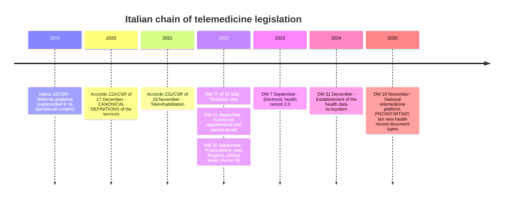
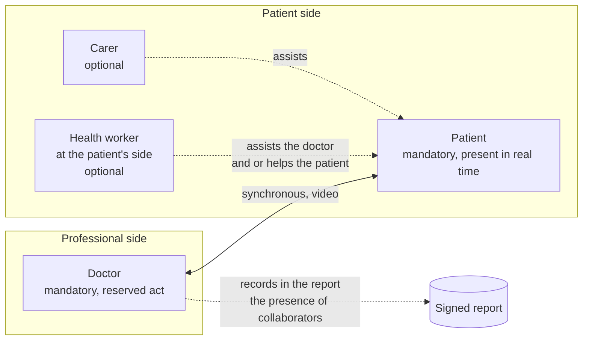
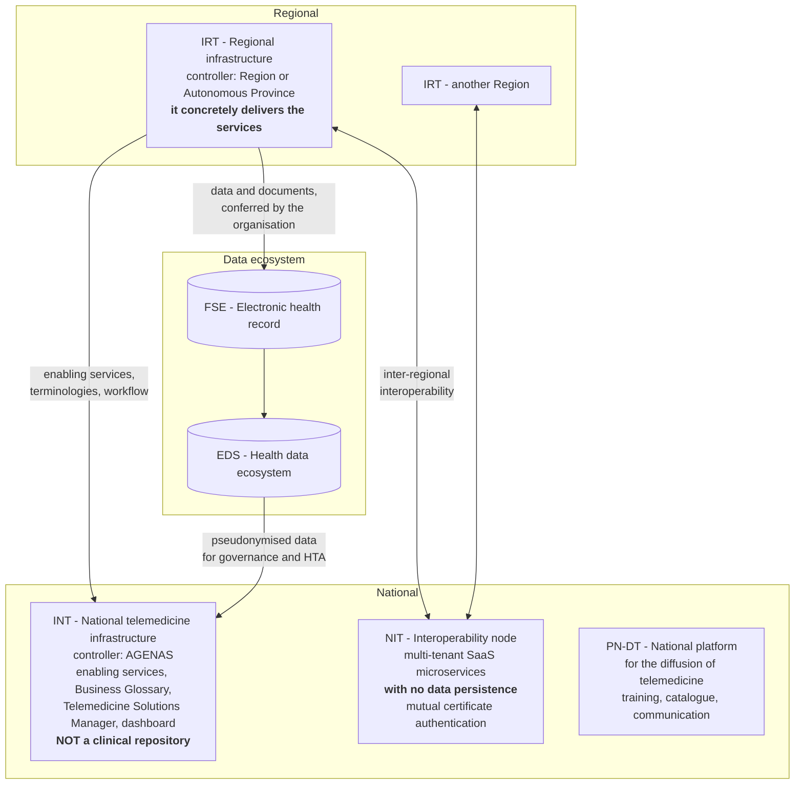

# Telemedicine services

This is the most important module in the guide, and there is only one reason: **in Italy
telemedicine services have regulatory definitions, not commercial ones.** They are not names
of features that a product may choose freely. They are legal categories, each with determined
actors, reserved acts, documentary obligations, remuneration rules and express prohibitions.

Getting a definition wrong does not produce a marketing inaccuracy: it produces a wrong data
model, invalid clinical documents, authorisations granted to people who could not perform the
act, rejected reimbursement reporting flows and - in the worst case - an unlawful health act.

Those arriving from computing tend to read «televisita» and «teleconsulto» as stylistic
synonyms. They are not. What changes is the subject of the service, who is present, who is
answerable for what, what is produced and who pays. § 13 collects the most frequent mistakes;
if you are short of time, read at least that and then come back.

---

## 1. What telemedicine is according to Italian law

### 1.1 It is a channel, not a specialty

Telemedicine is a **delivery mode** for health and health-and-social care services at a
distance, enabled by information and communication technologies. It is not a clinical
discipline, it is not a ward, it is not a type of service: it is the **channel** through which
a service is delivered that, in the overwhelming majority of cases, already exists in person
as well.

An immediate regulatory consequence follows, which the State-Regions Agreement of 17 December
2020, act no. 215/CSR, states verbatim:

> «for all health services delivered at a distance there applies the national/regional
> regulatory framework governing access to the various Essential Levels of Care, the
> remuneration/tariff system in force for the delivery of the same services in the
> "traditional" mode, including the rules on any cost-sharing.»

Translated: **there is no special legal regime for telemedicine**. There is the regime of the
service, which applies also when the service is delivered at a distance, with the addition of
some specific obligations (§ 4.1.6).

### 1.2 Why a formal definition is needed

A regulatory definition does three things that a commercial name does not:

- **it delimits who may do what.** The remote consultation (televisita) is defined as «*a medical act*»: from this
  qualification it follows that a nurse cannot deliver it, full stop;
- **it determines what is produced.** The remote consultation in outpatient specialist care «*must
  always conclude with a report*»; the specialist-to-specialist consultation (teleconsulto) «*does not give rise to a report of its
  own*». They are two different state machines;
- **it determines whether and how payment is made.** The remote consultation is remunerated as a
  follow-up visit; the specialist-to-specialist consultation is not remunerated at all.

### 1.3 What telemedicine is NOT

Agreement 215/CSR 2020 expressly excludes one category, and the exclusion is useful because it
draws the boundary by contrast:

> «**Telephone triage**: triage or telephone advice carried out by doctors or health workers
> towards patients for the purpose of indicating the most appropriate
> diagnostic/therapeutic pathway and the need to carry out the visit rapidly in person or at
> a distance, or the possibility of postponing it to a later moment by assigning a new
> appointment, **does not fall among the activities attributable to telemedicine**.»

The discriminating element is not the means (the telephone) but the **nature of the act**:
routing someone towards the appropriate pathway is not delivering a service. On the basis of
the same criterion the following remain outside the perimeter, without the legislation naming
them one by one:

- **sending the report by email**: this is transport of a document, not an act;
  tele-reporting is the act of reporting at a distance, not the delivery channel;
- the **patient portal** that exposes documents already produced: it is an access function,
  not a service;
- **wellbeing applications** that collect steps, sleep or heart rate without a responsible
  professional and without a plan: collecting measurements is not remote monitoring
  (§ 4.5.4);
- **administrative communication** with the patient (reminders, cancellations, access
  instructions): it remains communication, and it moreover carries the constraint of not
  containing any clinical datum.

---

## 2. The chain of legislation: where each thing is written

### 2.1 Four levels with different binding force

Italian telemedicine law is not contained in a single organic statute. It is stratified, and
the levels have **different addressees and different binding force**. Keeping them apart is
not pedantry: it determines whether a statement in the product documentation is verifiable or
is an overstatement.

| Level | Examples | Binding force | Addressee |
|---|---|---|---|
| **1. Primary legislation** | Art. 12 D.L. 179/2012 conv. L. 221/2012, as amended by art. 21 D.L. 4/2022 conv. L. 25/2022 | Full | State, Regions, organisations |
| **2. Acts of the State-Regions Conference** | Intesa 16/CSR 2014; **Accordo 215/CSR 2020**; Accordo 231/CSR 2021 | Perfected by regional transposition | Regions and Autonomous Provinces |
| **3. Ministerial decrees** | DM 77/2022; **DM 21 settembre 2022**; DM 30 settembre 2022; DM 7 settembre 2023; **DM 19 novembre 2025** | Full, but often addressed to the Regions and their suppliers | Regions, AGENAS, suppliers |
| **4. Cross-cutting technical rules for the public administration** | Codice dell'amministrazione digitale (D.lgs. 82/2005); AgID guidelines under art. 71 CAD; ACN determinations; the three-year plan | Full for public administrations | All public administrations and their suppliers |

To these are added two **horizontal and fully binding** bodies of law: Regulation (EU)
2016/679 (GDPR), dealt with in module [03 - The clinical datum](03-il-dato-clinico.md), and
Regulation (EU) 2017/745 on medical devices (MDR), dealt with in module
[15 - The regulatory framework from scratch](15-regolatorio-da-zero.md).

### 2.2 Essential chronology

**What each act imposes on an application**, in one line:

- **Accordo 215/CSR 2020** - it almost never speaks of software, but **it is the source of the
  definitions** and therefore determines the domain model. It requires: a mandatory report for
  the televisita; recording in the report of the presence of collaborators and of the
  **quality of the connection**; encryption of *all* transfers of voice, video, images and
  files; verified identity of the patient; certification as a medical device «*appropriate to
  the type of service*».
- **DM 77/2022** - it places telemedicine inside territorial pathways. It does not lay down
  software requirements, it determines the context (module
  [01](01-sistema-sanitario-italiano.md), § 8).
- **DM 21 settembre 2022** - «Approval of the guidelines for telemedicine services -
  Functional requirements and service levels», Gazzetta Ufficiale, General Series no. 256 of
  2 November 2022. **It is the technically most prescriptive act**: micro-service architecture,
  *event-driven*, containerised, *cloud native*, multi-tenant, *mobile first*, accessible,
  with 24/7 service levels.
- **DM 30 settembre 2022** - it governs procurement (lead Regions) and, in **Annex B**, the
  clinical areas and clinical requirements.
- **DM 7 settembre 2023** - electronic health record 2.0: contents, actors, consents, feeding,
  consultation (module [07](07-fse-e-infrastrutture-nazionali.md)).
- **DM 19 novembre 2025** - «Rules on the processing of personal data within the
  infrastructure of the national telemedicine Platform», Gazzetta Ufficiale, General Series
  no. 301 of 30 December 2025, act 25A06938. It formally establishes the national
  architecture, creates **ten new health record document types** dedicated to telemedicine,
  and defines extremely prescriptive security measures.

> **Note on citation.** The title published in the Gazzetta is «*della infrastruttura della
> Piattaforma nazionale telemedicina*», without the «di» before «telemedicina». Several
> sources, including an earlier internal piece of project research, give the title with the
> more natural Italian phrasing. In formal citations the published title must be used.

### 2.3 Two taxonomies that do not coincide

This is the first serious obstacle, and it must be faced immediately because the data model
has to represent it.

**Accordo 215/CSR 2020** lists **five outpatient activities** - televisita, teleconsulto,
teleconsulenza, teleassistenza, telerefertazione - plus **telecontrollo** and
**telemonitoraggio** as «operating modes».

**DM 21 settembre 2022**, by contrast, identifies **four «minimum services»** that the
regional infrastructure must deliver:

> «The minimum services that the regional telemedicine infrastructure must deliver are the
> following: **televisita; teleconsulto/teleconsulenza; telemonitoraggio; teleassistenza**.»

The two taxonomies **do not overlap**:

| Accordo 215/CSR 2020 | DM 21 settembre 2022 | What changes |
|---|---|---|
| Televisita | Televisita | They coincide |
| Teleconsulto | Teleconsulto/teleconsulenza | **Merged** into a single minimum service |
| Teleconsulenza | Teleconsulto/teleconsulenza | **Merged** into a single minimum service |
| Teleassistenza | Teleassistenza | They coincide |
| Telerefertazione | *(absent)* | **It disappears as an autonomous service**: it becomes the cross-cutting micro-service «reporting and digital signature» |
| Telemonitoraggio (operating mode) | Telemonitoraggio | **Promoted to a minimum service** |
| Telecontrollo medico (operating mode) | *(not listed among the minimum services)* | It remains an operating mode, but it is a **tariffed service** |

**The domain model must represent both taxonomies and their mapping.** It is not possible to
choose one: the first determines the lawfulness of the act and the reporting, the second
determines admissibility in a tender and the structure of the micro-services.

There also exists, since 29 January 2026, a **National Telemedicine Glossary** published by
AGENAS in the Business Glossary of the national platform (v. 1.0.0). The project's glossary -
module [19](19-glossario.md) - must align with it wherever it diverges.

---

## 3. How to read the sheets that follow

Every service is described using the same grid, because it is precisely these dimensions that
change from one to the next:

- **regulatory definition** - verbatim, from the source, in quotation marks;
- **actors** - who performs the act;
- **who is present** - is the patient there or not; is it synchronous or asynchronous;
- **who is responsible** - who is answerable for what;
- **what is produced** - which document, with which requirements;
- **what cannot be done** - the express limits;
- **effects on the data model** - the engineering translation.

The definitions in block quotes are reported **verbatim** from Annex A to the State-Regions
Agreement of 17 December 2020, act no. 215/CSR (version 4.4 of 27 October 2020), unless
otherwise indicated.

---

## 4. The services, one by one

### 4.1 Televisita (remote consultation)

#### 4.1.1 Definition

> «It is a medical act in which the professional interacts at a distance in real time with the
> patient, possibly with the support of a *care-giver*. Nevertheless the remote consultation, as
> provided for also by the code of medical ethics, may never be regarded as the means of
> conducting the doctor-patient relationship exclusively at a distance, nor may it be regarded
> as automatically replacing the first in-person medical visit. The doctor is appointed to
> decide in which situations and to what extent the remote consultation may be employed in the
> patient's favour, also using telemedicine tools for the activities of remote measurement, or
> monitoring, of biological parameters and of clinical surveillance. **The remote consultation is to be
> understood as limited to follow-up activity for patients whose diagnosis has already been
> formulated in the course of an in-person visit.**»

#### 4.1.2 Actors and presence

- **Doctor** - the act is reserved to the doctor. No other health profession may deliver a
  remote consultation.
- **Patient** - present, **in real time**. The remote consultation is by definition synchronous: there
  is no such thing as an asynchronous remote consultation.
- **Carer** - optional; they assist, they do not represent. A carer **may not give consent in
  substitution for a patient with capacity**, in any configuration.
- **Health worker at the patient's side** - optional. The Agreement expressly provides for it:
  «*During the remote consultation a health worker who is near the patient may assist the doctor and/or
  help the patient*».

#### 4.1.3 The constraint on the first visit: the exact reading

This is the point on which the greatest number of mistaken simplifications circulate, in both
directions. The text contains **two distinct statements with different intensity**:

1. the remote consultation **does not automatically replace** the first in-person visit;
2. the remote consultation **is to be understood as limited to follow-up activity** for patients
   already diagnosed in person.

The second is more restrictive than the first. It is not, however, an **absolute
prohibition**: it is a **delimitation of the ordinary scope**, tempered by the clause on
medical responsibility («*the doctor is appointed to decide*»).

And the picture is articulated further at regional level. The regional Guidance of
Emilia-Romagna (BUR no. 255 of 17 August 2021, Annex 2) states that «*the possibility of its
use is not excluded even in cases where the patient is referred for the first time to a
specialist following a specialist-to-specialist consultation between the MMG/PLS and the specialist*». **This opening
is regional, not national.**

> **Editorial rule of the project.** Writing «the remote consultation may never replace the first
> visit» is **imprecise**. Writing «the remote consultation is admissible for a first visit after a
> specialist-to-specialist consultation» is **imprecise in the opposite direction**. The correct formulation is
> stratified: the national rule as a restrictive default, the regional derogation as explicit
> and tracked configuration, the final decision resting with the doctor and recorded.

#### 4.1.4 Exhaustive conditions of deliverability

Deliverable by remote consultation are those outpatient services which **do not require the
completeness of the physical examination** (traditionally made up of inspection, palpation,
percussion and auscultation) **and** where **at least one** of the following conditions is
present:

1. the patient needs the service within a **PAI** (individual care plan) or a **PDTA** (care
   pathway);
2. the patient is enrolled in a **follow-up pathway for a known condition**;
3. the patient with a known condition needs **review or monitoring, confirmation, adjustment
   or change of the ongoing therapy** (for example renewal or modification of the treatment
   plan);
4. the patient needs a **history-taking assessment** for the prescription of tests for the
   diagnosis or staging of a known or suspected condition;
5. the patient needs **verification by the doctor of the results of tests carried out**, which
   may be followed by the prescription of further investigations or of a therapy.

**Effect on the data model.** This is a **domain precondition, not a descriptive field**. The
system must require, before delivery, the explicit recording of (a) the absence of any need
for a complete physical examination and (b) at least one of the five conditions. The choice is
attributed to the doctor, tracked and not modifiable after the fact. In the project's
terminology this is the **appropriateness gate**.

To this is added a further phase introduced by the most recent methodological document:
AGENAS's **Guidance model for the delivery of the remote consultation** (v. 1.0.25 of 16 April 2026)
provides for a «feasibility assessment» phase articulated over three dimensions - **clinical
usefulness**, **clinical safety** and **verification of the patient's digital readiness**,
that is, the ascertainment of their ability to interact with digital systems. The document is
methodological and not regulatory `[RACCOMANDATO]`, but it is in practice expected in tender
settings: «digital readiness» must be modelled as a phase distinct from informed acceptance
and from consent to data processing.

#### 4.1.5 Who is responsible

- The **doctor** is answerable for the health act: for the appropriateness of the channel, for
  the adequacy of the service delivered at a distance, for the attestation of the quality of
  the connection, for the report and for signing it.
- The **healthcare organisation** is answerable for the technical equipment. DM 30 settembre
  2022, Annex B, is verbatim: «*the healthcare organisation is responsible for the correct
  provision of hardware, software and telecommunication resources and for their conformity
  with the laws, regulations and reference technical standards in Italy*».
- The **software supplier** is answerable for the product's conformity with what it declares,
  and for the obligations arising from the medical device regime where applicable.

#### 4.1.6 What is produced

> «The remote consultation delivered within outpatient specialist activity **must always conclude with
> a report**.»

In the report, in addition to the usual information, the following must be recorded:

- the indication of any **participating collaborators** (presence of a carer, presence of a
  doctor);
- the **quality of the connection and the confirmation that it was fit for the performance of
  the service**.

The report must be **digitally signed** by the doctor, made available to the patient in the
electronic manner they prefer, and it must always be possible, at the patient's request, to
share it with other health workers in digital format, «*including through the Fascicolo
Sanitario Elettronico*».

**The obligation is not, however, unconditional.** DM 30 settembre 2022, Annex B, section
«Delivery modes», introduces two derogations that depend on the *setting*:

> «**A prescription for the remote consultation is not necessary** where it is scheduled and delivered
> directly **by the MMG or the PLS**, and they may be delivered within any type of PDTA.»

> «The remote consultation **always concludes with a report (except in cases where the remote consultation is
> carried out by the MMG/PLS)** which must be sent to the health record. However, should the
> patient have difficulty accessing their own health record, on request the report may also be
> sent in **secure mode, with two-factor authentication**.»

**The domain model must therefore represent the delivery *setting* as a discriminator of
rules**: remote consultation in outpatient specialist care → prescription necessary and report
mandatory; remote consultation delivered by a general practitioner or a freely chosen paediatrician →
prescription not necessary and a digital note in place of the report.

#### 4.1.7 The attestation of the quality of the connection

It deserves a paragraph of its own because it is the requirement that links the clinical rule
to media engineering, and it is probably the point where this project has its most defensible
advantage.

The legislation requires the doctor to attest that the connection was fit for purpose. It
fixes **no numerical threshold**: the research conducted by the project across all national
sources closed negatively. **There are, in the Italian sources examined, no binding
quantitative technical thresholds for the delivery of telemedicine services**: no minimum
resolution, no frame rate, no bandwidth in Mbps, no maximum latency. The Italian regulatory
model is **qualitative and with distributed responsibility**: the judgement of fitness rests
with the doctor, on the individual act.

The correct logical chain, which the project documentation must spell out without shortcuts,
is:

1. the legislation requires the doctor to attest to the fitness of the connection;
2. the attestation requires objective evidence, otherwise it is a bare assertion;
3. session metrics - round-trip time, packet loss, *jitter*, *bitrate* - **are** that
   evidence;
4. the alarm threshold is **a product choice**, configurable per tenant, **not a statutory
   threshold**.

> **Constraint of documentary honesty.** The latency target publicly declared by the project
> does not and cannot have the nature of regulatory compliance. It must be presented as an
> **engineering objective**, not as a «legal requirement». Asserting the contrary would be a
> mistake verifiable by anyone who reads the sources. The thresholds do, however, become
> normatively relevant by another route: as part of the **intended purpose** for the purposes
> of the medical device regime and as an input to risk management under ISO 14971.

There is an open problem in this area, and it is better to know it straight away: the
**ministerial record layout for the televisita report has no dedicated field** for the quality
of the connection (§ 7.2). The natural candidates for carrying it are the fields «Mode of
performance of the operating procedure», «Instrumentation used» and «Descriptive parameters of
the procedure». Its placement is the subject of an architectural decision to be documented.

#### 4.1.8 Typed outcomes

The Agreement lists the admissible outcomes of a televisita, and they are **a domain
enumeration**, not a free-text field:

- a finding of clinical stability, or otherwise, within the known diagnostic picture;
- the need, or otherwise, for urgent access to diagnostic and therapeutic services, with
  enrolment into care by the specialist;
- a request for further diagnostic investigation, with the indication of the priority class on
  the prescription;
- the prescription or renewal of a treatment plan;
- rescheduling in the ordinary mode in the event of an unsatisfactory outcome.

#### 4.1.9 What cannot be done

- **It is not admissible in urgency/emergency.** DM 30 settembre 2022, Annex B, is explicit:
  for the patient in urgency/emergency the remote consultation «*is not advisable, in that it must not
  constitute a reason for delaying in-person interventions in cases where these guarantee
  greater effectiveness or safety than remote intervention*». The system **must not offer
  remote consultation pathways in urgent contexts**.
- **It is not admissible when a complete physical examination is needed.**
- **It does not automatically replace the first visit** (§ 4.1.3).
- **It is not advised at home** for patients with acute conditions or ongoing exacerbations
  and for frail or disabled chronic patients whose remaining at home would be imprudent. It is
  a recommendation `[RACCOMANDATO]`, not a prohibition, but it is relevant for risk management
  and for the definition of the intended purpose.

#### 4.1.10 The in-person fallback is mandatory, not optional

> «Should the Telemedicine tool not allow the substantive content of the service to be
> delivered to be kept unaltered, the Authorities and private providers are required to
> **complete the service in the traditional mode with no further charge to the SSN and/or the
> user**.»

And in the event of an insufficient result «*for any reason whatsoever (technical, related to
the conditions found in the patient or otherwise)*» there arises «*the obligation to
reschedule the service in person*».

The AGENAS guidance model adds the operational premise: «*if technical problems prevent
adequate communication, the doctor must interrupt the remote consultation*» and organise an in-person
visit, guaranteeing booking on digital diaries «*within times adequate to the patient's
needs*».

**Effect on the data model.** Technical failure **is not error handling: it is a functional
requirement**. The system must trace the interruption as a typed outcome, record its cause,
generate the in-person rescheduling event and hook it to the booking, all with no further
charge. A `catch` that logs and displays «connection lost» does not satisfy the legislation.

---

### 4.2 Teleconsulto medico (specialist-to-specialist consultation)

#### 4.2.1 Definition

> «It is a medical act in which the professional interacts at a distance with one or more
> doctors in order to discuss, including by video call, the clinical situation of a patient,
> based primarily on the sharing of all the clinical data, reports, images and audio-video
> material concerning the specific case. All the aforesaid elements must be shared
> electronically in the form of digital files suitable for the work that the doctors in the
> specialist-to-specialist consultation deem necessary for it to be adequately carried out. The specialist-to-specialist consultation between
> professionals **may also take place asynchronously**, when the patient's situation safely
> permits it. **When the patient is present at the specialist-to-specialist consultation, then it takes place in real
> time using operating modes analogous to those of a remote consultation and it takes the form of a
> multidisciplinary visit.**»

#### 4.2.2 Actors, presence, responsibility

- **Actors**: **two or more doctors**. The axis of the relationship is doctor-doctor, not
  doctor-patient.
- **Presence of the patient**: optional. If present, the session becomes real-time and takes
  the form of a **multidisciplinary visit**.
- **Synchrony**: **asynchronous is also admitted**, when the clinical situation safely allows
  it.
- **Purpose**: «*to share medical choices regarding a patient among the professionals
  involved*» and to provide a specialist ***second opinion*** where requested.
- **Responsibility**: clinical responsibility for the patient remains with the doctor who has
  them in their care; the consultant is answerable for their own opinion.

#### 4.2.3 What is produced: the crucial distinction

> «The specialist-to-specialist consultation **contributes to the definition of the report** that is drawn up at the end
> of the visit delivered to the patient, **but it does not give rise to a report of its own**.»

For years this passage was read as «the specialist-to-specialist consultation produces nothing». **That is a mistaken
reading, and DM 19 novembre 2025 has refuted it.** The decree creates an autonomous health
record document type - the **collaborative report for the specialist-to-specialist consultation/teleconsulenza**, letter
q) - with this structural rule (Annex 1, § 2.21):

> «The collaborative report **is conferred on the health record as an attachment to the report
> document** relating to the service or to the principal event (e.g. specialist visit,
> hospital admission, visit by the doctor of the single primary care role, etc.) drawn up by
> the doctor requesting the consultation.»

So: **the specialist-to-specialist consultation does not produce an autonomous report, but it does produce an autonomous
health record document type, which is attached to the report of the principal event.** In the
data model these are two distinct things: the prohibition concerns the generation of a
specialist report; the obligation concerns the production of the collaborative report and its
correlation via `idRichiesta`.

#### 4.2.4 It is not remunerated

The specialist-to-specialist consultation **is not an autonomous specialist service**: it has no entry in the fee
schedule, it does not involve a prescription at the SSN's expense nor cost-sharing, and it
falls within the professional's ordinary work. The report of the Istituto Superiore di Sanità,
the national institute of health (Rapporti ISTISAN 25/16), confirms this verbatim. Some
Autonomous Provinces had established a code and a tariff of their own, which then became
inoperative with the entry into force of the new national tariff schedule.

**A business model founded on the volume of specialist-to-specialist consultations within the SSN has no direct source
of revenue.** The project's commercial documentation must not suggest the contrary.

#### 4.2.5 The specialist-to-specialist consultation request

DM 19 novembre 2025 also types the **request** (letter o), with a precise generation rule:

> «The specialist-to-specialist consultation request **is generated internally to the IRT**. Full operability of the
> service in the case of interoperability between IRT of regions or autonomous provinces other
> than the region of entitlement is guaranteed by the INT, pursuant to article 3, subsection
> 4.»

The record layout contains elements that the data model must provide for and that are not
obvious: `idRichiesta`; the tax code of the **doctor of record** and that of the **substitute
doctor**; the priority class; a **proposed time slot**; an «immediate availability requested»
flag, **compatible only with high urgency**; the **delivery radius** with the values
*authority-wide*, *regional*, *national*, which determines the breadth of the search for
available professionals; the service codes from both the **national fee schedule**
(`codProdPrest`) and the **single regional catalogue** (`codCatalogoPrescr`); and the fields for
SASN patients (seafaring personnel) and for persons insured by foreign institutions.

Finally, a field that condenses into a single string the whole complexity of the definitions:
the **mode of performance of the operating procedure** must represent, in structured form, the
combination **impromptu | scheduled** × **synchronous | asynchronous** × **with the patient
present | without the patient present**.

---

### 4.3 Teleconsulenza medico-sanitaria (tele-advice)

#### 4.3.1 Definition

> «It is a health activity, **not necessarily medical but in any case specific to the health
> professions**, which takes place at a distance and is performed by two or more people who
> have different responsibilities in relation to the specific case. It consists of a request
> for support during the carrying out of health activities, followed by a video call in which
> the health professional consulted provides the other, or the others, with indications for
> decision-making and/or for the correct performance of care actions directed at the patient.
> Teleconsulenza **may be carried out in the patient's presence, or in a deferred manner**. In
> this activity direct interaction through the video call is pre-eminent, but it is always
> necessary to guarantee, where required, the possibility of sharing at least all the clinical
> data, reports and images concerning the specific case. **It is an activity on request but
> always scheduled, and it may not be used to stand in for rescue activities.**»

#### 4.3.2 The four differences from the specialist-to-specialist consultation

They are subtle and must be borne in mind, because DM 21 settembre 2022 merges them into a
single minimum service while the Agreement distinguishes them as acts:

1. **the actors are not necessarily doctors**: they are practitioners of the health
   professions with **different responsibilities** for the case;
2. **the pre-eminent element is the video call**, not documentary sharing (in the specialist-to-specialist consultation
   it is the opposite);
3. **it is always scheduled**, never impromptu;
4. there is an **express prohibition** on using it to stand in for rescue activities.

Like the specialist-to-specialist consultation, it is not a service with a fee schedule coding and it is not
remunerated.

The prohibition in point 4 must be read together with another rule: DM 30 settembre 2022,
Annex B, states that specialist-to-specialist consultation/teleconsulenza is, by contrast, «*performable also in
situations of urgency or emergency*». The two statements are not in contradiction: a
specialist-to-specialist consultation between professionals may be useful in urgent situations, but **it cannot take
the place of rescue**. The distinction is between supporting the person carrying out the
rescue and substituting for the rescue.

---

### 4.4 Teleassistenza (remote assistance) by the health professions

#### 4.4.1 Definition

> «(nurse/physiotherapist/speech and language therapist/etc.): it is **a professional act
> pertaining to the health profession concerned** and it is based on interaction at a distance
> between the professional and patient/*caregiver* by means of a video call, to which the
> sharing of data, reports or images may be added where required. The professional carrying
> out teleassistenza activity may also use suitable apps to administer questionnaires, share
> images or video tutorials on specific activities. The purpose of teleassistenza is to
> facilitate the correct performance of care activities, **performable predominantly at home**.
> Teleassistenza is **predominantly scheduled and repeatable** on the basis of specific patient
> accompaniment programmes.»

#### 4.4.2 Characteristics

- **Actors**: a **non-medical** health professional; the patient and/or the carer.
- **It is not a medical act**, and it does not produce a specialist report.
- **It is by definition repetitive and scheduled**: the natural container is a plan, not an
  isolated encounter.
- **Its purpose is care-related, not diagnostic.**
- It produces, pursuant to DM 19 novembre 2025, a **concluding clinical and care report**
  (health record document type, letter r).

#### 4.4.3 A peculiar software requirement

DM 21 settembre 2022 imposes something that at first sight is surprising:

> «It is indeed necessary that the remote assistance service also be able to make available **all
> the functionalities present for the remote consultation and for the remote monitoring**.»

On the software plane, remote assistance is therefore **a hybrid service that reuses the
capabilities of the other two**. It is not an autonomous module: it is a composition. Anyone
designing the boundaries of the bounded contexts must take account of this, because too rigid
a separation between remote consultation and remote monitoring makes remote assistance impossible to
compose.

DM 19 novembre 2025 adds, among the essential micro-services of teleassistenza, the
**management of the multi-professional care group** and **support for the carer** through a
dedicated digital channel.

---

### 4.5 Telemonitoraggio and telecontrollo

#### 4.5.1 Telecontrollo medico (medical remote check)

> «an operating mode of telemedicine that allows the remote review of the patient. This
> activity is characterised by a series of scheduled contacts with the doctor, who keeps the
> course of the clinical picture under review, by means of the video call in combination with
> the sharing of clinical data collected at the patient's location, both before and during the
> video call itself.»

Telecontrollo is a **medical service**, counted among the services of the tariff-bearing fee
schedule and reported in the outpatient specialist flows. It is therefore **remunerated**,
unlike pure telemonitoraggio.

#### 4.5.2 Telemonitoraggio (remote monitoring)

> «an operating mode of telemedicine that permits the remote measurement and transmission of
> vital and clinical parameters on a continuous basis, by means of sensors that interact with
> the patient (biomedical technologies with or without applied parts).»

The *set* of technologies at home «*must be constantly connected to the software system that
collects the sensor data, integrates it where necessary with other health data and makes it
available to the operators of the Telemedicine service according to the organisational
arrangements established*».

#### 4.5.3 The rule of attribution

> «remote monitoring **does not belong to the sphere of outpatient specialist care, unless it is
> accompanied by medical remote check, by a remote consultation or indeed by an in-person visit** in
> which the continuously recorded data are analysed, discussed and communicated to the patient.
> The results of the remote monitoring must be indicated in the report of the periodic follow-up
> visit.»

Put another way: **collecting data is not a service. It becomes a service when a doctor looks
at it inside a clinical act.** This is perhaps the single most useful sentence in the module for
those arriving from computing.

#### 4.5.4 Remote monitoring is not «collecting data from a device»

It is worth spelling this out because it is the commonest mistake. A compliant remote
monitoring service comprises, according to DM 19 novembre 2025 (Annex 3, § 4.1), essential
micro-services that have nothing to do with ingestion:

- **definition of the care pathway** and a **workflow engine**;
- **validation of the quality of the data** received;
- a **medical device configurator**, with alarm thresholds, frequency and critical intervals;
- **training of the patient and the carer** in its use;
- **questionnaire management**;
- **case manager**;
- **events and notifications**, videoconferencing, chat.

And it produces **four distinct health record document types**: the *device card* digitally
signed by the professional who assigns the device, the *remote monitoring plan*, the
*measurement report*, the *weekly report*, the *final report* (§ 7.1).

The **device card** contains, among other things, the **unique device identification (UDI)** in
automatic identification and data capture format, the serial or lot number, the name, address
and website of the **manufacturer**, the type of connection and of power supply, the outcome of
the **technical pre-check** and the parameters of connectivity, configuration and calibration.
It is not a list of arbitrary attributes: it is the traceability of a medical device assigned
to a person.

The **remote monitoring plan** contains the number of cycles, the duration of the cycle, the
number of activities per cycle, the frequency («1 measurement/day», «2 measurements/week», or
«continuous»), the time band, a **maximum expected duration of one year**, the type of
measurement («intermediated» or «closed loop» with direct interoperability), the **alarm
threshold** and the **rules** describing the behaviour in the event of a threshold breach.

#### 4.5.5 Why remote monitoring changes the classification of the software

DM 21 settembre 2022 is explicit:

> «It is also required, in line with what is set out within the *«Guidance on Qualification and
> Classification of Software in Regulation (EU) 2017/745 – MDR and Regulation (EU) 2017/746»*,
> that **the regional telemedicine Infrastructure for the minimum service of remote monitoring
> must be certified as a medical device**.»

And for advanced remote monitoring: «*a risk class higher than IIa might be required*».

This is the reason why the project has taken, as a binding decision, qualification as **Class
IIa medical device software**, with a Notified Body and a certified quality management system.
The element that grounds the qualification is the **automatic evaluation of thresholds**: the
moment the system compares a measurement with a threshold and generates an alert, it is
*interpreting* a clinical datum.

The domain constraint that follows from this, and that must be respected without exception:
**the threshold and the alert are configured by the professional, never inferred by the
system**. The perimeter adopted by the project is the ingestion of measurements from a
third-party gateway plus manual entry by the patient or carer plus structured questionnaires;
the project **does not communicate directly with medical devices** and assumes no
responsibility for the accuracy of the hardware measurement chain.

---

### 4.6 Telerefertazione (tele-reporting)

#### 4.6.1 Definition

> «It is a report issued by the doctor who has subjected a patient to a clinical or
> instrumental examination, whose content is that typical of reporting carried out in person
> and which is written and transmitted by means of digital and telecommunication systems. The
> doctor performs and sends the telereport within times appropriate to the patient's clinical
> needs and in agreement with the doctor who requested the clinical or instrumental
> examination.»

The modes provided for are: (a) a telereport issued **subsequently** to the traditional
in-person performance of the examination; (b) a telereport issued within a process of
**telemanagement**, in which the reporting doctor is remote from the place where the
examination is performed and relies on the collaboration of the requesting doctor or of a
health worker at the patient's location, communicating with them in real time.

#### 4.6.2 What it imposes on the software

Three elements fall directly on the implementation:

- «*The telereport formalises the telediagnosis **with the validated digital signature of the
  doctor responsible for it***»;
- organisations must «*carry out in advance **tests of fitness for clinical use** of the
  equipment, the hardware and software, and during operation carry out functioning tests at
  regular intervals and after every significant maintenance or update intervention*»;
- they must «*guarantee the correct archiving within **an interoperability system** of the
  material produced by the examination and of the correlated report, allowing health staff to
  recall and compare what has been performed previously*».

The second point is a **process** obligation that translates into artefacts: acceptance test
records, detailed technical reports, traceability of updates. It is not a functional
requirement of the product, it is a requirement of the life cycle.

#### 4.6.3 It is not a service in its own right

«*The report represents the activity that completes the specialist service*»: tele-reporting
**is not tariffed autonomously**.

In DM 21 settembre 2022 tele-reporting does not appear among the minimum services: it becomes
the **cross-cutting** micro-service «reporting and digital signature». And on this the decree
lays down a prohibition with direct architectural impact:

> «for the micro-service "reporting and digital signature" **an *ad hoc* module must not be
> built** for managing the reporting and digital signature of a telemedicine service, but
> **integration with the regional module** must be provided for, if one is already present.»

Hence the project's decision: the reporting, diary and invoicing modules exist but are
**capable of being switched off and replaced by configuration**. When a regional module or an
integrator's module exists, the system integrates instead of duplicating.

---

### 4.7 Teleriabilitazione (telerehabilitation)

Governed autonomously by the **Accordo Stato-Regioni 18 novembre 2021, rep. atti n. 231/CSR**
(the State-Regions Agreement of 18 November 2021, act no. 231/CSR), «National guidance for the
delivery of telerehabilitation services and provisions by the health professions».

Key elements:

- the services must be framed within the **Progetto riabilitativo individuale (PRI, individual
  rehabilitation project)**: there are no isolated sessions;
- **the tariff is equivalent** to that of in-person services;
- organisations intending to deliver telerehabilitation at the SSN's expense must be
  **accredited for the same activities in person**;
- the patient's consent is required both to the proposed activities **and** to the processing
  of data: two distinct consents (module [03](03-il-dato-clinico.md), § 2).

**Effect on the data model.** Telerehabilitation lasts across multiple sessions. Modelling it
as a single encounter loses the cycle: a container is needed (`EpisodeOfCare` or `CarePlan`)
along with measurement of adherence to the programme. It produces a **final report** as a
health record document type (letter w).

---

### 4.8 Two borderline notions

**Second opinion.** An independent assessment requested of a professional other than the one
who has the patient in their care, normally asynchronous and based on documentation. **It is
not a teleconsulto**: the requester may be **the patient themselves**, and the consultant does
not enter into the enrolment into care. DM 19 novembre 2025 lists it among the essential
micro-services of the teleconsulto («definition of a second opinion»), which indicates that the
platform must support it, but the legal category remains distinct.

**Telecooperazione sanitaria (health telecooperation).** Assistance provided by a doctor at a
distance to another worker engaged **in an act in progress**, typically in territorial
emergency and urgent care. Synchrony is binding and the tolerable latency is far lower than in
a televisita: the service objectives are not reusable. The category does not appear in the list
of services of Agreement 215/CSR 2020 and in the project it is treated as a context of use
outside the perimeter of the current version. `[NV]` on an autonomous national regulatory
definition.

---

## 5. Comparative table

| | **Televisita** | **Teleconsulto** | **Teleconsulenza** | **Teleassistenza** | **Telemonitoraggio** | **Telecontrollo** | **Telerefertazione** | **Teleriabilitazione** |
|---|---|---|---|---|---|---|---|---|
| **Who delivers** | Doctor (reserved act) | Two or more doctors | Two or more health professionals, not necessarily doctors | Non-medical health professional | System + responsible professional | Doctor | Reporting doctor | Rehabilitation professional |
| **Patient present** | Always | Optional | Optional | Always (or the carer) | No (measurements) | Yes, on the video call | No | Yes |
| **Synchrony** | Always synchronous | Synchronous or asynchronous | Synchronous or deferred, always scheduled | Synchronous | Continuous/periodic | Synchronous, at set intervals | Asynchronous | Synchronous |
| **Produces an autonomous report** | **Yes** (except MMG/PLS) | **No** - but it produces an attached collaborative report | **No** - as for teleconsulto | No - concluding clinical and care report | No - measurement reports and final report | It flows into the report of the visit | **It is** the report | Final report |
| **Remunerated** | Yes, as a follow-up visit | **No** | **No** | Depending on the setting | **No**, unless accompanied | **Yes**, an entry in the fee schedule | No, it completes the service | Yes, equivalent to in person |
| **Prescription necessary** | Yes (no if MMG/PLS) | No | No | Depending on the setting | Specialist prescription layout; pharmaceutical for the devices | Yes | - | According to the PRI |
| **Admissible in urgency** | **No** | Yes | Yes, but **never standing in for rescue** | - | - | - | - | - |
| **Minimum service under DM 21/09/2022** | Yes | Yes (merged) | Yes (merged) | Yes | Yes | No | No (cross-cutting micro-service) | No |
| **Health record document type** | letter p) | letter o) request, q) report | letter q) | letter r) | letters s), t), u), v), w) | - | - | letters r), t), w) |

---

## 6. The national architecture and what it implies for a third-party application

### 6.1 The components

**DM 19 novembre 2025, art. 2**, establishes at AGENAS the **Piattaforma nazionale di
telemedicina (PNT, the national telemedicine platform)**, articulated into two components;
Annex 4, § 8, introduces a third that earlier research had not identified.

- **INT - Infrastruttura nazionale di telemedicina** (national telemedicine infrastructure).
  Controllership and management rest with **AGENAS**. It provides common enabling services, a
  «Telemedicine Solutions Manager» module, a «Business Glossary» with a Terminology Server,
  Authoring Tool and Library Repository, data collection, a workflow engine and governance
  functions. **Fundamental rule**: «*The INT does not carry out any processing of personal data
  other than that provided for in subsection 5*». **It is not a clinical repository.** Clinical
  data flow directly into the health record and the EDS; the Garante per la protezione dei dati
  personali (the Italian data protection authority, opinion no. 2 of 16 January 2025) imposed
  this choice in order to avoid duplication and desynchronisation.
- **IRT - Infrastrutture regionali di telemedicina** (regional telemedicine infrastructures).
  Controllership rests with the Regions and the Autonomous Provinces. **These are the
  infrastructures that concretely deliver the services.**
- **NIT - Nodo di interoperabilità della telemedicina** (telemedicine interoperability node).
  Built pursuant to art. 3, subsection 4. «*The NIT guarantees, without any mechanism of data
  persistence, the interoperability of the IRT concerned […] by means of fully automated
  microservices*». It is the inter-regional point of attachment, with precise technical
  requirements: mutual authentication with a client certificate, an OCSP and/or CRL service
  with a change of status of a compromised certificate **within one hour**, API Management as
  the single point of entry, IAM with *single sign-on*, PAM for administrators, a **prohibition
  on multiple concurrent sessions with the same credentials**.
- **PN-DT - Piattaforma nazionale per la diffusione della telemedicina** (national platform for
  the diffusion of telemedicine). A portal supporting diffusion and training. Its management is
  transferred to AGENAS within ninety days of acceptance testing (art. 17, para. 4).

### 6.2 The third route of art. 3, subsection 4

This is, for an open-source project, the most important passage of legislation in the whole
corpus.

Until 2025 the current reading was that the channel of entry to the public telemedicine market
was closed: Regions funded by the NRRP may activate solutions **exclusively through the tenders
of the lead Regions** (DM 30 settembre 2022). An alternative project could only get in as a
component of a successful bidder, or outside the NRRP perimeter.

**DM 19 novembre 2025, art. 3, subsection 4** opens an explicit door:

> «Regions may deliver telemedicine with **different infrastructures, applications or tools**,
> provided they comply with **technical standards certified by Agenas** and **feed the Fascicolo
> Sanitario Elettronico**.»

The certification of the standards is carried out by the **Gestore Soluzioni di Telemedicina
(GST, Telemedicine Solutions Manager)**, a micro-service of the INT which «*performs the task
of assisting, in the **Validation Process**, the providers of telemedicine services that
interoperate with the national digital health ecosystem*» (Annex 3, § 3.1).

The two conditions are therefore: **AGENAS-certified technical standards** and **feeding the
health record**. The second is technically defined and the project knows what it entails
(module [07](07-fse-e-infrastrutture-nazionali.md)). The first **is not publicly documented**:
`[NV]` on what the Validation Process operationally consists of, what the criteria, duration
and required artefacts are. It is a declared gap, to be filled by a direct request to AGENAS.

### 6.3 The essential micro-services

DM 19 novembre 2025, Annex 3, § 4.1, lists for each minimum service the **essential (*core*)**
micro-services, specifying that the list is «*by way of example and not exhaustive*»:

| Minimum service | Essential micro-services |
|---|---|
| **Televisita** | Questionnaire management; workflow engine; videoconferencing system; event and notification management; patient enrolment; messaging |
| **Teleconsulto** | Worklist management; videoconferencing; messaging; patient enrolment; events and notifications; **definition of a second opinion** |
| **Telemonitoraggio / telecontrollo** | Definition of the care pathway; workflow engine; **data quality validation**; videoconferencing; **medical device configurator**; patient/carer training; questionnaires; **case manager**; events and notifications; messaging |
| **Teleassistenza** | Questionnaires; definition of the care pathway; enrolment; videoconferencing; workflow engine; events and notifications; **management of the multi-professional care group**; messaging; **carer support** |

Among these there is one requirement that must be highlighted because it is often overlooked
and has a direct cryptographic impact. The decree defines messaging as follows:

> «An instant messaging system that allows asynchronous or real-time communication and the
> sharing of files, **without persistence of data and documents**, adopting secure protocols in
> terms of **end to end encryption of the conversations**.»

**It is an explicit legal obligation of end-to-end encryption on the chat**, not only on the
audio-video stream. Anyone designing the data channel must know this from the outset: the chat
is not an ancillary channel with attenuated requirements.

### 6.4 The technological requirements imposed by DM 21 settembre 2022

They are `[TECNICO-VINCOLANTI]` for the regional infrastructures and they determine the
admissibility of a solution:

| Driver | Prescription |
|---|---|
| **Architecture** | Micro-services, with orchestration and management of container images |
| **Events** | *Event-driven* architecture with an **event broker**; sharing of data and documents in *near real-time*; events «validated, normalised and translated through the common interoperable data model by the **FHIR Gateway**» |
| **Interoperability** | **FHIR** modelling standard, adopted incrementally starting from a minimum *subset* |
| **Containerisation** | Business logic on container images, for portability and **prevention of lock-in** |
| **Cloud** | Delivery in SaaS or PaaS cloud; **multi-tenant application in Cloud**; segregation and isolation at application level |
| **Deployment** | Three models, all **on national territory**: encrypted public cloud, private/hybrid under licence, private |
| **Mobile** | **Mobile first** front end; responsive interfaces; support for Bluetooth and Bluetooth Low Energy, gyroscopes, accelerometers |
| **Accessibility** | AgID design guidelines for public administration digital services; AgID accessibility guidelines; **Law 4/2004**; **EN 301 549**; multilingual |
| **Security** | AgID guidelines on security in ICT procurement: actions AP2, AP3, AP4 and chapter 5 «Protection of personal data» **mandatory** |
| **Service levels** | **24/7**; response and restoration: critical 30/60 min, high 30/90 min, medium 60 min/8 h, low 60 min/24 h |

Provision must also be made, for each regional infrastructure, for **one or more Service
centres** (technical tasks: maintenance, account management, help desk for all users,
distribution and sanitisation of devices at home, management of **technical** alerts) and
**one or more Delivering centres** (health tasks: delivery of services, management of
**clinical** alerts). The separation between the two is explicit and is reflected in the
authorisation model: the Service centre has a technical role, not a clinical one.

Finally, the rule that makes interoperability a requirement and not an aspiration:

> «the **application interfaces (APIs) of the minimum services of the regional telemedicine
> Infrastructures must be identical and directly accessible** to the various regional
> infrastructures.»

---

## 7. The ten health record document types of art. 7

### 7.1 The list

**DM 19 novembre 2025, art. 7, subsection 1** adds ten new letters to art. 3, subsection 1, of
DM 7 settembre 2023, creating **ten document types of the electronic health record dedicated to
telemedicine**. The information set of each is defined in Annex 1, paragraphs 2.18-2.27,
published in the Gazzetta Ufficiale.

| Letter | Document type | § Annex 1 |
|---|---|---|
| n) | Prescription for televisita, teleassistenza and telemonitoraggio (layout of DM 2 novembre 2011) | 2.18 |
| o) | **Teleconsulto request** | 2.19 |
| p) | **Specialist report for the televisita** | 2.20 |
| q) | **Collaborative report for the teleconsulto/teleconsulenza** | 2.21 |
| r) | Concluding clinical and care report for teleassistenza/teleriabilitazione | 2.22 |
| s) | Device card for telemonitoraggio | 2.23 |
| t) | Plan for telemonitoraggio / teleriabilitazione and teleassistenza | 2.24 |
| u) | Telemonitoraggio measurement report | 2.25 |
| v) | Weekly telemonitoraggio measurement report | 2.26 |
| w) | Final report for telemonitoraggio/teleriabilitazione | 2.27 |

Deadline for bringing the integration of the contents into the health record fully into
operation: **30 June 2026** (art. 7, para. 3). As at the date of writing the deadline has
passed; the actual state of regional implementation has not been ascertained. `[NV]`

> **Correction of a mistaken hypothesis, documented for transparency.** Until this verification
> the project's research hypothesised that the televisita report was carried as an «Outpatient
> Specialist Report», one of the five historical types of natively digital health record
> document. **The hypothesis was wrong.** The televisita report has a document type of its own,
> with an information set of its own. The data model must be built on that.

### 7.2 The information set of the televisita report

It is the central document for the project's perimeter and the record layout is directly
translatable into a data model. By group:

**Patient** - surname, first name, identifying code (tax code, STP, ENI or other), sex, date
and municipality of birth, address/postcode/municipality of residence and of domicile,
province, region and country of residence, landline and mobile telephone contacts, email,
**certified email address**.

**Professionals and organisation** - surname, first name and tax code of the **reporting
doctor**; surname, first name and tax code of the **signing doctor**, *distinct from the
reporting doctor*; code and description of the **health authority**, of the **site** and of the
**operating unit**; telephone number of the operating unit, of the CUP or of the authority;
surname, first name and tax code of **any other technical figure involved in performing the
procedure**; surname, first name and tax code of the **prescribing doctor** («doctor of the
single primary care role/PLS or Specialist»).

**Administrative references** - number of the medical prescription; **date of signature of the
report**; **CUP code** of the booking; **identification codes of the correlated objects** («e.g.
PACS ID, Accession number, DICOM Study»); nosological code; provenance; **access type**
(scheduled or direct access); outpatient specialist discipline; specialty.

**Clinical content** - code of the **diagnostic question** in **ICD-9-CM** and description;
history; allergies and declared sources; previous tests performed; **AIC/ATC code** of the
medicine and description of the ongoing therapy; **physical examination**; code and description
of the service performed; **date and time of start** and **of end of delivery**; code and
description of the **operating procedure**; quantity; **mode of performance of the operating
procedure** («it represents the practical articulation of how the procedure is performed»);
**instrumentation used**; **descriptive parameters of the procedure**; notes; comparison with
previous tests; **reporting** («the report of the service(s), the principal object of the
report»); code and description of the **diagnosis**; conclusions; suggestions for the
prescribing doctor; recommended investigation; recommended drug therapy.

**Modelling observations.** Three elements must be underlined because they are
counter-intuitive:

1. **the reporting doctor and the signing doctor are distinct fields.** A model with a single
   «author» does not produce the document;
2. **the record layout has no field for the quality of the connection**, which is nonetheless
   mandatory under Agreement 215/CSR 2020 (§ 4.1.7). Its placement must be decided and
   documented: the candidates are «mode of performance of the operating procedure»,
   «instrumentation used» and «descriptive parameters of the procedure»;
3. **the presence of a carer or of another doctor** finds a place in the field «other technical
   figure involved in performing the procedure» and in the notes. Here too an explicit choice
   is needed.

### 7.3 What remains open

**Neither the CDA2 templates nor the document type codes nor the IHE XDS metadata for the new
ten types have been located.** The research ascertained that the health record portal declares
version 2.6.4 of the technical interoperability specifications to be published, but it was not
possible to verify whether it already contains the telemedicine templates. `[NV]`

**Binding operational consequence**: until then the project models the information content of
Annex 1 as a **canonical dataset** and treats CDA2 as a **replaceable serialisation**, without
hard-wiring a template. It is the same discipline already adopted for the coding of the delivery
mode in the flows (module [01](01-sistema-sanitario-italiano.md), § 7.7).

A **field-by-field coverage analysis** must also be carried out between the ministerial
information set and the national FHIR Implementation Guides of HL7 Italia, which represent the
televisita report as a `Composition` inside a `Bundle`. The two sources are not alternatives:
the ministerial set is the regulatory source, the Implementation Guide is the technical
representation. Module [06 - FHIR from scratch](06-fhir-da-zero.md) develops the point.

### 7.4 The document visibility matrix

DM 19 novembre 2025, Annex 3, § 5.2, defines **six access profiles** - patient; doctor and other
senior health staff; nurse/midwife; technical health professions; assistive and rehabilitation
health professions; administrative staff - and a visibility matrix per document type.

The most significant fact, because it cannot be deduced from the general health record
profiles: **the specialist report for the televisita is not accessible for consultation to
nurses and midwives, nor to administrative staff**, whereas the collaborative report of the
teleconsulto and the concluding clinical and care report of the teleassistenza are. The
**teleconsulto request** is accessible only to doctors and senior health staff and to the
patient.

This is a fine-grained authorisation rule, to be implemented as such and to be tested.

---

## 8. Art. 12 and the constraint of non-retention

This article changes an implicit assumption that almost everyone makes, and it must be known
before designing persistence.

> **Art. 12** - «Personal data relating to **authentication and access** to the minimum
> telemedicine services offered by the IRT are retained for **twelve months**.» «**The IRT do
> not retain** the data and documents generated pursuant to art. 4, subsection 4.»

And art. 4, subsection 4, clarifies who confers:

> «The IRT of the Regions of delivery allow health professionals to generate the data and
> documents indicated in art. 7, **which are conferred by the healthcare organisations on the
> electronic health record**.»

**Three consequences**, all with architectural impact:

1. **the telemedicine platform is a producer of documents, not a clinical archive.** The
   persistence model must provide for a configurable «without retention» operating mode for
   clinical content;
2. **the conferring party is the healthcare organisation**, not the platform. The platform
   generates and transmits; the organisation confers and is answerable for it;
3. **the logs and the technical data have their own, different regimes**: twelve months for
   authentication and access, twenty-four months for the operation logs (art. 14 and Annex 4,
   § 6).

From this follows a taxonomy of data and a per-class retention policy, which module
[03](03-il-dato-clinico.md), § 8, develops. In particular, two elements that the project
publicly declares must be reclassified: **session recording** is not a clinical document within
the meaning of the decree and requires its own legal basis and retention; **quality metrics**
are technical data, not clinical data.

---

## 9. Tariffs and reimbursement reporting

### 9.1 The principle: tariff equivalence

**Accordo 215/CSR 2020, point 3 of the operative part:**

> «to adapt the information flows for the delivery/reimbursement reporting of outpatient
> specialist activity in order to keep track of telemedicine services, **the tariff for which
> shall be equivalent to that of the analogous services delivered in person**.»

There is no «telemedicine» tariff: the tariff of the corresponding service applies.

### 9.2 Regime by service

| Service | Prescription | Co-payment | Tariff | Flow |
|---|---|---|---|---|
| Televisita in outpatient specialist care | Yes, on the SSN pad | Yes, where due | Code for a **follow-up visit** | Art. 50 flow + DEMA + regional flow |
| Televisita delivered by MMG/PLS | **No** | - | - | Digital note |
| Teleconsulto | No | No | **No entry in the fee schedule** | Recordable within the authority, not captured in institutional flows |
| Teleconsulenza | No | No | **No entry in the fee schedule** | As above |
| Telerefertazione | - | - | It completes the specialist service | - |
| Telecontrollo medico | Yes | Yes | A service in the fee schedule | Specialist flows |
| Telemonitoraggio | Specialist prescription layout; pharmaceutical for the devices | - | Does not belong to specialist care unless accompanied | Results in the report of the follow-up visit |
| Teleriabilitazione | According to the PRI | According to the PRI | **Equivalent to in person** | Rehabilitation flows |

### 9.3 The current state, without embellishment

The new tariff decree, with an *Intesa* in the State-Regions Conference of 23 July 2026 and a
declared effective date of 21 September 2026, comprises 448 outpatient specialist services and
222 prosthetic care codes. **No telemedicine item.** `[NV]` on the particulars of publication
in the Gazzetta Ufficiale, not ascertained.

There is, however, an element pointing the other way that must be recorded with equal
precision: DM 19 novembre 2025, Annex 2, establishes at the health data ecosystem a service for
the extraction of pseudonymised data for governance purposes **specifically aimed at the
«identification and updating of the tariffs for telemedicine services»**. It is the
informational premise of a future dedicated tariff.

> **Honest formulation, to be used exactly as it stands.** The documentation may state that
> *the informational infrastructure for setting telemedicine tariffs has been built*. **It may
> not state that the tariff exists.**

### 9.4 What the system must be able to do

For the extraction for governance purposes to work, certain information must exist **as
structured attributes** in the documents produced, otherwise the datum is not extractable. The
dimensions of analysis admitted by Annex 2 comprise: the time base; demographic characteristics
(sex, age band, ASL of entitlement); health characteristics (exemption codes, current or past
conditions); the district base (ASL of delivery); the **type of minimum service delivered**; the
**characteristic of the regime of delivery and entitlement**.

The last two are, in effect, mandatory attributes of every document produced.

---

## 10. Informed consent and identification at a distance

### 10.1 Two consents, not one

This is the most costly architectural mistake in the domain, and module
[03](03-il-dato-clinico.md), § 2, deals with it in depth. Here the rule is enough:

- **informed acceptance of the telemedicine service** is a **clinical** act: the patient accepts
  receiving that service through that channel. Agreement 215/CSR 2020 expressly requires it:
  «*Activation of the telemedicine service requires prior acceptance by the patient or by an
  authorised family member*», with a privacy notice covering seven points (what the service
  consists of, objectives, benefits and risks; management of the information and of access; the
  organisations and professionals involved; tasks and responsibilities; the particulars of the
  controller and of at least one processor; how to contact the controller and the processor; the
  patient's rights);
- **consent to the processing of personal data** concerns the processing, has its own legal
  bases and - for the purpose of care - **is not normally consent**;
- **consent to the recording of the session** is a further, specific consent, per session and
  revocable.

DM 30 settembre 2022, Annex B, adds: «*before activation of the service, informed consent to
the use of the service and of the data must be expressly requested and obtained*». **Unifying
them into a single flag is the most costly mistake in the domain**: it makes consent to
processing revocable with the effect of blocking care, and it makes clinical acceptance
impossible to demonstrate.

### 10.2 Identification ≠ authentication

Agreement 215/CSR 2020 requires the patient's identity to be verified. But:

- **authentication** certifies **who holds the credential**. DM 19 novembre 2025 requires
  national digital identity (SPID, CIE, TS-CNS) with a **level of assurance of at least L2**,
  and in addition «*the INT and the IRT **always** provide for two-factor authentication using
  an OTP code*». At authentication «*only the tax code, the first name and the surname are
  acquired*»;
- **identification** certifies **who is in front of the camera**. It is a decision of the
  professional, taken at the start of the session, and it must be **recorded as an act**, not
  inferred from the fact that someone has logged in.

The data model must represent both, distinctly. A system that treats authentication as
identification cannot handle the case - far from rare - in which the carer logs in with their
own credentials on behalf of an elderly patient.

### 10.3 The carer does not represent

Assisting is not representing. A carer may be present in the session, may facilitate access,
may receive instructions; **they may not give consent in place of a patient with capacity**. For
a person without capacity, titles of representation are needed: a guardian, a support
administrator - with powers **delimited by the appointing decree**, which may or may not include
healthcare decisions - or the holder of parental responsibility.

DM 30 settembre 2022, Annex B, adds indications by age band: people with disabilities and the
paediatric age band «*only if mediated by a carer*»; adolescent minors with «*priority to use in
person […] but in the presence of, or with the authorisation of, the holder of parental
authority*».

---

## 11. Accessibility requirements that follow from the services

DM 30 settembre 2022, Annex B, section «Population», sets out requirements that are **directly
functional on the interface**, not generic recommendations:

- **older people** - «*the system for accessing the video call for the televisita must be usable
  independently*» (or with support from the carer);
- **children** - usable by the holder of parental responsibility «*in ways that facilitate the
  simultaneous care of the minor, especially if the minor is ill*»;
- **people with disabilities** - usable by any kind of carer «*while they continue to care for
  the person with a disability*»;
- **hearing impairments** - «*systems of written communication superimposed on the video image
  and of screen sharing are needed*»;
- **total or partial blindness** - systems that facilitate assistance by the carer, leaving
  «*the possibility of using any other technological aids*».

The fourth point has a direct effect on the media architecture: the data channel for subtitles
must be defined and versioned in the protocol **from the outset**, even if the transcription
engine is not present in the first version. Grafting a data channel onto an already released
protocol after the fact costs a great deal more.

---

## 12. Certification as a medical device: where the perimeter changes

DM 21 settembre 2022 contains three express prescriptions that shift the boundary, and they must
be known by anyone who adds functionality:

1. for **histopathological and radiological specialist-to-specialist consultation**, where synchronous and equivalent
   functioning of the clinical data *viewer* is decisive, «*this micro-service together with the
   reporting one shall have to be certified as a medical device*»;
2. «*Where medical devices are used within the remote consultation service […] the software and hardware
   for delivering the service shall have to be certified as a medical device with an adequate
   risk class*»;
3. for **remote monitoring**, certification of the regional infrastructure is required
   unconditionally (§ 4.5.5).

The scenario in point 1 is not hypothetical: the State-Regions *Intesa* of 21 September 2017,
rep. no. 158, on the National Network for Rare Tumours, requires the «*necessary and
non-derogable*» presence of histopathological and radiological specialist-to-specialist consultation.

**Rule of design hygiene**: three features of the project are «one user story away» from a change
of classification - threshold alerting, playback with image enhancement, assisted reporting. They
must be governed with explicit change control. Module [15](15-regolatorio-da-zero.md) explains
the mechanism.

---

## 13. Recurring mistakes made by those arriving from computing

### 13.1 «Specialist-to-specialist consultation and remote consultation are the same thing with one more participant»

**No.** What changes is the subject of the service (doctor-patient versus doctor-doctor), the
synchrony admitted (the remote consultation is always synchronous, the specialist-to-specialist consultation may be
asynchronous), what is produced (a report versus an attached collaborative report),
responsibility and remuneration. Modelling them with a single encounter type and a participant
counter produces a system that can neither report correctly nor report for reimbursement.

### 13.2 «Remote monitoring is collecting data from a device»

**No.** Ingestion is the least regulated part of the service. Compliant remote monitoring
requires a care plan, thresholds configured by the professional, data quality validation,
patient training, a case manager, and it produces five document types. And **the automatic
evaluation of thresholds is precisely the element that moves the software into Class IIa**.

### 13.3 «An `enum` with the service types will do»

**No**, for two reasons. The first: there are two official taxonomies that do not coincide
(§ 2.3) and the mapping between them is needed. The second: the type of service does not on its
own determine the rules. The rules depend on the combination **type × setting × profession ×
presence of the patient × synchrony**. A remote consultation delivered by a general practitioner has
different rules from a specialist remote consultation; a specialist-to-specialist consultation with the patient present behaves
like a remote consultation.

### 13.4 «The quality of the connection is an observability detail»

**No.** It is mandatory content of a signed health document. The metrics do not live only in the
monitoring system: they must be capable of being proposed to the doctor, confirmed by them and
poured into the document. If the metrics system is designed as pure operational telemetry -
sampled, aggregated, with short retention, without correlation to the act - it cannot discharge
this function.

### 13.5 «Consent is a boolean»

**No**, and this is the most costly mistake. There are at least four distinct objects -
acceptance of the service, data processing, recording, presence of third parties - with
different legal bases, revocability, effects and retention. Each referred to a **specific
version** of the text presented: a consent not referred to a versioned text is impossible to
demonstrate.

### 13.6 «Whoever logged in is the patient»

**No.** Authentication tells you who holds the credential. Identification of the patient is a
decision of the professional, to be recorded. In the commonest case in the real world - the
elderly patient assisted by their son or daughter - the two systematically diverge.

### 13.7 «Let's save everything, we'll decide later»

**No.** Art. 12 of DM 19 novembre 2025 establishes that the regional infrastructures **do not
retain** the data and documents generated. Retaining by default is not prudence: it is a breach
of the rules, and it is moreover an enlargement of the risk surface in the event of a personal
data breach.

### 13.8 «Session recording is a feature like any other»

**No.** It is the most sensitive datum the system produces. It has its own consent, per session,
revocable with immediate effect; a permanent and unconcealable visual indicator; encryption at
rest with per-tenant keys; retention bounded above by a codified maximum; an absolute
prohibition for the service types marked as non-recordable, **even for an administrator**. And,
in the architecture the project has adopted, it entails a consequence that must be declared to
the user: **when recording is active, encryption is terminated on the server and the session is
no longer end-to-end**.

### 13.9 «The quality thresholds are legal requirements»

**No.** No Italian rule fixes resolution, frame rate, bandwidth or latency. The project's
thresholds are product-specific. Presenting them as regulatory compliance is a mistake
verifiable by anyone who reads the sources - and it becomes a serious problem the moment those
same thresholds enter into the intended purpose for the purposes of the medical device regime.

### 13.10 «If the connection drops, we show an error»

**No.** Technical interruption is a typed clinical outcome that triggers the obligation to
reschedule in person with no additional charge. It must be traced, correlated to the act and
hooked to the booking.

---

## What you must remember

1. **The definitions are regulatory, not commercial.** What changes is the actors, the reserved
   acts, the documents produced, responsibility and remuneration.
2. **The remote consultation is a medical act, always synchronous, with the patient present, and it
   closes with a report** - except when it is delivered by the general practitioner or by the
   freely chosen paediatrician.
3. **The specialist-to-specialist consultation is doctor-to-doctor**, it may be asynchronous, the patient need not be
   there, and **it does not produce an autonomous report but does produce a collaborative report
   attached** to the report of the principal event.
4. **Teleconsulenza admits non-medical professions with different responsibilities**, it is
   always scheduled and it cannot stand in for rescue.
5. **Remote monitoring is not the ingestion of measurements**: it is a service with a plan,
   thresholds configured by the professional, validation, training and five documents. And it is
   what takes the software into Class IIa.
6. **There are two official taxonomies that do not coincide** - the five services of the 2020
   Agreement and the four minimum services of DM 21 settembre 2022 - and the model must
   represent both together with the mapping.
7. **Since DM 19 novembre 2025 there are ten dedicated health record document types**, with an
   information set published in the Gazzetta. CDA2 templates and codes are not yet obtainable:
   until then, a canonical dataset and a replaceable serialisation.
8. **The regional infrastructures do not retain clinical content** (art. 12). The platform is a
   producer, not an archive.
9. **Art. 3, subsection 4 opens a third route**: solutions other than those of the lead-region
   tenders, provided they have AGENAS-certified technical standards and feed the health record.
   It is the project's door of entry, and the Validation Process is not yet publicly documented.
10. **There are no statutory technical thresholds**, and there is no national tariff for
    telemedicine. On both points the documentation tells the truth, even when it is
    inconvenient.

---

## Terms introduced in this module

| Term | Short definition |
|---|---|
| **Adesione informata (informed acceptance)** | The patient's prior expression of will to receive the service by telemedicine; a clinical act distinct from consent to data processing |
| **Business Glossary (PNT)** | A component of the INT with a Terminology Server, Authoring Tool, Library Repository and guidance; it publishes the National Telemedicine Glossary |
| **Centro erogatore (delivering centre)** | An organisation with health tasks: delivery of services and management of clinical alerts |
| **Centro servizi (service centre)** | An organisation with technical tasks: maintenance, accounts, help desk, management of devices at home, technical alerts |
| **Compliance digitale del paziente (patient digital readiness)** | Verification of the patient's ability to interact with digital systems; a phase distinct from acceptance and from consent |
| **EDS (Ecosistema dati sanitari)** | The central repository established by DM 31 dicembre 2024, which extracts pseudonymised data for governance, research and HTA |
| **Gate di appropriatezza (appropriateness gate)** | A precondition recorded before the televisita: absence of any need for a complete physical examination plus at least one of the five conditions of deliverability |
| **GST (Gestore Soluzioni di Telemedicina)** | A micro-service of the INT that assists the Validation Process for third-party solutions |
| **INT (Infrastruttura nazionale di telemedicina)** | The national component under AGENAS's controllership; it provides enabling services and **is not a clinical repository** |
| **IRT (Infrastruttura regionale di telemedicina)** | The component under regional controllership that concretely delivers the services; it **does not retain** the documents generated |
| **NIT (Nodo di interoperabilità della telemedicina)** | The inter-regional interoperability component, without persistence, with mutual certificate authentication |
| **PN-DT** | Piattaforma nazionale per la diffusione della telemedicina: a portal for training, catalogue and communication |
| **PNT (Piattaforma nazionale di telemedicina)** | The combination of INT and IRT established at AGENAS by DM 19 novembre 2025 |
| **PRI (Progetto riabilitativo individuale)** | The mandatory container of rehabilitation services, telerehabilitation included |
| **Processo di Validazione (Validation Process)** | The AGENAS procedure for certifying technical standards for solutions under art. 3, para. 4; its operational content is not publicly documented |
| **Relazione collaborativa (collaborative report)** | The health record document produced by the teleconsulto/teleconsulenza, conferred **as an attachment** to the report of the principal event |
| **Ripiego in presenza (in-person fallback)** | The obligation to complete or reschedule the service in person, with no additional charge, when the remote channel does not allow its substantive content to be maintained |
| **Second opinion** | An independent assessment, which the patient may also request, by a professional who does not enter into the enrolment into care |
| **Servizi minimi (minimum services)** | The four services every IRT must deliver: televisita, teleconsulto/teleconsulenza, telemonitoraggio, teleassistenza |
| **Teleassistenza (remote assistance)** | A professional act pertaining to the non-medical health professions, with the patient or the carer, scheduled and repeatable |
| **Teleconsulenza medico-sanitaria (tele-advice)** | Remote support between professionals with different responsibilities, always scheduled, never standing in for rescue |
| **Teleconsulto (specialist-to-specialist consultation)** | A medical act between two or more doctors on a patient's clinical situation; synchronous or asynchronous; it does not produce an autonomous report |
| **Telecontrollo medico (medical remote check)** | A series of scheduled medical contacts by video call with the sharing of clinical data; a **tariffed** service. The shortened form «telecontrollo» appears in the synoptic tables for reasons of column width: the correct name is the full one, and the adjective is not ornamental - it says whose competence it is |
| **Telecooperazione sanitaria (health telecooperation)** | Remote assistance to a worker engaged in an act in progress; outside the perimeter in the current version |
| **Telemonitoraggio (remote monitoring)** | The remote measurement and transmission of vital and clinical parameters through sensors, inside a plan and with thresholds configured by the professional |
| **Telerefertazione (tele-reporting)** | The act of reporting at a distance on an examination already acquired, with a validated digital signature; it is not the transport of the report |
| **Teleriabilitazione (telerehabilitation)** | Remote delivery of rehabilitation interventions inside a PRI, with a tariff equivalent to in person (Accordo 231/CSR 2021) |
| **Televisita (remote consultation)** | A synchronous medical act at a distance with the patient, limited to the follow-up sphere, which closes with a report |
| **Tesserino dispositivi (device card)** | The health record document signed by the professional who assigns a remote monitoring device, with UDI, manufacturer and technical parameters |
| **UDI (Unique Device Identification)** | Unique identification of the medical device, in machine-readable and human-readable format |
