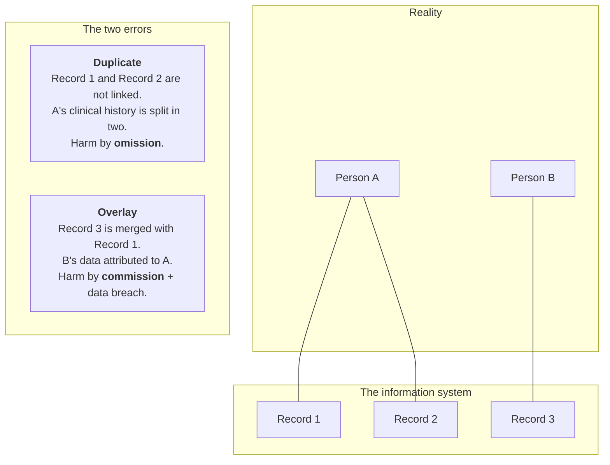
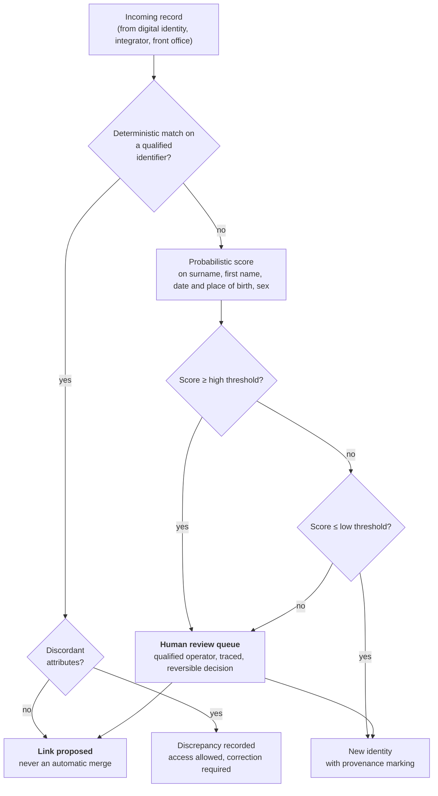
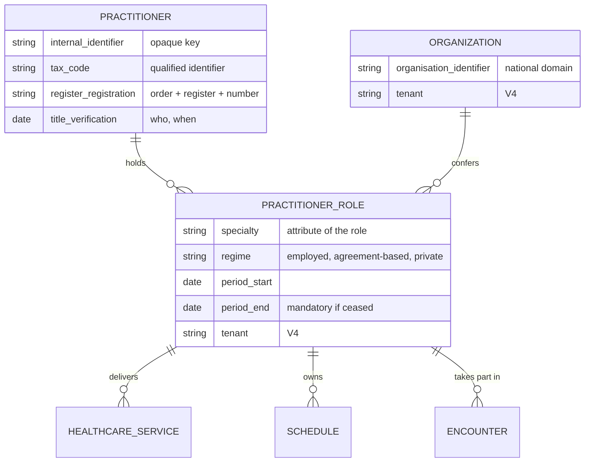
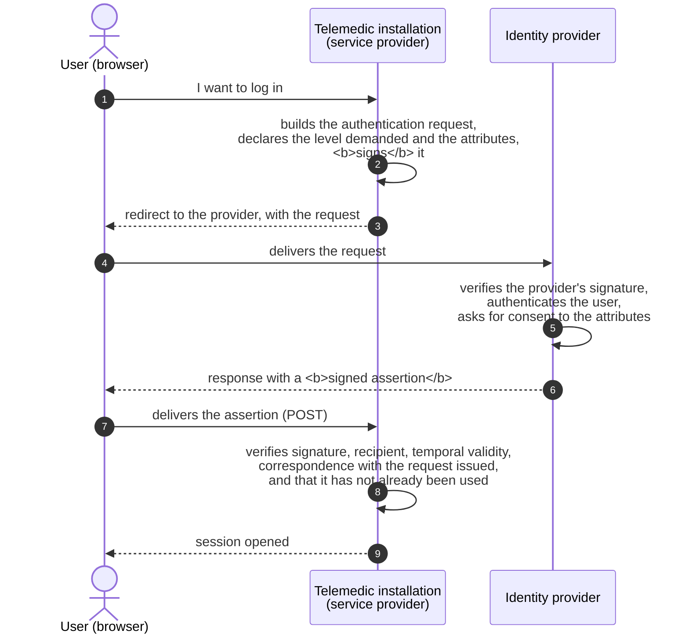
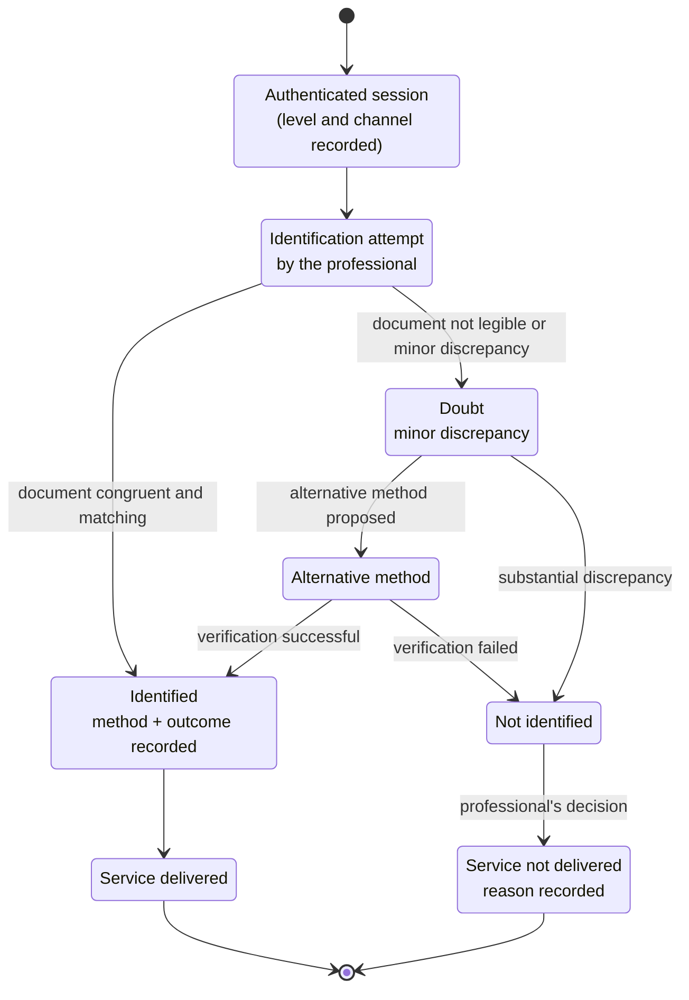
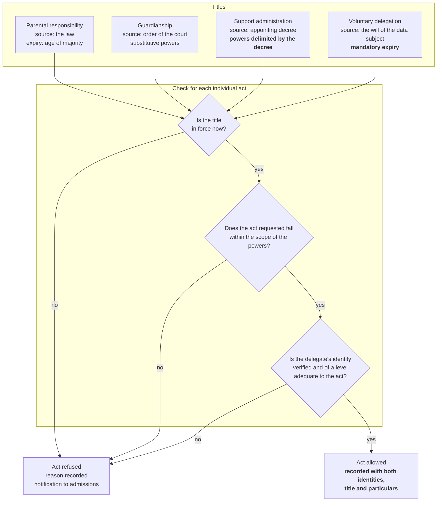

# Identity and demographic registries

A health information system does one thing before all others: **it attributes a piece of
clinical information to a person**. Everything else - the video call, the report, the alarm
threshold, the health record - rests on that attribution. If the attribution is wrong, the
rest is not degraded: it is dangerous.

This module deals with the most underestimated problem in the domain. It is underestimated
because it looks solved: «there is the tax code, let's use that as the primary key». It is a
sentence one hears in almost every Italian health project meeting, and it is wrong for at
least eight distinct reasons, each of which manifests itself as a different production
defect. We shall see them all.

The module covers four questions, in this order:

1. **Who the patient is**, and how this answer is written into an identifier (§§ 1–4);
2. **Who the professional is**, and why the right question is not «who are they» but «in what
   capacity are they operating right now» (§ 5);
3. **How you demonstrate** that whoever knocked really is that person: digital identity,
   levels of assurance, protocols (§§ 6–8);
4. **What to do when the person does not answer for themselves**: identification at a distance
   during a service, delegation, legal representation (§§ 9–10). It closes with a section on
   the **costs and design consequences that fall on the deployer** (§ 11).

> **Relationship with the other modules.** Module
> [07](07-fse-e-infrastrutture-nazionali.md), § 8, contains an **operational summary** of
> digital identity, sufficient to understand how one gets into the electronic health record.
> Here we develop it: profiles, levels, attributes, protocols, costs, risks. Module
> [02](02-prestazioni-di-telemedicina.md), § 10.2, states the distinction between
> identification and authentication in three lines: § 9 of this module turns it into a model.
> Module [01](01-sistema-sanitario-italiano.md), § 5, describes the health professions: § 5 of
> this module derives the data model from them. The protocol detail of SAML, OpenID Connect
> and TLS with client authentication is in module [13](13-protocolli.md); here only as much is
> given as is needed to understand why the choices are what they are.

> **Reading convention.** `[NV]` means «not verified or not publicly available as at the date
> of writing». § 12 collects all the points so marked, with an indication of where the missing
> information should be requested. When a statement is a **project proposal** and not a
> regulatory prescription, it is said explicitly: the difference between «the rules establish»,
> «it is common practice» and «the project proposes» is the backbone of this module.

---

## 1. The problem of identity in healthcare

### 1.1 Why the same person exists many times over

Imagine a seventy-four-year-old woman, resident in one Region, admitted for three days in
another during a holiday, followed by her own general practitioner, cared for by a territorial
diabetes centre, a customer of a private polyclinic for physiotherapy and enrolled in a
cardiological remote monitoring programme.

How many times does she exist, as a record, in the information systems that concern her? At
least:

| System | Identifier by which she is known |
|---|---|
| Resident population registry | demographic data + tax code |
| The registry of people entitled to care in her Region | tax code + regional registration number |
| Clinical record of the hospital where she was admitted | nosological number of the episode + local patient identifier |
| System of the diabetes centre | internal identifier, perhaps also a historical paper record number |
| Management system of the private polyclinic | internal identifier, often with the demographic data retyped by hand |
| Remote monitoring platform | internal identifier, plus the device identifier |
| Electronic health record | tax code as the key, metadata index held at the Region of entitlement |

Seven representations of the same person, produced at different moments, by different
operators, under different validation rules. None of them is «the» person: they are seven
**projections**, each correct in its own context and each potentially divergent from the
others. The surname written with an apostrophe in one system and without in another; the date
of birth correct in one and transcribed with two digits inverted in another; the domicile
up to date in one and ten years out of date in the other.

This multiplicity **is not a defect to be eliminated**. It is a structural property of a
federated healthcare system in which care is delivered by thousands of distinct legal
entities, each of them a data controller for its own part (module
[07](07-fse-e-infrastrutture-nazionali.md), § 2.2). Whoever designs health software must start
from the assumption that **the person's identity is distributed and not reconciled**, and
design to live with that condition, not to abolish it.

Hence the module's first operational rule, which is also an explicit constraint of the project
(project context, § 6.2.3): **Telemedic works by reference and does not become the principal
demographic registry.** It does not own the person's identity: it receives it, verifies it and
links it.

### 1.2 The two symmetrical errors

When two representations of the same person meet a system that has to decide whether they are
the same person, the possible errors are exactly two, and they are symmetrical.

**Duplicate error - two records, one person.** The system does not recognise that the two
records refer to the same individual. It is the statistically more frequent error: it arises
from a transcription error, from a change of surname, from one tax code typed in place of
another, from an emergency admission in which the identity was not available.

The clinical consequences are **of omission**: the doctor does not see the ongoing therapy,
does not see the documented allergy, does not see the test done the week before and repeats
it. The fragmentation of the clinical history is the harm, and it is silent harm - nobody
reports an incident because «a piece of information I did not know existed was missing».

**Overlay error - one record, two people.** The system attributes to a single record clinical
data belonging to two distinct individuals. It arises from homocody (§ 2.2), from a badly
calculated tax code that coincides with someone else's, from a hasty manual merge, from an
identifier reused after a person ceased to be entitled to care.

The clinical consequences are **of commission**: the doctor sees an allergy that the patient in
front of them does not have, or does not see the one they do have; sees a blood group that is
not theirs; sees a cancer diagnosis belonging to another person. And legal harm is added to
this: two distinct data subjects with reciprocal access to each other's health data, that is, a
breach of special category personal data consummated at each consultation.



The two errors **are not equivalent and do not offset each other**. A reconciliation system has
a threshold: lowering it reduces duplicates and increases overlays, raising it does the
opposite. There is no threshold that eliminates both. The choice of threshold is therefore a
**clinical risk decision**, not a configuration parameter, and it must be taken as such:
reasoned, documented, reassessed.

Hence a second rule of the project, declared as a **project proposal** and not as a regulatory
prescription: **the automatic merging of two patient records is not permitted.** The system may
propose a match, calculate a score for it, show it to a qualified operator; the decision is a
person's, is recorded with the name of whoever took it, and is reversible. An irreversible
merge performed automatically is, in risk management terms, a device taking a clinical decision
without supervision.

### 1.3 Why a wrong merge is an adverse event and not a data defect

This is the part that those arriving from computing tend to reject, and it is the part that
matters most.

In current engineering culture a duplicate record is a **data quality problem**: it is measured
as a percentage, assigned to a backlog, resolved with a deduplication job. In healthcare the
same condition has a different qualification, and the difference is not rhetorical.

Module [10](10-percorsi-di-cura-e-sicurezza.md) deals with clinical risk at length; here three
steps need to be fixed.

**First.** Software that takes part in care falls under the medical device regime. Risk
management is conducted in accordance with **ISO 14971**, which does not ask «how often does it
happen» but **«what harm does it produce to a patient and with what probability»**. An identity
error is a **hazard** in the technical sense of the standard: a potential source of harm. It
must be analysed, assigned an estimate of severity and probability, associated with risk
controls, and the controls must be verified.

**Second.** The severity of a demographic overlay is not «medium». It is the severity of the
therapeutic error that may follow from it, that is, potentially **catastrophic**: a transfusion
with the wrong blood group, an administration to an allergic patient, an operation on the wrong
side of the body. The standard assesses the possible harm, not the average harm.

**Third.** From this follows a consequence for the development process, not only for the
product: the search, linking and merging functions of the demographic registry are
**safety-related functions** within the meaning of **IEC 62366-1** (usability engineering). They
must be designed to prevent use error, not only to be efficient. An interface that allows two
patients to be merged with a double click without differentiated confirmation, without showing
the divergent data and without recording the identity of whoever decides, is **non-compliant** -
not «improvable».

Summarised in a sentence worth remembering: **the demographic registry is not a support module,
it is a safety-critical component.** In the project's risk management plan, identity
reconciliation and record merging sit next to the verification of the session's cryptographic
keys, not next to CSV export.

### 1.4 The precise vocabulary: six words that are not synonyms

Much of the confusion in this domain arises from the interchangeable use of words that mean
different things. Let us fix them, because the whole module uses them in a strict sense.

| Term | Operational definition | Example |
|---|---|---|
| **Entity** | The real person. It does not sit inside the system. | The woman in § 1.1 |
| **Identity** | The set of information with which a domain represents the entity. An entity has as many identities as there are domains. | «Patient no. 4417 of ASL X» |
| **Identifier** | A value that, **inside a declared domain**, singles out an identity. | `RSSMRA80A01H501Z` |
| **Assigning authority** | The party that assigns the identifiers and guarantees uniqueness within its own namespace. Without it the identifier is a string. | The revenue agency, for the tax code |
| **Attribute** | Information about an identity that does not serve to single it out but to describe it. | Date of birth, domicile, contact details |
| **Authentication** | The proof that whoever presents themselves controls the credential associated with an identity. | Logging in with digital identity |
| **Identification** *(in the clinical sense)* | The ascertainment that the person physically present - or present at the other end of the video - is the expected person. | The doctor who looks at the document on a video call (§ 9) |

The last two are the most confused, and the confusion has serious operational consequences:
§ 9 deals with them at length.

### 1.5 The five properties of an identifier, and why none has them all

Before looking at the Italian identifiers it is worth knowing **what to look for**. An
identifier may, or may not, have five independent properties.

| Property | Question it answers | If it is missing |
|---|---|---|
| **Uniqueness** | Can two different people have the same value? | Overlay (§ 1.2) |
| **Stability** | Does the value stay the same for the person's whole life? | Duplicate at the moment of the change |
| **Universality** | Does every person to be cared for have one? | Populations that cannot be represented |
| **Verifiability** | Can the value be checked without querying the issuing body? | Silent typing errors |
| **Confidentiality** | Is the value secret, that is, can it serve as proof of identity? | Improper use as an authentication factor |

Let us anticipate the result of § 2, because it is the central thesis: **none of the identifiers
used in healthcare in Italy possesses all five properties, and the tax code - the one everyone
relies on - is missing at least three.**

---

## 2. The patient's identifiers in Italy

### 2.1 The tax code: how it is constructed

The **codice fiscale** (tax code) was established by **D.P.R. 29 settembre 1973, n. 605**
(«Provisions relating to the tax registry and to the tax code of taxpayers»), which at art. 6
prescribes that it be stated in acts and documents. The rules for its formation are set by
**D.M. Ministero delle finanze 23 dicembre 1976** («Coding systems for persons to be entered in
the tax registry»). It is assigned by the **Agenzia delle entrate** (the revenue agency), which
runs the tax registry.

The first point surprises those who work in healthcare: **the tax code is not a health
identifier.** It is a **fiscal** identifier, born for the tax registry, which Italian healthcare
adopted out of convenience and which today is in practice the correlation key across all
national health systems. The adoption is entrenched and in many cases imposed by sectoral rules
- Annex 1 to **DM 19 novembre 2025** provides for it as the patient identifier in the
information set of the remote consultation (televisita) report - but it remains an adoption, not an original intended
purpose. The anomalies we shall see derive almost entirely from this misalignment.

For a natural person the code is made up of **sixteen alphanumeric characters**, structured as
follows:

| Positions | Content | Rule |
|---|---|---|
| 1–3 | Surname | The first three consonants in the order in which they appear; if there are fewer than three consonants the vowels are added in order; if there are fewer than three characters it is completed with the letter `X` |
| 4–6 | First name | If the name has **four or more consonants** the **first, third and fourth** are taken; otherwise the same rule as for the surname applies |
| 7–8 | Year of birth | The last two digits |
| 9 | Month of birth | A letter according to the table `A B C D E H L M P R S T` for the months from January to December |
| 10–11 | Day of birth and sex | The day of the month for males; **the day of the month increased by 40** for females |
| 12–15 | Place of birth | The **cadastral code** of the Italian municipality (one letter and three digits, the so-called «Belfiore code»); for those born abroad, a code beginning with `Z` followed by the code of the country |
| 16 | Check character | Calculated on the preceding fifteen characters with two distinct conversion tables for odd and even positions, summing the values and reducing the total modulo 26 |

Three observations with direct consequences for the code you will write.

**The tax code is calculable.** Anyone who knows surname, first name, date and municipality of
birth and sex can calculate it. This is the property that makes it convenient - and that strips
it of any value as a secret (§ 3.4).

**The tax code encodes personal data in clear.** It contains the date of birth, the sex and the
place of birth. It is not a pseudonym and it does not become one by removing the name: a tax
code in an «anonymised» dataset makes the dataset identifiable. Module
[03](03-il-dato-clinico.md), § 4, explains why this rules out treating it as pseudonymised data.

**The check character catches some of the errors, not all.** It detects the majority of
single-character errors and of transpositions of adjacent characters, but **it does not detect a
syntactically valid tax code belonging to another person**. Validating the checksum is necessary
and insufficient: it is the difference between «this string is well formed» and «this string
singles out the person in front of me».

### 2.2 Homocody: when two people are entitled to the same code

The tax code is a function of surname, first name, date of birth, sex and municipality of birth.
Nothing prevents two different people from having the same values for all five variables: two
namesakes born on the same day in the same municipality. This is the phenomenon of
**omocodia** (homocody), and it is not as rare as it seems - it is common among people born
abroad, where the code for the place of birth is that of the **country** and not of the
municipality, drastically reducing the space of distinct values.

The solution adopted by D.M. 23 dicembre 1976 is a **progressive substitution of digits with
letters**. Starting from the rightmost of the seven numeric digits in the code (the positions
corresponding to the year, the day and the municipality code), each digit is replaced with the
corresponding letter according to the table:

```
0 → L    1 → M    2 → N    3 → P    4 → Q
5 → R    6 → S    7 → T    8 → U    9 → V
```

The check character is then recalculated on the code so modified. If the resulting code turns
out to be already assigned as well, the next digit is substituted, and so on.

**The consequences for whoever writes the validator are four, and each is a defect if
ignored:**

1. **A valid tax code may contain letters in the positions that «should» be numeric.** A regular
   expression that insists on digits in positions 7-8, 10-11 and 13-15 **will reject legitimate
   tax codes**. It is by far the commonest error, and it systematically affects people born
   abroad: that is, it produces an accessibility defect with a discriminatory effect, not an
   annoyance.
2. **You cannot extract the date of birth from the tax code without first undoing the
   substitutions.** A system that reads «the day of birth» from positions 10-11 of a homocodic
   code reads a letter.
3. **You cannot use the tax code to infer sex** reliably, for the same reason. And, regardless
   of homocody, you must not do so: the code records the sex assigned at birth, which may
   coincide neither with the person's gender nor with their current registered sex (§ 2.3).
4. **The correct code and the homocodic one coexist.** The person may present documents bearing
   one or the other, and in some historical archives both appear. The system must be able to
   record **several identifiers of the same type for the same person**, with one marked as
   current.

### 2.3 The pathological cases: when the tax code changes, is missing or is provisional

The implicit assumption «one person, one tax code, for ever» is false in at least six ways.

**The newborn.** At birth the tax code is assigned by the municipal registry at the same time as
registration, but there is a window - hours or days - in which the newborn exists clinically and
does not yet have a national identifier. It is exactly the window in which the most critical
clinical events are concentrated. In that window the newborn is identified with a **provisional
identifier of the provider**, often built on the mother's surname. The system must be able to
cope with a patient without a tax code and must be able to **replace** the provisional
identifier when the definitive one arrives, without losing the clinical data produced in the
meantime.

**Rectification.** A tax code assigned on the basis of erroneous data - wrong date of birth,
surname badly transcribed at the moment of registration - is **rectified** by the revenue
agency. The old code is not annulled by reality: it continues to appear in documents already
produced, in prescriptions already issued, in reports already filed.

**Change of first name or surname.** A change by administrative decision, recognition, adoption,
marriage in legal systems that provide for it. Since the tax code is a function of the surname,
a change of surname entails a new tax code.

**Rectification of sex assignment.** Governed by **legge 14 aprile 1982, n. 164**, it entails a
modification of the registry data and therefore a new tax code, with a change in positions
10-11. This case deserves an explicit design note: the link between the old and the new code is
**extremely sensitive** information, whose exposure in an interface or in a log may constitute
an unintended revelation of information relating to the person's private life. The project
adopts as a **product rule** that the history of identifiers must never be exposed in ordinary
clinical interfaces, but only in the registry administration functions, traced and with
restricted access.

**The foreign national without a tax code.** A person present on the territory without
registration in the tax registry has no tax code. It is not an edge case: it is the condition of
millions of annual transits and of a part of the population cared for on the basis of urgent or
essential care (§ 2.4).

**Death.** The tax code is not reassigned, but the registry position is closed. A system that
assumes «valid tax code ⇒ person entitled to care» produces errors at the boundary (§ 4.5).

### 2.4 STP and ENI: the identifiers of non-registered populations

Two codes that exist precisely because the tax code is not universal. They are concrete proof
that the property of **universality** is missing.

**STP - Straniero Temporaneamente Presente** (foreign national temporarily present). The legal
basis for care is **art. 35 of d.lgs. 25 luglio 1998, n. 286** (the consolidated act on
immigration), which guarantees to foreign nationals not compliant with the rules on entry and
residence **urgent or in any case essential outpatient and hospital care, even if continuing**,
as well as preventive medicine interventions. The STP code is the operational instrument by
which care is delivered and reported for reimbursement while keeping the person unreportable to
the authorities: **it is a code of entitlement to care, not an identity document**.

**ENI - Europeo Non Iscritto** (non-registered European). It concerns citizens of European Union
Member States present in Italy who lack the requirements for registration with the National
Health Service and who lack cover from their own State. The ENI code has the same operational
function as the STP code for a different population.

Both are **sixteen-character** codes, so that they can travel through record layouts built on
the tax code format. The documented composition is of the type `STP` (or `ENI`) followed by a
code of the organisation or health authority that assigns it and by a sequential number. **The
exact composition, the number of digits reserved for each field and the assignment rules have
not been verified against a primary source in this drafting.** `[NV]`

What must, by contrast, be said without hesitation, because it is the point that matters for
the data model:

1. **STP and ENI are assigned locally**, by the health authority or the organisation, not by a
   national body. Their assigning authority is therefore **the issuing body**, and two identical
   codes issued by two different authorities **are different identifiers**. Treating them as a
   national key is a modelling error that produces overlays.
2. **They have a temporal validity** (typically six months, renewable), unlike the tax code.
3. **The same person may accumulate more than one** over time and in different places, with no
   national reconciliation mechanism in existence.
4. **The same person may move from STP to a tax code** when they regularise their position: the
   clinical history produced under STP must be linked, not abandoned.

The information set of the remote consultation report, at Annex 1 of **DM 19 novembre 2025**, expressly
provides for the tax code **or** the STP code or the ENI code as the patient identifier. It is
therefore not a residual case to be handled «if there is time left»: it is provided for by the
legislation in the principal document of the domain.

### 2.5 The health card and the EHIC

The **tessera sanitaria** (national health card) is established by **art. 50 of D.L. 30
settembre 2003, n. 269**, converted with amendments by **L. 24 novembre 2003, n. 326** - the
same provision that establishes the infrastructure of the Sistema Tessera Sanitaria on which the
INI is built (module [07](07-fse-e-infrastrutture-nazionali.md), § 3.1). It is issued by the
Ministry of Economy and Finance and delivered to the patient.

What it contains, and what it is **not**:

- it carries the **tax code**, in clear and as a barcode. **It does not introduce a new
  identifier**: it is a physical medium that exposes an existing identifier. A search «by health
  card» is, in reality, a search by tax code;
- it has an **expiry date**, typically tied to the duration of entitlement to care. Expiry of the
  card does **not** imply cessation of entitlement to care nor loss of the tax code: it is the
  expiry of the medium;
- on the back it carries the **TEAM - Tessera europea di assicurazione malattia** (the European
  Health Insurance Card, EHIC), governed by **Regulations (EC) No 883/2004 and No 987/2009** on
  the coordination of social security systems. The EHIC has **its own identification number**,
  distinct from the tax code, and it is what makes care in another Member State possible. In the
  Italian FHIR profiles it is an identifier in its own right, with its own system (§ 3.2);
- in the **TS-CNS** version it contains a **microchip** with the certificates of the Carta
  Nazionale dei Servizi (the national services card), which is what makes it an instrument of
  authentication and not only of visual identification (§ 6.4). The CNS is governed by **D.P.R.
  2 marzo 2004, n. 117**.

The distinction between the «health card» as a medium and «TS-CNS» as an authentication
instrument is the one that generates most misunderstandings in functional specifications.
**Reading the card with a barcode scanner is not authenticating anybody**: it is typing more
quickly a tax code that anyone can calculate. Authenticating means using the microchip and the
PIN.

### 2.6 Regional identifiers and the ANA code

Every Region maintains its own **registry of people entitled to care** and assigns its own
identification number. It arises from operational needs predating the generalisation of the tax
code and survives because it is the internal key of the regional systems: exemptions, choice and
revocation of the doctor, reimbursement reporting flows.

At national level the **Anagrafe nazionale degli assistiti (ANA, national registry of people
entitled to care)** is provided for by **art. 62-*ter* of the Codice dell'amministrazione
digitale** (the Italian Digital Administration Code, d.lgs. 7 marzo 2005, n. 82) and is the
source from which the electronic health record draws the patient's identifying and
administrative data. In the Italian FHIR profiles there is a dedicated identifier - the
`codiceANA` *slice* - with system `urn:oid:2.16.840.1.113883.2.9.4.3.15` **[V]**.

The properties to bear in mind:

- **the regional number is not nationally unique**: two Regions may assign the same number to
  different people. The assigning authority is the Region, and it must be represented;
- **it changes when residence is transferred**: a person moving from one Region to another ceases
  in one registry and is born in the other, with a new number;
- **it is the key with which the regional systems talk to each other**, so ignoring it means
  losing the ability to correlate with the environment in which the installation operates.

The distinction between the **Region of entitlement (RdA)** and the **Region of delivery (RdE)**
- dealt with in module [07](07-fse-e-infrastrutture-nazionali.md), § 3.1 - is the reason why the
regional identifiers cannot be reduced to one: the person is entitled to care in one Region and
treated in another, and the document produced must carry both pieces of information.

### 2.7 The provider's internal identifier

It is the number that the individual system assigns to its own patient: the record number, the
patient code in the management system, the surrogate key of the database.

It is the identifier with the **best technical properties** - unique inside its own system,
stable by construction, always present - and with the **worst semantic property**: it means
nothing outside the system that generated it. Two systems with the same patient number are not
talking about the same person.

The project's constraint (context, § 6.2.3) requires **working by reference**: when a
third-party health management system invokes Telemedic, the identifier it brings with it is its
own, and Telemedic keeps it **as an additional identifier qualified by its own domain**, not as
a primary key of its own. It is the only way subsequently to return the clinical content to the
originating system without ambiguity.

### 2.8 Summary picture

| Identifier | Who assigns it | What it really identifies | When it changes | When it is missing | Nationally unique? |
|---|---|---|---|---|---|
| **Tax code** | Revenue agency | The person's position in the **tax** registry | Rectification, change of surname, rectification of sex | Newborn in the first hours, non-registered foreign national, person not identified in an emergency | **Yes**, save for homocody resolved by substitution |
| **Homocodic code** | Revenue agency | The same position, in an alternative form | It coexists with the base code | - | Yes |
| **STP code** | Health authority or organisation | The **entitlement to urgent or essential care** of a foreign national not compliant with the rules | On expiry (renewal), on regularisation | If the person has not yet requested one | **No**: local domain, temporal validity |
| **ENI code** | Health authority or organisation | The same, for non-registered EU citizens | Ditto | Ditto | **No** |
| **Health card** | Ministry of Economy and Finance | The physical medium that exposes the tax code | At every reissue; it has its own expiry | Card expired, lost, never received | It is not an autonomous identifier |
| **EHIC number** | Ministry of Economy and Finance / insurance body | The entitlement to care in another Member State | On reissue | For those without entitlement to EU care | Yes within its own domain |
| **Regional registration number / ANA code** | Region / national registry of people entitled to care | The **registration with the health service** of that Region | Transfer of residence, cessation | Outside the Region, non-registered | **No** for the regional number |
| **Provider's internal identifier** | The individual system | The record of that system | Never, by construction | Never, by construction | **No** |

### 2.9 Why none of these is a reliable primary key

Recomposing the picture with the grid of § 1.5:

| Identifier | Unique | Stable | Universal | Verifiable | Confidential |
|---|---|---|---|---|---|
| Tax code | almost | **no** | **no** | yes (checksum) | **no** |
| STP / ENI | **no** | **no** | **no** | **no** | **no** |
| Regional number | **no** | **no** | **no** | **no** | **no** |
| Internal identifier | yes | yes | yes (in the domain) | yes | **no** |

From which the modelling rules the project adopts as a **project proposal**, consistent with the
tenant-awareness constraint declared in the context (V4):

1. **The patient's primary key is an opaque internal identifier**, without meaning, generated by
   the system. It is not the tax code, it is not a readable sequential number, it contains no
   information about the person.
2. **All external identifiers are multiple attributes** of the same entity, each with a
   **system**, a **value**, a **period of validity**, a **status** (current, superseded,
   contested) and an **origin** (who communicated it and when).
3. **Uniqueness is constrained on the pair system + value, per tenant**, never on the value
   alone.
4. **Searching is by qualified identifier**, never by bare value. Searching for
   `RSSMRA80A01H501Z` without saying in which namespace is a badly posed question, and it
   produces badly posed answers.
5. **No correlation between tenants**: two tenants that contain the same person must not be able
   to infer that from one another. It is an isolation requirement, and it follows from the fact
   that the two data controllers are distinct parties.

---

## 3. The tax code in information systems

### 3.1 An identifier without an assigning authority is a string

This section starts from a statement that seems pedantic and that is in fact the source of a
whole class of integration defects.

Consider the value `RSSMRA80A01H501Z`. Taken on its own, it is not an identifier: it is a
sequence of sixteen characters. It becomes an identifier only when it is accompanied by an
indication **of who assigned it and in which namespace it is unique**. The same is true, even
more obviously, of `4417`: inside the registry of a certain health authority it singles out a
person, outside it singles out nothing.

Healthcare interoperability standards have taken up the principle for decades. In the HL7
version 2 model the patient identifier in field `PID-3` is composite and carries the assigning
authority with it. In **FHIR** - the standard on which the project's data model rests, dealt
with in module [06](06-fhir-da-zero.md) - the `Identifier` type has exactly this structure:

```json
{
  "system": "http://hl7.it/sid/codiceFiscale",
  "value": "RSSMRA80A01H501Z"
}
```

`system` is a URI that **names the assigning authority**. It is not an address to be contacted:
it is a name. Nobody makes an HTTP request to `http://hl7.it/sid/codiceFiscale`; that URI means
«the value that follows is a tax code assigned by the Italian financial administration». Module
[05](05-standard-di-interoperabilita.md) explains why the standards use URIs as names and not as
addresses.

**The practical consequence.** Two systems exchanging identifiers must agree not only on the
format of the value, but on **the exact string that names the domain**. If the producer writes
one URI and the consumer looks for another, the search does not fail with an error: **it returns
zero results**, and the system concludes that the person does not exist. It is the worst possible
failure - silent, plausible, and in the health domain meaning the duplication of the demographic
record of a patient the system already knew.

### 3.2 The verified trap: two URIs for the same tax code

And here comes the concrete fact, verified against a primary source, that anyone implementing
must know before writing the first line.

**The FHIR implementation guides published by HL7 Italia do not all use the same URI for the tax
code.**

| Implementation guide | Version | URI used for the tax code |
|---|---|---|
| **IT Base** (profile `Patient-it-base`) | 0.1.0 | `http://hl7.it/sid/codiceFiscale` |
| **Televisita** (profile `PatientTelevisita`) | 0.2.0 | `http://hl7.it/sid/codiceFiscale` |
| **IT-Core** (profile `patient-it-core`) | 0.2.0 | `http://hl7.it/fhir/itcore/CodeSystem/cs-codicefiscale` |

**[V]** - verified against the published profiles.

They are two different strings. For a system that compares identifiers - and every system does,
because that is how identifier search works - **they are two distinct assigning authorities**. A
`Patient` produced according to the *Televisita* family and searched for by a consumer aligned to
*IT-Core* is not found. There is no error message, there is no validation that fails: the profile
is valid, the value is correct, the patient appears not to exist.

**The project's operational recommendation**, which is a reasoned design choice and not a
regulatory prescription:

1. **The canonical URI to write is `http://hl7.it/sid/codiceFiscale`**, because the project
   declares conformity to the *Televisita* family (project context, D13) and that URI is the one
   used both by *IT Base* and by *Televisita*.
2. **On output the second identifier is also written**, with the *IT-Core* URI, as a further
   element of the list of identifiers. It is permissible: the resource admits several
   identifiers and the *slicing* of the profiles is open. It costs nothing and makes the resource
   readable by both families of consumers.
3. **On input both are accepted**, normalised internally onto a single canonical internal
   identifier. Normalisation happens at the boundary of the system, in an adaptation layer, and
   **not** inside the domain model: it is the same discipline the project applies to every
   external format.
4. **The table of admitted URIs is a versioned artefact**, with a test that verifies its
   completeness. It is not a constant scattered through the code.

Module [06](06-fhir-da-zero.md) deals with the divergence from the point of view of the FHIR
profile and shows the complete fragment; here what matters is the general principle to be drawn
from it:

> **An identifier needs an assigning authority, and the assigning authority is itself a datum
> that may diverge between two authoritative sources.** It is not enough to agree «let's use the
> tax code»: one must agree on the exact string with which it is named, and write it into the
> interface profile.

The patient's other identifiers have, in the Italian profiles, their own dedicated systems. The
verified values are:

| Identifier | System in the Italian profiles |
|---|---|
| Tax code (Televisita / IT Base family) | `http://hl7.it/sid/codiceFiscale` **[V]** |
| Tax code (IT-Core) | `http://hl7.it/fhir/itcore/CodeSystem/cs-codicefiscale` **[V]** |
| ANPR identifier | `http://hl7.it/sid/anpr` **[V]** |
| ANA code | `urn:oid:2.16.840.1.113883.2.9.4.3.15` **[V]** |
| EHIC number | `urn:oid:2.16.840.1.113883.2.9.4.3.7` **[V]** |
| STP code, ENI code, regional identifier | system bound by a dedicated value set **[V]**, whose specific values have not been transcribed in this drafting `[NV]` |

### 3.3 A second layer: the identifier type

Besides the system, the standards provide for a **type code** for the identifier, taken from a
shared table. It is the information that says «this is a national identifier of the person» in a
country-independent way.

The verified point, useful because it refutes a claim in circulation: **the code `NN`, on its
own, does not exist** in the HL7 table of *identifier types*. The concept actually present is
`NNxxx`, where `xxx` is to be replaced with the three-character alphabetic ISO 3166 code of the
country. For Italy the value correct by construction is therefore **`NNITA`**, which however
**is not enumerated** as a concept: it is a value generated by the formation rule. **[V]**

And above all: **no published Italian profile fixes which type code to use for the tax code.**
The IT-Core value set includes the entire table without selecting one. The choice therefore
remains **contractual with the integrator**: it must be written into the interface profile, not
inferred.

### 3.4 The tax code is not a secret, and it is not a password

This must be said explicitly because the error is frequent and its consequences are serious.

The tax code is **calculable** from data that are not confidential (§ 2.1), **printed** on a
document that the person exhibits continuously, **present** on every prescription, on every
health invoice, on every form. It has the property of confidentiality in no sense whatsoever.

Three prohibitions follow, which the project adopts as **product rules**:

1. **The tax code may not be an authentication factor**, neither on its own nor in combination
   with other equally public data (date of birth, surname). A login path of «enter your tax code
   and date of birth» is a path without authentication.
2. **The tax code may not be the sole element of a deep link.** A link to a remote consultation room
   containing the tax code in the address is at once guessable and a disclosure of personal data
   in the server histories and in the referrer. The project uses opaque session identifiers,
   single-use and short-lived.
3. **The tax code is not a pseudonym.** Replacing first name and surname with the tax code
   pseudonymises nothing: the tax code is a direct identifier. Module
   [03](03-il-dato-clinico.md), § 4, deals with the distinction between pseudonymisation and
   anonymisation; § 4.6 of this module shows its consequences for the identity model.

There is then an explicit constraint that follows from the legislation on digital identity: in
the context of the national telemedicine platform, at the moment of authentication «*only the
tax code, the first name and the surname are acquired*» (**DM 19 novembre 2025**, Annex 4). The
tax code is therefore **the correlation datum between digital identity and the health
registry**: it is the bridge, and its quality determines the quality of the bridge. But being the
bridge does not make it a credential.

---

## 4. The demographic registries

### 4.1 The three registries that matter, and what each contains

Up to here we have talked about identifiers. A registry is the thing that assigns and maintains
them: a register of people with their attributes, with a controller, a legal basis and an update
cycle.

**ANPR - Anagrafe nazionale della popolazione residente** (national registry of the resident
population). Provided for by **art. 62 of the Codice dell'amministrazione digitale** (d.lgs.
82/2005) and governed by **D.P.C.M. 10 novembre 2014, n. 194**, it takes over from the municipal
registries: it is the authoritative source of the demographic data of the population resident in
Italy - personal particulars, residence, civil status, citizenship, composition of the
registered household. It is the **civil** registry, not a health one: it knows nothing about the
person's chosen doctor nor about exemptions.

**ANA - Anagrafe nazionale degli assistiti** (national registry of people entitled to care).
Provided for by **art. 62-*ter* of the CAD**, it is the **health** registry: who is entitled to
care, from which Region, with which chosen doctor, with which exemptions. It is the source from
which the electronic health record draws the patient's identifying and administrative data.

**The authority-level and organisation-level registries.** Every health authority, every
hospital, every polyclinic, every management system has its own. They contain the person's data
**as they were collected at that point of contact**, often retyped, often more up to date than
the national registry on some fields (the telephone contact, the actual domicile) and much less
up to date on others (whether the person is alive, the residence).

| | ANPR | ANA | Organisation registry |
|---|---|---|---|
| **Legal basis** | art. 62 CAD; D.P.C.M. 194/2014 | art. 62-*ter* CAD | Controllership of the individual provider |
| **What it is authoritative about** | Personal particulars, residence, civil status, citizenship, death | Registration with the health service, Region of entitlement, chosen doctor, exemptions | Nothing, towards the outside |
| **Who updates it** | The municipalities | The Regions, feeding the national level | The provider's operators |
| **Typical update frequency at the consumer** | Deferred | Deferred | Immediate but local |
| **Characteristic risk** | It does not know those who are not resident | It does not know those who are not registered | Silent divergence from both |

**The point the designer must internalise**: none of the three is «the» registry. They are three
views with different authority over different fields. The right question is not «which is the
correct one», but **«for this field, which source is authoritative, with what delay, and what do
I do when they diverge»**.

### 4.2 Alignment: who wins when the data diverge

The project adopts as a **project proposal** a model of **precedence by field**, not precedence
by source. This means there is no source that wins on everything: there is, for each field, a
declared hierarchy.

| Field | Authoritative source | Notes |
|---|---|---|
| First name, surname, date and place of birth, registered sex | Resident population registry | For those not registered in it: the document exhibited, with the source recorded |
| Tax code | Tax registry, through the registries | With checksum validation and homocody handling (§ 2.2) |
| Whether alive | Resident population registry | § 4.5 |
| Registration with the health service, Region of entitlement, chosen doctor, exemptions | Registry of people entitled to care | § 4.5 |
| Actual domicile where the service takes place | **The patient, at every session** | § 4.4 |
| Telephone contact and email address | The datum collected by the provider, confirmed by the patient | It cannot be obtained from digital identities with the minimum attribute set (§ 6.3) |
| Internal identifier of the originating system | The originating system | Never rewritten by Telemedic |

Three rules that make the model operational:

1. **Every value carries its own provenance.** It is not enough to store «surname = Rossi»: it
   must be stored that that value comes from a certain source, on a certain date, with a certain
   degree of certification. The Italian profiles provide for this purpose a data certification
   extension on the identifier, which declares **who** certified it and **when**.
2. **Overwriting is an event, not a silent update.** When an authoritative source modifies a
   value that the provider had collected differently, the fact is recorded: previous value, new
   value, source, instant.
3. **A divergent datum on an identifying field blocks, it does not correct.** If the surname
   coming from the digital identity does not coincide with that of the local registry record
   associated with that tax code, the system does **not** rewrite the registry: it flags a
   discrepancy to be resolved. Automatic rewriting on a discrepancy is the mechanism by which an
   error propagates silently to all downstream systems.

### 4.3 Reconciliation: how one decides that two records are the same person

It is the problem called *record linkage* in the literature and which in health systems takes
the name of **master patient index**. It is worth understanding its mechanics, because it is the
part where the defects described in § 1.2 are concentrated.

There are two families of technique.

**Deterministic matching.** A rule is declared: «two records are the same person if they have the
same tax code». It is exact, verifiable, explainable and has no thresholds. Its limit is that it
inherits all the defects of the identifier it rests on: if the tax code is missing (§ 2.3), the
rule does not apply; if it is mistyped, the rule says «different people»; if there is unresolved
homocody, it says «same person» and is wrong.

**Probabilistic matching.** Several attributes are compared - surname, first name, date of birth,
place of birth, sex, address - assigning each a weight according to how discriminating it is, and
a similarity score is summed using comparisons tolerant of transcription errors. If the score
exceeds a high threshold, the records are considered the same person; if it falls below a low
threshold, different people; if it is in between, **the case goes to a human being**.



The choices the project adopts as **project proposals**, each with its reason:

- **No automatic merge, in any case.** Even a perfect deterministic match produces a proposed
  *link*, not a merge of the records. A link is a reversible assertion; a merge is not.
- **The link is a domain object with a history.** Who created it, when, on the basis of what
  evidence, who may have dissolved it. It is needed to answer the question «why do these two
  records turn out to be the same person», which is the first question asked when something goes
  wrong.
- **Dissolving a link must be possible and must be clean.** An irreversible merge makes it
  impossible to repair the error in § 1.2: the two people's clinical data remain mixed for ever.
  The project therefore preserves the original belonging of every clinical datum to the record
  that generated it.
- **The threshold is configurable per installation and its value is declared in the risk
  management file**, with the reason for the choice. It is not a performance parameter.
- **The review queue has a declared maximum time.** A record awaiting reconciliation is a record
  on which the clinical history is potentially incomplete: if the queue is not staffed, the risk
  control does not exist.

### 4.4 Domicile is not residence

It deserves a paragraph of its own because in telemedicine it is a safety requirement, not an
administrative detail.

**Residence** is a registry datum from the resident population registry. The **actual domicile at
the time of the service** is where the person is while the remote consultation is in progress, and it may
be anywhere: a relative's house, a holiday location, a workplace, a car.

If during a remote consultation the patient has an acute event, the professional must be able to
tell the emergency services **where the person is now**. A residence address taken from the
registry is, at that moment, potentially useless and dangerously reassuring.

Hence a requirement the project adopts explicitly: **the address of the place where the session
takes place must be asked for and confirmed at the beginning of every session**, and recorded as
an attribute of the session, not as an update to the registry. They are two different data with
two different life cycles.

### 4.5 Supervening events: the events that invalidate what the system believed

A demographic registry is not a photograph: it is a stream of events. Four of these events have
consequences that data models get wrong with regularity.

**Death.** It is the event most often not modelled at all. Consequences:

- **future appointments must be suspended**, not silently carried out. An automatic remote consultation
  reminder delivered to the family of a deceased person is real harm;
- **the health record is not deleted immediately**: the index is deleted **thirty years from the
  date of death**, with an annual check (**DM 7 settembre 2023**, art. 10; cf. module
  [07](07-fse-e-infrastrutture-nazionali.md), § 2.6);
- **the data subject's rights change regime**: the rules on the rights relating to the data of
  deceased persons follow **art. 2-*terdecies* of d.lgs. 30 giugno 2003, n. 196**, which
  attributes them to whoever has an interest of their own, acts to protect the data subject or
  acts for family reasons deserving of protection;
- **active delegations lapse.** A delegation of access to the health record granted during life
  does not automatically survive death: § 10 deals with the point.

**Transfer of residence.** It changes the Region of entitlement, hence the regional registration
number, hence the chosen doctor, hence - in the health record - the location of the metadata
index: the INI **transfers the index to the index of the new Region of entitlement** (**DM 7
settembre 2023**, art. 24). A model that assumes the stability of the index location for the
patient's whole life is wrong by construction.

**Change of chosen doctor.** It happens by the patient's choice, by cessation of the doctor, by
transfer. It has a consequence for authorisation: the general practitioner's right of access to
the health record lasts **for the whole duration of the care relationship** (**DM 7 settembre
2023**, art. 15), and therefore **ceases** when the relationship ceases. If the system has stored
«this doctor may see this patient» as a persistent permission, it has created an access that
outlives the title that justified it.

**Reaching the age of majority.** It changes the regime of representation: the holder of parental
responsibility loses the title, the right of access to the child's data ceases and the young
person becomes the full holder of their own rights. It also entails, organisationally, the
transfer from the freely chosen paediatrician to the general practitioner (module
[01](01-sistema-sanitario-italiano.md), § 5.2). It is an event that the system must **generate by
itself**, on the basis of the date of birth, not wait for someone to communicate.

The general rule that follows, worth isolating because it covers all four cases:

> **No right of access to health data must be stored as a permission. It must be computed at the
> moment of access, starting from a title that has an expiry or a validity condition.** A
> permission is a state; a title is a fact with a duration. Permissions outlive the facts that
> justify them, and that is how undue access is born.

### 4.6 Pseudonymised identity and its limits

**Pseudonymisation** - art. 4(5) of **Regulation (EU) 2016/679** - is the processing of personal
data in such a way that it can no longer be attributed to a specific data subject without the
use of additional information, kept separately and subject to technical and organisational
measures. Module [03](03-il-dato-clinico.md), § 4, deals with it on the legal plane. What
matters here is what it means **for the identity model**.

**Where it appears, concretely, in our domain.**

- **In the health data ecosystem.** **DM 19 novembre 2025**, Annex 4, § 4, establishes that
  pseudonymisation is carried out **by the EDS**, «*in sequence, automatically, without human
  intervention and once every 24 hours*», and requires a check of the grouping rules so that no
  result can be traced back to a single individual (cardinality one). The telemedicine
  infrastructure does **not** pseudonymise: it feeds the health record, and the pseudonymised
  extraction happens downstream (module [07](07-fse-e-infrastrutture-nazionali.md), § 3.2).
- **In the opaque identifiers of digital identities.** The public digital identity system
  provides for an attribute that is an opaque identifier, stable per identity provider: it is not
  the tax code and cannot be derived from it. It is, technically, a pseudonym.

**The four limits that must be known before relying on it.**

**First - pseudonymised data remains personal data.** It is the point the Regulation states and
that almost all architectures suppress. Pseudonymising is a **security measure**, not an exit
from the scope of the Regulation. A pseudonymised archive has the same obligations as an
identified one, save that it can reduce the residual risk.

**Second - the uniqueness of the pseudonym is what makes it useful and what makes it
attackable.** A pseudonym that is stable over time allows the same person to be followed across
several events: it is exactly what is needed for analysis, and it is exactly what allows
re-identification by cross-referencing. A few dated and located observations are enough to narrow
the set of candidates to one.

**Third - a clinical datum is almost always identifying in itself.** A rare diagnosis, a
combination of date and organisation, a series of measurements: these are attributes with very
high discriminating power. Removing the name does not remove identifiability from a dataset
containing «male patient, 47 years old, rare disease X, admitted in a certain province in a
certain week».

**Fourth - the pseudonym is not a shareable identifier.** A pseudonym assigned by an identity
provider is unique **to that provider** and to that service provider. Two logins by the same
person with two different providers produce two different pseudonyms. It follows that **the
pseudonym cannot be the key by which the patient is recognised in the health system**: that role
is played by the tax code, with all its limits. The pseudonym serves to recognise that it is
**the same login as last time from the same channel**, not that it is **the same person the other
systems are talking about**.

**The project's position follows**, declared as a proposal and not as an obligation:

1. The core of the domain works on an **opaque internal key** (§ 2.9), which is already in itself
   an internal pseudonym: it contains no information about the person.
2. The national identifiers are linked attributes, protected and accessible only where needed.
3. The opaque identifiers received from digital identities are stored **as attributes of the
   authentication channel**, not as the person's identity.
4. **No feature of the project claims to produce anonymous data.** If an export is
   pseudonymised, the interface says so with that word, and the documentation declares that the
   result remains personal data.

---

## 5. The health professional's identity

### 5.1 Why it is a different problem from the patient's

For the patient the question is «who is this person». For the health professional the question is
twofold, and almost all data models answer only the first:

1. **Who is this person**, and are they entitled to practise that profession?
2. **In what capacity are they operating right now**: on behalf of which organisation, in which
   specialty, under which regime, on which patients?

The second question is not a refinement of the first. They are two independent facts, with two
different authoritative sources, two different life cycles and two different legal consequences.
Entitlement to practise is conferred by a **professional order**; the capacity in which one
operates is conferred by an **organisation**. Confusing them produces the most costly defect in
this area, which we shall see at § 5.4.

### 5.2 Orders, registers and registration number

The practice of the health professions in Italy is conditional on **registration with a register**
kept by a **professional order**. The framework goes back to **d.lgs.C.p.S. 13 settembre 1946, n.
233** (a Legislative Decree of the Provisional Head of State, «Reconstitution of the Orders of
the health professions and rules for the practice of those professions») and to the related
regulation, **D.P.R. 5 aprile 1950, n. 221**. The arrangement was extensively reformed by **legge
11 gennaio 2018, n. 3** (art. 4), which turned the colleges into orders, established new ones and
extended the order system to all recognised health professions.

Three properties of the system, all with consequences for the data model.

**First: registration is territorial, not national.** The orders have a constituency - normally
provincial - and each keeps its own register. **The registration number is therefore unique
within the register of that order, not nationally.** Two professionals registered with two
different orders may have the same number. It is the same problem as in § 3.1: a registration
number without an indication of the order that assigned it **is not an identifier**. The national
federations coordinate, but the act of registration remains the territorial order's.

**Second: registration has a status, and the status changes.** A professional may be registered,
suspended - by disciplinary measure, for non-payment, for failure to meet training or insurance
obligations -, struck off, transferred to another order, cancelled on ceasing to practise. The
status «registered» **is not a permanent property**: it is a status verifiable at a date.

**Third: some professions have several registers or sections.** The best known case is that of
the order of physicians and dentists, which keeps two distinct registers, and the same person may
be registered with both. Likewise there are distinct registers for the different professions
gathered in a single order, and for psychologists a list of those qualified to practise
psychotherapy that is additional to registration with the register. **The registration number
must therefore be qualified by three elements: order, register or section, number.**

**Why verification of the title is a requirement and not a courtesy.** Practising a profession
without the title constitutes the offence of **unlawful practice of a profession**, punished by
**art. 348 of the Criminal Code**, whose regime was toughened by law 3/2018. And there is an
aspect that directly concerns software: module [01](01-sistema-sanitario-italiano.md), § 5.1,
establishes that some services are **acts reserved** to a determined profession - the remote consultation
is defined by the **Accordo Stato-Regioni 17 dicembre 2020, rep. atti n. 215/CSR**, as «*a
medical act*». A system that allows a non-medical profile to deliver a remote consultation does not
produce an authorisation error: **it produces invalid health documentation**.

Hence a requirement of the project: the system records the professional's **register registration
particulars**, with the **date of verification** and the **identity of whoever carried it out**,
and flags profiles lacking verification. Verification is not automatic: **the project has no
national channel for querying the registers verified against a primary source** `[NV]`. It must
therefore be modelled as a **traced attestation by the organisation**, with a configurable
renewal periodicity - which is, moreover, what healthcare organisations already do when
credentialling staff.

### 5.3 The model: person, role, organisation

The FHIR standard separates the three concepts into three distinct resources, and the separation
is not academic: it is the technical translation of what was said at § 5.1.

- **`Practitioner`** - the **natural person** and their qualifications. Demographic data, titles,
  registrations. It exists once only, regardless of how many organisations employ them.
- **`Organization`** - the **legal entity or organisational subdivision**: the health authority,
  the hospital, the site, the operating unit, the group practice.
- **`PractitionerRole`** - the **relationship between the two**, over a period of time, with a
  specialty, a set of deliverable services, locations and availabilities. The specification
  defines it as what documents «*the locations and types of services that practitioners are able
  to provide for an organisation*»: the **space of action in the organisational context**, not
  the personal credentials. **[V]**



### 5.4 The mistake almost everyone makes: the specialty as an attribute of the person

This is the central point of the section, and it is the reason why it is worth reading even if you
already know FHIR.

The spontaneous mental model of someone designing a management system is: *the user has a role*.
You add a `role` column to the users table, you write `CARDIOLOGIST`, and you carry on. It works
as long as the system serves a single hospital with a single way of working.

In Italian healthcare that model breaks immediately, for the reasons module
[01](01-sistema-sanitario-italiano.md), § 5.3, lists: the same cardiologist may be an employee of
a hospital trust in the morning, an agreement-based outpatient specialist in a local health
authority in the afternoon, and a private practitioner in intramoenia activity on Thursdays.
Three activities with **different diaries, different signing rules, different tariff regimes,
potentially different tenants and different data controllers**.

But the defect is deeper than multi-tenancy. **The role is not an attribute because it is not a
property of the person: it is a property of the relationship between the person and the
organisation.** Anyone who tries to answer these questions with an attribute will notice:

| Question | With the role as an attribute | With the role as a relationship |
|---|---|---|
| Since when has this doctor been a cardiologist **at this authority**? | not representable | period of validity of the relationship |
| The report signed three years ago, in what capacity was it signed? | the current capacity is assumed: **a historical falsehood** | the document refers to the role, not to the person |
| If the relationship with one organisation ceases, what happens to the others? | all or nothing | one relationship ceases, the others remain |
| Who is answerable for this act? | ambiguous | the organisation of the relationship, identified |
| Can the same doctor have two specialties at two organisations? | no | yes, by construction |

The last row of the central table is the one worth keeping: **a clinical document is not signed by
a person, it is signed by a person in a capacity**. The report states the organisation, the
operating unit, the specialty; and responsibility for the act falls on the organisation on whose
behalf the act was performed - this is the premise of the healthcare liability regime of **legge 8
marzo 2017, n. 24**, which distinguishes the organisation's liability from that of the health
professional.

**Project rule, declared as binding:** every reference to a professional in a domain object - who
delivered, who reported, who signed, who takes part in the session, who has access - **points to
the role, never to the person**. The person is reachable from the role; the converse is not true
unambiguously, and that is exactly the point at which the model must be protected.

Corollary: **the specialty is not an attribute of the user.** It is an attribute of the role and
of the service offered. Putting it on the user is what breaks multi-tenancy and what makes it
impossible to reconstruct in what capacity a past act was performed.

### 5.5 The role's life cycle, and why it is the real access control

The role has a start date and an end date. It seems obvious and is omitted almost always, because
at the moment the role is created the end is not known.

But security depends on the end. **The right to access a patient's data does not flow from being a
doctor: it flows from having that patient in one's care, at that moment, on behalf of that
organisation.** The legislation says so explicitly: a doctor other than the chosen doctor consults
the health record «*limited to the time over which the care process unfolds*», and must declare
that that process is under way, assuming responsibility for that declaration under **art. 47 of
D.P.R. 28 dicembre 2000, n. 445** (**DM 7 settembre 2023**, art. 15; cf. module
[07](07-fse-e-infrastrutture-nazionali.md), § 2.5).

Hence the three-level structure the project proposes for clinical authorisation:

| Level | Question | Source |
|---|---|---|
| **Professional title** | Can this person perform this type of act? | Registration with the register + statutory reservation of the act |
| **Organisational capacity** | Are they operating on behalf of an organisation that delivers that service, at this moment? | Active role, with a period of validity |
| **Care relationship** | Do they have **this** patient in their care, now, and on what evidence? | Clinical encounter in progress, booking, enrolment into care, traced declaration |

All three must be true at the same time. The third is the one health systems implement worst, and
it is the one the audit trail must be able to reconstruct: the question an authority asks after a
contested access is not «were they a doctor?», but **«what relationship did they have with this
patient on the day they looked at their record?»**.

### 5.6 Non-clinical actors and non-human principals

Two categories the model must provide for from the outset, because adding them later forces the
authorisation to be rewritten.

**Administrative staff** are not health staff. They access «*limited to administrative data*»
(**DM 19 novembre 2025**, Annex 3, § 5.2). In the model this is a non-clinical role: they see
*that* there is an appointment, not *why*. It is the actor with the widest structural exclusions
and, statistically, the one on which authorisation errors concentrate, because it is the one
developers treat as a «normal user».

**Application principals.** A third-party system that invokes the project's interfaces is an
identity to all intents and purposes, but **it is not a person**. It has its own credentials, its
own scopes, its own rate limits. The rule the project adopts is clear-cut: **application
credentials do not on their own confer access to clinical data.** Every clinical operation
requires, in addition to the application principal, a **verifiable delegating user context** - that
is, the explicit representation of the fact that the system is acting *on behalf of* an identified
person. § 10.4 shows how this is represented and why it must not be confused with impersonation.

---

## 6. Digital identity in Italy

### 6.1 The framework: why three channels and not one

**Art. 64 of the Codice dell'amministrazione digitale** (d.lgs. 7 marzo 2005, n. 82) governs the
public system for managing digital identity. The relevant subsections:

| Subsection | Content |
|---|---|
| 2-*bis* | It establishes the public digital identity system «under the responsibility of the Agency for Digital Italy» |
| 2-*ter* | The system is «an open set of public and private parties which, once accredited by AgID […] identify users so as to allow them to carry out activities and access online services» |
| 2-*quater* | «Access to online services provided by public administrations that require electronic identification takes place through SPID […]» |
| 2-*sexies* | It refers to a Prime Ministerial decree for the architectural model, the accreditation of providers and the arrangements for businesses to join as providers of online services |
| 2-*duodecies* | «Verification of digital identity with a level of assurance of at least substantial, within the meaning of article 8(2) of Regulation (EU) No 910/2014 […] produces, in electronic transactions or for access to online services, the effects of an equivalent identity document» |

Subsection 2-*duodecies* is the bridge between the Italian scale and the European one: «level of
assurance of at least **substantial**» refers to the tripartition *low*, *substantial*, *high* of
the eIDAS Regulation. § 7 develops the point.

In the health domain the obligation of the three channels is reaffirmed twice, in identical terms:

- **DM 7 settembre 2023, art. 11, subsection 1** - for access to the electronic health record;
- **DM 19 novembre 2025, Annex 4** - for access to the national telemedicine platform: access
  takes place «*following successful completion of electronic authentication procedures based on
  the national systems SPID, CIE and TS-CNS, for both citizens and operators*», with, in addition,
  **two-factor authentication with a one-time code** always required.

It follows that **the health card is not an option to be weighed up**: it is a channel expressly
listed by the legislation, on a par with the other two. Whoever designs the perimeter must provide
for all three.

A distinction must, however, be drawn as to **who is obliged to what**, because it conditions the
contractual perimeter of every installation:

| Installation scenario | Source of the obligation | Channels required |
|---|---|---|
| At a public health administration | art. 64, subs. 2-*quater* CAD | SPID mandatory; CIE and TS-CNS as identities under art. 64 |
| That feeds or consults the electronic health record | DM 7 settembre 2023, art. 11 | SPID, CIE, TS-CNS |
| Connected to the national telemedicine platform | DM 19 novembre 2025, Annex 4 | SPID, CIE, TS-CNS + second factor |
| Private service for medical practices, with no connection to the health record nor to the national platform | no direct obligation under art. 64 | SPID and CIE **optional** |

**Direct architectural consequence**: the authentication channels and the minimum level required
must be **configurable per installation and per tenant**. A private installation must not be forced
to seek accreditation in order to use the product; a public installation must be able to disable
any local password authentication.

### 6.2 SPID: how it works, who issues it, who verifies it

The **public digital identity system** is a **federation**: there is no single party that issues
the identities. There are several **digital identity providers**, accredited by the Agency for
Digital Italy and entered in a public register, each of which identifies the citizen, issues them
a credential and attests their identity to service providers.

The flow, stripped of the protocol:

1. the citizen, on an online service, chooses to log in with digital identity;
2. the service shows them **the list of providers** and the citizen chooses their own;
3. the service builds an **authentication request**, signs it and sends it to the chosen provider
   through the citizen's browser;
4. the provider authenticates the citizen by its own means (password, notification on the phone,
   one-time code, cryptographic device) and shows them **which attributes** the service is
   requesting, asking for their consent;
5. the provider produces a **signed assertion** declaring who the person is and with what level of
   assurance they have been authenticated, and sends it back to the service through the browser;
6. the service **verifies the signature**, verifies that the assertion is addressed to it, not
   expired, not already used, and extracts the attributes from it.

Three elements have immediate design consequences.

**The order of the providers on the choice page must be random.** It follows from the prohibition
on discriminating between users on the basis of the provider that supplied the identity, laid down
by **D.P.C.M. 24 ottobre 2014**, and it is expressly prescribed by the interface guidelines
published by the Agency. It is not a graphical recommendation: it is checked during acceptance
testing. Since generic federation products display the providers in a deterministic order, **the
choice page must be built specially**, with server-side randomisation and with the official button
at the prescribed dimensions.

**With the levels above the first there is no shared session.** The system's implementing
regulation establishes that for levels 2 and 3 the provider maintains no authentication session
with the user and that each service provider manages any session on its own account. Practical
consequence: **there is no federated single sign-on**, and global logout towards the provider is
without practical meaning. The duration of the session is entirely the service's responsibility,
and the interface **must not promise the user a logout that does not happen**.

**Errors have prescribed codes and prescribed messages.** The provider conveys the anomaly in a
structured field of the response message, and the service provider is obliged to translate it into
a message to the user **conforming to the table of anomalies published by the Agency**. The texts
are neither rewritable nor to be enriched with technical detail. It must be noted that **some of
those codes are not application errors**: the user who cancels the login, the user who refuses
consent to the attributes, the user whose credentials are of a lower level than that requested are
normal session outcomes. Recording them as technical errors produces noise; **recording them as
domain events** - in particular cancellation and refusal of consent, which document an explicit
choice by the data subject - is what is needed for the record of processing activities and for the
technical file.

### 6.3 CIE: a single provider, less friction, fewer attributes

The federation based on the **Carta d'Identità Elettronica** (the electronic identity card, CIE) is
governed by the **decree of the Ministry of the Interior of 8 September 2022**, whose art. 5,
subsection 1, provides that the Ministry publishes the conditions and arrangements under which
service providers may integrate access. The conditions are in the operating manual for public and
private service providers, alongside the technical manual and the technical rules.

**The Ministry of the Interior is the identity provider and avails itself of the Poligrafico e
Zecca dello Stato** (the State Printing Works and Mint) for the exercise of the function. The
structural difference from SPID is a single one and it changes everything: **there is only one
provider**. There is no register of providers among which the user chooses, there is no obligation
of random ordering, there are no longer several configurations to maintain.

The three authentication levels provided for:

| Level | How the citizen authenticates |
|---|---|
| 1 | User name (serial number of the card, tax code or email address) and a password chosen by the citizen |
| 2 | Level 1 credentials plus a one-time code: a dedicated application, a notification on the phone or the scanning of a graphical code |
| 3 | **The physical card** read in proximity (a phone with contactless reading or a desktop reader) plus a **PIN** |

**The constraint to be designed for in good time: the obtainable attributes are four.** The
technical rules are explicit: providers may request only the minimum data set provided for by the
European framework, that is, **first name, surname, date of birth and tax code**.

You do not obtain the email address. You do not obtain the telephone contact. You do not obtain the
domicile. If the pathway of a remote consultation requires a contact channel for the patient - appointment
reminder, link to the room, technical instructions - **that datum must be acquired by the
application or passed by the originating system, not by the identity**. It is consistent with the
constraint of not duplicating the demographic registries, but it must be written explicitly into
the patient enrolment pathway, because it is the point at which the typical project discovers late
that it does not have the address to write to.

Operational advantages over SPID, which weigh in planning:

- **joining takes place through an entirely digital portal**, not by certified email;
- there is a **pre-production environment with test cards**, so the develop-test-fix cycle does not
  depend on third parties;
- the **technical contact may not belong to the organisation**: whoever supplies the solution may
  operate on the portal on behalf of the deployer;
- **those already accredited as a service provider for SPID do not resubmit the substitute
  declarations** on the requirements of good repute.

### 6.4 TS-CNS: no federation, a certificate and a card

The third channel is of a completely different nature from the first two. There is no federation,
there is no provider answering a question: there is a **digital certificate** held in the card's
microchip and there is a **public key infrastructure** that issued it.

The mechanism is **mutual TLS authentication**: during the negotiation of the encrypted connection
the server asks the client for a certificate; the browser presents the authentication certificate
contained in the card, after the user has unlocked it with the PIN; the server verifies the
certificate chain against a trust store containing the authorised certification authorities,
verifies its revocation status and derives the holder's identity from it.

The trust store is fed from the national **trusted list** - the list of qualified trust services
maintained at European and national level - selecting only those authorities whose type of service
is **identity verification**. It is the least obvious and most important technical detail: it is
how one distinguishes, within the national list, who is authorised to issue certificates for
**authentication of the person** from who issues signature or timestamping certificates. A
technically valid certificate issued by an authority not present in the list with that type of
service **is not an identity within the meaning of art. 64 CAD**, however well formed it may be.

**What makes this channel strategically different from the other two.**

- **It requires no administrative procedure with third parties.** There is no agreement to sign,
  no metadata to have approved, no certificate to obtain from an authority. It is the only channel
  under art. 64 CAD entirely under the control of whoever implements it, and therefore **the only
  one that can be declared complete without external dependencies**.
- **It has no cost per login.**
- **It is the natural channel of the professional, not of the patient.** The doctor already has
  the health card reader on the desk - it is a recurring capability in Italian health management
  systems; the patient at home almost certainly does not.

And what makes it fragile:

- **it requires software on the user's device** (the cryptographic module supplied by the card
  manufacturer) and a reader;
- **the user experience depends on the browser, the operating system and the version of the
  module**;
- **it is not a mobile channel**;
- **there is no consent screen for the release of the attributes**, as there is in the other two
  channels: the certificate is presented during the negotiation of the connection. This has
  consequences for the privacy notice, which must be handled in the user pathway and not in the
  infrastructure.

Two design warnings that the project adopts as **rules**, because they are the two ways in which
this channel breaks in production:

1. **The client certificate must not be requested on all connections.** If it is, every user -
   including those logging in with SPID - receives a certificate selection window from the browser.
   It is a serious defect of user experience and, for a vulnerable user base, an accessibility
   obstacle. The solution is a **dedicated host name** on which, and only on which, the certificate
   is requested.
2. **When termination of the encrypted connection takes place at the edge of the infrastructure**,
   the certificate information is propagated to the application through headers. This is the point
   at which the classic vulnerability of this scheme arises: **if a client can send those headers
   and the edge forwards them, anyone can impersonate any citizen**. The headers must be **stripped
   on ingress and rewritten** from only the values actually verified, the internal network must not
   be considered trusted, and the absence of this behaviour must be checked by an **automatic
   security test**, not by a manual review.

A third warning, of product and not technical: **the health card is practicable for the
professional and not for the patient.** It must be offered as an additional channel, never an
exclusive one, and this must be written into the installation documentation - because a body might
configure it as the sole channel believing it was increasing security, and would instead obtain the
exclusion of most patients.

### 6.5 Who issues, who verifies, what it costs

| | SPID | CIE | TS-CNS |
|---|---|---|---|
| **Who issues the identity** | Accredited private providers, entered in the public register | **Ministry of the Interior**, availing itself of the Poligrafico | The certification authorities present in the national trusted list |
| **Who verifies the identity at the moment of login** | The provider chosen by the user | The single provider | **The service provider's server**, against the trusted list |
| **What the service provider has to do** | An agreement with the Agency, approved metadata, a federation certificate, a published list of services | Joining on the federation portal, ministerial approval, pre-production and production technical data | **Nothing with third parties**: only configure the trust store and maintain it |
| **Obtainable attributes** | An extended catalogue: identifying and secondary | **Only** first name, surname, date of birth, tax code | **Only what is in the certificate**: typically tax code, first name, surname |
| **Cost per login** | **Yes**, borne by the service provider, according to a fee schedule (§ 11.1) | **Not declared** in the sources consulted `[NV]` | **None** |
| **Protocols usable in production** | **SAML 2.0 only** | **SAML 2.0 and OpenID Connect** | Mutual TLS authentication |
| **Effective level inferable from the response** | **Yes** | **No** (§ 7.4) | There is no declared level: it must be asserted by the provider (§ 7.5) |

### 6.6 The decisive clarification: the project cannot be accredited

It is the most important operational consequence of the whole section, and it must be stated
without attenuation because it conditions planning, public claims and the contract with the
deployer.

**The legal reason.** **D.P.C.M. 24 ottobre 2014, art. 1, subsection 1, letter i)** defines the
*service provider* as

> «the provider of the information society services defined by art. 2, subsection 1, letter a), of
> legislative decree no. 70 of 9 April 2003, or of the services of an administration or public
> body **provided to users through information systems accessible online**. Service providers
> forward requests for electronic identification of the user to the digital identity providers and
> receive the outcome.»

The centre of gravity of the definition is **the provision of an online service to users**. Not
ownership of the software, not title to the source code: the act of providing.

The template agreement for private providers confirms it through the obligations it imposes. The
provider undertakes, at art. 2, subsection 1:

> «a) to communicate to AgID the list of active services, including in the metadata format
> specified in the Regulation laying down the SPID technical rules; that list must be constantly
> updated and **published on the Service Provider's institutional website** […]
> c) to communicate to AgID, for each of the services included in the list, the **Security Level
> provided for** and the list of activities permitted to the user by Security Level».

Everything follows from these two fragments:

1. **A source code repository has no «active services».** It provides nothing to any user: it
   distributes artefacts.
2. **It has no «institutional website» on which to publish the list of services**, because it is
   not a legal entity that provides.
3. **It has no stable entity identifier**: that identifier is the address of the online service,
   which exists only when someone installs and publishes.
4. **It cannot declare the security level of its own services**, because the choice of level rests
   with whoever provides (**D.P.C.M. 24 ottobre 2014**, art. 6, subsection 4: «service providers
   choose the SPID security level necessary to access their own services»), and it depends on the
   concrete context of use.
5. **The agreement is concluded between AgID and a legal entity**, with a legal representative who
   signs and who must possess verifiable personal requirements - including the absence of final
   convictions for offences committed by means of computer systems.

**The party that can be accredited is therefore, always, the operator of the installation**: the
health authority, the clinic, the polyclinic, the integrator who provides it as a service. Never
the project.

There is then a planning reason that makes the distinction not only correct but necessary: **the
timescales of accreditation are not declared in any primary source**. They are not for verification
of the metadata, not for issuance of the federation certificate to private providers, not for
countersignature of the agreement. The only deadlines present are **downstream** of signature:
entry in the register within ten days of conclusion, and about one working day for loading the
configurations at the providers. Everything upstream is without a deadline. **A product deadline
that depends on a third party's administrative procedure with no declared deadline is not
governable; a deadline that depends on verifiable technical conformity is.**

Hence the formula the project uses, exactly as it stands, in every public document:

> **Telemedic is an *SPID-ready*, *CIE-ready* and *TS-CNS-ready* product, with conformity verified
> in continuous integration against the official validation tools. Telemedic is not, and cannot be,
> an accredited service provider: the service provider is whoever installs and provides.**

The division of activities, which must be carried over into the contract with the deployer:

| Activity | Party |
|---|---|
| Implementing the authentication profiles, passing the official validation tools, maintaining conformity with the technical notices, documenting the accreditation procedure | **The project** |
| Concluding the agreement, federating on the electronic identity card portal, obtaining the certificates, publishing the list of services, giving reasons for the security levels chosen, bearing the fees, providing first-line support to users | **The deployer and provider** |
| Identifying the person and issuing the digital identity | **The identity providers** and, for the electronic identity card, the Ministry of the Interior |

A note on the alternative route, which must be documented for the deployer: there is the figure of
the **aggregating party**, which allows an entity to join as an **aggregated party** without going
through the procedure with the Agency itself. For a single clinic or a polyclinic it is almost
always the preferable route, because it eliminates the uncontrollable variable. It does, however,
entail a commercial dependency on a third party and, in one of the two organisational arrangements
provided for, the transit of the authentication assertions through the aggregating party's
infrastructure - which is a matter for an impact assessment, not a technical decision. The project
must **make itself usable** within that scheme, with an entity identifier and metadata generable
per instance, without adopting it as its own architecture.

---

## 7. Levels of assurance

### 7.1 What they are

A **level of assurance** does not measure how strong the password is. It measures **how much trust
can be placed in the statement «this person is who they say they are»**, and that trust depends on
two distinct factors:

1. **how the identity was verified at the moment the credential was issued** (in person with a
   document? remotely by video? by comparison with another already verified identity?);
2. **how possession of the credential is demonstrated at the moment of login** (one factor? two?
   is the second factor a cryptographic device?).

A system that requires a very long password but issued the identity without verifying anything has
a low level of assurance: the credential is strong, but it is not known to whom it belongs.

### 7.2 The Italian scale and the international correspondence

The implementing regulation of the public digital identity system defines three levels and maps
them **explicitly** onto the standard **ISO/IEC 29115**:

| Level | ISO/IEC 29115 | Factors required | Risk description (summary from the regulation) |
|---|---|---|---|
| **Level 1** | **LoA2** | One factor (password) | «moderate risk […] applicable in cases where the harm caused by improper use of the digital identity has a low impact» |
| **Level 2** | **LoA3** | Two factors, **not** necessarily based on digital certificates | «notable risk […] adequate for all services for which improper use of the digital identity may cause substantial harm» |
| **Level 3** | **LoA4** | Two factors **based on digital certificates**, with private keys held on devices conforming to Annex II of Regulation (EU) No 910/2014 | «very high risk […] to be associated with those services that may suffer serious and grave harm for reasons attributable to identity abuse» |

Beware the numbering offset, which is the most banal and most frequent trap: **Italian level 1
corresponds to LoA2, not to LoA1.** The Italian scale starts from the second rung of the
international one.

Technically the three levels are named by three identifiers:

```
https://www.spid.gov.it/SpidL1
https://www.spid.gov.it/SpidL2
https://www.spid.gov.it/SpidL3
```

They are URIs with the `https` scheme and without a trailing slash, and - a point that surprises -
**the same triple is reused by the electronic identity card**, by an express choice to make life
easier for those who have already implemented SPID. There are therefore no level identifiers of
the CIE's own: SPID's are used.

On the European side, **Regulation (EU) No 910/2014** (eIDAS), art. 8(2), defines the three levels
*low*, *substantial* and *high*. The Italian system has been notified at European level as an
electronic identification scheme. The correspondence LoA3 ↔ *substantial* and LoA4 ↔ *high* is the
one commonly assumed, but **the precise mapping between the Italian scale and the eIDAS one is not
stated verbatim in the implementing regulation**: if a formal declaration is needed it must be
checked against the notification act. `[NV]`

The link that matters for the health domain remains, however, the CAD's: verification of digital
identity «with a level of assurance of at least **substantial**» produces the effects of an
equivalent identity document (art. 64, subsection 2-*duodecies*). It is the provision that allows
one to say that a login with a digital identity of adequate level **counts as the production of a
document**.

### 7.3 Which level is needed, and why the answer is uncomfortable

The service provider **chooses** the level (D.P.C.M. 24 ottobre 2014, art. 6, subsection 4) and
must **give reasons for the choice** when concluding the agreement. The implementing regulation
provides, in an appendix and **by way of example**, a methodology based on potential impact, and in
that methodology the data the regulation calls «sensitive» - a category corresponding today to the
special categories of art. 9 of the GDPR, including data concerning health - are placed at **level
3**.

In national practice, however, **the citizen's access to the electronic health record takes place
at level 2**. The contradiction is only apparent, and it must be explained precisely because
documentation that simplified it in one direction or the other would be incorrect:

- the appendix is **illustrative**, not prescriptive, and says so in its own text;
- the same appendix expressly recognises the power of each administration to define different
  criteria in relation to delivery arrangements and the data made available;
- the regulation provides that the Agency publish **the level to be associated with homogeneous
  categories of service**, but **it was not possible to locate the document that associates a level
  with the category of health services** `[NV]`: it must be requested from the Agency;
- level 3 requires a **cryptographic device** of the citizen. Imposing it in order to access a
  remote consultation would produce mass exclusion, in direct tension with the project's accessibility
  constraint and with the service's equity purpose;
- and there is an economic argument that § 11.1 quantifies: level 3 costs, per unique user per
  year, **almost twenty times** level 2 for authentication alone.

There is, however, a regulatory fact that admits no interpretation, and it concerns our domain
directly: **DM 19 novembre 2025**, Annex 4, requires a level of **at least L2** and in addition
**always** two-factor authentication with a one-time code. The second factor is therefore not
negotiable for installations connected to the national platform, even where the identity channel
would already supply it.

**The project's position** - a *project proposal*, to be confirmed with the deployer and their data
protection officer:

| Operation | Minimum level proposed | Reason |
|---|---|---|
| Patient's access to their own remote consultation session | **L2** | Alignment with health record practice; two factors; no act with legal effect on third parties |
| Consultation of one's own reports and history | **L2** | Ditto |
| Consent to the recording of the session | **L2** | A revocable act, with no legal effect on third parties |
| Professional's access to the data of **other** persons | **L2 minimum, L3 configurable** | Here the appendix's methodology really bites: one accesses special category data of third parties |
| Tenant administration: user management, keys, bulk exports | **L3 recommended** | Access to confidential information and the ability to alter the controls |

The value must be **configurable per tenant and per operation**, never hard-wired. It is a
functional requirement that follows directly from the fact that the level is chosen by whoever
provides.

### 7.4 The verified trap: the level declared by the CIE cannot be inferred

This is the most important technical point in the section, and it is the kind of detail that, if
discovered late, forces the authorisation logic to be redone.

In the **request** for authentication, the service provider declares the level it demands. So far
so normal. The problem is in the **response**: the technical rules for the electronic identity card
state that the element declaring the authentication context in the response is

> «**always set to `https://www.spid.gov.it/SpidL3`** since the CIE provides the maximum level of
> reliability at European level, corresponding to Level 3 of the Public Digital Identity System».

If this formulation is the current one - and it must be **verified empirically in pre-production**,
because it costs almost nothing and either falsifies or confirms a piece of the design - three
consequences follow, none of them cosmetic:

1. **The service provider cannot infer from the response with which factor the user actually
   authenticated.** A login with the password alone and a login with card and PIN produce the same
   declaration. The only lever is **the request**.
2. **A level propagated mechanically from the response is uninformative, and asserting it would be
   false.** In a system in which the audit trail must answer the question «with what assurance was
   this person's identity ascertained», it is the difference between a useful log and a misleading
   one.
3. **Step-up cannot be verified on the provider side.** If the service requests L2 and the user has
   only L1, the refusal must come from the identity provider; the service provider has no way of
   noticing after the fact.

### 7.5 The solution: two values, not one

The project's proposal - and it must be said that **it is a proposal, not a standard** - is to
record and propagate **two distinct values**, never just one:

| Value | Meaning | What it is for |
|---|---|---|
| **Level requested** | The level the service demanded in the authentication request | **It feeds the authorisation logic**: it is the only one one can reason about |
| **Level declared** | The level that the provider's assertion reports | **It goes into the access log**, as a historical fact, without being interpreted |

To which the project adds a third element, dealt with at § 10.4: a marker distinguishing
**authentication performed** by Telemedic from authentication **reported by a third party**.

For the health card the problem arises in a different form: **there is no declared level**, because
there is no provider asserting anything. The level must be **asserted by the service provider** on
the basis of the fact that the authentication is two-factor - possession of the card and knowledge
of the PIN - on a digital certificate with the private key held on a device. It is reasonable to
treat it as equivalent to level 3, **but this is a project estimate and not a regulatory mapping**:
the sources consulted contain no declared equivalence between the national services card and the
levels of the public digital identity system `[NV]`. It must be documented as a reasoned choice and
made configurable.

Finally, a security consequence that follows from making three channels converge on the same
identity: **the weakest channel determines the security of the account**. Three rules follow:

- every channel carries its own level, and **authorisation evaluates the level of the current
  session**, never the highest level the user has ever reached;
- the federated identity **must not have local credentials** (§ 11.3);
- every session records **with which channel** it was opened.

---

## 8. The protocols, explained to those who have never seen them

> **Perimeter of this section.** Here we explain **why** the protocols are what they are and **how
> they work in substance**. The detail - message structure, signature algorithms, parameters, error
> cases, security considerations - is in module [13](13-protocolli.md). If you are about to
> implement, this section gives you the mental model; module 13 gives you the specification.

### 8.1 The problem all three solve

Three actors, one problem:

- **the user**, who has a browser;
- the **service provider** - in our case the Telemedic installation - which wants to know who the
  user is but **does not want to hold their credentials**;
- the **identity provider**, which does hold the credentials and knows how to verify them.

The provider must obtain from the identity provider a reliable statement - «this person is so and
so, I authenticated them at 09:12 with two factors» - without ever seeing the password, and without
the user having to trust the provider. The difficulty lies in the fact that the two systems **do not
talk to each other directly**: the message travels **through the user's browser**, that is, through
a potentially hostile intermediary.

From this single circumstance everything else follows: the digital signatures on the messages, the
unique identifiers of the requests, the very short expiry times, the constraint that the assertion
be addressed to a single recipient and usable only once. They are all countermeasures to the fact
that the postman can read, alter, reuse and replay the letter.

### 8.2 SAML 2.0, and why it remains necessary for SPID

**SAML** stands for *Security Assertion Markup Language*. It is a standard published by OASIS in
2005, based on digitally signed **XML** documents.

The minimum vocabulary:

| Term | What it is |
|---|---|
| **Assertion** | The document signed by the provider declaring who the user is, when and how they were authenticated, and with which attributes |
| **Authentication request** | The document by which the provider asks the identity provider to authenticate the user, declaring the level demanded and which attributes it wants |
| **Metadata** | A document describing a participant in the federation: who they are, at which addresses they receive responses, with which public key their signatures are verified |
| **Entity identifier** | The unique name of the participant in the federation |
| **Binding** | The way the message travels: in the body of a browser POST request, or in the parameters of an address |

The flow, in substance:



**Why SAML and not something more modern?** Because for SPID **there is no usable alternative**.
The Agency has published guidelines on OpenID Connect and supplemented them with a technical notice
of 23 March 2023, but **no SPID identity provider supports it in production**. The source of this
statement is the official forum staffed by the SPID team, consulted on 25 August 2026, and it is a
public but **non-normative** source: it must be re-verified before any definitive architectural
decision `[NV]`. Its practical consequence is, however, clear-cut and must be taken into the plan:
**for SPID one implements SAML 2.0**, and support for OpenID Connect is designed as a future
extension, not as an available alternative.

**The consequence for the effort estimate, which is systematically underestimated**: anyone
planning on the assumption «we'll do it all in OpenID Connect like the rest of the system» is
wrong. SPID requires a **second federation protocol**, with a dedicated library and with a profile
that departs from generic SAML at some twenty points. The deviations are not cosmetic; some
examples, to give the measure:

- the element identifying the issuer of the request must carry an additional attribute that the
  base SAML profile **does not provide for** in that format, and generic implementations do not
  emit it;
- an attribute that generic implementations emit by default **must not be emitted**, and the
  validators are strict;
- the index of the requested attribute set is mandatory in the request and **must coincide** with
  the one declared in the deposited metadata: if a configuration update renumbers the indices,
  **all authentications fail** until the metadata is redeposited;
- the subject identifier in the assertion is **transient**, that is, it changes at every session:
  using it as an identity key **creates a new user at every login**. The identity must be derived
  from the attribute carrying the tax code. It is the commonest error of those integrating SPID
  with a generic federation product;
- an element relating to the session **must be absent** for levels 2 and 3, because for those
  levels there are no shared sessions (§ 6.2).

Hence a product rule: **the metadata is a versioned release artefact**, generated reproducibly,
validated with the official tools and compared in continuous integration with the deposited one. If
they differ without a release note declaring it, the build fails.

### 8.3 OpenID Connect, and why it is available for CIE

**OpenID Connect** is an identity layer built on top of **OAuth 2.0**. Where SAML exchanges signed
XML documents, OpenID Connect exchanges **signed JSON tokens** - so-called *JSON Web Tokens* - and
was born for the modern web and for mobile applications.

The substantive difference, beyond the syntax, is **what the provider receives**:

| | SAML 2.0 | OpenID Connect |
|---|---|---|
| Format | Signed XML | Signed JSON |
| What the provider receives | An assertion with the attributes | An **authorisation code** that it exchanges, on the direct channel, for an **identity token** |
| Direct exchange between provider and identity provider | Not necessary in the common profile | **Yes**: the exchange of the code happens outside the browser |
| Suited to | Traditional web applications | Web, single-page applications, mobile |
| Extensions for mobile | Complex | Native |

The passage over the direct channel is the main reason why OpenID Connect is more robust in mobile
contexts: the sensitive material never transits through the browser, which receives only a
single-use code with a very short life.

**Why is it available for CIE and not for SPID?** Because there is only one provider and it has
been able to enable it. The operating manual of the electronic identity card federation expressly
provides for the choice between SAML and OpenID Connect, **in pre-production and in production**,
referring for the second to the technical rules drawn up in conformity with the Agency's national
guidelines. For SPID the same choice exists on paper but not in practice.

The national technical rules for OpenID Connect impose constraints far stricter than the base
protocol, and they must be known because they are the points at which a generic implementation
fails validation: RSA keys of at least 2048 bits with a recommendation of 4096; an exhaustive list
of algorithms that **must** be supported and one of algorithms that **must not** be - including,
obviously, the one that means «no signature»; the requirement of the exchange with a code verifier;
a single-use authorisation code valid for five minutes; identity tokens with a five-minute expiry
and single use; access tokens with a fifteen-minute expiry.

### 8.4 Certificate authentication, for the health card

The third scheme is not a federation: **there is no provider to query**. It is direct authentication
with public-key cryptography.

Module [12](12-crittografia-e-sicurezza.md) deals with the basics; here the essentials are needed. A
**digital certificate** is a document binding a **public key** to an identity, and it is signed by a
**certification authority** one has decided to trust. Whoever holds the corresponding **private
key** - in our case held in the card's microchip and usable only after entering the PIN - can
demonstrate this without revealing it.

In the **TLS** protocol, the one that encrypts web connections, the initial negotiation normally
provides for the **server** to present its own certificate to the client. In the **mutual** variant
the server also asks the client to present its own, and verifies:

1. that the certificate was issued by an authority present in its own **trust store**;
2. that the chain up to the root authority is intact and not expired;
3. that the certificate **has not been revoked**;
4. that the client really holds the private key, which the protocol demonstrates by having it sign
   a value from the negotiation.

Once the four checks are passed, the server knows **who the client is** without ever having seen a
password and without having queried any third party.

The most delicate point is the **third**: revocation checking. Two mechanisms, with a real
trade-off:

| Mechanism | Advantage | Disadvantage |
|---|---|---|
| **Revocation lists** downloaded periodically | Works without runtime dependencies on third parties; no information leaves | A revocation window equal to the update period; the national lists are bulky |
| **Online status query** for every login | Almost real-time status | Runtime dependency on the authority's service; **it reveals to the authority which citizens access a health service and when** |

The second disadvantage is not theoretical: querying a third party's service at every login to a
health service is a processing of metadata to be assessed, not suffered. The project's position - a
*project proposal* - is: **revocation lists as the default**, with at least daily updating,
consistent with the sovereignty constraint; online querying **switchable on** for those who require
it, with the impact assessment expressly covering the communication towards the authority; and **in
any case fail-closed** - if the revocation status cannot be determined, access is **denied**. A
permissive configuration on this point is a non-conformity, not an availability choice.

### 8.5 The three schemes compared

| | SPID | CIE | TS-CNS |
|---|---|---|---|
| **Scheme** | Federation with redirection | Federation with redirection | Direct authentication with a certificate |
| **Protocol** | SAML 2.0 | SAML 2.0 **or** OpenID Connect | Mutual TLS |
| **Who asserts the identity** | The chosen provider | The single provider | Nobody: the server verifies it |
| **Where the trust sits** | In the provider's certificate, distributed via metadata | Ditto | In the trust store fed from the national list |
| **Consent to the release of attributes** | Explicit screen from the provider | Explicit screen from the provider | **Absent**: the certificate is presented in the negotiation |
| **Works from a phone** | Yes | Yes, including with contactless reading | **No**, in practice |
| **Implementation complexity** | **High**: many providers, aggregated metadata, table of anomalies, random ordering, official button | **Medium**: the same rules but a single provider; appreciably lower with OpenID Connect | **Medium-low in the code, medium in the infrastructure**: edge, trust store, revocation |

The protocol detail - message structure, permitted algorithms, classes of attack such as XML
signature wrapping, considerations on validation - is in module [13](13-protocolli.md).

---

## 9. Identification of the patient at a distance

### 9.1 Authentication and identification are two different acts

Module [02](02-prestazioni-di-telemedicina.md), § 10.2, states the distinction. Here we turn it
into a model, because it is the section with the greatest gap between what systems implement and
what the rules require.

| | Authentication | Identification |
|---|---|---|
| **What it ascertains** | That whoever presents themselves **controls the credential** associated with an identity | That the person **present at the other end of the video** is the expected person |
| **Who performs it** | A system, on behalf of the identity provider | **The health professional**, as an act of their own |
| **When** | On entry to the service | **At the start of the service**, every time |
| **What it is based on** | Possession, knowledge, inherence | Direct perception, a document, prior acquaintance with the person |
| **What it produces** | A session | **A recorded decision**, with a method and an outcome |
| **Who is answerable for it** | Whoever provides the service, towards the authority | **The professional**, on the ethical and legal plane |

**The case that demonstrates why they do not coincide** is anything but rare: the carer logs in with
their own credentials on behalf of an elderly patient who does not have, or cannot use, a digital
identity. Authentication says «Mrs Bianchi has logged in»; the person in front of the camera is Mr
Rossi. A system that treats authentication as identification attributes the clinical act to the
wrong person, and does so silently.

The converse case is equally real: the patient logged in on their own, but somebody else appears
before the camera. The authentication is impeccable, the identification fails.

### 9.2 What the legislation requires

Three levels of prescription, of different force, which must be kept apart.

**The level of electronic authentication.** **DM 19 novembre 2025**, Annex 4, requires national
digital identity with a level of assurance of at least L2 and, in addition, always two-factor
authentication with a one-time code. It is a requirement **on the system**, and it has an objective
verification.

**The level of clinical identification.** The **Accordo Stato-Regioni 17 dicembre 2020, rep. atti
n. 215/CSR**, which defines the telemedicine services, requires the patient's identity to be
verified. It does not prescribe a single method nor a technology: it is a requirement **on the
act**, and its verification is documentary.

**The level of equivalence.** Art. 64, subsection 2-*duodecies*, of the CAD establishes that
verification of digital identity with a level of at least substantial produces «*the effects of an
equivalent identity document*». It is the provision that allows one to say that a login with a
digital identity of adequate level **counts as the production of a document** - not that it
replaces the professional's judgement about the person in front of them.

### 9.3 What is not enough

It is worth enumerating the errors, because they are all present in real products.

**Logging into the system is not enough.** For the reason in § 9.1: logging in attests control of a
credential, not the presence of a person.

**A unique link sent by email or message is not enough.** A link is a transferable secret: whoever
receives it can forward it. It is a reasonable check on **the booking**, not on identity.

**Registry data confirmed verbally is not enough.** First name, surname, date of birth, tax code,
residence address are **non-confidential** information (§ 3.4). Anyone who knows who the patient is
knows them or can calculate them.

**Automatic biometric recognition is not enough.** Besides being a processing of biometric data with
a regime of its own, it would be a function the project **must not** implement: the project does not
perform automatic measurements on faces. The decision remains human, and this is also a constraint
of separation from the diagnostic perimeter.

**Having done it last time is not enough.** Identification is an act of the individual service, not
a state of the demographic record.

### 9.4 What is recorded as evidence

If identification is an act of the professional, then its evidence is the recording of the act - not
a ticked box.

The project proposes to record, for each service, the following elements:

| Element | Why |
|---|---|
| **Who identified** | The professional's role (§ 5.4), not the person in the abstract |
| **When** | The instant, referred to a synchronised time scale |
| **By which method**, from a closed list configurable per installation | «They ticked a box» is not a method. The typical list comprises: production of a document on video, direct recognition by the treating clinician who knows the person, presence of an operator at a point of delivery, login with a digital identity of high level |
| **With which outcome**: identified, identified with reservation, not identified | The second and the third exist and must be handled |
| **The consequent decision**, if the outcome is not positive | Service not delivered, rescheduled, delivered with a recorded reason |
| **The level and the channel of the session's authentication** | The technical fact, alongside the clinical one |

Two rules the project adopts:

1. **The method must be recorded as a value, not as a boolean.** A field «identity verified: yes»
   does not answer the question that will be asked after the fact, which is «**how**».
2. **The service cannot be closed without a recorded identification outcome.** It is not a data
   validation check: it is a risk control.

And a rule on what **not** to record: **the document produced on video must not be captured nor
retained as an image**, unless a specific legal basis requires it. Recording that a document of a
certain type was produced and considered congruent is what is needed; keeping a copy of it is a
further processing operation, with its own need for justification and its own risk.



### 9.5 The relationship with consent

Identification **precedes** consent and is its premise: a consent collected from an unidentified
person is referable to nobody.

It is worth recalling the structure of the consents, because module
[02](02-prestazioni-di-telemedicina.md), § 10.1, qualifies it as «the most costly architectural
mistake in the domain» and the mistake consists precisely in collapsing them into one:

| Act | Nature | Who gives it | Revocable |
|---|---|---|---|
| **Informed acceptance of the telemedicine service** | A **clinical** act: the patient accepts receiving that service through that channel. Expressly required by Agreement 215/CSR 2020 | The patient with capacity, or whoever represents them | Yes, with effect on the service |
| **Processing of personal data for the purpose of care** | It has its own legal bases and, for care, **is not normally consent** | - | - |
| **Consultation of the health record by third parties** | A specific consent, recorded in the national register of consents | The patient | Yes |
| **Recording of the session** | A further consent, **per session**, specific | The patient | Yes, with immediate effect |

And the link with identity: **every act of consent records who gave it, in what capacity and with
what evidence of identification**. When it is given by a third party - the case in § 10 - **both
identities** must appear, together with the title that legitimises the third party, the particulars
of the appointing measure if one exists, and the exact version of the information text presented.

---

## 10. Delegation and representation

### 10.1 Assisting is not representing

The distinction to be fixed before any modelling:

- **assisting** means helping the person to perform an act that remains theirs: switching on the
  device, reading the instructions, repeating the doctor's questions. It confers no power;
- **representing** means performing the act **in place of** the person, with effects in their legal
  sphere. It requires a **title**.

Hence the rule, which is at once regulatory and a product rule: **a carer may not give consent in
substitution for a patient with capacity, in any configuration.** There is no setting that allows
it, not even for an administrator.

### 10.2 The figures, and what distinguishes them

| Figure | Source of the title | Breadth of powers | Trap |
|---|---|---|---|
| **Holder of parental responsibility** | The law, for the minor | Full over healthcare decisions, with the obligation to take account of the minor's opinion in the light of age and maturity | It does not always coincide with «the parent who accompanies»; in the case of shared custody **two** expressions of will may be needed `[NV]` |
| **Guardian** | Order of the court | **Substitutive**: the guardian's will takes the place of that of the person represented | The title must be verified as **in force**, not merely present |
| **Support administrator** | **Appointing decree of the guardianship judge**, which delimits their powers | **Delimited by the decree**, which may or may not include healthcare decisions | **Treating them as a guardian is the most frequent error.** The powers must be recorded as a **scope** and checked **for each individual act** |
| **Delegate of a patient with capacity** | The will of the data subject | Those the patient confers | **Without an expiry it becomes a permanent unsupervised access** |
| **Carer** | No legal title | **None**: they assist, they do not represent | Confusing them with a delegate is the most direct way to create undue access |

**DM 30 settembre 2022**, Annex B, adds indications by population band: services for people with
disabilities and for the paediatric age band are provided for «*only if mediated by a carer*»; for
adolescent minors «*priority is given to use in person […] but in the presence of, or with the
authorisation of, the holder of parental authority*». These are indications that translate into
distinct pathways in the interface, not into a note in the manual.

One specific point about support administration deserves to be isolated, because it is the rule the
data model must be able to express: **a support administrator with powers limited to the financial
sphere who attempts to give consent to a health act must be refused by the system**, with a
notification of the lack of competence to whoever handles admissions. A model that represents «legal
representative: yes/no» cannot express this.

### 10.3 How to model a delegation without creating a hole

A badly modelled delegation is, literally, a channel of access to one person's health data granted
to another. The properties that make it safe are six, and none is optional.

| Property | Rule | Why |
|---|---|---|
| **Explicit parties** | Who delegates and who is delegated to, both verified identities | A delegation towards an unverified identity is not traceable |
| **Declared title** | Legal representation, voluntary delegation, exercise of parental responsibility | It determines the breadth and the revocability |
| **Explicit scope** | Which data, which operations, which services. **Never «everything»** | The principle of minimisation does not admit general delegations for convenience |
| **Mandatory expiry** for voluntary delegations | A delegation without an end date **is not accepted by the system** | It is the difference between a temporary permission and permanent access |
| **Immediate revocability** | Revocation takes effect on sessions in progress, not only on new logins | A revocation that acts only at the next login is not a revocation |
| **Traceability of exercise** | Every access exercised by virtue of the delegation records **both identities** | It is the question the audit trail must be able to reproduce |

And two behaviours the system must have by construction:

1. **The delegation expires by itself.** No manual intervention is needed: on the day after expiry
   access is denied and the delegation shows as expired. A mechanism that requires somebody to
   remember to close delegations is a mechanism that does not work.
2. **Reaching the age of majority suspends the representative's access** (§ 4.5). It is an event
   generated by the system, not communicated from outside.



Diamond **V2** is the one almost all systems omit, and it is the one that distinguishes a support
administrator from a guardian.

### 10.4 Authentication performed and authentication reported

We come to the technically most subtle point of the module, which concerns delegation between
people as much as delegation between systems.

In the project's integration model there are **two distinct identity paths**, and confusing them
produces impossible requirements:

- **the citizen patient** who logs in from a public portal **must** go through national digital
  identity. It is Telemedic - that is, the installation - that has performed or requested the
  authentication;
- **the professional working inside an integrator's management system** **must not** go through a
  second login: their identity arrives already authenticated from the originating system, by means
  of a token exchange. It is the integrator that has authenticated the person.

In the second case Telemedic **has verified nothing**: it reports what a third party asserts. And
here lies the point:

> **Copying the level of assurance declared by the originating system into one's own token, without
> qualifying it, would be a false statement.** It would make an authentication that Telemedic did
> not perform appear to have been verified by Telemedic.

In a system in which the access log must answer the question «**who vouched for this person's
identity**», it is the difference between a useful audit trail and a misleading one. The project's
proposal is therefore to **mark the difference explicitly**: every session carries with it an
indication of what the source of the authentication was, whether it was performed directly or
reported by a third party, who the third party is, and what level the third party declares.

On the authorisation plane three rules follow, which the project proposes:

1. **An operation that the legislation ties to strong authentication under art. 64 CAD** - access
   to the health record, access to the national platform - **requires authentication performed**. A
   level reported by a third party does not satisfy a legal obligation that falls on the
   installation.
2. **An internal clinical operation** - starting a consultation, drawing up a report - **may**
   accept the reported identity, provided the tenant's configuration expressly allows it and the
   reported level reaches the established threshold.
3. **The configuration of «which reported authentications are accepted for which operation» is per
   tenant** and forms part of the integration contract, not of the code.

There is, finally, a rule of representation that holds for people as much as for systems, and it is
the same: **delegation is represented as delegation, never as impersonation**. A token in which the
integrator's system presents itself *as if it were* the professional is indistinguishable from an
abuse; a token in which **both** appear - the subject on whose behalf one acts and the actor who
acts - is verifiable. The standard format for expressing it exists and is defined by the token
exchange specification (**RFC 8693**, § 4.1); module [13](13-protocolli.md) deals with the detail.

The same principle, translated for people: when a delegate accesses the delegator's data, the log
must not say «Mrs Bianchi consulted her own report». It must say «Mrs Bianchi, by virtue of
delegation X, consulted Mr Rossi's report».

---

## 11. Costs and design consequences for the deployer

### 11.1 SPID is paid for, and the way attributes are requested changes the bill

The public digital identity system is not free for whoever provides the service. The identity
providers invoice the service provider according to a fee schedule approved by the Agency. The model
is **per unique user**: logins carried out by the same user are invoiced by an individual provider
**only once per period and per provider**, regardless of the number of logins. The billing period is
the calendar year.

The schedule distinguishes **two request modes**:

- **authentication**: the provider requests only the identifier of the digital identity and the
  attributes of the holder's **registry data** (tax code, first name, surname, sex, date and place
  of birth);
- **registration**: the provider requests the identifier and **one or more attributes outside the
  registry data**.

The values in the schedule, **exclusive of value added tax**:

| Unique users per year and per provider | Authentication, level 1 or 2 credentials | Registration, level 1 or 2 credentials | Authentication, level 3 | Registration, level 3 |
|---|---|---|---|---|
| **0 – 1000** | **€0** | **€3.50** | **€0** | **€7** |
| **over 1000** | **€0.40** | **€3.50** | **€7** | **€7** |

Additional rules declared in the document: if in the same period a user accesses the same provider
in both modes, **the registration fee is payable**; if they log in with level 3 credentials and with
lower-level credentials, **the level 3 fee is payable**; the free allowance for the first thousand
unique users in authentication mode applies **for each service provider / identity provider pair**.

**Three non-obvious readings, and all three have consequences for the project.**

**First: requesting even a single attribute outside the registry data multiplies the cost almost
tenfold.** Requesting the email address or the telephone number moves every unique user from €0.40
to €3.50. Over fifty thousand patients a year the difference is of the order of one hundred and
fifty-five thousand euro annually. It is the **strongest economic argument in favour of attribute
minimisation**, and it coincides with the legal obligation: the agreement binds the provider «*not
to acquire through SPID attributes and information not necessary for the enjoyment of the service
requested by the user*». A fortunate coincidence: here saving money and compliance point in the same
direction.

**Design consequence**: the minimum attribute set for a remote consultation is the tax code - which is the
reconciliation key with the demographic registry -, first name and surname, plus the provider's
opaque identifier. The contact details **are not requested from the identity**: they are acquired in
the patient enrolment pathway or arrive from the originating system (§ 6.3). Requesting the domicile
or the particulars of the identity document for a remote consultation is excessive, and would be challengeable
under the agreement.

**Second: level 3 costs €7 per unique user** even for authentication alone, above the threshold of a
thousand. Imposing it for patient access would be economically prohibitive as well as excluding: it
is an independent confirmation of the choice of level 2 at § 7.3.

**Third: the free allowance of a thousand users is per provider/identity provider pair.** With ten
or so providers, a small installation may remain at zero cost up to several thousand logins in
total. It is relevant to the model of installation at an individual practice or polyclinic.

> **Warning as to validity.** The fee schedule reported here is the one annexed to the Agency's
> determination, **dated 2019**. **It was not possible to verify in this drafting whether it is
> still the schedule in force**, in particular in the light of the two-yearly renewal of the
> agreements with the providers announced on 8 October 2025. `[NV]` No public economic estimate
> should be produced without having requested the current schedule from the Agency.

For the electronic identity card **no provision for fees** payable by service providers **has been
located in the primary sources consulted** `[NV]`. **The absence of a provision is not equivalent
to a declaration that it is free**: the fact must be requested from the Ministry of the Interior.
There is a structural indication pointing towards the absence of fees - the metadata of the card
federation does not provide for the section with the billing data, which is by contrast mandatory in
SPID precisely because the provider is invoiced by the identity providers - but it remains an
indication, not a source.

The health card **has no cost per login**. The cost falls on the user, and it is the reader.

### 11.2 The recurring obligations nobody budgets for

Joining a digital identity channel is not a project activity: it is a permanent commitment. The
obligations the deployer assumes and that the project must **make technically possible**:

| Obligation | Source | Technical consequence |
|---|---|---|
| Log the access requests and retain for **24 months** the information necessary to attribute the operations carried out to the individual identities | Agreement, art. 2, subs. 1, letter h); implementing regulation, art. 29. For the card: operating manual, obligation to keep the access log of the last 24 months | A differentiated retention policy, with demonstrable deletion |
| Guarantee the confidentiality, unalterability and integrity of the traces, **with encryption** and access restricted to authorised staff | Implementing regulation, art. 29 | It is not entity versioning: an integrity chain and separate retention are needed |
| Apply to the logs a time reference conforming to the **UTC(IEN)** scale with a deviation **not exceeding one minute** | Agreement, art. 2, subs. 1, letter i), which invokes **D.M. 30 novembre 1993, n. 591** | **Time synchronisation must be guaranteed on the host and monitored**, and the drift exposed as a metric. A containerised installation without clock supervision is formally non-compliant |
| **First-line** support to the user, with escalation to the identity provider for the second line | Agreement, art. 2, subs. 1, letter l); operating manual of the card | It is a service, not a mailbox |
| Publish and keep up to date the list of active services | Agreement, art. 2, subs. 1, letter a) | Every new service exposed must be notified |
| Notify the data protection authority and the competent authority of data breaches **within 24 hours** of becoming aware | Agreement, art. 2, subs. 2, letter a); operating manual of the card | A procedure, not improvisation |
| Renew the agreement in the fifth year, **with no tacit renewal** | Agreement, art. 7, subs. 1 | It goes into an operational reminder, not into somebody's memory |
| Monitor the Agency's **technical notices**, which change the rules mid-course | The technical rules are a base text amended by successive notices | **An implementation compliant today may not be so in six months.** It must be managed with the same formality as vulnerability monitoring |
| Repeat the checks on the personal requirements with the prescribed periodicity | For the card: **at least every four years** | - |

The last row of the log table and the penultimate one deserve emphasis, because they are the ones
that turn a requirement into code. **The 24-month retention adds to, it does not replace, the other
applicable terms** - DM 19 novembre 2025 provides 24 months for the logs and 12 months for the
access and authentication data. The retention policy must therefore be designed as **the maximum of
the applicable prescriptions, per class of data**, with evidence of deletion.

### 11.3 The defects of federation products are risks, not configuration notes

The project adopts a third-party identity management product and the connectors for SPID and for
the electronic identity card available under a compatible licence. It is a sensible choice: they are
mature components, with conformity verified against the official tools, used in production, and the
validation systematically covers the class of attacks that has historically compromised SAML
implementations.

But the documentation of those connectors openly declares **three problems that are not the
connectors': they belong to the underlying federation product**. In a healthcare setting they are
not venial, and they must be treated as **risks traced under ISO 14971**, with verified risk
controls, not as configuration notes.

| Defect | What it means concretely | Why it is serious here |
|---|---|---|
| **The federated user can modify their own registry data** through the account management portal and, even with that disabled, through the administration interfaces that remain invocable | An identity authenticated with SPID may present **registry attributes altered by the user themselves** | The system produces clinical documentation and a non-repudiable access log. A name alterable by the data subject makes both unreliable |
| **Changes to the email address are not verified**: there is no proof-of-possession mechanism, and the problem has been reported for years without a solution | The user can divert to an address of their own the communications associated with the account | The communications concern health services |
| **The federated user is also a local user**: they can set themselves a password and log in locally while keeping the attributes obtained from the federation | The weakest channel becomes the account's effective level (§ 7.5), bypassing digital identity | It renders ineffective the obligation of strong authentication under art. 64 CAD |

The countermeasures the project adopts as **requirements**, not as recommendations:

1. **In the authentication domain dedicated to the federation the account management console is
   disabled**, modification of the user name is switched off and the registry attributes are
   declared **read-only for the user**.
2. **No local credentials in that domain**: there are no authentication paths with a user name and
   password, neither directly nor through the interface. The only way to authenticate is a federated
   channel or the card's certificate.
3. **The registry attributes are rewritten from the authoritative source at every login**, with
   forced synchronisation.
4. **Sessions without a federated provenance are refused** by the authorisation policy: the
   provenance is propagated as session information and is verified.
5. **Three automatic security tests**, in continuous integration, because they are the three points
   that if untested stay silently broken: (a) the user modification interfaces respond with a
   refusal for a federated user; (b) a local login attempt fails; (c) client certificate headers
   injected from outside **are not honoured** (§ 6.4).

A fourth risk, of a different nature and equally concrete: **the SPID connector is tightly coupled
to the version of the federation product**. Every major version requires a corresponding version of
the connector. It follows that upgrading the federation product **is not an independent security
update**: it is an event that involves the conformity of the identity channel, and it must be
planned as such. Under the medical device regime these components are **software of unknown
provenance** within the meaning of **IEC 62304**, § 8.1.2: they must be inventoried, justified and
monitored.

### 11.4 The decisions the deployer must take before starting

An operational list, which the project documents for the deployer:

1. **Which channels to activate**, depending on the obligation that falls on the installation
   (§ 6.1). If there is no connection to the health record nor to the national platform, there is no
   obligation.
2. **For SPID, which route**: direct accreditation, joining as an aggregated party of an already
   accredited aggregating party, or - if the user base consists only of professionals working inside
   the management system of an already accredited integrator - no accreditation of one's own and a
   reported identity (§ 10.4).
3. **Which minimum level for which operation** (§ 7.3), with the reasoning in writing, because it
   must be communicated to the Agency when concluding the agreement.
4. **Which attributes to request**, knowing that every attribute outside the registry data costs
   (§ 11.1) and must be justified.
5. **Whether to activate the health card**, and for which population. As an additional channel for
   professionals it costs little and depends on nobody; as the sole channel it excludes patients.
6. **Which revocation checking mechanism** for the certificates, with the impact assessment covering
   the choice (§ 8.4).
7. **Who staffs the demographic reconciliation queue** and with what maximum waiting time (§ 4.3).
   Without an answer to this question the risk control does not exist.
8. **Who verifies the professional titles** and with what periodicity (§ 5.2).

---

## 12. Summary of unverified points

| # | Point | Where | Whom to ask |
|---|---|---|---|
| 1 | Exact composition of the STP and ENI codes: number of characters for each field and assignment rules | § 2.4 | The Ministry of Health; failing that, the relevant Region or health authority |
| 2 | Specific values of the value sets that bind the systems of the STP, ENI and regional identifiers in the Italian FHIR profiles | § 3.2 | Implementation guides published by HL7 Italia |
| 3 | Existence of a national channel for querying the professional registers usable by an information system | § 5.2 | The national federations of the orders |
| 4 | Precise mapping, on a textual source, between the levels of the public digital identity system and the levels of Regulation (EU) No 910/2014 | § 7.2 | The Agency for Digital Italy; the notification act of the Italian scheme |
| 5 | The document that associates a level of assurance with the category of «health services» | § 7.3 | The Agency for Digital Italy |
| 6 | Confirmation that the authentication context element returned by the electronic identity card is **always** set to the maximum level, in the current version of the technical rules | § 7.4 | Ministry of the Interior / Poligrafico, **and empirical verification in pre-production** |
| 7 | Declared equivalence between the national services card and the levels of the public digital identity system | § 7.5 | The Agency for Digital Italy. Failing that, it remains a project estimate |
| 8 | The real state of support for OpenID Connect by the SPID identity providers in production | § 8.2 | The Agency for Digital Italy; the public channel staffed by the SPID team |
| 9 | Validity of the 2019 fee schedule after the renewal of the agreements of 8 October 2025 | § 11.1 | The Agency for Digital Italy |
| 10 | Existence of fees payable by service providers for the electronic identity card federation | § 11.1 | Ministry of the Interior - Central Directorate for demographic services |
| 11 | Precise rules on the expression of will in the case of shared custody of a minor | § 10.2 | A dedicated legal analysis |

---

## What you must remember

1. **An identifier without an assigning authority is a string.** «Tax code `RSSMRA80A01H501Z`» is
   not complete information until it is declared who assigned it and in which namespace it is
   unique. Searching by bare value is a badly posed question.
2. **The Italian implementation guides do not all use the same URI for the tax code.** *IT Base*
   and *Televisita* use `http://hl7.it/sid/codiceFiscale`, *IT-Core* uses
   `http://hl7.it/fhir/itcore/CodeSystem/cs-codicefiscale`. They are two different domains: whoever
   searches with one does not find what was written with the other, **with no error whatsoever**.
   The project writes the first, also emits the second and accepts both on input.
3. **The tax code is not a reliable primary key.** It can change (rectification, change of surname,
   rectification of sex), it can be missing (newborns, non-registered foreign nationals), it can
   contain letters where digits are expected (homocody), and **it is not a secret**: it is
   calculable and printed everywhere. It cannot be an authentication factor.
4. **Merging two demographic records wrongly is an adverse event, not a data defect.** It must be
   analysed under ISO 14971 with the severity of the harm it may produce. **No automatic merge**:
   the system proposes, a qualified person decides, the decision is traced and reversible.
5. **No right of access to health data must be stored as a permission.** It must be computed at the
   moment of access starting from a title that has a duration: the care relationship, an active
   role, a clinical encounter in progress, a delegation with an expiry. Permissions outlive the
   facts that justify them, and that is how undue access is born.
6. **The professional is not the user: their capacity is a relationship, not an attribute.** One
   person, N roles, one per combination of organisation, specialty and regime. Every domain
   reference points to the **role**, never to the person, because a clinical document is not signed
   by a person but by a person **in a capacity**. Specialty on the user breaks multi-tenancy and
   falsifies history.
7. **The project cannot be accredited.** The service provider under D.P.C.M. 24 ottobre 2014, art.
   1, subs. 1, letter i), is whoever **provides online services**: a code repository has no active
   services, has no institutional website on which to publish a list of them, has no stable entity
   identifier and cannot choose the security level of somebody else's services. The correct formula
   is *SPID-ready*, *CIE-ready*, *TS-CNS-ready*, with conformity verified in continuous integration.
8. **SPID is used in SAML 2.0**, because no provider supports OpenID Connect in production; **for
   the electronic identity card OpenID Connect is also available**, with a single provider and a
   test environment; **the health card is implemented with mutual TLS authentication** and is the
   only channel under art. 64 CAD without dependencies on third parties' procedures.
9. **The levels are `SpidL1|L2|L3` and correspond to LoA2, LoA3 and LoA4 of ISO/IEC 29115** - the
   Italian scale starts from the second rung. The same URIs apply to the card. But **the card's
   assertion always declares the maximum level**: the effective level cannot be inferred from the
   response. **Two values** are recorded, the requested and the declared, and only the first feeds
   authorisation.
10. **Authenticating is not identifying.** Authentication says who controls the credential;
    identification is a **decision of the professional** about who is in front of them, to be taken
    at the start of every service and to be recorded with **method and outcome**, not with a ticked
    box. The case of the carer who logs in on behalf of an elderly person is not an edge case: it is
    the norm.
11. **Assisting is not representing, and the support administrator is not a guardian.** Their powers
    are delimited by the appointing decree and must be checked **for each individual act**. Every
    voluntary delegation has a **mandatory expiry**, an explicit scope, a revocation with immediate
    effect, and every exercise of it records **both identities**.
12. **Authentication reported by a third party must be marked as such.** Copying into one's own
    token the level declared by the originating system, without qualifying it, means asserting that
    one has verified what one has not verified. Delegation is represented as delegation, never as
    impersonation.
13. **Requesting a single attribute beyond the registry data takes the cost of SPID from €0.40 to
    €3.50 per unique user**, and requesting level 3 takes it to €7. Attribute minimisation is at
    once an obligation of the agreement and the main economic lever. The patient's contact details
    **are not requested from the digital identity**.
14. **The known defects of the federation product are risks to be managed, not configuration
    notes**: the federated user who alters their own attributes, who changes address without
    verification and who gives themselves a local password are three ways of hollowing out strong
    authentication. The countermeasures are requirements, and three of them must be verified by
    automatic tests because otherwise they stay silently broken.

---

## Terms introduced in this module

| Term | Short definition |
|---|---|
| **ANA (Anagrafe nazionale degli assistiti)** | The health registry under art. 62-*ter* CAD: who is entitled to care, from which Region, with which chosen doctor and with which exemptions |
| **ANPR (Anagrafe nazionale della popolazione residente)** | The civil registry under art. 62 CAD and D.P.C.M. 194/2014, which took over from the municipal registries; authoritative source of personal particulars, residence, civil status and death |
| **Assertion** | A document signed by the identity provider declaring who the user is, when and how they were authenticated, with which attributes |
| **Attribute** | Information that describes an identity without singling it out; distinct from the identifier |
| **Authentication** | Proof that whoever presents themselves controls the credential associated with an identity. It does **not** ascertain who is physically present |
| **Mutual TLS authentication** | A variant of TLS in which the client also presents a certificate; it is the mechanism by which TS-CNS login is implemented |
| **CIE (Carta d'identità elettronica)** | A digital identity channel under art. 64 CAD; the single provider is the Ministry of the Interior, which avails itself of the Poligrafico; available in SAML 2.0 and OpenID Connect |
| **Codice ANA** | The patient's identifier in the national registry of people entitled to care; system `urn:oid:2.16.840.1.113883.2.9.4.3.15` |
| **Belfiore code (cadastral code)** | The four-character code of the municipality or country of birth, contained in positions 12-15 of the tax code |
| **Codice fiscale (tax code)** | The **tax** identifier of the natural person, under D.P.R. 605/1973 and D.M. 23 dicembre 1976; adopted by healthcare as a correlation key, but calculable, mutable, non-universal and not secret |
| **Deterministic / probabilistic matching** | The two families of reconciliation technique: an exact rule on an identifier, or a similarity score over several attributes with thresholds |
| **Assigning authority (dominio di attribuzione)** | The party that assigns identifiers and guarantees their uniqueness within its own namespace; in FHIR it is named by the URI of the `system` field |
| **ENI (Europeo Non Iscritto)** | A code of entitlement to care for European Union citizens present in Italy who lack the requirements for registration with the health service; sixteen characters, assigned locally |
| **Trusted list** | The list of qualified trust services from which the trust store for verifying TS-CNS certificates is fed, filtering only those authorities authorised for identity verification |
| **Identifier** | A value that singles out an identity **inside a declared domain**; without the domain it is a string |
| **Identification (clinical)** | The professional's ascertainment that the person present at the other end of the video is the expected one; it is an act, performed at every service and recorded with method and outcome |
| **Identity** | The representation of the entity inside a domain; an entity has as many identities as there are domains |
| **Master patient index** | The component that reconciles representations of the same person coming from different systems |
| **ISO/IEC 29115** | The international standard on identity levels of assurance; the Italian levels 1, 2 and 3 correspond to LoA2, LoA3 and LoA4 |
| **Level of assurance (LoA)** | A measure of trust in the statement «this person is who they say they are»; it depends on the verification at the moment of issue and on the factors used at login |
| **Level requested / level declared** | The level demanded in the authentication request and the one reported in the assertion; both must be recorded because for the CIE the second is always the maximum |
| **Metadata (federation)** | A document describing a participant in the federation: entity identifier, response addresses, public keys, requested attributes |
| **Omocodia (homocody)** | The coincidence of the tax code between two people; resolved by progressively substituting digits with letters according to a fixed table, and recalculating the check character |
| **OpenID Connect** | An identity layer on top of OAuth 2.0, based on signed JSON tokens; available in production for the CIE, not for SPID |
| **`Practitioner` / `PractitionerRole` / `Organization`** | The three resources that separate the natural person, the capacity in which they operate and the party on whose behalf they operate; the domain reference always points to the role |
| **Pseudonym (identity)** | An opaque identifier that singles out a person without revealing their identity; unique per provider and per service provider, and therefore **not shareable** between systems |
| **RdA / RdE** | The Region of entitlement and the Region of delivery; they do not always coincide and both must be represented |
| **SAML 2.0** | A federation standard based on signed XML documents; it is the only protocol usable in production for SPID |
| **Aggregating / aggregated party** | The scheme that allows an entity to join SPID through a third party already accredited, without going through the procedure with the Agency itself |
| **SPID** | The public digital identity system: a federation of several accredited providers; the order in which providers are presented is compulsorily random; with levels 2 and 3 there is no shared session |
| **STP (Straniero Temporaneamente Presente)** | A code of entitlement to care under art. 35 d.lgs. 286/1998 for a foreign national not compliant with the rules on entry and residence; sixteen characters, assigned locally, with a temporal validity |
| **TEAM (Tessera europea di assicurazione malattia)** | The identifier, carried on the back of the health card, attesting entitlement to care in another Member State; system `urn:oid:2.16.840.1.113883.2.9.4.3.7` |
| **Tessera sanitaria (health card)** | The physical medium under art. 50 D.L. 269/2003 that exposes the tax code; **it does not introduce a new identifier** and reading it with a barcode scanner is not authenticating |
| **TS-CNS** | The health card fitted with the national services card microchip; an identity under art. 64 CAD implemented with mutual TLS authentication, with no cost per login and no procedures with third parties |
| **Revocation checking** | Verification that a certificate has not been revoked: lists downloaded periodically or online querying; the project adopts the lists as the default and in any case **fail-closed** |
