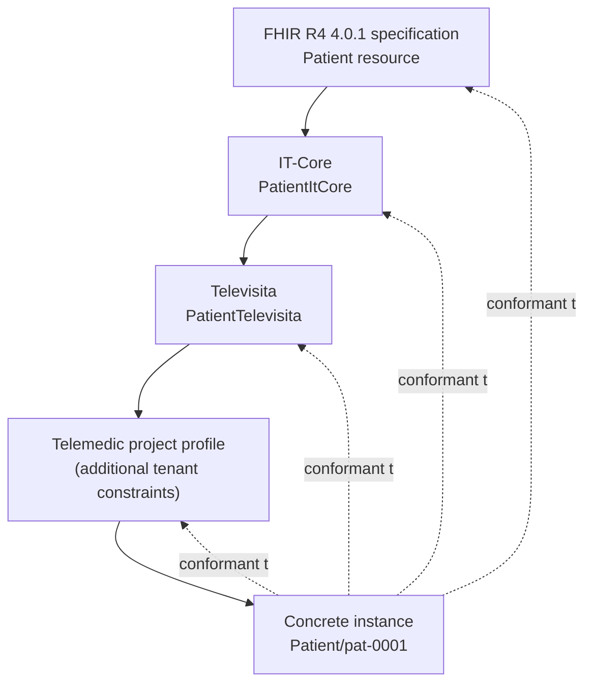
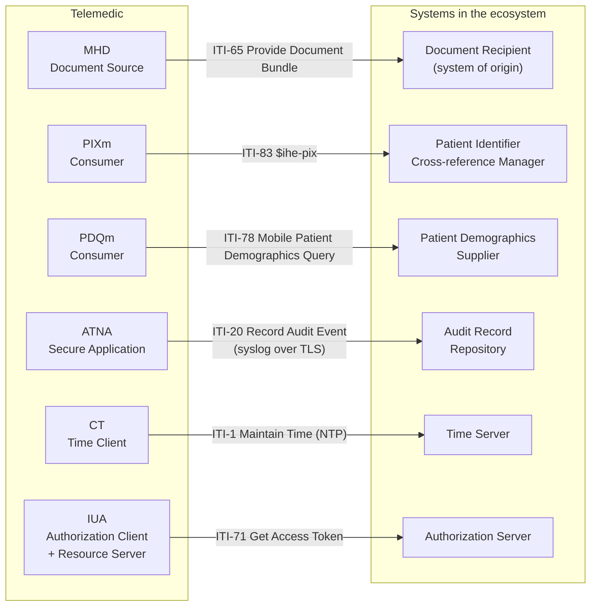

# Interoperability standards

This module presupposes **zero** prior knowledge of healthcare standards. By the end you
should be able to open the page of an Implementation Guide, understand what you are looking
at, recognise whether it is still valid, and tell what you are obliged to do from what you
are merely permitted to do.

It is not a theoretical module. The section on terminologies contains **binding operational
rules**: if you break them you open a legal problem for the project, not a stylistic defect.

---

## 1. The problem standards solve

### 1.1 The same patient in three systems

Imagine a lady we shall call Maria Bianchi, born on 3 March 1958. All the data that follow
are **synthetic**: none of them corresponds to a real person.

Maria is being treated for atrial fibrillation. Over six months her pathway touches three
different information systems:

| System | How it identifies Maria | How it codes the diagnosis | What it calls the field |
|---|---|---|---|
| Single booking centre (CUP) of the local health authority | `CUP-ASL-0034887` (internal numbering) | `427.31` (the disease classification in use for hospital activity accounting) | `COD_DIAG_PRINC` |
| Management system of the private polyclinic | `PZ-2024-1187` (internal sequence number) | free text: «paroxysmal AF» | `diagnosi_note` |
| Laboratory that performs the tests | `LAB-887766` (reception number) | no diagnosis: only the code of the service requested | - |

None of the three systems is doing anything wrong. Each is consistent with itself. The
problem arises when they have to talk to one another, and it shows up along **three
independent axes**:

1. **Identity.** None of the three identifiers is recognisable by the other two. If the
   polyclinic sends the laboratory «patient PZ-2024-1187», the laboratory has no way of
   knowing that this is the same person as `LAB-887766`. Reconciliation is done by hand,
   comparing forename, surname and date of birth - a procedure that goes systematically
   wrong on namesakes, on badly recorded dates of birth and on surnames with diacritics.
2. **Meaning.** `427.31` and «paroxysmal AF» describe the same clinical fact, but no program
   can establish that. The first is a code from a classification, the second is a string a
   doctor typed on a keyboard. A system that wants to count how many patients with atrial
   fibrillation are on its books must be able to recognise both as the same concept - and it
   cannot, unless it is given the rule.
3. **Structure.** `COD_DIAG_PRINC` and `diagnosi_note` are not the same field, do not have
   the same type, do not have the same cardinality and do not have the same rules on whether
   they are mandatory. The mapping between the two is hand-written code, which someone has
   to maintain when either of the two schemas changes.

### 1.2 The cost of point-to-point integration

Without standards, every pair of systems that has to talk requires a dedicated interface.
With `n` systems, the maximum number of interfaces is `n(n-1)/2`: three systems require
three, ten require forty-five, twenty require one hundred and ninety. Each interface has a
format of its own, a maintenance cycle of its own, a behaviour of its own when something
goes wrong, and it dies when the project that funded it dies.

A standard breaks this arithmetic: every system implements **one** interface towards the
standard, and the number of adapters grows linearly with the number of systems. It is not an
aesthetic gain: it is the difference between an ecosystem you can make evolve and one you
can only rebuild from scratch.

### 1.3 Why «let's all use the same database» is not an answer

The naive objection from someone arriving from general computing is: why not centralise
everything in a single system? Three answers, all structural:

- **Healthcare has no single owner.** A public local health authority, an accredited private
  polyclinic, a laboratory, a pharmacy and a partnership practice are distinct legal
  entities, with distinct data controllerships, distinct investment cycles and distinct
  procurement constraints. None of them can impose its own data schema on the others.
- **The life cycles do not coincide.** A hospital clinical record system stays in service
  fifteen or twenty years. A telemedicine module is replaced every three or four. An exchange
  format has to outlive both.
- **Clinical data are longitudinal, organisations are not.** A person's clinical history
  spans decades, regions and different systems. The data must be able to migrate without
  losing meaning: that is precisely what a semantic standard guarantees and what a
  proprietary schema does not.

### 1.4 What a standard has to guarantee, concretely

A healthcare interoperability standard is useful only if it answers, together, four
questions:

- **How is the same person identified across different systems?** (identifiers with a
  declared *namespace*, services for cross-referencing identifiers)
- **What shape does the message or the document have?** (syntax, structure, cardinality,
  whether elements are mandatory)
- **What does each value mean?** (shared terminologies, with stable codes and definitions)
- **Who may do what, when, and how is it demonstrated after the fact?** (authorisation,
  consent, audit trail)

A format that solves only the second question - and there are many of them - is not an
interoperability standard: it is a file format.

---

## 2. Who writes the standards

### 2.1 The standards organisations

A **standards organisation** (*Standards Development Organization*, abbreviated **SDO**) is
a body that produces technical specifications through a process of consensus among
stakeholders: software suppliers, healthcare organisations, public bodies, professionals,
researchers. Consensus is the distinguishing feature: nobody «publishes» a standard on their
own.

The organisations that matter for Telemedic are these.

| Organisation | What it produces | Relevance for the project |
|---|---|---|
| **HL7 International** | The standards for exchanging health information: HL7 version 2, HL7 version 3, CDA, FHIR, and the shared vocabulary *HL7 Terminology* | The project's data model is FHIR R4; the legacy channel towards integrators is HL7 v2 |
| **National HL7 affiliates** (in Italy **HL7 Italia**) | National adaptations of the HL7 standards: profiles, implementation guides, local terminologies | The Italian telemedicine guides (`Televisita`, `Teleconsulto`, `Teleassistenza`, `Telemonitoraggio` - remote consultation, specialist-to-specialist consultation, remote assistance, remote monitoring) and `IT-Core` are the regulatory basis of Telemedic's data model |
| **IHE** (*Integrating the Healthcare Enterprise*) | Not new standards, but **integration profiles**: precise combinations of existing standards that solve a concrete problem | The MHD, PIXm, PDQm, ATNA, IUA and BALP profiles define how Telemedic publishes documents, cross-references identities, records accesses and authorises itself |
| **NEMA / DICOM** | The standard for biomedical images and the related network services | It comes into play when a consultation requires an imaging study to be read |
| **ISO/TC 215** (*Health informatics*) | International health informatics standards (architectures, security, identification) | Relevant above all for the regulatory side and for quality management |
| **CEN/TC 251** (*Health informatics*, the European committee) | European health informatics standards, often adopted in parallel with ISO | Relevant for the European compliance context |
| **IETF** and **W3C** | The internet standards everything else rests on: HTTP, TLS, OAuth, JSON, WebRTC | They are the layer underneath: without these, no healthcare standard works |

**[NV]** The specific mandates of ISO/TC 215 and CEN/TC 251, their catalogues of standards
and the formal adoption relationships between the two committees have not been verified
against a primary source during the project's research phase. They must be ascertained
before being cited as a regulatory basis in regulatory documentation.

### 2.2 Specification, profile, Implementation Guide, national guide

These four terms are used as synonyms in informal conversation, and they are not. The
difference is the key to understanding everything else.

**Specification (or base standard).** It is the document that defines the general model:
which objects exist, what fields they have, what types, what cardinalities, what constraints.
It is deliberately **permissive**, because it has to hold in every country, for every
specialty, for every use case. Example: the FHIR R4 specification defines the `Patient`
resource with `name` of cardinality `0..*` - that is, a patient may have no name at all. It
seems absurd, and it is instead necessary: there are real clinical contexts (an unidentified
patient in an emergency department) in which the name is not there.

**Profile.** It is a **restriction** of the specification for a specific context. A profile
can make mandatory what was optional, reduce the number of permitted values, impose a code
system, forbid elements. It cannot do the opposite. Example: the Italian profile
`PatientItCore` brings `identifier` to `1..*` and `name` to `1..*`: in Italy a registered
patient **must** have at least one identifier and at least one name.

**Implementation Guide** (abbreviated **IG**). It is a published package that contains,
together: a coherent set of profiles, the extensions it introduces, the code systems and
value sets it defines, the examples, the conformance rules, and the narrative documentation
that explains the use case. It is the unit of distribution: you install it, you version it,
you validate against it.

**National implementation guide.** It is an Implementation Guide produced by a national
affiliate for its own legal and organisational context - what in FHIR jargon is called a
**realm**. It contains what is specific to the country: the national identifiers (in Italy
the tax code, the national health card, the codes of care provider organisations), the
classifications made mandatory by law, the rules for activity accounting.

Operational summary:

```text
General specification      →  what is possible in the abstract
  Profile                  →  what is permitted in this context
    Implementation Guide   →  the package that gathers profiles, terminologies, examples
      National IG          →  the package for a specific legal order
```

### 2.3 Profiling: the concept that explains all the rest

To **profile** means to *restrict*: to take a general standard and constrain it until it is
verifiable in a precise context of use. It is the mechanism that allows a worldwide standard
to be usable in a surgery in Bari.

The principle has a golden rule that admits no exceptions:

> **A profile may only restrict. It may never widen.**

In practice:

- a cardinality of `0..1` may become `1..1` (mandatory) or stay `0..1`, but a cardinality of
  `1..1` may not go back to `0..1`;
- a set of values may be restricted to a subset, not enlarged;
- a format constraint may be made stricter, not more permissive;
- an element may be forbidden (cardinality `0..0`), not introduced from scratch - to add
  information you use **extensions**, which are a mechanism provided by the base
  specification for exactly this purpose.

The reason is one of logical safety: if a profile could widen, a system that accepts the base
standard would no longer be able to accept the profiled data, and the promise of
interoperability would break. By restricting, on the other hand, every instance conformant
to the profile is by construction also conformant to the base specification.

From this follows a chain of conformance that must be read from the bottom upwards:



An instance at the bottom of the chain is conformant to every level above it. It is this
that lets a foreign system which knows only FHIR read an Italian document all the same, even
if without understanding its national specificities.

### 2.4 The life cycle of a standard, and why the version matters

No standard is born definitive. It goes through maturity stages, and the stage is
operational information, not a bibliographic detail: it tells you how far you can trust that
the document will not change under your feet.

The recurring stages, with the names you will meet:

| Stage | Recurring name | What it means |
|---|---|---|
| Draft | *draft* | Work in progress. It may change at any moment and in any part. |
| Public comment | *public comment*, *ballot*, *-comment* | Submitted to the community for observations. The content will change. |
| Trial use | *trial use*, *STU* (*Standard for Trial Use*), *Trial Implementation* | Published and usable, but explicitly subject to change on the basis of experience of use. |
| Definitive | *normative*, *Final Text* | Stable. Later changes follow backward-compatibility rules. |
| Retired | *retired*, *deprecated*, *withdrawn* | No longer maintained. |

Two real examples that bear directly on the project:

- IHE's *Technical Framework* for the ITI domain is in **Final Text** status, revision
  **20.2 of 11 November 2025** **[V]**. It is stable material.
- The Italian telemedicine guides (`Televisita`, `Teleconsulto`, `Teleassistenza`,
  `Telemonitoraggio`) and `IT-Core` are at version **0.2.0**, in **draft / trial-use**
  status **[V]**. They are usable material, but they **will change**. Whoever conforms to
  them must pin the version (*pinning*) and provide for a re-checking process.

The practical consequence is the most important rule in this module:

> **There is no such thing as «the standard». There is always and only a precise version of
> a standard, at a precise date, in a precise state of maturity.** Every time you write
> «FHIR R4» in a document you have already committed an imprecision: the version is
> **4.0.1**, published on **30 October 2019** **[V]**, and it differs from 4.0.0 in the
> invariants and in the generated conformance resources. Different validators behave
> differently on the two.

### 2.5 The role of the Italian guides

The existence of the HL7 Italia guides for telemedicine is **the fact that determined
Telemedic's modelling choices**. Before discovering them, the natural choice would have been
to model the session's report as a `DiagnosticReport` resource; after reading them, the
correct choice is to model it as a `Composition` inside a `Bundle` of type document, because
that is how the `Televisita` guide models it (profile `CompositionRefertoTelevisita`) **[V]**.

This is the general point: **national guides are not a piece of bureaucracy to be dealt with
at the end, they are a design constraint to be read at the beginning.** A data model that
ignores them has to be redone, not adapted.

---

## 3. The levels of interoperability

To say that «two systems are interoperable» means nothing until you specify *at which
level*. The subdivision that follows is in common use in the health informatics literature
and in the European reference frameworks; **[NV]** its precise formulation and the exact
regulatory source have not been verified during the project's research phase, and it should
therefore be used as a teaching tool, not cited as a normative definition.

### 3.1 Technical interoperability

The two systems manage to exchange **bits**. It is the level of network protocols, of
transport, of encryption, of addressing.

*Positive example:* the integrator's management system opens a TLS connection towards
Telemedic's API on port 443, the encryption is negotiated, the HTTP request arrives at its
destination.

*Failure example:* the management system exposes a listener for the minimal transport
protocol used by HL7 version 2 on a TCP port reachable only from the hospital's internal
network, and Telemedic is in the cloud. No byte gets through. The problem has nothing to do
with the meaning of the data.

### 3.2 Syntactic interoperability

The two systems manage to **decode the structure** of what they exchange: they know where
one field ends and another begins, they know which fields are repeated, they know how to
recognise a malformed message.

*Positive example:* the message arrives as JSON conformant to the schema of the
`Appointment` resource; the receiver deserialises it without errors and knows that
`participant` is an array.

*Failure example:* the sender sends an HL7 version 2 message in which the field separators
declared in the header do not correspond to those actually used in the body. The receiver's
parser splits the fields in the wrong place. All the bytes arrived, but the structure is
lost.

### 3.3 Semantic interoperability

The two systems **attribute the same meaning** to the values exchanged. It is the level of
terminologies.

*Positive example:* the field carrying the document type carries the code `75496-0`,
explicitly declaring the code system `http://loinc.org`. The receiver, consulting that
system, learns that this is a telemedicine note (*Telehealth Note*) **[V]**, and can index
the document in the right category.

*Failure example:* the field carries the value `TV`. The sender means «televisita»; the
receiver, which has an internal list of its own, interprets it as «volumetric tomography».
The code arrived intact, the structure is correct, the meaning is turned upside down. **This
is why a code without a declared `system` is not a piece of data, it is an ambiguity.**

### 3.4 Organisational interoperability

The two organisations have **compatible rules** about who may do what, with what
authorisation, on what legal basis, with what responsibilities and within what timescales.

*Positive example:* before publishing the report towards the system of origin, Telemedic
verifies that a valid consent from the patient exists, records an audit event declaring the
purpose of the communication, and the receiving system accepts the publication because its
own rules provide for it.

*Failure example:* Telemedic is technically able to send the report, the format is correct,
the coding is shared - but the receiving system's rules require every document to be signed
by a professional identified at a given level of assurance, and the flow does not provide for
that. The document is rejected. No technical adjustment solves the problem, because the
problem is not technical.

> **The lesson for developers:** most integration failures that look technical are in fact
> semantic or organisational. Before writing code for an integration, check that you have
> answered the questions of these two levels.

---

## 4. HL7 version 2

### 4.1 Why a standard from the nineteen-eighties is still the backbone

HL7 version 2 is the most widespread healthcare messaging format in the world. It is still
today the channel by which, inside most hospitals, the admissions system tells the laboratory
that a patient has arrived, and the laboratory tells the clinical record that a test is
ready.

It must be known for a practical reason, not a historical one: **an integrator who today
asks Telemedic to receive appointments almost certainly already has them available in this
format**, and will ask to reuse it instead of implementing a new API. The project's decision
D4 explicitly puts it among the mandatory integrations.

### 4.2 Anatomy of a message

An HL7 version 2 message is text. It has a four-level hierarchy, delimited by separator
characters.

- **Segment**: a line. It has a three-character name (`MSH`, `PID`, `PV1`, `SCH`…) and ends
  with a carriage-return character. Every segment has a role: `MSH` is the header, `PID`
  identifies the patient, `PV1` describes the encounter.
- **Field**: the position within the segment, separated from the other fields. It is named
  with the segment name plus its ordinal number: `PID-5` is the fifth field of the `PID`
  segment, that is, the patient's name.
- **Component**: the internal subdivision of a field. `PID-5` contains surname, forename,
  middle name, suffix and more, separated from one another.
- **Subcomponent**: the further subdivision of a component.

To these is added **repetition**: a field may contain several values of the same type,
separated by a dedicated character. `PID-3` (the list of the patient's identifiers) is
typically repeated.

The separators are these **[V-sec]**:

| Role | Default character | Where it is declared |
|---|---|---|
| End of segment | carriage return (`0x0D`) | fixed, not modifiable |
| Field separator | `\|` | **MSH-1** - the field contains the character itself |
| Component separator | `^` | MSH-2, position 1 |
| Repetition separator | `~` | MSH-2, position 2 |
| Escape character | `\` | MSH-2, position 3 |
| Subcomponent separator | `&` | MSH-2, position 4 |

The curious and important consequence: **the field separator is by definition the fourth
character of the message** **[V-sec]**, because the first three are `MSH` and the fourth is
the content of `MSH-1`, which *is* the separator. A correct parser does not presume `|`: it
reads it from the message.

The `MSH` header segment has a fixed structure **[V-sec]**:

| Field | Name | What it contains |
|---|---|---|
| MSH-1 | Field Separator | the field separator character |
| MSH-2 | Encoding Characters | the other four separators, in order |
| MSH-3 / MSH-4 | Sending Application / Facility | who is sending (application and organisation) |
| MSH-5 / MSH-6 | Receiving Application / Facility | who is receiving |
| MSH-7 | Date/Time of Message | date and time of the message |
| MSH-9 | Message Type | type, trigger event and structure |
| MSH-10 | Message Control ID | unique identifier of the message |
| MSH-11 | Processing ID | environment (production, test, training) |
| MSH-12 | Version ID | version of the standard used |
| MSH-15 | Accept Acknowledgment Type | whether and when an accept acknowledgement is wanted |
| MSH-16 | Application Acknowledgment Type | whether and when an application acknowledgement is wanted |
| MSH-17 | Country Code | country code |
| MSH-18 | Character Set | character encoding |
| MSH-21 | Message Profile Identifier | identifier of the profile the message conforms to |

### 4.3 The message types that matter for Telemedic

A message type is identified by a three-letter code plus a **trigger event**: the real-world
fact that causes the message to be sent.

**ADT - demographics and encounters.** The relevant events **[V-sec]**:

| Event | Meaning |
|---|---|
| `A01` | Admission: start of an inpatient stay, patient assigned to a bed |
| `A03` | Discharge: end of the stay |
| **`A04`** | **Registration of an outpatient**, with no bed assignment |
| `A08` | Update of the patient's information, in the absence of other events |
| `A11` | Cancellation of an admission |
| `A28` / `A31` | Insertion / update of a person's demographic information |

> **Recurring mistake, not to be made:** for a remote service of an outpatient kind the
> correct message is **`A04`, not `A01`**. The patient is not admitted and has no bed
> assigned. Using `A01` pollutes the downstream systems with inpatient stays that do not
> exist.

**SIU - appointment scheduling.** It is the most relevant type for the project, because the
model decision says that the diary originates in the integrator's system and Telemedic
receives it. Events **[V-sec]**:

| Event | Meaning |
|---|---|
| **`S12`** | Notification of a new booked appointment |
| `S13` | Rescheduling |
| `S14` | Modification |
| `S15` | Cancellation |
| `S17` | Deletion (appointment entered in error) |
| `S23` / `S24` | Blocking / unblocking of time slots |
| **`S26`** | The patient did not attend |

**MDM - document notification.** It is the correct channel for returning the session's
report to a system that does not speak FHIR. Events **[V-sec]**:

| Event | Meaning |
|---|---|
| `T01` / **`T02`** | Original document notification, without / **with content** |
| `T03` / `T04` | Document status change, without / with content |
| `T05` / `T06` | Addendum |
| `T09` / **`T10`** | Document replacement, without / with content |
| `T11` | Cancellation |

The key segment is `TXA`, which carries the document's metadata. Two fields matter more than
the others **[V-sec]**: `TXA-17` (completion status) and `TXA-19` (availability). The values
of `TXA-17` include `AU` (authenticated) and **`LA` (legally authenticated)**: `LA` is the
signal that the document is final and signed. The pair `TXA-12` (unique document number) and
`TXA-13` (parent document number) is the mechanism by which rectifications are expressed.

**ORU - results.** `ORU^R01` is the message by which a diagnostic service transmits results.
The structure nests groups: patient, order, observations **[V-sec]**. The segments that
matter are `OBR` (the order and the service requested) and `OBX` (the individual
observation, with the value type in `OBX-2`, the observation identifier in `OBX-3`, the value
in `OBX-5`, the status in `OBX-11`).

### 4.4 A real message, commented line by line

The message that follows is a `SIU^S12` - notification of a new appointment - sent by a care
provider organisation's management system to Telemedic. **All the data are synthetic.**

```text
MSH|^~\&|GESTIONALE|STRUTTURA_A|TELEMEDIC|TENANT_A|20260914073000||SIU^S12^SIU_S12|MSG00001|P|2.5.1|||AL|NE|ITA|UNICODE UTF-8
SCH|PLC-88213|FLR-99001||||CTRL^Visita di controllo cardiologica^L|Controllo post-dimissione|AMB|30|min|^^^20260914100000^20260914103000
TQ1|1||||||20260914100000|20260914103000
PID|1||RSSMRA80A01H501Z^^^MEF^NNITA||ROSSI^MARIO||19800101|M|||VIA ROMA 1^^ROMA^RM^00100^ITA^H||^PRN^PH^^^06^5551234
PV1|1|O|||||||||||||||||VIS-2026-0000123
RGS|1|A|GRP-1
AIS|1|A|CTRL^Visita di controllo cardiologica^L|20260914100000|||30|min
AIP|1|A|MED-0007^BIANCHI^ANNA^^^DR|PPRF^Medico esecutore|||20260914100000|||30|min
AIL|1|A|VROOM-8f3a^^^TENANT_A^^^^^Stanza virtuale|||20260914100000|||30|min
```

Line by line:

**Line 1 - `MSH`, the header.** The fourth character is `|`: from there the parser deduces
the field separator. `^~\&` are the other four separators. Then comes who is sending
(`GESTIONALE` at `STRUTTURA_A`) and who is receiving (`TELEMEDIC` at `TENANT_A`): the second
element of the receiving pair is the natural way of conveying the tenant information, which
the project's constraint V4 imposes on every entity. `20260914073000` is the date and time
of the message in the standard's compact format. `SIU^S12^SIU_S12` is the type: SIU message,
event S12, structure `SIU_S12`. `MSG00001` is the unique identifier: it is the value the
returning ACK will quote. `P` indicates a production environment. `2.5.1` is the version of
the standard. `AL` in MSH-15 always asks for the accept acknowledgement; `NE` in MSH-16
declares that no application acknowledgement is wanted: we are in *enhanced* mode with the
accept phase alone. `ITA` is the country code and `UNICODE UTF-8` the character encoding -
this last is not a detail, because without it surnames with accents arrive corrupted.

**Line 2 - `SCH`, the appointment data.** `PLC-88213` is the identifier assigned by the
requester (*placer*), `FLR-99001` the one assigned by the provider (*filler*). Field `SCH-7`
carries the service code with the triplet «code, description, code system»: note that it is
**the code of the ordinary follow-up visit**, not a hypothetical «televisita» code. It is
the operational translation of the national accounting rule: a service delivered remotely
keeps the coding of the corresponding in-person service **[V-sec]**; the remote modality is a
separate axis. `30` and `min` are duration and unit; the last field carries the time
interval.

**Line 3 - `TQ1`, structured timing.** Present from version 2.5 of the standard onwards
**[V]**: a parser written for 2.3 would discard it. It repeats the start and the end in
structured form.

**Line 4 - `PID`, patient identification.** `PID-3` is the list of identifiers. Here we have
the tax code (*codice fiscale*), with the assigning authority in the fourth component and
the identifier type in the fifth. The value `NNITA` deserves a note: the HL7 table of
identifier types **does not contain a code `NN`**; it contains a concept whose code is
literally `NNxxx`, where `xxx` is to be replaced with the three-letter country code - hence
`NNITA` for Italy **[V]**. `NNITA` is not enumerated as a concept: it is a value generated by
the formation rule. **No published Italian profile fixes which code to use for the tax code**
**[V]**: the choice must be agreed with the integrator and written into the interface
contract. `PID-5` is the name, with surname and forename separated by `^`.

**Line 5 - `PV1`, the encounter.** `PV1-2` is the patient class: `O` means *outpatient*, and
it is the value verified against the corresponding table **[V]**. `PV1-19` carries the visit
number.

**Lines 6-9 - the resources group.** The group is **mandatory and repeatable** and must begin
with `RGS` **[V]**. `AIS` describes the service, `AIP` the personnel (here the doctor, with
the role expressed in `AIP-4`), `AIL` the location resource - which in our case is the
virtual room. It should be noted that in the official structure the **patient group is
optional** **[V]**: a valid `SIU^S12` without a `PID` segment exists. A consumer that takes
the presence of the patient for granted is not conformant.

### 4.5 The acknowledgements: ACK and NACK

An HL7 version 2 message receives a response. There are two modes of doing this **[V-sec]**.

**Original mode.** The receiver validates (acceptable message type, compatible version,
consistent environment); if validation fails it answers `AR`. If it passes, the application
processes and answers `AA` (accepted), `AE` (application error) or `AR` (rejection).

**Enhanced mode.** It separates the acknowledgement of *receipt* from that of *processing*.
The first phase, governed by `MSH-15`, produces `CA` (commit accept), `CR` (commit reject) or
`CE` (commit error). The second phase, governed by `MSH-16`, produces in a later message
`AA`, `AE` or `AR`. The permitted values for `MSH-15` and `MSH-16` are `AL` (always), `NE`
(never), `ER` (on error only) **[V-sec]**.

Example of an accept acknowledgement to the previous message:

```text
MSH|^~\&|TELEMEDIC|TENANT_A|GESTIONALE|STRUTTURA_A|20260914073001||ACK^S12^ACK|ACK00001|P|2.5.1
MSA|CA|MSG00001
```

And in the event of an application error:

```text
MSH|^~\&|TELEMEDIC|TENANT_A|GESTIONALE|STRUTTURA_A|20260914073001||ACK^S12^ACK|ACK00002|P|2.5.1
MSA|AE|MSG00001
ERR||PID^1^3|204^Unknown key identifier^HL70357|E
```

The `ERR` segment in version 2.5 of the standard has twelve fields and **differs radically
from the one in version 2.3**, where there was a single field **[V]**. The useful fields are
`ERR-2` (structured location of the error: segment, occurrence, field), `ERR-3` (error code
according to the dedicated table) and `ERR-4` (severity: `W` warning, `I` information, `E`
error, `F` fatal error) **[V]**. The verified error codes include `101` (required field
missing), `102` (data type error), `103` (table value not found), `204` (unknown key
identifier), `205` (duplicate key identifier) and `207` (application internal error) **[V]**.

**[NV]** The maximum-length and optionality columns of the `ERR` segment have not been
verified against a primary source: three independent extractions of the same page produced
incompatible values. They must not be published.

### 4.6 The transport: MLLP, and why it must be wrapped in TLS

HL7 version 2 defines the *content* of the message, not the way of transmitting it. The
transport used in practice is **MLLP** (*Minimal Lower Layer Protocol*), which solves a very
specific problem: on a TCP connection the bytes arrive as a continuous stream, and the
receiver has no way of knowing where one message ends and the next begins. MLLP frames each
message between a start byte and a pair of end bytes **[V-sec]**:

```text
0x0B  <HL7 v2 payload>  0x1C 0x0D
```

**[V-sec]** The hexadecimal values are confirmed by two independent sources that cite the
official transport specification; the primary document was not read directly during the
research phase. **[NV]** Port 6660, often cited as conventional, does not appear to be a
registered port for MLLP: in practice the port agreed between the parties is used.

Now the point that really matters:

> **Bare MLLP is plain text over TCP, with no authentication, no integrity, no
> confidentiality.** Anyone on the network path reads names, tax codes, diagnoses and can
> alter them without either party noticing.

It is not a design defect of the standard: MLLP was born for closed hospital networks of the
nineteen-eighties, where the threat model was different. It is a defect **of the deployment**
to use it that way today. The binding rule for Telemedic:

1. Every MLLP listener is exposed **exclusively** inside a TLS channel, with mutual
   authentication based on X.509 certificates - which is exactly what the IHE node
   authentication profile prescribes (§6.5).
2. Never an MLLP listener reachable from an untrusted network, not even «temporarily for
   testing».
3. The counterparty's certificate must be verified, not merely presented: a TLS connection
   that accepts any certificate offers no protection at all against an active attack.

### 4.7 The bridge towards FHIR

There is an official Implementation Guide that maps HL7 version 2 messages onto FHIR
resources: it is called *HL7 Version 2 to FHIR*, it is at **version 1.0.0**, in *trial use*
status, generated on **7 October 2025**, and it targets FHIR **R4** **[V]**.

It contains **thirteen message maps**, all with **informative** status **[V]**: `ADT_A01`,
`ADT_A02`, `ADT_A05`, `ADT_A06`, `ADT_A09`, `ADT_A11`, `ADT_A17`, `OML_O21`, `ORM_O01`,
`VXU_V04`, `ORU_R01`, `MDM_T02`, `SIU_S12`. And **seventy-seven segment maps**, likewise
informative **[V]**. Those relevant for the project's use case: `SCH` to `Appointment`,
`AIS`/`AIG`/`AIL`/`AIP` to `Appointment`, `PID` to `Patient`, `PV1` to `Encounter`, `TXA` to
`DocumentReference` **[V]**.

Two warnings to bear in mind:

- **None of the maps is normative.** They are informative: you cannot declare «conformance»
  to them. They are an authoritative reference, not an obligation.
- **There is no map from the `ERR` segment to `OperationOutcome`** **[V]**. Translating HL7
  version 2 errors into FHIR's error format is down to the implementer, with no normative
  cover. It has to be designed and documented.

---

## 5. HL7 CDA release 2

### 5.1 What a clinical document is

A **clinical document** is not a file: it is an object with precise legal properties. The
properties that the sector literature attributes to a clinical document - and that
distinguish its nature from that of a message - are persistence over time, attributability
to a responsible custodian, the possibility of being authenticated by whoever answers for
it, self-sufficiency with respect to context, integrity as an indivisible unit and
readability by a human being. **[NV]** This formulation has not been verified against the
text of the CDA specification during the project's research phase: it must be confirmed
before being cited as a normative definition.

The difference from a message is substantial. A message says «this has happened, update your
data»: it is transient, its value is exhausted once it has been processed. A document says «I
attest that this occurred, and I take responsibility for it»: it remains, and it retains
evidential value even years later.

### 5.2 Structure: header and body

**CDA** (*Clinical Document Architecture*) release 2 is the HL7 standard for clinical
documents, expressed in XML. A CDA document has two parts.

The **header** contains what makes the document identifiable and enforceable: unique
identifier of the document, document type expressed as a code, creation date, the patient it
concerns, author, custodian, legal authenticator, any recipients, and the reference to the
encounter that generated it.

The **body** contains the clinical content, organised into **sections**. Each section has a
code declaring its nature (history, physical examination, conclusions…) and a narrative block
intended for human reading. Sections may contain **entries**: structured and coded
representations of the same content, intended for automated processing.

From this follows the notion of **level of structuring**, which in sector jargon is expressed
thus: a document is level 1 when the body is substantially narrative, level 2 when the
sections are identified and coded, level 3 when the content of the sections is also coded in
processable entries. **[NV]** This three-way division is in common use but has not been
verified against the text of the specification: it must be confirmed.

### 5.3 Templates

A **template** in CDA is the conceptual equivalent of a profile in FHIR: a set of additional
constraints that restrict the general structure for a specific document type. A document
declares the templates it conforms to by means of a dedicated identifier, and a validator
checks that the constraints are respected.

The mechanism is the same as the profiling described in §2.3, with one practical difference:
in CDA templates nest at several levels (document, section and entry templates), and a real
document typically declares several of them.

### 5.4 Why it still matters enormously in Italy

Anyone arriving from FHIR is tempted to regard CDA as a superseded technology. That would be
an error of judgement, for a concrete reason: **the Italian healthcare document
infrastructure is built on CDA documents**, and the documents deposited in it have to conform
to that infrastructure's national specifications.

For the project the question is open and must be managed explicitly. The picture, as it
emerges from the decisions taken:

- A decree of November 2025 established **ten new health record document types dedicated to
  telemedicine**, with the related information set defined in the Official Gazette. The
  televisita report is one of these types, and it must **not** be brought back under the
  pre-existing type for outpatient specialist care.
- The **CDA templates and the indexing metadata** for those types **had not yet been
  acquired** at the time the project took its data model decisions.

The operational consequence, which is also a general good practice:

> **The information content is modelled as a canonical dataset independent of format, and CDA
> is treated as a substitutable serialisation.** You do not hard-wire a template that has not
> yet been read. When the templates become available, the adapter that projects the canonical
> dataset into the required format will be written, without touching the domain model.

It is the same principle the project applies to the coexistence of FHIR versions: the
internal domain model speaks the dialect of no exchange format, and every format is a layer
of adaptation.

---

## 6. IHE

### 6.1 What IHE does, and why it is not «another standard»

IHE does not write standards. It takes existing standards - HL7, DICOM, internet protocols -
and specifies **how to combine them** to solve a concrete integration problem. It is the
answer to the fact that a standard, on its own, leaves too many choices open: two systems may
both «use FHIR» and fail to talk to each other, because they have chosen differently on ten
points that the standard left free.

IHE's product is called an **integration profile**, and it is built with three concepts.

**Actor.** Verbatim definition from the ITI domain's *Technical Framework* **[V]**:

> *"Information systems or components of information systems that produce, manage, or act
> on information associated with operational activities in the enterprise."*

An actor is not a system: it is a **role** that a system takes on. The same software product
may implement several actors, and the same actor may be implemented by different products.
When one says «Telemedic implements the *Document Source* actor» one is saying that Telemedic
knows how to do what that role requires, not that Telemedic *is* that role.

**Transaction.** Verbatim definition **[V]**:

> *"Interactions between actors that transfer the required information through
> standards-based messages."*

A transaction is a specific exchange between two actors, with a precise format, a precise
protocol and precise error rules.

**Integration profile.** The composition of actors and transactions that solves a problem.
The document describing it is organised into volumes: the first gives the overall view, the
subsequent ones describe the transactions in increasing detail **[V]**.

### 6.2 How to read a transaction's identifier

Every transaction has an identifier of the form `DOMAIN-number`. Examples: `ITI-41`,
`ITI-65`, `ITI-83`, `ITI-20`.

The prefix is the IHE **domain** that defined the transaction. `ITI` stands for *IT
Infrastructure* and is the domain of cross-cutting functions: document sharing, identity
management, audit, authorisation, time synchronisation. Other domains exist (radiology,
cardiology, laboratory, public health, pharmacy), each with its own numbering. **[NV]** The
complete list of IHE domains and their respective abbreviations was not verified during the
research phase.

The number is sequential within the domain and **has no semantic meaning**: `ITI-65` is not
«more advanced» than `ITI-41`, it was simply defined later. The number is, however, stable
over time: once assigned, it identifies that transaction for ever, even across revisions of
the framework.

When you meet a citation such as «IHE ITI TF-2, transaction ITI-41, revision 20.2 of
2025-11-11», you read it thus: *IT Infrastructure* domain, *Technical Framework* volume 2,
transaction number 41, revision 20.2 of the framework, published on 11 November 2025.

### 6.3 The profiles Telemedic uses

#### MHD - mobile access to health documents

It solves the problem: «how do I publish a clinical document, and how does someone looking
for it find it?». It is the FHIR REST-based version of document sharing, designed for
resource-constrained environments. Version found: **4.2.5-comment (2026-06-16)**, that is, a
version in public comment, **not** final text, based on FHIR **R4 (4.0.1)** **[V]**.

Actors **[V]**: *Document Source* (who publishes), *Document Recipient* (who receives the
publication), *Document Consumer* (who searches and retrieves), *Document Responder* (who
answers searches).

Transactions **[V]**:

| Transaction | Identifier | What it does |
|---|---|---|
| Provide Document Bundle | **ITI-65** | Publishes a set of documents with their metadata |
| Find Document Lists | ITI-66 | Searches for collections of documents |
| Find Document References | **ITI-67** | Searches the documents' metadata |
| Retrieve Document | **ITI-68** | Retrieves a document's content |
| Simplified Publish | ITI-105 | Simplified publication |
| Generate Metadata | ITI-106 | Metadata generation |

The FHIR resources involved are `DocumentReference`, `List`, `Binary` and `Bundle` **[V]**.

**How Telemedic uses it:** at the end of the session the report - serialised as a `Bundle` of
type document and indexed by a `DocumentReference` - is published with **ITI-65** to the
*Document Recipient* of the system of origin. It is the answer to the requirement that the
clinical content flow into the calling system's record instead of remaining confined inside
Telemedic.

#### PIXm - cross-referencing patient identifiers

It solves the problem described in §1.1: the same person has different identifiers in
different domains. Version: **3.1.0, Trial Implementation (2025-11-04)**, FHIR R4 **[V]**.

Transactions **[V]**: *Patient Identity Feed FHIR* (**ITI-104**) and *Patient Identifier
Cross-reference Query* (**ITI-83**). The latter is invoked as the FHIR operation `$ihe-pix`
on the endpoint `[base]/Patient/$ihe-pix`, with input parameters `sourceIdentifier`
(mandatory, in the form `domain|value`), `targetSystem` (the domains from which the returned
identifiers are wanted) and `_format`; output `targetIdentifier` and `targetId` **[V]**.

**How Telemedic uses it:** as a *consumer*. It receives from the integrator an identifier in
the integrator's domain and, when needed, asks the authoritative system for the
correspondence with the national identifier. It never becomes the reference registry for
identities.

#### PDQm - demographic query

It solves: «I have some demographic data, who is the patient?». Version: **3.2.0, Trial
Implementation (2025-11-04)**, FHIR R4 **[V]**.

Actors **[V]**: *Patient Demographics Consumer* and *Patient Demographics Supplier*.
Transactions: *Mobile Patient Demographics Query* (**ITI-78**) and *Patient Demographics
Match* (**ITI-119**).

The fourteen search parameters permitted on `Patient` in ITI-78 are verified **[V]**: `_id`,
`active`, `family`, `given`, `identifier`, `telecom`, `birthdate`, `address`,
`address-city`, `address-country`, `address-postalcode`, `address-state`, `gender`,
`mothersMaidenName`. The consumer *may* supply them, the supplier **must** be able to process
all of them, and must support at least the combinations `family` + `gender` and `birthdate` +
`family` **[V]**. A typographical note to copy exactly: `mothersMaidenName` is the only
parameter written in *camelCase*.

#### ATNA - audit trail and node authentication

It solves: «how do I demonstrate, after the fact and incontestably, who did what?». It is the
profile that satisfies the project's immutable auditability constraint.

Actors **[V]**: *Secure Node* (a system that guarantees security across the whole stack up to
the user interface), *Secure Application* (security at application level), *Audit Record
Repository* (collects and retains the records), *Audit Record Forwarder* (filters and
forwards).

Transactions **[V]**: *Record Audit Event* (**ITI-20**), *Authenticate Node* (**ITI-19**), and
*Maintain Time* (**ITI-1**, from the *Consistent Time* profile, whose grouping is mandatory).

The format of the audit message is the one defined by annex A.5 of part 15 of the DICOM
standard **[V]** - and it is the same information model on which the FHIR `AuditEvent`
resource is built, jointly governed by HL7, DICOM and IHE **[V]**. This means that Telemedic
can maintain **a single internal audit model**, serialisable both as a FHIR resource (for the
API) and in the XML format provided for by ITI-20 (for sending to the integrator's
repository).

The transport is syslog, in two variants **[V]**: over TLS (**recommended**) or over UDP. The
UDP variant carries an explicit warning in the specification: the transport may truncate
messages beyond 1024 bytes, and the repository must accept the fragments. For a healthcare
system, a truncated audit trail is a useless audit trail: the TLS variant is not a
preference, it is the only defensible choice.

For node authentication the constraint applies of using TLS version 1.2 or higher, with X.509
certificates and, when the client authenticates the server, verification of the server name
according to the dedicated rules **[V]**.

#### CT - consistent time

It is ATNA's prerequisite and seems trivial until you forget it. Actors: *Time Server* and
*Time Client*; transaction *Maintain Time* (**ITI-1**); NTP protocol; accuracy required:
median error less than one second **[V]**.

**Why it is not trivial:** without clock synchronisation between nodes, the audit trails of
different systems cannot be correlated and are not enforceable. The time interval of a
session recorded by a node with a drifted clock is unusable in litigation. In a
container-based deployment, clock synchronisation is the host's responsibility: it must be
documented as an installation requirement and verified at start-up, not taken for granted.

#### IUA - authorisation

It solves: «how do I authorise a call between systems in a healthcare context?». Revision
**2.5, Trial Implementation, 18 June 2026** **[V]**.

Actors **[V]**: *Authorization Client*, *Authorization Server*, *Resource Server*.
Transactions: *Get Access Token* (**ITI-71**), *Incorporate Access Token* (**ITI-72**),
*Introspect Token* (**ITI-102**), *Get Authorization Server Metadata* (**ITI-103**).

The framework is OAuth 2.1, with two profiled grant types: *authorization code* and *client
credentials* **[V]**. The required JWT claims are `iss`, `sub`, `client_id`, `aud`, `exp`,
`scope`, `jti`; the optional extensions gather organisation, roles and purpose of use into a
dedicated object **[V]**.

One clarification that avoids a recurring design mistake - the specification states it
verbatim **[V]**:

> *"IUA is not based on SMART-on-FHIR, but does strive to not conflict with that standard."*

**IUA and SMART on FHIR are not equivalent alternatives.** SMART is the choice for launching
a clinical application inside an electronic health record system; IUA is the choice for
authorisation between systems in an IHE context. The project must support both, with two
distinct token profilings on the same federation product.

#### BALP - basic patterns for audit records

It is a *content profile*: it does not define new actors and transactions, it defines **how an
`AuditEvent` resource must be made** in recurring cases. Version **1.1.4, Trial
Implementation, 31 October 2025**, on FHIR R4 **[V]**.

It defines ten patterns for REST operations - create, read, update, delete, search, each in
two variants, with and without an identified patient - plus two patterns for the
**disclosure of data to third parties** (one on the side of the discloser, one on the side of
the recipient) and six patterns for authorisation **[V]**.

**How Telemedic uses it:** the two disclosure patterns are exactly those needed when the
report is returned to the system of origin. Returning a report is a disclosure of health data
to another data controller, and it must be audited as such, with an indication of the
purpose.

### 6.4 The overall picture



It should be read thus: every arrow is a transaction, every box is an actor, and Telemedic
implements the left-hand column. An integrator wanting to connect must implement at least the
corresponding actors in the right-hand column for the functions of interest to them.

### 6.5 A profile the project deliberately avoids

There is an older profile for document sharing, based on SOAP and on a metadata registry with
a data model of its own **[V]**. It is the generation before MHD and covers the same use
case.

**It is not the correct choice as the primary interface of a new project in 2026**: it
introduces a technology stack entirely different from that of the rest of the system, with
its own cost of implementation, testing and maintenance. MHD exposes the same semantics over
FHIR REST, and systems that speak the older protocol can be reached through a conversion
gateway. If an integrator requires it, the gateway is assessed, not reimplementation.

---

## 7. DICOM and DICOMweb

### 7.1 What it is, in two paragraphs

**DICOM** (*Digital Imaging and Communications in Medicine*) is the standard for biomedical
images. It covers two things together: the **format** of the file (which contains the pixels
and, in the same structure, the clinical and technical metadata - patient, study, series,
equipment, acquisition parameters) and the **network services** for exchanging them.

A DICOM image is not a graphics file with metadata stuck onto it: it is a clinical object in
which the image and its context are inseparable. Extracting the pixels and saving them as an
ordinary image means losing the patient's identity, the acquisition parameters and the
study-series-instance hierarchy that makes it possible to find them again.

### 7.2 DICOMweb

**DICOMweb** is the set of RESTful services defined by part 18 of the standard **[V]**. Three
services matter:

| Service | What it does |
|---|---|
| **QIDO-RS** | Searches for DICOM objects (*"Search for DICOM objects"*) |
| **WADO-RS** | Retrieves DICOM objects (*"Retrieve DICOM objects"*) |
| **STOW-RS** | Stores DICOM objects (*"Store DICOM objects"*) |

The URIs follow a readable hierarchy **[V]**:

```text
GET /studies/{study}/series/{series}/instances/{instance}
GET /studies/{study}/series/{series}/instances/{instance}/metadata
GET /studies/{study}/series/{series}/instances/{instance}/rendered
GET /studies?PatientID=...
```

The supported content types include the native format, a JSON representation of the metadata
and multipart responses **[V]**.

### 7.3 When it comes into play for Telemedic, and under what rules

It comes into play in a single scenario: **during a consultation, a professional has to
consult an imaging study of the patient**, which is stored in the care provider
organisation's imaging system, not in Telemedic.

The link with FHIR runs through the `ImagingStudy` resource, which describes the study and
exposes its network references by means of `Endpoint` resources **[V]**. The vocabulary of
connection types includes codes specific to the three DICOMweb services **[V]**.

The rules the project sets itself, and the reason for each:

1. **No copy of the pixels in Telemedic**, save where there is an explicit and reasoned need.
   Telemedic is a vehicle for communication, not an imaging archive. Duplicating the images
   means duplicating a healthcare archive, with everything that follows from that in terms of
   retention, security and responsibility.
2. **Diagnostic images do not travel over the video channel.** Sharing the screen to show a
   radiograph introduces uncontrolled lossy compression: what the remote professional sees
   **is not the diagnostic datum**. If the consultation requires diagnostic reading, the image
   must be served over DICOMweb to the remote participant's viewer. This is an architectural
   prohibition, not a quality recommendation.
3. **Every access generates an audit event**, with the verified codes of the DICOM vocabulary
   for query, instance access and export **[V]**.
4. **TLS with mutual authentication** towards the archive, consistently with the node
   authentication profile.

**[NV]** The authorisation rules specific to DICOMweb - in particular the use of OAuth tokens
on the retrieval services - were not verified during the project's research phase.

---

## 8. The clinical terminologies

This section contains the **most binding rules in the whole module**. The first two
subsections explain the concepts; from §8.3 onwards they are operational obligations.

### 8.1 Code system, value set, binding

Three concepts, in order of dependency.

**Code system** (*sistema di codifica*). It is the set of possible codes with their meaning.
It has a **canonical URI** that identifies it uniquely and globally, a version, and, for each
code, an identifier, an official description (*display*) and possibly a formal definition.
Examples: `http://loinc.org`, `http://snomed.info/sct`,
`http://hl7.org/fhir/sid/icd-9-cm`.

The point that has to be internalised: **the canonical URI is not a web address to visit, it
is an identifier.** The fact that typing it into a browser yields nothing useful, or that the
domain has changed owner, does not make it wrong. It is like a tax code: it does not serve to
reach someone, it serves to identify them. A real case: the medicinal product classification
system maintained by a collaborating centre migrated its own website to a different domain,
but **the canonical URI remains the historical one and is not to be updated** **[V]**.

**Value set** (*insieme di valori*). It is a subset of codes, selected for a specific use. A
value set does not contain the codes: it **selects** them, either by explicit enumeration or
by filter (for example «all the descendants of this concept»). The operation that turns the
selection into the actual list is called **expansion** (*espansione*), and the result depends
on the version of the code system: the same value set expanded today and in a year's time may
contain different codes.

**Binding** (*legame*). It is the declaration, in a profile, that a given element must take
its values from a given value set. The binding has a **strength**, and the strength is what
establishes how far you are obliged:

| Strength | What it means in practice |
|---|---|
| **required** | The value **must** come from the value set. A value outside the value set makes the instance non-conformant. |
| **extensible** | The value must come from the value set **if the concept you have to express is present in it**. If it is not, you may use another code. |
| **preferred** | The value set is the recommended choice, but another code is admitted. |
| **example** | The value set is purely illustrative. No constraint. |

The order of severity is: `example` < `preferred` < `extensible` < `required` **[V]**. A
profile may tighten a binding, but **it may not relax a binding that is already `required`**
**[V]**.

### 8.2 The terminologies that matter for the project

**LOINC** (*Logical Observation Identifiers Names and Codes*). It identifies observations,
measurements and - the decisive point for Telemedic - **document types and document
sections**. Canonical URI: `http://loinc.org` **[V]**. It is the terminology on which the
structure of the televisita report rests. The verified and directly usable codes **[V]**:

| Code | Use |
|---|---|
| **75496-0** | *Telehealth Note* - the type of the televisita report document |
| 29299-5 | «diagnostic question» section |
| 11329-0 | «initial clinical assessment» / «history» section |
| 48765-2 | «allergies» section |
| 10160-0 | «ongoing medication therapy» section |
| 29545-1 | «physical examination» section |
| 30954-2 | «previous tests performed» section |
| 93126-1 | «comparison with previous tests» section |
| **47045-0** | «report» section - **mandatory** in the Italian profile |

**SNOMED CT** (*Systematized Nomenclature of Medicine - Clinical Terms*). It is the most
extensive and most expressive clinical terminology in existence: it describes conditions,
procedures, findings, substances and anatomical structures, in a network of concepts connected
by formal relationships. Canonical URI: `http://snomed.info/sct` **[V]**. It admits as codes
the concept identifiers and expressions in the compositional grammar; **term identifiers and
description identifiers are not valid codes** **[V]**.

**ICD-9-CM, Italian version.** It is the classification of diseases used in Italy for coding
clinical information in the scheda di dimissione ospedaliera (SDO, hospital discharge record).
The Italian 2007 version was made mandatory by a ministerial decree of 18 December 2008
**[V-sec]**. International canonical URI: `http://hl7.org/fhir/sid/icd-9-cm` **[V]**.
**Warning:** the Italian `Televisita` guide defines a code system **of its own**, with a
different URI **[V]**. There are therefore two competing URIs for the same classification:
they must be kept distinct and not mixed, and translation between the two is a conformance
operation to be documented.

**AIC** (Autorizzazione all'Immissione in Commercio - the marketing authorisation for a
medicinal product). It is the code by which, in Italy, a medicine is operationally identified
in the context of dematerialised prescribing and of the national flows. It is the project's
primary coding for the medicine, and the choice has a rationale that is not merely one of
adherence to the market: as will be seen in §8.3 and §8.6, it avoids a licensing problem.

**National catalogue of services.** It contains the codes of the services that can be
delivered. The modelling rule that follows from it **[V-sec]**: services deliverable at a
distance that are already present in the catalogue **keep the same coding and the same tariff**
as the corresponding in-person service. There is not - and there must not be - a «televisita»
service code. Televisita is a **delivery mode**, not a service:

- **what** is delivered → the service code;
- **how** it is delivered → a separate axis of the data model.

Confusing the two axes is the modelling error that makes a telemedicine system impossible to
account for.

**HL7 Terminology.** It is HL7's shared vocabulary, which gathers the code systems of the HL7
specifications and the republished HL7 version 2 tables. It is released under a public domain
dedication **[V]**.

### 8.3 The licensing regime adopted by the project

Here the theory ends. What follows is a **binding operational rule**, deriving from decision
D31 and from the analysis carried out on the licence texts.

The principle from which everything else derives is this. The project is released under the
Apache-2.0 licence, which grants whoever receives the code five rights: use, modification,
derivative works, sublicensing, redistribution - perpetual and **irrevocable** **[V]**. The
project can grant these rights **only over what it holds title to**. Over third-party
terminological content it cannot, for the simplest reason there is: it does not own it.

From this follows the structural rule:

> **The repository contains only material over which the project can genuinely grant the
> Apache-2.0 rights.** Any other terminological content is either excluded, or isolated in a
> directory with a licence of its own and an explicit statement that Apache-2.0 does not apply
> to it, or acquired at runtime by the deployer, under the licence they have obtained for
> themselves.

Hence the **four regimes**. Every terminology falls into one and only one of them; there are
no halfway houses and no discretionary exceptions, and it is this that makes the rule
applicable at code review time.

| Regime | Meaning | Where the content goes |
|---|---|---|
| **A - full coexistence** | The content may sit among the sources, covered by the project's licence | `src/main/resources/fhir/**` |
| **B - separate directory** | The content is redistributable but on different terms: it sits in a dedicated directory, with its own licence and attribution | `third-party/<terminology>/` |
| **C - acquisition at runtime** | The content is not redistributable by the project: the software is designed to acquire it or to query it at deployment | none: installation configuration |
| **D - total exclusion** | No content, in any form; only reference by URI and code | none |

The placement of each terminology **[V]**:

| Terminology | Regime | Why |
|---|---|---|
| LOINC | **A**, with mandatory attribution | The licence expressly grants distribution, for any purpose whether commercial or not |
| HL7 Terminology | **A** | Public domain dedication |
| Code systems of the FHIR core | **A** | Public domain dedication |
| National catalogue of services | **B** | Official act of the State; separation for clarity, not out of obligation |
| ICD-9-CM Italian version | **B** | Official act of the State; residual risk low but not nil on the upstream chain |
| UCUM (units of measurement) | **B**, or better an external dependency | Redistributable verbatim, but forbids derivatives and is **revocable** |
| **SNOMED CT** | **C** | See §8.4 |
| ICD-10 / ICD-11 | **D** | The licence forbids derivative works and imposes incompatible obligations |
| ATC classification of medicinal products | **D** | *"Copying and distribution for commercial purposes is not allowed"* **[V]** |
| DICOM controlled terminology | **D** for the content; codes by reference | Redistribution not verified |
| Packages of the Italian guides | **C** | Licence not fully attributable, third-party content included: the content **does not enter the repository** and remains an external dependency at a pinned version. It is the variant of regime C in which acquisition takes place **at build time** rather than at deployment |
| IHE documents and HL7 v2 standard documents | **D** - citation by URL | Licences not sublicensable or without redistribution rights |

### 8.4 SNOMED CT: the rules a contributor must respect

SNOMED CT is the critical case and deserves treatment of its own, because a breach is not a
stylistic defect: it is a legal problem with a quantifiable cost.

**The facts, verified.**

Italy is **not among the Member countries** of the organisation that governs SNOMED CT
**[V]**. In Member countries access is free of charge and mediated by a national centre; in
Italy there is no national centre, there is no free national licence, and **every single user
must obtain a licence for consideration, individually, every year**. The verified reference
tariffs: **1,954 dollars a year** for a band A hospital, **652 dollars** for a practice,
**multiplied by physical site**, and payable **in non-production environments too** **[V]**.

The licence agreement is concluded **by conduct**, at the moment the content is downloaded or
accessed. The text is explicit **[V]**:

> *"By **downloading, accessing or using** any part of the International Release of SNOMED
> CT … the Licensee agrees to be bound by the terms of this License Agreement."*

From this follows the project's line of defence, which is clean and at the same time fragile:

> **If the project never downloads, never accesses and never uses SNOMED CT content, it never
> becomes a licensee and the agreement never binds it.**

It is fragile because **one** maintainer downloading the release files «just to try something
out» is enough for the whole project to become a licensee, with the consequent obligations of
annual declaration, payment and keeping a register of sub-licensees.

There is more. A clause of the agreement requires the licensee to ensure that the content **is
neither accessible nor downloadable except by authorised users** **[V]**. A public repository
is the exact opposite of an access-controlled system: **this clause, on its own, settles the
matter.** And the prohibition concerns *"any part of it"*: there is no threshold of
irrelevance.

**The operational rules, without exceptions.**

*Forbidden in the repository, in any form:*

- SNOMED CT release files (any format, any subset);
- `ValueSet`s with a populated expansion of SNOMED codes - an expanded value set is by
  definition a subset, and a subset is a derivative within the meaning of the agreement **[V]**;
- tables, CSV or JSON files, database seeds, migrations with SNOMED codes and descriptions;
- precomputed mappings between SNOMED and other classifications - they are *cross-maps*, hence
  derivatives **[V]**;
- hierarchies, trees, precomputed search indexes;
- SNOMED descriptions translated into Italian - translation requires the rights holder's
  **prior written consent** **[V]**;
- test fixtures containing real responses from a terminology service with SNOMED codes and
  descriptions - it is the channel through which the content comes back in by the back door;
- the SNOMED licence notice in the project's `NOTICE` file: it would be an **untrue
  statement**, because the project is not a licensee.

*Permitted:*

- the canonical URI as a constant string: a URI is an identifier, not content;
- `ValueSet`s composed **by filter**, without expansion, with the minimum number of anchor
  identifiers;
- references to SNOMED value sets by canonical URL inside the profiles;
- the source code of the terminology clients;
- tests that use fictitious codes on a project code system.

*In the examples committed to the repository:* **do not use SNOMED CT**. Use LOINC, Italian
ICD-9-CM or the national code systems. Where an example has to illustrate the use of SNOMED
specifically, use a typographical placeholder:

```json
{
  "coding": [
    {
      "system": "http://snomed.info/sct",
      "code": "<SNOMED-CT-ConceptId>",
      "display": "<description supplied by the terminology service>"
    }
  ]
}
```

*Rule of conduct, which holds for every maintainer:*

> **Nobody downloads the release files of SNOMED CT, of ICD-11 or of the ATC classification
> for the purposes of developing the project.** Testing of the terminology integration is
> carried out with test doubles - fictitious project code systems - or on an instance provided
> by someone who already holds the licence.

**The *terminology guard* in continuous integration.** The discipline cannot rest on goodwill.
An automated check **makes the build fail** if, outside the directory dedicated to third-party
material, there appears **[V]**:

1. a `ValueSet` with an expansion that declares as its system SNOMED CT, the ATC
   classification of medicinal products, ICD-11 or ICD-10;
2. a composition that includes one of those systems with a non-empty list of concepts;
3. a file matching the typical names of the SNOMED release files;
4. a number of occurrences of SNOMED identifiers above a threshold, in files not explicitly
   permitted;
5. a compressed FHIR package committed to the repository.

The check is accompanied by a versioned list of exceptions, in which **every exception has a
written and signed justification**. An exception without a justification is a defect, not a
shortcut. For the regulatory technical file, this check is a configuration management measure
and must be documented as such **[V]**.

**The warning that must not be hidden from the deployer.** Two points that almost everyone
gets wrong:

1. **Querying an external terminology service does not exempt the deployer from the licence.**
   The moment the installation **writes** a SNOMED code into a clinical resource, that
   installation is a *data processing system* within the meaning of the agreement, and the
   tariff is tied precisely to this **[V]**. The external service solves the problem *of
   distributing the content* - which is the project's problem - not the problem *of the licence
   to use*, which is the deployer's problem.
2. **Whoever distributes Telemedic distributes a product subject to the licence**, even if the
   code does not contain a single SNOMED concept: the definition includes products that
   *"read or write records or other data that is encoded using SNOMED CT"* **[V]**.

**The system works fully without SNOMED CT.** It is not a fallback, it is an obligatory
corollary: with the function switched off, the system remains operational relying on LOINC,
ICD-9-CM and the national catalogue, which cost nothing. The cost must be declared: roughly
four thousand codes of one particular binding do not validate.

### 8.5 LOINC: the translation trap

LOINC is in regime A: it may be redistributed. But it has a restriction that an Italian
project runs into on its first day of work on the user interface.

The licence grants the right to translate, but on two conditions **[V-sec]**: the rights
holder must be **notified in advance**, and the resulting translation is a derivative work
**whose rights are assigned to the rights holder itself**.

> **The concrete trap.** If the project published a file with the Italian names of the LOINC
> codes of the report's sections, it would be producing a derivative work of which it is **not
> the rights holder**, and which it therefore **cannot license under Apache-2.0**.

The solution is architectural and is in any case the correct practice:

- the field carrying the code's official description contains **the official LOINC display**,
  in English;
- the Italian label visible to the user is a **project interface string**, which lives in the
  internationalisation files, conceptually and physically separate from the code's display;
- the Italian text drafted by the doctor or by the project goes into the concept's text
  element, not into the code's description.

This separation must be maintained with discipline and formalised in an architecture decision.

**[NV]** It has not been verified whether an official Italian language variant of LOINC
published by the rights holder exists. If it does, it is the preferable solution: that is what
is used.

### 8.6 The general principle that holds beyond these cases

It is worth stating it as a rule, because it is the costliest error in this field:

> **A licence statement placed by a body on its own Implementation Guide binds the rights *of
> that body over its own editorial contribution*. It does not dispose - because it cannot - of
> third parties' rights over the terminological content included in it.**

Real and verified cases **[V]**: an Italian terminology package declares its own public domain
dedication and contains a code system of the ATC classification of medicinal products - the
dedication does **not** make that content redistributable, since the rights in it belong to a
third party who forbids commercial distribution. Symmetrically, HL7's vocabulary is in the
public domain **as a container**, and HL7 itself warns explicitly that the SNOMED, DICOM and
other concepts that pass through it are not.

**Rule for the project:** before incorporating any third-party terminological artefact - even
if declared to be in the public domain, even if it comes from a public body - one inspects
**artefact by artefact** which code system the enumerated concepts come from. The container's
licence is not the answer. The answer is title to the content.

### 8.7 The review checklist

To be applied to every new `ValueSet` or `CodeSystem` that enters the repository. Every item
can be checked in thirty seconds.

- [ ] Which code system do the enumerated concepts come from? (list them all)
- [ ] Is each of those systems in regime **A** or **B**?
- [ ] If LOINC codes are present: does the copyright element carry the required attribution?
- [ ] If LOINC codes are present: has it been checked that none of them carries a third-party
      copyright notice?
- [ ] Is there an expansion or an explicit list of concepts with **SNOMED CT**, **ATC**,
      **ICD-10** or **ICD-11** codes? → **the change must be rejected**
- [ ] If the value set is composed by filter over SNOMED: are the anchor identifiers the
      minimum necessary?
- [ ] Is the **version** of the reference terminology declared?
- [ ] If the artefact comes from a third-party package: has title to the **content** been
      verified, and not only the licence declared by the **container**?

---

## 9. How to read a standard

This section is a procedure, not a reflection. It is what you need when you find yourself in
front of a document you do not know and have to decide whether and how to use it.

### 9.1 Step 1 - Find the version in force

Every published artefact of a modern standard has three coordinates. Look for them in order.

1. **The canonical URL.** It is the artefact's stable identifier, independent of where it is
   hosted. It has the form of a URI and is found in the page's header or in the artefact's
   `url` field. Verified example: the `Televisita` guide has canonical
   `http://hl7.it/fhir/televisita/ImplementationGuide/televisita` **[V]**.
2. **The version.** An explicit number, typically in the form `major.minor.patch`. Do not
   settle for «R4»: the version is `4.0.1`.
3. **The generation date and the maturity status.** They are at the bottom of the page, in the
   footer generated by the publication tools. They say when the artefact was built and what
   stage it is at.

For artefacts published as packages (the FHIR case), there is a fourth coordinate: the
**package name and its version**, in the form `name#version`. It is what you write in the
build's configuration file, and it is what makes the build reproducible.

Almost all the guides have a **history page** listing the versions published with their
respective dates. It is the place to check that the version you are using really is the latest,
or to work out how far behind you are.

### 9.2 Step 2 - Read a conformance table

The page of a profile presents a table with one row per element. The columns that matter are
these.

**Name of the element.** With the indentation that indicates its nesting. A dot in the name
(`Encounter.participant.individual`) indicates the path.

**Cardinality.** In the form `min..max`. `0..1` means optional and non-repeatable; `1..1`
mandatory and single; `0..*` optional and repeatable; `1..*` mandatory with at least one
occurrence. **Always read it before everything else**: half of failed validations depend on a
mandatory element left unvalued.

**Type.** The data type, or - for references - the list of resource types that may be pointed
to. This last piece of information is binding: if an element admits references to three
resource types, the fourth is not admitted, and a validator flags it. Verified example: in
FHIR R4 the element listing the participants in an encounter **cannot refer to a patient**
**[V]** - the patient is expressed with the element dedicated to the subject. Modelling them
as a participant is a conformance error.

**Flags.** Compact symbols signalling particular properties. The three that matter: *summary*
(the element appears in summary representations), *modifier* (the element **changes the
meaning** of the others and cannot be ignored by the reader), *must support* (see below).

**Binding.** The reference value set and its strength (§8.1).

**Description and constraints.** It includes the **invariants**: formal rules the instance
must respect, expressed in an expression language. They are the second cause of failed
validations. Verified example from a clinical resource **[V]**: *"clinicalStatus SHALL be
present if verificationStatus is not entered-in-error and category is problem-list-item"*. A
constraint of this kind must be coded as a domain rule in the backend, not left to the
validator at runtime.

### 9.3 Step 3 - Understand the levels of obligation

Standards use a precise vocabulary to express obligation, borrowed from the practice of the
network specifications. The key terms, in capitals in the original text:

| Term | Meaning |
|---|---|
| **SHALL** / **MUST** | Absolute obligation. If you do not do it, you are not conformant. |
| **SHALL NOT** / **MUST NOT** | Absolute prohibition. |
| **SHOULD** | Strong recommendation. You may depart from it, but you must have a reason and you must have considered it. |
| **SHOULD NOT** | Advised against, with the same discipline. |
| **MAY** | Optional. No implication if you do not do it. |

**[NV]** The formal definition of these terms is in the reference specifications of the
Internet community (RFC 2119, supplemented by RFC 8174), which were not read during the
project's research phase: the table reflects current usage and must be confirmed against the
text before being cited as a normative source.

A case that deserves attention because it is a concrete trap: the FHIR specification says that
servers **should** ignore search parameters they do not recognise **[V]**. It is a reasonable
recommendation for the evolution of the standard, and it is **a security risk in a
multi-tenant system**: a client that sends a badly written authorisation filter silently
receives more data than expected. The project deliberately chooses the opposite behaviour - an
error on unrecognised parameters - and **documents it as a conscious deviation**. That is how
a `SHOULD` one departs from is treated: not by ignoring it, but by giving reasons.

Then there is **must support**, which is the most frequent source of misunderstanding. The
FHIR specification is explicit **[V]**:

> *"The meaning of 'support' is not defined by the base FHIR specification."*

That is: the meaning has to be defined by the profile. **An Implementation Guide that marks
elements as «must support» without saying what that means is technically useless**, because
nobody can verify conformance. When you meet an element marked in this way, look in the guide
for the definition; if it is not there, it is a gap to be reported, and the project must
declare its own interpretation.

### 9.4 Step 4 - Check that a guide is not out of date or defective

A guide can be formally published and substantially unusable. Here are the signals to look
for, all verifiable in a few minutes, with real examples encountered in the guides the project
uses.

**Signal 1 - The declared status.** *Draft*, *trial use*, *comment* mean that the content will
change. It does not prevent use, it imposes *pinning* and a re-checking process. The Italian
telemedicine guides are in draft/trial-use status at version 0.2.0 **[V]**; the IHE profile
for mobile access to documents is in a *comment* version **[V]**.

**Signal 2 - The generation date.** If the guide was generated years ago and the base standard
has in the meantime had technical corrections, the two may no longer be aligned.

**Signal 3 - Floating dependencies.** A guide declares the guides it depends on. If a
dependency is declared with an **unpinned** version - the word `current` in place of a number
- the build **is not reproducible**: compiling the same code two months apart may give
different results. It is a real case: the `Televisita` package declares a floating dependency
on the Italian terminology package **[V]**. For a project subject to configuration management
obligations, this is not a nuisance: it is a defect. The project must pin the exact version
and document it.

**Signal 4 - Placeholder fields.** The FHIR guide publication tools generate templates with
example values, which the author has to replace. If they do not, the guide goes out with those
values. Verified real case: the `Televisita` guide 0.2.0 declares `Example Publisher` as its
publisher and an example domain as its contact, **template values never replaced** **[V]**.
The consequence is not aesthetic: the same guide also declares a licence, and a licence
statement that coexists with a non-existent publisher **is not attributable to an identified
party**. There is no knowing who declared it.

**Signal 5 - Inconsistencies between name and content.** Verified real case **[V]**: in the
`Televisita` guide there is a value set whose identifier suggests prescription types,
while the title and the actual content concern assistance codes for foreign nationals, with
seven entries that have nothing to do with prescriptions. Anyone implementing on the strength
of the name finds something else entirely.

**Signal 6 - Missing information that ought to be there.** Verified real case **[V]**: the
diagnosis code system defined in the `Televisita` guide enumerates over a thousand codes of the
Italian classification of diseases **without declaring which edition of the classification
they correspond to**, and with no copyright statement. The absence is established, not
presumed. The result is that the code system **is not traceable to an edition**: two
implementations using it have no way of knowing whether they are coding with the same version.

**Signal 7 - Onerous terminological dependencies.** A guide may depend on licensed
terminologies. The Italian telemedicine guides declare SNOMED CT among their dependencies, and
the `IT-Core` guide carries in its footer the notice that users must obtain the appropriate
licence **[V]**. It is right that they should say so; it is equally right that whoever
implements should know it before starting, not afterwards.

**Signal 8 - Divergences between guides of the same family.** The most insidious case, and it
is the subject of the section devoted to it in the next module: two guides from the same body
may use different URIs for the same thing. It is established that the `Televisita` guide and
the `IT-Core` guide use **different URIs for the code system of the tax code** **[V]**.

### 9.5 Step 5 - Decide what to do

The procedure closes with a decision, which must be written down, not left implicit:

1. **Which version I use**, pinned exactly, and in which file of the build it is declared.
2. **Which parts of the guide I declare conformance to**, and from which I depart with
   reasons. A partial and honest declaration of conformance is worth more than a total and
   false one.
3. **Which defects of the guide I have found**, and what I do in the meantime. The defects
   found must be **reported to the body that publishes the guide**: it is a contribution to the
   community, not a complaint, and the written reply must be kept.
4. **When I re-check.** Guides in trial-use status change more than once a year. A calendared
   reminder before release is not bureaucracy: it is the only way not to discover the
   misalignment in production.

---

## What you must remember

1. **Standards solve four distinct problems**: identity, structure, meaning, and who may do
   what, when, with the proof after the fact (§1.4). A format that solves only structure is
   not an interoperability standard.
2. **Interoperability has four levels** - technical, syntactic, semantic, organisational - and
   most of the failures that look technical are in fact semantic or organisational.
3. **To profile means to restrict, never to widen.** Every instance conformant to a profile is
   by construction conformant to the base standard as well. It is this that makes the chain
   specification → national guide → project profile possible.
4. **There is no such thing as «the standard»: there is a precise version, at a precise date,
   in a precise state of maturity.** Writing «FHIR R4» without `4.0.1` is already an
   imprecision.
5. **HL7 version 2 is still the operational backbone.** For appointments what counts is
   `SIU^S12`; for outpatient registration what counts is `ADT^A04` - **not** `A01`; for
   returning a document what counts is `MDM^T02` with the «legally authenticated» status.
6. **Bare MLLP is plain text with no authentication.** Every listener must be wrapped in TLS
   with mutual authentication. There is no such thing as «just for testing».
7. **In Italy clinical documents have a CDA tradition that is not over.** The project models
   the content as a canonical dataset and treats the document format as a substitutable
   serialisation, because the templates dedicated to telemedicine were not yet available.
8. **IHE does not write standards, it combines them.** Actor = role, transaction = exchange,
   profile = composition. The tag `ITI-65` reads: *IT Infrastructure* domain, transaction 65.
9. **The project's IHE profiles**: MHD to publish the documents, PIXm and PDQm for identities,
   ATNA and BALP for the audit trail, CT for time, IUA for authorisation. IUA and SMART on FHIR
   **are not equivalent**: both are needed, for different cases.
10. **Diagnostic images do not travel over the video channel.** It is an architectural
    prohibition: lossy compression means that what is seen is not the diagnostic datum.
11. **A code without a declared `system` is not a piece of data, it is an ambiguity.**
12. **The strength of the binding establishes how far you are obliged**: `example` <
    `preferred` < `extensible` < `required`. A `required` binding can never be relaxed by a
    profile.
13. **The contributor's four terminological rules, non-negotiable**: (a) no SNOMED CT content
    in the repository, in any form; (b) nobody downloads the release files of SNOMED CT, ICD-11
    or ATC in order to work on the project; (c) the automated check in continuous integration
    makes the build fail if the content comes back in; (d) Italian translations of the LOINC
    displays are derivative works of the rights holder and cannot sit in the repository - the
    Italian label is an interface string, separate from the code's display.
14. **A licence statement on the container does not dispose of third parties' rights over the
    content.** Title to the content is verified artefact by artefact, not the licence of the
    package.
15. **Querying an external terminology service does not exempt the deployer from the licence.**
    The external service solves the problem of distribution, not that of use.
16. **Before using a guide, check eight signals**: status, date, floating dependencies,
    placeholder fields, name/content inconsistencies, missing information, onerous
    terminological dependencies, divergences between guides of the same family. All eight have
    a real counterpart in the guides the project uses.

---

## Terms introduced in this module

| Term | Short definition |
|---|---|
| **SDO** (*Standards Development Organization*) | A body that produces technical specifications through a process of consensus among stakeholders. |
| **HL7 International** | The organisation that produces the standards for exchanging health information (HL7 v2, CDA, FHIR). |
| **National affiliate** | An organisation that adapts the HL7 standards to a country's legal context; in Italy, HL7 Italia. |
| **IHE** (*Integrating the Healthcare Enterprise*) | An initiative that does not write standards but defines integration profiles by combining existing standards. |
| **DICOM** | The standard for biomedical images: file format and network services. |
| **DICOMweb** | The set of RESTful services defined by DICOM: search, retrieval and storage. |
| **Specification (base standard)** | The document that defines the general model, deliberately permissive so as to hold in every context. |
| **Profile** | A restriction of a specification for a context of use: it may only restrict, never widen. |
| **Implementation Guide (IG)** | A published package gathering profiles, terminologies, extensions, examples and conformance rules. |
| **National implementation guide** | An IG produced by a national affiliate for its own legal order. |
| **Realm** | The legal and organisational context a guide refers to (for example: Italy). |
| **Profiling** | The act of restricting a general standard so as to make it verifiable in a precise context. |
| **Extension** | The mechanism provided by the base specification for adding information not provided for, without breaking conformance. |
| **Pinning** | Fixing the exact version of a dependency so as to make the build reproducible. |
| **Trial use / STU / Trial Implementation** | Maturity status: published and usable, but explicitly subject to change. |
| **Final Text / Normative** | Maturity status: stable, with backward-compatibility rules on later changes. |
| **Ballot / public comment** | The phase in which a specification is submitted to the community for observations before publication. |
| **Technical interoperability** | The systems manage to exchange bits: network, transport, encryption. |
| **Syntactic interoperability** | The systems manage to decode the structure of what they exchange. |
| **Semantic interoperability** | The systems attribute the same meaning to the values exchanged. |
| **Organisational interoperability** | The organisations have compatible rules on authorisations, consents and responsibilities. |
| **Segment** (HL7 v2) | A line of the message, identified by a three-character name. |
| **Field, component, subcomponent** (HL7 v2) | The three levels of internal subdivision of a segment. |
| **Trigger event** | The real-world fact that causes an HL7 v2 message to be sent. |
| **ADT** | The family of HL7 v2 messages for demographics and encounters. |
| **SIU** | The family of HL7 v2 messages for appointment scheduling. |
| **MDM** | The family of HL7 v2 messages for document notification. |
| **ORU** | The HL7 v2 message for transmitting results. |
| **ACK / NACK** | Acknowledgement or rejection messages in HL7 v2; original and enhanced mode. |
| **MLLP** (*Minimal Lower Layer Protocol*) | The framing protocol for HL7 v2 messages over TCP; in plain text by construction. |
| **CDA** (*Clinical Document Architecture*) | The HL7 standard for clinical documents, in XML, with header and body. |
| **Template** (CDA) | A set of additional constraints on a CDA document; the equivalent of a profile. |
| **Actor** (IHE) | The functional role a system takes on within an integration profile. |
| **Transaction** (IHE) | A specific exchange between two actors, with precise format, protocol and error rules. |
| **Integration profile** (IHE) | A composition of actors and transactions that solves an integration problem. |
| **MHD** | The IHE profile for publishing and retrieving clinical documents over FHIR REST. |
| **PIXm** | The IHE profile for cross-referencing patient identifiers across different domains. |
| **PDQm** | The IHE profile for demographic query. |
| **ATNA** | The IHE profile for audit trail and node authentication. |
| **CT** (*Consistent Time*) | The IHE profile for time synchronisation; a prerequisite of ATNA. |
| **IUA** | The IHE profile for authorisation based on OAuth 2.1. |
| **BALP** (*Basic Audit Log Patterns*) | The IHE guide that defines reusable patterns for audit events. |
| **Code system** | The set of possible codes with their meaning, identified by a canonical URI. |
| **Canonical URI** | The global and stable identifier of an artefact or of a code system; it is not an address to visit. |
| **Value set** | A subset of codes selected for a specific use, by enumeration or by filter. |
| **Expansion** | The operation that turns a value set's selection into the actual list of codes. |
| **Binding** | The declaration that an element takes its values from a given value set. |
| **Binding strength** | The degree of obligation: `example` < `preferred` < `extensible` < `required`. |
| **LOINC** | The terminology for observations, measurements, document types and sections; redistributable with attribution. |
| **SNOMED CT** | An extensive clinical terminology; in Italy subject to a costly annual licence, never redistributable by the project. |
| **ICD-9-CM** | The classification of diseases used in Italy for coding the clinical information of an admission. |
| **AIC** | The Italian code for the marketing authorisation of a medicinal product. |
| **UCUM** | The standard coding of units of measurement; redistributable verbatim, derivatives forbidden, licence revocable. |
| **HL7 Terminology** | HL7's shared vocabulary, in the public domain; it does, however, contain third-party concepts that are not. |
| **Terminology guard** | The automated check in continuous integration that makes the build fail if forbidden terminological content comes back in. |
| **Must support** | The marking of an element in a profile whose meaning **must** be defined by the profile itself. |
| **Invariant** | A formal rule an instance must respect, expressed in an expression language. |
| **Cardinality** | The minimum and maximum number of occurrences admitted for an element, in the form `min..max`. |
| **SHALL / SHOULD / MAY** | The vocabulary of obligation: absolute obligation, strong recommendation, faculty. |

