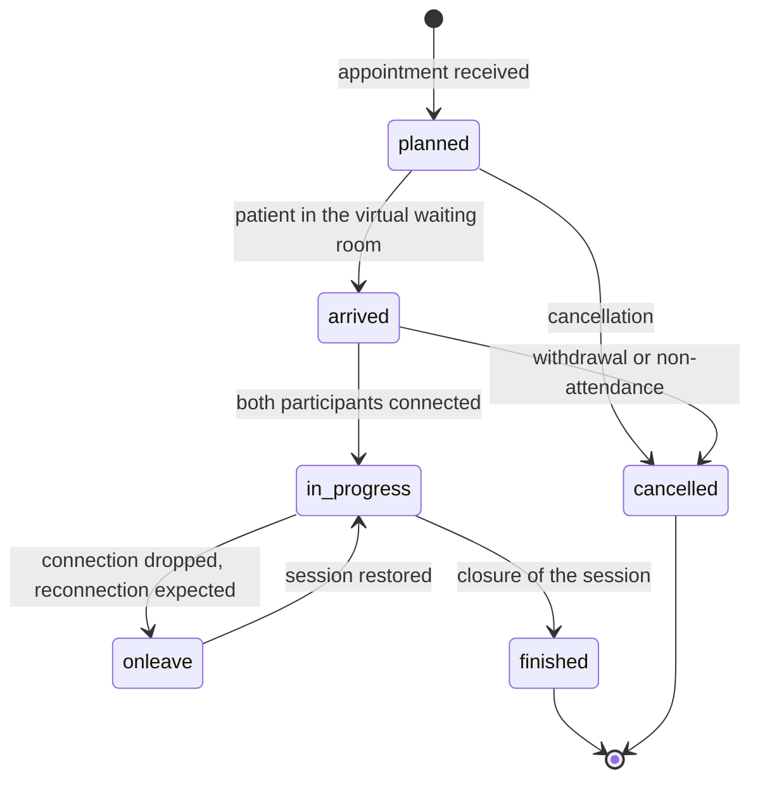

# FHIR from scratch

This is the central technical module of the guide. It assumes you have read
[the module on interoperability standards](05-standard-di-interoperabilita.md) - in
particular the sections on profiling and on terminologies, because they are taken as read
here.

It assumes nothing else. If you have never seen a FHIR resource, §2 starts from the JSON and
takes it apart piece by piece. If you have never written a REST call, §7 explains that
too.

All the examples contain **synthetic data only**.

---

## 1. What FHIR is and why it differs from what came before

### 1.1 The name and the idea

**FHIR** stands for *Fast Healthcare Interoperability Resources*. It is pronounced like the
English word *fire*. It is HL7 International's healthcare interoperability standard, developed
from the twenty-tens onwards, after two earlier generations - HL7 version 2, based on textual
messages with separators, and HL7 version 3, based on an abstract reference model of great
formal rigour and notorious difficulty of adoption.

The idea that sets FHIR apart from the two earlier generations comes down to three choices.

**First choice: the unit of exchange is the *resource*, not the message.** A **resource** is a
self-contained domain object, with an identity of its own, representing a clinical or
administrative concept a human being can recognise: a patient, an appointment, an
encounter, an observation, a consent, a document. It has an address of its own, it
can be read, modified and put in relation with other resources independently of the
context in which it was created. In HL7 version 2 the patient exists only *inside* an
ADT message; in FHIR the patient exists, and the messages reference them.

**Second choice: the eighty per cent rule.** Every resource contains the elements
needed in the great majority of real implementations, and not every element that
might be needed by somebody. All the rest is added with **extensions**, which are a
first-class mechanism provided for by the specification, not an escape from the
standard. The result is that a FHIR resource can be read in a page, rather than in a
chapter.

**Third choice: the technologies of the web, exactly as they are.** FHIR uses HTTP with its
real semantics (verbs, status codes, caching and concurrency headers), JSON and XML
as formats, OAuth for authorisation. It defines no transport protocol of its own,
no session mechanism of its own, no binary format of its own.
Whoever knows how to build a REST API already knows half of FHIR.

To these is added a fourth characteristic, less publicised and decisive: **FHIR is
self-describing**. The structure of the resources, the profiles, the value sets, the search
parameters and even a server's capabilities are themselves expressed as FHIR resources.
A client can interrogate a server and discover, programmatically, what that server
can do.

### 1.2 The releases, and why the project uses 4.0.1

FHIR has a version history it is essential to know, because the versions are not compatible
with one another.

| Release | Version | Date | Note |
|---|---|---|---|
| R4 | 4.0.0 | 27 December 2018 | First release with normative content **[V]** |
| **R4 technical correction** | **4.0.1** | **30 October 2019** | Corrections to the invariants and to the generated conformance resources **[V]** |
| R4B | 4.3.0 | 28 May 2022 | Limited evolution of R4 **[V]** |
| R5 | 5.0.0 | - | Current release of the main specification **[V]** |

The page of every R4 resource carries in its heading the wording `v4.0.1: R4 - Mixed
Normative and STU` **[V]**: it means that some parts of the specification are normative
(stable, with a backward-compatibility guarantee) and others are still in trial use.

> **Project rule:** when Telemedic declares «FHIR R4» it must declare **4.0.1**,
> not a generic «R4». Versions 4.0.0 and 4.0.1 differ in the invariants, and validators
> behave differently on the two.

**Why R4 and not R5 or later versions.** The reason is not a technical one, and it is
decisive: **the implementation guides the project rests on are built on R4 4.0.1**.

- The Italian telemedicine guides - `Televisita`, `Teleconsulto`, `Teleassistenza`,
  `Telemonitoraggio` - and the `IT-Core` guide are all on **FHIR 4.0.1** **[V]**.
- The IHE profiles the project implements are on **R4 (4.0.1)**: the one for mobile
  access to documents **[V]**, the one for the cross-referencing of identifiers **[V]**,
  the one for demographic query **[V]**, and the guide on audit trail patterns
  **[V]**.
- The authorisation specification for the launch of clinical applications, in the version
  in force since 1 March 2023, is based on **R4** **[V]**.

Adopting R5 would mean not being able to declare conformance with any of these. It would be
the technically most modern choice and a practically unusable one: **you choose the version
of the ecosystem you have to operate in, not the latest one published.**

### 1.3 What is lost by declaring R4, and how it is compensated for

Intellectual honesty: R4 has real gaps for a telemedicine project.

**First gap: R4 has no native way of describing a virtual session.** The only
semantic element available is the code that qualifies the mode of the encounter
as «virtual» **[V]**. There is no element in R4 for the address of the session, for the
channel type, for the access key. R5 filled the gap by introducing a data type dedicated
to virtual service details **[V]**.

The compensation exists and it is official: HL7 publishes a package of **cross-version
extensions** that exposes elements of R5 as extensions usable in R4. Verified
data **[V]**:

| Item | Value |
|---|---|
| Package | `hl7.fhir.uv.xver-r5.r4` |
| Version | **0.1.0**, STU status, **maturity level 0** |
| Canonical URL of the extension for the encounter | `http://hl7.org/fhir/5.0/StructureDefinition/extension-Encounter.virtualService` |
| Canonical URL of the extension for the appointment | `http://hl7.org/fhir/5.0/StructureDefinition/extension-Appointment.virtualService` |

Beware of two details that are almost always got wrong. First: the extension requires a
**mandatory** `_datatype` sub-extension with the fixed value `VirtualServiceDetail`
**[V]**; without it the instance does not validate. Second: the `address` sub-extension is
a **complex** extension, not a simple value **[V]** - **[NV]** its exact form
in instances has not been verified and must be established by resolving the package at the
pinned version before any code is written.

Maturity level 0 means that the extension **may change**. The package version must be pinned
and the risk must be documented.

The real structure of the data type in R5, verified **[V]**:

| Element | Card. | Type |
|---|---|---|
| `channelType` | 0..1 | `Coding` |
| `address[x]` | 0..1 | `url` \| `string` \| `ContactPoint` \| `ExtendedContactDetail` |
| `additionalInfo` | 0..* | `url` |
| `maxParticipants` | 0..1 | `positiveInt` |
| `sessionKey` | 0..1 | `string` |

The value set associated with `channelType` contains **only three codes, all referring to
third-party commercial videoconferencing platforms**, it is marked experimental and draft,
with the warning that it is not ready for production use, and it contains an evident
editorial error in the definition of one of the three codes **[V]**. The good news,
verified: **the binding is of `example` strength, not `required`** **[V]**. A sovereign
platform can therefore use a code system of its own with no approval process
whatsoever.

A security note to bear in mind from the very start: `sessionKey` and the address of a
virtual session are **access credentials to a clinical session**. Persisting them in
the clear in a searchable resource is a concrete risk. They must be treated as secrets with
a short expiry.

**Second gap: R4's model for subscribing to events is primitive.** It is discussed
in §6.21.

**Third gap: some resources change between R4 and R5.** The most insidious: the resource that
in R4 represents audio, video and image content **was removed in R5** **[V]**, and the
references to it were replaced with references to `DocumentReference`. Hence an
architectural rule of the project: **the video recording of a session is modelled on
`DocumentReference`, never on the removed resource.** It is the only R4 choice that would
become an unrecoverable debt at migration time.

**The coexistence strategy.** Telemedic's internal domain model is **independent
of the FHIR version**, and the mapping towards FHIR is an adaptation layer. The server's
capability statement declares `4.0.1`; a future R5 exposure becomes an additional
adapter, not a rewrite. The specification also provides for version negotiation
through the content type: `Accept: application/fhir+json; fhirVersion=4.0` **[V]**.

---

## 2. Anatomy of a resource

### 2.1 The bare minimum, commented

Here is a `Patient` resource. It is the starting point: read it line by line, then read the
explanations below.

```json
{
  "resourceType": "Patient",
  "id": "pat-0001",
  "meta": {
    "versionId": "3",
    "lastUpdated": "2026-09-14T09:12:44.118+02:00",
    "profile": [
      "http://hl7.it/fhir/televisita/StructureDefinition/PatientTelevisita"
    ]
  },
  "identifier": [
    {
      "system": "http://hl7.it/sid/codiceFiscale",
      "value": "RSSMRA80A01H501Z"
    }
  ],
  "active": true,
  "name": [
    {
      "use": "official",
      "family": "Rossi",
      "given": ["Mario"]
    }
  ],
  "telecom": [
    {
      "system": "phone",
      "value": "+390655512340",
      "use": "mobile"
    }
  ],
  "gender": "male",
  "birthDate": "1980-01-01",
  "address": [
    {
      "use": "home",
      "line": ["Via Roma 1"],
      "city": "Roma",
      "postalCode": "00100",
      "country": "IT"
    }
  ]
}
```

**`resourceType`** is mandatory in JSON and it is the first thing a parser reads: it says
which resource this is. Without it the document is not FHIR.

**`id`** is the resource's **logical identifier** **on that server**. It is the final part
of the URL at which the resource is reached: `https://server.example/fhir/Patient/pat-0001`. It
has no clinical meaning, it is not portable between servers, and it must never be shown to a
user as though it were a record number. It changes if the resource is copied elsewhere.

**`meta`** gathers the technical metadata:

- `versionId` - the resource's version number on that server. Every change increments
  it. It is the element on which concurrency control rests (§7.7).
- `lastUpdated` - the instant of the last change.
- `profile` - the list of profiles the resource **declares** it conforms to. It is a
  declaration, not a guarantee: only validation verifies it.
- `security` and `tag` - labels; the first has access-control meaning.

**`identifier`** is the **business identifier**: the number that has meaning in the real
world and is recognisable outside that server. It is an array because the same person
typically has several identifiers. Each identifier is composed of at least a `system` - which
declares **in which namespace** the value is unique - and a `value`.

> **The distinction between `id` and `identifier` is the first thing to internalise.** `id`
> is «where this resource sits on this server»; `identifier` is «who this person is in the
> world». Confusing them produces systems that cannot reconcile data across different
> deployments.

The other elements are content: name, contact details, administrative gender, date of birth,
address. Note that `name` is an array (a person may have an official name and a name in use),
that `given` is itself an array (several forenames), and that `birthDate` is a date
without a time, with a dedicated type.

### 2.2 Cardinality and obligation

Every element of a resource has a **cardinality** in the form `min..max`:

| Notation | Meaning |
|---|---|
| `0..1` | Optional, at most one. In JSON: a single object, or absent. |
| `1..1` | **Mandatory**, exactly one. |
| `0..*` | Optional, repeatable. In JSON: **always an array**, even with a single element. |
| `1..*` | Mandatory, at least one, repeatable. |
| `0..0` | **Forbidden**. It appears only in profiles, in order to prohibit an element. |

A practical serialisation rule: if the maximum cardinality is `*`, in JSON it is an array; if
it is `1`, it is a single value. Writing an array where a single object is expected is an
error validators catch immediately.

### 2.3 The data types you will meet every day

FHIR distinguishes **primitive types** (strings, numbers, dates, booleans, with format
constraints of their own) and **complex types** (structures with several elements). These are
the complex ones you will use continually.

#### `Identifier` - an identifier with its namespace

```json
{
  "use": "official",
  "type": {
    "coding": [
      {
        "system": "http://terminology.hl7.org/CodeSystem/v2-0203",
        "code": "NNITA"
      }
    ]
  },
  "system": "http://hl7.it/sid/codiceFiscale",
  "value": "RSSMRA80A01H501Z",
  "period": { "start": "1998-03-01" },
  "assigner": { "display": "Ministero dell'economia e delle finanze" }
}
```

`system` is the critical part: **a value without a `system` is not an identifier, it is a
string**. `NNITA` as a type deserves the note already seen in the previous module: the HL7
identifier type table does not contain an `NN` code, it contains a concept whose code is
literally `NNxxx`, with `xxx` to be replaced by the three-letter country code
**[V]**. `NNITA` is therefore a value generated by the rule, not an enumerated concept, and
**no published Italian profile fixes which code to use for the tax code (codice fiscale)**
**[V]**: the choice has to be agreed with the integrator.

#### `HumanName` - a name

```json
{
  "use": "official",
  "text": "Mario Rossi",
  "family": "Rossi",
  "given": ["Mario", "Giuseppe"],
  "prefix": ["Dott."]
}
```

`text` is the form already composed for display; the other parts are the decomposition.
When both are present, `text` prevails for presentation purposes. The value of
`use` distinguishes an official name, a name in use, a maiden name, a temporary name, an anonymous one.

#### `Address` - an address

```json
{
  "use": "home",
  "type": "physical",
  "line": ["Via Giuseppe Garibaldi 12", "Scala B, interno 7"],
  "city": "Bari",
  "district": "BA",
  "postalCode": "70121",
  "country": "IT"
}
```

`line` is an array because an address may have several lines. `country` uses the country
code.

#### `ContactPoint` - a contact detail

```json
{ "system": "email", "value": "m.rossi@esempio.invalid", "use": "home", "rank": 1 }
```

`system` distinguishes telephone, fax, email, web address, pager, other. `rank` expresses
preference: `1` is the most preferred.

#### `Period` - a time interval

```json
{ "start": "2026-09-14T10:01:03+02:00", "end": "2026-09-14T10:34:57+02:00" }
```

Both ends are optional: a period with only a `start` is an interval still
open. **Always write the time zone.** An instant without a zone is ambiguous, and in an
audit trail a two-hour ambiguity is the difference between a datum you can rely on and a useless one.

#### `Quantity` - a measurement

```json
{
  "value": 128,
  "unit": "mmHg",
  "system": "http://unitsofmeasure.org",
  "code": "mm[Hg]"
}
```

A fundamental distinction: `unit` is the string **for the human being**; `code` is the unit
**for the machine**, taken from the code system declared in `system`. Only `code`
allows automatic conversions and comparisons. Writing `unit` without `code` produces a datum
that cannot be processed.

#### `Reference` - a pointer to another resource

```json
{ "reference": "Patient/pat-0001", "display": "Mario Rossi" }
```

It is discussed at length in §4. `display` is an aid to human reading and **is not
authoritative**: a client must never rely on it for application logic.

#### `Attachment` - binary content or a reference to it

```json
{
  "contentType": "application/pdf",
  "url": "https://server.example/fhir/Binary/bin-0042",
  "size": 184320,
  "hash": "3q2+7wAAAAAAAAAAAAAAAAAAAAA=",
  "title": "Televisita report of 14 September 2026",
  "creation": "2026-09-14T10:41:00+02:00"
}
```

As an alternative to `url` it may contain `data`, with the content encoded in base64. For
content of non-trivial size, `url` is the correct choice: embedding a video in a
JSON resource makes the resource unusable.

#### Elements with a choice of type

Some elements admit several alternative types. In the documentation they are written with a
trailing `[x]`: `value[x]`, `effective[x]`, `deceased[x]`. In instances the name is composed
by concatenating the type with its initial capitalised:

```json
{ "effectiveDateTime": "2026-09-14T10:20:00+02:00" }
```

or else

```json
{ "effectivePeriod": { "start": "2026-09-14T10:00:00+02:00" } }
```

**Only one of the two may be present.** Having two is a conformance error.

### 2.4 Extensions

When information the resource does not provide for has to be represented, an **extension**
is used. It is not a violation of the standard: it is the mechanism the standard provides for.

```json
{
  "resourceType": "Patient",
  "id": "pat-0002",
  "extension": [
    {
      "url": "http://hl7.it/fhir/StructureDefinition/luogoNascita",
      "valueAddress": {
        "city": "Firenze",
        "district": "FI",
        "country": "IT"
      }
    }
  ],
  "identifier": [
    { "system": "http://hl7.it/sid/codiceFiscale", "value": "VRDLGU75E41D612B" }
  ],
  "name": [{ "family": "Verdi", "given": ["Luigia"] }],
  "birthDate": "1975-05-01"
}
```

The rules of an extension:

1. **`url` is mandatory** and it is the canonical URL of the definition. It is not an address
   to visit: it identifies the extension. An extension without a URL defined somewhere is
   unusable by whoever receives it.
2. An extension has **either** a value (`value[x]`) **or** nested sub-extensions, never
   both.
3. Extensions can be applied to any element, not only to the root of the
   resource. On primitive types the underscore form is used: `_birthDate`.

There is a special variant, `modifierExtension`, for the case in which the added information
**changes the meaning** of the rest of the resource - for example by negating it. The rule
is severe: **a system that does not recognise a `modifierExtension` cannot process the
resource**, it must refuse it. It is a safety mechanism: it prevents a receiver from ignoring
information that overturns the sense of the datum.

---

## 3. `CodeableConcept` and `Coding`, properly explained

This is the section on which the semantic correctness of the whole system depends.

### 3.1 The structure

```json
{
  "coding": [
    {
      "system": "http://loinc.org",
      "version": "2.81",
      "code": "75496-0",
      "display": "Telehealth Note",
      "userSelected": true
    }
  ],
  "text": "Referto di televisita"
}
```

A **`CodeableConcept`** represents *one concept*. It contains:

- **`coding`** - zero or more codings **of the same concept** in different code
  systems;
- **`text`** - the textual representation of the concept, intended for the human being.

A **`Coding`** is a single coding. It contains:

- **`system`** - the canonical URI of the code system. **It is the element that gives the code
  its meaning.**
- **`version`** - the version of the code system, where the code or its description
  may vary between versions.
- **`code`** - the symbol, exactly as defined in the system. It is case sensitive.
- **`display`** - the official description of the code **according to that system**. It is not a
  free-text field.
- **`userSelected`** - true if this is the coding the user actually chose,
  the others being derived translations.

### 3.2 The three rules most often broken

**Rule 1 - `system` is not optional, ever.**

```json
// WRONG
{ "coding": [{ "code": "75496-0", "display": "Telehealth Note" }] }

// CORRECT
{ "coding": [{ "system": "http://loinc.org", "code": "75496-0", "display": "Telehealth Note" }] }
```

In the first case you have written the string `75496-0`. In the second you have written a
fact. A receiver that has an internal list of its own can interpret the first as anything at
all, and it will.

For some terminologies the omission of the `system` is not merely a technical error. The
licence of the World Health Organization's international classification of diseases requires
verbatim that incorporation into software, **in transmission and in
storage, include code, title and URI** **[V]**. Writing a code without its URI
is a departure from a **condition of the licence**, not an oversight.

**Rule 2 - `display` is the official description of the code, not a free label.**

```json
// WRONG - display «italianised» at will
{ "system": "http://loinc.org", "code": "75496-0", "display": "Nota di telemedicina" }

// CORRECT - official display, Italian text in text
{
  "coding": [
    { "system": "http://loinc.org", "code": "75496-0", "display": "Telehealth Note" }
  ],
  "text": "Referto di televisita"
}
```

This is not terminological pedantry: as explained in the previous module, **a translation of
the LOINC displays is a derivative work whose rights are assigned to the rights holder**
**[V-sec]**, and the project is not the rights holder. The Italian label visible to the user
is an interface string, which lives in the internationalisation files; the Italian clinical
text goes into `text`. **[V]**

**Rule 3 - several `coding` mean the same concept in different systems, not different
concepts.**

```json
// WRONG - two distinct clinical concepts in the same CodeableConcept
{
  "coding": [
    { "system": "http://hl7.org/fhir/sid/icd-9-cm", "code": "427.31" },
    { "system": "http://hl7.org/fhir/sid/icd-9-cm", "code": "401.9" }
  ]
}
```

In FHIR's model those two codings assert that they describe **the same thing**. A
receiver that knows only one of them will use it. Two distinct clinical conditions are two
separate elements, not two `coding` of the same element.

### 3.3 `Coding` or `CodeableConcept`?

The specification uses `Coding` - with no wrapper - where the value is by its nature a single
code from a single system, and there is no sense in representing it in several codings.
Verified example: the element that qualifies the class of the encounter is of type
`Coding`, cardinality `1..1`, with an *extensible* binding **[V]**. You do not put a
`CodeableConcept` there.

Conversely, elements such as reasons, diagnoses and service types are
`CodeableConcept`, because the same concept often has to be expressed in several systems
at once in order to satisfy different receivers.

---

## 4. References between resources

A resource points to another through an element of type `Reference`. There are four ways
of doing it, and choosing the wrong one produces systems that work in the laboratory and
break in integration.

### 4.1 Relative reference

```json
{ "subject": { "reference": "Patient/pat-0001" } }
```

It is resolved against the base URL of the server that exposes the resource. It is **the
default form** and it must be used for all references internal to the same server. It is also
the only form that survives the copying of an entire set of resources onto another server,
provided they are copied together.

### 4.2 Absolute reference

```json
{ "subject": { "reference": "https://anagrafe.example/fhir/Patient/98721" } }
```

It points to a resource on **another server**. It is correct when the resource really does sit
elsewhere, and it is dangerous for two reasons: it creates a network dependency at read time, and
in a multi-tenant context it can become a vector for information leakage if the client
follows the link blindly. If you use it, the set of reachable servers must be limited
to an explicit list.

### 4.3 Logical reference

```json
{
  "subject": {
    "identifier": {
      "system": "http://hl7.it/sid/codiceFiscale",
      "value": "RSSMRA80A01H501Z"
    },
    "display": "Mario Rossi"
  }
}
```

It does not point to an address: it points to **an identity in the world**. It is the correct
form when the receiver knows the person but does not know - or must not know - the technical
address of the resource on the server of origin.

**It is the form the project uses in its dialogue with integrators**, because it directly
satisfies the constraint not to duplicate demographic registries: Telemedic works by
reference on the integrator's identifier, without becoming the principal registry for
demographic data.

### 4.4 Contained resource

```json
{
  "resourceType": "Observation",
  "id": "obs-0001",
  "contained": [
    {
      "resourceType": "Device",
      "id": "dev-inline",
      "deviceName": [{ "name": "Home sphygmomanometer", "type": "user-friendly-name" }]
    }
  ],
  "status": "final",
  "code": {
    "coding": [{ "system": "http://loinc.org", "code": "8480-6", "display": "Systolic blood pressure" }]
  },
  "subject": { "reference": "Patient/pat-0001" },
  "device": { "reference": "#dev-inline" }
}
```

A **contained** resource lives inside another and has no autonomous existence: it has no
URL of its own, it is not searchable, it is not updatable separately. It is referenced with `#`
followed by the local `id`.

**When to use it:** only when the contained resource makes no sense outside its container
and will never be referenced by anything else. **When not to use it:** for patients,
professionals, organisations, registered devices. Containing a `Patient` means creating a copy of the
person that nobody will be able to correlate with anything else - the exact opposite of FHIR's purpose.

**[V]** The LOINC code `8480-6` used in the example was not verified during the project's
research phase: **[NV]**, it must be confirmed before real use.

### 4.5 References inside a `Bundle`

When several resources travel together in a `Bundle` and none of them has yet been
created on the server - and therefore none of them yet has an `id` - temporary identifiers
in the form `urn:uuid:` are used:

```json
{
  "resourceType": "Bundle",
  "type": "transaction",
  "entry": [
    {
      "fullUrl": "urn:uuid:8f14e45f-ceea-467a-9f0a-5f0f6bde1c21",
      "resource": { "resourceType": "Patient", "name": [{ "family": "Rossi", "given": ["Mario"] }] },
      "request": { "method": "POST", "url": "Patient" }
    },
    {
      "fullUrl": "urn:uuid:2c1743a3-91b8-4a3c-90ee-1f4a8e1c9f77",
      "resource": {
        "resourceType": "Encounter",
        "status": "planned",
        "class": {
          "system": "http://terminology.hl7.org/CodeSystem/v3-ActCode",
          "code": "VR",
          "display": "virtual"
        },
        "subject": { "reference": "urn:uuid:8f14e45f-ceea-467a-9f0a-5f0f6bde1c21" }
      },
      "request": { "method": "POST", "url": "Encounter" }
    }
  ]
}
```

The server, in processing the transaction, assigns the real identifiers and **rewrites the
references** accordingly. It is the mechanism by which sets of linked resources are created
atomically.

### 4.6 Decision summary

| Situation | Form to use |
|---|---|
| Resource on the same server | Relative reference |
| Resource on another server, address known and reliable | Absolute reference, with a list of permitted servers |
| The receiver knows the identity but not the technical address | Logical reference (by `identifier`) |
| Fragment with no autonomous existence | Contained resource with `#` |
| Resources created together in a transaction | `urn:uuid:` plus `fullUrl` |

---

## 5. Profiles, extensions, value sets, code systems, bindings

### 5.1 `StructureDefinition`: the resource that defines the resources

A profile is itself a FHIR resource, of type `StructureDefinition`. Here is how its
skeleton is read:

```json
{
  "resourceType": "StructureDefinition",
  "id": "EncounterTelemedic",
  "url": "https://telemedic.example/fhir/StructureDefinition/EncounterTelemedic",
  "version": "1.0.0",
  "name": "EncounterTelemedic",
  "status": "draft",
  "fhirVersion": "4.0.1",
  "kind": "resource",
  "abstract": false,
  "type": "Encounter",
  "baseDefinition": "http://hl7.it/fhir/televisita/StructureDefinition/EncounterTelevisita",
  "derivation": "constraint",
  "differential": {
    "element": [
      {
        "id": "Encounter.class",
        "path": "Encounter.class",
        "patternCoding": {
          "system": "http://terminology.hl7.org/CodeSystem/v3-ActCode",
          "code": "VR"
        }
      },
      {
        "id": "Encounter.serviceProvider",
        "path": "Encounter.serviceProvider",
        "min": 1,
        "mustSupport": true
      }
    ]
  }
}
```

The elements that matter:

- **`url`** - the canonical URL of the profile. It is the global identifier, the one instances
  write in `meta.profile`.
- **`type`** - the type of resource profiled.
- **`baseDefinition`** - the profile or the resource it derives from. Here the chain is visible:
  this profile derives from the Italian profile, which derives from the base resource.
- **`derivation`** - `constraint` if it restricts, `specialization` if it defines a new type.
- **`differential`** - **only the differences** relative to the base.
- **`snapshot`** - the complete resulting structure, with all the elements. The specification
  recommends that profiles used in systems in service have the snapshot populated
  **[V]**: without it, a validator has to rebuild it by climbing back up the chain.

In the example, the project profile does two things the Italian profile does not: it fixes the
class of the encounter to the code for the virtual mode, and it makes the indication of
the providing organisation mandatory. Both are restrictions, and therefore legitimate.

### 5.2 How to read a profile's page

The generated page of a profile shows a table with these columns, which should be read in
this order:

1. **Name of the element**, with indentation indicating the nesting.
2. **Cardinality** - always first, after the name. Half of failed validations are down
   to a mandatory element left unpopulated.
3. **Type**, and for references the list of permitted types. **It is binding.** A verified
   example worth memorising: in R4 the element that lists the participants in an
   encounter admits references to the professional, the professional's role and the
   related person, **but not to the patient** **[V]**. The patient is expressed with the element
   dedicated to the subject. Modelling them as a participant is a conformance error that
   validators flag.
4. **Flags** - *summary*, *modifier*, *must support*.
5. **Binding** and its strength.
6. **Description and constraints**, including the invariants.

### 5.3 Slicing

A repeated element can be partitioned into **slices**: subsets with constraints of their own.
It is the mechanism by which a profile says «among your identifiers, the one with this
`system` is the tax code, it must be present and it is unique».

The partition requires a **discriminator**: the rule by which it is established which slice
an occurrence belongs to. There are five permitted types **[V]**: by value, by existence, by
pattern, by type, by profile. The typical case of the Italian identifiers uses the
value discriminator on `system` **[V]**.

Each slice must then constrain the discriminating element with a fixed value, a pattern or a
required binding **[V]**: without that, the validator cannot assign the occurrences.

Example of a differential defining two identifier slices:

```json
{
  "differential": {
    "element": [
      {
        "id": "Patient.identifier",
        "path": "Patient.identifier",
        "slicing": {
          "discriminator": [{ "type": "value", "path": "system" }],
          "rules": "open"
        },
        "min": 1
      },
      {
        "id": "Patient.identifier:codiceFiscale",
        "path": "Patient.identifier",
        "sliceName": "codiceFiscale",
        "min": 0,
        "max": "1",
        "patternIdentifier": { "system": "http://hl7.it/sid/codiceFiscale" }
      },
      {
        "id": "Patient.identifier:idIntegratore",
        "path": "Patient.identifier",
        "sliceName": "idIntegratore",
        "min": 0,
        "max": "*"
      }
    ]
  }
}
```

`rules: "open"` means that occurrences falling into no slice are admitted -
and it is the correct choice here, because the integrator can bring identifiers of their own.

### 5.4 Must support: the constraint that has to be defined

The specification is explicit **[V]**:

> *"The meaning of 'support' is not defined by the base FHIR specification."*

The meaning has to be established by the profile. **An Implementation Guide that marks elements
as «must support» without saying what that means is technically useless.** Telemedic must
declare its own definition, which typically is: the system must be able to populate
the element when the datum exists, and must be able to process it when it receives it, without
discarding it.

### 5.5 Value sets, code systems, bindings

The `CodeSystem` defines the codes; the `ValueSet` selects a subset of them; the binding
ties an element to a value set with a strength.

A `ValueSet` selects in two ways. By enumeration:

```json
{
  "resourceType": "ValueSet",
  "url": "https://telemedic.example/fhir/ValueSet/sezioni-referto",
  "version": "1.0.0",
  "status": "draft",
  "copyright": "This material contains content from LOINC (http://loinc.org). LOINC is Copyright © Regenstrief Institute, Inc. and the Logical Observation Identifiers Names and Codes (LOINC) Committee and is available at no cost under the license at http://loinc.org/license. LOINC® is a registered United States trademark of Regenstrief Institute, Inc.",
  "compose": {
    "include": [
      {
        "system": "http://loinc.org",
        "version": "2.81",
        "concept": [
          { "code": "47045-0", "display": "Study report" },
          { "code": "29545-1", "display": "Physical findings" }
        ]
      }
    ]
  }
}
```

Note the `copyright` element: for a value set that includes LOINC codes **attribution is
mandatory** **[V]**, and it goes there, not only in the project's notes file.

Or else by filter, which is the form to use with terminologies whose content cannot
sit in the repository:

```json
{
  "compose": {
    "include": [
      {
        "system": "http://snomed.info/sct",
        "filter": [{ "property": "concept", "op": "is-a", "value": "404684003" }]
      }
    ]
  }
}
```

This form **enumerates nothing**: it declares a selection rule. It is admissible in the
repository because it does not redistribute content; the actual expansion is produced at runtime
by a terminology service configured by the deployer. **A value set with an `expansion`
populated by SNOMED codes is not admissible in the repository, under any circumstances.** **[V]**

The four binding strengths, in order of severity **[V]**: `example` < `preferred` <
`extensible` < `required`. A profile may tighten, **it may not relax a binding that is already
`required`** **[V]**.

---

## 6. The resources that matter for Telemedic

For each of them: what it is for, the elements that matter, how the project uses it, and the
traps.

### 6.1 `Patient`

**What it is for.** It represents the person receiving care.

**Elements that matter** **[V]**: `identifier` (`0..*`), `active`, `name` (`0..*`,
`HumanName`), `telecom`, `gender` (*required* binding), `birthDate`, `address`,
`communication.language` (*preferred* binding), `generalPractitioner`,
`managingOrganization`, `link` (to link resources representing the same person).

**How Telemedic uses it.** The project **is not the principal demographic registry**: it
works by reference on the integrator's identifier, adding the slices of the national
identifiers where available. The Italian profile `PatientItCore` takes
`identifier` to `1..*`, `name` to `1..*` and `birthDate` to `1..1` **[V]**: in Italy a
patient without at least one identifier, a name and a date of birth is not conformant.

**Trap.** See §8.4: the Italian guides diverge on the URI of the code system for the
tax code.

### 6.2 `Practitioner`

**What it is for.** The natural person of the healthcare professional, with their qualifications.

**Critical distinction** **[V]**: `Practitioner` contains the person's data and their
credentials; it does **not** contain the organisational context in which they work.

### 6.3 `PractitionerRole`

**What it is for.** The **role** of a professional at an organisation: where they work,
which services they provide, with which specialty, in which period. The specification describes it as
what documents the *"location and types of services that Practitioners are able to provide
for an organization"* **[V]**.

**Elements that matter** **[V]**: `practitioner`, `organization`, `code` (the role),
`specialty` (*preferred* binding), `location`, `healthcareService`, `telecom`,
`availableTime`, `period`, `endpoint`.

**How Telemedic uses it - binding rule.** In a multi-tenant system, **the
professional who provides a service must be referenced through `PractitionerRole`, not
through `Practitioner`**. It is the role - professional X, at organisation Y, with
specialty Z - that is pertinent to the tenant, not the personal credentials. This choice
follows directly from the constraint of tenant awareness on every entity.

### 6.4 `Organization`

**What it is for.** The body: health authority, outpatient clinic, group practice, ward.
It has a hierarchy (`partOf`) that allows internal subdivisions to be represented.

**How Telemedic uses it.** It is the pivot of the tenant model: the providing organisation is
the element that ties the encounter to the tenant.

**[NV]** The precise list of the elements of `Organization` in R4 was not verified
during the project's research phase; it must be read in the specification before the profile is written.

### 6.5 `Location`

**What it is for.** A physical or virtual place in which care is provided.

**How Telemedic uses it.** The interesting case is the **virtual room**: a `Location` can
represent it, and it is the natural way of giving a stable identity to a session space
that has no geographical coordinates.

**[NV]** The precise elements of `Location` in R4 and the value set of location types have not
been verified; they must be read in the specification.

### 6.6 `Appointment`

**What it is for.** The appointment: who, when, what for, with which confirmation status.

**Elements that matter** **[V]**: `identifier`, `status` (`1..1`, *required*),
`cancelationReason`, `serviceCategory`, `serviceType`, `specialty`, `appointmentType`,
`reasonCode`, `start` / `end` (`instant`), `minutesDuration`, `slot`, `comment`,
`patientInstruction`, `basedOn`, and above all **`participant` (`1..*`)** with
`participant.actor`, `participant.required` and **`participant.status` (`1..1`)**.

The permitted statuses **[V]**: `proposed`, `pending`, `booked`, `arrived`, `fulfilled`,
`cancelled`, `noshow`, `entered-in-error`, `checked-in`, `waitlist`.

**How Telemedic uses it.** The diary is born in the integrator's system: Telemedic receives an
appointment already in `booked` status and **does not manage** the
`proposed → pending → booked` negotiation.

**Verified trap.** In R4 `Appointment` **has no element for the address of the
virtual session** **[V]**. The options are the cross-version extension (§1.3), a
reference to an `Endpoint` resource in `supportingInformation`, or else the patient
instruction field - which, however, is free text and cannot be processed.

### 6.7 `AppointmentResponse`

**What it is for.** A participant's response to an appointment.

**Elements** **[V]**: `appointment` (`1..1`), `start`/`end`, `participantType`, `actor`,
`participantStatus` (`1..1`, *required*), `comment`. **Invariant:** at least one of
`participantType` and `actor` must be populated **[V]**.

**How Telemedic uses it.** For the case «the patient confirms their participation in the
session».

### 6.8 `Schedule` and `Slot`

**What they are for.** `Schedule` is the availability calendar of a resource (a
professional, a room, a service); `Slot` is the individual bookable window inside
a `Schedule`.

**How Telemedic uses them.** Only when the diary is managed by the project - that is, when the
project's own diary module is active. When the diary already exists in the integrator's
system, the project does not populate them: it receives appointments already formed.

**[NV]** The precise elements of `Schedule` and `Slot` in R4 were not verified during the
research phase; they must be read in the specification before implementation.

### 6.9 `Encounter`

**What it is for.** The **encounter**: the interaction between a patient and one or more
professionals, with its duration, its participants, its reason and its administrative
outcome. It is the central resource of the session model.

**Elements that matter** **[V]**:

| Element | Card. | Type | Binding |
|---|---|---|---|
| `identifier` | 0..* | `Identifier` | - |
| `status` | **1..1** | `code` | *required* |
| `statusHistory` | 0..* | structure with `status` (`1..1`) and `period` (`1..1`) | - |
| **`class`** | **1..1** | **`Coding`** | *extensible* |
| `type` | 0..* | `CodeableConcept` | *example* |
| `serviceType` | 0..1 | `CodeableConcept` | *example* |
| `subject` | 0..1 | `Reference(Patient｜Group)` | - |
| `participant.type` | 0..* | `CodeableConcept` | *extensible* |
| `participant.individual` | 0..1 | `Reference(Practitioner｜PractitionerRole｜RelatedPerson)` | - |
| `appointment` | 0..* | `Reference(Appointment)` | - |
| `period` | 0..1 | `Period` | - |
| `reasonCode` | 0..* | `CodeableConcept` | *preferred* |
| `diagnosis.condition` | 1..1 | `Reference(Condition｜Procedure)` | - |
| `location.location` | 1..1 | `Reference(Location)` | - |
| `serviceProvider` | 0..1 | `Reference(Organization)` | - |
| `partOf` | 0..1 | `Reference(Encounter)` | - |

The nine permitted statuses **[V]**: `planned`, `arrived`, `triaged`, `in-progress`, `onleave`,
`finished`, `cancelled`, `entered-in-error`, `unknown`.

**The code for the virtual mode.** The value set for `class` is HL7's encounter class
code system **[V]**, and the code that denotes the remote mode is
**`VR`** (*virtual*), defined as **[V]**:

> *"A patient encounter where the patient and the practitioner(s) are not in the same
> physical location."*

It should be noted that the definition is deliberately broad and covers asynchronous modes too:
`class = VR` on its own **does not say «real-time video consultation»**. Further qualification
is needed.

**How Telemedic uses it.** The life cycle of the session is projected onto the statuses, and
`statusHistory` is the correct place in which to persist the trajectory:



`statusHistory` **sits alongside** the database's historicisation tables, it does not
replace them: the first is the interoperable form, the second are the internal guarantee of
immutability.

**Three verified traps.**

1. **`participant.individual` cannot reference `Patient`** **[V]**. The patient is
   `subject`.
2. **`class` is mandatory in R4** and becomes repeatable and optional in R5 **[V]**: whoever
   writes code that generates an `Encounter` must always populate it.
3. **`reasonCode` has a *preferred* binding to a value set that includes around four thousand
   SNOMED codes** **[V]**. *Preferred* means that a different code is admitted - and it is
   exactly the route the project takes, because SNOMED CT in Italy entails a
   costly licence (see the previous module, §8.4).

### 6.10 `Composition`

**What it is for.** It is **the report**. It represents a clinical document structured in sections,
with an author, an attester, a custodian and a title.

**Elements that matter** **[V]**: `identifier`, `status` (`1..1`), `type` (**`1..1`**),
`category`, `subject`, `encounter`, `date` (**`1..1`**), `author` (**`1..*`**), `title`
(**`1..1`**), `confidentiality`, `attester` (with `mode`, `time`, `party`), `custodian`,
`relatesTo`, `event`, `section`.

**The document paradigm.** The specification establishes **[V]**:

- a FHIR document is a `Bundle` of type `document` with the `Composition` as the **first
  entry**;
- the identity of the document is in `Bundle.identifier`, globally unique and **never reused**;
- *"once assembled into a bundle, the document is immutable - its content can never be
  changed, and the document id can never be reused"*;
- digital signatures apply to the `Bundle`;
- the `$document` operation generates the bundle starting from the `Composition`.

**How Telemedic uses it.** The *remote consultation (televisita)* report **is a `Composition`**, not a
`DiagnosticReport`. The reason is twofold: the Italian guide models it that way (profile
`CompositionRefertoTelevisita` **[V]**), and the nature of the content - narrative and drafted by
the doctor - corresponds to the boundary the specification itself draws **[V]**: laboratory,
pathology and imaging reports use `DiagnosticReport`; for predominantly narrative content
with less workflow structure *"the Composition resource
would be more appropriate"*.

Verified constraints of the Italian profile **[V]**: `type` fixed to the LOINC code **`75496-0`**
(*Telehealth Note*), title fixed to the pattern «Referto di Televisita», `attester` with a
mandatory slice in `legal` mode, `section` with cardinality `2..*` and the «report» section
(LOINC code `47045-0`) **mandatory at `1..1`**.

### 6.11 `DocumentReference`

**What it is for.** **Metadata** about a document, distinct from the document itself. The specification
is explicit **[V]**: *"DocumentReference is metadata describing a document"*, and it is the
resource typically used in document indexing systems.

**Elements that matter** **[V]**: `masterIdentifier`, `identifier`, `status` (`1..1`),
`docStatus`, `type` (*preferred*), `category`, `subject`, `date`, `author`, `authenticator`,
`custodian`, `relatesTo` (with `code` and `target`), `securityLabel`, **`content` (`1..*`)** with
`content.attachment` (`1..1`) and `content.format`, and the `context` block with `encounter`,
`event`, `period`, `facilityType`, `practiceSetting`, `sourcePatientInfo`.

**How Telemedic uses it - two distinct uses.**

1. **Indexing of the report**: once the document has been assembled, a
   `DocumentReference` is created that indexes it and makes it retrievable. It is the hook towards
   the IHE profile for document publication.
2. **Video recording of the session**: it is modelled on `DocumentReference` with
   `content.attachment.contentType` populated with the type of the video container **negotiated at
   runtime and never presumed** (constraint [`V-11`](../11_registri/01-vincoli-in-vigore.md#v-11), [`04_protocols/02 §10.3`](/04_protocols/02-fhir.md)).
   **Never** on
   the resource removed in R5 **[V]**.

### 6.12 `DiagnosticReport`

**What it is for.** The report of a diagnostic service, typically with a mixture of
atomic results, interpretation and formatted rendering.

**Elements that matter** **[V]**: `status` (`1..1`), `category`, `code` (**`1..1`**,
*preferred* binding to LOINC codes), `subject`, `encounter`, `effective[x]`, `issued`,
`performer`, `resultsInterpreter`, `result` (references to `Observation`), `conclusion`,
`conclusionCode`, `presentedForm`.

**How Telemedic uses it - and the constraint that governs that use.** `DiagnosticReport` is
kept as a **read-only projection**, for integrators who can consume only
this resource. It is never the primary artefact.

The constraint of regulatory separation requires that its production be **persistence
of content drafted by the doctor**, not autonomous generation of clinical information. In
concrete terms: `presentedForm` contains the signed attachment, and `conclusion` contains **the text
drafted by the doctor**, never text generated by the system. This is not a stylistic preference:
software that *provides information used for diagnostic or therapeutic decisions* falls
into a different regulatory class.

### 6.13 `Observation`

**What it is for.** An observation: a measurement, a finding, a value. It is the most used resource
in FHIR.

**Elements that matter** **[V]**: `status` (`1..1`), `category`, `code` (**`1..1`**),
`subject`, `focus`, `encounter`, `effective[x]`, `issued`, `performer`, **`value[x]`**,
`dataAbsentReason`, `interpretation`, `note`, `bodySite`, `method`, `device`,
`referenceRange`, `hasMember`, `derivedFrom`, `component`.

**Verified critical note.** The types permitted for `value[x]` in R4 are **[V]**: `Quantity`,
`CodeableConcept`, `string`, `boolean`, `integer`, `Range`, `Ratio`, `SampledData`, `time`,
`dateTime`, `Period`. **Neither `valueAttachment` nor `valueReference` exists in R4**: whoever
designs the persistence of measurements must keep to this list.

**How Telemedic uses it.** Two uses: the clinical observations inside the report, and the
measurements from remote monitoring coming from a third-party gateway or from manual entry by the
patient.

**Architectural warning.** The technical metrics of connection quality - round-trip
time, packet loss, delay variation - **are not clinical observations** and must not be
modelled as `Observation` with the patient as subject: they would pollute the clinical record
with technical data. They live in the time series database. Should it one day be necessary
to expose them in FHIR, the subject would be a device or a
location, not a person.

### 6.14 `Condition`

**What it is for.** A problem, a diagnosis, a clinical condition.

**Elements that matter** **[V]**: `clinicalStatus` (modifier, *required*),
`verificationStatus` (modifier, *required*), `category` (*extensible*), `severity`,
`code`, `bodySite`, `subject` (**`1..1`**), `encounter`, `onset[x]`, `abatement[x]`,
`recordedDate`, `recorder`, `asserter`, `stage`, `evidence`, `note`.

**Three invariants that make validations fail more than anything else** **[V]**:

1. *"Condition.clinicalStatus SHALL be present if verificationStatus is not
   entered-in-error and category is problem-list-item"*;
2. *"Condition.clinicalStatus SHALL NOT be present if verificationStatus is
   entered-in-error"*;
3. if the condition has ceased, the clinical status must be `inactive`, `resolved` or
   `remission`.

They must be coded as domain rules in the backend, not left to the validator at runtime.

### 6.15 `Consent`

**What it is for.** It records a consent: who gave it, to what, in which period, with which
exceptions.

**Elements that matter** **[V]**: `status` (`1..1`, modifier), `scope` (**`1..1`**,
modifier, *extensible*), `category` (**`1..*`**), `patient`, `dateTime`, `performer`,
`organization`, `source[x]`, `policy`, `policyRule`, `verification`, and the
`provision` block with `type` (`deny`/`permit`), `period`, `actor`, `action`, `securityLabel`,
`purpose`, `data`, and the recursion `provision.provision`.

The value set for `scope` contains four codes **[V]**: advance directives, research,
**privacy** and treatment.

**How Telemedic uses it.** Consent to the encrypted recording of the session is modelled
with the privacy scope, `provision.type = permit`, the period that bounds the
retention and the permitted action. **Revocation is a transition to `inactive` with the
corresponding provenance resource, never a deletion**: a deleted consent
proves nothing, a revoked consent proves everything.

The content of the privacy notice must state explicitly that, with recording
switched on, the session **is no longer encrypted end to end**. It is an unavoidable technical
consequence of the server-side recording architecture, and it must be said to the patient.

### 6.16 `Questionnaire` and `QuestionnaireResponse`

**What they are for.** `Questionnaire` defines a structured set of questions, with their
hierarchy, the permitted answer types and the rules of conditional visibility.
`QuestionnaireResponse` is a set of answers completed by somebody, at a precise
moment.

**How Telemedic uses them.** They are the basis of the structured questionnaires completed by the patient
in the remote monitoring pathway, and of the information-gathering forms before the
session. The answers resource can be linked to observations through the
derivation and membership elements **[V]**.

**[NV]** The precise elements of `Questionnaire` and `QuestionnaireResponse` in R4 and the
population and extraction mechanism were not verified during the project's research phase:
they must be read in the specification before implementation.

### 6.17 `Device`

**What it is for.** A device: measuring instrument, equipment, software.

**How Telemedic uses it.** In remote monitoring, to identify the source of a measurement.
The project's perimeter is precise: **Telemedic does not communicate directly with medical
devices**, it receives the measurements from a third-party gateway. The `Device` resource serves to
track *where the measurement comes from*, not to command the equipment.

**[NV]** The precise elements of `Device` and `DeviceMetric` in R4 were not verified;
they must be read in the specification.

### 6.18 `AuditEvent`

**What it is for.** It records **who did what, when, with what outcome**.

**Elements that matter** **[V]**: `type` (**`1..1`**, `Coding`, *extensible*), `subtype`,
`action` (*required*), `period`, `recorded` (**`1..1`**, `instant`), `outcome`,
`purposeOfEvent`, **`agent` (`1..*`)** with `agent.who`, `agent.requestor` (**`1..1`**,
boolean), `agent.network`, `agent.purposeOfUse`, **`source` (`1..1`)** with
`source.observer` (**`1..1`**), and `entity`.

**The fact that makes everything consistent** **[V]**: the specification declares that the resource is based
on the audit trail definitions of the dedicated IHE profile, with an information model derived
from annex A.5 of part 15 of the DICOM standard, and is *"managed
collaboratively between HL7, DICOM, and IHE"*.

**How Telemedic uses it.** A **single internal audit trail model**, serialisable both
as a FHIR resource (for the API) and in the XML format provided for by the IHE transaction (for
sending to the integrator's repository). The IHE guide on basic patterns provides the
concrete models, including the two for the communication of data to third parties **[V]** - which
are exactly the ones needed when the report is returned to the system of origin.

### 6.19 `Provenance`

**What it is for.** It records **where a datum comes from and who produced it**.

**Elements that matter** **[V]**: `target` (**`1..*`**), `occurred[x]`, `recorded`
(**`1..1`**), `policy`, `location`, `reason`, `activity`, **`agent` (`1..*`)** with
`agent.who` (**`1..1`**) and `agent.onBehalfOf`, `entity` with `entity.role` (**`1..1`**,
*required*) and `entity.what` (**`1..1`**), and `signature`.

**The boundary with `AuditEvent`, verbatim from the specification** **[V]**:

> *"Provenance resources are prepared by the application that initiates the create/update
> etc. of the resource. An AuditEvent resource contains overlapping information, but is
> created as events occur, to track and audit the events."*

In practice: **`Provenance` answers «where does this datum come from»**, `AuditEvent` answers
**«who did what»**. Both are needed. For every report produced a
`Provenance` must be emitted that links the document to the role of the professional who drafted it, to the
session that originated it and to the signature that attests to it: it is the chain of clinical
attribution required by the regulatory obligations.

### 6.20 `Bundle`

**What it is for.** A container of resources. The type determines the semantics **[V]**:

| Type | Semantics |
|---|---|
| `document` | Complete clinical document, with `Composition` as the first entry |
| `message` | Message exchange, with the header as the first entry |
| **`transaction`** | Several resources processed as a **single atomic operation** |
| `transaction-response` | Response to a transaction |
| **`batch`** | Several resources processed **independently** |
| `batch-response` | Response to a batch |
| `history` | Version history |
| `searchset` | Results of a search |
| `collection` | Self-contained grouping |

**The operational difference between `transaction` and `batch` is the most important one** **[V]**: a
failed transaction returns a single error outcome and **applies nothing**; a batch
always returns an overall positive outcome, with the individual outcomes inside the individual
entries.

Elements of `Bundle.entry` **[V]**: `fullUrl` (unique), `resource`, `search.mode`
(`match`/`include`/`outcome`) and `search.score`, `request` (with method, URL and conditional
headers), `response` (with status, location, etag).

### 6.21 `Subscription`

**What it is for.** It asks the server to be notified when something happens.

**Elements in R4** **[V]**: `status` (`1..1`), `contact`, `end`, `reason` (**`1..1`**),
`criteria` (**`1..1`** - the search criteria that trigger the notification), `error`,
`channel.type` (`rest-hook` | `websocket` | `email` | `sms` | `message`),
`channel.endpoint`, `channel.payload`, `channel.header`.

**The limits declared by the specification, to be known before designing webhooks**
**[V]**:

1. *"search criteria are applied to the new value of the resource"* - **there is no notification
   when a resource is deleted or modified in such a way that it no longer satisfies the
   criteria**. An encounter that moves from «in progress» to «cancelled» generates no
   notification on a subscription that filters on encounters in progress. It is a structural limit,
   not an implementation defect.
2. Without a payload, the server sends an empty notification and whoever receives it has to redo the query.
3. **Subscriptions remain active even after the access token of the client
   that created them has expired**, and they inherit that client's access restrictions. In a
   multi-tenant context this is a substantial risk: a subscription created by an integrator
   keeps exporting data after their credentials have been revoked, unless there is a life
   cycle tying it to the identity.
4. The specification explicitly recommends limiting the admissible endpoints to a
   controlled list.

**How Telemedic uses it.** Subscriptions with a list of permitted endpoints and a life cycle
tied to the client's identity, **plus** a proprietary event channel for the cases R4
does not cover.

There is an official guide that brings R5's topic-based subscription model onto R4:
version **1.1.0, STU, of 11 January 2023** **[V]**. Verified details that avoid three
common errors:

- **There is no extension for linking the topic**: in R4 the topic's canonical
  is written **directly in `Subscription.criteria`** **[V]**.
- The extensions actually defined are seven, all under the same canonical prefix:
  additional channel type, filter criteria, heartbeat period, maximum count,
  payload content, timeout, and the extension on the capability statement for the discovery
  of topics **[V]**.
- In R4 **there is no subscription status resource**: the status travels as a
  `Parameters` resource conformant to a dedicated profile, with the parameter names in
  *kebab-case* - hence `event-number`, not `eventNumber` **[V]**.
- The operations are three: `$status` (**mandatory**), `$events`, `$get-ws-binding-token`
  **[V]**.

### 6.22 `OperationOutcome`

**What it is for.** It is the resource that carries errors, warnings and diagnostic information.
Every time something goes wrong in a FHIR API, the response contains one.

```json
{
  "resourceType": "OperationOutcome",
  "issue": [
    {
      "severity": "error",
      "code": "invariant",
      "details": {
        "text": "con-3: Condition.clinicalStatus SHALL NOT be present if verificationStatus is entered-in-error"
      },
      "expression": ["Condition.clinicalStatus"]
    },
    {
      "severity": "warning",
      "code": "code-invalid",
      "details": { "text": "The code has not been validated: code system not configured" },
      "expression": ["Condition.code.coding[0]"]
    }
  ]
}
```

Every issue has a severity (`fatal`, `error`, `warning`, `information`), a type
code, a diagnostic text and - a precious element - the **expression** indicating the exact
point of the resource the issue refers to.

**How Telemedic uses it.** Project rule: every error returned by the API carries an
`OperationOutcome` with the expression populated. An error that says «invalid resource»
without saying where costs hours to whoever is integrating.

---

## 7. The REST API

### 7.1 The interactions

FHIR defines a fixed set of interactions **[V]**:

| Interaction | Verb | URL | Typical status codes |
|---|---|---|---|
| `read` | GET | `[base]/[type]/[id]` | 200, 404, 410 |
| `vread` | GET | `[base]/[type]/[id]/_history/[vid]` | 200, 404 |
| `update` | PUT | `[base]/[type]/[id]` | 200, 201, 400, 404, 405, 409, 412, 422 |
| `patch` | PATCH | `[base]/[type]/[id]` | 200, 201, 400, 404, 405, 409, 412, 422 |
| `delete` | DELETE | `[base]/[type]/[id]` | 200, 202, 204, 404, 405, 409, 412 |
| `create` | POST | `[base]/[type]` | 201, 400, 404, 405, 422 |
| `search` | GET | `[base]/[type]?[parameters]` | 200, 401 |
| `search` (POST) | POST | `[base]/[type]/_search` | 200, 401 |
| `capabilities` | GET | `[base]/metadata` | 200, 404 |
| `transaction` / `batch` | POST | `[base]` | 200, 400, 404, 405, 409, 412, 422 |
| `history` | GET | `[base]/[type]/[id]/_history` (or at type or system level) | 200 |

Wherever GET is permitted, HEAD is permitted too, with the same response without a body **[V]**.

Notes that save time:

- **`vread` reads a specific version.** It is what makes it demonstrable «what this
  resource said on 14 September at 10:34».
- **`410 Gone`** distinguishes «it never existed» (404) from «it has been deleted» -
  clinically relevant information.
- **`update` can create**, if the server allows it and the client knows the identifier it
  wants to assign.

### 7.2 The conditional interactions

They are the mechanism that makes ingestion from third-party systems **idempotent** **[V]**:

| Type | Verb | How | Semantics |
|---|---|---|---|
| Conditional create | POST | header `If-None-Exist: [parameters]` | 200 if a match already exists, 201 if created |
| Conditional update | PUT | `[base]/[type]?[parameters]` | 400 if several matches, 412 if the criteria are not selective |
| Conditional delete | DELETE | `[base]/[type]?[parameters]` | the server may delete all the matches or return 412 |
| Conditional patch | PATCH | `[base]/[type]?[parameters]` | 404 if no match, 412 if several |

A concrete example: an integrator who resends the same appointment must not generate a
duplicate.

```http
POST /fhir/Appointment HTTP/1.1
Content-Type: application/fhir+json
If-None-Exist: identifier=https://gestionale.example/appuntamenti|PLC-88213
```

### 7.3 Search

There are nine search parameter types **[V]**: `number`, `date`, `string` (search
insensitive to case and diacritics), `token` (syntax `system|code`), `reference`,
`composite` (with `$` as separator), `quantity`, `uri`, `special`.

The prefixes for ordered types **[V]**: `eq` (the default), `ne`, `gt`, `lt`, `ge`, `le`,
`sa` (starts after), `eb` (ends before), `ap` (approximately).

The modifiers **[V]**: universal `:missing`; for strings `:exact` and `:contains`; for
tokens `:text`, `:not`, `:above`, `:below`, `:in`, `:not-in`, `:of-type`; for references
`:[type]`, `:identifier`, `:above`, `:below`; for URIs `:above`, `:below`.

The parameters common to all resources **[V]**: `_id`, `_lastUpdated`, `_tag`, `_profile`,
`_security`, `_text`, `_content`, `_list`, `_has`, `_type`, `_query`.

The result control parameters **[V]**: `_sort`, `_count`, `_total`
(`none`/`estimate`/`accurate`), `_include`, `_revinclude`, `_contained`, `_containedType`,
`_summary` (`true`/`text`/`data`/`count`/`false`), `_elements`.

Commented examples:

```http
# All the finished virtual encounters of a patient, in the month of September 2026,
# including the appointment and the professional's role in the result
GET /fhir/Encounter?subject=Patient/pat-0001
    &class=http://terminology.hl7.org/CodeSystem/v3-ActCode|VR
    &status=finished
    &date=ge2026-09-01&date=le2026-09-30
    &_include=Encounter:appointment
    &_include=Encounter:participant
    &_sort=-date&_count=50
```

`_include` brings into the result the resources **pointed to** by those found. `_revinclude` does the
opposite: it brings in the resources **that point to** those found.

```http
# The report and the resources that reference it
GET /fhir/Composition?encounter=Encounter/enc-0001&_revinclude=Provenance:target
```

**Chaining** traverses the references, and reverse chaining traverses them backwards
**[V]**:

```http
GET /fhir/DiagnosticReport?subject:Patient.name=rossi
GET /fhir/Patient?_has:Observation:patient:code=8480-6
```

Escaping rules **[V]**: the characters `$`, `,` and `|` must be preceded by a backslash.
`param=a,b` means «a or b»; `param=a\,b` means the literal value «a,b».

**The most important security trap in the whole API.** The specification says **[V]**:
*"Servers SHOULD ignore unknown or unsupported parameters"*, unless the client sends
`Prefer: handling=strict`.

It is reasonable for the evolution of the standard and **dangerous in a multi-tenant system**:
a client that sends a badly written authorisation filter - a parameter the server
does not recognise - **silently receives more data than expected**. The project deliberately
chooses the opposite behaviour: **an error on unrecognised parameters, as the
server's default behaviour**, and it documents this as a conscious deviation from a
recommendation of the specification.

The server **must** return the parameters actually used in the `self` link of the
result **[V]**: it is what allows the client to notice that a filter has been ignored.

On **pagination** **[V]**: the link relations are `self`, `first`,
`previous`, `next`, `last`, and **the links are opaque** - the server defines them, the
client must not build them itself. A client that hand-builds the URL of the next
page will break at the first change to the implementation.

### 7.4 Transactions

A `Bundle` of type `transaction` is the way to create or update several linked resources
atomically. The example in §4.5 creates the patient and the encounter together.

**The processing order is defined by the specification** **[V]**: deletes first, then
creates, then updates and patches, then reads, and finally the resolution
of the conditional references. On conditional references the rule is severe **[V]**: *"if
there are no matches, or multiple matches, the transaction fails"*.

**Project security rule:** a transaction **cannot contain entries from different
tenants**. It must be enforced at the level of content parsing, not only of authorisation: a
check that operates only on the token can be circumvented by a malformed body.

### 7.5 The operations

When an action cannot be expressed with the REST interactions - because it is neither a read nor a
write of a resource - an **operation** is used, whose name begins with `$` **[V]**:

```text
[base]/$[name]                  # at system level
[base]/[type]/$[name]           # at type level
[base]/[type]/[id]/$[name]      # on a single instance
```

The parameters are passed in POST with a body of type `Parameters`; in GET only if all the
parameters are primitive **and** the operation does not modify state **[V]**.

The most used operation is **`$validate`** **[V]**:

| Parameter | Card. | Semantics |
|---|---|---|
| `resource` | 0..1 | The resource to validate |
| `mode` | 0..1 | absent = schema, constraints and terminology; `create`; `update`; `delete`; `profile` |
| `profile` | 0..1 | The profile to validate against; the server **must** return an error if it cannot validate against that profile |

**The detail that breaks badly written SDKs** **[V]**: `$validate` always returns an
`OperationOutcome` with **HTTP 200 even in the presence of validation errors**. A 4xx
or 5xx code means that the validation *process* failed, not that the resource is
invalid. A client that treats 200 as «all is well» will accept non-conformant resources.

### 7.6 The capability statement

The capability statement (`CapabilityStatement`) is the resource that describes **what that
server can do**: which resources it exposes, which interactions it supports for each of them, which
search parameters, which operations, which profiles, which version of FHIR, which formats.

It is obtained with `GET [base]/metadata` **[V]**.

Elements that matter **[V]**: publication metadata, `kind`
(`instance`/`capability`/`requirements`), `instantiates`, `software`, `implementation`,
`fhirVersion`, `format`, `patchFormat`, `implementationGuide`, and the `rest` block with, for
each resource: `type`, `profile`, `supportedProfile`, `interaction`, `versioning`,
`conditionalCreate`, `conditionalUpdate`, `conditionalDelete`, `referencePolicy`,
`searchInclude`, `searchRevInclude`, `searchParam`, `operation`.

**Project rule:** the capability statement is **generated automatically from the code in
continuous integration**, not written by hand. It is the machine-readable integration contract
towards any integrator, and it directly satisfies the requirement that every capability of the
system be reachable through the API. A hand-written statement diverges from the code within three
weeks.

### 7.7 Concurrency: ETag and `If-Match`

The problem: two clients read the same resource, both modify it, both save it.
The second overwrites the first without anyone noticing. In a clinical
record this is unacceptable.

FHIR solves it with optimistic concurrency control **[V]**:

- the version number is exposed in the `ETag` header in «weak» form: `ETag: W/"3"`;
- the specification says: *"Servers SHOULD always return an ETag header with each resource"*;
- a version-aware update is performed with `If-Match`;
- in the event of a mismatch the server returns **412 Precondition Failed**;
- if the client does not supply `If-Match`, the specification allows the server to return `400`;
  the **project choice is `428 Precondition Required`** (`P-02`,
  [`04_protocols/02 §8.3`](/04_protocols/02-fhir.md)), because it tells the client what is
  missing instead of merely telling it that it got something wrong.

```http
GET /fhir/Encounter/enc-0001 HTTP/1.1

HTTP/1.1 200 OK
ETag: W/"3"
Last-Modified: Mon, 14 Sep 2026 08:12:44 GMT
```

```http
PUT /fhir/Encounter/enc-0001 HTTP/1.1
Content-Type: application/fhir+json
If-Match: W/"3"
```

If in the meantime someone has taken the resource to version 4, the response is `412` and the
client must re-read, reconcile and retry. **It is not optional in the project: every
update requires `If-Match`.**

On `create`, status **201** and the header
`Location: [base]/[type]/[id]/_history/[vid]` are mandatory **[V]**.

The `Prefer` header controls what the server returns **[V]**: `return=minimal` (no
body), `return=representation` (the complete resource), `return=OperationOutcome`.

### 7.8 The other status codes you will meet

**[V]**: `304` not modified (conditional read), `400` malformed request, `401` not
authenticated, `403` not authorised, `404` not found, `405` method not allowed, `406`
format not acceptable, `409` conflict, `410` resource deleted, `412` precondition
failed, `415` unsupported content type, **`422` unprocessable entity** - which is the
code for a profile violation or a business rule violation, and the one you will see most
often when an instance does not pass validation.

The specification also defines some correlation headers **[V]**: `X-Request-Id`,
`X-Correlation-Id`, `X-Forwarded-For`, `X-Forwarded-Host`, `X-Intermediary`. They are the natural
hook points for distributed tracing.

---

## 8. The Italian implementation guides

### 8.1 The family

HL7 Italia has published a complete family of FHIR guides for telemedicine, all on
**FHIR 4.0.1** **[V]**:

| Guide | Version | Status |
|---|---|---|
| **Televisita** | 0.2.0 | trial-use, draft as at 17 September 2025 |
| **Teleconsulto** | 0.2.0 | trial-use |
| **Teleassistenza** | 0.2.0 | trial-use |
| **Telemonitoraggio** | 0.2.0 | trial-use |
| **IT-Core** | 0.2.0 | trial use, draft as at 30 July 2026 |
| Laboratory Report | 0.2.0 | trial-use |
| Taccuino personale dell'assistito | 0.2.0 | trial-use |

The `Televisita` guide declares FHIR R4 with R4B compatibility and covers the four telemedicine
services **[V]**.

The profiles defined in the `Televisita` 0.2.0 guide **[V]**:
`BundleRefertodiTelevisita`, `BundleRefertoDiTelevisitaTransaction`,
`CompositionRefertoTelevisita`, `EncounterTelevisita`, `AppointmentTelevisita`,
`PatientTelevisita`, `PractitionerTelevisita`, `PractitionerRoleTelevisita`,
`OrganizationT1`/`T2`/`T3`, `ObservationTelevisita`, `ObservationTelevisitaNarrative`,
`AllergyIntoleranceTelevisita`, `MedicationRequestTelevisita`, `ProcedureTelevisita`,
`ServiceRequestTelevisita`, `AddressItTelemedicina`.

The structure of the report, verified **[V]**:

| Section | Card. | LOINC code |
|---|---|---|
| Diagnostic question | 0..1 | 29299-5 |
| Initial clinical assessment | 0..1 | 11329-0 |
| ↳ history taking | 0..1 | 11329-0 |
| ↳ allergies | 0..* | 48765-2 |
| ↳ ongoing medication therapy | 0..* | 10160-0 |
| ↳ physical examination | 0..1 | 29545-1 |
| Previous tests performed | 0..1 | 30954-2 |
| Comparison with previous tests | 0..1 | 93126-1 |
| **Report** | **1..1** | **47045-0** |

The patient identifiers in `IT-Core` **[V]**: tax code, ANPR, ENI code, ANA code,
European card, STP code, and a generic slice for the others.

### 8.2 How the packages are installed

The FHIR guides are distributed as **packages**, identified by `name#version`, and are
resolved from a registry.

**Project rule: do not embed the packages in the repository.** They must be declared as
dependencies in the build configuration and resolved from the registry on the machine of whoever
compiles. The reason is one of licensing **[V]**: the licence declaration of the
`Televisita` guide **is not attributable to an identified party** (§8.4), and the guides include
third-party content.

The cost of this choice must be declared: the build requires network access to the registry, and
for reproducibility an internal mirror or a continuous integration cache is needed. It is the
price of a coherent chain of licences.

**Configuration rule: pin the exact versions.** The `Televisita` package declares
a dependency on the Italian terminology package with the word `current` instead of
a number **[V]**: it is a **moving version**, which makes the build non-reproducible. For
a project subject to configuration management obligations this is not an annoyance, it is a
defect. The project pins the version and documents this.

### 8.3 How instances are validated

The validation flow has three levels, which detect different things.

**Level 1 - local structural validation.** It checks that the instance is valid JSON,
conformant to the resource schema, with cardinalities and types respected. It is fast and must be
run on every save.

**Level 2 - validation against the profiles.** It checks the invariants, the slices, the fixed
values, the bindings. It requires the profile packages to be resolved and the profiles to have
the snapshot populated. It is the level that catches most real errors.

**Level 3 - terminological validation.** It checks that the codes exist in the systems
declared and belong to the value sets bound. It requires a terminology service.

Level 3 is the one with the cost declared by the project's terminology policy:
with the SNOMED feature switched off, **the bindings that depend on SNOMED are not validated** -
around four thousand codes for the binding on the reasons for the encounter **[V]**. It is
the highest price of caution over licences, and it should be known rather than discovered.

In continuous integration, validation must be a **gate**: if an example in the
repository does not validate against the profile it declares, the build fails. Examples that do not
validate are worse than no example at all, because they teach people to get it wrong.

On the server, validation is invoked with `$validate` - remembering that it returns **200
even in the case of errors** **[V]**.

**[NV]** The names, versions and invocation modes of the concrete validation tools
(command-line validator, guide publishing tool) have not been verified during the project's
research phase: they must be established and pinned in the build
configuration.

### 8.4 The known problems of the Italian guides

This section is not a criticism: it is information needed in order not to lose days. All the
points are verified against primary sources.

**Problem 1 - Moving versions.** Already described: the declared dependency `current`
**[V]**.

**Problem 2 - Placeholder publication fields.** The `Televisita` 0.2.0 guide declares
a placeholder value as publisher and an example domain as contact: they are **the default
values of the publishing tool's template, never replaced** **[V]**. The
consequence is substantive and not cosmetic: the same guide also declares a licence, and a
licence declaration that sits alongside a non-existent publisher **is not attributable to an
identified party**.

**Problem 3 - The divergence in the system URI of the tax code. This is the concrete
trap.**

The fact, verified against primary sources **[V]**:

| Guide | Version | URI used for the tax code |
|---|---|---|
| IT Base (`Patient-it-base`) | 0.1.0 | `http://hl7.it/sid/codiceFiscale` |
| **Televisita** (`PatientTelevisita`) | 0.2.0 | **`http://hl7.it/sid/codiceFiscale`** |
| **IT-Core** (`patient-it-core`) | 0.2.0 | **`http://hl7.it/fhir/itcore/CodeSystem/cs-codicefiscale`** |

**Two guides from the same body use different URIs for the same identifier.** It is not a
nuance: in FHIR's model, `system` is what makes an identifier unique. Two
identifiers with the same value and different `system` are, to a machine, **two different
identifiers**.

The concrete consequences, in order of severity:

1. **Search does not find.** A query
   `GET /fhir/Patient?identifier=http://hl7.it/sid/codiceFiscale|RSSMRA80A01H501Z` does not
   return a patient registered with the IT-Core URI. It is not an error: it is the
   correct behaviour of a token search engine, which compares system **and**
   value.
2. **Deduplication fails.** Idempotent ingestion based on conditional
   create with the criterion on the identifier creates a duplicate instead of recognising
   the existing patient.
3. **Validation fails.** If the profile fixes the URI, an instance that uses a different one is
   not conformant. An instance valid for `Televisita` **is not valid** for `IT-Core`, and
   vice versa.
4. **The consumer does not recognise it.** A system aligned to IT-Core that receives a document
   produced according to `Televisita` does not recognise the patient's identifier, and ends up
   reconciling on name and date of birth - that is, in the wrong way.

**The project rule**, with its justification: since Telemedic declares conformance with the
`Televisita` family, **the URI to write is `http://hl7.it/sid/codiceFiscale`** **[V]**. In addition:

- the divergence must be **declared explicitly** in the integration documentation, not
  hidden;
- a **bidirectional mapping** towards the IT-Core URI must be provided for, switchable by
  configuration when the consumer is aligned to IT-Core;
- the mapping is a conformance operation **documented in an architecture decision record**,
  not a silent rewrite;
- **never** write both identifiers in the same resource in the hope that one of the two
  works: the result is two identifiers with the same value, and downstream deduplication
  gets worse instead of better;
- the question should be **raised with HL7 Italia**, as a contribution to the community.

An illustration of the mapping:

```json
// How Telemedic writes it (conformance with the Televisita family)
{
  "identifier": [
    { "system": "http://hl7.it/sid/codiceFiscale", "value": "RSSMRA80A01H501Z" }
  ]
}

// How the adapter projects it towards a consumer aligned to IT-Core
{
  "identifier": [
    {
      "system": "http://hl7.it/fhir/itcore/CodeSystem/cs-codicefiscale",
      "value": "RSSMRA80A01H501Z"
    }
  ]
}
```

The projection takes place **in the adaptation layer**, at the boundary with the consumer, and
does not touch the internal model.

**Problem 4 - The diagnosis code system does not declare the edition.** The
`CodeSystem` for diagnoses defined in the `Televisita` guide enumerates over a thousand codes
of the Italian classification of diseases **without declaring which edition they
correspond to**, and with no copyright statement **[V]**. The absence is established, not
presumed. The result is that the code system **is not traceable to an edition**.
**The project does not declare an edition** in its own documentation: declaring what
cannot be verified is worse than declaring the uncertainty.

It should be added that **two competing URIs** exist for the same classification: that of the
international FHIR specification and that defined by the Italian guide **[V]**. They must be
kept distinct and never mixed.

**Problem 5 - A value set whose name does not match its content.** In the
`Televisita` guide there is a value set whose identifier suggests prescription
types, while the displayed title and the actual content - seven entries - concern the
assistance codes for foreign nationals **[V]**. Anyone implementing on the strength of the name
finds something else entirely.

**Problem 6 - The encounter profile does not fix the class.** Verified
**[V]**: `EncounterTelevisita` takes `class` to `1..1` with an *extensible* binding, **but it does
not fix any value**. The Italian profile **does not require `VR`**. Since the binding is
extensible and `VR` is the only code in the value set that denotes the non-co-present mode,
`VR` is the conformant and defensible choice - but it is a **project decision of Telemedic's**,
not a prescription of the guide. It must be formalised in an architecture decision record and must be
raised with the body.

**Problem 7 - Declared dependency on SNOMED CT.** The guides declare SNOMED CT among their
dependencies, and the `IT-Core` guide carries in its footer the notice that users must
obtain the appropriate licence **[V]**. HL7 Italia acknowledges the problem and transfers it
to the implementer. Telemedic does the same, with the same clarity: declaring conformance with
a guide that depends on SNOMED CT in a country that is not a member entails a cost for the
deployer, and hiding it would be improper.

---

## 9. Typical beginner's errors in FHIR

Twelve errors, with the wrong code and the correct one side by side. They are all errors
that really do recur, not hypotheses.

### 9.1 The patient modelled as a participant

```json
// WRONG - not permitted in R4
{
  "resourceType": "Encounter",
  "participant": [{ "individual": { "reference": "Patient/pat-0001" } }]
}

// CORRECT
{
  "resourceType": "Encounter",
  "subject": { "reference": "Patient/pat-0001" },
  "participant": [
    {
      "type": [{
        "coding": [{
          "system": "http://terminology.hl7.org/CodeSystem/v3-ParticipationType",
          "code": "PPRF",
          "display": "primary performer"
        }]
      }],
      "individual": { "reference": "PractitionerRole/prole-0007" }
    }
  ]
}
```

`participant.individual` admits the professional, the professional's role and the related
person, **not the patient** **[V]**. The code `PPRF` with display `primary performer` is
verified and is included in the participant type value set, together with `SPRF`
(secondary), `ATND` (responsible for the encounter), `CON` (consultant) and `REF` (referrer)
**[V]**.

### 9.2 The code without a system

```json
// WRONG
{ "code": { "coding": [{ "code": "75496-0" }] } }

// CORRECT
{ "code": { "coding": [{ "system": "http://loinc.org", "code": "75496-0" }] } }
```

### 9.3 Confusing `id` and `identifier`

```json
// WRONG - the tax code used as the technical id
{ "resourceType": "Patient", "id": "RSSMRA80A01H501Z" }

// CORRECT
{
  "resourceType": "Patient",
  "id": "pat-0001",
  "identifier": [
    { "system": "http://hl7.it/sid/codiceFiscale", "value": "RSSMRA80A01H501Z" }
  ]
}
```

Using a personal identifier as the technical `id` means **exposing it in the URL** of every
request, and therefore in the proxies' logs, in the browser history and in referrer
headers. It is a confidentiality defect, as well as a modelling one.

### 9.4 The professional referenced without their role

```json
// WRONG in a multi-tenant context
{ "performer": [{ "reference": "Practitioner/prac-0007" }] }

// CORRECT
{ "performer": [{ "reference": "PractitionerRole/prole-cardio-0007" }] }
```

`Practitioner` is the person; `PractitionerRole` is the person **at that organisation,
with that specialty, in that period** **[V]**.

### 9.5 The document modelled as a `DiagnosticReport`

```json
// WRONG as the primary artefact of the televisita report
{ "resourceType": "DiagnosticReport", "conclusion": "..." }

// CORRECT
{
  "resourceType": "Bundle",
  "type": "document",
  "identifier": { "system": "urn:ietf:rfc:3986", "value": "urn:uuid:6f9a2d1e-..." },
  "entry": [
    {
      "resource": {
        "resourceType": "Composition",
        "type": {
          "coding": [{ "system": "http://loinc.org", "code": "75496-0", "display": "Telehealth Note" }]
        },
        "title": "Referto di Televisita",
        "status": "final"
      }
    }
  ]
}
```

The first entry of a document bundle **must** be the `Composition` **[V]**.

### 9.6 The video modelled on the resource removed in R5

```json
// WRONG - the resource does not exist in R5
{ "resourceType": "Media", "content": { "contentType": "video/mp4" } }

// CORRECT
{
  "resourceType": "DocumentReference",
  "status": "current",
  "subject": { "reference": "Patient/pat-0001" },
  "context": { "encounter": [{ "reference": "Encounter/enc-0001" }] },
  "content": [
    {
      "attachment": {
        "contentType": "video/mp4",
        "url": "https://server.example/fhir/Binary/rec-0001",
        "title": "Recording of the session of 14 September 2026"
      }
    }
  ]
}
```

### 9.7 Network metrics as clinical observations

```json
// WRONG - technical data in the patient's record
{
  "resourceType": "Observation",
  "subject": { "reference": "Patient/pat-0001" },
  "code": { "text": "Mean RTT of the session" },
  "valueQuantity": { "value": 87, "unit": "ms" }
}
```

Connection quality metrics are not clinical observations. They live in the time series
database. Were they to be exposed in FHIR, the subject would be a
device or a location, never a person.

### 9.8 Several distinct clinical codes in the same concept

Already seen at §3.2, rule 3. Two distinct clinical conditions are two elements, not two
`coding` of the same element.

### 9.9 Update without version control

```http
# WRONG - overwrites other people's changes without noticing
PUT /fhir/Encounter/enc-0001

# CORRECT
PUT /fhir/Encounter/enc-0001
If-Match: W/"3"
```

### 9.10 The client that treats 200 as «validation passed»

```javascript
// WRONG
const response = await fetch(`${base}/Encounter/$validate`, { method: 'POST', body });
if (response.ok) { /* assumed valid */ }

// CORRECT
const response = await fetch(`${base}/Encounter/$validate`, { method: 'POST', body });
const outcome = await response.json();
const errors = (outcome.issue ?? []).filter(
  (i) => i.severity === 'error' || i.severity === 'fatal'
);
if (errors.length > 0) { /* the resource is NOT valid, even though the HTTP status is 200 */ }
```

`$validate` returns **200 even in the presence of validation errors** **[V]**.

### 9.11 The client that hand-builds the URL of the next page

```javascript
// WRONG
const next = `${base}/Encounter?_count=50&_offset=${offset + 50}`;

// CORRECT
const next = bundle.link?.find((l) => l.relation === 'next')?.url;
```

Pagination links are **opaque** and the server defines them **[V]**.

### 9.12 The contained resource used in place of a reference

```json
// WRONG - creates a copy of the patient that nobody will be able to correlate
{
  "resourceType": "Encounter",
  "contained": [{ "resourceType": "Patient", "id": "p", "name": [{ "family": "Rossi" }] }],
  "subject": { "reference": "#p" }
}

// CORRECT
{
  "resourceType": "Encounter",
  "subject": { "reference": "Patient/pat-0001" }
}
```

---

## What you must remember

1. **The resource is FHIR's unit**: a self-contained domain object, with an identity
   of its own and an address of its own. It does not exist only inside a message.
2. **The version is `4.0.1`, not «R4».** R4 is chosen because **it is the version of the ecosystem
   on which the Italian guides and the IHE profiles the project has to implement rest** -
   not because it is the most modern.
3. **`id` is where the resource sits on this server; `identifier` is who the person is in the
   world.** They must never be confused, and a personal identifier must never be used as an `id`.
4. **A `Coding` without a `system` is not a datum.** For some terminologies it is also a
   departure from a condition of the licence.
5. **`display` is the official description of the code, not a free label.** The Italian
   text goes into `text` or into the interface strings: translations of the LOINC displays
   are derivative works of which the project is not the rights holder.
6. **Several `coding` in the same `CodeableConcept` mean the same concept in different
   systems**, not different concepts.
7. **Four ways of referencing**: relative (same server), absolute (another server,
   with a controlled list), logical (by identifier - it is the form used in dialogue with
   integrators), contained (fragment with no autonomous existence).
8. **To profile means to restrict.** Cardinality can only tighten, a binding can
   only get stricter, and a `required` binding can never be relaxed.
9. **The strength of the binding says how far you are obliged**: `example` < `preferred` <
   `extensible` < `required`.
10. **Must support without a definition is useless**: the meaning has to be established by the
    profile, and Telemedic must declare its own.
11. **`Encounter.participant.individual` cannot reference `Patient`.** The patient is
    `subject`.
12. **`Encounter.class = VR` is the code for the remote mode**, but its definition
    is broad and covers asynchronous modes too: on its own it does not say «real-time video
    consultation».
13. **The report is a `Composition` inside a document `Bundle`**, with the LOINC code
    `75496-0` and the «report» section mandatory. `DiagnosticReport` is a read-only
    projection, never the primary artefact, and its conclusion contains **text drafted by the
    doctor**, never generated text.
14. **The video recording is modelled on `DocumentReference`**, never on the resource removed
    in R5.
15. **`Provenance` answers «where does it come from»; `AuditEvent` answers «who did what».**
    Both are needed, and neither replaces the database's historicisation.
16. **Transaction ≠ batch**: the first is atomic and fails entirely, the second processes the
    entries independently.
17. **Search silently ignores unknown parameters**, on the recommendation of the
    specification. The project chooses the opposite behaviour and documents it: in a multi-tenant setting,
    ignoring a filter means returning more data than expected.
18. **`$validate` returns 200 even when the resource is invalid.** It has to be handled
    explicitly in every client.
19. **Every update requires `If-Match`.** Without it, the second writer overwrites the
    first without anyone noticing.
20. **Pagination links are opaque**: they are followed, not built.
21. **The packages of the Italian guides are not embedded in the repository**: they are declared
    as dependencies and **pinned** to an exact version. The `Televisita` package
    declares a moving dependency: it is a configuration management defect.
22. **The tax code trap**: `Televisita` and IT Base use
    `http://hl7.it/sid/codiceFiscale`, `IT-Core` uses
    `http://hl7.it/fhir/itcore/CodeSystem/cs-codicefiscale`. To a machine they are two different
    identifiers. Telemedic writes the first, declares the divergence, provides for a mapping
    in the adaptation layer, and never writes both in the same resource.
23. **The Italian guides have known and verified defects**: moving versions, placeholder
    publication fields, the edition of the diagnosis classification undeclared,
    a value set whose name is inconsistent with its content, the encounter profile
    that does not fix the class, and the dependency on SNOMED CT. Knowing them saves
    lost days; reporting them is a contribution.
24. **Validation has three levels** - structural, profile, terminological - and the third
    is the one that pays the cost of the licensing policy: without SNOMED, around four thousand
    codes are not validated. It is a known cost, not a surprise.

---

## Terms introduced in this module

| Term | Short definition |
|---|---|
| **FHIR** (*Fast Healthcare Interoperability Resources*) | HL7's healthcare interoperability standard, based on resources, REST and web formats. |
| **Resource** | FHIR's unit of exchange: a self-contained domain object, with an identity and an address of its own. |
| **`resourceType`** | Mandatory element declaring which resource this is. |
| **`id` (logical identifier)** | Identifies the resource **on that server**; it has neither clinical meaning nor portability. |
| **`identifier` (business identifier)** | Identifies the entity **in the real world**, with its own namespace. |
| **`meta`** | Technical metadata of the resource: version, last update, declared profiles, labels. |
| **`versionId`** | Version number of the resource on the server; the basis of concurrency control. |
| **The eighty per cent rule** | A principle of FHIR: resources contain the elements needed by most implementations; the rest is added with extensions. |
| **Extension** | The mechanism provided for by the specification for adding information not provided for, identified by a canonical URL. |
| **`modifierExtension`** | An extension that changes the meaning of the rest of the resource; whoever does not recognise it **must** refuse the resource. |
| **Cross-version extension** | An official extension that exposes in R4 an element defined in R5. |
| **`Identifier`** | Data type: an identifier with `system`, `value`, type, period and assigner. |
| **`HumanName`** | Data type: a person's name, with composed form and decomposition. |
| **`Address`** | Data type: an address, with lines, city, province, postcode, country. |
| **`ContactPoint`** | Data type: a contact detail (telephone, email, web address) with use and preference. |
| **`Period`** | Data type: a time interval with optional start and end. |
| **`Quantity`** | Data type: a measurement with a value, a human-readable unit and a **code** for the unit for the machine. |
| **`Attachment`** | Data type: binary content or a reference to it, with type, size, hash and title. |
| **`Coding`** | A single coding: system, version, code, official description. |
| **`CodeableConcept`** | A concept, expressed by zero or more codings plus a text for the human being. |
| **`Reference`** | A pointer to another resource. |
| **Relative / absolute / logical / contained reference** | The four forms of pointing: same server, another server, by identifier, internal fragment. |
| **`contained`** | A resource that lives inside another, with no autonomous existence; referenced with `#`. |
| **Element with a choice of type (`[x]`)** | An element admitting several alternative types; in instances the name concatenates the type. |
| **Cardinality** | The minimum and maximum number of occurrences, in the form `min..max`. |
| **`StructureDefinition`** | The resource that defines a structure: base resource, profile, extension or data type. |
| **`differential` / `snapshot`** | The differences relative to the base / the complete resulting structure. |
| **Slicing** | The partition of a repeated element into subsets with constraints of their own. |
| **Discriminator** | The rule by which it is established which slice an occurrence belongs to. |
| **Must support** | A marking whose meaning has to be defined by the profile that uses it. |
| **Invariant** | A formal rule the instance has to respect, expressed in an expression language. |
| **`ValueSet` / `CodeSystem`** | A selection of codes / the definition of the codes and of their meaning. |
| **Expansion** | The transformation of a value set's selection into the actual list of codes. |
| **Binding and its strength** | The tie between an element and a value set; strength from `example` to `required`. |
| **`Patient`, `Practitioner`, `PractitionerRole`, `Organization`, `Location`** | The demographic and organisational resources. |
| **`Appointment` / `AppointmentResponse`** | An appointment and a participant's response. |
| **`Schedule` / `Slot`** | An availability calendar and an individual bookable window. |
| **`Encounter`** | The encounter: the interaction between the patient and professionals. |
| **`statusHistory`** | The trajectory of the statuses of an encounter, with their respective periods. |
| **`VR`** | The encounter class code that denotes the non-co-present mode. |
| **`Composition`** | A clinical document structured in sections; it is the report. |
| **Document bundle** | A `Bundle` of type `document` with the `Composition` as the first entry; immutable and signable. |
| **`DocumentReference`** | Metadata about a document, distinct from the content; the bridge towards document indexing. |
| **`DiagnosticReport`** | The report of a diagnostic service; in the project it is a read-only projection. |
| **`Observation`** | An observation: a measurement, a finding, a value. |
| **`Condition`** | A problem or diagnosis, with clinical status and verification status. |
| **`Consent`** | The record of a consent, with scope, period, permitted actions and exceptions. |
| **`Questionnaire` / `QuestionnaireResponse`** | The definition of a structured questionnaire and a set of completed answers. |
| **`Device`** | A device that originates a measurement. |
| **`AuditEvent`** | The record of who did what, when, with what outcome. |
| **`Provenance`** | The record of where a datum comes from and who produced it. |
| **`Bundle`** | A container of resources; the type determines its semantics. |
| **Transaction / batch** | An atomic set that fails entirely / a set processed entry by entry. |
| **`Subscription`** | A subscription to event notifications; in R4 with known structural limits. |
| **`OperationOutcome`** | The resource that carries errors, warnings and diagnostic information. |
| **Interaction** | One of the REST operations provided for: read, vread, update, patch, delete, create, search, history, capabilities, transaction. |
| **Conditional interaction** | A create, update, delete or patch selected by search criteria instead of by identifier. |
| **`If-None-Exist`** | The header of conditional create; it is the idempotency mechanism of ingestion. |
| **Modifier / prefix** (search) | A qualifier of a parameter's behaviour / a comparison operator on ordered types. |
| **`_include` / `_revinclude`** | They include in the result the resources pointed to / the resources that point to those found. |
| **Chaining / reverse chaining** | Traversal of the references forwards / backwards in the search criteria. |
| **`Prefer: handling=strict`** | Asks the server to signal an error on unrecognised search parameters. |
| **Operation (`$`)** | An action that cannot be expressed with the REST interactions; invocable at system, type or instance level. |
| **`$validate`** | The validation operation; it returns **200 even in the presence of errors**. |
| **`CapabilityStatement`** | The machine-readable document that describes what a server can do. |
| **ETag / `If-Match` / 412** | The optimistic concurrency control mechanism and the precondition-failed code. |
| **FHIR package** | The distribution unit of a guide, identified by `name#version`, resolved from a registry. |
| **Moving version** | A dependency declared without a version number: it makes the build non-reproducible. |
