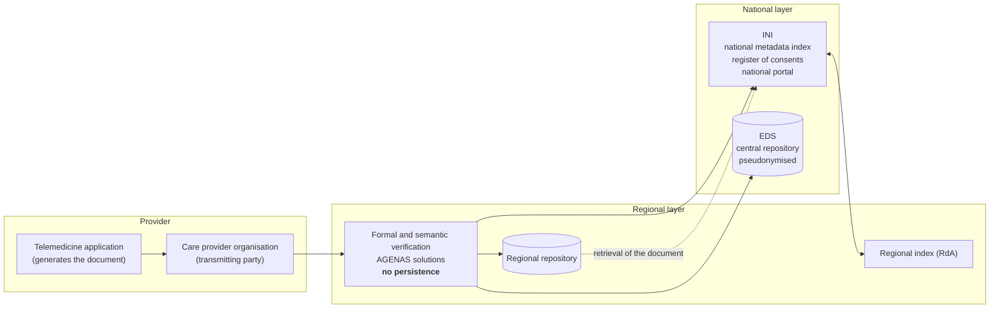
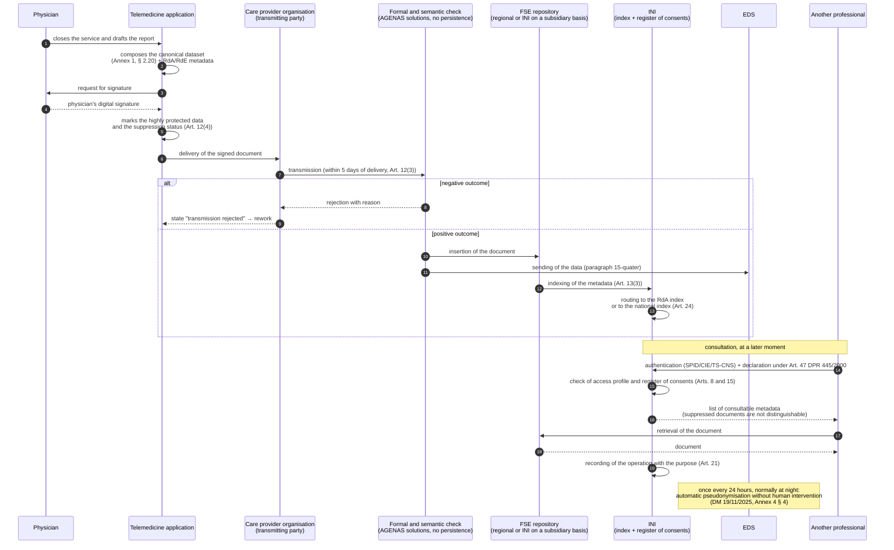
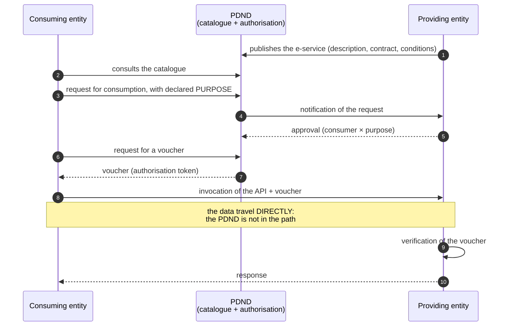

# The FSE and national infrastructures

In the preceding modules we established **what** the system produces: services defined by
law ([02](02-prestazioni-di-telemedicina.md)) and clinical data with a legal regime of
their own ([03](03-il-dato-clinico.md)). This module answers a different and equally
concrete question: **where those documents end up, through which intermediaries, over which
interfaces and under whose responsibility.**

This is the point at which a developer who has never worked with an Italian public
administration is confronted with a landscape that resembles nothing they know. There is no
central API with OpenAPI documentation to read. There is no *vendor* with a developer
portal. There is a layered set of public infrastructures - some national, some regional,
some built by one ministry on behalf of another - with distinct legal bases, distinct data
controllers and technical specifications that are partly published in the *Gazzetta
Ufficiale*, partly held on technical portals, and partly **not public at all**.

This last point must be said at once and without mitigation, because it is the reason this
module contains many `[NV]` markers: **a non-negligible part of the technical documentation
needed to integrate with the electronic health record is not freely consultable.** Whoever
writes this guide has not seen it. We shall not invent it: we shall declare it missing every
time it is missing, indicating where it must be requested.

> **Reading convention.** `[NV]` means «not verified or not publicly available at the date of
> writing». It is not an excuse: it is an operational indication. Every `[NV]` in this module
> is collected in § 11, together with the party from whom the information must be requested.

---

## 1. The mental model, before the details

Before entering the acronyms it is worth fixing four statements. They are the load-bearing
structure of everything that follows and, if they are held firm, the landscape stops looking
arbitrary.

**First: the health record is not a database, it is an index plus repositories.** The
intuitive idea - «there is a great national archive where all Italians' reports end up» - is
wrong. The documents remain, to a large extent, with whoever produced them or in the
repository of the competent Region. What is national is **the index of the metadata** that
makes it possible to find them, plus the register of consents that establishes who may see
them.

**Second: whoever produces the document is not the same party as whoever indexes it, nor as
whoever retains it, nor as whoever exposes it to the citizen.** These are four distinct
roles, with four distinct data controllers. A recurrent mistake consists in modelling a
single entity, «the FSE», which does everything: it produces an architecture that does not
survive the first encounter with reality.

**Third: the telemedicine platform is a producer of documents, not an archive.** We have
already seen this in module [02](02-prestazioni-di-telemedicina.md), § 8: DM 19 novembre
2025 (the Ministerial Decree of 19 November 2025), Article 12, establishes that regional
telemedicine infrastructures **do not retain** the data and documents generated, and
Article 4(4) establishes that the party that transmits them to the health record is **the
care provider organisation**. This module shows what that means concretely in terms of
flows.

**Fourth: nearly everything that follows is an obligation of whoever delivers the service,
not of the software.** The software must *make compliance possible*; compliance falls to a
legal person that the project is not. Section § 9 draws the line in an explicit table, and
it is the section to read if you are short of time.

---

## 2. The electronic health record

### 2.1 What it is, in legal terms before technical ones

The **electronic health record (Fascicolo Sanitario Elettronico, FSE)** was established by
**Article 12 of D.L. 18 ottobre 2012, n. 179** (Decree-Law no. 179 of 18 October 2012),
converted with amendments by **L. 17 dicembre 2012, n. 221** (Law no. 221 of 17 December
2012), as profoundly amended by **Article 21 of D.L. 27 gennaio 2022, n. 4** (Decree-Law
no. 4 of 27 January 2022), converted with amendments by **L. 28 marzo 2022, n. 25** (Law
no. 25 of 28 March 2022). It is from this last amendment that what is commonly called
«FSE 2.0» is dated.

The statutory definition qualifies it as **the set of digital health and social-health data
and documents generated by present and past clinical events concerning the patient**. Three
elements of that formula deserve attention:

- **«set of data and documents»**, not «information system». The FSE is defined by its
  content, not by the infrastructure that realises it. Infrastructures are instruments; when
  they change, the health record remains the same legal object;
- **«generated by clinical events»**: the health record is populated as an effect of services
  actually delivered. It is not a container that the citizen fills at will - save for the
  section expressly reserved to them, the *personal notebook* (§ 2.3);
- **«concerning the patient»**: the perimeter is the person, not the episode nor the
  organisation. This is what makes the health record different from a hospital chart, which
  is by definition tied to the inpatient episode and to the organisation that managed it.

The implementing acts that today govern it operationally are:

| Act | Particulars | What it does |
|---|---|---|
| **DM 20 maggio 2022** | Ministry of Health in concert with MITD and MEF, GU general series no. 160 of 11 July 2022 | Adopts the **guidelines for the implementation of the FSE** |
| **DM 18 maggio 2022** | Same GU | Supplements the **essential data** that make up FSE documents |
| **DM 7 settembre 2023** | GU general series no. 249 of 24 October 2023, act 23A05829 | **FSE 2.0 implementing decree**: contents, parties, consents, feeding, consultation, security. Adopted after opinion no. 256 of 8 June 2023 of the Garante (the Italian data protection authority) and having heard the State-Regions Conference (session of 2 August 2023, act no. 187/CSR) |
| **DM 30 dicembre 2024** | GU general series no. 33 of 10 February 2025 | Introduces **Article 27-*bis***: transitional implementation phases. Opinion no. 580 of 26 September 2024 of the Garante |
| **DM 31 dicembre 2024** | GU general series no. 53 of 5 March 2025, act 25A01321 | **Establishes the Healthcare Data Ecosystem (Ecosistema dati sanitari, EDS)** |
| **DM 19 novembre 2025** | GU general series no. 301 of 30 December 2025, act 25A06938 | Among other things, **amends DM 7 settembre 2023** by creating ten telemedicine document types (Article 7) |

The operational reference to keep open while writing code is **DM 7 settembre 2023**, as
amended. The others supplement it or presuppose it.

### 2.2 Who the health record belongs to

An apparently trivial question with a layered answer - and the layering has direct
consequences for the authorisation model.

The health record **concerns** the patient, who is its **data subject** within the meaning of
the GDPR and holds full rights over it: access, rectification, suppression, knowledge of
others' accesses. But the patient **is not its data controller**. There is more than one
controller, each for their own processing:

- the **parties that deliver the service and draft the document** are controllers for the
  purpose of **care**. Article 12(2) of DM 7 settembre 2023 is verbatim: «*The parties
  referred to in paragraph 1 who have the patient in their care or who in any event provide
  them with healthcare assistance, at whose premises the health data and documents that feed
  the FSE are drafted, are the data controllers for care purposes*»;
- the **Regions and autonomous Provinces** are controllers for the processing involved in
  **formal and semantic verification** and for the regional infrastructures (Article 13);
- the **Ministry of Health** is the controller for the EDS (DM 31 dicembre 2024) and
  concurs in governance purposes;
- **AGENAS** has the operational management of the EDS and the controllership of the
  national telemedicine infrastructure;
- the **MEF, through the infrastructure of the Sistema Tessera Sanitaria** (the national
  health card system), realises the INI (§ 3.1).

**Consequence for whoever designs.** There is no single «owner of the datum» to model. There
is a chain of controllership that changes along the document's journey, and the system must
be able to record, for each document, **who produced it**, **on behalf of which
organisation**, **in which Region** and **for what purpose**. Module
[03](03-il-dato-clinico.md), § 4, deals with GDPR roles in general; here it is enough to
know that a document's journey towards the health record traverses at least three distinct
controllerships.

### 2.3 What it contains

**Article 3(1) of DM 7 settembre 2023** lists the contents, whose informational detail is
defined in **Annex A**. The health record contains these contents **also for services
delivered outside the National Health Service** - a point often overlooked, which extends
the feeding obligation to the purely private sector:

| Letter | Content |
|---|---|
| a) | Identifying and administrative data of the patient (co-payment exemptions on income and medical-condition grounds, contact details, delegates) |
| b) | **Reports**, including those delivered pursuant to D.P.C.M. 8 agosto 2013 (the Prime Ministerial Decree of 8 August 2013) |
| c) | Emergency department records |
| d) | Discharge letters |
| e) | **Patient summary** (*profilo sanitario sintetico*, Article 4) |
| f) | Specialist and pharmaceutical prescriptions |
| g) | Hospital charts |
| h) | Dispensing of medicines both borne and not borne by the SSN |
| i) | Vaccinations |
| j) | Delivery of specialist outpatient services |
| k) | **The patient's personal notebook** (*taccuino*, Article 5) |
| l) | Data from the cards for implant bearers |
| m) | Screening invitation letter |
| **n) – w)** | **The ten telemedicine document types** introduced by Article 7 of DM 19 novembre 2025 |

Letters n)–w) are dealt with at length in module
[02](02-prestazioni-di-telemedicina.md), § 7, with the complete list and the information set
of the remote consultation (televisita) report. **We do not repeat them here**: they are the
raw material of the flow described in § 4 of this module, not its subject.

Two contents deserve a note, because their nature differs from all the others.

The **patient summary** (*profilo sanitario sintetico*) is not a document produced by an
event: it is a **derived** document, drafted and updated by the general practitioner or by
the primary care paediatrician, which summarises the patient's relevant clinical history
(conditions in progress, therapies, allergies, implants). It serves whoever takes on a
patient they do not know, typically in an emergency or outside the Region. It is also one of
the documents covered by European cross-border exchange (§ 10).

The **personal notebook** is the section of the health record **fed by the patient**. It is
the only content in which the citizen writes. It has a precise and often neglected modelling
consequence: **the notebook's data are not clinical data certified by a professional** and
cannot be treated as such. A blood pressure value entered by the patient and a value measured
in the clinic have the same technical type and a completely different legal quality. Module
[06](06-fhir-da-zero.md) shows how the distinction is represented in the data model.

### 2.4 Who feeds it, by when, with what responsibility

**Article 12 of DM 7 settembre 2023** defines the feeding obligation, and defines it far more
broadly than is commonly believed.

**Obliged parties** (paragraph 1):

- local health authorities, public healthcare organisations of the SSN and of the regional
  social-health services, and the healthcare assistance services for seafaring personnel
  (SASN);
- **accredited healthcare organisations**;
- **authorised healthcare organisations**;
- **practitioners of the health professions, including those under agreement with the SSN,
  when they operate autonomously**.

The last item is the one that surprises those arriving from the private market: **even the
individual professional operating autonomously is an obliged party**. It is not an obligation
of the public hospital alone.

**Deadline** (paragraph 3): «*The parties referred to in paragraph 1 shall feed the FSE with
the contents referred to in Article 3, **within five days of the delivery of the health
service**, and are responsible for absent, untimely or inaccurate feeding.*»

Five days is a product constraint, not a service objective. If the path of generation,
signature and transmission requires unattended manual intervention, the obligation is not
sustainable at real volumes. From this descends a requirement that the project takes on
explicitly: **transmission must be asynchronous, retryable, observable and equipped with a
workable exception queue**, not a synchronous call whose failure is lost in a log.

**Suppression flag** (paragraph 4): at the time of feeding it must be indicated whether the
datum falls among the **highly protected health data** (Article 6) or whether, at the moment
of delivery, the **right of suppression** (Article 9) was exercised over it. This means that
suppression **is not a downstream function of the health record**: it is an attribute that
accompanies the document **from birth**. A system that produces the document and only then
concerns itself with suppression has already got the model wrong.

Finally, a safeguard clause worth knowing because it bounds the criticality of the component:
«*The process of feeding the FSE shall not prejudice the patient's right to the delivery of
the health service*» (Article 13(4)). **Transmission to the health record cannot block
care.** An architecture in which failure of transmission prevents the service from being
closed is, besides being fragile, normatively incorrect.

### 2.5 Who consults it

**Article 15** governs access for care purposes with a scheme based on **profiles**, not on
individual permissions:

- **general practitioner and primary care paediatrician**: for the whole duration of the
  care relationship;
- **a different physician**, who has the patient in their care for visits, tests or
  admission: **limited to the time over which the care process unfolds**, and - this is the
  technically most interesting point - «*subject to a declaration that such care process is
  under way at the moment of consultation of the FSE and to the assumption of the related
  responsibility pursuant to Article 47 of D.P.R. 28 dicembre 2000, n. 445*»;
- **nurse, midwife and pharmacist**: with a limited documentary perimeter, defined in
  Annex A, para. 4.1.1;
- **administrative staff**: only for administrative information.

The declaration under Article 47 of D.P.R. 445/2000 (Presidential Decree no. 445 of 28
December 2000) is a **declaration in lieu of an affidavit**: making a false declaration
carries criminal liability. On the implementation side this means that the screen preceding
access **is not a confirmation banner**: it is the collection of a legal act, which must be
presented with the correct wording, recorded in a non-alterable manner and correlated with
the access that follows from it. Treating it as a `confirm()` is an error of substance, not
of form.

**Article 15(4)** then lays down an exhaustive exclusion that is useful to know in full,
because it bounds a real surface of abuse:

> «Access to the FSE is **always excluded** for parties operating in the health sector that
> do not pursue care purposes such as **loss adjusters, insurance companies, employers**,
> scientific associations or organisations, administrative bodies including those operating
> in the health sector, medical staff in the exercise of medico-legal activity such as that
> for the assessment of fitness for work or for the issue of certifications required for the
> granting of permits or licences.»

To be read together with the project's constraint: among the target use cases are «mutual
societies and health insurers». **An installation serving an insurance entity cannot have
access to the health record**, and the product documentation must not suggest otherwise. The
insurance perimeter concerns the service delivered by professionals under agreement, not
consultation of the patient's health record.

A cross-cutting rule closes the picture: «*the data and documents present in the FSE are
always consultable, besides by the patient, by the parties that produced them*» (Article 8(7)
and Article 15(5)). **Whoever produced a document always sees it**, irrespective of consents
and - on the current reading - of subsequent suppression, because the document remains in
their originating systems.

Finally, **Article 20** governs **emergency access**: consultation permitted in health
emergency situations, with reinforced audit trail and a mandatory statement of reasons. This
is the classic *break-glass*, and it must be implemented as such: distinct path, mandatory
reason, notification, after-the-fact review.

### 2.6 Consents, suppression and highly protected health data

Here is concentrated the part of the discipline that is most often modelled badly, and module
[03](03-il-dato-clinico.md), § 2, treats it thoroughly on the plane of legal bases. For the
purposes of this module what matters are the **infrastructural consequences**.

**Consent is not needed to feed, it is needed to allow third parties to consult.** It is the
difference introduced by the 2022 amendment and it is the most important change of FSE 2.0
(§ 2.7). Article 8 requires consent that is «*freely given, specific, informed, unambiguous
and explicit*» for **consultation by third parties**, distinct for the purposes of care, of
prevention and of international prophylaxis. The purposes of **governance** and of
**research**, by contrast, operate on pseudonymised data and do not require that consent.

**The register of consents is national.** It is not a flag inside the provider's application:
it is a component of the INI (§ 3.1), queried at the moment of consultation. A system that
keeps its own copy of the consent and decides autonomously is taking a decision that is not
its to take.

**Suppression** (Article 9) may be exercised at three moments: at the time of delivery, before
feeding, or subsequently. «*Immediate suppression*» must be «guaranteed» through *online*
functionality. And it has a property that on the implementation side is anything but trivial
(paragraph 6): suppression takes place «*in such a way as to guarantee that all parties
authorised to access **cannot automatically become aware of the fact that the patient has made
that choice***».

Put in engineering terms: **suppression cannot manifest itself as a visible hole**. One
cannot show a list item labelled «suppressed document», nor leave a gap in sequential
identifiers, nor return a `403` distinguishable from a `404`. It is an *indistinguishability*
requirement, and must be designed as such - with consequences also for error messages,
counters and exposed *logs*.

Propagation rule (paragraph 7): **suppression of the prescription determines automatic
suppression of the delivery documents and of the correlated reports**. A graph of the
correlations between documents is therefore needed, not a flat list.

The **highly protected health data** (Article 6) are a further protected category:
HIV-positive status, voluntary termination of pregnancy, sexual violence and paedophilia, use
of narcotics, psychotropic substances and alcohol, anonymous childbirth, family counselling
services. They are visible to third parties **only subject to explicit, informed and specific
consent given to the delivering party**; in the absence of it, «*the provider of the service
is responsible for any failure to suppress the datum or document*». And for services delivered
anonymously **feeding of the health record is not permitted at all**.

On the product side, a requirement follows that admits no shortcuts: the system must allow the
document to be **classified in this category at the moment of production** and must prevent
its transmission when the service is delivered anonymously. It is not a downstream filter: it
is a property of the document.

**Recording of operations** (Article 21). The following are recorded: feeding, suppression,
revocation of suppression, consultation by the producing party, consultation by the patient
or their delegate, consultation by another party, and emergency consultation - with the datum
or document, the type of operation, the category of party, the date and time and, **for
consultations only, the purpose**.

**Retention** (Article 10). The index is deleted **thirty years after the date of death**,
with annual verification; the same rule applies to data and documents, **with the exception of
the hospital chart and the documents pertaining to it**, which follow the regime of unlimited
retention proper to inpatient documentation.

### 2.7 What changed with FSE 2.0, and why

«FSE 2.0» is not a software version number: it is the current name of the reform introduced by
Article 21 of D.L. 4/2022 and implemented by the decrees of 2022-2023. The substantive changes
are five, and it is worth knowing them because they explain why the infrastructure has the
shape it has.

**1. Consent to feeding has fallen away.** Under the previous regime (D.P.C.M. 29 settembre
2015, n. 178) the health record was populated **only if the citizen consented**. The result
was a largely empty record, with take-up rates very uneven across Regions and therefore
useless as an instrument of continuity of care. With FSE 2.0 **feeding takes place by force of
law**; consent serves, as we have seen, for **consultation by third parties**. It is the
change that made the health record actually populated and, consequently, made it sensible to
build services on top of it.

**2. The purposes have been reordered and distinguished.** Care, prevention and international
prophylaxis on one side; **governance** and **research** on the other, on pseudonymised data
and through a separate path. It is the distinction that makes the EDS (§ 3.2) possible without
exposing identities.

**3. The health record has become national in fact, not only in name.** The INI, the national
index of metadata, the national register of consents and the national portal are the
components that allow a patient of Region A to be treated in Region B without the documents
having to be moved.

**4. The data ecosystem has appeared.** The health record is no longer only a health record:
it is the feeding source of a central repository - the EDS - built for analysis, monitoring
and research on pseudonymised data.

**5. National technological solutions for feeding have been introduced.** Paragraph
15-*quater* of Article 12 provides that **AGENAS shall make available** to Regions and
organisations, pursuant to Article 69 of the Codice dell'Amministrazione Digitale (the Italian
Digital Administration Code), solutions with three precise functions: **formal and semantic
checking** of the documents produced to feed the FSE, **conversion of the information into the
standard formats** referred to in paragraph 15-*octies*, and **sending of the data to the
EDS**. This is a significant architectural change: part of the normalisation is no longer
borne by the provider.

**The implementation phases.** DM 30 dicembre 2024 introduced Article 27-*bis*, subsequently
extended:

| Phase | Content | Original deadline | Extended deadline |
|---|---|---|---|
| **Phase I** | Start-up | 31 March 2025 | **30 June 2025** |
| **Phase II** | Full realisation of the patient summary; feeding of already-suppressed highly protected data | 30 September 2025 | **31 December 2025** |
| **Phase III** | Full operation: feeding within five days, documents delivered outside the SSN, enablement of authorised private organisations | 31 March 2026 | **31 March 2026** (unchanged) |

At the date of writing Phase III has formally expired. **The actual state of implementation,
Region by Region, has not been ascertained against an updated official source.** `[NV]`

**A figure of scale, to understand what we are talking about.** As at 31 December 2025 the
national health record portal declared **29 document types** managed and **33 types of citizen
services**, with 26 million positive consents to consultation, 5.9 million active users in the
last sixty days and 140,000 enabled specialist physicians. This is not a pilot project: it is
an infrastructure in operation on a national scale.

---

## 3. The intermediaries: INI, EDS and the regional infrastructures

The health record, as has been said, is a legal content. The infrastructures that realise it
are another matter, and they come in three layers: **national interoperability** (INI),
**national analysis** (EDS), **regional operation** (the regional FSEs and, for telemedicine,
the IRTs).

### 3.1 INI - National Interoperability Infrastructure

**Legal basis.** The INI is established by **paragraph 15-*ter* of Article 12 of D.L.
179/2012** and is **realised by the Ministry of Economy and Finance through the infrastructure
of the Sistema Tessera Sanitaria**, that referred to in Article 50 of D.L. 30 settembre 2003,
n. 269 (Decree-Law no. 269 of 30 September 2003).

This sentence deserves to be unpacked, because it contains a piece of information that
disorients anyone arriving from outside: **the interoperability infrastructure of the health
record does not belong to the Ministry of Health.** It belongs to the Ministry of Economy, and
it reuses the platform born for fiscal purposes and for control of health expenditure - the
same one that manages dematerialised prescriptions and the transmission of health expenses for
the pre-filled tax return. This is not an anomaly: it is the reuse of an infrastructure that
already had the register of patients, connectivity with every organisation and a tried and
tested security model.

**What the INI does.** DM 7 settembre 2023, Article 1, identifies its components:

| Component | Basis | Function |
|---|---|---|
| **FSE-INI** | - | Infrastructure and telematic services which Regions, autonomous Provinces and the Ministry of Health **avail themselves of on a subsidiary basis**: whoever does not have an operational regional FSE of their own uses the national one |
| **Register of consents and revocations** | paragraph 15-*ter*, point 4-*bis* | National register of consents to consultation and of the related revocations |
| **National FSE index** | paragraph 15-*ter*, point 4-*ter* | **National index of document metadata**. For patients without a Region of entitlement it manages the index directly; upon association of a Region of entitlement it **transfers the metadata index to the index of the RdA** (Article 24) |
| **National FSE portal** | paragraph 15-*ter*, point 4-*quater* | *Online* access to the health record for patient and operators |

The key concept is **the index of metadata**. The INI does not contain the reports: it
contains the cards that state that a report of a certain type exists, produced on a certain
date by a certain organisation, and where to go and fetch it. It is the analogue of a library
catalogue with respect to the volumes on the shelves. Whoever consults a patient's health
record queries the index, obtains the list of references, and retrieves the document from the
repository that holds it.

Two administrative abbreviations that recur everywhere and must be unpacked:

- **RdA - *Regione di assistenza*, Region of entitlement**: the Region with which the patient
  is registered with the health service, the one that assigns them their general practitioner;
- **RdE - *Regione di erogazione*, Region of delivery**: the Region in which the service is
  materially delivered.

They coincide in most cases, but not always - and it is precisely in the non-coincidence that
the national infrastructure serves a purpose. A Lombard patient treated in Puglia generates a
document in the RdE Puglia which must appear in the health record managed by the RdA
Lombardia. **The data model must carry both pieces of information on every document**, and
they are not derivable one from the other.

### 3.2 EDS - Healthcare Data Ecosystem

**Legal basis.** Established by **DM 31 dicembre 2024** (GU general series no. 53 of 5 March
2025, act 25A01321). **Data controller: the Ministry of Health. Operational management:
AGENAS.**

**What it is.** A central ***data repository***. Unlike the INI, which indexes, the EDS
**contains data**: it receives the contents extracted from the health record's documents,
normalises them and makes them queryable. It serves the purposes that are not the care of the
individual: **governance**, **planning**, **monitoring**, **health technology assessment**,
**research**.

**The rule that governs its operation is pseudonymisation**, and it has explicit parameters.
DM 19 novembre 2025, Annex 4, § 4, establishes verbatim that the pseudonymisation process is
performed **by the EDS** (not by the telemedicine infrastructure), «*in sequence,
automatically, without human intervention and once every 24 hours*», and that the update «*is
normally performed during night-time hours*». It further imposes a verification of the
**clustering rules** «*in order to guarantee that no result […] may be traced back to a single
individual (**cardinality of one**), irrespective of the level or dimension of analysis*».

Translated: the EDS never returns a result that identifies a single person, and it verifies
this as a property of the system, not as a good intention of the analyst.

**What DM 19 novembre 2025 added.** Annex 2 supplements Annex A of the EDS decree with four
services dedicated to telemedicine:

- **for the purpose of care**, a service for «*consultation of the data and documents relating
  to telemedicine services*»: the professional, downstream of the search for the patient, sees
  the type of service, date, diagnostic question, organisation, specialist physician, and from
  there accesses the documents. With an explicit constraint: «*the professional must be able to
  view exclusively the data extracted from the documents that the patient has not
  suppressed*». The actors are the professional, the EDS and the **INI's register of
  consents**;
- **for the purpose of governance**, three services for the extraction of pseudonymised data
  requested by regional offices, by the Ministry of Health and by AGENAS: **planning** of
  services, **monitoring** (including for verification of the achievement of targets and
  *milestones*), **identification and updating of the tariffs** for telemedicine services, and
  **health technology assessment**.

For each of these the EDS performs the same sequence: it identifies the patients matching the
parameters, **substitutes the pseudonym for the patient's identifier**, **excludes all direct
identifying elements**, extracts the relevant data and returns them.

**The point that directly concerns whoever writes the software.** The telemedicine platform
**does not talk to the EDS**. It feeds the health record; the EDS extracts. But the permitted
dimensions of analysis - time base, demographic characteristics (sex, age band, ASL of
entitlement), health characteristics (exemption codes, conditions current or past), district
base (ASL of delivery), **type of minimum service delivered**, **characteristic of the regime
of delivery and assistance** - **must exist as structured attributes in the documents
produced**, otherwise the datum is not extractable. The last two become, in effect, mandatory
attributes of every telemedicine document.

### 3.3 INI and EDS compared

Confusing the two components is the commonest conceptual error. The table below separates them
along the dimensions that matter.

| Dimension | **INI** | **EDS** |
|---|---|---|
| Legal basis | Paragraph 15-*ter*, Article 12 D.L. 179/2012 | DM 31 dicembre 2024 |
| Who realises it | MEF, via the Sistema Tessera Sanitaria | Ministry of Health (controller), AGENAS (management) |
| Nature | **Index + register of consents + portal** | **Central *data repository*** |
| Does it contain documents? | **No**: metadata and references | **Yes**: extracted and normalised contents |
| Identifiability | Operates on the patient's identity | Operates on **pseudonyms**, excludes direct identifiers |
| Purposes served | **Care** (finding the documents), management of consents | **Governance, planning, monitoring, HTA, research**; plus the consultation service for care purposes introduced by DM 19 novembre 2025 |
| Synchrony | Queried at the moment of consultation | Updated **once every 24 hours**, normally at night |
| Does the project connect to it? | **Indirectly**, through the feeding path and the portal | **No**: the EDS extracts from the FSE |

### 3.4 The regional layer

Beneath the two national components sit the regional infrastructures, which are the place
where almost everything materially happens. Three elements to know.

**The regional FSE.** Each Region or autonomous Province manages the health record of its own
patients, with its own index and its own repository or repositories. Whoever does not have an
operational infrastructure of their own **avails themselves of FSE-INI on a subsidiary basis**.
The practical consequence is that **there is no single feeding interface**: there is the
national path and there are twenty regional declensions of it, with real differences in
endpoints, authentication, accepted formats and validation rules. `[NV]` on the updated map of
regional differences, which is not published in consolidated form and which every deployer
must reconstruct for their own Region.

**The role of the Regions in checking documents.** Article 13 of DM 7 settembre 2023
establishes that **the Regions are the controllers of the formal and semantic verification
processing** and that they must contribute to feeding «*using the technical solutions made
available by AGENAS*». And it adds a clarification that has architectural value: «*the
technological solutions referred to in paragraph 1 **do not provide mechanisms for persistence
of the data processed***». They are components of transit, not archives.

**The regional telemedicine infrastructures (IRT)** are a further layer, governed by DM 21
settembre 2022 and DM 19 novembre 2025, and they are dealt with in module
[02](02-prestazioni-di-telemedicina.md), § 6, together with the INT, the NIT and the PNT. Here
it is enough to fix the linkage, because it is the reason this module exists:

- **the IRT delivers the service and allows the professional to generate the document**;
- **the care provider organisation transmits it to the FSE** (DM 19 novembre 2025, Article
  4(4));
- **the IRT does not retain it** (Article 12);
- **the FSE indexes it through the INI** and feeds the **EDS** from it;
- **the INT sees none of this**, because it carries out no processing of personal data beyond
  what is exhaustively provided for.

> **Warning about the diagram.** It is a **logical** representation of the roles, reconstructed
> from the statutory texts cited. **It is not an integration schema**: the real endpoints, the
> transport protocols and the exact sequence of calls depend on the technical interoperability
> specifications and on the regional declensions, which § 4.8 declares not integrally verified.
> `[NV]`

---
## 4. The life cycle of a document, step by step

This section reconstructs the journey a report makes from the moment the physician closes it
to the moment another professional reads it. Every step is anchored to its statutory source.
Where the law is silent or where the technical specification is not public, we say so.

### 4.1 Generation

The document is born in the provider's application. For remote consultation (televisita) the
State-Regions Agreement of 17 December 2020, act no. 215/CSR, requires that the service «*be
regularly managed and reported on the IT systems in use at the provider, on a par with a
specialist visit delivered in the traditional manner, **with the addition of the specification
of delivery at a distance***».

The **mandatory information content** of the remote consultation report is that of DM 19
novembre 2025, Annex 1, § 2.20, and is detailed in module
[02](02-prestazioni-di-telemedicina.md), § 7.2. What matters here is that the document must be
born already **complete with the transmission metadata**, not enriched at a later stage:

- identifier of the patient (tax code, or STP code for the temporarily present foreign
  national, or ENI for the non-registered EU citizen - module
  [04](04-identita-e-anagrafiche.md));
- **Region of entitlement and Region of delivery**;
- health authority, site, operating unit;
- **reporting physician and signing physician**, which the record layout keeps distinct;
- document type, date and time of start and end of delivery;
- **classification among the highly protected health data** and suppression status where
  already exercised (DM 7 settembre 2023, Article 12(4)).

### 4.2 Signature

The report must be **digitally signed by the physician**. It is an obligation under Agreement
215/CSR of 2020, restated for tele-reporting in the form «*validated digital signature of the
responsible physician*».

Two clarifications that avoid frequent confusions.

**The signature is the physician's, not the system's.** An electronic seal of the organisation
does not replace the professional's signature: responsibility for the clinical content is
personal. The system may orchestrate the signature - prepare the document, invoke the device
or the remote signature service, verify the outcome - but it cannot sign in the physician's
place.

**The national document format of the health record is HL7 CDA Rel. 2 («CDA2»)**, carried
inside a **digitally signed PDF**. This is the arrangement of the national interoperability
specifications («*Affinity Domain Italia*»), published in the technical area of the health
record portal. The version declared as published is **2.6.4**. **It has not been verified
whether that version already contains the CDA2 templates for the ten telemedicine document
types.** `[NV]`

From this uncertainty descends a project rule to be observed without exceptions, because it
protects against a costly rewrite: **the information content of Annex 1 is modelled as a
canonical *dataset* and CDA2 is treated as a replaceable serialisation.** No CDA2 template is
to be hard-wired into the domain. The same discipline applies to the national FHIR
Implementation Guides, which represent the remote consultation report as a `Composition`
inside a `Bundle`: they are the **technical representation**, whereas the ministerial set is
the **normative source**. Module [06](06-fhir-da-zero.md) develops the point.

### 4.3 Formal and semantic checking

The document does not enter the health record as it is. Article 13 of DM 7 settembre 2023
provides for a step of **formal and semantic verification** for which **the Region is the data
controller** and which avails itself of the **technological solutions made available by
AGENAS** pursuant to paragraph 15-*quater*. Those solutions have three declared functions:
formal and semantic checking, **conversion of the information into the standard formats** of
paragraph 15-*octies*, and **sending of the data to the EDS**.

Two properties of this stage have direct effects on the producer's architecture:

- **there is no persistence**: «*the technological solutions referred to in paragraph 1 do not
  provide mechanisms for persistence of the data processed*». It is a component of transit. If
  transmission fails, the document is not «somewhere»: it is only with whoever produced it;
- **the check may reject**. Article 13 provides that «*where the outcome of the formal and
  semantic check is positive, the system allows the document to proceed to signature, where
  provided for, for its insertion into the FSE*». There therefore exists a **negative
  outcome**, and it must be handled as a domain state: document produced, transmission
  rejected, reason, rework. Not as a technical exception.

`[NV]` - **The interface specifications of the AGENAS technological solutions are not publicly
available** (endpoints, format of outcome messages, taxonomy of validation errors). They must
be requested from AGENAS or from the Region concerned. The project must not invent one: it
must provide for an **adapter with a stable internal contract** and a single replaceable
implementation.

### 4.4 Transmission signature and indexing through the INI

Once the check is passed, the document is inserted into the health record and **indexed through
the INI** (Article 13(3)). The metadata flow into the **index of the Region of entitlement**
or, for a patient who has no Region of entitlement, into the **national FSE index**; upon
subsequent association of an RdA, the INI **transfers the metadata index to the index of the
RdA** (Article 24).

This transfer is a detail worth recording: **the index moves, the document does not**. A model
that assumes the stability of the index's location for the whole of the patient's life is
wrong.

`[NV]` - **The IHE XDS indexing metadata and the document type codes (`typeCode`, `classCode`,
and the corresponding LOINC coding) for the ten new telemedicine types have not been
located.** They are the information needed to build the `SubmissionSet` and the
`DocumentEntry`. They are to be looked for in the technical area of the health record portal,
in the CDA2 specification documents for each individual type; failing that, requested from
Sogei or from the INI. Module [05](05-standard-di-interoperabilita.md) explains what IHE XDS,
`SubmissionSet` and `DocumentEntry` are.

### 4.5 Deadline and responsibility

**Within five days of delivery** (Article 12(3)), with the controller's liability for absent,
untimely or inaccurate feeding. The period runs from **delivery**, not from the signature nor
from the availability of the destination system: unavailability of the regional infrastructure
does not suspend the period, so the transmission queue must be durable and must retry.

### 4.6 Consultation

Whoever consults follows the reverse path: authentication with digital identity (§ 8) →
verification of the access profile and, for a physician other than the patient's own,
**declaration under Article 47 of D.P.R. 445/2000** that the care process is under way →
query of the index → check of the register of consents → retrieval of the document from the
repository → **recording of the operation** with the purpose (Article 21).

### 4.7 Suppression

Suppression may intervene **before** production (the patient asks for it at the time of
delivery: the document is born with the flag), or **after**, through the *online* functionality
of the portal. In the second case the document is already indexed and suppression acts on its
**visibility to third parties**, not on its existence nor on its visibility to whoever produced
it.

Recalling the two constraints of § 2.6: **immediacy** and **indistinguishability**. Suppression
of the prescription propagates automatically to the delivery documents and to the correlated
reports.

### 4.8 The flow in a sequence diagram

> **What this diagram is not.** It is not an integration contract. It represents the
> **sequence of roles and responsibilities** as reconstructed from the sources cited. Steps
> 7-12 take place, in reality, through interfaces whose technical specification is not
> integrally public: **the number, order and granularity of the actual calls may differ**, and
> they do differ between Regions. `[NV]`

### 4.9 What remains unverified in this flow

Summary of the points on which the project **must not invent specifications**:

| Element | Status | Where it must be requested |
|---|---|---|
| CDA2 templates for the ten telemedicine types | `[NV]` | Technical area of the health record portal (CDA2 specification documents by type); failing that Sogei / INI |
| Document type codes and IHE XDS metadata for the same | `[NV]` | As above |
| Interface specifications of the AGENAS technological solutions (paragraph 15-*quater*) | `[NV]` | AGENAS; the Region concerned |
| Content of version 2.6.4 of «*Affinity Domain Italia*» with respect to telemedicine | `[NV]` | Health record portal, technical area |
| Regional differences in endpoints, authentication and validation | `[NV]` | Each Region, individually |
| Coding of the at-a-distance mode of delivery in the reimbursement reporting flows (the value «telemedicine» in the «place of delivery» field) | `[NV]` | Technical specifications of the Sistema Tessera Sanitaria; regional rulebooks for the outpatient specialist flow |
| Operational content of the AGENAS **Validation Process** under Article 3(4) of DM 19 novembre 2025 | `[NV]` | AGENAS |

**Product consequence, to be held firm.** Every entry in this table is a point of variability
that must be isolated behind a project interface, with an implementation configurable per
Region and per installation. It is not over-engineering: it is the direct translation of a
documented uncertainty.

---

## 5. PDND and ModI, explained to someone who has never seen them

This is the section where it is easiest to take something for granted, because people who work
in the Italian public administration use these two names as though they were obvious, and
someone coming from outside has no mental hook on which to hang them. Let us start from the
problem, not from the acronym.

### 5.1 The problem

Imagine two Italian public bodies. The first - say a health authority - needs to know whether
a certain person is registered with the health service in that Region. The second - say the
body that manages that register - has the datum.

In the private world the solution is trivial: an API is agreed, a key is exchanged, a contract
is written. In the public sector this route, multiplied by twenty thousand bodies, produces two
well-known pathologies: **an uncontrollable proliferation of bilateral integrations** (every
pair of bodies negotiates its own), and **the absence of a verifiable trail** of who asked what
of whom, on what legal basis and for what purpose. This last point is not bureaucracy: when the
data are health data, traceability of the purpose of access is a GDPR requirement, not a whim.

The two Italian answers to this problem are **ModI** - which says *how* an interface between
administrations is built - and **PDND** - which says *who may call what, and how that is
demonstrated*.

### 5.2 ModI - the Interoperability Model

**What it is.** A set of technical rules establishing how public administrations expose and
consume application interfaces. It is not software, it is not a product, it is not an
infrastructure: it is **a specification**, as a standard is.

**Who writes it and with what force.** It is defined by the **Guidelines on the technical
interoperability of Public Administrations** and by the **Guidelines «Technologies and
standards for the security of interoperability through the APIs of IT systems»**, adopted by
AgID with **Determination no. 547 of 1 October 2021**, pursuant to **Article 71 of the Codice
dell'Amministrazione Digitale** and in compliance with the notification procedure of Directive
(EU) 2015/1535. They are **binding on public administrations**, and DM 21 settembre 2022
expressly invokes them among the rules that regional telemedicine infrastructures must comply
with.

**What it contains, in substance.** ModI identifies **interoperability patterns and profiles**:
shared technical arrangements that the **provider** and the **consumer** of a service implement
in order to make their respective systems interoperable. They are articulated along three axes:

- **interaction patterns** - the shape of the conversation: synchronous request/response,
  blocking or non-blocking interaction, event notification (*push* or *pull*). Its purpose is
  to prevent each body from reinventing its own call semantics;
- **security patterns** - where trust resides: on the channel (authentication of systems with
  certificates, mutual TLS) or **on the message** (the individual message is signed and the
  signature is verifiable independently of the channel that carried it). The distinction
  matters: message-level security survives intermediate *proxies* and produces evidence that
  can be relied on after the fact, which channel security does not;
- **audit patterns** - how it is demonstrated, afterwards, that a certain call took place, by
  whom and with what data.

**Why this concerns an open source project.** If the installation is at a public administration
and the system's APIs are exposed towards other public administrations, **they must be described
and built according to the ModI patterns**. It is not a stylistic choice of the integrator: it
is a compliance requirement that falls on the body and that the body passes on, contractually,
to the supplier.

### 5.3 PDND - Piattaforma Digitale Nazionale Dati

**Legal basis.** Article 50-*ter* of the Codice dell'Amministrazione Digitale. **Guidelines on
the technological infrastructure of the Piattaforma Digitale Nazionale Dati (the National
Digital Data Platform) for the interoperability of information systems and databases**, adopted
by **AgID Determination no. 627/2021** and **updated in May 2025** (version 2). **Binding.**

**What it is in one sentence.** The PDND is **a catalogue of application services plus an
authority that issues the authorisations to use them**.

**What it is not, and this is the source of almost every misunderstanding.** The PDND **is not
a proxy**. **It does not carry the data.** There is no central instance through which the calls
pass. If body A calls body B's API, that call goes **directly from A to B**. The PDND
intervenes beforehand, to establish that A is authorised, and stays outside the data flow.

Those arriving from enterprise architectures tend to imagine it as a national *API gateway*. It
is not, and the misunderstanding produces completely wrong latency and availability estimates.

**The vocabulary, term by term.**

| Term | Meaning |
|---|---|
| **E-service** | The published application service. The guidelines define it thus: «*an e-service is a service delivered over the Internet or through a private network by means of a digital process involving providers and consumers*»; e-services are «*a particular category of network services based on application programming interfaces (APIs)*». In practice: **an API, with its description, its contract and its conditions of use** |
| **Providing entity** | Whoever **publishes** the e-service on the catalogue. It is the controller of the datum and remains the party that answers the call |
| **Consuming entity** | Whoever **requests permission to use** the e-service and then invokes it |
| **Purpose** | The declared reason for which the consumer wishes to access. **It is not a descriptive field**: it is the element on which the provider decides whether to grant access, and it is what makes the chain verifiable after the fact. A consumer may have several distinct purposes on the same e-service, each with its own authorisation |
| **Voucher** | The **authorisation token** issued by the PDND to the consumer once consumption has been approved. It is what the consumer presents to the provider to demonstrate that it is authorised |

**The flow, step by step.**

1. **The provider publishes the e-service** on the PDND catalogue: description, interface,
   version, access requirements, legal basis.
2. **The consumer finds the e-service in the catalogue and requests enrolment**, declaring its
   own **purpose**.
3. **The provider assesses and approves** (or refuses). Approval is for the pair
   consumer × purpose, not generic.
4. **Once consumption is approved, the consumer asks the PDND for a voucher.** It obtains it by
   presenting cryptographic proof of its identity as a body.
5. **The consumer invokes the API directly at the provider**, attaching the voucher.
6. **The provider verifies the voucher** and, if it is valid, answers. The PDND has not seen
   the data.

**The relationship between PDND and ModI.** They are complementary and often confused. **ModI**
says *how the interface is written and protected*; the **PDND** says *who is authorised to call
it and how that is demonstrated*. An e-service published on the PDND is built according to the
ModI patterns: neither replaces the other.

### 5.4 What this concretely means for this project

Three statements, of which the third is the most important.

**First: the PDND is not a requirement for delivering a telemedicine service.** A remote
consultation between a physician and a patient does not go through the PDND. The PDND channel
concerns the exchange of data **between administrations**.

**Second: it becomes a requirement when the installation exposes data towards other
administrations.** If a health authority that has installed the system has to expose - for
example - an e-service on the status of a service or on the availability of appointment
calendars towards another administration, that publication takes place on the PDND. DM 19
novembre 2025, Annex 3, § 2, does in fact list the **PDND** among the central systems with
which the national telemedicine platform guarantees integration, together with SPID/CIE, the
national FSE, ANA (the national register of patients), PagoPA, the Sistema Tessera Sanitaria
and the national register of consents.

**Third, and decisive: the providing entity and the consuming entity are legal persons, not
software.** The PDND registers administrations, not products. **The project can be neither
provider nor consumer**: it can supply the technical implementation that allows the deployer to
be one. It is exactly the same principle that holds for SPID (§ 8) and that returns in the
table of § 9.

`[NV]` - **The detailed operational specifications of the PDND** (the exact format of the
voucher, its lifetime, the permitted algorithms, the *onboarding* procedure for a body, the
test environments) **have not been verified in this guide.** They are documented in the AgID
guidelines v2 of May 2025 and in the platform's technical documentation, and must be read
directly before writing code. The project **must not derive from this page any implementation
assumption** about the PDND.

---

## 6. Who the institutional actors are and what each of them does

The ecosystem is crowded and the names resemble one another. This section separates them by
**function**, which is the only useful criterion when you have to work out whom to ask for
something.

### 6.1 The map

| Party | What it is | What it does within our perimeter |
|---|---|---|
| **Ministry of Health** | Central administration | Data controller for the **EDS**; adopts the decrees on the FSE, telemedicine and tariffs; it is the steering authority of the health system |
| **AGENAS** | National agency for regional health services; under Article 12(15-*undecies*) of D.L. 179/2012 also the **national agency for digital health (ASD)** | Controller and manager of the **INT**; operational management of the **EDS**; makes available the **technological solutions** for checking and conversion (paragraph 15-*quater*); publishes the **Business Glossary** and the guiding models; carries out, through the **Telemedicine Solutions Manager (Gestore Soluzioni di Telemedicina)**, the **Validation Process** for third-party solutions |
| **MEF - Sistema Tessera Sanitaria** | Ministry of Economy and Finance; infrastructure under Article 50 of D.L. 269/2003, technically operated by Sogei | **Realises the INI**; manages dematerialised prescriptions and the health expenses flow |
| **AgID** | Agency for Digital Italy | Cross-cutting technical rules under **Article 71 of the CAD**: **ModI**, **PDND**, accessibility, software reuse, electronic documents. Manages the **SPID federation** and the **SPID Register**; adopts the **Three-Year Plan for IT in Public Administration** |
| **ACN** | National cybersecurity agency | Since **19 January 2023** it has taken over from AgID the **qualification of cloud services and infrastructures for public administration**; it issues the determinations on **NIS2** security measures; it hosts **CSIRT Italia** for incident notification |
| **PSN - Polo Strategico Nazionale** | Infrastructure built under the PNRR (M1C1) | Hosts **critical and strategic data and services** of public administrations on *data centres* located on national territory |
| **Regions and autonomous Provinces** | Bodies responsible for the organisation of healthcare | Controllers of the **regional FSEs** and of the **IRTs**; controllers of the formal and semantic verification processing; they purchase the solutions |
| **Ministry of the Interior** | Central administration | **Manager of the CIE digital identity**, availing itself of the State Printing Works and Mint (Poligrafico e Zecca dello Stato) |
| **Garante per la protezione dei dati personali** | Independent authority | Issues the mandatory opinions on draft decrees concerning the FSE, the EDS and telemedicine; its opinions have **substantially altered** the architecture (§ 6.2) |

### 6.2 An example of how much the Garante weighs

It is worth showing this with a concrete case, because it rebuts the idea that the data
protection authority intervenes only on the wording of privacy notices.

**Opinion no. 2 of 16 January 2025 of the Garante** (doc-web 10105743) on the draft decree on
the national telemedicine platform required that **the INT not be a clinical repository**:
clinical data flow directly into the FSE and the EDS, not into the national telemedicine
infrastructure, precisely in order to avoid duplication and desynchronisation. From there
descend, in the decree as adopted, the extraction of data **at most once every 24 hours** with
deletion within 24 hours of extraction, automatic pseudonymisation **without human
intervention**, retention of the *logs* for **24 months** and of access and authentication data
for **12 months**, and the principle that the rights of access, rectification and suppression
are exercised **on the FSE's documents**, not on the telemedicine platform.

**An opinion determined the data topology of a national infrastructure.** Whoever designs in
this domain must read the Garante's opinions the way one reads technical specifications,
because that is often where the reason for otherwise inexplicable architectural choices lies.

### 6.3 What «to qualify» means, and who qualifies what

The word «qualification» recurs constantly and designates **four different procedures**, with
different authorities, different objects and different effects. Confusing them produces false
statements of compliance. We separate them.

**1. Qualification of cloud services and infrastructures - authority: ACN.**
The object **is not the application software**: it is the **cloud services** (SaaS, PaaS, IaaS)
and the **infrastructures** that host them. The reference acts are **ACN Determination no. 306
of 18 January 2022** (methodology for the **classification of the data and services** of public
administrations into **strategic**, **critical** and **ordinary**), **ACN Determination no. 307
of 18 January 2022** (qualification regulation) and **ACN Directorial Decree no. 21007/24 of 27
June 2024**, the new unified regulation applicable from 1 August 2024. The levels are
**QC1–QC4** for services and **QI1–QI4** for infrastructures; the level required follows from
the classification of the data.

This qualification **cannot be obtained by a software project**: it is obtained by a cloud
service provider, for a service that it delivers. DM 19 novembre 2025, Annex 4, expressly
invokes ACN regulation 21007/24 as a constraint for the national telemedicine platform. A
health authority's health data falls with very high probability into the **critical** class,
with all that follows in terms of the level of qualification required and of data residency.

**2. Accreditation as an SPID service provider - authority: AgID.** This concerns the party
that **delivers online services**. It is discussed in § 8: **the project cannot be its
addressee**.

**3. Certification of the technical standards of telemedicine solutions - authority: AGENAS.**
DM 19 novembre 2025, Article 3(4), allows that «*regions may deliver telemedicine with
different infrastructures, applications or tools, provided that they comply with technical
standards certified by Agenas and feed the Fascicolo Sanitario Elettronico*». The function is
carried out by the **Gestore Soluzioni di Telemedicina** of the INT, which assists providers in
the **Validation Process**. It is the most interesting way in for a solution alternative to
those of the lead-Region tenders, and module [02](02-prestazioni-di-telemedicina.md), § 6.2,
discusses its strategic significance. **What the Validation Process consists of operationally
is not publicly documented.** `[NV]`

**4. Conformity assessment as a medical device - authority: a Notified Body.** This is an
entirely different matter: it concerns the safety and performance of the device within the
meaning of Regulation (EU) 2017/745, not its suitability for use in public administration. It
is dealt with in module [15](15-regolatorio-da-zero.md).

> **Editorial rule of the project.** No document may use «qualified» without saying **by whom**,
> **for what** and **under what act**. «Telemedic is qualified» is a statement devoid of meaning
> and, in the Italian context, potentially misleading.

---

## 7. Where the data must be, and with what protections

Connecting to the national infrastructures is not only a question of formats: it entails
requirements about **where the software runs** and about **how it is protected**. They are
requirements that fall on the installation, but which the product must make possible - and
which a badly designed product makes impossible.

### 7.1 Data residency is at two levels, not one

This is a point where simplification is frequent and wrong.

- **DM 21 settembre 2022** allows, for regional telemedicine infrastructures, three
  *deployment* models, all qualified as «**on national territory**»: encrypted public cloud,
  private or hybrid cloud under licence, private cloud;
- **DM 19 novembre 2025, Annex 4, § 8**, for the **NIT** - the inter-regional interoperability
  node - prescribes instead infrastructures «*resident on **EU** territory*».

**The two formulations do not coincide and must not be flattened together.** The correct
constraint is: **at least EU for the interoperability node, national for the regional
infrastructures and for the national platform**, with the further tightening that derives from
the ACN classification of health data as «critical».

From this descends the project's choice to document **three *deployment* profiles** - European
Union, Italian territory, ACN-qualified cloud or Polo Strategico Nazionale - and the
architectural constraint that is its precondition: **no runtime dependency may prevent the most
restrictive profile**. Concretely: no mandatory external managed service, a media *relay*
server that can be installed in-house, a database and object store that can be installed
locally. It is exactly what makes practicable the containerised distribution model described in
module [17](17-ambiente-di-sviluppo.md).

### 7.2 The security measures are not generic

Anyone expecting a boilerplate clause of the «adopt appropriate measures» kind will be
surprised: DM 19 novembre 2025, Annex 4, lists **dozens of measures naming the technology**.
Among others: encryption of data at rest and in transit with robust state-of-the-art
algorithms; **encryption of the infrastructure**; **logical network isolation with
microsegmentation**; infrastructural and application **virtual patching**; **hardware security
modules (HSMs)** for key management; intrusion detection and prevention systems on every node
of network access; **web application *firewall*** and API security; **transparent database
encryption**; *hardening* of operating systems; event correlation and automated response
systems; ***threat intelligence***; **privileged management of administrative access**; and -
a point that directly concerns an open source project - the «*maintenance of the inventory of
the software components in use, including third-party and/or open source libraries*», that is,
the **software bill of materials (SBOM)**.

**The SBOM is therefore not a good practice of the project: it is Italian regulatory
compliance.**

Two further rules deserve to be known because they have effects on the user experience and on
the session architecture:

- «*the INT and the IRTs **always** provide for two-factor authentication using an OTP code*»,
  **in addition** to digital identity, with a **level of assurance of at least L2** (Annex 4,
  § 3; Annex 3, § 5.1). On authentication «*only the tax code, the first name and the surname
  are acquired*»;
- «*The IAM infrastructure **does not permit any user to make multiple simultaneous logins**
  using their own credentials*» (Annex 4, § 8). It is a single-session constraint, to be
  designed for and not circumvented.

Module [12](12-crittografia-e-sicurezza.md) develops the complete catalogue and its translation
into verifiable requirements.

### 7.3 A note on the traceability of sources

It is worth recording an anomaly, because a contributor will encounter it sooner or later and
deserves to know that it is not a misreading.

Annex 4, § 7, imposes on **all** regional telemedicine infrastructures - «*including those that
were not party to the aforesaid procedure*» - the security measures provided for by **chapter 5
of the tender specification of a specific regional procurement**. That is to say, a ministerial
decree makes binding for the entire national territory a **tender** document that was not
published in the *Gazzetta Ufficiale*. **That chapter has not been located** in the searches
conducted by the project. `[NV]`

It is not an isolated case: DM 21 settembre 2022 in turn refers, for the functional
requirements of the micro-services, to methodological documents published by AGENAS as annexes
to a 2022 notice, likewise not located - although DM 19 novembre 2025, Annex 3, has since given
statutory form in the *Gazzetta* to much of their content. **This is a requirements-traceability
risk to be declared in the compliance documentation**, not concealed: a requirement that cannot
be read is a requirement that cannot be shown to have been satisfied.

---
## 8. Digital identity as the gateway

Everything described so far presupposes that someone has logged in, and that it is known with
certainty who they are. In Italy the «how you log in» is not a product choice: it is
established by law.

This section is an **operational summary**. The extended treatment - SAML and OIDC profiles,
metadata, attributes, levels of assurance, anomaly codes, integration with the identity
provider, health card and mutual TLS authentication - is in module
[04 - Identity and demographic registries](04-identita-e-anagrafiche.md).

### 8.1 The basic rule

**Article 64 of the Codice dell'Amministrazione Digitale** (D.lgs. 7 marzo 2005, n. 82,
Legislative Decree no. 82 of 7 March 2005) governs the public system for digital identity
management. Paragraph 2-*quater* establishes that «*access to online services delivered by
public administrations which require computerised identification shall take place through
SPID*», and the recognised channels are **SPID**, **CIE** (electronic identity card) and
**TS-CNS** (health card - national services card).

In our domain the obligation is restated twice, in identical terms:

- **DM 7 settembre 2023, Article 11(1)** - for access to the electronic health record;
- **DM 19 novembre 2025, Annex 4, § 3** - for access to the national telemedicine platform:
  «*Access to the data takes place after passing computerised authentication procedures based
  on the national systems **SPID, CIE and TS-CNS**, both for citizens and for operators*».

**TS-CNS is therefore not an option**: it is expressly listed by the rule, on a par with the
other two channels.

### 8.2 The three channels in summary

| Channel | What it is | Protocol usable in production | Who realistically uses it |
|---|---|---|---|
| **SPID** | Public digital identity system: a federation of several identity providers accredited by AgID | **SAML2**. The guidelines on OpenID Connect exist and are supplemented by AgID Notice no. 41 v.2 of 23 March 2023, **but no SPID identity provider supports it in production**: the source is the official forum overseen by the SPID working group, consulted on 25 August 2026, **to be re-verified** | Citizens, en masse |
| **CIE** | Electronic identity card; the identity provider is the **Ministry of the Interior**, which avails itself of the Poligrafico | **SAML2 and OIDC**, both operational in pre-production and in production | Citizens; the lower-friction route because there is **only one** identity provider |
| **TS-CNS** | Health card with a national services card microchip; technically and normatively equivalent to the CNS | **Mutual TLS authentication**: the browser presents the card's certificate, unlocked with a PIN, and the server validates its chain against the national trust list | **Healthcare professionals**, who already have the reader on their desk. It is not a mobile channel |

**The level of assurance.** The identifiers `https://www.spid.gov.it/SpidL1`, `SpidL2` and
`SpidL3` correspond to levels **LoA2**, **LoA3** and **LoA4** of the ISO/IEC 29115 standard.
The same identifiers are reused by CIE. For our domain the rules require **at least L2**, with
the mandatory addition of the second OTP factor seen in § 7.2.

### 8.3 The point that changes the planning: the project cannot be accredited

This is the most important operational consequence of the whole section, and it must be
written without ambiguity.

**DPCM 24 ottobre 2014, Article 1(1)(i)** (the Prime Ministerial Decree of 24 October 2014)
defines the *service provider* as whoever delivers «*information society services […] or
services of an administration or public body delivered to users through information systems
accessible over the network*». The draft Convention for private providers, at Article 2(1),
obliges the provider «*to communicate to AgID the list of active services, including in
metadata format […] constantly updated and published on the institutional website of the
Service Provider*» and to communicate, for each service, the level of security provided for.

**A source code repository has no «active services», has no «institutional website» on which
to publish the list, and has no stable entity identifier.** The party that can be accredited is
**the operator of the installation**: the health authority, the clinic, the integrator, whoever
delivers the service over the network.

Hence the project's position, which replaces the original formulation and must be used exactly
as it stands in every public document:

> **Telemedic is an *SPID-ready*, *CIE-ready* and *TS-CNS-ready* product, verifiable in
> continuous integration against the official validation tools. Telemedic is not, and cannot
> be, an accredited service provider: the service provider is whoever installs and delivers.**

There is also a planning reason, not merely one of correctness. **The timescales of SPID
accreditation are not declared in any primary source**: there exist only deadlines downstream
of the signature of the convention - registration in the SPID Register within ten days of
conclusion - while the time elapsing between the sending of the metadata to AgID and the
counter-signature **is not regulated**. A product deadline that depends on a third party's
administrative procedure with no declared time limit cannot be governed. A deadline that
depends on verifiable technical conformity can.

### 8.4 Who does what, in three lines

| Activity | Party |
|---|---|
| Implement the SAML2 (SPID), SAML2/OIDC (CIE) profiles and mutual TLS authentication (TS-CNS); pass the official validation tools in continuous integration; document the procedure | **The project** |
| Conclude the convention with AgID, federate at the CIE portal, obtain the certificates, publish the list of services, bear the fees payable to the identity providers | **The deployer** |
| Identify the person and issue the identity | **The identity providers** and, for CIE, the Ministry of the Interior |

---

## 9. What the project must do, what remains with the deployer

This is the table that closes the module from a practical point of view. It serves two opposite
and equally important purposes: to prevent the project from promising what it cannot deliver,
and to prevent the deployer from believing that the product relieves them of obligations that
remain theirs.

The criterion of allocation is a single one, and it descends from what has been seen in §§ 5.4,
6.3 and 8.3: **legal obligations fall on legal persons; the software supplies the technical
capability to fulfil them.**

| It falls to the **project** (product capability, verifiable in continuous integration) | It falls to **whoever installs and delivers** (legal obligation of the party) |
|---|---|
| Generate the telemedicine document types according to the information set of Annex 1 to DM 19 novembre 2025, as a **canonical dataset** | **Transmit** the documents to the health record: the transmitting party is the **care provider organisation** (Article 4(4)) and it is responsible for absent, untimely or inaccurate feeding (Article 12(3)) |
| Orchestrate the **physician's digital signature** and verify its outcome | Equip professionals with the **signature devices or services**, and answer for the validity of the certificates |
| Expose a **transmission adapter** with a stable internal contract and replaceable implementations per Region | Configure the **real endpoints** of their own Region, obtain the credentials and the enablements, maintain the integration over time |
| Mark, at production, the **highly protected health data** and the **suppression** status already exercised | Collect the patient's wishes, manage subsequent suppression through the health record's functionality, answer for failure to suppress (Article 6) |
| Implement the **access profiles and the document visibility matrix** provided for by the acts, with configurability per installation | **Assign the profiles** to real people, manage the life cycle of the enablements and the periodic reviews |
| Collect and record in a non-alterable manner the **declaration under Article 47 of D.P.R. 445/2000** by a physician other than the patient's own | Train the professionals and oversee the correct use of the declaration |
| Implement **SPID (SAML2)**, **CIE (SAML2/OIDC)**, **TS-CNS (mutual TLS authentication)** and the **second OTP factor**; pass the official validation tools | **Obtain accreditation** as a service provider with AgID, **federate** at the CIE portal, obtain the certificates, bear the fees |
| Record the operations provided for by Article 21 of DM 7 settembre 2023 and by Article 14 of DM 19 novembre 2025, with an **integrity chain** and separate retention | Retain the records for the **statutory periods** (24 months for the *logs*, 12 months for access and authentication data), demonstrate their integrity, produce them on request |
| Allow **deployment on the three profiles** (EU, Italy, qualified cloud or PSN) without runtime dependencies that would prevent them | **Choose and contract for** the infrastructure, obtain or verify the **ACN qualification** of the cloud service, classify the data pursuant to ACN Determination 306/2022 |
| Produce the **software bill of materials (SBOM)** and keep it updated at every release | Keep the inventory of the components in use in their own installation and react to vulnerability advisories |
| Implement the APIs according to the **ModI patterns** when the installation exposes them towards other administrations | **Publish the e-service on the PDND**, declare the purpose, assess and approve consumption requests: these are acts of a body, not of a piece of software |
| Supply the **compliance documentation** and the data sheet that the customer must declare to the authorities | **Make the declarations** to the authorities (relevant suppliers, incident notifications, accessibility statement) |
| Declare precisely what the product does **not** do and the points not verified | Verify the code, assess the residual risk and assume the obligations arising from putting into service |

**Two clarifications that must not be lost.**

The first: the project is **open source source code, not a medical device placed on the
market**, and it declares this unequivocally. Whoever integrates, distributes or puts into
service verifies the code and assumes the obligations that follow. Module
[15](15-regolatorio-da-zero.md) explains why this distinction is not an exoneration clause, and
what limits it has.

The second: **until CE marking is obtained**, every artefact distributed declares that the
software is not CE marked and cannot be used for the delivery of health services to real
patients. Not a line of documentation may imply otherwise.

---

## 10. EHDS - what will change, and when

Everything described so far is Italian. Above it there is a European layer that comes into
force by stages and that it is as well to know about now, because it bears on data model
decisions taken today.

### 10.1 The regulation

**Regulation (EU) 2025/327** establishes the **European Health Data Space** (EHDS). It **came
into force on 26 March 2025** and is **generally applicable from 26 March 2027**, with numerous
provisions of deferred application.

Two axes are of interest.

**Primary use** - the person's access to their own health data and its circulation for care
purposes throughout the Union. It is the natural continuation of the cross-border exchange
infrastructure that already exists. In Italy the chapter is financed by **Article 1, paragraphs
405-406, of legge 30 dicembre 2025, n. 199** (Law no. 199 of 30 December 2025), dedicated to
«*cross-border exchange services for electronic medical prescriptions, the patient summary,
original clinical documents, laboratory reports, hospital discharge summaries and diagnostic
imaging reports*». The list is, in effect, the perimeter of the **priority categories** of data
that will have to circulate.

**Secondary use** - access to health data, in non-identifying form, for research, innovation,
public policy and regulatory activities, through dedicated national bodies. It is the reason
why the Italian EDS, with its pseudonymised architecture, is coherent with the European
direction: the national structure was built so as to be able to hook on.

### 10.2 Chapter III: electronic health record systems

This is the part that directly touches a software product, and the least well known.

**Chapter III** introduces a conformity regime for **electronic health record systems** («EHR
systems») founded on **two mandatory harmonised software components** - one for
**interoperability**, one for **logging** - with an obligation on the manufacturer to draw up
**technical documentation**, issue an **EU declaration of conformity** and affix the **CE
marking**, according to the logic of the European new legislative framework but **without a
notified body** in the generality of cases.

The dates of application of Chapter III are deferred with respect to the general one: **from 26
March 2029** for EHR systems in general and **from 26 March 2031** for the systems referred to
in Article 26(2). **The precise mapping of the dates for each provision must be confirmed
against the final provisions of the regulation: the secondary sources consulted report
partially divergent figures.** `[NV]`

### 10.3 Why it concerns this project even though it is not a health record system

The European definition of an EHR system looks to the **purpose**: to store, intermediate,
export, import, convert, modify or view personal electronic health data belonging to the
**priority categories**. A telemedicine platform that produces reports, converts them into
interoperability formats and exchanges them with an integrator's system performs several of
those operations.

**The project's assessment - declared as such and not as a certainty - is that Telemedic will
with high probability fall within the scope of Chapter III**, and that this could entail a CE
marking under the EHDS **even independently of the medical devices regime**. `[NV]` on the
conclusion, which requires direct reading of the definitions in Article 2 and of Chapter III.

The linkage with the medical devices regulation must also be known, which the European guidance
on the qualification of software reports verbatim: if interoperability is declared between a
medical device software and an EHR system within the meaning of the EHDS, the manufacturer must
guarantee conformity with **both** bodies of rules. The cases provided for are three: the EHR
system is itself a device; one of its modules is; a device **declares interoperability** with
an EHR system.

### 10.4 What someone writing code today does with this

The 2027-2031 horizon is compatible with a first version at the end of 2026, but three
consequences are immediate:

1. **the data model must be designed today around the European priority categories** - patient
   summary, electronic prescription, laboratory reports, diagnostic imaging reports, discharge
   letters - and around the European exchange formats, based on HL7 FHIR and on the IHE
   profiles (module [05](05-standard-di-interoperabilita.md));
2. **the project's position with respect to the EHDS must be declared explicitly** in the
   documentation, as the European guidance itself requires when it asks that it be indicated
   whether the product or its modules fall under the medical devices regulation **or under other
   applicable legislation**;
3. **the logging component and the interoperability component must be kept in mind as future
   architectural constraints**: a clean separation between the production of the clinical
   content and its serialisation - already imposed by the uncertainty over the CDA2 templates
   (§ 4.2) - is the same one that will be needed for the EHDS.

---

## 11. Summary of the unverified points

All the `[NV]` markers of this module, with the party from whom the information must be
requested.

| # | Unverified point | Whom to ask |
|---|---|---|
| 1 | CDA2 templates for the ten telemedicine document types | Technical area of the health record portal; failing that Sogei / INI |
| 2 | Document type codes (`typeCode`, `classCode`, LOINC coding) and IHE XDS metadata for the same | As above |
| 3 | Whether version 2.6.4 of «*Affinity Domain Italia*» already contains the telemedicine templates | Health record portal, technical area |
| 4 | Interface specifications of the AGENAS technological solutions under paragraph 15-*quater* (endpoints, format of outcomes, taxonomy of errors) | AGENAS; the Region concerned |
| 5 | Consolidated map of the regional differences in feeding and consultation | Each Region, individually |
| 6 | Coding of the at-a-distance mode of delivery in the reimbursement reporting flows | Technical specifications of the Sistema Tessera Sanitaria; regional outpatient specialist rulebooks |
| 7 | Operational content of the AGENAS **Validation Process** under Article 3(4) of DM 19 novembre 2025 | AGENAS |
| 8 | Chapter 5 of the tender specification invoked by Annex 4, § 7, made binding for all IRTs | The regional central purchasing body that ran the procedure; the tender documents |
| 9 | The 2022 AGENAS methodological indications invoked *per relationem* by DM 21 settembre 2022 | AGENAS, including by way of generalised civic access under Article 5(2) of D.lgs. 33/2013 |
| 10 | Detailed operational specifications of the PDND (voucher, lifetime, algorithms, *onboarding*, test environments) | AgID PDND guidelines v2, May 2025, and the platform's technical documentation |
| 11 | Actual state of implementation of FSE Phase III, Region by Region, as at August 2026 | Ministry of Health; individual Regions; annual report of AGENAS as national agency for digital health |
| 12 | Precise mapping of the dates of application of Chapter III of the EHDS | Final provisions of Regulation (EU) 2025/327 |
| 13 | AgID document associating the SPID level of assurance with the «health services» category | AgID |
| 14 | Whether, and for how long, the unavailability of OpenID Connect at the SPID identity providers in production remains true | AgID; official SPID forum |

**Binding rule.** None of these points may be filled in with a supposition written as though it
were a fact. If an implementation decision depends on one of them, the decision must be taken
by means of a **configurable adapter** and documented as such.

---

## What you must remember

1. **The electronic health record is not a single archive: it is a national index plus
   repositories.** What travels are the metadata; the documents remain where they were produced
   or in the repository of the competent Region.
2. **INI and EDS are not the same thing.** The **INI** - realised by the Ministry of Economy
   through the Sistema Tessera Sanitaria - indexes the metadata, hosts the register of consents
   and the national portal. The **EDS** - controller the Ministry of Health, management AGENAS
   - is a central repository that operates on **pseudonyms**, updated once every 24 hours, for
   the purposes of governance, monitoring, HTA and research.
3. **With FSE 2.0 consent to feeding has fallen away.** Feeding takes place by law, within
   **five days** of delivery; consent serves for **consultation by third parties**. It is the
   change that made the health record actually populated.
4. **Suppression is born with the document, it is not applied afterwards**, and it must be
   **indistinguishable**: no element of the interface, of the counts or of the error codes may
   reveal that the patient has suppressed something.
5. **The platform produces, the organisation transmits, the IRT does not retain.** These are
   three different parties and three different responsibilities, and the persistence model must
   reflect that.
6. **The PDND is not a proxy.** It is a catalogue of e-services plus an authority that issues
   **vouchers** on the basis of a declared **purpose**; the data travel directly between
   consuming entity and providing entity. **ModI** says how the interface is built, the PDND who
   may use it.
7. **«To qualify» designates four different procedures**: cloud qualification (ACN),
   accreditation as a service provider (AgID), certification of the technical standards of
   telemedicine solutions (AGENAS), conformity assessment as a medical device (notified body).
   Never use the word without saying by whom and for what.
8. **The project cannot be accredited for SPID**, because the service provider is whoever
   delivers the service over the network. The correct formula is *SPID-ready, CIE-ready,
   TS-CNS-ready*, with conformity verified in continuous integration. **SPID is used in SAML2**;
   **for CIE, OIDC is also available**; **TS-CNS is realised with mutual TLS authentication**.
9. **Data residency is at two levels** - national territory for the regional infrastructures and
   the national platform, at least EU for the interoperability node - and no runtime dependency
   may prevent the most restrictive profile.
10. **Part of the technical documentation that is needed is not public.** CDA2 templates,
    document codes, IHE metadata, interfaces of the AGENAS solutions, content of the Validation
    Process: they are listed in § 11 with the addressee of the request. Until then a **canonical
    dataset** is modelled and every serialisation is treated as **replaceable**.
11. **The EHDS will arrive**, with Chapter III applicable from 2029 for electronic health record
    systems. The project might fall within it even though it is not a medical device: it is a
    declared assessment, not a certainty, and it must be verified against the text.

---

## Terms introduced in this module

| Term | Short definition |
|---|---|
| **ACN (Agenzia per la cybersicurezza nazionale)** | The authority that since 19 January 2023 qualifies cloud services and infrastructures for public administration and issues the NIS2 security measures; it hosts CSIRT Italia |
| **AgID (Agenzia per l'Italia digitale)** | The authority for cross-cutting technical rules under Article 71 of the CAD: ModI, PDND, accessibility, reuse; it manages the SPID federation and Register |
| **AGENAS** | National agency for regional health services, also national agency for digital health; it manages the INT and the EDS, supplies the checking and conversion solutions, and carries out the Validation Process |
| **Affinity Domain Italia** | Document of national technical specifications for interoperability between the regional FSE systems; version declared as published: 2.6.4 |
| **Register of consents and revocations** | Component of the INI that records the consents to consultation of the health record and their revocations |
| **ANA (Anagrafe nazionale degli assistiti)** | The national register of patients under Article 62-*ter* of the CAD, from which the FSE draws the patient's identifying and administrative data |
| **CAD (Codice dell'Amministrazione Digitale)** | D.lgs. 7 marzo 2005, n. 82; it contains, among other things, Article 50-*ter* (PDND), Article 64 (digital identity), Articles 68-69 (reuse), Article 71 (technical rules) |
| **CDA2 (HL7 Clinical Document Architecture Rel. 2)** | The national documentary standard of the FSE, carried inside a digitally signed PDF |
| **CIE (Carta d'identità elettronica)** | Digital identity channel under Article 64 of the CAD; the identity provider is the Ministry of the Interior; available in SAML2 **and** OIDC |
| **Priority categories (EHDS)** | Sets of health data that must circulate in the European Health Data Space: patient summary, electronic prescription, laboratory and diagnostic imaging reports, discharge letters |
| **Highly protected health data** | The category of Article 6 of DM 7 settembre 2023 (HIV-positive status, termination of pregnancy, sexual violence, narcotics, anonymous childbirth, family counselling services): visible to third parties only with explicit consent given to the delivering party |
| **E-service** | An API-based application service published on the PDND catalogue by a providing entity |
| **EDS (Ecosistema dati sanitari)** | Central repository established by DM 31 dicembre 2024; controller the Ministry of Health, management AGENAS; it operates on pseudonyms with an update every 24 hours |
| **EHDS (European Health Data Space)** | Regulation (EU) 2025/327; primary and secondary use of health data; Chapter III governs electronic health record systems |
| **Providing entity / consuming entity** | In the PDND, whoever publishes an e-service and whoever requests to consume it: they are **legal persons**, not software |
| **Purpose (PDND)** | The declared reason for accessing an e-service; the element on which the provider approves and on which the chain is verifiable after the fact |
| **FSE (Fascicolo sanitario elettronico)** | The set of digital health and social-health data and documents generated by clinical events concerning the patient, under Article 12 of D.L. 179/2012 |
| **FSE 2.0** | The current name of the reform introduced by Article 21 of D.L. 4/2022: feeding by law, distinct purposes, national components, EDS, AGENAS technological solutions |
| **National FSE index** | Component of the INI that indexes the documents' metadata; it transfers the index to the index of the RdA when one is associated |
| **INI (Infrastruttura nazionale per l'interoperabilità)** | National component of the FSE system, realised by the MEF through the Sistema Tessera Sanitaria; it comprises the index, the register of consents and the national portal |
| **ModI (Modello di Interoperabilità)** | AgID technical rules (Determination 547/2021) on the interaction, security and audit patterns of public administrations' APIs |
| **PDND (Piattaforma Digitale Nazionale Dati)** | Catalogue of e-services and authorisation authority under Article 50-*ter* of the CAD; it issues vouchers, **it does not carry the data** |
| **National FSE portal** | Component of the INI that exposes the health record *online* to patient and operators |
| **Patient summary (*profilo sanitario sintetico*)** | Derived document, drafted and updated by the patient's own physician, summarising the patient's relevant clinical history |
| **PSN (Polo Strategico Nazionale)** | PNRR infrastructure hosting critical and strategic data and services of public administrations on national *data centres* |
| **QC1–QC4 / QI1–QI4** | ACN qualification levels, respectively for cloud services and for the infrastructures hosting them |
| **RdA / RdE** | Region of entitlement (where the patient is registered) and Region of delivery (where the service is delivered); both must be represented |
| **SBOM (*Software Bill of Materials*)** | Bill of materials of the software components, including third-party and open source libraries; imposed as a security measure by Annex 4 to DM 19 novembre 2025 |
| **AGENAS technological solutions** | Components under paragraph 15-*quater* for formal and semantic checking, conversion into the standard formats and sending to the EDS; **without persistence of the data processed** |
| **SPID** | Public digital identity system: a federation of several providers accredited by AgID; usable in production in **SAML2** |
| **Sistema Tessera Sanitaria** | MEF infrastructure under Article 50 of D.L. 269/2003 on which the INI is built; it also manages dematerialised prescriptions and health expenses |
| **Patient's personal notebook (*taccuino*)** | Section of the health record fed by the citizen; its contents **are not clinical data certified by a professional** |
| **TS-CNS** | Health card with a national services card microchip; identity under Article 64 of the CAD realised with **mutual TLS authentication** |
| **Voucher (PDND)** | Authorisation token issued by the PDND to the consumer, presented to the provider to demonstrate authorisation |

