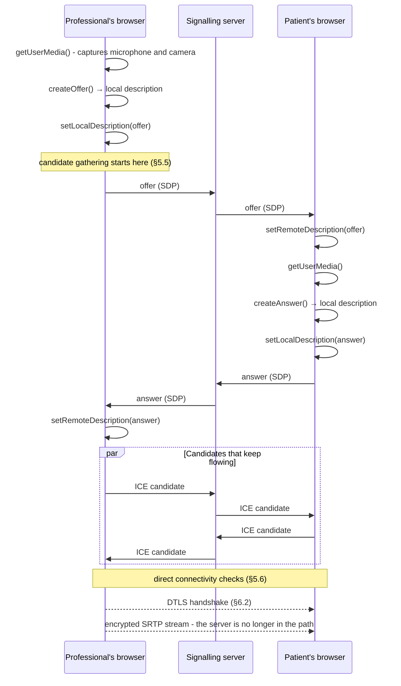
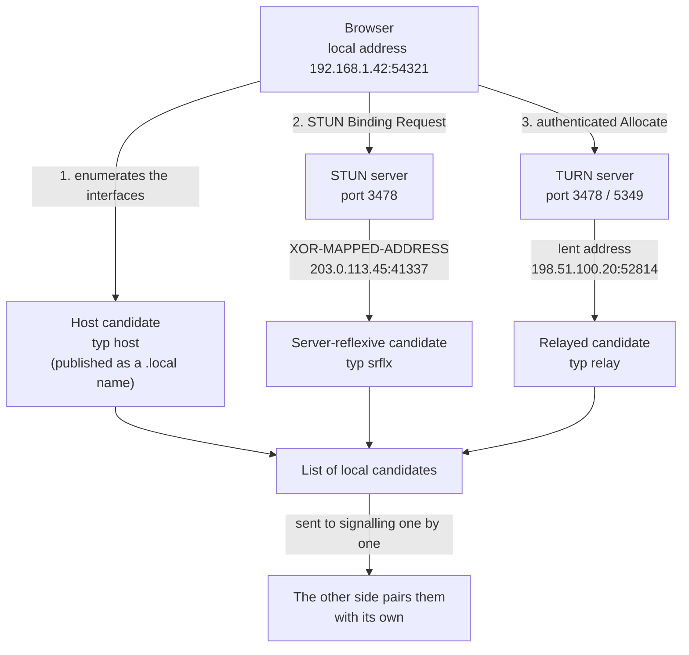
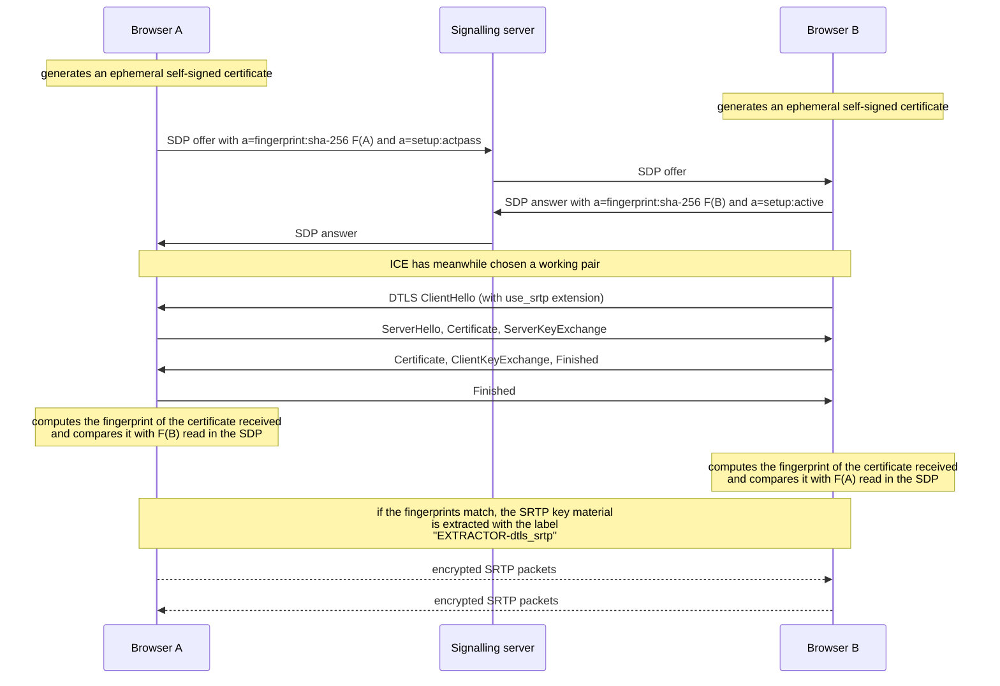
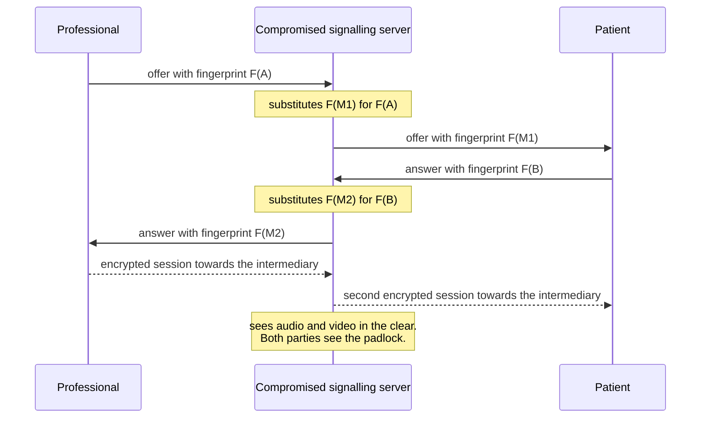
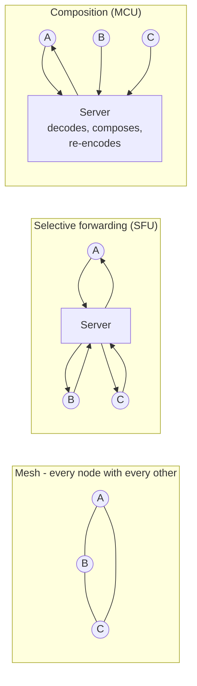

# WebRTC from scratch

This is the most technical module of the guide and it is also the one that describes the part
of the system where mistakes are paid for most dearly: the transport of the audio and video
stream between the healthcare professional and the patient.

**Prerequisites: knowing what an IP address is.** Nothing else. Every other network concept -
port, transport protocol, address translation, encryption of the stream - is built up here,
in order.

The module proceeds in a precise order and is not meant to be read by jumping around on a
first reading: **first the problem, then the network foundations, then the standard, then the
project's choices.** Anyone who skips straight to the configuration of the relay server ends
up copying lines whose reason they do not know, and that is exactly how a vulnerability is
introduced in this area.

Conventions: every technical statement cites the normative document with number and section.
Anything not verified against a primary source is marked `[NV]` with the indication of the
recipient in one of three permitted forms: the code of an area in backticks, a question
identifier, or an external party named according to the rules in `CONTRIBUTING.md`. All the
examples contain exclusively synthetic data and documentation addresses; **no real secret appears
in this guide**, only environment variable placeholders.

The overall threat model of the system, the audit obligations and identity management are
dealt with in the [module on cryptography and security](12-crittografia-e-sicurezza.md);
every abbreviation and every term introduced here is taken up again in the
[glossary](./19-glossario.md).

---

## 1. Why a video call is a hard problem

### 1.1 The web is built on an assumption that does not hold here

Everything you know about the web rests on an asymmetric structure: on one side a **server**,
which has a stable public address, stays switched on, and waits; on the other a **client**,
which does not need to be reachable because it is always the one that starts the
conversation. The browser opens the connection, asks, receives, closes. The server never
calls first.

In a video call this structure does not exist. There are two devices, both **clients**, both
behind a home or corporate router, both **unreachable from outside**, which have to exchange
a continuous, bidirectional stream. Neither of the two is a server. Neither of the two, on
its own, even knows what its own address is as the rest of the Internet sees it.

The problem, formulated without jargon, is this:

> Two machines that do not know their own public address, that cannot receive unsolicited
> connections, and that have no direct communication channel between them, must establish an
> audio and video stream that is continuous, encrypted, and fast enough not to break a human
> conversation.

Each of these five constraints generates a piece of the architecture that follows.

### 1.2 The temporal constraint is the hardest, and it comes from physiology

Human conversation works in turns. One speaker finishes a sentence, the other begins. Turn
exchange happens on a timescale that is not negotiable because it is not technical: it is
cognitive. As the delay grows, the two interlocutors begin to overlap, then interrupt one
another, then artificially slow down to compensate, and finally the conversation loses
naturalness in a way that people attribute to the other person and not to the line.

Recommendation **ITU-T G.114** (*One-way transmission time*) is the document that quantifies
this phenomenon for telephony. Verified contents:

- A one-way delay between **150 and 400 ms** is acceptable *«provided that Administrations
  are aware of the transmission time impact on the transmission quality of user
  applications»*.
- Beyond **400 ms** it is considered unacceptable for general network planning, save in
  exceptional cases.
- Decisive warning: **highly interactive** tasks - *«many voice calls, interactive data
  applications, video conferencing»* - *«can be affected by much lower delays»*. Even in the
  total absence of echo, *«10% or more of the speakers may experience difficulty due to a
  delay of 400 ms»*.

The current reading of the classic G.114 table: **0–150 ms** acceptable for most
applications; **150–400 ms** acceptable provided one knows what it entails; beyond 400 ms the
conversation is compromised.

In a clinical consultation this is not an aesthetic problem. A professional who asks «does it
hurt when I press here?» and receives the answer half a second late does not know whether the
delay is the line's or the patient's. The delay becomes **diagnostic noise**.

### 1.3 Why TCP is not enough

**TCP** (*Transmission Control Protocol*) is the transport protocol on which the web,
electronic mail and almost everything else rest. It offers three guarantees: the bytes all
arrive, they arrive in the order in which they left, and they do not arrive faster than the
network can bear.

For a real-time stream, the first and the second guarantee are **harmful**.

Imagine a packet containing 20 milliseconds of audio that is lost along the way. TCP notices,
retransmits it and - this is the point - **holds back all the subsequent packets that have
already arrived** until the gap is filled, because it must deliver them in order. The
phenomenon is called **head-of-line blocking**. The result is that a single loss produces an
audible pause at least one round trip long, and all the fragments of audio that arrived in
the meantime are delivered **late**, that is, useless.

For real-time media the rule is reversed:

> **Late data is worse than lost data.** A missing audio fragment can be masked; a late audio
> fragment occupies bandwidth, delays everything else and is of no use anyway, because the
> moment at which it should have been played back has passed.

There are two further reasons.

**TCP's congestion control is designed for throughput, not for latency.** TCP fills the
queues of the intermediate routers until something is lost, then slows down. Full queues are
pure delay: this is the phenomenon known as *bufferbloat*. A real-time protocol needs to
notice that the queue is growing **before** packets are lost, which TCP by construction does
not do.

**Opening a TCP connection costs a round trip before you even speak** (the *three-way
handshake*), plus one or two for encryption. On an already long path that is time spent.

### 1.4 Why HTTP is not enough

**HTTP** (*HyperText Transfer Protocol*) adds to TCP a **request and response** model: the
client asks, the server answers. Even in the versions that keep the connection open, the
initiative remains with the client. The server cannot send something to a client that has
asked nothing - and in a video call the other party speaks when they choose to.

HTTP nevertheless remains **indispensable** for one piece of the problem: before the two
devices can talk to each other directly, they must **exchange the information needed to find
each other**. That exchange goes through a server that both can reach, and that server speaks
HTTP (or WebSocket, which is born from an HTTP request). We shall return to this in §4: it is
called **signalling**, and it is the part that WebRTC deliberately does **not** standardise.

### 1.5 The quantity of data

A medium-definition video consultation produces, continuously and in both directions, a
stream on the order of a megabit per second. These are not bursts separated by pauses like
web traffic: it is a tap left running for twenty minutes. This changes three things.

1. **Upstream bandwidth matters more than downstream.** Italian home lines are often
   asymmetric: plenty of bandwidth for downloading, little for uploading. A video call uses
   the two directions symmetrically. The bottleneck is almost always the uplink.
2. **The network changes while you use it.** A lift, another device that starts downloading,
   a mobile cell that becomes congested: the stream must adapt on the fly, not pick a quality
   at the start and keep it.
3. **CPU matters.** Compressing video in real time is expensive. On a low-end smartphone the
   limit is not the network: it is the processor and the battery.

### 1.6 The list of problems to solve

To summarise, before a single frame can be displayed the following must have been solved:

| # | Problem | Where it is addressed |
|---|---|---|
| 1 | Obtaining audio and video from the device | §3.3 |
| 2 | Discovering one's own public address | §5.2 |
| 3 | Traversing address translation on both sides | §5 |
| 4 | Choosing the best path among those possible | §5.4 |
| 5 | Exchanging technical capabilities and keys | §4 |
| 6 | Encrypting the stream and authenticating the other party | §6 |
| 7 | Compressing audio and video in a way compatible between the two sides | §7 |
| 8 | Adapting to the available bandwidth moment by moment | §8 |
| 9 | Recovering or masking losses without adding delay | §8.4 |
| 10 | Measuring that all of this is working | §9 |

WebRTC solves, directly or by reference to other standards, points 1 to 10 **except point
5**, which it leaves to the application. This single exception is the reason the project has
a signalling server of its own, and it is also the weak point of the security model (§6.4).

---

## 2. The network foundations that are needed

### 2.1 Address, port, socket, five-tuple

An **IP address** identifies a network interface. On its own it is not enough: many programs
run on a machine, and the operating system must know which one to deliver an incoming packet
to. A second number is needed, the **port**, an integer from 0 to 65535.

The pair address + port is called an **endpoint**. A communication is identified by a
**five-tuple**: protocol, source address, source port, destination address, destination port.
This concept will keep coming back: address translation, the relay and firewall rules all
reason in terms of five-tuples.

Two facts that will be needed later:

- Public IPv4 addresses are exhausted. That is why the **private spaces** defined by
  **RFC 1918** exist - `10.0.0.0/8`, `172.16.0.0/12`, `192.168.0.0/16` - which every home or
  corporate network uses internally and which **are not routable on the Internet**.
- **IPv6** solves the problem at the root with an enormously larger address space, but its
  take-up is uneven: a system that wants to work everywhere must handle both address
  families, and code that compares IPv6 addresses is historically the source of an entire
  family of vulnerabilities (§11.4).

### 2.2 UDP versus TCP

**UDP** (*User Datagram Protocol*) is the minimal transport protocol: it takes a block of
bytes, puts a source port, destination port, length and checksum in front of it, and hands it
to the network. Nothing else. No connection, no acknowledgement, no ordering, no congestion
control.

| Characteristic | TCP | UDP |
|---|---|---|
| Preliminary connection | yes (three messages) | no |
| Guaranteed delivery | yes | no |
| Guaranteed ordering | yes | no |
| Automatic retransmission | yes | no |
| Congestion control | yes, built in | **no: the application must do it** |
| Head-of-line blocking | yes | no |
| Suitable for real-time media | no | **yes** |

The last row of the table is the one that counts: **UDP does nothing, and that is precisely
what is needed.** A real-time application wants to decide for itself what to retransmit, what
to abandon and how much to slow down. On TCP those decisions have already been taken, badly,
by the operating system.

There is a price, however, and it must be said at once: **everything TCP does for free,
WebRTC has to redo by hand**, in a form suited to real time. Loss recovery (§8.4), congestion
control (§8.3), ordering (the *jitter buffer*, §8.2) and even the verification that the path
is still alive (ICE's *consent checks*, §5.6) are all mechanisms that exist because UDP is
underneath.

### 2.3 What NAT is

**NAT** stands for *Network Address Translation*. It is what allows dozens of devices in a
house or a hospital to share a single public IPv4 address.

The mechanism, stripped of every complication:

1. An internal device with private address `192.168.1.42` sends a packet from port `50000`
   towards a public server.
2. The router rewrites the packet: source `203.0.113.7:41337`, where `203.0.113.7` is its
   only public address and `41337` a port that it chooses itself.
3. The router **records in a table** the correspondence between `192.168.1.42:50000` and
   `203.0.113.7:41337`.
4. When a response arrives for `203.0.113.7:41337`, the router consults the table and
   forwards it to `192.168.1.42:50000`.

Three consequences, all crucial.

**First: the internal device does not know its own public address.** The rewriting takes
place in the router; the device sees only `192.168.1.42`. If it were to write that address
inside a message saying «contact me here», it would be unusable from outside. This is where
STUN comes from (§5.2).

**Second: the table entry is created only by outbound traffic.** A packet arriving from
outside without a corresponding entry is discarded: the router does not know whom to give it
to. This is why neither of the two devices is reachable first.

**Third: the table entry expires.** If no packet traverses it for a certain time, the router
deletes it and the public port becomes available again for others. This is where the need for
periodic keep-alive traffic comes from.

### 2.4 The types of NAT, and why the «symmetric» one is the worst case

Not all NATs behave in the same way. The correct terminology is that of **RFC 4787** (*NAT
Behavioral Requirements for Unicast UDP*), which separates two independent behaviours: how
the **mapping** is created and how inbound traffic is **filtered**.

**Mapping behaviour** - for the same internal address and port, is the public port assigned
the same for all destinations, or does it change?

| Behaviour (RFC 4787) | Description | Colloquial name |
|---|---|---|
| **Endpoint-Independent Mapping** | Same public port towards any destination | «cone» |
| **Address-Dependent Mapping** | Different public port for each destination address | - |
| **Address and Port-Dependent Mapping** | Different public port for each destination address+port pair | **«symmetric»** |

**Filtering behaviour** - who may use an already open mapping to get in?

| Behaviour | Description |
|---|---|
| **Endpoint-Independent Filtering** | Anyone, provided the mapping exists |
| **Address-Dependent Filtering** | Only the address one has already written to |
| **Address and Port-Dependent Filtering** | Only the address+port pair one has already written to |

RFC 4787 recommends *Endpoint-Independent Mapping* precisely because it is the one that makes
traversal possible; but the recommendation is not an obligation and much equipment does not
comply with it.

**Why address-and-port-dependent mapping NAT ruins everything.** The strategy for traversing
a NAT is: I ask a public server what address and port it sees arriving from me, I communicate
that pair to the other party, they send the packets there. It works only if **the public port
that the router uses towards the server is the same one it will use towards the other
party**. With a symmetric NAT it is not: the router opens a new port for each destination,
and the pair discovered by querying the server has already lost its meaning by the time it is
communicated.

If **both** parties are behind a symmetric NAT, **no direct path is possible**. No cleverness
will help: an intermediary is needed that receives and re-forwards the packets. That is the
**relay**, and it is why TURN exists (§5.3). **RFC 8835 §3.4** cites exactly this scenario as
the motivation for the obligation to support TURN.

### 2.5 CGNAT, that is, the carrier's NAT

For some years now mobile operators - and in part fixed-line ones - no longer assign a public
IPv4 address to each customer. They apply a second layer of translation inside their own
network: this is **CGNAT** (*Carrier-Grade NAT*). The customer receives an address from the
reserved space **`100.64.0.0/10`** defined by **RFC 6598**, which is neither private in the
RFC 1918 sense nor public.

Practical consequences for a remote consultation (televisita):

- The patient's device is behind **two** levels of translation: their own router and the
  operator's.
- CGNAT behaviour is typically the least favourable, because it has to maximise port reuse
  across thousands of customers.
- **The typical patient in a remote consultation is on a mobile network.** This is not an edge
  case: it is the central case. The project's constraint D25 - design starting from the small
  screen and the worst connection - is the organisational translation of this technical fact.

### 2.6 Corporate and hospital firewalls

NAT is not the only obstacle. On managed networks explicit policies are added:

- **Outbound UDP blocked entirely.** This is a common configuration on healthcare and banking
  networks, motivated by the difficulty of inspecting connectionless traffic. Effect: no
  direct path, and not even the relay works if it only speaks UDP. Remedy: the relay must also
  be reachable over **TCP on port 443 with TLS**, which is the traffic no network blocks.
- **Only ports 80 and 443 outbound.** A variant of the previous one.
- **Proxy with inspection of encrypted traffic.** The proxy terminates the TLS session and
  reopens it: this works for the web, not for a stream that must remain encrypted end to end.
- **Client isolation on wireless access points.** Two devices on the same Wi-Fi network cannot
  talk to each other directly. It is on by default on almost all corporate and hospital Wi-Fi
  networks.

The last point produces a counter-intuitive effect worth fixing:

> **The consultation in which the professional and the patient are in the same building is
> often the hardest to route**, not the easiest. With client isolation on, the two devices do
> not see each other locally and the traffic leaves onto the public network in order to come
> back in - when it does not end up straight on the relay.

### 2.7 The obfuscation of local addresses

A detail that confuses anyone looking at the logs for the first time. To prevent web pages
from harvesting users' private IP addresses - a real device fingerprinting vector - browsers
**no longer publish the addresses of local interfaces**. In their place they publish a name
of the form `<random identifier>.local`, resolvable only on the local network through **mDNS**
(*multicast DNS*, name resolution via multicast messages on UDP port 5353).

The document describing the procedure is `draft-ietf-mmusic-mdns-ice-candidates`, an
**expired Internet-Draft** (published on 5 December 2021, expired on 8 June 2022) that
**never became an RFC**. It is a case in which the behaviour is universal in browsers but the
document is not normative: it must be stated that way, without passing it off as a standard.

Three operational consequences:

1. If mDNS is blocked - and as a rule it is, on Wi-Fi networks with client isolation - the
   pair of local paths does not form and one ends up on the relay for a connection that could
   have stayed on a switch.
2. **The signalling server's logs will see `.local` names, not addresses.** Any network
   analysis built on those addresses is useless: the measurements must be taken from the
   browser (§9), not from the signalling messages.
3. **A positive side effect on confidentiality**: the private addresses of clinical devices do
   not end up in the project's logs. It is an element to be highlighted in the data protection
   impact assessment, because it reduces the quantity of personal data processed.

---

## 3. What WebRTC is

### 3.1 It is not one specification: it is two bodies of rules

**WebRTC** stands for *Web Real-Time Communication*. It is not a product, it is not a
library, it is not a protocol: it is **the set of specifications that a browser must
implement** in order to be able to establish an audio, video and data session in real time
with another browser.

The specifications come from two different bodies that presuppose one another.

- The **W3C** (*World Wide Web Consortium*) defines **the programming interface** exposed to
  the page's JavaScript code: *WebRTC: Real-Time Communication in Browsers*, **W3C
  Recommendation of 13 March 2025**. It is a stable recommendation which nevertheless
  continues to incorporate *candidate amendments*: the interface surface is not frozen.
- The **IETF** (*Internet Engineering Task Force*) defines **the on-the-wire protocols**, that
  is, what actually travels in the packets. The coordinating document is **RFC 8825** -
  *Overview: Real-Time Protocols for Browser-Based Applications*.

RFC 8825 does not define any protocol: **it lists which other specifications an implementation
must comply with** in order to be able to call itself WebRTC. It is an *applicability
statement*, and its structure (§1-§12) covers data transport (§4), framing and securing (§5),
formats (§6) and connection management (§7).

The IETF constellation of rules, with the role of each document:

| RFC | Title | What it establishes |
|---|---|---|
| **8825** | Overview: Real-Time Protocols for Browser-Based Applications | Coordination point; lists the others |
| **8826** | Security Considerations for WebRTC | Threat model |
| **8827** | WebRTC Security Architecture | Cryptographic and identity requirements |
| **8829** | JavaScript Session Establishment Protocol (JSEP) | Offer/answer semantics on the interface side |
| **8831** | WebRTC Data Channels | Requirements for data channels |
| **8832** | WebRTC Data Channel Establishment Protocol (DCEP) | Protocol for opening data channels |
| **8834** | Media Transport and Use of RTP in WebRTC | Mandatory RTP profile |
| **8835** | Transports for WebRTC | ICE, TURN, multiplexing, SCTP over DTLS |
| **8836** | Congestion Control Requirements for Interactive Real-Time Media | Requirements, **not** the algorithm |
| **8837** | DSCP Packet Markings for WebRTC QoS | Priority markings in the packets |
| **8854** | WebRTC Forward Error Correction Requirements | Audio and video error correction |
| **8864** | Negotiation Data Channels Using SDP | Negotiation of data channels |

> **A note of correction, because the error is widespread.** RFC 8826 and RFC 8827 are often
> cited the wrong way round. The correct numbering is: **8826 = Security Considerations**
> (the threats), **8827 = Security Architecture** (the architecture). Likewise, RFC 5245
> (superseded by **RFC 8445** for ICE), RFC 5389 (superseded by **RFC 8489** for STUN) and
> RFC 5766 (superseded by **RFC 8656** for TURN, which also obsoletes RFC 6156, cf. RFC 8656
> §24 and §25) must no longer be cited as live references.

### 3.2 What WebRTC comprises

Three families of functionality, exposed by three groups of interfaces.

**Media capture.** Obtaining audio and video from the user's devices. Note a point that is
often got wrong: `MediaStream`, `MediaStreamTrack` and the `getUserMedia()` function **do not
belong to the WebRTC specification**. They are defined by *Media Capture and Streams*, a
distinct W3C specification. It follows that the constraints on resolution, frame rate and
device selection (`MediaTrackConstraints`) are governed by that specification, not by WebRTC.
It is a distinction that matters when writing traceable requirements.

**Transport.** The central interface is `RTCPeerConnection`, which represents the session
towards the other device. Around it: `RTCRtpSender`, `RTCRtpReceiver`, `RTCRtpTransceiver`
for the streams, `RTCDtlsTransport` and `RTCIceTransport` for the underlying transport,
`RTCCertificate` for the session certificate.

**The data channel.** `RTCDataChannel` carries arbitrary data between the two devices, with
the same encryption and over the same path as the media. It runs on **SCTP encapsulated in
DTLS encapsulated in ICE** - **RFC 8835 §3.5**: *«WebRTC endpoints MUST support SCTP over DTLS
over ICE»*, with the I-DATA extension of RFC 8260 mandatory. For the project it is the natural
channel for in-band control signals (muting, request for repetition), for carrying subtitles
(§10.4) and for any metadata that **must not transit through the signalling server**.

The configuration of an `RTCPeerConnection` has exactly six members:

```javascript
const pc = new RTCPeerConnection({
  iceServers: [/* list of STUN/TURN servers */],  // default: []
  iceTransportPolicy: "all",     // "all" | "relay"
  bundlePolicy: "balanced",      // "balanced" | "max-compat" | "max-bundle"
  rtcpMuxPolicy: "require",      // "require"
  certificates: [],              // reusable certificates
  iceCandidatePoolSize: 0,
});
```

Two members have direct relevance for the project:

- **`iceTransportPolicy: "relay"`** discards all paths that do not go through the relay. It is
  the canonical way to **verify in continuous integration** that the path through the relay
  works (§13.4).
- **`certificates`** allows the reuse of a certificate generated with
  `RTCPeerConnection.generateCertificate()`. By default the browser generates an ephemeral
  self-signed certificate for each connection - a fact that has direct consequences for the
  security model (§6.3).

### 3.3 What WebRTC does NOT comprise

**Signalling is not in the standard.** There is no WebRTC protocol for the way in which the
two devices exchange the preliminary information. It is not an oversight: it is a declared
design choice.

**RFC 8829 (JSEP) §1.1** gives this motivation: *«different applications may prefer to use
different protocols, such as the existing SIP call signaling protocol, or something custom to
the particular application»*, and *«the JSEP implementation is almost entirely divorced from
the core signaling flow, which is instead handled by the JavaScript»*.

**RFC 8825** restates it from the architectural side: *«The choice of protocols for
client-server and inter-server signaling, and the definition of the translation between them,
are outside the scope of the WebRTC protocol suite described in this document.»*

WebRTC furthermore **does not comprise**:

- **the management of rooms**, of invitations, of address books, of presence status;
- **user authentication**: it does not know who the people are, it knows only that two
  connections have latched onto each other;
- **recording the session** to a file (there is a distinct W3C specification, *MediaStream
  Recording*, §12);
- **the congestion control algorithm**: RFC 8836 defines its *requirements*, and RFC 8834
  states explicitly that *«at the time of this writing, there is no standard congestion
  control algorithm that can be used for interactive media applications such as WebRTC's
  flows»*;
- **distribution to more than two participants**: each `RTCPeerConnection` connects two
  endpoints, full stop. Conferences are built by composing several connections or by
  introducing a server (§10).

> **The consequence to be absorbed before every other.** Since signalling is not
> standardised, **it is not protected by the protocol either**. The whole chain of trust of
> media encryption depends on the integrity of a channel that WebRTC does not specify.
> Telemedic's signalling server is not an accessory component: it is **the anchor point of
> trust for the entire session**, and it must be designed, documented and subjected to threat
> analysis as such. We return to this at length in §6.4.

---

## 4. Signalling and the offer/answer model

### 4.1 The idea: two descriptions that meet

Before a single frame can be exchanged, the two devices must agree on a long list of things:
which codecs they can use, with which parameters, who sends and who receives, which addresses
to try, which keys to use. The model that governs this agreement is **offer and answer**
(*offer/answer*), defined by **RFC 3264** - *An Offer/Answer Model with the Session
Description Protocol*.

The mechanism is asymmetric and simple:

1. One side - **the offerer** - produces a description listing everything it **can and wants**
   to do.
2. The other side - **the answerer** - receives that description and produces an answer which,
   item by item, **accepts, restricts or refuses**. It cannot add anything that was not in the
   offer.
3. Both apply the two descriptions locally. At that point they know exactly what they will do.

The format of those descriptions is **SDP** (*Session Description Protocol*), defined by
**RFC 8866**, which obsoletes RFC 4566.

### 4.2 The state machine, and who moves it

**RFC 8829 (JSEP)** defines how all this appears to the JavaScript code. The browser exposes a
state machine (§3.2, Figure 2) with the states `stable`, `have-local-offer`,
`have-remote-offer`, `have-local-pranswer`, `have-remote-pranswer`, `closed`, and four methods
that move it: `createOffer()` (§4.1.8), `createAnswer()` (§4.1.9), `setLocalDescription()`
(§4.1.11), `setRemoteDescription()` (§4.1.12), with the rollback to the previous state
described in §4.1.10.2.

**The browser produces and consumes the SDP blocks. The transport of those blocks is entirely
the application's responsibility.** In the project that transport is a WebSocket connection to
the signalling server.



Two observations on the diagram, both important:

- **The signalling server leaves the path once the session is established.** The media never
  traverses it. If the server goes down once the call is under way, the stream **continues**;
  what is lost is the ability to renegotiate, to exchange new candidates and to close in an
  orderly manner.
- **Candidates keep flowing after the offer.** This is called *trickle* and it is dealt with
  in §5.7.

### 4.3 A real SDP, commented line by line

What follows is a realistic and **synthetic** example of an offer produced by a browser for a
session with audio and video. It has been shortened where repetition adds nothing, and it is
commented throughout. It contains no real data.

```sdp
v=0
o=- 4611731400430051336 2 IN IP4 127.0.0.1
s=-
t=0 0
a=group:BUNDLE 0 1
a=extmap-allow-mixed
a=msid-semantic: WMS 6f1b2c3d-0000-4000-8000-000000000001
```

- **`v=0`** - version of the SDP format. It is always `0`; it has never changed (RFC 8866
  §5.1).
- **`o=`** - origin line: user name (`-`, that is, absent), session identifier, session
  version number, network type, address type, address. **The `127.0.0.1` is not an error**: in
  the WebRTC context this line is not used to route anything, and browsers write a placeholder
  value into it. Do not try to deduce the other party's address from it.
- **`s=-`** - session name, absent.
- **`t=0 0`** - start and end time: zero and zero means «permanent session, with no
  scheduling».
- **`a=group:BUNDLE 0 1`** - declares that the sections identified by `0` and `1` (audio and
  video) will travel **on the same connection**. It is the BUNDLE mechanism of **RFC 8843**
  §5. The first identifier in the group is the offerer's *BUNDLE-tag* and its section carries
  the address and port used for the whole group (§2).
- **`a=extmap-allow-mixed`** - allows the two forms of RTP header extension (one and two
  bytes) defined by RFC 8285 to be mixed.
- **`a=msid-semantic`** - declares the semantics of the media stream identifiers.

> **Why BUNDLE is an architectural fact and not a detail.** BUNDLE **requires** the
> multiplexing of RTP and RTCP on the same port within the group (RFC 8843 §9.3) and entails
> **a single ICE transport and a single DTLS association** for the whole group (§10-§11). In
> practice: audio, video and data channel share **one** port, **one** encryption handshake,
> **one** allocation on the relay. The whole sizing of the relay server (§11.6) rests on this.

The audio section follows.

```sdp
m=audio 9 UDP/TLS/RTP/SAVPF 111 63 9 0 8 110 126
c=IN IP4 0.0.0.0
a=rtcp:9 IN IP4 0.0.0.0
```

- **`m=audio`** - opens a *media section*. `9` is the port: it is a conventional
  **placeholder** (the real port comes from the ICE candidates, §5.1); the value `0` would
  instead have the normative meaning of «this section is refused» (RFC 3264).
- **`UDP/TLS/RTP/SAVPF`** - the transport profile. It is read from the right: **AVPF** is the
  RTP profile with audiovisual feedback (RFC 4585), the initial **S** stands for *secure*
  (SRTP), the whole encapsulated in TLS over UDP. **RFC 8834** is categorical: *«WebRTC
  endpoints MUST NOT send packets using the basic RTP/AVP profile or the RTP/AVPF profile;
  they MUST employ the full RTP/SAVPF profile»*. **There is no WebRTC in the clear.**
- **`111 63 9 0 8 110 126`** - the list of *payload types*, that is, the codecs offered, **in
  decreasing order of preference**. They are numbers; the meaning of each is defined further
  down by the `a=rtpmap` lines.
- **`c=IN IP4 0.0.0.0`** - connection address, likewise a placeholder.
- **`a=rtcp:9`** - port for the control channel, equally a placeholder.

```sdp
a=ice-ufrag:4ZcD
a=ice-pwd:by0Bp1IFDpZ0Y0Bx0j0RB4dR
a=ice-options:trickle
```

- **`a=ice-ufrag`** and **`a=ice-pwd`** - username fragment and password for the ICE
  connectivity checks. Syntax defined by **RFC 8839 §5.4**: from 4 to 256 characters for the
  former, from 22 to 256 for the latter. **They serve two purposes at once**: identifying
  which session an incoming control packet belongs to, and authenticating it. Changing them is
  what constitutes an **ICE restart** (§5.8).
- **`a=ice-options:trickle`** - declares that the agent can handle candidates arriving after
  the offer (RFC 8838 §3; the option is registered in §19).

```sdp
a=fingerprint:sha-256 8F:2B:C1:44:9A:D0:7E:5B:03:6C:E2:11:AF:58:90:7D:
 22:64:B8:0E:F3:19:AC:47:D5:6A:12:38:CB:70:E4:95
a=setup:actpass
a=mid:0
a=sendrecv
a=rtcp-mux
```

- **`a=fingerprint`** - **this line is the linchpin of the entire security model.** It
  contains the cryptographic fingerprint (here SHA-256) of the certificate this side will use
  in the DTLS handshake. Syntax defined by **RFC 8122 §5**. It is the line that binds the
  signalled session to the encrypted session: we return to it in §6.3.
- **`a=setup:actpass`** - who will act as client and who as server in the DTLS handshake.
  **RFC 8842** defines the values `actpass`, `active`, `passive`, `holdconn`. The offerer
  declares `actpass` («you decide»); the answerer chooses and declares `active` or `passive`.
- **`a=mid:0`** - the identifier of this section, the one referred to in
  `a=group:BUNDLE 0 1`.
- **`a=sendrecv`** - this section sends **and** receives. The alternatives are `sendonly`,
  `recvonly`, `inactive`. In an ordinary consultation it is `sendrecv` on both sides.
- **`a=rtcp-mux`** - data and control on the same port (RFC 5761). Mandatory inside a BUNDLE
  group.

```sdp
a=rtpmap:111 opus/48000/2
a=rtcp-fb:111 transport-cc
a=fmtp:111 minptime=10;useinbandfec=1
a=rtpmap:63 red/48000/2
a=fmtp:63 111/111
a=rtpmap:0 PCMU/8000
a=rtpmap:8 PCMA/8000
```

- **`a=rtpmap:111 opus/48000/2`** - payload type `111` is **Opus**, with a sampling rate of
  48000 Hz and two channels. **RFC 7587** requires these two values to be **always
  `48000/2`**, irrespective of the actual content: the `/2` indicates the *capability* to
  carry stereo, not that the stream is stereo.
- **`a=rtcp-fb:111 transport-cc`** - declares that transport-level congestion control feedback
  is wanted (§8.3).
- **`a=fmtp:111 ...`** - format-specific parameters. `useinbandfec=1` activates the error
  correction built into Opus (RFC 7587 §6.1), **recommended by RFC 8854 §4.1**. A point of
  precision: **`minptime` is not defined by RFC 7587** even though it appears in the SDP
  generated by many implementations; it is an off-specification parameter and must not be
  cited as standard.
- **`a=rtpmap:63 red/48000/2`** and **`a=fmtp:63 111/111`** - redundant coding (RFC 2198):
  each packet also carries a copy of the previous one. `111/111` declares that both the
  primary and the redundant block are Opus.
- **`a=rtpmap:0 PCMU/8000`** and **`a=rtpmap:8 PCMA/8000`** - **G.711** in its two variants
  (µ-law and A-law). These are the telephone codecs: quality limited to narrowband, but
  present everywhere and necessary to interoperate with non-browser equipment. **RFC 7874**
  makes them mandatory together with Opus.

The video section follows, with the same structure.

```sdp
m=video 9 UDP/TLS/RTP/SAVPF 96 97 102 103 45 46
c=IN IP4 0.0.0.0
a=ice-ufrag:4ZcD
a=ice-pwd:by0Bp1IFDpZ0Y0Bx0j0RB4dR
a=fingerprint:sha-256 8F:2B:C1:44:9A:D0:7E:5B:03:6C:E2:11:AF:58:90:7D:
 22:64:B8:0E:F3:19:AC:47:D5:6A:12:38:CB:70:E4:95
a=setup:actpass
a=mid:1
a=sendrecv
a=rtcp-mux
a=rtpmap:96 VP8/90000
a=rtcp-fb:96 goog-remb
a=rtcp-fb:96 transport-cc
a=rtcp-fb:96 ccm fir
a=rtcp-fb:96 nack
a=rtcp-fb:96 nack pli
a=rtpmap:97 rtx/90000
a=fmtp:97 apt=96
a=rtpmap:102 H264/90000
a=fmtp:102 level-asymmetry-allowed=1;packetization-mode=1;profile-level-id=42001f
a=rtpmap:45 AV1/90000
```

- **`a=ice-ufrag` and `a=fingerprint` are repeated identically** with respect to the audio
  section: it is the signature of BUNDLE. A single ICE credential, a single certificate, a
  single connection.
- **`a=rtpmap:96 VP8/90000`** - VP8. The reference rate for video in RTP is always 90000 Hz,
  by historical convention.
- **The four `a=rtcp-fb` lines** declare the recovery mechanisms this side can use (§8.4):
  `nack` to request the retransmission of a packet (RFC 4585), `nack pli` to signal the loss
  of a picture, `ccm fir` to request a full frame (RFC 5104), `transport-cc` for congestion
  feedback. `goog-remb` is an earlier mechanism, by now residual.
- **`a=rtpmap:97 rtx/90000` with `a=fmtp:97 apt=96`** - the **retransmission** stream
  (RFC 4588) associated with payload type `96`. Retransmissions travel on a separate stream so
  as not to disturb the numbering of the main stream.
- **`a=rtpmap:102 H264/90000` with its `fmtp`** - H.264. `profile-level-id=42001f` identifies
  **Constrained Baseline Profile Level 3.1**; `packetization-mode=1` is the packetisation mode
  that **RFC 7742 §6.2** declares mandatory (*«Packetization-mode 1 MUST be supported»*).
- **`a=rtpmap:45 AV1/90000`** - AV1, where the browser supports it.

The lines that identify the stream close the section:

```sdp
a=ssrc:3735928559 cname:Zt9x0PqLmN1sVe4K
a=ssrc:3735928559 msid:6f1b2c3d-0000-4000-8000-000000000001 video-track-0
```

- **`a=ssrc`** - the *synchronization source*, the numeric identifier of the RTP stream.
- **`cname`** - canonical name binding together the streams belonging to the same origin
  (RFC 3550), necessary in order to synchronise audio and video.

> **Operational rule for the project.** The SDP contains, in the clear, sensitive
> information: the certificate fingerprints, the ICE credentials, the stream identifiers and -
> when mDNS obfuscation does not apply - network addresses. **The complete SDP must not be
> recorded in the application logs.** What must be recorded in the audit trail is the outcome
> of the negotiation, the codecs actually selected and the fingerprints, as documentary
> evidence; not the whole block.

### 4.4 Glare

If both sides decide to renegotiate at the same instant - it really happens: the professional
starts screen sharing while the patient re-enables the camera - a **collision** (*glare*) is
produced: both enter the `have-local-offer` state and neither of them can apply the other's
offer.

The canonical solution assigns to one of the two the **polite** role and to the other the
**impolite** one. In the event of a collision, the polite one rolls back its own offer and
accepts the other's; the impolite one ignores the offer received and keeps its own. The
pattern is called **perfect negotiation** and is founded on `setLocalDescription()` called
**without arguments** (which decides for itself whether to produce an offer or an answer,
according to the state) and on the implicit rollback performed by `setRemoteDescription()`.

Three rules that the project adopts:

1. **The role is assigned by the signalling server, not negotiated by the clients.** In the
   project: **the patient is polite, the professional impolite**. The motivation is clinical,
   not technical: in the event of a collision, the configuration wanted by whoever is
   conducting the consultation prevails.
2. **The application variable «I am producing an offer» is tested, not `signalingState`**,
   because the latter is updated asynchronously and the race window really does exist.
3. With more than two participants (§10.2) the role is assigned by a deterministic and
   unambiguous rule: lexicographic ordering of the participant identifiers.

### 4.5 The transport of signalling, and a requirement that gets forgotten

The project carries signalling over **WebSocket** (RFC 6455) with a versioned, schema-validated
JSON application protocol. The alternatives - messaging layers on top, fallbacks to
multi-request HTTP transports, or the adoption of a telephony protocol - add complexity or
session affinity constraints without benefit in a two-party session.

There is a normative requirement that must be complied with and that is discovered late if it
is not read first. **RFC 8838 §9** establishes that the protocol carrying the candidates must
deliver them *«exactly once and in the same order it was conveyed»*. Translated: the candidate
queue for each session must be **ordered and reliable**. A «publish and forget» broadcast
mechanism between several server nodes does not guarantee it, and the resulting defect is
intermittent and extremely difficult to diagnose. The choice of how to distribute session
state across several nodes is therefore constrained by this line of the RFC, and it must be
recorded as an architectural decision.

---

## 5. ICE, STUN and TURN: how the two devices find each other

### 5.1 The idea of ICE: do not choose, try everything

**ICE** stands for *Interactive Connectivity Establishment* and is defined by **RFC 8445**,
which replaces RFC 5245. The profile describing how ICE is expressed inside SDP is **RFC
8839**.

ICE's insight is disarmingly simple and must be understood well, because everything else
descends from it:

> Since nobody can know in advance which path will work - it depends on two NATs, two
> firewalls, two operators and luck - **you do not choose: you gather all the plausible paths,
> try them all simultaneously, and keep the one that works best.**

Every plausible path starts from a **candidate**: an address/port pair at which this device
can, in some way, be reached. In SDP a candidate has this form (syntax of RFC 8839 §5.1):

```
a=candidate:<foundation> <component-id> <transport> <priority> <address> <port> typ <type> [raddr <related-address>] [rport <related-port>]
```

Realistic and synthetic examples:

```sdp
a=candidate:1 1 udp 2122260223 8b7c1e4a-0000-4000-8000-000000000001.local 54321 typ host generation 0
a=candidate:2 1 udp 1686052607 203.0.113.45 41337 typ srflx raddr 0.0.0.0 rport 0 generation 0
a=candidate:3 1 udp 41885439 198.51.100.20 52814 typ relay raddr 203.0.113.45 rport 41337 generation 0
```

They read as follows: the first is a local address (obfuscated into `.local`, §2.7); the
second is the public address seen from outside; the third is an address lent by a relay
server.

### 5.2 The four types of candidate

Definitions verbatim from **RFC 8445 §2.1** and §4:

| Type | Definition (RFC 8445) | SDP abbreviation | Who supplies it |
|---|---|---|---|
| **Host** | *«A candidate obtained by binding to a specific port from an IP address on the host.»* | `host` | The operating system |
| **Server-reflexive** | *«A candidate whose IP address and port are a binding allocated by a NAT for an ICE agent after it sends a packet through the NAT to a server, such as a STUN server.»* | `srflx` | A STUN server |
| **Peer-reflexive** | *«…after it sends a packet through the NAT to its peer.»* | `prflx` | Discovered during the checks |
| **Relayed** | *«A candidate obtained from a relay server, such as a TURN server.»* | `relay` | A TURN server |

In plain terms:

- **Host**: «this is my address on the local network». It works if the two devices are on the
  same network and client isolation does not prevent it.
- **Server-reflexive**: «this is the address by which the world sees me». It is discovered by
  asking an external server. It works if the NAT has destination-independent mapping (§2.4).
- **Peer-reflexive**: an address that nobody had foreseen and that emerges because a control
  packet arrived from there. It is not announced: it is discovered.
- **Relayed**: «send me the packets at this address, which belongs to a server that then
  forwards them to me». It is the last resort, and it costs (§5.9).

### 5.3 STUN and TURN: two protocols, one server

**STUN** (*Session Traversal Utilities for NAT*, **RFC 8489**, obsoletes RFC 5389) is the
protocol by which one asks an external server: «what address and what port do you see arriving
from me?». The server answers with the **`XOR-MAPPED-ADDRESS`** attribute. This is where the
*server-reflexive* candidate comes from.

STUN also supplies the (long-term credential) authentication mechanism that TURN reuses, the
integrity attributes `MESSAGE-INTEGRITY` (HMAC-SHA1) and `MESSAGE-INTEGRITY-SHA256`, and the
`FINGERPRINT` attribute (CRC-32 with XOR `0x5354554e`).

> The `FINGERPRINT` is not a detail: it is what makes it possible to distinguish, **on the
> same UDP port**, a STUN packet from a DTLS packet from an SRTP packet. The discipline is
> codified in **RFC 7983**, updated by **RFC 9443**. It is the technical reason why BUNDLE and
> RTP/RTCP multiplexing can coexist on a single port.

**TURN** (*Traversal Using Relays around NAT*, **RFC 8656**, obsoletes RFC 5766 and RFC 6156)
is the protocol by which one asks a server: «lend me an address of yours, receive the packets
destined for me there and forward them to me». Verified elements of the structure:

- **Allocation** (§6, §7): the server reserves an address and a port for that client, with an
  expiry. It is the expensive resource.
- **Permission** (§9, §10): the allocation accepts traffic **only from the IP addresses
  explicitly authorised** by the client with `CreatePermission`. Lifetime **5 minutes**,
  renewable. The permission is **per address, not per port**.
- **Channel binding** (§12): associates a channel number with an address, reducing the header
  of each packet to only **4 bytes** instead of the full STUN header. Lifetime **10 minutes**.
- **Send/Data indications** (§11): the most expensive mode, with about 36 bytes of header per
  packet.
- **Transports between client and server** (§3.1): UDP, TCP, TLS over TCP, DTLS over UDP.
  **The relay towards the other party remains UDP** in this specification.

In practice **the same server answers both protocols**, on the same port. When one says
«STUN/TURN server» one is speaking of a single process.

### 5.4 Candidate gathering, illustrated



The browser performs the three steps **in parallel** and for **each** available network
interface: a machine with Wi-Fi and cable produces candidates for both, and so does a
smartphone with Wi-Fi and a mobile network. That is easily six or eight candidates per side.

### 5.5 Priority, pairing and checks

**The priority of a candidate** is calculated with the formula of **RFC 8445 §5.1.2.1**:

```
priority = (2^24) × (type preference)
         + (2^8)  × (local preference)
         + (2^0)  × (256 − component identifier)
```

The recommended values for the *type preference* are: **host = 126, peer-reflexive = 110,
server-reflexive = 100, relayed = 0**.

> **That zero is the most important architectural fact in the whole paragraph.** The relay has
> the lowest possible priority: **ICE uses it only if nothing else works**. From this follows
> a clarification that the project must make in its own communications: the «fallback to the
> relay when the direct connection fails» **is not a feature implemented by Telemedic**, it is
> the native behaviour of ICE. The project's real feature is *supplying valid credentials for
> a reliable relay*, not «implementing the fallback».

The **foundation** (§4 and §5.1.1.3) is a label shared by candidates that have the same type,
the same base address, the same server and the same transport. It serves the so-called
*freezing algorithm*: only one candidate per foundation is unfrozen at a time, so as not to
saturate the network with simultaneous checks.

**Pairing.** Having received the other side's candidates, each agent builds a **check list**
(§6.1.2) pairing each local candidate with each remote candidate of the same component and the
same address family. The pairs are ordered by priority, redundant ones are eliminated, and the
list is **limited by default to 100 pairs**. Link-local IPv6 addresses are paired only with
one another.

The priority of a pair (§6.1.2.3):

```
pair priority = 2^32 × MIN(G,D) + 2 × MAX(G,D) + (G > D ? 1 : 0)
```

where `G` is the priority of the **controlling** agent's candidate and `D` that of the
**controlled** agent's.

**The connectivity checks.** For each pair, the agent sends a STUN Binding request towards the
remote candidate, authenticated with the `ice-ufrag`/`ice-pwd` credentials exchanged in the
SDP. If a valid response comes back, the pair works. The states of a pair (§6.1.2.6) are
`Frozen`, `Waiting`, `In-Progress`, `Succeeded`, `Failed`; those of the list (§6.1.2.1)
`Running`, `Completed`, `Failed`.

The connectivity check has a valuable side effect: **it opens the passage in the NAT in both
directions**. While A tries to reach B, the outbound packet creates in A's NAT the entry that
will allow B's packet to get in. It is the mechanism known as *hole punching*, and
*peer-reflexive* candidates are born exactly here.

**Nomination.** When a pair works, the controlling agent designates it as definitive by
sending a STUN request with the **`USE-CANDIDATE`** attribute. RFC 8445 §2.3 and §4 specify
only **regular nomination**; the *aggressive nomination* of RFC 5245 is **deprecated**. If in
interoperability testing a change of path is observed halfway through negotiation, it is
almost always a dated implementation that still uses it.

**The roles** (§6.1.1): between two full agents, the controlling one is the one that started.
There is a reduced mode, **ICE-lite** (§2.5, §5.2), in which the agent uses only local
candidates and performs no checks: it is the model of a server with a public address. **RFC
8835 §3.4 explicitly forbids it to browsers**: *«The implementation MUST be a full ICE
implementation, not ICE-Lite.»*

### 5.6 Keeping the connection alive

Once the pair is established, ICE's work is not over. Two mechanisms remain active:

- **Keeping the NAT entries alive.** Translation tables expire (§2.3): periodic traffic is
  needed. With the media flowing the traffic is already there; in moments of silence, it is
  not.
- **Consent checks.** The agent keeps sending periodic requests to verify that the other side
  is still there and still willing to receive. If they stop receiving a response, the path is
  declared failed. It is the mechanism that allows the browser to notice that the network has
  gone down **before** the user notices it from the frozen video. The corresponding statistic
  is called `consentRequestsSent` (§9.2).

### 5.7 Trickle ICE: starting before you have finished

Without special measures, the offer cannot leave until candidate gathering is complete: one
would have to wait for the slower of the STUN and TURN responses, that is, hundreds of
milliseconds or seconds. In a remote consultation all of that is time during which the patient
stares at a waiting screen and wonders whether they have done something wrong.

**RFC 8838** (*Trickle ICE*, Standards Track, January 2021) solves the problem: the offer
leaves at once with the candidates one has, and the others flow in as they come. Verified
rules:

- **§9** - after discovering a candidate the agent checks it for redundancy and sends it; the
  transport **must** deliver the candidates *«exactly once and in the same order it was
  conveyed»* (already discussed in §4.5).
- **§10** - *«A Trickle ICE agent MUST NOT pair a local candidate until it has been trickled
  to the remote party»*.

- **§13** - there is an explicit **end-of-candidates** indication, which **must** specify which
  generation it belongs to (the `ufrag`/`pwd` pair). After sending it, no further candidates of
  that generation may be sent.
- **§16** - **half trickle**: the initiator gathers a complete generation before the initial
  offer and only the answerer uses trickle. It is the fallback for interoperating with agents
  that do not support it.

In the browser the end-of-gathering signal is the event with a null candidate, or the gathering
state `complete`. **Translating that signal into the formal end-of-candidates indication is the
application's responsibility**, that is, the project's signalling protocol's.

### 5.8 ICE restart

When the network changes under one's feet - the patient moves from Wi-Fi to the mobile network
on leaving the house, or the public address changes - the candidates gathered become obsolete
and the connection dies. The **ICE restart** is the procedure that redoes gathering and
selection **without redoing the session**: new `ice-ufrag` and `ice-pwd` are generated, the
session is renegotiated, and the new pair replaces the old one.

Two things that must be fixed because they are constantly confused:

1. **An ICE restart does NOT redo the DTLS handshake.** It changes the network path; the
   encryption keys stay the same. It is not a key rotation (§6.5).
2. **An ICE restart requires signalling.** If the signalling server is unreachable at that
   moment, the restart cannot take place and the call drops. This is why the resilience of the
   WebSocket connection is a requirement of clinical continuity, not an infrastructural detail.

### 5.9 When the relay is needed, and why it costs

The relay is needed when no direct pair works. The scenarios, in order of actual frequency in
Italy:

1. **Both sides behind a NAT with address-and-port-dependent mapping** (§2.4). Typical with
   mobile CGNAT on one side and a corporate network on the other.
2. **UDP blocked outbound** on one of the two networks (§2.6). Here the relay is needed **over
   TCP/TLS on port 443**, the only one that gets through.
3. **Client isolation** that prevents even the local path (§2.6).

**Why it costs.** The relay is not a router: **it receives every packet and sends it back
out**. For a session with bitrate `B` per direction, with **a single** relay allocation:

- stream A→B: the relay receives `B` and transmits `B`;
- stream B→A: the relay receives `B` and transmits `B`.

Total moved: **2B inbound + 2B outbound = 4B**. If **both** sides use a relayed candidate -
possible with two hostile networks - the traffic **doubles again**, to `8B`.

With medium-definition video around 1.5 Mbit/s per direction plus audio, and a header overhead
of the order of 10 %; the exact percentage must be confirmed by the `TECH` area: `[NV]`

| Scenario | Aggregate traffic on the relay per session |
|---|---|
| Medium definition, one relay allocation | ~6.8 Mbit/s (measurement to be verified by `TECH`) `[NV]` |
| Medium definition, both sides on the relay | ~13.6 Mbit/s (measurement to be verified by `TECH`) `[NV]` |
| Audio only | ~0.18 Mbit/s (measurement to be verified by `TECH`) `[NV]` |

From this follows a fact that must be stated without mitigation: **a hundred medium-definition
consultations all routed through the relay saturate a one gigabit per second link.** Sizing
must be done on the adverse case, not on the average.

**What proportion of sessions ends up on the relay?** The industry figures commonly reported
range between 5 % and 20 %, but they are not verified against a primary source and
must not be cited; this assessment must be confirmed by the `TECH` area of the project. `[NV]` The project measures it on its own traffic by reading the type of the
selected candidate (§9.4), and publishes its own figure.

### 5.10 The consequence for the word «peer-to-peer»

If a non-negligible proportion of consultations goes through the relay, the session is **not
topologically point to point**. It remains **end-to-end encrypted**, because the relay does not
possess the keys (§6.6), but the path is not direct.

The correct formulation, which the project adopts pursuant to decision D19, is: **«end-to-end
encrypted, routed directly where the network allows»**. Not «peer-to-peer». It looks like a
nuance and is instead the difference between a verifiable statement and one that can be
disproved by anyone who reads a session statistic.

---

## 6. Media security

### 6.1 The stack, at a glance

| Layer | Standard | What it does |
|---|---|---|
| Key agreement | **DTLS 1.2 (RFC 6347)** / **DTLS 1.3 (RFC 9147)** | Authenticates the two endpoints and derives a shared secret |
| Key extraction | **DTLS-SRTP (RFC 5764)** | Derives the SRTP key material from the DTLS secret |
| Media protection | **SRTP (RFC 3711)** + **AES-GCM (RFC 7714)** | Encrypts and authenticates every RTP and RTCP packet |
| Binding to identity | **RFC 8122** (`a=fingerprint`), **RFC 8842** (`a=setup`) | Binds the certificate used to the signalled session |
| Obligation | **RFC 8827 §6.5** | *«All media channels MUST be secured via SRTP and SRTCP»* |

**RFC 8827 §6.5** requires as a minimum support for **DTLS 1.2** with the
`TLS_ECDHE_ECDSA_WITH_AES_128_GCM_SHA256` suite.

**DTLS** (*Datagram Transport Layer Security*) is, in substance, TLS adapted to a transport
that loses and reorders packets: it adds explicit sequence numbers, retransmission of handshake
messages and fragmentation of its own.

**SRTP** (*Secure Real-time Transport Protocol*) is the format that protects the actual media
packets. It is designed for real time: it encrypts the **payload** leaving the RTP header in
the clear (needed by routers and by the recovery mechanisms), and the loss of one packet does
not prevent the decryption of subsequent ones.

### 6.2 The handshake, step by step



**How the keys are extracted.** **RFC 5764 §4.1** defines the TLS `use_srtp` extension, by
which the two sides negotiate the use of SRTP and the list of protection profiles; §4.1.1
specifies its structure. **RFC 5764 §4.2** establishes that the key material is extracted from
the DTLS master secret with the TLS *exporter* using the label **`"EXTRACTOR-dtls_srtp"`**.
From it derive distinct keys and salts for the client side and for the server side, which feed
into SRTP's standard derivation function (RFC 3711 §4.3).

**The registered protection profiles**, with verified values:

| Profile | Value | Origin |
|---|---|---|
| `SRTP_AES128_CM_HMAC_SHA1_80` | `{0x00, 0x01}` | RFC 5764 §4.1.2 |
| `SRTP_AES128_CM_HMAC_SHA1_32` | `{0x00, 0x02}` | RFC 5764 §4.1.2 |
| `SRTP_NULL_HMAC_SHA1_80` | `{0x00, 0x05}` | RFC 5764 §4.1.2 |
| `SRTP_NULL_HMAC_SHA1_32` | `{0x00, 0x06}` | RFC 5764 §4.1.2 |
| `SRTP_AEAD_AES_128_GCM` | `{0x00, 0x07}` | RFC 7714 §14.2 |
| `SRTP_AEAD_AES_256_GCM` | `{0x00, 0x08}` | RFC 7714 §14.2 |

Two obligatory observations.

**The `SRTP_NULL_*` profiles do not encrypt at all: they only authenticate.** An endpoint that
negotiates them transmits media in the clear. They must be refused, and **their absence must be
verified at runtime** by reading the `srtpCipher` statistic (§9.2). An automatic check that
fails the build if `srtpCipher` contains `NULL` is a risk control measure within the meaning of
ISO 14971 that is concrete and costs practically nothing.

**AES-GCM (RFC 7714) is preferable to AES in counter mode with HMAC-SHA1**: it is authenticated
encryption, it has a 16-octet tag and it removes SHA-1 from the media path. In the browser the
preference is not directly controllable from the interface, but it is **observable**.

**On the DTLS version**: it has been verified that the cryptographic library of one of the two
major engines has **DTLS 1.3 as its default maximum version**, and that Firefox has enabled
DTLS 1.3 for WebRTC on release and beta from version **127**. The exact milestone of the other
main engine and the state of Safari/WebKit must be confirmed by the `TECH` area. `[NV]` Operational consequence: **the
project does not declare a DTLS version, it measures it per session** by reading `tlsVersion`
and records it in the audit trail. Any static statement would be false for part of the
installed base.

### 6.3 The certificate fingerprint: what it really guarantees

A browser's DTLS certificate is **self-signed and ephemeral**: there is no certification
authority, no chain of trust, no revocation. It does not serve to say *who* you are.

It serves another purpose, and does it well: **RFC 8122** (which obsoletes RFC 4572) defines
the attribute that binds that certificate to the signalled session. Verified syntax (§5):

```
fingerprint-attribute = "fingerprint" ":" hash-func SP fingerprint
hash-func             = "sha-1" / "sha-224" / "sha-256" / "sha-384" / "sha-512" /
                        "md5" / "md2" / token
fingerprint           = 2UHEX *(":" 2UHEX)
```

`md2` and `md5` are deprecated and **MUST NOT** be used; RFC 8122 raises the preferred function
from SHA-1 to **SHA-256**.

The mechanism: A writes the fingerprint of its own certificate into the SDP. B, having
completed the handshake, computes the fingerprint of the certificate it has actually received
and compares it. If they coincide, B has the certainty that the DTLS was negotiated **with the
same entity that produced that SDP**.

Put in terms of guarantees:

| The mechanism guarantees | The mechanism does NOT guarantee |
|---|---|
| That the encrypted stream comes from whoever produced that SDP | That whoever produced that SDP is the expected person |
| That nobody along the network path can decrypt | That nobody **upstream of the signalling** has substituted the fingerprint |
| That the relay sees only opaque bytes | That the other party's device is not compromised |

### 6.4 The man-in-the-middle attack in the signalling

Here comes the uncomfortable point, and the project has decided to say it explicitly instead of
leaving it for a reviewer to discover.

**RFC 8122 §7**: *«It is the responsibility of the encapsulating protocol to ensure the
integrity of the SDP security descriptions»*. Without integrity protection of the SDP, the
fingerprint mechanism is equivalent to SSH's: secure after the first contact, vulnerable **at**
the first contact.

**RFC 8827 §9.1** is even more direct: *«Even if HTTPS is used, the signaling server can
potentially mount a man-in-the-middle attack unless implementations have some mechanism for
independently verifying keys.»*

Translated without mitigation:

> **The signalling server, if compromised or malicious, can substitute the fingerprints in the
> two SDPs and insert itself as an intermediary on the media stream, without either the
> professional or the patient noticing.** TLS between browser and server does not prevent this:
> TLS protects the channel **towards** the server, not **from** the server.



Both parties would see a perfectly encrypted session. The browser's security indicator would be
green. **No automatic check can notice it**, because the channel on which it would have to be
verified is the very one that has been compromised.

### 6.5 The countermeasure the standard provided for, and which does not exist

WebRTC had provided an answer. **RFC 8827 §7** defines an SDP attribute `a=identity` carrying
an assertion signed by a third-party identity provider, cryptographically bound to the
fingerprint (§7.4): the browser verifies the assertion **outside the control of the calling
service**. The specification of the corresponding interface is the W3C's *Identity for WebRTC
1.0*.

**That road is closed, and this has been verified.**

- The W3C specification is stuck at the stage of **Candidate Recommendation of 27 September
  2018**. It envisaged advancement *«no earlier than 31 December 2018»*; **that never
  happened**. In the specification's repository **there is not a single substantive commit
  since 2021**: only maintenance of the tool chain and editorial alignment.
- On browser support, figures verified from the reference compatibility database: the members
  `setIdentityProvider()`, `getIdentityAssertion()`, `peerIdentity` and `idpLoginUrl` are
  implemented **by Firefox and by nobody else** (from version 40, that is, from 2015). One
  engine had them in its historical implementation and **lost them** in the move to the shared
  engine. The other two main engines **have never implemented them**.

A verification mechanism that works only if **both** parties use the same browser - in a
service aimed at the public, where the patient uses the browser they have on their phone - is
equivalent to a mechanism that does not work.

There is a second argument, independent and equally decisive for this project: even supposing
universal support, that interface would require **a third-party identity provider** hosting the
verification script. Introducing it would mean creating a runtime dependency on an external
party - in direct tension with the project's data sovereignty constraint ([V1](../11_registri/03-vincoli-fondanti.md#v1)) - and **moving
the anchor point of trust from the signalling server to the identity provider, without
eliminating it**.

### 6.6 The Short Authentication String, and why it is mandatory

**If the only thing missing is a verification channel that the server does not control, and the
two parties are already talking to each other in audio and video - that channel already
exists.**

The **Short Authentication String** (SAS) is a short code **derived deterministically from the
two certificate fingerprints**, displayed identically on both sides. The two participants read
it to each other **aloud**, and if it matches they know that nobody has inserted themselves in
the middle: an intermediary, having had to substitute at least one of the two fingerprints,
would necessarily produce two different codes.

It is the model historically adopted by ZRTP, and for a remote consultation it is particularly
apt: the two participants are already in voice communication and can compare four words in five
seconds.

**The project's decision D22 makes it mandatory by default.** The reasons, in order:

1. **It is the only available countermeasure.** The alternative provided for by the standard
   does not exist in practice (§6.5). It is not one of two roads: it is the only one.
2. **It turns a statement into a demonstration.** Without the SAS, saying «end-to-end
   encryption» means «trust whoever runs the server». With the SAS, the property is **verified
   by the users**, not asserted by the operator.
3. **It is a traceable risk control.** Within the meaning of ISO 14971 it is a control measure
   with an associated verification, recordable in the session's audit trail. It counts in the
   technical file, not only on the marketing page.

**How it works for users**, with the accessibility constraints that D22 imposes as binding:

- The code appears **to both**, at a fixed and predictable point in the interface, at the start
  of the session.
- It is **readable by a screen reader**: therefore pronounceable words or digits, never a
  graphical pattern alone.
- It is **never conveyed by colour alone** (WCAG criterion 1.4.1).
- It is **comprehensible to an elderly or digitally unskilled person**: the text accompanying it
  asks them to read the code aloud and to confirm that the other person hears the same, and does
  not speak of certificates or fingerprints.
- There is a **defined procedure in the event of a mismatch**: the session must be interrupted,
  the event must be recorded in the audit trail and an alternative channel must be offered. A
  warning that the user can dismiss with a click is not a risk control.

### 6.7 What encryption does not do: four cases

**Case A - direct path.** The media travels between the two browsers. The keys exist only
there. No third party can decrypt. The claim of end-to-end encryption is correct,
**conditional on the integrity of the signalling** (§6.4).

**Case B - through the relay.** This must be said clearly because it is the point on which
there is most confusion:

> **The relay forwards the UDP payload without interpreting it. It does not take part in the
> DTLS handshake, it does not possess the key material, it cannot decrypt SRTP.** It sees the
> IP addresses of the two endpoints, the volume, the timing and the size of the packets, the
> duration of the session. **It does not see** audio, video, nor the data channel's data.

So **going through the relay does not break end-to-end encryption**.

The relay does, however, see **metadata**, and the metadata of a remote consultation are
personal data. In the healthcare domain **the mere fact that a person has had a consultation
with a specialist of a particular organisation is already data concerning health** within the
meaning of Article 9 of the General Data Protection Regulation. The relay must therefore be
treated as a system that processes personal data: minimised logging, short and documented
retention, entry in the record of processing activities, and location in the European Union
for constraint [V1](../11_registri/03-vincoli-fondanti.md#v1).

**Case C - through a server that composes the streams.** A selective forwarding or composition
server **terminates the encryption**: it performs a handshake of its own with each participant,
decrypts what arrives and re-encrypts what leaves. **It has the media in the clear.** From this
descend the project's two modes described in §10.4.

**Case D - compromised device.** Beyond the reach of any protocol. The browser has the media in
the clear by definition: it has to display it. A malicious extension or a screen capture
program defeat everything. It must be written into the threat analysis, not hidden.

### 6.8 There is no key rotation within a session

This is the part in which the project corrects one of its own public statements, and it has
been verified against a primary source.

**What is true.** Each `RTCPeerConnection` performs a DTLS handshake of its own, with
certificates generated for that instance. The SRTP keys are different in every session and
there is no reuse. In that sense the cryptographic material is new for every consultation.

**What is not true: rotation *during* the session.**

- **DTLS 1.2 renegotiation** is not supported by browser implementations.
- **DTLS 1.3 (RFC 9147)** introduces the `KeyUpdate` message, but **it does not solve the
  problem**. The IETF document that addresses exactly this topic -
  `draft-ietf-tls-extended-key-update`, an active Internet-Draft of the TLS working group,
  version **-13 of 4 July 2026** - states it in its own motivation: *«The TLS 1.3 Key Schedule
  derives the exporter_secret from the main secret. This exporter_secret is static for the
  lifetime of the connection and **is not updated by a standard key update**.»* Since the SRTP
  keys are extracted **only once** from the exporter with the label `"EXTRACTOR-dtls_srtp"`
  (RFC 5764 §4.2), a `KeyUpdate` does not regenerate them.
- **An ICE restart does not redo the DTLS handshake** (§5.8). It changes the path, not the
  keys.

The mechanism that would make rotation possible **is an Internet-Draft in progress, not a
standard, and it is not implemented in any browser**.

**Is this a weakness?** No, and it is important to say so precisely. **RFC 3711 §9.2**
establishes master key lifetime limits tied to the number of packets protected - for AES in
counter mode the order of magnitude is 2⁴⁸ SRTP packets and 2³¹ SRTCP. A medical consultation
does not come remotely close to those limits. **The absence of intra-session rotation is not a
vulnerability: it is a feature that does not exist and that therefore must not be claimed.**

The formulation the project adopts, pursuant to decision D19, is:

> *«Every session uses cryptographic material generated afresh through a DTLS handshake, with
> ephemeral per-connection certificates. No reuse of keys between sessions takes place.»*

The term «key rotation» is removed from public material, because it suggests a periodic
rotation that WebRTC does not offer.

### 6.9 What the project can state honestly

Putting the preceding paragraphs together, the defensible formulation - even before a reviewer
of a technical file - is this:

> *The media is protected with SRTP (RFC 3711) using authenticated encryption suites based on
> AES-GCM (RFC 7714), with keys negotiated via DTLS (RFC 6347 / RFC 9147) according to DTLS-SRTP
> (RFC 5764). The encryption is performed by the cryptographic libraries of the user's browser:
> the project does not control their provenance. The suite actually negotiated, the protocol
> version and the DTLS role are observed and recorded for every session. The identity of the
> other party is verified by the users themselves through a short authentication string compared
> aloud, which is the only mechanism that makes the end-to-end encryption property demonstrable
> and not merely asserted.*

And it is **stronger** than an absolute claim, because every part of it is verifiable.

A note on a claim the project has withdrawn: any reference to cryptographic validations of
non-European federal programmes has been removed pursuant to decision D19, for three cumulative
reasons - those programmes validate **modules**, not algorithms; the module that encrypts is the
one in the user's browser, outside the project's control; and invoking a non-European validation
contradicts the data sovereignty positioning. The coherent references are instead ETSI TS 119
312, the cryptographic mechanisms agreed within the SOG-IS framework and the national guidelines
on the matter.

---

## 7. Codecs

### 7.1 What a codec is and why the choice is not free

A **codec** (from *coder-decoder*) is the algorithm that compresses the signal before sending it
and reconstructs it on arrival. Uncompressed medium-definition video means hundreds of megabits
per second: without compression no video call would exist.

In real time, compression has constraints that do not exist for recorded video:

- **You cannot look ahead.** A film compressor can analyse subsequent frames in order to
  compress better; here the subsequent frames do not yet exist. In particular the so-called *B
  frames*, which also refer to the future, **are not used**: they would introduce delay.
- **Encoding time enters the latency budget.** An algorithm that compresses better but takes
  60 ms makes the conversation worse.
- **Loss propagates.** If a frame is lost and subsequent ones refer to it, the picture stays
  broken until a full frame arrives.

### 7.2 Audio

**RFC 7874** establishes the mandatory audio codecs for WebRTC: **Opus** and **G.711**.

**Opus** (**RFC 6716**, transport format in **RFC 7587**) is the reference codec. It has three
characteristics that matter clinically:

- **Built-in error correction** (`useinbandfec=1`): each packet carries a low-fidelity version
  of the previous one, so that an isolated loss is recovered **without asking for anything and
  without waiting a round trip**. It costs a bitrate increase of the order of 10–30 %; the exact figure must be verified by the `TECH` area. `[NV]` on
  the exact figure. **RFC 8854 §4.1 recommends it explicitly**, and the project enables it: the
  intelligibility of the patient's voice is functionally critical.
- **Discontinuous transmission** (`usedtx=1`): suspends sending during silence. It saves
  bandwidth substantially, **but** it introduces artefacts on the onset of speech and, in a
  consultation, **non-vocal sounds may have clinical value** - laboured breathing, coughing,
  wheezing, tremor in the voice. **The project disables it by default**, and documents the choice
  as clinical, not as an optimisation.
- **Packet loss concealment**: always active, intrinsic to the decoder, with no parameters to
  negotiate.

The negotiable parameters verified against **RFC 7587 §6.1**:

| Parameter | Range | Default |
|---|---|---|
| `maxplaybackrate` | 8000–48000 Hz | - |
| `sprop-maxcapturerate` | 8000–48000 Hz | - |
| `maxaveragebitrate` | 6000–510000 bit/s | - |
| `stereo` / `sprop-stereo` | `0` \| `1` | `0` |
| `cbr` | `0` \| `1` | `0` |
| `useinbandfec` | `0` \| `1` | `0` |
| `usedtx` | `0` \| `1` | `0` |
| `ptime` / `maxptime` | milliseconds | `20` / `120` |

**G.711** (the two variants `PCMU` and `PCMA` seen in the SDP of §4.3) is the codec of
traditional telephony: 64 kbit/s, bandwidth limited to 3.4 kHz, no compression worthy of the
name. It is mandatory not because it is good, but because it is **the only common language with
the telephone world**: if one day the project has to interoperate with a switchboard or with a
traditional videoconferencing appliance, that is the meeting ground.

> **Domain-specific warning, to be passed to whoever handles compliance.** The browser's audio
> path applies by default **echo cancellation**, **noise suppression** and **automatic gain
> control**. These algorithms are optimised for the voice and **may suppress or distort
> non-vocal signals**. For specialties in which sound has semiological value, the ability to
> disable them must be offered and documented - but if the sound is used for a diagnostic
> evaluation one enters the perimeter of rule 11 of the medical devices regulation, which is
> precisely the boundary that constraint [V2](../11_registri/03-vincoli-fondanti.md#v2) requires be made explicit.

### 7.3 Video

**RFC 7742** (*WebRTC Video Processing and Codec Requirements*) §5, verbatim text:

> *«WebRTC Browsers MUST implement the VP8 video codec as described in [RFC6386] and H.264
> Constrained Baseline as described in [H264].»*

For H.264 (§6.2) the **Constrained Baseline Profile Level 1.2** is mandatory, the **Constrained
High Profile Level 1.3** recommended but not mandatory; the transport format is that of RFC 6184
and **packetization mode 1 must be supported**. For VP8 (§6.1) the transport format is that of
RFC 7741.

| Codec | Standard | Patents | Assessment |
|---|---|---|---|
| **VP8** | RFC 6386; transport RFC 7741 | Declared royalty-free | Mandatory. A safe baseline, lower efficiency than its successors. |
| **VP9** | Open project specification | Declared royalty-free | Better efficiency than VP8 (percentage to be verified by `TECH`) `[NV]` on the percentage; wide but not universal support; natively supports layered coding. |
| **H.264** | ITU-T H.264 / ISO 14496-10; transport RFC 6184 | **Covered by a patent pool**, with licensing costs and conditions | Mandatory, therefore present everywhere, and with **almost universal hardware acceleration**. On mobile devices that means less battery and less encoding delay: in a remote consultation from a smartphone it is often the best choice in practice. |
| **AV1** | AOMedia; transport format not yet an RFC | Declared royalty-free | Superior efficiency, but **real-time software encoding costs a lot of CPU** and hardware acceleration for encoding is still rare. |

**State of AV1, verified**: AV1 encoding for WebRTC has been present in one of the main engines
since 2021, and in Firefox it is **on by default from version 136** (sending and receiving,
including in multi-stream mode). Its state on Safari and iOS must be confirmed by the `TECH` area. `[NV]`
No release note was found declaring it for WebRTC, and the adoption figures that can be found come from commercial
sources and **must not be cited**.

> **The project's rule on codecs: do not force, measure.** In version 1.0 no preference is
> imposed. The SDP is left to negotiate and it is **measured**, using the statistics, which
> codec is really used across the installed base, correlating the codec identifier in the stream
> statistics with the declared MIME type. Decisions on preference are taken on the data, not on
> tables of theoretical efficiency. With two engines out of three capable of AV1, that share is
> **observable from version 1.0 onwards**.

### 7.4 Interoperability: browser and non-browser

Between browsers, interoperability is guaranteed by the mandatory codecs: any two endpoints will
always find at least Opus for audio and at least one of VP8 and H.264 for video. This is not an
accident: it is precisely the purpose of making them mandatory.

With non-browser endpoints - a videoconferencing appliance, a switchboard, an embedded device -
there are three pitfalls:

1. **The H.264 profile may not coincide.** Many appliances use profiles richer than Constrained
   Baseline. Negotiation ought to resolve it, but dated implementations declare profiles they do
   not really support.
2. **The packetization mode may differ**: mode 0 (one unit per packet) is still used by old
   appliances, whereas WebRTC requires mode 1.
3. **The cipher suite may not be negotiable.** Some appliances support only the old key exchange
   mechanism in SDP, incompatible with DTLS-SRTP.

In practice, interoperability with the non-browser world almost always requires an intermediate
component that translates - and that component **sees the media in the clear**, with all the
consequences of §6.7 case C.

---

## 8. Quality and congestion control

### 8.1 The four quantities that describe a path

| Quantity | What it is | Perceived effect |
|---|---|---|
| **Delay** (*latency*) | Time for a packet to go from one end to the other | Overlapping voices, unnatural conversation |
| **Round-trip time** (RTT) | Outbound delay plus return delay | Determines how much it costs to request a retransmission |
| **Jitter** | Variability of the delay between consecutive packets | Choppy audio if not compensated |
| **Loss** (*packet loss*) | Fraction of packets that do not arrive | Gaps in the audio, frozen or blocky picture |

**Jitter** deserves an explanation, because it is the one least well understood. Audio packets
leave at regular intervals - one every 20 milliseconds. If they arrived equally regularly it
would be enough to play them back. But the network delays them differently from one another: one
takes 30 ms, the next 55, the one after 28. If each packet were played back as soon as it
arrived, the result would be irregular and unpleasant.

There is then a distinction that aggregate numbers conceal and that is clinically relevant: **a
5 % loss distributed uniformly and a 5 % loss concentrated in two 300-millisecond bursts have
completely different effects.** The first is almost imperceptible with error correction on; the
second produces two audible interruptions. The project's quality measure must capture this
**irregularity**, not just the average.

### 8.2 The jitter buffer, and why latency grows on purpose

The solution to jitter is a **jitter buffer**: a small queue at the receiver that accumulates
the packets and delivers them to the decoder at regular intervals, absorbing the irregularity.

The trade-off is stark and cannot be evaded:

- **Small buffer** → little added latency, but late packets arrive when it is too late and are
  discarded: **higher apparent loss**.
- **Large buffer** → no packets discarded, but **greater added latency**.

The reference implementation in browsers dynamically adapts the buffer size to the distribution
of the observed jitter, stretching and shortening the audio with techniques the ear does not
perceive.

> **The jitter buffer is typically the single largest contributor to perceived latency, and it
> grows deliberately when the network gets worse.** From this follows a consequence that must be
> stated clearly: **a rigid latency target is in direct tension with audio quality.** Whoever
> requires the system to stay below a fixed threshold is asking it to discard packets.

There is **one** application-level lever on this contribution: the `jitterBufferTarget`
attribute of `RTCRtpReceiver`, **verified** as present in the main interface of the W3C
Recommendation and supported by the three main engines (Chrome 124, Firefox 115, Safari 27),
with status `standard_track` and not experimental. It allows a buffer delay target to be
suggested. It must be used knowingly: **lowering it reduces latency and increases audio loss
under high jitter**. It is a clinical trade-off, and as such it must be documented in the risk
management file, not decided silently by whoever writes the code.

The overall delay budget, from camera to remote display - all values that must be confirmed by the `TECH` area, orders of. `[NV]`
magnitude to be replaced with one's own measurements:

| Stage | Typical contribution |
|---|---|
| Capture (exposure, driver, buffer) | 10–40 ms |
| Preliminary processing (echo, noise, gain, scaling) | 5–15 ms |
| Video encoding | 5–30 ms |
| Packetisation and operating system stack | 1–5 ms |
| **Network, one way** | 5–20 ms on national fibre; 20–60 ms on mobile; the relay adds a hop |
| **Jitter buffer** | **20–100 ms** |
| Decoding | 5–20 ms |
| Composition and synchronisation with the screen | 8–33 ms |
| **Total from camera to display** | **~60–260 ms** in good conditions; **150–400 ms** in real conditions |

From this table follows the project's position on the latency objective, pursuant to decision
D19: **the objective is declared as a metric that is measured, recorded and notified, not as a
promise.** It must furthermore be declared **which** latency is being measured - network
round-trip time, one-way latency, mouth-to-ear latency, or camera-to-display latency - because
the four differ by an order of magnitude and citing one without qualifying it means nothing.

### 8.3 Congestion control and transport feedback

Since UDP is underneath, **nobody slows down on the application's behalf**. If the two endpoints
always sent at maximum quality, they would fill the queues of the intermediate routers, latency
would explode and the session would collapse.

The mechanism, in the abstract: the receiver tells the sender **when each packet arrived**; the
sender compares the arrival times with the departure times and, if the discrepancy grows
systematically, infers that a queue is filling up **even before a packet is lost**, and reduces
the bitrate. It is exactly what TCP does not do (§1.3).

The normative status of this part must be stated precisely, because it is surprising:

- **RFC 8836** defines the **requirements**, not the algorithm.
- **RFC 8834** states that **no standard algorithm exists** that can be used for interactive
  media, and requires as a minimum the RTP *circuit breaker* of **RFC 8083**.
- The algorithm actually used by browsers is described in an Internet-Draft that **never became
  an RFC**.
- The feedback mechanism it rests on - sequence numbering **extended to all the packets of the
  connection**, which appears in SDP as `a=rtcp-fb:* transport-cc` - is defined in an
  **individual** Internet-Draft, **expired on 21 April 2016**, never adopted by the working
  group. The document carries the note *«not endorsed by the IETF»*.
- **The real standard does exist**: **RFC 8888** (*RTP Control Protocol Feedback for Congestion
  Control*, Proposed Standard, January 2021). It uses format 11 on packet type 205 and reports,
  for each packet, a received bit, two explicit congestion notification bits and a 13-bit
  arrival time offset, up to 16,384 sequence numbers per block. Unlike the de facto mechanism,
  it keeps the feedback **per stream**, which *«enables differential rate control and repair for
  audio and video flows»*. The document reports no information on browser adoption.

> **The point of technical honesty.** The algorithm on which the quality of every WebRTC session
> on the planet rests is described by drafts that were never standardised, one of which expired
> ten years ago. This has a direct consequence for the project's communications: **«adaptive
> bitrate» is not Telemedic code.** It is the congestion control inside the browser. The project
> **configures** it and **observes** it; it does not implement it. Claiming it as a feature of
> its own would mean claiming work not done.

What the project can really do is impose a **ceiling** on the outbound bitrate and declare the
**degradation preference**, by obtaining the sender's parameters, modifying them and reapplying
them. An important note on ordering: one must always **read first** the current parameters,
because the transaction identifier thus obtained is the only one the implementation will accept
on write.

**The degradation preference is a clinical decision before it is a technical one.** The
normative values are four and - a verified fact - **are not defined by the WebRTC
Recommendation** but by the *MediaStreamTrack Content Hints* specification (W3C **Working
Draft** of 19 September 2025):

| Value | Verbatim definition | When it is needed |
|---|---|---|
| `maintain-framerate` | *«Degrade resolution in order to maintain framerate.»* | Assessment of movement: gait, tremor, range of joint motion; and facial expression, which is lost at a few frames per second |
| `maintain-resolution` | *«Degrade framerate in order to maintain resolution.»* | Skin lesions, reading a document or a trace shown on video |
| `balanced` | *«Degrade a balance of framerate and resolution.»* | Default in the absence of information |
| `maintain-framerate-and-resolution` | *«Maintain framerate and resolution regardless of video quality… MAY drop frames before encoding.»* | Semantically the most interesting for telemedicine, and the **least likely to be implemented**, being the most recent |

Two operational warnings. The first: being a Working Draft, the attribute must be set
defensively and **read back** after setting in order to verify that the implementation has
accepted it, never assumed to exist. The second, on compliance: if the system **adapts video
quality as a function of a declared diagnostic purpose** it approaches the threshold of rule 11
of the medical devices regulation. The defensible formulation is that this is a **display
preference chosen by the user**, not an automatic adaptation driven by the clinical content. It
is a question to be settled with whoever handles compliance, not decided in a configuration
file.

### 8.4 Recovering losses without adding delay

There are two families of remedies, and there is a stark trade-off between them.

**Reactive remedy - retransmission is requested.** The receiver notices a gap in the numbering
and asks the sender to resend the packet (`NACK`, RFC 4585); the sender resends it on a separate
retransmission stream (`RTX`, RFC 4588). It costs **one round trip** and works only if that time
fits within the jitter buffer's budget.

**Proactive remedy - redundant information is sent.** Material is added in advance that allows
what is missing to be reconstructed, **without asking for anything**: Opus's built-in error
correction (§7.2), the redundant coding of RFC 2198, or a separate correction stream for video.
It costs bandwidth **always**, even when there is no loss at all.

**RFC 8854** establishes the requirements, verified verbatim:

- Audio (§4.1): for Opus *«use of the built-in Opus FEC mechanism is RECOMMENDED»*; for
  variable-bitrate codecs other than Opus redundant coding is recommended; a separate correction
  stream is *«NOT RECOMMENDED»* for audio, because of excessive overhead.
- Video (§5.1): *«use of a separate FEC stream with the Flexible FEC RTP payload format is
  RECOMMENDED»* (RFC 8627).
- §7: implementations *«MUST be able to receive and make use of the relevant FEC formats for
  their supported audio codecs»*.

**When the loss is too extensive** and the decoder has lost its reference, there is nothing for
it but to ask for a full frame: picture loss indication (`PLI`, RFC 4585, type 206 format 1) or
explicit intra-frame request (`FIR`, RFC 5104, type 206 format 4). **A full frame is expensive**
- of the order of 5–10 times a differential frame; the proportion must be verified by the `TECH` area. `[NV]` A burst of requests can trigger a
spiral: congestion → loss → request → heavy frame → more congestion. Implementations rate-limit
these requests precisely for this reason.

Rule of thumb: **on paths with high round-trip time or with bursty loss, the proactive remedies
win; on fast paths with sporadic loss the reactive ones win.** The browser chooses for itself on
the basis of its own estimates; the application has limited levers.

A mechanism at almost zero cost that is worth assessing is **purely temporal scalability** on a
single spatial layer (identifiers `L1T2` or `L1T3` in the W3C specification on layered coding,
Working Draft of 17 August 2024). It requires no additional encodings: it simply structures the
references between frames hierarchically, so that the loss of a frame of the upper layer does not
propagate the error. It is a defence against picture freezing whose effect must be measured on
the freeze counter, not assumed.

What must be excluded in version 1.0, on the other hand, is simulcast encoding: it exists to
serve heterogeneous receivers from a single sender, and in a two-party session there is only one
receiver. It would waste upstream bandwidth encoding layers that nobody consumes.

### 8.5 Why audio comes before video

When the bandwidth is not enough for both, **the project sacrifices video and protects audio**.
It is not a technical optimisation: it is a clinical choice, and it must be justified as such.

1. **Conversation is the primary vehicle of the service.** In a remote consultation the history
   taking, the question, the answer, the consent, the therapeutic instruction all go through the
   voice. A frozen video with intelligible audio makes it possible to complete the service; a
   fluid video with choppy audio does not.
2. **The patient's safety depends on understanding.** A misunderstood dosage is an adverse
   event. Loss of audio intelligibility is a **clinical** risk that can be recorded in the risk
   analysis, not an inconvenience.
3. **Audio costs a fraction of video.** Protecting audio is almost free: a few tens of kilobits
   per second against a few megabits.
4. **It is accessibility, not optimisation.** The project's constraint D25 says so explicitly:
   degrading in a comprehensible manner - audio before video, clear warnings, session resumption
   - **is part of real accessibility**. Someone with a poor connection is not an edge case: they
   are part of the reference population.

The consequence in the interface is equally important: when video is sacrificed, **the system
says so**, in a comprehensible way and announced also to assistive technologies. Silent
degradation leads the user to think that the other party has disconnected, or worse that the
system is not working.

---

## 9. Measuring quality

### 9.1 Where the numbers are

The browser exposes a single source: the `getStats()` method of `RTCPeerConnection`, which
returns a map of typed objects, each with an identifier, a timestamp and a type, linked together
by mutual references.

The specification is called ***Identifiers for WebRTC's Statistics API*** by the W3C - verified
status: **Candidate Recommendation Draft of 25 September 2025**. It must be cited with this
exact title.

**No useful measurement comes from the server.** The signalling server sees the negotiation, the
relay sees opaque bytes: perceived quality exists only in the two browsers. Anyone who proposes
to infer the quality of a session from the server's logs is proposing to measure the temperature
by looking at a switched-off thermometer.

### 9.2 The metrics that count, and where they really are

This is the area in which mistakes are most frequent, so it is worth being precise about which
dictionary contains what. Members **verified** against the specification:

**`inbound-rtp`** - what *I* receive from the other party:
`jitter`, `packetsLost`, `framesPerSecond`, `freezeCount`, `totalFreezesDuration`, `pauseCount`,
`nackCount`, `firCount`, `pliCount`, `framesDropped`, `totalInterFrameDelay`,
`jitterBufferDelay`, `jitterBufferEmittedCount`.

It does **not** contain: `roundTripTime`, `qualityLimitationReason`, `availableOutgoingBitrate`,
`fractionLost`.

**`outbound-rtp`** - what *I* send:
`qualityLimitationReason`, `qualityLimitationDurations`, `nackCount`, `firCount`, `pliCount`,
`retransmittedPacketsSent`, `framesPerSecond`, `framesEncoded`.

It does **not** contain: `roundTripTime`, `jitter`, `packetsLost`, `freezeCount`.

**`remote-inbound-rtp`** - what *the other party* observes on receiving **my** stream, reported
via the RTCP control channel: `roundTripTime`, `totalRoundTripTime`, `fractionLost`, plus
`jitter` and `packetsLost` inherited.

> **This is the dictionary that dissolves the commonest misconception.** Round-trip time is
> **not** in `outbound-rtp`. It is in `remote-inbound-rtp`, and it is therefore the true measure
> of the quality **perceived by the other side** - the only one that counts in a consultation,
> because nobody complains about how they hear themselves.

**`candidate-pair`** - the pair of paths in use: `state`, `nominated`, `packetsSent`,
`packetsReceived`, `bytesSent`, `bytesReceived`, `totalRoundTripTime`, `currentRoundTripTime`,
`availableOutgoingBitrate`, `availableIncomingBitrate`, `requestsSent`, `responsesReceived`,
`consentRequestsSent`, `packetsDiscardedOnSend`, `bytesDiscardedOnSend`.

**`transport`** - the state of the encryption: `dtlsState`, `srtpCipher`, `dtlsCipher`,
`tlsVersion`, `selectedCandidatePairId`, `dtlsRole`.

> **These last are the documentary evidence of the actual encryption.** Recording them for every
> session turns a security claim into a fact verifiable after the event. They must end up **in
> the audit trail**, not only among the operational metrics.

### 9.3 How to sample without doing harm

`getStats()` builds a complete report on every invocation, and the cost grows with the number of
streams. Five rules:

1. **Once a second is enough.** Below that the transients are lost, above it the cost grows with
   no informational gain. The browsers' diagnostic tools sample at this frequency.
2. **Narrow the scope where possible**: the variant that accepts a single track produces a
   smaller report.
3. **Do not send a sample a second to the server.** Aggregate in windows of 10–30 seconds with
   minimum, mean, ninety-fifth percentile and maximum, and send the summary. **Events** - a
   change in the quality limitation reason, a threshold being crossed, a freeze - are instead
   sent immediately.
4. **The counters are cumulative.** `packetsLost`, `bytesReceived`, `totalFreezesDuration`,
   `jitterBufferDelay` grow monotonically: **they must be differenced between consecutive
   samples**. Plotting the raw value and concluding that «quality is always getting worse» is by
   far the commonest error in this area.
5. **Averages are computed as ratios of differences.** The mean jitter buffer delay is the
   difference in `jitterBufferDelay` divided by the difference in `jitterBufferEmittedCount` -
   seconds per emitted sample - not the absolute value divided by something.

### 9.4 What can be inferred, and what cannot

**It can be inferred**, with good reliability:

- **whether the session goes through the relay**: read the selected pair, resolve the two
  candidate identifiers and look at the type (`host`, `srflx`, `prflx`, `relay`). If one of the
  two is `relay`, the session is relayed. This dimension must be attached to every session in
  the metrics, because a relayed session has a different latency profile and must be compared
  **with its own group**, not with direct sessions;
- **what is limiting outbound quality**: the limitation reason distinguishes bandwidth, CPU and
  other. If the reason is CPU, the network is innocent and no infrastructural intervention will
  help;
- **which encryption was really used**, from the transport dictionary;
- **how unstable the path is**, from the frequency of freezes and the variance of loss between
  samples.

**It cannot be inferred:**

- **the perceived camera-to-display latency.** No statistic contains it. Round-trip time is one
  component, and not even the largest. Measuring it requires a dedicated experiment (§13.1);
- **subjective quality.** There is no function from statistics to satisfaction;
- **the upstream cause of a network problem.** The statistics say that packets are being lost,
  not where;
- **what is happening on the other party's device**, except for the part that the other party
  reports via RTCP.

### 9.5 On synthetic scores, and on a temptation to avoid

It is tempting to convert everything into a single number from 1 to 5. There is a tradition to
that effect: the **E-model** of Recommendation **ITU-T G.107** produces an `R` factor from 0 to
100 as `R = R0 − Is − Id − Ie-eff + A`, convertible into a mean opinion score according to the
formula of Annex B.

**Four reasons not to publish a score of this kind:**

1. **G.107 is a planning model for narrowband telephone networks**, not a model for measuring a
   WebRTC session.
2. **The impairment coefficients for Opus are not standardised** in the table of Appendix I of
   ITU-T G.113, which covers telephone codecs of an earlier generation; whether they were added in recent revisions must be confirmed by the `TECH` area. `[NV]` 
   have been added in recent revisions. Anyone computing an «Opus» score with the E-model is
   using the coefficients of another codec or a made-up value.
3. There are wideband and fullband variants (G.107.1 and G.107.2), more appropriate, but
   on their actual coverage of Opus must be confirmed by the `TECH` area. `[NV]` coverage of Opus.
4. **For video there is nothing comparable applicable to real time.** The ITU-T P.1203 and
   P.1204 models concern adaptive streaming over HTTP, with assumptions - segments, buffer fill,
   stalls - that do not hold here.

**The project's position**: publish a **proprietary, transparent and documented session quality
index**, with the formula set out and an explicit statement that **it is not an ITU-T score**.
Built as the **minimum** of the dimensions and not as an average, because perceived quality is
dominated by the worst dimension: perfect audio does not compensate for frozen video.

### 9.6 Thresholds are product specification, not compliance

This must be said without ambiguity, because it is the sort of statement that gets repeated down
the chain until somebody mistakes it for an obligation.

> **No technical threshold for resolution, frame rate or latency is imposed on telemedicine by
> Italian law, so far as the research carried out shows.** `[NV]` Must be verified with the
> Ministry of Health whether minimum technical requirements exist in its national indications for
> the delivery of telemedicine services; if such requirements existed they would **prevail** over
> any value proposed here.

The project's target values are therefore **product specification**: engineering choices that
are justified, verifiable and modifiable, not compliance obligations. They must be presented as
such in every document. The engineering proposal, explicitly **non-normative**:

| Dimension | Good | Degraded (warning) | Inadequate (alert) |
|---|---|---|---|
| Round-trip time | < 150 ms | 150–300 ms | > 300 ms |
| Audio loss over the window | < 1 % | 1–3 % | > 3 % |
| Video loss over the window | < 2 % | 2–5 % | > 5 % |
| Audio jitter | < 30 ms | 30–60 ms | > 60 ms |
| Video freeze (fraction of the window) | < 1 % | 1–5 % | > 5 % |
| Frames per second received | ≥ 20 | 10–20 | < 10 |

**The clinical consequence of the thresholds must be designed, not merely measured.** When the
«inadequate» threshold is crossed the system **informs the professional** that the technical
conditions may not be suitable for the assessment under way and offers the option of
postponing, and **records the event in the audit trail**. It is a risk control measure within
the meaning of ISO 14971, and it is probably the element of this module with the greatest
relevance for the technical file.

### 9.7 Diagnosing a call that went badly

The diagnostic path, in order. Each step rules out a class of causes.

1. **Did the session establish?** If the connection state never reached `connected`, the problem
   is in ICE or in the signalling, not in the media. Look at the candidates gathered by the two
   sides: if one side produced no `relay` candidates, the relay credentials were absent, expired
   or refused.
2. **Which pair was chosen?** If it is `relay`-`relay` and a direct connection was expected,
   investigate the network. If it is `host`-`host` and the quality is terrible, the problem is
   not the network: it is the device.
3. **Are bytes flowing?** A `connected` state with zero bytes received means that the control
   path works and the data path does not: almost always a firewall that lets the control packets
   through and blocks the rest.
4. **What is the outbound limitation reason?** If it is CPU, look at the hardware. If it is
   bandwidth, look at the estimated available bandwidth.
5. **Is the loss uniform or bursty?** Look at the variance between consecutive samples. Uniform
   suggests a saturated link; bursty suggests radio interference or cell handovers.
6. **Has the jitter buffer delay grown?** If so, the system has traded latency for loss: the
   network was unstable, and the sense of «lag» reported by the user is real and has a precise
   cause.
7. **Was the encryption the expected one?** Check the recorded suite and version. It is also the
   check that catches the pathological cases of §6.2.

The browsers' internal diagnostic tools - reachable from a dedicated internal address - show all
these quantities in real time and export a complete summary of the connection's events. **That
summary can be filed as an attachment to a problem report**, and it is useful material for
post-market surveillance.

Rule that the project adopts: **record on the application side every state transition** of the
connection, of ICE, of the signalling and of candidate gathering, with its own timestamp, and
retain it as part of the session audit trail. It becomes non-repudiable traceability of the
technical behaviour, alongside that of the clinical outcome.

---

## 10. Topologies

### 10.1 The three forms, and their costs



**Mesh.** Each participant sends their own stream to every other. With `N` participants: `N−1`
sends and `N−1` receives per node, `N(N−1)/2` connections in total, and - a point often ignored
- **`N−1` parallel encodings** if the conditions towards the various parties differ.

| Participants | Connections | Encodings per node | Upstream bandwidth required | Practicability |
|---|---|---|---|---|
| 2 | 1 | 1 | 1× | Optimal on every count |
| 3 | 3 | 2 | ~2× | Sustainable on fibre and on decent mobile |
| 4 | 6 | 3 | ~3× | Problematic on an asymmetric line or congested mobile |
| ≥5 | ≥10 | ≥4 | ≥4× | Practically unusable |

The limit is not downstream bandwidth: it is **upstream bandwidth, which is asymmetric, and
encoding CPU**.

**Security property: native end-to-end encryption on every link.** No intermediary has the
media.

**Selective forwarding.** Each participant sends **a single** stream to the server, which
selectively forwards it to the others. Upstream bandwidth is constant irrespective of the number
of participants, downstream bandwidth proportional. It scales to dozens of participants, with
modest server CPU because in the base case it re-encodes nothing. **But it terminates the
encryption: it sees the media in the clear.**

**Composition.** The server decodes all the streams, composes them into a single mosaic and
re-encodes. Downstream bandwidth becomes constant again - a single stream - which is ideal for
weak devices and for interoperability with traditional appliances. It costs **a great deal of
CPU per session** and adds **tens of milliseconds** of latency between decoding, composition and
re-encoding. No end-to-end encryption property, and the layout is imposed by the server.

### 10.2 The project's choice

**For the two-party consultation, the direct topology is unequivocally correct.** There is no
argument in favour of an intermediate server for two participants: it would add latency,
infrastructural cost and **would destroy the property on which the entire positioning rests**.

**For the third participant - sign language interpreter, carer, second specialist - the answer
is a three-way mesh, not a server.** The reasons:

1. **At three, mesh is technically sustainable.** Two sends and two receives per node. It must
   be verified in the field, not assumed.
2. **It preserves end-to-end encryption.** Introducing a server for a third participant would
   mean rewriting the security communications, redoing the impact assessment and facing the
   question «so does the server see the patient's video?». The narrative cost exceeds the
   technical one.
3. **For the interpreter case it is even preferable**: no additional infrastructure, no further
   single point of failure.

**The limit must be declared and enforced by the code**: up to three participants in mesh.
Beyond that, a new architectural decision with documented security implications is needed. **A
declared limit is engineering; silent degradation is a defect.**

On the implementation side, the three-way mesh requires: `N−1` connections per client;
deterministic assignment of the negotiation roles for **each pair**; division of the upstream
bandwidth budget between the recipients; and - a detail that escapes notice - the aggregation of
metrics across `N−1` connections, where **the session's quality is the minimum, not the average**,
of the per-link qualities.

### 10.3 If an intermediate server were ever needed

End-to-end encryption would be recovered only by adding a layer of protection **above** SRTP,
that is, by encrypting the frames before they enter the transport.

The standard exists: **RFC 9605 - Secure Frame (SFrame)**, *Lightweight Authenticated Encryption
for Real-Time Media*, **Standards Track, August 2024**. It provides encryption and authentication
of the frames in such a way that intermediate servers can access the metadata but not the
content. It operates on **whole frames** rather than on individual packets, which makes it more
bandwidth-efficient. It defines five cipher suites (§4.5), a variable-length header with key
identifier and counter (§4.3), and compatibility with selective forwarding, simulcast and layered
coding (§6.1).

The alternative is **RFC 8723 - Double Encryption Procedures for SRTP**: two nested
transformations, an inner end-to-end one and an outer hop-by-hop one. §4 establishes that the
distributor may modify **only three fields** of the RTP header - payload type, sequence number
and marker bit - while all the others *«MUST remain unmodified»*.

**The honest point**, which closes any hasty discussion: **RFC 9605 §5 does not define key
exchange.** Verbatim, *«Applications bear responsibility for provisioning keys and managing
rotation»*. The hard problem of end-to-end encryption in a conference is not encrypting the
frames: it is **distributing and rotating the keys without trusting the server**. Anyone who says
«we have end-to-end encryption because we transform the frames» has solved the easy part.

For version 1.0 none of this is needed, because there is no intermediate server. It must
nevertheless be documented as an evolutionary path, because on the day a third participant comes
in the question will arrive from a data protection officer or from a hospital customer.

### 10.4 The conflict between server-side recording and end-to-end encryption

Here there is a fact that admits no shortcuts.

> **Recording an end-to-end encrypted call requires, by definition, that somebody with access to
> the clear text write it to disk.** The only entities that have the clear text are the two
> browsers. There is no way round it.

Only two possibilities follow:

- **Recording on the device**: it preserves end-to-end encryption, but it depends on the CPU and
  on the continuity of the user's device, and it produces a recording in which the local audio
  and the remote video are offset by the network latency.
- **Recording on the server**: reliable, synchronised, device-independent, with format and
  encryption at rest governed centrally - **but it requires a component that completes a
  handshake of its own and decrypts the stream. The session is no longer end-to-end encrypted.**

**The project's decision D23 chooses server-side recording, and declares its consequences instead
of hiding them.** The resulting architecture has **two distinct modes**:

| | Default mode | Recording mode |
|---|---|---|
| Media path | Direct where the network allows, otherwise via the relay | Through the recording component |
| Encryption | End-to-end; the relay does not have the keys | **Terminated on the server** |
| Verification of the other party | Short authentication string (§6.6) | The SAS verifies the leg up to the server, not up to the other party |
| Activation | Default | **Only with the patient's explicit consent** |

The obligations that follow are binding and non-negotiable:

1. **The consent notice states explicitly that the session is no longer end-to-end encrypted.**
   Not «the session will be recorded»: the security model changes too, and that is what the
   patient has a right to know.
2. **The interface signals the recording status persistently and non-concealably** for the whole
   duration, on **both** sides. Persistently means that it does not disappear after a few
   seconds; non-concealably means that it cannot be closed. And, for WCAG criterion 1.4.1, **it
   cannot be conveyed by colour alone**: text is needed, and an announcement to assistive
   technologies when the status changes.
3. **The transition between the two modes is recorded in the audit trail**, with timestamp, actor
   and reference to the consent.
4. **The file is encrypted at rest** with per-organisation keys, with a configurable retention
   period and with destruction of the key as the deletion mechanism.

This is the part where architectural honesty costs something and one pays it willingly: it would
be more convenient to declare «end-to-end encrypted» without qualification and record anyway. It
would be false, and verifiable as such by anyone who read the transport statistics of a recorded
session.

---

## 11. The relay server

### 11.1 What it is for, in one line

The project uses **coturn**, an open source implementation of STUN and TURN. It does two things:
it answers the questions «what address do you see arriving from me?» (STUN, §5.3) and it lends an
address of its own to route the packets when no direct path works (TURN, §5.3).

The data sovereignty constraint ([V1](../11_registri/03-vincoli-fondanti.md#v1)) requires that it be **hosted by the project or by the
distributor, in the European Union**. No third-party managed service.

### 11.2 Authentication with temporary credentials

A relay server is, by definition, **an authenticated UDP proxy that forwards arbitrary bytes
towards an address chosen by the client**. Whoever obtains a credential for it can push traffic
through it. This makes credential management a security question, not a configuration one.

**Why static credentials are unacceptable.** The relay credentials **must be delivered to the
browser**, therefore to the client, therefore to the user. A static credential is, by
construction, **public**: anyone who opens the developer tools reads it and reuses it to push
arbitrary traffic, with the bandwidth cost borne by the operator and legal responsibility for the
traffic relayed.

**The solution: short-lived credentials derived from a shared secret.** The mechanism, verified
against the upstream project's documentation:

- `username` = `<expiry timestamp>:<identifier>`
- `password` = `base64(hmac(username, shared secret))`

The backend issues the credential, the relay server verifies it by recomputing the HMAC with the
same secret. **No user database, no shared state**: any node can validate any credential.

Four non-negotiable rules on this mechanism:

1. **The endpoint that issues the credential is authenticated, authorised and rate limited.** It
   must verify that the requester is actually party to that consultation. Otherwise it is a
   vending machine for relay access.
2. **The lifetime is short** - the correct order of magnitude is between five minutes and an
   hour.
3. **The identifier inside the credential is opaque.** It ends up in the relay server's logs in
   the clear: **it must never be an identifier of the patient nor of the professional**, but a
   session identifier that cannot be correlated without access to the project's database. It is
   a minimisation requirement, not a preference.
4. **The shared secret comes from a secret manager**, never from the source. In this guide's
   examples it appears exclusively as an environment variable placeholder.

Two clarifications of normative honesty, both verified:

- **This mechanism is not an IETF standard.** It derives from an expired individual
  Internet-Draft. The real standard would be RFC 7635 (third-party authorisation via token). The
  mechanism described here is, however, the only one with universal support in browsers and in
  the server: it is adopted, and **it is documented for what it is - a de facto convention**.
- **The hash algorithm underlying the HMAC** is generically indicated as `hmac(...)` in the
  server's documentation: `[NV]` that it is SHA-1. The correct way to resolve the doubt is not a
  documentary citation but **an integration test**: issue a credential with the project's
  implementation, attempt a real allocation against the server as actually distributed, and fail
  the build if the authentication does not succeed. It verifies the behaviour of the version in
  production, which is what counts.

A relevant operational capability, verified: the server accepts **several shared secrets
simultaneously**. It is the mechanism that makes it possible to **rotate the secret without
interruption of service**: the new one is added, the backend is made to issue with the new one,
the old one is removed after the maximum lifetime has elapsed.

### 11.3 The minimum version is 4.17.2, and it is not negotiable

Figure verified against the upstream repository as at 25 August 2026: the current version is
**4.17.2**, published on **8 August 2026**. In the seven preceding months **fourteen releases**
were published, five of them in the month of August 2026 alone.

**The minimum version permitted by the project is 4.17.2.** It is not a preference: earlier
versions remain exposed to defects fixed later, some of them of high severity - including one
rated 9.8 out of 10 in the decoding of an authorisation token, fixed in 4.10.0.

Three changes of default behaviour introduced in 4.17.0 must be known, because they break
configurations written for earlier versions:

1. **The DTLS listeners are now optional**: *«The server no longer starts DTLS listeners unless
   `--dtls` is given.»* For the project this is the configuration wanted - browsers use the relay
   over TCP with TLS, not over DTLS - and not enabling them removes an entire attack surface.
2. **The stateless nonce is on by default**, with a signing key **generated per process**. In an
   architecture with several independent nodes this means that every request that lands on a
   different node costs the client an additional round of re-authentication. **The secret for the
   stateless nonce must therefore be configured identically on all nodes**: it is a requirement,
   not an optimisation.
3. **The log format has changed** (ISO-8601 timestamp to the millisecond, one record per line).
   Any parser written for earlier versions must be updated.

**Permanent rule**: at every minor version update, the configuration and the list of known
defects must be re-verified against the vulnerability databases and against the online help of
the version actually distributed, and the outcome must be recorded in the post-market
surveillance file. The relay server is a third-party component formally inventoried within the
meaning of IEC 62304 §8.1.2, not just any dependency.

### 11.4 The rule that counts: egress network isolation is the primary defence

This is the most important part of the paragraph, and it is the one that in practice is
systematically got wrong.

**The mechanism of the attack.** A relay server forwards bytes towards an address **chosen by
the client**. If the destinations are not restricted, anyone who obtains a valid credential -
and in the project **every authenticated patient** obtains one, by construction - can:

- reach the server's own loopback address and talk to services believed to be unexposed;
- scan the operator's internal network;
- reach the metadata endpoints of the infrastructure providers, the classic ladder towards
  administration credentials;
- use the infrastructure as a bounce point towards third parties, with the project's address at
  the head of the victim's logs.

It is **server-side request forgery at the transport level**, not the application level.

**What the standard says.** **RFC 8656 §21** deals with security but **does not impose**
restrictions on relaying towards loopback or private networks. §7.2 confines itself to saying
that *«the TURN server application knows, through some means not specified here, that other
applications running on the same host as the TURN server application will not be impacted»*;
§21.2.2 mentions lists of forbidden addresses as a firewall consideration, **delegating to the
operator**. The defence is the responsibility of whoever deploys, not of the protocol.

**The verified figure, which decides the strategy.** The pattern is not theoretical: it has **six
distinct vulnerabilities** recorded over eight years, **four of them in the last eight months**:

| Mechanism of the bypass | Fixed in |
|---|---|
| Default configuration that allowed relaying towards loopback | 4.5.0.9 |
| Destination address `0.0.0.0` (and the equivalent IPv6 forms) | 4.5.2 |
| IPv4-mapped IPv6 form that bypasses **the explicit** deny rules | 4.9.0 |
| IPv4-mapped IPv6 form that bypasses **the default** loopback protection | 4.13.0 |
| Alternative IPv6 forms routable to IPv4 (6to4, NAT64) not normalised | 4.13.1 |
| Comparison of IPv6 addresses byte by byte rather than numerically: a range **not aligned to a prefix** is bypassed | 4.16.0 |

That is **four bypasses in eight months**, all due to defects in the normalisation or comparison
of IPv6 addresses.

> **The operational conclusion, which is the non-negotiable rule of this module.**
>
> **The list of forbidden addresses is defence in depth, not the primary defence.** It has been
> bypassed four times in eight months. **The only defence that has held against all six
> vulnerabilities is egress network isolation**, because it does not depend on the correctness of
> the server's parsing.

The four measures that follow from this fact, and that no line of configuration can replace:

1. **Egress network isolation.** The relay node in a demilitarised zone, **with no route
   whatsoever towards the internal network**. Egress rules at the network level: only traffic
   towards the public Internet permitted; everything else denied, **including traffic towards
   itself and towards its own public address**.
2. **No co-located services.** No database, no management agent listening on loopback, no
   reachable metadata endpoint.
3. **Security tests in continuous integration.** With a valid credential, attempt to create a
   permission towards the loopback address, towards its IPv4-mapped IPv6 form, towards the
   metadata endpoint, towards private addresses, **towards the node's own public address** and
   **towards an address inside an IPv6 range not aligned to a prefix**; fail the build if any of
   them receives a success response. It is a traceable risk control measure.
4. **Alerts on the logs, not on the metrics.** A verified fact: **the server's metrics exporter
   exposes no counter of denied permissions**. The attack signal - a spike in rejected permission
   requests, that is, a scan of the internal network - **must be extracted from the application
   logs**. The useful metrics alongside are the number of current allocations (for saturation)
   and the counter of suppressed authentication responses (for reflection activity).

### 11.5 The configuration rules, explained

We do not reproduce the complete file here; it lives in the operational documentation. What
matters are the **principles**, because they are what must be understood before touching that
file.

**First principle: the default behaviour is «allow».** Verbatim text of the server's
documentation: *«If there is no rule for an address, then it is allowed»*. There is no global
«deny everything by default» switch: **the default denial must be built by enumerating the
ranges**. One forgotten line means relaying allowed.

**Second principle: allow rules always prevail over deny rules.** Again verbatim: *«If there is
an 'allowed' rule that fits the address then it is allowed - no matter what»*. It follows that
**in a healthcare profile allow rules are not used at all**: a single line would annul all the
denials.

**Third principle: IPv6 ranges must be aligned to a prefix.** It is the mitigation recommended by
the security advisory on byte-by-byte comparison: arbitrary boundaries between a minimum and a
maximum are precisely what that defect got wrong.

What must be denied, by category: the private and non-routable IPv4 spaces; **the node's own
public address** (otherwise the relay reaches its own services by coming back in from outside);
the IPv4-mapped IPv6 form; the special IPv6 prefixes, including 6to4 and NAT64, which have
proved to be real vectors.

What must be **enabled**: the denial of multicast peers; the denial of relaying towards TCP
destinations, which WebRTC does not use and which is exactly the path on which one of the
bypasses took place; rate limiting of failed authentication responses, which *«mitigates
reflection and amplification attacks»*; the limited-lifetime nonce.

What must **never** be enabled: permission for loopback peers, whose documentation says verbatim
*«Allow it only for testing in a development environment!»*; the server-side relay option,
documented as a *«NON-STANDARD AND DANGEROUS OPTION»*; the web administration interface, which
has a history of script injection and SQL injection; the redirection for automatic certificate
management, which has a precedent of memory disclosure **before authentication**; the session
mobility mechanism, which has accumulated three vulnerabilities in two months and brings no
benefit to a two-party consultation.

**Two traps of units and of environment:**

- The server's bandwidth limits have names that suggest bits but are expressed in **bytes per
  second**, and they apply **per direction**. Verified verbatim: *«Max bytes-per-second bandwidth
  a TURN session is allowed to handle (input and output network streams are treated
  separately)»*. Anyone reading «bps» as «bits per second» gets the sizing wrong by a factor of
  eight.
- **The relay port range cannot be mapped port by port in a container.** There are over sixteen
  thousand ports: individual mapping is impracticable. The only sane configuration is host
  network mode, and it must be written into the composition file with a comment explaining why.

An example of the only part that the application code needs - no real secrets, only placeholders:

```yaml
# Fragment of the application's configuration.
# The two values come from the secret manager, never from the source
# and never from the repository.
telemedic:
  media:
    turn:
      urls:
        - "turn:turn.telemedic.example:3478?transport=udp"
        - "turns:turn.telemedic.example:5349?transport=tcp"   # for networks that block UDP
      static-auth-secret: ${TURN_STATIC_AUTH_SECRET}
      stateless-nonce-secret: ${TURN_STATELESS_NONCE_SECRET}
      credential-ttl: PT10M
```

### 11.6 High availability: the redundancy is done by ICE

The correct, anchorable formulation, to be used in place of absolute claims: **the upstream
documentation offers only three scalability schemes - name resolution with service records,
redirection towards an alternative server, network load balancer - all of them for distributing
new requests; no source documents the replication of allocation state between nodes.** An
allocation lives in the process that created it and cannot be reconstructed elsewhere.

From this follows the correct architecture, which is also the simplest: **N independent nodes,
the same authentication realm, the same shared secret, the same secret for the stateless nonce,
all announced to the client in the list of servers**. ICE allocates in parallel on several
servers and chooses the best pair: **the redundancy is done by ICE, not by the relay**. No
cluster, no session affinity, no anycast addressing - which for a stateful protocol over UDP is
particularly wrong, because a change of route moves the packets onto a node that does not have
the allocation.

The cost is that each client opens several allocations; this is contained with a per-credential
quota.

---

## 12. Recording

### 12.1 Container, codec, format: three different things

A recurrent confusion. A video file has three independent layers:

- the **video codec** (VP8, VP9, H.264, AV1) and the **audio codec** (Opus, AAC) - how the two
  streams are compressed;
- the **container** (MP4, WebM) - how the two streams are interleaved into a single file together
  with index, timings and metadata;
- **encryption at rest** - which in the project is applied **on top of** the file, with
  per-organisation keys.

The container does not imply the codec, nor vice versa. The fact that the browser can **decode**
a format does not imply that it can **produce** it: they are different software paths.

### 12.2 The verified trap: the container diverges between browsers

The interface that produces a file from a stream is defined by the W3C *MediaStream Recording*
specification. Container support has been **verified browser by browser**, and the picture is
less reassuring than is commonly assumed:

| Engine | `video/mp4` for recording | `video/webm` for recording |
|---|---|---|
| Chrome, Edge and derivatives (desktop and Android) | **Yes**, from version 126, on by default (H.264 + AAC) | Yes |
| Chrome on iOS | **No** | To be verified by `TECH` `[NV]` |
| Safari and Safari iOS | **Yes**, since the interface was introduced (H.264 + AAC) | **Yes, but only from version 18.4** |
| Firefox and Firefox Android | **No.** Open report with no resolution; comment from the vendor: *«We don't support an mp4 muxer.»* | Yes |

> **Neither of the two containers is universal.** MP4 is missing on Firefox; WebM is missing on
> versions of Safari earlier than 18.4.

**The project's rule follows directly from this fact: the container is negotiated at runtime and
never assumed.** The implementation is queried with the support-checking function, the first
format supported from a preference list is chosen, and **the container actually used is recorded
in the recording's metadata**, exactly as the cipher suite actually negotiated for the session is
recorded.

```javascript
/**
 * Chooses the recording container supported by the implementation.
 * NEVER assumes a format: support diverges between engines (see table).
 * Returns the chosen MIME type, to be recorded in the session's metadata.
 */
function selectRecordingContainer() {
  const preferences = [
    "video/mp4;codecs=avc1,mp4a.40.2",
    "video/webm;codecs=vp9,opus",
    "video/webm;codecs=vp8,opus",
    "video/webm",
    "video/mp4",
  ];

  const chosen = preferences.find((type) => MediaRecorder.isTypeSupported(type));
  if (!chosen) {
    // Explicit and comprehensible error: never a silent failure.
    throw new Error(
      "No recording container supported by this browser"
    );
  }
  return chosen;
}
```

**Consequence for public communications**: any statement declaring a single format without
qualification must be corrected. The verifiable formulation is *«recording in a standard
container, MP4 or WebM according to the browser, with the actual format recorded in the metadata,
encrypted at rest»*.

Server-side remuxing of the container as a remedy must also be excluded: **you cannot remux
encrypted content without decrypting it**, and reintroducing a decryption in order to convert a
format would defeat the very reason for encryption at rest.

### 12.3 The other pitfalls of recording

Even with the container resolved, four problems remain that must be addressed in design and not
discovered in production.

1. **Composing the streams.** The recording interface records **one** stream. To capture
   professional and patient together they must be composed, and composition costs CPU **on top
   of** the encoding and decoding of the call in progress. On modest hardware it is a concrete
   risk of causing precisely the degradation the system is supposed to avoid. If the recording
   takes place on the device, it must be measured on low reference hardware and disabled
   automatically - informing the user - when the quality limitation reason persistently indicates
   CPU.
2. **Synchronisation.** When recording the local composition, the remote video is already offset
   from the local audio by the network latency. It is not correctable downstream without the
   transport's reference timings, which the recording interface does not expose. It is one of the
   reasons why D23 chooses server-side recording.
3. **Reliability.** If the browser closes or the tab freezes, the recording on the device is
   lost. Incremental chunked upload limits the damage but does not eliminate it; and if the
   professional shuts the laptop at the end of the consultation before the upload finishes, that
   recording no longer exists.
4. **Retention.** Encryption at rest with per-organisation keys, configurable retention period,
   and **cryptographic erasure** - destruction of the key - as the mechanism of effective
   deletion.

---

## 13. How all this is tested locally

### 13.1 Replacing camera and microphone with deterministic sources

Testing a video call with a real webcam is impossible in continuous integration and unreliable on
a laptop: the framing changes, the light changes, the result is not reproducible. Browsers offer
ways to replace the devices with synthetic sources.

Options **verified against the source code of the Chromium engine**, with the original comments:

| Option | Effect |
|---|---|
| `--use-fake-device-for-media-stream` | *«Use fake device for Media Stream to replace actual camera and microphone.»* |
| `--use-file-for-fake-video-capture=<file>` | *«Use an .y4m file to play as the webcam.»* |
| `--use-file-for-fake-audio-capture=<file>` | *«Play a .wav file as the microphone.»* Syntax `<path>%noloop` to stop at the end of the file |
| `--auto-accept-camera-and-microphone-capture` | *«Bypasses the dialog prompting the user for permission to capture cameras and microphones… this flag does NOT affect screen-capture.»* |
| `--use-fake-ui-for-media-stream` | The same thing, **but it also accepts screen capture**. The upstream comment itself recommends preferring the previous option |

**Three operational facts that are otherwise only discovered by losing a day:**

1. **The correct option is the one that does not touch screen capture.** The other would also
   auto-accept screen sharing, and a test that verifies the consent flow for sharing - «I show
   the report to the patient» is a real use case of the project - would produce **false
   positives**.
2. **Formats: Y4M for video, WAV for audio.** They are not interchangeable.
3. **Playback of an audio file requires audio processing to be disabled** (echo, noise, gain),
   otherwise the file is played back distorted, and it must be combined with the synthetic device
   option. Both constraints are stated in the upstream comment.

On **Firefox**, the equivalent preferences verified are `media.navigator.streams.fake` and
`media.navigator.permission.disabled`, both boolean and defaulting to false. Neighbouring
preferences useful for quality testing: default number of frames per second, maximum frame size,
frequency of the synthetic audio tone, activation of audio error correction.

> **An asymmetry to know before designing the test suite.** **Firefox has no equivalent of
> playback from a file.** The synthetic stream preference produces a browser-generated signal -
> colour bars and a tone - it does not play back a file chosen by the developer. **Concrete
> consequence: automatic measurement of camera-to-display latency based on a file with a
> time counter burnt into it is achievable only on the Chromium engine.** On Firefox an
> alternative strategy is needed - for example drawing the counter on a graphical element and
> capturing its stream - or reduced coverage must be declared.

**The idea of the latency test, for completeness**: a video file is prepared containing a time
counter readable on screen; the receiving side captures the frames, reads the counter and
compares it with its own clock. It is the only way to obtain an **objective** measurement of
perceived latency, that is, exactly the number the project declares and that without this
experiment it would not measure.

### 13.2 Simulating degraded networks

The correct tool on Linux is the kernel's queueing discipline with the network emulator,
applicable also inside a container:

```bash
# Adds 80 ms of delay with 20 ms of variability, 3 % loss and reordering
sudo tc qdisc add dev eth0 root netem \
    delay 80ms 20ms distribution normal \
    loss 3% \
    reorder 1% 50%

# Bandwidth limit: emulator and limiter in cascade
sudo tc qdisc add dev eth0 root handle 1: tbf rate 1mbit burst 32kbit latency 400ms
sudo tc qdisc add dev eth0 parent 1:1 handle 10: netem delay 80ms 20ms loss 3%

# Removal
sudo tc qdisc del dev eth0 root
```

Profiles to be defined **once only** as shared constants and reused throughout the suite, so that
the results are comparable between runs:

| Profile | Delay | Variability | Loss | Bandwidth | Scenario |
|---|---|---|---|---|---|
| `fibre` | 10 ms | 2 ms | 0.1 % | 100 Mbit/s | Home fibre |
| `mixed` | 25 ms | 8 ms | 0.5 % | 20/3 Mbit/s | Asymmetric line |
| `mobile` | 50 ms | 25 ms | 2 % | 8/2 Mbit/s | Mobile network on the move |
| `congested_mobile` | 120 ms | 60 ms | 6 % | 2/0.5 Mbit/s | Crowded cell |
| `hospital_wifi` | 30 ms | 40 ms | 3 % | 10/10 Mbit/s | Crowded corporate Wi-Fi |
| `degraded` | 250 ms | 100 ms | 10 % | 1/0.3 Mbit/s | Worst acceptable case |

The `degraded` profile **is not there to verify that the system works well**: it is there to
verify that it **degrades gracefully and says so to the user** (§8.5, §9.6).

> **A misconception to dismantle at once.** The bandwidth throttling offered by the browser's
> developer tools acts at the HTTP layer and **does not touch WebRTC's UDP traffic**. It cannot
> be used for these tests. It must be written into the test documentation, because it is a
> mistake that wastes the time of anyone who makes it.

### 13.3 Simulating NAT

Two approaches, complementary.

**The first, quick one**: force the use of the relay by setting the ICE transport policy to
`relay`. The browser discards all candidates that are not `relay`; if the session establishes
anyway, the path through the relay works. Check to be made: **both** candidate types of the
selected pair must be `relay`. It runs on every proposed change.

**The second, realistic one**: in a container environment, the two clients are placed on separate
networks and UDP packets directly between them are blocked, leaving open only the path towards
the relay. It verifies the **actual** behaviour of ICE, not a forced path. It is a nightly
integration test, not one to be run on every change.

**Both must be implemented.** The first says that the relay is reachable and configured; only the
second says that ICE behaves as expected when it has no choice.

### 13.4 Verifying the relay

Three distinct checks, answering three different questions:

1. **Does the credential work?** Issue one with the project's code and attempt a real allocation
   against the distributed server. It fails the build if the authentication does not succeed. It
   also resolves the doubt of §11.2 about the hash algorithm, definitively and without citations.
2. **Does the path through the relay work?** The test of §13.3.
3. **Is the relay confined?** The security test of §11.4, point 3. With a valid credential,
   attempt to create permissions towards loopback, towards its IPv4-mapped IPv6 form, towards the
   metadata endpoint, towards private addresses, towards the node's public address and towards an
   address inside an IPv6 range not aligned to a prefix. **Every success fails the build.** This
   test is linked to the risk management file: it is not a test like the others.

### 13.5 What to look at when it does not work

In order, from the most probable to the least probable:

1. **Is the signalling arriving?** If the messages do not get through, there is no WebRTC to
   speak of. Look at the WebSocket connection before anything else.
2. **Does the offer contain media sections?** An offer with no sections means that capture from
   camera and microphone has failed - permissions denied, device busy, insecure context. **WebRTC
   requires a secure context**: over plain HTTP, `getUserMedia()` does not work, and in local
   development the only origin treated as secure is the loopback one.
3. **Are candidates being produced?** If only one of type `host` appears, the STUN and TURN
   server is unreachable or the credentials have expired.
4. **Are the candidates delivered to the other side, in order and exactly once?** It is the
   requirement of RFC 8838 §9 (§4.5). A defect here produces sessions that establish
   «sometimes».
5. **Do the fingerprints match?** A handshake that fails with mismatched fingerprints means that
   something has altered the SDP along the way - or, far more often, that the code has applied
   two descriptions belonging to different negotiations.
6. **Does the connection state reach `connected` but the bytes stay at zero?** A firewall that
   lets the control traffic through and blocks the data.
7. **The browser's internal diagnostic tools** show the rest: they are the source of truth, not
   the application logs.

---

## 14. Typical mistakes of those touching this area for the first time

**1. Believing that the signalling server «manages the call».** It does not manage it: it puts
two endpoints in contact and then leaves the path. If it goes down once the call is under way,
the stream continues; what is lost is renegotiation, ICE restart and orderly closing.

**2. Claiming fallback to the relay as a feature of one's own.** It is ICE's native behaviour,
due to the type preference of zero (§5.5). What the project really does is supply valid
credentials for a reliable relay.

**3. Saying «peer-to-peer» when one means «end-to-end encrypted».** They are two independent
properties. A relayed session is not point to point **and is** end-to-end encrypted (§6.7 case
B).

**4. Believing that the relay can see the content.** It cannot: it does not take part in the
handshake and does not have the keys. It sees metadata, which are nevertheless personal data in
the healthcare domain.

**5. Confusing an ICE restart with a key rotation.** The former changes the network path, not the
keys (§5.8). And rotation within a session **does not exist** (§6.8).

**6. Regarding the list of forbidden addresses on the relay as the defence.** It is defence in
depth. It has been bypassed four times in eight months. **The defence is egress network
isolation** (§11.4).

**7. Plotting cumulative counters without differencing them.** `packetsLost` always grows:
plotting it raw produces a chart that always says «getting worse» and means nothing (§9.3).

**8. Looking for round-trip time in the outbound stream's statistics.** It is not there. It is in
`remote-inbound-rtp`, because it is what the other party observes on receiving our stream (§9.2).

**9. Using the developer tools' bandwidth throttling to simulate a poor network.** It acts on
HTTP, not on WebRTC's UDP traffic (§13.2).

**10. Assuming the recording container.** It diverges between engines, and neither of the two
main containers is universal (§12.2). It must be negotiated at runtime and recorded in the
metadata.

**11. Writing the patient's identifier inside the relay credential.** It ends up in the server's
logs in the clear (§11.2). An opaque session identifier is needed.

**12. Recording the complete SDP in the application logs.** It contains fingerprints, ICE
credentials and stream identifiers (§4.3). The audit trail should carry the outcome and the
fingerprints, not the block.

**13. Treating latency as a rigid target.** The jitter buffer **grows on purpose** when the
network gets worse, and it is the largest contributor (§8.2). Imposing a fixed threshold means
asking the system to discard packets.

**14. Inferring perceived latency from round-trip time.** It is one component, and not even the
largest (§8.2). Measuring it requires a dedicated experiment.

**15. Presenting quality thresholds as regulatory compliance.** They are product specification
(§9.6). Presenting them as an obligation is an unsustainable claim.

**16. Forgetting that WebRTC requires a secure context.** Over plain HTTP device capture does not
work, and the error message does not say so obviously.

**17. Trying to map the relay's port range in a container, port by port.** There are over sixteen
thousand rules (§11.5).

**18. Testing the session with two tabs of the same browser on the same computer and concluding
that it works.** That test exercises neither the NAT, nor the relay, nor upstream bandwidth, nor
encoding on modest hardware. It demonstrates almost nothing.

**19. Designing the authentication string's interface as a dismissible warning.** If it can be
closed with a click without comparing it, it is not a risk control: it is decoration (§6.6).

**20. Treating quality degradation as an optimisation problem.** It is an accessibility problem
and, when it concerns audio intelligibility, a patient safety problem (§8.5).

---

## What you must remember

1. **The web presupposes a reachable server; a video call has none.** Everything that follows is
   born from this.
2. **The temporal constraint comes from physiology, not from technology.** ITU-T G.114: within
   150 ms nobody notices; beyond 400 ms the conversation is compromised, and highly interactive
   applications suffer earlier still.
3. **Late data is worse than lost data.** It is why UDP is used and not TCP: TCP's guarantees are
   harmful for real time.
4. **NAT makes both endpoints unreachable**, and address-and-port-dependent mapping makes the
   direct path **impossible** if it is present on both sides. On the Italian mobile network, with
   the operator's second level of translation, it is the ordinary scenario.
5. **The consultation in which the two are in the same building is often the hardest to route**,
   because of client isolation on managed Wi-Fi networks.
6. **WebRTC is two bodies of rules**: the W3C's interface and the IETF's protocols, coordinated
   by RFC 8825.
7. **Signalling is not in the standard, by declared choice** (RFC 8829 §1.1). It is a project's
   choice - and, not being specified, **it is not protected either**.
8. **The signalling server is the anchor point of trust for the entire session**, not an
   accessory component.
9. **ICE does not choose: it gathers all the plausible paths, tries them all and keeps the best
   one.** The relay has type preference **zero**: it is used only if nothing else works.
10. **Fallback to the relay is not project code**: it is ICE's native behaviour.
11. **Trickle ICE lets the offer leave before gathering has finished**, and requires the
    transport to deliver **exactly once and in order** (RFC 8838 §9). It is a direct requirement
    on the signalling server.
12. **An ICE restart changes the path, not the keys**, and it requires signalling: without the
    WebSocket a change of network cannot be recovered from.
13. **DTLS-SRTP protects the media, and the fingerprint in the SDP binds the certificate to the
    signalled session.** It guarantees that the stream comes from whoever produced that SDP -
    **not** that that SDP is authentic.
14. **The signalling server can carry out a man-in-the-middle attack** (RFC 8827 §9.1) and no
    automatic check can notice it.
15. **The alternative provided for by the standard does not exist in practice**: the identity
    verification interface is implemented by **one browser only** and its specification is stuck
    at the Candidate Recommendation of **27 September 2018**, with no substantive commits since
    2021.
16. **The short authentication string is not one of two roads: it is the only one.** That is why
    the project makes it mandatory by default, readable by a screen reader, never conveyed by
    colour alone, with a defined procedure in the event of a mismatch.
17. **There is no rotation of SRTP keys within a session.** Verified: TLS 1.3's
    `exporter_secret` *«is static for the lifetime of the connection and is not updated by a
    standard key update»*. It is not a weakness - RFC 3711 §9.2 shows that the key lifetime
    limits are unreachable in a consultation - but **it must not be claimed**.
18. **The relay cannot decrypt anything**, but it sees metadata which in the healthcare domain
    are already data concerning health.
19. **The mandatory codecs are Opus and G.711 for audio, VP8 and H.264 Constrained Baseline for
    video.** In version 1.0 no preference is forced: which codec is really negotiated is
    measured and decisions are taken on the data.
20. **Congestion control is not project code**: it is in the browser, and it rests on drafts
    that were never standardised, one of which expired in 2016. The project configures it and
    observes it.
21. **The jitter buffer is the largest contributor to perceived latency and it grows on purpose
    when the network gets worse.** A rigid latency target is in direct tension with audio
    quality.
22. **Audio comes before video, and it is a clinical choice.** The intelligibility of the voice
    is the vehicle of the service and a misunderstood dosage is an adverse event.
23. **Round-trip time is in `remote-inbound-rtp`**, not in the outbound stream's statistics: it
    is what the other party observes, and it is the only measure that counts.
24. **The counters are cumulative and must be differenced.** It is the commonest error in this
    area.
25. **No technical threshold is imposed on telemedicine by Italian law**, so far as the research
    has shown. The project's target values are **product specification**, not compliance, and
    must be presented as such. `[NV]` on the possible existence of minimum requirements in the
    national indications: if they existed, they would prevail.
26. **Recording `srtpCipher`, `dtlsCipher`, `tlsVersion` and the candidate types for every
    session** turns a security claim into an auditable fact.
27. **For two participants the direct topology is the only sensible one; for three, mesh is used,
    and the limit of three is declared and enforced by the code.**
28. **Server-side recording and end-to-end encryption are incompatible.** The project resolves
    this with **two distinct modes**, declared in the consent and signalled persistently and
    non-concealably in the interface.
29. **The minimum version of the relay server is 4.17.2**, with fourteen releases in seven months
    behind it: the update cadence is a quantified obligation, not a good practice.
30. **The list of forbidden addresses on the relay is defence in depth, not the primary
    defence.** It has been bypassed **four times in eight months** because of IPv6
    canonicalisation defects. **The only defence that has held against all six vulnerabilities is
    egress network isolation.**
31. **The recording container diverges between browsers** and neither is universal: it must be
    negotiated at runtime and recorded in the metadata, never assumed.
32. **The test with two tabs of the same browser on the same computer demonstrates almost
    nothing.** Deterministic fake devices, reproducible degraded networks and explicit
    verification of the path through the relay are needed.

---

## Terms introduced in this module

| Term | Short definition |
|---|---|
| **WebRTC** (*Web Real-Time Communication*) | Set of W3C and IETF specifications that allow a browser to establish an audio, video and data session in real time with another endpoint. |
| **UDP** (*User Datagram Protocol*) | Minimal transport protocol: no connection, no acknowledgement, no ordering. It is what real time needs. |
| **TCP** (*Transmission Control Protocol*) | Reliable, ordered transport protocol; its guarantees are harmful for real-time media. |
| **Head-of-line blocking** | Delay of all subsequent data caused by waiting for a lost datum that precedes them. |
| **Port** | Number from 0 to 65535 identifying the destination program on a machine. |
| **Five-tuple** | Protocol, source address and port, destination address and port: it identifies a communication. |
| **NAT** (*Network Address Translation*) | Address translation that allows several devices to share a public address; it makes internal hosts unreachable. |
| **Symmetric NAT** | Translation with address-and-port-dependent mapping (RFC 4787): it makes the direct path impossible if present on both sides. |
| **CGNAT** (*Carrier-Grade NAT*) | Second level of translation inside the operator's network; addresses in the `100.64.0.0/10` space (RFC 6598). |
| **Client isolation** | Wi-Fi access point policy that prevents two devices on the same network from talking to each other directly. |
| **mDNS** (*multicast DNS*) | Name resolution on the local network; used by browsers to obfuscate private addresses in the candidates. |
| **Signalling** | Preliminary exchange between the two endpoints of the session descriptions and the candidates. **It is not standardised by WebRTC.** |
| **SDP** (*Session Description Protocol*) | Textual format describing a media session: codecs, parameters, addresses, fingerprints (RFC 8866). |
| **Offer / answer** | Negotiation model: one proposes everything it can do, the other accepts, restricts or refuses (RFC 3264). |
| **JSEP** | *JavaScript Session Establishment Protocol* (RFC 8829): how offer and answer appear to the browser's interface. |
| **BUNDLE** | Mechanism that makes audio, video and data share a single connection, a single handshake, a single relay allocation (RFC 8843). |
| **Media section** (`m=`) | Block of the SDP describing a stream: type, codecs offered, direction, attributes. |
| **`a=fingerprint`** | SDP attribute with the fingerprint of the DTLS certificate; it binds the encrypted stream to the signalled session (RFC 8122). |
| **`a=setup`** | SDP attribute that assigns the client and server roles in the DTLS handshake (RFC 8842). |
| **Glare** | Two simultaneous offers; resolved with the polite and impolite roles. |
| **Perfect negotiation** | Scheme that resolves the collision without races, using `setLocalDescription()` with no arguments. |
| **ICE** (*Interactive Connectivity Establishment*) | Procedure that gathers all the plausible paths, tries them and chooses the best (RFC 8445). |
| **Candidate** | Address/port pair at which an endpoint can be reached. |
| **Host candidate** | Address of a local interface of the device. |
| **Server-reflexive candidate** (`srflx`) | Public address discovered by querying a STUN server. |
| **Peer-reflexive candidate** (`prflx`) | Address discovered during the checks, not announced in advance. |
| **Relayed candidate** (`relay`) | Address lent by a TURN server; type preference **zero**. |
| **Foundation** | Label shared by homogeneous candidates; it governs the order of the checks. |
| **Connectivity check** | Authenticated STUN request sent on a candidate pair to verify that it works. |
| **Nomination** | Designation of the definitive pair by the controlling agent, with the `USE-CANDIDATE` attribute. |
| **Consent check** | Periodic verification that the other endpoint is still present and still consenting. |
| **STUN** (*Session Traversal Utilities for NAT*) | Protocol for discovering one's own public address (RFC 8489). |
| **TURN** (*Traversal Using Relays around NAT*) | Protocol for borrowing an address from a server that forwards the packets (RFC 8656). |
| **Allocation** | Address and port reserved by a relay server for a client, with an expiry. |
| **Permission** | Authorisation, per address, to send traffic towards an allocation; lifetime 5 minutes. |
| **Channel bind** | Association between a channel number and an address, reducing the header to 4 bytes; lifetime 10 minutes. |
| **Trickle ICE** | Sending the candidates as they are discovered, instead of waiting for the end of gathering (RFC 8838). |
| **ICE restart** | New gathering and selection of paths without redoing the session; it does **not** regenerate the keys. |
| **DTLS** (*Datagram Transport Layer Security*) | TLS adapted to a transport that loses and reorders packets (RFC 6347, RFC 9147). |
| **SRTP** (*Secure Real-time Transport Protocol*) | Format that encrypts and authenticates the media packets (RFC 3711). |
| **DTLS-SRTP** | Mechanism that extracts the SRTP keys from the DTLS secret with the label `EXTRACTOR-dtls_srtp` (RFC 5764). |
| **Protection profile** | Negotiated SRTP cipher suite; the `NULL` profiles **do not encrypt** and must be refused. |
| **Man in the middle** | Substitution of the fingerprints by the signalling server, which inserts itself between the two endpoints. |
| **SAS** (*Short Authentication String*) | Short code derived from the two fingerprints, compared aloud by the participants; the only independent verification mechanism available. |
| **`KeyUpdate`** | DTLS 1.3 message that updates the record-layer keys but **not** the exporter secret, and therefore not the SRTP keys. |
| **Codec** | Algorithm for compressing and decompressing the signal. |
| **Opus** | Reference audio codec for WebRTC (RFC 6716; transport RFC 7587). |
| **Built-in error correction** (`useinbandfec`) | Opus mechanism that includes in the packet a low-fidelity copy of the previous one. |
| **Discontinuous transmission** (`usedtx`) | Suspension of sending during silence; disabled by the project for clinical reasons. |
| **G.711** | Mandatory telephone audio codec (`PCMU`, `PCMA`); needed for interoperability with the non-browser world. |
| **VP8 / VP9 / H.264 / AV1** | Video codecs; VP8 and H.264 Constrained Baseline are mandatory (RFC 7742 §5). |
| **Jitter** | Variability of the delay between consecutive packets. |
| **Jitter buffer** | Receiving queue that absorbs the variability by adding latency; dominant contributor to perceived delay. |
| **RTT** (*Round Trip Time*) | Round-trip time; read in `remote-inbound-rtp`, not in the outbound statistics. |
| **Congestion control** | Adaptation of the bitrate to network conditions; it is not project code, it is in the browser. |
| **Transport feedback** (`transport-cc`) | Reporting of arrival times for all the connection's packets; derives from a draft that expired in 2016. |
| **Degradation preference** | Choice between sacrificing resolution or fluidity; defined by *MediaStreamTrack Content Hints*, not by the WebRTC Recommendation. |
| **`NACK` / `RTX`** | Retransmission request and retransmission stream (RFC 4585, RFC 4588). |
| **`PLI` / `FIR`** | Picture loss indication and full-frame request (RFC 4585, RFC 5104). |
| **Keyframe** | Self-sufficient frame, far heavier than a differential one; a burst of requests can trigger a congestion spiral. |
| **Forward error correction** (*FEC*) | Redundancy sent pre-emptively: it always costs bandwidth, but it does not cost a network round trip (RFC 8854). |
| **Mesh** | Topology in which every participant sends to every other; it preserves end-to-end encryption, it does not scale beyond three. |
| **Selective forwarding** (*SFU*) | Server that receives one stream from each and forwards it; **it terminates the encryption**. |
| **Composition** (*MCU*) | Server that decodes, composes and re-encodes; maximum latency and maximum CPU cost. |
| **SFrame** | Authenticated encryption of frames on top of SRTP (RFC 9605); **it does not define key management**. |
| **Container** | File format that interleaves the audio and video streams (MP4, WebM); **support diverges between browsers**. |
| **Secure context** | Browser requirement without which camera and microphone capture does not work. |
| **Network emulator** (*netem*) | Linux kernel tool for introducing delay, variability, loss and reordering in tests. |
| **Transport-level request forgery** | Improper use of the relay to reach internal destinations; six known vulnerabilities, four bypasses in eight months. |
| **Egress network isolation** | Absence of routes from the relay node towards the internal network and towards itself: **the primary defence**, not the lists of forbidden addresses. |
| **Temporary credential** | Short-lived relay credential derived via HMAC from a shared secret; it replaces static credentials, which are by construction public. |

