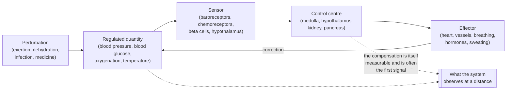
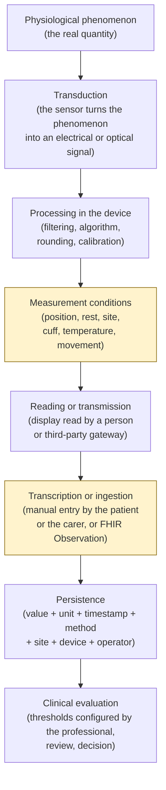

# The body, the parameters, clinical reasoning

:::warning Binding notice — the nature of this module

**This module is technical training for developers. It is not clinical material and it is not a
guide to medical practice.**

It does not teach how to assess a patient, it does not teach how to recognise a disease, it
contains no clinical recommendations and it cannot be used to take decisions about a real
person. It teaches the minimum of clinical theory needed **not to get the data model, the units
of measurement, the temporal aggregation and the semantics of the alerts wrong** in a system
that carries physiological measurements.

All the numerical values cited are **indicative and didactic**. They vary by source, population,
age, sex, altitude, comorbidity, current therapy and method of measurement. **The project does
not hard-wire clinical thresholds into the code**: every threshold is clinical configuration
under the responsibility of the professional, as the perimeter adopted for remote monitoring
(telemonitoraggio) requires (see [02 — Telemedicine
services](02-prestazioni-di-telemedicina.md), § 4.5.5). A number appearing in this text is a
didactic example, never a product default.

:::

This is the module that anyone coming from computing is most tempted to skip. It is also the one
that pays back the most, because the class of defects it prevents is not visible in tests: they
are defects that produce plausible and wrong numbers.

The module presupposes [02 — Telemedicine services](02-prestazioni-di-telemedicina.md), because
it uses the vocabulary of the services without redefining it, and it is read before
[10 — Care pathways and patient safety](10-percorsi-di-cura-e-sicurezza.md), which deals with
scores, triage and clinical risk. The technical representation of measurements in FHIR is in
module [06 — FHIR from scratch](06-fhir-da-zero.md); here we explain **what** is being
represented, not how.

---

## 1. Why a developer must know these things

Not for general culture. Because without these notions one writes defects of a particular
category: the code compiles, the tests pass, the interface shows a number, and the number is
clinically false. No *linter* catches them. Six real defects follow, each with the clinical
notion that would have avoided it.

### 1.1 Defect: saturation treated as a pure number

A dashboard shows peripheral oxygen saturation as a percentage, with a progress bar coloured
from 0 to 100 and a linear scale. It seems reasonable: it is a percentage.

It is not. The saturation of haemoglobin is not linear with respect to the quantity of oxygen
dissolved in the blood: the relationship between the two quantities is described by a sigmoid
curve (§ 2.3.3). In the upper part of the curve enormous variations in oxygen are needed to move
the saturation by one point; in the lower part a single point of saturation corresponds to a
substantial collapse. Three consequences for the interface and for the model follow:

- **the part of the scale below a certain threshold is never a "low" value: it is a value
  different in nature.** A linear bar that colours gradually communicates a false
  proportionality;
- **the difference between two nearby measurements does not have the same meaning depending on
  where it falls.** A variation of two points in the upper zone and the same variation in the
  lower zone are not comparable, and therefore they cannot be summed or averaged as though they
  were;
- **the instrument's declared precision is of the same order of magnitude as the variations of
  interest.** A display that shows decimals for a quantity whose typical error is several
  percentage points invents information that does not exist.

### 1.2 Defect: the unit of measurement badly converted

Blood glucose is expressed in two units in current use: milligrams per decilitre and millimoles
per litre. The conversion factor is about 18 (§ 3.6.3). A value of 5.5 in one unit and a value of
5.5 in the other describe two incompatible clinical situations.

The typical defect is not the wrong conversion: it is **the absent conversion**. A numeric field
without a unit, fed by two sources that use different conventions — a home device and a
laboratory report — produces a time series in which the values are mixed. No domain check
notices, because both values are positive, finite numbers.

The same applies to temperature (degrees Celsius or Fahrenheit), to weight (kilograms or
pounds), to height, to glycated haemoglobin (a percentage according to one convention,
millimoles per mole according to another: § 3.6.6). The rule is one and admits no exceptions:
**no physiological value exists in the system without its unit, and the unit is coded, not a free
string.** The reference standard for coding units is UCUM, placed by the project in regime B of
the terminology policy.

### 1.3 Defect: the arithmetic mean on a series that does not admit means

A monthly summary shows «mean blood pressure for the month: 128/79». The patient measured three
times in the morning for twenty days and once in the evening for two days. The mean is
arithmetically correct and clinically meaningless, for three distinct reasons:

1. **the sampling is not uniform**: the morning measurements are twenty times more numerous than
   the evening ones, so the "monthly mean" is in reality the morning mean;
2. **the quantity has a circadian rhythm** (§ 4.2): averaging values taken at different moments
   of the day cancels out precisely the information that was being sought;
3. **closely spaced measurements are not independent**: three measurements a minute apart are not
   three observations, they are one repeated observation. Counting them three times weights that
   moment arbitrarily.

A frequent aggravating factor: the mean hides the extremes, and it is at the extremes that the
clinical information lies. Two patients with the same mean may have opposite trajectories — one
stable, one with wide swings — and the variability is itself a datum.

### 1.4 Defect: the alert on an isolated value

A remote monitoring plan configures a threshold. The patient measures, the value exceeds it, the
system generates an alert. It is the behaviour almost everyone implements first, and it is the
one that makes the service unusable within a fortnight.

An isolated out-of-range value, in almost all physiological quantities, is more probably a
**measurement error** than a clinical event: badly positioned cuff, cold finger, patient who has
just been walking, scales on a rug, badly adhering sensor. The proportion between true and false
positives depends on the prevalence of the event in the monitored population, and it is precisely
the calculation of § 5.5 — the one that computing people get wrong most often.

The practical effect of a system that alerts on an isolated value is not an excess of safety: it
is **alarm desensitisation**, that is, the progressive loss of attention of whoever receives
signals that are mostly false. It is a risk in the proper sense of ISO 14971, and it must be
treated as such in module [10](10-percorsi-di-cura-e-sicurezza.md). The project does not decide
the rule — persistence, number of consecutive measurements, time window, obligation to confirm —
because the rule is clinical configuration; it must, however, **make it possible to express**
rules that are not instantaneous thresholds, otherwise the professional has no alternative.

### 1.5 Defect: the reference range applied to the wrong population

A reference range is not a property of the quantity: it is a property **of the quantity in a
population, measured with a method, in a context**. Applying it outside that context produces
systematically wrong classifications.

- The "normal" heart rate of a newborn is far above that of an adult. A system that applies the
  adult range to an infant flags as pathological what is physiological.
- Respiratory rate follows the same logic, with an even more marked dependence on age.
- The saturation considered acceptable in a person with advanced chronic obstructive pulmonary
  disease is lower than that of a healthy person, and correcting it aggressively can be harmful.
  A single range for everyone would generate continuous alerts across an entire population.
- The reference values for blood pressure in pregnancy, those in dialysis, those in a patient on
  therapy that slows the heart rate all have logics of their own.
- The expected saturation changes with **altitude**: at a thousand metres of altitude the partial
  pressure of oxygen in the air is lower and the resting saturation of a healthy person is lower
  than at sea level.

Modelling consequence: **the reference range is a datum belonging to the measurement, not a
global constant**. It must be carried with the measurement, with its source, or it must not be
carried at all. It is the same discipline that § 8.3 describes for the laboratory.

### 1.6 Defect: the value without its measurement context

The number «140» as a systolic blood pressure is not a clinical datum. It becomes a clinical
datum when it carries with it: which arm, in which position, after how many minutes of rest, with
which monitor, with which cuff, at what time of day, before or after taking the therapy, at the
first or the third measurement of the sequence.

This is not documentary pedantry: each of these elements shifts the value by an amount comparable
to or greater than the difference between "normal" and "to be treated". A data model that
represents the measurement as a pair (timestamp, value) has already lost, and recovery after the
fact is impossible because those metadata cannot be reconstructed.

### 1.7 What this module does not do

It does not teach how to make a diagnosis, it does not supply applicable clinical criteria, it
does not replace healthcare training and it does not qualify anyone to assess a patient. It
serves to make the developer capable of:

- recognising when an apparently neutral implementation choice destroys clinical information;
- putting the right question to the clinician instead of deducing the rule for themselves;
- reading a functional requirement of the catalogue and understanding why it is worded as it is;
- never inventing a threshold, a conversion or an aggregation.

The last point is the operational rule that sums up the whole module: **in this project clinical
knowledge serves to know what one cannot decide alone.**

---

## 2. Essential anatomy and physiology

This section covers only what the project measures, represents or risks representing badly. It
is not a compendium: it is the quantity of physiology that makes the parameters of § 3 and the
pitfalls of § 4 comprehensible.

### 2.1 The principle that holds it all together: homeostasis and compensation

The human body keeps certain quantities constant — core temperature, blood glucose
concentration, pH, fluid volume, organ perfusion pressure — within narrow ranges, despite
external conditions changing continually. This active maintenance is called **homeostasis**.

The mechanism is almost always a **negative feedback**: a sensor detects the deviation from a
target value, a control centre compares it with that value, an effector acts to reduce it. It is
the same scheme as a controller in a control system, with three differences that matter for
anyone writing clinical software.

**First difference: the measured quantity may be normal precisely because the compensation is
working.** A patient who is losing blood keeps arterial blood pressure almost unchanged for a
long time, by increasing heart rate and vascular resistance. The blood pressure is "normal" and
the situation is serious. When the blood pressure finally falls, the compensation has given way.
From this follows a rule of reading that holds for the whole module: **a normal parameter is not
proof of the absence of a problem, and the most informative value is often that of the
compensation, not that of the regulated quantity.**

**Second difference: the compensations have different time constants from one another.** The
nervous response acts in seconds, the hormonal one in minutes or hours, the renal one in hours or
days. This means that a time series of vital signs contains superimposed phenomena with time
scales that differ by orders of magnitude, and that an aggregation window chosen without knowing
this cancels one or the other.

**Third difference: the target value is neither universal nor fixed.** It changes with age, with
chronic disease, with therapy, with adaptation (for example to altitude or to training). It is
the physiological reason for the defect of § 1.5.

Two terms that recur and that must be fixed at once:

- **compensation**: the set of responses that keep the quantity within the useful range despite
  the perturbation;
- **decompensation**: the condition in which the compensation mechanisms are no longer enough and
  the quantity leaves the range. It is not a synonym for "disease": it is the phase in which the
  disease becomes visible in the parameters.

### 2.2 The cardiovascular system

#### 2.2.1 What it does

It transports oxygen, carbon dioxide, nutrients, hormones, heat and cells of the immune system.
It is a pump (the heart) connected to a network of variable-calibre conduits (the vessels) filled
with a fluid (the blood).

The heart has four chambers: two **atria** (which receive) and two **ventricles** (which eject).
The circuit is double and in series:

- **pulmonary circulation** — the right ventricle pushes oxygen-poor blood into the lungs, where
  it takes up oxygen and gives up carbon dioxide;
- **systemic circulation** — the left ventricle pushes oxygen-rich blood to all the organs.

The fact that the two circulations are in series has a constant practical consequence: **a
problem downstream has repercussions upstream**. If the left ventricle cannot eject enough, the
blood backs up upstream, that is, in the lungs, and breathing difficulty results. If the right
ventricle cannot manage, the congestion is in the systemic veins, and swelling of the legs and
weight gain from fluid retention result. It is why **body weight is a cardiological parameter**,
which surprises anyone who regards it as an anthropometric datum (§ 3.7).

#### 2.2.2 The quantities and how they are linked

The quantity that really matters for the organs is not measurable at a distance: it is
**perfusion**, that is, how much blood actually reaches the tissues. What is measured are
correlated quantities.

- **Stroke volume** — volume ejected by the ventricle at each beat.
- **Cardiac output** — volume ejected per minute. It is the product of stroke volume and heart
  rate. Hence a relationship that explains many trajectories observed in remote monitoring: **if
  stroke volume falls, the rate rises in order to maintain the output.** Tachycardia is often a
  compensation, not a disease in itself.
- **Peripheral resistance** — the vessels' opposition to flow, regulated by the calibre of the
  arterioles.
- **Arterial blood pressure** — approximately the product of cardiac output and peripheral
  resistance. It is the identity to keep in mind because it dismantles the idea that blood
  pressure measures the strength of the heart: a normal blood pressure is compatible with a low
  output and high resistance, that is, with a situation worse than a slightly lower pressure with
  dilated vessels.

The heart contracts following an electrical impulse that arises in a group of cells of the right
atrium (**sinoatrial node**), propagates to the atria, passes through a delayer
(**atrioventricular node**) and reaches the ventricles. This electrical activity is what an
electrocardiogram records; the mechanical contraction that follows from it is what generates the
pulse. **Electrical and mechanical do not always coincide**: there are conditions in which an
electrical impulse does not produce an effective contraction, and therefore a beat counted by the
electrocardiogram does not correspond to a pulse perceptible at the periphery (§ 3.2.4).

#### 2.2.3 What happens when it decompensates

**Heart failure** — cardiac decompensation — is the condition in which the heart cannot guarantee
an output adequate to the organism's demands, or manages it only at the price of high filling
pressures. It is one of the chronic conditions most represented in remote monitoring programmes,
for a precise reason: **the deterioration is preceded by days of fluid retention**, and the
retention is measurable with a set of scales before the patient notices that they are getting
worse. In the project's vocabulary it is the canonical example of a parameter that counts for its
**trend**, not for its absolute value (§ 4.1).

The other cardiovascular conditions relevant to the perimeter:

- **arterial hypertension** — stably elevated blood pressure; the damage is to the organs and is
  silent for years, so the single value counts for little and the series counts for a lot;
- **atrial fibrillation** — chaotic atrial electrical activity; it produces an irregular pulse and
  **degrades the reliability of automatic blood pressure monitors** (§ 3.1.5);
- **ischaemic heart disease** — insufficient blood supply to the heart muscle itself.

### 2.3 The respiratory system

#### 2.3.1 What it does

It ensures two opposite exchanges: it lets oxygen into the blood and lets carbon dioxide out.
These are two distinct functions, and distinguishing them is essential because **a pulse oximeter
measures only the first**.

Air enters through the airways as far as the **alveoli**, tiny sacs surrounded by capillaries.
There the diffusion of gases takes place across an extremely thin membrane. The movement of the
air is produced by the diaphragm and by the intercostal muscles.

#### 2.3.2 The quantities

- **Respiratory rate** — breaths per minute.
- **Tidal volume** — air moved with each breath.
- **Minute ventilation** — the product of the two. Here too the compensation relationship holds:
  someone with reduced volumes increases the rate.
- **Partial pressure of oxygen in arterial blood** — quantity of dissolved oxygen, measurable
  only with an arterial sample, not at a distance.
- **Oxygen saturation of haemoglobin** — percentage of haemoglobin binding sites occupied by
  oxygen. It is the quantity that the pulse oximeter estimates (§ 3.3).
- **Partial pressure of carbon dioxide** — an index of how far ventilation is eliminating carbon
  dioxide. **It cannot be estimated with a pulse oximeter.**

#### 2.3.3 The dissociation curve, and why it changes the way one designs an interface

The relationship between oxygen dissolved in the blood and haemoglobin saturation is not
proportional: it has an S shape. In the upper part the curve is almost flat, in the central part
it is steep.

The operational consequences are three, and they are the reason for the defect of § 1.1:

1. **in the upper zone saturation is insensitive**: a real deterioration of respiratory gas
   exchange may not move it at all. A "good" saturation does not rule out a respiratory problem
   in progress;
2. **in the steep zone small variations in saturation correspond to large variations in oxygen**:
   here the same numerical difference has a completely different clinical weight;
3. **the curve shifts** with temperature, pH, carbon dioxide and other factors: the relationship
   between saturation and oxygen is not even stable within the same patient.

From this follows the representation rule adopted by the project: **saturation is not represented
with a continuous linear scale from 0 to 100 and is not averaged like any other percentage.** If
an aggregation is necessary, the minimum observed and the time spent below a configured level are
more defensible quantities than the mean.

A second, counter-intuitive point: **oxygen and carbon dioxide can diverge.** A person may have an
acceptable saturation and at the same time insufficient ventilation that is accumulating carbon
dioxide. A system that shows only the saturation shows half the problem, and must be designed in
the knowledge of that.

#### 2.3.4 What happens when it decompensates

- **Respiratory failure** — inability to maintain adequate gas exchange. It may concern only
  oxygenation or also the elimination of carbon dioxide.
- **Chronic obstructive pulmonary disease** — chronic obstruction to airflow, typically with
  exacerbations. It is the population in which the reference range for saturation must be
  personalised (§ 1.5).
- **Asthma** — reversible and variable obstruction.
- **Pneumonia, pulmonary oedema, pulmonary embolism** — acute conditions with partly overlapping
  presentations, which is precisely the theme of differential diagnosis (§ 5.2).

### 2.4 The nervous system

#### 2.4.1 What it does

It collects information, processes it and produces responses. It is divided into the **central
nervous system** (brain and spinal cord) and the **peripheral** one (nerves). From a functional
point of view, the part that directly concerns the project is the **autonomic nervous system**:
the portion that regulates involuntary functions.

It has two components with largely opposite effects:

- **sympathetic** — prepares for action: it increases heart rate and force of contraction,
  constricts some vessels, dilates the airways, increases sweating, mobilises glucose;
- **parasympathetic** — prevails at rest: it slows the heart rate, favours digestion and
  recovery.

**This is the physiological reason why almost every vital sign is influenced by the patient's
emotional state and recent activity.** A measurement taken immediately after climbing the stairs
into the house, after an argument or during the anxiety of waiting for a remote consultation is
not the same measurement taken at rest. It is not a defect of the patient: it is physiology, and
it must be absorbed by the measurement procedure, not corrected after the fact by the software.

#### 2.4.2 The quantities represented by the project

The system does not measure nervous function in the strict sense, but it represents two families
of data that concern it:

- the **level of consciousness**, assessed with scales, and more generally the clinical scores
  dealt with in module [10](10-percorsi-di-cura-e-sicurezza.md);
- **pain**, which is by definition a datum reported by the patient (§ 5.1) and is represented with
  self-assessment scales.

This must be said explicitly because it is a recurrent source of modelling errors: **a pain scale
from 0 to 10 is not a physical measurement.** It is a subjective ordering. It does not admit
averages across patients, its intervals are not equal to one another, and comparing one person's
6 with another's 6 has no meaning. Comparing today's 6 with yesterday's 4 **in the same person**,
on the other hand, does.

#### 2.4.3 What happens when it decompensates

Stroke, epileptic seizures, confusional states, cognitive decline. Relevant to the project chiefly
for two indirect reasons: **cognitive decline** affects the patient's ability to use digital tools
and to perform a measurement correctly — it is the clinical reason behind the requirement to
verify the patient's ability to interact with digital systems — and **disturbances of attention
or of alertness** make self-completion of questionnaires unreliable.

### 2.5 The endocrine system

#### 2.5.1 What it does

It regulates slow, diffuse functions by means of **hormones**, chemical messengers released into
the blood by glands and active on distant organs. Compared with the nervous system it acts with
longer time constants and with more lasting effects.

#### 2.5.2 The regulation of glucose, which is what the project measures

Glucose in the blood is the cells' immediate source of energy and its concentration is kept within
a narrow range by two hormones produced by the pancreas with opposite effects:

- **insulin** — lowers blood glucose by making glucose enter the cells and favouring its storage.
  It is released when blood glucose rises, typically after a meal;
- **glucagon** — raises blood glucose by mobilising the reserves, when blood glucose falls.

**Diabetes mellitus** is the condition in which this regulation fails. The two main forms have
different mechanisms — absence of insulin production in one case, reduced effectiveness of the
insulin produced in the other — and this radically changes the structure of the data collected: in
the first case several measurements a day are needed, correlated with meals and with insulin
doses, whereas in the second the monitoring can be far less dense.

Two notions indispensable if the data model is not to be got wrong:

- **blood glucose depends decisively on the temporal relationship with the meal.** A "fasting"
  value and a "two hours after the meal" value are not the same parameter with different
  timestamps: they are **two different parameters**, with different reference ranges and different
  codes. Confusing them is one of the commonest and most insidious errors, because both are
  plausible numbers;
- **hypoglycaemia is as dangerous as hyperglycaemia and more so, but on a much shorter time
  scale.** A blood glucose that is too low can become an emergency in minutes, whereas the damage
  of chronic hyperglycaemia is measured in years. From this it follows that a system that treats
  blood glucose with a single symmetric threshold logic has already got the asymmetry of the risk
  wrong.

#### 2.5.3 Other hormonal axes that appear in the data

- **thyroid** — regulates basal metabolism; it influences heart rate, temperature, weight. A
  thyroid dysfunction may explain alterations of apparently cardiological parameters;
- **adrenal gland** — produces cortisol, which has a marked circadian rhythm and is one of the
  physiological causes of the daily variations in blood pressure and blood glucose (§ 4.2);
- **pituitary gland** — coordinates the other axes.

### 2.6 The renal system

#### 2.6.1 What it does

The kidneys filter the blood and produce urine, but reducing them to a filter is misleading. They
regulate:

- the **volume of the body's fluids**, and therefore indirectly arterial blood pressure;
- the **concentration of the electrolytes** (sodium, potassium and others), whose imbalance has
  direct effects on the heart;
- the **acid–base balance**;
- the **elimination of waste products** and of many medicines;
- the production of hormones that regulate blood pressure and the formation of red blood cells.

The point that connects the kidney to everything else: **the kidney is at once the cause and the
victim of arterial blood pressure.** High blood pressure damages the kidney; a damaged kidney
raises blood pressure. It is a positive feedback loop, that is, one that feeds itself, and it is
why many care pathways treat heart and kidney together.

#### 2.6.2 The quantities

Renal function is not measured at a distance. It is estimated from laboratory tests, chiefly from
the concentration of certain waste substances in the blood and from a filtration index calculated
with formulae that depend on age, sex and other variables. What the project handles is therefore
the **report**, not the measurement (§ 8).

Two relevant quantities are, however, observable at home: **weight** (rapid variations reflect
fluids, not mass: § 3.7.4) and **arterial blood pressure**.

#### 2.6.3 What happens when it decompensates

**Renal failure** may be acute or chronic. In the patient on **dialysis** concepts appear that a
naive data model does not provide for: the **dry weight**, that is, the target weight after the
removal of excess fluid, against which the deviation is assessed; the fact that the weight must be
read in relation to the dialysis session (before or after); the fact that blood pressure must be
measured on a particular arm, because on the other there may be a vascular access that forbids its
compression. These are typical examples of **rules that the software cannot deduce and must be
able to receive by configuration**.

### 2.7 How they interweave: an integrated example

It is worth going through a didactic case, because it shows how the parameters of different
systems move together and why the isolated value says little.

A person with chronic heart failure accumulates fluid over the course of a few days. The typical
sequence of signals observable at a distance is:

1. the **weight** rises gradually: it is the first signal, and it is measurable before the person
   perceives anything;
2. **swelling** of the ankles appears or worsens: a visible sign, but subjectively appraised
   through a screen (§ 6.2);
3. the **heart rate** increases as compensation for the reduced stroke volume;
4. the **respiratory rate** increases because of congestion in the lungs; the patient reports
   breathlessness first on exertion, then lying down;
5. the **saturation** falls — and it is late, because the curve of § 2.3.3 keeps it high as long
   as it can;
6. the **blood pressure** may rise, stay stable or fall depending on the phase and on the therapy:
   it is not an unambiguous indicator.

Three lessons for whoever designs:

- **the order of the signals counts for more than the values.** A system that treats the
  parameters as independent streams loses the correlation, which is the clinical datum;
- **the earliest parameter is the most banal one.** Weight, measured with bathroom scales, has
  more predictive value in this condition than saturation measured with a more sophisticated
  device;
- **saturation arrives late.** Building the service around the most «technologically interesting»
  parameter is an error of priority.

---

## 3. The vital signs, one by one

### 3.0 How to read the entries

Each parameter is described with the same grid, because it is exactly these dimensions that
determine the data model:

- **what it physically measures** — the real quantity, not the sensor's trade name;
- **how it is measured** — the method, because different methods produce non-interchangeable
  values;
- **unit of measurement** — with the UCUM code, which is the form in which the unit enters the
  system;
- **reference ranges and their dependence on context** — always indicative, never hard-wired;
- **sources of error** — the list of reasons why a value may be wrong while still being
  plausible;
- **what makes a value clinically significant**;
- **why the single value is almost never enough**.

Before the entries, the chain that leads from a physical phenomenon to a record in the database.
Every link introduces error, and every link must be represented if one wants to be able to explain
a value after the fact.

The two highlighted links are those the project does not control and that introduce most of the
error: **the measurement conditions** and **the transcription**. The perimeter adopted —
ingestion from third-party gateways, manual entry, questionnaires — implies that the project
**does not answer for the accuracy of the hardware chain**, but it must make what happened
reconstructible: who entered the value, with which declared device, under which declared
conditions.

### 3.1 Arterial blood pressure

#### 3.1.1 What it physically measures

The force exerted by the blood on the wall of the arteries. It is not a single number: during each
cardiac cycle the pressure oscillates between a maximum and a minimum, and from these two values
two others are derived.

- **Systolic pressure** — the maximum value, reached during the contraction of the left ventricle
  (*systole*).
- **Diastolic pressure** — the minimum value, during relaxation (*diastole*).
- **Pulse pressure** — the difference between systolic and diastolic. It largely reflects the
  stiffness of the large arteries and the volume ejected at each beat. It is a **derived** value,
  not a measured one.
- **Mean arterial pressure** — the average value over time across a cardiac cycle, which is the
  quantity physically closest to the organ perfusion pressure. Since the cycle is not symmetric
  (diastole lasts longer than systole), it is not the arithmetic mean of the two values: it is
  approximated with formulae of the type *diastolic plus one third of the pulse pressure*. The
  detail is relevant for software because **it is a formula, not a measurement**, and the formula
  used must be declared.

#### 3.1.2 How it is measured

Two non-invasive methods, which do not give the same numbers.

- **Auscultatory** — an inflated cuff compresses the artery of the arm; while deflating slowly, an
  operator listens with a stethoscope for the appearance and disappearance of characteristic
  sounds and reads the two values on a manometer. It is the historical reference method and **it
  requires a trained operator**: it cannot be performed by the patient alone, and it cannot be
  performed through a screen.
- **Oscillometric** — an automatic cuff detects the pressure oscillations transmitted by the
  vessel and **computes** the values with a proprietary algorithm. It is the method of almost all
  home monitors. Essential point: the oscillometric device **directly measures a quantity close to
  the mean pressure and derives systolic and diastolic by estimation**. It follows that the
  results depend on the algorithm of the individual model and that two different devices on the
  same arm may differ.

There are furthermore **twenty-four-hour ambulatory measurement**, with a device that measures
automatically at programmed intervals including at night, and **home self-measurement** according
to defined schemes. Both produce **series**, not values: it is the form in which blood pressure
really has clinical meaning.

#### 3.1.3 Units

Millimetres of mercury. UCUM code: `mm[Hg]`. The square brackets are not a typo: they are part of
UCUM syntax for non-metric units. A system that writes `mmHg` as a free string is not
interoperable.

**Blood pressure is not a number: it is a structure.** In FHIR it is represented as an
`Observation` with distinct components for systolic and diastolic, not as the string «120/80». A
string is not comparable, is not aggregable and has no unit.

#### 3.1.4 Reference ranges and dependence on context

The reference values commonly cited for the healthy adult sit around 120/80 mm[Hg] `[NV]`, but
this figure is didactic and cannot be used as a rule. The reasons why it cannot:

- the diagnostic thresholds for hypertension **differ according to the guideline** adopted and
  have been revised several times, in different directions, by different scientific societies;
- **the threshold depends on the method**: the reference values for measurement in the clinic, for
  self-measurement at home and for twenty-four-hour monitoring are **different from one another**,
  and lower for the home and ambulatory methods. Comparing a home value with a clinic threshold is
  a methodological error, not an approximation;
- the therapeutic target is **individual**: it depends on age, organ damage, diabetes, kidney
  disease, pregnancy, tolerance of the medicines;
- in paediatric age the references are expressed in **percentiles for age, sex and height**, not
  in absolute values. A system that applies adult thresholds to a child produces meaningless
  classifications.

> **Project rule.** None of these thresholds appears in the code. The monitoring plan carries its
> own configuration, defined by the professional, with its own declared source and its own context
> of applicability.

#### 3.1.5 Sources of error

This list is deliberately long, because each item shifts the value by an amount comparable to the
difference between the clinical categories.

- **Cuff of the wrong size.** A cuff too small for the arm's circumference overestimates; one too
  large underestimates. It is the single commonest error in self-measurement, and it is invisible
  in the datum.
- **Position of the arm.** The arm must be supported at heart height. Lower down it overestimates,
  higher up it underestimates, because of the hydrostatic column.
- **Posture.** Seated, with the back supported, feet on the floor and not crossed. Crossed legs, an
  unsupported back and a full bladder alter the value.
- **Insufficient rest.** Several minutes of rest are needed before the measurement. A measurement
  taken immediately after physical activity, after speaking or during a conversation is
  systematically higher.
- **Speaking during the measurement.** It raises the value.
- **Smoking, caffeine, a recent meal.**
- **White coat effect** — higher blood pressure in the presence of healthcare staff than at home.
  It has a counterpart in telemedicine that has not been the subject of reliable quantification:
  the effect of being observed through a video camera during the measurement. `[NV]`
- **Masked hypertension** — the opposite phenomenon: normal values in the clinic and elevated ones
  at home. It is the main reason why self-measurement has autonomous value and is not a fallback.
- **Difference between the two arms.** It may be physiological within a certain margin and
  pathological beyond it. Operational consequence: **the arm used is a datum**, and measurements on
  different arms are not
  to be placed in the same series without qualifying them.
- **Arrhythmia.** In the presence of an irregular beat — typically atrial fibrillation —
  oscillometric devices lose reliability, because the algorithm assumes a certain regularity of
  the signal. Many devices flag the irregularity: **that flag is a datum to be retained**, not a
  message to be shown and discarded.
- **The first measurement higher than the following ones.** It is why self-measurement protocols
  ask for several consecutive measurements with an interval and prescribe how to combine them. The
  rule for combining them **belongs to the clinical protocol**, not to the software.
- **Transcription.** The patient reads the display and types. Transposed digits, systolic and
  diastolic swapped, confusion with the heart rate value shown on the same display.

#### 3.1.6 What makes a value significant, and why one alone is not enough

Blood pressure is the physiological quantity with the **highest intrinsic variability among those
dealt with here**: it varies from beat to beat, over the course of the day, with the season, with
emotional state. From this follows a principle that the data model must incorporate: **the
diagnosis and control of hypertension are founded on series of measurements taken under
standardised conditions, not on isolated values.**

The really informative quantities are therefore second-order: the mean of a self-measurement cycle
conducted according to a defined protocol, the variability, the difference between morning and
evening, the night-time behaviour, the proportion of measurements within the individual target.
All of them require the moment and the conditions of the measurement to be first-class data.

There is only one exception to the rule «an isolated value is not enough»: **extreme** values, in
which the magnitude of the deviation makes measurement error improbable and the situation demands
immediate attention irrespective of the series. What that threshold is, is a clinical decision,
configured in the plan, and the project confines itself to making it possible to express the
distinction between a trend rule and an extreme-value rule.

### 3.2 Heart rate

#### 3.2.1 What it physically measures

The number of cardiac cycles per unit of time. Note a distinction that everyday language erases:

- **heart rate** — electrical or mechanical beats of the heart per minute;
- **pulse rate** — pulsations perceptible at the periphery per minute.

They coincide in most cases, but **not always**: if some contractions are too weak to generate a
perceptible pulse wave, the pulse is slower than the heart rate. This difference is called the
**pulse deficit** and is typically observed in atrial fibrillation. Since almost all home devices
measure the **pulse**, the datum that reaches the system is the pulse rate even when the label
says «heart rate».

#### 3.2.2 How it is measured

- **Manual palpation** — counting on a peripheral artery for a defined time. Simple, and the only
  method that allows **the regularity and the amplitude** to be appreciated as well as the rate.
- **Pulse oximetry** — almost all pulse oximeters also return the pulse rate, derived from the
  pulsatile component of the optical signal.
- **Automatic blood pressure monitor** — returns the rate detected during the measurement.
- **Electrocardiogram** — measures the electrical activity; it is the only method that describes
  the **rhythm** and not just the rate.
- **Wearable sensors** — photoplethysmography at the wrist or the finger. Accuracy strongly
  dependent on movement, on adhesion and on perfusion.

**Different methods do not produce the same datum**, and the difference is not only one of
accuracy: it is one of meaning. A value from an electrocardiogram and a value from wrist
photoplethysmography during movement do not belong to the same series.

#### 3.2.3 Units

Beats per minute. UCUM code: `/min`. The textual form «bpm» is a display label, not a coded unit.

#### 3.2.4 Reference ranges and context

For the adult at rest a range of around 60–100 beats per minute is commonly cited `[NV]`. The
dependencies on context are stronger than in almost any other parameter:

- **age** changes everything: the newborn has far higher rates, and the paediatric references fall
  progressively with growth;
- **training**: in a highly trained person a resting rate below the lower limit of the average
  adult's range is expected, not pathological;
- **therapy**: some classes of cardiological medicines deliberately reduce the rate. In a patient
  on therapy the expected value is lower, and — a less obvious point — **the compensatory increase
  in the event of deterioration is attenuated**, so the signal one would expect may not appear;
- **fever** increases the rate;
- **emotional state and recent activity** (§ 2.4.1);
- **an implanted device**: in the presence of a cardiac pacemaker the rate may be determined by
  the device and not by the heart.

#### 3.2.5 Sources of error

- **Movement** during the measurement, particularly with optical sensors.
- **Poor peripheral perfusion** — cold hands, vasoconstriction: the optical signal degrades and
  the algorithm may lock onto artefacts.
- **Arrhythmias** — an irregular beat makes the very concept of "rate" ambiguous over a short
  window.
- **Counting over a short time and multiplying** — counting for fifteen seconds and multiplying by
  four amplifies the counting error fourfold and is particularly unsuitable in the presence of
  irregularity.
- **Double counting or halving** — some algorithms may lock onto the wrong harmonic of the signal,
  returning double or half the real value. These are plausible values: no range check catches
  them.

#### 3.2.6 Why the single value is not enough

Because heart rate is, among the parameters considered, the most **reactive**: it responds in
seconds to trivial stimuli. Its meaning lies in the relationship with the patient's state at that
moment (at rest? after exertion? feverish?) and in the **trend**: a stable increase in resting
rate over the course of days is information, a high measurement immediately after climbing the
stairs is not.

It should also be noted that the **regularity** of the beat is, in many situations, more
informative than the rate, and that almost no home device transmits it in structured form. If the
device exposes an irregular-beat indicator, **that indicator is a clinical datum to be
persisted**, with the same standing as the number.

### 3.3 Peripheral oxygen saturation

#### 3.3.1 What it physically measures

The percentage of **haemoglobin binding sites occupied by oxygen**, estimated non-invasively
through a peripheral tissue. Three clarifications that change the way code is written:

- **it does not measure how much oxygen there is in the blood in absolute terms.** A person with
  little haemoglobin may have a perfect saturation and insufficient oxygen transport;
- **it does not measure breathing.** It says nothing about the elimination of carbon dioxide
  (§ 2.3.3);
- **it is an estimate**, not a direct measurement. The reference quantity is the saturation
  measured on arterial blood in the laboratory; the peripheral value is an approximation of it,
  with an error that manufacturers declare and that is of the order of a few percentage points.
  `[NV]` on the exact numerical value, which depends on the device and on the context.

The method rests on the fact that haemoglobin bound to oxygen and unbound haemoglobin absorb red
and infrared light differently; the device illuminates the tissue, measures the absorption and
isolates the **pulsatile component** of the signal, which it assumes comes from arterial blood.
All the sources of error of § 3.3.4 derive from the violation of one of these assumptions.

#### 3.3.2 How it is measured

A pulse oximeter applied to the finger, to the earlobe or, in newborns, to the foot. They are the
most widespread home devices after the blood pressure monitor, and their accuracy varies
enormously between products certified as medical devices and consumer products.

#### 3.3.3 Units

Percentage. UCUM code: `%`. **Not to be represented as a fraction between 0 and 1**: the clinical
convention is 0–100 and an inversion of convention is a defect that passes the tests and does not
pass clinical review.

The **code** of the quantity must also be distinguished: there is a difference between saturation
measured on arterial blood and saturation estimated with pulse oximetry, and the two have
different codes. Using the wrong code means declaring that an arterial sample was taken when it
was not.

#### 3.3.4 Sources of error

- **Poor peripheral perfusion** — cold, vasoconstriction, hypotension. The pulsatile signal is
  reduced and the estimate degrades. Many devices expose a **perfusion index**: it is an indicator
  of data quality and, where available, it must be retained.
- **Movement** — it generates spurious pulsatile components.
- **Nail varnish, artificial nails, dirt** — they alter the optical absorption.
- **Intense ambient light** reaching the sensor.
- **Abnormal haemoglobins.** In the presence of carbon monoxide, haemoglobin bound to the monoxide
  absorbs light in a way similar to oxygenated haemoglobin: **the oximeter may read a high
  saturation while oxygen transport is severely compromised.** It is the case in which a
  reassuring value is the manifestation of the problem.
- **Skin pigmentation.** The scientific literature has documented systematic differences in the
  accuracy of oximetry in relation to skin colour, with a tendency to overestimate saturation in
  people with darker pigmentation. The project records the fact without quantifying it: `[NV]` on
  the magnitude, which depends on device and population. The design consequence is, however,
  independent of the quantification — **it is a source of systemic inequity that must be declared
  in the documentation intended for the professional and taken into account in risk management**,
  not a technical detail.
- **Measurement site** — finger, ear and foot have different response times and reliability.
- **Supplemental oxygen in progress.** A saturation must be read **together with the information
  on whether the patient is receiving oxygen and at what flow rate**. The same figure with and
  without oxygen describes two very different situations. This is a textbook case of **a datum
  that has no meaning without its qualifier**: the data model must provide for it, not add it
  later.

#### 3.3.5 Why the single value is not enough

Because of the shape of the curve (§ 2.3.3), which makes the parameter insensitive as long as the
compensation holds and then rapidly informative; because of the variability of the measurement;
and because the clinically relevant quantity is often **the saturation during a defined exertion**
or **the persistence below a level over time**, not the value at rest. The defensible aggregations
are the minimum observed in a window and the time spent below a configured level; the mean is
almost always meaningless.

### 3.4 Respiratory rate

#### 3.4.1 What it physically measures

The number of complete breaths (one inspiration plus one expiration) per minute.

#### 3.4.2 How it is measured

Observation and counting of the movements of the chest over an interval of time — ideally a whole
minute — **preferably without the patient knowing they are being observed**, because breathing is
under partial voluntary control and awareness alters it. It is the only parameter in this section
whose correct measurement requires the subject **not to cooperate** consciously.

From this follows a notable consequence for telemedicine: asking the patient «count your breaths»
produces a systematically distorted value. Counting by a carer or by the professional while
observing on video is more defensible, but it requires adequate framing and lighting and a
duration of observation that the video call rarely allows (§ 6.5).

There are devices that derive it from other signals, but the project does not talk directly to the
devices and receives the value already computed: **the method declared by the gateway is therefore
an indispensable datum**.

#### 3.4.3 Units

Breaths per minute. UCUM code: `/min` — the same unit as heart rate, which makes **the code of the
quantity the only discriminator**. A model that relies on the unit to distinguish the two
parameters conflates two completely different series.

#### 3.4.4 Ranges and context

For the adult at rest a range of around 12–20 breaths per minute is cited `[NV]`. The dependence
on age is even more marked than for heart rate: the paediatric values are distinctly higher and
fall with age. Fever, pain, anxiety, exertion, metabolic disturbances and respiratory conditions
increase it; some substances depress it.

#### 3.4.5 Why it counts for more than it seems

It is the **least measured and most neglected** parameter, and it is at the same time the one to
which the literature on early warning scores attributes considerable weight in identifying
clinical deterioration. Module [10](10-percorsi-di-cura-e-sicurezza.md) deals with the scores in
detail; here the design consequence is enough: **if the interface makes it inconvenient to enter
the respiratory rate, the field will stay empty**, and it will be precisely the datum that was
needed that stays empty. The friction cost of a field, in this domain, is measured in missing
data.

#### 3.4.6 Sources of error

Awareness of being observed; counting over a short interval and multiplying; irregular breathing,
which makes the mean rate unrepresentative; speech during the observation; on video, framing that
does not include the chest, insufficient lighting, frame rate reduced by compression (§ 6.5).

### 3.5 Body temperature

#### 3.5.1 What it physically measures

The temperature of the body. But **which** temperature: the core temperature, that is, of the deep
organs, is the physiologically regulated quantity; what is measured is the temperature of an
**accessible site**, which is an approximation of it with a systematic error that depends on the
site.

#### 3.5.2 How it is measured, and why the site is part of the datum

The sites in current use — axillary, oral, tympanic, rectal, temporal — give **systematically
different values from one another**, with the axillary site typically lower and the rectal site
typically higher than the oral. The exact magnitude of the differences varies by source and by
method: `[NV]`.

Inescapable consequence: **a time series of temperatures with different and unqualified sites is
meaningless.** If the patient measures in the armpit in the morning and with an infrared
thermometer on the forehead in the evening, the variation observed may be entirely an artefact.
The site is a mandatory component of the measurement, not an optional annotation.

Non-contact infrared thermometers, very widespread, are the most sensitive to environmental
conditions: distance, angle, sweating, recent exposure to sun or cold, draughts.

#### 3.5.3 Units

Degrees Celsius. UCUM code: `Cel` — **not** `°C` as a string. Degrees Fahrenheit exist and are
used in other conventions: the conversion is affine, not multiplicative, so a conversion error
produces plausible values rather than absurd ones. It is exactly the defect of § 1.2.

#### 3.5.4 Ranges and context

The value commonly cited as a reference is around 36.5–37.5 °C at the oral site `[NV]`, but the
notion of «normal temperature» is less solid than is believed: it varies by individual, by site,
by time of day (with a night-time minimum and a late-afternoon maximum: § 4.2), by phase of the
menstrual cycle, by age. In the elderly person the febrile response may be attenuated or absent
**even in the presence of severe infection**: a system that treats the absence of fever as
reassurance applies a wrong line of reasoning to a population that is in fact the typical one for
remote monitoring.

The threshold that defines «fever» varies by source and by site: it is clinical configuration.

#### 3.5.5 Why the single value is not enough

Because temperature has a marked circadian rhythm, because the site introduces a systematic
offset, and because what informs is **the trajectory**: the onset, the persistence, the
oscillation and the response to therapy. A single measurement is interpretable only if one knows
the site, the time and whether the patient has taken medicines that lower the temperature — and
it is the most frequent case in which a normal value conceals an abnormal situation.

### 3.6 Blood glucose

#### 3.6.1 What it physically measures

The concentration of glucose in a sample. **In which sample** is the first question, and it is not
a detail.

- **Capillary blood** — the drop obtained by pricking a fingertip, measured with a blood glucose
  meter.
- **Venous plasma** — the laboratory's sample, obtained by drawing from a vein.
- **Interstitial fluid** — the one measured by continuous monitoring sensors, which do not measure
  blood.

The three samples **do not give the same value**. Most home meters are calibrated to return a
value **equivalent to plasma** even when measuring capillary blood, but the calibration declared
by the device is a datum: different devices may not be comparable.

#### 3.6.2 How it is measured

- **Capillary meter** — prick, test strip, reading in a few seconds. The value depends on the batch
  of strips, on how they have been stored, on their expiry date and on the ambient temperature.
- **Laboratory** — on a venous sample, with reference methods.
- **Continuous glucose monitoring** — a subcutaneous sensor samples the interstitial fluid at very
  close intervals and produces a dense series. Two properties to know: there is a **physiological
  lag** between blood and interstitial glucose, of the order of a few minutes, which manifests
  itself above all when the value changes rapidly; and accuracy is expressed with indices of its
  own, not with a single error figure.

#### 3.6.3 Units, and the conversion that must be got right

Two units in use: **milligrams per decilitre** (`mg/dL`) and **millimoles per litre** (`mmol/L`).
The conversion factor for glucose is about **18.0** — more precisely the ratio determined by the
molar mass of glucose `[NV]` on the exact value to use, which must be fixed in a single point of
the code and not repeated.

<!--TRAD3-CONT-->
