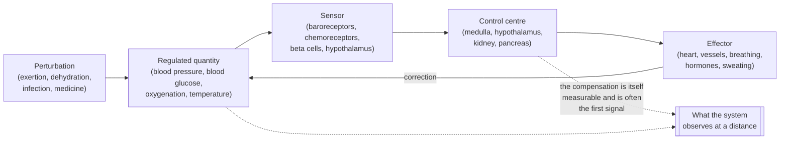
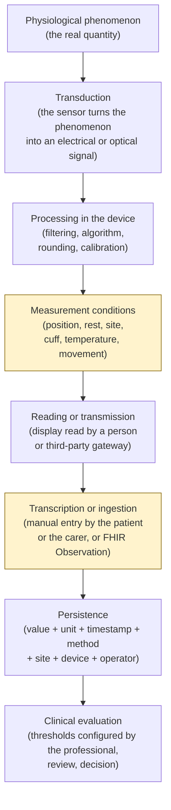
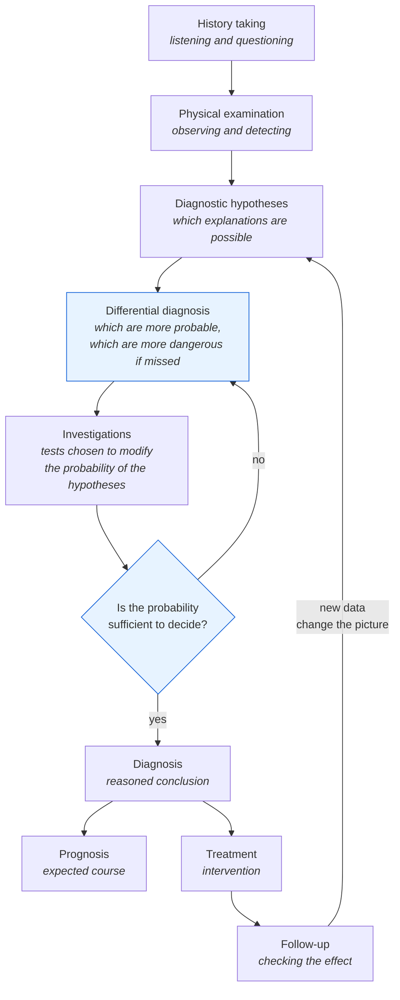

# The body, the parameters, clinical reasoning

:::warning Binding notice - the nature of this module

**This module is technical training for developers. It is not clinical material and it is not a
guide to medical practice.**

It does not teach how to assess a patient, it does not teach how to recognise a disease, it
contains no clinical recommendations and it cannot be used to take decisions about a real
person. It teaches the minimum of clinical theory needed **not to get the data model, the units
of measurement, the temporal aggregation and the semantics of the alerts wrong** in a system
that carries physiological measurements.

All the numerical values cited are **indicative and didactic**. They vary by source, population,
age, sex, altitude, comorbidity, current therapy and method of measurement. **The project does
not hard-wire clinical thresholds into the code**: every threshold is clinical configuration
under the responsibility of the professional, as the perimeter adopted for remote monitoring
(telemonitoraggio) requires (see [02 - Telemedicine
services](02-prestazioni-di-telemedicina.md), § 4.5.5). A number appearing in this text is a
didactic example, never a product default.

:::

This is the module that anyone coming from computing is most tempted to skip. It is also the one
that pays back the most, because the class of defects it prevents is not visible in tests: they
are defects that produce plausible and wrong numbers.

The module presupposes [02 - Telemedicine services](02-prestazioni-di-telemedicina.md), because
it uses the vocabulary of the services without redefining it, and it is read before
[10 - Care pathways and patient safety](10-percorsi-di-cura-e-sicurezza.md), which deals with
scores, triage and clinical risk. The technical representation of measurements in FHIR is in
module [06 - FHIR from scratch](06-fhir-da-zero.md); here we explain **what** is being
represented, not how.

---

## 1. Why a developer must know these things

Not for general culture. Because without these notions one writes defects of a particular
category: the code compiles, the tests pass, the interface shows a number, and the number is
clinically false. No *linter* catches them. Six real defects follow, each with the clinical
notion that would have avoided it.

### 1.1 Defect: saturation treated as a pure number

A dashboard shows peripheral oxygen saturation as a percentage, with a progress bar coloured
from 0 to 100 and a linear scale. It seems reasonable: it is a percentage.

It is not. The saturation of haemoglobin is not linear with respect to the quantity of oxygen
dissolved in the blood: the relationship between the two quantities is described by a sigmoid
curve (§ 2.3.3). In the upper part of the curve enormous variations in oxygen are needed to move
the saturation by one point; in the lower part a single point of saturation corresponds to a
substantial collapse. Three consequences for the interface and for the model follow:

- **the part of the scale below a certain threshold is never a "low" value: it is a value
  different in nature.** A linear bar that colours gradually communicates a false
  proportionality;
- **the difference between two nearby measurements does not have the same meaning depending on
  where it falls.** A variation of two points in the upper zone and the same variation in the
  lower zone are not comparable, and therefore they cannot be summed or averaged as though they
  were;
- **the instrument's declared precision is of the same order of magnitude as the variations of
  interest.** A display that shows decimals for a quantity whose typical error is several
  percentage points invents information that does not exist.

### 1.2 Defect: the unit of measurement badly converted

Blood glucose is expressed in two units in current use: milligrams per decilitre and millimoles
per litre. The conversion factor is about 18 (§ 3.6.3). A value of 5.5 in one unit and a value of
5.5 in the other describe two incompatible clinical situations.

The typical defect is not the wrong conversion: it is **the absent conversion**. A numeric field
without a unit, fed by two sources that use different conventions - a home device and a
laboratory report - produces a time series in which the values are mixed. No domain check
notices, because both values are positive, finite numbers.

The same applies to temperature (degrees Celsius or Fahrenheit), to weight (kilograms or
pounds), to height, to glycated haemoglobin (a percentage according to one convention,
millimoles per mole according to another: § 3.6.6). The rule is one and admits no exceptions:
**no physiological value exists in the system without its unit, and the unit is coded, not a free
string.** The reference standard for coding units is UCUM, placed by the project in regime B of
the terminology policy.

### 1.3 Defect: the arithmetic mean on a series that does not admit means

A monthly summary shows «mean blood pressure for the month: 128/79». The patient measured three
times in the morning for twenty days and once in the evening for two days. The mean is
arithmetically correct and clinically meaningless, for three distinct reasons:

1. **the sampling is not uniform**: the morning measurements are twenty times more numerous than
   the evening ones, so the "monthly mean" is in reality the morning mean;
2. **the quantity has a circadian rhythm** (§ 4.2): averaging values taken at different moments
   of the day cancels out precisely the information that was being sought;
3. **closely spaced measurements are not independent**: three measurements a minute apart are not
   three observations, they are one repeated observation. Counting them three times weights that
   moment arbitrarily.

A frequent aggravating factor: the mean hides the extremes, and it is at the extremes that the
clinical information lies. Two patients with the same mean may have opposite trajectories - one
stable, one with wide swings - and the variability is itself a datum.

### 1.4 Defect: the alert on an isolated value

A remote monitoring plan configures a threshold. The patient measures, the value exceeds it, the
system generates an alert. It is the behaviour almost everyone implements first, and it is the
one that makes the service unusable within a fortnight.

An isolated out-of-range value, in almost all physiological quantities, is more probably a
**measurement error** than a clinical event: badly positioned cuff, cold finger, patient who has
just been walking, scales on a rug, badly adhering sensor. The proportion between true and false
positives depends on the prevalence of the event in the monitored population, and it is precisely
the calculation of § 5.5 - the one that computing people get wrong most often.

The practical effect of a system that alerts on an isolated value is not an excess of safety: it
is **alarm desensitisation**, that is, the progressive loss of attention of whoever receives
signals that are mostly false. It is a risk in the proper sense of ISO 14971, and it must be
treated as such in module [10](10-percorsi-di-cura-e-sicurezza.md). The project does not decide
the rule - persistence, number of consecutive measurements, time window, obligation to confirm -
because the rule is clinical configuration; it must, however, **make it possible to express**
rules that are not instantaneous thresholds, otherwise the professional has no alternative.

### 1.5 Defect: the reference range applied to the wrong population

A reference range is not a property of the quantity: it is a property **of the quantity in a
population, measured with a method, in a context**. Applying it outside that context produces
systematically wrong classifications.

- The "normal" heart rate of a newborn is far above that of an adult. A system that applies the
  adult range to an infant flags as pathological what is physiological.
- Respiratory rate follows the same logic, with an even more marked dependence on age.
- The saturation considered acceptable in a person with advanced chronic obstructive pulmonary
  disease is lower than that of a healthy person, and correcting it aggressively can be harmful.
  A single range for everyone would generate continuous alerts across an entire population.
- The reference values for blood pressure in pregnancy, those in dialysis, those in a patient on
  therapy that slows the heart rate all have logics of their own.
- The expected saturation changes with **altitude**: at a thousand metres of altitude the partial
  pressure of oxygen in the air is lower and the resting saturation of a healthy person is lower
  than at sea level.

Modelling consequence: **the reference range is a datum belonging to the measurement, not a
global constant**. It must be carried with the measurement, with its source, or it must not be
carried at all. It is the same discipline that § 8.3 describes for the laboratory.

### 1.6 Defect: the value without its measurement context

The number «140» as a systolic blood pressure is not a clinical datum. It becomes a clinical
datum when it carries with it: which arm, in which position, after how many minutes of rest, with
which monitor, with which cuff, at what time of day, before or after taking the therapy, at the
first or the third measurement of the sequence.

This is not documentary pedantry: each of these elements shifts the value by an amount comparable
to or greater than the difference between "normal" and "to be treated". A data model that
represents the measurement as a pair (timestamp, value) has already lost, and recovery after the
fact is impossible because those metadata cannot be reconstructed.

### 1.7 What this module does not do

It does not teach how to make a diagnosis, it does not supply applicable clinical criteria, it
does not replace healthcare training and it does not qualify anyone to assess a patient. It
serves to make the developer capable of:

- recognising when an apparently neutral implementation choice destroys clinical information;
- putting the right question to the clinician instead of deducing the rule for themselves;
- reading a functional requirement of the catalogue and understanding why it is worded as it is;
- never inventing a threshold, a conversion or an aggregation.

The last point is the operational rule that sums up the whole module: **in this project clinical
knowledge serves to know what one cannot decide alone.**

---

## 2. Essential anatomy and physiology

This section covers only what the project measures, represents or risks representing badly. It
is not a compendium: it is the quantity of physiology that makes the parameters of § 3 and the
pitfalls of § 4 comprehensible.

### 2.1 The principle that holds it all together: homeostasis and compensation

The human body keeps certain quantities constant - core temperature, blood glucose
concentration, pH, fluid volume, organ perfusion pressure - within narrow ranges, despite
external conditions changing continually. This active maintenance is called **homeostasis**.

The mechanism is almost always a **negative feedback**: a sensor detects the deviation from a
target value, a control centre compares it with that value, an effector acts to reduce it. It is
the same scheme as a controller in a control system, with three differences that matter for
anyone writing clinical software.



**First difference: the measured quantity may be normal precisely because the compensation is
working.** A patient who is losing blood keeps arterial blood pressure almost unchanged for a
long time, by increasing heart rate and vascular resistance. The blood pressure is "normal" and
the situation is serious. When the blood pressure finally falls, the compensation has given way.
From this follows a rule of reading that holds for the whole module: **a normal parameter is not
proof of the absence of a problem, and the most informative value is often that of the
compensation, not that of the regulated quantity.**

**Second difference: the compensations have different time constants from one another.** The
nervous response acts in seconds, the hormonal one in minutes or hours, the renal one in hours or
days. This means that a time series of vital signs contains superimposed phenomena with time
scales that differ by orders of magnitude, and that an aggregation window chosen without knowing
this cancels one or the other.

**Third difference: the target value is neither universal nor fixed.** It changes with age, with
chronic disease, with therapy, with adaptation (for example to altitude or to training). It is
the physiological reason for the defect of § 1.5.

Two terms that recur and that must be fixed at once:

- **compensation**: the set of responses that keep the quantity within the useful range despite
  the perturbation;
- **decompensation**: the condition in which the compensation mechanisms are no longer enough and
  the quantity leaves the range. It is not a synonym for "disease": it is the phase in which the
  disease becomes visible in the parameters.

### 2.2 The cardiovascular system

#### 2.2.1 What it does

It transports oxygen, carbon dioxide, nutrients, hormones, heat and cells of the immune system.
It is a pump (the heart) connected to a network of variable-calibre conduits (the vessels) filled
with a fluid (the blood).

The heart has four chambers: two **atria** (which receive) and two **ventricles** (which eject).
The circuit is double and in series:

- **pulmonary circulation** - the right ventricle pushes oxygen-poor blood into the lungs, where
  it takes up oxygen and gives up carbon dioxide;
- **systemic circulation** - the left ventricle pushes oxygen-rich blood to all the organs.

The fact that the two circulations are in series has a constant practical consequence: **a
problem downstream has repercussions upstream**. If the left ventricle cannot eject enough, the
blood backs up upstream, that is, in the lungs, and breathing difficulty results. If the right
ventricle cannot manage, the congestion is in the systemic veins, and swelling of the legs and
weight gain from fluid retention result. It is why **body weight is a cardiological parameter**,
which surprises anyone who regards it as an anthropometric datum (§ 3.7).

#### 2.2.2 The quantities and how they are linked

The quantity that really matters for the organs is not measurable at a distance: it is
**perfusion**, that is, how much blood actually reaches the tissues. What is measured are
correlated quantities.

- **Stroke volume** - volume ejected by the ventricle at each beat.
- **Cardiac output** - volume ejected per minute. It is the product of stroke volume and heart
  rate. Hence a relationship that explains many trajectories observed in remote monitoring: **if
  stroke volume falls, the rate rises in order to maintain the output.** Tachycardia is often a
  compensation, not a disease in itself.
- **Peripheral resistance** - the vessels' opposition to flow, regulated by the calibre of the
  arterioles.
- **Arterial blood pressure** - approximately the product of cardiac output and peripheral
  resistance. It is the identity to keep in mind because it dismantles the idea that blood
  pressure measures the strength of the heart: a normal blood pressure is compatible with a low
  output and high resistance, that is, with a situation worse than a slightly lower pressure with
  dilated vessels.

The heart contracts following an electrical impulse that arises in a group of cells of the right
atrium (**sinoatrial node**), propagates to the atria, passes through a delayer
(**atrioventricular node**) and reaches the ventricles. This electrical activity is what an
electrocardiogram records; the mechanical contraction that follows from it is what generates the
pulse. **Electrical and mechanical do not always coincide**: there are conditions in which an
electrical impulse does not produce an effective contraction, and therefore a beat counted by the
electrocardiogram does not correspond to a pulse perceptible at the periphery (§ 3.2.4).

#### 2.2.3 What happens when it decompensates

**Heart failure** - cardiac decompensation - is the condition in which the heart cannot guarantee
an output adequate to the organism's demands, or manages it only at the price of high filling
pressures. It is one of the chronic conditions most represented in remote monitoring programmes,
for a precise reason: **the deterioration is preceded by days of fluid retention**, and the
retention is measurable with a set of scales before the patient notices that they are getting
worse. In the project's vocabulary it is the canonical example of a parameter that counts for its
**trend**, not for its absolute value (§ 4.1).

The other cardiovascular conditions relevant to the perimeter:

- **arterial hypertension** - stably elevated blood pressure; the damage is to the organs and is
  silent for years, so the single value counts for little and the series counts for a lot;
- **atrial fibrillation** - chaotic atrial electrical activity; it produces an irregular pulse and
  **degrades the reliability of automatic blood pressure monitors** (§ 3.1.5);
- **ischaemic heart disease** - insufficient blood supply to the heart muscle itself.

### 2.3 The respiratory system

#### 2.3.1 What it does

It ensures two opposite exchanges: it lets oxygen into the blood and lets carbon dioxide out.
These are two distinct functions, and distinguishing them is essential because **a pulse oximeter
measures only the first**.

Air enters through the airways as far as the **alveoli**, tiny sacs surrounded by capillaries.
There the diffusion of gases takes place across an extremely thin membrane. The movement of the
air is produced by the diaphragm and by the intercostal muscles.

#### 2.3.2 The quantities

- **Respiratory rate** - breaths per minute.
- **Tidal volume** - air moved with each breath.
- **Minute ventilation** - the product of the two. Here too the compensation relationship holds:
  someone with reduced volumes increases the rate.
- **Partial pressure of oxygen in arterial blood** - quantity of dissolved oxygen, measurable
  only with an arterial sample, not at a distance.
- **Oxygen saturation of haemoglobin** - percentage of haemoglobin binding sites occupied by
  oxygen. It is the quantity that the pulse oximeter estimates (§ 3.3).
- **Partial pressure of carbon dioxide** - an index of how far ventilation is eliminating carbon
  dioxide. **It cannot be estimated with a pulse oximeter.**

#### 2.3.3 The dissociation curve, and why it changes the way one designs an interface

The relationship between oxygen dissolved in the blood and haemoglobin saturation is not
proportional: it has an S shape. In the upper part the curve is almost flat, in the central part
it is steep.

The operational consequences are three, and they are the reason for the defect of § 1.1:

1. **in the upper zone saturation is insensitive**: a real deterioration of respiratory gas
   exchange may not move it at all. A "good" saturation does not rule out a respiratory problem
   in progress;
2. **in the steep zone small variations in saturation correspond to large variations in oxygen**:
   here the same numerical difference has a completely different clinical weight;
3. **the curve shifts** with temperature, pH, carbon dioxide and other factors: the relationship
   between saturation and oxygen is not even stable within the same patient.

From this follows the representation rule adopted by the project: **saturation is not represented
with a continuous linear scale from 0 to 100 and is not averaged like any other percentage.** If
an aggregation is necessary, the minimum observed and the time spent below a configured level are
more defensible quantities than the mean.

A second, counter-intuitive point: **oxygen and carbon dioxide can diverge.** A person may have an
acceptable saturation and at the same time insufficient ventilation that is accumulating carbon
dioxide. A system that shows only the saturation shows half the problem, and must be designed in
the knowledge of that.

#### 2.3.4 What happens when it decompensates

- **Respiratory failure** - inability to maintain adequate gas exchange. It may concern only
  oxygenation or also the elimination of carbon dioxide.
- **Chronic obstructive pulmonary disease** - chronic obstruction to airflow, typically with
  exacerbations. It is the population in which the reference range for saturation must be
  personalised (§ 1.5).
- **Asthma** - reversible and variable obstruction.
- **Pneumonia, pulmonary oedema, pulmonary embolism** - acute conditions with partly overlapping
  presentations, which is precisely the theme of differential diagnosis (§ 5.2).

### 2.4 The nervous system

#### 2.4.1 What it does

It collects information, processes it and produces responses. It is divided into the **central
nervous system** (brain and spinal cord) and the **peripheral** one (nerves). From a functional
point of view, the part that directly concerns the project is the **autonomic nervous system**:
the portion that regulates involuntary functions.

It has two components with largely opposite effects:

- **sympathetic** - prepares for action: it increases heart rate and force of contraction,
  constricts some vessels, dilates the airways, increases sweating, mobilises glucose;
- **parasympathetic** - prevails at rest: it slows the heart rate, favours digestion and
  recovery.

**This is the physiological reason why almost every vital sign is influenced by the patient's
emotional state and recent activity.** A measurement taken immediately after climbing the stairs
into the house, after an argument or during the anxiety of waiting for a remote consultation is
not the same measurement taken at rest. It is not a defect of the patient: it is physiology, and
it must be absorbed by the measurement procedure, not corrected after the fact by the software.

#### 2.4.2 The quantities represented by the project

The system does not measure nervous function in the strict sense, but it represents two families
of data that concern it:

- the **level of consciousness**, assessed with scales, and more generally the clinical scores
  dealt with in module [10](10-percorsi-di-cura-e-sicurezza.md);
- **pain**, which is by definition a datum reported by the patient (§ 5.1) and is represented with
  self-assessment scales.

This must be said explicitly because it is a recurrent source of modelling errors: **a pain scale
from 0 to 10 is not a physical measurement.** It is a subjective ordering. It does not admit
averages across patients, its intervals are not equal to one another, and comparing one person's
6 with another's 6 has no meaning. Comparing today's 6 with yesterday's 4 **in the same person**,
on the other hand, does.

#### 2.4.3 What happens when it decompensates

Stroke, epileptic seizures, confusional states, cognitive decline. Relevant to the project chiefly
for two indirect reasons: **cognitive decline** affects the patient's ability to use digital tools
and to perform a measurement correctly - it is the clinical reason behind the requirement to
verify the patient's ability to interact with digital systems - and **disturbances of attention
or of alertness** make self-completion of questionnaires unreliable.

### 2.5 The endocrine system

#### 2.5.1 What it does

It regulates slow, diffuse functions by means of **hormones**, chemical messengers released into
the blood by glands and active on distant organs. Compared with the nervous system it acts with
longer time constants and with more lasting effects.

#### 2.5.2 The regulation of glucose, which is what the project measures

Glucose in the blood is the cells' immediate source of energy and its concentration is kept within
a narrow range by two hormones produced by the pancreas with opposite effects:

- **insulin** - lowers blood glucose by making glucose enter the cells and favouring its storage.
  It is released when blood glucose rises, typically after a meal;
- **glucagon** - raises blood glucose by mobilising the reserves, when blood glucose falls.

**Diabetes mellitus** is the condition in which this regulation fails. The two main forms have
different mechanisms - absence of insulin production in one case, reduced effectiveness of the
insulin produced in the other - and this radically changes the structure of the data collected: in
the first case several measurements a day are needed, correlated with meals and with insulin
doses, whereas in the second the monitoring can be far less dense.

Two notions indispensable if the data model is not to be got wrong:

- **blood glucose depends decisively on the temporal relationship with the meal.** A "fasting"
  value and a "two hours after the meal" value are not the same parameter with different
  timestamps: they are **two different parameters**, with different reference ranges and different
  codes. Confusing them is one of the commonest and most insidious errors, because both are
  plausible numbers;
- **hypoglycaemia is as dangerous as hyperglycaemia and more so, but on a much shorter time
  scale.** A blood glucose that is too low can become an emergency in minutes, whereas the damage
  of chronic hyperglycaemia is measured in years. From this it follows that a system that treats
  blood glucose with a single symmetric threshold logic has already got the asymmetry of the risk
  wrong.

#### 2.5.3 Other hormonal axes that appear in the data

- **thyroid** - regulates basal metabolism; it influences heart rate, temperature, weight. A
  thyroid dysfunction may explain alterations of apparently cardiological parameters;
- **adrenal gland** - produces cortisol, which has a marked circadian rhythm and is one of the
  physiological causes of the daily variations in blood pressure and blood glucose (§ 4.2);
- **pituitary gland** - coordinates the other axes.

### 2.6 The renal system

#### 2.6.1 What it does

The kidneys filter the blood and produce urine, but reducing them to a filter is misleading. They
regulate:

- the **volume of the body's fluids**, and therefore indirectly arterial blood pressure;
- the **concentration of the electrolytes** (sodium, potassium and others), whose imbalance has
  direct effects on the heart;
- the **acid-base balance**;
- the **elimination of waste products** and of many medicines;
- the production of hormones that regulate blood pressure and the formation of red blood cells.

The point that connects the kidney to everything else: **the kidney is at once the cause and the
victim of arterial blood pressure.** High blood pressure damages the kidney; a damaged kidney
raises blood pressure. It is a positive feedback loop, that is, one that feeds itself, and it is
why many care pathways treat heart and kidney together.

#### 2.6.2 The quantities

Renal function is not measured at a distance. It is estimated from laboratory tests, chiefly from
the concentration of certain waste substances in the blood and from a filtration index calculated
with formulae that depend on age, sex and other variables. What the project handles is therefore
the **report**, not the measurement (§ 8).

Two relevant quantities are, however, observable at home: **weight** (rapid variations reflect
fluids, not mass: § 3.7.4) and **arterial blood pressure**.

#### 2.6.3 What happens when it decompensates

**Renal failure** may be acute or chronic. In the patient on **dialysis** concepts appear that a
naive data model does not provide for: the **dry weight**, that is, the target weight after the
removal of excess fluid, against which the deviation is assessed; the fact that the weight must be
read in relation to the dialysis session (before or after); the fact that blood pressure must be
measured on a particular arm, because on the other there may be a vascular access that forbids its
compression. These are typical examples of **rules that the software cannot deduce and must be
able to receive by configuration**.

### 2.7 How they interweave: an integrated example

It is worth going through a didactic case, because it shows how the parameters of different
systems move together and why the isolated value says little.

A person with chronic heart failure accumulates fluid over the course of a few days. The typical
sequence of signals observable at a distance is:

1. the **weight** rises gradually: it is the first signal, and it is measurable before the person
   perceives anything;
2. **swelling** of the ankles appears or worsens: a visible sign, but subjectively appraised
   through a screen (§ 6.2);
3. the **heart rate** increases as compensation for the reduced stroke volume;
4. the **respiratory rate** increases because of congestion in the lungs; the patient reports
   breathlessness first on exertion, then lying down;
5. the **saturation** falls - and it is late, because the curve of § 2.3.3 keeps it high as long
   as it can;
6. the **blood pressure** may rise, stay stable or fall depending on the phase and on the therapy:
   it is not an unambiguous indicator.

Three lessons for whoever designs:

- **the order of the signals counts for more than the values.** A system that treats the
  parameters as independent streams loses the correlation, which is the clinical datum;
- **the earliest parameter is the most banal one.** Weight, measured with bathroom scales, has
  more predictive value in this condition than saturation measured with a more sophisticated
  device;
- **saturation arrives late.** Building the service around the most «technologically interesting»
  parameter is an error of priority.

---

## 3. The vital signs, one by one

### 3.0 How to read the entries

Each parameter is described with the same grid, because it is exactly these dimensions that
determine the data model:

- **what it physically measures** - the real quantity, not the sensor's trade name;
- **how it is measured** - the method, because different methods produce non-interchangeable
  values;
- **unit of measurement** - with the UCUM code, which is the form in which the unit enters the
  system;
- **reference ranges and their dependence on context** - always indicative, never hard-wired;
- **sources of error** - the list of reasons why a value may be wrong while still being
  plausible;
- **what makes a value clinically significant**;
- **why the single value is almost never enough**.

Before the entries, the chain that leads from a physical phenomenon to a record in the database.
Every link introduces error, and every link must be represented if one wants to be able to explain
a value after the fact.



The two highlighted links are those the project does not control and that introduce most of the
error: **the measurement conditions** and **the transcription**. The perimeter adopted -
ingestion from third-party gateways, manual entry, questionnaires - implies that the project
**does not answer for the accuracy of the hardware chain**, but it must make what happened
reconstructible: who entered the value, with which declared device, under which declared
conditions.

### 3.1 Arterial blood pressure

#### 3.1.1 What it physically measures

The force exerted by the blood on the wall of the arteries. It is not a single number: during each
cardiac cycle the pressure oscillates between a maximum and a minimum, and from these two values
two others are derived.

- **Systolic pressure** - the maximum value, reached during the contraction of the left ventricle
  (*systole*).
- **Diastolic pressure** - the minimum value, during relaxation (*diastole*).
- **Pulse pressure** - the difference between systolic and diastolic. It largely reflects the
  stiffness of the large arteries and the volume ejected at each beat. It is a **derived** value,
  not a measured one.
- **Mean arterial pressure** - the average value over time across a cardiac cycle, which is the
  quantity physically closest to the organ perfusion pressure. Since the cycle is not symmetric
  (diastole lasts longer than systole), it is not the arithmetic mean of the two values: it is
  approximated with formulae of the type *diastolic plus one third of the pulse pressure*. The
  detail is relevant for software because **it is a formula, not a measurement**, and the formula
  used must be declared.

#### 3.1.2 How it is measured

Two non-invasive methods, which do not give the same numbers.

- **Auscultatory** - an inflated cuff compresses the artery of the arm; while deflating slowly, an
  operator listens with a stethoscope for the appearance and disappearance of characteristic
  sounds and reads the two values on a manometer. It is the historical reference method and **it
  requires a trained operator**: it cannot be performed by the patient alone, and it cannot be
  performed through a screen.
- **Oscillometric** - an automatic cuff detects the pressure oscillations transmitted by the
  vessel and **computes** the values with a proprietary algorithm. It is the method of almost all
  home monitors. Essential point: the oscillometric device **directly measures a quantity close to
  the mean pressure and derives systolic and diastolic by estimation**. It follows that the
  results depend on the algorithm of the individual model and that two different devices on the
  same arm may differ.

There are furthermore **twenty-four-hour ambulatory measurement**, with a device that measures
automatically at programmed intervals including at night, and **home self-measurement** according
to defined schemes. Both produce **series**, not values: it is the form in which blood pressure
really has clinical meaning.

#### 3.1.3 Units

Millimetres of mercury. UCUM code: `mm[Hg]`. The square brackets are not a typo: they are part of
UCUM syntax for non-metric units. A system that writes `mmHg` as a free string is not
interoperable.

**Blood pressure is not a number: it is a structure.** In FHIR it is represented as an
`Observation` with distinct components for systolic and diastolic, not as the string «120/80». A
string is not comparable, is not aggregable and has no unit.

#### 3.1.4 Reference ranges and dependence on context

The reference values commonly cited for the healthy adult sit around 120/80 mm[Hg] `[NV]`, but
this figure is didactic and cannot be used as a rule. The reasons why it cannot:

- the diagnostic thresholds for hypertension **differ according to the guideline** adopted and
  have been revised several times, in different directions, by different scientific societies;
- **the threshold depends on the method**: the reference values for measurement in the clinic, for
  self-measurement at home and for twenty-four-hour monitoring are **different from one another**,
  and lower for the home and ambulatory methods. Comparing a home value with a clinic threshold is
  a methodological error, not an approximation;
- the therapeutic target is **individual**: it depends on age, organ damage, diabetes, kidney
  disease, pregnancy, tolerance of the medicines;
- in paediatric age the references are expressed in **percentiles for age, sex and height**, not
  in absolute values. A system that applies adult thresholds to a child produces meaningless
  classifications.

> **Project rule.** None of these thresholds appears in the code. The monitoring plan carries its
> own configuration, defined by the professional, with its own declared source and its own context
> of applicability.

#### 3.1.5 Sources of error

This list is deliberately long, because each item shifts the value by an amount comparable to the
difference between the clinical categories.

- **Cuff of the wrong size.** A cuff too small for the arm's circumference overestimates; one too
  large underestimates. It is the single commonest error in self-measurement, and it is invisible
  in the datum.
- **Position of the arm.** The arm must be supported at heart height. Lower down it overestimates,
  higher up it underestimates, because of the hydrostatic column.
- **Posture.** Seated, with the back supported, feet on the floor and not crossed. Crossed legs, an
  unsupported back and a full bladder alter the value.
- **Insufficient rest.** Several minutes of rest are needed before the measurement. A measurement
  taken immediately after physical activity, after speaking or during a conversation is
  systematically higher.
- **Speaking during the measurement.** It raises the value.
- **Smoking, caffeine, a recent meal.**
- **White coat effect** - higher blood pressure in the presence of healthcare staff than at home.
  It has a counterpart in telemedicine that has not been the subject of reliable quantification:
  the effect of being observed through a video camera during the measurement. `[NV]`
- **Masked hypertension** - the opposite phenomenon: normal values in the clinic and elevated ones
  at home. It is the main reason why self-measurement has autonomous value and is not a fallback.
- **Difference between the two arms.** It may be physiological within a certain margin and
  pathological beyond it. Operational consequence: **the arm used is a datum**, and measurements on
  different arms are not
  to be placed in the same series without qualifying them.
- **Arrhythmia.** In the presence of an irregular beat - typically atrial fibrillation -
  oscillometric devices lose reliability, because the algorithm assumes a certain regularity of
  the signal. Many devices flag the irregularity: **that flag is a datum to be retained**, not a
  message to be shown and discarded.
- **The first measurement higher than the following ones.** It is why self-measurement protocols
  ask for several consecutive measurements with an interval and prescribe how to combine them. The
  rule for combining them **belongs to the clinical protocol**, not to the software.
- **Transcription.** The patient reads the display and types. Transposed digits, systolic and
  diastolic swapped, confusion with the heart rate value shown on the same display.

#### 3.1.6 What makes a value significant, and why one alone is not enough

Blood pressure is the physiological quantity with the **highest intrinsic variability among those
dealt with here**: it varies from beat to beat, over the course of the day, with the season, with
emotional state. From this follows a principle that the data model must incorporate: **the
diagnosis and control of hypertension are founded on series of measurements taken under
standardised conditions, not on isolated values.**

The really informative quantities are therefore second-order: the mean of a self-measurement cycle
conducted according to a defined protocol, the variability, the difference between morning and
evening, the night-time behaviour, the proportion of measurements within the individual target.
All of them require the moment and the conditions of the measurement to be first-class data.

There is only one exception to the rule «an isolated value is not enough»: **extreme** values, in
which the magnitude of the deviation makes measurement error improbable and the situation demands
immediate attention irrespective of the series. What that threshold is, is a clinical decision,
configured in the plan, and the project confines itself to making it possible to express the
distinction between a trend rule and an extreme-value rule.

### 3.2 Heart rate

#### 3.2.1 What it physically measures

The number of cardiac cycles per unit of time. Note a distinction that everyday language erases:

- **heart rate** - electrical or mechanical beats of the heart per minute;
- **pulse rate** - pulsations perceptible at the periphery per minute.

They coincide in most cases, but **not always**: if some contractions are too weak to generate a
perceptible pulse wave, the pulse is slower than the heart rate. This difference is called the
**pulse deficit** and is typically observed in atrial fibrillation. Since almost all home devices
measure the **pulse**, the datum that reaches the system is the pulse rate even when the label
says «heart rate».

#### 3.2.2 How it is measured

- **Manual palpation** - counting on a peripheral artery for a defined time. Simple, and the only
  method that allows **the regularity and the amplitude** to be appreciated as well as the rate.
- **Pulse oximetry** - almost all pulse oximeters also return the pulse rate, derived from the
  pulsatile component of the optical signal.
- **Automatic blood pressure monitor** - returns the rate detected during the measurement.
- **Electrocardiogram** - measures the electrical activity; it is the only method that describes
  the **rhythm** and not just the rate.
- **Wearable sensors** - photoplethysmography at the wrist or the finger. Accuracy strongly
  dependent on movement, on adhesion and on perfusion.

**Different methods do not produce the same datum**, and the difference is not only one of
accuracy: it is one of meaning. A value from an electrocardiogram and a value from wrist
photoplethysmography during movement do not belong to the same series.

#### 3.2.3 Units

Beats per minute. UCUM code: `/min`. The textual form «bpm» is a display label, not a coded unit.

#### 3.2.4 Reference ranges and context

For the adult at rest a range of around 60–100 beats per minute is commonly cited `[NV]`. The
dependencies on context are stronger than in almost any other parameter:

- **age** changes everything: the newborn has far higher rates, and the paediatric references fall
  progressively with growth;
- **training**: in a highly trained person a resting rate below the lower limit of the average
  adult's range is expected, not pathological;
- **therapy**: some classes of cardiological medicines deliberately reduce the rate. In a patient
  on therapy the expected value is lower, and - a less obvious point - **the compensatory increase
  in the event of deterioration is attenuated**, so the signal one would expect may not appear;
- **fever** increases the rate;
- **emotional state and recent activity** (§ 2.4.1);
- **an implanted device**: in the presence of a cardiac pacemaker the rate may be determined by
  the device and not by the heart.

#### 3.2.5 Sources of error

- **Movement** during the measurement, particularly with optical sensors.
- **Poor peripheral perfusion** - cold hands, vasoconstriction: the optical signal degrades and
  the algorithm may lock onto artefacts.
- **Arrhythmias** - an irregular beat makes the very concept of "rate" ambiguous over a short
  window.
- **Counting over a short time and multiplying** - counting for fifteen seconds and multiplying by
  four amplifies the counting error fourfold and is particularly unsuitable in the presence of
  irregularity.
- **Double counting or halving** - some algorithms may lock onto the wrong harmonic of the signal,
  returning double or half the real value. These are plausible values: no range check catches
  them.

#### 3.2.6 Why the single value is not enough

Because heart rate is, among the parameters considered, the most **reactive**: it responds in
seconds to trivial stimuli. Its meaning lies in the relationship with the patient's state at that
moment (at rest? after exertion? feverish?) and in the **trend**: a stable increase in resting
rate over the course of days is information, a high measurement immediately after climbing the
stairs is not.

It should also be noted that the **regularity** of the beat is, in many situations, more
informative than the rate, and that almost no home device transmits it in structured form. If the
device exposes an irregular-beat indicator, **that indicator is a clinical datum to be
persisted**, with the same standing as the number.

### 3.3 Peripheral oxygen saturation

#### 3.3.1 What it physically measures

The percentage of **haemoglobin binding sites occupied by oxygen**, estimated non-invasively
through a peripheral tissue. Three clarifications that change the way code is written:

- **it does not measure how much oxygen there is in the blood in absolute terms.** A person with
  little haemoglobin may have a perfect saturation and insufficient oxygen transport;
- **it does not measure breathing.** It says nothing about the elimination of carbon dioxide
  (§ 2.3.3);
- **it is an estimate**, not a direct measurement. The reference quantity is the saturation
  measured on arterial blood in the laboratory; the peripheral value is an approximation of it,
  with an error that manufacturers declare and that is of the order of a few percentage points.
  `[NV]` on the exact numerical value, which depends on the device and on the context.

The method rests on the fact that haemoglobin bound to oxygen and unbound haemoglobin absorb red
and infrared light differently; the device illuminates the tissue, measures the absorption and
isolates the **pulsatile component** of the signal, which it assumes comes from arterial blood.
All the sources of error of § 3.3.4 derive from the violation of one of these assumptions.

#### 3.3.2 How it is measured

A pulse oximeter applied to the finger, to the earlobe or, in newborns, to the foot. They are the
most widespread home devices after the blood pressure monitor, and their accuracy varies
enormously between products certified as medical devices and consumer products.

#### 3.3.3 Units

Percentage. UCUM code: `%`. **Not to be represented as a fraction between 0 and 1**: the clinical
convention is 0–100 and an inversion of convention is a defect that passes the tests and does not
pass clinical review.

The **code** of the quantity must also be distinguished: there is a difference between saturation
measured on arterial blood and saturation estimated with pulse oximetry, and the two have
different codes. Using the wrong code means declaring that an arterial sample was taken when it
was not.

#### 3.3.4 Sources of error

- **Poor peripheral perfusion** - cold, vasoconstriction, hypotension. The pulsatile signal is
  reduced and the estimate degrades. Many devices expose a **perfusion index**: it is an indicator
  of data quality and, where available, it must be retained.
- **Movement** - it generates spurious pulsatile components.
- **Nail varnish, artificial nails, dirt** - they alter the optical absorption.
- **Intense ambient light** reaching the sensor.
- **Abnormal haemoglobins.** In the presence of carbon monoxide, haemoglobin bound to the monoxide
  absorbs light in a way similar to oxygenated haemoglobin: **the oximeter may read a high
  saturation while oxygen transport is severely compromised.** It is the case in which a
  reassuring value is the manifestation of the problem.
- **Skin pigmentation.** The scientific literature has documented systematic differences in the
  accuracy of oximetry in relation to skin colour, with a tendency to overestimate saturation in
  people with darker pigmentation. The project records the fact without quantifying it: `[NV]` on
  the magnitude, which depends on device and population. The design consequence is, however,
  independent of the quantification - **it is a source of systemic inequity that must be declared
  in the documentation intended for the professional and taken into account in risk management**,
  not a technical detail.
- **Measurement site** - finger, ear and foot have different response times and reliability.
- **Supplemental oxygen in progress.** A saturation must be read **together with the information
  on whether the patient is receiving oxygen and at what flow rate**. The same figure with and
  without oxygen describes two very different situations. This is a textbook case of **a datum
  that has no meaning without its qualifier**: the data model must provide for it, not add it
  later.

#### 3.3.5 Why the single value is not enough

Because of the shape of the curve (§ 2.3.3), which makes the parameter insensitive as long as the
compensation holds and then rapidly informative; because of the variability of the measurement;
and because the clinically relevant quantity is often **the saturation during a defined exertion**
or **the persistence below a level over time**, not the value at rest. The defensible aggregations
are the minimum observed in a window and the time spent below a configured level; the mean is
almost always meaningless.

### 3.4 Respiratory rate

#### 3.4.1 What it physically measures

The number of complete breaths (one inspiration plus one expiration) per minute.

#### 3.4.2 How it is measured

Observation and counting of the movements of the chest over an interval of time - ideally a whole
minute - **preferably without the patient knowing they are being observed**, because breathing is
under partial voluntary control and awareness alters it. It is the only parameter in this section
whose correct measurement requires the subject **not to cooperate** consciously.

From this follows a notable consequence for telemedicine: asking the patient «count your breaths»
produces a systematically distorted value. Counting by a carer or by the professional while
observing on video is more defensible, but it requires adequate framing and lighting and a
duration of observation that the video call rarely allows (§ 6.5).

There are devices that derive it from other signals, but the project does not talk directly to the
devices and receives the value already computed: **the method declared by the gateway is therefore
an indispensable datum**.

#### 3.4.3 Units

Breaths per minute. UCUM code: `/min` - the same unit as heart rate, which makes **the code of the
quantity the only discriminator**. A model that relies on the unit to distinguish the two
parameters conflates two completely different series.

#### 3.4.4 Ranges and context

For the adult at rest a range of around 12–20 breaths per minute is cited `[NV]`. The dependence
on age is even more marked than for heart rate: the paediatric values are distinctly higher and
fall with age. Fever, pain, anxiety, exertion, metabolic disturbances and respiratory conditions
increase it; some substances depress it.

#### 3.4.5 Why it counts for more than it seems

It is the **least measured and most neglected** parameter, and it is at the same time the one to
which the literature on early warning scores attributes considerable weight in identifying
clinical deterioration. Module [10](10-percorsi-di-cura-e-sicurezza.md) deals with the scores in
detail; here the design consequence is enough: **if the interface makes it inconvenient to enter
the respiratory rate, the field will stay empty**, and it will be precisely the datum that was
needed that stays empty. The friction cost of a field, in this domain, is measured in missing
data.

#### 3.4.6 Sources of error

Awareness of being observed; counting over a short interval and multiplying; irregular breathing,
which makes the mean rate unrepresentative; speech during the observation; on video, framing that
does not include the chest, insufficient lighting, frame rate reduced by compression (§ 6.5).

### 3.5 Body temperature

#### 3.5.1 What it physically measures

The temperature of the body. But **which** temperature: the core temperature, that is, of the deep
organs, is the physiologically regulated quantity; what is measured is the temperature of an
**accessible site**, which is an approximation of it with a systematic error that depends on the
site.

#### 3.5.2 How it is measured, and why the site is part of the datum

The sites in current use - axillary, oral, tympanic, rectal, temporal - give **systematically
different values from one another**, with the axillary site typically lower and the rectal site
typically higher than the oral. The exact magnitude of the differences varies by source and by
method: `[NV]`.

Inescapable consequence: **a time series of temperatures with different and unqualified sites is
meaningless.** If the patient measures in the armpit in the morning and with an infrared
thermometer on the forehead in the evening, the variation observed may be entirely an artefact.
The site is a mandatory component of the measurement, not an optional annotation.

Non-contact infrared thermometers, very widespread, are the most sensitive to environmental
conditions: distance, angle, sweating, recent exposure to sun or cold, draughts.

#### 3.5.3 Units

Degrees Celsius. UCUM code: `Cel` - **not** `°C` as a string. Degrees Fahrenheit exist and are
used in other conventions: the conversion is affine, not multiplicative, so a conversion error
produces plausible values rather than absurd ones. It is exactly the defect of § 1.2.

#### 3.5.4 Ranges and context

The value commonly cited as a reference is around 36.5–37.5 °C at the oral site `[NV]`, but the
notion of «normal temperature» is less solid than is believed: it varies by individual, by site,
by time of day (with a night-time minimum and a late-afternoon maximum: § 4.2), by phase of the
menstrual cycle, by age. In the elderly person the febrile response may be attenuated or absent
**even in the presence of severe infection**: a system that treats the absence of fever as
reassurance applies a wrong line of reasoning to a population that is in fact the typical one for
remote monitoring.

The threshold that defines «fever» varies by source and by site: it is clinical configuration.

#### 3.5.5 Why the single value is not enough

Because temperature has a marked circadian rhythm, because the site introduces a systematic
offset, and because what informs is **the trajectory**: the onset, the persistence, the
oscillation and the response to therapy. A single measurement is interpretable only if one knows
the site, the time and whether the patient has taken medicines that lower the temperature - and
it is the most frequent case in which a normal value conceals an abnormal situation.

### 3.6 Blood glucose

#### 3.6.1 What it physically measures

The concentration of glucose in a sample. **In which sample** is the first question, and it is not
a detail.

- **Capillary blood** - the drop obtained by pricking a fingertip, measured with a blood glucose
  meter.
- **Venous plasma** - the laboratory's sample, obtained by drawing from a vein.
- **Interstitial fluid** - the one measured by continuous monitoring sensors, which do not measure
  blood.

The three samples **do not give the same value**. Most home meters are calibrated to return a
value **equivalent to plasma** even when measuring capillary blood, but the calibration declared
by the device is a datum: different devices may not be comparable.

#### 3.6.2 How it is measured

- **Capillary meter** - prick, test strip, reading in a few seconds. The value depends on the batch
  of strips, on how they have been stored, on their expiry date and on the ambient temperature.
- **Laboratory** - on a venous sample, with reference methods.
- **Continuous glucose monitoring** - a subcutaneous sensor samples the interstitial fluid at very
  close intervals and produces a dense series. Two properties to know: there is a **physiological
  lag** between blood and interstitial glucose, of the order of a few minutes, which manifests
  itself above all when the value changes rapidly; and accuracy is expressed with indices of its
  own, not with a single error figure.

#### 3.6.3 Units, and the conversion that must be got right

Two units in use: **milligrams per decilitre** (`mg/dL`) and **millimoles per litre** (`mmol/L`).
The conversion factor for glucose is about **18.0** - more precisely the ratio determined by the
molar mass of glucose `[NV]` on the exact value to use, which must be fixed in a single point of
the code and not repeated.

Since the orders of magnitude of the values in the two units do not overlap, in this specific
case a unit error produces **absurd** values and is therefore detectable. It is the exception, not
the rule, and it does not justify the absence of the unit: the same confidence applied to glycated
haemoglobin or to temperature produces silent disasters.

#### 3.6.4 The temporal context is part of the parameter's identity

It must be repeated because it is the principal trap (§ 2.5.2): «fasting blood glucose», «blood
glucose two hours after the meal», «random blood glucose» and «bedtime blood glucose» **are not
the same parameter with different timestamps**. They have different reference ranges, different
meanings and different codes. A model that merges them into a single series produces graphs that
look informative and are not.

Likewise, in a patient on insulin therapy the value has meaning only if correlated with meal and
dose: the measurement alone is half the datum.

#### 3.6.5 Sources of error

- Test strips past their expiry date or badly stored; batch not matching.
- Unwashed hands: sugar residues on the fingertip alter the value upwards, sometimes markedly.
- The first drop used instead of the second, according to the device's instructions.
- Extreme ambient temperature; altitude.
- Dehydration, alterations of the haematocrit, certain interfering substances.
- For continuous monitoring: lag during phases of rapid variation, compression of the sensor
  during sleep, the initial period after insertion.

#### 3.6.6 Glycated haemoglobin: two units and two conventions

It is a laboratory test reflecting the average exposure to glucose over the preceding months,
cited here because it is the case in which the conversion of units is most insidious. It is
expressed as a **percentage** under one convention and in **millimoles per mole** under another.
The numerical values are of different orders of magnitude, but there are reports that carry both,
and the relationship between the two is affine, not proportional `[NV]` on the exact
coefficients.

Rule: **the value is retained with its unit as it was reported**, and the conversion, if needed,
is an explicit, traceable and reversible function - never a silent normalisation on ingestion.

### 3.7 Body weight

#### 3.7.1 What it physically measures

Body mass. It is apparently the most banal parameter and, in some care pathways, the most
informative (§ 2.7).

#### 3.7.2 How it is measured

Scales. The conditions count for more than it seems: the same scales, the same moment of the day
(typically in the morning), after passing urine, before breakfast, with comparable clothing, on a
rigid surface - scales on a rug may read in a way that is not repeatable.

#### 3.7.3 Units

Kilograms. UCUM code: `kg`. Pounds exist in other conventions: the conversion is multiplicative
and an error produces plausible values. The defect of § 1.2.

#### 3.7.4 Why a rapid variation is not a variation in mass

Over the course of hours or a few days the mass of the tissues does not change appreciably. **A
rapid variation in weight is a variation in body water.** This is the clinical foundation of the
use of weight in the remote monitoring of heart failure and in the patient with kidney disease:
the scales become an instrument for estimating fluid balance.

Two modelling consequences follow:

- **the relevant quantity is the variation with respect to a reference, not the absolute value.**
  The reference may be a target weight defined by the clinician - the **dry weight** in the
  patient on dialysis - or the weight on an index day. The model must be able to represent the
  reference and its history, because the reference itself is updated by the clinician;
- **the time window of the variation is part of the rule.** Criteria of the type «an increase of
  a certain amount over a certain number of days» recur in heart failure remote monitoring plans;
  `[NV]` on an Italian regulatory source that fixes their values, which remain clinical
  configuration of the plan.

A case must be added that the software has to handle without inventing: **a rapid variation may
also be a measurement error** (different scales, clothes, shoes). The distinction between signal
and error is made by the clinician, and the system must make the context reconstructible.

#### 3.7.5 Derived quantities

The **body mass index** is calculated from weight and height. It is a derived value, and that
entails two obligations: it must be **recalculated** when either of the two quantities changes,
and it must be marked as derived, not as measured. An index stored as though it were a
measurement becomes silently inconsistent with its ingredients.

The index moreover has known limitations - it does not distinguish muscle mass from fat mass, it
has different interpretations by age and body composition - which the documentation intended for
the professional must report without softening them.

### 3.8 Summary table

:::caution On the LOINC codes in this table

**None of the codes reported has been verified by the project against a pinned LOINC release.**
They are the codes commonly cited in the standard's documentation and in the FHIR profiles for
vital signs, reported here for didactic purposes and marked `[NV]` as a block. Verification item
by item, with a declaration of the LOINC version adopted and the attribution required by the
licence, is a separate activity: LOINC is placed in regime A of the project's terminology policy
- full coexistence in the sources with attribution. It should also be recalled that **the Italian
translations of LOINC are derivative works assigned to the body that maintains it**: the
project's interface strings must be kept architecturally separate from the code's display field.

:::

| Parameter | What it measures | Unit (UCUM) | LOINC `[NV]` | Principal trap |
|---|---|---|---|---|
| Systolic pressure | Maximum pressure in the cardiac cycle | `mm[Hg]` | 8480-6 | It is not an isolated number: it is part of a structure with the diastolic; the method and the arm change the value |
| Diastolic pressure | Minimum pressure in the cardiac cycle | `mm[Hg]` | 8462-4 | As above; in oscillometric monitors it is **derived from an algorithm**, not measured |
| Blood pressure panel | Container for the two components | - | 85354-9 | Representing blood pressure as the string «120/80» makes the datum unusable |
| Mean arterial pressure | Time average over the cycle | `mm[Hg]` | 8478-0 | **It is a formula**: the formula used must be declared; it is not the arithmetic mean of systolic and diastolic |
| Pulse pressure | Systolic minus diastolic | `mm[Hg]` | - `[NV]` | Derived value: it must be recalculated, never stored as an independent measurement |
| Heart rate | Cardiac cycles per minute | `/min` | 8867-4 | The same unit as respiratory rate: the code is the only discriminator. Almost always it is in reality the **pulse** rate |
| Peripheral oxygen saturation | Percentage of oxygenated haemoglobin, estimated optically | `%` | 59408-5 (oximetry) / 2708-6 (arterial blood) | Non-linear scale; not to be averaged; a different code from that of the arterial sample; devoid of meaning without the datum on supplemental oxygen |
| Respiratory rate | Breaths per minute | `/min` | 9279-1 | Awareness of being observed alters the measurement; a field that stays empty if entry is inconvenient |
| Body temperature | Temperature of an accessible site | `Cel` | 8310-5 | **The site is part of the datum**; series with mixed sites are meaningless; Fahrenheit conversion is affine |
| Blood glucose (blood) | Concentration of glucose | `mg/dL` or `mmol/L` | 2339-0 (blood), 2345-7 (serum or plasma), 15074-8 (moles per volume) | The relationship with the meal **changes the parameter**, not just the moment; capillary, venous and interstitial samples are not equivalent |
| Glycated haemoglobin | Average exposure to glucose over the preceding months | `%` or `mmol/mol` | 4548-4 | Two conventions with an affine relationship: never normalise silently |
| Body weight | Body mass | `kg` | 29463-7 | Rapid variation = fluids, not mass; the useful quantity is the deviation from a clinical reference |
| Height | Stature | `cm` | 8302-2 | In the adult it changes little but it is not constant; in the child it is a dynamic parameter and goes into percentiles |
| Body mass index | Weight over height squared | `kg/m2` | 39156-5 | **Derived** value: recalculate, do not store as a measurement |

### 3.9 What must accompany every measurement

An operational summary of the preceding sections. A measurement, to be clinically usable, carries
with it at least:

| Attribute | Why it is mandatory |
|---|---|
| **Value** | - |
| **Coded unit** | § 1.2 |
| **Code of the quantity** | It distinguishes parameters that share the unit (§ 3.4.3) and variants that share the name (§ 3.6.4) |
| **Instant of the measurement** | Distinct from the instant of entry and from that of receipt (§ 4.4) |
| **Time zone and local reference** | A circadian rhythm is read on the patient's local time, not on UTC (§ 4.4) |
| **Who performed it and who entered it** | Patient, carer, professional: it changes the reliability and it changes the responsibility |
| **Method and site** | Auscultatory or oscillometric; right or left arm; axillary or tympanic |
| **Declared device** | Identification of the device and, where available, its unique identifier |
| **Declared conditions** | Rest, position, fasting, supplemental oxygen, before or after therapy |
| **Device quality indicators** | Perfusion index, irregular-beat flag, error warnings |
| **State of the measurement** | Preliminary, final, corrected, cancelled - with the history of the corrections |

None of these attributes is recoverable after the fact. It is the reason why they must be
provided for before the first line of ingestion code, and not added when the clinician asks why a
value looks odd.

---

## 4. Time in clinical data

A clinical datum is almost always a point on a trajectory. Treating it as a scalar value means
throwing away the dimension that carries the information. This section gathers the temporal
properties that the software must respect.

### 4.1 Point value versus trend

Clinical questions almost never have the form «what is it now?». They have the form:

- **is it getting better or worse?** - direction;
- **how quickly?** - rate of change;
- **is it stable or does it swing?** - variability;
- **has it come back to its usual value after the event?** - recovery;
- **how much time has it spent outside target?** - cumulative exposure.

None of these is computable on a single point, and three of them are not computable even on a
mean. From this follows a product guideline: **the default unit of display for a physiological
parameter is the series, not the number.** A dashboard that shows the last value large and the
series small communicates the wrong hierarchy.

The term **trend** deserves a definition, because in common language it is vague and in software
it must be precise. In the clinical domain a trend is a **consistent variation in the same
direction over a defined time window, which exceeds the expected variability of the parameter in
that patient**. It therefore contains three parameters that somebody must fix: the window, the
consistency threshold and the reference variability. None of the three is deducible from the
data: they are clinical configuration. A system that declares «worsening trend» without exposing
the three parameters is issuing an unverifiable judgement - and, within the project's regulatory
perimeter, it is interpreting.

### 4.2 Circadian variability

Many physiological quantities oscillate with a period of about twenty-four hours, driven by an
internal clock synchronised chiefly by light. This is not noise: it is **structure**.

- **Body temperature** typically has a minimum in the night hours and a maximum in the late
  afternoon.
- **Arterial blood pressure** follows in many people a profile with lower values during sleep and
  a rise on waking. The magnitude and the very presence of this profile are clinical information:
  its **absence** is itself a datum.
- **Heart rate** is lower during sleep.
- **Blood glucose** is affected by meals and by hormones with a rhythm of their own.

Three direct consequences for the software:

1. **comparing two measurements taken at different hours is comparing two different quantities.**
   A comparison between this morning's measurement and yesterday evening's is not a clean
   temporal comparison;
2. **the aggregation window must be aligned to the phase, not to the server's clock.** A daily
   mean computed from midnight to midnight cuts the rhythm at an arbitrary point;
3. **the monitoring plan often prescribes a time band** - the «morning», «evening» readings - and
   that band is an attribute of the measurement, not a filter on the query. The remote monitoring
   plan record layout provided for by the national rules does in fact contain the time band as a
   structured field (see [02](02-prestazioni-di-telemedicina.md), § 4.5.4).

There are rhythms with different periods that the system may encounter: the **menstrual cycle**,
which influences temperature and other parameters; the **seasonality** of blood pressure; the
cadence of **dialysis** sessions, which paces weight with a period of a few days. A weekly
aggregation on a patient dialysed three times a week produces results dominated by the position
of the sessions within the week.

### 4.3 Why an arithmetic mean may be meaningless

The mean is the easiest aggregation to implement and the easiest to get wrong. The conditions
under which a mean of physiological measurements is interpretable are four, and all of them must
be checked:

1. **the observations are comparable** - same method, same site, same context, same variant of
   the parameter (§ 3.6.4);
2. **the sampling is balanced with respect to the structure of the phenomenon** - if the
   parameter has a rhythm, measurements distributed over the rhythm are needed, not concentrated
   in one phase (§ 1.3);
3. **the observations are sufficiently independent** - closely spaced measurements from the same
   sequence are a single repeated observation;
4. **the mean is the statistic that answers the question** - which is rare. The clinical question
   is more often the minimum, the maximum, the time spent beyond a limit, the proportion of
   measurements within target, the variability.

Cases in which the mean is particularly deceptive:

- **oxygen saturation** - the non-linearity of the curve (§ 2.3.3) makes the mean a quantity with
  no physiological counterpart. If a patient spends half the time at a very low value and half at
  a high one, the mean is a number that describes neither of the two states and conceals
  precisely the dangerous one;
- **blood glucose** - a patient with wide swings between low and high values may have the same
  mean as a stable patient. The mean conceals the hypoglycaemic episodes, which are the acute
  event (§ 2.5.2). It is the reason why the clinically established indicators for continuous
  monitoring are based on the **time spent within a range** and on variability, not on the mean;
- **blood pressure** - § 1.3;
- **pain or symptom scales** - they are ordinal, not cardinal: the arithmetic mean of an ordinal
  is not defined in the proper sense (§ 2.4.2);
- **weight** - averaging weights taken under different conditions cancels the variation, which is
  the signal.

**Operational rule of the project**: no aggregation of physiological measurements is predefined
in the code. The aggregation is specified together with the parameter, declared to the user
(«mean of 3 morning measurements over 7 days, left arm site») and never presented as «the value»
for the period.

### 4.4 The moment of the measurement is as much a datum as the value

A remote monitoring system has at least **four different instants** for the same record, and
confusing them produces defects that manifest themselves only under rare conditions - that is, in
production.

| Instant | What it represents | Who generates it |
|---|---|---|
| **Instant of the measurement** | When the phenomenon was observed | The device or the person measuring |
| **Instant of entry** | When the value was typed in or transmitted | The application |
| **Instant of receipt** | When the system acquired it | The gateway or the endpoint |
| **Instant of recording** | When it was made persistent and available | The database |

Why the distinction is necessary, with real cases:

- **deferred entry.** The patient measures in the morning and enters in the evening. If the
  system uses the instant of entry, the morning measurement appears in the evening band and the
  assessment by time band shifts as a block;
- **gateway delay.** A device stores the measurements and transmits them as a block when it
  reconnects. Many measurements therefore arrive with the same instant of receipt and instants of
  measurement spread over days;
- **order of arrival differing from order of measurement.** One cannot assume that data arrive in
  chronological order. An implementation that updates «the last value» on the basis of the order
  of arrival will show an old value as the current one;
- **corrections.** The patient realises they mistyped and corrects. The original measurement does
  not disappear: it changes state, and the history remains. This intertwines with the project's
  requirement of an immutable audit trail;
- **wrong clock on the device.** It is frequent, especially after a battery change. The
  difference between the declared instant of measurement and the instant of receipt is therefore
  also a **data quality indicator**.

Two rules about time zones, which are got wrong almost every time:

- **the absolute instant is retained and, separately, the local reference.** Retaining only the
  instant in coordinated universal time makes it impossible to reconstruct whether a measurement
  was «in the morning» for the patient, and the circadian phase is read on local time (§ 4.2);
- **the change between standard time and summer time creates a repeated hour and a non-existent
  hour.** A naive aggregation window will produce, twice a year, a day of twenty-five hours and
  one of twenty-three. In the context of a monitoring plan with adherence counting, this
  translates into readings counted twice or missing.

Finally, a point of domain semantics: **the absence of a measurement is a datum.** In a plan that
prescribes one reading a day, the day without a reading carries information - about the patient,
about adherence, about the device. A model that represents only the measurements present cannot
express adherence, which is one of the quantities the remote monitoring plan requires. The
absence must therefore be derived by comparing the expected readings, defined in the plan, with
those received - and it is another case in which the plan is the source, and the code must not
guess.

---

## 5. Clinical reasoning

This section describes how a professional gets from a set of observations to a decision. It
serves two purposes: it makes it possible to understand why the data model has the shape it has,
and it introduces the concept of diagnostic probability, which is what computing gets wrong most
often and with the costliest consequences.

### 5.1 Sign and symptom are not the same thing

- **Symptom** - a manifestation **reported by the patient**, not directly observable by others:
  pain, nausea, breathlessness, itching, tiredness, dizziness. It is a subjective datum, and its
  subjectivity makes it neither less real nor less important: it is often the datum that orients
  everything else.
- **Sign** - a manifestation **detectable by the observer**: a swelling, an altered colour, a
  sound on auscultation, a measured temperature, an asymmetry.

The distinction has direct consequences:

1. **the source of the datum is part of the datum.** A symptom has the patient as its source; a
   sign has as its source the professional who detected it. The model must represent the author
   of the observation;
2. **the evidential value is different.** A questionnaire self-completed by the patient collects
   symptoms and is a document distinct from the history taken and validated by the doctor. In the
   project's domain model the distinction is explicit: the answer to a questionnaire **does not
   have the standing of medical history until the professional validates it**;
3. **in telemedicine the balance between the two categories is upset.** At a distance symptoms
   arrive almost intact; signs arrive partially, filtered and distorted (§ 6). It is the
   structural reason for the regulatory limits on the remote consultation (televisita), not a temporary technological
   limitation.

A third term, often used out of place: a **syndrome** is a set of signs and symptoms that recur
together. It is not an aetiological diagnosis: it says that there is a recognisable picture, not
that its cause is known.

### 5.2 The pathway, step by step



**History taking** - the gathering of the story. It is not a form to fill in: it is a guided
interview in which the order and the wording of the questions depend on the previous answers. By
tradition it is articulated into family history (diseases of blood relatives), physiological
history (birth, development, habits of life, and for women the obstetric history), past medical
history (past illnesses and operations) and the history of the present complaint. To this are
added the **current therapy** and the **allergies**, which are the two pieces of information
whose absence does the most damage.

Consequence for the software: **a structured questionnaire does not replace history taking**, it
prepares it. Making the completion of every field of a history form mandatory is a design error:
it forces answers to be invented, and an invented answer is worse than a missing one because it
is indistinguishable from a true one.

**Physical examination** - the direct detection of signs. It is § 6, and it is the point at which
telemedicine loses the most.

**Diagnostic hypothesis** - the set of explanations compatible with what has been gathered.

**Differential diagnosis** - the systematic comparison of the hypotheses. It contains a criterion
that surprises anyone who reasons by maximum likelihood: **the hypotheses are ordered not only by
probability, but also by the seriousness of the consequences if they are missed.** An improbable
but dangerous and treatable hypothesis is actively excluded before a more probable and benign
one. It is a piece of decision-theoretic reasoning, with asymmetric costs, and not simple
inference.

**Investigations** - the tests. The point that § 5.4 develops: a test does not serve to «know
whether the disease is there», it serves to **shift the probability** of a hypothesis enough to
change the decision. A test that would not change the course of action whatever its result should
not be requested: it is the principle of appropriateness.

**Diagnosis** - the reasoned conclusion. It has degrees: it may be definite, presumed,
provisional, or by exclusion. It falls into a coded classification system when it has to be
recorded.

**Prognosis** - the prediction of the course. It is a **probability distribution**, not a date.
It must be represented as such, and in no case must the system compute it.

**Treatment** - the intervention, pharmacological or non-pharmacological (§ 7).

**Follow-up** - checking over time, which is precisely what telemedicine does best: it is the
reason why the remote consultation is placed by the rules in the follow-up of patients already diagnosed.

### 5.3 Suspected diagnosis and diagnosis

They are two **legally and clinically distinct** objects, and confusion between the two in the
data model is a serious defect.

- The **suspected diagnosis** (or diagnostic question) is what motivates an investigation. It
  appears as a mandatory field in the service request and in the report record layout, where it
  is coded according to the classification system adopted at national level.
- The **diagnosis** is the conclusion. It has an author who takes responsibility for it, a date
  and a level of certainty.

That they are distinct means that they must have **different entities, codes, authors and life
cycles**. The suspicion may be formulated by one doctor and the diagnosis by another; the
suspicion may be disproved without that constituting an error; the diagnosis may be revised.

A system that places suspicion and diagnosis in the same field does two kinds of damage: it makes
it impossible to reconstruct the reasoning and, more seriously, it can make what was only a
working hypothesis appear as a formulated diagnosis - with consequences for the person that may
last years, given that the document ends up in the health record.

### 5.4 The clinician reasons in probabilities

No test says «disease present» or «disease absent». Every test **modifies the probability that
the disease is present**. The quantities that describe this modification are four, and they must
be kept rigorously distinct because two belong to the test and two belong to the result.

Consider a population in which the true condition of each person is known (by comparison with a
reference) and apply a test. Each person falls into one of four cells:

|  | Disease present | Disease absent |
|---|---|---|
| **Test positive** | True positive (TP) | False positive (FP) |
| **Test negative** | False negative (FN) | True negative (TN) |

**Properties of the test** - they do not depend on how frequent the disease is:

- **Sensitivity** = TP / (TP + FN). The proportion of **diseased** people the test recognises. A
  very sensitive test, if negative, tends to rule out.
- **Specificity** = TN / (TN + FP). The proportion of **healthy** people the test recognises as
  such. A very specific test, if positive, tends to confirm.

**Properties of the result in a population** - they depend decisively on the frequency of the
disease:

- **Positive predictive value** = TP / (TP + FP). Given a positive result, the probability that
  the disease is really there.
- **Negative predictive value** = TN / (TN + FN). Given a negative result, the probability that
  the disease is not there.

And the quantity that ties the two pairs together:

- **Prevalence** - the proportion of people with the disease in the population to which the test
  is applied. It is not a universal property of the disease: it is a property **of the population
  tested**. The prevalence of a condition among those presenting at a specialist clinic for that
  problem is orders of magnitude higher than in the general population.

**The mistake that computing almost always makes** is to treat sensitivity and predictive value
as synonyms, that is, to read «test 90% sensitive» as «if it is positive, there is a 90%
probability that it is true». They are different statements, and the second can be spectacularly
false.

### 5.5 The numerical example, worked through

A test with **sensitivity 90%** and **specificity 95%**. Fixed numbers, properties of the test.

#### Scenario A - screening in the general population, prevalence 1%

Out of 10,000 people: 100 diseased, 9,900 healthy.

- True positives: 90% of 100 = **90**
- False negatives: 100 − 90 = **10**
- False positives: 5% of 9,900 = **495**
- True negatives: 9,900 − 495 = **9,405**

|  | Disease present | Disease absent | Total |
|---|---|---|---|
| **Test positive** | 90 | 495 | 585 |
| **Test negative** | 10 | 9,405 | 9,415 |
| **Total** | 100 | 9,900 | 10,000 |

- **Positive predictive value** = 90 / 585 = **15.4%**
- **Negative predictive value** = 9,405 / 9,415 = **99.9%**

Reading: **of 585 people who receive a positive result, fewer than 100 really have the disease.
About five out of six are false alarms**, even with a test of excellent performance.

#### Scenario B - the same test, specialist clinic, prevalence 30%

Out of 10,000 people: 3,000 diseased, 7,000 healthy.

- True positives: 90% of 3,000 = **2,700**
- False negatives: **300**
- False positives: 5% of 7,000 = **350**
- True negatives: **6,650**

|  | Disease present | Disease absent | Total |
|---|---|---|---|
| **Test positive** | 2,700 | 350 | 3,050 |
| **Test negative** | 300 | 6,650 | 6,950 |
| **Total** | 3,000 | 7,000 | 10,000 |

- **Positive predictive value** = 2,700 / 3,050 = **88.5%**
- **Negative predictive value** = 6,650 / 6,950 = **95.7%**

#### The point

**The very same test, with the very same performance, has a positive predictive value of 15.4% in
one context and of 88.5% in another.** Nothing has changed in the test: the population has
changed. And note the symmetric effect: the negative predictive value, almost perfect in scenario
A, worsens appreciably in scenario B.

Anyone wanting the compact formulation may use the **likelihood ratios**, which are likewise
properties of the test alone:

- positive likelihood ratio = sensitivity / (1 − specificity) = 0.90 / 0.05 = **18**
- negative likelihood ratio = (1 − sensitivity) / specificity = 0.10 / 0.95 = **0.105**

They apply to the **odds** (the ratio between the probability of the event and the probability of
its absence): posterior odds = prior odds × likelihood ratio. In scenario A the prior odds are
0.01 / 0.99 = 0.0101; multiplied by 18 this gives 0.182, which converted back into a probability
is 0.182 / 1.182 = **15.4%**. It agrees with the calculation by cells, as it must.

### 5.6 Why this is decisive for this project's code

The reasoning of § 5.5 does not concern laboratory tests alone. **It concerns every alert rule
the system executes.** A threshold on a vital sign is a diagnostic test: it has a sensitivity, a
specificity and a predictive value that depends on how frequent the event is in the monitored
population.

In remote monitoring the event one wants to intercept - the deterioration requiring an
intervention - is **rare** on a daily basis. One is therefore in scenario A, and an instantaneous
threshold rule will produce false alarms in the great majority of cases. The consequences are
three:

1. **alarm desensitisation** (§ 1.4): whoever receives predominantly false signals stops
   reacting, and the true signal is lost. It is a risk to be managed under ISO 14971, with
   documented control measures;
2. **load on the service**: every alert consumes a professional's time, and the service is sized
   on the number of alerts, not on the number of patients;
3. **harm to the patient**: a false alarm generates anxiety, unnecessary attendances, useless
   investigations and their risks.

The possible design responses - persistence over several measurements, combination of parameters,
a request for confirmation, a filter on data quality before evaluation, thresholds personalised
to the individual patient - **are all clinical decisions**. The project's constraint is
clear-cut: the threshold and the rule are configured by the professional, never deduced by the
system. The software's task is to **make non-trivial rules expressible** and to **make the
proportion of confirmed alerts measurable**, because without that measure nobody can know whether
the service is working.

One last corollary, which is an editorial rule for the interface: **the system never writes
«abnormal value», «probable deterioration», «patient at risk».** It writes that a measurement has
exceeded a configured threshold, indicating which threshold, who configured it and when. The
difference between the two formulations is the difference between recording and interpreting, and
it is the boundary on which the whole regulatory qualification of the project rests.

---

## 6. What is lost at a distance

This section answers the question every telemedicine developer sooner or later asks: «if the
video is good enough, what is really missing?». The answer is that a structural part of the
clinical act is missing, and that no improvement in the video gives it back.

### 6.1 The four movements of the physical examination

The physical examination is the direct detection of signs by the professional. By tradition it is
articulated into four manoeuvres, performed in this order.

**Inspection** - looking. Colour of the skin and of the mucous membranes, breathing, posture,
gait, expression, swellings, lesions, dressings, asymmetries, nutritional state, apparent state
of consciousness.

**Palpation** - touching. Consistency, temperature and moisture of the skin; pain evoked by
pressure and its precise localisation; margins and mobility of an organ or of a swelling; the
presence of swelling that pits under pressure; peripheral pulses; muscle tone; resistance of the
abdominal wall.

**Percussion** - striking a body surface with the fingers and listening to the sound produced,
which changes according to whether there is air, fluid or solid tissue beneath. It serves to
delimit organs and to detect collections of fluid or air where they should not be.

**Auscultation** - listening with the stethoscope to internal sounds: heart sounds and murmurs,
normal and abnormal breath sounds, bowel sounds, vascular bruits.

To these are added the specific **examination manoeuvres**: passive and active movements,
strength testing, assessment of reflexes, balance tests, provocative joint tests.

### 6.2 What survives the distance and what does not

| Manoeuvre | In a televisita | Notes |
|---|---|---|
| **Inspection** | Partly possible | It is the only manoeuvre that is partly transferable, and it is in any case **degraded** by the distortions of § 6.5. Colour is the most compromised sign, and it is also one of the most informative |
| **Palpation** | **Impossible for the doctor** | The professional can only instruct a third person who is present and receive a verbal description: a second-order datum, not a detected sign |
| **Percussion** | **Impossible** | It requires contact and close listening to the sound produced, which no compressed audio channel carries |
| **Auscultation** | **Impossible with an ordinary microphone** | § 6.5. Digital stethoscopes with transmission exist, but they are **devices in their own right**, with their own measurement chain and their own qualification: they are outside the project's perimeter, which does not talk directly to devices |
| **Manoeuvres and tests** | Very limited | Some observable functional tests (gait, active movement of a limb) are possible if the framing and the space allow; everything requiring the examiner's hand is not |
| **Instrumental measurements** | Possible indirectly | Only if the patient or the carer has the instrument, knows how to use it and reports the value correctly. It is the chain of § 3.0, with the two weak links highlighted |
| **Smell** | Impossible | Some smells are recognised clinical signs. No telemedicine carries them |

**It is from this table, and not from an arbitrary regulatory caution, that the constraint on the
first consultation follows** (§ 6.4).

### 6.3 The carer: what they can and cannot do

The **carer** - the person who stably assists the patient - is the principal resource for
recovering part of what is lost, and is also the principal source of ambiguity in the domain
model.

**They can**: prepare the connection and give technical assistance; position the camera and the
lighting; perform an instrumental measurement under instruction; show a part of the body, a
lesion, a dressing; report observations; note down what the professional says; administer or help
with the therapy according to the instructions received; be the recipient of instructions.

**They cannot**: replace the physical examination. A palpation performed by a non-professional
under verbal instruction **is not a palpation**: it is a reported observation, which has the
standing of a reported symptom, not of a detected sign. The distinction of § 5.1 is operative
here and must be preserved in the model: the author of the observation determines what kind of
datum it is.

**They cannot, in law**: represent the patient. Assisting is not representing. A carer does not
give consent in place of a patient who has capacity, in any configuration. For a patient without
capacity, titles of representation are needed, with powers delimited by the instrument of
appointment. The point is dealt with in [02](02-prestazioni-di-telemedicina.md), § 10.3.

One last consequence, often overlooked: the presence of the carer **changes the content of the
session**. There are things a patient does not say in front of a family member. A system that
does not allow the professional to ask for a moment alone with the patient, or that does not
record who was present, takes away from the clinician a tool that in person they have by default.

### 6.4 Why the rules limit the first consultation

The regulatory constraint - the remote consultation «*is to be understood as limited to follow-up
activities for patients whose diagnosis has already been formulated in the course of an in-person
consultation*» - is not distrust of technology. It is the direct consequence of §§ 5.2 and 6.2,
and the logic is as follows.

At the **first assessment** of a new problem, the prior probability of the hypotheses is broad
and little structured: potentially everything is in play, including the rare and dangerous
hypotheses that differential diagnosis requires to be actively excluded. In this phase the
physical examination is the instrument that drastically narrows the field, and it is precisely
the instrument that is missing.

In a **follow-up** for a known condition the situation is reversed: the diagnosis is formulated,
the expected picture is defined, and the question is narrower - is the situation stable? Is the
therapy working? Are there new elements? The prior probability is concentrated, and the value of
the information the physical examination would add is smaller. It is the same reasoning as § 5.5
applied to the act rather than to the test.

Product consequences follow, which module [02](02-prestazioni-di-telemedicina.md) deals with on
the regulatory plane and which are read here on the clinical one:

- the prior recording of the check that the service **does not require the completeness of the
  physical examination** is a real gate, not a formal field;
- **interruption and fallback to an in-person setting** when the channel does not allow the
  content of the service to be maintained are a legitimate and obligatory clinical outcome, and
  they must be modelled as such;
- **the decision remains the doctor's**. The system supplies the evidence - including the
  session's quality metrics - and does not issue judgements of adequacy.

### 6.5 The distortions introduced by the channel

Even the part of the physical examination that survives - inspection - arrives altered. The
alterations are not random: they are predictable consequences of technical choices, and knowing
them is what distinguishes a sensible requirement from a marketing claim. How the transport works
is in module [08 - WebRTC from scratch](08-webrtc-da-zero.md); what matters here is its clinical
effect.

**Lossy compression.** Video encoders eliminate the information the eye notices least. What the
eye notices least is often what the clinician is looking for: poorly contrasted variations in
colour, fine low-contrast detail, surface texture. Compression is optimised for the perception of
a natural scene, not for the assessment of a skin.

**Chroma subsampling.** Most video configurations encode luminance at full resolution and the
colour components at reduced resolution. The channel sacrificed is precisely the one that carries
the information about pallor, bluish colour, jaundice, redness and their distribution. A sharp
outline survives; a gradation of colour over a wide area does not.

**White balance and automatic correction.** The camera continuously adapts colour and exposure to
the scene. The consequence is that **the skin colour shown depends on the lighting of the room,
on the rest of the framing and on the camera's algorithm**, and it changes if the patient moves
or if somebody switches on a light. No judgement about colour is reproducible under these
conditions, short of colour-reference procedures that the project does not provide for.

**Lighting.** Insufficient light forces the sensor to increase sensitivity, which introduces
noise; noise reduction, applied downstream, erases fine detail. Light from behind makes the face
dark. Light of warm or cool colour temperature shifts the appearance of the skin. None of these
effects is correctable after the fact without inventing information - and inventing it, in this
domain, has a technical name: **image enhancement**, and it is one of the functionalities that
would shift the software's regulatory classification.

**Adaptive quality reduction.** When the network degrades, the video stream reduces resolution,
frame rate or both. The clinical consequence is twofold: spatial detail is lost and - less
intuitively - **fine movement is lost**. A tremor, the rate of a breath, an asymmetry of facial
movement, an unsteady gait are **temporal** signs: they survive only if the frame rate is
sufficient. A high-resolution still image does not contain them.

**Temporal noise reduction.** Many encoders and many pipelines attenuate the minimal variations
between consecutive frames, interpreting them as noise. A small-amplitude tremor is, for the
algorithm, indistinguishable from noise.

**Absence of a scale reference.** One cannot measure in an image. The apparent size of a lesion
depends on distance and lens. Every dimensional assessment at a distance requires a metric
reference in the scene, and this is a procedural requirement that somebody has to impose.

**The audio channel.** It is the least known and most important point. The audio encoders of
real-time communications are optimised for the **voice**: they apply noise suppression, echo
cancellation and automatic gain control, and they allocate the bits to the bands in which the
intelligibility of speech resides. All three mechanisms are designed to **eliminate** precisely
the non-vocal sounds. A breath sound, a wheeze, a heart sound - which lie largely at low
frequencies and have modest amplitude - are exactly what the noise suppressor removes. **It
follows that one does not auscultate through the microphone of a smartphone, and it is not a
question of the microphone's quality: it is the processing chain that removes the signal by
design.** `[NV]` on the exact band limits, which depend on the encoder and on the configuration;
the qualitative point does not depend on the figures.

**The professional's screen.** It is not calibrated, it has an unknown colour profile, a
brightness adjusted to taste, and it sits in a room with arbitrary lighting. The last link in the
chain of colour transmission is therefore itself indeterminate.

From all this follows the formulation the project adopts and which must be used exactly as it
stands: **the quality of the connection is declared as a verifiable technical measure -
resolution, frame rate, continuity, delay, packet loss - and not as diagnostic adequacy.** The
adequacy of the act is a judgement of the doctor, which the rules assign to them and which the
system cannot take upon itself. The regulatory point is in
[02](02-prestazioni-di-telemedicina.md), § 4.1.7.

---

## 7. Medicines, therapies and prescriptions

### 7.1 Active substance and trade name

A medicine has two identities and confusing them is the leading cause of error in medication
reconciliation.

- The **active substance** is the substance responsible for the effect. It has an international
  non-proprietary name, stable and not owned by anyone.
- The **medicinal product** is the product placed on the market: it contains one or more active
  substances in a given form, dose and pack, and it has a name chosen by the holder of the
  authorisation.

The modelling consequences are three and they are all counter-intuitive for anyone coming from
computing.

1. **The same active substance exists in many different products.** A patient taking two different
   products containing the same active substance is taking a double dose without knowing it. It
   is one of the situations that medication reconciliation exists to intercept, and it requires
   the system to **know the link product → active substance**, not just the name of the product.
2. **Products with very similar names may contain different active substances**, and products
   with the same trade name may exist in different formulations. Similarity of name and of
   appearance is a recognised risk factor in patient safety, and the on-screen presentation of
   the names of medicines is therefore a problem of **interface design with safety implications**,
   not one of aesthetics: it is precisely the kind of use error that the usability engineering
   required by the medical device rules must identify and mitigate.
3. **The pharmaceutical form and the route of administration are part of the identity.** The same
   active substance by mouth, by injection or applied to the skin is not the same treatment.

### 7.2 How a medicine is coded, and why it is delicate

There are several coding systems, with different properties and different licensing regimes. The
project has adopted an explicit policy, for a reason worth explaining because it is typical of
the domain: **clinical coding is almost always a licensing problem before it is a technical
one.**

- The **anatomical-therapeutic-chemical classification** is the international system that
  organises active substances by target organ and mechanism. It has a hierarchical structure
  useful for reasoning about classes of medicines. **The project does not distribute its
  content**: the terms of use of the body that maintains it are incompatible with the project's
  licence. The canonical identifier remains usable as a reference, being an identifier and not an
  address from which to download.
- In Italy the operational coding of the packaged medicinal product is the **autorizzazione
  all'immissione in commercio** (the marketing authorisation code), which identifies the
  individual pack. It is the code that appears in prescriptions and in the national record
  layouts, and it is available without problematic licensing constraints.
- The remote consultation report record layout laid down by the rules requires **both** codes for the
  therapy in progress (see [02](02-prestazioni-di-telemedicina.md), § 7.2): the data model must
  provide for them as distinct and not alternative attributes.

A general rule that the project applies to every terminology: **a licence declaration affixed to
a package of specifications does not dispose of third-party rights over the content included in
it.** Verification is done artefact by artefact.

### 7.3 Dosage

The **dosage** is the specification of how the medicine is to be taken. It is not a string. It
contains at least:

| Element | Didactic example | Trap |
|---|---|---|
| **Dose** | quantity per single administration | It must be distinguished from the product's **strength**, which is the quantity of active substance per unit. «One tablet» is not a dose until the strength is known |
| **Unit** | mass, volume, international units, units of form | Some medicines are dosed in biological units not convertible into mass |
| **Frequency** | how many times in what period | «Three times a day» and «every eight hours» are not equivalent |
| **Route of administration** | oral, subcutaneous, topical… | It changes the medicine, not just the gesture |
| **Timing** | relative to meals, to the hour, to sleep | For some medicines it determines efficacy |
| **Duration** | continuous, for a fixed term, as required | «As required» requires the condition and the maximum dose in the period |
| **Conditions** | suspension, adjustment, maximum dose | These are rules, not notes |

A model that represents the dosage as free text makes it impossible to: compute exposure, check
consistency, generate correct reminders, measure adherence, export in an interoperable format. A
model that represents it as a rigid structure with no possibility of free text makes it
impossible to express real regimens, which are often conditional and at variable doses. Both
forms are needed, with the text remaining **binding for the user** and the structure serving the
computation.

### 7.4 Treatment adherence

**Adherence** is the measure of how far the patient's real behaviour corresponds to what was
agreed: taking the medicine, at the dose, at the times, for the intended duration. It is one of
the quantities remote monitoring measures, and it must be handled with two cautions.

**First caution: it is measured by approximation.** What the system observes is the patient's
**declaration**, or the confirmation of a reminder, or a consumption datum. None of these is the
taking of the medicine. The distance between the quantity measured and the quantity of interest
must be declared in the interface, otherwise a number built on self-declarations is read as a
measurement.

**Second caution: it is a sensitive quantity within the care relationship.** Badly presented, it
becomes a judgement on the patient. The reasons for non-adherence are largely understandable and
correctable - unwanted effects, cost, complexity of the regimen, difficulty of understanding,
forgetfulness, beliefs about the illness - and a system that represents it only as a percentage
loses the useful information, which is the **why**.

An adjacent term to fix: **medication reconciliation** is the systematic comparison between what
the patient is actually taking and what is recorded as prescribed, typically carried out at
transitions of setting. It is the moment at which the duplications of § 7.1 emerge.

### 7.5 Interactions

Two or more medicines taken together may modify each other's effect, increasing or reducing it,
or may add unwanted effects together. Interactions also concern foods, supplements and
over-the-counter products - which patients typically do not mention when asked «which medicines
do you take», because they do not regard them as medicines. The question must therefore be worded
differently, and this is a design requirement of the questionnaire, not a detail of phrasing.

**Absolute perimeter constraint.** A system that **checks** interactions and flags a risk is
supplying information intended for therapeutic decisions. It is a function that shifts the
software's regulatory classification and that **does not belong to the project's declared
perimeter**. Telemedic **represents and transports** the therapy in progress; **it does not check
it, does not evaluate it, does not generate clinical alerts about it**. If an integrator has an
interaction-checking engine, the project supplies it with the data; it does not implement one of
its own, and the documentation must never suggest the contrary.

### 7.6 A prescription is not a single object

In Italian «prescrizione» covers at least three different things:

- the **prescription of a medicine**;
- the **prescription of a service** (a consultation, a test);
- the **therapeutic plan**, which is not a prescription but a specialist document that
  **entitles** subsequent prescriptions made by others.

They are three entities with different actors, life cycles and rules, and in the interoperability
standards they correspond to distinct resources. A single internal type representing all of them
produces null fields and fragile conditional rules. The complete vocabulary of the domain, with
the semantic traps of each term, is in module [19 - Glossary](19-glossario.md).

---

## 8. Tests and reports

### 8.1 Three families with different properties

| Family | What it produces | Form of the result | Properties for the software |
|---|---|---|---|
| **Laboratory** | Analyses on biological samples (blood, urine, other fluids, tissues) | Predominantly **numerical values with units**, plus qualitative and descriptive results | It is the only family in which the result is directly representable as structured data; every value carries with it the reference range **of the laboratory that produced it** (§ 8.3) |
| **Diagnostic imaging** | Images of internal structures obtained with radiation, magnetic fields, ultrasound | A set of images **plus** an interpretative textual report | The primary datum is the image, which has a format and an ecosystem of its own; the report is **the interpretation** and is not deducible from the image |
| **Instrumental diagnostics** | Recording of the functional activity of an organ | A trace or a series of measurements **plus** a report | As above: trace and interpretation are distinct objects with distinct authors and distinct responsibilities |

A cross-cutting consequence: **the raw result and the report are two separate entities.** The
first is produced by the instrument, the second is drawn up and signed by a professional who
takes responsibility for it. A model that merges them loses the professional responsibility,
which is what makes the report a health document rather than a printout.

### 8.2 How a report is read

A report has a recurrent structure, whatever the discipline:

1. **heading** - who produced it, where, when, for whom;
2. **diagnostic question or reason for the test** - why the test was requested, and who requested
   it (§ 5.3);
3. **technique of performance** - how it was carried out, with what instrumentation, with any
   substances administered;
4. **description** - what was observed, in descriptive and as neutral as possible language;
5. **conclusions** - the interpretation, which is the part the requester looks at first;
6. **comparison with previous studies** - often the most informative part (§ 4.1);
7. **suggestions** - any indications for the requester;
8. **signature** of the responsible professional.

Two points that anyone who has never read a report tends to get wrong:

- **description and conclusions do not coincide, and they do not contradict each other by
  mistake.** A description may list findings that the conclusions judge to be of no significance.
  Truncating a report to its conclusions so as to fit it into a card is a loss of information, not
  a summary;
- **the language of the report is deliberately graded.** Expressions such as «compatible with»,
  «cannot be excluded», «suggestive of», «referable to» express different and deliberately chosen
  levels of certainty. They are not stylistic cautions: they are the way the probability of § 5.4
  is communicated. Any automatic processing that flattens them - a keyword extractor, a summary, a
  classification - **changes the clinical meaning of the document**.

### 8.3 The reference range belongs to the laboratory, not to the quantity

It is the technically most important point of this section. The reference range reported
alongside a laboratory value is specific:

- **to the analytical method** used by that laboratory, which may differ from another's;
- **to the instrumentation** and the reagents;
- **to the reference population** on which the range was constructed;
- **to the segmentation** applied: many ranges are distinct by sex, by age, and in some cases by
  physiological state.

Hence the operational rule: **the reference range travels with the result.** It is not stored in
a system table, it is not applied by comparison to values coming from different sources, it is
not used to colour a value coming from another laboratory. The data model represents it as an
attribute of the individual observation.

A less obvious corollary: **two values of the same analyte coming from different laboratories are
not always comparable over time.** If a patient changes laboratory, an apparent trend may be a
change of method. A graph that joins the two points with a line asserts something that has not
been verified. The provenance must be retained and, where needed, shown.

Finally, the statistical foundation must be recalled: a reference range is typically constructed
so as to include most, not all, of the healthy reference subjects. It follows that **a proportion
of healthy people fall outside the range by construction**, and that if many tests are performed
at the same time the probability that at least one comes back outside the range in a healthy
person becomes high. It is the same reasoning as § 5.5 in another guise, and it is why «a value
outside the range» does not amount to «a problem».

### 8.4 Critical value

A **critical value** (in English also *panic value*) is a result indicating a potentially
life-threatening condition and requiring **immediate and verified communication** to the doctor
responsible for the patient, irrespective of the hour and of the ordinary channels for delivering
the report.

Three properties the software must respect:

1. **it is not simply a value a long way outside the range**: the list of critical values is
   defined by the laboratory, often in agreement with the clinicians, and it is specific to the
   analyte and the context. It is **configuration**, not a rule derivable from the reference
   ranges;
2. **it requires confirmation of receipt by a person.** An excellent asynchronous notification
   does not satisfy the requirement: what is needed is the traceability of who received it, when,
   and that they understood. A system that treats the communication of a critical value as an
   ordinary notification does not discharge the function;
3. **the pathway is distinct from the ordinary one**, and it is by definition an exception
   pathway that must be designed, traced and tested as such.

The project does not generate critical values and does not deduce them: it **receives** them from
the source that qualifies them as such, and guarantees their routing and traceability. It is the
same principle as § 5.6 applied to a different context.

### 8.5 Why all this falls back on the project

Because the remote consultation report, according to the national record layout, explicitly contains the
comparison with previous tests and the results of investigations; because remote monitoring
produces reading reports that are health documents; and because the sharing of reports during the
session is a declared function of the system. A system that treats a report as a binary
attachment loses all of the above; a system that treats it as structured data without respecting
the rules of this section corrupts it.

---

## 9. Medical terminology

The clinical vocabulary looks arbitrary and is not. It is largely built by the agglutination of
elements of Greek and Latin origin, following rules regular enough to make it possible to
**decode words never seen before**. This section teaches the method, not the glossary: the
glossary is module [19](19-glossario.md).

### 9.1 How a word is built

A scheme that holds almost always:

```
[prefix] + root [+ combining vowel + root] + [suffix]
```

- the **root** indicates the organ, the tissue or the substance;
- the **prefix** modifies it as to quantity, position, time or negation;
- the **suffix** indicates the nature of the fact: condition, procedure, measurement,
  inflammation.

Worked examples, which it is worth going through slowly because that is how the method is
acquired:

- **cardio-** (heart) + **-megaly** (enlargement) → enlargement of the heart;
- **tachy-** (rapid) + **-cardia** (condition of the heart) → high heart rate;
- **brady-** (slow) + **-cardia** → low heart rate;
- **hypo-** (below) + **-glyc-** (glucose) + **-aemia** (in the blood) → low glucose in the
  blood;
- **hyper-** (above) + **-tens-** (pressure) + **-ion** → high pressure;
- **dys-** (difficulty) + **-pnoea** (breathing) → difficulty in breathing;
- **a-** (absence) + **-pnoea** → absence of breathing;
- **nephro-** (kidney) + **-pathy** (disease) → disease of the kidney;
- **hepato-** (liver) + **-megaly** → enlargement of the liver;
- **broncho-** (bronchus) + **-scopy** (to observe) → observation of the bronchi with an
  instrument;
- **electro-** + **cardio-** + **-gram** (trace) → trace of the electrical activity of the
  heart.

The method also works in reverse: on meeting **splenomegaly** one recognises **spleno-**
(spleen) and **-megaly**, and obtains the meaning without a dictionary.

### 9.2 Frequent prefixes

| Prefix | Meaning | Example |
|---|---|---|
| **a-, an-** | absence, lack | anaemia (literally «absence of blood»; the clinical definition is another thing: a deficiency of haemoglobin or of red cells) |
| **dys-** | difficulty, alteration | dyspnoea, dysphagia |
| **hyper-** | excess, above | hypertension, hyperglycaemia |
| **hypo-** | deficiency, below | hypotension, hypoxia |
| **tachy-** | rapid | tachycardia, tachypnoea |
| **brady-** | slow | bradycardia |
| **poly-** | much, many | polyuria (passing a lot of urine) |
| **oligo-** | little | oliguria (passing little urine) |
| **peri-** | around | pericardium (around the heart) |
| **endo-** | inside | endocardium |
| **epi-** | above | epidermis |
| **sub-** (in Italian also *sotto-*) | below | sublingual, subcutaneous |
| **inter-** | between | intercostal |
| **intra-** | inside | intravenous |
| **extra-** | outside | extrasystole |
| **pre-** | before | prenatal |
| **post-** | after | postoperative |
| **anti-** | against | antipyretic (against fever) |
| **eu-** | normal, good | eupnoea (normal breathing) |
| **mal-** | bad, abnormal | malabsorption |
| **neo-** | new | neoplasia (new formation) |
| **auto-** | own, by itself | autoimmune |
| **iso-** | equal | isotonic |
| **hemi-** | half | hemiparesis |

### 9.3 Frequent roots

| Root | Refers to | Example |
|---|---|---|
| **cardi(o)-** | heart | cardiopathy |
| **angi(o)-**, **vas(o)-** | blood vessel | angiography, vasodilatation |
| **haem(o)-, haemat(o)-** | blood | haematoma, haemostasis |
| **pneum(o)-, pulmo-** | lung, air | pneumothorax, pulmonary |
| **bronch(o)-** | bronchus | bronchospasm |
| **rhin(o)-** | nose | rhinitis |
| **laryng(o)-** | larynx | laryngitis |
| **gastr(o)-** | stomach | gastritis |
| **enter(o)-** | intestine | enteritis |
| **hepat(o)-** | liver | hepatitis |
| **nephr(o)-, ren-** | kidney | nephropathy, renal failure |
| **cyst(o)-** | bladder, sac | cystitis |
| **neur(o)-** | nerve, nervous system | neuropathy |
| **encephal(o)-** | brain | encephalitis |
| **my(o)-** | muscle | myocardium, myopathy |
| **oste(o)-** | bone | osteoporosis |
| **arthr(o)-** | joint | arthritis |
| **derm(o)-, dermat(o)-** | skin | intradermal, dermatitis |
| **ophthalm(o)-, ocul(o)-** | eye | ophthalmology, ocular |
| **ot(o)-** | ear | otitis |
| **thyr(o)-** | thyroid | thyroiditis |
| **glyc(o)-, gluc(o)-** | sugar, glucose | glycaemia, gluconeogenesis |
| **lip(o)-** | fat | lipolysis |
| **pyel(o)-** | renal pelvis | pyelonephritis |
| **chol(e)-, cholecyst-** | bile, gallbladder | cholestasis, cholecystitis |
| **ox(y)-** | oxygen | oximetry, hypoxia |
| **therm(o)-** | temperature | thermometer, hypothermia |
| **tens-, press-** | pressure | hypertension, pressor |

### 9.4 Frequent suffixes

| Suffix | Meaning | Example |
|---|---|---|
| **-itis** | inflammation | bronchitis, arthritis |
| **-osis** | condition, non-inflammatory process, often degenerative | arthrosis, fibrosis |
| **-pathy** | disease in general | nephropathy, cardiopathy |
| **-aemia** | presence in the blood | hyperglycaemia, bacteraemia |
| **-uria** | presence in the urine, or urinary condition | haematuria, polyuria |
| **-pnoea** | breathing | apnoea, dyspnoea |
| **-algia**, **-dynia** | pain | myalgia, cardialgia |
| **-megaly** | enlargement | hepatomegaly |
| **-scopy** | direct observation with an instrument | endoscopy |
| **-graphy** | technique that produces an image or a trace | radiography, ultrasonography |
| **-gram** | the image or the trace produced | electrocardiogram |
| **-metry** | measurement | spirometry, oximetry |
| **-tomy** | incision | laparotomy |
| **-ectomy** | removal | appendicectomy |
| **-stomy** | creation of an opening | colostomy |
| **-plasty** | repair, remodelling | angioplasty |
| **-genesis** | origin, formation | pathogenesis |
| **-lysis** | dissolution, destruction | haemolysis, dialysis |
| **-penia** | deficiency | leucopenia |
| **-cytosis** | increase in cells | leucocytosis |
| **-plegia** | paralysis | hemiplegia |
| **-paresis** | weakness, partial paralysis | hemiparesis |
| **-phagia** | swallowing | dysphagia |
| **-stasis** | arrest, stagnation | haemostasis, cholestasis |

Two final cautions about the method:

- **decoding gives the literal meaning, not the clinical definition.** «Hypertension» decodes as
  «high pressure», but the clinical definition of arterial hypertension includes thresholds,
  method of measurement, repetition and context (§ 3.1.4). The construction of the word is a way
  in, not a definition;
- **there are terms that escape the scheme**, eponymous in origin (from the name of whoever
  described them) or irregularly formed. No morphological rule covers them, and they have to be
  looked up.

### 9.5 Abbreviations in frequent use

Abbreviations are the greatest obstacle to the readability of clinical documentation and a source
of real ambiguity: the same abbreviation has different meanings in different specialties. The
editorial rule of this guide - every abbreviation expanded at its first occurrence - arises from
this, and it applies to interface messages, field names and labels as well.

| Abbreviation | Expansion | Note |
|---|---|---|
| **PA** | Pressione arteriosa (arterial blood pressure) | In other contexts it means something else: always expand it |
| **FC** | Frequenza cardiaca (heart rate) | - |
| **FR** | Frequenza respiratoria (respiratory rate) | Not to be confused with FC: the two abbreviations differ by one letter and the units are identical |
| **SpO₂** | Peripheral oxygen saturation | The «p» stands for peripheral, measured by oximetry |
| **SaO₂** | Arterial oxygen saturation | Measured on arterial blood: it is **not** the same quantity |
| **TC** | Temperatura corporea (body temperature) | But also «tomografia computerizzata», computed tomography: a real ambiguity |
| **EO** | Esame obiettivo (physical examination) | - |
| **APR / APP** | Anamnesi patologica remota / prossima (past medical history / history of the present complaint) | - |
| **DD** | Diagnosi differenziale (differential diagnosis) | - |
| **ECG** | Elettrocardiogramma (electrocardiogram) | - |
| **BMI**, in Italian also **IMC** | Indice di massa corporea (from the English *body mass index*) | Derived value. It is the only abbreviation in this table whose current form in Italian is the English one; the Italian abbreviation `IMC` nonetheless circulates in the documentation and has to be recognised |
| **HbA1c** | Emoglobina glicata (glycated haemoglobin) | Two units and two conventions (§ 3.6.6) |
| **BPCO** | Broncopneumopatia cronica ostruttiva (chronic obstructive pulmonary disease) | A population with saturation reference values of its own |
| **IMA** | Infarto miocardico acuto (acute myocardial infarction) | - |
| **FA** | Fibrillazione atriale (atrial fibrillation) | It degrades the oscillometric measurement of blood pressure |
| **TAO** | Terapia anticoagulante orale (oral anticoagulant therapy) | - |
| **PAI** | Piano assistenziale individuale (individual care plan) | An organisational context, not a clinical one |
| **PDTA** | Percorso diagnostico-terapeutico assistenziale (care pathway) | - |
| **PRI** | Progetto riabilitativo individuale (individual rehabilitation plan) | - |
| **MMG / PLS** | Medico di medicina generale / pediatra di libera scelta (general practitioner / freely chosen paediatrician) | Module [01](01-sistema-sanitario-italiano.md) |
| **UDI** | Unique device identification | Module [02](02-prestazioni-di-telemedicina.md) |
| **LOINC** | Coding system for laboratory and clinical observations and measurements | § 3.8 |
| **UCUM** | Unified coding of units of measure | § 1.2 |

---

## What you must remember

1. **A vital sign is not a number.** It is a value with a coded unit, a code for the quantity, an
   instant, a site, a method, a device, an operator, conditions and quality indicators.
   Everything not collected at the moment is not recoverable.
2. **A normal parameter does not prove the absence of a problem.** The compensation keeps the
   regulated quantities within range for as long as it can; the early signal often lies in the
   compensation (heart rate, respiratory rate, weight), not in the regulated quantity.
3. **Saturation is not a percentage like the others.** A sigmoid curve, little sensitive at the
   top, devoid of meaning without the datum on supplemental oxygen, devoid of meaning if
   averaged.
4. **Units are mandatory and coded.** Affine conversions - temperature, glycated haemoglobin -
   produce plausible values when they are wrong, and they are the most dangerous.
5. **The moment of the measurement is as much a datum as the value.** Four distinct instants,
   local time retained alongside the absolute instant, out-of-order arrival as the normal case,
   absence of a measurement as information.
6. **The arithmetic mean over a clinical series is almost always wrong**, and it conceals
   precisely what is of interest. No aggregation is preset in the code: it is declared, together
   with the parameter, to the user.
7. **Sign and symptom are different data with different sources.** At a distance the symptoms
   arrive almost intact, the signs arrive filtered. It is the clinical reason for the regulatory
   constraint on the first consultation.
8. **Suspected diagnosis and diagnosis are distinct entities**, with different authors, codes and
   life cycles. Merging them produces documents that assert more than the clinician concluded.
9. **The predictive value depends on the prevalence.** The same test with sensitivity 90% and
   specificity 95% has a positive predictive value of 15.4% at a prevalence of 1% and of 88.5% at
   a prevalence of 30%. It holds identically for every alert rule.
10. **An instantaneous threshold on a rare event produces almost nothing but false alarms**, and
    the desensitisation that follows is a risk to be managed, not a nuisance.
11. **Palpation, percussion and auscultation do not cross the screen.** Inspection crosses it
    degraded: colour subsampling, automatic balancing, adaptive reduction of quality, audio noise
    suppression that removes precisely the non-vocal sounds.
12. **The carer assists, does not represent, and does not replace the physical examination.** What
    they report is reported observation, not a detected sign.
13. **The reference range belongs to the measurement, not to the quantity**, and it is specific to
    the laboratory, to the method and to the population. It is not applied by comparison to values
    of different provenance.
14. **The project does not hard-wire clinical thresholds, does not evaluate interactions between
    medicines, does not compute prognoses, does not deduce alerts.** It records, transports,
    structures and makes reconstructible. The judgement belongs to the professional, and this
    boundary is what the entire regulatory qualification rests upon.
15. **Medical words can be decoded.** Prefix, root and suffix give the literal meaning; the
    clinical definition remains a different matter and has to be looked up.

---

## Terms introduced in this module

| Term | Short definition |
|---|---|
| **Treatment adherence** | The correspondence between the patient's real behaviour and the agreed therapeutic regimen; it can be measured only by approximation |
| **History taking** | The guided gathering of the patient's clinical history, articulated into family, physiological, past and present |
| **Auscultation** | Listening to internal sounds with the stethoscope; not transferable through the ordinary audio channel |
| **Compensation** | The set of physiological responses that keep a regulated quantity within the useful range despite a perturbation |
| **Haemoglobin dissociation curve** | The sigmoid relationship between oxygen dissolved in the blood and saturation of haemoglobin; it makes saturation little sensitive in the upper zone |
| **Pulse deficit** | The difference between heart rate and pulse rate, when some contractions do not generate a perceptible pulse wave |
| **Alarm desensitisation** | The progressive loss of attention of whoever receives predominantly false signals; a risk to be managed in the sense of ISO 14971 |
| **Diagnosis** | The reasoned conclusion as to which condition explains the picture; it has an author, a date and a degree of certainty |
| **Differential diagnosis** | The systematic comparison of the hypotheses, ordered not only by probability but also by the seriousness of the consequences if they are missed |
| **Physical examination** | The direct detection of signs by the professional, articulated into inspection, palpation, percussion and auscultation |
| **Follow-up** | Checking over time the course and the effect of the treatment |
| **Fasting / post-prandial blood glucose** | Distinct variants of the blood glucose parameter, with codes and reference ranges of their own; they are not the same quantity at different moments |
| **Perfusion index** | A signal-quality indicator exposed by some oximeters; it measures the amplitude of the pulsatile component |
| **Reference range** | The range of values expected in a reference population, with a given method and in a given context; it belongs to the measurement, not to the quantity |
| **Hypoglycaemia** | Glucose in the blood below the useful level; an acute event on a time scale of minutes, asymmetrical with respect to hyperglycaemia |
| **Inspection** | Visual observation of the patient; the only manoeuvre of the physical examination that is partly transferable at a distance, and even then degraded |
| **Homeostasis** | The active maintenance of certain physiological quantities within narrow ranges by negative feedback |
| **Palpation** | Detection by touch; impossible for the professional at a distance |
| **Percussion** | Detection by means of the sound produced by striking a body surface; impossible at a distance |
| **Dry weight** | The target weight of the patient on dialysis after the removal of excess fluid; the reference against which the deviation is assessed |
| **Cardiac output** | The volume of blood ejected by the heart per minute; the product of stroke volume and heart rate |
| **Dosage** | The structured specification of dose, unit, frequency, route, timing, duration and conditions of taking |
| **Prefix, root, suffix** | The elements from which medical vocabulary is composed; they make it possible to decode the literal meaning of terms never seen before |
| **Mean arterial pressure** | The time average of the pressure over the cardiac cycle; in information systems it is **a declared formula**, not a measurement |
| **Pulse pressure** | The difference between systolic and diastolic pressure; a derived value |
| **Prevalence** | The proportion of subjects with the condition in the population tested; a property of the population, not of the disease |
| **Active substance** | The substance responsible for the effect of the medicine; distinct from the name of the medicinal product on the market |
| **Prognosis** | The prediction of the course, which is a probability distribution and not a date |
| **Likelihood ratio** | The factor by which a test result multiplies the prior odds of disease; a property of the test alone |
| **Medication reconciliation** | The systematic comparison between what the patient is actually taking and what is recorded as prescribed |
| **Decompensation** | The condition in which the compensation mechanisms are no longer enough and the regulated quantity leaves the range |
| **Sign** | A manifestation detectable by the observer; its source is the professional |
| **Sensitivity** | The proportion of the diseased that the test recognises; a property of the test, independent of the prevalence |
| **Syndrome** | A set of signs and symptoms that recur together; it is not a diagnosis of cause |
| **Symptom** | A manifestation reported by the patient and not directly observable; its source is the patient |
| **Suspected diagnosis** | The hypothesis that motivates an investigation; an entity distinct from the diagnosis, with an author and a life cycle of its own |
| **Specificity** | The proportion of the healthy that the test recognises as such; a property of the test |
| **Trend** | A consistent variation in the same direction over a defined window, beyond the expected variability; it requires three parameters of clinical configuration |
| **UCUM** | The unified coding system for units of measure; the form in which the unit enters the data model |
| **Critical value** | A result indicating a potentially life-threatening condition and requiring immediate and verified communication; defined by the source, not deduced |
| **Negative predictive value** | The probability that the condition is absent given a negative result; it depends on the prevalence |
| **Positive predictive value** | The probability that the condition is present given a positive result; it depends on the prevalence |
| **Circadian variability** | The oscillation with an approximately daily period of many physiological quantities; it is structure, not noise |
